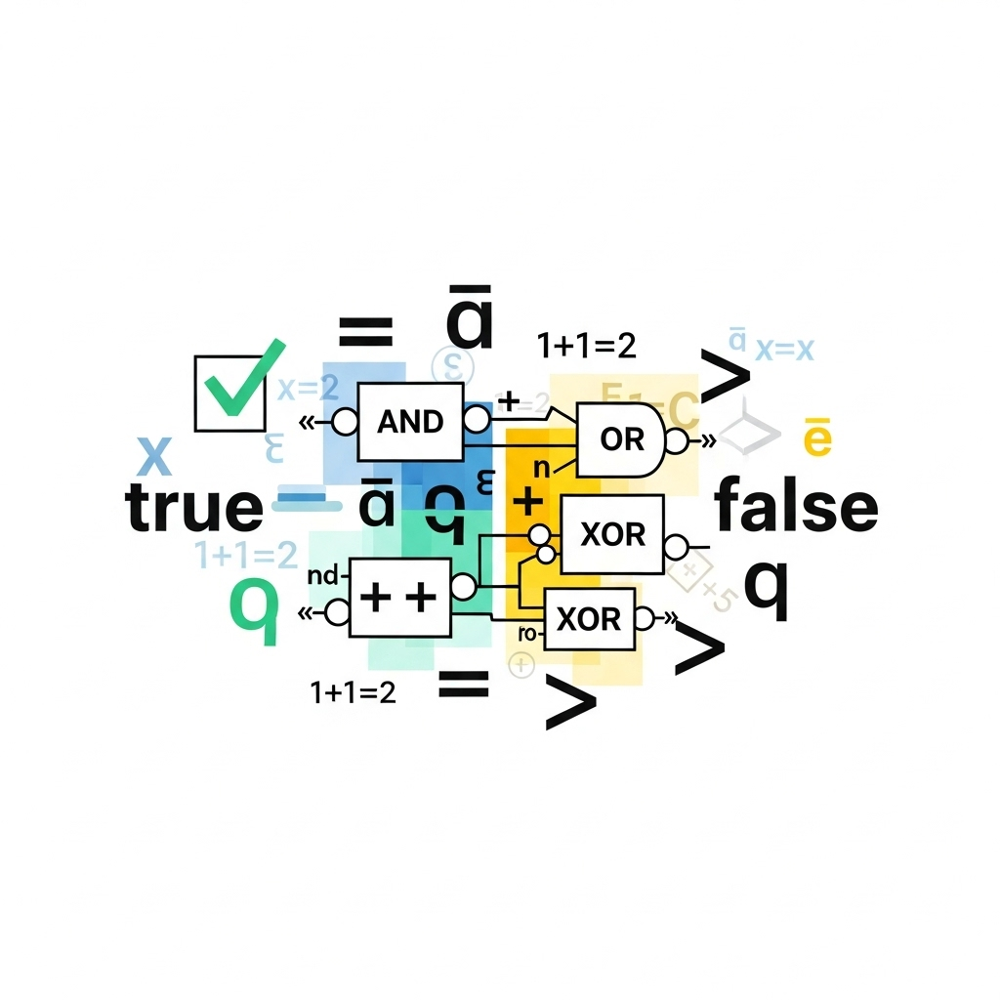
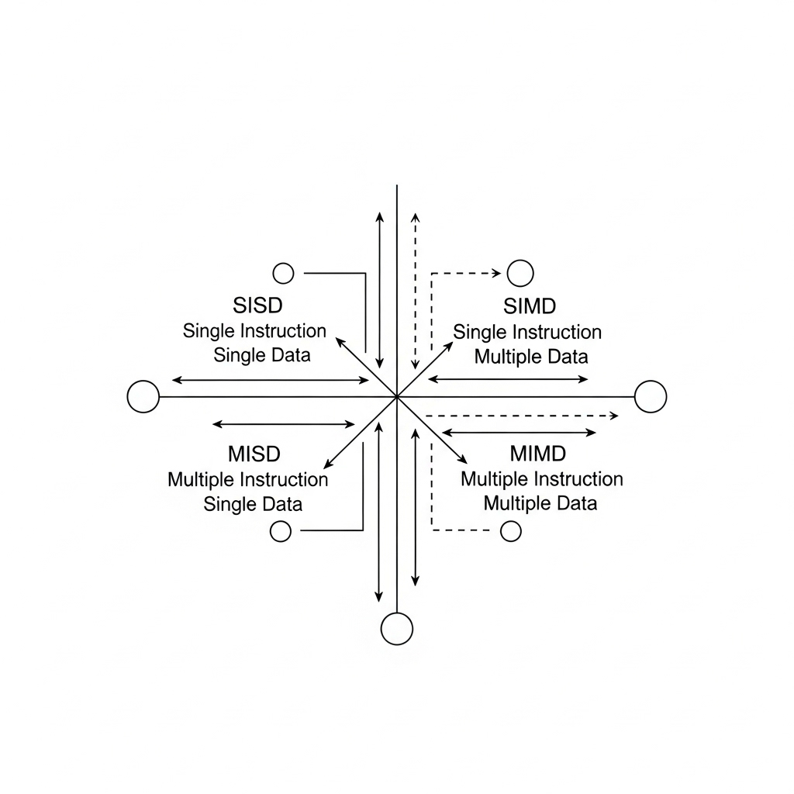
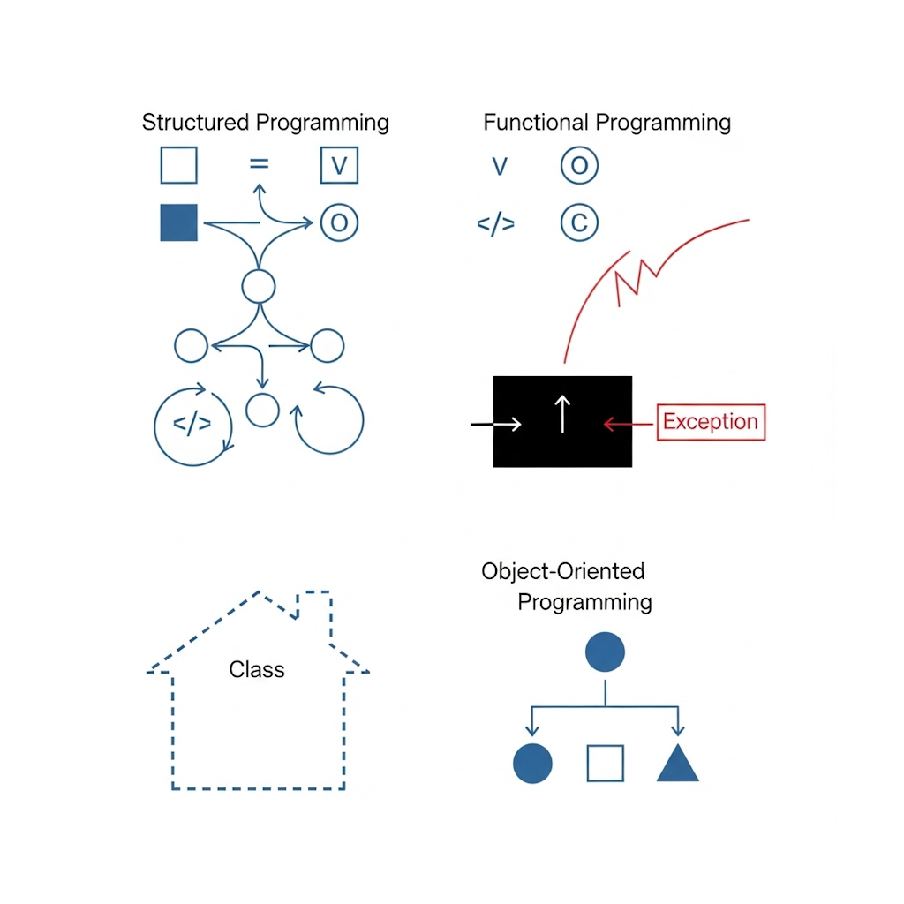

# Prolog

Dieser erste Foliensatz umfasst die folgenden Inhalte:

1. Voraussetzungen
1. Lernziele
1. Kursinhalte
1. Notenrichtlinie
1. Lektorenprofil

---

## Voraussetzungen

Für diesen Kurs in Computer-Simulation sollten Sie ausreichende Kenntnisse in den folgenden Themenbereichen mitbringen:

- **Mathematik** (Logik, Mengenlehre, Algebra, Analysis, Geometrie, Numerik, Stochastik)
- **Informatik** (Zahlensysteme, Zeichenkodierungen, Rechnerarchitekturen, Programmierparadigmen, Entwicklungsmethoden)

---

### Logik

Formalisierung der grundlegenden Prinzipien der mathematischen Beweisführung:

- Wahrheitswerte $t$ und $f$
- Unärer Operator $\neg$
- Binäre Operatoren $\vee$ und $\wedge$
- Schwache Implikation $\Rightarrow$
- Starke Implikation $\Leftrightarrow$

---

### Mengenlehre

Untersuchung von Mengen, also Sammlungen von Objekten, und den Operationen auf diesen:

- Mengen $\emptyset$ und $\mathcal{P}(\cdot)$
- Elementoperatoren $\in$ und $\forall$ sowie $\exists$ und $\nexists$
- Mengenoperatoren $\cup$ und $\cap$ sowie $\setminus$ und $\times$
- Mengenbeziehungen $\subset$ und $\subseteq$
- Tupel $(a, b) \in A \times B$

---

### Zahlensysteme

Darstellung von Zahlen abhängig zu einer definierten Basis (z.B. 2 und 10 sowie 16):

- Binärzahlen (z.B. $0$ und $1$ sowie $1010$ und $1011$)
- Dezimalzahlen (z.B. $0$ und $1$ sowie $10$ und $11$)
- Hexadezimalzahlen (z.B. $0$ und $1$ sowie $A$ und $B$)

---

### Zeichenkodierungen

Darstellung von Zeichen und anderer Symbole aus der Schriftsprache verschiedener Kulturen:

- American Standard Code for Information Interchange (ASCII)
- American National Standards Institute Code (ANSI-Code)
- Universal Coded Character Set Transformation Format (UTF)

---

### Rechnerarchitekturen

Anordnung, Verknüpfung und Funktionsweise der Komponenten eines digitalen Rechners:

- **Von-Neumann-Architektur** (CPU, Bussystem, Speicherwerk, Ein-/Ausgabewerk)
- **Harvard-Architektur** (strikte Trennung von Daten- und Befehlsspeicher)

---

### Rechnerarchitekturen (cont'd)

Klassifizierung der unterschiedlichen Rechnerarchitekturen nach Michael J. Flynn (1966):

- **Single Instruction, Single Data** (SISD; klassische Einkernrechner)
- **Single Instruction, Multiple Data** (SIMD; Vektorrechner)
- **Multiple Instruction, Single / Multiple Data** (Großrechner)

---

### Programmierparadigmen

- **Strukturierte Programmierung** (Verzweigungen und Schleifen)
- **Funktionale Programmierung** (Funktionen, Übergabewerte, Rückgabewerte)
- **Objektorientierte Program-mierung** (Schnittstellen, Klassen, Vererbung, Instanziierung, Polymorphismus)

---

## Lernziele

Die Teilnehmer*innen sollten nach erfolgreichem absolvieren dieses Kurses die folgenden Fähigkeiten entwickelt haben:

- Auswahl einer geeigneten Modellart und Bildung eines geeigneten Modells für einen gegebenen Anwendungsfall
- Auswahl einer geeigneten Lösungsmethode und Anwendung der Methode auf ein definiertes Modell
- Umsetzung des Modells und der Lösungsmethode in einem Computer-Programm mit grafischer Benutzerschnittstelle
- Visualisierung der Daten den Computer-Programms mittles Charts und 2D- bzw. 3D-Ansichten

---

## Kursinhalte

Dieser Kurs umfasst daraus abgeleitet die folgenden Kapitel:

1. [Einführung](../01_Einführung/)
1. Statische Modelle
   1. [2D](../02_Statische_Modelle_2D/)
   1. [3D](../03_Statische_Modelle_3D/)
1. Dynamische Modelle
   1. [Kontinuierlich](../04_Dynamische_Modelle_Kontinuierlich/)
   1. [Diskret](../05_Dynamische_Modelle_Diskret/)
   1. [Hybrid](../06_Dynamische_Modelle_Hybrid/)

---

## Notenrichtlinie

Für die Benotung in diesem Kurs gelten die folgenden Modalitäten:

- Projektarbeit alleine oder in Zweiergruppen
- Bewertungskriterien
  - Umfang und Schwierigkeit der Aufgabenstellung
  - Güte der Umsetzung
  - Güte der Dokumentation

---

## Lektorenprofil

**Dr. Georg Hackenberg**, *Professor für Informatik und Industriesysteme*

Fakultät für Technik und angewandte Naturwissenschaften, Fachhochschule Oberösterreich, Campus Wels

Büro: A | O2 - 030
E-Mail: georg.hackenberg@fh-wels.at