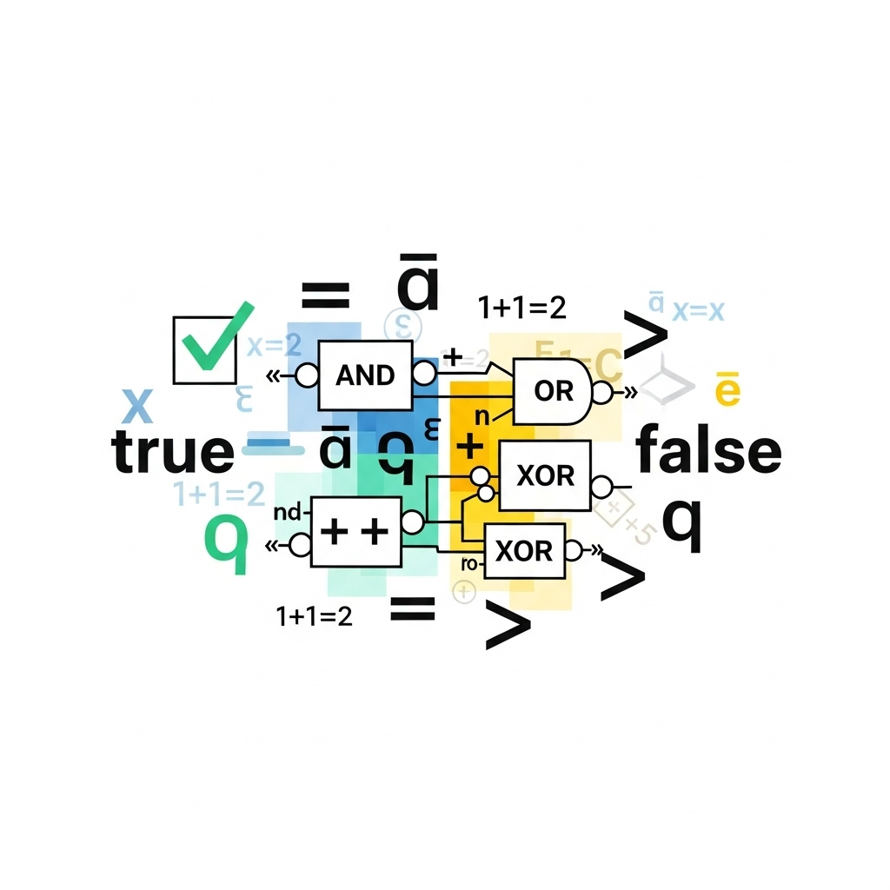
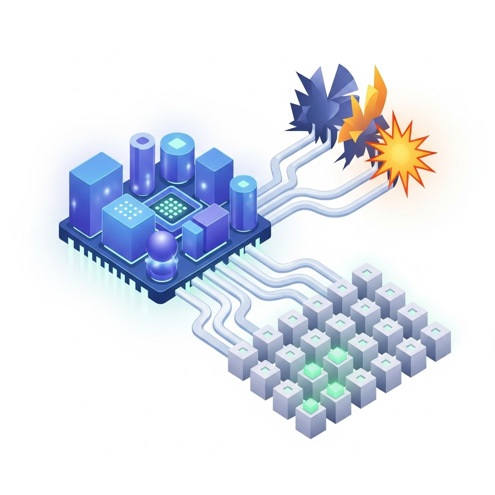
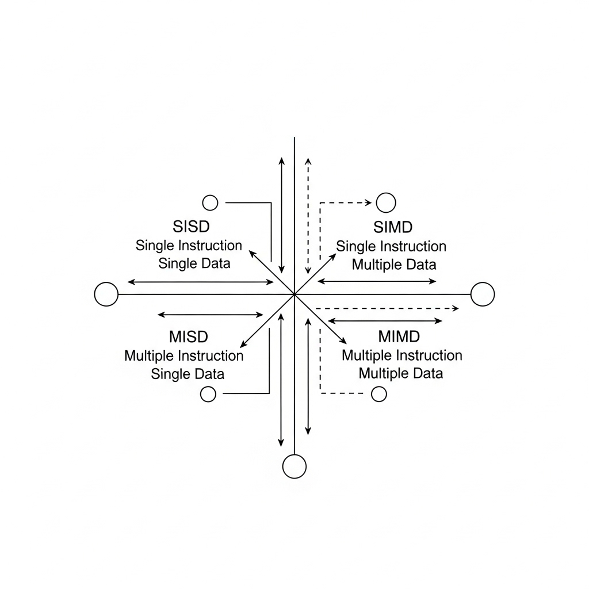
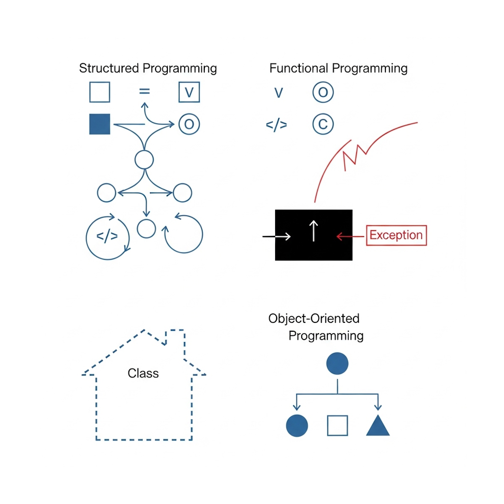
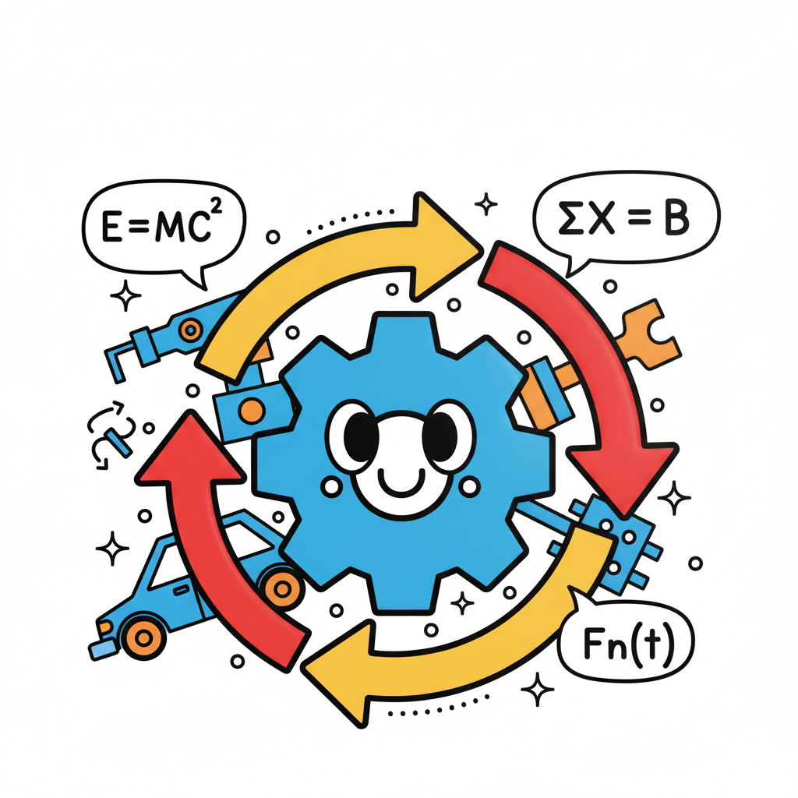

<!-- _paginate: false -->
<!-- _header: "" -->
<!-- _footer: "" -->

# Prolog

Dieser erste Foliensatz umfasst die folgenden Inhalte:

1. Voraussetzungen
1. Lernziele
1. Kursinhalte
1. Kursstruktur & Notenmodell
1. Lektorenprofil

---

## Voraussetzungen

Für diesen Kurs in Computer-Simulation sollten Sie ausreichende Kenntnisse in den folgenden Themenbereichen mitbringen:

- **Mathematik** (Logik, Mengenlehre, Algebra, Analysis, Geometrie, Numerik, Stochastik)
- **Informatik** (Zahlensysteme, Zeichenkodierungen, Rechnerarchitekturen, Programmierparadigmen, Entwicklungsmethoden)

---

### Logik

Formalisierung der Prinzipien mathematischer Beweisführung:

- **Wahrheitswerte:** $\mathrm{true}$ ($t$, wahr, $1$) und $\mathrm{false}$ ($f$, falsch, $0$)
- **Negation (unär):** $\neg A$ (Nicht-Operator)
- **Junktoren (binär):** Konjunktion $A \wedge B$ (Und), Disjunktion $A \vee B$ (Oder)
- **Konditional (Implikation):** $A \Rightarrow B$ (Wenn $A$, dann $B$; hinreichende Bedingung)
- **Bikonditional (Äquivalenz):** $A \Leftrightarrow B$ (Genau dann, wenn; logische Gleichheit)

---

### Mengenlehre

Untersuchung von Mengen als Sammlungen von Objekten:

- **Grundmengen:** Leere Menge $\emptyset$, Potenzmenge $\mathcal{P}(M) = \{U \mid U \subseteq M\}$
- **Elementrelation:** $x \in M$ (Element von), $x \notin M$ (kein Element von)
- **Prädikatenquantoren:** $\forall$ (Allquantor: „für alle“), $\exists$ (Existenzquantor: „es existiert“), $\nexists$ („existiert nicht“)
- **Mengenoperationen:** Vereinigung $A \cup B$, Schnitt $A \cap B$, Differenz $A \setminus B$, kartesisches Produkt $A \times B$
- **Mengenrelationen:** Teilmenge $A \subseteq B$, echte Teilmenge $A \subset B$
- **Geordnetes Tupel:** $(a, b) \in A \times B$

---

### Zahlensysteme

Darstellung von Zahlen abhängig zu einer definierten Basis (z.B. 2 und 10 sowie 16):

- Binärzahlen (z.B. $0$ und $1$ sowie $1010$ und $1011$)
- Dezimalzahlen (z.B. $0$ und $1$ sowie $10$ und $11$)
- Hexadezimalzahlen (z.B. $0$ und $1$ sowie $A$ und $B$)

---

### Zeichenkodierungen

Darstellung von Zeichen und anderer Symbole aus der Schriftsprache verschiedener Kulturen:

- American Standard Code for Information Interchange (ASCII)
- American National Standards Institute Code (ANSI-Code)
- Universal Coded Character Set Transformation Format (UTF)

---

### Rechnerarchitekturen

Anordnung, Verknüpfung und Funktionsweise der Komponenten eines digitalen Rechners:

- **Von-Neumann-Architektur** (CPU, Bussystem, Speicherwerk, Ein-/Ausgabewerk)
- **Harvard-Architektur** (strikte Trennung von Daten- und Befehlsspeicher)

---

### Rechnerarchitekturen (cont'd)

Klassifizierung der unterschiedlichen Rechnerarchitekturen nach Michael J. Flynn (1966):

- **Single Instruction, Single Data** (SISD; klassische Einkernrechner)
- **Single Instruction, Multiple Data** (SIMD; Vektorrechner)
- **Multiple Instruction, Single / Multiple Data** (Großrechner)

---

### Programmierparadigmen

- **Strukturierte Programmierung** (Verzweigungen und Schleifen)
- **Funktionale Programmierung** (Funktionen, Übergabewerte, Rückgabewerte)
- **Objektorientierte Program-mierung** (Schnittstellen, Klassen, Vererbung, Instanziierung, Polymorphismus)

---

## Lernziele

Die Teilnehmer*innen sollten nach erfolgreichem absolvieren dieses Kurses die folgenden Fähigkeiten entwickelt haben:

- Auswahl einer geeigneten Modellart und Bildung eines geeigneten Modells für einen gegebenen Anwendungsfall
- Auswahl einer geeigneten Lösungsmethode und Anwendung der Methode auf ein definiertes Modell
- Umsetzung des Modells und der Lösungsmethode in einem Computer-Programm mit grafischer Benutzerschnittstelle
- Visualisierung der Daten den Computer-Programms mittles Charts und 2D- bzw. 3D-Ansichten

---

## Kursinhalte (1/2)

Dieser Kurs umfasst die folgenden Themenblöcke:

1. [Einführung](../01_Einführung/)
2. Technische & methodische Grundlagen:
   - [2D-Visualisierung (Pixel)](../02_Visualisierung_2D_Pixel/)
   - [2D-Visualisierung (Vektor)](../03_Visualisierung_2D_Vektor/)
   - [2D-Visualisierung (Diagramme & Graphen)](../04_Visualisierung_2D_Diagramme/)
   - [3D-Visualisierung (OpenGL)](../05_Visualisierung_3D_OpenGL/)
   - [Multithreading](../06_Multithreading/)

---

## Kursinhalte (2/2)

3. Simulationsmodelle:
   - [Statische Modelle](../07_Statische_Modelle/)
   - [Dynamische Modelle (Kontinuierlich)](../08_Dynamische_Modelle_Kontinuierlich/)
   - [Dynamische Modelle (Diskret)](../09_Dynamische_Modelle_Diskret/)
   - [Dynamische Modelle (Hybrid)](../10_Dynamische_Modelle_Hybrid/)
4. [Epilog & Synthese](../11_Epilog/)

---

## Kursstruktur & Arbeitsweise

Die Lehrveranstaltung ist eine **Integrierte Lehrveranstaltung (ILV)** mit 3 ECTS (75 h Workload):

- **Theorie & Live-Hacking (45 min):** Kompakte Vermittlung der mathematischen & technischen Grundlagen.
- **In-Class Sprint (60 min):** Betreute Paarprogrammierung an einem lauffähigen Minimal Viable Product (MVP).
- **Homework Extension (1 Woche):** Autonome Vertiefung im 2er-Team im gewählten Track (Industrie vs. Game).
- **Showcase & Peer-Challenge (20 min):** Rotierende Beamer-Präsentationen und Plenumsdiskussion.

---

### Freie Track-Wahl: Industrie vs. Simulation Game

Für die vertiefenden Laboraufgaben (Stufe B) wählen Sie im 2er-Team frei zwischen zwei gleichwertigen Pfaden:

#### Track A: Industrie & Mechatronik
- Reale Sondermaschinen, Prüfstände und Digitale Zwillinge.
- *Themen:* Hydraulikzylinder, CPU-Kühler, CAD-Fachwerke, Prüfstände, SCARA-Roboter.

#### Track B: Simulation Game
- Interaktive Physik-Spiele, Arcade-Klassiker und visuelle Effekte.
- *Themen:* Retro Artillery Duel, Doom Fire & Lava, Space Radar, Racing HUD, Claw Crane.

> Beide Tracks basieren auf identischen mathematisch-numerischen Prinzipien (je 10 Punkte).

---

## Das 3-Säulen-Notenmodell

Transparente Beurteilung von Theorie, praktischer Implementierung und wissenschaftlichem Diskurs:

**Säule 1: Theorie & Numerik (30 %)**
- 4 Moodle-Präsenztests (je 7,5 %)
- Fehlerdiagnose & Stabilitätsgrenzen
- Formelverständnis & Berechnungsfragen

**Säule 2: Praxis & Diskurs (30 %)**
- 4 Übungsmeilensteine (je 3,75 %)
- 15 % Showcase-Demo & Stresstest
- 15 % Peer-Review & Plenumsfragen

**Säule 3: Semesterprojekt (40 %)**
- Ganzheitlicher Digitaler Zwilling im 2er-Team
- 10 % Software-Architektur (Goldene Regel)
- 10 % Physikalische Validierung
- 20 % Mündliche Teamverteidigung (Oral Defense)

**Bestehenskriterium:**
- Gesamtnote $\ge 50\,\%$ sowie mind. $50\,\%$ in jeder Säule.

---

### Showcase-Kultur & Peer-Challenge

Zu Beginn jedes Folgetermins demonstrieren zwei zufällig ausgewählte Teams ihre Lösung live am Beamer:

#### Showcase & Micro-Defense (Säule 2a)
- **Live-Demonstration:** Flüssig laufende Simulation ($\ge 30\,\text{FPS}$) im Hörsaal.
- **Code-Inspection:** Exakte Begründung jeder Codezeile (kein blindes „Vibe Coding“!).
- **Live-Parameter-Stresstest:** Ad-hoc-Modifikation (z. B. Schrittweite verzehnfachen).

#### Peer-Review & Fragenkultur (Säule 2b)
- **Kritisches Auditorium:** Das Plenum prüft Konsistenz, Erhaltungssätze und Stabilität.
- **Enttarnung von Schein-Animationen:** Echte Physik-DGL statt reiner UI-Animation!
- **Aktive Beteiligung:** Fundierte Fachfragen fließen direkt in die Teilnote von Säule 2b ein.

---

## Lektorenprofil

**Dr. Georg Hackenberg**, *Professor für Informatik und Industriesysteme*

Fakultät für Technik und angewandte Naturwissenschaften, Fachhochschule Oberösterreich, Campus Wels

Büro: A | O2 - 030
E-Mail: georg.hackenberg@fh-wels.at