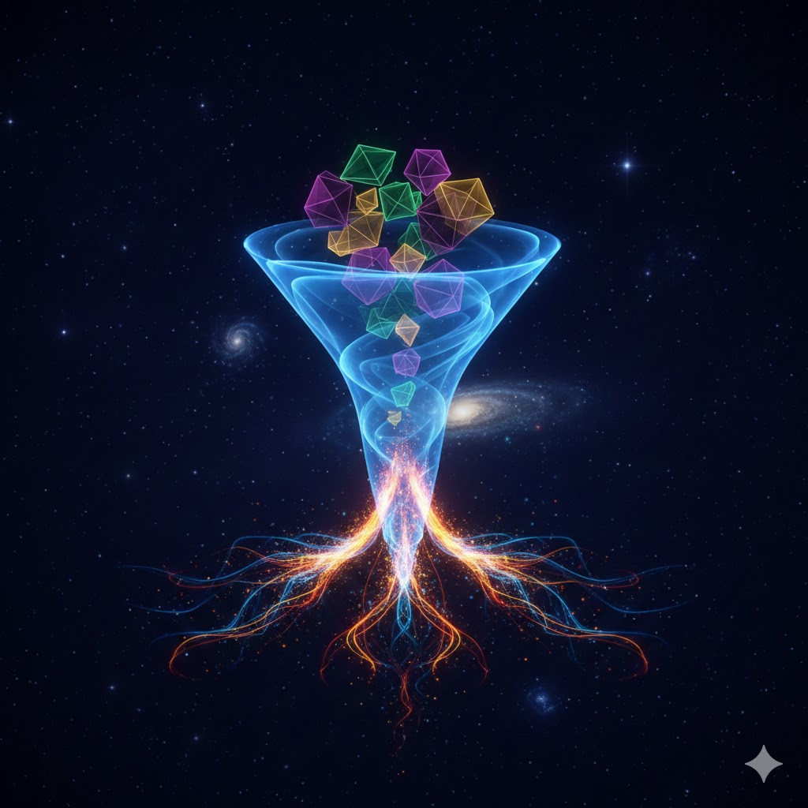

# Kapitel 1: Systemsimulation und den Digitalen Zwilling

- 1.1: Motivation
- 1.2: Arten von Modellen
- 1.3: Lösungsmethoden
- 1.4: Visualisierung von Simulationsdaten
- 1.5: Der Digitale Zwilling
- 1.6: Simulation & Digitaler Zwilling

---

<!-- Abstrakte Illustration, die die Motivation zur Simulation darstellt. Ein stilisiertes menschliches Gehirn mit leuchtenden Linien, die zu verschiedenen Ingenieursymbolen (Zahnräder, Schaltungen, Brücken) führen. Keine Beschriftung oder Text. Hintergrund ist eine dunkle Galaxie. -->

## 1.1: Motivation

Dieser Abschnitt beinhaltet das Folgende:

- TODO Kurze Übersicht über den Abschnitt

---

<div class="columns">
<div>

### Was ist ein Modell?

Ein **Modell** ist eine vereinfachte, abstrakte Darstellung eines realen Systems oder Prozesses.

> "All models are wrong, but some are useful."
> -- George E. P. Box

Es erfasst die wesentlichen Aspekte, die für eine bestimmte Fragestellung relevant sind, und vernachlässigt unwesentliche Details.

</div>
<div>


</div>
</div>

---

<div class="columns">
<div class="two">

### Was ist eine Simulation?

Eine **Simulation** ist das Durchführen von Experimenten mit einem Modell.

- Das Modell wird mit Eingabedaten (Parametern) versehen.
- Das Verhalten des Modells über die Zeit oder unter bestimmten Bedingungen wird berechnet.
- Die Ergebnisse werden analysiert, um Rückschlüsse auf das reale System zu ziehen.

Simulation ermöglicht es uns, "Was-wäre-wenn"-Szenarien zu untersuchen.

</div>
<div>


</div>
</div>

---

### Praktische Fragestellungen

Mithilfe von Modellen und Simulationen können wir komplexe Fragen beantworten, bevor wir reale Systeme bauen oder verändern.

<div class="columns top">
<div class="one">

**Maschinenbau**
- Wie verhält sich eine Brücke unter Last?
- Wie kann der Energieverbrauch eines Roboters optimiert werden?
- Wie müssen die Komponenten eines Motors dimensioniert sein?

</div>
<div class="one">

**Produktion & Logistik**
- Was ist der optimale Materialfluss in einer Fabrik?
- Wie viele fahrerlose Transportfahrzeuge (AGVs) werden benötigt?
- Wie wirkt sich ein Maschinenausfall auf die Gesamtproduktion aus?

</div>
</div>

---

### Praktische Fragestellungen

<div class="columns top">
<div class="one">

**Verfahrenstechnik**
- Wie verteilt sich die Temperatur in einem Reaktor?
- Wie kann der Schadstoffausstoß eines Kraftwerks minimiert werden?

</div>
<div class="one">

**Elektrotechnik**
- Wie verhält sich eine Schaltung bei Spannungs-schwankungen?
- Wie ist das Abstrahlverhalten einer Antenne?

</div>
<div class="one">

**Informatik**
- Wie ist die Antwortzeit eines Servers unter Last?
- Wie trainiert man ein autonomes Fahrzeug sicher?

</div>
</div>

---

### Nutzen der Simulation

- **Kostenreduktion**: Virtuelle Tests sind günstiger als reale Prototypen.
- **Risikominimierung**: Gefährliche Szenarien können sicher getestet werden.
- **Machbarkeitsanalyse**: Ideen können frühzeitig auf ihre Umsetzbarkeit geprüft werden.
- **Optimierung**: Bestehende Systeme können verbessert werden (z.B. Durchsatz, Energieeffizienz).
- **Verständnisgewinn**: Komplexe Zusammenhänge werden sichtbar und verständlich.
- **Training**: Bediener oder KI-Systeme können in einer sicheren Umgebung trainiert werden.

---

<!-- Abstrakte Illustration, die verschiedene Arten von Modellen darstellt. Eine zentrale Kugel, die sich in verschiedene Pfade verzweigt, die jeweils einen anderen Stil zeigen (z. B. ein Pfad ist eine glatte durchgehende Linie, ein anderer eine Reihe von diskreten Blöcken, ein weiterer Pfad teilt sich zufällig). Keine Beschriftung oder Text. Hintergrund ist eine dunkle Galaxie. -->

## 1.2: Arten von Modellen

Dieser Abschnitt beinhaltet das Folgende:

- TODO Kurze Übersicht über den Abschnitt

---

<div class="columns">
<div>

### Klassifikation von Modellen

Modelle können nach verschiedenen Kriterien klassifiziert werden. Die Wahl des Modelltyps hängt stark von der Problemstellung und dem zu untersuchenden System ab.

</div>
<div>


</div>
</div>

---

### Statische vs. Dynamische Modelle

<div class="columns top">
<div class="one">

**Statische Modelle**
- Beschreiben den Zustand eines Systems in einem einzigen Augenblick (im Gleichgewicht).
- Sind zeitunabhängig.
- Typische Fragestellung: Wie verformt sich ein Bauteil unter einer konstanten Last?
- Mathematisch: Oft algebraische Gleichungen (z.B. lineares Gleichungssystem).
- **Beispiel**: Statik eines Fachwerks.

</div>
<div class="one">

**Dynamische Modelle**
- Beschreiben das Verhalten eines Systems über die Zeit.
- Sind zeitabhängig.
- Typische Fragestellung: Wie schwingt ein Pendel nach dem Anstoßen?
- Mathematisch: Oft Differentialgleichungen (kontinuierlich) oder Zustandsautomaten (diskret).
- **Beispiel**: Flugbahn eines Balls.

</div>
</div>

---

### Kontinuierliche vs. Diskrete Modelle

Diese Unterscheidung ist vor allem bei **dynamischen Modellen** relevant.

<div class="columns top">
<div class="one">

**Kontinuierliche Modelle**
- Die Zustandsgrößen (z.B. Position, Temperatur) können sich zu jedem beliebigen Zeitpunkt ändern.
- Die Zustandsgrößen nehmen Werte aus einem kontinuierlichen Bereich an.
- Mathematisch: Differentialgleichungen (DGLs).
- **Beispiel**: Füllstand eines Wassertanks, Schwingung eines Federpendels.

</div>
<div class="one">

**Diskrete Modelle**
- Die Zustandsgrößen ändern sich nur zu bestimmten, einzelnen Zeitpunkten.
- Die Zustandsgrößen nehmen oft Werte aus einem diskreten Bereich an.
- Mathematisch: Differenzengleichungen, Ereignislisten.
- **Beispiel**: Warteschlange an einer Kasse, Produktionsablauf.

</div>
</div>

---

### Kontinuierliche vs. Diskrete Modelle

<div class="columns top">
<div class="one">

**Kontinuierliche Modelle**


</div>
<div class="one">

**Diskrete Modelle**


</div>
</div>

---

### Zeitdiskrete vs. Ereignisdiskrete Modelle

Diskrete Modelle können weiter unterteilt werden:

<div class="columns">
<div class="one">

**Zeitdiskret (konstanter Zeitschritt)**
- Zustandsänderungen erfolgen in festen, äquidistanten Zeitintervallen ($\Delta t$).
- Typisch für digitale Regelungen oder wenn ein kontinuierliches System abgetastet wird.
- **Beispiel**: Abtastung eines analogen Signals mit einem A/D-Wandler.

</div>
<div class="one">

**Ereignisdiskret**
- Zustandsänderungen werden durch das Eintreten von **Ereignissen** (Events) ausgelöst.
- Die Zeit schreitet von einem Ereignis zum nächsten.
- **Beispiel**: Ankunft eines Kunden in einer Warteschlange, Fertigstellung eines Teils auf einer Maschine.

</div>
</div>

---

### Zeitdiskrete vs. Ereignisdiskrete Modelle

<div class="columns">
<div class="one">

**Zeitdiskret (konstanter Zeitschritt)**


</div>
<div class="one">

**Ereignisdiskret**


</div>
</div>

---

### Deterministische vs. Stochastische Modelle

<div class="columns top">
<div class="one">

**Deterministische Modelle**
- Der Ablauf der Simulation ist bei gleichen Anfangsbedingungen und Parametern immer identisch.
- Es gibt keine Zufallseinflüsse.
- **Beispiel**: Berechnung der Planetenbahnen, ideales Federpendel ohne Reibung.

</div>
<div class="one">

**Stochastische Modelle**
- Enthalten zufällige Elemente. Jede Simulation liefert ein anderes (aber statistisch ähnliches) Ergebnis.
- Werden verwendet, wenn Prozesse nicht exakt vorhersagbar sind.
- Erfordern oft mehrere Simulationsläufe (Monte-Carlo-Simulation), um statistische Aussagen treffen zu können.
- **Beispiel**: Simulation einer Warteschlange mit zufälligen Ankunftszeiten, Simulation von Aktienkursen.

</div>
</div>

---

### Deterministische vs. Stochastische Modelle

<div class="columns top">
<div class="one">

**Deterministische Modelle**


</div>
<div class="one">

**Stochastische Modelle**


</div>
</div>

---

<!-- Abstrakte Illustration, die verschiedene Lösungsmethoden für Modelle darstellt. Ein komplexer, verworrener Knoten von Linien auf der einen Seite, der auf der anderen Seite durch eine stilisierte Lupe in eine saubere, gerade Linie entwirrt wird. Keine Beschriftung oder Text. Hintergrund ist eine dunkle Galaxie. -->

## 1.3: Lösungsmethoden

Dieser Abschnitt beinhaltet das Folgende:

- TODO Kurze Übersicht über den Abschnitt

---

### Wie lösen wir die Modellgleichungen?

Sobald das mathematische Modell aufgestellt ist (z.B. als Satz von Differentialgleichungen), muss es gelöst werden, um das Systemverhalten zu berechnen.

Es gibt zwei grundlegende Ansätze:
1.  **Analytische Lösung**
2.  **Numerische Lösung**

---

### Analytische Lösung

- **Was ist das?** Eine exakte, geschlossene mathematische Formel für die Lösung.
- **Beispiel (freier Fall):** Die Höhe $y(t)$ eines Objekts zum Zeitpunkt $t$ ist $y(t) = y_0 + v_0 t - \frac{1}{2} g t^2$.
- **Vorteile:**
    - Exakt und präzise.
    - Liefert allgemeines Verständnis über den Einfluss von Parametern.
- **Nachteile:**
    - Nur für relativ einfache, oft lineare Systeme möglich.
    - Sobald Komplexität steigt (z.B. Luftwiderstand, nichtlineare Kräfte), oft nicht mehr findbar.

---

### Numerische Lösung

- **Was ist das?** Eine schrittweise, approximative Berechnung der Lösung.
- **Beispiel (Euler-Verfahren für $y' = f(t, y)$):**
  $y_{k+1} = y_k + \Delta t \cdot f(t_k, y_k)$
- Man startet bei einem bekannten Zustand und berechnet den nächsten Zustand in einem kleinen Zeitschritt $\Delta t$.
- **Vorteile:**
    - Auf sehr komplexe, nichtlineare Systeme anwendbar.
    - Flexibel und universell einsetzbar.
- **Nachteile:**
    - Ist immer eine Annäherung (Approximation).
    - Führt numerische Fehler ein (Diskretisierungsfehler, Rundungsfehler).
    - Die Wahl des Algorithmus und der Parameter (z.B. Schrittweite $\Delta t$) ist entscheidend für Genauigkeit und Stabilität.

---

### Analytisch vs. Numerisch: Ein Beispiel

**Problem:** Schiefer Wurf

<div class="columns top">
<div class="one">

**Analytische Lösung (ohne Luftwiderstand)**
- Einfache Parabelbahn.
- Formeln für Wurfweite, Wurfhöhe, Flugdauer etc. können direkt hergeleitet werden.
- $x(t) = v_0 \cos(\alpha) t$
- $y(t) = v_0 \sin(\alpha) t - \frac{1}{2} g t^2$

</div>
<div class="one">

**Numerische Lösung (mit Luftwiderstand)**
- Luftwiderstand $F_R \propto v^2$ macht die DGL nichtlinear.
- Keine einfache geschlossene Formel mehr.
- Lösung durch schrittweise Berechnung von Position und Geschwindigkeit unter Berücksichtigung von Schwerkraft und Luftwiderstand.

</div>
</div>

Fast alle praxisrelevanten Simulationen basieren auf numerischen Methoden.

### Die Grafik-Pipeline (vereinfacht)

Der Weg von der 3D-Szene zum 2D-Bild auf dem Monitor.

1.  **Vertex Processing**: Die 3D-Koordinaten der Eckpunkte (Vertices) werden in 2D-Bildschirmkoordinaten umgerechnet (Projektion).
2.  **Rasterization**: Die Dreiecke werden in "Fragmente" zerlegt. Ein Fragment ist ein Kandidat für ein Pixel auf dem Bildschirm.
3.  **Fragment Processing**: Für jedes Fragment wird die endgültige Farbe berechnet (unter Berücksichtigung von Texturen, Beleuchtung etc.).
4.  **Testing & Blending**: Das Fragment wird auf den Bildschirm geschrieben (z.B. Z-Buffer-Test, um verdeckte Objekte zu entfernen).

Moderne GPUs erlauben es, die Schritte 1 und 3 mit eigenen kleinen Programmen, den **Shadern**, zu steuern.

---

<!-- Abstrakte Illustration, die die Visualisierung von Simulationsdaten symbolisiert. Abstrakte geometrische Formen (Würfel, Kugeln), die sich von einer Wolke aus Datenpunkten in eine klare 3D-Struktur verwandeln. Keine Beschriftung oder Text. Hintergrund ist eine dunkle Galaxie. -->

## 1.4: Visualisierung von Simulationsdaten

Dieser Abschnitt beinhaltet das Folgende:

- TODO Kurze Übersicht über den Abschnitt

---

### Warum Visualisierung?

Simulationsläufe produzieren riesige Datenmengen (Zustände, Zeitreihen, ...).

> "Ein Bild sagt mehr als tausend Zahlen."

Visualisierung ist essenziell, um:
- **Ergebnisse verständlich zu machen**: Muster und Trends erkennen, die in reinen Zahlenkolonnen verborgen sind.
- **Modelle zu validieren**: Passt das simulierte Verhalten zu den Erwartungen? Gibt es unerwartete Effekte?
- **Ergebnisse zu kommunizieren**: Einem breiteren Publikum (z.B. Management, Kunden) die Erkenntnisse präsentieren.
- **Interaktiv zu explorieren**: Parameter ändern und die Auswirkungen sofort visuell sehen.

---

### Von einfachen Diagrammen zu komplexen Szenen

<div class="columns top">
<div class="one">

**1. Einfache Diagramme (Plots)**
- Darstellung von einer Größe über einer anderen (oft über die Zeit).
- z.B. Temperaturverlauf, Position vs. Zeit.
- Bibliotheken: `ScottPlot`, `OxyPlot`.

</div>
<div class="one">

**2. 2D-Visualisierungen**
- Darstellung von räumlichen Daten in einer Ebene.
- Oft Vektorgrafiken.
- z.B. Plan einer Fabrikhalle, Verformung eines 2D-Fachwerks, Strömungsfeld.
- Technologie: `WPF Canvas`.

</div>
<div class="one">

**3. 3D-Visualisierungen**
- Darstellung von räumlichen Daten in einer dreidimensionalen Szene.
- z.B. 3D-Modell eines Roboters, Visualisierung eines Gebäudes, Molekülstrukturen.
- Technologie: `SharpGL`, `Helix Toolkit`.

</div>
</div>

---

<div class="columns">
<div>

### 2D-Visualisierung

- Basiert auf dem Zeichnen von geometrischen Primitiven (Linien, Kreise, Polygone) in einem 2D-Koordinatensystem.
- Transformationen sind notwendig, um von "Weltkoordinaten" (z.B. Meter) zu "Bildschirmkoordinaten" (z.B. Pixel) zu kommen.
    - **Skalierung**: Vergrößern/Verkleinern
    - **Translation**: Verschieben
    - **Rotation**: Drehen

</div>
<div>

```csharp
// Beispiel: Zeichnen einer Linie
// in 2D mit WPF Canvas

var line = new Line
{
    X1 = worldToScreenX(0.0),
    Y1 = worldToScreenY(0.0),
    X2 = worldToScreenX(1.0),
    Y2 = worldToScreenY(2.5),
    Stroke = Brushes.Red,
    StrokeThickness = 2
};

myCanvas.Children.Add(line);
```

</div>
</div>

---

<div class="columns">
<div>

### 3D-Visualisierung

- Deutlich komplexer als 2D.
- Eine 3D-Szene besteht aus:
    - **Objekten**: Definierte durch Vertices (Eckpunkte) und Flächen (Polygone, meist Dreiecke).
    - **Materialien**: Wie reflektiert das Objekt Licht? (Farbe, Textur, Glanz)
    - **Lichtquellen**: Ohne Licht ist alles schwarz.
    - **Kamera**: Definiert den Blickpunkt, die Blickrichtung und das Sichtfeld.

</div>
<div>

```csharp
// Beispiel: Zeichnen einer Linie
// in 3D mit SharpGL/OpenGL

var gl = openGLControl.OpenGL;

gl.Begin(OpenGL.GL_LINES);

// Startpunkt der Linie
gl.Color(1.0f, 0.0f, 0.0f); // Rot
gl.Vertex(0.0f, 0.0f, 0.0f);

// Endpunkt der Linie
gl.Color(0.0f, 1.0f, 0.0f); // Grün
gl.Vertex(1.0f, 1.0f, 1.0f);

gl.End();
```

</div>
</div>

---

### Schnittstelle zur Grafikkarte: OpenGL

- **OpenGL** (Open Graphics Library) ist eine plattform- und programmiersprachenübergreifende API zur Entwicklung von 2D- und 3D-Grafikanwendungen.
- Sie stellt einen standardisierten Weg bereit, um mit dem **Grafikprozessor (GPU)** zu kommunizieren.
- Die Anwendung sendet Befehle an die GPU (z.B. "zeichne dieses Dreieck mit dieser Farbe"), und die GPU führt diese hochgradig parallel und extrem schnell aus.
- Bibliotheken wie `SharpGL` sind "Wrapper" um OpenGL, die die Nutzung in C# vereinfachen.

---

### Die Grafik-Pipeline (vereinfacht)

Der Weg von der 3D-Szene zum 2D-Bild auf dem Monitor.

1.  **Vertex Processing**: Die 3D-Koordinaten der Eckpunkte (Vertices) werden in 2D-Bildschirmkoordinaten umgerechnet (Projektion).
2.  **Rasterization**: Die Dreiecke werden in "Fragmente" zerlegt. Ein Fragment ist ein Kandidat für ein Pixel auf dem Bildschirm.
3.  **Fragment Processing**: Für jedes Fragment wird die endgültige Farbe berechnet (unter Berücksichtigung von Texturen, Beleuchtung etc.).
4.  **Testing & Blending**: Das Fragment wird auf den Bildschirm geschrieben (z.B. Z-Buffer-Test, um verdeckte Objekte zu entfernen).

Moderne GPUs erlauben es, die Schritte 1 und 3 mit eigenen kleinen Programmen, den **Shadern**, zu steuern.

---

<!-- Abstrakte Illustration, die das Konzept eines Digitalen Zwillings symbolisiert. Ein physisches Objekt (wie eine Windkraftanlage) auf der einen Seite und eine leuchtende, drahtgitterartige Version davon auf der anderen, zwischen denen Datenströme fließen. Keine Beschriftung oder Text. Hintergrund ist eine dunkle Galaxie. -->

## 1.5: Der Digitale Zwilling

Dieser Abschnitt beinhaltet das Folgende:

- TODO Kurze Übersicht über den Abschnitt

---

### Was ist ein Digitaler Zwilling?

Der Begriff wurde maßgeblich von **Dr. Michael Grieves** (University of Michigan) geprägt.

Ein Digitaler Zwilling ist ein virtuelles Modell, das als digitales Gegenstück zu einem physischen Objekt, Prozess oder System dient.

Es besteht aus drei Kernkomponenten:
1.  Ein **physisches Produkt** in der realen Welt.
2.  Ein **virtuelles Produkt** in der virtuellen Welt.
3.  Eine **Datenverbindung** zwischen dem physischen und dem virtuellen Produkt.

---

### Das Konzept von Grieves

<div class="columns">
<div class="two">

- **Physischer Raum**: Hier existiert das reale Objekt (z.B. eine Windkraftanlage, ein Auto, eine Fertigungsstraße). Sensoren erfassen kontinuierlich Daten über seinen Zustand (z.B. Temperatur, Drehzahl, Position).

- **Virtueller Raum**: Hier existiert das digitale Modell. Es ist eine hochgenaue, multidisziplinäre Repräsentation des physischen Objekts.

- **Datenverbindung**: Der entscheidende Link.
    - Daten fließen vom physischen zum virtuellen Objekt ("Digital Twin Instance").
    - Erkenntnisse, Befehle oder Updates fließen vom virtuellen zum physischen Objekt.

</div>
<div class="one">



</div>
</div>

---

### Mehr als nur ein 3D-Modell

Ein Digitaler Zwilling ist **nicht nur** ein CAD-Modell oder eine 3D-Visualisierung.

Er umfasst:
- **Geometrie**: 3D-Struktur.
- **Physik**: Verhalten unter Last, thermische Eigenschaften, etc. (-> **Simulationsmodelle!**)
- **Daten**: Live-Daten von Sensoren, historische Daten, Wartungsprotokolle.
- **Logik**: Steuerungssoftware, Produktionsregeln.

Ein Digitaler Zwilling "lebt" und entwickelt sich mit seinem physischen Gegenstück über dessen gesamten Lebenszyklus.

---

<!-- Abstrakte Illustration, die die Integration von Simulation und Digitalem Zwilling darstellt. Ein Drahtgitter-Digitalzwilling einer Fabrik mit leuchtenden Partikeln, die durch die Produktionslinien fließen und die Simulation in Aktion zeigen. Keine Beschriftung oder Text. Hintergrund ist eine dunkle Galaxie. -->

## 1.6: Simulation & Digitaler Zwilling

Dieser Abschnitt beinhaltet das Folgende:

- TODO Kurze Übersicht über den Abschnitt

---

### Wo passt die Simulation hinein?

**Simulation ist die Kerntechnologie, die den Digitalen Zwilling zum Leben erweckt.**

- Das **Verhaltensmodell** im virtuellen Raum *ist* ein Simulationsmodell.
- Es ermöglicht dem Digitalen Zwilling, nicht nur den **aktuellen Zustand** darzustellen, sondern auch:
    - das **zukünftige Verhalten** vorherzusagen ("Was passiert, wenn die Last um 10% steigt?").
    - **optimale Betriebsparameter** zu finden ("Was ist die energieeffizienteste Geschwindigkeit?").
    - **Fehler zu diagnostizieren** und deren Ursachen zu finden.
    - **Wartungsbedarf** vorausschauend zu planen (Predictive Maintenance).

---

### Der Lebenszyklus

Simulation spielt in jeder Phase des Produktlebenszyklus eine Rolle, die durch den Digitalen Zwilling verbunden werden.

<div class="columns top">
<div class="one">

**1. Design & Entwicklung**
- Simulation zur Auslegung und Validierung des Produkts.
- Das Ergebnis ist der "digitale Prototyp" oder "Digital Twin Prototype".

</div>
<div class="one">

**2. Produktion & Inbetriebnahme**
- Simulation zur Planung der Fertigung.
- **Virtuelle Inbetriebnahme**: Test der Steuerungssoftware am digitalen Modell, bevor die reale Anlage existiert.

</div>
<div class="one">

**3. Betrieb & Wartung**
- Der "Digital Twin Instance" läuft parallel zum realen Produkt.
- Live-Sensordaten kalibrieren das Simulationsmodell.
- Simulationen sagen Verhalten voraus und optimieren den Betrieb.

</div>
</div>

---

### Beispiel: Virtuelle Inbetriebnahme

<div class="columns top">
<div class="one">

**Traditioneller Ansatz**
1. Mechanik und Elektrik aufbauen.
2. Software-Entwickler kommen zur Baustelle.
3. Software wird an der realen, teuren und potenziell gefährlichen Anlage getestet und in Betrieb genommen.
4. Fehlerbehebung ist zeitaufwändig und teuer.

</div>
<div class="one">

**Ansatz mit Digitalem Zwilling**
1. Parallel zum Aufbau der Mechanik wird ein kinematisches Simulationsmodell (Digitaler Zwilling) erstellt.
2. Software-Entwickler testen die SPS- oder Roboter-Software im Büro gegen das Modell.
3. 90% der Logikfehler werden gefunden, bevor die reale Anlage überhaupt existiert.
4. Deutlich kürzere und sicherere Inbetriebnahmezeit vor Ort.

</div>
</div>

---

# Zusammenfassung Kapitel 1

- **Modelle** sind vereinfachte Abbilder der Realität für einen bestimmten Zweck.
- **Simulation** ist das Experimentieren mit diesen Modellen.
- Modelle können **statisch/dynamisch**, **kontinuierlich/diskret** und **deterministisch/stochastisch** sein.
- **Numerische Methoden** sind der Schlüssel zur Lösung komplexer, realitätsnaher Modelle.
- **Visualisierung** ist entscheidend, um Simulationsergebnisse zu verstehen und zu kommunizieren.
- Ein **Digitaler Zwilling** ist ein virtuelles Abbild eines physischen Objekts, das über dessen Lebenszyklus durch Daten mit ihm verbunden ist.
- **Simulation** ist die treibende Kraft, die es dem Digitalen Zwilling ermöglicht, Verhalten zu analysieren und vorherzusagen.

---

## Ausblick

In den nächsten Kapiteln werden wir uns die verschiedenen Modellarten im Detail ansehen und lernen, wie man sie praktisch umsetzt.

- **Statische Modelle**: Analyse von Fachwerken.
- **Dynamische, kontinuierliche Modelle**: Simulation von Bewegungsgleichungen (z.B. Federpendel).
- **Dynamische, diskrete Modelle**: Simulation von Warteschlangen und Produktionssystemen.

Wir werden für jedes Beispiel die Mathematik, die numerische Lösung und die programmtechnische Umsetzung inklusive Visualisierung betrachten.
