<!-- _paginate: false -->
<!-- _header: "" -->
<!-- _footer: "" -->

# Kapitel 1: Systemsimulation und den Digitalen Zwilling

Dieses Kapitel umfasst das Folgende:

- 1.1: Motivation
- 1.2: Arten von Modellen
- 1.3: Lösungsmethoden
- 1.4: Visualisierung von Simulationsdaten
- 1.5: Der Digitale Zwilling
- 1.6: Simulation & Digitaler Zwilling

---

## 1.1: Motivation

Dieser Abschnitt beinhaltet das Folgende:

- Definition von Modell und Simulation
- Praktische Anwendungsbeispiele aus verschiedenen Ingenieursdisziplinen
- Den Nutzen der Simulation zur Kostenreduktion, Risikominimierung und Optimierung

---

### Was ist ein Modell?

Ein **Modell** ist eine vereinfachte, abstrakte Darstellung eines realen Systems oder Prozesses.

> "All models are wrong, but some are useful."
> -- George E. P. Box

Es erfasst die wesentlichen Aspekte, die für eine bestimmte Fragestellung relevant sind, und vernachlässigt unwesentliche Details.

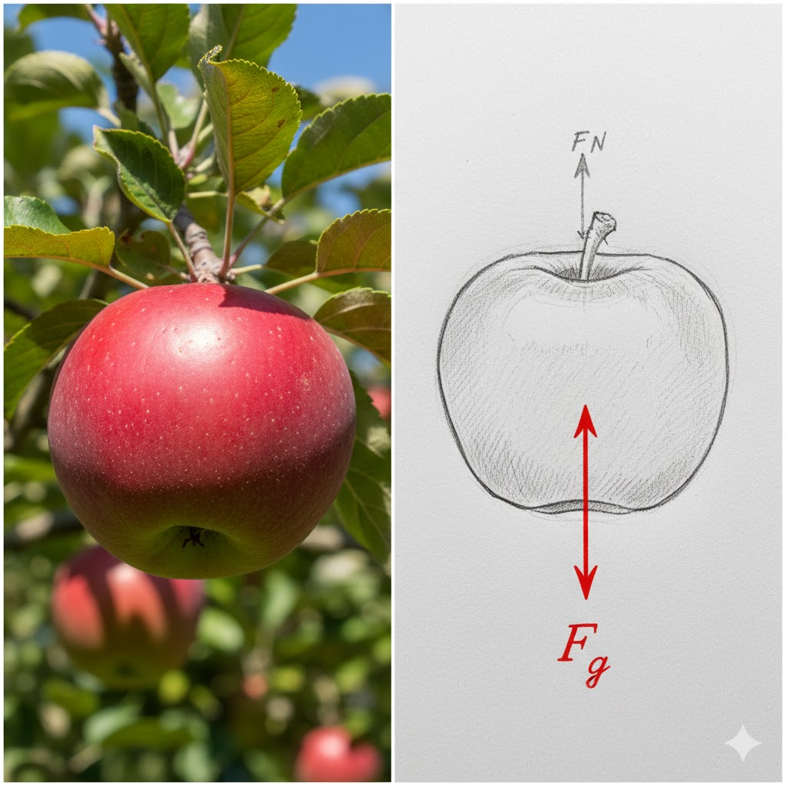

---

### Was ist eine Simulation?

Eine **Simulation** ist das Durchführen von Experimenten mit einem Modell.

- Das Modell wird mit Eingabedaten (Parametern) versehen.
- Das Verhalten des Modells über die Zeit oder unter bestimmten Bedingungen wird berechnet.
- Die Ergebnisse werden analysiert, um Rückschlüsse auf das reale System zu ziehen.

Simulation ermöglicht es uns, "Was-wäre-wenn"-Szenarien zu untersuchen.

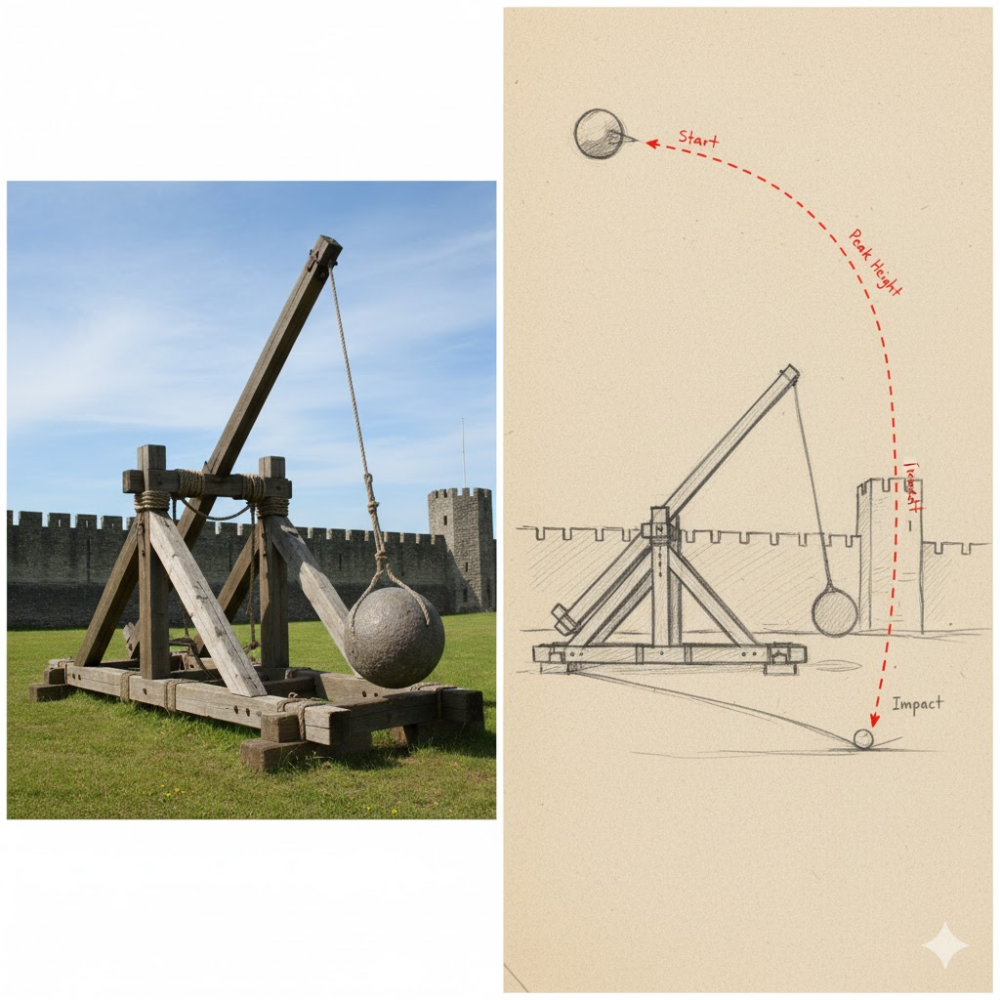

---

### Praktische Fragestellungen

Mithilfe von Modellen und Simulationen können wir komplexe Fragen beantworten, bevor wir reale Systeme bauen oder verändern.

**Maschinenbau**
- Wie verhält sich eine Brücke unter Last?
- Wie kann der Energieverbrauch eines Roboters optimiert werden?
- Wie müssen die Komponenten eines Motors dimensioniert sein?

**Produktion & Logistik**
- Was ist der optimale Materialfluss in einer Fabrik?
- Wie viele fahrerlose Transportfahrzeuge (AGVs) werden benötigt?
- Wie wirkt sich ein Maschinenausfall auf die Gesamtproduktion aus?

---

### Praktische Fragestellungen

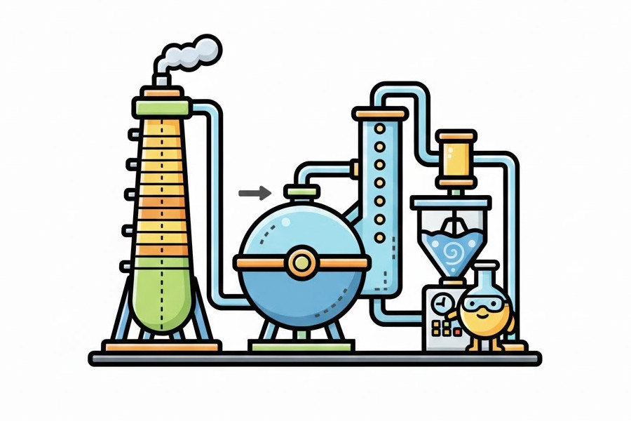

**Verfahrenstechnik**
- Wie verteilt sich die Temperatur in einem Reaktor?
- Wie kann der Schadstoffausstoß eines Kraftwerks minimiert werden?

**Elektrotechnik**
- Wie verhält sich eine Schaltung bei Spannungs-schwankungen?
- Wie ist das Abstrahlverhalten einer Antenne?

**Informatik**
- Wie ist die Antwortzeit eines Servers unter Last?
- Wie trainiert man ein autonomes Fahrzeug sicher?

---

### Nutzen der Simulation

- **Kostenreduktion**: Virtuelle Tests sind günstiger als reale Prototypen.
- **Risikominimierung**: Gefährliche Szenarien können sicher getestet werden.
- **Machbarkeitsanalyse**: Ideen können frühzeitig auf ihre Umsetzbarkeit geprüft werden.
- **Optimierung**: Bestehende Systeme können verbessert werden (z.B. Durchsatz, Energieeffizienz).
- **Verständnisgewinn**: Komplexe Zusammenhänge werden sichtbar und verständlich.
- **Training**: Bediener oder KI-Systeme können in einer sicheren Umgebung trainiert werden.

---

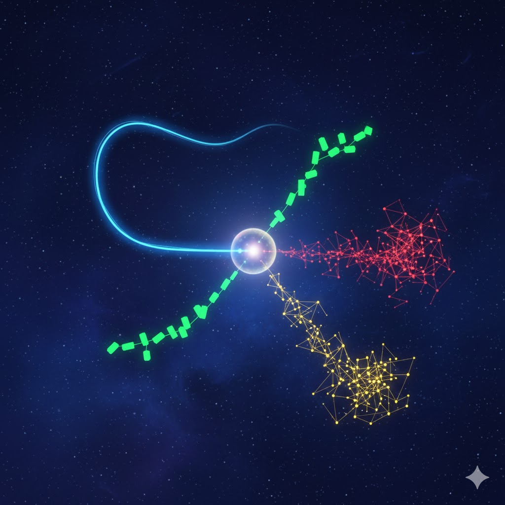

## 1.2: Arten von Modellen

Dieser Abschnitt beinhaltet das Folgende:

- Klassifikation nach Zeitabhängigkeit (statisch vs. dynamisch)
- Klassifikation nach Zustandsänderung (kontinuierlich vs. diskret)
- Klassifikation nach Zufälligkeit (deterministisch vs. stochastisch)

---

### Klassifikation von Modellen

Modelle können nach verschiedenen Kriterien klassifiziert werden:

- Statisch
- Dynamisch
  - Kontinuierlich
  - Diskret
    - Zeit
    - Ereignis
  - Hybrid

Die Wahl des Modelltyps hängt von der Problemstellung und dem zu untersuch-enden System ab.



---

### Statische vs. Dynamische Modelle

**Statische Modelle**
- Beschreiben den Zustand eines Systems in einem einzigen Augenblick (im Gleichgewicht).
- Sind zeitunabhängig.
- Typische Fragestellung: Wie verformt sich ein Bauteil unter einer konstanten Last?
- Mathematisch: Oft algebraische Gleichungen (z.B. lineares Gleichungssystem).
- **Beispiel**: Statik eines Fachwerks.

**Dynamische Modelle**
- Beschreiben das Verhalten eines Systems über die Zeit.
- Sind zeitabhängig.
- Typische Fragestellung: Wie schwingt ein Pendel nach dem Anstoßen?
- Mathematisch: Oft Differentialgleichungen (kontinuierlich) oder Zustandsautomaten (diskret).
- **Beispiel**: Flugbahn eines Balls.

---

### Kontinuierliche vs. Diskrete Modelle

Diese Unterscheidung ist vor allem bei **dynamischen Modellen** relevant.

**Kontinuierliche Modelle**
- Die Zustandsgrößen (z.B. Position, Temperatur) können sich zu jedem beliebigen Zeitpunkt ändern.
- Die Zustandsgrößen nehmen Werte aus einem kontinuierlichen Bereich an.
- Mathematisch: Differentialgleichungen (DGLs).
- **Beispiel**: Füllstand eines Wassertanks, Schwingung eines Federpendels.

**Diskrete Modelle**
- Die Zustandsgrößen ändern sich nur zu bestimmten, einzelnen Zeitpunkten.
- Die Zustandsgrößen nehmen oft Werte aus einem diskreten Bereich an.
- Mathematisch: Differenzengleichungen, Ereignislisten.
- **Beispiel**: Warteschlange an einer Kasse, Produktionsablauf.

---

### Kontinuierliche vs. Diskrete Modelle

**Kontinuierliche Modelle**

**Diskrete Modelle**

---

### Zeitdiskrete vs. Ereignisdiskrete Modelle

Diskrete Modelle können weiter unterteilt werden:

**Zeitdiskret (konstanter Zeitschritt)**
- Zustandsänderungen erfolgen in festen, äquidistanten Zeitintervallen ($\Delta t$).
- Typisch für digitale Regelungen oder wenn ein kontinuierliches System abgetastet wird.
- **Beispiel**: Abtastung eines analogen Signals mit einem A/D-Wandler.

**Ereignisdiskret**
- Zustandsänderungen werden durch das Eintreten von **Ereignissen** (Events) ausgelöst.
- Die Zeit schreitet von einem Ereignis zum nächsten.
- **Beispiel**: Ankunft eines Kunden in einer Warteschlange, Fertigstellung eines Teils auf einer Maschine.

---

### Zeitdiskrete vs. Ereignisdiskrete Modelle

**Zeitdiskret (konstanter Zeitschritt)**

**Ereignisdiskret**

---

### Deterministische vs. Stochastische Modelle

**Deterministische Modelle**
- Der Ablauf der Simulation ist bei gleichen Anfangsbedingungen und Parametern immer identisch.
- Es gibt keine Zufallseinflüsse.
- **Beispiel**: Berechnung der Planetenbahnen, ideales Federpendel ohne Reibung.

**Stochastische Modelle**
- Enthalten zufällige Elemente. Jede Simulation liefert ein anderes (aber statistisch ähnliches) Ergebnis.
- Werden verwendet, wenn Prozesse nicht exakt vorhersagbar sind.
- Erfordern oft mehrere Simulationsläufe (Monte-Carlo-Simulation), um statistische Aussagen treffen zu können.
- **Beispiel**: Simulation einer Warteschlange mit zufälligen Ankunftszeiten, Simulation von Aktienkursen.

---

### Deterministische vs. Stochastische Modelle

**Deterministische Modelle**

**Stochastische Modelle**

---

## 1.3: Lösungsmethoden

Dieser Abschnitt beinhaltet das Folgende:

- Den Unterschied zwischen analytischen (exakten) und numerischen (approximativen) Lösungen
- Vor- und Nachteile der jeweiligen Methode
- Die Relevanz numerischer Methoden für die Praxis

---

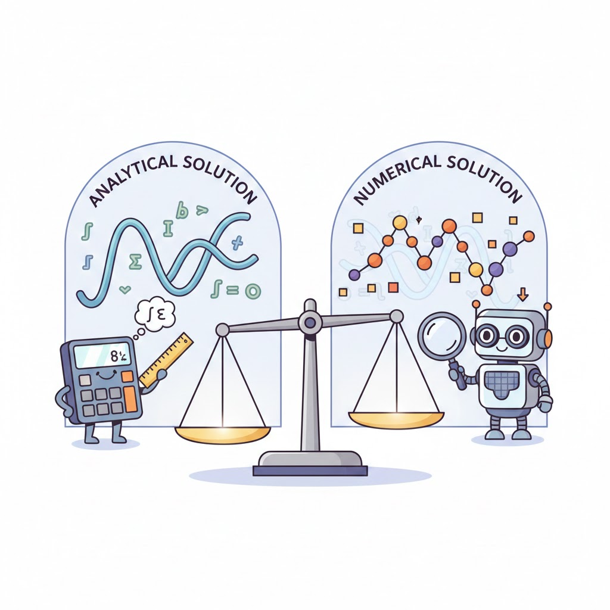

### Wie lösen wir die Modellgleichungen?

Sobald das mathematische Modell aufgestellt ist (z.B. als Satz von Differentialgleichungen), muss es gelöst werden, um das Systemverhalten zu berechnen.

Es gibt zwei grundlegende Ansätze:
1.  **Analytische Lösung**
2.  **Numerische Lösung**

---

### **Analytische** Lösung

- **Was ist das?** Eine exakte, geschlossene mathematische Formel für die Lösung als kontinuierliche Zeitfunktion.
- **Beispiel (Freier Fall mit Anfangsgeschwindigkeit):**
  $$y(t) = y_0 + v_0 \cdot t - \frac{1}{2} g \cdot t^2$$
  - $y(t)$: Momentane Höhe zur Zeit $t$ $[\mathrm{m}]$
  - $t$: Zeit $[\mathrm{s}]$, $y_0$: Anfangshöhe bei $t=0\,\mathrm{s}$ $[\mathrm{m}]$
  - $v_0$: Vertikale Anfangsgeschwindigkeit $[\mathrm{m/s}]$
  - $g \approx 9{,}81\,\mathrm{m/s^2}$: Erdbeschleunigung
- **Vorteile:** Exakt, unendliche zeitliche Auflösung, geschlossene Parameterstudien möglich.
- **Nachteile:** Nur für einfache, meist lineare Modelle existieren geschlossene Stammfunktionen.

---

### **Numerische** Lösung

- **Was ist das?** Eine schrittweise, approximative Berechnung des Systemzustands auf einem diskreten Zeitgitter.
- **Beispiel (Explizites Euler-Verfahren für $y'(t) = f(t, y)$):**
  $$y_{k+1} = y_k + \Delta t \cdot f(t_k, y_k), \quad t_{k+1} = t_k + \Delta t$$
  - $k \in \{0, 1, 2, \dots\}$: Diskreter Zeitschrittindex
  - $t_k = t_0 + k \cdot \Delta t$: Diskrete Zeitpunkte $[\mathrm{s}]$ mit Zeitschrittweite $\Delta t$ $[\mathrm{s}]$
  - $y_k \approx y(t_k)$: Diskreter Näherungswert des Zustands
- **Vorteile:** Universell auf hochgradig nichtlineare und gekoppelte Systeme anwendbar.
- **Nachteile:** Approximationsfehler (Diskretisierungs- und Rundungsfehler); Wahl von $\Delta t$ entscheidet über Stabilität und Konvergenz.

---

### Analytische Modellierung: Ungedämpfter schiefer Wurf

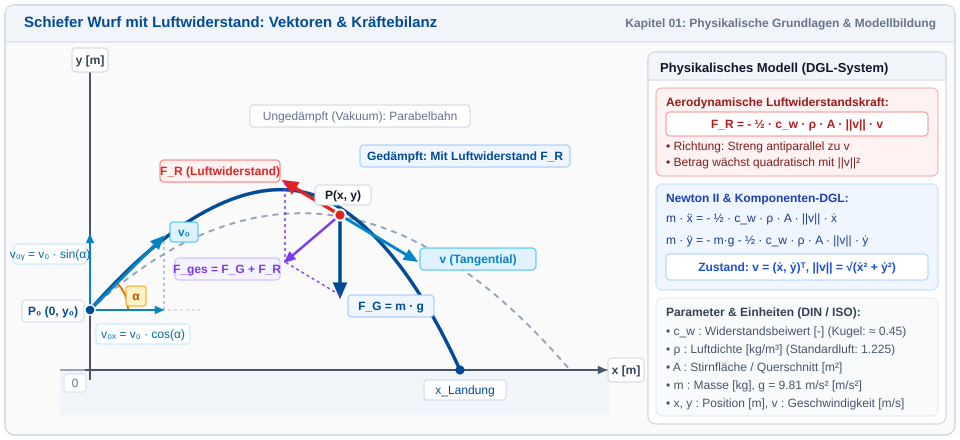

---

### Numerische Modellierung: Schiefer Wurf mit Luftwiderstand

**Einfluss des Strömungswiderstands:**
In realen Medien bremst die turbulente Reibungskraft $\vec{F}_R$ $[\mathrm{N}]$ antiparallel zum Geschwindigkeitsvektor $\vec{v}$:

$$\vec{F}_R = -\frac{1}{2} c_w \rho A \|\vec{v}\| \vec{v}$$

- $c_w$: Strömungswiderstandsbeiwert $[-]$
- $\rho$: Fluiddichte (Luft: $\rho \approx 1{,}2\,\mathrm{kg/m^3}$)
- $A$: Stirn- bzw. Querschnittsfläche $[\mathrm{m^2}]$
- $\vec{v} = (v_x, v_y)^T$: Momentangeschwindigkeit $[\mathrm{m/s}]$
- $\|\vec{v}\| = \sqrt{v_x^2 + v_y^2}$: Geschwindigkeitsbetrag $[\mathrm{m/s}]$

**Gekoppeltes DGL-System 2. Ordnung:**
$$m \ddot{x} = F_{Rx} = -\frac{1}{2} c_w \rho A \sqrt{v_x^2 + v_y^2} \cdot v_x$$
$$m \ddot{y} = -m g + F_{Ry} = -m g - \frac{1}{2} c_w \rho A \sqrt{v_x^2 + v_y^2} \cdot v_y$$

- **Nichtlineare Geschwindigkeitskopplung:** $v_x$ und $v_y$ koppeln im Term $\sqrt{v_x^2+v_y^2}$ miteinander.
- **Folge:** Keine elementare geschlossene Stammfunktion möglich!
- **Lösung:** Numerische Zeitschrittintegration (z.B. Runge-Kutta oder Euler).

---

## 1.4: Visualisierung von Simulationsdaten

Dieser Abschnitt beinhaltet das Folgende:

- Die Notwendigkeit der Visualisierung zum Verstehen und Kommunizieren von Ergebnissen
- Verschiedene Arten der Darstellung: 2D-Plots, 2D- und 3D-Szenen
- Einen kurzen Einblick in die Funktionsweise der Grafik-Pipeline und OpenGL

---

### Warum Visualisierung?

Simulationsläufe produzieren riesige Datenmengen (Zustände, Zeitreihen, ...).

> "Ein Bild sagt mehr als tausend Zahlen."

Visualisierung ist essenziell, um:
- **Ergebnisse verständlich zu machen**: Muster und Trends erkennen, die in reinen Zahlenkolonnen verborgen sind.
- **Modelle zu validieren**: Passt das simulierte Verhalten zu den Erwartungen? Gibt es unerwartete Effekte?
- **Ergebnisse zu kommunizieren**: Einem breiteren Publikum (z.B. Management, Kunden) die Erkenntnisse präsentieren.
- **Interaktiv zu explorieren**: Parameter ändern und die Auswirkungen sofort visuell sehen.

---

### Von einfachen Diagrammen zu komplexen Szenen

**1. Einfache Diagramme (Plots)**
- Darstellung von einer Größe über einer anderen (oft über die Zeit).
- z.B. Temperaturverlauf, Position vs. Zeit.
- Bibliotheken: `ScottPlot`, `OxyPlot`.

**2. 2D-Visualisierungen**
- Darstellung von räumlichen Daten in einer Ebene.
- Oft Vektorgrafiken.
- z.B. Plan einer Fabrikhalle, Verformung eines 2D-Fachwerks, Strömungsfeld.
- Technologie: `WPF Canvas`.

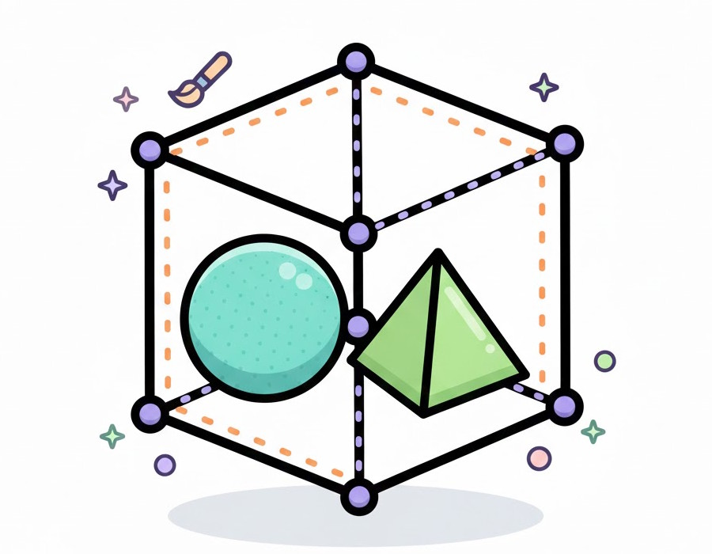

**3. 3D-Visualisierungen**
- Darstellung von räumlichen Daten in einer dreidimensionalen Szene.
- z.B. 3D-Modell eines Roboters, Visualisierung eines Gebäudes, Molekülstrukturen.
- Technologie: `SharpGL`, `Helix Toolkit`.

---

### Formen der Visualisierung im Überblick

In diesem Kurs lernen wir die Visualisierung entlang von vier komplementären Dimensionen kennen:



---

## 1.5: Der Digitale Zwilling

Dieser Abschnitt beinhaltet das Folgende:

- Das Konzept des Digitalen Zwillings nach Michael Grieves
- Die drei Kernkomponenten: physisches Produkt, virtuelles Produkt und Datenverbindung
- Die Abgrenzung von reinen 3D-Modellen

---

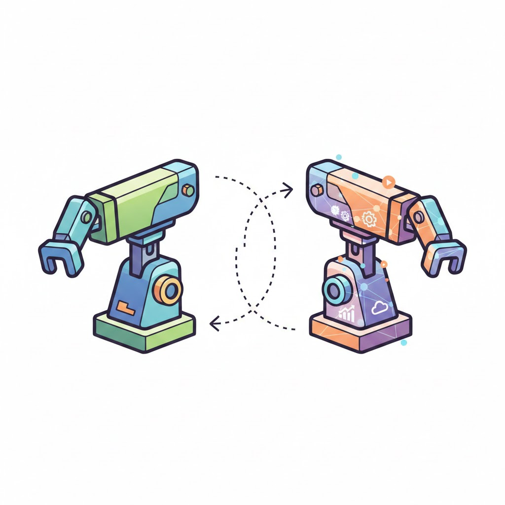

### Was ist ein Digitaler Zwilling?

Der Begriff wurde maßgeblich von **Dr. Michael Grieves** (University of Michigan) geprägt.

Ein Digitaler Zwilling ist ein virtuelles Modell, das als digitales Gegenstück zu einem physischen Objekt, Prozess oder System dient.

Es besteht aus drei Kernkomponenten:
1.  Ein **physisches Produkt** in der realen Welt.
2.  Ein **virtuelles Produkt** in der virtuellen Welt.
3.  Eine **Datenverbindung** zwischen dem physischen und dem virtuellen Produkt.

---

### Das Konzept von Grieves

- **Physischer Raum**: Hier existiert das reale Objekt (z.B. eine Windkraftanlage, ein Auto, eine Fertigungsstraße). Sensoren erfassen kontinuierlich Daten über seinen Zustand (z.B. Temperatur, Drehzahl, Position).

- **Virtueller Raum**: Hier existiert das digitale Modell. Es ist eine hochgenaue, multidisziplinäre Repräsentation des physischen Objekts.

- **Datenverbindung**: Der entscheidende Link.
    - Daten fließen vom physischen zum virtuellen Objekt ("Digital Twin Instance").
    - Erkenntnisse, Befehle oder Updates fließen vom virtuellen zum physischen Objekt.



---

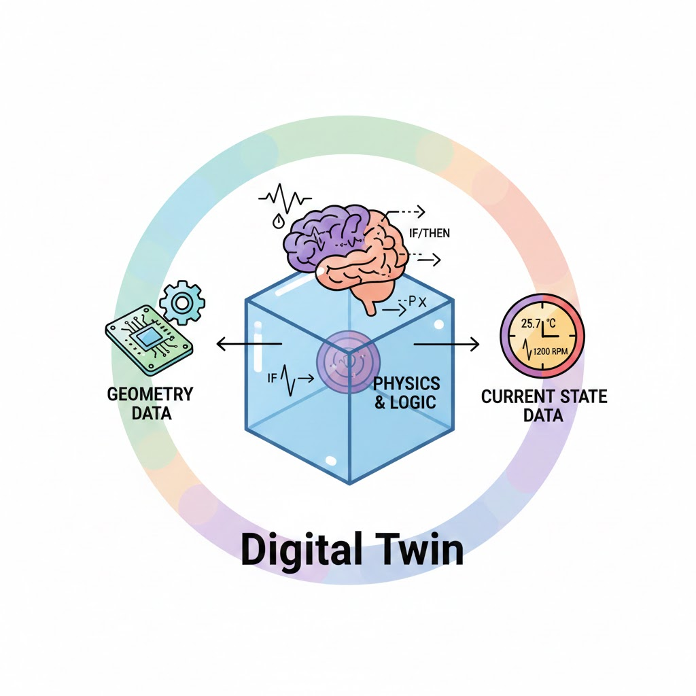

### Mehr als nur ein 3D-Modell

Ein Digitaler Zwilling ist **nicht nur** ein CAD-Modell oder eine 3D-Visualisierung:

- **Geometrie**: 3D-Struktur.
- **Physik**: Verhalten unter Last, thermische Eigenschaften, etc. (-> **Simulations-modelle!**)
- **Daten**: Live-Daten von Sensoren, historische Daten, Wartungsprotokolle.
- **Logik**: Steuerungssoftware, Produktionsregeln.

Ein Digitaler Zwilling "lebt" und entwickelt sich mit seinem physischen Gegenstück über dessen gesamten Lebenszyklus.

---

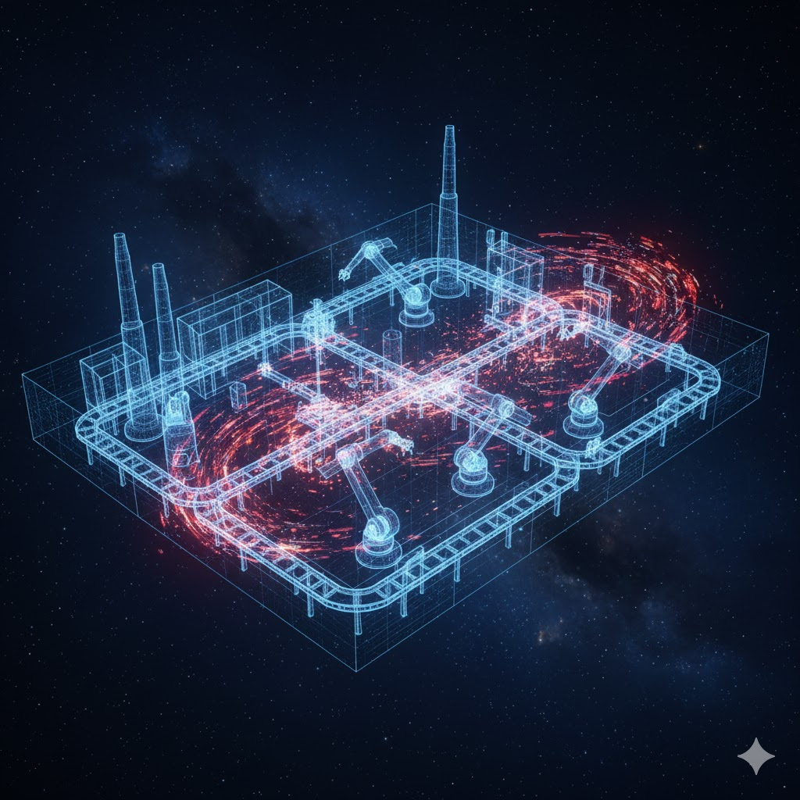

## 1.6: Simulation & Digitaler Zwilling

Dieser Abschnitt beinhaltet das Folgende:

- Die Rolle der Simulation als Kerntechnologie des Digitalen Zwillings
- Die Anwendung über den gesamten Produktlebenszyklus
- Das Praxisbeispiel der virtuellen Inbetriebnahme

---

### Wo passt die Simulation hinein?

**Simulation ist die Kerntechnologie, die den Digitalen Zwilling zum Leben erweckt.**

- Das **Verhaltensmodell** im virtuellen Raum *ist* ein Simulationsmodell.
- Es ermöglicht dem Digitalen Zwilling, nicht nur den **aktuellen Zustand** darzustellen, sondern auch:
    - das **zukünftige Verhalten** vorherzusagen ("Was passiert, wenn die Last um 10% steigt?").
    - **optimale Betriebsparameter** zu finden ("Was ist die energieeffizienteste Geschwindigkeit?").
    - **Fehler zu diagnostizieren** und deren Ursachen zu finden.
    - **Wartungsbedarf** vorausschauend zu planen (Predictive Maintenance).

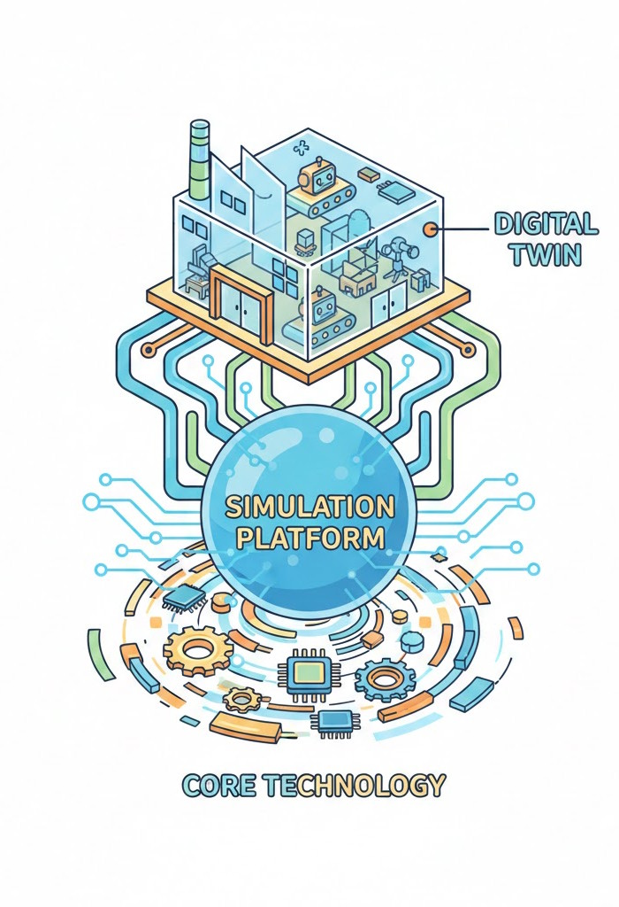

---

### Der Lebenszyklus

Simulation spielt in jeder Phase des Produktlebenszyklus eine Rolle, die durch den Digitalen Zwilling verbunden werden.

**1. Design & Entwicklung**
- Simulation zur Auslegung und Validierung des Produkts.
- Das Ergebnis ist der "digitale Prototyp" oder "Digital Twin Prototype".

**2. Produktion & Inbetriebnahme**
- Simulation zur Planung der Fertigung.
- **Virtuelle Inbetriebnahme**: Test der Steuerungssoftware am digitalen Modell, bevor die reale Anlage existiert.

**3. Betrieb & Wartung**
- Der "Digital Twin Instance" läuft parallel zum realen Produkt.
- Live-Sensordaten kalibrieren das Simulationsmodell.
- Simulationen sagen Verhalten voraus und optimieren den Betrieb.

---

### Beispiel: Virtuelle Inbetriebnahme

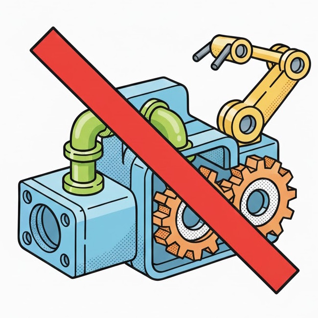

**Traditioneller Ansatz**
1. Mechanik und Elektrik aufbauen.
2. Software-Entwickler kommen zur Baustelle.
3. Software wird an der realen, teuren und potenziell gefährlichen Anlage getestet und in Betrieb genommen.
4. Fehlerbehebung ist zeitaufwändig und teuer.

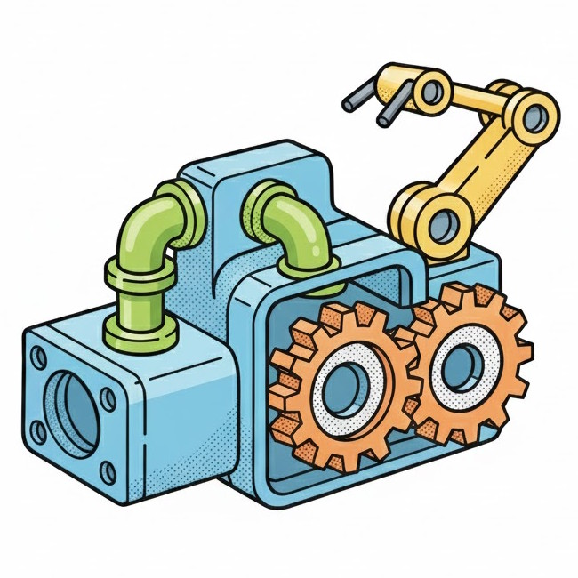

**Ansatz mit Digitalem Zwilling**
1. Parallel zum Aufbau der Mechanik wird ein kinematisches Simulationsmodell (Digitaler Zwilling) erstellt.
2. Software-Entwickler testen die SPS- oder Roboter-Software im Büro gegen das Modell.
3. 90% der Logikfehler werden gefunden, bevor die reale Anlage überhaupt existiert.
4. Deutlich kürzere und sicherere Inbetriebnahmezeit vor Ort.

---

# Zusammenfassung Kapitel 1

- **Modelle** sind vereinfachte Abbilder der Realität für einen bestimmten Zweck.
- **Simulation** ist das Experimentieren mit diesen Modellen.
- Modelle können **statisch/dynamisch**, **kontinuierlich/diskret** und **deterministisch/stochastisch** sein.
- **Numerische Methoden** sind der Schlüssel zur Lösung komplexer, realitätsnaher Modelle.
- **Visualisierung** ist entscheidend, um Simulationsergebnisse zu verstehen und zu kommunizieren.
- Ein **Digitaler Zwilling** ist ein virtuelles Abbild eines physischen Objekts, das über dessen Lebenszyklus durch Daten mit ihm verbunden ist.
- **Simulation** ist die treibende Kraft, die es dem Digitalen Zwilling ermöglicht, Verhalten zu analysieren und vorherzusagen.

---

## Ausblick auf die Kursinhalte

In den folgenden Kapiteln erarbeiten wir zunächst die Werkzeuge und vertiefen anschließend die physikalischen Modellarten:

**Teil 1: Visualisierung & Performance**
- **2D-Raster & Vektor (Kap. 2–3):** `WriteableBitmap` & `WPF Canvas`
- **Plots & Netzwerke (Kap. 4):** `ScottPlot` & `MSAGL`
- **3D-Rendering (Kap. 5):** OpenGL mit `SharpGL` & Szenengraph
- **Multithreading (Kap. 6):** Task Parallel Library (`Parallel.For`)

**Teil 2: Simulationsmodelle**
- **Statische Modelle (Kap. 7):** Elastische Fachwerke in 2D/3D & LGS
- **Kontinuierliche Modelle (Kap. 8):** ODEs, Integratoren & S-Functions
- **Diskrete Modelle (Kap. 9):** Warteschlangen & Monte-Carlo
- **Hybride Modelle (Kap. 10):** State Events & Zeno-Effekt

---

### Laborübung Termin 01: Kinematik & Expliziter Euler

Vertiefende Hausübung (Stufe B, 10 Pkt.) – Details siehe [Aufgabenblatt 01](../../Uebungen/Termin_01_Kinematik_und_Euler/Aufgabenblatt.md):

#### Track A: Industrie & Mechatronik
**Hydraulikzylinder-Endlagendämpfung**
- $m \ddot{x} = F_{\text{vor}} - F_{\text{dämpf}}(x,v) - F_{\text{anschlag}}(x)$
- Nichtlineare viskose & Blendenreibung
- Fester Anschlag mit Kontaktfederkraft
- **Euler vs. Heun (RK2):** Stabilitätsanalyse & Schrittweitenstudie ($10\,\mu\text{s} \dots 2\,\text{ms}$)
- Trajektorien-Export als CSV & Konsole

#### Track B: Simulation Game
**Retro Artillery Duel mit Newton-Drag**
- $\ddot{\mathbf{r}} = \mathbf{g} - \frac{\rho c_{\text{w}} A}{2m} \|\mathbf{v}_{\text{rel}}\| \mathbf{v}_{\text{rel}}$
- Stochastischer Wind $\vec{w} = [w_x, 0]^\top$
- Nichtlineares Terrain $y_{\text{terrain}}(x)$
- **Bodenkollision:** Schnittpunkt-Interpolation
- **KI-Zielrechner:** Schusswinkel-Finder
- Stochastische Runden & ASCII-Plot

> Reine C#-Konsolenapplikation (.NET 8/10, `Vector2`) – Keine GUI! Freie Wahl zwischen Track A und B.

