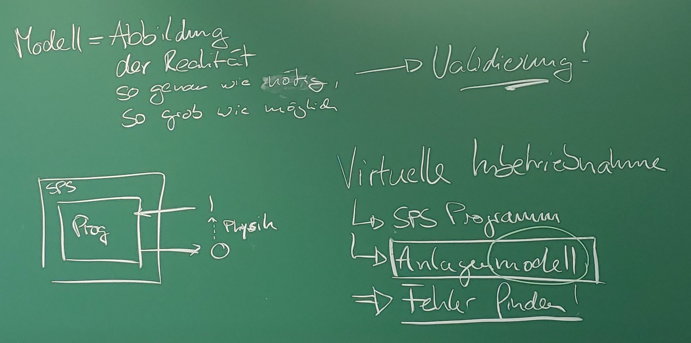

# Kapitel 1: Einführung

TODO

---

## Modellarten

Wir unterscheiden die folgenden Modellarten:

* **Statisch** - Zeit ist kein Faktor in der Modellierung
* **Dynamisch** - Zustand über die Zeit als Funktion $s(t): T \rightarrow S$
  * **Kontinuierlich** - Zustand als *stetige* Funktion
  * **Diskret** - Zustand als *nicht-stetige* Sprungfunktion

---

