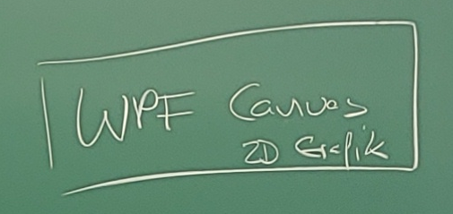
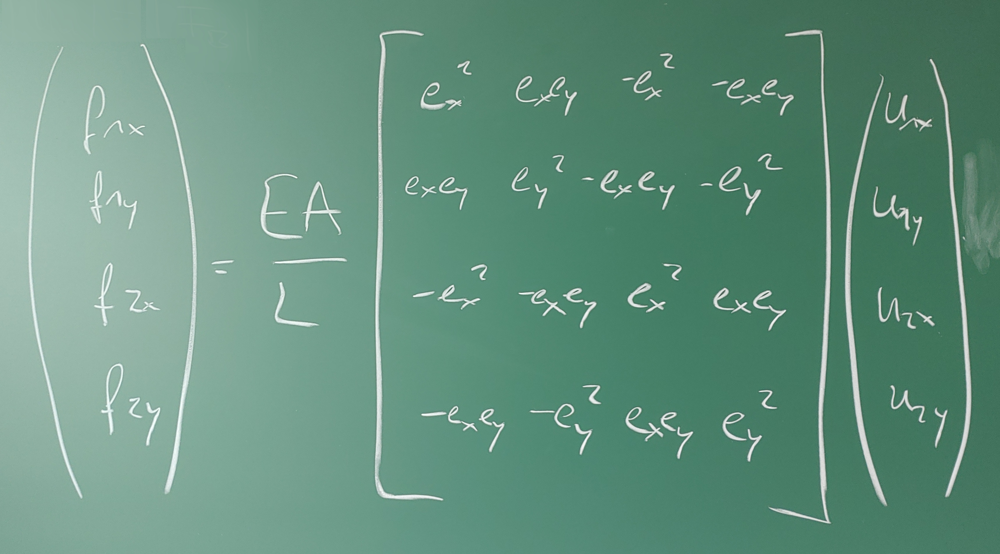

# Kapitel 2: Statische Modelle am Beispiel des Fachwerks

---

## 2.1: Übersicht

- Historische Entwicklung und Motivation
- Das ideale Fachwerk in 2D
    - Mathematische Modellierung
    - Numerische Lösung
    - Visualisierung
- Das elastische Fachwerk in 2D
    - Mathematische Modellierung & Linearisierung
- Erweiterung auf 3D
- Grundlagen der 3D-Visualisierung mit OpenGL

---

## 2.2: Einführung und historische Entwicklung

---

### Was ist ein statisches Modell?

- Beschreibt ein System im **Ruhezustand** (im Gleichgewicht).
- Alle wirkenden Kräfte und Momente heben sich gegenseitig auf.
- $\sum \vec{F} = 0$ und $\sum \vec{M} = 0$
- Das Modell ist **zeitunabhängig**.
- **Typische Fragestellung**: Welche Kräfte wirken innerhalb einer Struktur (z.B. einer Brücke) und wie stark verformt sie sich unter einer gegebenen, konstanten Last?

---

### Das Fachwerk als klassisches Beispiel

Ein **Fachwerk** ist ein Tragwerk, das aus einzelnen Stäben zusammengesetzt ist, die an ihren Enden durch Knoten (Gelenke) miteinander verbunden sind.


---

### Historische Entwicklung

- **Antike**: Römer nutzen grundlegende Prinzipien für Brücken und Aquädukte (Bögen, aber auch frühe Holzfachwerke).
- **Mittelalter/Renaissance**: Bau von Dachstühlen in Kirchen und Kathedralen. Das Wissen ist rein empirisch (Erfahrungswissen).
- **18. Jahrhundert**: Leonhard Euler leistet Pionierarbeit in der Balkentheorie und Stabilitätsanalyse (z.B. Knickung).
- **19. Jahrhundert**: Das Zeitalter der Eisenbahn erfordert lange, stabile und leichte Brücken. Die Fachwerktheorie wird formalisiert.

---

### Pioniere der Fachwerktheorie

<div class="columns">
<div class="one">

**Squire Whipple (1847)**
- "A Work on Bridge Building"
- Entwickelt als einer der ersten die korrekte mathematische Methode zur Berechnung der Kräfte in den Stäben eines Fachwerks (Ritter'sches Schnittverfahren, Knotenpunktverfahren).

</div>
<div class="one">

**Karl Culmann & Luigi Cremona (ca. 1860)**
- Entwickeln die **grafische Statik**.
- Mit dem **Cremonaplan** können die Stabkräfte zeichnerisch ermittelt werden – eine geniale Methode für das Zeitalter ohne Computer.

</div>
<div class="one">

**James Clerk Maxwell (1864)**
- Führt das **Kräfteplanverfahren** ein und erkennt, dass die Stabkräfte als reziproke Figuren zum Lageplan des Fachwerks aufgefasst werden können.

</div>
</div>

---

### Fragestellungen an das Modell

- **Stabilität**: Ist das Fachwerk unter der gegebenen Lagerung und Last statisch bestimmt und stabil?
- **Interne Kräfte**: Welche Zug- oder Druckkraft wirkt in jedem einzelnen Stab? (Dimensionierung der Stäbe)
- **Verformung**: Wie stark verschieben sich die Knoten unter der Last? (Nur mit elastischem Modell beantwortbar)
- **Optimierung**: Wie kann das Fachwerk mit minimalem Materialeinsatz (Gewicht) für eine gegebene Last entworfen werden?

---

## 2.3: Das ideale Fachwerk in 2D

---

### Annahmen des idealen Fachwerks

1.  Die Stäbe sind **gerade** und haben ein **vernachlässigbares Eigengewicht**.
2.  Die Stäbe sind an ihren Enden durch **reibungsfreie Gelenke** (Knoten) verbunden.
3.  Äußere Kräfte (Lasten) greifen **ausschließlich an den Knoten** an.

**Folgerung**: In den Stäben treten nur **Normalkräfte** (Zug- oder Druckkräfte) in Längsrichtung auf, keine Biegemomente oder Querkräfte.


---

### Mathematische Modellierung: Knotenpunktverfahren

- Wir betrachten jeden Knoten einzeln.
- Für jeden Knoten muss ein **Kräftegleichgewicht** in x- und y-Richtung herrschen.
- $\sum F_x = 0$
- $\sum F_y = 0$


---

### Aufstellen des Gleichungssystems

- Für ein Fachwerk mit $k$ Knoten erhalten wir $2k$ Gleichungen.
- Die Unbekannten sind die Kräfte in den $s$ Stäben und die $l$ Lagerreaktionen.
- Wenn $2k = s + l$, ist das System **statisch bestimmt** und (im Prinzip) lösbar.
- Jede Gleichung beschreibt, wie die Stab- und Lagerkräfte zur Einhaltung des Gleichgewichts an einem Knoten in einer Richtung beitragen.

---

### Beispiel: Gleichung für Knoten 2, x-Richtung

<div class="columns">
<div class="one">


</div>
<div class="one">

Betrachten wir die Gleichgewichtsbedingung in x-Richtung am Knoten 2:

$\sum F_{2,x} = 0$

Die Stabkräfte $S_1$, $S_2$ und $S_5$ haben eine Komponente in x-Richtung.

$S_1 \cdot \cos(\alpha_1) + S_2 \cdot \cos(\alpha_2) + S_5 \cdot \cos(\alpha_5) = 0$

Die Winkel $\alpha_i$ ergeben sich aus der Geometrie der Stäbe.

</div>
</div>

---

### Das lineare Gleichungssystem (LGS)

Wenn wir dies für alle Knoten und beide Richtungen tun, erhalten wir ein lineares Gleichungssystem der Form:

$A \cdot x = b$

- $A$: Die **Koeffizientenmatrix** (Geometriematrix). Sie enthält die Kosinus- und Sinus-Werte der Stabwinkel und beschreibt, wie die Stäbe an den Knoten "zusammenhängen".
- $x$: Der **Lösungsvektor**. Er enthält die unbekannten Stabkräfte und Lagerreaktionen.
- $b$: Der **Lastvektor**. Er enthält die an den Knoten angreifenden externen Kräfte.

---

### Die Geometriematrix A im Detail

- Jede **Zeile** der Matrix $A$ entspricht einer Gleichgewichtsbedingung (z.B. Knoten 3, y-Richtung).
- Jede **Spalte** der Matrix $A$ entspricht einer unbekannten Kraft (z.B. Stabkraft $S_4$).
- Der Eintrag $A_{ij}$ ist der Koeffizient (z.B. $\cos(\alpha)$), mit dem die unbekannte Kraft $j$ in die Gleichung $i$ eingeht.
- Viele Einträge in $A$ sind Null, da ein Stab nur an zwei Knoten angreift. Man spricht von einer **dünn besetzten Matrix** (sparse matrix).

---

### Lösung des LGS

Um die unbekannten Kräfte $x$ zu finden, müssen wir das LGS lösen:

$x = A^{-1} \cdot b$

- Die direkte Berechnung der Inversen $A^{-1}$ ist numerisch aufwändig und instabil.
- In der Praxis verwendet man robustere und effizientere Algorithmen.

---

### Algorithmen zur Lösung von LGS

<div class="columns">
<div class="one">

**Direkte Löser**
- Finden die exakte Lösung (abgesehen von Rundungsfehlern) in einer endlichen Anzahl von Schritten.
- **Gauß-Elimination**: Umformung der Matrix $A$ in eine obere Dreiecksmatrix, die dann einfach durch Rückwärtseinsetzen gelöst werden kann.
- **LU-Zerlegung**: Zerlegung von $A$ in eine untere ($L$) und eine obere ($U$) Dreiecksmatrix ($A = L \cdot U$). Die Lösung von $L \cdot (U \cdot x) = b$ erfolgt dann in zwei einfachen Schritten.

</div>
<div class="one">

**Iterative Löser**
- Starten mit einer Schätzung und verbessern die Lösung schrittweise.
- Oft effizienter für sehr große, dünn besetzte Systeme.
- Beispiele: Jacobi-Verfahren, Gauß-Seidel-Verfahren.

</div>
</div>

---

### Verwendung von Bibliotheken

- Das Rad muss nicht neu erfunden werden.
- Numerische Bibliotheken bieten hochoptimierte und stabile Implementierungen dieser Algorithmen.
- **Beispiel für .NET**: `Math.NET Numerics`

```csharp
using MathNet.Numerics.LinearAlgebra;

// Erstelle Matrix A und Vektor b
var A = Matrix<double>.Build.DenseOfArray(new double[,] { ... });
var b = Vector<double>.Build.Dense(new double[] { ... });

// Löse das Gleichungssystem A*x = b
var x = A.Solve(b);

// x enthält jetzt die Stab- und Lagerkräfte
```


---

### Programmtechnische Umsetzung: Datenstrukturen

Wie repräsentieren wir ein Fachwerk im Code?

```csharp
// Ein Knoten hat eine Position und eine externe Kraft
public class Node
{
    public int Id { get; set; }
    public double X { get; set; }
    public double Y { get; set; }
    public double Fx { get; set; } // Externe Kraft
    public double Fy { get; set; }
}

// Ein Stab verbindet zwei Knoten
public class Bar
{
    public int Id { get; set; }
    public Node StartNode { get; set; }
    public Node EndNode { get; set; }
    public double Force { get; set; } // Berechnetes Ergebnis
}
```

---

### 2D-Visualisierung: Die Herausforderung

- Das Fachwerk existiert in "Weltkoordinaten" (z.B. in Metern).
- Der Computerbildschirm (z.B. ein `WPF Canvas`) verwendet "Bildschirmkoordinaten" (in Pixel).
- Wir benötigen eine Transformation, um unsere Welt auf den Bildschirm abzubilden.


---

### Transformation: Welt -> Bildschirm

Die Transformation besteht meist aus drei Schritten:

1.  **Skalierung**: Das Fachwerk muss so vergrößert oder verkleinert werden, dass es gut auf den Canvas passt. Man berechnet einen Skalierungsfaktor.
2.  **Translation (Verschiebung)**: Der Ursprung des Fachwerks soll an eine bestimmte Stelle auf dem Canvas verschoben werden (z.B. in die Mitte).
3.  **Invertierung der Y-Achse**: In der Mathematik zeigt die Y-Achse nach oben, bei den meisten 2D-Grafiksystemen nach unten.


---

### Umrechnung im Detail

```csharp
// Annahmen:
// canvasWidth, canvasHeight: Größe des Canvas in Pixel
// worldRect: Bounding Box des Fachwerks in Weltkoordinaten
// margin: Rand in Pixel

// 1. Skalierungsfaktor berechnen
double scaleX = (canvasWidth - 2 * margin) / worldRect.Width;
double scaleY = (canvasHeight - 2 * margin) / worldRect.Height;
double scale = Math.Min(scaleX, scaleY);

// 2. Transformation für einen Punkt (worldX, worldY)
double screenX = margin + (worldX - worldRect.Left) * scale;
double screenY = margin + (worldRect.Top - worldY) * scale; // Y-Achse invertiert!

return new Point(screenX, screenY);
```

---

### Visualisierung der Kräfte: Pfeile

- Die berechneten Stabkräfte (Zug/Druck) und externen Kräfte sollen als Pfeile dargestellt werden.
- Ein Pfeil besteht aus einem **Pfeilkörper** (eine Linie) und einer **Pfeilspitze** (ein gefülltes Polygon).



---

### Zeichnen der Pfeilspitze

- Die Pfeilspitze ist ein kleines Dreieck (oder ein anderes Polygon) am Ende des Pfeilkörpers.
- Um sie zu zeichnen, benötigen wir die Koordinaten ihrer Eckpunkte.
- Diese können wir aus dem Endpunkt der Linie und dem Richtungsvektor der Linie berechnen.


---

### Berechnung der Pfeilspitze

```csharp
// Gegeben: Startpunkt P1, Endpunkt P2
// Länge und Winkel der Pfeilspitze
double arrowLength = 10; // in Pixel
double arrowAngle = Math.PI / 6; // 30 Grad

// 1. Richtungsvektor der Linie
Vector lineVec = P2 - P1;
lineVec.Normalize();

// 2. Vektoren für die Seiten der Pfeilspitze
// Rotiere den Linienvektor um +arrowAngle und -arrowAngle
Matrix rot1 = new Matrix();
rot1.Rotate(arrowAngle * 180 / Math.PI);
Vector arrowVec1 = Vector.Multiply(lineVec, rot1) * arrowLength;

Matrix rot2 = new Matrix();
rot2.Rotate(-arrowAngle * 180 / Math.PI);
Vector arrowVec2 = Vector.Multiply(lineVec, rot2) * arrowLength;

// 3. Eckpunkte der Pfeilspitze
Point pA = P2 - arrowVec1;
Point pB = P2 - arrowVec2;

// Zeichne das Polygon mit den Punkten (P2, pA, pB)
```

---

## 2.4: Das elastische Fachwerk in 2D

---

### Grenzen des idealen Fachwerks

- Das ideale Fachwerkmodell kann nur die **Kräfte** berechnen.
- Es kann **keine Aussage über Verformungen** treffen, da die Stäbe als unendlich steif angenommen werden.
- In der Realität ist jeder Werkstoff elastisch und verformt sich unter Last.
- **Fragestellung**: Wie stark verschieben sich die Knoten, wenn eine Last angreift?

---

### Das elastische Modell: Neue Annahmen

- Die Stäbe sind nicht mehr starr, sondern **elastisch**. Ihr Verhalten wird durch das **Hooke'sche Gesetz** beschrieben.
- Die Knoten sind weiterhin **gelenkig**.
- Die entscheidende neue Unbekannte sind nicht die Stabkräfte, sondern die **Knotenverschiebungen** $\vec{u}$.

---

### Hooke'sches Gesetz für einen Stab

Die Kraft $S$ in einem Stab ist proportional zu seiner Längenänderung $\Delta L$.

$S = \frac{E \cdot A}{L_0} \cdot \Delta L$

- $E$: **Elastizitätsmodul** (Materialkonstante, z.B. für Stahl ca. 210 GPa)
- $A$: **Querschnittsfläche** des Stabes
- $L_0$: **Anfangslänge** des Stabes
- Der Term $\frac{E \cdot A}{L_0}$ wird als **Stabsteifigkeit** $k$ bezeichnet.

---

### Von der Längenänderung zur Knotenverschiebung

- Die Längenänderung $\Delta L$ eines Stabes hängt von den Verschiebungen seiner beiden Endknoten ab.
- Für einen Stab zwischen Knoten $i$ und $j$ mit Verschiebungsvektoren $\vec{u}_i$ und $\vec{u}_j$:
- $\Delta L \approx (\vec{u}_j - \vec{u}_i) \cdot \vec{e}$
- $\vec{e}$ ist der Einheitsvektor in Richtung des Stabes.


---

### Die Linearisierung: Kleine-Verformungs-Theorie

- Die exakte Berechnung von $\Delta L$ ist kompliziert, da sich die Richtung des Stabes $\vec{e}$ mit der Verformung ändert (geometrische Nichtlinearität).
- **Vereinfachung**: Wir nehmen an, dass die Verformungen $\vec{u}$ so **klein** sind, dass sich die Geometrie des Fachwerks nicht nennenswert ändert.
- Wir können also für die Berechnung den Einheitsvektor $\vec{e}$ des **unverformten** Stabes verwenden.
- Dies ist eine **Linearisierung**, die für die meisten Anwendungen im Hoch- und Maschinenbau gültig ist.

---

### Stab-Steifigkeitsbeziehung

- Kombiniert man Hooke'sches Gesetz und die Längenänderungs-Beziehung, erhält man eine Beziehung zwischen den Kräften, die auf die Knoten eines Stabes wirken, und den Verschiebungen dieser Knoten.
- Dies lässt sich als **Stab-Steifigkeitsmatrix** $k_{stab}$ formulieren.

$\begin{pmatrix} F_{ix} \\ F_{iy} \\ F_{jx} \\ F_{jy} \end{pmatrix} = k_{stab} \cdot \begin{pmatrix} u_{ix} \\ u_{iy} \\ u_{jx} \\ u_{jy} \end{pmatrix}$



---

### Assemblierung der globalen Steifigkeitsmatrix

- Der entscheidende Schritt ist die "Assemblierung": Die einzelnen Stab-Steifigkeitsmatrizen werden zu einer **globalen Steifigkeitsmatrix** $K$ für das gesamte Fachwerk zusammengesetzt.
- Das Prinzip lautet: Die globale Steifigkeit an einem Knoten ist die Summe der Steifigkeiten aller Stäbe, die an diesem Knoten zusammentreffen.
- Dieser Prozess folgt einem festen Algorithmus und lässt sich gut programmieren.

---

### Das globale Gleichungssystem

Das Ergebnis ist wieder ein lineares Gleichungssystem, diesmal für das elastische Fachwerk:

$K \cdot u = f$

- $K$: Die **globale Steifigkeitsmatrix**. Sie hängt von der Geometrie und den Materialeigenschaften (E, A) ab. Sie ist quadratisch, symmetrisch und (für stabile Fachwerke) positiv definit.
- $u$: Der Vektor der unbekannten **Knotenverschiebungen**.
- $f$: Der Vektor der bekannten **externen Knotenkräfte**.

---

### Einbau der Randbedingungen

- Das bisherige System $K \cdot u = f$ ist singulär (nicht lösbar), da das Fachwerk noch "frei im Raum schwebt".
- Wir müssen die **Lagerungen** (Randbedingungen) einbauen.
- An einem gelagerten Knoten ist die Verschiebung bekannt (meistens Null).
- z.B. $u_{1x} = 0$, $u_{1y} = 0$.
- Dies führt zur Modifikation des Gleichungssystems (z.B. durch Streichen von Zeilen/Spalten oder Setzen von großen Diagonalelementen).


---

### Lösung und Ergebnisse

1.  **Löse $K \cdot u = f$ nach $u$ auf**: Das Ergebnis sind die Verschiebungen aller Knoten.
2.  **Post-Processing**:
    - Aus den Knotenverschiebungen $u$ kann für jeden Stab die Längenänderung $\Delta L$ berechnet werden.
    - Aus $\Delta L$ kann mit dem Hooke'schen Gesetz die **Stabkraft** $S$ berechnet werden.

Das elastische Modell liefert uns also sowohl die **Verformungen** als auch die **Kräfte**!

---

## 2.5: Erweiterung auf 3D

---

### Vom 2D- zum 3D-Fachwerk

- Die grundlegenden physikalischen Prinzipien (Kräftegleichgewicht, Hooke'sches Gesetz) bleiben exakt gleich.
- Die Mathematik wird lediglich um eine Dimension erweitert.

<div class="columns">
<div class="one">

**2D**
- Knoten haben 2 Freiheitsgrade (DOF): $u_x, u_y$.
- Gleichgewicht in 2 Richtungen: $\sum F_x = 0, \sum F_y = 0$.
- Geometrie durch Vektoren in $\mathbb{R}^2$.

</div>
<div class="one">

**3D**
- Knoten haben 3 Freiheitsgrade (DOF): $u_x, u_y, u_z$.
- Gleichgewicht in 3 Richtungen: $\sum F_x = 0, \sum F_y = 0, \sum F_z = 0$.
- Geometrie durch Vektoren in $\mathbb{R}^3$.

</div>
</div>

---

### Ideales Fachwerk in 3D

- **Knotenpunktverfahren**: An jedem Knoten werden nun **drei** Gleichgewichtsgleichungen aufgestellt.
- Für ein Fachwerk mit $k$ Knoten, $s$ Stäben und $l$ Lagerreaktionen muss gelten: $3k = s + l$ (statische Bestimmtheit).
- Das LGS $A \cdot x = b$ wird entsprechend größer, das Prinzip ist aber identisch. Die Koeffizienten in $A$ sind nun die Richtungskosinusse der Stäbe im 3D-Raum.

---

### Elastisches Fachwerk in 3D

- **Knotenverschiebungen**: Der Vektor $u$ enthält nun für jeden Knoten drei Komponenten ($u_x, u_y, u_z$).
- **Stab-Steifigkeitsmatrix**: Die $k_{stab}$ ist nun eine 6x6-Matrix, da sie die 3 Verschiebungen an beiden Enden des Stabes in Beziehung setzt.
- **Globale Steifigkeitsmatrix $K$**: Wird analog zum 2D-Fall assembliert, wird aber deutlich größer. Für ein Fachwerk mit $k$ Knoten ist $K$ eine $3k \times 3k$ Matrix.
- Die Lösung $K \cdot u = f$ folgt dem gleichen Schema.

---

### Die größte Herausforderung: Visualisierung

- Während die Berechnung eine reine Erweiterung der Dimension ist, stellt die Visualisierung eine neue Herausforderung dar.
- Wir müssen eine 3D-Szene auf einen 2D-Bildschirm projizieren.
- Dies ist die Aufgabe der **3D-Grafikpipeline**, die typischerweise mit APIs wie **OpenGL** oder **DirectX** gesteuert wird.


---

## 2.6: Grundlagen der 3D-Visualisierung mit OpenGL

---

### Was ist OpenGL?

- **Open Graphics Library**
- Eine plattform- und programmiersprachenübergreifende **API** (Application Programming Interface) zur Erzeugung von 2D- und 3D-Computergrafik.
- Es ist ein **Standard**, der von Grafikkartenherstellern implementiert wird.
- Es bietet eine Schnittstelle, um der **GPU (Graphics Processing Unit)** Befehle zum Zeichnen zu geben.
- Wir betrachten hier "klassisches" (fixed-function) OpenGL, wie es in `SharpGL` oft für einfache Darstellungen genutzt wird.

---

### OpenGL als Zustandsmaschine

- Man kann sich OpenGL als eine große Maschine mit sehr vielen Schaltern und Einstellungen vorstellen.
- **Beispiele für Zustände**:
    - Aktuelle Zeichenfarbe
    - Aktuelle Transformationsmatrix
    - Ist die Beleuchtung aktiviert?
    - Ist der Tiefentest aktiviert?
- **Befehle**:
    - `glColor3f(1, 0, 0)`: Setzt die aktuelle Farbe auf Rot. Alle danach gezeichneten Objekte sind rot, bis die Farbe wieder geändert wird.
    - `glEnable(GL_LIGHTING)`: Schaltet die Beleuchtung ein.

---

### Die Grafik-Pipeline (Fixed-Function, stark vereinfacht)

Der Weg von einem 3D-Punkt (Vertex) zu einem farbigen Pixel auf dem Bildschirm.

1.  **Vertex-Transformation**: Der Vertex wird mit der ModelView- und Projection-Matrix transformiert.
2.  **Primitive Assembly**: Aus den transformierten Vertices werden Primitiven (Linien, Dreiecke) zusammengesetzt.
3.  **Rasterisierung**: Die Primitiven werden in Fragmente (Pixel-Kandidaten) umgewandelt.
4.  **Fragment-Verarbeitung**: Beleuchtung und Texturierung werden angewendet, um die endgültige Farbe des Fragments zu bestimmen.
5.  **Per-Fragment Operations**: Tiefentest, Blending, etc. entscheiden, ob und wie das Fragment in den Framebuffer geschrieben wird.

---

### Framebuffer: Die "Leinwand" der GPU

Der **Framebuffer** ist ein Speicherbereich auf der GPU, der alle für die Darstellung relevanten Informationen enthält.

- **Color Buffer**: Speichert die Farbinformation (RGBA) für jedes einzelne Pixel des Ausgabebildes. Das ist das, was man am Ende sieht.
- **Depth Buffer (Z-Buffer)**: Speichert für jedes Pixel einen Tiefenwert (meist zwischen 0.0 und 1.0).
- **Stencil Buffer**: Ein weiterer Buffer für komplexere Effekte (hier nicht im Detail behandelt).

---

### Der Depth Buffer: Verdeckungen lösen

- **Problem**: Wenn wir zwei Dreiecke zeichnen, die sich überlappen, welches ist vorne?
- **Lösung**: Der **Tiefentest (Depth Test)**.
- Muss explizit aktiviert werden: `glEnable(GL_DEPTH_TEST)`.
- **Funktionsweise**:
    1. Bevor ein Pixel gezeichnet wird, wird sein Z-Wert (Abstand zur Kamera) mit dem bereits im Depth Buffer gespeicherten Z-Wert an dieser Pixel-Position verglichen.
    2. Ist der neue Z-Wert **kleiner** (näher an der Kamera), wird das Pixel gezeichnet und der Depth Buffer mit dem neuen, kleineren Z-Wert aktualisiert.
    3. Ist der neue Z-Wert größer, wird das Pixel verworfen (da es von etwas verdeckt wird).
- **Wichtig**: Der Depth Buffer muss vor jedem neuen Frame gelöscht werden! `glClear(GL_DEPTH_BUFFER_BIT)`.

---

### Clearing Buffers

- Vor dem Zeichnen eines neuen Bildes (Frames) müssen die Buffer zurückgesetzt werden.
- `glClearColor(r, g, b, a)`: Legt die "Löschfarbe" fest (Hintergrundfarbe).
- `glClear(GL_COLOR_BUFFER_BIT | GL_DEPTH_BUFFER_BIT)`: Löscht den Color Buffer mit der Löschfarbe und den Depth Buffer auf seinen Maximalwert.

```csharp
// In der Render-Methode (wird für jeden Frame aufgerufen)
var gl = openGLControl.OpenGL;

// 1. Hintergrundfarbe setzen und Buffer löschen
gl.ClearColor(0.1f, 0.2f, 0.3f, 1.0f); // Dunkelblau
gl.Clear(OpenGL.GL_COLOR_BUFFER_BIT | OpenGL.GL_DEPTH_BUFFER_BIT);

// ... hier kommen die Zeichenbefehle ...
```

---

### Koordinatensysteme und Transformationen

Der Kern der 3D-Grafik: Punkte von einem Koordinatensystem in ein anderes zu überführen.

1.  **Objektkoordinaten (Model Space)**: Die Koordinaten, in denen ein Objekt modelliert wurde (z.B. der Ursprung ist die Mitte des Objekts).
2.  **Weltkoordinaten (World Space)**: Positioniert die Objekte in der globalen 3D-Szene.
3.  **Kamerakoordinaten (View Space)**: Transformiert die Welt so, dass die Kamera im Ursprung ist und in die negative Z-Richtung blickt.
4.  **Clip Space**: Projiziert die 3D-Szene auf einen 2D-Bereich.
5.  **Bildschirmkoordinaten (Screen Space)**: Skaliert das Ergebnis auf die Pixel des Fensters.

---

### Die OpenGL-Matrizen

OpenGL verwaltet die Transformationen mit zwei Hauptmatrizen:

- **Projection Matrix**: Zuständig für die Transformation von Kamera- in den Clip-Space (Schritt 4).
- **ModelView Matrix**: Zuständig für die Transformation von Objekt- in den Kamera-Space (Schritte 1-3).

Man muss OpenGL sagen, welche Matrix man gerade bearbeiten möchte:
`glMatrixMode(GL_PROJECTION)` oder `glMatrixMode(GL_MODELVIEW)`.

---

### Die Projection Matrix

- Definiert das **Sichtvolumen (Viewing Frustum)**. Alles außerhalb dieses Volumens wird weggeschnitten (clipping).
- **Perspektivische Projektion (`gluPerspective`)**:
    - Objekte, die weiter weg sind, erscheinen kleiner.
    - Erzeugt eine realistische Tiefenwahrnehmung.
    - Parameter: Öffnungswinkel (fov), Seitenverhältnis (aspect), nahe und ferne Clipping-Ebene (zNear, zFar).
- **Orthographische Projektion (`glOrtho`)**:
    - Keine perspektivische Verkürzung, parallele Linien bleiben parallel.
    - Nützlich für technische Zeichnungen, 2D-Darstellungen oder UI-Elemente.

---

### Setup der Projection Matrix

```csharp
// Typischer Code am Anfang oder bei Größenänderung des Fensters
var gl = openGLControl.OpenGL;
gl.MatrixMode(OpenGL.GL_PROJECTION);
gl.LoadIdentity(); // Matrix zurücksetzen

// Perspektivische Projektion
// fov=60°, aspect=width/height, near=0.1, far=1000
gl.Perspective(60.0f, (double)Width / (double)Height, 0.1, 1000.0);
```

---

### Die ModelView Matrix

- Ist eine Kombination aus **Model-Transformation** und **View-Transformation**.
- **View-Transformation (`gluLookAt`)**: Definiert die Kamera.
    - Position der Kamera (eye).
    - Punkt, auf den die Kamera schaut (center).
    - "Oben"-Vektor der Kamera (up), typischerweise (0, 1, 0).
- **Model-Transformation**: Positioniert das Objekt in der Welt.
    - `glTranslate(x, y, z)`: Verschieben.
    - `glRotate(angle, x, y, z)`: Rotieren um eine Achse.
    - `glScale(x, y, z)`: Skalieren.

---

### Setup der ModelView Matrix

```csharp
// In der Render-Methode
var gl = openGLControl.OpenGL;
gl.MatrixMode(OpenGL.GL_MODELVIEW);
gl.LoadIdentity(); // Matrix zurücksetzen

// 1. Kamera positionieren (View-Transformation)
// Kamera bei (5,5,5), schaut auf (0,0,0), Y ist oben
gl.LookAt(5, 5, 5, 0, 0, 0, 0, 1, 0);

// 2. Objekt transformieren (Model-Transformation)
// Verschiebe das Fachwerk um (1,0,0)
gl.Translate(1.0f, 0.0f, 0.0f);
// Rotiere es um 45 Grad um die Y-Achse
gl.Rotate(45.0f, 0.0f, 1.0f, 0.0f);

// ... jetzt das Fachwerk zeichnen ...
```
**Wichtig**: Die Transformationen werden in umgekehrter Reihenfolge angewendet! (Zuerst Skalieren, dann Rotieren, dann Verschieben).

---

### Zeichnen von Primitiven

- Der grundlegende Weg, um Geometrie zu definieren.
- Man beginnt einen Zeichenblock mit `gl.Begin(...)` und beendet ihn mit `gl.End()`.
- Der Parameter von `gl.Begin` bestimmt, **wie** die folgenden Vertices interpretiert werden.

---

### Primitiv-Typen

- `GL_POINTS`: Jeder Vertex ist ein Punkt.
- `GL_LINES`: Je zwei Vertices bilden eine Linie.
- `GL_LINE_STRIP`: Die Vertices werden zu einer durchgehenden Linie verbunden.
- `GL_LINE_LOOP`: Wie `GL_LINE_STRIP`, aber der letzte Vertex wird mit dem ersten verbunden.
- `GL_TRIANGLES`: Je drei Vertices bilden ein gefülltes Dreieck.
- `GL_QUADS`: Je vier Vertices bilden ein gefülltes Viereck.
- `GL_POLYGON`: Die Vertices bilden ein gefülltes Polygon.

---

### Beispiel: Ein Dreieck und eine Linie zeichnen

```csharp
var gl = openGLControl.OpenGL;

// Zeichne eine rote Linie
gl.Color(1.0f, 0.0f, 0.0f); // Farbe auf Rot setzen
gl.Begin(OpenGL.GL_LINES);
    gl.Vertex(0.0f, 0.0f, 0.0f);
    gl.Vertex(1.0f, 1.0f, 0.0f);
gl.End();

// Zeichne ein grünes Dreieck
gl.Color(0.0f, 1.0f, 0.0f); // Farbe auf Grün setzen
gl.Begin(OpenGL.GL_TRIANGLES);
    gl.Vertex(0.0f, 0.0f, 0.0f);
    gl.Vertex(1.0f, 0.0f, 0.0f);
    gl.Vertex(0.5f, 1.0f, 0.0f);
gl.End();
```

---

### Beleuchtung

- Ohne Beleuchtung sehen 3D-Objekte flach aus. Die Farbe eines Pixels ist einfach die Grundfarbe, die mit `glColor` gesetzt wurde.
- Die Beleuchtung simuliert, wie Licht von der Oberfläche eines Objekts reflektiert wird, und erzeugt so den Eindruck von Tiefe und Form.
- Muss aktiviert werden: `glEnable(GL_LIGHTING)`.

---

### Komponenten des Beleuchtungsmodells (Phong)

OpenGL verwendet ein einfaches, aber effektives Beleuchtungsmodell, das sich aus drei Komponenten zusammensetzt:

- **Ambient (Umgebungslicht)**: Eine Grundhelligkeit, die von überall zu kommen scheint. Verhindert, dass Flächen im Schatten komplett schwarz sind.
- **Diffuse (diffuses Licht)**: Licht von einer gerichteten Lichtquelle, das von einer matten Oberfläche in alle Richtungen gleichmäßig gestreut wird. Die Helligkeit hängt vom Winkel zwischen Lichtstrahl und Oberflächennormale ab.
- **Specular (Glanzlicht)**: Erzeugt Glanzlichter auf glatten Oberflächen. Die Helligkeit hängt zusätzlich von der Kameraposition ab.

---

### Was wird für die Beleuchtung benötigt?

1.  **Lichtquellen aktivieren und definieren**:
    - `glEnable(GL_LIGHT0)`
    - `glLightfv(GL_LIGHT0, GL_POSITION, ...)`: Position der Lichtquelle.
    - `glLightfv(GL_LIGHT0, GL_DIFFUSE, ...)`: Farbe des diffusen Lichts.
2.  **Materialien für die Objekte definieren**:
    - `glMaterialfv(GL_FRONT, GL_DIFFUSE, ...)`: Wie reflektiert das Material diffuses Licht?
    - `glMaterialfv(GL_FRONT, GL_SPECULAR, ...)`: Wie stark glänzt das Material?
3.  **Normalenvektoren für die Vertices definieren**:
    - Der **Normalenvektor** (kurz: Normale) ist ein Vektor, der senkrecht auf der Oberfläche steht.
    - Er ist **entscheidend** für die Berechnung, wie viel Licht eine Fläche empfängt.
    - `glNormal3f(nx, ny, nz)`

---

### Normalenvektoren

- Für eine flache Oberfläche (z.B. ein Dreieck) ist die Normale für alle Vertices gleich. Sie kann aus zwei Kantenvektoren des Dreiecks per Kreuzprodukt berechnet werden.
- Für gekrümmte Oberflächen hat jeder Vertex seine eigene Normale (Vertex Normal), um weiche Übergänge zu simulieren (Gouraud Shading).
- OpenGL muss die Normalen kennen, **bevor** der Vertex definiert wird.
- `glEnable(GL_NORMALIZE)`: Sorgt dafür, dass die Normalenvektoren immer die Länge 1 haben, auch wenn das Objekt skaliert wird.

---

### Beispiel: Beleuchtetes Dreieck

```csharp
var gl = openGLControl.OpenGL;

gl.Enable(GL_LIGHTING);
gl.Enable(GL_LIGHT0);

// Material für das Dreieck (z.B. grüner Kunststoff)
float[] mat_diffuse = { 0.1f, 0.8f, 0.2f, 1.0f };
gl.Material(OpenGL.GL_FRONT, OpenGL.GL_DIFFUSE, mat_diffuse);

gl.Begin(OpenGL.GL_TRIANGLES);
    // Normale für die ganze Fläche (zeigt aus dem Bildschirm heraus)
    gl.Normal(0.0f, 0.0f, 1.0f);

    gl.Vertex(0.0f, 0.0f, 0.0f);
    gl.Vertex(1.0f, 0.0f, 0.0f);
    gl.Vertex(0.5f, 1.0f, 0.0f);
gl.End();
```

---

## 2.7: Zusammenfassung

- **Statische Modelle** beschreiben Systeme im Gleichgewicht und sind die Grundlage der Strukturanalyse.
- Das **ideale Fachwerk** ist ein einfaches Modell zur Berechnung von Stabkräften mittels linearer Gleichungssysteme.
- Das **elastische Fachwerk** erweitert dies um Materialeigenschaften und erlaubt die Berechnung von Verformungen. Die **Linearisierung** ist hier eine entscheidende Vereinfachung.
- Die Erweiterung auf **3D** ist konzeptionell einfach, erhöht aber die Größe der Gleichungssysteme.
- Die **Visualisierung** ist entscheidend und erfordert Transformationen (2D) bzw. eine komplexe **Grafik-Pipeline** (3D) mit Konzepten wie Matrizen, Buffern und Beleuchtung.
