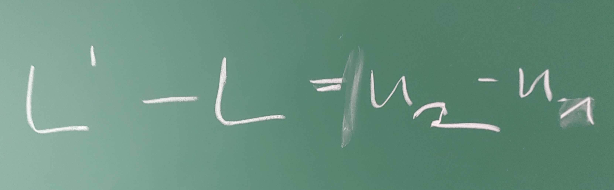

# Kapitel 2: Statische Modelle am Beispiel des Fachwerks

- 2.1: Einführung und historische Entwicklung
- 2.2: Das ideale Fachwerk in 2D
- 2.3: Das elastische Fachwerk in 2D 

---

## 2.1: Einführung und historische Entwicklung

---

### Was ist ein statisches Modell?

- Beschreibt ein System im **Ruhezustand** (im Gleichgewicht).
- Alle wirkenden Kräfte und Momente heben sich gegenseitig auf.
- $\sum \vec{F} = 0$ und $\sum \vec{M} = 0$
- Das Modell ist **zeitunabhängig**.
- **Typische Fragestellung**: Welche Kräfte wirken innerhalb einer Struktur (z.B. einer Brücke) und wie stark verformt sie sich unter einer gegebenen, konstanten Last?

---

### Das Fachwerk als klassisches Beispiel

Ein **Fachwerk** ist ein Tragwerk, das aus einzelnen Stäben zusammengesetzt ist, die an ihren Enden durch Knoten (Gelenke) miteinander verbunden sind.


---

### Historische Entwicklung

- **Antike**: Römer nutzen grundlegende Prinzipien für Brücken und Aquädukte (Bögen, aber auch frühe Holzfachwerke).
- **Mittelalter/Renaissance**: Bau von Dachstühlen in Kirchen und Kathedralen. Das Wissen ist rein empirisch (Erfahrungswissen).
- **18. Jahrhundert**: Leonhard Euler leistet Pionierarbeit in der Balkentheorie und Stabilitätsanalyse (z.B. Knickung).
- **19. Jahrhundert**: Das Zeitalter der Eisenbahn erfordert lange, stabile und leichte Brücken. Die Fachwerktheorie wird formalisiert.

---

### Pioniere der Fachwerktheorie

<div class="columns top">
<div class="one">

**Squire Whipple<br/>(1847)**
- "A Work on Bridge Building"
- Entwickelt als einer der ersten die korrekte mathematische Methode zur Berechnung der Kräfte in den Stäben eines Fachwerks (Ritter'sches Schnittverfahren, Knotenpunktverfahren).

</div>
<div class="one">

**Karl Culmann & Luigi Cremona (ca. 1860)**
- Entwickeln die **grafische Statik**.
- Mit dem **Cremonaplan** können die Stabkräfte zeichnerisch ermittelt werden – eine geniale Methode für das Zeitalter ohne Computer.

</div>
<div class="one">

**James Clerk Maxwell<br/>(1864)**
- Führt das **Kräfteplanverfahren** ein und erkennt, dass die Stabkräfte als reziproke Figuren zum Lageplan des Fachwerks aufgefasst werden können.

</div>
</div>

---

### Fragestellungen an das Modell

- **Stabilität**: Ist das Fachwerk unter der gegebenen Lagerung und Last statisch bestimmt und stabil?
- **Interne Kräfte**: Welche Zug- oder Druckkraft wirkt in jedem einzelnen Stab? (Dimensionierung der Stäbe)
- **Verformung**: Wie stark verschieben sich die Knoten unter der Last? (Nur mit elastischem Modell beantwortbar)
- **Optimierung**: Wie kann das Fachwerk mit minimalem Materialeinsatz (Gewicht) für eine gegebene Last entworfen werden?

---

## 2.2: Das ideale Fachwerk in 2D

---

### Annahmen des idealen Fachwerks

1.  Die Stäbe sind **gerade** und haben ein **vernachlässigbares Eigengewicht**.
2.  Die Stäbe sind an ihren Enden durch **reibungsfreie Gelenke** (Knoten) verbunden.
3.  Äußere Kräfte (Lasten) greifen **ausschließlich an den Knoten** an.

**Folgerung**: In den Stäben treten nur **Normalkräfte** (Zug- oder Druckkräfte) in Längsrichtung auf, keine Biegemomente oder Querkräfte.


---

### Mathematische Modellierung: Knotenpunktverfahren

- Wir betrachten jeden Knoten einzeln.
- Für jeden Knoten muss ein **Kräftegleichgewicht** in x- und y-Richtung herrschen.
- $\sum F_x = 0$
- $\sum F_y = 0$


---

### Aufstellen des Gleichungssystems

- Für ein Fachwerk mit $k$ Knoten erhalten wir $2k$ Gleichungen.
- Die Unbekannten sind die Kräfte in den $s$ Stäben und die $l$ Lagerreaktionen.
- Wenn $2k = s + l$, ist das System **statisch bestimmt** und (im Prinzip) lösbar.
- Jede Gleichung beschreibt, wie die Stab- und Lagerkräfte zur Einhaltung des Gleichgewichts an einem Knoten in einer Richtung beitragen.

---

### Beispiel: Gleichung für Knoten 2, x-Richtung

<div class="columns">
<div class="one">

Betrachten wir die Gleichgewichtsbedingung in x-Richtung am Knoten 2:

$\sum F_{2,x} = 0$

Die Stabkräfte $S_1$, $S_2$ und $S_5$ haben eine Komponente in x-Richtung.

$S_1 \cdot \cos(\alpha_1) + S_2 \cdot \cos(\alpha_2) + S_5 \cdot \cos(\alpha_5) = 0$

Die Winkel $\alpha_i$ ergeben sich aus der Geometrie der Stäbe.

</div>
<div class="one">


</div>
</div>

---

### Das lineare Gleichungssystem (LGS)

Wenn wir dies für alle Knoten und beide Richtungen tun, erhalten wir ein lineares Gleichungssystem der Form:

$A \cdot x = b$

- $A$: Die **Koeffizientenmatrix** (Geometriematrix). Sie enthält die Kosinus- und Sinus-Werte der Stabwinkel und beschreibt, wie die Stäbe an den Knoten "zusammenhängen".
- $x$: Der **Lösungsvektor**. Er enthält die unbekannten Stabkräfte und Lagerreaktionen.
- $b$: Der **Lastvektor**. Er enthält die an den Knoten angreifenden externen Kräfte.

---

### Die Geometriematrix A im Detail

- Jede **Zeile** der Matrix $A$ entspricht einer Gleichgewichtsbedingung (z.B. Knoten 3, y-Richtung).
- Jede **Spalte** der Matrix $A$ entspricht einer unbekannten Kraft (z.B. Stabkraft $S_4$).
- Der Eintrag $A_{ij}$ ist der Koeffizient (z.B. $\cos(\alpha)$), mit dem die unbekannte Kraft $j$ in die Gleichung $i$ eingeht.
- Viele Einträge in $A$ sind Null, da ein Stab nur an zwei Knoten angreift. Man spricht von einer **dünn besetzten Matrix** (sparse matrix).

---

### Lösung des LGS

Um die unbekannten Kräfte $x$ zu finden, müssen wir das LGS lösen:

$x = A^{-1} \cdot b$

- Die direkte Berechnung der Inversen $A^{-1}$ ist numerisch aufwändig und instabil.
- In der Praxis verwendet man robustere und effizientere Algorithmen.

---

### Algorithmen zur Lösung von LGS

<div class="columns top">
<div class="one">

**Direkte Löser**
- Finden die exakte Lösung (abgesehen von Rundungsfehlern) in einer endlichen Anzahl von Schritten.
- **Gauß-Elimination**: Umformung der Matrix $A$ in eine obere Dreiecksmatrix, die dann einfach durch Rückwärtseinsetzen gelöst werden kann.
- **LU-Zerlegung**: Zerlegung von $A$ in eine untere ($L$) und eine obere ($U$) Dreiecksmatrix ($A = L \cdot U$). Die Lösung von $L \cdot (U \cdot x) = b$ erfolgt dann in zwei einfachen Schritten.

</div>
<div class="one">

**Iterative Löser**
- Starten mit einer Schätzung und verbessern die Lösung schrittweise.
- Oft effizienter für sehr große, dünn besetzte Systeme.
- Beispiele: Jacobi-Verfahren, Gauß-Seidel-Verfahren.

</div>
</div>

---

### Verwendung von Bibliotheken

- Das Rad muss nicht neu erfunden werden.
- Numerische Bibliotheken bieten hochoptimierte und stabile Implementierungen dieser Algorithmen.
- **Beispiel für .NET**: `Math.NET Numerics`

```csharp
using MathNet.Numerics.LinearAlgebra;

// Erstelle Matrix A und Vektor b
var A = Matrix<double>.Build.DenseOfArray(new double[,] { ... });
var b = Vector<double>.Build.Dense(new double[] { ... });

// Löse das Gleichungssystem A*x = b
var x = A.Solve(b);

// x enthält jetzt die Stab- und Lagerkräfte
```

---

### Programmtechnische Umsetzung: Datenstrukturen

Wie repräsentieren wir ein Fachwerk im Code?

```csharp
// Ein Knoten hat eine Position und eine externe Kraft
public class Node
{
    public int Id { get; set; }
    public double X { get; set; }
    public double Y { get; set; }
    public double Fx { get; set; } // Externe Kraft
    public double Fy { get; set; }
}

// Ein Stab verbindet zwei Knoten
public class Bar
{
    public int Id { get; set; }
    public Node StartNode { get; set; }
    public Node EndNode { get; set; }
    public double Force { get; set; } // Berechnetes Ergebnis
}
```

---

<div class="columns">
<div>

### 2D-Visualisierung: Die Herausforderung

- Das Fachwerk existiert in "Weltkoordinaten" (z.B. in Metern).
- Der Computerbildschirm (z.B. ein `WPF Canvas`) verwendet "Bildschirmkoordinaten" (in Pixel).
- Wir benötigen eine Transformation, um unsere Welt auf den Bildschirm abzubilden.

</div>
<div>


</div>
</div>

---

<div class="columns">
<div>

### Transformation: Welt -> Bildschirm

Die Transformation besteht meist aus drei Schritten:

1.  **Skalierung**: Das Fachwerk muss so vergrößert oder verkleinert werden, dass es gut auf den Canvas passt. Man berechnet einen Skalierungsfaktor.
2.  **Translation (Verschiebung)**: Der Ursprung des Fachwerks soll an eine bestimmte Stelle auf dem Canvas verschoben werden (z.B. in die Mitte).
3.  **Invertierung der Y-Achse**: In der Mathematik zeigt die Y-Achse nach oben, bei den meisten 2D-Grafiksystemen nach unten.

</div>
<div>


</div>
</div>

---

### Umrechnung im Detail

```csharp
// Annahmen:
// canvasWidth, canvasHeight: Größe des Canvas in Pixel
// worldRect: Bounding Box des Fachwerks in Weltkoordinaten
// margin: Rand in Pixel

// 1. Skalierungsfaktor berechnen
double scaleX = (canvasWidth - 2 * margin) / worldRect.Width;
double scaleY = (canvasHeight - 2 * margin) / worldRect.Height;
double scale = Math.Min(scaleX, scaleY);

// 2. Transformation für einen Punkt (worldX, worldY)
double screenX = margin + (worldX - worldRect.Left) * scale;
double screenY = margin + (worldRect.Top - worldY) * scale; // Y-Achse invertiert!

return new Point(screenX, screenY);
```

---

<div class="columns">
<div>

### Visualisierung der Kräfte: Pfeile

- Die berechneten Stabkräfte (Zug/Druck) und externen Kräfte sollen als Pfeile dargestellt werden.
- Ein Pfeil besteht aus einem **Pfeilkörper** (eine Linie) und einer **Pfeilspitze**.
- Die Pfeilspitze ist ein kleines Dreieck (oder ein anderes Polygon) am Ende des Pfeilkörpers.
- Um sie zu zeichnen, benötigen wir die Koordinaten ihrer Eckpunkte.
- Diese können wir aus dem Endpunkt der Linie und dem Richtungsvektor der Linie berechnen.

</div>
<div>


</div>

---

### Berechnung der Pfeilspitze

```cshrap
TODO
```

---

## 2.3: Das elastische Fachwerk in 2D

---

### Grenzen des idealen Fachwerks

- Das ideale Fachwerkmodell kann nur die **Kräfte** berechnen.
- Es kann **keine Aussage über Verformungen** treffen, da die Stäbe als unendlich steif angenommen werden.
- In der Realität ist jeder Werkstoff elastisch und verformt sich unter Last.
- **Fragestellung**: Wie stark verschieben sich die Knoten, wenn eine Last angreift?

---

### Das elastische Modell: Neue Annahmen

- Die Stäbe sind nicht mehr starr, sondern **elastisch**. Ihr Verhalten wird durch das **Hooke'sche Gesetz** beschrieben.
- Die Knoten sind weiterhin **gelenkig**.
- Die entscheidende neue Unbekannte sind nicht die Stabkräfte, sondern die **Knotenverschiebungen** $\vec{u}$.

---

### Hooke'sches Gesetz für einen Stab

Die Kraft $S$ in einem Stab ist proportional zu seiner Längenänderung $\Delta L$.

$S = \frac{E \cdot A}{L_0} \cdot \Delta L$

- $E$: **Elastizitätsmodul** (Materialkonstante, z.B. für Stahl ca. 210 GPa)
- $A$: **Querschnittsfläche** des Stabes
- $L_0$: **Anfangslänge** des Stabes
- Der Term $\frac{E \cdot A}{L_0}$ wird als **Stabsteifigkeit** $k$ bezeichnet.

---

### Von der Längenänderung zur Knotenverschiebung

- Die Längenänderung $\Delta L$ eines Stabes hängt von den Verschiebungen seiner beiden Endknoten ab.
- Für einen Stab zwischen Knoten $i$ und $j$ mit Verschiebungsvektoren $\vec{u}_i$ und $\vec{u}_j$:
- $\Delta L \approx (\vec{u}_j - \vec{u}_i) \cdot \vec{e}$
- $\vec{e}$ ist der Einheitsvektor in Richtung des Stabes.



---

### Die Linearisierung: Kleine-Verformungs-Theorie

- Die exakte Berechnung von $\Delta L$ ist kompliziert, da sich die Richtung des Stabes $\vec{e}$ mit der Verformung ändert (geometrische Nichtlinearität).
- **Vereinfachung**: Wir nehmen an, dass die Verformungen $\vec{u}$ so **klein** sind, dass sich die Geometrie des Fachwerks nicht nennenswert ändert.
- Wir können also für die Berechnung den Einheitsvektor $\vec{e}$ des **unverformten** Stabes verwenden.
- Dies ist eine **Linearisierung**, die für die meisten Anwendungen im Hoch- und Maschinenbau gültig ist.

---

<div class="columns">
<div>

### Stab-Steifigkeitsbeziehung

Kombiniert man Hooke'sches Gesetz und die Längenänderungs-Beziehung, erhält man eine Beziehung zwischen den Kräften, die auf die Knoten eines Stabes wirken, und den Verschiebungen dieser Knoten.

Dies lässt sich als **Stab-Steifigkeitsmatrix** $k_{stab}$ formulieren:

$\begin{pmatrix} F_{ix} \\ F_{iy} \\ F_{jx} \\ F_{jy} \end{pmatrix} = k_{stab} \cdot \begin{pmatrix} u_{ix} \\ u_{iy} \\ u_{jx} \\ u_{jy} \end{pmatrix}$

</div>
<div>


</div>
</div>

---

### Assemblierung der globalen Steifigkeitsmatrix

- Der entscheidende Schritt ist die "Assemblierung": Die einzelnen Stab-Steifigkeitsmatrizen werden zu einer **globalen Steifigkeitsmatrix** $K$ für das gesamte Fachwerk zusammengesetzt.
- Das Prinzip lautet: Die globale Steifigkeit an einem Knoten ist die Summe der Steifigkeiten aller Stäbe, die an diesem Knoten zusammentreffen.
- Dieser Prozess folgt einem festen Algorithmus und lässt sich gut programmieren.

---

### Das globale Gleichungssystem

Das Ergebnis ist wieder ein lineares Gleichungssystem, diesmal für das elastische Fachwerk:

$K \cdot u = f$

- $K$: Die **globale Steifigkeitsmatrix**. Sie hängt von der Geometrie und den Materialeigenschaften (E, A) ab. Sie ist quadratisch, symmetrisch und (für stabile Fachwerke) positiv definit.
- $u$: Der Vektor der unbekannten **Knotenverschiebungen**.
- $f$: Der Vektor der bekannten **externen Knotenkräfte**.

---

<div class="columns">
<div>

### Einbau der Randbedingungen

- Das bisherige System $K \cdot u = f$ ist singulär (nicht lösbar), da das Fachwerk noch "frei im Raum schwebt".
- Wir müssen die **Lagerungen** (Randbedingungen) einbauen.
- An einem gelagerten Knoten ist die Verschiebung bekannt (meistens Null).
- z.B. $u_{1x} = 0$, $u_{1y} = 0$.
- Dies führt zur Modifikation des Gleichungssystems (z.B. durch Streichen von Zeilen/Spalten oder Setzen von großen Diagonalelementen).

</div>
<div>


</div>
</div>

---

### Lösung und Ergebnisse

1.  **Löse $K \cdot u = f$ nach $u$ auf**: Das Ergebnis sind die Verschiebungen aller Knoten.
2.  **Post-Processing**:
    - Aus den Knotenverschiebungen $u$ kann für jeden Stab die Längenänderung $\Delta L$ berechnet werden.
    - Aus $\Delta L$ kann mit dem Hooke'schen Gesetz die **Stabkraft** $S$ berechnet werden.

Das elastische Modell liefert uns also sowohl die **Verformungen** als auch die **Kräfte**!

---

# Zusammenfassung Kapitel 1

- **Statische Modelle** beschreiben Systeme im Gleichgewicht und sind die Grundlage der Strukturanalyse.
- Das **ideale Fachwerk** ist ein einfaches Modell zur Berechnung von Stabkräften mittels linearer Gleichungssysteme.
- Das **elastische Fachwerk** erweitert dies um Materialeigenschaften und erlaubt die Berechnung von Verformungen. Die **Linearisierung** ist hier eine entscheidende Vereinfachung.
- Die **Visualisierung** ist entscheidend und erfordert Transformationen (2D).
