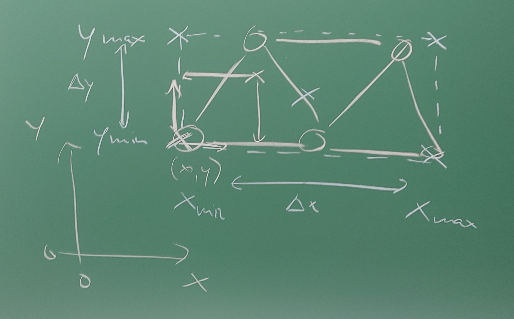

# Kapitel 2: Statische Modelle am Beispiel des Fachwerks

Dieses Kapitel umfasst die folgenden Abschnitte:

- 2.1: Einführung und historische Entwicklung
- 2.2: Das ideale Fachwerk in 2D
- 2.3: Das elastische Fachwerk in 2D
- 2.4: Programmtechnische Umsetzung
- 2.5: 2D-Visualisierung mit WPF Canvas

---

## 2.1: Einführung und historische Entwicklung

Dieser Abschnitt umfasst die folgenden Inhalte:

- Definition eines statischen Modells
- Das Fachwerk als Anwendungsbeispiel
- Historischer Abriss der Fachwerktheorie
- Typische Fragestellungen für die Modellierung

---

### Was ist ein statisches Modell?

- Beschreibt ein System im **Ruhezustand** (im Gleichgewicht).
- Alle wirkenden Kräfte und Momente heben sich gegenseitig auf.
- $\sum \vec{F} = 0$ und $\sum \vec{M} = 0$
- Das Modell ist **zeitunabhängig**.
- **Typische Fragestellung**: Welche Kräfte wirken innerhalb einer Struktur (z.B. einer Brücke) und wie stark verformt sie sich unter einer gegebenen, konstanten Last?

---

<div class="columns">
<div>

### Das Fachwerk als klassisches Beispiel

Ein **Fachwerk** ist ein Tragwerk, das aus einzelnen Stäben zusammengesetzt ist, die an ihren Enden durch Knoten (Gelenke) miteinander verbunden sind.

</div>
<div>


</div>
</div>

---

### Historische Entwicklung

- **Antike**: Römer nutzen grundlegende Prinzipien für Brücken und Aquädukte (Bögen, aber auch frühe Holzfachwerke).
- **Mittelalter/Renaissance**: Bau von Dachstühlen in Kirchen und Kathedralen. Das Wissen ist rein empirisch (Erfahrungswissen).
- **18. Jahrhundert**: Leonhard Euler leistet Pionierarbeit in der Balkentheorie und Stabilitätsanalyse (z.B. Knickung).
- **19. Jahrhundert**: Das Zeitalter der Eisenbahn erfordert lange, stabile und leichte Brücken. Die Fachwerktheorie wird formalisiert.

---

### Pioniere der Fachwerktheorie

<div class="columns top">
<div class="one">

**Squire Whipple<br/>(1847)**
- "A Work on Bridge Building"
- Entwickelt als einer der ersten die korrekte mathematische Methode zur Berechnung der Kräfte in den Stäben eines Fachwerks (Ritter'sches Schnittverfahren, Knotenpunktverfahren).

</div>
<div class="one">

**Karl Culmann & Luigi Cremona (ca. 1860)**
- Entwickeln die **grafische Statik**.
- Mit dem **Cremonaplan** können die Stabkräfte zeichnerisch ermittelt werden – eine geniale Methode für das Zeitalter ohne Computer.

</div>
<div class="one">

**James Clerk Maxwell<br/>(1864)**
- Führt das **Kräfteplanverfahren** ein und erkennt, dass die Stabkräfte als reziproke Figuren zum Lageplan des Fachwerks aufgefasst werden können.

</div>
</div>

---

### Fragestellungen an das Modell

- **Stabilität**: Ist das Fachwerk unter der gegebenen Lagerung und Last statisch bestimmt und stabil?
- **Interne Kräfte**: Welche Zug- oder Druckkraft wirkt in jedem einzelnen Stab? (Dimensionierung der Stäbe)
- **Verformung**: Wie stark verschieben sich die Knoten unter der Last? (Nur mit elastischem Modell beantwortbar)
- **Optimierung**: Wie kann das Fachwerk mit minimalem Materialeinsatz (Gewicht) für eine gegebene Last entworfen werden?

---

## 2.2: Das ideale Fachwerk in 2D

Dieser Abschnitt umfasst die folgenden Inhalte:

- Annahmen und physikalische Grundlagen
- Aufstellen des linearen Gleichungssystems (LGS)
- Algorithmen zur Lösung des LGS

---

<div class="columns">
<div>

### Annahmen des idealen Fachwerks

1.  Die Stäbe sind **gerade** und haben ein **vernachlässigbares Eigengewicht**.
2.  Die Stäbe sind an ihren Enden durch **reibungsfreie Gelenke** (Knoten) verbunden.
3.  Äußere Kräfte (Lasten) greifen **ausschließlich an den Knoten** an.

**Folgerung**: In den Stäben treten nur **Normalkräfte** (Zug- oder Druckkräfte) in Längsrichtung auf, keine Biegemomente oder Querkräfte.

</div>
<div>


</div>
</div>

---

### Mathematische Beschreibung des Fachwerks

Um das Fachwerk mathematisch zu beschreiben, definieren wir:

1.  **Eine Menge von Knoten**: $N = \{n_1, n_2, ..., n_k\}$
    - Jeder Knoten $n_i$ hat als Eigenschaften:
        - Eine Position $\vec{p}_i = (x_i, y_i)$.
        - Eine externe Kraft $\vec{F}_{ext,i}$ (kann auch $\vec{0}$ sein).
        - Lagerbedingungen (z.B. fix in x/y, frei).

2.  **Eine Menge von Stäben**: $R = \{r_1, r_2, ..., r_s\}$
    - Jeder Stab $r_j$ verbindet zwei Knoten, z.B. $r_j = (n_a, n_b)$ mit $n_a, n_b \in N$.
    - Jedem Stab ist eine unbekannte Stabkraft $S_j$ zugeordnet.

Ziel ist es, die Stabkräfte $S_j$ und die Lagerreaktionen zu finden.

---

### Kräftegleichgewicht in jedem Knoten

Für einen Stab zwischen Knoten $i$ (Position $\vec{p}_i$) und Knoten $k$ (Position $\vec{p}_k$):
1.  **Verbindungsvektor**: $\vec{v}_{ik} = \vec{p}_k - \vec{p}_i$
2.  **Stablänge**: $L_{ik} = |\vec{v}_{ik}|$
3.  **Normalisierter Richtungsvektor**: $\vec{e}_{ik} = \frac{\vec{v}_{ik}}{L_{ik}} = \begin{pmatrix} e_{x,ik} \\ e_{y,ik} \end{pmatrix}$

Die Kraft, die der Stab auf den Knoten $i$ ausübt, ist $\vec{F}_i = S_{ik} \cdot \vec{e}_{ik}$.

Das Gleichgewicht am Knoten $i$ lautet dann:

$\sum_{k} (S_{ik} \cdot \vec{e}_{ik}) + \vec{F}_{ext,i} = \vec{0}$

Aufgeteilt in Komponenten:
- $\sum_{k} S_{ik} \cdot e_{x,ik} + F_{ext,ix} = 0$
- $\sum_{k} S_{ik} \cdot e_{y,ik} + F_{ext,iy} = 0$

---

### Gesamtes Gleichungssystem

Stellt man die zwei Gleichgewichts-Gleichungen für jeden der $k$ Knoten auf, erhält man ein System von $2k$ linearen Gleichungen.

$$
\begin{pmatrix}
e_{x,11} & e_{x,12} & \dots & e_{x,1s} & 1 & 0 & \dots \\
e_{y,11} & e_{y,12} & \dots & e_{y,1s} & 0 & 1 & \dots \\
\vdots & \vdots & \ddots & \vdots & \vdots & \vdots & \ddots \\
e_{x,k1} & e_{x,k2} & \dots & e_{x,ks} & 0 & 0 & \dots \\
e_{y,k1} & e_{y,k2} & \dots & e_{y,ks} & 0 & 0 & \dots
\end{pmatrix}
\cdot
\begin{pmatrix}
S_1 \\
\vdots \\
S_s \\
F_{Lager,1,x} \\
F_{Lager,1,y} \\
\vdots
\end{pmatrix}
=
\begin{pmatrix}
-F_{ext,1,x} \\
-F_{ext,1,y} \\
\vdots \\
-F_{ext,k,x} \\
-F_{ext,k,y}
\end{pmatrix}
$$

- Die Matrix enthält die Koeffizienten ($e_{x,ik}, e_{y,ik}$) für jede Stabkraft $S_j$ und jede Lagerkraft in jeder Knotengleichung.
- Viele Einträge in der Matrix sind Null, da ein Stab nur an zwei Knoten angreift.

---

### Das lineare Gleichungssystem (LGS)

Allgemein schreiben wir das lineare Gleichungssystem so:

$A \cdot x = b$

Und so nennen wir die Variablen dieses Gleichungssystems:

- $A$: Die **Koeffizientenmatrix** (Geometriematrix). Sie enthält die normierten Richtungsvektoren der Stäbe und beschreibt, wie die Stäbe an den Knoten "zusammenhängen".
- $x$: Der **Lösungsvektor**. Er enthält die unbekannten Stabkräfte und Lagerreaktionen (die Gesuchten in unserer Problemstellung).
- $b$: Der **Lastvektor**. Er enthält die an den Knoten angreifenden externen Kräfte (gegebene Größen in unserer Problemstellung).

---

### Lösbarkeit des Gleichungssystems

Ein LGS $A \cdot x = b$ ist genau dann eindeutig lösbar, wenn die Koeffizientenmatrix $A$ **quadratisch** und **regulär** (invertierbar) ist.

- **Quadratisch**: Die Anzahl der Gleichungen muss der Anzahl der Unbekannten entsprechen. Für ein statisch bestimmtes Fachwerk ist dies der Fall ($2k = s + l$).
- **Regulär**: Die Determinante der Matrix muss ungleich null sein ($\det(A) \neq 0$).
    - Physikalisch bedeutet eine singuläre Matrix ($\det(A) = 0$), dass das Fachwerk **instabil** ist. Es würde unter Last kollabieren oder sich als Mechanismus bewegen.
    - Dies wird auch als **kinematische Unbestimmtheit** bezeichnet.

Die Lösbarkeit hängt also direkt von der statischen Bestimmtheit und Stabilität des Fachwerks ab.

---

### Lösung des LGS: Algorithmen

<div class="columns top">
<div class="one">

**Direkte Löser**
- Finden die exakte Lösung (abgesehen von Rundungsfehlern) in einer endlichen Anzahl von Schritten.
- **Gauß-Elimination**: Umformung der Matrix $A$ in eine obere Dreiecksmatrix.
- **LU-Zerlegung**: Zerlegung von $A$ in eine untere ($L$) und eine obere ($U$) Dreiecksmatrix.

</div>
<div class="one">

**Iterative Löser**
- Starten mit einer Schätzung und verbessern die Lösung schrittweise.
- Oft effizienter für sehr große, dünn besetzte Systeme.
- Beispiele: Jacobi-Verfahren, Gauß-Seidel-Verfahren.

</div>
</div>

---

### Direkter Löser: Gauß-Elimination

Das Gauß'sche Eliminationsverfahren ist ein klassischer Algorithmus zur Lösung von LGS.

**Vorgehen:**
1.  **Vorwärtselimination**: Das LGS $A \cdot x = b$ wird durch zeilenweise Umformungen in eine obere Dreiecksform $U \cdot x = c$ gebracht.
    - Für jede Spalte $j$ von $1$ bis $n-1$:
    - Eliminiere die Koeffizienten unterhalb der Diagonalen ($A_{ij}$ mit $i > j$) durch Subtraktion eines Vielfachen der $j$-ten Zeile.
    - Die gleichen Operationen werden auf den Vektor $b$ angewendet.
2.  **Rückwärtseinsetzen**: Das gestaffelte System wird von unten nach oben gelöst.
    - $x_n = c_n / U_{nn}$
    - $x_i = (c_i - \sum_{j=i+1}^{n} U_{ij} \cdot x_j) / U_{ii}$ für $i = n-1, ..., 1$.

---

### Direkter Löser: LU-Zerlegung

Die LU-Zerlegung faktorisiert die Matrix $A$ in ein Produkt aus einer unteren Dreiecksmatrix $L$ und einer oberen Dreiecksmatrix $U$, d.h. $A = L \cdot U$

**Vorgehen:**
1.  **Zerlegung**: Finde $L$ und $U$. Dies geschieht oft mit einer Variante des Gauß-Algorithmus. $L$ enthält die Multiplikatoren der Elimination, $U$ ist das Ergebnis der Vorwärtselimination.
2.  **Löse $A \cdot x = b$ in zwei Schritten:**
    - Ersetze $A$ durch $L \cdot U \implies L \cdot (U \cdot x) = b$.
    - Definiere $y = U \cdot x$.
    - **Vorwärtseinsetzen**: Löse $L \cdot y = b$ nach $y$.
    - **Rückwärtseinsetzen**: Löse $U \cdot x = y$ nach $x$.

**Vorteil**: Die teure Zerlegung muss nur einmal berechnet werden. Danach können LGS mit derselben Matrix $A$ aber unterschiedlichen Lastvektoren $b$ sehr schnell gelöst werden.

---

### Iterative Löser (z.B. Jacobi-Verfahren)

Iterative Löser nähern sich der Lösung schrittweise an. Sie sind besonders für große, dünn besetzte Matrizen geeignet.

**Grundidee:**
1.  Forme die Gleichung $A \cdot x = b$ um, sodass $x$ auf einer Seite isoliert wird.
2.  Zerlege dazu $A$ in $A = D + R$, wobei $D$ die Diagonale von $A$ ist und $R$ den Rest enthält.
3.  $D \cdot x + R \cdot x = b \implies D \cdot x = b - R \cdot x \implies x = D^{-1} \cdot (b - R \cdot x)$
4.  Daraus wird eine Iterationsvorschrift:
    $x^{(k+1)} = D^{-1} \cdot (b - R \cdot x^{(k)})$
5.  Starte mit einem Schätzwert $x^{(0)}$ und wiederhole die Iteration, bis die Änderung $\|x^{(k+1)} - x^{(k)}\|$ klein genug ist.

---

## 2.3: Das elastische Fachwerk in 2D

---

### Grenzen des idealen Fachwerks

- Das ideale Fachwerkmodell kann nur die **Kräfte** berechnen.
- Es kann **keine Aussage über Verformungen** treffen, da die Stäbe als unendlich steif angenommen werden.
- In der Realität ist jeder Werkstoff elastisch und verformt sich unter Last.
- **Fragestellung**: Wie stark verschieben sich die Knoten, wenn eine Last angreift?

---

### Das elastische Modell: Neue Annahmen

- Die Stäbe sind nicht mehr starr, sondern **elastisch**. Ihr Verhalten wird durch das **Hooke'sche Gesetz** beschrieben.
- Die Knoten sind weiterhin **gelenkig**.
- Die entscheidende neue Unbekannte sind nicht die Stabkräfte, sondern die **Knotenverschiebungen** $\vec{u}$.

---

### Hooke'sches Gesetz für einen Stab

Die Kraft $S$ in einem Stab ist proportional zu seiner Längenänderung $\Delta L$.

$S = \frac{E \cdot A}{L_0} \cdot \Delta L$

- $E$: **Elastizitätsmodul** (Materialkonstante, z.B. für Stahl ca. 210 GPa)
- $A$: **Querschnittsfläche** des Stabes
- $L_0$: **Anfangslänge** des Stabes
- Der Term $\frac{E \cdot A}{L_0}$ wird als **Stabsteifigkeit** $k$ bezeichnet.

---

<div class="columns">
<div>

### Von der Längenänderung zur Knotenverschiebung

- Die Längenänderung $\Delta L$ eines Stabes hängt von den Verschiebungen seiner beiden Endknoten ab.
- Für einen Stab zwischen Knoten $i$ und $j$ mit Verschiebungsvektoren $\vec{u}_i$ und $\vec{u}_j$:
- $\Delta L \approx (\vec{u}_j - \vec{u}_i) \cdot \vec{e}$
- $\vec{e}$ ist der Einheitsvektor in Richtung des Stabes.

</div>
<div>


</div>
</div>

---

### Die Linearisierung: Kleine-Verformungs-Theorie

- Die exakte Berechnung von $\Delta L$ ist kompliziert, da sich die Richtung des Stabes $\vec{e}$ mit der Verformung ändert (geometrische Nichtlinearität).
- **Vereinfachung**: Wir nehmen an, dass die Verformungen $\vec{u}$ so **klein** sind, dass sich die Geometrie des Fachwerks nicht nennenswert ändert.
- Wir können also für die Berechnung den Einheitsvektor $\vec{e}$ des **unverformten** Stabes verwenden.
- Dies ist eine **Linearisierung**, die für die meisten Anwendungen im Hoch- und Maschinenbau gültig ist.

---

<div class="columns">
<div>

### Stab-Steifigkeitsbeziehung

Kombiniert man Hooke'sches Gesetz und die Längenänderungs-Beziehung, erhält man eine Beziehung zwischen den Kräften, die auf die Knoten eines Stabes wirken, und den Verschiebungen dieser Knoten.

Dies lässt sich als **Stab-Steifigkeitsmatrix** $k_{stab}$ formulieren:

$\begin{pmatrix} F_{ix} \\ F_{iy} \\ F_{jx} \\ F_{jy} \end{pmatrix} = k_{stab} \cdot \begin{pmatrix} u_{ix} \\ u_{iy} \\ u_{jx} \\ u_{jy} \end{pmatrix}$

</div>
<div>


</div>
</div>

---

### Assemblierung der globalen Steifigkeitsmatrix

- Der entscheidende Schritt ist die "Assemblierung": Die einzelnen Stab-Steifigkeitsmatrizen werden zu einer **globalen Steifigkeitsmatrix** $K$ für das gesamte Fachwerk zusammengesetzt.
- Das Prinzip lautet: Die globale Steifigkeit an einem Knoten ist die Summe der Steifigkeiten aller Stäbe, die an diesem Knoten zusammentreffen.
- Dieser Prozess folgt einem festen Algorithmus und lässt sich gut programmieren.

---

### Das globale Gleichungssystem

Das Ergebnis ist wieder ein lineares Gleichungssystem, diesmal für das elastische Fachwerk:

$K \cdot u = f$

- $K$: Die **globale Steifigkeitsmatrix**. Sie hängt von der Geometrie und den Materialeigenschaften (E, A) ab. Sie ist quadratisch, symmetrisch und (für stabile Fachwerke) positiv definit.
- $u$: Der Vektor der unbekannten **Knotenverschiebungen**.
- $f$: Der Vektor der bekannten **externen Knotenkräfte**.

---

<div class="columns">
<div>

### Einbau der Randbedingungen

- Das bisherige System $K \cdot u = f$ ist singulär (nicht lösbar), da das Fachwerk noch "frei im Raum schwebt".
- Wir müssen die **Lagerungen** (Randbedingungen) einbauen.
- An einem gelagerten Knoten ist die Verschiebung bekannt (meistens Null).
- z.B. $u_{1x} = 0$, $u_{1y} = 0$.
- Dies führt zur Modifikation des Gleichungssystems (z.B. durch Streichen von Zeilen/Spalten oder Setzen von großen Diagonalelementen).

</div>
<div>


</div>
</div>

---

### Lösung und Ergebnisse

1.  **Löse $K \cdot u = f$ nach $u$ auf**: Das Ergebnis sind die Verschiebungen aller Knoten.
2.  **Post-Processing**:
    - Aus den Knotenverschiebungen $u$ kann für jeden Stab die Längenänderung $\Delta L$ berechnet werden.
    - Aus $\Delta L$ kann mit dem Hooke'schen Gesetz die **Stabkraft** $S$ berechnet werden.

Das elastische Modell liefert uns also sowohl die **Verformungen** als auch die **Kräfte**!

---

## 2.4: Programmtechnische Umsetzung

Dieser Abschnitt umfasst die folgenden Inhalte:

- Datenstrukturen zur Repräsentation eines Fachwerks
- Klassen für Knoten (`Node`), Stäbe (`Rod`) und das Fachwerk (`Truss`)
- Verwendung von numerischen Bibliotheken am Beispiel von `Math.NET Numerics`

---

<div class="columns">
<div class="five">

### Programmtechnische Umsetzung: Datenstrukturen

Das UML-Diagramm zeigt die drei zentralen Klassen:
- **`Truss`**: Die Hauptklasse, die das gesamte Fachwerk repräsentiert. Sie enthält eine Liste aller `Node` (Knoten) und `Rod` (Stäbe). Die `Solve`-Methode kapselt die Berechnung.
- **`Node`**: Repräsentiert einen einzelnen Knotenpunkt mit seiner Position, Lagerung (fix/frei) und den an ihm angreifenden externen Kräften.
- **`Rod`**: Repräsentiert einen einzelnen Stab, der zwei `Node`-Objekte verbindet. Nach der Berechnung enthält er die ermittelte Stabkraft (`Force`).

</div>
<div>


</div>
</div>

---

<div class="columns">
<div>

### Die `Node`-Klasse

Die `Node`-Klasse speichert alle relevanten Informationen für einen einzelnen Knotenpunkt:
- **`Name`**: Ein Bezeichner für den Knoten.
- **`PositionX`, `PositionY`**: Die Koordinaten des Knotens in der 2D-Ebene.
- **`FixX`, `FixY`**: Boole'sche Werte, die angeben, ob der Knoten in X- oder Y-Richtung als Festlager fixiert ist.
- **`ForceX`, `ForceY`**: Die an diesem Knoten angreifenden externen Kräfte (Lasten).

</div>
<div>

```csharp
public class Node
{
    public string Name { get; set; }
    
    // Position des Knotens
    public double PositionX { get; set; }
    public double PositionY { get; set; }

    // Lagerung des Knoten (true = fixiert)
    public bool FixX { get; set; }
    public bool FixY { get; set; }

    // Last- oder Lagerkraft
    public double ForceX { get; set; }
    public double ForceY { get; set; }
}
```

</div>
</div>

---

<div class="columns">
<div>

### Die `Rod`-Klasse

Die `Rod`-Klasse ist die einfachste Struktur:
- Sie verbindet zwei Knoten (`NodeA`, `NodeB`).
- Das `Force`-Feld speichert das Ergebnis der Berechnung: die Zug- (positiv) oder Druckkraft (negativ) im Stab.

</div>
<div>

```csharp
public class Rod
{
    public Node NodeA { get; set; }
    public Node NodeB { get; set; }
    
    // Berechnetes Ergebnis
    public double Force { get; set; }
}
```

</div>
</div>

---

<div class="columns">
<div>

### Die `Truss`-Klasse

Die `Truss`-Klasse orchestriert das Modell:
- Sie hält Listen für alle Knoten und Stäbe.
- `AddNode` und `AddRod` sind "Factory"-Methoden, um das Fachwerk einfach aufzubauen.
- Die `Solve`-Methode (hier nur angedeutet) ist der Ort, an dem die Koeffizientenmatrix `A` und der Lastvektor `b` aufgebaut und das LGS gelöst wird.

</div>
<div>

```csharp
public class Truss
{
    public List<Node> Nodes = new List<Node>();
    public List<Rod> Rods = new List<Rod>();

    public Node AddNode(
            double positionX, double positionY,
            bool fixX, bool fixY,
            double forceX, double forceY)
    {
        // ... Implementierung ...
    }

    public Rod AddRod(Node a, Node b)
    {
        // ... Implementierung ...
    }

    public void Solve()
    {
        // Hier wird das LGS aufgebaut und gelöst
    }
}
```

</div>
</div>

---

### Verwendung von Bibliotheken

- Das Rad muss nicht neu erfunden werden.
- Numerische Bibliotheken bieten hochoptimierte und stabile Implementierungen dieser Algorithmen.
- **Beispiel für .NET**: `Math.NET Numerics`

```csharp
using MathNet.Numerics.LinearAlgebra;

// Erstelle Matrix A und Vektor b
var A = Matrix<double>.Build.DenseOfArray(new double[,] { ... });
var b = Vector<double>.Build.Dense(new double[] { ... });

// Löse das Gleichungssystem A*x = b
var x = A.Solve(b);

// x enthält jetzt die Stab- und Lagerkräfte
```

---

## 2.5: 2D-Visualisierung mit WPF Canvas

Dieser Abschnitt umfasst die folgenden Inhalte:

- Die Herausforderung: Transformation von Welt- zu Bildschirmkoordinaten
- Schritte der Transformation: Skalierung, Translation, Y-Invertierung
- Visualisierung von Kräften mittels Pfeilen

---

<div class="columns">
<div>

### 2D-Visualisierung: Die Herausforderung

- Das Fachwerk existiert in "Weltkoordinaten" (z.B. in Metern).
- Der Computerbildschirm (z.B. ein `WPF Canvas`) verwendet "Bildschirmkoordinaten" (in Pixel).
- Wir benötigen eine Transformation, um unsere Welt auf den Bildschirm abzubilden.

</div>
<div>



</div>
</div>

---

<div class="columns">
<div>

### Transformation: Welt -> Bildschirm

Die Transformation besteht meist aus drei Schritten:

1.  **Skalierung**: Das Fachwerk muss so vergrößert oder verkleinert werden, dass es gut auf den Canvas passt. Man berechnet einen Skalierungsfaktor.
2.  **Translation (Verschiebung)**: Der Ursprung des Fachwerks soll an eine bestimmte Stelle auf dem Canvas verschoben werden (z.B. in die Mitte).
3.  **Invertierung der Y-Achse**: In der Mathematik zeigt die Y-Achse nach oben, bei den meisten 2D-Grafiksystemen nach unten.

</div>
<div>


</div>
</div>

---

### Umrechnung im Detail

```csharp
// Annahmen:
// canvasWidth, canvasHeight: Größe des Canvas in Pixel
// worldRect: Bounding Box des Fachwerks in Weltkoordinaten
// margin: Rand in Pixel

// 1. Skalierungsfaktor berechnen
double scaleX = (canvasWidth - 2 * margin) / worldRect.Width;
double scaleY = (canvasHeight - 2 * margin) / worldRect.Height;
double scale = Math.Min(scaleX, scaleY);

// 2. Transformation für einen Punkt (worldX, worldY)
double screenX = margin + (worldX - worldRect.Left) * scale;
double screenY = margin + (worldRect.Top - worldY) * scale; // Y-Achse invertiert!

return new Point(screenX, screenY);
```

---

<div class="columns">
<div>

### Visualisierung der Kräfte: Pfeile

- Die berechneten Stabkräfte (Zug/Druck) und externen Kräfte sollen als Pfeile dargestellt werden.
- Ein Pfeil besteht aus einem **Pfeilkörper** (eine Linie) und einer **Pfeilspitze**.
- Die Pfeilspitze ist ein kleines Dreieck (oder ein anderes Polygon) am Ende des Pfeilkörpers.
- Um sie zu zeichnen, benötigen wir die Koordinaten ihrer Eckpunkte.
- Diese können wir aus dem Endpunkt der Linie und dem Richtungsvektor der Linie berechnen.

</div>
<div>


</div>

---

### Berechnung der Pfeilspitze

```csharp
/// <summary>
/// Berechnet die Punkte für eine Pfeilspitze.
/// </summary>
/// <param name="tip">Die Position der Pfeilspitze.</param>
/// <param name="direction">Der normalisierte Richtungsvektor des Pfeils.</param>
/// <param name="size">Die Größe der Pfeilspitze.</param>
/// <returns>Ein Array von Punkten für das Pfeilspitzen-Polygon.</returns>
public Point[] GetArrowhead(Point tip, Vector direction, double size)
{
    // Vektor, der 90° zur Richtung steht
    var perpendicular = new Vector(-direction.Y, direction.X);

    // Eckpunkte der Pfeilspitze berechnen
    // (zurück entlang der Richtung und dann seitlich)
    var p1 = tip - (size * direction) + (size / 2 * perpendicular);
    var p2 = tip - (size * direction) - (size / 2 * perpendicular);

    return new Point[] { tip, p1, p2 };
}
```

---

# Zusammenfassung Kapitel 2

- **Statische Modelle** beschreiben Systeme im Gleichgewicht und sind die Grundlage der Strukturanalyse.
- Das **ideale Fachwerk** ist ein einfaches Modell zur Berechnung von Stabkräften mittels linearer Gleichungssysteme.
- Das **elastische Fachwerk** erweitert dies um Materialeigenschaften und erlaubt die Berechnung von Verformungen. Die **Linearisierung** ist hier eine entscheidende Vereinfachung.
- Die **programmtechnische Umsetzung** erfordert geeignete Datenstrukturen und die Nutzung numerischer Bibliotheken.
- Die **Visualisierung** ist entscheidend für die Interpretation der Ergebnisse und erfordert Transformationen zwischen Koordinatensystemen.
