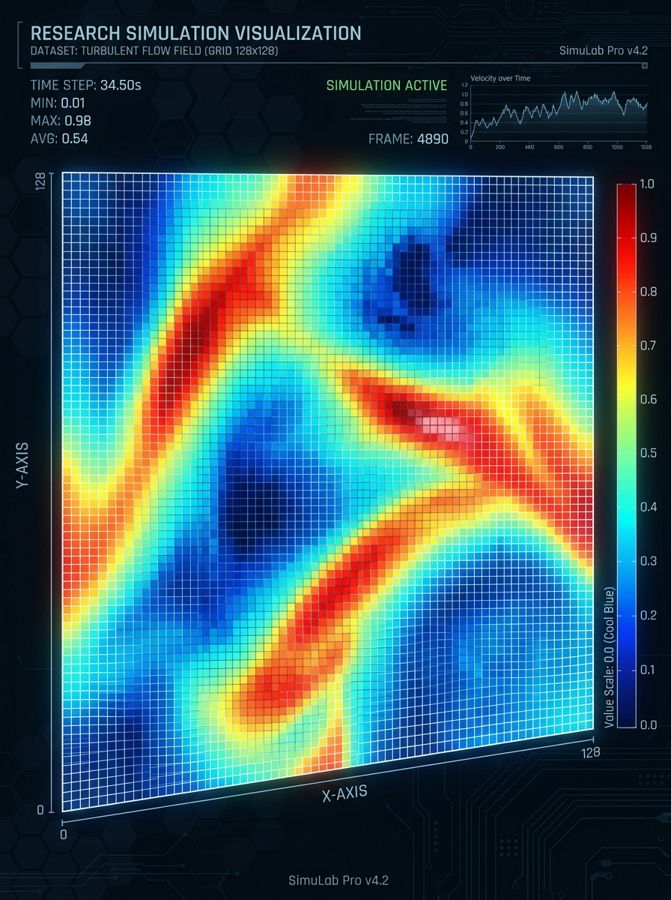
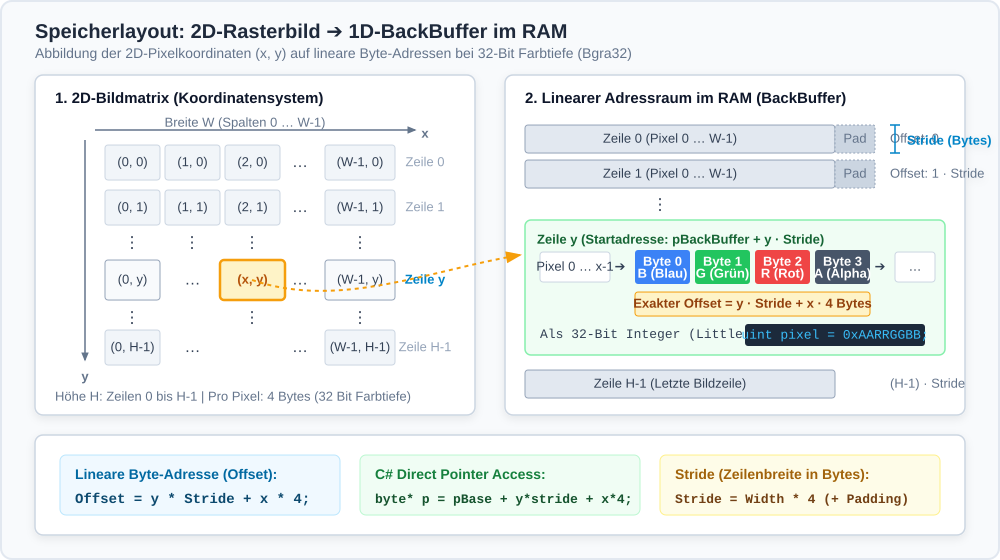
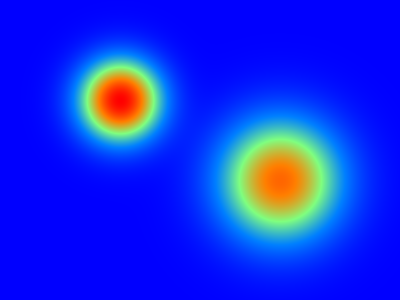

# Kapitel 2: 2D-Visualisierung (WPF/Pixel)

Dieses Kapitel umfasst die folgenden Abschnitte:

- 2.1: Speicherlayout digitaler Rasterbilder
- 2.2: Pixel-Rendering in WPF mit WriteableBitmap
- 2.3: High-Performance Puffer-Zugriff mit Pointern
- 2.4: Farbskalen & Look-Up-Tables (LUT)
- 2.5: Anwendungsbeispiel: 2D-Wärmeleitungssimulation

---

## 2.1: Speicherlayout digitaler Rasterbilder

Dieser Abschnitt umfasst die folgenden Inhalte:

- Diskrete Rasterbilder und 2D-Feldsimulationen
- Farbmodelle, Bytereihenfolge und Farbtiefe (Bgra32)
- Zeilenweiser linearer Speicher (Row-Major) und Stride
- Mathematische Adressberechnung und Cache-Lokalität

---

### Was ist ein Rasterbild in der Simulation?

<div class="columns">
<div class="two">

Ein **Rasterbild** ist eine zweidimensionale Matrix aus diskreten Bildpunkten (**Pixeln**):

- Jedes Pixel besitzt ganzzahlige Koordinaten $(x, y)$ mit:
  $$0 \le x < \text{Breite}, \quad 0 \le y < \text{Höhe}$$
- In technischen Simulationen repräsentiert jedes Pixel den lokalen Zustand eines räumlichen Gitters:
  - **2D-Skalarfelder:** Temperatur $T(x,y)$, Druck $p(x,y)$, Konzentration $c(x,y)$
  - **Zelluläre Automaten:** Belegungszustände, Gittergase, Conway's Game of Life
  - **Finite Differenzen:** Diskretisierte partielle Differentialgleichungen (PDEs)

</div>
<div class="one">

| Eigenschaft | Wertbereich |
|---|---|
| Breite $W$ | Pixel (Spalten) |
| Höhe $H$ | Pixel (Zeilen) |
| Farbtiefe | 32 Bit (4 Bytes) |
| Format | `Bgra32` |
| Kanäle | Blue, Green, Red, Alpha |

</div>
</div>

---

### Farbmodelle und 32-Bit Farbtiefe (`Bgra32`)

In modernen Betriebssystemen und Grafiktreibern ist das **32-Bit BGRA-Format** der Standard für maximale Verarbeitungsgeschwindigkeit:

- **B (Blau), G (Grün), R (Rot):** Je 1 Byte ($0 \dots 255$) für die Farbintensität.
- **A (Alpha):** 1 Byte ($0 = \text{voll transparent}, 255 = \text{voll deckend}$).
- **Speicherorganisation im RAM (Little-Endian):**
  - Byte 0: Blau | Byte 1: Grün | Byte 2: Rot | Byte 3: Alpha
  - Bei Interpretation als vorzeichenloser 32-Bit-Integer (`uint`):
    $$\text{Pixel}_{\text{uint}} = (\text{Alpha} \ll 24) \mid (\text{Rot} \ll 16) \mid (\text{Grün} \ll 8) \mid \text{Blau}$$
  - Wert `0xFFFF0000` entspricht z.B. voll deckendem Reinrot.

---

### Das Konzept des Strides

Ein 2D-Rasterbild existiert im Arbeitsspeicher als **kontinuierlicher 1D-Byte-Block**:

- Die Pixelzeilen werden sequentiell hintereinander abgelegt (**Row-Major Order**).
- **`Stride` (Zeilenschrittweite):** Die tatsächliche Anzahl an Bytes von einer Zeile zur nächsten:
  $$\text{Stride} = \text{Breite} \times \text{BytesJePixel} + \text{Padding}$$
- Da moderne Speichercontroller am schnellsten auf Adressen zugreifen, die Vielfache von 4 oder 8 Bytes sind, wird die Zeilenlänge ggf. mit ungenutzten Füll-Bytes (*Padding*) aufgerundet.
- Bei 32-Bit-Pixeln (`Bgra32`) ist die Zeilenbreite $\text{Breite} \times 4$ stets ein Vielfaches von 4.

---

### Visuelle Speicherabbildung (2D-Raster ➔ 1D-RAM)



---

### Mathematische Adressberechnung

Für ein Pixel an Koordinate $(x, y)$ errechnet sich die absolute Position im Puffer:

- **Relativer Byte-Offset:**
  $$\text{Offset}(x, y) = y \cdot \text{Stride} + x \cdot 4$$

- **Absolute Speicheradresse (Pointer):**
  $$p(x, y) = p_{\text{BackBuffer}} + y \cdot \text{Stride} + x \cdot 4$$

- **Bedeutung für die Cache-Lokalität:**
  - Zeilenweiser Durchlauf ($y$ in der äußeren Schleife, $x$ in der inneren):
    Sequentieller Speicherzugriff ➔ Optimale Ausnutzung von CPU-L1/L2-Caches und Prefetching.
  - Spaltenweiser Durchlauf ($x$ außen, $y$ innen):
    Stride-Sprünge bei jedem Zugriff ➔ Massenhafte Cache-Misses und drastischer Performanceverlust!

---

## 2.2: Pixel-Rendering in WPF mit WriteableBitmap

Dieser Abschnitt umfasst die folgenden Inhalte:

- Das Problem der WPF Visual-Tree-Skalierung
- Die Architektur der Klasse `WriteableBitmap`
- Deklaration und Einbindung im XAML-Layout
- Schärfe vs. Unschärfe: Skalierungsmodi (`NearestNeighbor` vs. `Linear`)

---

### Grenzen des WPF Visual Tree

<div class="columns">
<div class="two">

Herkömmliche WPF-Visualisierungen basieren auf UI-Elementen (`Shape`, `Rectangle`, `Path` auf einem `Canvas`):

- Jedes einzelne Shape ist ein vollwertiges FrameworkElement:
  - Dependency Properties, Bindings, Style-Auflösung
  - Hit-Testing, Layout-Pass (`Measure`/`Arrange`)
  - Hoher Speicher-Overhead (mehrere hundert Bytes pro Objekt)
- **Skalierungsgrenze:**
  - Bei $\approx 5.000$ Shapes sinkt die Bildrate unter 30 FPS.
  - Bei $512 \times 512 = 262.144$ Partikeln bricht die WPF-UI zusammen.

</div>
<div class="one">

**Lösung:**

Ein einziges XAML-Element:
`<Image Source="{Binding ...}" />`

Kombiniert mit einer einzigen
**`WriteableBitmap`**, in die Millionen Bildpunkte direkt in den Back-Buffer gerendert werden!

</div>
</div>

---

### Architektur von `WriteableBitmap`

`WriteableBitmap` (aus `System.Windows.Media.Imaging`) kapselt zwei Pufferbereiche:

1. **BackBuffer (im RAM):**
   - Ein nativer Speicherbereich, auf den unser Simulationscode direkt über einen Speicherzeiger (`IntPtr` / `byte*`) zugreifen kann.
2. **FrontBuffer (DirectX / GPU):**
   - Der Puffer, der von der MilCore-Render-Engine von WPF zur Darstellung über die Grafikkarte genutzt wird.
3. **Synchronisation:**
   - Der Transfer vom BackBuffer zum FrontBuffer erfolgt nur, wenn Änderungen explizit über `AddDirtyRect()` gemeldet werden.

---

### Einbindung in XAML und Skalierungsmodus

```xml
<Window x:Class="SimulationsApp.MainWindow"
        xmlns="http://schemas.microsoft.com/winfx/2006/xaml/presentation"
        xmlns:x="http://schemas.microsoft.com/winfx/2006/xaml"
        Title="2D-Simulation" Width="800" Height="650">
    <Grid Background="#1e1e1e">
        <!-- Image Control für die direkte Bitmap-Anzeige -->
        <Image x:Name="SimulationImage"
               Stretch="Uniform"
               RenderOptions.BitmapScalingMode="NearestNeighbor" />
    </Grid>
</Window>
```

- **Wichtig:** `BitmapScalingMode="NearestNeighbor"` sorgt dafür, dass Pixel scharf abgegrenzt bleiben (keine bilineare Weichzeichnung / Anti-Aliasing). Dies ist ideal für diskrete Gitterdaten!

---

### Initialisierung im C#-Code-Behind

```csharp
using System.Windows.Media;
using System.Windows.Media.Imaging;

public partial class MainWindow : Window
{
    private WriteableBitmap _bitmap;
    private const int Width = 512;
    private const int Height = 512;

    public MainWindow()
    {
        InitializeComponent();

        // WriteableBitmap erzeugen (32 Bit BGRA, 96 DPI)
        _bitmap = new WriteableBitmap(
            Width, Height, 96.0, 96.0, 
            PixelFormats.Bgra32, null
        );

        // Dem XAML-Image-Control zuweisen
        SimulationImage.Source = _bitmap;
    }
}
```

---

## 2.3: High-Performance Puffer-Zugriff

Dieser Abschnitt umfasst die folgenden Inhalte:

- Der threadsichere Aktualisierungszyklus: `Lock()`, `AddDirtyRect()`, `Unlock()`
- Zeigerarithmetik mit C#-Pointern (`unsafe`)
- 8-Bit Byte-Zugriff vs. 32-Bit Integer-Zugriff (`uint*`)
- Multithreaded-Rendering mit `Parallel.For`

---

### Der Aktualisierungs-Lebenszyklus

```csharp
// 1. Zugriff sperren (blockiert den Render-Thread vor Inkonsistenzen)
_bitmap.Lock();
try
{
    // 2. Zeiger auf den Pufferanfang und Zeilenschrittweite abfragen
    IntPtr pBuffer = _bitmap.BackBuffer;
    int stride = _bitmap.BackBufferStride;

    // 3. Pixel direkt über native Zeiger manipulieren
    UpdatePixelData(pBuffer, stride, Width, Height);

    // 4. Den modifizierten Bildbereich als 'dirty' deklarieren
    _bitmap.AddDirtyRect(new Int32Rect(0, 0, Width, Height));
}
finally
{
    // 5. Freigabe: MilCore überträgt geänderte Pixel zur GPU
    _bitmap.Unlock();
}
```

---

### Direkter Zeigerzugriff: Byte- für Byte-Schreiben

```csharp
private unsafe void UpdatePixelData(IntPtr pBackBuffer, int stride, int w, int h)
{
    byte* ptr = (byte*)pBackBuffer.ToPointer();

    for (int y = 0; y < h; y++)
    {
        byte* row = ptr + (y * stride);

        for (int x = 0; x < w; x++)
        {
            int offset = x * 4;

            row[offset + 0] = 255; // Blau  (0..255)
            row[offset + 1] = 128; // Grün  (0..255)
            row[offset + 2] = 0;   // Rot   (0..255)
            row[offset + 3] = 255; // Alpha (255 = deckend)
        }
    }
}
```

---

### Maximale Performance: 32-Bit Integer-Schreiben (`uint*`)

Statt 4 separaten Byte-Schreiboperationen kann ein Pixel als einzelnes 32-Bit-Wort geschrieben werden:

```csharp
private unsafe void UpdatePixelFast(IntPtr pBackBuffer, int stride, int w, int h)
{
    uint* ptr = (uint*)pBackBuffer.ToPointer();
    int strideWords = stride / 4; // Schrittweite in 32-Bit Einheiten

    for (int y = 0; y < h; y++)
    {
        uint* row = ptr + (y * strideWords);

        for (int x = 0; x < w; x++)
        {
            // Format 0xAARRGGBB (Alpha=0xFF, Rot=0xFF, Grün=0x80, Blau=0x00)
            row[x] = 0xFFFF8000; 
        }
    }
}
```

- **Vorteil:** Verdoppelt bis vervierfacht die Speicherbandbreite durch 32-Bit-Wort-Befehle!

---

### Paralleles Rendern mit der Task Parallel Library

Da die Bildzeilen speichertechnisch unabhängig sind, kann das Rendern trivial parallelisiert werden:

```csharp
private unsafe void RenderParallel(IntPtr pBackBuffer, int stride, int w, int h)
{
    uint* ptr = (uint*)pBackBuffer.ToPointer();
    int strideWords = stride / 4;

    Parallel.For(0, h, y =>
    {
        uint* row = ptr + (y * strideWords);
        for (int x = 0; x < w; x++)
        {
            row[x] = CalculateSimulationPixelColor(x, y);
        }
    });
}
```

- Kein Thread-Locking nötig (jede CPU-Core-Instanz schreibt in getrennte Zeilen)!

---

## 2.4: Farbskalen & Look-Up-Tables (LUT)

Dieser Abschnitt umfasst die folgenden Inhalte:

- Transformation von kontinuierlichen Skalaren zu Farbwerten
- Gängige Farbskalen: Cool-Warm, Jet, Viridis
- Performance-Optimierung durch vorberechnete Look-Up-Tables (LUT)
- LUT-Implementierung in C#

---

### Abbildung von Skalaren auf Farben

In der physikalischen Simulation repräsentiert ein Pixel eine Messgröße $v$ (z.B. Temperatur $T \in [T_{\min}, T_{\max}]$):

1. **Normierung auf das Einheitsintervall $[0, 1]$:**
   $$u = \text{clamp}\left(\frac{v - v_{\min}}{v_{\max} - v_{\min}}, \, 0.0, \, 1.0\right)$$

2. **Farbpalette:**
   - **Cool-to-Warm (Divergierend):** Blau ($u=0$) $\to$ Weiß ($u=0.5$) $\to$ Rot ($u=1$).
   - **Jet / Rainbow:** Weit verbreitet, jedoch problematisch bezüglich Farbwahrnehmung.
   - **Viridis:** Perzeptiv gleichförmig (*perceptually uniform*), monoton in Helligkeit und für Farbfehlsichtigkeiten geeignet.

---

### Die Lösung für Echtzeit: Look-Up-Table (LUT)

<div class="columns">
<div class="two">

- **Das Problem:**
  Farbinterpolationen mit Fallunterscheidungen, `Math.Sin()` oder linearen Gleichungen für jeden Pixel pro Frame kosten viel Rechenzeit.
- **Die Lösung:**
  Vorberechnung der Farben in ein Array `uint[256]` oder `uint[1024]`.
- Im inneren Simulations-Loop:
  $$\text{Index} = \lfloor u \cdot 255.0 \rfloor$$
  $$\text{PixelFarbe} = \text{LUT}[\text{Index}]$$
- O(1)-Zugriff direkt aus dem schnellen L1-Cache der CPU!

</div>
<div class="one">

```
Normierter Wert u ∈ [0, 1]
         │
         ▼
  Index = (int)(u * 255)
         │
         ▼
 ┌───────────────┐
 │ LUT[Index]    │ ➔ 0xAARRGGBB
 └───────────────┘
```

</div>
</div>

---

### C#-Implementierung einer Farbskalen-LUT

```csharp
public static class ColorMaps
{
    public static readonly uint[] ViridisLut = GenerateViridis(256);

    private static uint[] GenerateViridis(int steps)
    {
        var lut = new uint[steps];
        for (int i = 0; i < steps; i++)
        {
            double t = (double)i / (steps - 1);
            // Polynomielle Annäherung an die Viridis-Farbpalette
            byte r = (byte)(255 * Math.Clamp(1.89 * t - 0.70, 0.0, 1.0));
            byte g = (byte)(255 * Math.Clamp(1.39 * t - 0.10, 0.0, 1.0));
            byte b = (byte)(255 * Math.Clamp(0.55 + 0.8 * Math.Sin(Math.PI * t), 0.0, 1.0));
            byte a = 255;

            // Als Bgra32 packen: (A << 24) | (R << 16) | (G << 8) | B
            lut[i] = ((uint)a << 24) | ((uint)r << 16) | ((uint)g << 8) | (uint)b;
        }
        return lut;
    }
}
```

---

## 2.5: Anwendungsbeispiel: 2D-Wärmeleitung

Dieser Abschnitt umfasst die folgenden Inhalte:

- Die partielle Differentialgleichung (PDE) der Wärmeleitung
- Finite-Differenzen-Diskretisierung (5-Punkt-Stern)
- Numerische Stabilität (CFL-Bedingung)
- Kopplung von Berechnung und Pixel-Rendering

---

### Die physikalische 2D-Wärmeleitungsgleichung

Die zeitliche und räumliche Ausbreitung von Wärme in einem homogenen Medium wird durch die parabolische PDE beschrieben:

$$\frac{\partial T}{\partial t} = \alpha \cdot \Delta T + Q(x, y, t)$$

- $T(x, y, t)$: Temperaturfeld [K]
- $\alpha = \frac{\lambda}{\rho \cdot c}$: Temperaturleitfähigkeit [$\text{m}^2/\text{s}$]
- $\Delta = \nabla^2 = \frac{\partial^2}{\partial x^2} + \frac{\partial^2}{\partial y^2}$: Laplace-Operator
- $Q(x, y, t)$: Externe Wärmequellen bzw. Wärmesenken

---

### Diskretisierung mit Finiten Differenzen

<div class="columns">
<div class="two">

Wir diskretisieren Raum und Zeit auf einem gleichmäßigen 2D-Gitter mit Schrittweite $\Delta x = \Delta y = h$:

- **Zweite räumliche Ableitungen (5-Punkt-Stern):**
  $$\Delta T_{i,j} \approx \frac{T_{i+1,j} + T_{i-1,j} + T_{i,j+1} + T_{i,j-1} - 4 T_{i,j}}{h^2}$$

- **Explizites Euler-Verfahren für die Zeit:**
  $$T_{i,j}^{n+1} = T_{i,j}^n + \Delta t \cdot \left[ \frac{\alpha}{h^2} \Delta T_{i,j} + Q_{i,j} \right]$$

</div>
<div class="one">

```
          T(i, j+1)
              │
T(i-1, j) ── T(i, j) ── T(i+1, j)
              │
          T(i, j-1)
```

**5-Punkt-Differenzenstern:**
Temperatur am Punkt $(i, j)$ diffundiert zu den 4 direkten Nachbarn.

</div>
</div>

---

### Numerische Stabilitätsbedingung (CFL)

Das explizite Euler-Verfahren ist nur bedingt stabil:

- **Stabilitätsgrenze (Von-Neumann-Analyse):**
  $$s = \frac{\alpha \cdot \Delta t}{h^2} \le \frac{1}{4} = 0.25$$

- **Bedeutung:**
  - Wählt man $\Delta t$ zu groß, oszilliert die Simulation und explodiert numerisch ($T \to \pm \infty$).
  - Für $s \le 0.25$ ist das System strikt stabil und erfüllt das Maximumprinzip (Wärme fließt nur von warm nach kalt).

---

### Simulation und Visualisierung im Code

<div class="columns">
<div class="two">

```csharp
// Simulationsschritt (Ping-Pong-Puffer)
Parallel.For(1, Height - 1, y =>
{
    for (int x = 1; x < Width - 1; x++)
    {
        float laplace = _tempPrev[x + 1, y] + _tempPrev[x - 1, y]
                      + _tempPrev[x, y + 1] + _tempPrev[x, y - 1]
                      - 4.0f * _tempPrev[x, y];

        _tempCurr[x, y] = _tempPrev[x, y] + DiffCoeff * laplace;
    }
});

// Wärmequellen fixieren
_tempCurr[100, 100] = 100.0f;
_tempCurr[350, 250] = 80.0f;
```

</div>
<div class="one">



*Ergebnis: Simuliertes Temperaturfeld mit zwei aktiven Wärmequellen gerendert auf WriteableBitmap.*

</div>
</div>

---

### Pufferübertragung in die WriteableBitmap

```csharp
public unsafe void RenderToBitmap(WriteableBitmap bmp, float[,] field, uint[] lut)
{
    bmp.Lock();
    try
    {
        uint* pBuf = (uint*)bmp.BackBuffer.ToPointer();
        int strideWords = bmp.BackBufferStride / 4;

        Parallel.For(0, Height, y =>
        {
            uint* row = pBuf + (y * strideWords);
            for (int x = 0; x < Width; x++)
            {
                // Temperatur [0..100 °C] auf LUT-Index [0..255] abbilden
                int lutIndex = (int)Math.Clamp(field[x, y] * 2.55f, 0f, 255f);
                row[x] = lut[lutIndex];
            }
        });

        bmp.AddDirtyRect(new Int32Rect(0, 0, Width, Height));
    }
    finally { bmp.Unlock(); }
}
```

---

# Zusammenfassung Kapitel 2

- **Speicherlayout:** Rasterbilder liegen als 1D-Arrays im RAM; die lineare Byte-Adresse berechnet sich aus $\text{Offset} = y \cdot \text{Stride} + x \cdot 4$. Zeilenweises Iterieren garantiert maximale Cache-Trefferquote.
- **WriteableBitmap:** Umgeht den Overhead des WPF Visual Trees und ermöglicht das Rendern von Millionen Pixeln bei 60+ FPS über ein einziges `Image`-Control.
- **High-Performance:** Mit C#-Pointern (`unsafe`), 32-Bit Wortschreiben (`uint*`) und `Parallel.For` wird nahezu die theoretische Speicherbandbreite der CPU ausgeschöpft.
- **Look-Up-Tables (LUT):** Kontinuierliche Feldgrößen werden über vorberechnete Farbpaletten (Viridis, Cool-Warm) in $O(1)$-Zeit ohne teure Funktionsaufrufe farbkodiert.
- **Simulation auf Pixeln:** Finite-Differenzen-Modelle (wie die 2D-Wärmeleitungsgleichung) lassen sich direkt auf 2D-Arrays berechnen und ohne Zwischenschritte visualisieren.
