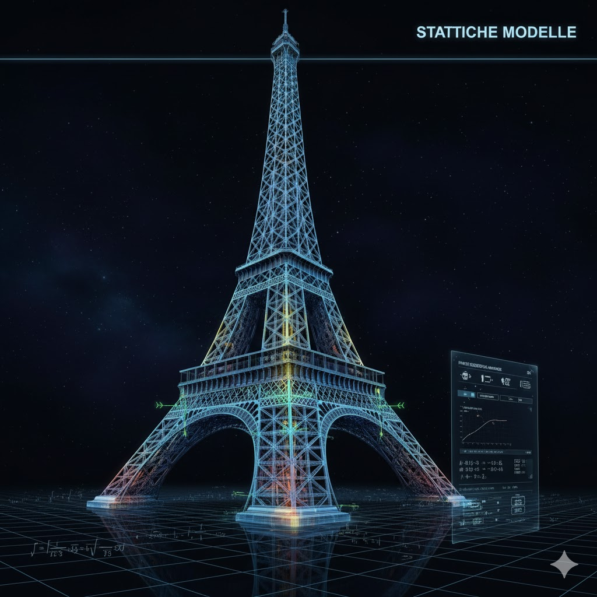
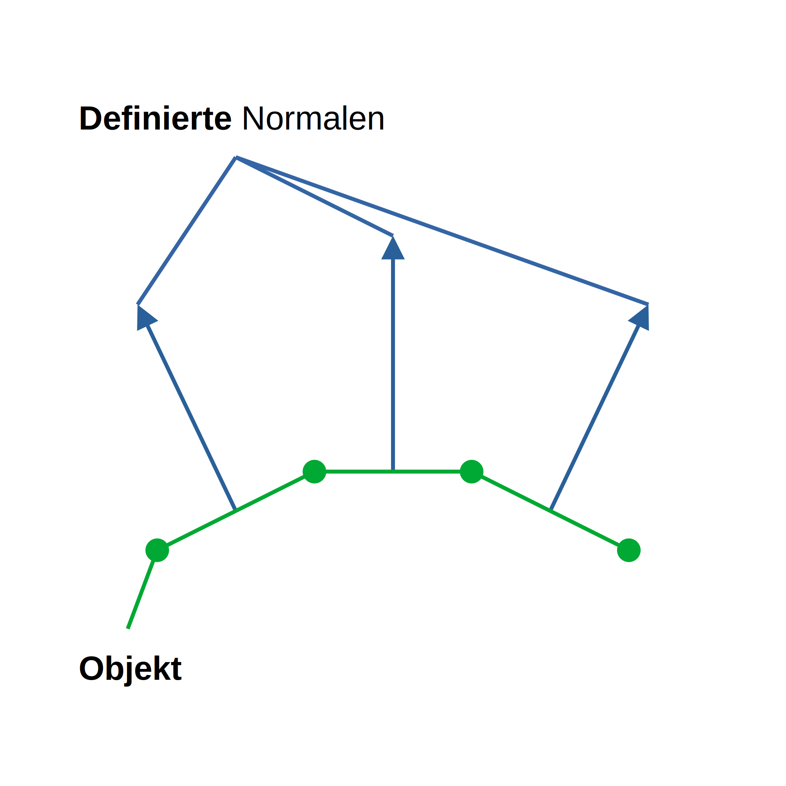

# Kapitel 3: Statische Modelle in 3D

Dieses Kapitel umfasst die folgenden Inhalte:

- 3.1: Erweiterung der Berechnungsmodelle auf 3D
- 3.2: Grundlagen der 3D-Visualisierung mit OpenGL
- 3.3: Strukturierung komplexer Szenen mit Szenengraphen

---

## 3.1: Erweiterung der Berechnungsmodelle auf 3D

Dieser Abschnitt umfasst die folgenden Inhalte:

- Erweiterung der Freiheitsgrade von 2D auf 3D
- Anpassung des idealen Fachwerk-Modells für 3D
- Anpassung des elastischen Fachwerk-Modells für 3D

---

### Vom 2D- zum 3D-Fachwerk

Die grundlegenden physikalischen Prinzipien (Kräftegleichgewicht, Hooke\'sches Gesetz) bleiben exakt gleich. Die Mathematik wird lediglich um eine Dimension erweitert:

<div class="columns top">
<div class="one">

**2D**
- Knoten haben 2 Freiheitsgrade (DOF): $u_x, u_y$.
- Gleichgewicht in 2 Richtungen: $\sum F_x = 0, \sum F_y = 0$.
- Geometrie durch Vektoren in $\mathbb{R}^2$.

</div>
<div class="one">

**3D**
- Knoten haben 3 Freiheitsgrade (DOF): $u_x, u_y, u_z$.
- Gleichgewicht in 3 Richtungen: $\sum F_x = 0, \sum F_y = 0, \sum F_z = 0$.
- Geometrie durch Vektoren in $\mathbb{R}^3$.

</div>
</div>

---

<div class="columns">
<div>

### Ideales Fachwerk in 3D

- **Knotenpunktverfahren**: An jedem Knoten werden nun **drei** Gleichgewichtsgleichungen aufgestellt.
- Für ein Fachwerk mit $k$ Knoten, $s$ Stäben und $l$ Lagerreaktionen muss gelten: $3k = s + l$ (statische Bestimmtheit).
- Das LGS $A \cdot x = b$ wird entsprechend größer, das Prinzip ist aber identisch. Die Koeffizienten in $A$ sind nun die Richtungskosinusse der Stäbe im 3D-Raum.

</div>
<div>


</div>
</div>

---

### Kräftegleichgewicht im 3D-Knoten

Für jeden freien Knoten im Fachwerk muss die Summe aller Kräfte in jeder Raumrichtung null ergeben. Ein Stab $j$, der am Knoten $i$ angreift, übt eine Kraft $S_j$ aus, die entlang der Stabachse wirkt.

- **Stabvektor**: $L_j = P_k - P_i$ (Vektor von Knoten $i$ zu Knoten $k$)
- **Einheitsvektor**: $e_j = \frac{L_j}{|L_j|}$
- **Kraftvektor**: $F_j = S_j \cdot e_j = S_j \cdot \begin{pmatrix} \cos(\alpha_x) \\ \cos(\alpha_y) \\ \cos(\alpha_z) \end{pmatrix}$

Das Gleichgewicht am Knoten $i$ lautet dann:

$\sum_{j} F_j + F_{ext,i} = 0 \implies \begin{cases} \sum_j S_j \cdot e_{j,x} + F_{ext,i,x} = 0 \\ \sum_j S_j \cdot e_{j,y} + F_{ext,i,y} = 0 \\ \sum_j S_j \cdot e_{j,z} + F_{ext,i,z} = 0 \end{cases}$

---

<div class="columns">
<div class="two">

### Matrixdarstellung für einen Knoten

Die drei Gleichgewichtsgleichungen für einen Knoten lassen sich in Matrixform schreiben. Für einen Knoten, an dem die Stäbe 1, 2 und 3 angreifen, sieht das so aus:

$$
\begin{pmatrix}
e_{1,x} & e_{2,x} & e_{3,x} \\
e_{1,y} & e_{2,y} & e_{3,y} \\
e_{1,z} & e_{2,z} & e_{3,z}
\end{pmatrix}
\cdot
\begin{pmatrix}
S_1 \\ S_2 \\ S_3
\end{pmatrix}
=
\begin{pmatrix}
-F_{ext,x} \\ -F_{ext,y} \\ -F_{ext,z}
\end{pmatrix}
$$

- Die Matrix enthält die x-, y- und z-Komponenten der Einheitsvektoren der Stäbe.
- Der Vektor $S$ enthält die unbekannten Stabkräfte.
- Der Vektor auf der rechten Seite enthält die externen Kräfte.

</div>
<div>


</div>
</div>

---

### Globales Gleichungssystem

Stellt man die Gleichungen für alle $k$ Knoten auf, erhält man ein großes lineares Gleichungssystem mit $3k$ Gleichungen.

$A \cdot s = f_{ext}$

- **$A$ (Geometriematrix)**: Eine $3k \times s$ Matrix, die die Geometrie des Fachwerks beschreibt (die Richtungskosinusse der Stäbe). Jede Spalte entspricht einem Stab, jede Zeile einer Gleichgewichtsrichtung an einem Knoten.
- **$s$ (Stabkraftvektor)**: Ein Vektor der Länge $s$ mit den unbekannten Stabkräften.
- **$f_{ext}$ (Lastvektor)**: Ein Vektor der Länge $3k$, der die externen Kräfte an allen Knoten enthält.

Nach Einbau der Lagerbedingungen (statisch bestimmtes System) wird die Matrix $A$ quadratisch ($s \times s$) und kann gelöst werden.

---

<div class="columns">
<div>

### Elastisches Fachwerk in 3D

- **Knotenverschiebungen**: Der Vektor $u$ enthält nun für jeden Knoten drei Komponenten ($u_x, u_y, u_z$).
- **Stab-Steifigkeitsmatrix**: Die $k_{stab}$ ist nun eine 6x6-Matrix, da sie die 3 Verschiebungen an beiden Enden des Stabes in Beziehung setzt.
- **Globale Steifigkeitsmatrix $K$**: Wird analog zum 2D-Fall assembliert, wird aber deutlich größer. Für ein Fachwerk mit $k$ Knoten ist $K$ eine $3k \times 3k$ Matrix.
- Die Lösung $K \cdot u = f$ folgt dem gleichen Schema.

</div>
<div>


</div>
</div>

---

<div class="columns">
<div class="two">

### Stablängenänderung durch Knotenverschiebung

Die Längenänderung $\Delta L$ eines Stabes zwischen den Knoten $i$ und $j$ hängt von deren Verschiebungen $\vec{u}_i$ und $\vec{u}_j$ ab.

- **Verschiebungsvektoren**: $\vec{u}_i = (u_{ix}, u_{iy}, u_{iz})$ und $\vec{u}_j = (u_{jx}, u_{jy}, u_{jz})$.
- **Einheitsvektor des Stabes**: $\vec{e} = (e_x, e_y, e_z)$, wobei $e_x, e_y, e_z$ die Richtungscosinusse sind.

Die Längenänderung ist die Projektion der relativen Verschiebung der Knoten auf die Stabachse:

$\Delta L \approx (\vec{u}_j - \vec{u}_i) \cdot \vec{e}$

Ausgeschrieben ergibt das:

$\Delta L \approx e_x(u_{jx} - u_{ix}) + e_y(u_{jy} - u_{iy}) + e_z(u_{jz} - u_{iz})$

</div>
<div>


</div>
</div>

---

### Stabkräfte und Steifigkeitsbeziehung

Nach dem **Hooke'schen Gesetz** ist die Kraft $S$ im Stab proportional zur Längenänderung $\Delta L$.

$S = \frac{E \cdot A}{L} \cdot \Delta L$

- $E$: Elastizitätsmodul (Materialeigenschaft)
- $A$: Querschnittsfläche des Stabes
- $L$: Ursprüngliche Länge des Stabes

Die Stabkraft $S$ erzeugt an den Knoten $i$ und $j$ die Gegenkräfte $\vec{f}_i$ und $\vec{f}_j$:

$\vec{f}_j = S \cdot \vec{e}$
$\vec{f}_i = -S \cdot \vec{e}$

Diese Kräfte halten das Gleichgewicht mit den externen Kräften.

---

### Die 3D-Stab-Steifigkeitsmatrix (1/2)

Ziel ist es, eine Matrix $k_{Stab}$ zu finden, die die Knotenverschiebungen $\vec{u}$ direkt mit den resultierenden Knotenkäften $\vec{f}_{Stab}$ in Beziehung setzt: $\vec{f}_{Stab} = k_{Stab} \cdot \vec{u}$.

- **Vektor der Knotenverschiebungen**: $\vec{u} = (u_{ix}, u_{iy}, u_{iz}, u_{jx}, u_{jy}, u_{jz})^T$
- **Vektor der Stabkräfte**: $\vec{f}_{Stab} = (\vec{f}_i^T, \vec{f}_j^T)^T$

Setzt man die Formeln für $\Delta L$ und $S$ in die Kraftgleichungen ein, erhält man:

$\vec{f}_{Stab} = \frac{EA}{L} \cdot \Delta L \cdot \begin{pmatrix} -e_x \\ -e_y \\ -e_z \\ e_x \\ e_y \\ e_z \end{pmatrix} = \frac{EA}{L} \cdot \left( \begin{pmatrix} -e_x & -e_y & -e_z & e_x & e_y & e_z \end{pmatrix} \cdot \vec{u} \right) \cdot \begin{pmatrix} -e_x \\ -e_y \\ -e_z \\ e_x \\ e_y \\ e_z \end{pmatrix}$

---

### Die 3D-Stab-Steifigkeitsmatrix (2/2)

Das Ausmultiplizieren der Vektoren führt zur **6x6-Stab-Steifigkeitsmatrix** $k_{Stab}$:

$k_{Stab} = \frac{EA}{L} \begin{pmatrix}
e_x^2 & e_x e_y & e_x e_z & -e_x^2 & -e_x e_y & -e_x e_z \\
e_y e_x & e_y^2 & e_y e_z & -e_y e_x & -e_y^2 & -e_y e_z \\
e_z e_x & e_z e_y & e_z^2 & -e_z e_x & -e_z e_y & -e_z^2 \\
-e_x^2 & -e_x e_y & -e_x e_z & e_x^2 & e_x e_y & e_x e_z \\
-e_y e_x & -e_y^2 & -e_y e_z & e_y e_x & e_y^2 & e_y e_z \\
-e_z e_x & -e_z e_y & -e_z^2 & e_z e_x & e_z e_y & e_z^2
\end{pmatrix}$

Diese Matrix beschreibt den Zusammenhang zwischen den 6 Verschiebungs-Freiheitsgraden eines Stabes und den daraus resultierenden 6 Knotenkräften im globalen Koordinatensystem.

---

### Globales Gleichungssystem

Die globale Steifigkeitsmatrix $K$ des gesamten Fachwerks wird durch "Assemblierung" der einzelnen Stab-Steifigkeitsmatrizen $k_{Stab}$ aufgebaut.

- Für jeden Stab werden die 36 Elemente seiner $k_{Stab}$-Matrix an die richtigen Positionen in der globalen Matrix $K$ addiert. Die Positionen ergeben sich aus den globalen Freiheitsgraden der beiden Knoten des Stabes.
- Dieser Prozess wird als **Direkte Steifigkeitsmethode** bezeichnet.

Das resultierende globale Gleichungssystem lautet:

$K \cdot \vec{u} = \vec{f}$

- $K$: Globale Steifigkeitsmatrix (Größe $3k \times 3k$ für $k$ Knoten)
- $\vec{u}$: Globaler Vektor der unbekannten Knotenverschiebungen
- $\vec{f}$: Globaler Vektor der externen Kräfte

---

## 3.2: Grundlagen der 3D-Visualisierung mit OpenGL

Dieser Abschnitt umfasst die folgenden Inhalte:

- Grundkonzepte von OpenGL (Zustandsmaschine, Grafik-Pipeline)
- Verwendung von Buffern (Color, Depth)
- Koordinatensysteme und Transformationen (Projection, ModelView)
- Zeichnen von Primitiven und Beleuchtung

---

<div class="columns">
<div>

### Was ist OpenGL?

- **Open Graphics Library**
- Eine plattform- und programmiersprachenübergreifende **API** zur Erzeugung von 2D- und 3D-Computergrafik.
- Es ist ein **Standard**, der von Grafikkartenherstellern implementiert wird.
- Es bietet eine Schnittstelle, um der **GPU (Graphics Processing Unit)** Befehle zum Zeichnen zu geben.
- Wir betrachten hier "klassisches" (fixed-function) OpenGL, wie es in `SharpGL` oft für einfache Darstellungen genutzt wird.

</div>
<div>


</div>
</div>

---

### Einbindung mit SharpGL

Die `SharpGL.WPF`-Bibliothek stellt ein `OpenGLControl` für die einfache Integration von OpenGL-Funktionalität in WPF-Anwendungen bereit.

- Es ist ein WPF-`Control`, das eine Zeichenfläche für OpenGL bzw. die Grafikkarte (z.B. Nvidia) zur Verfügung stellt.
- Es stellt zwei zentrale Ereignisse für die Initialisierung und das Zeichnen bereit: `OpenGLInitialized` und `OpenGLDraw`.

Und so wird das `OpenGLControl`-Steuerelement in ein WPF-Fenster eingebunden (beachte den XML-Namensraum `xmlns:sharpGL`):

```xml
<Window xmlns:sharpGL="clr-namespace:SharpGL.WPF;assembly=SharpGL.WPF">
    <Grid>
        <sharpGL:OpenGLControl  OpenGLInitialized="OnInitialize" OpenGLDraw="OnDraw"/>
    </Grid>
</Window>
```

---

### Initialisierung der Szene: `OpenGLInitialized`

Die `OpenGLInitialized`-Ereignisroutine wird **einmalig** aufgerufen, wenn der OpenGL-Kontext bereit ist. Hier werden alle globalen Zustände gesetzt.

```csharp
private void OnInitialize(object sender, OpenGLRoutedEventArgs args)
{
    OpenGL gl = args.OpenGL;

    // 1. Hintergrundfarbe festlegen (Clear Color)
    
    // 2. Beleuchtung und Materialeigenschaften aktivieren
    
    // 3. Globales Umgebungslicht definieren
    
    // 4. Punktlichtquellen aktivieren und definieren
    
    // 5. Schattierungsmodus für weiche Farbübergänge
    
    // 6. Tiefentest für korrekte Verdeckungen aktivieren
}
```

---

<div class="columns">
<div>

### Hintergrundfarbe festlegen

Die `ClearColor`-Methode definiert die Farbe, mit der der Bildschirm bei jedem Frame geleert wird.

- Die Parameter sind die RGBA-Werte als `float` zwischen 0.0 und 1.0.
- Bei der Farbe *Schwarz* sind alle Werte auf Null gesetzt.
- Bei der Farbe *Weiß* sind hingegen alle Werte auf Eins gesetzt.

```csharp
// In der OnInitialize-Routine

// Setzt die Hintergrundfarbe auf ein Dunkelblau
gl.ClearColor(0.1f, 0.2f, 0.3f, 1.0f);
```

</div>
<div>


</div>
</div>

---

<div class="columns">
<div>

### Beleuchtung & Material aktivieren

Damit Objekte auf Licht reagieren, muss die Lichtberechnung zunächst global aktiviert werden:

- `GL_LIGHTING`: Schaltet das gesamte Beleuchtungssystem ein.
- Ohne dies sind alle Objekte nur in ihrer Grundfarbe sichtbar.
- Die Beleuchtung verursacht die Schattierung der Oberflächen.

```csharp
// In der OnInitialize-Routine

// Aktiviert das Beleuchtungssystem
gl.Enable(OpenGL.GL_LIGHTING);
```

</div>
<div>


</div>
</div>

---

<div class="columns">
<div>

### Das Phong-Beleuchtungsmodell

Die Farbe eines Punktes auf einer Oberfläche wird als Summe von drei Komponenten berechnet:

$I_{f} = I_{a} + I_{d} + I_{s}$

- **Ambient**: Konstante Grundhelligkeit, simuliert indirektes Licht.
- **Diffuse**: Helligkeit basierend auf dem Winkel des Lichteinfalls, simuliert matte Oberflächen.
- **Specular**: Glanzlicht, das von der Kameraposi-tion abhängt, simuliert glänzende Oberflächen.

Jede dieser Komponenten wird für jede Lichtquelle berechnet und aufsummiert.

</div>
<div>


</div>
</div>

---

### Globales Umgebungslicht

Umgebungslicht (*Ambient Light*) sorgt dafür, dass auch die nicht direkt von einer Lichtquelle angestrahlten Flächen eines Objekts nicht komplett schwarz sind. Es simuliert indirekte Beleuchtung.

```csharp
// In der OnInitialize-Routine

// Definiert ein schwaches, weißes Umgebungslicht für die gesamte Szene
float[] ambientLight = { 0.2f, 0.2f, 0.2f, 1.0f };
gl.LightModel(OpenGL.GL_LIGHT_MODEL_AMBIENT, ambientLight);
```

---

### Punktlichtquelle definieren

Eine Punktlichtquelle strahlt von einer Position im Raum Licht ab. Man kann ihre Farbe für die diffuse und spiegelnde Reflexion getrennt definieren.

```csharp
// In der OnInitialize-Routine

// Aktiviert die erste Lichtquelle (GL_LIGHT0)
gl.Enable(OpenGL.GL_LIGHT0);

// Definiert die Eigenschaften von GL_LIGHT0
float[] lightPosition = { 2, 2, 5, 1 }; // Position (x, y, z, w=1 für Punktlicht)
float[] lightDiffuse = { 1, 1, 1, 1 };  // Helles, weißes diffuses Licht

gl.Light(OpenGL.GL_LIGHT0, OpenGL.GL_POSITION, lightPosition);
gl.Light(OpenGL.GL_LIGHT0, OpenGL.GL_DIFFUSE, lightDiffuse);
```

---

<div class="columns">
<div>

### Vektoren für die Beleuchtungsrechnung

Für die Berechnung werden an jedem Punkt der Oberfläche vier Vektoren benötigt:

- **$N$ (Normalenvektor)**: Vektor, der senkrecht von der Oberfläche weg zeigt.
- **$L$ (Lichtvektor)**: Vektor vom Oberflächenpunkt zur Lichtquelle.
- **$V$ (Betrachtungsvektor)**: Vektor vom Oberflächenpunkt zur Kamera.
- **$R$ (Reflexionsvektor)**: Vektor, in den der Lichtstrahl an der Oberfläche reflektiert wird. 

</div>
<div>


</div>
</div>

---

<div class="columns">
<div>

### **Ambient**-Komponente

Die Ambient-Komponente ist am einfachsten. Sie ist das Produkt aus der Lichtfarbe und der Materialfarbe für Umgebungslicht.

$I_{a} = \text{light}_{a} \cdot \text{material}_{a}$

- $\text{light}_{a}$: Farbe des globalen Umgebungslichts (z.B. `GL_LIGHT_MODEL_AMBIENT`).
- $\text{material}_{a}$: Ambient-Reflexionsvermögen des Materials (definiert mit `glMaterial`).

Diese Komponente ist für jeden Punkt eines Objekts gleich und sorgt für eine Grundhelligkeit.

</div>
<div>


</div>
</div>

---

<div class="columns">
<div>

### **Diffuse**-Komponente

Die Diffuse-Komponente hängt vom Winkel zwischen dem Normalenvektor $N$ und dem Lichtvektor $L$ ab. Je direkter das Licht auf die Oberfläche trifft, desto heller ist sie.

$I_{d} = \text{light}_{d} \cdot \text{material}_{d} \cdot \max(0, N \cdot L)$

- $N \cdot L$: Skalarprodukt der normalisierten Vektoren. Entspricht $\cos(\delta)$.
- $\max(0, ...)$: Sorgt dafür, dass von hinten beleuchtete Flächen nicht negativ beitragen.

</div>
<div>


</div>
</div>

---

<div class="columns">
<div>

### **Specular**-Komponente

Die Specular-Komponente erzeugt ein Glanzlicht und hängt vom Winkel zwischen dem Reflexionsvektor $R$ und dem Betrachtervektor $V$ ab.

$I_{s} = \text{light}_{s} \cdot \text{material}_{s} \cdot (\max(0, R \cdot V))^{\text{shininess}}$

- $R = 2(N \cdot L)N - L$: Berechnung des Reflexionsvektors.
- $\text{shininess}$: Ein Exponent, der die Größe und Schärfe des Glanzlichts steuert (definiert mit `glMaterial`). Je höher der Wert, desto kleiner und schärfer der Glanzpunkt.

</div>
<div>


</div>
</div>

---

<div class="columns">
<div>

### Kombination für **mehrere** Lichtquellen

Die finale Farbe eines Punktes ist die Summe der Ambient-Komponente (global) und der Summe der Diffuse- und Specular-Komponenten für *jede* aktive Lichtquelle.

$I_{f} = I_{a} + \sum_{i=1}^{n} (I_{\text{d}, i} + I_{\text{s}, i})$

- $I_{a}$: Globale Ambient-Komponente.
- $I_{\text{d}, i}$: Diffuser Beitrag der Lichtquelle $i$.
- $I_{\text{s}, i}$: Specular-Beitrag der Lichtquelle $i$.

In klassischem OpenGL wird diese Berechnung für bis zu 8 Lichtquellen (`GL_LIGHT0` bis `GL_LIGHT7`) automatisch durchgeführt.

</div>
<div>


</div>
</div>

---

<div class="columns">
<div>

### Schattierungsmodus festlegen

Der Schattierungsmodus bestimmt, wie die Farben zwischen den Eckpunkten eines Polygons interpoliert werden.
- `GL_FLAT`: Das gesamte Polygon hat eine einzige Farbe.
- `GL_SMOOTH`: Die Farben werden zwischen den Eckpunkten interpoliert (Gouraud Shading).

```csharp
// In der OnInitialize-Routine

// Weiche Farbübergänge aktivieren
gl.ShadeModel(OpenGL.GL_SMOOTH);
```

</div>
<div>


</div>
</div>

---

<div class="columns">
<div>

### Flat Shading

- Die Beleuchtungsrechnung wird nur **einmal pro Polygon** (z.B. Dreieck) durchgeführt.
- Das gesamte Polygon wird mit einer einzigen, konstanten Farbe gefüllt.
- Das Ergebnis sind klar sichtbare Kanten zwischen den Polygonen, was zu einem "facettierten" Aussehen führt.
- Für Flat Shading wird typischerweise die Normale der Fläche (`Face Normal`) verwendet, die für alle Vertices des Polygons gleich ist.

</div>
<div>



</div>
</div>

---

<div class="columns">
<div>

### Smooth Shading (Gouraud Shading)

- Die Beleuchtungsrechnung wird **für jeden Vertex** des Polygons einzeln durchgeführt.
- Dabei wird die individuelle Normale jedes Vertex (`Vertex Normal`) verwendet.
- Die resultierenden Farben an den Eckpunkten werden dann über die Fläche des Polygons interpoliert.
- Das Ergebnis ist ein weicher, kontinuierlicher Farbübergang, der die Illusion einer gekrümmten Oberfläche erzeugt.

</div>
<div>


</div>
</div>

---

<div class="columns">
<div class="two">

### Tiefentest aktivieren

Der Tiefentest (Depth Test) sorgt dafür, dass Objekte, die weiter von der Kamera entfernt sind, von näheren Objekten verdeckt werden.

```csharp
// In der OnInitialize-Routine

// Aktiviere den Tiefentest
gl.Enable(OpenGL.GL_DEPTH_TEST);
```

</div>
<div>


</div>
</div>

---

### Der Render-Loop: `OpenGLDraw`

Die `OpenGLDraw`-Ereignisroutine wird für jeden Frame wiederholt aufgerufen. Hier finden alle Zeichenoperationen statt.

```csharp
private void OnDraw(object sender, OpenGLRoutedEventArgs args)
{
    OpenGL gl = args.OpenGL;

    // 1. Buffer zurücksetzen (Farbe und Tiefe)
    gl.Clear(OpenGL.GL_COLOR_BUFFER_BIT | OpenGL.GL_DEPTH_BUFFER_BIT);

    // 2. ModelView-Matrix zurücksetzen
    gl.MatrixMode(OpenGL.GL_MODELVIEW);
    gl.LoadIdentity();

    // 3. Kamera positionieren
    gl.LookAt(5, 5, 5, 0, 0, 0, 0, 1, 0);

    // 4. Objekte zeichnen...
}
```

---

### Zeichnen von Primitiven

Geometrie wird innerhalb von `gl.Begin()` und `gl.End()` definiert. Der Parameter von `gl.Begin` legt fest, wie die folgenden Vertices interpretiert werden.

- `GL_POINTS`: Zeichnet für jeden Vertex einen einzelnen Punkt.
- `GL_LINES`: Zeichnet Linien zwischen je zwei Vertices (1-2, 3-4, ...).
- `GL_LINE_STRIP`: Zeichnet eine verbundene Linienkette (1-2, 2-3, 3-4, ...).
- `GL_LINE_LOOP`: Wie `GL_LINE_STRIP`, schließt aber die Lücke zwischen dem letzten und ersten Vertex.
- `GL_TRIANGLES`: Zeichnet für je drei Vertices ein separates, gefülltes Dreieck (1-2-3, 4-5-6, ...).
- `GL_TRIANGLE_STRIP`: Erzeugt eine Kette von Dreiecken, die sich Vertices teilen (1-2-3, 2-3-4, 3-4-5, ...).
- `GL_TRIANGLE_FAN`: Erzeugt einen Fächer von Dreiecken um den ersten Vertex (1-2-3, 1-3-4, 1-4-5, ...).
- `GL_QUADS`: Zeichnet für je vier Vertices ein separates, gefülltes Viereck (1-2-3-4, 5-6-7-8, ...).
- `GL_QUAD_STRIP`: Erzeugt eine Kette von Vierecken (1-2-4-3, 3-4-6-5, ...)

---

<div class="columns">
<div>

### `GL_POINTS`

Zeichnet für jeden übergebenen Vertex einen einzelnen Punkt. Die Größe der Punkte kann mit `gl.PointSize()` eingestellt werden.

```csharp
gl.Begin(OpenGL.GL_POINTS);

gl.Vertex(1, 1, 0); // Punkt 1
gl.Vertex(2, 2, 0); // Punkt 2
gl.Vertex(3, 1, 0); // Punkt 3

gl.End();
```

</div>
<div>


</div>
</div>

---

<div class="columns">
<div>

### `GL_LINES`

Zeichnet eine Serie von separaten Linien. Jeweils zwei aufeinanderfolgende Vertices definieren eine Linie. Ein dritter Vertex würde mit dem vierten eine neue, unabhängige Linie bilden.

```csharp
gl.Begin(OpenGL.GL_LINES);

gl.Vertex(1, 1, 0);
gl.Vertex(2, 2, 0); // Linie 1-2

gl.Vertex(3, 1, 0);
gl.Vertex(4, 2, 0); // Linie 3-4

gl.End();
```

</div>
<div>


</div>
</div>

---

<div class="columns">
<div>

### `GL_LINE_STRIP`

Zeichnet eine zusammenhängende Kette von Linien. Der Endpunkt einer Linie ist der Startpunkt der nächsten.

```csharp
gl.Begin(OpenGL.GL_LINE_STRIP);

gl.Vertex(1, 1, 0);
gl.Vertex(2, 2, 0); // Linie 1-2
gl.Vertex(3, 1, 0); // Linie 2-3
gl.Vertex(4, 2, 0); // Linie 3-4

gl.End();
```

</div>
<div>


</div>
</div>

---

<div class="columns">
<div>

### `GL_LINE_LOOP`

Funktioniert wie `GL_LINE_STRIP`, aber am Ende wird zusätzlich eine Linie vom letzten zum ersten Vertex gezeichnet, um die Form zu schließen.

```csharp
gl.Begin(OpenGL.GL_LINE_LOOP);

gl.Vertex(1, 1, 0);
gl.Vertex(2, 2, 0); // Linie 1-2
gl.Vertex(3, 1, 0); // Linie 2-3
gl.Vertex(4, 2, 0); // Linie 3-4

gl.End(); // Linie 4-1
```

</div>
<div>


</div>
</div>

---

<div class="columns">
<div>

### `GL_TRIANGLES`

Zeichnet eine Serie von separaten, gefüllten Dreiecken. Jeweils drei aufeinanderfolgende Vertices definieren ein Dreieck.

```csharp
gl.Begin(OpenGL.GL_TRIANGLES);

gl.Vertex(1, 1, 0);
gl.Vertex(2, 2, 0);
gl.Vertex(1, 2, 0); // Dreieck 1

gl.Vertex(3, 1, 0);
gl.Vertex(4, 2, 0);
gl.Vertex(3, 2, 0); // Dreieck 2

gl.End();
```

</div>
<div>


</div>
</div>

---

<div class="columns">
<div>

### `GL_TRIANGLE_STRIP`

Zeichnet eine Kette von verbundenen Dreiecken. Jeder neue Vertex (ab dem dritten) bildet mit seinen beiden Vorgängern ein neues Dreieck. Dies ist effizienter als `GL_TRIANGLES`, da weniger Vertices übertragen werden müssen.

```csharp
gl.Begin(OpenGL.GL_TRIANGLE_STRIP);

gl.Vertex(1, 1, 0);
gl.Vertex(2, 1, 0);
gl.Vertex(1, 2, 0); // Dreieck 1: V1-V2-V3
gl.Vertex(2, 2, 0); // Dreieck 2: V2-V3-V4
gl.Vertex(3, 2, 0); // Dreieck 3: V3-V4-V5

gl.End();
```

</div>
<div>


</div>
</div>

---

<div class="columns">
<div>

### `GL_TRIANGLE_FAN`

Zeichnet einen Fächer von Dreiecken, die sich alle den ersten Vertex teilen. Jeder neue Vertex (ab dem zweiten) bildet mit seinem Vorgänger und dem allerersten Vertex ein neues Dreieck. Ideal für Kreise oder Kegelspitzen.

```csharp
gl.Begin(OpenGL.GL_TRIANGLE_FAN);

gl.Vertex(0, 0, 0);
gl.Vertex(2, 0, 0);
gl.Vertex(1, 1, 0); // Dreieck 1: V1-V2-V3
gl.Vertex(0, 2, 0); // Dreieck 2: V1-V3-V4
gl.Vertex(-1, 1, 0);// Dreieck 3: V1-V4-V5

gl.End();
```

</div>
<div>


</div>
</div>

---

<div class="columns">
<div>

### `GL_QUADS`

Zeichnet eine Serie von separaten, gefüllten Vierecken. Jeweils vier aufeinanderfolgende Vertices definieren ein Viereck. Die Vertices müssen konvex und koplanar sein.

```csharp
gl.Begin(OpenGL.GL_QUADS);

gl.Vertex(1, 1, 0);
gl.Vertex(2, 1, 0);
gl.Vertex(2, 2, 0);
gl.Vertex(1, 2, 0); // Viereck 1

gl.End();
```

</div>
<div>


</div>
</div>

---

<div class="columns">
<div>

### `GL_QUAD_STRIP`

Zeichnet eine Kette von verbundenen Vierecken. Jedes neue Paar von Vertices bildet mit dem vorherigen Paar ein neues Viereck.

```csharp
gl.Begin(OpenGL.GL_QUAD_STRIP);

gl.Vertex(1, 1, 0);
gl.Vertex(2, 1, 0);
gl.Vertex(1, 2, 0);
gl.Vertex(2, 2, 0); // Viereck 1: V1-V2-V4-V3
gl.Vertex(1, 3, 0);
gl.Vertex(2, 3, 0); // Viereck 2: V3-V4-V6-V5

gl.End();
```

</div>
<div>


</div>
</div>

---

### Materialeigenschaften

Das Material definiert, wie eine Oberfläche Licht reflektiert. Die wichtigsten Eigenschaften sind:
- **Ambient**: Farbe des Objekts unter Umgebungslicht.
- **Diffuse**: Grundfarbe des Objekts, wenn es direkt beleuchtet wird.
- **Specular**: Farbe des Glanzlichts auf dem Objekt.

```csharp
// Definiere ein Material für glänzendes, rotes Plastik
float[] matDiffuse = { 1.0f, 0.0f, 0.0f, 1.0f };
float[] matSpecular = { 1.0f, 1.0f, 1.0f, 1.0f };

gl.Material(OpenGL.GL_FRONT, OpenGL.GL_DIFFUSE, matDiffuse);
gl.Material(OpenGL.GL_FRONT, OpenGL.GL_SPECULAR, matSpecular);
```

---

### Transformationen und der Matrix-Stack

Um Objekte unabhängig voneinander zu positionieren, nutzt OpenGL einen Matrix-Stack.

- `gl.PushMatrix()`: Speichert die aktuelle ModelView-Matrix.
- `gl.PopMatrix()`: Stellt die zuletzt gespeicherte Matrix wieder her.

```csharp
// Zeichne einen Planeten
gl.PushMatrix();
    gl.Rotate(planetRotation, 0, 1, 0);
    gl.Translate(5, 0, 0);
    // ... zeichne Planet ...

    // Zeichne einen Mond, der den Planeten umkreist
    gl.PushMatrix();
        gl.Rotate(moonRotation, 0, 1, 0);
        gl.Translate(1, 0, 0);
        // ... zeichne Mond ...
    gl.PopMatrix(); // Zurück zum Planeten-Koordinatensystem
gl.PopMatrix(); // Zurück zum Sonnen-Koordinatensystem
```

---

## 3.3: Strukturierung mit einem Szenengraphen

Dieser Abschnitt umfasst die folgenden Inhalte:

- Motivation und Konzept eines Szenengraphen
- Aufbau einer Szene aus Knoten, Transformationen und Gruppen
- Traversierung des Graphen zur Darstellung der Szene
- Umsetzung in C# am Beispiel der Vorlage

---

<div class="columns">
<div>

### Die Herausforderung: Komplexe Szenen

- Direkte OpenGL-Aufrufe für hunderte Objekte werden schnell unübersichtlich.
- Wie lassen sich Objekte gruppieren (z.B. ein Tisch mit vier Beinen)?
- Wie lassen sich Transformationen logisch vererben (z.B. ein Mond, der um einen Planeten rotiert, der um die Sonne rotiert)?

**Lösung**: Eine baumartige Datenstruktur zur Organisation der Szene – ein **Szenengraph**.

</div>
<div>


</div>
</div>

---

### Das Konzept des Szenengraphen

Ein Szenengraph ist eine hierarchische Struktur (ein Baum), die alle Elemente einer 3D-Szene enthält.

- **Knoten (Nodes)**: Die Elemente im Baum. Jeder Knoten repräsentiert etwas in der Szene.
- **Wurzelknoten (Root Node)**: Der oberste Knoten, von dem die ganze Szene ausgeht.
- **Blattknoten (Leaf Nodes)**: Knoten am Ende der Äste. Sie enthalten die sichtbare Geometrie (z.B. ein 3D-Modell).
- **Gruppenknoten (Group Nodes)**: Knoten, die andere Knoten (Kinder) zusammenfassen. Sie definieren die Struktur.
- **Transformationen**: Jeder Knoten kann eine oder mehrere Transformationen (Verschiebung, Rotation, Skalierung) haben, die auch auf alle seine Kinder wirken.

---

<div class="columns">
<div>

### Umsetzung: Die Klassenstruktur

- **`Scene`**: Das Hauptobjekt. Enthält den `Root`-Knoten und globale Einstellungen wie Lichter und Hintergrundfarbe.
- **`Node`**: Die abstrakte Basisklasse für alle Knoten. Definiert eine Liste von `Transforms` und eine `Draw`-Methode.
- **`Group`**: Ein `Node`, der eine Liste von Kindern (`Node`s) besitzt. Erzeugt die Baumstruktur.
- **`Primitive` / `Volume`**: Konkrete `Node`-Typen, die Geometrie darstellen (Blattknoten).
- **`Transform`**: Basisklasse für `Translate`, `Rotate`, `Scale`.

</div>
<div>


</div>
</div>

---

### Traversierung des Graphen

Das Zeichnen der Szene erfolgt durch eine **rekursive Traversierung** des Baumes, beginnend am Wurzelknoten.

```csharp
public void Draw(OpenGL gl)
{
    gl.PushMatrix(); // Aktuellen Zustand der ModelView-Matrix sichern

    // 1. Alle Transformationen DIESES Knotens anwenden
    foreach (Transform t in Transforms)
    {
        t.Apply(gl);
    }

    // 2. Die lokale Geometrie DIESES Knotens zeichnen
    DrawLocal(gl);

    gl.PopMatrix(); // Gesicherten Zustand wiederherstellen
}
```

---

<div class="columns">
<div class="two">

### Klasse `Transform`

Die abstrakte Klasse `Transform` ist die Basis für alle Transformationen im Szenengraphen.

- Sie definiert eine einzige abstrakte Methode: `Apply(OpenGL gl)`.
- Jede konkrete Transformations-Klasse (`Translate`, `Rotate`, `Scale`) implementiert diese Methode, um den entsprechenden OpenGL-Befehl aufzurufen.
- Ein `Node` im Szenengraphen besitzt eine Liste von `Transform`-Objekten.

</div>
<div>


</div>
</div>

---

<div class="columns top">
<div>

### Klasse `Translate`

Die Klasse `Translate` repräsentiert eine Verschiebung im 3D-Raum.

- **Eigenschaften**: 
    - `Delta`: Der Verschiebungsvektor.
- **`Apply()`-Methode**: Ruft `gl.Translate(Delta.X, Delta.Y, Delta.Z)` auf.
- Dies multipliziert die aktuelle ModelView-Matrix mit einer Translationsmatrix und verschiebt so den Ursprung des Koordinatensystems für alle nachfolgenden Zeichenoperationen.

</div>
<div>

### Klasse `Rotate`

Die Klasse `Rotate` repräsentiert eine Rotation um eine beliebige Achse.

- **Eigenschaften**:
    - `Angle`: Der Rotationswinkel in Grad.
    - `Axis`: Der Vektor, der die Rotationsachse definiert.
- **`Apply()`-Methode**: Ruft `gl.Rotate(Angle, Axis.X, Axis.Y, Axis.Z)` auf.
- Dies multipliziert die aktuelle ModelView-Matrix mit einer Rotationsmatrix.

</div>
</div>

---

### Klasse `Scale`

Die Klasse `Scale` repräsentiert eine Skalierung.

- **Eigenschaften**:
    - `Factor`: Die Skalierungsfaktoren für jede Achse als Vektor-Objekt.
- **`Apply()`-Methode**: Ruft `gl.Scale(Factor.X, Factor.Y, Factor.Z)` auf.
- Dies multipliziert die aktuelle ModelView-Matrix mit einer Skalierungsmatrix.
- **Achtung**: Eine ungleichmäßige Skalierung (z.B. `Factor.X != Factor.Y`) kann Normalenvektoren verzerren. Für korrekte Beleuchtung muss dann `gl.Enable(OpenGL.GL_NORMALIZE)` oder `gl.Enable(OpenGL.GL_RESCALE_NORMAL)` aktiviert werden.

---

### Die `Group`-Klasse

Die `DrawLocal`-Methode eines `Group`-Knotens ist besonders einfach: Sie ruft lediglich die `Draw`-Methode all ihrer Kinder auf.

```csharp
// Aus der Klasse Group
protected override void DrawLocal(OpenGL gl)
{
    // Rufe die Draw-Methode für alle Kinder auf
    foreach (Node child in _children.Values)
    {
        child.Draw(gl);
    }
}
```

Durch diesen rekursiven Aufruf (`Group.Draw` -> `Child.Draw` -> ...) werden die Transformationen korrekt entlang der Baumhierarchie akkumuliert.

---

<div class="columns">
<div class="two">

### Klasse `Primitive`

Die abstrakte Klasse `Primitive` ist die Basis für alle 2D-Grundformen, die aus einer Liste von Vertices bestehen.

- **Erbt von**: `Node`.
- **Speichert**: Eine Liste von `Vertex`- und `Material`-Paaren.
- **Funktionsweise**: Die `DrawLocal`-Methode zeichnet die Geometrie, indem sie für jeden Vertex das zugehörige Material setzt und dann den Vertex selbst an OpenGL übergibt. Der `_beginMode` (z.B. `GL_POINTS`, `GL_LINES`) bestimmt, wie die Vertices interpretiert werden.

</div>
<div>



</div>
</div>

---

<div class="columns top">
<div>

### Klasse `Points`

Die Klasse `Points` erbt von `Primitive` und zeichnet eine Menge von Punkten.

- **Konstruktor**: Setzt den `BeginMode` auf `GL_POINTS`.
- **Eigenschaft `Size`**: Steuert die Größe der zu zeichnenden Punkte in Pixel.
- **`DrawLocal()`-Methode**: Ruft `gl.PointSize(Size)` auf, bevor die `DrawLocal`-Methode der `Primitive`-Basisklasse die Punkte zeichnet.

</div>
<div>

### Klasse `Lines`

Die Klasse `Lines` erbt von `Primitive` und zeichnet eine Menge von Linien.

- **Konstruktor**: Setzt den `BeginMode` auf `GL_LINES` (oder `GL_LINE_STRIP` / `GL_LINE_LOOP`, je nach Konstruktor).
- **Eigenschaft `Width`**: Steuert die Breite der zu zeichnenden Linien in Pixel.
- **`DrawLocal()`-Methode**: Ruft `gl.LineWidth(Width)` auf, bevor die `DrawLocal`-Methode der `Primitive`-Basisklasse die Linien zeichnet.

</div>
</div>

---

<div class="columns top">
<div>

### Klasse `Triangles`

Die Klasse `Triangles` erbt von `Primitive` und zeichnet eine Menge von gefüllten Dreiecken.

- **Konstruktor**: Setzt den `BeginMode` auf `GL_TRIANGLES` (oder `GL_TRIANGLE_STRIP` / `GL_TRIANGLE_FAN`, je nach Konstruktor).
- **Funktionsweise**: Die `DrawLocal`-Methode der Basisklasse wird aufgerufen, um die Dreiecke zu zeichnen. Es gibt keine zusätzlichen Eigenschaften oder Überschreibungen in dieser Klasse.

</div>
<div>

### Klasse `Quads`

Die Klasse `Quads` erbt von `Primitive` und zeichnet eine Menge von gefüllten Vierecken.

- **Konstruktor**: Setzt den `BeginMode` auf `GL_QUADS` (oder `GL_QUAD_STRIP`, je nach Konstruktor).
- **Funktionsweise**: Die `DrawLocal`-Methode der Basisklasse wird aufgerufen, um die Vierecke zu zeichnen. Es gibt keine zusätzlichen Eigenschaften oder Überschreibungen in dieser Klasse.

</div>
</div>

---

<div class="columns">
<div class="two">

### Klasse `Volume`

Die abstrakte Klasse `Volume` ist die Basisklasse für alle 3D-Volumenkörper.

- Erbt von `Node`.
- Definiert Eigenschaften, die alle Volumenkörper teilen, z.B. `Material`.
- Die `DrawLocal()`-Methode wird von den konkreten Klassen (`Cube`, `Sphere`, `Cone`) implementiert, um die Geometrie des Körpers zu zeichnen.
- Im Gegensatz zu `Primitive` müssen hier die Normalenvektoren für jede Fläche bzw. jeden Vertex korrekt berechnet und gesetzt werden, um eine realistische Beleuchtung zu erzielen.

</div>
<div>


</div>
</div>

---

<div class="columns">
<div class="two">

### Klasse `Cube`

Zeichnet einen Würfel oder Quader.

- **Eigenschaften**:
    - `Size`: Die Abmessung des Quaders in X-, Y- und Z-Richtung als Vektor-Objekt.
- **`DrawLocal()`-Methode**:
    - Zeichnet die 6 Seiten des Quaders, typischerweise mit `gl.Begin(OpenGL.GL_QUADS)`.

</div>
<div>


</div>
</div>

---

### Darstellung eines **Würfel** mit unterschiedlichen Eigenschaften

Der folgende *Screenshot* zeigt Würfeldarstellungen mit unterschiedlichen Eigenschaften:


---

<div class="columns">
<div class="two">

### Klasse `Sphere`

Zeichnet eine Kugel.

- **Eigenschaften**:
    - `Radius`: Der Radius der Kugel.
    - `Slices`: Die Anzahl der Unterteilungen entlang des Umfangs (wie Längengrade).
    - `Stacks`: Die Anzahl der Unterteilungen von Pol zu Pol (wie Breitengrade).
- **`DrawLocal()`-Methode**:
    - Die Kugel wird durch eine Serie von `GL_QUAD_STRIP`s (für die "Bauchbinden") und `GL_TRIANGLE_FAN`s (für die Polkappen) approximiert.

</div>
<div>


</div>
</div>

---

### Berechnung der Kugel-**Koordinaten**

Die Position der Eckpunkte einer Kugeloberfläche wird am einfachsten mit **Kugelkoordinaten** berechnet. Jeder Punkt wird durch einen Radius $r$ und zwei Winkel $\phi$ (phi) und $\theta$ (theta) beschrieben.

- **$\phi$ (phi)**: Der polare Winkel (Breitengrad), der von der positiven Y-Achse aus gemessen wird. Er läuft von $0$ (Nordpol) bis $\pi$ (Südpol).
- **$\theta$ (theta)**: Der azimutale Winkel (Längengrad), der in der XZ-Ebene gemessen wird. Er läuft von $0$ bis $2\pi$ (umfasst also den gesamten Kreis).

**Formeln:**

<div class="columns top">
<div>

Die Winkel werden aus den `stacks` ($i$) und `slices` ($j$) abgeleitet:

$\phi = \frac{i}{\text{stacks}} \cdot \pi$
$\theta = \frac{j}{\text{slices}} \cdot 2\pi$

</div>
<div>

Die Umrechnung in kartesische Koordinaten erfolgt mittels Trigonometrie:

$x = r \cdot \sin(\phi) \cdot \cos(\theta)$
$y = r \cdot \cos(\phi)$
$z = r \cdot \sin(\phi) \cdot \sin(\theta)$

</div>
</div>

---

### Implementierung der **Koordinaten**-Berechnung in C#:

Für die Berechnung nutzen wir die trigonometrischen Funktionen `Sin` und `Cos` der Klasse `Math`, welche von *Microsoft* standardmäßig bereitgestellt wird:

```csharp
private (float x, float y, float z) ComputeCoordinate(float radius, int i, int j)
{
    // Berechne zunächst die Winkel
    float phi = i / (float)stacks * Math.PI;
    float theta = j / (float)slices * 2 * Math.PI;

    // Berechne dann die Koordinaten
    float x = radius * (float)Math.Sin(phi) * (float)Math.Cos(theta);
    float y = radius * (float)Math.Cos(phi);
    float z = radius * (float)Math.Sin(phi) * (float)Math.Sin(theta);

    // Gebe schließlich die berechneten Koordinaten zurück
    return (x, y, z);
}
```

</div>
</div>

---

### Berechnung der Kugel-**Normalen**

Für eine korrekte Beleuchtung benötigt OpenGL an jedem Vertex einen **Normalenvektor**.

- Bei einer im Ursprung zentrierten Kugel ist der Normalenvektor an einem Punkt $P$ auf der Oberfläche einfach der **normalisierte Vektor** vom Ursprung zu diesem Punkt $P$.
- Das entspricht gleichzeitig dem Koordinatenvektor des Punktes auf einer **Einheitskugel** (einer Kugel mit Radius 1).

**Formel:**

Der Normalenvektor $N_{\phi,\theta}$ ist der normalisierte Ortsvektor $\vec{p}$:

$N_{\phi,\theta} = \frac{\vec{p}}{|\vec{p}|} = \frac{1}{r} \begin{pmatrix} x \\ y \\ z \end{pmatrix} = \begin{pmatrix} \sin(\phi) \cos(\theta) \\ \cos(\phi) \\ \sin(\phi) \sin(\theta) \end{pmatrix}$

</div>
<div>

---

### Implementierung der **Normalen**-Berechnung in C#

Man berechnet die Koordinate einfach mit einem Radius von 1. Der resultierende Vektor ist bereits normalisiert und kann direkt als Normale verwendet werden.

```csharp
private void SphereVertexNormal(OpenGL gl, int i, int j)
{
    // Berechne die Koordinate auf einer Einheitskugel
    (float nx, float ny, float nz) = ComputeCoordinate(1.0f, i, j);

    // Setze den Normalenvektor
    gl.Normal(nx, ny, nz);
}
```

</div>
</div>

---

### Darstellung einer **Kugel** mit unterschiedlichen Einstellungen

Der folgende *Screenshot* zeigt Kugeldarstellungen mit unterschiedlichen Einstellungen:


---

<div class="columns">
<div class="two">

### Klasse `Cylinder`

Zeichnet einen Kegel, einen Zylinder oder einen Kegelstumpf.

- **Eigenschaften**:
    - `Radius1`, `Radius2`: Radien an den beiden Enden. Wenn einer null ist, entsteht ein Kegel. Wenn sie gleich sind, ein Zylinder.
    - `Height`: Die Höhe.
    - `Slices`, `Stacks`: Unterteilungen.
- **`DrawLocal()`-Methode**:
    - Der Mantel wird mit `GL_QUAD_STRIP` gezeichnet.
    - Die Deckel (falls `Radius > 0`) werden mit `GL_TRIANGLE_FAN` gezeichnet.

</div>
<div>


</div>
</div>

---

### Berechnung der Zylinder-**Koordinaten**

Die Position der Eckpunkte auf der Zylinder- bzw. Kegel(stumpf)-Oberfläche wird mit einer Mischung aus Zylinder- und linearen Koordinaten berechnet.

- **$\phi$ (phi)**: Ein Parameter, der die Position entlang der Höhe des Zylinders beschreibt. Er läuft von $0$ (unten, bei $r_1$) bis $1$ (oben, bei $r_2$).
- **$\theta$ (theta)**: Der azimutale Winkel, der die Position auf dem Umfang beschreibt. Er läuft von $0$ bis $2\pi$.
- **$r(\phi)$**: Der Radius an einer bestimmten Höhe $\phi$, der linear zwischen $r_1$ und $r_2$ interpoliert wird.

**Formeln:**

<div class="columns top">
<div>

Die Parameter werden aus den `stacks` ($i$) und `slices` ($j$) abgeleitet:

$\phi = \frac{i}{\text{stacks}}$
$\theta = \frac{j}{\text{slices}} \cdot 2\pi$
$r(\phi) = r_1 + \phi \cdot (r_2 - r_1)$

</div>
<div>

Die Umrechnung in kartesische Koordinaten erfolgt dann so:

$x = r(\phi) \cdot \cos(\theta)$
$y = h \cdot \phi$
$z = r(\phi) \cdot \sin(\theta)$

</div>
</div>

---

### Implementierung der **Koordinaten**-Berechnung in C#

Die Berechnung wird auf zwei Schritte aufgeteilt. Der erste Schritt berechnet die Parameter `phi`, `theta` und `radius` aus den *Stack*- und *Slice*-Indizes, der zweite berechnet daraus die finalen Koordinaten.

```csharp
private (float x, float y, float z) ComputeCoordinate(int i, int j)
{
    // Schritt 1: Phi, Theta und Radius berechnen

    float phi = i / (float)Stacks;
    float theta = (float)Math.PI * 2 / Slices * j;
    float radius = Radius1 + phi * (Radius2 - Radius1);

    // Schritt 2: Koordinaten berechnen

    float x = radius * (float)Math.Cos(theta);
    float y = Length * phi;
    float z = radius * (float)Math.Sin(theta);

    return (x, y, z);
}
```

---

<div class="columns">
<div class="two">

### Berechnung der Zylinder-**Normalen**

Der Normalenvektor für die Mantelfläche ist entscheidend für die korrekte Beleuchtung, da er bestimmt, wie Licht von der Oberfläche reflektiert wird. Er muss senkrecht auf der Oberfläche stehen.

- Für einen **perfekten Zylinder** ($r_1 = r_2$) ist die Normale einfach ein Vektor, der vom Mittelpunkt der Y-Achse nach außen zeigt. Die Y-Komponente ist 0.
- Für einen **Kegel oder Kegelstumpf** ist die Normale geneigt. Die Neigung hängt vom Verhältnis der Radien-Differenz zur Höhe ab.

Die Herleitung des Normalenvektors erfolgt geometrisch über einen 2D-Querschnitt.

</div>
<div>


</div>
</div>

---

<div class="columns">
<div class="two">

### Herleitung der Zylinder-Normalen in **2D**

Die Herleitung erfolgt über einen 2D-Querschnitt in der XY-Ebene (für $\theta=0$). Die Mantelfläche wird hier zu einer geraden Linie.

1.  **Eckpunkte der Linie**: Die Linie verläuft vom Punkt $P_1 = (r_1, 0)$ zum Punkt $P_2 = (r_2, h)$.
2.  **Richtungsvektor der Linie**: Der Vektor entlang der Linie ist $\vec{v} = P_2 - P_1 = \begin{pmatrix} r_2 - r_1 \\ h \end{pmatrix}$.
3.  **Normalenvektor in 2D**: Ein Vektor, der senkrecht auf $\vec{v}$ steht, ist der Normalenvektor $\vec{n}_{2D}$. Man erhält ihn durch Vertauschen der Komponenten und Negieren einer davon.

    $\vec{n} = \begin{pmatrix} h \\ -(r_2 - r_1) \end{pmatrix} = \begin{pmatrix} h \\ r_1 - r_2 \end{pmatrix}$

</div>
<div>


</div>
</div>

---

<div class="columns">
<div class="two">

### Herleitung der Zylinder-Normalen in **3D**

Die 3D-Normale $\vec{P}_\theta$ entsteht durch Rotation des 2D-Normalenvektors $\vec{n}$ um die Y-Achse.

- Der 2D-Vektor $\vec{n} = \begin{pmatrix} n_x \\ n_y \end{pmatrix} = \begin{pmatrix} h \\ r_1 - r_2 \end{pmatrix}$ liegt in der XY-Ebene.
- Bei der Rotation um die Y-Achse bleibt die Y-Komponente unverändert.
- Die X-Komponente $n_x$ wird zur radialen Komponente in der XZ-Ebene.

**Zusammensetzung des 3D-Vektors:**

<div class="columns">
<div>

$P_x = n_x \cdot \cos(\theta) = h \cdot \cos(\theta)$
$P_y = n_y = r_1 - r_2$
$P_z = n_x \cdot \sin(\theta) = h \cdot \sin(\theta)$

</div>
<div>

$\implies \vec{P}_\theta = \begin{pmatrix} h \cdot \cos(\theta) \\ r_1 - r_2 \\ h \cdot \sin(\theta) \end{pmatrix}$

</div>
</div>

</div>
<div>


</div>
</div>

---

### Implementierung der **Normalen**-Berechnung in C#

Die Implementierung berechnet den Normalenvektor basierend auf der Formel, normalisiert ihn und gibt das Ergebnis zurück. Der `theta`-Winkel wird aus dem *Slice*-Index `j` berechnet.

```csharp
private (float nx, float ny, float nz) ComputeNormal(int j)
{
    // Schritt 1: Berechne den Theta-Winkel
    float theta = (float)Math.PI * 2 / slices * j;

    // Schritt 2: Berechne den unnormalisierten Normalenvektor
    float nx = Length * (float)Math.Cos(theta);
    float ny = Radius1 - Radius2;
    float nz = Length * (float)Math.Sin(theta);

    // Schritt 3: Normalisiere den Vektor
    float norm = (float)Math.Sqrt(nx * nx + ny * ny + nz * nz);

    return (nx / norm, ny / norm, nz / norm);
}
```

---

### Darstellung eines **Zylinder** mit unterschiedlichen Einstellungen

Der folgende *Screenshot* zeigt Zylinderdarstellungen mit unterschiedlichen Einstellungen:


---

### Beispiel: Aufbau einer Szene

So wird in der Vorlage eine einfache Szene aufgebaut:

```csharp
// 1. Wurzelknoten erstellen
Group root = new Group("Root");

// 2. Transformationen auf die ganze Szene anwenden
root.Transforms.Add(new Translate(0, 0, -5)); // Alles nach hinten schieben
root.Transforms.Add(_rotate); // Eine globale Rotation hinzufügen

// 3. Geometrie-Knoten erstellen
Cube cube1 = new Cube("Cube1", 1, 1, 1, Material.RED);

// 4. Lokale Transformation auf den Würfel anwenden
cube1.Transforms.Add(new Translate(0, 0, -2));

// 5. Würfel als Kind zum Wurzelknoten hinzufügen
root.Add(cube1);

// 6. Szene mit dem Wurzelknoten erstellen
_scene = new Scene(Color.WHITE, Color.DARKGRAY, root);
```

---

# Zusammenfassung Kapitel 3

- Die Erweiterung statischer Modelle auf **3D** ist mathematisch eine Erweiterung der Vektoren und Matrizen um eine Dimension.
- Die **Visualisierung** wird deutlich komplexer und erfordert eine **Grafik-Pipeline** wie die von OpenGL.
- Ein **Szenengraph** ist eine essentielle Datenstruktur, um komplexe 3D-Szenen hierarchisch zu organisieren und Transformationen logisch zu vererben.
- Die Traversierung des Graphen mit `glPushMatrix` und `glPopMatrix` sorgt für die korrekte Anwendung der Transformationen auf die jeweiligen Objekte und deren Kinder.
