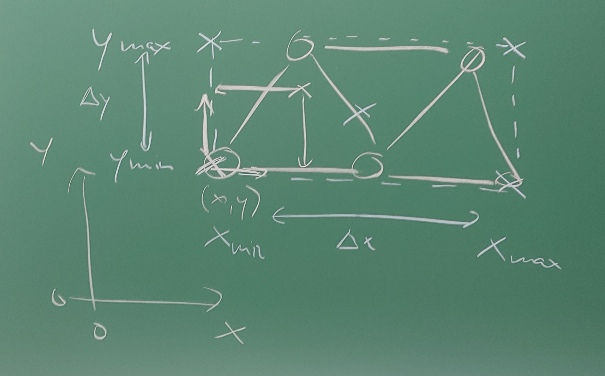
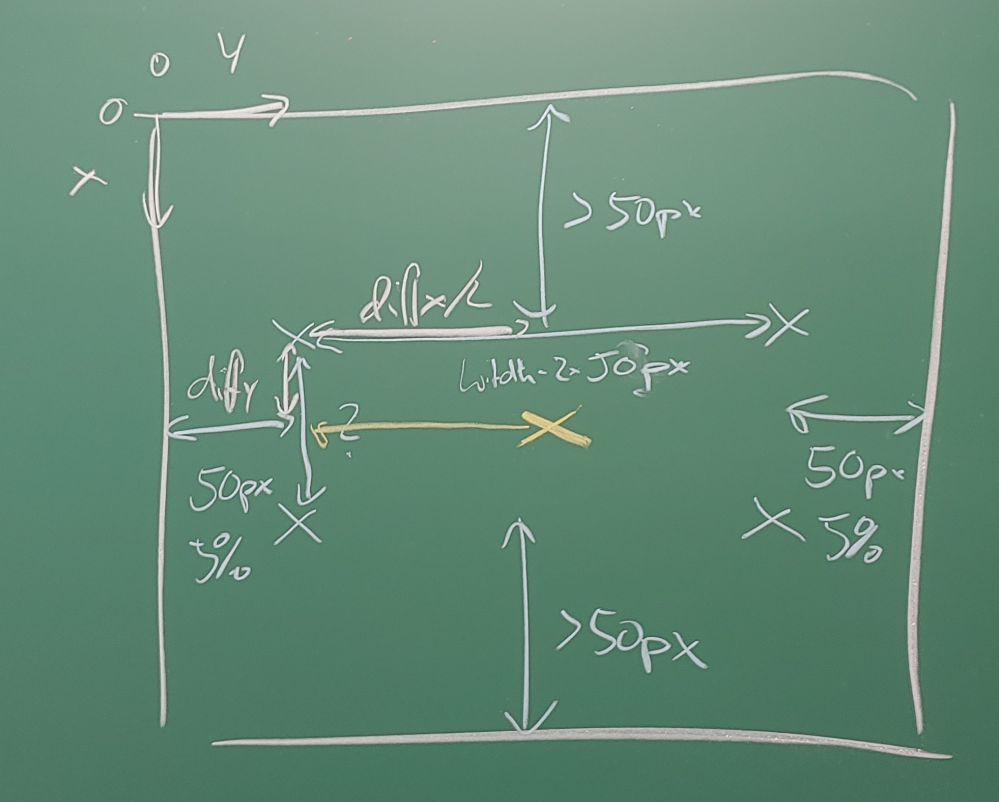
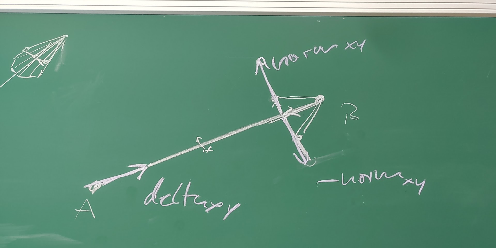

# Kapitel 3: 2D-Visualisierung (WPF/Vektor)

Dieses Kapitel umfasst die folgenden Abschnitte:

- 3.1: Grundlagen der Vektorgrafik und WPF Canvas
- 3.2: Transformation: Welt zu Bildschirm
- 3.3: Vektordarstellung geometrischer Elemente und Kräfte

---

## 3.1: Grundlagen der Vektorgrafik und WPF Canvas

Dieser Abschnitt umfasst die folgenden Inhalte:

- Prinzip der Vektorgrafik im Vergleich zur Rastergrafik
- Das `Canvas`-Element in WPF
- Vektorielle Grundformen (`Line`, `Rectangle`, `Ellipse`, `Polygon`, `Path`)

---

### Was ist Vektorgrafik?

- **Objektorientierte Repräsentation**: Bilder werden nicht als Ansammlung einzelner Pixel gespeichert, sondern als mathematisch definierte geometrische Formen (Punkte, Linien, Kurven, Polygone).
- **Auflösungsunabhängigkeit**: Vektorgrafiken lassen sich ohne Qualitätsverlust beliebig skalieren (keine Treppenstufen oder Pixelartefakte).
- **Zustandsbehaftet**: Jedes Element ist ein eigenes Objekt im UI-Baum (Visual Tree) mit Eigenschaften wie Position, Farbe, Strichstärke und Transformationen.
- **Einsatzbereich**: Technische Zeichnungen, Pläne, Schemata, Struktur- und Kraftvisualisierungen (z.B. Fachwerke, Gelenkgetriebe).

---

### Das `Canvas`-Control in WPF

In WPF bietet das `Canvas`-Control eine Zeichenfläche mit absoluter Positionierung:

- Kindelemente werden über angehängte Eigenschaften (`Canvas.Left`, `Canvas.Top`) exakt platziert.
- Unterstützt das direkte Hinzufügen von WPF-Shapes (`Shape`-Klasse) im Code-Behind oder per Data Binding.

```csharp
// Linie auf einem WPF Canvas erzeugen
var line = new Line
{
    X1 = 50,
    Y1 = 50,
    X2 = 250,
    Y2 = 150,
    Stroke = Brushes.SteelBlue,
    StrokeThickness = 3
};

myCanvas.Children.Add(line);
```

---

### WPF Shape-Elemente

<div class="columns top">
<div class="one">

**`Line`**
- Verbindet zwei Punkte $(X_1, Y_1)$ und $(X_2, Y_2)$.
- Einstellbar: `Stroke`, `StrokeThickness`, `StrokeDashArray`.

**`Rectangle` / `Ellipse`**
- Rechtecke und Kreise/Ellipsen.
- `Width`, `Height`, `Fill`, `Stroke`.

</div>
<div class="one">

**`Polygon`**
- Geschlossene Form aus einer Reihe von Punkten (`Points`-Collection).
- Ideal für Pfeilspitzen, Trägerquerschnitte oder Konturen.

**`Path`**
- Beliebige komplexe Vektorpfade mit Linien- und Bézier-Segmenten (`PathGeometry`).

</div>
</div>

---

## 3.2: Transformation: Welt- zu Bildschirmkoordinaten

Dieser Abschnitt umfasst die folgenden Inhalte:

- Die Herausforderung: Transformation von Welt- zu Bildschirmkoordinaten
- Schritte der Transformation: Skalierung, Translation, Y-Invertierung
- Praktische Umsetzung in C#

---

<div class="columns">
<div>

### 2D-Visualisierung: Die Herausforderung

- Das physikalische System existiert in **Weltkoordinaten** (z.B. in Metern, mit Ursprung $(0,0)$ links unten oder im Schwerpunkt).
- Der Computerbildschirm (z.B. ein `WPF Canvas`) verwendet **Bildschirmkoordinaten** (in Pixel / Device Independent Pixels, Ursprung $(0,0)$ links oben).
- Wir benötigen eine Transformation, um unsere Welt auf den Bildschirm abzubilden.

</div>
<div>



</div>
</div>

---

<div class="columns">
<div>

### Transformation: Welt -> Bildschirm

Die Transformation besteht meist aus drei Schritten:

1. **Skalierung**: Das Modell muss so vergrößert oder verkleinert werden, dass es gut auf den Canvas passt (unter Beibehaltung des Seitenverhältnisses).
2. **Translation (Verschiebung)**: Der Ursprung des Modells soll an eine bestimmte Stelle auf dem Canvas verschoben werden (z.B. zentriert mit Randabstand).
3. **Invertierung der Y-Achse**: In der Mathematik und Physik zeigt die Y-Achse nach oben, bei 2D-Grafiksystemen (WPF) standardmäßig nach unten.

</div>
<div>



</div>
</div>

---

### Umrechnung im Detail

```csharp
// Annahmen:
// canvasWidth, canvasHeight: Größe des Canvas in Pixel
// worldRect: Bounding Box des Modells in Weltkoordinaten
// margin: Rand in Pixel

// 1. Skalierungsfaktor berechnen (Uniform Scaling)
double scaleX = (canvasWidth - 2 * margin) / worldRect.Width;
double scaleY = (canvasHeight - 2 * margin) / worldRect.Height;
double scale = Math.Min(scaleX, scaleY);

// 2. Transformation für einen Punkt (worldX, worldY)
double screenX = margin + (worldX - worldRect.Left) * scale;
double screenY = margin + (worldRect.Top - worldY) * scale; // Y-Achse invertiert!

return new Point(screenX, screenY);
```

---

## 3.3: Vektordarstellung geometrischer Elemente und Kräfte

Dieser Abschnitt umfasst die folgenden Inhalte:

- Darstellung gerichteter physikalischer Größen (z.B. Kräfte, Geschwindigkeiten)
- Konstruktion zusammengesetzter Formen (Pfeilschaft + Pfeilspitze)
- Berechnung der Eckpunkte einer Pfeilspitze über Orthogonalvektoren

---

<div class="columns">
<div>

### Visualisierung der Kräfte: Pfeile

- Berechnete Größen wie Kräfte (Zug/Druck) oder Geschwindigkeiten sollen als Pfeile dargestellt werden.
- Ein Pfeil besteht aus einem **Pfeilkörper** (eine Linie) und einer **Pfeilspitze** (ein Dreieck oder Polygon).
- Die Pfeilspitze sitzt am Endpunkt der Linie und muss korrekt zur Richtung des Pfeils ausgerichtet sein.
- Die Koordinaten der Pfeilspitze lassen sich analytisch über Vektorgeometrie ermitteln.

</div>
<div>



</div>
</div>

---

### Berechnung der Pfeilspitze

```csharp
/// <summary>
/// Berechnet die Eckpunkte für ein Pfeilspitzen-Dreieck.
/// </summary>
/// <param name="tip">Die Position der Pfeilspitze.</param>
/// <param name="direction">Der normalisierte Richtungsvektor des Pfeils.</param>
/// <param name="size">Die Größe der Pfeilspitze in Pixeln.</param>
/// <returns>Ein Array von Punkten für das Polygon der Pfeilspitze.</returns>
public Point[] GetArrowhead(Point tip, Vector direction, double size)
{
    // Vektor, der 90° zur Richtung steht (Orthogonalvektor)
    var perpendicular = new Vector(-direction.Y, direction.X);

    // Eckpunkte der Pfeilspitze berechnen:
    // Entlang der Richtung zurück und jeweils seitlich abspreizen
    var p1 = tip - (size * direction) + (size / 2 * perpendicular);
    var p2 = tip - (size * direction) - (size / 2 * perpendicular);

    return new Point[] { tip, p1, p2 };
}
```

---

# Zusammenfassung Kapitel 3

- **Vektorgrafiken** stellen visuelle Inhalte durch mathematisch definierte Grundformen dar und sind auflösungsunabhängig skalierbar.
- Das WPF-Control **`Canvas`** bietet eine flexible Arbeitsfläche für die absolute Platzierung geometrischer Formen (`Line`, `Polygon`, `Path`).
- Eine präzise **Koordinatentransformation** (Skalierung mit Erhalt des Seitenverhältnisses, Verschiebung und Invertierung der Y-Achse) bildet physikalische Weltkoordinaten auf Bildschirmkoordinaten ab.
- Mittels einfacher **Vektoralgebra** (z.B. Orthogonalvektoren) können komplexe technische Grafikelemente wie ausgerichtete Kraftpfeile dynamisch generiert werden.
