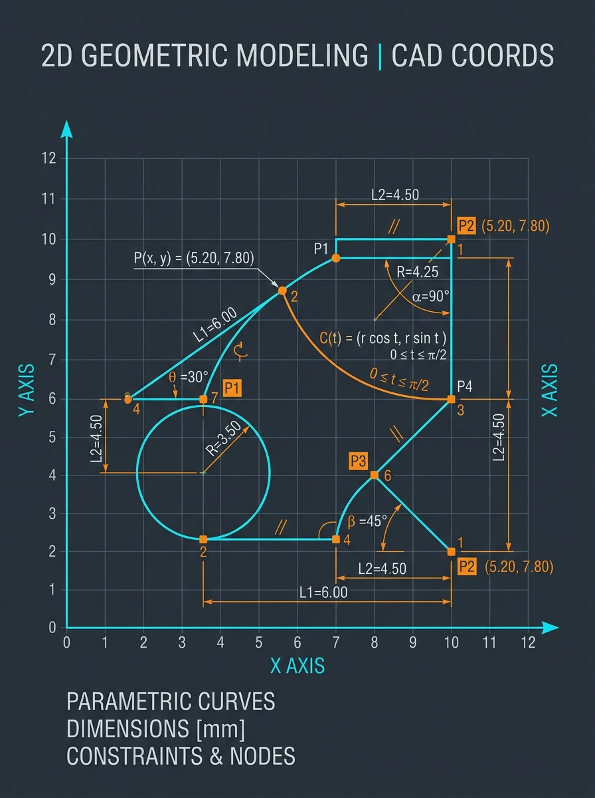
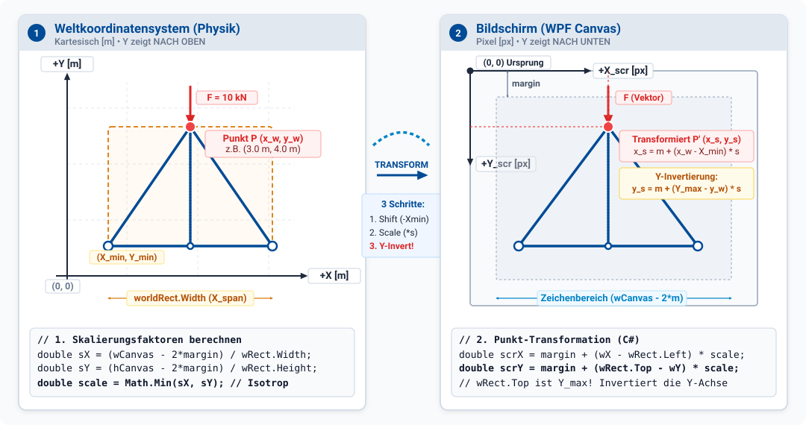

<!-- _paginate: false -->
<!-- _header: "" -->
<!-- _footer: "" -->



# Kapitel 3: 2D-Visualisierung (WPF/Vektor)

Dieses Kapitel umfasst die folgenden Abschnitte:

- 3.1: Grundlagen der Vektorgrafik und WPF Canvas
- 3.2: Transformation: Welt- zu Bildschirmkoordinaten
- 3.3: Vektordarstellung geometrischer Elemente und Kräfte
- 3.4: Interaktive Steuerung im Canvas (Pan & Zoom)
- 3.5: Performance & Architektur: Shapes vs. DrawingVisual

---

## 3.1: Grundlagen der Vektorgrafik und WPF Canvas

Dieser Abschnitt umfasst die folgenden Inhalte:

- Prinzip der Vektorgrafik im Vergleich zur Rastergrafik
- Das `Canvas`-Element in WPF
- Vektorielle Grundformen (`Line`, `Rectangle`, `Ellipse`, `Polygon`, `Path`)

---

### Was ist Vektorgrafik?

- **Objektorientierte Repräsentation**: Bilder werden nicht als Ansammlung einzelner Pixel gespeichert, sondern als mathematisch definierte geometrische Formen (Punkte, Linien, Kurven, Polygone).
- **Auflösungsunabhängigkeit**: Vektorgrafiken lassen sich ohne Qualitätsverlust beliebig skalieren (keine Treppenstufen oder Pixelartefakte beim Hineinzoomen).
- **Zustandsbehaftet**: Jedes Element ist ein eigenes Objekt im UI-Baum (Visual Tree) mit Eigenschaften wie Position, Farbe, Strichstärke und Transformationen.
- **Einsatzbereich**: Technische Zeichnungen, Pläne, Schemata, Struktur- und Kraftvisualisierungen (z.B. Fachwerke, Gelenkgetriebe, Schaltungen).

---

### Das `Canvas`-Control in WPF

In WPF bietet das `Canvas`-Control eine Zeichenfläche mit absoluter Positionierung:

- Kindelemente werden über angehängte Eigenschaften (`Canvas.Left`, `Canvas.Top`) exakt platziert.
- Unterstützt das direkte Hinzufügen von WPF-Shapes (`Shape`-Klasse) im Code-Behind oder per Data Binding.

```csharp
// Linie auf einem WPF Canvas erzeugen
var line = new Line
{
    X1 = 50,
    Y1 = 50,
    X2 = 250,
    Y2 = 150,
    Stroke = Brushes.SteelBlue,
    StrokeThickness = 3
};

myCanvas.Children.Add(line);
```

---

### WPF Shape-Elemente

<div class="columns top">
<div class="one">

**`Line`**
- Verbindet zwei Punkte $(X_1, Y_1)$ und $(X_2, Y_2)$.
- Einstellbar: `Stroke`, `StrokeThickness`, `StrokeDashArray`.

**`Rectangle` / `Ellipse`**
- Rechtecke und Kreise/Ellipsen.
- `Width`, `Height`, `Fill`, `Stroke`.

</div>
<div class="one">

**`Polygon`**
- Geschlossene Form aus einer Reihe von Punkten (`Points`-Collection).
- Ideal für Pfeilspitzen, Trägerquerschnitte oder Konturen.

**`Path`**
- Beliebige komplexe Vektorpfade mit Linien- und Bézier-Segmenten (`PathGeometry`).

</div>
</div>

---

## 3.2: Transformation: Welt- zu Bildschirmkoordinaten

Dieser Abschnitt umfasst die folgenden Inhalte:

- Die Herausforderung: Welt- vs. Bildschirmkoordinaten
- Geometrische Bemaßung, Bounding Box und Sicherheitsabstand (`margin`)
- Erhalt des Seitenverhältnisses (Aspect Ratio / Uniform Scaling)
- Zentrierung und Invertierung der Y-Achse
- Mathematische Formulierung und saubere C#-Implementierung

---

<div class="columns top">
<div class="one">

### 1. Weltkoordinatensystem (Physik)

- **Modellraum**: Reale physikalische Geometrie
- **Kontinuierlich**: Reelle Koordinaten $x_w, y_w \in \mathbb{R}$
- **Einheit**: Physikalische Größen (z.B. Meter [$\mathrm{m}$])
- **Orientierung**: Die $+Y$-Achse zeigt nach **oben**!
- **Ursprung $(0,0)$**: Beliebig im Raum platziert (z.B. linker Auflagerpunkt oder Schwerpunkt).

</div>
<div class="one">

### 2. Bildschirmkoordinaten (WPF Canvas)

- **Anzeigeraum**: Viewport auf dem Monitor
- **Diskret**: Pixel bzw. Device Independent Pixels [px]
- **Einheit**: $1/96$ Zoll pro Pixel
- **Orientierung**: Die $+Y$-Achse zeigt nach **unten**!
- **Ursprung $(0,0)$**: Fest in der **linken oberen Ecke** des Steuerelements fixiert.

</div>
</div>

---

### Visualisierung der Koordinatentransformation



---

### Bounding Box & Bemaßung des Modells

Bevor transformiert werden kann, muss die Ausdehnung des Modells in Weltkoordinaten ermittelt werden:

<div class="columns top">
<div class="one">

**Extremwerte aller Punkte ermitteln:**
$$X_{min} = \min_{i} (x_i), \quad X_{max} = \max_{i} (x_i)$$
$$Y_{min} = \min_{i} (y_i), \quad Y_{max} = \max_{i} (y_i)$$

**Breite und Höhe des Modells:**
$$W_{world} = X_{max} - X_{min}$$
$$H_{world} = Y_{max} - Y_{min}$$

</div>
<div class="one">

**Nutzbare Bildschirmfläche (Canvas):**
- Ein Randabstand `margin` verhindert das Abschneiden von Rändern, Knotenpunkten oder Linienstärken:
$$W_{draw} = W_{canvas} - 2 \cdot \text{margin}$$
$$H_{draw} = H_{canvas} - 2 \cdot \text{margin}$$

</div>
</div>

---

### Erhalt des Seitenverhältnisses (Aspect Ratio)

<div class="columns top">
<div class="one">

**Naive Skalierung (Verzerrung!):**
$$s_x = \frac{W_{draw}}{W_{world}}, \quad s_y = \frac{H_{draw}}{H_{world}}$$
- Wenn $s_x \ne s_y$, wird das Modell gestreckt oder gestaucht.
- Kreise werden zu Ellipsen, quadratische Fachwerke verzerrt, Winkel verfälscht!

</div>
<div class="one">

**Uniform Scaling (Isotrop):**
$$s = \min(s_x, s_y)$$
- Der kleinere Faktor stellt sicher, dass das Modell vollständig auf den Canvas passt.
- **Alle geometrischen Proportionen und Winkel bleiben physikalisch exakt erhalten.**

</div>
</div>

---

### Zentrierung und Invertierung der Y-Achse

<div class="columns top">
<div class="one">

**Zentrierungs-Offset:**
Durch $s = \min(s_x, s_y)$ bleibt in einer Dimension Freiraum. Dieser wird halbiert:
$$x_{offset} = \text{margin} + \frac{W_{draw} - W_{world} \cdot s}{2}$$
$$y_{offset} = \text{margin} + \frac{H_{draw} - H_{world} \cdot s}{2}$$

</div>
<div class="one">

**Y-Achsen-Invertierung:**
Da die Bildschirmachse nach unten verläuft, wird vom oberen Rand $Y_{max}$ abgezogen:
$$x_{screen} = x_{offset} + (x_w - X_{min}) \cdot s$$
$$y_{screen} = y_{offset} + (Y_{max} - y_w) \cdot s$$

- Für $y_w = Y_{max} \implies y_{screen} = y_{offset}$ (oben).
- Für $y_w = Y_{min} \implies y_{screen} = y_{offset} + H_{world} \cdot s$ (unten).

</div>
</div>

---

### C#-Implementierung: CoordinateTransformer (Setup & Skalierung)

```csharp
public class CoordinateTransformer
{
    private double _scale, _xOffset, _yOffset, _xMin, _yMax;

    public void Update(Rect w, double cW, double cH, double margin)
    {
        _xMin = w.Left;
        _yMax = w.Top; // Höchster Y-Wert kartesisch
        double drawW = Math.Max(0, cW - 2 * margin);
        double drawH = Math.Max(0, cH - 2 * margin);
        _scale = Math.Min(drawW / w.Width, drawH / w.Height);

        _xOffset = margin + (drawW - w.Width * _scale) / 2.0;
        _yOffset = margin + (drawH - w.Height * _scale) / 2.0;
    }
}
```

- Passt Maßstab und Offsets dynamisch an Fenstergrößenänderungen an.
- Hält das physikalische Seitenverhältnis (Uniform Scaling) verzerrungsfrei ein.

---

### C#-Implementierung: CoordinateTransformer (Transformation)

```csharp
public class CoordinateTransformer
{
    // ... Zustand aus Update() ...

    public Point WorldToScreen(Point w) => new(
        _xOffset + (w.X - _xMin) * _scale,
        _yOffset + (_yMax - w.Y) * _scale // Y-Invertierung
    );

    public Point ScreenToWorld(Point s) => new(
        _xMin + (s.X - _xOffset) / _scale,
        _yMax - (s.Y - _yOffset) / _scale // Y-Rücktransformation
    );
}
```

- $Y$-Achsen-Invertierung: Bildschirmursprung $(0,0)$ liegt links oben.
- `ScreenToWorld` bildet Klickpositionen auf physikalische Modellkoordinaten ab.

---

## 3.3: Vektordarstellung geometrischer Elemente und Kräfte

Dieser Abschnitt umfasst die folgenden Inhalte:

- Darstellung gerichteter physikalischer Größen (z.B. Kräfte, Momente, Geschwindigkeiten)
- Konstruktion zusammengesetzter Formen (Pfeilschaft + Pfeilspitze)
- Berechnung der Eckpunkte einer Pfeilspitze über Orthogonalvektoren

---

<div class="columns">
<div>

### Visualisierung der Kräfte: Pfeile

- Berechnete Größen wie Kräfte (Zug/Druck) oder Geschwindigkeiten sollen als Pfeile dargestellt werden.
- Ein Pfeil besteht aus einem **Pfeilkörper** (eine Linie) und einer **Pfeilspitze** (ein geschlossenes Polygon).
- Die Pfeilspitze sitzt am Endpunkt der Linie und muss korrekt zur Richtung des Vektors ausgerichtet sein.
- Die Koordinaten der Pfeilspitze lassen sich analytisch über Vektorgeometrie ermitteln.

</div>
<div>


</div>
</div>

---

### Analytische Berechnung der Pfeilspitze

Gegeben sei der Endpunkt (Spitze) $\vec{P}_{tip}$ und der gerichtete Kraftvektor $\vec{F} = (F_x, F_y)^T$.

1. **Normalisierter Richtungsvektor**:
   $$\vec{u} = \frac{\vec{F}}{\|\vec{F}\|} = \frac{1}{\sqrt{F_x^2 + F_y^2}} \begin{pmatrix} F_x \\ F_y \end{pmatrix}$$

2. **Orthogonalvektor (Normalenvektor, $90^\circ$ gedreht)**:
   $$\vec{u}^\perp = \begin{pmatrix} -u_y \\ u_x \end{pmatrix}$$

3. **Eckpunkte des Dreiecks (Länge $L$, Basisbreite $W$)**:
   $$\vec{P}_1 = \vec{P}_{tip} - L \cdot \vec{u} + \frac{W}{2} \cdot \vec{u}^\perp$$
   $$\vec{P}_2 = \vec{P}_{tip} - L \cdot \vec{u} - \frac{W}{2} \cdot \vec{u}^\perp$$

---

### Berechnung der Pfeilspitze in C#

```csharp
// Berechnet die Eckpunkte für ein Pfeilspitzen-Dreieck
public Point[] GetArrowhead(
    Point tip, Vector dir, double length, double width)
{
    dir.Normalize(); // Richtungs-Einheitsvektor u
    
    // Orthogonalvektor u_perp (90° gegen den Uhrzeigersinn)
    var perp = new Vector(-dir.Y, dir.X);

    Point basePoint = tip - (length * dir);
    Point p1 = basePoint + (width / 2.0 * perp);
    Point p2 = basePoint - (width / 2.0 * perp);

    return new Point[] { tip, p1, p2 };
}
```

---

## 3.4: Interaktive Steuerung im Canvas (Pan & Zoom)

Dieser Abschnitt umfasst die folgenden Inhalte:

- Anforderung: Navigation in großen Simulationsmodellen
- Architekturansätze: Naives Neuzeichnen vs. Matrix-Transformation
- Stufenloses Zoomen auf die aktuelle Mauszeiger-Position (`ScaleAt`)
- Verschieben der Arbeitsfläche per Drag & Drop (`Pan`)
- Rücktransformation für Interaktion und Selektion (`ScreenToWorld`)

---

### Navigationskonzept: Zwei Architekturansätze

<div class="columns top">
<div class="one">

**Ansatz A: Naives Neuzeichnen**
- Bei jeder Mausbewegung werden alle Weltkoordinaten neu berechnet.
- Alle WPF-Shapes werden im Canvas verschoben (`Canvas.SetLeft`).
- **Nachteile**:
  - Extrem rechenintensiv bei vielen Objekten.
  - Flackern bei schnellen Bewegungen.
  - Koppelt Navigationszustand unnötig an Modelldaten.

</div>
<div class="one">

**Ansatz B: GPU-`MatrixTransform`**
- Modell wird einmalig auf den Canvas gezeichnet.
- Navigation erfolgt über eine einzige **`MatrixTransform`** am Canvas.
- **Vorteile**:
  - Hardwarebeschleunigt über DirectX / GPU.
  - 60+ FPS selbst bei Tausenden Linien.
  - Vollständige Entkopplung: Modellgeometrie bleibt unverändert.

</div>
</div>

---

### XAML-Struktur für Pan & Zoom

Ein übergeordneter Container (`Border` oder `Grid`) mit `ClipToBounds="True"` fängt die Maus-Events ab:

```xml
<Border ClipToBounds="True" Background="White"
        MouseWheel="OnMouseWheel"
        MouseDown="OnMouseDown"
        MouseMove="OnMouseMove"
        MouseUp="OnMouseUp">
    <Canvas x:Name="SimulationCanvas">
        <Canvas.RenderTransform>
            <MatrixTransform x:Name="CanvasMatrixTransform" />
        </Canvas.RenderTransform>
    </Canvas>
</Border>
```

- `ClipToBounds="True"`: Verhindert, dass herausgezoomte Elemente über den Rand hinausragen.
- `CanvasMatrixTransform`: Steuert Pan (Translation) und Zoom (Skalierung) kombiniert in einer $3 \times 3$ Affinen Transformationsmatrix.

---

### Zoom zentriert auf den Mauszeiger

**Problem**: Ein naiver Zoom skaliert um den Ursprung $(0,0)$. Der anvisierte Punkt "springt" weg.
**Lösung**: Der Punkt unter dem Cursor soll während des Zoomens an derselben Bildschirmposition verbleiben (`ScaleAt`):

```csharp
private void OnMouseWheel(object sender, MouseWheelEventArgs e)
{
    Point mousePos = e.GetPosition(SimulationCanvas);
    
    // Zoomfaktor bestimmen (z.B. +15% bzw. -13%)
    double zoom = e.Delta > 0 ? 1.15 : 1.0 / 1.15;

    Matrix m = CanvasMatrixTransform.Matrix;
    
    // Skaliert um die exakte Position des Mauszeigers
    m.ScaleAt(zoom, zoom, mousePos.X, mousePos.Y);
    
    CanvasMatrixTransform.Matrix = m;
}
```

---

### Verschieben (Pan / Dragging) per Maus

Damit die Maus bei schnellen Bewegungen nicht "abreißt", wird **`CaptureMouse()`** genutzt:

```csharp
private Point _lastPos;
private bool _isPanning;

private void OnMouseDown(object s, MouseButtonEventArgs e)
{
    if (e.MiddleButton != MouseButtonState.Pressed && 
        e.LeftButton != MouseButtonState.Pressed) return;
    _lastPos = e.GetPosition(this);
    _isPanning = true;
    ((IInputElement)s).CaptureMouse();
}
private void OnMouseUp(object s, MouseButtonEventArgs e)
{
    _isPanning = false;
    ((IInputElement)s).ReleaseMouseCapture();
}
```

---

### Verschieben: Die `MouseMove`-Logik

In `MouseMove` wird die Differenz zur vorherigen Mausposition direkt auf die Matrix addiert:

```csharp
private void OnMouseMove(object sender, MouseEventArgs e)
{
    if (!_isPanning) return;

    Point currentPos = e.GetPosition(this);
    Vector delta = currentPos - _lastMousePos;
    _lastMousePos = currentPos;

    Matrix m = CanvasMatrixTransform.Matrix;
    
    // Verschiebt den Canvas um die Mausdifferenz
    m.Translate(delta.X, delta.Y);
    
    CanvasMatrixTransform.Matrix = m;
}
```

- Funktioniert nahtlos in jedem beliebigen Zoomzustand.

---

### Rücktransformation: Bildschirm zu Welt (`ScreenToWorld`)

Für Benutzerinteraktionen (z.B. Anklicken eines Knotens oder Einzeichnen einer Last) muss die Klickposition wieder in physikalische Weltkoordinaten umgerechnet werden:

```csharp
public Point ScreenToWorld(
    Point screenPixel, Matrix canvasMatrix, CoordinateTransformer trans)
{
    // 1. Pan- und Zoom-Matrix invertieren
    Matrix invMatrix = canvasMatrix;
    invMatrix.Invert();
    Point unzoomed = invMatrix.Transform(screenPixel);

    // 2. Koordinatentransformation (Welt -> Screen) invertieren:
    double worldX = _xMin + (unzoomed.X - _xOffset) / _scale;
    double worldY = _yMax - (unzoomed.Y - _yOffset) / _scale; // Invertiert

    return new Point(worldX, worldY);
}
```

---

## 3.5: Performance & Architektur: Shapes vs. DrawingVisual

Dieser Abschnitt umfasst die folgenden Inhalte:

- Das Performance-Bottleneck von WPF `Shape`-Elementen
- Der interne Aufbau: `UIElement`-Overhead und Layout-Pass
- High-Performance Vektorgrafik mit `DrawingVisual` & `DrawingContext`
- Erstellung eines benutzerdefinierten `VisualHost`-Controls
- Architektur- und Performancevergleich

---

### Das Problem mit WPF `Shape`-Elementen

`Line`, `Rectangle`, `Ellipse` und `Path` sind sehr komfortabel, stoßen aber schnell an Grenzen:

<div class="columns top">
<div class="one">

**Der `UIElement`-Overhead:**
- Jedes `Shape` erbt von:
  `Visual` $\rightarrow$ `UIElement` $\rightarrow$ `FrameworkElement` $\rightarrow$ `Shape`.
- Hunderte Dependency Properties, Focus-Handling, Event-Routing, Styling, Animations-Slots.
- Hoher Speicherverbrauch (mehrere KB pro Shape-Instanz).

</div>
<div class="one">

**Der Layout-Pass (`Measure`/`Arrange`):**
- Jede Änderung oder jedes Hinzufügen triggert den WPF-Layout-Cycle.
- **Konsequenz**:
  - Bis 1.000 Shapes: Flüssig (60 FPS).
  - Ab 2.000 Shapes: Merkbare Verzögerungen.
  - Ab 5.000 Shapes: Frame-Einbrüche (< 10 FPS), UI friert bei Resize ein.

</div>
</div>

---

### Die Lösung: `DrawingVisual`

`DrawingVisual` ist ein extrem leichtgewichtiger Visual-Knoten ohne UI-Ballast:

- Erbt direkt von `Visual` (kein `UIElement`, kein `FrameworkElement`).
- **Kein** Layout-Pass, kein Data Binding, keine separaten Event-Handler pro Vektorelement.
- Vektorbefehle werden direkt in einen kompakten **`DrawingContext`** geschrieben.
- Die Zeichenbefehle werden hardwarebeschleunigt als serialisierte Vektor-Streams direkt an die GPU übergeben.

```
UIElement-Hierarchie (Schwergewicht):
[Shape] ---> [FrameworkElement] ---> [UIElement] ---> [Visual]

Leichtgewicht-Hierarchie:
[DrawingVisual] ------------------------------------> [Visual]
```

---

### Zeichnen im `DrawingContext`

<div class="columns">
<div class="one">

**Setup & Freezing:**
```csharp
var visual = new DrawingVisual();

using (DrawingContext dc = 
       visual.RenderOpen())
{
    // Golden Rule: Pens & Brushes FREEZEN!
    var pen = new Pen(Brushes.SteelBlue, 2.0);
    pen.Freeze();
    var brush = Brushes.Crimson;
    brush.Freeze();

    DrawScene(dc, rods, nodes, pen, brush);
}
```

</div>
<div class="one">

**Zeichenschleifen:**
```csharp
private void DrawScene(
    DrawingContext dc, List<Rod> rods, 
    List<Node> nodes, Pen pen, Brush brush)
{
    // 10.000 Stäbe zeichnen:
    foreach (var rod in rods)
        dc.DrawLine(pen, rod.P1, rod.P2);

    // 10.000 Knoten zeichnen:
    foreach (var node in nodes)
        dc.DrawEllipse(brush, null, 
            node.Pos, 3.0, 3.0);
}
```

</div>
</div>

---

### Das `VisualHost`-Control

Um `DrawingVisual`-Objekte im WPF-Fenster anzuzeigen, erstellen wir ein schlankes Control:

```csharp
public class FastDrawingCanvas : FrameworkElement
{
    private readonly VisualCollection _children;
    private readonly DrawingVisual _drawingVisual = new();
    public FastDrawingCanvas() =>
        _children = new VisualCollection(this) { _drawingVisual };

    protected override int VisualChildrenCount => _children.Count;
    protected override Visual GetVisualChild(int index) => _children[index];

    public void Render(Action<DrawingContext> renderAction)
    {
        using DrawingContext dc = _drawingVisual.RenderOpen();
        renderAction(dc);
    }
}
```

---

### Alternative: Direktes Überschreiben von `OnRender`

Wenn kein selektives Hit-Testing oder Multi-Layer-Visuals benötigt werden, kann auch direkt `OnRender` überschrieben werden:

```csharp
public class SimpleRenderCanvas : FrameworkElement
{
    public SimulationData? Data { get; set; }

    protected override void OnRender(DrawingContext dc)
    {
        base.OnRender(dc);
        if (Data == null) return;

        var pen = new Pen(Brushes.Black, 1.0);
        pen.Freeze();

        foreach (var bar in Data.Bars)
            dc.DrawLine(pen, bar.P1, bar.P2);
    }
}
```

- Neuzeichnen wird gezielt über `this.InvalidateVisual()` ausgelöst.

---

### Technologie- und Performancevergleich

| Kriterium | WPF `Shapes` (`Canvas`) | `DrawingVisual` / `OnRender` | `WriteableBitmap` (Pixel) |
| :--- | :--- | :--- | :--- |
| **Grafiktyp** | Vektor (High-Level) | Vektor (Low-Level) | Rastergrafik (Pixel) |
| **Max. Elementanzahl** | $\approx 1.000 - 2.000$ | $\mathbf{> 100.000}$ | Unbegrenzt (pixelweise) |
| **Speicherverbrauch** | Sehr hoch ($\approx$ KB / Shape) | Sehr gering ($\approx$ Bytes) | Fest ($W \times H \times 4$ Bytes) |
| **Zoom-Verhalten** | Stufenlos scharf | **Stufenlos scharf** | Pixelig beim Hineinzoomen |
| **Interaktivität** | Direkt (`Click`, `Hover`) | Hit-Testing (`HitTest()`) | Koordinatenberechnung |
| **Typischer Einsatz** | UI-Icons, kleine Schemata | **Fachwerke, CAD, FE-Netze** | Wärmebilder, Partikelfelder |

---

# Zusammenfassung Kapitel 3

- **Vektorgrafiken** bieten auflösungsunabhängige, stufenlos skalierbare Darstellungen für technische Simulationsmodelle.
- Die **Koordinatentransformation** bildet kontinuierliche Weltkoordinaten ($+Y$ nach oben, Meter) auf diskrete Canvas-Koordinaten ($+Y$ nach unten, Pixel) ab:
  - **Uniform Scaling** ($s = \min(s_x, s_y)$) verhindert Verzerrungen.
  - Zentrierungs-Offsets und `margin` garantieren eine saubere, vollständige Platzierung.
- Mittels **Vektoralgebra** (Richtungs- und Orthogonalvektoren) werden Pfeilschäfte und Pfeilspitzen analytisch konstruiert.
- Eine **`MatrixTransform`** am Canvas ermöglicht flüssiges, hardwarebeschleunigtes **Pan & Zoom** mit Zentrierung auf den Mauszeiger (`ScaleAt`).
- Bei großen Datenmengen ($> 2.000$ Elemente) bricht der WPF `Shape`-Baum ein. **`DrawingVisual` / `DrawingContext`** bietet professionelle High-Performance-Vektorgrafik für komplexe Engineering-Anwendungen.
