# Kapitel 4: Kontinuierliche Dynamische Modelle

- 4.1: Grundlagen und Definitionen
- 4.2: Beispiel: Freier Fall / Vertikaler Wurf
- 4.3: Beispiel: Ungedämpftes Federpendel
- 4.4: Softwarearchitektur für Simulation
- 4.5: Lösungsalgorithmen für Simulation

---

## 4.1: Grundlagen und Definitionen

Dieser Abschnitt umfasst die folgenden Inhalte:

- Definition von kontinuierlichen dynamischen Modellen
- Die Zustandsraumdarstellung
- Umwandlung von Differentialgleichungen höherer Ordnung
- Analytische vs. numerische Lösungsansätze

---

### Was sind kontinuierliche dynamische Modelle?

<div class="columns top">
<div>

**Informelle Beschreibung:**

- Beschreiben Systeme, deren Zustände sich **kontinuierlich** über die Zeit ändern.
- Die Zeit wird als kontinuierliche Variable `t` (aus den reellen Zahlen) betrachtet.
- Die Zustandsänderungen werden durch **Differentialgleichungen** beschrieben.

</div>
<div>

**Formale Darstellung:**

Eine gewöhnliche Differentialgleichung (ODE) erster Ordnung:
$$ \frac{dx}{dt} = \dot{x}(t) = f(t, x(t), u(t)) $$

- `t`: Zeit
- `x(t)`: Vektor der Zustandsvariablen zum Zeitpunkt `t`
- `u(t)`: Vektor der Eingangssignale zum Zeitpunkt `t`
- `f`: Funktion, die die Änderungsrate des Zustands beschreibt

</div>
</div>

---

<div class="columns">
<div class="three">

### Zustandsraumdarstellung

Eine übliche Methode zur Darstellung von dynamischen Systemen.

**Zustandsgleichung:**

$$ \dot{x}(t) = f(t, x(t), u(t)) $$

Beschreibt die Dynamik des Systems.

**Ausgangsgleichung:**

$$ y(t) = g(t, x(t), u(t)) $$

Beschreibt, wie die beobachtbaren Ausgänge `y(t)` aus den Zuständen `x(t)` und Eingängen `u(t)` berechnet werden.

**Legende:**

*`x`: Zustandsvektor,  `u`: Eingangsvektor, `y`: Ausgangsvektor*

</div>
<div>


</div>
</div>

---

<div class="columns">
<div class="three">

### Von höheren Ordnungen zur ersten Ordnung

Differentialgleichungen höherer Ordnung können immer in ein System von Differentialgleichungen erster Ordnung umgewandelt werden.

**Beispiel: Bewegungsgleichung (2. Ordnung)**
$$ m \ddot{y}(t) + d \dot{y}(t) + k y(t) = F(t) $$

**Umwandlung:**
1.  Definiere Zustandsvariablen:
    -   $x_1(t) = y(t)$ (Position)
    -   $x_2(t) = \dot{y}(t)$ (Geschwindigkeit)
2.  Leite die Zustandsvariablen nach der Zeit ab:
    -   $\dot{x}_1(t) = \dot{y}(t) = x_2(t)$
    -   $\dot{x}_2(t) = \ddot{y}(t) = \frac{1}{m}(F(t) - d x_2(t) - k x_1(t))$

</div>
<div>


</div>
</div>

---

### Von höheren Ordnungen zur ersten Ordnung (Matrixform)

Das System von DGLs erster Ordnung:
$$ \dot{x}_1(t) = x_2(t) $$
$$ \dot{x}_2(t) = -\frac{k}{m} x_1(t) - \frac{d}{m} x_2(t) + \frac{1}{m} F(t) $$

**In Matrixform (lineares System):**
$$
\begin{pmatrix} \dot{x}_1 \\ \dot{x}_2 \end{pmatrix}
=
\begin{pmatrix} 0 & 1 \\ -\frac{k}{m} & -\frac{d}{m} \end{pmatrix}
\begin{pmatrix} x_1 \\ x_2 \end{pmatrix}
+
\begin{pmatrix} 0 \\ \frac{1}{m} \end{pmatrix}
F(t)
$$
Dies entspricht der Form $\dot{x} = Ax + Bu$.

---

### Wie löst man eine Differentialgleichung?

<div class="columns top">
<div class="two">

**Analytische Lösung**

- Finden einer exakten mathematischen Funktion `x(t)`, die die DGL für alle `t` erfüllt.
- Beispiel: $x(t) = e^{-t}$ ist die analytische Lösung für $\dot{x} = -x$ mit $x(0)=1$.
- **Vorteil:** Exakt, liefert Einblick in das Systemverhalten.
- **Nachteil:** Nur für relativ einfache, oft lineare Systeme möglich.

</div>
<div class="two">

**Numerische Lösung**

- Approximation der Lösung zu diskreten Zeitpunkten $t_0, t_1, t_2, ...$
- Startet bei einem Anfangswert $x(t_0) = x_0$.
- Berechnet schrittweise $x_1 \approx x(t_1)$, $x_2 \approx x(t_2)$, usw.
- **Vorteil:** Anwendbar auf praktisch alle (auch hochkomplexe, nichtlineare) Systeme.
- **Nachteil:** Ist immer eine Approximation, Genauigkeit hängt von der Methode und der Schrittweite ab.

</div>
</div>

---

<div class="columns">
<div class="three">

### Numerische Integrationsverfahren

**Grundidee:** Approximiere den kontinuierlichen Verlauf von `x(t)` durch eine Folge von Werten $x_k \approx x(t_k)$ an diskreten Zeitpunkten $t_k = t_0 + k \cdot h$.

- `h`: Schrittweite (step size)

**Basis:** Taylor-Reihenentwicklung
$$ x(t+h) = x(t) + h \dot{x}(t) + \frac{h^2}{2!} \ddot{x}(t) + \dots $$

Wenn `h` klein ist, können wir Terme höherer Ordnung vernachlässigen:
$$ x(t+h) \approx x(t) + h \dot{x}(t) $$
Da wir wissen, dass $\dot{x}(t) = f(t, x(t))$, erhalten wir:
$$ x(t+h) \approx x(t) + h f(t, x(t)) $$

</div>
<div>


</div>
</div>

---

<div class="columns">
<div>

### Die explizite Euler-Methode

Auch "Euler-Vorwärts" genannt. Die einfachste numerische Methode.

**Formel:**
$$ x_{k+1} = x_k + h \cdot f(t_k, x_k) $$

- Um den neuen Zustand $x_{k+1}$ zu berechnen, wird die Ableitung (Steigung) am **aktuellen** Punkt $(t_k, x_k)$ verwendet.
- Die Methode ist **explizit**, weil $x_{k+1}$ direkt aus bekannten Werten berechnet werden kann.

</div>
<div>


</div>
</div>

---

<div class="columns">
<div>

### Die implizite Euler-Methode

Auch "Euler-Rückwärts" genannt.

**Formel:**
$$ x_{k+1} = x_k + h \cdot f(t_{k+1}, x_{k+1}) $$

- Um den neuen Zustand $x_{k+1}$ zu berechnen, wird die Ableitung (Steigung) am **zukünftigen** Punkt $(t_{k+1}, x_{k+1})$ verwendet.
- Die Methode ist **implizit**, weil der gesuchte Wert $x_{k+1}$ auf beiden Seiten der Gleichung steht.
- Es muss bei jedem Schritt eine (oft nichtlineare) Gleichung gelöst werden!

</div>
<div>


</div>
</div>

---


## 4.2: Beispiel: Freier Fall / Vertikaler Wurf

Dieser Abschnitt umfasst die folgenden Inhalte:

- Physikalische Modellierung des vertikalen Wurfs
- Aufstellen des Zustandsraummodells
- Herleitung der analytischen Lösung

---

### Vertikaler Wurf: Einführung

Ein einfaches, aber fundamentales Beispiel für ein kontinuierliches dynamisches System.

**Annahmen:**
- Bewegung nur in vertikaler Richtung (`y`).
- Konstante Erdbeschleunigung `g`.
- Kein Luftwiderstand.

**Physikalisches Gesetz (Newton):**
$$ F = m a $$
$$ -m g = m \ddot{y} $$
$$ \ddot{y}(t) = -g $$

Dies ist eine DGL 2. Ordnung.

---

### Vertikaler Wurf: Zustandsraummodell

Zunächst überführen wir das DGL 2. Ordnung in System von DGLs. 1. Ordnung (das Zustandsraummodell):

<div class="columns top">
<div>

**DGL 2. Ordnung:**
$$ \ddot{y}(t) = -g $$

**Zustandsvariablen:**
- $x_1(t) = y(t)$ (Position/Höhe)
- $x_2(t) = \dot{y}(t)$ (Geschwindigkeit)

</div>
<div>

**System von DGLs 1. Ordnung:**
- $\dot{x}_1(t) = \dot{y}(t) = x_2(t)$
- $\dot{x}_2(t) = \ddot{y}(t) = -g$

**Zustandsraumdarstellung:**
$$ \dot{x} = \begin{pmatrix} \dot{x}_1 \\ \dot{x}_2 \end{pmatrix} = \begin{pmatrix} x_2 \\ -g \end{pmatrix} = f(x) $$
Hier ist die Dynamik `f` unabhängig von `t` und es gibt keinen Eingang `u`.

</div>
</div>

---

### Vertikaler Wurf: Analytische Lösung

Wir lösen die DGLs durch direkte Integration.

<div class="columns top">
<div>

**Anfangsbedingungen:**

Zunächst müssen wir den Anfangszustand festlegen:

- $y(0) = y_0$<br/>(Anfangshöhe)
- $\dot{y}(0) = v_0$ (Anfangsgeschwindigkeit)

</div>
<div>

**1. Integration (*Geschwindigkeit*):**

Dann können wir die Geschwindigkeit berechnen:

$$ \dot{y}(t) = v(t) = \int -g \, dt = -g t + C_1 $$
Mit $\dot{y}(0) = v_0$ folgt $C_1 = v_0$.
$$ v(t) = v_0 - g t $$

</div>
<div>

**2. Integration (*Position*):**

Schließlich ergibt sich daraus die Positionsgleichung:

$$ y(t) = \int (v_0 - g t) \, dt = v_0 t - \frac{1}{2} g t^2 + C_2 $$
Mit $y(0) = y_0$ folgt $C_2 = y_0$.
$$ y(t) = y_0 + v_0 t - \frac{1}{2} g t^2 $$

</div>
</div>

---

<div class="columns">
<div>

### Vertikaler Wurf: Analytische Lösung (Zusammenfassung)

Für die Anfangsbedingungen $x(0) = \begin{pmatrix} y_0 \\ v_0 \end{pmatrix}$ lautet die exakte, analytische Lösung:

**Position:**
$$ y(t) = y_0 + v_0 t - \frac{1}{2} g t^2 $$

**Geschwindigkeit:**
$$ v(t) = v_0 - g t $$

Diese Formeln beschreiben die exakte Trajektorie des Objekts für jeden beliebigen Zeitpunkt `t > 0`.

</div>
<div>


</div>
</div>

---

### Vertikaler Wurf: Numerische Lösung (**Expliziter Euler**)

**Zustandsmodell:**
$$ \dot{x} = \begin{pmatrix} \dot{y} \\ \dot{v} \end{pmatrix} = \begin{pmatrix} v \\ -g \end{pmatrix} = f(x) $$

**Euler-Formel:**
$$ x_{k+1} = x_k + h \cdot f(x_k) $$

**Aufgeteilt in Komponenten:**
$$ \begin{pmatrix} y_{k+1} \\ v_{k+1} \end{pmatrix} = \begin{pmatrix} y_k \\ v_k \end{pmatrix} + h \cdot \begin{pmatrix} v_k \\ -g \end{pmatrix} $$

**Das ergibt zwei einfache Update-Regeln:**
1.  $y_{k+1} = y_k + h \cdot v_k$
2.  $v_{k+1} = v_k - h \cdot g$

---

<div class="columns">
<div class="three">

### Beispielrechnung: Expliziter Euler

**Parameter:**
- $y_0 = 100\,m$, $v_0 = 0\,m/s$
- $g \approx 9.81\,m/s^2$
- Schrittweite $h = 0.1\,s$

**Schritt 0 -> 1 (t=0s -> t=0.1s):**
- $y_1 = y_0 + h \cdot v_0 = 100 + 0.1 \cdot 0 = 100\,m$
- $v_1 = v_0 - h \cdot g = 0 - 0.1 \cdot 9.81 = -0.981\,m/s$

**Schritt 1 -> 2 (t=0.1s -> t=0.2s):**
- $y_2 = y_1 + h \cdot v_1 = 100 + 0.1 \cdot (-0.981) = 99.9019\,m$
- $v_2 = v_1 - h \cdot g = -0.981 - 0.1 \cdot 9.81 = -1.962\,m/s$

</div>
<div>

| $i$ | $a_i$ | $v_i$ | $y_i$ |
|-|-|-|-|
| 0 | -9.81 | 0 | 100 |
| 1 | -9.81 | -0.981 | 100 |
| 2 | -9.81 | -1.962 | 00.9019 |
| ... | ... | ... | ... |

</div>
</div>

---

### Vertikaler Wurf: Numerische Lösung (**Impliziter Euler**)

**Implizite Euler-Formel:**
$$ x_{k+1} = x_k + h \cdot f(x_{k+1}) $$

**Aufgeteilt in Komponenten:**
$$ \begin{pmatrix} y_{k+1} \\ v_{k+1} \end{pmatrix} = \begin{pmatrix} y_k \\ v_k \end{pmatrix} + h \cdot \begin{pmatrix} v_{k+1} \\ -g \end{pmatrix} $$

**Das ergibt zwei Gleichungen:**
1.  $y_{k+1} = y_k + h \cdot v_{k+1}$
2.  $v_{k+1} = v_k - h \cdot g$

Hier ist es einfach: Wir können zuerst $v_{k+1}$ berechnen und das Ergebnis dann in die erste Gleichung einsetzen.

---

### Vergleich: Euler-Methoden für den vertikalen Wurf

<div class="columns top">
<div class="two">

**Expliziter Euler**
```csharp
// Zustand (y, v) zum Zeitpunkt k
var y_k = 100.0;
var v_k = 0.0;

// Berechnung für k+1
var y_kp1 = y_k + h * v_k;
var v_kp1 = v_k - h * g;
```
- Sehr einfach zu berechnen.

</div>
<div class="two">

**Impliziter Euler**
```csharp
// Zustand (y, v) zum Zeitpunkt k
var y_k = 100.0;
var v_k = 0.0;

// Berechnung für k+1
var v_kp1 = v_k - h * g;
var y_kp1 = y_k + h * v_kp1;
```
- In diesem speziellen Fall auch sehr einfach.
- Man beachte die Reihenfolge der Berechnungen!

</div>
</div>

Interessanterweise liefert die implizite Methode für die Geschwindigkeit exakt das gleiche Ergebnis wie die explizite Methode, da $\dot{v} = -g$ eine Konstante ist. Für die Position ergibt sich jedoch ein Unterschied.

---

### Genauigkeit der Euler-Methoden

Vergleichen wir die numerischen Ergebnisse mit der analytischen Lösung.

**Analytische Lösung nach 0.1s:**
- $v(0.1) = 0 - 9.81 \cdot 0.1 = -0.981\,m/s$
- $y(0.1) = 100 + 0 \cdot 0.1 - 0.5 \cdot 9.81 \cdot (0.1)^2 = 99.95095\,m$

**Numerische Ergebnisse für $y_1$ (bei $t=0.1s$):**
- **Expliziter Euler:** $y_1 = 100\,m$ (Fehler: -0.049 m)
- **Impliziter Euler:** $y_1 = 100 + 0.1 \cdot (-0.981) = 99.9019\,m$ (Fehler: -0.049 m)

Beide Methoden haben einen lokalen Fehler der Ordnung $O(h^2)$ und einen globalen Fehler der Ordnung $O(h)$. Sie sind Methoden erster Ordnung.

---


## 4.3: Beispiel: Ungedämpftes Federpendel

Dieser Abschnitt umfasst die folgenden Inhalte:

- Physikalische Modellierung des Federpendels
- Aufstellen des Zustandsraummodells
- Herleitung der analytischen Lösung
- Analyse der numerischen Stabilität (expliziter vs. impliziter Euler)

---

### Federpendel: Einführung

Ein klassisches Beispiel für ein oszillierendes System.

**Annahmen:**
- Eine Masse `m` ist an einer Feder mit Federkonstante `k` befestigt.
- Keine Dämpfung (keine Reibung).
- Bewegung nur in einer Dimension (`y`).

**Physikalisches Gesetz (Hooke'sches Gesetz & Newton):**
$$ F_{Feder} = -k y $$
$$ F = m a \implies -k y(t) = m \ddot{y}(t) $$
$$ \ddot{y}(t) = -\frac{k}{m} y(t) $$

---

### Federpendel: Zustandsraummodell

Wir überführen das Modell zunächst wieder in ein Zustandsraummodell:

<div class="columns top">
<div>

**DGL 2. Ordnung:**
$$ \ddot{y}(t) = -\frac{k}{m} y(t) $$

**Zustandsvariablen:**
- $x_1(t) = y(t)$ (Position/Auslenkung)
- $x_2(t) = \dot{y}(t)$ (Geschwindigkeit)

</div>
<div>

**System von DGLs 1. Ordnung:**
- $\dot{x}_1(t) = x_2(t)$
- $\dot{x}_2(t) = -\frac{k}{m} x_1(t)$

**Zustandsraumdarstellung:**
$$ \dot{x} = \begin{pmatrix} \dot{x}_1 \\ \dot{x}_2 \end{pmatrix} = \begin{pmatrix} x_2 \\ -\frac{k}{m} x_1 \end{pmatrix} = f(x) $$

</div>
</div>

---

### Federpendel: Analytische Lösung

Die DGL $\ddot{y} + \omega^2 y = 0$ mit $\omega = \sqrt{k/m}$ beschreibt eine harmonische Schwingung.

**Allgemeine Lösung:**
$$ y(t) = C_1 \cos(\omega t) + C_2 \sin(\omega t) $$

**Mit Anfangsbedingungen $y(0)=y_0$ und $\dot{y}(0)=v_0$:**
- $y(0) = y_0 \implies C_1 = y_0$
- $\dot{y}(t) = -C_1 \omega \sin(\omega t) + C_2 \omega \cos(\omega t)$
- $\dot{y}(0) = v_0 \implies C_2 \omega = v_0 \implies C_2 = v_0 / \omega$

**Spezifische analytische Lösung:**
$$ y(t) = y_0 \cos(\omega t) + \frac{v_0}{\omega} \sin(\omega t) $$

Diese Lösung beschreibt eine ewige, ungedämpfte Schwingung.

---

### Federpendel: Numerische Lösung (Expliziter Euler)

**Zustandsmodell:**
$$ f(x) = \begin{pmatrix} x_2 \\ -\frac{k}{m} x_1 \end{pmatrix} $$

**Explizite Euler-Formel:** $x_{k+1} = x_k + h \cdot f(x_k)$
$$ \begin{pmatrix} y_{k+1} \\ v_{k+1} \end{pmatrix} = \begin{pmatrix} y_k \\ v_k \end{pmatrix} + h \cdot \begin{pmatrix} v_k \\ -\frac{k}{m} y_k \end{pmatrix} $$

**Update-Regeln:**
1.  $y_{k+1} = y_k + h \cdot v_k$
2.  $v_{k+1} = v_k - h \frac{k}{m} y_k$

---

<div class="columns">
<div>

### Problem des expliziten Eulers: Instabilität

Was passiert mit der Energie des Systems bei der numerischen Simulation? Die Gesamtenergie ist:

$E = E_{kin} + E_{pot} = \frac{1}{2}mv^2 + \frac{1}{2}ky^2$

Bei der analytischen Lösung ist `E` konstant.
Beim expliziten Euler-Verfahren **wächst** die numerische Energie $E_k = \frac{1}{2}mv_k^2 + \frac{1}{2}ky_k^2$ mit jedem Schritt!

Dieses Verhalten ist typisch für den expliziten Euler bei oszillierenden Systemen. Das Verfahren ist nur bedingt stabil. Eine kleinere Schrittweite `h` verlangsamt das Anwachsen, verhindert es aber nicht.

</div>
<div>


</div>
</div>

---

### Federpendel: Numerische Lösung (Impliziter Euler)

**Implizite Euler-Formel:** $x_{k+1} = x_k + h \cdot f(x_{k+1})$
$$ \begin{pmatrix} y_{k+1} \\ v_{k+1} \end{pmatrix} = \begin{pmatrix} y_k \\ v_k \end{pmatrix} + h \cdot \begin{pmatrix} v_{k+1} \\ -\frac{k}{m} y_{k+1} \end{pmatrix} $$

**Gleichungssystem:**
1.  $y_{k+1} = y_k + h \cdot v_{k+1}$
2.  $v_{k+1} = v_k - h \frac{k}{m} y_{k+1}$

Dies ist ein lineares Gleichungssystem für die unbekannten Größen $y_{k+1}$ und $v_{k+1}$.


---

## 4.4: Softwarearchitektur für Simulation

Dieser Abschnitt beschreibt eine flexible, blockbasierte Architektur für die Simulation von dynamischen Systemen, die stark an das Konzept von **Simulink S-Functions** angelehnt ist.

- Konzept der `Block`-Klasse als universeller Baustein
- Deklaration von Zuständen, Ein- und Ausgängen
- Implementierung von algebraischen und dynamischen Blöcken
- Modellierung eines Gesamtsystems in der `Model`-Klasse

---

<div class="columns">
<div class="two">

### Die Kernklassen der Architektur

Die Architektur basiert auf drei zentralen Klassen, um ein block-basiertes Modell zu erstellen:

- **`Block`**: Die abstrakte Basisklasse für alle Funktionsblöcke. Jeder Block kapselt eine spezifische Funktionalität (z.B. Addition, Integration, Konstante).
- **`Connection`**: Repräsentiert eine Verbindung von einem Ausgangsport eines Quell-Blocks zu einem Eingangsport eines Ziel-Blocks.
- **`Model`**: Dient als Container für das gesamte System. Es hält eine Liste aller `Block`- und `Connection`-Instanzen.

</div>
<div>



</div>
</div>

---

### Die `Block`-Klasse (S-Function)

Jede Komponente wird von der abstrakten Klasse `Block` abgeleitet. Sie definiert die Schnittstellen, die ein Solver benötigt, um das System zu simulieren.

```csharp
public abstract class Block
{
    // Deklarationen für Zustände, Ein- & Ausgänge
    public List<StateDeclaration> ContinuousStates { get; }
    public List<InputDeclaration> Inputs { get; }
    public List<OutputDeclaration> Outputs { get; }

    // Virtuelle Methoden, die vom Solver aufgerufen werden
    virtual public void InitializeStates(...);
    virtual public void CalculateDerivatives(...);
    virtual public void CalculateOutputs(...);
    virtual public void UpdateStates(...);
}
```

---

<div class="columns">
<div class="two">

### Deklaration von Schnittstellen

Jeder Block deklariert seine Zustände, Ein- und Ausgänge im Konstruktor.

- **`StateDeclaration`**: Definiert einen kontinuierlichen Zustand.
- **`InputDeclaration`**: Definiert einen Eingang. Das Flag `DirectFeedThrough` gibt an, ob der Ausgang direkt vom Eingang abhängt (wichtig für algebraische Schleifen).
- **`OutputDeclaration`**: Definiert einen Ausgang.

</div>
<div>


</div>
</div>

---

<div class="columns">
<div class="two">

### Quelle- und Senkenblöcke

- **Quellen** sind Blöcke ohne Eingänge, die Signale erzeugen.
    - **`ConstantBlock`**: Eine Signalquelle, die einen konstanten Wert ausgibt.
- **Senken** sind Blöcke ohne Ausgänge, die Signale verarbeiten oder speichern.
    - **`RecordBlock`**: Eine Signalsenke, die die ankommenden Werte über die Zeit aufzeichnet. Sie hat keine Ausgänge und dient zur Visualisierung.

</div>
<div>


</div>
</div>

---

### Beispiel: `ConstantBlock`

Ein Block, der einen konstanten Wert ausgibt. Er hat keine Zustände und keine Eingänge.

<div class="columns">
<div class="two">

- **Deklaration**: Ein Ausgang `Value`.
- **`CalculateOutputs`**: Setzt den Ausgang `outputs[0]` auf den konstanten `Value`.
- Die anderen Methoden (`CalculateDerivatives`, etc.) werden nicht überschrieben.

</div>
<div class="two">

```csharp
public class ConstantBlock : Block
{
    public double Value;

    public ConstantBlock(string name, double value) : base(name)
    {
        Value = value;
        Outputs.Add(new OutputDeclaration("Value"));
    }

    public override void CalculateOutputs(double time, 
        double[] continuousStates, double[] discreteStates, 
        double[] inputs, double[] outputs)
    {
        outputs[0] = Value;
    }
}
```

</div>
</div>

---

<div class="columns">
<div>

### Algebraische Blöcke

Algebraische Blöcke haben keine Zustände. Ihr Ausgang `y` hängt direkt von den Eingängen `u` ab (`DirectFeedThrough = true`).

- **`GainBlock`**: Multipliziert einen Eingang mit einem konstanten Faktor.
- **`AddBlock`**: Addiert zwei Eingänge.
- **`SubtractBlock`**: Subtrahiert zwei Eingänge.
- **`MultiplyBlock`**: Multipliziert zwei Eingänge.
- **`DivideBlock`**: Dividiert zwei Eingänge.

</div>
<div>


</div>
</div>

---

<div class="columns">
<div class="two">

### Beispiel: `GainBlock`

Ein Block, der einen Eingang mit einem konstanten Faktor multipliziert.

- **Deklaration**: Ein Eingang `U`, ein Ausgang `Y`.
- **`CalculateOutputs`**: Setzt den Ausgang `outputs[0]` auf das Produkt aus `inputs[0]` und dem `Factor`.
- Der Eingang hat `DirectFeedThrough = true`.

</div>
<div class="two">

```csharp
public class GainBlock : Block
{
    public double Factor;

    public GainBlock(string name, double factor) : base(name)
    {
        Factor = factor;
        Inputs.Add(new InputDeclaration("U", true));
        Outputs.Add(new OutputDeclaration("Y"));
    }

    public override void CalculateOutputs(double time, 
        double[] continuousStates, double[] inputs, 
        double[] outputs)
    {
        outputs[0] = Factor * inputs[0];
    }
}
```

</div>
</div>

---

<div class="columns">
<div class="two">

### Beispiel: `AddBlock`

Ein Block, der zwei Eingänge addiert.

- **Deklaration**: Zwei Eingänge `A` und `B`, ein Ausgang `Sum`.
- **`CalculateOutputs`**: Setzt den Ausgang `outputs[0]` auf die Summe von `inputs[0]` und `inputs[1]`.
- Beide Eingänge haben `DirectFeedThrough = true`.

</div>
<div class="two">

```csharp
public class AddBlock : Block
{
    public AddBlock(string name = "Add") : base(name)
    {
        Inputs.Add(new InputDeclaration("A", true));
        Inputs.Add(new InputDeclaration("B", true));
        Outputs.Add(new OutputDeclaration("Sum"));
    }

    public override void CalculateOutputs(double time, 
        double[] continuousStates, double[] inputs, 
        double[] outputs)
    {
        outputs[0] = inputs[0] + inputs[1];
    }
}
```

</div>
</div>

---

<div class="columns">
<div class="two">

### Der `IntegrateBlock`

Der `IntegrateBlock` ist der entscheidende Baustein zur Modellierung dynamischer Systeme.

- Er ist der **einzige grundlegende Block mit einem kontinuierlichen Zustand**.
- Sein Zustand `x` repräsentiert den integrierten Wert seines Eingangs `u`.
- `InitializeStates`: Setzt den Anfangswert des Zustands.
- `CalculateDerivatives`: Setzt die Zustandsableitung $\dot{x}$ gleich dem Eingang $u$.
- `CalculateOutputs`: Der Ausgang `y` des Blocks ist einfach der aktuelle Wert des Zustands `x`.

</div>
<div>


</div>
</div>

---

### Beispiel: `IntegrateBlock`

Der zentrale Block zur Modellierung von Dynamik. Er integriert das Eingangssignal über die Zeit.

```csharp
public class IntegrateBlock : Block
{
    public double StartValue;

    public IntegrateBlock(string name, double startValue) : base(name)
    {
        StartValue = startValue;
        ContinuousStates.Add(new StateDeclaration("X"));
        Inputs.Add(new InputDeclaration("U", false));
        Outputs.Add(new OutputDeclaration("Y"));
    }

    public override void InitializeStates(...) { ... }
    public override void CalculateDerivatives(...) { ... }
    public override void CalculateOutputs(...) { ... }
}
```

---

<div class="columns">
<div class="">

### `IntegrateBlock`: Implementierung

Und das machen die Methoden des Blocks:

**`InitializeStates(...)`**

- Setzt den Anfangswert des Zustands `X` auf den konfigurierten `StartValue`.

**`CalculateDerivatives(...)`**

- Die Ableitung des Zustands $\dot{x}$ ist per Definition der Wert am Eingang `U`.

**`CalculateOutputs(...)`**

- Der Ausgang `Y` ist einfach der aktuelle Wert des Zustands `X`.

</div>
<div>

```csharp
public override void InitializeStates(
    double[] continuousStates)
{
    continuousStates[0] = StartValue;
}

public override void CalculateDerivatives(..., 
    double[] inputs, double[] derivatives)
{
    derivatives[0] = inputs[0];
}

public override void CalculateOutputs(...,
    double[] continuousStates, ...,
    double[] outputs)
{
    outputs[0] = continuousStates[0];
}
```

</div>
</div>

---

### Die `Model`- und `Connection`-Klassen

Das Gesamtmodell wird in einer `Model`-Klasse zusammengebaut, die alle Blöcke und deren Verbindungen (`Connection`) enthält.

<div class="columns top">
<div class="three">

```csharp
// Ausschnitt aus der Model-Klasse
class Model
{
    public List<Block> Blocks { get; }
    public List<Connection> Connections { get; }

    public void AddBlock(Block f) { ... }

    public void AddConnection(
        Block sourceBlock, int outputIndex, 
        Block targetBlock, int inputIndex) 
    { ... }
}
```

</div>
<div class="two">

```csharp
// Die Connection-Klasse
class Connection
{
    public Block Source { get; }
    public int Output { get; }
    public Block Target { get; }
    public int Input { get; }
}
```

</div>
</div>

---

## 4.5: Lösungsalgorithmen für Simulationen

Dieser Abschnitt umfasst die folgenden Inhalte:

- Die `Solver`-Klasse als zentraler Algorithmus
- Expliziter Euler-Solver (`EulerExplicitSolver`)
- Impliziter Euler-Solver (`EulerImplicitSolver`)
- Erkennung und Behandlung von algebraischen Schleifen (`EulerExplicitLoopSolver`, `EulerImplicitLoopSolver`)

---

<div class="columns">
<div class="two">

### Die `Solver`-Klasse

Die `Solver`-Klasse ist für die Durchführung der Simulation verantwortlich.

- Sie hält das `Model`.
- Sie verwaltet die Daten-Arrays für alle Blöcke:
  - `ContinuousStates` und `Derivatives`
  - `Inputs` und `Outputs`
  - `InputReadyFlags`
- Die `Solve`-Methode implementiert den eigentlichen Algorithmus (z.B. expliziter Euler).
- Sie enthält die Logik zur Erkennung und Behandlung von algebraischen Schleifen.

</div>
<div>


</div>
</div>

---

<div class="columns">
<div class="two">

### Der `EulerExplicitSolver`

Implementiert den expliziten Euler-Algorithmus.

- Erbt von der abstrakten `Solver`-Klasse.
- Die `Solve`-Methode enthält die Haupt-Simulationsschleife.
- Die `CalculateOutputs`-Methode implementiert eine topologische Sortierung, um die Blöcke in der richtigen Reihenfolge auszuführen.
- Erkennt algebraische Schleifen und wirft eine Exception, da er diese nicht auflösen kann.

</div>
<div>


</div>
</div>

---

<div class="columns">
<div class="three">

### Simulationsschleife in `EulerExplicitSolver`

Die Klasse `EulerExplicitSolver` implementiert einen einfachen Algorithmus für die Berechnung des Modells. Der Algorithmus umfasst die folgenden Schritte und Unterschritte:

1.  **Initialisierung**: `InitializeStates` aller Blöcke aufrufen.
2. **Ausgänge berechnen**: `CalculateOutputs` für alle Blöcke aufrufen.
3. **Ableitungen berechnen**: `CalculateDerivatives` für alle Blöcke 
4.  **Zeitschleife** (`while t <= tmax`):
    a. **Zustände integrieren**: $x_{k+1} = x_k + h \cdot \dot{x}_k$.
    b. **Ausgänge berechnen**: `CalculateOutputs` für alle Blöcke aufrufen.
    c. **Ableitungen berechnen**: `CalculateDerivatives` für alle Blöcke aufrufen.
    e. **Zeit erhöhen**: $t = t + h$.

</div>
<div>


</div>
</div>

---


### Beispiel: `BasicExample`

Zweifache Integration einer Konstante.

**Modellaufbau:**
- Ein `ConstantBlock` erzeugt den Wert `1`.
- Ein erster `IntegrateBlock` integriert die Konstante.
- Ein zweiter `IntegrateBlock` integriert das Ergebnis des ersten.

**Mathematische Beschreibung:**
- Ausgang von `Integrate1`: $y_1(t) = \int u(t) dt = \int 1 dt = t$
- Ausgang von `Integrate2`: $y_2(t) = \int y_1(t) dt = \int t dt = \frac{1}{2}t^2$

---


### Beispiel: `BasicLoopExample`

Ein Modell mit einer einfachen Rückkopplungsschleife.

**Modellaufbau:**
- Ein `IntegrateBlock` mit Anfangswert `1`.
- Der Ausgang des Integrators wird direkt auf seinen eigenen Eingang zurückgeführt.

**Mathematische Beschreibung:**
- Das Modell beschreibt die Differentialgleichung:
  $$ \dot{x}(t) = x(t) $$
- Die analytische Lösung dieser DGL ist die e-Funktion:
  $$ x(t) = e^t $$

---


### Beispiel: `BasicAlgebraicLoopExample`

Ein Modell mit einer direkten algebraischen Schleife.

**Modellaufbau:**
- Ein `ConstantBlock` mit dem Wert `1`.
- Ein `SubtractBlock`.
- Der Ausgang des `SubtractBlock` wird auf seinen zweiten Eingang zurückgeführt. Der erste Eingang ist die Konstante.

**Mathematische Beschreibung:**
- Der `SubtractBlock` berechnet: $y = 1 - y$
- Die Lösung lautet: $2y = 1 \implies y = 0.5$

---

### **Erkennung** von algebraischen Schleifen

1.  Erstelle eine Liste `open` aller Blöcke.
2.  Iteriere, solange `open` nicht leer ist:
    a. Merke die Anzahl der Blöcke in `open`.
    b. Gehe alle Blöcke in `open` durch.
    c. Wenn alle Eingänge eines Blocks `f` bereit sind (`AreAllInputsReady`):
    - Berechne die Ausgänge von `f`.
    - Leite die Ausgänge an die Nachfolger weiter (`ForwardOutputs`).
    - Entferne `f` aus `open`.

    d. Wenn sich die Anzahl der Blöcke in `open` in einer Iteration nicht verringert hat, bedeutet das, dass kein Block mehr berechnet werden kann.
    e. Dies ist nur möglich, wenn eine zyklische Abhängigkeit (algebraische Schleife) vorliegt -> Wirf eine `Exception`.

---

<div class="columns">
<div class="two">

### Der `EulerExplicitLoopSolver`

Dieser Solver erweitert den `EulerExplicitSolver`, um algebraische Schleifen aufzulösen.

- Erbt von `EulerExplicitSolver`.
- Überschreibt die `CalculateOutputs`-Methode.
- Wenn eine algebraische Schleife erkannt wird, bricht er nicht ab, sondern beginnt einen iterativen Lösungsversuch.
- Er "errät" den Wert eines Eingangs in der Schleife und iteriert, bis der Fehler klein genug ist
- Für die Verwaltung der Schätzungen werden neue *Dictionaries* und Methoden eingeführt
- Außerdem werden neue Steuervariablen definiert, mit welchen der Algorithmus konfiguriert werden kann

</div>
<div>


</div>
</div>

---

### **Lösung** von algebraischen Schleifen

Der `EulerExplicitLoopSolver` löst die Schleife durch eine iterative Methode (Fixpunkt-Iteration).

1.  Wenn eine Schleife erkannt wird (kein Fortschritt in `open`), wähle einen Block aus der Schleife.
2.  "Rate" den Wert für einen seiner noch nicht berechneten Eingänge (z.B. setze ihn auf 0). Markiere diesen als `InputGuessMaster`.
3.  Berechne die Schleife mit diesem geratenen Wert.
4.  Am Ende der Schleife wird der "geratene" Eingang selbst einen neuen Wert vom Vorgängerblock erhalten.
5.  Vergleiche den neuen Wert mit dem geratenen Wert. Die Differenz ist der Fehler.
6.  Wenn der Fehler zu groß ist, passe den geratenen Wert an (z.B. mit einer Lernrate) und wiederhole ab Schritt 3.
    `guess = guess + (new_value - guess) * learning_rate`
7.  Wenn der Fehler klein genug ist, ist die Schleife gelöst.

---


### `BasicAlgebraicLoopExample` mit `EulerExplicitLoopSolver`

Wird das Modell mit dem `EulerExplicitLoopSolver` ausgeführt, kann die algebraische Schleife erfolgreich gelöst werden.

**Simulationsergebnis:**
- Der Solver iteriert in jedem Zeitschritt, um die Gleichung $y = 1 - y$ aufzulösen.
- Er konvergiert schnell gegen die korrekte Lösung $y = 0.5$.
- Der `Record`-Block zeichnet über die gesamte Simulationsdauer den konstanten Wert `0.5` auf.

---

### Praktische Anwendung: **Nichtlineares elektrisches Netzwerk** (1/2)

**Beispiel: Spannungsteiler mit nichtlinearem Widerstand**

Betrachten wir einen einfachen Spannungsteiler. Anstelle eines festen Lastwiderstands $R_2$ verwenden wir ein nichtlineares Element (z.B. eine Diode, eine Lampe, ein Thermistor), dessen Strom-Spannungs-Kennlinie nicht linear ist.

**Systemgleichungen:**
1.  Maschenregel: $V_{in} = I \cdot R_1 + V_{out}$
2.  Kennlinie des Elements: $I = f(V_{out})$

**Algebraische Schleife:**
Um $V_{out}$ zu berechnen, müssen wir eine Gleichung lösen, in der $V_{out}$ auf beiden Seiten implizit vorkommt:
$$ V_{out} = V_{in} - R_1 \cdot f(V_{out}) $$
Der Ausgang $V_{out}$ hängt direkt von sich selbst ab.

---

<div class="columns">
<div class="three">

### Praktische Anwendung: **Nichtlineares elektrisches Netzwerk** (2/2)

**Blockdiagramm der Schleife:**

Die Auflösung erfordert einen iterativen Prozess in jedem einzelnen Simulationsschritt:

1.  **Schätze** einen Wert für $V_{out}$.
2.  Berechne den Strom $I = f(V_{out})$.
3.  Berechne einen neuen Wert für $V_{out}' = V_{in} - I \cdot R_1$.
4.  Vergleiche $V_{out}'$ mit dem geschätzten $V_{out}$.
5.  Wenn die Differenz zu groß ist, passe die Schätzung an und wiederhole ab Schritt 2.

</div>
<div>


</div>
</div>

---

### Beispiel: **Diode** als nichtlineares Element (1/2)

Ein klassisches Beispiel für ein Bauteil mit nichtlinearer Kennlinie ist die Halbleiterdiode. Ihr Verhalten lässt sich durch die **Shockley-Gleichung** beschreiben.

**Strom-Spannungs-Kennlinie einer Diode**

Die Funktion $I = f(V_{out})$ für eine Diode lautet:

$$ I = I_S \left( e^{\frac{V_{out}}{n \cdot V_T}} - 1 \right) $$

Diese Gleichung beschreibt den exponentiellen Anstieg des Stroms, sobald die Spannung in Durchlassrichtung einen Schwellenwert überschreitet.

**Einsetzen in die Maschengleichung:**

$$ V_{out} = V_{in} - R_1 \cdot I_S \left( e^{\frac{V_{out}}{n \cdot V_T}} - 1 \right) $$

Diese transzendente Gleichung kann nicht analytisch nach $V_{out}$ umgeformt werden.

---

### Beispiel: **Diode** als nichtlineares Element (2/2)

**Parameter der Shockley-Gleichung:**

- **$I_S$ (Sperrsättigungsstrom):** Ein sehr kleiner Strom, der bei Anlegen einer Spannung in Sperrrichtung fließt (typ. $10^{-12}$ bis $10^{-6}$ A). Material- und temperaturabhängig.
- **$n$ (Idealitätsfaktor):** Ein dimensionsloser Faktor, der die Abweichung der Diode vom idealen Verhalten beschreibt (typ. zwischen 1 und 2).
- **$V_T$ (Temperaturspannung):** Hängt von der Temperatur ab. Bei Raumtemperatur ($\approx 25-26$ mV).

**Konsequenz für die Simulation:**

Die Auflösung der algebraischen Schleife erfordert in jedem Zeitschritt ein numerisches Verfahren (wie das Newton-Raphson-Verfahren oder eine Fixpunkt-Iteration), um den Arbeitspunkt ($V_{out}$, $I$) zu finden, der beide Gleichungen (Maschenregel und Diodenkennlinie) erfüllt.

---

### Praktische Anwendung: **Beschleunigung im Fluid** (Added Mass) (1/2)

**Beispiel: Beschleunigung eines Körpers (z.B. U-Boot) in Wasser**

Wenn ein Körper in einem Fluid beschleunigt, muss er auch das umgebende Fluid verdrängen und beschleunigen. Nach dem 3. Newtonschen Gesetz übt das Fluid eine entgegengesetzte Trägheitskraft auf den Körper aus. Diese wird als **hydrodynamische Zusatzmasse** (Added Mass) bezeichnet.

**Systemgleichungen:**
1.  **Newtonsches Gesetz:** $m \cdot a = F_{Netto} = F_{Antrieb} - F_{Widerstand} - F_{Zusatz}$
2.  **Widerstandskraft:** Hängt von der Geschwindigkeit ab, z.B. $F_{Widerstand} = c \cdot v^2$.
3.  **Zusatzmassenkraft:** Ist proportional zur Beschleunigung $a$: $F_{Zusatz} = m_{Zusatz} \cdot a$.

**Algebraische Schleife:**
Setzt man die Kraft-Terme in das Newtonsche Gesetz ein, erhält man eine Gleichung, in der die Beschleunigung $a$ auf beiden Seiten auftritt:
$$ m \cdot a = F_{Antrieb} - c \cdot v^2 - m_{Zusatz} \cdot a $$

---

<div class="columns">
<div class="two">

### Praktische Anwendung: Beschleunigung im Fluid (2/2)

**Blockdiagramm der Schleife:**

1.  Ein Solver (wie `EulerExplicitLoopSolver`) **schätzt** einen Startwert für die Beschleunigung `a`.
2.  Mit diesem `a` wird die Zusatzkraft $F_{Zusatz} = m_{Zusatz} \cdot a$ berechnet.
3.  Die Nettokraft wird berechnet: $F_{Netto} = F_{Antrieb} - F_{Widerstand} - F_{Zusatz}$.
4.  Daraus ergibt sich ein neuer Wert für die Beschleunigung: $a' = F_{Netto} / m$.
5.  Der Solver vergleicht $a'$ mit der Schätzung `a` und passt die Schätzung an, bis die Differenz unter einer Toleranzschwelle liegt.

</div>
<div>


</div>
</div>

---

<div class="columns">
<div class="two">

### Der `EulerImplicitSolver`

Implementiert den impliziten Euler-Algorithmus.

- Die `Solve`-Methode enthält eine zusätzliche innere Schleife.
- In jedem Zeitschritt wird iterativ nach der Ableitung $\dot{x}_{k+1}$ gesucht, die die implizite Euler-Gleichung erfüllt.
- Dies macht den Solver numerisch stabiler, aber auch rechenintensiver.
- Kann in seiner Basisimplementierung keine algebraischen Schleifen lösen.
- Die Implementierung basiert auf einem einfachen Fixpunktverfahren.
- Das Verfahren ist einfach, aber nicht besonders schnell und robust.

</div>
<div>


</div>
</div>

---

<div class="columns">
<div class="three">

### Simulationsschleife in `EulerImplicitSolver`

1.  **Initialisierung**: Wie beim expliziten Solver.
2.  **Zeitschleife** (`while t <= tmax`):
    a. **Merke Zustände**: Speichere den aktuellen Zustand $x_k$.
    b. Setze die Ableitung $\dot{x}_{k+1}$ auf die bekannte Ableitung $\dot{x}_k$.
    c. **Wiederhole bis Konvergenz:**
    - Berechne den neuen Zustand $x_{k+1} = x_k + h \cdot \dot{x}_{k+1}$.
    - Berechne die Ausgänge $y_{k+1}$ mit dem neuen Zustand $x_{k+1}$.
    - Berechne die neue Ableitung $\dot{x}'_{k+1}$ mit den neuen Ausgängen.
    - Wenn sich die Ableitung kaum noch ändert, dann beende.
    - Ansonsten, passe $\dot{x}_{k+1}$ an und wiederhole.

    d. **Zeit erhöhen**: $t = t + h$.

</div>
<div>


</div>
</div>

---

<div class="columns">
<div class="two">

### Der `EulerImplicitLoopSolver`

Kombiniert den impliziten Solver mit der Auflösung von algebraischen Schleifen.

- Erbt von `EulerImplicitSolver`.
- Überschreibt die `CalculateOutputs`-Methode mit der iterativen Logik des `EulerExplicitLoopSolver`.
- Dadurch können Modelle, die sowohl implizite Integration erfordern als auch algebraische Schleifen enthalten, stabil gelöst werden.

</div>
<div>


</div>
</div>

---

# Zusammenfassung Kapitel 4

- **Kontinuierliche dynamische Modelle** beschreiben Systeme mit kontinuierlicher Zeitentwicklung mittels **Differentialgleichungen**.
- Die **Zustandsraumdarstellung** ($\dot{x}=f(x,u), y=g(x,u)$) ist eine Standardform.
- **Analytische Lösungen** sind exakt, aber selten findbar. **Numerische Lösungen** sind Approximationen und universell einsetzbar.
- **Expliziter Euler** ist einfach, aber oft instabil.
- **Impliziter Euler** ist stabil, erfordert aber die Lösung von (oft nichtlinearen) Gleichungssystemen in jedem Schritt.
- Die **Schrittweite `h`** ist ein kritischer Parameter, der Genauigkeit und Rechenaufwand steuert.
- **S-Funktionen** bieten eine modulare Architektur, um komplexe Systeme zu modellieren, die von einem zentralen **Solver** gelöst werden.
