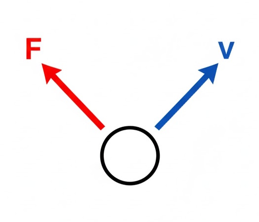
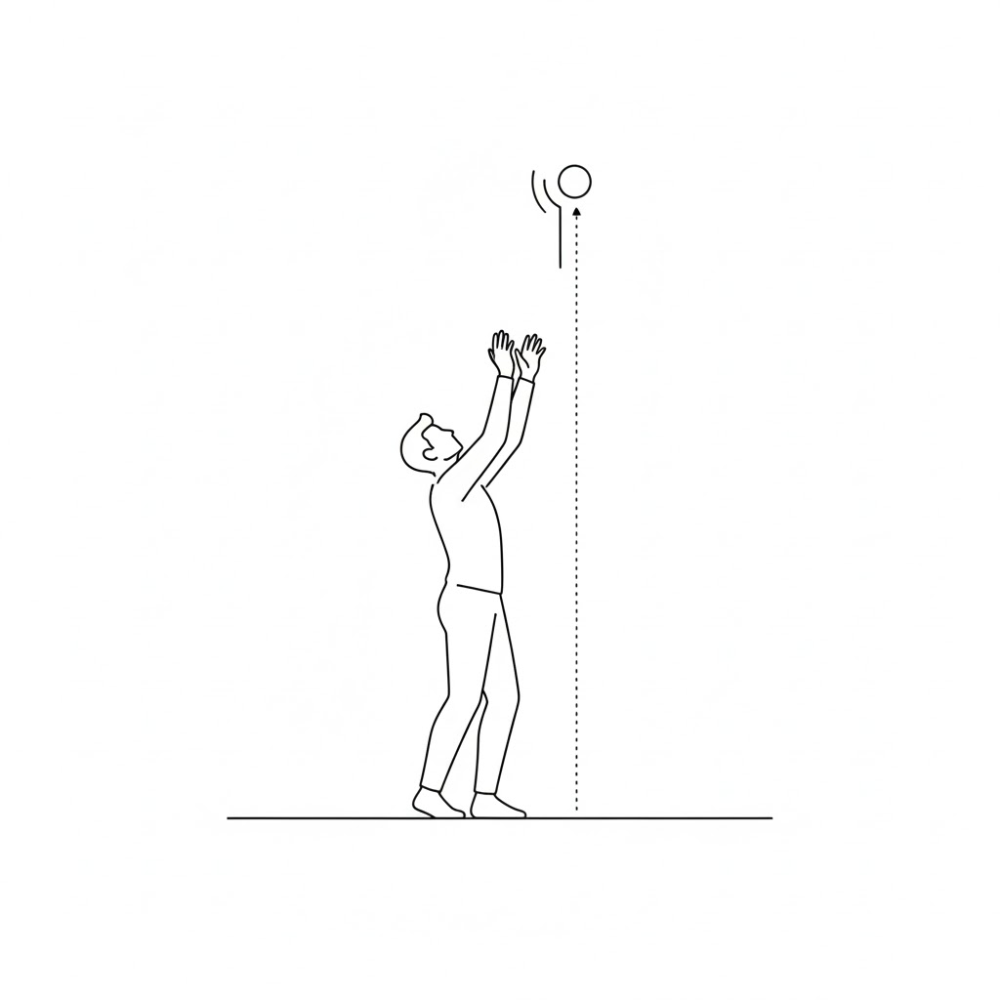
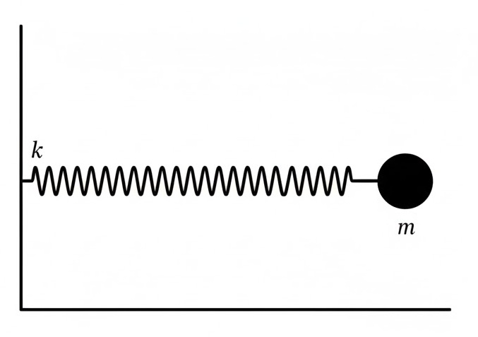
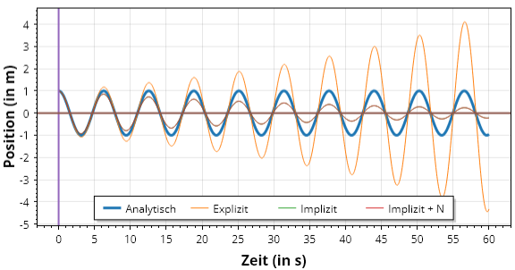
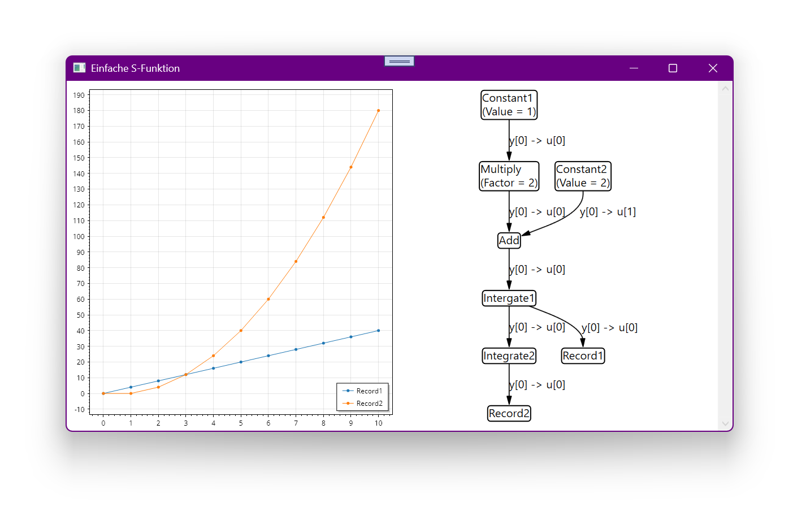
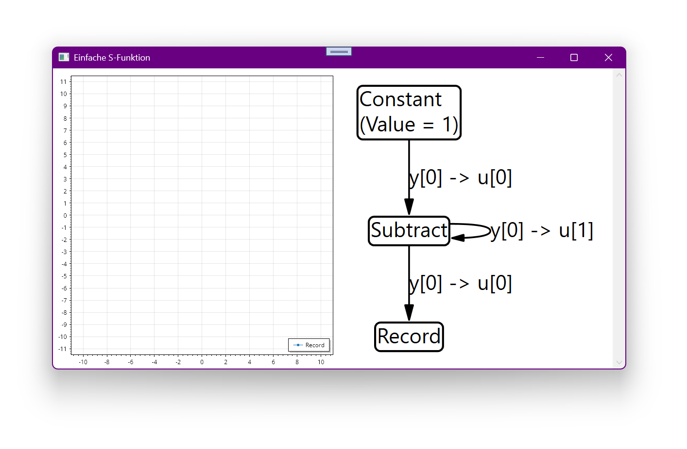
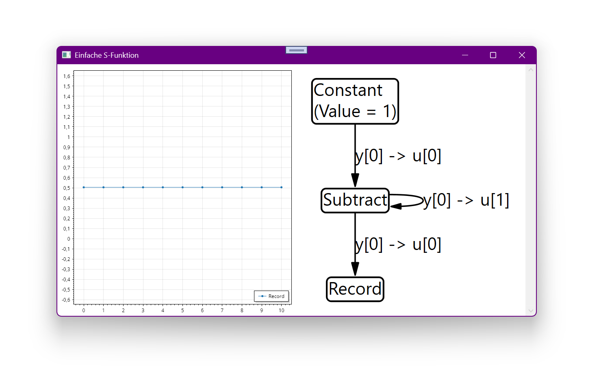

# Kapitel 4: Kontinuierliche Dynamische Modelle

- 4.1: Grundlagen und Definitionen
- 4.2: Beispiel: Freier Fall / Vertikaler Wurf
- 4.3: Numerische Integrationsverfahren
- 4.4: Beispiel: Ungedämpftes Federpendel
- 4.5: Differential-Algebraische Gleichungen
- 4.6: Softwarearchitektur für Simulation

---

## 4.1: Grundlagen und Definitionen

Dieser Abschnitt umfasst die folgenden Inhalte:

- Definition von kontinuierlichen dynamischen Modellen
- Die Zustandsraumdarstellung
- Umwandlung von Differentialgleichungen höherer Ordnung
- Analytische vs. numerische Lösungsansätze

---

### Was sind kontinuierliche dynamische Modelle?

<div class="columns top">
<div>

**Informelle Beschreibung:**

- Beschreiben Systeme, deren Zustände sich **kontinuierlich** über die Zeit ändern.
- Die Zeit wird als kontinuierliche Variable `t` (aus den reellen Zahlen) betrachtet.
- Die Zustandsänderungen werden durch **Differentialgleichungen** beschrieben.

</div>
<div>

**Formale Darstellung:**

Eine gewöhnliche Differentialgleichung (ODE) erster Ordnung:
$$ \frac{dx}{dt} = \dot{x}(t) = f(t, x(t), u(t)) $$

- `t`: Zeit
- `x(t)`: Vektor der Zustandsvariablen zum Zeitpunkt `t`
- `u(t)`: Vektor der Eingangssignale zum Zeitpunkt `t`
- `f`: Funktion, die die Änderungsrate des Zustands beschreibt

</div>
</div>

---

<div class="columns">
<div class="three">

### Zustandsraumdarstellung

Eine übliche Methode zur Darstellung von dynamischen Systemen.

**Zustandsgleichung:**

$$ \dot{x}(t) = f(t, x(t), u(t)) $$

Beschreibt die Dynamik des Systems.

**Ausgangsgleichung:**

$$ y(t) = g(t, x(t), u(t)) $$

Beschreibt, wie die beobachtbaren Ausgänge `y(t)` aus den Zuständen `x(t)` und Eingängen `u(t)` berechnet werden.

**Legende:**

*`x`: Zustandsvektor,  `u`: Eingangsvektor, `y`: Ausgangsvektor*

</div>
<div>



</div>
</div>

---

<div class="columns">
<div class="three">

### Von höheren Ordnungen zur ersten Ordnung

Differentialgleichungen höherer Ordnung können immer in ein System von Differentialgleichungen erster Ordnung umgewandelt werden.

**Beispiel: Bewegungsgleichung (2. Ordnung)**
$$ m \ddot{y}(t) + d \dot{y}(t) + k y(t) = F(t) $$

**Umwandlung:**
1.  Definiere Zustandsvariablen:
    -   $x_1(t) = y(t)$ (Position)
    -   $x_2(t) = \dot{y}(t)$ (Geschwindigkeit)
2.  Leite die Zustandsvariablen nach der Zeit ab:
    -   $\dot{x}_1(t) = \dot{y}(t) = x_2(t)$
    -   $\dot{x}_2(t) = \ddot{y}(t) = \frac{1}{m}(F(t) - d x_2(t) - k x_1(t))$

</div>
<div>



</div>
</div>

---

### Von höheren Ordnungen zur ersten Ordnung (Matrixform)

Das System von DGLs erster Ordnung:
$$ \dot{x}_1(t) = x_2(t) $$
$$ \dot{x}_2(t) = -\frac{k}{m} x_1(t) - \frac{d}{m} x_2(t) + \frac{1}{m} F(t) $$

**In Matrixform (lineares System):**
$$
\begin{pmatrix} \dot{x}_1 \\ \dot{x}_2 \end{pmatrix}
=
\begin{pmatrix} 0 & 1 \\ -\frac{k}{m} & -\frac{d}{m} \end{pmatrix}
\begin{pmatrix} x_1 \\ x_2 \end{pmatrix}
+
\begin{pmatrix} 0 \\ \frac{1}{m} \end{pmatrix}
F(t)
$$
Dies entspricht der Form $\dot{x} = Ax + Bu$.

---

### Wie löst man eine Differentialgleichung?

<div class="columns top">
<div class="two">

**Analytische Lösung**

- Finden einer exakten mathematischen Funktion `x(t)`, die die DGL für alle `t` erfüllt.
- Beispiel: $x(t) = e^{-t}$ ist die analytische Lösung für $\dot{x} = -x$ mit $x(0)=1$.
- **Vorteil:** Exakt, liefert Einblick in das Systemverhalten.
- **Nachteil:** Nur für relativ einfache, oft lineare Systeme möglich.

</div>
<div class="two">

**Numerische Lösung**

- Approximation der Lösung zu diskreten Zeitpunkten $t_0, t_1, t_2, ...$
- Startet bei einem Anfangswert $x(t_0) = x_0$.
- Berechnet schrittweise $x_1 \approx x(t_1)$, $x_2 \approx x(t_2)$, usw.
- **Vorteil:** Anwendbar auf praktisch alle (auch hochkomplexe, nichtlineare) Systeme.
- **Nachteil:** Ist immer eine Approximation, Genauigkeit hängt von der Methode und der Schrittweite ab.

</div>
</div>

---



## 4.2: Beispiel: Freier Fall / Vertikaler Wurf

Dieser Abschnitt umfasst die folgenden Inhalte:

- Physikalische Modellierung des vertikalen Wurfs
- Aufstellen des Zustandsraummodells
- Herleitung der analytischen Lösung

---

### Vertikaler Wurf: Einführung

Ein einfaches, aber fundamentales Beispiel für ein kontinuierliches dynamisches System.

**Annahmen:**
- Bewegung nur in vertikaler Richtung (`y`).
- Konstante Erdbeschleunigung `g`.
- Kein Luftwiderstand.

**Physikalisches Gesetz (Newton):**
$$ F = m a $$
$$ -m g = m \ddot{y} $$
$$ \ddot{y}(t) = -g $$

Dies ist eine DGL 2. Ordnung.

---

### Vertikaler Wurf: Zustandsraummodell

Zunächst überführen wir das DGL 2. Ordnung in System von DGLs. 1. Ordnung (das Zustandsraummodell):

<div class="columns top">
<div>

**DGL 2. Ordnung:**
$$ \ddot{y}(t) = -g $$

**Zustandsvariablen:**
- $x_1(t) = y(t)$ (Position/Höhe)
- $x_2(t) = \dot{y}(t)$ (Geschwindigkeit)

</div>
<div>

**System von DGLs 1. Ordnung:**
- $\dot{x}_1(t) = \dot{y}(t) = x_2(t)$
- $\dot{x}_2(t) = \ddot{y}(t) = -g$

**Zustandsraumdarstellung:**
$$ \dot{x} = \begin{pmatrix} \dot{x}_1 \\ \dot{x}_2 \end{pmatrix} = \begin{pmatrix} x_2 \\ -g \end{pmatrix} = f(x) $$
Hier ist die Dynamik `f` unabhängig von `t` und es gibt keinen Eingang `u`.

</div>
</div>

---

### Vertikaler Wurf: Analytische Lösung

Wir lösen die DGLs durch direkte Integration.

<div class="columns top">
<div>

**Anfangsbedingungen:**

Zunächst müssen wir den Anfangszustand festlegen:

- $y(0) = y_0$<br/>(Anfangshöhe)
- $\dot{y}(0) = v_0$ (Anfangsgeschwindigkeit)

</div>
<div>

**1. Integration (*Geschwindigkeit*):**

Dann können wir die Geschwindigkeit berechnen:

$$ \dot{y}(t) = v(t) = \int -g \, dt = -g t + C_1 $$
Mit $\dot{y}(0) = v_0$ folgt $C_1 = v_0$.
$$ v(t) = v_0 - g t $$

</div>
<div>

**2. Integration (*Position*):**

Schließlich ergibt sich daraus die Positionsgleichung:

$$ y(t) = \int (v_0 - g t) \, dt = v_0 t - \frac{1}{2} g t^2 + C_2 $$
Mit $y(0) = y_0$ folgt $C_2 = y_0$.
$$ y(t) = y_0 + v_0 t - \frac{1}{2} g t^2 $$

</div>
</div>

---

<div class="columns">
<div>

### Vertikaler Wurf: Analytische Lösung (Zusammenfassung)

Für die Anfangsbedingungen $x(0) = \begin{pmatrix} y_0 \\ v_0 \end{pmatrix}$ lautet die exakte, analytische Lösung:

**Position:**
$$ y(t) = y_0 + v_0 t - \frac{1}{2} g t^2 $$

**Geschwindigkeit:**
$$ v(t) = v_0 - g t $$

Diese Formeln beschreiben die exakte Trajektorie des Objekts für jeden beliebigen Zeitpunkt `t > 0`.

</div>
<div>


</div>
</div>

---

## 4.3: Numerische Integrationsverfahren

Dieser Abschnitt umfasst die folgenden Inhalte:

- Grundidee der numerischen Integration (Taylor-Entwicklung)
- Die explizite Euler-Methode
- Die implizite Euler-Methode
- Vergleich der Genauigkeit und Stabilität

---

<div class="columns">
<div class="three">

### Numerische Integrationsverfahren

**Grundidee:** Approximiere den kontinuierlichen Verlauf von `x(t)` durch eine Folge von Werten $x_k \approx x(t_k)$ an diskreten Zeitpunkten $t_k = t_0 + k \cdot h$.

- `h`: Schrittweite (step size)

**Basis:** Taylor-Reihenentwicklung
$$ x(t+h) = x(t) + h \dot{x}(t) + \frac{h^2}{2!} \ddot{x}(t) + \dots $$

Wenn `h` klein ist, können wir Terme höherer Ordnung vernachlässigen:
$$ x(t+h) \approx x(t) + h \dot{x}(t) $$
Da wir wissen, dass $\dot{x}(t) = f(t, x(t))$, erhalten wir:
$$ x(t+h) \approx x(t) + h f(t, x(t)) $$

</div>
<div>


</div>
</div>

---

<div class="columns">
<div>

### Die explizite Euler-Methode

Auch "Euler-Vorwärts" genannt. Die einfachste numerische Methode.

**Formel:**
$$ x_{k+1} = x_k + h \cdot f(t_k, x_k) $$

- Um den neuen Zustand $x_{k+1}$ zu berechnen, wird die Ableitung (Steigung) am **aktuellen** Punkt $(t_k, x_k)$ verwendet.
- Die Methode ist **explizit**, weil $x_{k+1}$ direkt aus bekannten Werten berechnet werden kann.

</div>
<div>


</div>
</div>

---

### Anwendung: Expliziter Euler auf den vertikalen Wurf

**Zustandsmodell:**
$$ \dot{x} = \begin{pmatrix} \dot{y} \\ \dot{v} \end{pmatrix} = \begin{pmatrix} v \\ -g \end{pmatrix} = f(x) $$

**Euler-Formel:**
$$ x_{k+1} = x_k + h \cdot f(x_k) $$

**Aufgeteilt in Komponenten:**
$$ \begin{pmatrix} y_{k+1} \\ v_{k+1} \end{pmatrix} = \begin{pmatrix} y_k \\ v_k \end{pmatrix} + h \cdot \begin{pmatrix} v_k \\ -g \end{pmatrix} $$

**Das ergibt zwei einfache Update-Regeln:**
1.  $y_{k+1} = y_k + h \cdot v_k$
2.  $v_{k+1} = v_k - h \cdot g$

---

<div class="columns">
<div class="three">

### Beispielrechnung: Expliziter Euler

**Parameter:**
- $y_0 = 100\,m$, $v_0 = 0\,m/s$
- $g \approx 9.81\,m/s^2$
- Schrittweite $h = 0.1\,s$

**Schritt 0 -> 1 (t=0s -> t=0.1s):**
- $y_1 = y_0 + h \cdot v_0 = 100 + 0.1 \cdot 0 = 100\,m$
- $v_1 = v_0 - h \cdot g = 0 - 0.1 \cdot 9.81 = -0.981\,m/s$

**Schritt 1 -> 2 (t=0.1s -> t=0.2s):**
- $y_2 = y_1 + h \cdot v_1 = 100 + 0.1 \cdot (-0.981) = 99.9019\,m$
- $v_2 = v_1 - h \cdot g = -0.981 - 0.1 \cdot 9.81 = -1.962\,m/s$

</div>
<div>

| $i$ | $a_i$ | $v_i$ | $y_i$ |
|-|-|-|-|
| 0 | -9.81 | 0 | 100 |
| 1 | -9.81 | -0.981 | 100 |
| 2 | -9.81 | -1.962 | 00.9019 |
| ... | ... | ... | ... |

</div>
</div>

---

<div class="columns">
<div>

### Die implizite Euler-Methode

Auch "Euler-Rückwärts" genannt.

**Formel:**
$$ x_{k+1} = x_k + h \cdot f(t_{k+1}, x_{k+1}) $$

- Um den neuen Zustand $x_{k+1}$ zu berechnen, wird die Ableitung (Steigung) am **zukünftigen** Punkt $(t_{k+1}, x_{k+1})$ verwendet.
- Die Methode ist **implizit**, weil der gesuchte Wert $x_{k+1}$ auf beiden Seiten der Gleichung steht.
- Es muss bei jedem Schritt eine (oft nichtlineare) Gleichung gelöst werden!

</div>
<div>


</div>
</div>

---

### Anwendung: Impliziter Euler auf den vertikalen Wurf

**Implizite Euler-Formel:**
$$ x_{k+1} = x_k + h \cdot f(x_{k+1}) $$

**Aufgeteilt in Komponenten:**
$$ \begin{pmatrix} y_{k+1} \\ v_{k+1} \end{pmatrix} = \begin{pmatrix} y_k \\ v_k \end{pmatrix} + h \cdot \begin{pmatrix} v_{k+1} \\ -g \end{pmatrix} $$

**Das ergibt zwei Gleichungen:**
1.  $y_{k+1} = y_k + h \cdot v_{k+1}$
2.  $v_{k+1} = v_k - h \cdot g$

Hier ist es einfach: Wir können zuerst $v_{k+1}$ berechnen und das Ergebnis dann in die erste Gleichung einsetzen.

---

### Vergleich: Euler-Methoden für den vertikalen Wurf

<div class="columns top">
<div class="two">

**Expliziter Euler**
```csharp
// Zustand (y, v) zum Zeitpunkt k
var y_k = 100.0;
var v_k = 0.0;

// Berechnung für k+1
var y_kp1 = y_k + h * v_k;
var v_kp1 = v_k - h * g;
```
- Sehr einfach zu berechnen.

</div>
<div class="two">

**Impliziter Euler**
```csharp
// Zustand (y, v) zum Zeitpunkt k
var y_k = 100.0;
var v_k = 0.0;

// Berechnung für k+1
var v_kp1 = v_k - h * g;
var y_kp1 = y_k + h * v_kp1;
```
- In diesem speziellen Fall auch sehr einfach.
- Man beachte die Reihenfolge der Berechnungen!

</div>
</div>

Interessanterweise liefert die implizite Methode für die Geschwindigkeit exakt das gleiche Ergebnis wie die explizite Methode, da $\dot{v} = -g$ eine Konstante ist. Für die Position ergibt sich jedoch ein Unterschied.

---

### Genauigkeit der Euler-Methoden

Vergleichen wir die numerischen Ergebnisse mit der analytischen Lösung.

**Analytische Lösung nach 0.1s:**
- $v(0.1) = 0 - 9.81 \cdot 0.1 = -0.981\,m/s$
- $y(0.1) = 100 + 0 \cdot 0.1 - 0.5 \cdot 9.81 \cdot (0.1)^2 = 99.95095\,m$

**Numerische Ergebnisse für $y_1$ (bei $t=0.1s$):**
- **Expliziter Euler:** $y_1 = 100\,m$ (Fehler: -0.049 m)
- **Impliziter Euler:** $y_1 = 100 + 0.1 \cdot (-0.981) = 99.9019\,m$ (Fehler: -0.049 m)

Beide Methoden haben einen lokalen Fehler der Ordnung $O(h^2)$ und einen globalen Fehler der Ordnung $O(h)$. Sie sind Methoden erster Ordnung.

---



## 4.4: Beispiel: Ungedämpftes Federpendel

Dieser Abschnitt umfasst die folgenden Inhalte:

- Physikalische Modellierung des Federpendels
- Aufstellen des Zustandsraummodells
- Herleitung der analytischen Lösung
- Analyse der numerischen Stabilität (expliziter vs. impliziter Euler)


---

### Federpendel: Einführung

Ein klassisches Beispiel für ein oszillierendes System.

**Annahmen:**
- Eine Masse `m` ist an einer Feder mit Federkonstante `k` befestigt.
- Keine Dämpfung (keine Reibung).
- Bewegung nur in einer Dimension (`y`).

**Physikalisches Gesetz (Hooke'sches Gesetz & Newton):**
$$ F_{Feder} = -k y $$
$$ F = m a \implies -k y(t) = m \ddot{y}(t) $$
$$ \ddot{y}(t) = -\frac{k}{m} y(t) $$

---

### Federpendel: Zustandsraummodell

Wir überführen das Modell zunächst wieder in ein Zustandsraummodell:

<div class="columns top">
<div>

**DGL 2. Ordnung:**
$$ \ddot{y}(t) = -\frac{k}{m} y(t) $$

**Zustandsvariablen:**
- $x_1(t) = y(t)$ (Position/Auslenkung)
- $x_2(t) = \dot{y}(t)$ (Geschwindigkeit)

</div>
<div>

**System von DGLs 1. Ordnung:**
- $\dot{x}_1(t) = x_2(t)$
- $\dot{x}_2(t) = -\frac{k}{m} x_1(t)$

**Zustandsraumdarstellung:**
$$ \dot{x} = \begin{pmatrix} \dot{x}_1 \\ \dot{x}_2 \end{pmatrix} = \begin{pmatrix} x_2 \\ -\frac{k}{m} x_1 \end{pmatrix} = f(x) $$

</div>
</div>

---

### Federpendel: Analytische Lösung

Die DGL $\ddot{y} + \omega^2 y = 0$ mit $\omega = \sqrt{k/m}$ beschreibt eine harmonische Schwingung.

**Allgemeine Lösung:**
$$ y(t) = C_1 \cos(\omega t) + C_2 \sin(\omega t) $$

**Mit Anfangsbedingungen $y(0)=y_0$ und $\dot{y}(0)=v_0$:**
- $y(0) = y_0 \implies C_1 = y_0$
- $\dot{y}(t) = -C_1 \omega \sin(\omega t) + C_2 \omega \cos(\omega t)$
- $\dot{y}(0) = v_0 \implies C_2 \omega = v_0 \implies C_2 = v_0 / \omega$

**Spezifische analytische Lösung:**
$$ y(t) = y_0 \cos(\omega t) + \frac{v_0}{\omega} \sin(\omega t) $$

Diese Lösung beschreibt eine ewige, ungedämpfte Schwingung.

---

### Federpendel: Numerische Lösung (Expliziter Euler)

**Zustandsmodell:**
$$ f(x) = \begin{pmatrix} x_2 \\ -\frac{k}{m} x_1 \end{pmatrix} $$

**Explizite Euler-Formel:** $x_{k+1} = x_k + h \cdot f(x_k)$
$$ \begin{pmatrix} y_{k+1} \\ v_{k+1} \end{pmatrix} = \begin{pmatrix} y_k \\ v_k \end{pmatrix} + h \cdot \begin{pmatrix} v_k \\ -\frac{k}{m} y_k \end{pmatrix} $$

**Update-Regeln:**
1.  $y_{k+1} = y_k + h \cdot v_k$
2.  $v_{k+1} = v_k - h \frac{k}{m} y_k$

---

<div class="columns">
<div>

### Problem des expliziten Eulers: Instabilität

Was passiert mit der Energie des Systems bei der numerischen Simulation? Die Gesamtenergie ist:

$E = E_{kin} + E_{pot} = \frac{1}{2}mv^2 + \frac{1}{2}ky^2$

Bei der analytischen Lösung ist `E` konstant.
Beim expliziten Euler-Verfahren **wächst** die numerische Energie $E_k = \frac{1}{2}mv_k^2 + \frac{1}{2}ky_k^2$ mit jedem Schritt!

Dieses Verhalten ist typisch für den expliziten Euler bei oszillierenden Systemen. Das Verfahren ist nur bedingt stabil. Eine kleinere Schrittweite `h` verlangsamt das Anwachsen, verhindert es aber nicht.

</div>
<div>



</div>
</div>

---

### Federpendel: Numerische Lösung (Impliziter Euler)

**Implizite Euler-Formel:** $x_{k+1} = x_k + h \cdot f(x_{k+1})$
$$ \begin{pmatrix} y_{k+1} \\ v_{k+1} \end{pmatrix} = \begin{pmatrix} y_k \\ v_k \end{pmatrix} + h \cdot \begin{pmatrix} v_{k+1} \\ -\frac{k}{m} y_{k+1} \end{pmatrix} $$

**Gleichungssystem:**
1.  $y_{k+1} = y_k + h \cdot v_{k+1}$
2.  $v_{k+1} = v_k - h \frac{k}{m} y_{k+1}$

Dies ist ein lineares Gleichungssystem für die unbekannten Größen $y_{k+1}$ und $v_{k+1}$.

---

## 4.5: Differential-Algebraische Gleichungen (DAE)

Dieser Abschnitt umfasst die folgenden Inhalte:

- Entstehung von algebraischen Schleifen bei impliziten Verfahren
- Formulierung und Lösung als DAE
- Stabilitätseigenschaften und der Einfluss der Schrittweite

---

### Differential-Algebraische Gleichungen

Das Gleichungssystem aus dem impliziten Euler ist ein Beispiel für eine **algebraische Schleife**.

**System umordnen:**
1.  $y_{k+1} - h \cdot v_{k+1} = y_k$
2.  $(h \frac{k}{m}) y_{k+1} + v_{k+1} = v_k$

**In Matrixform:**
$$
\begin{pmatrix}
1 & -h \\
h \frac{k}{m} & 1
\end{pmatrix}
\begin{pmatrix}
y_{k+1} \\
v_{k+1}
\end{pmatrix}
=
\begin{pmatrix}
y_k \\
v_k
\end{pmatrix}
$$

Um $y_{k+1}$ und $v_{k+1}$ zu finden, müssen wir bei jedem Zeitschritt dieses $2 \times 2$ Gleichungssystem lösen. Dies ist eine **differential-algebraische Gleichung (DAE)**.

---

### Analytische Lösung der algebraischen Schleife

Wir müssen die Matrix invertieren:
$$
\begin{pmatrix}
y_{k+1} \\
v_{k+1}
\end{pmatrix}
=
\begin{pmatrix}
1 & -h \\
h \frac{k}{m} & 1
\end{pmatrix}^{-1}
\begin{pmatrix}
y_k \\
v_k
\end{pmatrix}
$$

Die Inverse einer $2 \times 2$ Matrix $\begin{pmatrix} a & b \\ c & d \end{pmatrix}$ ist $\frac{1}{ad-bc} \begin{pmatrix} d & -b \\ -c & a \end{pmatrix}$.

$$ \text{det} = 1 \cdot 1 - (-h) \cdot (h \frac{k}{m}) = 1 + h^2 \frac{k}{m} $$

$$
\begin{pmatrix}
y_{k+1} \\
v_{k+1}
\end{pmatrix}
=
\frac{1}{1 + h^2 \frac{k}{m}}
\begin{pmatrix}
1 & h \\
-h \frac{k}{m} & 1
\end{pmatrix}
\begin{pmatrix}
y_k \\
v_k
\end{pmatrix}
$$

---

<div class="columns">
<div>

### Stabilität des impliziten Eulers

Führt man die Simulation mit dem impliziten Euler durch, beobachtet man ein anderes Verhalten.

- Der implizite Euler führt künstliche Dämpfung in das System ein; die Energie nimmt ab.
- Das Verfahren ist **A-stabil**: Die Lösung geht für $h \to \infty$ gegen Null, sie explodiert niemals. Dies ist oft ein erwünschtes Verhalten, auch wenn es physikalisch nicht ganz korrekt ist.

</div>
<div>


</div>
</div>

---

### Einfluss der Schrittweite `h`

Die Genauigkeit aller numerischen Verfahren hängt entscheidend von der Schrittweite `h` ab.

- **Zu großes `h`**:
    - Große Ungenauigkeit.
    - Kann bei expliziten Verfahren zu Instabilität führen.
- **Zu kleines `h`**:
    - Hohe Genauigkeit.
    - Hoher Rechenaufwand (mehr Schritte für das gleiche Zeitintervall).
    - Kann zu Rundungsfehler-Akkumulation führen.

Die Wahl der richtigen Schrittweite ist ein kritischer Kompromiss zwischen Genauigkeit und Rechenzeit. Moderne Solver verwenden oft **adaptive Schrittweitensteuerung**, um `h` während der Simulation anzupassen.

---

## 4.6: Softwarearchitektur für Simulation

Dieser Abschnitt umfasst die folgenden Inhalte:

- Konzept der `Function`-Klasse als modularer Baustein
- Implementierung von Basis-Blöcken (Constant, Add, Integrate)
- Modellierung eines Systems durch eine `Composition`
- Die Rolle der `Solution`-Klasse (Solver)
- Ablauf einer Simulations-Schleife
- Umgang mit algebraischen Schleifen

---

<div class="columns">
<div class="two">

### Die Kernklassen der Architektur

Die Architektur besteht aus drei zentralen Klassen, um ein block-basiertes Modell zu erstellen:

- **`Function`**: Die abstrakte Basisklasse für alle Blöcke. Jeder Block kapselt eine spezifische Funktionalität.
- **`Connection`**: Repräsentiert eine Verbindung von einem Ausgangsport (`Output`) eines Quell-Blocks (`Source`) zu einem Eingangsport (`Input`) eines Ziel-Blocks (`Target`).
- **`Composition`**: Dient als Container für das gesamte Modell. Es hält eine Liste aller `Function`- und `Connection`-Instanzen.

</div>
<div>


</div>
</div>

---

### Die `Function`-Klasse als Basis

Jede Komponente des Systems wird als eine von der abstrakten Klasse `Function` abgeleitete Klasse implementiert.

```csharp
abstract class Function
{
    // Dimensionen des Blocks
    public readonly int DimX; // Anzahl Zustände
    public readonly int DimU; // Anzahl Eingänge
    public readonly int DimY; // Anzahl Ausgänge

    // Definiert die Anfangswerte der Zustände
    virtual public void InitializeConditions(double[] x) { }
    // Berechnet die Ableitungen: dx = f(t, x, u)
    virtual public void CalculateDerivatives(
        double t, double[] x, double[] u, double[] dx) { }
    // Berechnet die Ausgänge: y = g(t, x, u)
    virtual public void CalculateOutputs(
        double t, double[] x, double[] u, double[] y) { }
}
```

---

<div class="columns">
<div class="three">

### Algebraische Blöcke

Algebraische Blöcke haben keine Zustände (`DimX = 0`). Ihr Ausgang `y` hängt direkt von den Eingängen `u` und/oder internen Parametern ab.

- **`ConstantFunction`**: Erzeugt einen konstanten Wert.
- **`AddFunction`**: Addiert zwei Eingänge.
- **`SubtractFunction`**: Subtrahiert den zweiten vom ersten Eingang.
- **`MultiplyFunction`**: Multipliziert einen Eingang mit einem Faktor.
- **`RecordFunction`**: Dient zur Aufzeichnung von Signalen für die spätere Visualisierung.

</div>
<div>


</div>
</div>

---

### Beispiel: `ConstantFunction`

Ein Block, der einen konstanten Wert ausgibt. Er hat keine Zustände und keine Eingänge.

<div class="columns">
<div class="two">

- **`DimX = 0`** (keine Zustände)
- **`DimU = 0`** (keine Eingänge)
- **`DimY = 1`** (ein Ausgang)
- **`CalculateOutputs`**: Setzt den Ausgang `y[0]` auf den konstanten `Value`.
- `CalculateDerivatives` und `InitializeConditions` sind nicht nötig.

</div>
<div class="two">

```csharp
class ConstantFunction : Function
{
    public double Value;

    public ConstantFunction(string name, double value) 
        : base(name, 0, 0, 1)
    {
        Value = value;
    }

    public override void CalculateOutputs(
        double t, double[] x, double[] u, double[] y)
    {
        y[0] = Value;
    }
}
```

</div>
</div>

---

### Beispiel: `MultiplyFunction`

Ein Block, der seinen Eingang mit einem konstanten Faktor multipliziert.

<div class="columns">
<div class="two">

- **`DimX = 0`** (keine Zustände)
- **`DimU = 1`** (ein Eingang)
- **`DimY = 1`** (ein Ausgang)
- **`CalculateOutputs`**: Multipliziert den Eingang mit einem konstanten Faktor `y[0] = Factor * u[0]`.

</div>
<div class="two">

```csharp
class MultiplyFunction : Function
{
    public double Factor;

    public MultiplyFunction(string name, double factor)
        : base(name, 0, 1, 1) { /*...*/ }

    public override void CalculateOutputs(
        double t, double[] x, double[] u, double[] y)
    {
        y[0] = Factor * u[0];
    }
}
```

</div>
</div>

---

### Beispiel: `AddFunction`

Ein Block, der zwei Eingänge addiert. Er hat keine Zustände. Man spricht von einer **algebraischen Funktion** oder einem Block mit **direct feedthrough**.

<div class="columns">
<div class="two">

- **`DimX = 0`** (keine Zustände)
- **`DimU = 2`** (zwei Eingänge)
- **`DimY = 1`** (ein Ausgang)
- **`CalculateOutputs`**: Berechnet die Summe der Eingänge `u[0] + u[1]`.

</div>
<div class="two">

```csharp
class AddFunction : Function
{
    public AddFunction(string name) 
        : base(name, 0, 2, 1) { }

    public override void CalculateOutputs(
        double t, double[] x, double[] u, double[] y)
    {
        y[0] = u[0] + u[1];
    }
}
```

</div>
</div>

---

<div class="columns">
<div class="two">

### Der `IntegrateFunction` Block

Der `IntegrateFunction`-Block ist der entscheidende Baustein zur Modellierung dynamischer Systeme.

- Er ist der **einzige Block mit einem Zustand** (`DimX = 1`).
- Sein Zustand `x` repräsentiert den integrierten Wert seines Eingangs `u`.
- Die Methode `CalculateDerivatives` setzt die Zustandsableitung $\dot{x}$ gleich dem Eingang $u$.
- Der Solver nutzt diese Ableitung, um den Zustand `x` im nächsten Zeitschritt zu berechnen.
- Der Ausgang `y` des Blocks ist einfach der aktuelle Wert des Zustands `x`.

</div>
<div>


</div>
</div>

---

### Beispiel: `IntegrateFunction`

Der zentrale Block zur Modellierung von Dynamik. Er integriert das Eingangssignal über die Zeit und ist der einzige Block mit einem Zustand.

<div class="columns">
<div class="two">

- **`DimX = 1`** (ein Zustand, der den aktuellen Wert speichert)
- **`DimU = 1`** (ein Eingang, die Ableitung)
- **`DimY = 1`** (ein Ausgang, der aktuelle Zustandswert)
- **`InitializeConditions`**: Setzt den Anfangswert des Zustands.
- **`CalculateDerivatives`**: $\dot{x} = u$. Die Ableitung des Zustands ist der Eingang.
- **`CalculateOutputs`**: $y = x$. Der Ausgang ist der aktuelle Wert des Zustands.

</div>
<div class="two">

```csharp
class IntegrateFunction : Function
{
    public IntegrateFunction(
        string name, double startValue) 
        : base(name, 1, 1, 1) { /* ... */ }

    public override void InitializeConditions(
        double[] x)
        => x[0] = StartValue;

    public override void CalculateDerivatives(
        double t, double[] x, double[] u, double[] d)
        => d[0] = u[0];

    public override void CalculateOutputs(
        double t, double[] x, double[] u, double[] y)
        => y[0] = x[0];
}
```

</div>
</div>

---

### Die `Connection`-Klasse

Die `Connection`-Klasse repräsentiert eine einzelne Verbindung zwischen dem Ausgangport einer Quell-Funktion und dem Eingangsport einer Ziel-Funktion.

<div class="columns">
<div class="two">

- **`Source`**: Die `Function`-Instanz, von der das Signal kommt.
- **`Output`**: Der Index des Ausgangsports der `Source`-Funktion.
- **`Target`**: Die `Function`-Instanz, zu der das Signal geht.
- **`Input`**: Der Index des Eingangsports der `Target`-Funktion.

</div>
<div class="two">

```csharp
class Connection
{
    public Function Source;
    public int Output;

    public Function Target;
    public int Input;

    public Connection(
        Function source, 
        int output, 
        Function target, 
        int input)
    {
        // ...
    }
}
```

</div>
</div>

---

### Die `Composition`-Klasse

Das Gesamtmodell wird in einer `Composition`-Klasse zusammengebaut.

- Sie enthält eine Liste aller `Function`-Instanzen.
- Sie enthält eine Liste aller `Connection`-Instanzen, die Ausgänge mit Eingängen verbinden.

```csharp
class Composition
{
    public List<Function> Functions;
    public List<Connection> Connections;

    public void AddFunction(Function f) { /* ... */ }

    public void AddConnection(
        Function sourceFunc, int outputIdx, 
        Function targetFunc, int inputIdx) 
    { /* ... */ }
}
```

---

<div class="columns">
<div>

### Lösungsstrategien (Solver)

Die `Solution`-Klasse ist die Basis für verschiedene Lösungsstrategien. Sie enthält die Daten-Arrays (`X`, `D`, `U`, `Y` und `ReadyFlag`) und die grundlegende Simulationslogik.

- **`EulerExplicitSolution`**: Ein einfacher Solver, der keine algebraischen Schleifen auflösen kann (gibt Fehlermeldung zurück).
- **`EulerExplicitLoopSolution`**: Eine erweiterte Version, die algebraische Schleifen mittels einer iterativen Schätzung auflösen kann.

</div>
<div>


</div>
</div>

---

<div class="columns">
<div>

### Die `Solution`-Klasse (Solver)

Die `Solution`-Klasse ist für die Durchführung der Simulation verantwortlich.

- Sie hält die `Composition` (das Modell).
- Sie verwaltet die Daten-Arrays für alle Funktionen:
  - `X`: Zustände / `D`: Ableitungen (`dx/dt`)
  - `U`: Eingänge / `Y`: Ausgänge
- Sie verwaltet die Bereitschaft von Eingängen für alle Funktionen (`ReadyFlag`)
- Die `Solve`-Methode implementiert den eigentlichen Algorithmus (z.B. Euler explizit).

</div>
<div>

```csharp
abstract class Solution
{
    public Composition Composition;
    
    public Dictionary<Function, double[]> X, D, U, Y;

    public Dictionary<Function, bool[]> ReadyFlag;

    public abstract void Solve(double step, double tmax);
}
```

</div>
</div>

---

### Die Implementierung der Methode `Solve` in der Klasse `EulerExplicitSolution`

1.  **Initialisierung**: `InitializeConditions` aller Funktionen aufrufen.
2.  **Zeitschleife** (`while t <= tmax`):
    a. **Bereitschaft der Eingänge für alle Funktionen zurücksetzen** (`ReadyFlag`)
    b. **Liste der offenen Funktionen mit allen Funktionen intialisieren** (`open`)
    c. **Ausgänge berechnen** (`while open.Count > 0`):
       - Funktionen suchen, für die alle Eingänge bereit sind (`ReadyFlag`)
       - Ausgänge der Funktionen, die bereit sind, berechnen (`Y`)
       - Ausgänge entsprechend den Verbindungen weiterleiten (`U`, `ReadyFlag`)
       - Berechnete Funktionen aus der Liste der offenen Funktionen entfernen (`open.Remove`)

    d. **Ableitungen berechnen**: `CalculateDerivatives` für alle Blöcke aufrufen.
    e. **Zustände integrieren**: $x_{k+1} = x_k + h \cdot \dot{x}_k$.
    f. **Zeit erhöhen**: $t = t + h$.

---



### Beispiel: `SimpleDemonstration`

Dieses Beispiel modelliert einen einfachen, vorwärtsgerichteten Signalfluss ohne Rückkopplungen.

- Zwei konstante Werte (1 und 2) werden erzeugt.
- Der erste Wert wird mit 2 multipliziert.
- Das Ergebnis wird zum zweiten Wert addiert (`(1*2) + 2 = 4`).
- Dieses Ergebnis wird zweimal integriert und aufgezeichnet.
- Da keine Rückkopplungen vorhanden sind, kann der `EulerExplicitSolution` das Modell problemlos lösen.

---

### Erkennung von **algebraischen Schleifen** in der Klasse `EulerExplicitSolution`

1.  Zu Beginn jedes Zeitschritts wird eine `open`-Liste mit allen Funktionen des Modells erstellt.
2.  Der Solver tritt in eine Schleife ein, die so lange läuft, bis die `open`-Liste leer ist.
3.  Innerhalb der Schleife wird die Anzahl der Elemente in `open` vor einer Iteration gespeichert.
4.  Alle Funktionen in `open` werden durchlaufen. Wenn eine Funktion "bereit" ist (d.h. alle ihre Eingänge sind bekannt), werden ihre Ausgänge berechnet und sie wird aus `open` entfernt.
5.  Nach der Iteration wird die aktuelle Anzahl der Elemente in `open` mit der gespeicherten Anzahl verglichen.
6.  **Wenn sich die Anzahl nicht verringert hat**, bedeutet dies, dass keine der verbleibenden Funktionen ausgeführt werden konnte. Dies ist das Kennzeichen einer algebraischen Schleife.
7.  In diesem Fall bricht der Solver die Simulation ab und wirft eine `Exception`.

---



### Beispiel: `SimpleLoopDemonstration`

Dieses Beispiel enthält eine direkte algebraische Schleife: Der Ausgang eines `Subtract`-Blocks wird direkt auf einen seiner Eingänge zurückgeführt.

- Das Modell versucht, die Gleichung `y = 1 - y` zu lösen.
- Der `EulerExplicitSolution` durchläuft die `open`-Liste, kann aber den `Subtract`-Block nie ausführen, da einer seiner Eingänge immer von seinem eigenen, noch nicht berechneten Ausgang abhängt.
- Nachdem keine Blöcke mehr ausgeführt werden können, die `open`-Liste aber noch den `Subtract`-Block enthält, erkennt der Solver die Schleife.
- Die Simulation wird mit einer "Algebraische Schleife erkannt!"-Exception abgebrochen.

---

### Umgang mit **algebraischen Schleifen** in der Klasse `EulerExplicitLoopSolution`

Der `EulerExplicitLoopSolution` erweitert den einfachen Solver, um Schleifen aufzulösen.

1.  **Schätzung starten**:
    - Ein Block aus der `open`-Liste wird zum `GuessMaster`
    - Für seine unbekannten Eingänge wird ein Wert **geraten** (z.B. 0) und als `GuessValue` gespeichert.
2.  **Iterative Lösung**:
    - Die Werte werden durch die Schleife propagiert.
    - Am Ende der Schleife wird der neu berechnete Wert am Eingang des `GuessMaster` mit dem `GuessValue` verglichen.
    - Der `GuessValue` wird basierend auf dem Fehler angepasst (z.B. `GuessValue += (U - GuessValue) * 0.001`).
    - Dieser Vorgang wird wiederholt, bis der Fehler unter einem Schwellenwert liegt.

---



### Beispiel: `SimpleLoopDemonstration` mit Schleifenauflösung

Dasselbe Modell mit der algebraischen Schleife (`y = 1 - y`) wird nun mit dem `EulerExplicitLoopSolution` gelöst.

- Der Solver erkennt die Schleife wie zuvor.
- Anstatt abzubrechen, wählt er den `Subtract`-Block als `GuessMaster`.
- Er rät einen Wert für den rückgekoppelten Eingang (z.B. 0).
- Er berechnet den Ausgang (`y = 1 - 0 = 1`) und den Fehler (`1 - 0 = 1`).
- Der geratene Wert wird iterativ angepasst, bis der Fehler minimiert ist und der Ausgang `y` gegen die korrekte Lösung `0.5` konvergiert.

---

# Zusammenfassung Kapitel 4

- **Kontinuierliche dynamische Modelle** beschreiben Systeme mit kontinuierlicher Zeitentwicklung mittels **Differentialgleichungen**.
- Die **Zustandsraumdarstellung** ($\dot{x}=f(x,u), y=g(x,u)$) ist eine Standardform.
- **Analytische Lösungen** sind exakt, aber selten findbar. **Numerische Lösungen** sind Approximationen und universell einsetzbar.
- **Expliziter Euler** ist einfach, aber oft instabil.
- **Impliziter Euler** ist stabil, erfordert aber die Lösung von (oft nichtlinearen) Gleichungssystemen in jedem Schritt (**algebraische Schleifen / DAEs**).
- Die **Schrittweite `h`** ist ein kritischer Parameter, der Genauigkeit und Rechenaufwand steuert.
- **S-Funktionen** bieten eine modulare Architektur, um komplexe Systeme zu modellieren, die von einem zentralen **Solver** gelöst werden.
