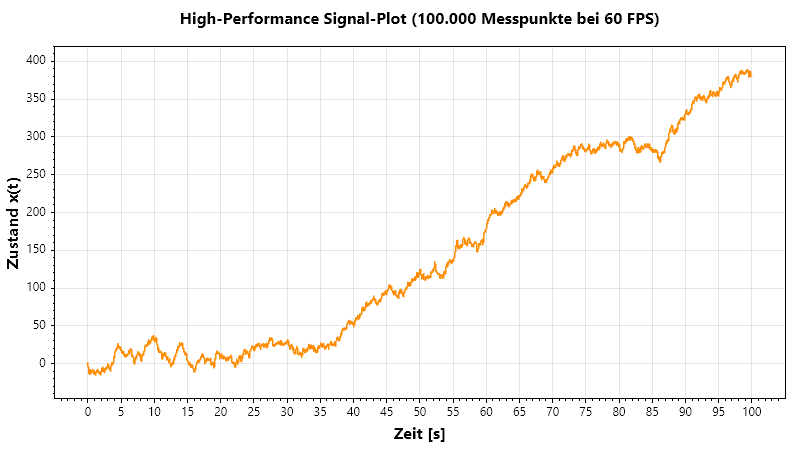

# Kapitel 4: 2D-Visualisierung (Diagramme & Graphen)

Dieses Kapitel umfasst die folgenden Abschnitte:

- 4.1: Einführung in 2D-Diagramme und Datenstrukturen
- 4.2: Zeitreihen- und Streudiagramme mit ScottPlot
- 4.3: Statistische Auswertung & Histogramme mit ScottPlot
- 4.4: Live-Streaming & Telemetrie
- 4.5: Topologie- und Netzwerkgraphen mit MSAGL

---

## 4.1: Einführung in 2D-Diagramme und Datenstrukturen

Dieser Abschnitt umfasst die folgenden Inhalte:

- Die Rolle von Diagrammen und Graphen in der Simulationstechnik
- Überblick über WPF-Frameworks: High-Level-Komponenten vs. Low-Level-Zeichnen
- Architektur: Datenquelle, View-Model und Chart-/Graph-Controls

---

### Warum spezialisierte Bibliotheken?

- Eigene Canvas- oder Pixel-Zeichnungen bieten maximale Freiheit, erfordern aber hohen Entwicklungsaufwand für Achsen, Gitter, Legenden, Zooming und automatisches Layout.
- In industriellen Simulationsanwendungen und Digitalen Zwillingen dominieren zwei Visualisierungsaufgaben:
  1. **Datenverläufe & Zeitreihen (Plots/Charts):** Verfolgung kontinuierlicher Signale $x(t)$, Systemtrajektorien und statistischer Verteilungen.
  2. **Strukturen & Topologien (Graphen):** Darstellung von Signalflüssen, Blockschaltbildern, Komponentennetzwerken und Kausalitäten.
- In diesem Kapitel nutzen wir zwei etablierte Open-Source-Bibliotheken:
  - **`ScottPlot`** für hochperformante wissenschaftliche Zeitreihen- und Statistikdiagramme.
  - **`MSAGL`** (Microsoft Automatic Graph Layout) für gerichtete Netzwerktopologien und Blockdiagramme.

---

### Architektur: Simulation und UI-Kopplung

<div class="columns">
<div class="two">

- **Model-View-ViewModel (MVVM):**
  - **Simulations-Engine:** Berechnet Zustände $\dot{x} = f(x, u, t)$ in diskreten Zeitschritten $\Delta t$.
  - **Datenpuffer:** Sammelt Messwerte und Trajektorien zeitdiskret an.
  - **Visualisierung:** WPF-View kapselt spezialisierte Controls (`WpfPlot`, `AutomaticGraphLayoutControl`).
- **Anforderungen in der Praxis:**
  - **Minimaler Allokationsaufwand:** Vermeidung von GC-Pauses bei langen Läufen.
  - **Hohe Framerate:** Flüssiges Zoomen und Verschieben auch bei Millionen Punkten.

</div>
<div class="three">

| Anforderung | Low-Level Canvas | ScottPlot / MSAGL |
|---|---|---|
| **Zeitaufwand Achsen/Gitter** | Sehr hoch | Integriert |
| **Performance bei $10^6$ Punkten** | Bricht ein (WPF Shape) | Hardwarebeschleunigt |
| **Automatisches Layout** | Manuell zu lösen | Sugiyama / Force |
| **Interaktivität (Zoom/Pan)** | Selbst zu programmieren | Out-of-the-Box |

</div>
</div>

---

## 4.2: Zeitreihen- und Streudiagramme mit ScottPlot

Dieser Abschnitt umfasst die folgenden Inhalte:

- Eigenschaften und Architektur von ScottPlot
- Einbindung des `WpfPlot`-Controls in XAML und C#
- Streu- vs. Signalgraphen (`Scatter`, `Signal`, `SignalXY`)
- High-Performance-Rendering mit SkiaSharp und Min/Max-Decimation
- Interaktivität (Zoom, Pan, AutoScale, Achsen-Styling)

---

<div class="columns">
<div class="two">

### Visualisierung mit ScottPlot

`ScottPlot` ist eine freie und quelloffene Bibliothek für .NET zur Erstellung interaktiver Diagramme.

- **Einfache API:** Schnelle Diagrammerstellung mit wenigen Codezeilen.
- **Hohe Performance:** Hardware-beschleunigtes Rendering (SkiaSharp), optimiert für Millionen von Datenpunkten.
- **Vielseitig:** Unterstützt Linien-, Signal-, Streu-, Balkendiagramme und Histogramme.
- **Interaktiv:** Diagramme in WPF sind standardmäßig interaktiv (zoomen mit Mausrad, verschieben per Drag & Drop).

</div>
<div>


</div>
</div>

---

<div class="columns">
<div class="three">

### ScottPlot API: **Grundlagen**

Die zentrale Klasse in ScottPlot ist `ScottPlot.Plot`. Eine Instanz davon repräsentiert ein Diagramm.

**Typischer Workflow:**
1. **Plot-Objekt erhalten:** Über das `WpfPlot`-Control in XAML (`WpfPlot1.Plot`).
2. **Daten hinzufügen:** Mit Methoden wie `Plot.Add.Scatter()`, `Plot.Add.Signal()`, `Plot.Add.Bar()`.
3. **Diagramm konfigurieren:** Achsenbeschriftungen (`Plot.XLabel()`, `Plot.YLabel()`), Titel (`Plot.Title()`), Legende (`Plot.Legend.IsVisible = true`).
4. **Aktualisieren:** Bei dynamischen Daten über `WpfPlot1.Refresh()`.

</div>
<div>

```xaml
<!-- XAML-Einbindung -->
<Window ...
  xmlns:sp="clr-namespace:ScottPlot.WPF;assembly=ScottPlot.WPF">
  <Grid>
    <sp:WpfPlot x:Name="WpfPlot1" />
  </Grid>
</Window>
```

</div>
</div>

---

### ScottPlot API: **Linien- und Streudiagramme**

```csharp
// Daten für Zeitachse (t) und Signalwert (y)
double[] xs = { 0.0, 0.1, 0.2, 0.3, 0.4, 0.5 };
double[] ys1 = { 0.0, 0.8, 1.2, 1.1, 0.9, 1.0 };
double[] ys2 = { 0.0, 0.5, 0.9, 1.3, 1.5, 1.4 };

// Streudiagramme zum Plot hinzufügen
var scatter1 = WpfPlot1.Plot.Add.Scatter(xs, ys1);
scatter1.Label = "Zustand x1(t)";
scatter1.Color = ScottPlot.Colors.Blue;
scatter1.MarkerSize = 5;

var scatter2 = WpfPlot1.Plot.Add.Scatter(xs, ys2);
scatter2.Label = "Zustand x2(t)";
scatter2.Color = ScottPlot.Colors.Red;
scatter2.LineStyle = ScottPlot.LineStyle.Dash;

WpfPlot1.Plot.Legend.IsVisible = true;
WpfPlot1.Plot.Axes.AutoScale();
WpfPlot1.Refresh();
```

---

<div class="columns">
<div class="two">

### High-Performance Zeitreihen mit `Plot.Add.Signal`

In physikalischen Simulationen liegen Messdaten fast immer mit **konstanter Schrittweite** vor:
$$t_i = t_0 + i \cdot \Delta t$$

ScottPlot nutzt dies mit `Plot.Add.Signal(ys)` radikal aus:
- Das Zeit-Array $xs$ muss **überhaupt nicht gespeichert** werden.
- Die Abtastperiode wird als skalare Eigenschaft übergeben (`Data.Period = dt`).
- Ermöglicht flüssige Interaktion bei über **1 Million Datenpunkten** bei stabilen 60 FPS!

</div>
<div class="three">



</div>
</div>

---

### Warum rendert `Signal` $10^6$ Punkte bei 60 FPS?

- **Problem naiver Scatter-Plots:** Bei 1.000.000 Punkten müsste der Renderer 1.000.000 Vektorsegment-Koordinaten transformieren, obwohl der Bildschirm nur ca. 1.920 Pixel breit ist!
- **Min/Max-Säulen-Decimation in ScottPlot:**
  1. **$O(1)$-Indexsuche:** Da $\Delta t$ konstant ist, lässt sich für jede vertikale Pixelspalte $p_x$ direkt die Array-Indexspanne berechnen:
     $$i(t) = \left\lfloor \frac{t - t_0}{\Delta t} \right\rfloor$$
  2. **Extremwert-Kompression:** Für jeden Pixel wird lediglich das Minimum und Maximum im Indexintervall $[i_{\min}, i_{\max}]$ ermittelt.
  3. **Rendering:** Pro Bildschirmspalte wird nur ein einzelner vertikaler Strich vom Minimum zum Maximum gezeichnet.
  4. **Komplexität:** Aus $10^6$ Punkten werden nur ca. $2 \times \text{Pixelbreite} \approx 3.840$ Liniensegmente!

---

### Methodenvergleich: `Scatter` vs. `Signal` vs. `SignalXY`

| Merkmal | `Plot.Add.Scatter(xs, ys)` | `Plot.Add.Signal(ys)` | `Plot.Add.SignalXY(xs, ys)` |
|---|---|---|---|
| **Abtastung** | Beliebig (auch ungeordnet) | **Streng äquidistant** ($\Delta t = \text{const}$)| Monoton steigendes $x$ (adaptiv) |
| **Speicher** | $2 \times N$ Werte ($xs$ und $ys$) | **$1 \times N$ Werte** ($ys$ genügt) | $2 \times N$ Werte ($xs$ und $ys$) |
| **Suchaufwand** | $O(N)$ (jeder Punkt gezeichnet) | **$O(1)$ direkte Indexberechnung** | $O(\log N)$ (binäre Suche / Pixel) |
| **Max. Punkte** | $\approx 10^4$ Punkte flüssig | **$> 10^7$ Punkte flüssig (60 FPS)** | $\approx 10^6$ Punkte flüssig |
| **Typischer Einsatz** | Phasenraumtrajektorien $x_2(x_1)$ | Feste Zeitschritte (Euler, Heun) | Adaptive Solver (RK45, Dormand-P.) |

```csharp
// Signal-Plot konfigurieren
var sig = WpfPlot1.Plot.Add.Signal(ys);
sig.Data.Period = 0.001; // dt = 1 ms (1 kHz Abtastrate)
sig.Data.XOffset = 0.0;   // Startzeit t0 = 0 s
```

---

## 4.3: Statistische Auswertung & Histogramme mit ScottPlot

Dieser Abschnitt umfasst die folgenden Inhalte:

- Die Rolle stochastischer Auswertungen in der Simulationstechnik
- Häufigkeitsverteilungen und Binning (`ScottPlot.Statistics.Histogram`)
- Visualisierung mittels Balkendiagrammen (`BarPlot`)
- Überlagerung theoretischer Wahrscheinlichkeitsdichten (PDF)
- Box-Plots zur kompakten Analyse von Verteilungsparametern

---

### Statistische Analysen in Simulationssystemen

- Wann werden Histogramme und statistische Diagramme benötigt?
  - **Monte-Carlo-Simulationen:** Analyse von Fertigungstoleranzen, Bauteilstreuungen oder Risikoszenarien über tausende Durchläufe.
  - **Diskrete Ereignissimulationen:** Verteilung von Wartezeiten in Warteschlangen, Durchlaufzeiten und Pufferfüllständen.
  - **Sensormodelle:** Rauschverteilungen (Gaußsches weißes Rauschen, Messunsicherheiten) und Signal-Rausch-Verhältnisse.
- **Ziele der Visualisierung:**
  - Identifikation von Verteilungsformen (Normalverteilung, Exponentialverteilung, Schiefe, Bimodalität).
  - Statistische Validierung numerischer Modelle gegen empirische Messdaten.

---

### ScottPlot API: **Histogramme und Bins**

```csharp
// 1. Rohdaten aus einer Simulation (z.B. 10.000 simulierte Wartezeiten)
double[] durations = Simulation.RunMonteCarloRuns(10000);

// 2. Histogramm berechnen (20 Klassen/Bins im Bereich von 0 bis 10 Sekunden)
var hist = new ScottPlot.Statistics.Histogram(durations, min: 0, max: 10, binCount: 20);

// 3. Balkendiagramm aus den berechneten Klassen erzeugen
var bar = WpfPlot1.Plot.Add.Bar(hist.Counts, hist.BinCenters);
bar.Label = "Simulierte Häufigkeit";
bar.FillColor = ScottPlot.Colors.SteelBlue.WithAlpha(0.7);

// 4. Achsen und Layout konfigurieren
WpfPlot1.Plot.XLabel("Verweildauer [s]");
WpfPlot1.Plot.YLabel("Absolute Häufigkeit");
WpfPlot1.Plot.Legend.IsVisible = true;
WpfPlot1.Plot.Axes.AutoScale();
WpfPlot1.Refresh();
```

---

### Dichtefunktionen und Box-Plots

<div class="columns">
<div class="two">

#### Wahrscheinlichkeitsdichte (PDF)
- Normierung: Teilt man `hist.Counts` durch $(N \cdot \Delta w_{\text{bin}})$, erhält man die normierte Wahrscheinlichkeitsdichte.
- Erlaubt das Einblenden der analytischen Normalverteilung:
  $$f(x) = \frac{1}{\sigma \sqrt{2\pi}} e^{-\frac{1}{2}\left(\frac{x-\mu}{\sigma}\right)^2}$$

</div>
<div class="two">

#### Box-Plots (`Plot.Add.Box`)
- Kompakte Darstellung mehrerer Simulationsszenarien nebeneinander:
  - **Median** (50. Perzentil)
  - **Box:** Interquartilsabstand (IQR: 25. bis 75. Perzentil)
  - **Whisker:** Extremwerte (z.B. $1.5 \times \text{IQR}$)
  - **Punkte:** Statistische Ausreißer

</div>
</div>

```csharp
// Beispiel: Box-Plot für zwei Parametrierungsvarianten
var box1 = new ScottPlot.Box { Position = 1, BoxMiddle = 2.4, BoxMin = 1.8, BoxMax = 3.1 };
var box2 = new ScottPlot.Box { Position = 2, BoxMiddle = 3.8, BoxMin = 2.9, BoxMax = 4.6 };
WpfPlot1.Plot.Add.Box(new[] { box1, box2 });
```

---

## 4.4: Live-Streaming & Telemetrie

Dieser Abschnitt umfasst die folgenden Inhalte:

- Herausforderungen bei kontinuierlichen Simulationsdatenströmen
- Das Ringpuffer-Muster (Circular Buffer / Rolling Window)
- Vermeidung von Speicherallokationen und Garbage-Collection-Latenzen
- Thread-Entkopplung: Schnelle Simulation vs. menschliches Anzeigefenster
- UI-Refresh-Strategie mit `DispatcherTimer`

---

### Herausforderungen im Live-Streaming

Ein Digitaler Zwilling oder eine Hardware-in-the-Loop-Simulation liefert kontinuierliche Messwerte (z.B. mit $1.000\,\text{Hz}$).

- **Typische Fallstricke naiver Implementierungen:**
  - `List<double>.Add()` wächst unbegrenzt $\rightarrow$ Speicherüberlauf (Out-of-Memory) nach längerer Laufzeit.
  - Dynamisches Resizing von Listen erzeugt kontinuierlich GC-Allokationen und führt zu spürbarem Ruckeln (GC-Pauses).
  - Ein direkter Aufruf von `WpfPlot.Refresh()` in jedem Simulationsschritt überlastet den UI-Thread und blockiert die Simulation.
- **Architektonische Lösung:**
  1. **Ringpuffer mit fester Kapazität:** Konstante Speichernutzung, null Allokationen während der Simulation.
  2. **Taktentkopplung:** Schneller Simulations-Thread (z.B. 1 kHz) schreibt in den Puffer; UI-Thread aktualisiert das Display mit schonenden 30–60 FPS.

---

### Das Ringpuffer-Muster (Circular Buffer)

```csharp
public class SimulationRingBuffer
{
    private readonly double[] _data;
    private int _head = 0;
    private readonly object _syncLock = new();

    public SimulationRingBuffer(int capacity) => _data = new double[capacity];

    public void Enqueue(double value)
    {
        lock (_syncLock)
        {
            _data[_head] = value;
            _head = (_head + 1) % _data.Length;
        }
    }

    public void CopyTo(double[] destination)
    {
        lock (_syncLock) { Array.Copy(_data, destination, _data.Length); }
    }
}
```

- **Vorteile:** Feste Array-Größe im Speicher, $O(1)$-Enqueue, keine Speicherbereinigung nötig.

---

### UI-Refresh-Strategie mit `DispatcherTimer`

```csharp
// Initialisierung im WPF Window / ViewModel
private readonly SimulationRingBuffer _buffer = new(capacity: 2000);
private readonly double[] _renderCopy = new double[2000];
private ScottPlot.Plottables.Signal _livePlot;

private void SetupTelemetryPlot()
{
    _livePlot = WpfPlot1.Plot.Add.Signal(_renderCopy);
    _livePlot.Data.Period = 0.001; // 1 ms pro Abtastwert

    // DispatcherTimer feuert auf dem UI-Thread (~30 FPS = alle 33 ms)
    var timer = new DispatcherTimer { Interval = TimeSpan.FromMilliseconds(33) };
    timer.Tick += (s, e) =>
    {
        _buffer.CopyTo(_renderCopy);
        WpfPlot1.Plot.Axes.AutoScale();
        WpfPlot1.Refresh();
    };
    timer.Start();
}
```

---

## 4.5: Topologie- und Netzwerkgraphen mit MSAGL

Dieser Abschnitt umfasst die folgenden Inhalte:

- Mathematisches Graphenmodell für Simulationsmodelle
- Das Microsoft Automatic Graph Layout (`AutomaticGraphLayoutControl`)
- Automatische Layout-Algorithmen (Sugiyama vs. Force-Directed)
- Erkennung und Visualisierung algebraischer Schleifen
- Praktische Umsetzung und farbliches Kanten-Highlighting

---

### Netzwerktopologien & Blockdiagramme

- In Simulationssystemen (wie MATLAB Simulink oder Simscape) werden Modelle als **Graphen** dargestellt:
  - **Knoten ($V$):** Funktionsblöcke (z.B. Summierer, Integrator, Verstärker) oder physische Bauteile (Masse, Feder).
  - **Kanten ($E$):** Signalflüsse, Variablenkopplungen oder mechanische/elektrische Verbindungen.
- **Problem:** Die manuelle Positionierung von Knoten ist aufwändig und skaliert schlecht bei Modelländerungen.
- **Lösung:** MSAGL platziert Knoten und routet Verbindungslinien vollautomatisch!

---

### MSAGL: Einbindung in WPF

```xaml
<Window ...
  xmlns:msagl="clr-namespace:Microsoft.Msagl.WpfGraphControl;assembly=Microsoft.Msagl.WpfGraphControl">
  <Grid>
    <msagl:AutomaticGraphLayoutControl x:Name="GraphControl" />
  </Grid>
</Window>
```

```csharp
using Microsoft.Msagl.Drawing;

// 1. Graph-Objekt erstellen
var graph = new Graph("Simulationsmodell");

// 2. Knoten hinzufügen
graph.AddNode("Integrator").LabelText = "Integrator [1/s]";
graph.AddNode("Gain").LabelText = "Gain [k=2.5]";
graph.AddNode("Sum").LabelText = "Sum [+ -]";

// 3. Gerichtete Kanten (Verbindungen) definieren
graph.AddEdge("Sum", "e(t)", "Integrator");
graph.AddEdge("Integrator", "x(t)", "Gain");
graph.AddEdge("Gain", "Feedback", "Sum");

// 4. Dem Control übergeben (Layout wird automatisch berechnet!)
GraphControl.Graph = graph;
```

---

### Automatische Layout-Algorithmen im Detail

- **Sugiyama-Algorithmus (Hierarchisches / Layered Layout):**
  - **1. Zyklusauflösung:** Temporäre Umkehrung von Rückkopplungskanten zur Erzeugung eines DAG.
  - **2. Schichten-Zuweisung:** Knoten werden geordneten Schichten (Ebenen) zugeordnet.
  - **3. Kreuzungsminimierung:** Optimierung der Knotenreihenfolge innerhalb jeder Schicht.
  - **4. Koordinatenberechnung:** Begradigung von Kanten und Spline-Routing.
  - *Ideal für gerichtete Signalflusspläne und Ursache-Wirkungsketten.*
- **Force-Directed (Kräftebasiertes Layout / Spring Embedder):**
  - Kanten verhalten sich wie mechanische Zugfedern, Knoten stoßen sich elektrostatisch ab.
  - Erreicht ein energetisches Kräftegleichgewicht.
  - *Ideal für ungerichtete Netze, Schaltungen und Komponentenstrukturen.*

---

<div class="columns">
<div class="two">

### Visualisierung algebraischer Schleifen

- **Was ist eine algebraische Schleife?**
  Ein geschlossener Signalpfad ohne speicherndes Element (wie einen Integrator $\frac{1}{s}$ oder ein Verzögerungsglied $z^{-1}$).
- **Numerische Konsequenz:**
  Führt zu einer impliziten algebraischen Gleichung im Zeitschritt:
  $$y(t) = g(y(t), u(t))$$
  Erfordert zeitaufwändige Nullstellensuche (z.B. Newton-Raphson) oder divergiert.
- **Diagnose:** MSAGL markiert identifizierte Zyklen farblich im Modellgraphen!

</div>
<div class="three">



</div>
</div>

---

### MSAGL API: Zyklen farblich hervorheben

```csharp
var graph = new Microsoft.Msagl.Drawing.Graph("Blockschaltbild");

// Kanten definieren
var eIn   = graph.AddEdge("In", "Sum1");
var eLoop1 = graph.AddEdge("Sum1", "Gain1");
var eLoop2 = graph.AddEdge("Gain1", "Gain2");
var eLoop3 = graph.AddEdge("Gain2", "Sum1"); // Rückkopplung ohne Integrator!
var eInt  = graph.AddEdge("Gain1", "Integrator");

// Kanten der algebraischen Schleife auffällig rot färben:
eLoop1.Attr.Color = Microsoft.Msagl.Drawing.Color.Red;
eLoop1.Attr.LineWidth = 3;
eLoop2.Attr.Color = Microsoft.Msagl.Drawing.Color.Red;
eLoop2.Attr.LineWidth = 3;
eLoop3.Attr.Color = Microsoft.Msagl.Drawing.Color.Red;
eLoop3.Attr.LineWidth = 3;

// Knoten der algebraischen Schleife hervorheben:
var sumNode = graph.FindNode("Sum1");
sumNode.Attr.FillColor = Microsoft.Msagl.Drawing.Color.MistyRose;
sumNode.Attr.Color = Microsoft.Msagl.Drawing.Color.Red;

GraphControl.Graph = graph;
```

---

<div class="columns">
<div class="two">

### Ausblick: Interaktive Node-Editoren

- **MSAGL:**
  - Hervorragend geeignet für die **automatische Generierung, Inspektion und das Debugging** von Topologien.
  - Zeichnet Graphen statisch oder semi-interaktiv neu.
- **Moderne interaktive Node-Editoren:**
  - Für visuelle Modellierungswerkzeuge (wie Simulink oder Game-Engine Blueprint-Editoren).
  - Bibliotheken wie **`Nodify`** für WPF erlauben freies Drag & Drop von Pins, Verbindungsdrähten und Blöcken.
- **Kombination:** MSAGL berechnet das Initial-Layout, der interaktive Editor speichert manuelle Feinjustierungen des Anwenders.

</div>
<div class="two">

| Kriterium | MSAGL | Nodify / Node-Editor |
|---|---|---|
| **Fokus** | Graph-Visualisierung & Layout | Interaktive Modell-Erstellung |
| **Kantenführung** | Vollautomatisch (Splines) | Bezier-Kurven durch Pins |
| **Zyklenanalyse** | Integriert | Modell-Logik erforderlich |
| **UI-Interaktion** | Zoom, Pan, Drag-Nodes | Block-Erstellung, Wire-Connecting |

</div>
</div>

---

# Zusammenfassung Kapitel 4

- Für standardisierte Visualisierungsaufgaben bieten spezialisierte Bibliotheken drastische Performance- und Entwicklungsvorteile.
- **ScottPlot (`Plot.Add.Signal`):**
  - Äquidistante Abtastung und Min/Max-Säulendecimation ermöglichen flüssiges Rendering von $>10^6$ Punkten bei stabilen 60 FPS.
  - `SignalXY` deckt monotone Zeitreihen mit adaptiver Schrittweite ab; `Scatter` eignet sich für beliebige Phasenraumdiagramme.
- **Statistische Auswertung:**
  - `Histogram` und `Bar` visualisieren Verweilzeiten, Rauschdaten und Monte-Carlo-Streuungen.
- **Live-Streaming:**
  - Vorallokierte Ringpuffer verhindern Garbage-Collection-Latenzen; Entkopplung via `DispatcherTimer` schont den UI-Thread.
- **MSAGL:**
  - Berechnet automatische Layouts (Sugiyama, Force-Directed) und macht kritische Modellstrukturen (z.B. algebraische Schleifen) durch gezieltes Kanten-Styling sofort diagnostizierbar.
