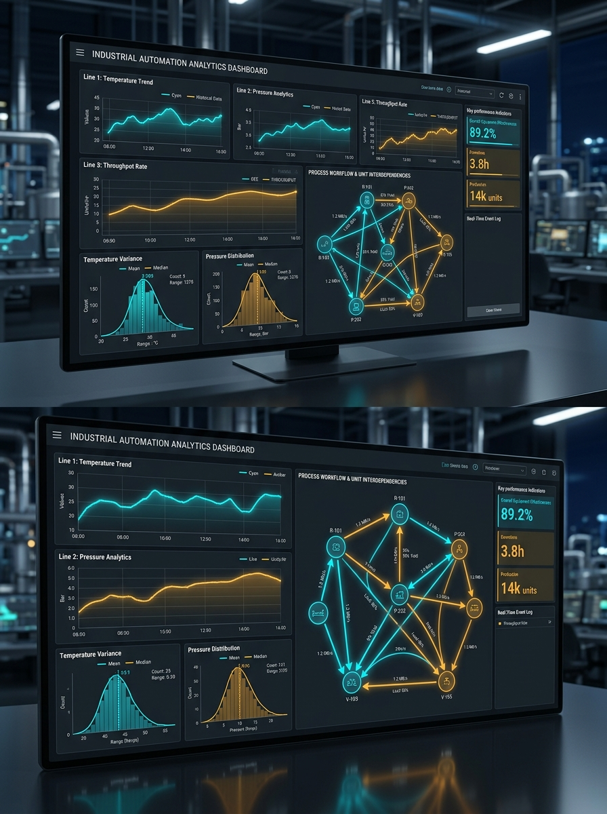

<!-- _paginate: false -->
<!-- _header: "" -->
<!-- _footer: "" -->



# Kapitel 4: 2D-Visualisierung (Diagramme & Graphen)

Dieses Kapitel umfasst die folgenden Abschnitte:

- 4.1: Einführung in 2D-Diagramme und Datenstrukturen
- 4.2: Zeitreihen- und Streudiagramme mit ScottPlot
- 4.3: Statistische Auswertung & Histogramme mit ScottPlot
- 4.4: Live-Streaming & Telemetrie
- 4.5: Topologie- und Netzwerkgraphen mit MSAGL

---

### Showcase & Peer-Challenge: Termin 03

Präsentation der Ergebnisse aus Termin 03 ([Aufgabenblatt 03](../../Uebungen/Termin_03_Vektorgrafik_Canvas/Aufgabenblatt.md)):

<div class="columns">
<div class="two">

#### Track A: Industrie (2D-CAD Fachwerkträger)
- **Geometrie:** Normgerechte Bemaßungsketten (DIN 406), Auto-Fit BoundingBox mit Randabstand.
- **Interaktion:** Drag-and-Drop der Knoten, mitgeführte Stäbe & Lastpfeile.
- **Stresstest:** Extremes Fensterformat (21:9) & Knoten-Verschiebung im Live-Test.

</div>
<div class="two">

#### Track B: Game (Radar / Blueprint)
- **Vektorgrafik:** Space-Radar mit Distanzringen & $\vec{v}/\vec{a}$-Pfeilen ODER Blueprint Sketcher.
- **Interaktion:** Stufenloser Pan & Zoom mit Maus-Zentrierung (`MatrixTransform`).
- **Stresstest:** Maximaler Zoom-In/Out & viele Stäbe/Vektoren live einzeichnen.

</div>
</div>

> **Peer-Challenge (Säule 2b):** Prüfung auf exakte Koordinatentransformation (Welt $\leftrightarrow$ Screen), Isotropie und Kausalität (reine Geometrie, keine Statik!).

---

## 4.1: Einführung in 2D-Diagramme und Datenstrukturen

Dieser Abschnitt umfasst die folgenden Inhalte:

- Die Rolle von Diagrammen und Graphen in der Simulationstechnik
- Überblick über WPF-Frameworks: High-Level-Komponenten vs. Low-Level-Zeichnen
- Architektur: Datenquelle, View-Model und Chart-/Graph-Controls

---

### Warum spezialisierte Bibliotheken?

- Eigene Canvas- oder Pixel-Zeichnungen bieten maximale Freiheit, erfordern aber hohen Entwicklungsaufwand für Achsen, Gitter, Legenden, Zooming und automatisches Layout.
- In industriellen Simulationsanwendungen und Digitalen Zwillingen dominieren zwei Visualisierungsaufgaben:
  1. **Datenverläufe & Zeitreihen (Plots/Charts):** Verfolgung kontinuierlicher Signale $x(t)$, Systemtrajektorien und statistischer Verteilungen.
  2. **Strukturen & Topologien (Graphen):** Darstellung von Signalflüssen, Blockschaltbildern, Komponentennetzwerken und Kausalitäten.
- In diesem Kapitel nutzen wir zwei etablierte Open-Source-Bibliotheken:
  - **`ScottPlot`** für hochperformante wissenschaftliche Zeitreihen- und Statistikdiagramme.
  - **`MSAGL`** (Microsoft Automatic Graph Layout) für gerichtete Netzwerktopologien und Blockdiagramme.

---

### Architektur: Simulation und UI-Kopplung

<div class="columns">
<div class="one">

- **MVVM-Architektur:**
  - **Engine:** Berechnet Zustände $\dot{x} = f(x, u, t)$.
  - **Puffer:** Sammelt Daten zeitdiskret ohne GC-Druck.
  - **View:** Bindet `WpfPlot` und Graph-Controls ein.
- **Praxisanforderungen:**
  - **Allokationsarm:** Keine GC-Pauses bei Langzeitläufen.
  - **Hohe Framerate:** Flüssiges Pan & Zoom bei $>10^6$ Punkten.

</div>
<div class="one">

| Anforderung | Low-Level Canvas | ScottPlot / MSAGL |
|---|---|---|
| **Achsen & Gitter** | Hoher Aufwand | Integriert |
| **Performance ($10^6$ Pkt.)** | Bricht ein (Shapes) | Hardwarebeschleunigt |
| **Automatisches Layout** | Manuell | Sugiyama / Force |
| **Interaktivität** | Selbstbau | Out-of-the-Box |

</div>
</div>

---

## 4.2: Zeitreihen- und Streudiagramme mit ScottPlot

Dieser Abschnitt umfasst die folgenden Inhalte:

- Eigenschaften und Architektur von ScottPlot
- Einbindung des `WpfPlot`-Controls in XAML und C#
- Streu- vs. Signalgraphen (`Scatter`, `Signal`, `SignalXY`)
- High-Performance-Rendering mit SkiaSharp und Min/Max-Decimation
- Interaktivität (Zoom, Pan, AutoScale, Achsen-Styling)

---

### Visualisierung mit ScottPlot

<div class="columns">
<div class="two">

`ScottPlot` ist eine freie und quelloffene Bibliothek für .NET zur Erstellung interaktiver Diagramme.

- **Einfache API:** Schnelle Diagrammerstellung mit wenigen Codezeilen.
- **Hohe Performance:** Hardware-beschleunigtes Rendering (SkiaSharp), optimiert für Millionen von Datenpunkten.
- **Vielseitig:** Unterstützt Linien-, Signal-, Streu-, Balkendiagramme und Histogramme.
- **Interaktiv:** Diagramme in WPF sind standardmäßig interaktiv (zoomen mit Mausrad, verschieben per Drag & Drop).

</div>
<div>


</div>
</div>

---

### ScottPlot API: **Grundlagen**

<div class="columns">
<div class="three">

Die zentrale Klasse in ScottPlot ist `ScottPlot.Plot`. Eine Instanz davon repräsentiert ein Diagramm.

**Typischer Workflow:**
1. **Plot-Objekt erhalten:** Über das `WpfPlot`-Control in XAML (`WpfPlot1.Plot`).
2. **Daten hinzufügen:** Mit Methoden wie `Plot.Add.Scatter()`, `Plot.Add.Signal()`, `Plot.Add.Bar()`.
3. **Diagramm konfigurieren:** Achsenbeschriftungen (`Plot.XLabel()`, `Plot.YLabel()`), Titel (`Plot.Title()`), Legende (`Plot.Legend.IsVisible = true`).
4. **Aktualisieren:** Bei dynamischen Daten über `WpfPlot1.Refresh()`.

</div>
<div>

```xaml
<!-- XAML-Einbindung -->
<Window ...
  xmlns:sp="clr-namespace:ScottPlot.WPF;assembly=ScottPlot.WPF">
  <Grid>
    <sp:WpfPlot x:Name="WpfPlot1" />
  </Grid>
</Window>
```

</div>
</div>

---

### ScottPlot API: **Linien- und Streudiagramme**

```csharp
double[] xs = { 0.0, 0.1, 0.2, 0.3, 0.4, 0.5 };
double[] ys1 = { 0.0, 0.8, 1.2, 1.1, 0.9, 1.0 };
double[] ys2 = { 0.0, 0.5, 0.9, 1.3, 1.5, 1.4 };

var s1 = WpfPlot1.Plot.Add.Scatter(xs, ys1);
s1.Label = "Zustand x1(t)";
s1.Color = ScottPlot.Colors.Blue;
s1.MarkerSize = 5;

var s2 = WpfPlot1.Plot.Add.Scatter(xs, ys2);
s2.Label = "Zustand x2(t)";
s2.Color = ScottPlot.Colors.Red;
s2.LineStyle = ScottPlot.LineStyle.Dash;
WpfPlot1.Plot.Legend.IsVisible = true;
WpfPlot1.Plot.Axes.AutoScale();
WpfPlot1.Refresh();
```

---

### High-Performance Zeitreihen mit `Plot.Add.Signal`

<div class="columns">
<div class="two">

In physikalischen Simulationen liegen Messdaten fast immer mit **konstanter Schrittweite** vor:
$$t_i = t_0 + i \cdot \Delta t$$

ScottPlot nutzt dies mit `Plot.Add.Signal(ys)` radikal aus:
- Das Zeit-Array $xs$ muss **überhaupt nicht gespeichert** werden.
- Die Abtastperiode wird als skalare Eigenschaft übergeben (`Data.Period = dt`).
- Ermöglicht flüssige Interaktion bei über **1 Million Datenpunkten** bei stabilen 60 FPS!

</div>
<div class="three">


</div>
</div>

---

### Warum rendert `Signal` $10^6$ Punkte bei 60 FPS?

- **Problem naiver Scatter-Plots:** Bei 1.000.000 Punkten müsste der Renderer 1.000.000 Vektorsegment-Koordinaten transformieren, obwohl der Bildschirm nur ca. 1.920 Pixel breit ist!
- **Min/Max-Säulen-Decimation in ScottPlot:**
  1. **$O(1)$-Indexsuche:** Da $\Delta t$ konstant ist, lässt sich für jede vertikale Pixelspalte $p_x$ direkt die Array-Indexspanne berechnen:
     $$i(t) = \left\lfloor \frac{t - t_0}{\Delta t} \right\rfloor$$
  2. **Extremwert-Kompression:** Für jeden Pixel wird lediglich das Minimum und Maximum im Indexintervall $[i_{\min}, i_{\max}]$ ermittelt.
  3. **Rendering:** Pro Bildschirmspalte wird nur ein einzelner vertikaler Strich vom Minimum zum Maximum gezeichnet.
  4. **Komplexität:** Aus $10^6$ Punkten werden nur ca. $2 \times \text{Pixelbreite} \approx 3.840$ Liniensegmente!

---

### Methodenvergleich: `Scatter` vs. `Signal` vs. `SignalXY`

| Merkmal | `Scatter(xs, ys)` | `Signal(ys)` | `SignalXY(xs, ys)` |
|---|---|---|---|
| **Abtastung** | Beliebig (ungeordnet) | **Streng äquidistant** ($\Delta t = \text{const}$) | Monoton steigend (adaptiv) |
| **Speicher** | $2 \times N$ ($xs$ und $ys$) | **$1 \times N$** ($ys$ genügt) | $2 \times N$ ($xs$ und $ys$) |
| **Suchaufwand** | $O(N)$ (jeder Punkt gezeichnet) | **$O(1)$** (direkter Index) | $O(\log N)$ (binäre Suche) |
| **Max. Punkte** | $\approx 10^4$ flüssig | **$> 10^7$ flüssig (60 FPS)** | $\approx 10^6$ flüssig |
| **Typischer Einsatz** | Phasenraum $x_2(x_1)$ | Feste Schritte (Euler, Heun) | Adaptive Solver (RK45) |

---

### Konfiguration von Signal-Plots

Für zeitdiskrete Simulationen mit festem Zeitschritt bietet `Signal` maximale Performance:

```csharp
// Äquidistant abgetastete Messreihe konfigurieren
var sig = WpfPlot1.Plot.Add.Signal(ys);
sig.Data.Period = 0.001; // dt = 1 ms (1 kHz Abtastrate)
sig.Data.XOffset = 0.0;   // Startzeit t0 = 0 s
```

- **Keine $x$-Allokation:** Das $x$-Array entfällt vollständig; Zeitstempel werden dynamisch berechnet.
- **Min/Max-Decimation:** Pro Pixelspalte wird nur das Minimum und Maximum gerendert.

---

## 4.3: Statistische Auswertung & Histogramme mit ScottPlot

Dieser Abschnitt umfasst die folgenden Inhalte:

- Die Rolle stochastischer Auswertungen in der Simulationstechnik
- Häufigkeitsverteilungen und Binning (`ScottPlot.Statistics.Histogram`)
- Visualisierung mittels Balkendiagrammen (`BarPlot`)
- Überlagerung theoretischer Wahrscheinlichkeitsdichten (PDF)
- Box-Plots zur kompakten Analyse von Verteilungsparametern

---

### Statistische Analysen in Simulationssystemen

- Wann werden Histogramme und statistische Diagramme benötigt?
  - **Monte-Carlo-Simulationen:** Analyse von Fertigungstoleranzen, Bauteilstreuungen oder Risikoszenarien über tausende Durchläufe.
  - **Diskrete Ereignissimulationen:** Verteilung von Wartezeiten in Warteschlangen, Durchlaufzeiten und Pufferfüllständen.
  - **Sensormodelle:** Rauschverteilungen (Gaußsches weißes Rauschen, Messunsicherheiten) und Signal-Rausch-Verhältnisse.
- **Ziele der Visualisierung:**
  - Identifikation von Verteilungsformen (Normalverteilung, Exponentialverteilung, Schiefe, Bimodalität).
  - Statistische Validierung numerischer Modelle gegen empirische Messdaten.

---

### ScottPlot API: **Histogramme und Bins**

```csharp
// 1. Rohdaten & Histogramm berechnen (20 Bins in [0..10 s])
double[] durations = Simulation.RunMonteCarloRuns(10000);
var hist = new ScottPlot.Statistics.Histogram(
    durations, min: 0, max: 10, binCount: 20);

// 2. Balkendiagramm aus berechneten Klassen erzeugen
var bar = WpfPlot1.Plot.Add.Bar(hist.Counts, hist.BinCenters);
bar.Label = "Simulierte Häufigkeit";
bar.FillColor = ScottPlot.Colors.SteelBlue.WithAlpha(0.7);

// 3. Achsen und Layout konfigurieren
WpfPlot1.Plot.XLabel("Verweildauer [s]");
WpfPlot1.Plot.YLabel("Absolute Häufigkeit");
WpfPlot1.Plot.Legend.IsVisible = true;
WpfPlot1.Plot.Axes.AutoScale();
WpfPlot1.Refresh();
```

---

### Wahrscheinlichkeitsdichte & Analytische Normalverteilung

<div class="columns top">
<div class="one">

#### Normierte Wahrscheinlichkeitsdichte (PDF)
- Das reine Histogramm liefert absolute Klassenhäufigkeiten $H_k \in \mathbb{N}_0$.
- **Flächennormierung:** Teilt man $H_k$ durch $(N \cdot \Delta w_{\text{bin}})$, erhält man die normierte empirische Dichte $f_k$:
  - $N = \sum H_k$: Stichprobenumfang
  - $\Delta w_{\text{bin}}$: Klassenbreite $[\mathrm{s}]$
  - Eigenschaft: $\int_{-\infty}^\infty f(x)\,\mathrm{d}x = \sum f_k \Delta w_{\text{bin}} = 1$

</div>
<div class="one">

#### Gaußsche Normalverteilung $\mathcal{N}(\mu, \sigma^2)$
Überlagerung der Messdaten mit der theoretischen Wahrscheinlichkeitsdichtefunktion:

$$f(x) = \frac{1}{\sigma \sqrt{2\pi}} \exp\left(-\frac{1}{2}\left(\frac{x-\mu}{\sigma}\right)^2\right) \quad \left[\frac{1}{\mathrm{s}}\right]$$

- $x$: Merkmalswert (z.B. Zykluszeit) $[\mathrm{s}]$
- $\mu$: Erwartungswert (Mittelwert) $[\mathrm{s}]$
- $\sigma$: Standardabweichung ($\sigma > 0$) $[\mathrm{s}]$
- $\sigma^2$: Varianz des Prozesses $[\mathrm{s^2}]$

</div>
</div>

---

### Verteilungsvergleiche mit Box-Plots (ScottPlot)

<div class="columns top">
<div class="one">

#### Kennwerte eines Box-Plots
Kompakter Vergleich mehrerer Simulationsreihen nebeneinander:
- **Median ($Q_2$):** 50. Perzentil (robuster Lageparameter)
- **Box (IQR):** Interquartilsabstand $\text{IQR} = Q_3 - Q_1$ (mittlere 50 % der Daten)
- **Whisker:** Wertebereich bis maximal $1{,}5 \times \text{IQR}$ ab Quartilsgrenze
- **Punkte:** Statistische Ausreißer außerhalb der Whiskers

</div>
<div class="one">

```csharp
// Box-Plot für zwei Simulationsläufe
var box1 = new ScottPlot.Box {
    Position = 1,
    BoxMiddle = 2.4, // Median
    BoxMin = 1.8,    // Q1 (25 %)
    BoxMax = 3.1,    // Q3 (75 %)
    WhiskerMin = 1.2,
    WhiskerMax = 3.8
};
var box2 = new ScottPlot.Box {
    Position = 2,
    BoxMiddle = 3.8,
    BoxMin = 2.9,
    BoxMax = 4.6
};
WpfPlot1.Plot.Add.Box(new[] { box1, box2 });
```

</div>
</div>

---

## 4.4: Live-Streaming & Telemetrie

Dieser Abschnitt umfasst die folgenden Inhalte:

- Herausforderungen bei kontinuierlichen Simulationsdatenströmen
- Das Ringpuffer-Muster (Circular Buffer / Rolling Window)
- Vermeidung von Speicherallokationen und Garbage-Collection-Latenzen
- Thread-Entkopplung: Schnelle Simulation vs. menschliches Anzeigefenster
- UI-Refresh-Strategie mit `DispatcherTimer`

---

### Herausforderungen im Live-Streaming

Ein Digitaler Zwilling oder eine Hardware-in-the-Loop-Simulation liefert kontinuierliche Messwerte (z.B. mit $1.000\,\text{Hz}$).

- **Typische Fallstricke naiver Implementierungen:**
  - `List<double>.Add()` wächst unbegrenzt $\rightarrow$ Speicherüberlauf (Out-of-Memory) nach längerer Laufzeit.
  - Dynamisches Resizing von Listen erzeugt kontinuierlich GC-Allokationen und führt zu spürbarem Ruckeln (GC-Pauses).
  - Ein direkter Aufruf von `WpfPlot.Refresh()` in jedem Simulationsschritt überlastet den UI-Thread und blockiert die Simulation.
- **Architektonische Lösung:**
  1. **Ringpuffer mit fester Kapazität:** Konstante Speichernutzung, null Allokationen während der Simulation.
  2. **Taktentkopplung:** Schneller Simulations-Thread (z.B. 1 kHz) schreibt in den Puffer; UI-Thread aktualisiert das Display mit schonenden 30–60 FPS.

---

### Das Ringpuffer-Muster (Circular Buffer)

<div class="columns">
<div class="one">

**Puffer-Definition & Enqueue:**
```csharp
public class SimulationRingBuffer
{
    private readonly double[] _data;
    private int _head;
    private readonly object _lock = new();
    public SimulationRingBuffer(int cap) =>
        _data = new double[cap];
    public void Enqueue(double val)
    {
        lock (_lock)
        {
            _data[_head] = val;
            _head = (_head + 1) % _data.Length;
        }
    }
}
```

</div>
<div class="one">

**Kopie für Rendering:**
```csharp
public void CopyTo(double[] dest)
{
    lock (_lock)
    {
        Array.Copy(_data, dest, _data.Length);
    }
}
```

- **Vorteile:**
  - Feste Array-Größe im Speicher.
  - $O(1)$-Enqueue ohne Allokationen.
  - Keine GC-Pausen im Simulationstakt.

</div>
</div>

---

### UI-Refresh-Strategie mit `DispatcherTimer`

<div class="columns">
<div class="one">

**Setup im Window / ViewModel:**
```csharp
private readonly SimulationRingBuffer 
    _buffer = new(capacity: 2000);
private readonly double[] 
    _renderCopy = new double[2000];
private ScottPlot.Plottables.Signal _livePlot;

private void InitPlot()
{
    _livePlot = 
        WpfPlot1.Plot.Add.Signal(_renderCopy);
    _livePlot.Data.Period = 0.001; // 1 ms dt
}
```

</div>
<div class="one">

**Timer-Taktung (~30 FPS):**
```csharp
private void StartTimer()
{
    var timer = new DispatcherTimer { 
        Interval = TimeSpan.FromMilliseconds(33) 
    };
    timer.Tick += (s, e) =>
    {
        _buffer.CopyTo(_renderCopy);
        WpfPlot1.Plot.Axes.AutoScale();
        WpfPlot1.Refresh();
    };
    timer.Start();
}
```

</div>
</div>

---

## 4.5: Topologie- und Netzwerkgraphen mit MSAGL

Dieser Abschnitt umfasst die folgenden Inhalte:

- Mathematisches Graphenmodell für Simulationsmodelle
- Das Microsoft Automatic Graph Layout (`AutomaticGraphLayoutControl`)
- Automatische Layout-Algorithmen (Sugiyama vs. Force-Directed)
- Erkennung und Visualisierung algebraischer Schleifen
- Praktische Umsetzung und farbliches Kanten-Highlighting

---

### Mathematische Modellierung von Modelltopologien

In modernen Blockdiagramm- und Multi-Domain-Simulatoren (Simulink, Modelica, Simscape) wird das Gesamtsystem als gerichteter Graph abgebildet:

$$G = (V, E)$$

- **Knotenmenge $V = \{v_1, \dots, v_n\}$:** Funktionsblöcke (z.B. Integratoren, Kennfelder) oder physikalische Komponenten (Ventil, Zylinder).
  - Eingangsgrad $\deg^-(v_i)$: Anzahl eingehender Signale / Kopplungen
  - Ausgangsgrad $\deg^+(v_i)$: Anzahl erzeugter Ausgangssignale
- **Kantenmenge $E \subseteq V \times V$:** Signal- und Leistungsflüsse $e = (v_i, v_j)$
- **Adjazenzmatrix $\mathbf{A} \in \{0, 1\}^{n \times n}$:**
  $$a_{ij} = \begin{cases} 1, & \text{falls } (v_i, v_j) \in E \text{ (Signal von } v_i \text{ zu } v_j \text{)} \\ 0, & \text{sonst} \end{cases}$$
- **Algebraische Schleifen (Zyklen):** Ein geschlossener Pfad in $\mathbf{A}$ ohne Zustandsverzögerung erzwingt die simultane Nullstellensuche $F(y) = y(t) - g(y(t), u(t)) = 0$.

---

### Netzwerktopologien & Automatisches Layout mit MSAGL

- **Herausforderung:** Bei komplexen Systemen mit hunderten Blöcken ist manuelle Platzierung unmöglich und blockiert Modellrefactorings.
- **Lösung:** Microsoft Automatic Graph Layout (`MSAGL`):
  - Berechnet ästhetische, kreuzungsminimierte Layouts vollautomatisch.
  - Unterstützt hierarchische Layering-Verfahren (Sugiyama-Algorithmus) für kausale Signalflüsse (von links nach rechts).
  - Unterstützt Force-Directed-Layouts für physikalische Netzwerkgraphen (ungestrickte Feder-Masse-Modelle).
  - Erlaubt interaktives Zoomen, Panning und Hervorheben kritischer Signalpfade (algebraische Zyklen rot markieren).

---

### MSAGL: Einbindung in WPF

<div class="columns">
<div class="one">

**XAML-Deklaration:**
```xaml
<Window ...
  xmlns:msagl="clr-namespace:
    Microsoft.Msagl.WpfGraphControl;
    assembly=
    Microsoft.Msagl.WpfGraphControl">
  <Grid>
    <msagl:AutomaticGraphLayoutControl 
      x:Name="GraphControl" />
  </Grid>
</Window>
```

</div>
<div class="two">

**C#-Code-Behind:**
```csharp
// 1. Graph-Objekt erstellen
var graph = new Microsoft.Msagl.Drawing.Graph("Simulationsmodell");

// 2. Knoten hinzufügen
graph.AddNode("Integrator").LabelText = "Integrator [1/s]";
graph.AddNode("Gain").LabelText = "Gain [k=2.5]";
graph.AddNode("Sum").LabelText = "Sum [+ -]";

// 3. Gerichtete Kanten definieren
graph.AddEdge("Sum", "e(t)", "Integrator");
graph.AddEdge("Integrator", "x(t)", "Gain");
graph.AddEdge("Gain", "Feedback", "Sum");

// 4. Dem Control übergeben
GraphControl.Graph = graph;
```

</div>
</div>

---

### Automatische Layout-Algorithmen im Detail

- **Sugiyama-Algorithmus (Hierarchisches / Layered Layout):**
  - **1. Zyklusauflösung:** Temporäre Umkehrung von Rückkopplungskanten zur Erzeugung eines DAG.
  - **2. Schichten-Zuweisung:** Knoten werden geordneten Schichten (Ebenen) zugeordnet.
  - **3. Kreuzungsminimierung:** Optimierung der Knotenreihenfolge innerhalb jeder Schicht.
  - **4. Koordinatenberechnung:** Begradigung von Kanten und Spline-Routing.
  - *Ideal für gerichtete Signalflusspläne und Ursache-Wirkungsketten.*
- **Force-Directed (Kräftebasiertes Layout / Spring Embedder):**
  - Kanten verhalten sich wie mechanische Zugfedern, Knoten stoßen sich elektrostatisch ab.
  - Erreicht ein energetisches Kräftegleichgewicht.
  - *Ideal für ungerichtete Netze, Schaltungen und Komponentenstrukturen.*

---

### Visualisierung algebraischer Schleifen

- **Was ist eine algebraische Schleife?**
  Ein geschlossener Signalpfad ohne speicherndes Element (wie einen Integrator $\frac{1}{s}$ oder ein Verzögerungsglied $z^{-1}$).
- **Numerische Konsequenz:**
  Führt zu einer impliziten algebraischen Gleichung im Zeitschritt:
  $$y(t) = g(y(t), u(t))$$
  Erfordert zeitaufwändige Nullstellensuche (z.B. Newton-Raphson) oder divergiert im expliziten Solver.
- **Diagnose:** MSAGL markiert identifizierte Zyklen farblich und hebt betroffene Kanten hervor.

---

### Hervorhebung algebraischer Schleifen in MSAGL


*Erkennung: Die rote Schleife (Sum1 ➔ Gain1 ➔ Gain2 ➔ Sum1) enthält kein speicherndes Element und muss numerisch gelöst oder algebraisch aufgelöst werden.*

---

### MSAGL API: Graph-Aufbau mit Schleife

```csharp
var graph = new Microsoft.Msagl.Drawing.Graph("Blockschaltbild");

// Signalverbindungen definieren
var eIn    = graph.AddEdge("In", "Sum1");
var eLoop1 = graph.AddEdge("Sum1", "Gain1");
var eLoop2 = graph.AddEdge("Gain1", "Gain2");
var eLoop3 = graph.AddEdge("Gain2", "Sum1"); // Schleife ohne Integrator!
var eInt   = graph.AddEdge("Gain1", "Integrator");

GraphControl.Graph = graph;
```

- Kante `eLoop3` schließt den Pfad direkt auf `Sum1` zurück (algebraische Schleife).

---

### MSAGL API: Zyklus-Hervorhebung (Highlighting)

```csharp
// Kanten der algebraischen Schleife auffällig rot färben:
var loopEdges = new[] { eLoop1, eLoop2, eLoop3 };
foreach (var edge in loopEdges)
{
    edge.Attr.Color = Microsoft.Msagl.Drawing.Color.Red;
    edge.Attr.LineWidth = 3;
}

// Knoten der algebraischen Schleife hervorheben:
var sumNode = graph.FindNode("Sum1");
sumNode.Attr.FillColor = Microsoft.Msagl.Drawing.Color.MistyRose;
sumNode.Attr.Color = Microsoft.Msagl.Drawing.Color.Red;

GraphControl.Graph = graph;
```

- Visuelle Diagnose verhindert numerische Divergenzen vor Simulationsstart.

---

### Ausblick: Interaktive Node-Editoren

<div class="columns">
<div class="two">

- **MSAGL:**
  - Automatische Generierung, Inspektion und Debugging von Topologien.
  - Berechnet Graphen-Layout statisch oder semi-interaktiv.
- **Moderne Node-Editoren (z.B. Nodify):**
  - Für interaktive Werkzeuge (wie Simulink oder Blueprint-Editoren).
  - Erlauben freies Drag & Drop von Pins, Verbindungen und Blöcken.
- **Kombination:** MSAGL liefert das Initial-Layout, der Editor speichert manuelle Justierungen.

</div>
<div class="two">

| Kriterium | MSAGL | Nodify / Node-Editor |
|---|---|---|
| **Fokus** | Layout & Visualisierung | Interaktive Modellierung |
| **Kantenführung** | Automatisch (Splines) | Bezier-Kurven / Pins |
| **Zyklenanalyse** | Integriert | Modell-Logik nötig |
| **Interaktion** | Zoom, Pan, Drag | Wire-Connecting, Edit |

</div>
</div>

---

### Zusammenfassung Kapitel 4

<div class="columns">
<div class="one">

- **ScottPlot (`Plot.Add.Signal`):**
  - Äquidistante Abtastung und Min/Max-Decimation ermöglichen flüssiges Rendering von $>10^6$ Punkten bei 60 FPS.
  - `SignalXY` deckt monotone Zeitreihen mit adaptiver Schrittweite ab; `Scatter` eignet sich für Phasenraumdiagramme.
- **Statistische Auswertung:**
  - `Histogram` und `Bar` visualisieren Verweilzeiten, Rauschdaten und Monte-Carlo-Streuungen.

</div>
<div class="one">

- **Live-Streaming:**
  - Vorallokierte Ringpuffer verhindern Garbage-Collection-Latenzen; Entkopplung via Timer schont den UI-Thread.
- **MSAGL:**
  - Berechnet automatische Layouts (Sugiyama, Force-Directed).
  - Macht kritische Modellstrukturen (z.B. algebraische Schleifen) durch gezieltes Kanten-Styling sofort diagnostizierbar.

</div>
</div>

---

### Laborübung Termin 04: Telemetrie & ScottPlot

Vertiefende Hausübung (Stufe B, 10 Pkt.) – Details siehe [Aufgabenblatt 04](../../Uebungen/Termin_04_Telemetrie_und_ScottPlot/Aufgabenblatt.md):

<div class="columns">
<div class="two">

#### Track A: Industrie & Mechatronik
**Antriebsprüfstand & Schwingungsüberwachung**
- Live-Streamer für Drehzahl $n(t)$ und Moment $M(t)$
- Welford-Algorithmus: $\bar{M} \pm 3\sigma_M$ Toleranzbänder
- Phasenraum-Kennfeld ($M$ vs. $n$) mit $P_{\max}$-Grenze
- Schwingungs-Histogramm mit Gauß-Kurve
- MSAGL-Antriebsstrang mit Sensor-Alarmanzeige

</div>
<div class="two">

#### Track B: Simulation Game
**Retro Arcade Racing HUD & G-Force Telemetrie**
- Live Speed- & RPM-Streamer mit Shift-Flash
- Welford-Statistik für optimale Ausdreh-Drehzahl
- Kamm'scher Kreis (Phasenplot $a_x$ vs. $a_y$ mit Haftungslimit $\mu \cdot g$)
- Rundenzeit-Histogramm & Strecken-Topologie (MSAGL)

</div>
</div>

> Performance-Dashboard mit ScottPlot 5 & MSAGL (0 B GC-Druck) – Wahlmodell: Track A oder B.

