<!-- _paginate: false -->
<!-- _header: "" -->
<!-- _footer: "" -->


# Kapitel 4: 2D-Visualisierung (Diagramme & Graphen)

Dieses Kapitel umfasst die folgenden Abschnitte:

- 4.1: Einführung in 2D-Diagramme und Datenstrukturen
- 4.2: Zeitreihen- und Streudiagramme mit ScottPlot
- 4.3: Statistische Auswertung & Histogramme mit ScottPlot
- 4.4: Live-Streaming & Telemetrie
- 4.5: Topologie- und Netzwerkgraphen mit MSAGL

---

### Showcase & Peer-Challenge: Termin 03

Präsentation der Ergebnisse aus Termin 03 ([Aufgabenblatt 03](../../Uebungen/Termin_03_Vektorgrafik_Canvas/Aufgabenblatt.md)):

<div class="columns">
<div class="two">

#### Track A: Industrie (2D-CAD Fachwerkträger)
- **Geometrie:** Normgerechte Bemaßungsketten (DIN 406), Auto-Fit BoundingBox mit Randabstand.
- **Interaktion:** Drag-and-Drop der Knoten, mitgeführte Stäbe & Lastpfeile.
- **Stresstest:** Extremes Fensterformat (21:9) & Knoten-Verschiebung im Live-Test.

</div>
<div class="two">

#### Track B: Game (Radar / Blueprint)
- **Vektorgrafik:** Space-Radar mit Distanzringen & $\vec{v}/\vec{a}$-Pfeilen ODER Blueprint Sketcher.
- **Interaktion:** Stufenloser Pan & Zoom mit Maus-Zentrierung (`MatrixTransform`).
- **Stresstest:** Maximaler Zoom-In/Out & viele Stäbe/Vektoren live einzeichnen.

</div>
</div>

> **Peer-Challenge (Säule 2b):** Prüfung auf exakte Koordinatentransformation (Welt $\leftrightarrow$ Screen), Isotropie und Kausalität (reine Geometrie, keine Statik!).

---

<!-- Platzhalter für Abschnittsbildbeschreibung -->


## 4.1: Einführung in 2D-Diagramme und Datenstrukturen

Dieser Abschnitt umfasst die folgenden Inhalte:

- Die Rolle von Diagrammen und Graphen in der Simulationstechnik
- Das Display-Bottleneck und die Grenzen nativer UI-Elemente
- Retained Mode vs. Immediate Mode beim Plotting
- Daten-Dezimation: Aliasing-Falle vs. Min/Max-Säulen-Decimation
- Rendering-Pipeline moderner Chart-Engines (ScottPlot 5)

---

### Warum spezialisierte Diagramm-Bibliotheken?

- Eigene Canvas- oder Pixel-Zeichnungen bieten maximale Freiheit, erfordern aber hohen Entwicklungsaufwand für Achsen, Gitter, Legenden, Zooming und automatisches Layout.
- In industriellen Simulationsanwendungen und Digitalen Zwillingen dominieren zwei Visualisierungsaufgaben:
  1. **Datenverläufe & Zeitreihen (Plots/Charts):** Verfolgung kontinuierlicher Signale $x(t)$, Systemtrajektorien und statistischer Verteilungen.
  2. **Strukturen & Topologien (Graphen):** Darstellung von Signalflüssen, Blockschaltbildern, Komponentennetzwerken und Kausalitäten.
- In diesem Kapitel nutzen wir zwei etablierte Open-Source-Bibliotheken:
  - **`ScottPlot 5`** für hochperformante wissenschaftliche Zeitreihen- und Statistikdiagramme.
  - **`MSAGL`** (Microsoft Automatic Graph Layout) für gerichtete Netzwerktopologien und Blockdiagramme.

---

### Das Display-Bottleneck: $10^7$ Punkte vs. Bildschirm

<div class="columns">
<div class="two">

In der Automatisierungstechnik fallen bei hochfrequenter Messwerterfassung (z.B. DAQ mit $1\,\text{kHz}$) rasch enorme Datenmengen an:

- Nach 3 Stunden Messung umfasst der Puffer $N = 10^7$ Samples.
- Ein Standard-Monitor (Full HD bis 4K) besitzt jedoch nur $1.920$ bis $3.840$ horizontale Bildschirmpixel!
- **Das Dilemma:** Auf eine einzige Pixelspalte treffen rechnerisch bis zu $5.000$ Messwerte.
- **Kollaps nativer Controls:** Ein WPF-`Canvas` mit $10^7$ `Line`- oder `Polyline`-Objekten belegt Gigabytes an Speicher im Visual Tree und friert das System ein.
- **Lösung:** Dezimierung der Daten auf Bildschirmauflösung in $O(\text{Pixel})$ statt $O(N)$!

</div>
<div class="one">

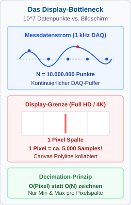

</div>
</div>

---

### Daten-Dezimation: Die Aliasing-Falle

<div class="columns">
<div class="two">

Wie reduziert man $10^7$ Messwerte auf wenige tausend Bildschirmkoordinaten?

- **Naives Subsampling (Jeder $k$-te Wert):**
  - Man überspringt Punkte und zeichnet nur jeden $k$-ten Wert.
  - **Gefahr:** Transiente Spitzen (EMV-Pulse, Druckstöße) fallen in Lücken und werden **übersehen**!
- **Min/Max-Säulen-Decimation (ScottPlot):**
  - Für jede Pixelspalte wird das Indexintervall $[i_{\min}, i_{\max}]$ gebildet.
  - Es wird nur das **Minimum** und **Maximum** als vertikale Linie gerendert.
  - **Vorteil:** Die physikalische Hüllkurve bleibt garantiert erhalten!

</div>
<div class="one">

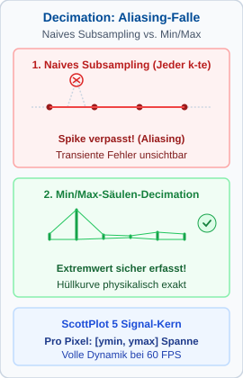

</div>
</div>

---

### ScottPlot 5 Rendering-Pipeline

<div class="columns">
<div class="two">

ScottPlot 5 umgeht das WPF-Retained-Mode-Problem durch eine direkte Hardware-Rendering-Pipeline:

1. **Datenarray im RAM:** Flaches `double[] ys` mit fester Abtastperiode `dt` ohne UI-Objekt-Overhead.
2. **Min/Max-Decimation:** Schnelle $O(1)$-Indexsuche berechnet pro Pixelspalte nur das vertikale Liniensegment.
3. **SkiaSharp-Engine:** Direktes 2D-Zeichnen auf eine gerenderte Offscreen-Bitmap (Direct2D/OpenGL-beschleunigt).
4. **WPF-Einbindung:** `WpfPlot` präsentiert das fertige Bild als Bitmap-Quelle (`ImageSource`) – **0 FrameworkElements** für Datenpunkte!
5. **Ergebnis:** Butterweiche 60 FPS selbst bei Millionen von Messwerten im Dauerlauf.

</div>
<div class="one">

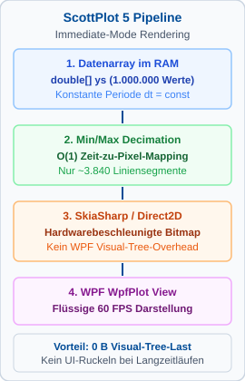

</div>
</div>

---

<!-- Platzhalter für Abschnittsbildbeschreibung -->


## 4.2: Zeitreihen- und Streudiagramme mit ScottPlot

Dieser Abschnitt umfasst die folgenden Inhalte:

- Eigenschaften und API-Architektur von ScottPlot 5
- Streu- vs. Signalgraphen (`Scatter`, `Signal`, `SignalXY`)
- Äquidistante Abtastung und $O(1)$-Indexsuche
- Phasenraum-Trajektorien in Mechatronik und Fahrphysik
- Dual-Achsen und Leitstand-Styling

---

### Visualisierung mit ScottPlot 5

<div class="columns">
<div class="two">

`ScottPlot` ist eine freie und quelloffene Bibliothek für .NET zur Erstellung interaktiver Diagramme.

- **Einfache API:** Schnelle Diagrammerstellung mit wenigen, ausdrucksstarken C#-Methoden.
- **Hohe Performance:** Hardware-beschleunigtes Rendering (SkiaSharp), optimiert für Millionen von Datenpunkten.
- **Vielseitig:** Unterstützt Linien-, Signal-, Streu-, Balkendiagramme und Histogramme.
- **Interaktiv:** Diagramme in WPF sind standardmäßig voll interaktiv (Zoomen mit Mausrad, Verschieben per Drag & Drop).
- **Modern:** Konsequente Trennung von Plot-Logik (`ScottPlot.Plot`) und WPF-Host (`WpfPlot`).

</div>
<div class="one">


</div>
</div>

---

### ScottPlot 5 API: **Grundlagen**

<div class="columns">
<div class="two">

Die zentrale Klasse in ScottPlot ist `ScottPlot.Plot`. Eine Instanz davon repräsentiert ein vollständiges Diagramm.

**Typischer Workflow:**
1. **Plot-Objekt erhalten:** Über das `WpfPlot`-Control in XAML (`WpfPlot1.Plot`).
2. **Daten hinzufügen:** Mit Methoden wie `Plot.Add.Scatter()`, `Plot.Add.Signal()`, `Plot.Add.Bars()`.
3. **Achsen konfigurieren:** Beschriftungen mit `Plot.XLabel()`, `Plot.YLabel()` und Titel mit `Plot.Title()`.
4. **Legende aktivieren:** Über `Plot.Legend.IsVisible = true`.
5. **Aktualisieren:** Bei dynamischen Daten über `WpfPlot1.Refresh()`.

</div>
<div class="one">

```xaml
<!-- XAML-Einbindung in WPF -->
<Window ...
  xmlns:sp="clr-namespace:
    ScottPlot.WPF;
    assembly=ScottPlot.WPF">
  <Grid>
    <sp:WpfPlot 
      x:Name="WpfPlot1" />
  </Grid>
</Window>
```

</div>
</div>

---

### ScottPlot API: **Linien- und Streudiagramme**

```csharp
double[] xs = { 0.0, 0.1, 0.2, 0.3, 0.4, 0.5 };
double[] ys1 = { 0.0, 0.8, 1.2, 1.1, 0.9, 1.0 };
double[] ys2 = { 0.0, 0.5, 0.9, 1.3, 1.5, 1.4 };

var s1 = WpfPlot1.Plot.Add.Scatter(xs, ys1);
s1.Label = "Zustand x1(t)";
s1.Color = ScottPlot.Colors.Blue;
s1.MarkerSize = 5;

var s2 = WpfPlot1.Plot.Add.Scatter(xs, ys2);
s2.Label = "Zustand x2(t)";
s2.Color = ScottPlot.Colors.Red;
s2.LineStyle = ScottPlot.LineStyle.Dash;

WpfPlot1.Plot.Legend.IsVisible = true;
WpfPlot1.Plot.Axes.AutoScale();
WpfPlot1.Refresh();
```

- Konfiguration von zwei Kurven `s1` und `s2` mit `xs`, `ys1` und `ys2` für diskrete Zustandsverläufe.

---

### High-Performance Zeitreihen mit `Plot.Add.Signal`

<div class="columns">
<div class="two">

Messdaten liegen in der Simulation meist mit **konstanter Schrittweite** vor ($t_i = t_0 + i \cdot \Delta t$):

- **Kein Zeitstempel-Array:** Das Array `xs` muss überhaupt nicht gespeichert werden.
- **Skalare Abtastperiode:** Übergabe via `sig.Data.Period = dt`.
- **Echtzeit-Performance:** Flüssige Interaktion bei über **10 Millionen Datenpunkten** bei stabilen 60 FPS!

</div>
<div class="three">

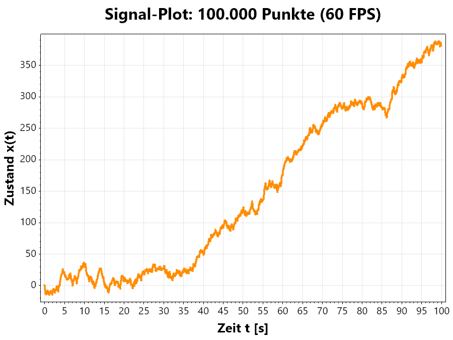

</div>
</div>

---

### Speicherbedarf im Vergleich: `Scatter` vs. `Signal`

<div class="columns">
<div class="two">

Der Verzicht auf ein explizites Zeitstempel-Array halbiert den RAM-Bedarf im Speicherlayout:

- **`Scatter(xs, ys)`:**
  - Benötigt zwei Arrays: `xs` (8 Byte) und `ys` (8 Byte).
  - Für $10^6$ Punkte: $2 \times 8\,\text{MB} = 16\,\text{MB}$ Heap-Speicher.
  - Suchaufwand beim Rendern: $O(N)$.
- **`Signal(ys)`:**
  - Benötigt nur `ys` (8 Byte) und skalare Abtastparameter `dt` sowie `t_0`.
  - Für $10^6$ Punkte: Nur **$8\,\text{MB}$ Heap-Speicher (-50 %)**.
  - Direkte Indexberechnung: $i(t) = \lfloor (t - t_0)/dt \rfloor$ in **$O(1)$**.

</div>
<div class="one">

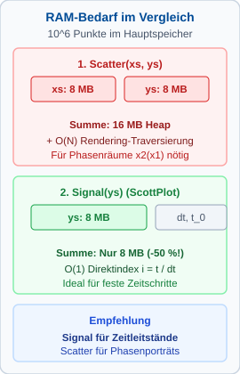

</div>
</div>

---

### Nicht-äquidistante Signale mit `SignalXY`

<div class="columns">
<div class="two">

Viele DGL-Solver (z.B. Runge-Kutta RK45) steuern Zeitschritte `dt` adaptiv:

- In transienten Phasen sinkt `dt` ab, im Gleichgewicht wächst `dt`.
- Array `xs` ist nicht-äquidistant, aber **streng monoton steigend**.
- **Grenze von `Signal`:** Direkte Indexsuche $i = \lfloor t/dt \rfloor$ für Index $i$ unmöglich.
- **Lösung `Plot.Add.SignalXY(xs, ys)`:**
  - **Binärsuche** in $O(\log N)$ ermittelt Indizes für $[xMin, xMax]$.
  - Min/Max-Dezimation rendert flüssig bei $> 10^6$ Punkten!

</div>
<div class="one">

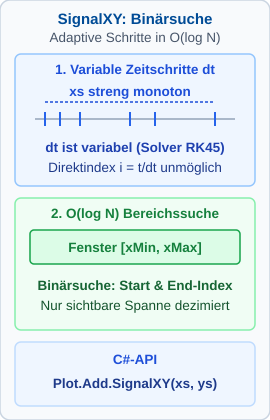

</div>
</div>

---

### Anwendungsbeispiel: `SignalXY` mit adaptiver Schrittweite

<div class="columns">
<div class="two">

Konkrete Sprungantwort eines adaptiven DGL-Solvers (RK45) in ScottPlot 5:

- **Adaptive Schrittweite:** Kleines $\mathrm{d}t = 0{,}006\,\text{s}$ bei steilem Anstieg ($t < 0{,}6\,\text{s}$), großes $\mathrm{d}t = 0{,}04\,\text{s}$ im Gleichgewicht.
- Stützpunkte im Zeitarray `xs` und Zustandsarray `ys` sind variabel beabstandet.
- Referenzwert $w = 1{,}0$ zeigt das aperiodische Einschwingen.

</div>
<div class="three">

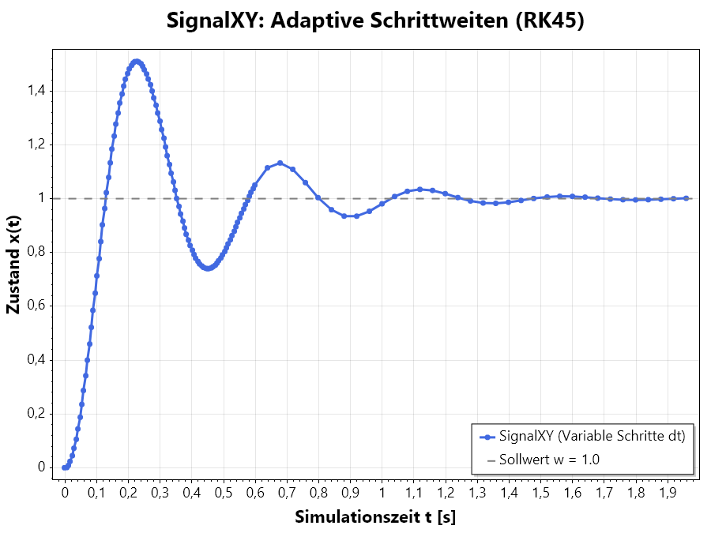

</div>
</div>

---

### Phasenraum: Motorprüfstand

<div class="columns">
<div class="two">

In der Mechatronik (Übung 4, Track A) interessiert der Zusammenhang zweier Zustände:

- **Drehmoment $M(t)$ gegen Drehzahl $n(t)$:**
  - Zeit $t$ wird als Parameter eliminiert.
  - Der Betriebspunkt $(n, M)$ wandert als Trajektorie im Kennfeld.
- **Thermische Leistungsgrenze:**
  $$P_{\max} = 2\pi \cdot n \cdot M \implies M(n) \le \frac{P_{\max}}{2\pi \cdot n}$$
  - Bildet eine **Hyperbel** im Phasenraum.
- In ScottPlot wird dies über `Plot.Add.Scatter(nArr, mArr)` visualisiert.

</div>
<div class="one">

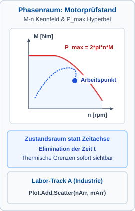

</div>
</div>

---

### Anwendungsbeispiel: `Scatter` im Motorkennfeld

<div class="columns">
<div class="two">

Konkrete Ausgabe der Phasenraum-Trajektorie $(n, M)$ eines DC-Servomotors mit ScottPlot 5:

- **Zustandskurve:** Trajektorie des Betriebspunkts von $(0, 0)$ beim Hochlaufen bis zum stationären Arbeitspunkt bei $2.350\,\text{U/min}$ und $6{,}0\,\text{Nm}$.
- **Thermische Grenze:** Gestrichelte Hyperbel markiert die Leistungsgrenze $P_{\max} = 1{,}2\,\text{kW}$.
- Überlastbereich beim Anfahren wird unmittelbar optisch transparent.

</div>
<div class="three">

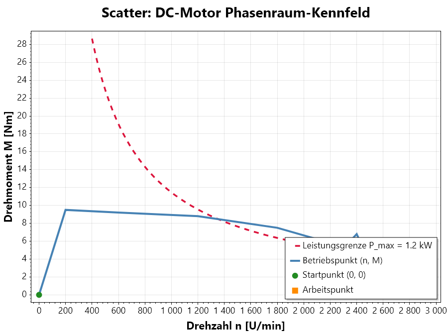

</div>
</div>

---

### Phasenraum: Kamm'scher Kreis (Fahrphysik)

<div class="columns">
<div class="two">

In der Fahrsimulation (Übung 4, Track B) bestimmt der Reifen-Grip die maximal übertragbaren Kräfte:

- **G-G-Diagramm:**
  - Querbeschleunigung $a_y$ über Längsbeschleunigung $a_x$.
  - Die resultierende Gesamtbeschleunigung ist:
    $$a_{\text{res}} = \sqrt{a_x^2 + a_y^2} \le \mu \cdot g$$
- **Haftungslimit (Kamm'scher Kreis):**
  - $\mu$: Reibbeiwert, $g$: Erdbeschleunigung.
  - **Grün:** $a_{\text{res}} \le \mu g$ (voller Grip).
  - **Orange:** Grenzbereich (Drift / Schlupf).
  - **Rot:** $a_{\text{res}} > \mu g$ (Traktionsabriss).

</div>
<div class="one">

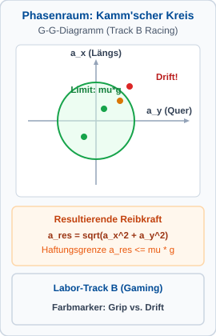

</div>
</div>

---

### Phasenraum-Richtungsfelder mit `VectorField`

<div class="columns">
<div class="two">

Zur Analyse dynamischer Systeme $\mathrm{d}\vec{x}/\mathrm{d}t = f(\vec{x})$ mit Zeitschritten $\mathrm{d}t$ und Zuständen $x_1$ und $x_2$:

- Bevor eine Trajektorie $x(t)$ numerisch integriert wird, offenbart das **Richtungsfeld** bereits das globale Verhalten.
- An jedem Gitterpunkt $(x_1, x_2)$ wird der Geschwindigkeitsvektor als gerichteter Pfeil berechnet.
- **ScottPlot 5 API:**
  - `Plot.Add.VectorField(vectors)` visualisiert ein 2D-Gitter von Vektoren `vectors`.
  - Macht Grenzzyklen und Attraktoren sichtbar, noch bevor eine Trajektorie $x(t)$ berechnet wird.

</div>
<div class="one">

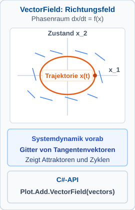

</div>
</div>

---

### Anwendungsbeispiel: `VectorField` & Phasenebene

<div class="columns">
<div class="two">

Konkrete Ausgabe des Phasenraum-Richtungsfeldes eines gedämpften Schwingers mit ScottPlot 5:

- **Richtungsvektoren:** Reguläres Gitter von Vektoren `vectors` für Zustände $x_1$ (Auslenkung) und $x_2$ (Geschwindigkeit).
- **Trajektorie:** Überlagerte Spiralkurve $x(t)$ verdeutlicht den Einlauf in den stabilen Gleichgewichtspunkt im Ursprung.
- Erlaubt die Beurteilung von Dämpfung und Konvergenzgebiet ohne aufwendige Parameterstudien.

</div>
<div class="three">

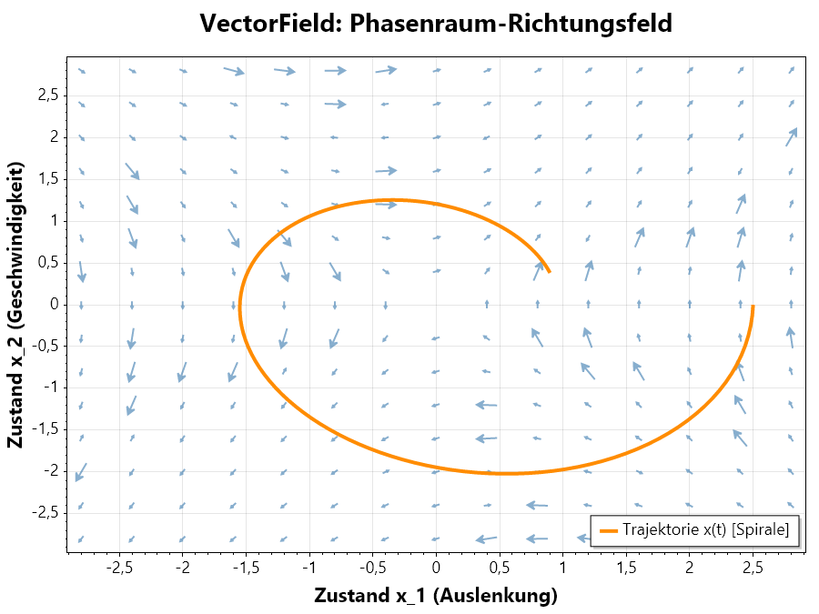

</div>
</div>

---

### Methodenvergleich der Plot-Typen

| Merkmal | `Scatter(xs, ys)` | `Signal(ys)` | `SignalXY(xs, ys)` |
|---|---|---|---|
| **Abtastung** | Beliebig (ungeordnet) | **Streng äquidistant** ($\Delta t = \text{const}$) | Monoton steigend |
| **Speicher** | $2 \times N$ ($xs$ und $ys$) | **$1 \times N$** ($ys$ genügt) | $2 \times N$ ($xs$ und $ys$) |
| **Suchaufwand** | $O(N)$ (jeder Punkt) | **$O(1)$** (direkter Index) | $O(\log N)$ (Binärsuche) |
| **Max. Punkte** | $\approx 10^4$ flüssig | **$> 10^7$ flüssig (60 FPS)** | $\approx 10^6$ flüssig |
| **Typischer Einsatz** | Phasenraum, Kennfelder | Feste Schritte (Euler, Heun) | Adaptive Solver (RK45) |

```csharp
var sig = WpfPlot1.Plot.Add.Signal(ys);
sig.Data.Period = 0.001; // dt = 1 ms (1 kHz Abtastrate)
sig.Data.XOffset = 0.0;   // Startzeit t0 = 0 s
```

---

<!-- Platzhalter für Abschnittsbildbeschreibung -->

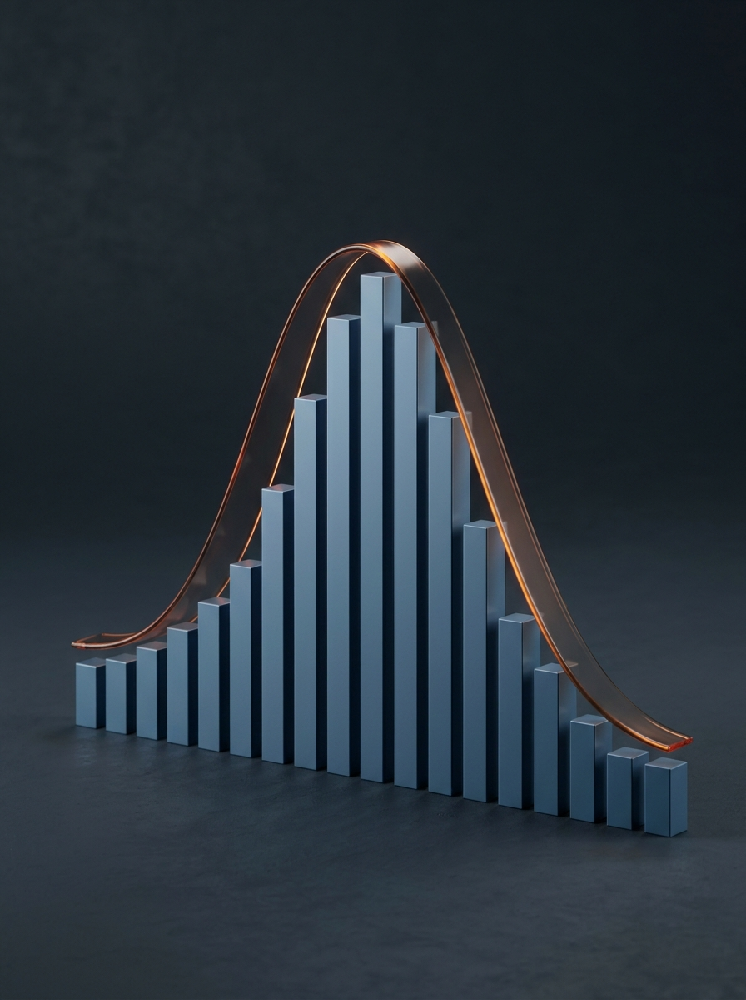

## 4.3: Statistische Auswertung & Histogramme mit ScottPlot

Dieser Abschnitt umfasst die folgenden Inhalte:

- Stochastische Signale und Rauschprozesse in Simulationssystemen
- Das Binning-Dilemma: Wahl der optimalen Klassenbreite
- Häufigkeitsverteilung vs. normierte Wahrscheinlichkeitsdichte (PDF)
- Überlagerung theoretischer Normalverteilungen
- Robuste Kennwerte und Box-Plot-Analyse

---

### Statistische Analysen in Simulationssystemen

- Wann werden Histogramme und statistische Diagramme benötigt?
  - **Monte-Carlo-Simulationen:** Analyse von Fertigungstoleranzen, Bauteilstreuungen oder Risikoszenarien über tausende Durchläufe.
  - **Diskrete Ereignissimulationen:** Verteilung von Wartezeiten in Warteschlangen, Durchlaufzeiten und Pufferfüllständen.
  - **Sensormodelle:** Rauschverteilungen (Gaußsches weißes Rauschen, Messunsicherheiten) und Signal-Rausch-Verhältnisse.
- **Ziele der Visualisierung:**
  - Identifikation von Verteilungsformen (Normalverteilung, Exponentialverteilung, Schiefe, Bimodalität).
  - Statistische Validierung numerischer Modelle gegen empirische Messdaten.
  - Erkennung von Fertigungsausreißern und Kavitationserscheinungen.

---

### Das Binning-Dilemma: Wahl der Klassenbreite $h$

<div class="columns">
<div class="two">

Beim Erstellen eines Histogramms teilt man den Wertebereich $[x_{\min}, x_{\max}]$ in $k$ Intervalle (Bins) der Breite $h$ ein:

- **Zu breite Bins ($k$ zu klein):**
  - Starke Überglättung – Verteilungsasymmetrie und bimodale Spitzen werden unsichtbar.
- **Zu schmale Bins ($k$ zu groß):**
  - Starke Unterglättung – Histogramm zerfällt in unruhiges statistisches Rauschen.
- **Freedman-Diaconis-Regel (Empfehlung für Messdaten):**
  $$h = \frac{2 \cdot \text{IQR}}{\sqrt[3]{N}}, \quad k = \left\lceil \frac{x_{\max} - x_{\min}}{h} \right\rceil$$
  - Nutzt den Interquartilsabstand $\text{IQR}$; extrem robust gegen Ausreißer!

</div>
<div class="one">

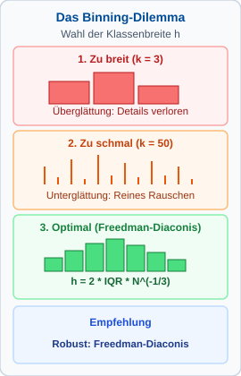

</div>
</div>

---

### ScottPlot 5 API: **Histogramme und Bins**

```csharp
// 1. Rohdaten & Histogramm berechnen (20 Bins in [0..10 s])
double[] durations = Simulation.RunMonteCarloRuns(10000);
var hist = ScottPlot.Statistics.Histogram.WithBinCount(20, 0, 10);
hist.AddRange(durations);

// 2. Balkendiagramm (ScottPlot 5 Bars) aus Klassen erzeugen
var bars = hist.Bins.Zip(hist.Counts, (pos, cnt) => new ScottPlot.Bar {
    Position = pos, Value = cnt, Size = hist.FirstBinSize * 0.85,
    FillColor = ScottPlot.Colors.SteelBlue.WithAlpha(0.7f),
    LineColor = ScottPlot.Colors.SteelBlue, LineWidth = 1.2f
}).ToList();
WpfPlot1.Plot.Add.Bars(bars);

// 3. Achsen und Layout konfigurieren
WpfPlot1.Plot.XLabel("Verweildauer [s]");
WpfPlot1.Plot.YLabel("Absolute Häufigkeit");
WpfPlot1.Plot.Axes.AutoScale();
WpfPlot1.Refresh();
```

- Berechnung des Histogramms `hist` über `durations` und Darstellung als Balkenliste `bars`.

---

### Flächennormierung zur Wahrscheinlichkeitsdichte (PDF)

<div class="columns">
<div class="two">

Ein Histogramm liefert absolute Klassenhäufigkeiten $H_k \in \mathbb{N}_0$.

- **Warum ist Flächennormierung nötig?**
  - Absolute Werte $H_k$ hängen vom Stichprobenumfang $N$ ab.
  - Eine theoretische Dichte $f(x)$ hat stets Fläche $\int_{-\infty}^\infty f(x)\,\mathrm{d}x = 1$.
- **Empirische Dichte $f_k$:**
  $$f_k = \frac{H_k}{N \cdot h} \quad \implies \quad \sum_{k=1}^m f_k \cdot h = 1$$
- **Analytische Gauß-Kurve $\mathcal{N}(\mu, \sigma^2)$:**
  $$f(x) = \frac{1}{\sigma \sqrt{2\pi}} \exp\left(-\frac{1}{2}\left(\frac{x-\mu}{\sigma}\right)^2\right)$$

</div>
<div class="one">

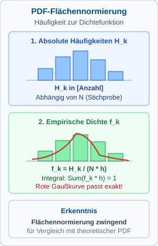

</div>
</div>

---

### Anwendungsbeispiel: Histogramm & Normalverteilung

<div class="columns">
<div class="two">

Konkrete Monte-Carlo-Toleranzanalyse über $N = 10.000$ Simulationsdurchläufe:

- **Klasseneinteilung:** Absolute Häufigkeiten $H_k$ der Bauteillänge über 24 Bins der Breite $h$.
- **Analytische Kurve:** Überlagerte Gauß-Dichtefunktion $\mathcal{N}(\mu, \sigma^2)$ mit Mittelwert $\mu = 100\,\text{mm}$ und Standardabweichung $\sigma = 4{,}5\,\text{mm}$.
- Bestätigt die korrekte stochastische Modellierung des Fertigungsprozesses.

</div>
<div class="three">

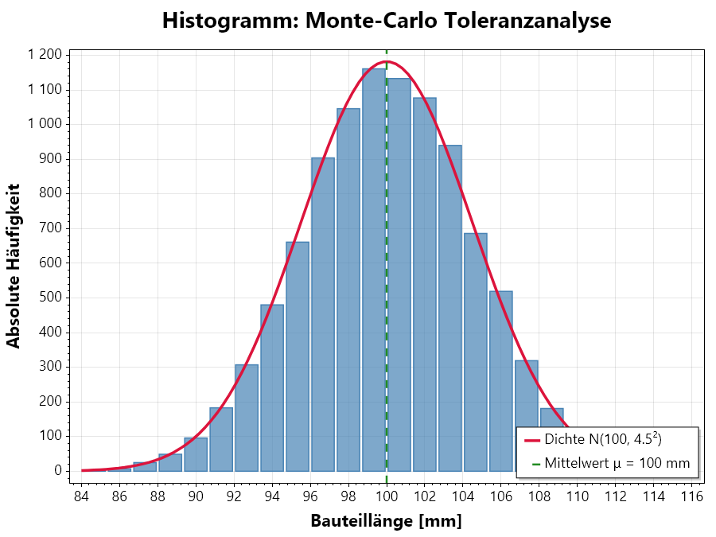

</div>
</div>

---

### Nicht-parametrische Kennwerte & Box-Plot-Anatomie

<div class="columns">
<div class="two">

Wenn Messdaten nicht gaußverteilt sind oder starke Ausreißer enthalten, sind Mittelwert und Varianz irreführend.

- **Fünf-Punkte-Zusammenfassung:**
  - **Median ($Q_2$):** Robuster Lageparameter (50 % der Daten kleiner/größer).
  - **Unteres Quartil ($Q_1$):** 25. Perzentil.
  - **Oberes Quartil ($Q_3$):** 75. Perzentil.
  - **Interquartilsabstand ($\text{IQR}$):** $\text{IQR} = Q_3 - Q_1$ (mittlere 50 %).
- **Whisker-Definition nach John Tukey:**
  - Reichen bis zum extremsten Messwert innerhalb von maximal $1{,}5 \times \text{IQR}$ ab Box-Rand.
  - Werte außerhalb gelten als statistische Ausreißer!

</div>
<div class="one">

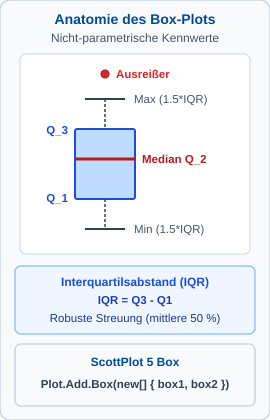

</div>
</div>

---

### Verteilungsvergleiche mit Box-Plots in ScottPlot 5

```csharp
// Definition zweier Boxen (box1 und box2) mit Q_1, Q_2, Q_3
var box1 = new ScottPlot.Box {
    Position = 1,
    BoxMiddle = 2.4, // Median Q_2
    BoxMin = 1.8,    // Unteres Quartil Q_1
    BoxMax = 3.1,    // Oberes Quartil Q_3
    WhiskerMin = 1.2,
    WhiskerMax = 3.8
};
var box2 = new ScottPlot.Box {
    Position = 2,
    BoxMiddle = 3.8, // Median Q_2
    BoxMin = 2.9,    // Unteres Quartil Q_1
    BoxMax = 4.6,    // Oberes Quartil Q_3
    WhiskerMin = 2.1,
    WhiskerMax = 5.2
};
WpfPlot1.Plot.Add.Box(new[] { box1, box2 });
```

- Die Objekte `box1` und `box2` visualisieren Quartile `BoxMin` ($Q_1$), `BoxMax` ($Q_3$) und den Median `BoxMiddle` ($Q_2$).

---

### Anwendungsbeispiel: Gütevergleich mit Box-Plots

<div class="columns">
<div class="two">

Konkreter Vergleich dreier Regelungsstrategien (P-, PI- und PID-Regler):

- Statistische Verteilung der Einschwingzeit $t_s$ unter zufälligen Laststörungen.
- **Median ($Q_2$):** PID-Regler schwingt viermal schneller ein als der reine P-Regler.
- **Quartile & Whisker:** Quartile $Q_1$, $Q_3$ und Whisker belegen die drastisch reduzierte Streubreite des PID-Ansatzes.

</div>
<div class="three">

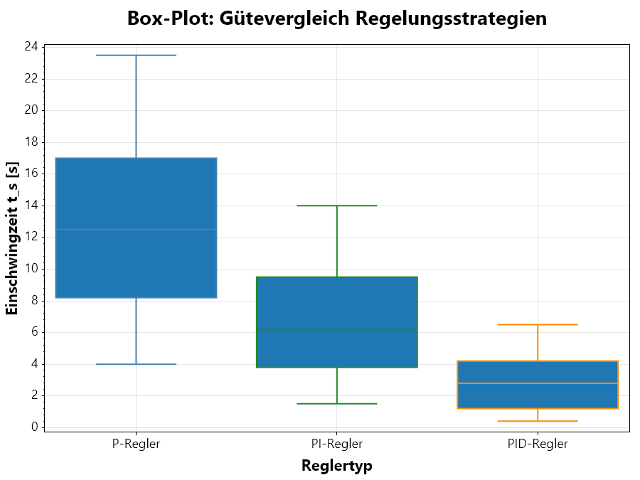

</div>
</div>

---

### Parameterstudien mit gruppierten Balken

<div class="columns">
<div class="two">

Bei Simulationsvergleichen werden Kennzahlen verschiedener Modellvarianten gegenübergestellt:

- **Szenarienvergleich:** `Modell A` (Baseline) vs. `Modell B` (Optimiert).
- **Positions-Arithmetik in ScottPlot 5:**
  - Jeder Balken besitzt `Position`, `Value` und eine `Breite`.
  - Bei mehreren Balken pro Gruppe wird die Position um einen `Offset` verschoben: $\text{Offset} = \text{Position} + k \cdot \text{Breite}$.
  - Zwischen den Gruppen sorgt ein `Gruppenabstand` für klare visuelle Trennung.
  - Ideal für Monte-Carlo-Vergleiche, Taktzeiten und Energiebedarf.

</div>
<div class="one">

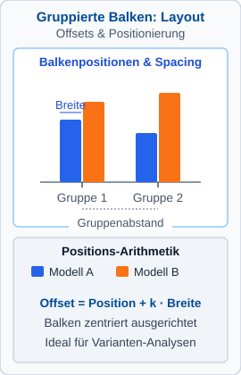

</div>
</div>

---

### Anwendungsbeispiel: Gruppierte Balken in ScottPlot 5

<div class="columns">
<div class="two">

Konkreter Variantenvergleich zweier Modellkonfigurationen über vier Laststufen:

- Gegenüberstellung von `Modell A` (Baseline) und `Modell B` (Optimiert, -23 %).
- Die Gruppen gliedern sich in *Leerlauf*, *Teillast*, *Nennlast* und *Überlast*.
- Jeder Balken nutzt `Position` und einen `Offset` mit definierter `Breite`.
- Direkter visueller Nachweis von Energieeinsparungen für Simulationsberichte.

</div>
<div class="three">

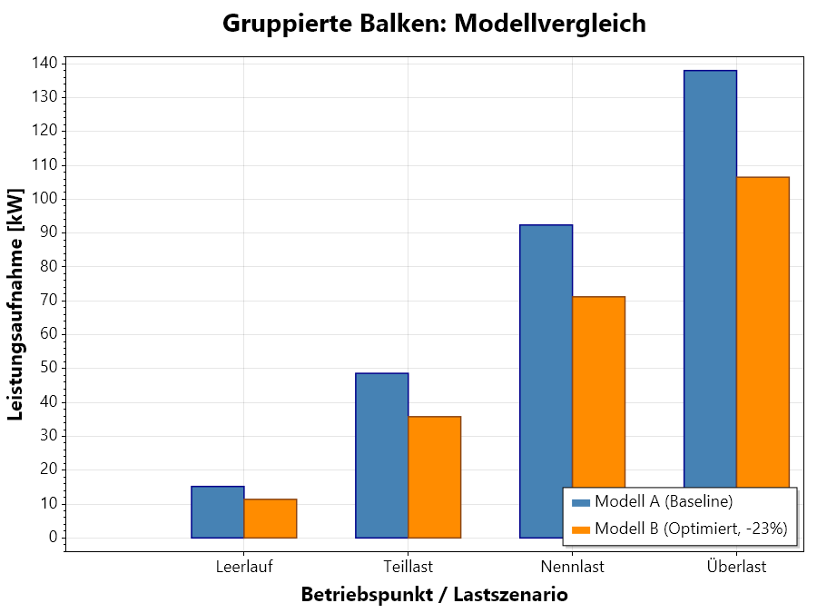

</div>
</div>

---

### Ortsdiskrete 2D-Zustände mit `Heatmap` & `ColorBar`

<div class="columns">
<div class="two">

Ortsdiskrete Modelle (wie das FDM-Temperaturfeld aus Termin 02) erzeugen 2D-Matrizen $T[i,j]$ vom Typ `double[,]`:

- **Keine $N \times M$ UI-Rechtecke:** Ein WPF-`Canvas` bricht bei $250.000$ Elementen zusammen.
- **ScottPlot-Pipeline mit `Plot.Add.Heatmap(matrix)`:**
  - Normierung der Matrixwerte zwischen $T_{\min}$, $T_{\text{mid}}$ und $T_{\max}$.
  - Lookup in einer `Colormap` liefert den `ARGB`-Farbwert.
  - Upload als SkiaSharp-Bitmap-Textur; GPU-Skalierung in $O(1)$!
  - `Plot.Add.ColorBar(heatmap)` bindet die Skala als Legende an.

</div>
<div class="one">

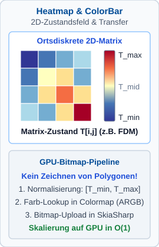

</div>
</div>

---

### Anwendungsbeispiel: 2D-Temperaturfeld mit `Heatmap`

<div class="columns">
<div class="two">

Konkrete Darstellung des 2D-Temperaturfelds $T[i,j]$ (FDM aus Termin 02):

- **Matrix:** $50 \times 50$ Gitterpunkte mit Hotspot und Randkühlung.
- **`Turbo`-Colormap:** Farbübergang von Blau über Gelb nach Rot.
- **`ColorBar`:** Bindet die Temperaturskala in $[^\circ\text{C}]$ als Legende an.
- Schnelles GPU-Rendering in SkiaSharp garantiert flüssigen Betrieb.

</div>
<div class="three">

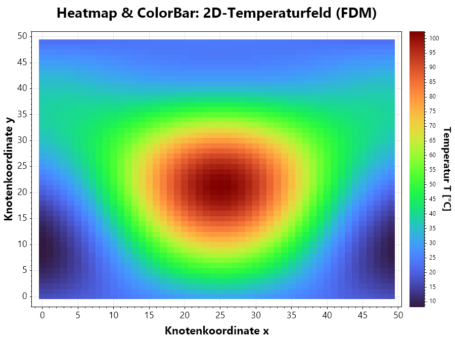

</div>
</div>

---

<!-- Platzhalter für Abschnittsbildbeschreibung -->


## 4.4: Live-Streaming & Telemetrie

Dieser Abschnitt umfasst die folgenden Inhalte:

- Herausforderungen bei kontinuierlichen Simulationsdatenströmen
- .NET CLR Garbage Collection und die 0-Byte-Allokationsregel
- Der Ringpuffer (Circular Buffer) mit Modulo-Arithmetik
- Multi-Rate-Entkopplung: 1 kHz Simulation vs. 50 Hz UI-Refresh
- Subtraktionsauslöschung und der Welford-Algorithmus (1962)
- Dynamische $\pm 3\sigma$-Toleranzbänder in ScottPlot 5

---

### Herausforderungen im Live-Streaming

Ein Digitaler Zwilling oder eine Hardware-in-the-Loop-Simulation liefert kontinuierliche Messwerte (z.B. mit $1.000\,\text{Hz}$).

- **Typische Fallstricke naiver Implementierungen:**
  - `List<double>.Add()` wächst unbegrenzt $\rightarrow$ Speicherüberlauf (Out-of-Memory) nach längerer Laufzeit.
  - Dynamisches Resizing von Listen erzeugt kontinuierlich Heap-Allokationen und führt zu spürbarem Ruckeln (GC-Pauses).
  - Ein direkter Aufruf von `WpfPlot.Refresh()` in jedem Simulationsschritt überlastet den UI-Thread und blockiert die Simulation.
- **Architektonische Lösung:**
  1. **Ringpuffer mit fester Kapazität:** Konstante Speichernutzung, null Allokationen während der Simulation.
  2. **Taktentkopplung:** Schneller Simulations-Thread (z.B. 1 kHz) schreibt in den Puffer; UI-Thread aktualisiert das Display mit schonenden 30–60 FPS.

---

### CLR Garbage Collection & Zero-Allocation

<div class="columns">
<div class="two">

Die .NET Common Language Runtime (CLR) teilt den Managed Heap in Generationen ein:

- **Generation 0:** Kurzlebige Objekte (`new`). Läuft schnell voll $\implies$ löst häufige Kollektionen aus.
- **Stop-the-World Pausen:** Während der GC angehalten wird, stockt der UI-Thread $\implies$ sichtbare Mikroruckler (GC-Jitter).
- **Die Zero-Allocation-Regel:**
  - Im 50-Hz-Render-Loop gilt strikt: **0 Byte Allokation pro Frame**!
  - Keine `new SolidColorBrush()`, keine temporären Listen!
  - Einmalige Allokation beim Start und Aufruf von `brush.Freeze()`.

</div>
<div class="one">

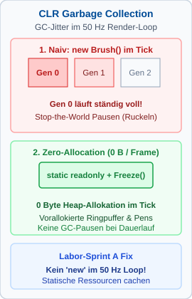

</div>
</div>

---

### Das Ringpuffer-Muster (Circular Buffer)

<div class="columns">
<div class="two">

Ein Ringpuffer speichert die jüngsten $N$ Messwerte in einem vorallokierten Array fester Kapazität `cap`:

- **Schreibzeiger `head`:** Zeigt auf den nächsten freien Index.
- **Modulo-Wrap-Around:**
  $$\text{head} = (\text{head} + 1) \bmod \text{cap}$$
  - Älteste Werte werden automatisch überschrieben.
  - $O(1)$ Zeitaufwand, **0 Byte GC-Allokation** beim Einfügen von `val`!
- **Snapshot für Rendering:**
  - Via `Array.Copy(_data, dest, cap)` werden Daten blitzschnell in den Zielpuffer `dest` kopiert.

</div>
<div class="one">

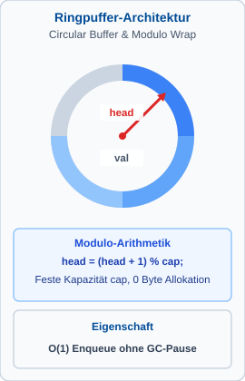

</div>
</div>

---

### Ringpuffer: C#-Implementierung

```csharp
public class SimulationRingBuffer(int cap)
{
    private readonly double[] _data = new double[cap];
    private int _head;
    private readonly object _lock = new();

    public void Enqueue(double val)
    {
        lock (_lock) { _data[_head] = val; _head = (_head + 1) % _data.Length; }
    }

    public void CopyTo(double[] dest)
    {
        lock (_lock) { Array.Copy(_data, dest, _data.Length); }
    }
}
```

- Der Puffer mit Kapazität `cap` speichert den Messwert `val` und kopiert in `dest`.

---

### Taktentkopplung (Multi-Rate-Architektur)

<div class="columns">
<div class="two">

Warum darf die Simulation das UI nicht direkt im eigenen Takt aktualisieren?

- **Mess-/Simulationstakt (1.000 Hz):**
  - Schneller Solver oder DAQ-Kanal (Schrittweite `dt = 1 ms`).
  - Schreibt Messwerte in den thread-sicheren Ringpuffer.
- **UI-Display-Takt (50 Hz / 20 ms):**
  - Das menschliche Auge kann mehr als 60 FPS kaum auflösen.
  - Ein `DispatcherTimer` holt mit 50 Hz einen Snapshot aus dem Puffer und ruft `WpfPlot.Refresh()` auf.
  - **Vorteil:** UI-Message-Queue bleibt frei und reaktionsschnell!

</div>
<div class="one">

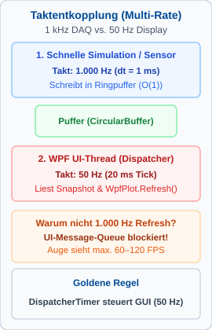

</div>
</div>

---

### UI-Refresh mit `DispatcherTimer` & `DataStreamer`

```csharp
private DataStreamer _streamer;
private HorizontalLine _meanLine, _upperLine;

private void InitPlot()
{
    _streamer = WpfPlot1.Plot.Add.DataStreamer(500);
    _streamer.ViewScrollLeft(); // Oszilloskop-Band
    _meanLine = WpfPlot1.Plot.Add.HorizontalLine(100);
    _upperLine = WpfPlot1.Plot.Add.HorizontalLine(115);
}

private void OnTelemetryTick(object? s, EventArgs e)
{
    double y = ReadNextSensorSample();
    _streamer.Add(y);           // 0 B Allokation
    _welford.Add(y);            // O(1) Online-Statistik
    _meanLine.Y = _welford.Mean; _upperLine.Y = _welford.Mean + 3 * _welford.StdDev;
    WpfPlot1.Refresh();
}
```

- Handler-Parameter `s` und `e` für den Timer; Linien `_meanLine` und `_upperLine` führen Toleranzen nach.

---

### Das Problem der naiven Varianzberechnung

<div class="columns">
<div class="two">

Die klassische Lehrbuchformel für die Stichprobenvarianz lautet:

$$s^2 = \frac{1}{k-1} \left( \sum_{i=1}^k x_i^2 - \frac{1}{k} \left(\sum_{i=1}^k x_i\right)^2 \right)$$

- **Katastrophale Subtraktionsauslöschung:**
  - Bei Telemetriedaten mit großem Offset (z.B. $x_i \approx 10^7$) und kleinem Rauschen subtrahiert man zwei fast identische Riesenzahlen.
  - IEEE 754 Gleitkommazahlen verlieren dabei alle signifikanten Mantissenbits!
  - Durch Rundungsfehler wird die Differenz oft negativ $\implies s^2 < 0 \implies \sqrt{s^2} = \text{NaN}$!

</div>
<div class="one">

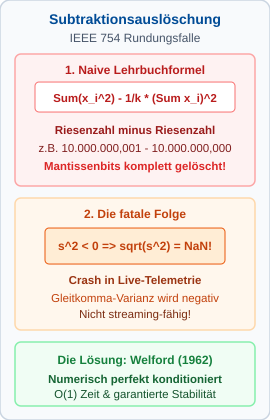

</div>
</div>

---

### Der Welford-Algorithmus (1962)

<div class="columns">
<div class="two">

B. P. Welford formulierte eine numerisch exzellent konditionierte Rekursionsformel in $O(1)$:

1. **Mittelwert `Mean_k` ($\bar{x}_k$) und `delta`:**
   $$\text{delta} = x_k - \bar{x}_{k-1}, \quad \bar{x}_k = \bar{x}_{k-1} + \frac{\text{delta}}{k}$$
2. **Quadratsumme ($M_{2,k}$) und `delta2`:**
   $$\text{delta2} = x_k - \bar{x}_k, \quad M_{2,k} = M_{2,k-1} + \text{delta} \cdot \text{delta2}$$
3. **Varianz (`Variance` $s_k^2$) & Streuung (`StdDev` $\sigma_k$):**
   $$s_k^2 = \frac{M_{2,k}}{k-1}, \quad \sigma_k = \sqrt{s_k^2}$$
- **Vorteil:** Absolut stabil, 0 Pufferhistorie erforderlich!

</div>
<div class="one">

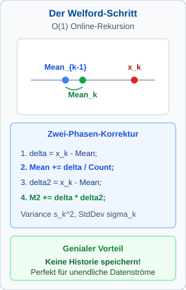

</div>
</div>

---

### Welford-Statistik: C#-Implementierung

```csharp
public class WelfordStatistics
{
    public long Count { get; private set; }
    public double Mean { get; private set; }
    public double M2 { get; private set; }
    public double Variance => Count > 1 ? M2 / (Count - 1) : 0.0;
    public double StdDev => Math.Sqrt(Variance);

    public void Add(double x)
    {
        Count++;
        double delta = x - Mean;
        Mean += delta / Count;
        double delta2 = x - Mean;
        M2 += delta * delta2;
    }
}
```

- Berechnung von `Mean`, `M2`, `Variance` und `StdDev` über die Differenzen `delta` und `delta2`.

---

### Dynamische 3-Sigma-Toleranzbänder

<div class="columns">
<div class="two">

Mit Welfords Online-Statistik lassen sich kontinuierliche Konfidenzbänder berechnen:

- **Drei-Sigma-Regel (Gauß-Verteilung):**
  - $\bar{x} \pm 1\sigma$: Enthält 68,27 % aller Messwerte.
  - $\bar{x} \pm 2\sigma$: Enthält 95,45 % aller Messwerte.
  - $\bar{x} \pm 3\sigma$: Enthält **99,73 %** aller Messwerte.
- **Anomalie-Erkennung:**
  - Überschreitet ein Messwert $y(t) > \bar{x} + 3\sigma$ oder $y(t) < \bar{x} - 3\sigma$, liegt eine statistisch signifikante Anomalie vor.
  - Indiziert Fehler wie Kavitation, Bauteilermüdung oder Reibungsverlust.

</div>
<div class="one">

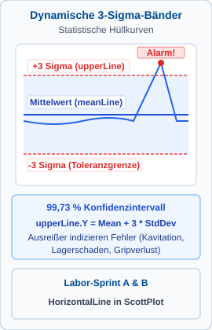

</div>
</div>

---

### Schattierte Toleranzkorridore mit `FillY`

<div class="columns">
<div class="two">

Bei Telemetriedaten reicht der Mittelwert $\mu(t)$ für Qualitätsaussagen oft nicht aus:

- **Toleranzgrenzen:** Konfidenzband über obere Schranke $y_{\text{upper}}$ und untere Schranke $y_{\text{lower}}$ (z.B. $\mu(t) \pm 3\sigma$).
- **Polygon-Rendering mit `Plot.Add.FillY`:**
  - `Plot.Add.FillY(xs, y_lower, y_upper)` erzeugt geschlossenen 2D-Pfad (`SKPath`).
  - Punkte laufen vorwärts entlang $y_{\text{upper}}$ und rückwärts entlang $y_{\text{lower}}$.
  - Die Fläche wird mittels Alpha-Blending halbtransparent gerendert.
  - Abweichungen fallen sofort auf, ohne $\mu(t)$ zu verdecken.

</div>
<div class="one">

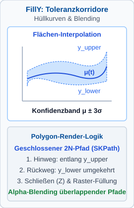

</div>
</div>

---

### Anwendungsbeispiel: `FillY` im Live-Monitoring

<div class="columns">
<div class="two">

Konkrete Telemetrie-Visualisierung eines Drucksignals mit ScottPlot 5:

- **Nennverlauf:** Harmonische Führungsgröße $\mu(t)$.
- **Toleranzkorridor:** Schattiertes Band zwischen $y_{\text{lower}}$ und $y_{\text{upper}}$ ($\mu(t) \pm 3\sigma$).
- **Anomalie-Erkennung:** Ein Druckstoß bei $t \approx 1{,}38\,\text{s}$ durchbricht die obere Schranke $y_{\text{upper}}$ und triggert einen Alarm.
- Dank Alpha-Blending bleibt der Verlauf von $\mu(t)$ stets erkennbar.

</div>
<div class="three">

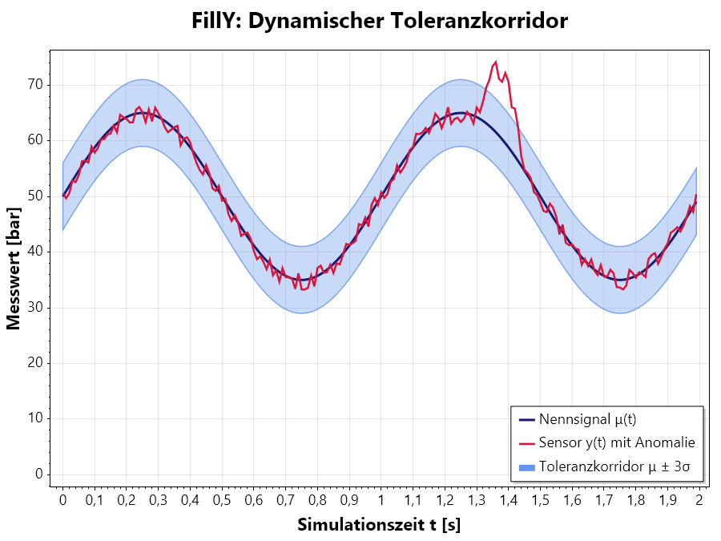

</div>
</div>

---

<!-- Platzhalter für Abschnittsbildbeschreibung -->


## 4.5: Topologie- und Netzwerkgraphen mit MSAGL

Dieser Abschnitt umfasst die folgenden Inhalte:

- Mathematisches Graphenmodell für Simulationssysteme
- Das Microsoft Automatic Graph Layout (`MSAGL`)
- Automatische Layout-Algorithmen (Sugiyama vs. Force-Directed)
- Algebraische Schleifen (Algebraic Loops) und DAE-Systeme
- Tiefensuche (DFS 3-Farben) zur Zyklen-Erkennung

---

### Mathematische Modellierung von Modelltopologien

In modernen Blockdiagramm- und Multi-Domain-Simulatoren (Simulink, Modelica, Simscape) wird das Gesamtsystem als gerichteter Graph abgebildet:

$$G = (V, E)$$

- **Knotenmenge $V = \{v_1, \dots, v_n\}$:** Funktionsblöcke (z.B. Integratoren, Kennfelder) oder physikalische Komponenten (Ventil, Zylinder).
  - Eingangsgrad $\deg^-(v_i)$: Anzahl eingehender Signale / Kopplungen
  - Ausgangsgrad $\deg^+(v_i)$: Anzahl erzeugter Ausgangssignale
- **Kantenmenge $E \subseteq V \times V$:** Signal- und Leistungsflüsse $e = (v_i, v_j)$
- **Adjazenzmatrix $\mathbf{A} \in \{0, 1\}^{n \times n}$:**
  $$a_{ij} = \begin{cases} 1, & \text{falls } (v_i, v_j) \in E \text{ (Signal von } v_i \text{ zu } v_j \text{)} \\ 0, & \text{sonst} \end{cases}$$
- **Topologische Ordnung:** Eine Reihenfolge der Knoten, bei der alle gerichteten Kanten von links nach rechts zeigen (nur bei DAGs möglich).

---

### Netzwerktopologien & Automatisches Layout mit MSAGL

- **Herausforderung:** Bei komplexen Systemen mit hunderten Blöcken ist manuelle Platzierung unmöglich und blockiert Modellrefactorings.
- **Lösung:** Microsoft Automatic Graph Layout (`MSAGL`):
  - Berechnet ästhetische, kreuzungsminimierte Layouts vollautomatisch.
  - Unterstützt hierarchische Layering-Verfahren (Sugiyama-Algorithmus) für kausale Signalflüsse (von links nach rechts).
  - Unterstützt Force-Directed-Layouts für physikalische Netzwerkgraphen (ungestrickte Feder-Masse-Modelle).
  - Erlaubt interaktives Zoomen, Panning und Hervorheben kritischer Signalpfade (algebraische Zyklen rot markieren).

---

### MSAGL: Einbindung in WPF

<div class="columns">
<div class="one">

**XAML-Deklaration:**
```xaml
<Window ...
  xmlns:msagl="clr-namespace:
    Microsoft.Msagl.WpfGraphControl;
    assembly=
    Microsoft.Msagl.WpfGraphControl">
  <Grid>
    <msagl:AutomaticGraphLayoutControl 
      x:Name="GraphControl" />
  </Grid>
</Window>
```

</div>
<div class="two">

**C#-Code-Behind:**
```csharp
// 1. Graph-Objekt erstellen
var graph = new Microsoft.Msagl.Drawing.Graph("Sim");

// 2. Knoten hinzufügen
graph.AddNode("Integrator").LabelText = "Integrator";
graph.AddNode("Gain").LabelText = "Gain [k=2.5]";
graph.AddNode("Sum").LabelText = "Sum [+ -]";

// 3. Gerichtete Kanten definieren
graph.AddEdge("Sum", "e(t)", "Integrator");
graph.AddEdge("Integrator", "x(t)", "Gain");
graph.AddEdge("Gain", "Feedback", "Sum");

// 4. Dem Control übergeben
GraphControl.Graph = graph;
```

</div>
</div>

- Die Instanz `graph` modelliert Knoten und Kanten für das WPF-Control `GraphControl`.

---

### Der Sugiyama-Algorithmus (Hierarchisches Layout)

<div class="columns">
<div class="two">

Für gerichtete Kausalsysteme (Signalflusspläne) berechnet MSAGL das Layout nach dem 4-Phasen-Verfahren von Kozo Sugiyama:

1. **Phase 1 (Cycle Removal):** Temporäre Umkehrung von Feedback-Kanten; erzeugt einen kreisfreien Graphen (DAG).
2. **Phase 2 (Layer Assignment):** Zuweisung der Knoten zu horizontalen Schichten $L_1, L_2, \dots$; Einfügen von Dummy-Knoten für lange Kanten.
3. **Phase 3 (Crossing Minimization):** Vertauschen der Knotenreihenfolge in Schichten (Barycentric Heuristic).
4. **Phase 4 (Coordinate Assignment):** Spline-Routing und Begradigung von Signalleitungen.

</div>
<div class="one">

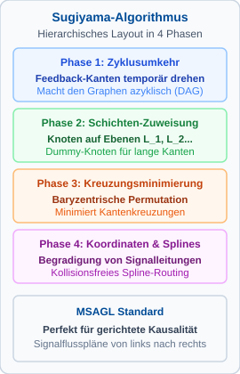

</div>
</div>

---

### Sugiyama Phase 1: Zyklusbeseitigung (Cycle Removal)

<div class="columns">
<div class="two">

- **Das Problem (Gerichtete Zyklen):**
  - Im Vorwärtspfad fließt das Signal von $v_1$ über $v_2$ und $v_3$ zum Ausgang $v_4$.
  - Die Rückkopplung $v_4 \to v_1$ schließt einen Kreis; Schichtung verlangt zwingend einen kreisfreien DAG.
- **Feedback Arc Set (FAS):**
  - Minimale Kantenmenge zur Zyklusauflösung (z.B. via DFS nach Rückwärtskanten).
- **Die Transformation:**
  - Temporäre Drehung von $e_{\text{rev}}$ ($v_4 \to v_1$ wird zu $v_1 \to v_4$).
  - Nach Phase 4 wird die Kante wieder in ihrer Originalrichtung gerendert.

</div>
<div class="one">

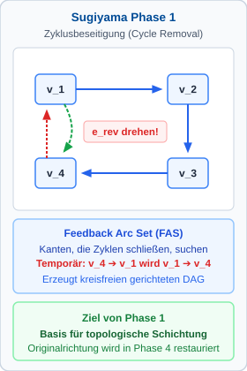

</div>
</div>

---

### Sugiyama Phase 2: Schichten-Zuweisung & Dummy-Knoten

<div class="columns">
<div class="two">

- **Zuweisung zu diskreten Schichten (Ranking):**
  - Knoten $v$ erhalten Schichten $L_1, L_2, L_3, \dots$ (z.B. $v_1 \in L_1$, $v_2 \in L_2$, $v_3 \in L_3$).
  - Bedingung für jede Kante $(u, v)$: $\text{layer}(v) \ge \text{layer}(u) + 1$.
  - Solver: *Longest-Path* oder *Network-Simplex* (minimiert Dummy-Knoten).
- **Normalisierung mit Dummy-Knoten:**
  - Langkante von $v_1 \in L_1$ direkt nach $v_3 \in L_3$ wird in Schicht $L_2$ geteilt.
  - Einfügen von Dummy $d_1$: Teilkanten $v_1 \to d_1$ und $d_1 \to v_3$.
  - Alle Kanten besitzen nun exakt Schichtweite $\Delta L = 1$ (`ΔL = 1`).

</div>
<div class="one">

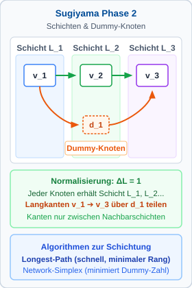

</div>
</div>

---

### Sugiyama Phase 3: Kreuzungsminimierung (Layer Permutation)

<div class="columns">
<div class="two">

- **Das Problem (NP-schwer):**
  - Ungünstige Reihenfolgen erzeugen Kantenkreuzungen (z.B. $v_1 \to v_4$ und $v_2 \to v_3$).
  - Innerhalb jeder Schicht können Knoten jedoch frei vertikal permutiert werden.
- **Barycenter-Heuristik (Schwerpunkt-Verfahren):**
  - Fixiere die Vorgängerschicht $L_1$ und sortiere Schicht $L_2$.
  - Berechne die Soll-Position $y_{\text{bary}}(v)$ eines Knotens $v \in L_2$ als arithmetischen Mittelwert seiner Vorgänger $u \in \text{pred}(v)$:
    $$y_{\text{bary}}(v) = \frac{1}{|\text{pred}(v)|} \sum_{u \in \text{pred}(v)} y(u)$$
  - Durch Tauschen von $v_3$ und $v_4$ nach aufsteigendem $y_{\text{bary}}$ verlaufen die Kanten kreuzungsfrei!

</div>
<div class="one">

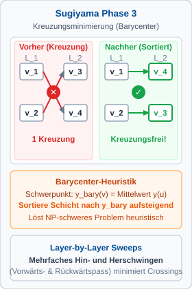

</div>
</div>

---

### Sugiyama Phase 4: Koordinaten & Spline-Routing

<div class="columns">
<div class="two">

- **Exakte Koordinatenzuweisung (Brandes-Köpf):**
  - Aus den diskreten Rängen werden stetige $(x, y)$-Koordinaten berechnet.
  - Der Vorwärtspfad $v_1 \to v_2 \to v_3$ wird horizontal **fluchtend begradigt**, um Knicke zu minimieren.
  - Knotenabstände werden für lesbare Beschriftungen optimiert.
- **Spline-Routing für Signalleitungen:**
  - Dummy-Knoten aus Phase 2 dienen als Stützstellen für glatte **B-Splines** und werden danach unsichtbar.
  - **Rückführpfad:** Die in Phase 1 umgekehrte Kante $e_{\text{rev}}$ wird über $v_4$ in Originalrichtung außen herum geroutet ($v_4 \to v_1$).

</div>
<div class="one">

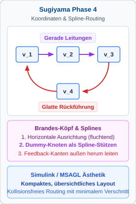

</div>
</div>

---

### MSAGL in der Praxis: Hierarchisches Sugiyama-Layout

<div class="columns">
<div class="two">

Vollautomatisch von MSAGL berechneter Regelkreis:

- **Vorwärtspfad:** Von `Sollwert w(t)` über `Summierer`, `PID-Regler`, `Leistungsaktor` zur `Regelstrecke`.
- **Rückführpfad:** Signal `Istwert y(t)` über den `Sensor` zum `Summierer`.
- **Störgröße:** Externe Kopplung von `Störgröße z(t)`.
- Sugiyama minimiert Kantenkreuzungen vollautomatisch.

</div>
<div class="three">

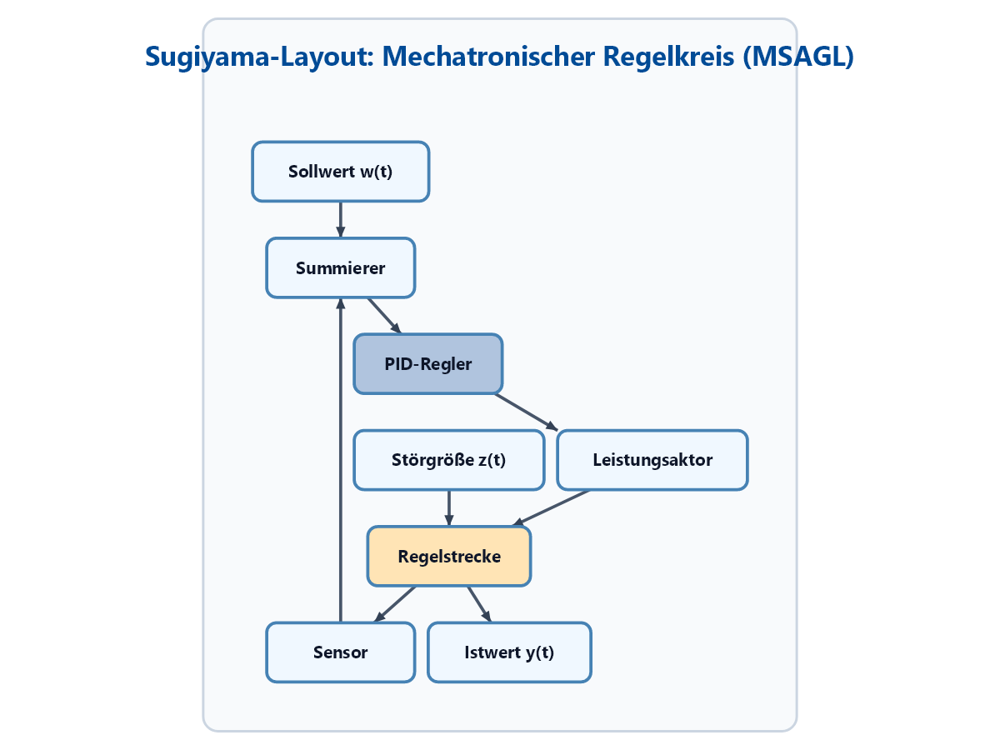

</div>
</div>

---

### Force-Directed Layout (Spring-Embedder)

<div class="columns">
<div class="two">

Für ungerichtete Komponenten-Netzwerke eignet sich das Kräfte-Verfahren:

- **Physikalisches Analogon:**
  - **Hookesche Zugfedern zwischen Knoten v_1 und v_2:**
    $$F_s = k \cdot (\|\Delta\vec{p}\| - d_0)$$
    Ziehen benachbarte Knoten $v_1$ und $v_2$ an.
  - **Elektrostatische Ladungen (Coulomb):**
    $$F_r = \frac{C}{\|\Delta\vec{p}\|^2}$$
    Stoßen alle Knotenpaare voneinander ab.
- **Numerische Lösung:** Iteration bis zum Kräftegleichgewicht $\sum \vec{F}_i \approx \vec{0}$.

</div>
<div class="one">

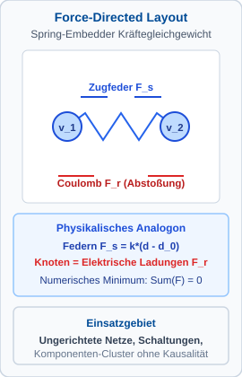

</div>
</div>

---

### MSAGL in der Praxis: Organisches Force-Directed Layout

<div class="columns">
<div class="two">

Vollautomatisch berechnete Netzwerktopologie eines Antriebsstrangs:

- **Busknoten:** `CAN-Gateway` vernetzt `Inverter`, `Batterie-BMS` und `Fahrzeugleitrechner`.
- **Antrieb & Kühlung:** `Inverter`, `Traktionsmotor`, `Getriebe`, `Radsensorik` und `Kühlkreislauf`.
- **Telemetrie:** Anbindung an die `Telemetrie-Cloud`.
- Kräfte-Gleichgewicht entflechtet Knoten gleichmäßig.

</div>
<div class="three">

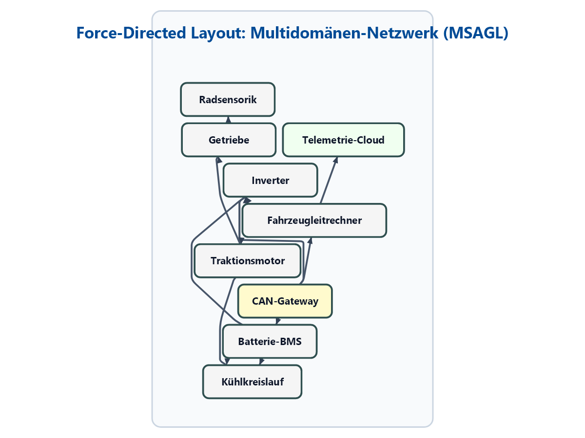

</div>
</div>

---

### Was ist eine algebraische Schleife (Algebraic Loop)?

<div class="columns">
<div class="two">

- **Kausale Systeme (ODE):**
  - Rückkopplung enthält mindestens einen **Integrator** $\frac{1}{s}$ oder eine Zustandsverzögerung $z^{-1}$.
  - Der Zustand $x(t)$ entkoppelt Ursache und Wirkung zeitlich: $dx/dt = f(x, u)$.
- **Algebraische Schleife (DAE):**
  - Geschlossener Signalpfad über Gain-Blöcke `k_1` und `k_2` **ohne Verzögerungsglied** (direkter Durchgriff $\mathbf{D} \ne \mathbf{0}$).
  - Ausgang hängt sofort vom Eingang ab, der Eingang hängt sofort vom Ausgang ab:
    $$y(t) = g(y(t), u(t))$$
  - Erzwingt im Solver eine iterative Nullstellensuche oder divergiert!

</div>
<div class="one">

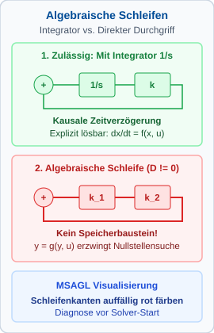

</div>
</div>

---

### Hervorhebung algebraischer Schleifen in MSAGL



*Erkennung: Die rote Schleife (Sum1 ➔ Gain1 ➔ Gain2 ➔ Sum1) enthält kein speicherndes Element und muss vor Simulationsstart diagnostiziert werden.*

---

### Zyklen-Erkennung: Tiefensuche mit 3 Farben

<div class="columns">
<div class="two">

Um algebraische Schleifen automatisch im Graphen aufzudecken, nutzt man eine Tiefensuche (DFS) in $O(|V| + |E|)$:

- **Die drei Markierungszustände:**
  1. **Weiß:** Knoten (`v_4`) wurde noch nicht besucht.
  2. **Grau:** Knoten (`v_1`, `v_2`, `v_3`) liegt auf aktivem Rekursions-Stack.
  3. **Schwarz:** Knoten und alle Nachfolger sind vollständig abgearbeitet.
- **Kriterium für Zyklen:**
  - Rückwärtskante von `v_3` auf den grauen Knoten `v_1` schließt einen Kreis!

</div>
<div class="one">

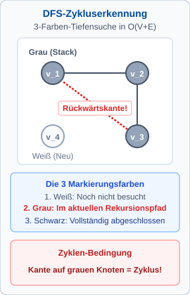

</div>
</div>

---

### MSAGL API: Zyklus-Hervorhebung (Highlighting)

```csharp
var graph = new Microsoft.Msagl.Drawing.Graph("Blockschaltbild");
var eIn    = graph.AddEdge("In", "Sum1");
var eLoop1 = graph.AddEdge("Sum1", "Gain1");
var eLoop2 = graph.AddEdge("Gain1", "Gain2");
var eLoop3 = graph.AddEdge("Gain2", "Sum1"); // Schleife ohne Integrator!

// Kanten der algebraischen Schleife auffällig rot färben:
var loopEdges = new[] { eLoop1, eLoop2, eLoop3 };
foreach (var edge in loopEdges)
{
    edge.Attr.Color = Microsoft.Msagl.Drawing.Color.Red;
    edge.Attr.LineWidth = 3;
}

// Betroffenen Summationsknoten hervorheben:
var sumNode = graph.FindNode("Sum1");
sumNode.Attr.FillColor = Microsoft.Msagl.Drawing.Color.MistyRose;
sumNode.Attr.Color = Microsoft.Msagl.Drawing.Color.Red;
GraphControl.Graph = graph;
```

- Das Objekt `graph` markiert Kanten `eLoop1`, `eLoop2`, `eLoop3` und den Knoten `sumNode` rot.

---

### Ausblick: Interaktive Node-Editoren

<div class="columns">
<div class="two">

- **MSAGL:**
  - Automatische Generierung, Inspektion und Debugging von Topologien.
  - Berechnet Graphen-Layout statisch oder semi-interaktiv.
- **Moderne Node-Editoren (z.B. Nodify):**
  - Für interaktive Werkzeuge (wie Simulink oder Blueprint-Editoren).
  - Erlauben freies Drag & Drop von Pins, Verbindungen und Blöcken.
- **Kombination:** MSAGL liefert das Initial-Layout, der Editor speichert manuelle Justierungen.

</div>
<div class="two">

| Kriterium | MSAGL | Nodify / Node-Editor |
|---|---|---|
| **Fokus** | Layout & Visualisierung | Interaktive Modellierung |
| **Kantenführung** | Automatisch (Splines) | Bezier-Kurven / Pins |
| **Zyklenanalyse** | Integriert | Modell-Logik nötig |
| **Interaktion** | Zoom, Pan, Drag | Wire-Connecting, Edit |

</div>
</div>

---

### Zusammenfassung Kapitel 4

<div class="columns">
<div class="one">

- **Display-Bottleneck & Decimation:**
  - $10^7$ Punkte überfordern UI-Controls; Min/Max-Säulen-Decimation schützt vor Aliasing und garantiert 60 FPS.
- **ScottPlot 5 (`Signal` & `Scatter`):**
  - Äquidistante Abtastung spart 50 % RAM ($O(1)$-Index).
  - Phasenraum-Trajektorien visualisieren Leistungsgrenzen ($P_{\max}$-Hyperbel, Kamm'scher Kreis).
- **Statistische Verteilungen:**
  - Freedman-Diaconis-Binning und Flächennormierung ($f_k = \frac{H_k}{N \cdot h}$) ermöglichen präzisen Gauß-Fit.

</div>
<div class="one">

- **Live-Streaming & Zero-Allocation:**
  - Ringpuffer (`CircularBuffer`) und `Freeze()` verhindern GC-Jitter im 50-Hz-Loop.
  - Welford-Algorithmus verhindert katastrophale Subtraktionsauslöschung und führt $\pm 3\sigma$-Toleranzbänder online nach.
- **MSAGL:**
  - Sugiyama- und Force-Directed-Layouts ordnen komplexe Signalnetze vollautomatisch.
  - DFS-Zyklenprüfung diagnostiziert algebraische Schleifen visuell vor Simulationsstart.

</div>
</div>

---

### Laborübung Termin 04: Telemetrie & ScottPlot

Vertiefende Hausübung (Stufe B, 10 Pkt.) – Details siehe [Aufgabenblatt 04](../../Uebungen/Termin_04_Telemetrie_und_ScottPlot/Aufgabenblatt.md):

<div class="columns">
<div class="two">

#### Track A: Industrie & Mechatronik
**Antriebsprüfstand & Schwingungsüberwachung**
- Live-Streamer für Drehzahl $n(t)$ und Moment $M(t)$
- Welford-Algorithmus: $\bar{M} \pm 3\sigma_M$ Toleranzbänder
- Phasenraum-Kennfeld ($M$ vs. $n$) mit $P_{\max}$-Grenze
- Schwingungs-Histogramm mit Gauß-Kurve
- MSAGL-Antriebsstrang mit Sensor-Alarmanzeige

</div>
<div class="two">

#### Track B: Simulation Game
**Retro Arcade Racing HUD & G-Force Telemetrie**
- Live Speed- & RPM-Streamer mit Shift-Flash
- Welford-Statistik für optimale Ausdreh-Drehzahl
- Kamm'scher Kreis (Phasenplot $a_x$ vs. $a_y$ mit Haftungslimit $\mu \cdot g$)
- Rundenzeit-Histogramm & Strecken-Topologie (MSAGL)

</div>
</div>

> Performance-Dashboard mit ScottPlot 5 & MSAGL (0 B GC-Druck) – Wahlmodell: Track A oder B.
