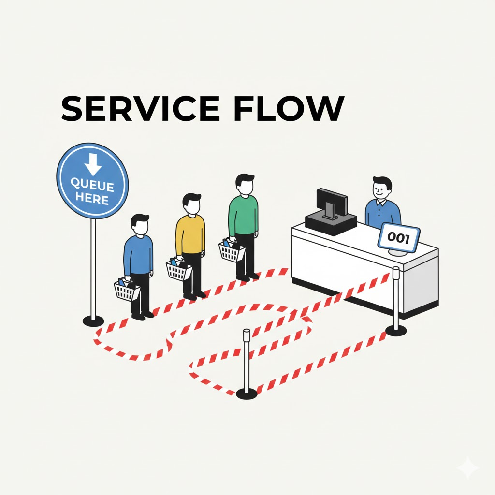
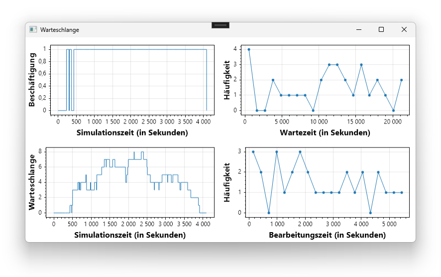
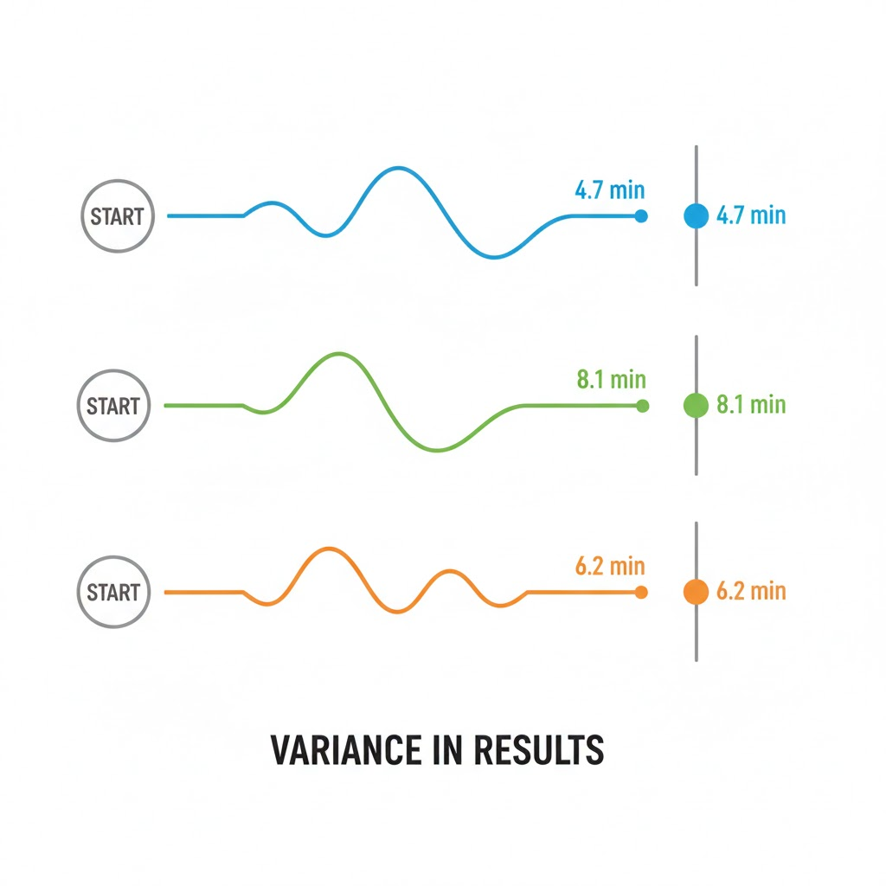

<!-- In diesem Kapitel werden die Grundlagen von diskreten dynamischen Modellen sowie deren Simulation und Implementierung behandelt. -->


# Kapitel 5: Diskrete Dynamische Modelle

Dieses Kapitel umfasst die folgenden Abschnitte:

- 5.1: Grundlagen und Konzepte
- 5.2: Modellierung eines Warteschlangensystems
- 5.3: Simulationsalgorithmus
- 5.4: Implementierung in C#
- 5.5: Analyse und Visualisierung
- 5.6: Probabilistische Modelle und Monte-Carlo-Simulation

---

<!-- Übersicht über die Grundlagen und Konzepte von diskreten dynamischen Modellen. -->

## 5.1: Grundlagen und Konzepte

Dieser Abschnitt umfasst die folgenden Inhalte:

- **Definition** diskreter dynamischer Modelle
- **Abgrenzung** zu kontinuierlichen Modellen
- **Typische Anwendungsbeispiele** wie Warteschlangensysteme

---

<!-- Dieser Abschnitt führt in die grundlegenden Konzepte von diskreten dynamischen Systemen ein und grenzt sie von kontinuierlichen Systemen ab. -->

<div class="columns">
<div class="two">

### Grundlagen und Konzepte

Diskrete dynamische Modelle beschreiben Systeme, deren Zustand sich nur zu diskreten Zeitpunkten ändert. Diese Zustandsänderungen werden durch **Ereignisse** ausgelöst.

Im Gegensatz zu kontinuierlichen Modellen, bei denen der Zustand sich stetig über die Zeit ändert, springt der Zustand bei diskreten Modellen von einem Wert zum nächsten.

Typische Anwendungsbeispiele sind:
- **Warteschlangensysteme** (z.B. Supermarktkassen, Callcenter)
- **Produktions- und Logistiksysteme**
- **Computernetzwerke**

</div>
<div>


</div>
</div>

---

<div class="columns">
<div class="two">

### Anwendungsbeispiel: Warteschlangensysteme

Systeme, in denen "Kunden" auf eine oder mehrere "Bedienstationen" warten.

**Typische Fragestellungen:**
- Wie viele Schalter/Kassen werden benötigt, um eine maximale Wartezeit nicht zu überschreiten?
- Wie lang ist die durchschnittliche und maximale Wartezeit?
- Wie hoch ist die durchschnittliche und maximale Auslastung der Schalter?
- Wie wirkt sich eine Änderung der Ankunftsrate der Kunden aus?

</div>
<div>



</div>
</div>

---

<div class="columns">
<div class="five">

### Anwendungsbeispiel: Produktions- & Logistiksysteme

Systeme, die den Fluss von Material, Teilen und Produkten durch eine Reihe von Prozessen (z.B. Maschinen, Lager, Transport) modellieren.

**Typische Fragestellungen:**
- Was ist der maximale Durchsatz der Produktionslinie?
- Wo befinden sich Engpässe (Bottlenecks) im System?
- Wie groß müssen Pufferlager dimensioniert werden?
- Wie wirkt sich der Ausfall einer Maschine auf die Gesamtleistung aus?

</div>
<div>



</div>
</div>

---

<div class="columns">
<div class="three">

### Anwendungsbeispiel: Computernetzwerke

Systeme zur Übertragung von Datenpaketen zwischen verschiedenen Knoten (z.B. Clients, Server, Router).

**Typische Fragestellungen:**
- Wie hoch ist die durchschnittliche Netzwerkauslastung?
- Wie groß sind die Latenzzeiten (Verzögerungen) für Datenpakete?
- Was ist der maximale Datendurchsatz zwischen zwei Punkten?
- Wie robust ist das Netzwerk gegen den Ausfall von Verbindungen oder Knoten?

</div>
<div>


</div>
</div>

---

### Allgemeiner Formalismus (1/2)

Ein diskretes Simulationsmodell besteht aus folgenden Komponenten:

- **Systemzustand $\vec{z}(t)$:** Eine Menge von Zustandsvariablen, die das System beschreiben (z.B. `Queue.Count`, `Server.Busy`). Der Zustand ändert sich nur zu diskreten Zeitpunkten.
- **Ereignisse $e$:** Vorkommnisse, die den Systemzustand sprunghaft ändern (z.B. `Ankunft`, `Bedienende`).
- **Simulationsuhr $t$:** Verfolgt den Fortschritt der Simulationszeit. Sie springt von Ereignis zu Ereignis.
- **Ereignisliste $L$:** Eine nach Zeit geordnete Liste zukünftiger Ereignisse. $L = [(e_1, t_1), (e_2, t_2), ...]$ mit $t_1 \le t_2 \le ...$

---

### Allgemeiner Formalismus (2/2)

Für jedes Ereignis $e_i$ gibt es eine **Ereignisroutine**, die beim Eintreten des Ereignisses ausgeführt wird und zwei Hauptaufgaben hat:

1.  **Zustandsänderung:** Aktualisierung des Systemzustands $\vec{z}(t)$ basierend auf dem alten Zustand und dem aktuellen Ereignis.
    -   $\vec{z}(t_{neu}) \leftarrow f(\vec{z}(t_{alt}), e_i)$

2.  **Ereignisplanung:** Generierung einer Menge neuer zukünftiger Ereignisse $E_{neu}$ und Aktualisierung der Ereignisliste $L$.
    -   $E_{neu} = g(\vec{z}(t_{alt}), e_i)$
    -   $L_{neu} = (L_{alt} \setminus \{(e_i, t_i)\}) \cup E_{neu}$
    - Die Liste $L_{neu}$ muss nach Zeitstempeln sortiert bleiben.

---

<!-- Übersicht über die Modellierung eines Warteschlangensystems. -->

## 5.2: Modellierung eines Warteschlangensystems

Dieser Abschnitt umfasst die folgenden Inhalte:

- **Modellierung** eines einfachen Warteschlangensystems
- Definition des **Systemzustands** (`State`)
- Definition der **Ereignisse** (`Events`)
- Abbildung von Zustand und Ereignissen in **C#-Klassen**

---

<div class="columns">
<div class="two">

### Mathematische Beschreibung

Anwendung des Formalismus auf das Warteschlangensystem:

- **Systemzustand $\vec{z}(t)$:**
  - $N(t)$: Anzahl der Kunden im System (in Schlange + in Bedienung).
  - $B(t)$: Zustand der Bedienstation (0 = frei, 1 = besetzt).
  - $\vec{z}(t) = (N(t), B(t))$

- **Ereignisse $e$:**
  - $e_A$: Ankunft eines Kunden (Arrival).
  - $e_D$: Ende der Bedienung eines Kunden (Departure).

</div>
<div>




</div>
</div>

---

<div class="columns">
<div>

### Ereignisroutine für **Ankunft**

Wenn ein Kunde ankommt, wird geprüft, ob die Bedienstation frei ist.

- **Station besetzt:** Der Kunde wird in die Warteschlange eingereiht.
- **Station frei:** Die Station wird besetzt und ein `DepartureEvent` für die Zukunft geplant, das das Ende der Bedienung markiert.

</div>
<div>

<!--
Eine minimalistische Vektorgrafik im Flat-Design-Stil, die das "Arrival"-Ereignis in einem Warteschlangensystem darstellt.

**Inhalt:**
Eine stilisierte Person (Kunde) schiebt einen Einkaufswagen auf eine Supermarktkasse zu. Die Kasse ist besetzt, und eine weitere Person (Kassierer) bedient gerade einen anderen Kunden. Hinter dem ankommenden Kunden bildet sich eine kleine Schlange aus weiteren stilisierten Personen. Die Szene fängt den Moment der Ankunft und das Einreihen in die Warteschlange ein.

**Stil:**
- **Farbpalette:** Begrenzt auf kühle Töne wie Blau und Grau, mit einem warmen Akzent (z.B. Gelb) für den ankommenden Kunden, um ihn hervorzuheben.
- **Formen:** Einfache geometrische Formen, klare Linien, keine überflüssigen Details.
- **Komposition:** Der Fokus liegt auf der Bewegung des ankommenden Kunden in Richtung der bereits bestehenden Schlange. Der Hintergrund ist abstrakt und neutral.
- **Atmosphäre:** Sauber, modern und informativ.
-->


</div>
</div>

---

### **Formalisierung** der Ereignisroutine für Ankunft $e_A$ zum Zeitpunkt $t$

1.  **Zustandsänderung $f(\vec{z}(t_{alt}), e_A)$:**
    - $N(t_{neu}) = N(t_{alt}) + 1$.
    - Wenn $B(t_{alt}) = 0$ (frei) dann $B(t_{neu}) \leftarrow 1$ sonst $B(t_{neu}) = 0$.
2.  **Ereignisplanung $g(\vec{z}(t), e_A)$:**
    - \{(e_A, t + \text{Zwischenankunftszeit})\} \cup ($ wenn $B(t)=0$ dann \{(e_D, t + \text{Bedienzeit})\} sonst $\emptyset$)



---

<div class="columns">
<div>

### Ereignisroutine für **Abfahrt**

Wenn ein Kunde fertig bedient ist, wird geprüft, ob weitere Kunden warten.

- **Schlange leer:** Die Station wird freigegeben.
- **Schlange nicht leer:** Der nächste Kunde wird aus der Schlange geholt und ein neues `DepartureEvent` für dessen Bedienende geplant.

</div>
<div>

<!--
Eine minimalistische Vektorgrafik im Flat-Design-Stil, die das "Departure"-Ereignis in einem Warteschlangensystem darstellt.

**Inhalt:**
Eine stilisierte Person (Kunde) verlässt mit einer Einkaufstasche die Supermarktkasse. Die Kasse ist nun frei, und der Kassierer wendet sich dem nächsten Kunden in der Warteschlange zu, der gerade vortritt. Die Warteschlange ist sichtbar kürzer als zuvor. Die Szene fängt den Moment des Abschlusses und des Übergangs zum nächsten Kunden ein.

**Stil:**
- **Farbpalette:** Begrenzt auf kühle Töne wie Blau und Grau, mit einem positiven Akzent (z.B. Grün) für den abfahrenden Kunden oder die freie Kasse, um den erfolgreichen Abschluss zu signalisieren.
- **Formen:** Einfache geometrische Formen, klare Linien, keine überflüssigen Details.
- **Komposition:** Der Fokus liegt auf dem verlassenden Kunden und der nun freien Kasse, die bereit für den nächsten Vorgang ist. Der Hintergrund ist abstrakt und neutral.
- **Atmosphäre:** Effizient, fließend und geordnet.
-->


</div>
</div>

---

### **Formalisierung** der Ereignisroutine für Abfahrt $e_D$ zum Zeitpunkt $t$

1.  **Zustandsänderung $f(\vec{z}(t_{alt}), e_D)$:**
    - $N(t_{neu}) = N(t_{alt}) - 1$.
    - Wenn $N(t_{alt}) = 0$ (keine Kunden mehr) dann $B(t_{neu}) \leftarrow 0$ sonst $B(t_{neu}) = 1$.
2.  **Ereignisplanung $g(\vec{z}(t), e_D)$:**
    - wenn $N(t)>0$ dann \{(e_D, t + \text{Bedienzeit})\} sonst $\emptyset$



---

<!-- Übersicht über den Simulationsalgorithmus für diskrete Systeme. -->

## 5.3: Simulationsalgorithmus

Dieser Abschnitt umfasst die folgenden Inhalte:

- Vorstellung des **"Next-Event Time Advance"**-Algorithmus
- Die drei zentralen Schritte: **Initialisierung, Ereignisauswahl, Ereignisbehandlung**
- Bedeutung der **Simulationsuhr** und der **Ereignisliste**

---

<!-- Dieser Abschnitt erläutert den "Next-Event Time Advance"-Algorithmus, der die Grundlage für die Simulation von diskreten Systemen bildet. -->

### Simulationsalgorithmus

1.  **Initialisierung:** Startzustand und initiale Ereignisse festlegen.
2.  **Schleife:** Solange es zukünftige Ereignisse gibt:
    a.  **Ereignis auswählen:** Das Ereignis mit dem frühesten Zeitstempel aus der Ereignisliste (Event Queue) entnehmen.
    b.  **Uhr vorstellen:** Die Simulationsuhr auf den Zeitstempel dieses Ereignisses setzen.
    c.  **Ereignis behandeln:** Die Zustandsänderungen für das Ereignis durchführen und ggf. neue Ereignisse generieren und in die Ereignisliste einfügen.



---

<div class="columns">
<div>

### Konkretes Beispiel: Simulationsablauf

Annahmen für das Beispiel:
- **Kunde 1:** Ankunft bei t=1, Bedienzeit=3
- **Kunde 2:** Ankunft bei t=2, Bedienzeit=2
- **Kunde 3:** Ankunft bei t=5, Bedienzeit=3

**Initialisierung:**
- `Clock = 0`
- `State = { Busy: false, Queue: [] }`
- `EventQueue = [ (Arrival, t=1), (Arrival, t=2), (Arrival, t=5) ]`

</div>
<div>


</div>
</div>

---

### Tabellarischer Ablauf

Die folgende Tabelle zeigt die Werte der `Clock`, des `State` und der `EventQueue` während der Simulationsrechnung:

| Clock | Event | State (Busy, Queue) | Event Queue | Anmerkung |
| :--- | :--- | :--- | :--- | :--- |
| 0 | Init | `(false, 0)` | `[(A,1), (A,2), (A,5)]` |
| 1 | Arrival | `(true, 0)` | `[(A,2), (D,4), (A,5)]` | K1 kommt an und wird bedient |
| 2 | Arrival | `(true, 1)` | `[(D,4), (A,5)]` | K2 kommt an und wartet |
| 4 | Departure | `(true, 0)` | `[(A,5), (D,6)]` | K1 ist fertig, K2 wird bedient |
| 5 | Arrival | `(true, 1)` | `[(D,6)]` | K3 kommt an und wartet |
| 6 | Departure | `(true, 0)` | `[(D,9)]` | K2 ist fertig, K3 wird bedient |
| 9 | Departure | `(false, 0)` | `[]` | K3 ist fertig |

---

<!-- Übersicht über die Implementierung des Simulationsmodells in C#. -->

## 5.4: Implementierung in C#

Dieser Abschnitt umfasst die folgenden Inhalte:

- Implementierung der **Simulationsschleife**
- Verwendung einer **`PriorityQueue`** für die Ereignisliste
- Logik zur Behandlung von **Ankunftsereignissen** (`ArrivalEvent`)
- Logik zur Behandlung von **Abfahrtsereignissen** (`DepartureEvent`)


---

<!-- In diesem Abschnitt wird das Beispiel eines einfachen Warteschlangensystems (Single-Server Queue) modelliert. -->

<div class="columns">
<div class="two">

### Modellierung eines Warteschlangensystems

Wir betrachten ein einfaches System mit einer einzigen Bedienstation (Server) und einer Warteschlange.

**Systemzustand (State):**
- Ist die Bedienstation besetzt? (`bool Busy`)
- Wie viele Kunden warten in der Schlange? (`Queue<double>`)

**Ereignisse (Events):**
- Ankunft eines Kunden (`ArrivalEvent`)
- Ende der Bedienung (`DepartureEvent`)

</div>
<div>



</div>
</div>

---

### Systemzustand (State)

Der Zustand des Systems wird durch eine Klasse abgebildet, die alle relevanten Zustandsgrößen enthält. Für unser Warteschlangensystem sind das die Belegung der Station und die Warteschlange selbst.

```csharp
namespace DynamischWarteschlange.Model
{
    // Zustand des Systems zu einem gegebenen Zeitpunkt
    internal class State
    {
        // Belegung der Kasse bzw. der Maschine
        public bool Busy { get; set; } = false;

        // Warteschlange vor der Kasse bzw. der Maschine
        public Queue<double> Queue { get; } = new Queue<double>();
    }
}
```

---

### Ereignisse (Events)

Ereignisse repräsentieren die Zeitpunkte, an denen sich der Systemzustand ändern kann. Wir definieren eine Basisklasse `Event` mit einem Zeitstempel und leiten davon spezifische Ereignistypen ab.

```csharp
namespace DynamischWarteschlange.Model
{
    // Basisklasse für alle Arten von Ereignissen
    internal abstract class Event
    {
        public double Timestamp { get; set; }

        public Event(double timestamp)
        {
            Timestamp = timestamp;
        }
    }
    // Ankunft eines Kunden
    internal class ArrivalEvent : Event { ... }
    // Abfahrt eines Kunden
    internal class DepartureEvent : Event { ... }
}
```

---

<!-- In diesem Abschnitt wird die C#-Implementierung des Simulationsalgorithmus und der Ereignisbehandlung gezeigt. -->

<div class="columns">
<div class="three">

### Implementierung in C#

Die `Simulation`-Klasse steuert den Ablauf und enthält die Simulationsuhr (`Clock`), den Systemzustand (`State`) und die Ereignisliste (`EventQueue`).

Die `Run()`-Methode implementiert die Haupt-Simulationsschleife. Sie verarbeitet Ereignisse aus der `PriorityQueue`, bis diese leer ist. Die `PriorityQueue` stellt sicher, dass immer das Ereignis mit dem kleinsten Zeitstempel als nächstes behandelt wird.

</div>
<div class="three">

```csharp
internal class Simulation
{
    public double Clock { get; set; } = 0;
    public State State { get; set; } = new State();
    private PriorityQueue<Event, double> EventQueue { get; }

    public void Run()
    {
        while (EventQueue.Count > 0)
        {
            Event next = EventQueue.Dequeue();
            Clock = next.Timestamp;

            if (next is ArrivalEvent)
            {
                // ...
            }
            else if (next is DepartureEvent)
            {
                // ...
            }
        }
    }
}
```

</div>
</div>

---

### Behandlung eines Ankunftsereignisses (`ArrivalEvent`)

Wenn ein Kunde ankommt, gibt es zwei Möglichkeiten:

<div class="columns">
<div class="three">

**1. Station ist besetzt:**
Der Kunde wird in die Warteschlange (`State.Queue`) eingereiht.

**2. Station ist frei:**
Der Kunde wird sofort bedient.
- Der Zustand `State.Busy` wird auf `true` gesetzt.
- Eine Bedienzeit wird (zufällig) bestimmt.
- Ein neues `DepartureEvent` wird generiert und zum Zeitpunkt `Clock + Bedienzeit` in die `EventQueue` eingefügt.

</div>
<div class="three">

```csharp
if (next is ArrivalEvent)
{
    if (State.Busy)
    {
        State.Queue.Enqueue(Clock);
    }
    else
    {
        State.Busy = true;
        var serviceTime = Random.NextDouble() * 5 * 60;
        Add(new DepartureEvent(Clock + serviceTime));
    }
}
```

</div>
</div>

---

### Behandlung eines Abfahrtsereignisses (`DepartureEvent`)

Wenn ein Kunde die Station verlässt, gibt es zwei Möglichkeiten:

<div class="columns">
<div class="three">

**1. Warteschlange ist leer:**
Die Station wird frei.
- Der Zustand `State.Busy` wird auf `false` gesetzt.

**2. Warteschlange ist nicht leer:**
Der nächste Kunde wird aus der Schlange geholt und bedient.
- Eine neue Bedienzeit wird bestimmt.
- Ein neues `DepartureEvent` für diesen Kunden wird zum Zeitpunkt `Clock + Bedienzeit` in die `EventQueue` eingefügt.

</div>
<div class="three">

```csharp
else if (next is DepartureEvent)
{
    if (State.Queue.Count == 0)
    {
        State.Busy = false;
    }
    else
    {
        var arrivalTime = State.Queue.Dequeue();
        var waitTime = Clock - arrivalTime;
        // ...
        var serviceTime = Random.NextDouble() * 5 * 60;
        Add(new DepartureEvent(Clock + serviceTime));
    }
}
```

</div>
</div>

---

<!-- Übersicht über die Analyse und Visualisierung der Simulationsergebnisse. -->

## 5.5: Analyse und Visualisierung

Dieser Abschnitt umfasst die folgenden Inhalte:

- **Sammeln von Daten** während der Simulation (z.B. Warteschlangenlänge)
- **Speicherung** der Daten in Listen für die spätere Auswertung
- **Visualisierung** der Ergebnisse als Verlaufsdiagramme und Histogramme mittels `ScottPlot`

---

<!-- Dieser Abschnitt zeigt, wie die während der Simulation gesammelten Daten mit ScottPlot visualisiert werden können. -->


### Analyse und Visualisierung

Während der Simulation werden Daten wie die Belegung der Station, die Länge der Warteschlange und die Wartezeiten der Kunden gesammelt.

```csharp
// Listen für die Visualisierung
public List<double> ChartTime = new List<double>();
public List<bool> ChartBusy = new List<bool>();
public List<int> ChartLength = new List<int>();
public List<double> WaitTime = new List<double>();
```

Nach dem Simulationslauf werden diese Daten verwendet, um Verläufe und Histogramme zu erstellen, z.B. mit der Bibliothek `ScottPlot`.

---

<div class="columns">
<div class="two">

### Visualisierung mit ScottPlot

`ScottPlot` ist eine freie und quelloffene Bibliothek für .NET zur Erstellung von Diagrammen.

- **Einfache API:** Erlaubt das schnelle Erstellen von Diagrammen mit wenigen Codezeilen.
- **Performant:** Optimiert für die interaktive Darstellung großer Datenmengen.
- **Vielseitig:** Unterstützt eine Vielzahl von Diagrammtypen wie Linien-, Streu-, Balkendiagramme und Histogramme.
- **Interaktiv:** Diagramme in WPF- und WinForms-Anwendungen sind standardmäßig interaktiv (zoomen, verschieben).

Ideal für die schnelle Visualisierung von Simulationsergebnissen.

</div>
<div>


</div>
</div>

---

<div class="columns">
<div class="three">

### ScottPlot API: **Grundlagen**

Die zentrale Klasse in ScottPlot ist `ScottPlot.Plot`. Eine Instanz davon repräsentiert ein Diagramm.

**Typischer Workflow:**
1.  **Plot-Objekt erhalten:** Entweder über ein `FormsPlot` (WinForms) oder `WpfPlot` (WPF) Control oder direkt `new Plot()`.
2.  **Daten hinzufügen:** Mit Methoden wie `Plot.Add.Scatter()`, `Plot.Add.Line()`, `Plot.Add.Bar()`.
3.  **Diagramm konfigurieren:** Achsenbeschriftungen (`Plot.XLabel()`, `Plot.YLabel()`), Titel (`Plot.Title()`), Legende (`Plot.Legend.IsVisible = true`).
4.  **Rendern/Aktualisieren:** Das Diagramm neu zeichnen lassen (z.B. `WpfPlot.Plot.Render()`)

</div>
<div>

```csharp
// Ein Plot-Objekt erhalten
var myPlot = WpfPlotControl.Plot;

// Daten hinzufügen
myPlot.Add.Scatter(xs, ys);

// Achsen beschriften
myPlot.XLabel("Zeit [s]");
myPlot.YLabel("Wert");

// Diagramm aktualisieren
WpfPlotControl.Refresh();
```

</div>
</div>

---

### ScottPlot API: **Linien- und Streudiagramme**

```csharp
// Daten für X- und Y-Achse
double[] xs = { 1, 2, 3, 4, 5 };
double[] ys1 = { 10, 12, 15, 13, 18 };
double[] ys2 = { 8, 11, 13, 16, 14 };

// Linien- und Streudiagramm hinzufügen
var scatter1 = myPlot.Add.Scatter(xs, ys1);
scatter1.Label = "Messreihe 1";
scatter1.Color = ScottPlot.Colors.Blue;
scatter1.MarkerSize = 5; // Punkte anzeigen

var scatter2 = myPlot.Add.Scatter(xs, ys2);
scatter2.Label = "Messreihe 2";
scatter2.Color = ScottPlot.Colors.Red;
scatter2.LineStyle = ScottPlot.LineStyle.Dash; // Gestrichelte Linie

// Legende anzeigen
myPlot.Legend.IsVisible = true;

// Achsen automatisch anpassen
myPlot.Axes.AutoScale();
```

---

### ScottPlot API: **Histogramme**

```csharp
// Beispiel: Wartezeiten aus einer Simulation
double[] waitTimes = { 1.2, 2.5, 1.8, 3.1, 2.0, 1.5, 2.8, 3.5, 2.2, 1.9 };

// Histogramm-Daten berechnen
// bins: Anzahl der Intervalle
var hist = new ScottPlot.Statistics.Histogram(waitTimes, min: 0, max: 5, binCount: 10);

// Histogramm zum Plot hinzufügen
var bar = myPlot.Add.Bar(hist.Counts, hist.BinCenters);
bar.Label = "Verteilung der Wartezeiten";
bar.FillColor = ScottPlot.Colors.Green.WithAlpha(0.7);
bar.BorderColor = ScottPlot.Colors.Green;

// Achsen beschriften
myPlot.XLabel("Wartezeit [min]");
myPlot.YLabel("Häufigkeit");

// Achsen automatisch anpassen
myPlot.Axes.AutoScale();
```

---

<!-- Übersicht über probabilistische Modelle und Monte-Carlo-Simulation. -->

## 5.6: Probabilistische Modelle und Monte-Carlo-Simulation

Dieser Abschnitt umfasst die folgenden Inhalte:

- **Abgrenzung** deterministischer und probabilistischer Modelle
- **Erweiterung des Formalismus** um Zufallsvariablen
- **Grundprinzip** der Monte-Carlo-Simulation zur statistischen Auswertung

---

<!-- Dieser Abschnitt grenzt deterministische von probabilistischen (stochastischen) Modellen ab. -->

<div class="columns">
<div class="two">

### Probabilistische vs. Deterministische Modelle

Bisher waren unsere Modelle **deterministisch**: Bei gleichem Input kommt immer der gleiche Output heraus.

Reale Systeme beinhalten jedoch oft **Zufallsprozesse**:
- Kundenankünfte sind unregelmäßig.
- Bedienzeiten oder Prozessdauern variieren.

Diese Zufälligkeiten werden durch **Wahrscheinlichkeitsverteilungen** (z.B. Exponential-, Normalverteilung) modelliert. Das Modell wird **probabilistisch** (oder stochastisch). 

Das Ergebnis einer einzelnen Simulation ist damit selbst eine **Zufallsvariable**.

</div>
<div>

<!--
Eine minimalistische Vektorgrafik, die einen deterministischen und einen probabilistischen Prozess vergleicht.

**Inhalt:**
Links zeigt ein einzelner, gerader Pfeil von einem Startpunkt A zu einem Endpunkt B, beschriftet mit "Deterministisch". Rechts zweigen von einem Startpunkt A mehrere gewellte, unvorhersehbare Pfeile in eine Cloud von möglichen Endpunkten ab, beschriftet mit "Probabilistisch".

**Stil:**
- **Farbpalette:** Blau- und Grautöne. Der deterministische Pfad ist dunkel und solide, die probabilistischen Pfade sind heller und transparenter.
- **Formen:** Klare, einfache Formen.
- **Atmosphäre:** Informativ, konzeptionell.
-->


</div>
</div>

---

### Erweiterter Formalismus mit Zufallsvariablen

Die Zufälligkeit fließt in die **Ereignisplanung** ein. Die Funktion $g$ hängt nun zusätzlich von einer Zufallszahl (oder einem Zufallsvektor) $\omega$ ab.

-   $E_{neu} = g(\vec{z}(t_{alt}), e_i, \omega_i)$

Im Warteschlangen-Beispiel werden Zwischenankunfts- und Bedienzeiten aus Verteilungen gezogen:
-   **Zwischenankunftszeit** $\sim \text{Exponential}(\lambda)$
-   **Bedienzeit** $\sim \text{Normal}(\mu, \sigma^2)$

```csharp
// Bedienzeit aus einer Normalverteilung mit µ=3min, σ=30s
var serviceTime = NextNormal(mean: 3 * 60, stdDev: 0.5 * 60);
Add(new DepartureEvent(Clock + serviceTime));

// Nächste Ankunft mit Exponentialverteilung (mittlere Ankunftsrate: 1 Kunde alle 2min)
var interarrivalTime = NextExponential(lambda: 1.0 / (2 * 60));
Add(new ArrivalEvent(Clock + interarrivalTime));
```

---

<div class="columns">
<div>

### Das Problem mit der Einzelsimulation

Ein einzelner Simulationslauf (eine **Replikation**) ist nur *ein möglicher* Systemverlauf ("Sample Path").

Das Ergebnis (z.B. mittlere Wartezeit = 4.7 min) ist nicht repräsentativ für das allgemeine Systemverhalten. Bei einem erneuten Lauf mit anderen Zufallszahlen könnte das Ergebnis 8.1 min sein.

**Ziel:** Wir wollen nicht das Ergebnis eines einzelnen Laufs, sondern **statistische Kennzahlen** über viele mögliche Verläufe hinweg (z.B. den Erwartungswert der mittleren Wartezeit).

</div>
<div>

<!--
Eine minimalistische Vektorgrafik, die das Problem der Einzelsimulation illustriert.

**Inhalt:**
Drei separate Diagramme untereinander, die jeweils einen Simulationslauf ("Replikation") darstellen. Jeder Lauf startet am selben Punkt (links), folgt aber einem anderen, zufälligen Pfad (dargestellt als gewellte Linie). Jeder Pfad endet bei einem anderen Ergebniswert auf einer Skala (rechts), z.B. "4.7 min", "8.1 min", "6.2 min". Dies verdeutlicht, dass das Ergebnis einer einzelnen Simulation stark variieren kann.

**Stil:**
- **Farbpalette:** Jeder Pfad hat eine andere Farbe (z.B. Blau, Grün, Orange), um die Eigenständigkeit zu betonen.
- **Formen:** Einfache, klare Linien und Formen.
- **Komposition:** Der Fokus liegt auf der Varianz der Endergebnisse.
- **Atmosphäre:** Informativ, die Unsicherheit stochastischer Ergebnisse betonend.
-->



</div>
</div>

---

<!-- Dieser Abschnitt erklärt das Grundprinzip der Monte-Carlo-Simulation. -->

### Monte-Carlo-Simulation

Die **Monte-Carlo-Methode** ist ein numerisches Verfahren, um statistische Eigenschaften eines Systems durch wiederholte Simulation zu schätzen.

**Grundprinzip:**
1.  Führe die Simulation sehr oft durch ($N$ **Replikationen**).
2.  Jede Replikation muss mit **unabhängigen Zufallszahlen** laufen (d.h. anderer Startwert / "Seed" für den Zufallszahlengenerator).
3.  Sammle die Ergebnis-Kennzahl (z.B. mittlere Wartezeit) aus jeder einzelnen Replikation.
4.  Werte die gesammelten Ergebnisse statistisch aus (z.B. Mittelwert, Varianz, Konfidenzintervall).

Nach dem **Gesetz der großen Zahlen** nähert sich der Mittelwert der Ergebnisse mit steigendem $N$ dem wahren Erwartungswert der Kennzahl an.

---

<div class="columns">
<div class="two">

### Monte-Carlo-Algorithmus

</div>
<div>


</div>
</div>

```csharp
var results = new List<double>();
int numberOfReplications = 1000;

for (int i = 0; i < numberOfReplications; i++)
{
    // Wichtig: Jede Replikation braucht einen anderen Seed!
    var simulation = new Simulation(seed: i); 
    simulation.Run();
    // Sammle die relevante Kenngröße aus dem Simulationslauf
    if (simulation.WaitTimes.Any())
    {
        var averageWaitTime = simulation.WaitTimes.Average();
        results.Add(averageWaitTime);
    }
}

// Werte die Ergebnisse aller Replikationen statistisch aus
var overallMeanWaitTime = results.Average();
var variance = results.Sum(d => Math.Pow(d - overallMeanWaitTime, 2)) / (results.Count - 1);
var stdDev = Math.Sqrt(variance);
```

---

### **Parallelisierung** der Berechnung

```csharp
// Threadsichere Sammlung für die Ergebnisse
var results = new ConcurrentBag<double>();
int numberOfReplications = 10000;

Parallel.For(0, numberOfReplications, i =>
{
    // Wichtig: Jeder Thread braucht eine eigene Random-Instanz,
    // initialisiert mit einem eindeutigen Seed.
    var threadLocalRandom = new Random(i);

    // Simulation mit der thread-lokalen Random-Instanz durchführen
    var simulation = new Simulation(random: threadLocalRandom); 
    simulation.Run();
    
    if (simulation.WaitTimes.Any())
    {
        var averageWaitTime = simulation.WaitTimes.Average();
        results.Add(averageWaitTime);
    }
});
```