<!-- _paginate: false -->
<!-- _header: "" -->
<!-- _footer: "" -->


# Kapitel 5: 3D-Visualisierung mit OpenGL

Dieses Kapitel umfasst die folgenden Abschnitte:

- 5.1: Grundlagen der 3D-Visualisierung mit OpenGL
- 5.2: Strukturierung mit einem Szenengraphen
- 5.3: Mechatronische Anwendung: Kinematische Ketten & Robotik
- 5.4: Interaktive Kameraführung

---

## 5.1: Grundlagen der 3D-Visualisierung mit OpenGL

Dieser Abschnitt umfasst die folgenden Inhalte:

- Grundkonzepte von OpenGL (Zustandsmaschine, Grafik-Pipeline)
- Verwendung von Buffern (Color, Depth)
- Koordinatensysteme und Transformationen (Projection, ModelView)
- Projektionsarten (glOrtho vs. gluPerspective, Clipping-Ebenen)
- Zeichnen von Primitiven und Beleuchtung

---

<div class="columns">
<div>

### Was ist OpenGL?

- **Open Graphics Library**
- Eine plattform- und programmiersprachenübergreifende **API** zur Erzeugung von 2D- und 3D-Computergrafik.
- Es ist ein **Standard**, der von Grafikkartenherstellern implementiert wird.
- Es bietet eine Schnittstelle, um der **GPU (Graphics Processing Unit)** Befehle zum Zeichnen zu geben.
- Wir betrachten hier "klassisches" (fixed-function) OpenGL, wie es in `SharpGL` oft für einfache Darstellungen genutzt wird.

</div>
<div>


</div>
</div>

---

### Einbindung mit SharpGL

Die `SharpGL.WPF`-Bibliothek stellt ein `OpenGLControl` für die einfache Integration von OpenGL-Funktionalität in WPF-Anwendungen bereit.

- Es ist ein WPF-`Control`, das eine Zeichenfläche für OpenGL bzw. die Grafikkarte (z.B. Nvidia) zur Verfügung stellt.
- Es stellt zwei zentrale Ereignisse für die Initialisierung und das Zeichnen bereit: `OpenGLInitialized` und `OpenGLDraw`.

Und so wird das `OpenGLControl`-Steuerelement in ein WPF-Fenster eingebunden (beachte den XML-Namensraum `xmlns:sharpGL`):

```xml
<Window xmlns:sharpGL="clr-namespace:SharpGL.WPF;assembly=SharpGL.WPF">
    <Grid>
        <sharpGL:OpenGLControl  OpenGLInitialized="OnInitialize" OpenGLDraw="OnDraw"/>
    </Grid>
</Window>
```

---

### Initialisierung der Szene: `OpenGLInitialized`

Die `OpenGLInitialized`-Ereignisroutine wird **einmalig** aufgerufen, wenn der OpenGL-Kontext bereit ist. Hier werden alle globalen Zustände gesetzt.

```csharp
private void OnInitialize(object sender, OpenGLRoutedEventArgs args)
{
    OpenGL gl = args.OpenGL;

    // 1. Hintergrundfarbe festlegen (Clear Color)
    
    // 2. Beleuchtung und Materialeigenschaften aktivieren
    
    // 3. Globales Umgebungslicht definieren
    
    // 4. Punktlichtquellen aktivieren und definieren
    
    // 5. Schattierungsmodus für weiche Farbübergänge
    
    // 6. Tiefentest für korrekte Verdeckungen aktivieren
}
```

---

<div class="columns">
<div>

### Hintergrundfarbe festlegen

Die `ClearColor`-Methode definiert die Farbe, mit der der Bildschirm bei jedem Frame geleert wird.

- Die Parameter sind die RGBA-Werte als `float` zwischen 0.0 und 1.0.
- Bei der Farbe *Schwarz* sind alle Werte auf Null gesetzt.
- Bei der Farbe *Weiß* sind hingegen alle Werte auf Eins gesetzt.

```csharp
// In der OnInitialize-Routine

// Setzt die Hintergrundfarbe auf ein Dunkelblau
gl.ClearColor(0.1f, 0.2f, 0.3f, 1.0f);
```

</div>
<div>

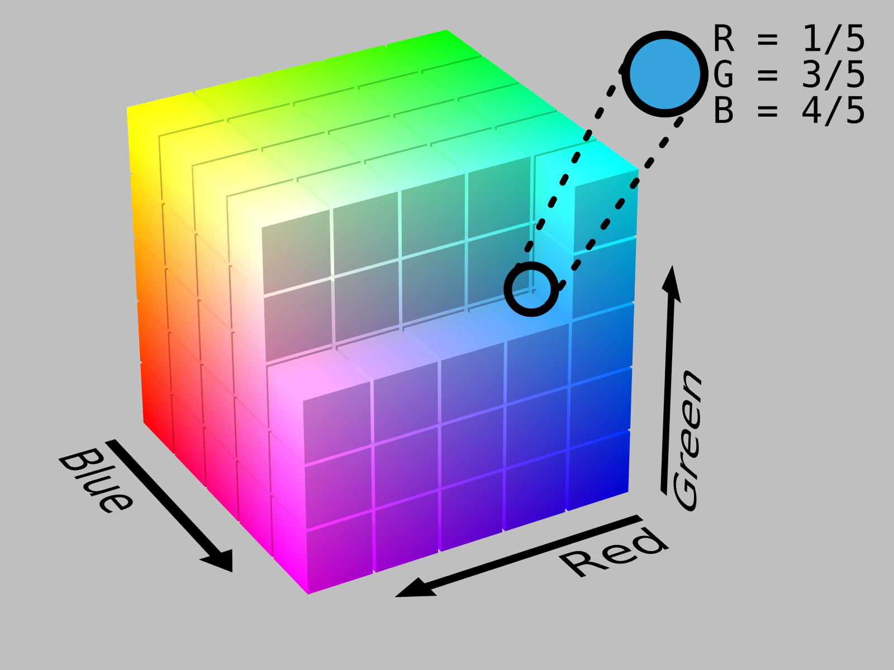

</div>
</div>

---

<div class="columns">
<div>

### Beleuchtung & Material aktivieren

Damit Objekte auf Licht reagieren, muss die Lichtberechnung zunächst global aktiviert werden:

- `GL_LIGHTING`: Schaltet das gesamte Beleuchtungssystem ein.
- Ohne dies sind alle Objekte nur in ihrer Grundfarbe sichtbar.
- Die Beleuchtung verursacht die Schattierung der Oberflächen.

```csharp
// In der OnInitialize-Routine

// Aktiviert das Beleuchtungssystem
gl.Enable(OpenGL.GL_LIGHTING);
```

</div>
<div>

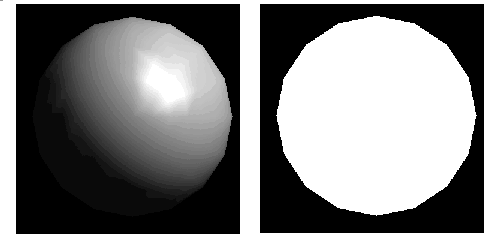

</div>
</div>

---

<div class="columns">
<div>

### Das Phong-Beleuchtungsmodell

Die Farbe eines Punktes auf einer Oberfläche wird als Summe von drei Komponenten berechnet:

$I_{f} = I_{a} + I_{d} + I_{s}$

- **Ambient**: Konstante Grundhelligkeit, simuliert indirektes Licht.
- **Diffuse**: Helligkeit basierend auf dem Winkel des Lichteinfalls, simuliert matte Oberflächen.
- **Specular**: Glanzlicht, das von der Kameraposi-tion abhängt, simuliert glänzende Oberflächen.

Jede dieser Komponenten wird für jede Lichtquelle berechnet und aufsummiert.

</div>
<div>

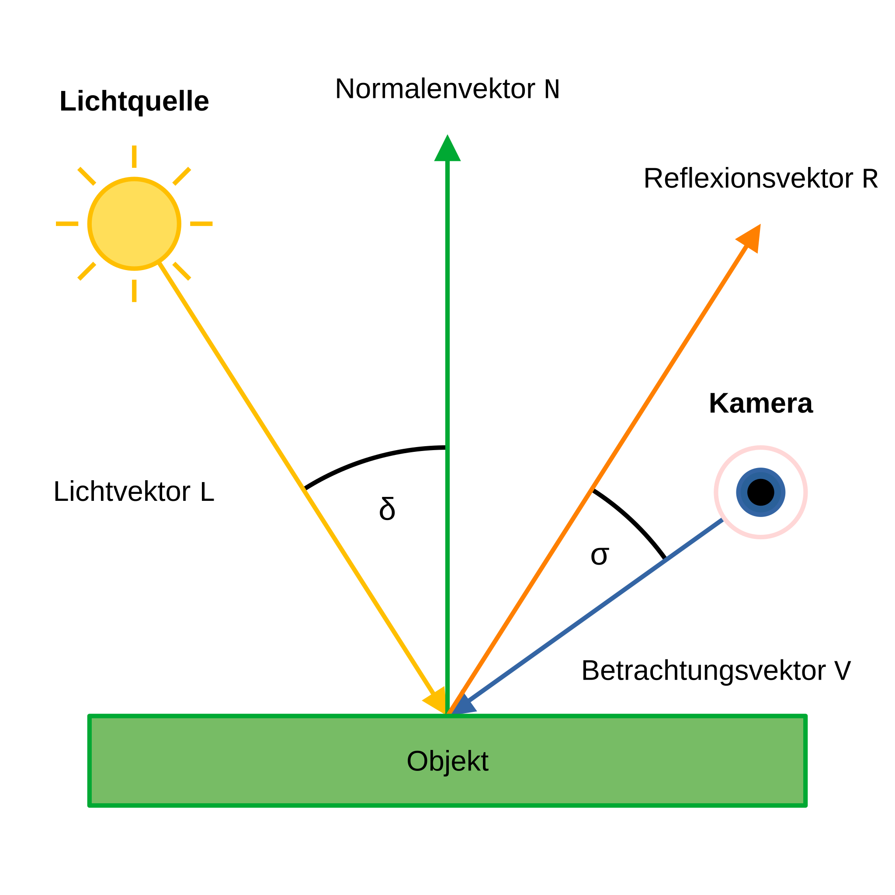

</div>
</div>

---

### Globales Umgebungslicht

Umgebungslicht (*Ambient Light*) sorgt dafür, dass auch die nicht direkt von einer Lichtquelle angestrahlten Flächen eines Objekts nicht komplett schwarz sind. Es simuliert indirekte Beleuchtung.

```csharp
// In der OnInitialize-Routine

// Definiert ein schwaches, weißes Umgebungslicht für die gesamte Szene
float[] ambientLight = { 0.2f, 0.2f, 0.2f, 1.0f };
gl.LightModel(OpenGL.GL_LIGHT_MODEL_AMBIENT, ambientLight);
```

---

### Punktlichtquelle definieren

Eine Punktlichtquelle strahlt von einer Position im Raum Licht ab. Man kann ihre Farbe für die diffuse und spiegelnde Reflexion getrennt definieren.

```csharp
// In der OnInitialize-Routine

// Aktiviert die erste Lichtquelle (GL_LIGHT0)
gl.Enable(OpenGL.GL_LIGHT0);

// Definiert die Eigenschaften von GL_LIGHT0
float[] lightPosition = { 2, 2, 5, 1 }; // Position (x, y, z, w=1 für Punktlicht)
float[] lightDiffuse = { 1, 1, 1, 1 };  // Helles, weißes diffuses Licht

gl.Light(OpenGL.GL_LIGHT0, OpenGL.GL_POSITION, lightPosition);
gl.Light(OpenGL.GL_LIGHT0, OpenGL.GL_DIFFUSE, lightDiffuse);
```

---

<div class="columns">
<div>

### Vektoren für die Beleuchtungsrechnung

Für die Berechnung werden an jedem Punkt der Oberfläche vier Vektoren benötigt:

- **$N$ (Normalenvektor)**: Vektor, der senkrecht von der Oberfläche weg zeigt.
- **$L$ (Lichtvektor)**: Vektor vom Oberflächenpunkt zur Lichtquelle.
- **$V$ (Betrachtungsvektor)**: Vektor vom Oberflächenpunkt zur Kamera.
- **$R$ (Reflexionsvektor)**: Vektor, in den der Lichtstrahl an der Oberfläche reflektiert wird. 

</div>
<div>


</div>
</div>

---

<div class="columns">
<div>

### **Ambient**-Komponente

Die Ambient-Komponente ist am einfachsten. Sie ist das Produkt aus der Lichtfarbe und der Materialfarbe für Umgebungslicht.

$I_{a} = \text{light}_{a} \cdot \text{material}_{a}$

- $\text{light}_{a}$: Farbe des globalen Umgebungslichts (z.B. `GL_LIGHT_MODEL_AMBIENT`).
- $\text{material}_{a}$: Ambient-Reflexionsvermögen des Materials (definiert mit `glMaterial`).

Diese Komponente ist für jeden Punkt eines Objekts gleich und sorgt für eine Grundhelligkeit.

</div>
<div>


</div>
</div>

---

<div class="columns">
<div>

### **Diffuse**-Komponente

Die Diffuse-Komponente hängt vom Winkel zwischen dem Normalenvektor $N$ und dem Lichtvektor $L$ ab. Je direkter das Licht auf die Oberfläche trifft, desto heller ist sie.

$I_{d} = \text{light}_{d} \cdot \text{material}_{d} \cdot \max(0, N \cdot L)$

- $N \cdot L$: Skalarprodukt der normalisierten Vektoren. Entspricht $\cos(\delta)$.
- $\max(0, ...)$: Sorgt dafür, dass von hinten beleuchtete Flächen nicht negativ beitragen.

</div>
<div>


</div>
</div>

---

<div class="columns">
<div>

### **Specular**-Komponente

Die Specular-Komponente erzeugt ein Glanzlicht und hängt vom Winkel zwischen dem Reflexionsvektor $R$ und dem Betrachtervektor $V$ ab.

$I_{s} = \text{light}_{s} \cdot \text{material}_{s} \cdot (\max(0, R \cdot V))^{\text{shininess}}$

- $R = 2(N \cdot L)N - L$: Berechnung des Reflexionsvektors.
- $\text{shininess}$: Ein Exponent, der die Größe und Schärfe des Glanzlichts steuert (definiert mit `glMaterial`). Je höher der Wert, desto kleiner und schärfer der Glanzpunkt.

</div>
<div>


</div>
</div>

---

<div class="columns">
<div>

### Kombination für **mehrere** Lichtquellen

Die finale Farbe eines Punktes ist die Summe der Ambient-Komponente (global) und der Summe der Diffuse- und Specular-Komponenten für *jede* aktive Lichtquelle.

$I_{f} = I_{a} + \sum_{i=1}^{n} (I_{\text{d}, i} + I_{\text{s}, i})$

- $I_{a}$: Globale Ambient-Komponente.
- $I_{\text{d}, i}$: Diffuser Beitrag der Lichtquelle $i$.
- $I_{\text{s}, i}$: Specular-Beitrag der Lichtquelle $i$.

In klassischem OpenGL wird diese Berechnung für bis zu 8 Lichtquellen (`GL_LIGHT0` bis `GL_LIGHT7`) automatisch durchgeführt.

</div>
<div>


</div>
</div>

---

<div class="columns">
<div>

### Schattierungsmodus festlegen

Der Schattierungsmodus bestimmt, wie die Farben zwischen den Eckpunkten eines Polygons interpoliert werden.
- `GL_FLAT`: Das gesamte Polygon hat eine einzige Farbe.
- `GL_SMOOTH`: Die Farben werden zwischen den Eckpunkten interpoliert (Gouraud Shading).

```csharp
// In der OnInitialize-Routine

// Weiche Farbübergänge aktivieren
gl.ShadeModel(OpenGL.GL_SMOOTH);
```

</div>
<div>

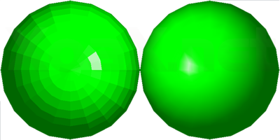

</div>
</div>

---

<div class="columns">
<div>

### Flat Shading

- Die Beleuchtungsrechnung wird nur **einmal pro Polygon** (z.B. Dreieck) durchgeführt.
- Das gesamte Polygon wird mit einer einzigen, konstanten Farbe gefüllt.
- Das Ergebnis sind klar sichtbare Kanten zwischen den Polygonen, was zu einem "facettierten" Aussehen führt.
- Für Flat Shading wird typischerweise die Normale der Fläche (`Face Normal`) verwendet, die für alle Vertices des Polygons gleich ist.

</div>
<div>

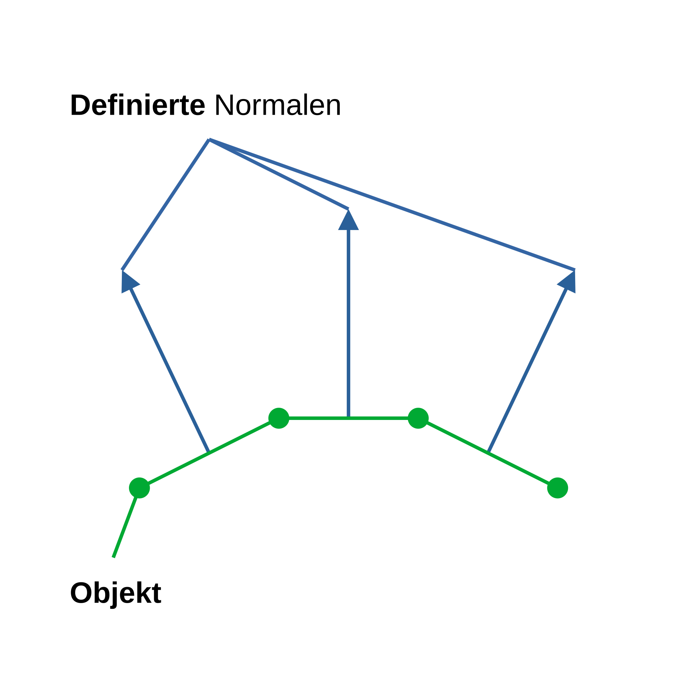

</div>
</div>

---

<div class="columns">
<div>

### Smooth Shading (Gouraud Shading)

- Die Beleuchtungsrechnung wird **für jeden Vertex** des Polygons einzeln durchgeführt.
- Dabei wird die individuelle Normale jedes Vertex (`Vertex Normal`) verwendet.
- Die resultierenden Farben an den Eckpunkten werden dann über die Fläche des Polygons interpoliert.
- Das Ergebnis ist ein weicher, kontinuierlicher Farbübergang, der die Illusion einer gekrümmten Oberfläche erzeugt.

</div>
<div>

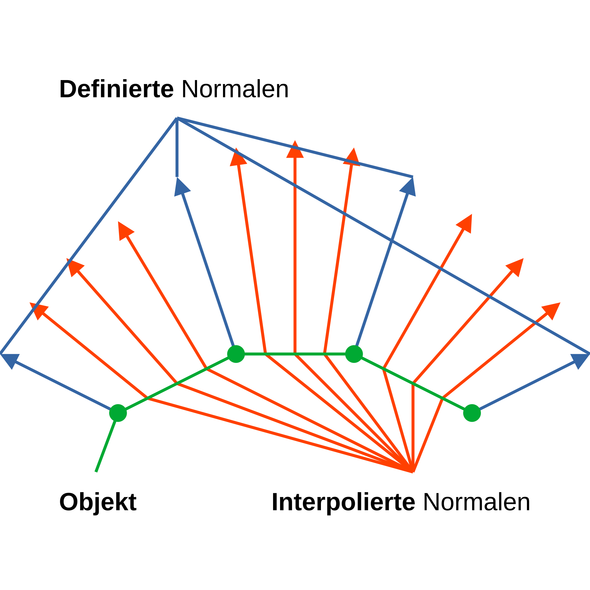

</div>
</div>

---

<div class="columns">
<div class="two">

### Tiefentest aktivieren

Der Tiefentest (Depth Test) sorgt dafür, dass Objekte, die weiter von der Kamera entfernt sind, von näheren Objekten verdeckt werden.

```csharp
// In der OnInitialize-Routine

// Aktiviere den Tiefentest
gl.Enable(OpenGL.GL_DEPTH_TEST);
```

</div>
<div>

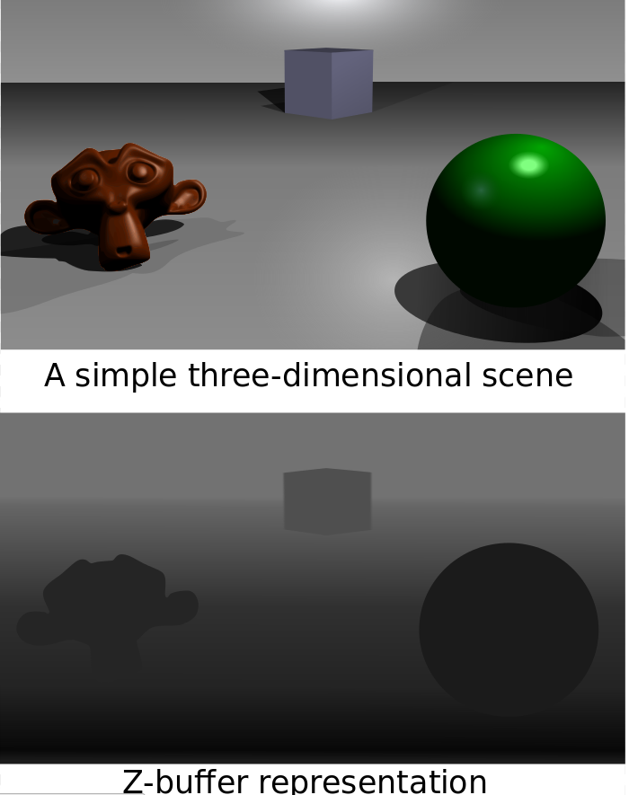

</div>
</div>

---

### Der Render-Loop: `OpenGLDraw`

Die `OpenGLDraw`-Ereignisroutine wird für jeden Frame wiederholt aufgerufen. Hier finden alle Zeichenoperationen statt.

```csharp
private void OnDraw(object sender, OpenGLRoutedEventArgs args)
{
    OpenGL gl = args.OpenGL;

    // 1. Buffer zurücksetzen (Farbe und Tiefe)
    gl.Clear(OpenGL.GL_COLOR_BUFFER_BIT | OpenGL.GL_DEPTH_BUFFER_BIT);

    // 2. ModelView-Matrix zurücksetzen
    gl.MatrixMode(OpenGL.GL_MODELVIEW);
    gl.LoadIdentity();

    // 3. Kamera positionieren
    gl.LookAt(5, 5, 5, 0, 0, 0, 0, 1, 0);

    // 4. Objekte zeichnen...
}
```

---

### Zeichnen von Primitiven

Geometrie wird innerhalb von `gl.Begin()` und `gl.End()` definiert. Der Parameter von `gl.Begin` legt fest, wie die folgenden Vertices interpretiert werden.

- `GL_POINTS`: Zeichnet für jeden Vertex einen einzelnen Punkt.
- `GL_LINES`: Zeichnet Linien zwischen je zwei Vertices (1-2, 3-4, ...).
- `GL_LINE_STRIP`: Zeichnet eine verbundene Linienkette (1-2, 2-3, 3-4, ...).
- `GL_LINE_LOOP`: Wie `GL_LINE_STRIP`, schließt aber die Lücke zwischen dem letzten und ersten Vertex.
- `GL_TRIANGLES`: Zeichnet für je drei Vertices ein separates, gefülltes Dreieck (1-2-3, 4-5-6, ...).
- `GL_TRIANGLE_STRIP`: Erzeugt eine Kette von Dreiecken, die sich Vertices teilen (1-2-3, 2-3-4, 3-4-5, ...).
- `GL_TRIANGLE_FAN`: Erzeugt einen Fächer von Dreiecken um den ersten Vertex (1-2-3, 1-3-4, 1-4-5, ...).
- `GL_QUADS`: Zeichnet für je vier Vertices ein separates, gefülltes Viereck (1-2-3-4, 5-6-7-8, ...).
- `GL_QUAD_STRIP`: Erzeugt eine Kette von Vierecken (1-2-4-3, 3-4-6-5, ...)

---

<div class="columns">
<div>

### `GL_POINTS`

Zeichnet für jeden übergebenen Vertex einen einzelnen Punkt. Die Größe der Punkte kann mit `gl.PointSize()` eingestellt werden.

```csharp
gl.Begin(OpenGL.GL_POINTS);

gl.Vertex(1, 1, 0); // Punkt 1
gl.Vertex(2, 2, 0); // Punkt 2
gl.Vertex(3, 1, 0); // Punkt 3

gl.End();
```

</div>
<div>

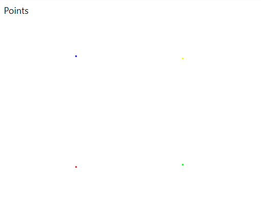

</div>
</div>

---

<div class="columns">
<div>

### Linienprimitive: `GL_LINES`, `STRIP` & `LOOP`

- **`GL_LINES`**: Zeichnet separate Liniensegmente paarweise (1-2, 3-4, ...).
- **`GL_LINE_STRIP`**: Zusammenhängender Linienzug (1-2, 2-3, 3-4).
- **`GL_LINE_LOOP`**: Geschlossener Streckenzug (verbindet zusätzlich das letzte mit dem ersten Vertex).

```csharp
gl.LineWidth(2.0f);
gl.Begin(OpenGL.GL_LINE_STRIP);
gl.Vertex(1, 1, 0);
gl.Vertex(2, 2, 0); // Linie 1-2
gl.Vertex(3, 1, 0); // Linie 2-3
gl.End();
```

</div>
<div>

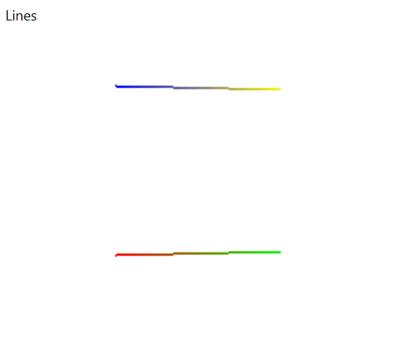

</div>
</div>

---

<div class="columns">
<div>

### `GL_TRIANGLES`

Zeichnet eine Serie von separaten, gefüllten Dreiecken. Jeweils drei aufeinanderfolgende Vertices definieren ein Dreieck.

```csharp
gl.Begin(OpenGL.GL_TRIANGLES);

gl.Vertex(1, 1, 0);
gl.Vertex(2, 2, 0);
gl.Vertex(1, 2, 0); // Dreieck 1

gl.Vertex(3, 1, 0);
gl.Vertex(4, 2, 0);
gl.Vertex(3, 2, 0); // Dreieck 2

gl.End();
```

</div>
<div>

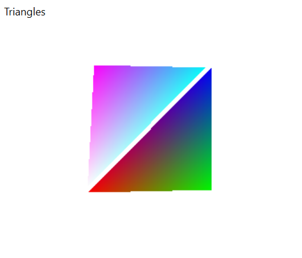

</div>
</div>

---

<div class="columns">
<div>

### Verbundene Dreiecke: `STRIP` & `FAN`

- **`GL_TRIANGLE_STRIP`**: Jedes neue Vertex (ab dem 3.) bildet mit den beiden vorherigen ein Dreieck (1-2-3, 2-3-4, 3-4-5). Höhere Cache-Effizienz!
- **`GL_TRIANGLE_FAN`**: Fächer um einen gemeinsamen Polpunkt (1-2-3, 1-3-4, 1-4-5). Ideal für Kreisflächen und Polkappen.

```csharp
gl.Begin(OpenGL.GL_TRIANGLE_STRIP);
gl.Vertex(1, 1, 0); gl.Vertex(2, 1, 0);
gl.Vertex(1, 2, 0); // Dreieck 1
gl.Vertex(2, 2, 0); // Dreieck 2
gl.End();
```

</div>
<div>

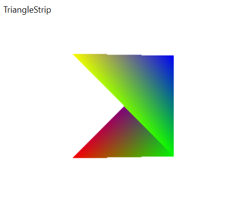

</div>
</div>

---

<div class="columns">
<div>

### Viereck-Primitive: `GL_QUADS` & `QUAD_STRIP`

- **`GL_QUADS`**: Je vier Vertices bilden ein ebenes Viereck (1-2-3-4, 5-6-7-8).
- **`GL_QUAD_STRIP`**: Aneinandergereihte Vierecke (1-2-4-3, 3-4-6-5). Klassiker zur Erzeugung von Zylindermänteln und Kugelbändern.

```csharp
gl.Begin(OpenGL.GL_QUADS);
gl.Vertex(1, 1, 0); gl.Vertex(2, 1, 0);
gl.Vertex(2, 2, 0); gl.Vertex(1, 2, 0);
gl.End();
```

</div>
<div>

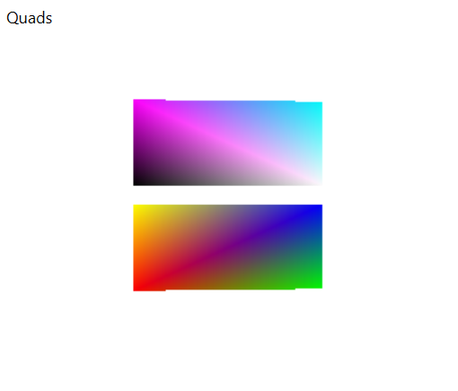

</div>
</div>

---

### Materialeigenschaften

Das Material definiert, wie eine Oberfläche Licht reflektiert. Die wichtigsten Eigenschaften sind:
- **Ambient**: Farbe des Objekts unter Umgebungslicht.
- **Diffuse**: Grundfarbe des Objekts, wenn es direkt beleuchtet wird.
- **Specular**: Farbe des Glanzlichts auf dem Objekt.

```csharp
// Definiere ein Material für glänzendes, rotes Plastik
float[] matDiffuse = { 1.0f, 0.0f, 0.0f, 1.0f };
float[] matSpecular = { 1.0f, 1.0f, 1.0f, 1.0f };

gl.Material(OpenGL.GL_FRONT, OpenGL.GL_DIFFUSE, matDiffuse);
gl.Material(OpenGL.GL_FRONT, OpenGL.GL_SPECULAR, matSpecular);
```

---

### Transformationen und der Matrix-Stack

Um Objekte unabhängig voneinander zu positionieren, nutzt OpenGL einen Matrix-Stack.

- `gl.PushMatrix()`: Speichert die aktuelle ModelView-Matrix.
- `gl.PopMatrix()`: Stellt die zuletzt gespeicherte Matrix wieder her.

```csharp
// Zeichne einen Planeten
gl.PushMatrix();
    gl.Rotate(planetRotation, 0, 1, 0);
    gl.Translate(5, 0, 0);
    // ... zeichne Planet ...

    // Zeichne einen Mond, der den Planeten umkreist
    gl.PushMatrix();
        gl.Rotate(moonRotation, 0, 1, 0);
        gl.Translate(1, 0, 0);
        // ... zeichne Mond ...
    gl.PopMatrix(); // Zurück zum Planeten-Koordinatensystem
gl.PopMatrix(); // Zurück zum Sonnen-Koordinatensystem
```

---

### Die Transformations-Pipeline in OpenGL

OpenGL überführt 3D-Objektkoordinaten in mehreren aufeinanderfolgenden Schritten in 2D-Bildschirmpixel:

$$\vec{v}_{\text{world}} = M_{\text{model}} \cdot \vec{v}_{\text{obj}} \quad \longrightarrow \quad \vec{v}_{\text{eye}} = M_{\text{view}} \cdot \vec{v}_{\text{world}} \quad \longrightarrow \quad \vec{v}_{\text{clip}} = M_{\text{proj}} \cdot \vec{v}_{\text{eye}}$$

- **Model-Matrix**: Platziert und transformiert Objekte in der virtuellen Welt (Translation, Rotation, Skalierung).
- **View-Matrix**: Verschiebt und rotiert die Welt relativ zum Betrachterstandpunkt (Kamera). In OpenGL klassisch zusammengefasst als **ModelView-Matrix** (`GL_MODELVIEW`).
- **Projection-Matrix (`GL_PROJECTION`)**: Definiert die Projektionsart und bildet den sichtbaren 3D-Kameraraum auf kanonische Clipping-Koordinaten ab.
- **Perspektivische Division**: Division durch homogene Koordinate $w$ liefert *Normalized Device Coordinates* (NDC $[-1, 1]^3$).
- **Viewport-Transformation**: Skaliert die NDC-Koordinaten auf die physikalischen Pixel des Fensters (`gl.Viewport`).

---

### Projektionsarten: Orthogonal vs. Perspektivisch

Die Wahl der Projektionsmatrix bestimmt die geometrische Form des Sichtvolumens (View Volume) und den Strahlengang:

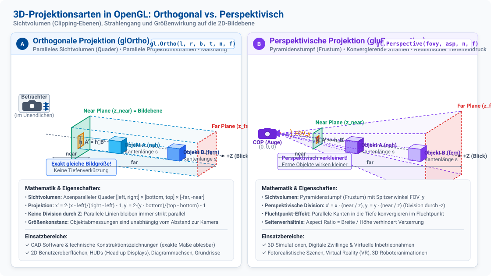

---

<div class="columns">
<div>

### Orthogonale Projektion: `glOrtho`

Die orthogonale (parallele) Projektion projiziert 3D-Punkte entlang paralleler Strahlen senkrecht auf die Bildebene:

- **Sichtvolumen**: Ein achsenparalleler Quader begrenzt durch $[left, right] \times [bottom, top] \times [near, far]$.
- **Kein Fluchtpunkt**: Parallele Kanten der Welt bleiben im 2D-Bild exakt parallel.
- **Größenkonstanz**: Ein Objekt behält immer seine Größe, unabhängig von der Distanz zur Kamera ($z$).

```csharp
// Aufruf in SharpGL (Projektionsmodus):
gl.Ortho(left, right, bottom, top, near, far);
```

</div>
<div>

### Mathematische Abbildung

Die Projektionsmatrix bildet den Quader linear in das normierte Sichtvolumen $[-1, 1]^3$ ab:

$$x_{\text{ndc}} = \frac{2}{right - left} x - \frac{right + left}{right - left}$$
$$y_{\text{ndc}} = \frac{2}{top - bottom} y - \frac{top + bottom}{top - bottom}$$
$$z_{\text{ndc}} = \frac{-2}{far - near} z - \frac{far + near}{far - near}$$

- Es erfolgt **keine Division** durch die Tiefe $z$.
- Dadurch bleiben geometrische Abstände, Winkel und Längenverhältnisse unverzerrt und maßhaltig erhalten.

</div>
</div>

---

<div class="columns">
<div>

### Perspektivische Projektion: `gluPerspective`

Die perspektivische Projektion entspricht der natürlichen Abbildung des menschlichen Auges sowie einer Fotokamera:

- **Sichtvolumen**: Ein Pyramidenstumpf (**Frustum**) mit der Spitze im Augpunkt (Center of Projection).
- **Konvergierende Strahlen**: Alle Projektionsstrahlen schneiden sich im Kameraursprung $(0,0,0)$.
- **Tiefenverkürzung**: Weiter entfernte Objekte erscheinen im Bild kleiner als nahe Objekte identischer Größe.

```csharp
// Aufruf in SharpGL (Projektionsmodus):
gl.Perspective(fovy, aspect, zNear, zFar);
```

</div>
<div>

### Mathematische Erklärung

Punkte werden über Strahlensätze auf die Bildebene bei $z_{\text{near}}$ projiziert:

$$x_{\text{proj}} = x \cdot \frac{z_{\text{near}}}{-z}, \quad y_{\text{proj}} = y \cdot \frac{z_{\text{near}}}{-z}$$

- Die **perspektivische Division** durch $-z$ erzeugt den natürlichen Fluchtpunkt-Effekt.
- **Parameter von `gl.Perspective`**:
  - `fovy`: Vertikaler Öffnungswinkel in Grad (z.B. $45^\circ \dots 60^\circ$).
  - `aspect`: Seitenverhältnis $\frac{\text{Breite}}{\text{Höhe}}$ der Zeichenfläche.
  - `zNear`, `zFar`: Vordere und hintere Clipping-Ebene ($0 < z_{\text{near}} < z_{\text{far}}$).

</div>
</div>

---

### Vergleich und Einsatzbereiche der Projektionsarten

| Kriterium | Orthogonale Projektion (`glOrtho`) | Perspektivische Projektion (`gluPerspective`) |
| :--- | :--- | :--- |
| **Sichtvolumen** | Quader (Box) | Pyramidenstumpf (Frustum) |
| **Projektionsstrahlen** | Parallel (Projektionszentrum im Unendlichen) | Konvergierend im Kameraschnittpunkt (COP) |
| **Objektgröße** | Distanzunabhängig ($h \neq f(z)$) | Nimmt mit der Distanz ab ($h \propto 1/z$) |
| **Fluchtpunkte** | Keine (Parallelen bleiben parallel) | 1 bis 3 Fluchtpunkte je nach Objektlage |
| **Typische Einsatzbereiche** | **CAD / CAE-Systeme**, technische Zeichnungen, Grundrisse, Schnittansichten, 2D-HUDs | **3D-Systemsimulation**, Digitale Zwillinge, Robotik, Virtual Reality, fotorealistische 3D-Grafik |
| **Vorteil** | Exakt maßhaltig, Maße direkt ablesbar | Realistischer plastischer Raumeindruck |
| **Nachteil** | Fehlende Tiefenstaffelung (Raumlage mehrdeutig) | Entfernungen und Winkel perspektivisch verzerrt |

---

### Projektion und Viewport im Resize-Handler

Bei jeder Änderung der Fenstergröße muss das Seitenverhältnis (*Aspect Ratio*) aktualisiert werden, um Verzerrungen zu vermeiden:

```csharp
private void OpenGLControl_Resized(object sender, OpenGLRoutedEventArgs args)
{
    OpenGL gl = args.OpenGL;
    int width = (int)openGLControl.ActualWidth;
    int height = (int)openGLControl.ActualHeight;
    if (height == 0) height = 1; // Division durch Null verhindern

    // 1. Viewport auf die volle Fenstergröße setzen
    gl.Viewport(0, 0, width, height);

    // 2. In den Projektionsmodus wechseln und Matrix zurücksetzen
    gl.MatrixMode(OpenGL.GL_PROJECTION);
    gl.LoadIdentity();

    // 3. Perspektivische Projektion mit korrektem Seitenverhältnis definieren
    double aspect = (double)width / height;
    gl.Perspective(45.0, aspect, 0.1, 1000.0);

    // 4. Zurück in den ModelView-Modus für alle nachfolgenden Zeichenbefehle
    gl.MatrixMode(OpenGL.GL_MODELVIEW);
}
```

---

## 5.2: Strukturierung mit einem Szenengraphen

Dieser Abschnitt umfasst die folgenden Inhalte:

- Motivation und Konzept eines Szenengraphen
- Aufbau einer Szene aus Knoten, Transformationen und Gruppen
- Traversierung des Graphen zur Darstellung der Szene
- Umsetzung in C# am Beispiel der Vorlage

---

<div class="columns">
<div>

### Die Herausforderung: Komplexe Szenen

- Direkte OpenGL-Aufrufe für hunderte Objekte werden schnell unübersichtlich.
- Wie lassen sich Objekte gruppieren (z.B. ein Tisch mit vier Beinen)?
- Wie lassen sich Transformationen logisch vererben (z.B. ein Mond, der um einen Planeten rotiert, der um die Sonne rotiert)?

**Lösung**: Eine baumartige Datenstruktur zur Organisation der Szene – ein **Szenengraph**.

</div>
<div>



</div>
</div>

---

### Das Konzept des Szenengraphen

Ein Szenengraph ist eine hierarchische Struktur (ein Baum), die alle Elemente einer 3D-Szene enthält.

- **Knoten (Nodes)**: Die Elemente im Baum. Jeder Knoten repräsentiert etwas in der Szene.
- **Wurzelknoten (Root Node)**: Der oberste Knoten, von dem die ganze Szene ausgeht.
- **Blattknoten (Leaf Nodes)**: Knoten am Ende der Äste. Sie enthalten die sichtbare Geometrie (z.B. ein 3D-Modell).
- **Gruppenknoten (Group Nodes)**: Knoten, die andere Knoten (Kinder) zusammenfassen. Sie definieren die Struktur.
- **Transformationen**: Jeder Knoten kann eine oder mehrere Transformationen (Verschiebung, Rotation, Skalierung) haben, die auch auf alle seine Kinder wirken.

---

<div class="columns">
<div>

### Umsetzung: Die Klassenstruktur

- **`Scene`**: Das Hauptobjekt. Enthält den `Root`-Knoten und globale Einstellungen wie Lichter und Hintergrundfarbe.
- **`Node`**: Die abstrakte Basisklasse für alle Knoten. Definiert eine Liste von `Transforms` und eine `Draw`-Methode.
- **`Group`**: Ein `Node`, der eine Liste von Kindern (`Node`s) besitzt. Erzeugt die Baumstruktur.
- **`Primitive` / `Volume`**: Konkrete `Node`-Typen, die Geometrie darstellen (Blattknoten).
- **`Transform`**: Basisklasse für `Translate`, `Rotate`, `Scale`.

</div>
<div>



</div>
</div>

---

### Traversierung des Graphen

Das Zeichnen der Szene erfolgt durch eine **rekursive Traversierung** des Baumes, beginnend am Wurzelknoten.

```csharp
public void Draw(OpenGL gl)
{
    gl.PushMatrix(); // Aktuellen Zustand der ModelView-Matrix sichern

    // 1. Alle Transformationen DIESES Knotens anwenden
    foreach (Transform t in Transforms)
    {
        t.Apply(gl);
    }

    // 2. Die lokale Geometrie DIESES Knotens zeichnen
    DrawLocal(gl);

    gl.PopMatrix(); // Gesicherten Zustand wiederherstellen
}
```

---

<div class="columns">
<div class="two">

### Klasse `Transform`

Die abstrakte Klasse `Transform` ist die Basis für alle Transformationen im Szenengraphen.

- Sie definiert eine einzige abstrakte Methode: `Apply(OpenGL gl)`.
- Jede konkrete Transformations-Klasse (`Translate`, `Rotate`, `Scale`) implementiert diese Methode, um den entsprechenden OpenGL-Befehl aufzurufen.
- Ein `Node` im Szenengraphen besitzt eine Liste von `Transform`-Objekten.

</div>
<div>



</div>
</div>

---

<div class="columns top">
<div>

### Klasse `Translate`

Die Klasse `Translate` repräsentiert eine Verschiebung im 3D-Raum.

- **Eigenschaften**: 
    - `Delta`: Der Verschiebungsvektor.
- **`Apply()`-Methode**: Ruft `gl.Translate(Delta.X, Delta.Y, Delta.Z)` auf.
- Dies multipliziert die aktuelle ModelView-Matrix mit einer Translationsmatrix und verschiebt so den Ursprung des Koordinatensystems für alle nachfolgenden Zeichenoperationen.

</div>
<div>

### Klasse `Rotate`

Die Klasse `Rotate` repräsentiert eine Rotation um eine beliebige Achse.

- **Eigenschaften**:
    - `Angle`: Der Rotationswinkel in Grad.
    - `Axis`: Der Vektor, der die Rotationsachse definiert.
- **`Apply()`-Methode**: Ruft `gl.Rotate(Angle, Axis.X, Axis.Y, Axis.Z)` auf.
- Dies multipliziert die aktuelle ModelView-Matrix mit einer Rotationsmatrix.

</div>
</div>

---

### Klasse `Scale`

Die Klasse `Scale` repräsentiert eine Skalierung.

- **Eigenschaften**:
    - `Factor`: Die Skalierungsfaktoren für jede Achse als Vektor-Objekt.
- **`Apply()`-Methode**: Ruft `gl.Scale(Factor.X, Factor.Y, Factor.Z)` auf.
- Dies multipliziert die aktuelle ModelView-Matrix mit einer Skalierungsmatrix.
- **Achtung**: Eine ungleichmäßige Skalierung (z.B. `Factor.X != Factor.Y`) kann Normalenvektoren verzerren. Für korrekte Beleuchtung muss dann `gl.Enable(OpenGL.GL_NORMALIZE)` oder `gl.Enable(OpenGL.GL_RESCALE_NORMAL)` aktiviert werden.

---

### Die `Group`-Klasse

Die `DrawLocal`-Methode eines `Group`-Knotens ist besonders einfach: Sie ruft lediglich die `Draw`-Methode all ihrer Kinder auf.

```csharp
// Aus der Klasse Group
protected override void DrawLocal(OpenGL gl)
{
    // Rufe die Draw-Methode für alle Kinder auf
    foreach (Node child in _children.Values)
    {
        child.Draw(gl);
    }
}
```

Durch diesen rekursiven Aufruf (`Group.Draw` -> `Child.Draw` -> ...) werden die Transformationen korrekt entlang der Baumhierarchie akkumuliert.

---

<div class="columns">
<div class="two">

### Klasse `Primitive`

Die abstrakte Klasse `Primitive` ist die Basis für alle 2D-Grundformen, die aus einer Liste von Vertices bestehen.

- **Erbt von**: `Node`.
- **Speichert**: Jeweils eine Liste von `Vertex`-, `Normal`- und `Material`-Objekten.
- **Funktionsweise**: Die `DrawLocal`-Methode zeichnet die Geometrie, indem sie für jeden Vertex das zugehörige Material, die Normale und dann den Vertex selbst an OpenGL übergibt. Der `_beginMode` (z.B. `GL_POINTS`, `GL_LINES`) bestimmt, wie die Daten interpretiert werden.

</div>
<div>



</div>
</div>

---

<div class="columns top">
<div>

### Klasse `Points`

Die Klasse `Points` erbt von `Primitive` und zeichnet eine Menge von Punkten.

- **Konstruktor**: Setzt den `BeginMode` auf `GL_POINTS`.
- **Eigenschaft `Size`**: Steuert die Größe der zu zeichnenden Punkte in Pixel.
- **`DrawLocal()`-Methode**: Ruft `gl.PointSize(Size)` auf, bevor die `DrawLocal`-Methode der `Primitive`-Basisklasse die Punkte zeichnet.

</div>
<div>

### Klasse `Lines`

Die Klasse `Lines` erbt von `Primitive` und zeichnet eine Menge von Linien.

- **Konstruktor**: Setzt den `BeginMode` auf `GL_LINES` (oder `GL_LINE_STRIP` / `GL_LINE_LOOP`, je nach Konstruktor).
- **Eigenschaft `Width`**: Steuert die Breite der zu zeichnenden Linien in Pixel.
- **`DrawLocal()`-Methode**: Ruft `gl.LineWidth(Width)` auf, bevor die `DrawLocal`-Methode der `Primitive`-Basisklasse die Linien zeichnet.

</div>
</div>

---

<div class="columns top">
<div>

### Klasse `Triangles`

Die Klasse `Triangles` erbt von `Primitive` und zeichnet eine Menge von gefüllten Dreiecken.

- **Konstruktor**: Setzt den `BeginMode` auf `GL_TRIANGLES` (oder `GL_TRIANGLE_STRIP` / `GL_TRIANGLE_FAN`, je nach Konstruktor).
- **Funktionsweise**: Die `DrawLocal`-Methode der Basisklasse wird aufgerufen, um die Dreiecke zu zeichnen. Es gibt keine zusätzlichen Eigenschaften oder Überschreibungen in dieser Klasse.

</div>
<div>

### Klasse `Quads`

Die Klasse `Quads` erbt von `Primitive` und zeichnet eine Menge von gefüllten Vierecken.

- **Konstruktor**: Setzt den `BeginMode` auf `GL_QUADS` (oder `GL_QUAD_STRIP`, je nach Konstruktor).
- **Funktionsweise**: Die `DrawLocal`-Methode der Basisklasse wird aufgerufen, um die Vierecke zu zeichnen. Es gibt keine zusätzlichen Eigenschaften oder Überschreibungen in dieser Klasse.

</div>
</div>

---

<div class="columns">
<div class="two">

### Klasse `Volume`

Die abstrakte Klasse `Volume` ist die Basisklasse für alle 3D-Volumenkörper.

- Erbt von `Node`.
- Definiert Eigenschaften, die alle Volumenkörper teilen, z.B. `Material`.
- Die `DrawLocal()`-Methode wird von den konkreten Klassen (`Cube`, `Sphere`, `Cone`) implementiert, um die Geometrie des Körpers zu zeichnen.
- Im Gegensatz zu `Primitive` müssen hier die Normalenvektoren für jede Fläche bzw. jeden Vertex korrekt berechnet und gesetzt werden, um eine realistische Beleuchtung zu erzielen.

</div>
<div>



</div>
</div>

---

<div class="columns">
<div class="two">

### Klasse `Cube`

Zeichnet einen Würfel oder Quader.

- **Eigenschaften**:
    - `Size`: Die Abmessung des Quaders in X-, Y- und Z-Richtung als Vektor-Objekt.
- **`DrawLocal()`-Methode**:
    - Zeichnet die 6 Seiten des Quaders, typischerweise mit `gl.Begin(OpenGL.GL_QUADS)`.

</div>
<div>

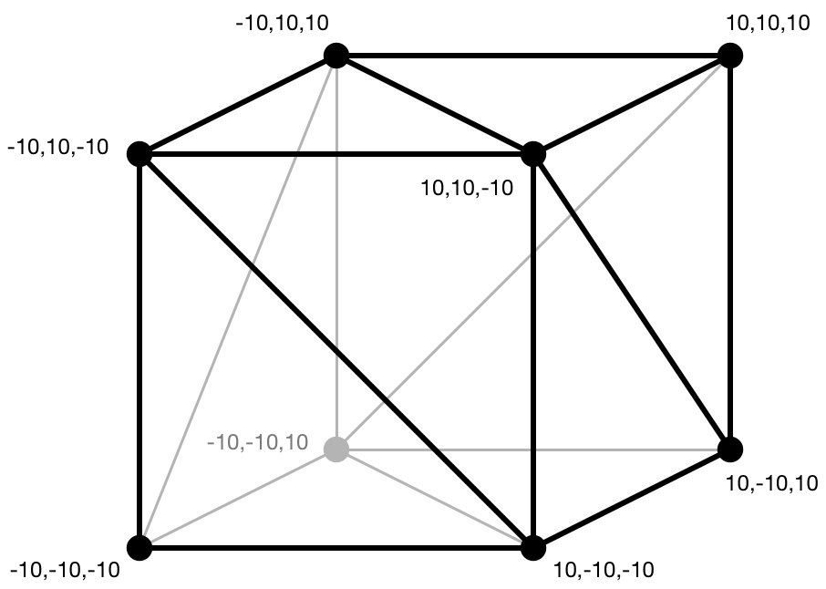

</div>
</div>

---

### Darstellung eines **Würfel** mit unterschiedlichen Eigenschaften

Der folgende *Screenshot* zeigt Würfeldarstellungen mit unterschiedlichen Eigenschaften:

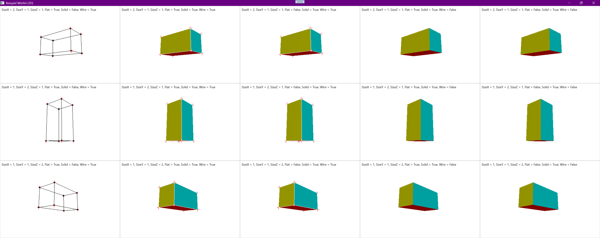

---

<div class="columns">
<div class="two">

### Klasse `Sphere`

Approximiert eine Kugeloberfläche über ein Gitternetz aus Längen- und Breitengraden:

- **Eigenschaften**:
    - `Radius`: Der Radius der Kugel $r$.
    - `Slices`: Unterteilungen entlang des Umfangs ($\theta \in [0, 2\pi]$).
    - `Stacks`: Unterteilungen von Pol zu Pol ($\phi \in [0, \pi]$).
- **Intuitive Normalenformel**:
    Da der Normalenvektor im Ursprung zentrierter Kugeln radial nach außen zeigt, entspricht er exakt dem normalisierten Ortsvektor der Einheitskugel:
    $$\vec{n}_{\phi,\theta} = \frac{\vec{p}}{\|\vec{p}\|} = \begin{pmatrix} \sin(\phi) \cos(\theta) \\ \cos(\phi) \\ \sin(\phi) \sin(\theta) \end{pmatrix}$$

</div>
<div>

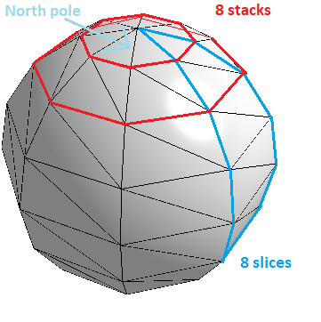

</div>
</div>

---

### Darstellung einer **Kugel** mit unterschiedlichen Einstellungen

Der folgende *Screenshot* zeigt Kugeldarstellungen mit unterschiedlichen Einstellungen:

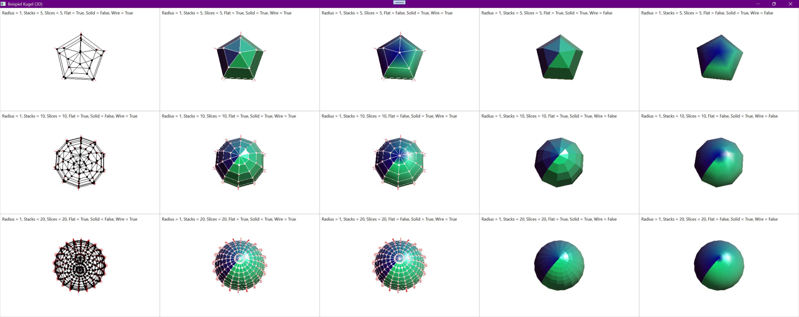

> [!NOTE]
> Die ausführliche mathematische Herleitung der Kugelkoordinaten sowie die C#-Triangulationsschleifen (`GL_QUAD_STRIP` und `GL_TRIANGLE_FAN`) sind im Begleitdokument [Folien_Anhang_3D_Normalen.md](./Folien_Anhang_3D_Normalen.md) dokumentiert.

---

<div class="columns">
<div class="two">

### Klasse `Cylinder`

Modelliert einen Kreiszylinder, Kegel oder Kegelstumpf entlang der Y-Achse:

- **Eigenschaften**: `Radius1` (unten), `Radius2` (oben), `Height`, `Slices`.
- **Intuitive Normalenformel**:
    - **Zylinder ($r_1 = r_2$):** Normalen zeigen rein horizontal vom Zentrum weg:
      $$\vec{n} = \begin{pmatrix} \cos(\theta) & 0 & \sin(\theta) \end{pmatrix}^T$$
    - **Kegel / Kegelstumpf ($r_1 \neq r_2$):** Die Mantelschräge bewirkt eine vertikale Komponente proportional zu $(r_1 - r_2)$:
      $$\vec{n} \propto \begin{pmatrix} h \cdot \cos(\theta) \\ r_1 - r_2 \\ h \cdot \sin(\theta) \end{pmatrix}$$

</div>
<div>

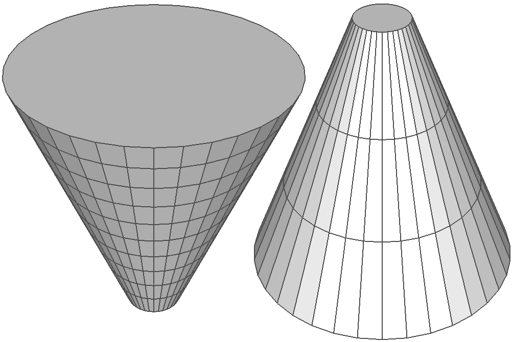

</div>
</div>

---

### Darstellung eines **Zylinders** mit unterschiedlichen Einstellungen

Der folgende *Screenshot* zeigt Zylinderdarstellungen mit unterschiedlichen Einstellungen:

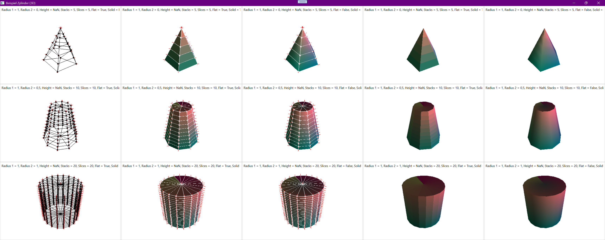

> [!NOTE]
> Die analytische 2D-Querschnitts- und 3D-Rotationsherleitung der Zylinder- und Kegelnormalen sowie deren C#-Berechnung finden Sie im Anhangsdokument [Folien_Anhang_3D_Normalen.md](./Folien_Anhang_3D_Normalen.md).

---

### Fertige Geometriegeneratoren: `GeometryFactory`

In der industriellen Simulationspraxis leitet man Meshes nicht manuell ab, sondern nutzt parametrische Generatoren (`GeometryFactory`):

```csharp
namespace SimulationEngine.Graphics3D
{
    public static class GeometryFactory
    {
        public static Volume CreateCylinder(float radius, float height, int slices = 32)
            => new Cylinder("Cylinder", radius, radius, height, slices);

        public static Volume CreateSphere(float radius, int slices = 32, int stacks = 16)
            => new Sphere("Sphere", radius, slices, stacks);

        public static Volume CreateBox(float sx, float sy, float sz)
            => new Cube("Box", sx, sy, sz);
    }
}
```

- **Vorteil**: Kapselt vorberechnete Vertex- und Normalendaten für Standardkörper.
- Erlaubt die volle Konzentration auf **Szenengraph-Architektur und Kinematik**.

---

### Beispiel: Aufbau einer Szene

So wird in der Vorlage eine einfache Szene aufgebaut:

```csharp
// 1. Wurzelknoten erstellen
Group root = new Group("Root");

// 2. Transformationen auf die ganze Szene anwenden
root.Transforms.Add(new Translate(0, 0, -5)); // Alles nach hinten schieben
root.Transforms.Add(_rotate); // Eine globale Rotation hinzufügen

// 3. Geometrie-Knoten erstellen
Cube cube1 = new Cube("Cube1", 1, 1, 1, Material.RED);

// 4. Lokale Transformation auf den Würfel anwenden
cube1.Transforms.Add(new Translate(0, 0, -2));

// 5. Würfel als Kind zum Wurzelknoten hinzufügen
root.Add(cube1);

// 6. Szene mit dem Wurzelknoten erstellen
_scene = new Scene(Color.WHITE, Color.DARKGRAY, root);
```

---

## 5.3: Mechatronische Anwendung: Kinematische Ketten & Robotik

Dieser Abschnitt umfasst die folgenden Inhalte:

- Serielle Kinematik und Roboterachsen im Szenengraphen
- Hierarchische Transformationen (Basis $\to$ Achse 1 $\to$ Arm 1 $\to$ Achse 2 $\to$ Greifer)
- Automatische Vorwärtskinematik über den Matrix-Stack
- C#-Implementierung eines mechatronischen Knickarm-Roboters

---

<div class="columns">
<div>

### Serielle Kinematik im Szenengraphen

In der Robotik und Mechatronik (z.B. KUKA, ABB, Fanuc, TwinCAT Kinematics) besteht ein Roboter aus einer Kette starrer Glieder (*Links*) und beweglicher Gelenke (*Joints*):

- Jedes Gelenk $i$ bewegt alle nachfolgenden Glieder $i+1 \dots n$.
- Die Position des Greifers (**Tool Center Point, TCP**) ist das Ergebnis der Verkettung aller Achsen.
- Ein **Szenengraph** bildet diese Eltern-Kind-Beziehung perfekt und baumförmig ab!

</div>
<div>

```
BaseNode (Säule)
 └── Rotate (Achse 1: Yaw um Y)
      └── Arm1Node (Zylinder L1)
           └── Translate (Armlänge L1)
                └── Rotate (Achse 2: Pitch um Z)
                     └── Arm2Node (Zylinder L2)
                          └── ToolCenterPoint (Greifer)
```

</div>
</div>

---

### C#-Implementierung: Kinematische Kette

```csharp
// 1. Basis des Roboters (Säule am Boden)
Group robot = new Group("RobotBase");
robot.Add(GeometryFactory.CreateCylinder(radius: 0.3f, height: 0.5f));

// 2. Drehachse 1 (Yaw: Rotation um vertikale Y-Achse)
Group axis1 = new Group("Axis1");
axis1.Transforms.Add(new Rotate(angle: joint1Angle, 0, 1, 0));
axis1.Transforms.Add(new Translate(0, 0.5f, 0)); // Auf Sockel platzieren
axis1.Add(GeometryFactory.CreateBox(0.4f, 0.4f, 0.4f));

// 3. Unterarm (Arm 1) mit Nickachse 2 (Pitch: Rotation um Z-Achse)
Group arm1 = new Group("Arm1");
arm1.Transforms.Add(new Rotate(angle: joint2Angle, 0, 0, 1));
arm1.Add(GeometryFactory.CreateCylinder(radius: 0.15f, height: 2.0f));

// 4. Oberarm (Arm 2) an der Spitze von Arm 1 anhängen (L = 2.0)
Group arm2 = new Group("Arm2");
arm2.Transforms.Add(new Translate(0, 2.0f, 0));
arm2.Transforms.Add(new Rotate(angle: joint3Angle, 0, 0, 1));
arm2.Add(GeometryFactory.CreateCylinder(radius: 0.1f, height: 1.5f));

arm1.Add(arm2); axis1.Add(arm1); robot.Add(axis1);
```

---

<div class="columns">
<div>

### Vorwärtskinematik & Matrix-Stack

Die globale Pose des Greifers $\mathbf{T}_{\text{TCP}}$ berechnet sich durch Verkettung homogener Transformationsmatrizen:

$$\mathbf{T}_{\text{TCP}} = \mathbf{T}_{\text{Base}} \cdot \mathbf{R}_1(\theta_1) \cdot \mathbf{T}_1 \cdot \mathbf{R}_2(\theta_2) \cdot \mathbf{T}_2$$

- Durch `gl.PushMatrix()` und `gl.PopMatrix()` während der Baumtraversierung wird der ModelView-Matrix-Stack automatisch akkumuliert.
- **Vorteil:** Die Visualisierung berechnet die Vorwärtskinematik implizit ohne manuelle Matrixmultiplikation!

</div>
<div>

> [!TIP]
> **Industrie-Standard (Denavit-Hartenberg):**  
> Genau wie in TwinCAT Kinematics, ROS (URDF-Beschreibungen) oder MATLAB Simscape Multibody folgt die 3D-Szene dem Prinzip serieller Koordinatenvererbung. Verändert die Steuerung den Winkel von Achse 1, bewegen sich alle abhängigen Armsegmente und der Greifer automatisch physikalisch exakt mit.

</div>
</div>

---

## 5.4: Interaktive Kameraführung

Dieser Abschnitt umfasst die folgenden Inhalte:

- Motivation und Grundlagen der virtuellen Kameraführung
- Das Kameramodell mit `gl.LookAt`
- Kugelkoordinaten (Azimut, Elevation, Distanz) für Orbit-Kameras
- Mathematische Koordinatenumrechnung (Kugel $\to$ Kartesisch)
- Interaktive Maussteuerung in WPF (Rotation und Zoom)
- Vollständige Implementierung der Klasse `OrbitCamera` in C#

---

<div class="columns">
<div>

### Bedarf an interaktiver Kamerasteuerung

In 3D-Simulationen und Digitalen Zwillingen reicht eine starre Kameraperspektive selten aus:

- **Detailinspektion**: Maschinenkomponenten müssen aus verschiedenen Blickwinkeln betrachtet werden.
- **Verdeckungen auflösen**: Im 3D-Raum verdecken vordere Bauteile dahinterliegende Prozesse.
- **Benutzererlebnis**: Natürliche Navigation wie in modernen CAD- und Simulationswerkzeugen (z.B. Siemens NX, SolidWorks, Blender).

Die **Orbit-Kamera** (Drehkamera um ein Fokusobjekt) ist der Standard für die Modellinspektion.

</div>
<div>

### Die virtuelle Kamera: `gl.LookAt`

Die `LookAt`-Funktion definiert die View-Matrix über drei 3D-Vektoren:

- **$\vec{eye} = (x_e, y_e, z_e)$**: Standpunkt der Kamera im Raum (Augpunkt).
- **$\vec{center} = (x_c, y_c, z_c)$**: Zielpunkt, den die Kamera anvisiert (Fokuspunkt).
- **$\vec{up} = (x_u, y_u, z_u)$**: Aufwärtsvektor der Kamera (meist $(0, 1, 0)$).

```csharp
// Aufruf in OnDraw vor dem Rendern der Szene:
gl.LookAt(eyeX, eyeY, eyeZ, 
          centerX, centerY, centerZ, 
          upX, upY, upZ);
```

</div>
</div>

---

<div class="columns">
<div>

### Orbit-Kamera mit Kugelkoordinaten

Anstatt $(x, y, z)$ direkt zu manipulieren, beschreibt eine Orbit-Kamera die Position auf einer Kugelschale um das Ziel:

1. **Azimutwinkel $\theta$ (horizontaler Orbit)**:
   - Drehung um die vertikale $Y$-Achse ($0^\circ \dots 360^\circ$).
   - Bestimmt die Himmelsrichtung des Betrachters.
2. **Elevationswinkel $\phi$ (vertikale Neigung)**:
   - Blickwinkel über/unter dem Äquator ($-89^\circ \dots +89^\circ$).
   - Vogelperspektive ($>0$) bis Froschperspektive ($<0$).
3. **Distanz $r$ (Kameraabstand / Zoom)**:
   - Radius der Orbit-Kugelschale ($r > 0$).

</div>
<div>

### Vermeidung von Gimbal Lock

Blickt die Kamera exakt senkrecht von oben ($\phi = +90^\circ$) oder unten ($\phi = -90^\circ$):

- Blickvektor $\vec{view}$ und Up-Vektor $\vec{up} = (0, 1, 0)$ werden parallel.
- Das Kreuzprodukt $\vec{view} \times \vec{up}$ wird zum Nullvektor $\vec{0}$.
- Die Kamera verliert ihre eindeutige Orientierung und kippt unkontrolliert um.
- **Lösung**: Der Elevationswinkel $\phi$ wird per Software auf $[-89^\circ, +89^\circ]$ begrenzt (*Clamping*):

```csharp
Elevation = Math.Clamp(Elevation, -89.0, 89.0);
```

</div>
</div>

---

### Mathematische Koordinatenumrechnung

Aus den Kugelkoordinaten $(\theta, \phi, r)$ und dem Fokuspunkt $\vec{center} = (x_c, y_c, z_c)$ wird der Augpunkt $\vec{eye}$ bestimmt:

<div class="columns">
<div>

**Formeln (Winkel im Bogenmaß):**

$$\theta_{\text{rad}} = \theta \cdot \frac{\pi}{180^\circ}, \quad \phi_{\text{rad}} = \phi \cdot \frac{\pi}{180^\circ}$$

$$x_e = x_c + r \cdot \cos(\phi_{\text{rad}}) \cdot \sin(\theta_{\text{rad}})$$
$$y_e = y_c + r \cdot \sin(\phi_{\text{rad}})$$
$$z_e = z_c + r \cdot \cos(\phi_{\text{rad}}) \cdot \cos(\theta_{\text{rad}})$$

- Bei $\theta = 0^\circ$ und $\phi = 0^\circ$ blickt die Kamera von $+Z$ in Richtung Ursprung.
- Positive $\theta$-Werte drehen die Kamera im Uhrzeigersinn um das Objekt.

</div>
<div>

**C#-Berechnungsmethode:**

```csharp
double radAzimuth = Azimuth * Math.PI / 180.0;
double radElevation = Elevation * Math.PI / 180.0;

double eyeX = TargetX + Distance 
    * Math.Cos(radElevation) * Math.Sin(radAzimuth);
double eyeY = TargetY + Distance 
    * Math.Sin(radElevation);
double eyeZ = TargetZ + Distance 
    * Math.Cos(radElevation) * Math.Cos(radAzimuth);

gl.LookAt(eyeX, eyeY, eyeZ, 
          TargetX, TargetY, TargetZ, 
          0.0, 1.0, 0.0);
```

</div>
</div>

---

### Interaktive Maussteuerung in WPF

Die intuitive Bedienung der Orbit-Kamera wird über drei WPF-Mausereignisse des `OpenGLControl` umgesetzt:

| Mausaktion | WPF-Ereignis | Kamera-Wirkung | Formel / Update |
| :--- | :--- | :--- | :--- |
| **Linke Taste + Ziehen** | `MouseMove` (bei gedrückter linker Taste) | Horizontaler Orbit (Azimut) & vertikale Neigung (Elevation) | $\Delta \theta = \Delta x \cdot s_{\text{rot}}$<br>$\Delta \phi = -\Delta y \cdot s_{\text{rot}}$ |
| **Mausrad drehen** | `MouseWheel` | Stufenloser Zoom (Distanz verändern) | $r_{\text{neu}} = r_{\text{alt}} - \Delta_{\text{wheel}} \cdot s_{\text{zoom}}$ |
| **Rechte Taste / Shift** (optional) | `MouseMove` (bei rechter Taste) | Panning (Verschiebung des Zielpunkts $\vec{center}$) | Verschiebung parallel zur Bildebene |

- **Mausfang (`CaptureMouse()`)**: Beim Klick wird der Mauszeiger an das Control gebunden, sodass Drehbewegungen auch außerhalb des Fensters flüssig weiterlaufen.
- **Neuzeichnen auslösen**: Nach jeder Parameteränderung wird `openGLControl.DoRender()` aufgerufen.

---

### Implementierung der Klasse `OrbitCamera` (Teil 1)

```csharp
public class OrbitCamera
{
    public double TargetX { get; set; } = 0.0;
    public double TargetY { get; set; } = 0.0;
    public double TargetZ { get; set; } = 0.0;

    public double Azimuth { get; set; } = 45.0;    // Drehung um Y-Achse in Grad
    public double Elevation { get; set; } = 30.0;  // Neigung in Grad [-89, +89]
    public double Distance { get; set; } = 15.0;   // Abstand zum Zielpunkt

    public double MinDistance { get; set; } = 1.0;
    public double MaxDistance { get; set; } = 500.0;

    public void Rotate(double deltaAzimuth, double deltaElevation)
    {
        Azimuth = (Azimuth + deltaAzimuth) % 360.0;
        Elevation = Math.Clamp(Elevation + deltaElevation, -89.0, 89.0);
    }

    public void Zoom(double deltaZoom)
    {
        Distance = Math.Clamp(Distance - deltaZoom, MinDistance, MaxDistance);
    }
```

---

### Implementierung der Klasse `OrbitCamera` (Teil 2)

```csharp
    public void Apply(OpenGL gl)
    {
        // 1. Umrechnung der Kugelkoordinaten in das Bogenmaß (Radians)
        double radAzimuth = Azimuth * Math.PI / 180.0;
        double radElevation = Elevation * Math.PI / 180.0;

        // 2. Berechnung der Kameraposition (Eye) im kartesischen Raum
        double eyeX = TargetX + Distance * Math.Cos(radElevation) * Math.Sin(radAzimuth);
        double eyeY = TargetY + Distance * Math.Sin(radElevation);
        double eyeZ = TargetZ + Distance * Math.Cos(radElevation) * Math.Cos(radAzimuth);

        // 3. View-Matrix in OpenGL setzen (Kamera blickt auf Target)
        gl.LookAt(eyeX, eyeY, eyeZ,
                  TargetX, TargetY, TargetZ,
                  0.0, 1.0, 0.0);
    }
}
```

---

### Einbindung in Render-Loop und WPF-Events

```csharp
private OrbitCamera _camera = new OrbitCamera { Distance = 10.0, Elevation = 25.0 };
private Point _lastMousePosition;

private void OnMouseDown(object sender, MouseButtonEventArgs e)
{
    if (e.LeftButton == MouseButtonState.Pressed) {
        _lastMousePosition = e.GetPosition(openGLControl);
        openGLControl.CaptureMouse();
    }
}
private void OnMouseMove(object sender, MouseEventArgs e)
{
    if (openGLControl.IsMouseCaptured && e.LeftButton == MouseButtonState.Pressed) {
        Point current = e.GetPosition(openGLControl);
        double dx = current.X - _lastMousePosition.X;
        double dy = current.Y - _lastMousePosition.Y;
        _camera.Rotate(dx * 0.4, -dy * 0.4);
        _lastMousePosition = current;
        openGLControl.DoRender();
    }
}
private void OnMouseUp(object sender, MouseButtonEventArgs e) => openGLControl.ReleaseMouseCapture();

private void OnMouseWheel(object sender, MouseWheelEventArgs e)
{
    _camera.Zoom(e.Delta * 0.01);
    openGLControl.DoRender();
}
```

---

# Zusammenfassung Kapitel 5

- **3D-Grafik-Pipeline**: OpenGL überführt 3D-Geometrie über Transformationsmatrizen (Model, View, Projection), Clipping und Rasterung auf den 2D-Bildschirm.
- **Projektionsarten**:
  - `glOrtho`: Quaderförmiges Sichtvolumen mit parallelen Strahlen. Maßhaltig ohne Tiefenverzerrung für CAD und technische Ansichten.
  - `gluPerspective`: Pyramidenstumpf (Frustum) mit konvergierenden Strahlen. Perspektivische Tiefenverkürzung für realistische 3D-Simulationen und Digitale Zwillinge.
- **Szenengraph & Kinematik**: Hierarchische Datenstruktur zur Verwaltung von Objekten, Geometrien (`GeometryFactory`) und seriellen Roboterkinematiken mittels Matrix-Stack (`gl.PushMatrix` / `gl.PopMatrix`).
- **Interaktive Kameraführung**: Eine `OrbitCamera` auf Basis von Kugelkoordinaten ($\theta, \phi, r$) erlaubt intuitive 3D-Navigation per Maus über `gl.LookAt`.
