# Kapitel 6: Hybride Dynamische Modelle

Dieses Kapitekl beinhaltet Folgendes:

- TODO Kurze Übersicht über das Kapitel

---


## 6.1: Fallbeispiel: Der Bouncing Ball

Dieser Abschnitt beinhaltet Folgendes:

- TODO Kurze Übersicht der Inhalte des Abschnitts 6.1

---

<div class="columns">
<div class="five">

### Mathematische Beschreibung des Bouncing Balls

Das System wird durch folgende Annahmen vereinfacht:
-   **Ein-dimensionales System:** Bewegung nur entlang der y-Achse.
-   **Konstante Erdbeschleunigung:** $g = 9.81 \, \text{m/s}^2$ (oder als positiv betrachtet für die Bewegung nach unten).
-   **Kein Luftwiderstand.**
-   **Instantane Kollisionen:** Der Aufprall auf den Boden findet ohne Zeitverzögerung statt.
-   **Restitutionskoeffizient:** Ein konstanter Wert $e \in [0, 1]$, der den Energieverlust bei jeder Kollision beschreibt.

</div>
<div class="four">


</div>
</div>

---

<div class="columns">
<div>

### Differentialgleichungen der Bewegung

Während der Freiflugphase (kein Bodenkontakt) wird die Bewegung des Balls durch folgende Differentialgleichungen beschrieben:

**Position ($y$):**
$$ \frac{d^2y}{dt^2} = -g $$
oder als System erster Ordnung:
$$ \dot{y} = v \text{ und } \dot{v} = -g $$

-   $y(t)$: Position des Balls zur Zeit $t$.
-   $v(t)$: Geschwindigkeit des Balls zur Zeit $t$.
-   $g$: Erdbeschleunigung (positiv angenommen).

</div>
<div>


</div>
</div>

---

<div class="columns">
<div class="two">

### Bedingungen für den Aufprall

Ein Aufprall auf den Boden (bei $y=0$) wird durch folgende Bedingung detektiert:

-   **Position:** $y(t) = 0$<br/>(Ball berührt den Boden)
-   **Geschwindigkeit:** $v(t) < 0$<br/>(Ball bewegt sich nach unten)

Diese Bedingungen definieren ein sogenanntes *Nulldurchgangsereignis*, bei dem die kontinuierliche Dynamik unterbrochen wird und eine diskrete Zustandsänderung (Kollision) stattfindet.

</div>
<div>


</div>
</div>

---

<div class="columns">
<div>

### Diskrete Zustandsänderung beim Aufprall

Zum Zeitpunkt des Aufpralls $t_e$, wenn $y(t_e)=0$ und $v(t_e^-) < 0$, ändert sich die Geschwindigkeit des Balls sprunghaft:

$$ v(t_e^+) = -e \cdot v(t_e^-) $$

-   $v(t_e^-)$: Geschwindigkeit unmittelbar vor dem Aufprall.
-   $v(t_e^+)$: Geschwindigkeit unmittelbar nach dem Aufprall.
-   $e$: Restitutionskoeffizient ($0 \le e \le 1$). Für $e=1$ ist die Kollision elastisch (kein Energieverlust), für $e=0$ ist sie vollkommen unelastisch (Ball bleibt am Boden liegen).

</div>
<div>


</div>
</div>

---

<div class="columns">
<div>

### Analytische Lösung: Freiflugphase

Die Bewegungsgleichungen $\dot{y} = v$ und $\dot{v} = -g$ können analytisch integriert werden.

Mit den Anfangsbedingungen $y(t_0) = y_0$ und $v(t_0) = v_0$ sind die Lösungen:

**Geschwindigkeit:**
$$ v(t) = v_0 - g(t - t_0) $$

**Position:**
$$ y(t) = y_0 + v_0(t - t_0) - \frac{1}{2}g(t - t_0)^2 $$

Diese Gleichungen gelten, solange der Ball sich in der Luft befindet ($y(t) > 0$).

</div>
<div>


</div>
</div>

---

<div class="columns">
<div>

### Analytische Lösung: Zeitpunkt des Aufpralls

Um den Zeitpunkt des nächsten Aufpralls ($t_e$) zu finden, setzen wir $y(t_e) = 0$ und lösen die Positionsgleichung nach $t_e$ auf.

Ausgehend von $y_0, v_0$ zum Zeitpunkt $t_0$:
$$ 0 = y_0 + v_0(t_e - t_0) - \frac{1}{2}g(t_e - t_0)^2 $$

Dies ist eine quadratische Gleichung für $\Delta t = (t_e - t_0)$. Die positive Lösung (wenn der Ball nach unten fällt) ist der relevante Aufprallzeitpunkt.

</div>
<div>


</div>
</div>

---

<div class="columns">
<div class="three">

### Analytische Lösung: Simulation der Kollisionen

Abfolge von Freiflugphasen und Kollisionsereignissen:

1.  **Initialisierung:** Startposition $y_0$ und Startgeschwindigkeit $v_0$ zum Zeitpunkt $t_0$.
2.  **Berechnung der Freiflugphase:** Solange $y(t) > 0$, wird die Bewegung mit den analytischen Lösungen für $y(t)$ und $v(t)$ berechnet.
3.  **Detektion des Aufpralls:** Bestimme den Zeitpunkt $t_e$ wann $y(t_e^-) = 0$ (unter der Bedingung $v(t_e^-) < 0$).
4.  **Zustandsupdate:** Berechne die neue Geschwindigkeit $v(t_e^+) = -e \cdot v(t_e^-)$ und setze $y(t_e^+) = 0$.
5.  **Iteration:** Setze $t_0 = t_e$, $y_0 = y(t_e^+)$, $v_0 = v(t_e^+)$ und wiederhole ab Schritt 2, bis die Simulationszeit endet oder der Ball zur Ruhe kommt ($v \approx 0$ und $y \approx 0$).

</div>
<div>


</div>
</div>

---


## 6.2: Fallbeispiel: Digitaler Sensor

Dieser Abschnitt beinhaltet Folgendes:

- Mathematische Beschreibung eines digitalen Sensors mit diskreter Abtastzeit.
- Diskussion der hybriden Systemeigenschaften.
- Erweiterung des Modells auf eine variable, signalgesteuerte Abtastzeit.

---

<div class="columns">
<div class="two">

### Fallbeispiel: Digitaler Sensor mit **diskreter Abtastzeit**

In diesem Beispiel modellieren wir einen einfachen digitalen Sensor, der ein kontinuierliches physikalisches Signal (z.B. eine Spannung) in ein digitales, zeitdiskretes Signal umwandelt.

- **Eingang:** Ein kontinuierliches, sich stetig änderndes Signal.
- **Verarbeitung:** Der Sensor misst den Wert des Eingangs zu festen, periodischen Zeitpunkten (Abtastung).
- **Ausgang:** Der zuletzt gemessene Wert wird bis zur nächsten Abtastung konstant gehalten (Zero-Order Hold).

Dieses System ist ein klassisches Beispiel für ein **zeitgesteuertes hybrides System**, bei dem diskrete Ereignisse (die Abtastungen) in regelmäßigen Abständen auftreten.

</div>
<div>

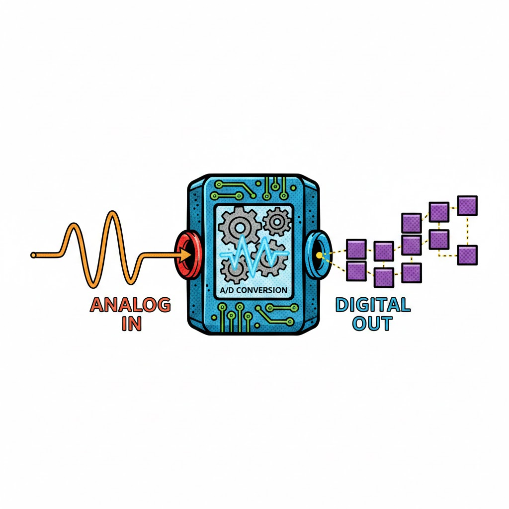

</div>
</div>

---

<div class="columns">
<div>

### Mathematische Beschreibung (1/2)

**1. Kontinuierliches Eingangssignal**

Das zu messende Signal sei eine sinusförmige Spannung $U(t)$:
$$ U(t) = A \cdot \sin(\omega t + \phi) $$
- $A$: Amplitude
- $\omega = 2\pi f$: Kreisfrequenz
- $\phi$: Phasenverschiebung

Dieses Signal existiert und ändert sich kontinuierlich über die Zeit.

</div>
<div>

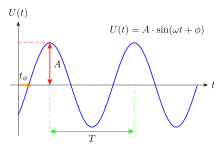

</div>
</div>

---

<div class="columns">
<div class="two">

### Mathematische Beschreibung (2/2)

**2. Diskreter Abtastvorgang**

Der Sensor misst den Wert von $U(t)$ nur zu bestimmten Zeitpunkten $t_k$:
$$ t_k = k \cdot T_s, \quad k = 0, 1, 2, \dots $$
- $T_s$: Abtastperiode (z.B. 100 ms)

**3. Ausgangssignal (Zero-Order Hold)**

Zwischen zwei Abtastungen hält der Sensor den zuletzt gemessenen Wert konstant. Dies wird als **Zero-Order Hold (ZOH)** bezeichnet. Das Ausgangssignal $U_{sens}(t)$ ist eine stückweise konstante Funktion:
$$ U_{sens}(t) = U(t_k) \quad \text{für} \quad t_k \le t < t_{k+1} $$

</div>
<div>

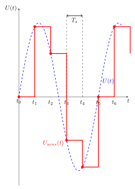

</div>
</div>

---

<div class="columns">
<div class="two">

### Hybride Eigenschaften des Systems

Das Gesamtsystem ist ein klassisches hybrides System:

- **Kontinuierliche Dynamik:** Das Eingangssignal $U(t)$ entwickelt sich kontinuierlich.
- **Diskrete Ereignisse:** Die Abtastzeitpunkte $t_k$ sind diskrete Ereignisse, die periodisch auftreten.
- **Diskrete Zustandsänderung:** Bei jedem Abtastereignis wird der interne Zustand des Sensors (der gespeicherte Messwert) aktualisiert. Dies führt zu einer sprunghaften Änderung des Ausgangssignals $U_{sens}(t)$.

Im Gegensatz zum Bouncing Ball sind die Ereignisse hier **zeitgesteuert** (periodisch) und nicht **zustandsgesteuert** (abhängig von $y(t) \le 0$).

</div>
<div>

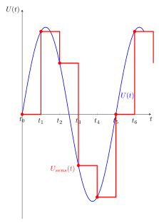

</div>
</div>

---

<div class="columns">
<div class="three">

### Erweiterung: Digitaler Sensor mit **variabler Abtastzeit**

Eine starre, periodische Abtastung kann ineffizient sein:
-   **Zu langsame Abtastung:** Wichtige Signaländerungen werden verpasst (Aliasing).
-   **Zu schnelle Abtastung:** Redundante Daten werden erzeugt, wenn sich das Signal kaum ändert.

**Ansatz:** Die Abtastrate wird dynamisch angepasst:
-   **Hohe Abtastrate** bei schnellen Änderungen.
-   **Niedrige Abtastrate** bei langsamen Änderungen.

Dies führt zu einem **ereignisgesteuerten hybriden System**, bei dem die Abtastereignisse nicht mehr rein zeitgesteuert, sondern auch vom Zustand des Systems abhängig sind.

</div>
<div>

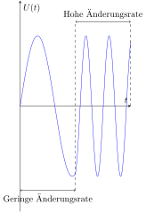

</div>
</div>

---

### Steuerung der Abtastrate

Die Abtastrate wird durch ein zweites, kontinuierliches Signal gesteuert, das die Änderungsrate des Eingangssignals repräsentiert.

**1. Eingangssignal $U(t)$:**
$$ U(t) = A \cdot \sin(\omega t) $$

**2. Steuer-Signal (Änderungsrate) $c(t)$:**
Die Ableitung von $U(t)$ beschreibt, wie schnell es sich ändert. Wir verwenden den Absolutwert:
$$ c(t) = \left| \frac{dU}{dt} \right| = |A \omega \cos(\omega t)| $$

**3. Variable Abtastperiode $T_s(t)$:**
Die Zeit bis zur nächsten Abtastung wird umgekehrt proportional zur Änderungsrate festgelegt:
- **Schnelle Änderung (hohes $c(t)$) $\implies$ kurze Abtastperiode.**
- **Langsame Änderung (niedriges $c(t)$) $\implies$ lange Abtastperiode.**

---

<div class="columns">
<div>

### Eingangssignal und Steuersignal

- **Eingangssignal $U(t)$:** Das zu messende Signal. In diesem Fall eine Sinuswelle.
- **Steuersignal $c(t)$:** Die Änderungsrate von $U(t)$, hier der Absolutwert der Ableitung. Hohe Werte von $c(t)$ bedeuten, dass sich $U(t)$ schnell ändert.

Die variable Abtastlogik nutzt $c(t)$, um die Abtastrate anzupassen:
- **Hoch** bei schnellen Änderungen (hohes $c(t)$).
- **Niedrig** bei langsamen Änderungen (niedriges $c(t)$).

</div>
<div>

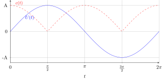

</div>
</div>

---

<div class="columns">
<div class="two">

### Umsetzung der variablen Abtastung

**Ablauf bei jedem Abtast-Schritt $t_k$:**
1.  **Messen:** Der Wert des Eingangssignals $U(t_k)$ wird erfasst.
2.  **Bestimmen der Änderungsrate:** Der Wert des Steuersignals $c(t_k)$ wird ermittelt.
3.  **Berechnen des nächsten Zeitpunkts:** Die nächste Abtastperiode $\Delta t_k$ wird berechnet, z.B. über eine Formel wie:
    $$ \Delta t_k = \frac{T_{max}}{1 + \text{gain} \cdot c(t_k)} $$
    Der nächste Abtastzeitpunkt ist dann $t_{k+1} = t_k + \Delta t_k$.
4.  **Halten des Werts:** Der Ausgang $U_{sens}(t)$ wird für das Intervall $[t_k, t_{k+1})$ auf den Wert $U(t_k)$ gesetzt.

</div>
<div>

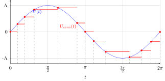

</div>
</div>

---


## 6.3: Allgemeine Definition

Dieser Abschnitt beinhaltet Folgendes:

- TODO Kurze Übersicht der Inhalte des Abschnitts 6.3

---

<div class="columns">
<div>

### Definition hybrider dynamischer Modelle

- **Kombination** aus kontinuierlichen und diskreten Dynamiken.
- **Zustandsänderungen** können kontinuierlich (beschrieben durch Differentialgleichungen) oder sprunghaft (ausgelöst durch Ereignisse) sein.
- **Beispiele:** Systeme mit physikalischen Prozessen, die durch Software gesteuert werden, oder mechanische Systeme mit Kontaktphänomenen.
- **Modellierung:** Oft durch Differential-Algebraische Gleichungen (DAEs) und endliche Automaten (State Machines).

</div>
<div>


</div>
</div>

---

<div class="columns">
<div class="three">

### Abgrenzung zu rein kontinuierlichen und rein diskreten Modellen

- **Rein kontinuierliche Modelle:**
    - Zustand ändert sich stetig über die Zeit.
    - Beschrieben durch Differentialgleichungen.
    - Beispiel: Feder-Masse-Dämpfer-System.
- **Rein diskrete Modelle:**
    - Zustand ändert sich nur zu bestimmten Zeitpunkten.
    - Beschrieben durch Ereignisse / Zustandsübergänge.
    - Beispiel: Warteschlangensysteme, Petri-Netze.
- **Hybride Modelle:** Überbrücken die Lücke zwischen diesen beiden Welten, indem sie beide Arten von Dynamiken integrieren.

</div>
<div class="two">


</div>
</div>

---

### Typische Anwendungsbeispiele

- **Regelungssysteme:**
    - Kontinuierlicher physikalischer Prozess (z.B. Temperaturregelung).
    - Diskret arbeitender digitaler Regler (z.B. PID-Regler in einem Mikrocontroller).
- **Schaltvorgänge:**
    - Elektrische Schaltungen, die ihren Zustand sprunghaft ändern (z.B. Relais, Transistoren).
    - Hydraulische oder pneumatische Ventile.
- **Physikalische Kontakte:**
    - Aufprall eines Balls auf eine Oberfläche.
    - Öffnen und Schließen von Türen oder Klappen.
- **Produktionssysteme:**
    - Kontinuierliche Materialflüsse (z.B. Flüssigkeiten in Rohren).
    - Diskrete Fertigungsschritte (z.B. Montage, Qualitätskontrolle).

---

### Herausforderungen bei der Simulation hybrider Systeme

- **Ereignisbehandlung:**
    - Präzise Lokalisierung von Ereigniszeitpunkten (z.B. Nulldurchgänge).
    - Vermeidung von "Event Missing" (Ereignis wird übersehen) oder "Event Jitter" (ungenauer Zeitpunkt).
- **Zustandskonsistenz:**
    - Sicherstellung korrekter Zustandsübergänge bei Ereignissen.
    - Behandlung von Zustands-Resets oder -Modifikationen.
- **Numerische Stabilität:**
    - Integratoren können bei steifen Systemen oder häufigen Ereignissen instabil werden.
    - Anpassung der Schrittweite.
- **Komplexität:**
    - Höherer Modellierungs- und Implementierungsaufwand.
    - Kombination von kontinuierlichen Solvern und Ereignis-Dispatchern.

---

### **Erweiterter** allgemeiner Formalismus (1/4)

<div class="columns top">
<div class="two">

**Bisheriger Formalismus (rein kontinuierlich)**

**Zustandsgleichung (Ableitungen):**
$$ \dot{x}(t) = f(t, x(t), u(t)) $$

**Ausgangsgleichung:**
$$ y(t) = g(t, x(t), u(t)) $$

- $x(t)$: Vektor der **kontinuierlichen** Zustände
- $u(t)$: Vektor der Eingänge
- $y(t)$: Vektor der Ausgänge

</div>
<div class="two">

**Erweiterung für hybride Systeme**

1.  **Diskrete Zustände ($x_d$)**: Speichern von Zustandsinformation, die sich nur sprunghaft ändert.

2.  **Update-Funktion ($h$)**: Definiert die sprung-hafte Änderung der Zustände bei einem Ereignis.

3.  **Zero-Crossing-Funktion ($z$)**: Erkennt, wann ein diskretes Ereignis eintritt (z.B. Kollision, Schwellwert erreicht).

4.  **Funktion für Abtastzeitpunkte ($T_{next}$)**: Definiert den nächsten Zeitpunkt einer diskreten oder variablen Aktualisierung.

</div>
</div>

---

### **Erweiterter** allgemeiner Formalismus (2/4)

**Zustände:**
Ein hybrides System besitzt zwei Arten von Zuständen:
- **Kontinuierliche Zustände $x_c(t) \in \mathbb{R}^{n_c}$**: Ändern sich stetig (z.B. Position, Geschwindigkeit).
- **Diskrete Zustände $x_d(t) \in \mathbb{R}^{n_d}$**: Ändern sich nur zu diskreten Zeitpunkten (z.B. Schaltzustand, Zähler).

**Funktionen:**
Die Dynamik wird durch **fünf** Kernfunktionen beschrieben:

1.  **Ableitungsfunktion $f$**: Definiert die kontinuierliche Dynamik.
    $$ \dot{x}_c(t) = f(t, x_c(t), x_d(t), u(t)) $$

2.  **Ausgangsfunktion $g$**: Berechnet die Ausgänge des Blocks.
    $$ y(t) = g(t, x_c(t), x_d(t), u(t)) $$

---

### **Erweiterter** allgemeiner Formalismus (3/4)

3.  **Zero-Crossing-Funktion $z$**:
    Eine Vektor-wertige Funktion, deren Nulldurchgänge Ereignisse signalisieren.
    $$ z(t, x_c(t), x_d(t), u(t)) \in \mathbb{R}^{n_z} $$
    Ein Ereignis tritt zum Zeitpunkt $t_e$ auf, wenn eine Komponente $z_i$ das Vorzeichen wechselt (d.h. $z_i(t_e) = 0$).

4.  **Update-Funktion $h$**:
    Wird zum Ereigniszeitpunkt $t_e$ aufgerufen und berechnet die neuen Zustände $x_c^+$ und $x_d^+$ unmittelbar nach dem Ereignis.
    $$ (x_c(t_e^+), x_d(t_e^+)) = h(t_e, x_c(t_e^-), x_d(t_e^-), u(t_e)) $$
    - $x_c(t_e^-), x_d(t_e^-)$: Zustände unmittelbar *vor* dem Ereignis.

---

### **Erweiterter** allgemeiner Formalismus (4/4)

5.  **Funktion für nächsten Abtastzeitpunkt $T_{next}$**:
    Diese Funktion bestimmt den nächsten Zeitpunkt, zu dem der Block eine diskrete Aktion ausführen muss.
    $$ t_{next} = T_{next}(t, x_c(t), x_d(t), u(t)) $$
    - Für **kontinuierliche Blöcke** wird per Konvention der Wert `0` zurückgegeben, um anzuzeigen, dass keine explizite diskrete Abtastung erforderlich ist.
    - Für **Blöcke mit fester Abtastzeit** ist der nächste Zeitpunkt deterministisch ($t_k = t_0 + k \cdot T_s$) und muss nicht über diese Funktion berechnet werden.
    - Für **Blöcke mit variabler Abtastzeit** wird der nächste Zeitpunkt dynamisch in Abhängigkeit vom aktuellen Zustand und den Eingängen berechnet.

Dieser erweiterte Formalismus, angelehnt an die S-Function-Spezifikation von MATLAB/Simulink, erlaubt die Modellierung des komplexen Zusammenspiels von kontinuierlicher Entwicklung und sprunghaften Zustandsänderungen.

---


## 6.4: Softwarearchitektur

Dieser Abschnitt beinhaltet Folgendes:

- TODO Kurze Übersicht der Inhalte des Abschnitts 6.4

---

### Erweiterte `Block`-Klasse

Die `Block`-Klasse, der zentrale Baustein unserer Simulationsumgebung, wurde erheblich erweitert, um diskrete Zustände, Ereignisse und flexible Abtastzeiten verwalten zu können:

-   **`DiscreteStates`**: Eine Liste von diskreten Zustandsvariablen, die sich nur sprunghaft ändern.
-   **`ZeroCrossings`**: Eine Liste von Ereignissignalen, deren Nulldurchgänge diskrete Ereignisse auslösen.
-   **`SampleTime`**: Ein Objekt, das die Abtasteigenschaften des Blocks definiert (kontinuierlich, diskret, variabel).
-   **`GetNextVariableHitTime(...)`**: Eine Methode zur Bestimmung des nächsten Zeitpunkts, zu dem ein Block mit variabler Abtastzeit aktiv werden muss.
-   **`CalculateZeroCrossings(...)`**: Eine Methode zur Berechnung der Werte der Zero-Crossing-Funktionen.
-   **`UpdateStates(...)`**: Eine Methode, die bei diskret getakteten Blöcken oder nach dem Erkennen eines Nulldurchgangs aufgerufen wird, um die Zustände (kontinuierlich und/oder diskret) sprunghaft anzupassen.

---

<div class="columns">
<div>

### UML-Klassendiagramm

Die Grafik auf der rechten Seite zeigt das UML-Klassendiagramm für die erweiterte `Block`-Klasse.

Zu beachten sind vor allen die beiden neuen Verbindungen zwischen der Klasse `Block` und den Klassen `ZeroCrossingDeclaration` und `SampleTime`.

Außerdem wurden die Methoden `CalcualteZeroCrossings` und `Update-States`eingefügt.

</div>
<div>


</div>
</div>

---

```csharp
public abstract class Block
{
    public List<StateDeclaration> ContinuousStates { get; }
    public List<StateDeclaration> DiscreteStates { get; }
    public List<InputDeclaration> Inputs { get; }
    public List<OutputDeclaration> Outputs { get; }
    public List<ZeroCrossingDeclaration> ZeroCrossings { get; }

    public SampleTime SampleTime { get; }

    virtual public void InitializeStates(
        double[] cStates, double[] dStates);
    virtual public double GetNextVariableHitTime(
        double time, double[] cStates, double[] dStates, double[] inputs);
    virtual public void CalculateOutputs(
        double time, double[] cStates, double[] dStates, double[] inputs, double[] outputs);
    virtual public void CalculateDerivatives(
        double time, double[] cStates, double[] dStates, double[] inputs, double[] derivatives);
    virtual public void CalculateZeroCrossings(
        double time, double[] cStates, double[] dStates, double[] inputs, double[] zeroCrossings);
    virtual public void UpdateStates(
        double time, double[] cStates, double[] dStates, double[] inputs);
}
```

---

<div class="columns">
<div class="three">

### Deklaration von Schnittstellen und Ereignissen

Neben den bereits bekannten Deklarationen für Zustände (`StateDeclaration`), Eingänge (`InputDeclaration`) und Ausgänge (`OutputDeclaration`) wurde eine neue `ZeroCrossingDeclaration` hinzugefügt, um die Zero-Crossing-Signale eines Blocks zu beschreiben.

```csharp
namespace SFunctionHybrid.Framework.Declarations
{
    public class ZeroCrossingDeclaration : Declaration
    {
        public ZeroCrossingDeclaration(string name) : base(name)
        {

        }
    }
}
```

</div>
<div class="two">


</div>
</div>

---

### Abtastzeiten (Klasse `SampleTime`)

Das Konzept der Abtastzeit (`SampleTime`) wurde eingeführt, um dem Solver mitzuteilen, wie und wann ein Block seine Zustände aktualisieren und Ausgänge berechnen soll. Dies wird durch eine Klassenhierarchie abgebildet:

-   **`ContinuousSampleTime`**: Der Block ist kontinuierlich und wird bei jedem Integrationsschritt des Solvers berechnet (Standard für kontinuierliche Blöcke).
-   **`DiscreteSampleTime`**: Der Block ist diskret und wird in festen, periodischen Intervallen aktualisiert. Definiert durch `Offset` (Startzeitpunkt) und `Period` (Abtastperiode).
-   **`VariableSampleTime`**: Der Block ist ereignisgesteuert und wird zu variablen Zeitpunkten aktualisiert, die der Block selbst über `GetNextVariableHitTime` meldet. Definiert durch einen initialen `Offset`.
-   **`ConstantSampleTime`**: Für Blöcke, die konstante Werte liefern und keine Abtastzeit im eigentlichen Sinne benötigen (z.B. `ConstantBlock`).
-   **`InheritedSampleTime`**: Die Abtastzeit wird vom übergeordneten System oder den Eingangsblöcken geerbt (Standard für algebraische Blöcke).

---

<div class="columns">
<div class="three">

### Umsetzung der `SampleTime`-Klassen

```csharp
public abstract class SampleTime { }

public class ContinuousSampleTime : SampleTime { }

public class DiscreteSampleTime : SampleTime
{
    public double Offset { get; }
    public double Period { get; }
    public DiscreteSampleTime(double offset, double period) { /* ... */ }
}

public class VariableSampleTime : SampleTime
{
    public double Offset { get; }
    public VariableSampleTime(double offset) { /* ... */ }
}

public class ConstantSampleTime : SampleTime { }

public class InheritedSampleTime : SampleTime { }
```

</div>
<div>


</div>
</div>

---

### ZeroOrderHoldBlock

Der `ZeroOrderHoldBlock` realisiert die klassische Abtastung und Haltefunktion (Sample & Hold):

-   **Abtastzeit:** `DiscreteSampleTime`. Der Block wird nur zu diskreten Zeitpunkten $t_k = t_0 + k \cdot T_s$ aktiv.
-   **Zustand:** Ein diskreter Zustand `X`, der den zuletzt abgetasteten Wert speichert.
-   **Verhalten:**
    -   Bei jedem Abtastschritt (`UpdateStates`) wird der aktuelle Eingangswert in den internen Zustand übernommen ($x_{diskret} = u$).
    -   Der Ausgang (`CalculateOutputs`) ist immer der aktuelle Wert des Zustands.

```csharp
public override void UpdateStates(double time, double[] cStates, double[] dStates, double[] inputs)
{
    // Speichern des aktuellen Eingangswerts im diskreten Zustand
    dStates[0] = inputs[0];
}
```

---

### DiscreteTimeIntegratorBlock

Der `DiscreteTimeIntegratorBlock` führt eine Integration über die Zeit in diskreten Schritten durch (Summation):

-   **Abtastzeit:** `DiscreteSampleTime`.
-   **Zustand:** Ein diskreter Zustand `X`, der das Integral akkumuliert.
-   **Verhalten:**
    -   Nutzt das explizite Euler-Verfahren für die diskrete Integration.
    -   Bei jedem Schritt wird das Produkt aus Eingangswert und Periodendauer zum Zustand addiert.

```csharp
public override void UpdateStates(double time, double[] cStates, double[] dStates, double[] inputs)
{
    // Integration: Neuer Zustand = Alter Zustand + Eingang * Zeitschritt
    double period = ((DiscreteSampleTime)SampleTime).Period;
    dStates[0] += inputs[0] * period;
}
```

---

### HitLowerLimitBlock (Ereignisdetektion)

Dieser Block dient der Detektion von Schwellwert-Unterschreitungen (Events), ohne den Zustand selbst zu ändern:

-   **Funktion:** Meldet ein Ereignis, wenn das Eingangssignal eine untere Schranke unterschreitet.
-   **Zero-Crossing:** Definiert eine Funktion $z$, deren Vorzeichenwechsel vom Solver überwacht wird.
    $$ z = u - \text{Limit} $$
-   Der Solver kann durch Interpolation den exakten Zeitpunkt $t_e$ des Nulldurchgangs ($z=0$) finden ("Zero Crossing Detection").

```csharp
public override void CalculateZeroCrossings(..., double[] inputs, double[] zeroCrossings)
{
    // Das Ereignis tritt auf, wenn diese Funktion das Vorzeichen wechselt
    zeroCrossings[0] = inputs[0] - LowerLimit;
}
```

---

### IntegrateWithReset (Zustandsmanipulation)

Ein kontinuierlicher Integrator, dessen Zustand durch ein diskretes Ereignis zurückgesetzt werden kann:

-   **Kontinuierlicher Zustand:** $x_c$ (das Integral).
-   **Zero-Crossing:** Überwacht ein Trigger-Signal (z.B. $u_{trigger} - 1$).
-   **UpdateStates:** Wird ausgeführt, wenn der Solver einen Nulldurchgang detektiert. Setzt den Integrator-Zustand sprunghaft auf einen neuen Wert.

```csharp
public override void UpdateStates(double time, double[] cStates, ..., double[] inputs)
{
    // Wenn das Trigger-Signal aktiv ist (hier == 1)
    if (inputs[1] == 1)
    {
        // ... wird der kontinuierliche Zustand hart zurückgesetzt
        cStates[0] = inputs[2];
    }
}
```

---

### IntegrateWithLowerLimit

Ein Integrator mit einer harten unteren Schranke (wichtig z.B. beim Bouncing Ball, damit dieser nicht "durch den Boden" fällt):

-   **Kombination:** Integriert kontinuierlich, überwacht aber gleichzeitig das Limit.
-   **Zero-Crossing:** $z = x_c - \text{Limit}$. Ermöglicht dem Solver, den Zeitpunkt des Aufsetzens exakt zu finden.
-   **UpdateStates:** Korrigiert den Zustand beim Erreichen oder Unterschreiten des Limits.

```csharp
public override void UpdateStates(double time, double[] cStates, ..., double[] inputs)
{
    // Falls der Zustand unter das Limit gefallen ist
    if (cStates[0] < LowerLimit)
    {
        // ... wird er auf einen korrigierten Wert (z.B. Position beim Stoß) gesetzt
        cStates[0] = inputs[1];
    }
}
```

---

### VariableSampleTimeBlock

Ein Block, der seine Abtastzeit dynamisch anpassen kann (Ereignissteuerung):

-   **Abtastzeit:** `VariableSampleTime`.
-   **GetNextVariableHitTime:** Eine spezielle Methode, die vom Solver aufgerufen wird, um zu erfahren, wann dieser Block das nächste Mal berechnet werden *muss*.
-   **Anwendung:** Ermöglicht adaptive Schrittweitensteuerung durch den Block selbst, z.B. häufige Abtastung bei schnellen Signaländerungen.

```csharp
public override double GetNextVariableHitTime(double time, ..., double[] inputs)
{
    // Der nächste Aufrufzeitpunkt wird dynamisch berechnet
    // Hier: Aktuelle Zeit + ein durch den Eingang bestimmtes Delta
    double deltaT = inputs[0];
    return time + deltaT;
}
```

---

<div class="columns">
<div class="three">

### Erweiterte Solver-Implementierungen

Die ursprüngliche Solver-Implementierung (siehe Kapitel 4) wurde um die folgenden Punkte erweitert, um mit den diskreten Zustandsübergängen umgehen zu können:

-   Sie berücksichtigt nun `DiscreteStates` bei der Initialisierung und Zustandsspeicherung.
-   Die Logik zur Nulldurchgangsdetektion wurde erweitert und nutzt die `ZeroCrossings`-Deklarationen der Blöcke.
-   Die `UpdateStates`-Methode des Solvers ruft nun die `UpdateStates`-Methode der Blöcke basierend auf ihren `SampleTime`-Eigenschaften (diskret, variabel) oder erkannten Zero-Crossings auf.

</div>
<div class="two">


</div>
</div>

---


## 6.5: Nulldurchgangsdetektion

Dieser Abschnitt beinhaltet Folgendes:

- TODO Kurze Übersicht der Inhalte des Abschnitts 6.5

---

<div class="columns">
<div class="five">

### Algorithmus zur Nulldurchgangsdetektion

Der Solver nutzt einen iterativen Prozess, um den genauen Zeitpunkt eines Ereignisses zu finden:

1.  **Erkennung:** Der Solver stellt am Ende eines Integrationsschritts fest, dass eine Zero-Crossing-Funktion $z$ das Vorzeichen gewechselt hat ($z(t) \cdot z(t+\Delta t) < 0$).
2.  **Lokalisierung:** Der Zeitschritt wird iterativ halbiert (Bisektion), um den Zeitpunkt $t_e$ zu finden, an dem $z(t_e) \approx 0$ ist.
3.  **Behandlung:**
    -   Die Simulation wird bis exakt $t_e$ fortgeführt.
    -   `UpdateStates` wird aufgerufen, um diskrete Zustandsänderungen durchzuführen.
    -   Die Simulation wird von $t_e$ aus fortgesetzt (oft mit Neustart der Integrationsschrittweite).

</div>
<div>

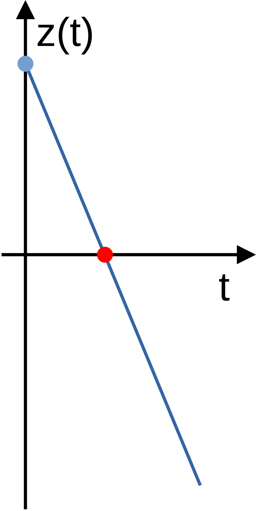

</div>
</div>

---

### Vereinfachte Logik im Solver

<div class="columns">
<div class="three">

```csharp
timeStep = timeStepMax * 2; RememberStates();

while (zeroCrossingValue > Threshold && iteration++ < Limit)
{
    timeStep /= 2; ResetStates();

    IntegrateContinuousStates(timeStep);

    CalculateOutputs(time + timeStep);

    zeroCrossingValue = CalculateZeroCrossings(time + timeStep);
}

UpdateStates(time + timeStep);

CalculateOutputs(time + timeStep);
CalculateDerivatives(time + timeStep);
CalculateZeroCrossings(time + timeStep);
```

</div>
<div>


</div>
</div>

---

<div class="columns">
<div class="three">

### Testfall: Integration mit unterem Limit

Wir betrachten ein einfaches System, um die Ereignisbehandlung zu testen:

-   Ein konstanter negativer Eingang ("Schwerkraft") zieht den Zustand nach unten.
-   Ein `IntegrateWithLowerLimitBlock` integriert diesen Wert.
-   Das Limit ist bei $0$.
-   Beim Erreichen des Limits, wird der Zustand auf einen Vorgabewert zurückgesetzt.
-   **Erwartung:** Der Zustand sinkt linear ab, trifft exakt auf 0, und wird dann auf den Vorgabewert zurückgesetzt.

Dies demonstriert die Fähigkeit des Solvers, harte physikalische Grenzen (Hard Stops) korrekt abzubilden.

</div>
<div>


</div>
</div>

---


### Lösung mit dem **expliziten** Verfahren

Die blauen Punkte markieren die Berechnungsschritte des Solvers. Man erkennt deutlich, wie der Solver sich an das Limit "herantastet":
-   Große Schritte während der linearen Abwärtsbewegung.
-   **Verdichtung der Schritte** unmittelbar vor dem Erreichen der Nulllinie.
-   Der Solver findet den exakten Zeitpunkt des Aufpralls und setzt den Zustand auf den Vorgabewert zurück.

---

<div class="columns">
<div class="three">

### Testfall: **Bouncing Ball** (*Naive* Implementierung)

Implementierung des Bouncing Balls *ohne* spezielle Zero-Crossing-Unterstützung im Integrator selbst (nutzt `IntegrateWithReset` und externen `HitLowerLimit`):

-   Die Beschleunigung ist konstant (Erdbeschleunigung).
-   Die Geschwindigkeit wird integriert und kann zurückgesetzt werden.
-   Die Position wird normal integriert (kein Zurücksetzen möglich).
-   Ein separater Block prüft auf $y \leq 0$ und löst den Reset der Geschwindigkeit aus.
-   Bei einem Reset wird die aktuelle Geschwindigkeit mit einem negativen Dämpfungsfaktor multipliziert.

</div>
<div class="two">


</div>
</div>

---


### Lösung mit dem **expliziten** Solver

Das Ergebnis sieht auf den ersten Blick akzeptabel aus:

- Die Geschwindigkeitkurve während der Freiflugphase entspricht einer Geraden.
- Die Positionskurve während der Freiflugphase entspricht einer Parabel.
- Wenn die Positionskurve Null erreicht, wird die Geschwindigkeit zurückgesetzt.
- Die Sprünge werden immer kleiner, bis ein minimaler Wert erreicht ist.
- **Ab dann wiederholt sich die Sprung-höhe immer wieder**.

---


### Lösung mit dem **impliziten** Solver

Hier zeigt sich ein Problem, das vielleicht nicht zu erwarten war:

- Die **ersten drei Sprünge** werden normal und korrekt berechnet.
- Beim **vierten Sprung** klebt der Ball auch noch korrekt am Boden.
- Beim **fünften Sprung** durchbricht der Ball jedoch den Boden, da der Ball bereits am Boden ist (d.h. $y \leq 0$) und das implizite Verfahren für den nächsten Zeitpunkt eine negative Geschwindigkeit ($v < 0$) berechnet.

---

<div class="columns">
<div class="three">

### Testfall: **Bouncing Ball** (*Erweiterte* Implementierung)

Verwendung des `IntegrateWithLowerLimitBlock` für die Berechnung der Position:

-   Der Integrator für die Position selbst kennt das Limit (d.h. $y=0$).
-   Er meldet dem Solver proaktiv die Entfernung zum Limit via `CalculateZeroCrossings`.
-   Der Solver kann den *exakten* Zeitpunkt des Aufpralls $t_e$ finden, *bevor* die Integration fortgesetzt wird.
-   Beim Aufprall wird die Position hart auf 0 gehalten und die Geschwindigkeit (im anderen Integrator) invertiert.
-   Das Zurücksetzen der Geschwindigkeit erfolgt wieder mit einem `HitLowerLimit` Block.

</div>
<div class="two">


</div>
</div>

---


### Lösung mit dem **expliziten** Solver

Ähnlich wie zuvor gute Ergebnisse, aber mit garantierter Einhaltung der Randbedingung $y \ge 0$:

- Bei der naiven Implementierung ist der Ball bei einem Nulldurchgang immer leicht unterhalb der Nulllinie.
- Bei der erweiterten Implementierung wird die Position des Balls in diesem Fall auf Null zurückgesetzt.
- Somit wird erzwungen, dass sich der Ball niemals unterhalb der Nulllinie befinden kann.

---


### Lösung mit dem **impliziten** Solver

Auch das Ergebnis des impliziten Solvers sieht gut besser aus, da die Randbedingung eingehalten wird:

- Der Ball durchbricht die Nulllinie nicht mehr (im Gegensatz zur naiven Implementierung).
- Die Simulation ist physikalisch robust und numerisch stabil, auch bei variablen Schrittweiten.
- Der Ball bleibt nach einer Weile tatsächlich am Boden liegen, und macht keine Srünge mehr.

---


## 6.6 Diskrete Abtastzeiten

In diesem Abschnitt haben wir gesehen:

- TODO Kurze Übersicht über die Inhalte des Abschnitts 6.6

---

TODO Folie zur Berücksichtigung von diskreten Abtastzeiten im Solver (max time step)

---

TODO Folie zur Berücksichtigung von diskreten Abtastzeiten bei der Aktualisierung von Zuständen

---

TODO Folie zur Berechnung des nächsten diskreten Abtastzeitpunkts

---

<div class="columns">
<div>

TODO Folie zu Beispiel mit diskreten Abtastzeiten

</div>
<div>

TODO Mermaid-Diagramm für Beispiel mit diskreten Abtastzeiten

</div>
</div>

---

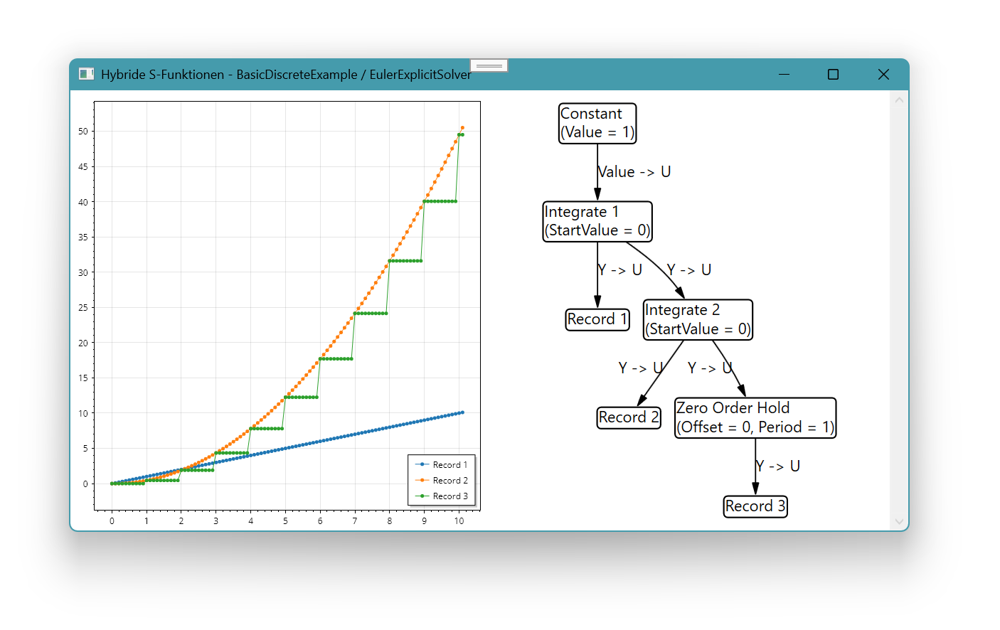

TODO Folie zur Lösung des Beispiels für diskrete Abtastzeiten mit dem expliziten Verfahren

---


## 6.7 Variable Abtastzeiten

In diesem Abschnitt haben wir gesehen:

- TODO Kurze Übersicht über die Inhalte des Abschnitts 6.7

---

TODO Folie zur Berücksichtigung von variablen Abtastzeiten im Solver (max time step)

---

TODO Folie zur Berücksichtigung von variablen Abtastzeiten bei der Aktualisierung von Zuständen

---

TODO Folie zur Berechnung des nächsten variablen Abtastzeitpunktes

---

<div class="columns">
<div>

TODO Folie zu Beispiel mit variable Abtastzeiten

</div>
<div>

TODO Mermaid-Diagramm für Beispiel mit variable Abtastzeiten

</div>
</div>

---

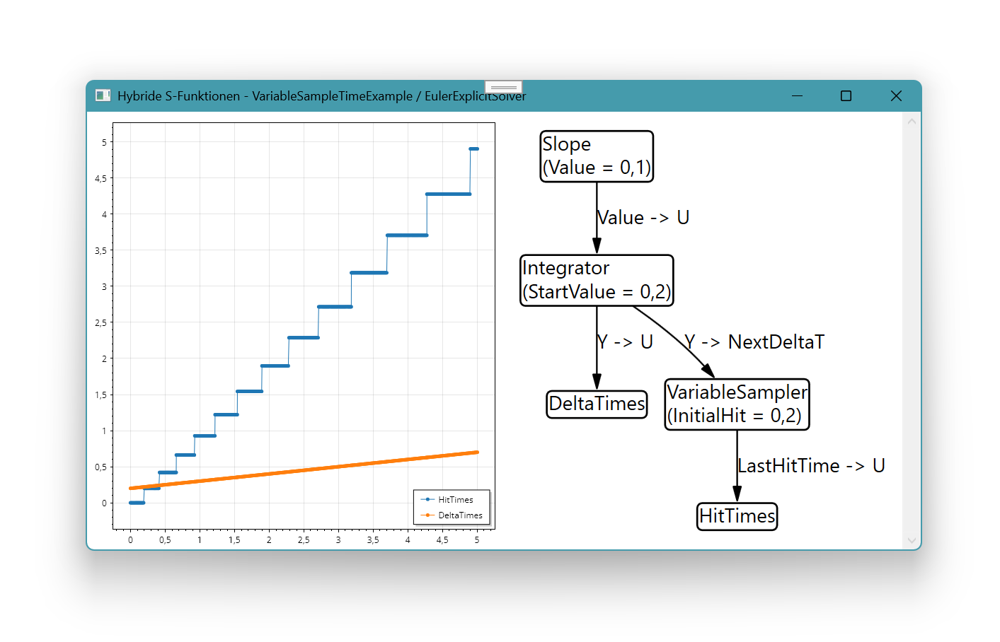

TODO Folie zu Lösung des Beispiels für variable Abtastzeiten mit dem expliziten Verfahren