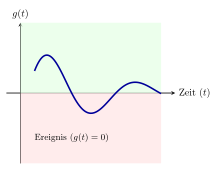

# Kapitel 6: Hybride Dynamische Modelle

Dieses Kapitel umfasst die folgenden Abschnitte:

- 6.1: Einführung in Hybride Dynamische Modelle
- 6.2: Nulldurchgangsdetektion
- 6.3: Fallbeispiel: Der Bouncing Ball
- 6.4: Diskrete Blöcke mit regelmäßiger Abtastzeit
- 6.5: Diskrete Blöcke mit variabler Abtastzeit (Next Variable Hit Time)

---

## 6.1: Einführung in Hybride Dynamische Modelle

Dieser Abschnitt umfasst die folgenden Inhalte:

- **Definition** hybrider dynamischer Modelle
- **Abgrenzung** zu rein kontinuierlichen und rein diskreten Modellen
- **Typische Anwendungsbeispiele** (z.B. Systeme mit Regelung, Schaltvorgängen, physikalischen Kontakten)
- **Herausforderungen** bei der Simulation hybrider Systeme

---

### Definition hybrider dynamischer Modelle

- **Kombination** aus kontinuierlichen und diskreten Dynamiken.
- **Zustandsänderungen** können kontinuierlich (beschrieben durch Differentialgleichungen) oder sprunghaft (ausgelöst durch Ereignisse) sein.
- **Beispiele:** Systeme mit physikalischen Prozessen, die durch Software gesteuert werden, oder mechanische Systeme mit Kontaktphänomenen.
- **Modellierung:** Oft durch Differential-Algebraische Gleichungen (DAEs) und endliche Automaten (State Machines).

---

### Abgrenzung zu rein kontinuierlichen und rein diskreten Modellen

- **Rein kontinuierliche Modelle:**
    - Zustand ändert sich stetig über die Zeit.
    - Beschrieben durch Differentialgleichungen.
    - Beispiel: Feder-Masse-Dämpfer-System.
- **Rein diskrete Modelle:**
    - Zustand ändert sich nur zu bestimmten Zeitpunkten.
    - Beschrieben durch Ereignisse / Zustandsübergänge.
    - Beispiel: Warteschlangensysteme, Petri-Netze.
- **Hybride Modelle:** Überbrücken die Lücke zwischen diesen beiden Welten, indem sie beide Arten von Dynamiken integrieren.

---

### Typische Anwendungsbeispiele

- **Regelungssysteme:**
    - Kontinuierlicher physikalischer Prozess (z.B. Temperaturregelung).
    - Diskret arbeitender digitaler Regler (z.B. PID-Regler in einem Mikrocontroller).
- **Schaltvorgänge:**
    - Elektrische Schaltungen, die ihren Zustand sprunghaft ändern (z.B. Relais, Transistoren).
    - Hydraulische oder pneumatische Ventile.
- **Physikalische Kontakte:**
    - Aufprall eines Balls auf eine Oberfläche.
    - Öffnen und Schließen von Türen oder Klappen.
- **Produktionssysteme:**
    - Kontinuierliche Materialflüsse (z.B. Flüssigkeiten in Rohren).
    - Diskrete Fertigungsschritte (z.B. Montage, Qualitätskontrolle).

---

### Herausforderungen bei der Simulation hybrider Systeme

- **Ereignisbehandlung:**
    - Präzise Lokalisierung von Ereigniszeitpunkten (z.B. Nulldurchgänge).
    - Vermeidung von "Event Missing" (Ereignis wird übersehen) oder "Event Jitter" (ungenauer Zeitpunkt).
- **Zustandskonsistenz:**
    - Sicherstellung korrekter Zustandsübergänge bei Ereignissen.
    - Behandlung von Zustands-Resets oder -Modifikationen.
- **Numerische Stabilität:**
    - Integratoren können bei steifen Systemen oder häufigen Ereignissen instabil werden.
    - Anpassung der Schrittweite.
- **Komplexität:**
    - Höherer Modellierungs- und Implementierungsaufwand.
    - Kombination von kontinuierlichen Solvern und Ereignis-Dispatchern.

---

### Erweiterter Formalismus (1/3)

**Bisheriger Formalismus (rein kontinuierlich)**

Basierend auf der Zustandsraumdarstellung aus Kapitel 4:

**Zustandsgleichung (Ableitungen):**
$$ \dot{x}(t) = f(t, x(t), u(t)) $$

**Ausgangsgleichung:**
$$ y(t) = g(t, x(t), u(t)) $$

- $x(t)$: Vektor der **kontinuierlichen** Zustände
- $u(t)$: Vektor der Eingänge
- $y(t)$: Vektor der Ausgänge

**Erweiterung für hybride Systeme**

Um hybride Systeme zu modellieren, erweitern wir diesen Formalismus um:

1.  **Diskrete Zustände ($x_d$)**: Speichern von Zustandsinformation, die sich nur sprunghaft ändert (z.B. der aktuelle Modus eines Schalters).

2.  **Update-Funktion ($h$)**: Definiert die sprunghafte Änderung der Zustände bei einem Ereignis.

3.  **Zero-Crossing-Funktion ($z$)**: Erkennt, wann ein diskretes Ereignis eintritt (z.B. Kollision, Schwellwert erreicht).

---

### Erweiterter Formalismus (2/3)

**Zustände:**
Ein hybrides System besitzt zwei Arten von Zuständen:
- **Kontinuierliche Zustände $x_c(t) \in \mathbb{R}^{n_c}$**: Ändern sich stetig (z.B. Position, Geschwindigkeit).
- **Diskrete Zustände $x_d(t) \in \mathbb{R}^{n_d}$**: Ändern sich nur zu diskreten Zeitpunkten (z.B. Schaltzustand, Zähler).

**Funktionen:**
Die Dynamik wird durch vier Kernfunktionen beschrieben:

1.  **Ableitungsfunktion $f$**: Definiert die kontinuierliche Dynamik.
    $$ \dot{x}_c(t) = f(t, x_c(t), x_d(t), u(t)) $$

2.  **Ausgangsfunktion $g$**: Berechnet die Ausgänge des Blocks.
    $$ y(t) = g(t, x_c(t), x_d(t), u(t)) $$

---

### Erweiterter Formalismus (3/3)

3.  **Zero-Crossing-Funktion $z$**:
    Eine Vektor-wertige Funktion, deren Nulldurchgänge Ereignisse signalisieren.
    $$ z(t, x_c(t), x_d(t), u(t)) \in \mathbb{R}^{n_z} $$
    Ein Ereignis tritt zum Zeitpunkt $t_e$ auf, wenn eine Komponente $z_i$ das Vorzeichen wechselt (d.h. $z_i(t_e) = 0$).

4.  **Update-Funktion $h$**:
    Wird zum Ereigniszeitpunkt $t_e$ aufgerufen und berechnet die neuen Zustände $x_c^+$ und $x_d^+$ unmittelbar nach dem Ereignis.
    $$ (x_c(t_e^+), x_d(t_e^+)) = h(t_e, x_c(t_e^-), x_d(t_e^-), u(t_e)) $$
    - $x_c(t_e^-), x_d(t_e^-)$: Zustände unmittelbar *vor* dem Ereignis.

Dieser Formalismus erlaubt die Modellierung des komplexen Zusammenspiels von kontinuierlicher Entwicklung und sprunghaften Zustandsänderungen.

---

## 6.2: Nulldurchgangsdetektion

Dieser Abschnitt umfasst die folgenden Inhalte:

- **Konzept** des Nulldurchgangs (Zero-Crossing)
- **Bedeutung** in hybriden Systemen (Ereignisdetektion)
- **Algorithmus** zur Nulldurchgangslokalisierung (Iterative Bisektion im `EulerExplicitSolver`)
- **Implementierung** im `Solver.cs` und `EulerExplicitSolver.cs`
- **Zero-Crossing-Funktionen** in Blöcken (`Block.cs`, `HitLowerLimitBlock.cs`, `IntegrateWithLimitsBlock.cs`)

---

### Konzept des Nulldurchgangs (Zero-Crossing)

- Eine **Zero-Crossing-Funktion** $g(t, \vec{x}(t))$ ist eine Hilfsfunktion, deren Vorzeichenwechsel ein diskretes Ereignis signalisiert.
- Der Zeitpunkt, an dem $g(t, \vec{x}(t)) = 0$ ist, ist der **Ereigniszeitpunkt**.
- Das Vorzeichen von $g$ vor und nach dem Ereignis ist entscheidend (z.B. von positiv zu negativ).
- **Beispiele:**
    - $g = \text{Höhe} - \text{Bodenlinie}$ (Kollision)
    - $g = \text{Temperatur} - \text{Schwellwert}$ (Thermostat schaltet)

---

### Bedeutung in hybriden Systemen (Ereignisdetektion)

- **Präzise Ereigniserkennung:** Ermöglicht die genaue Lokalisierung von diskreten Ereignissen, die die Systemdynamik ändern.
- **Korrekte Zustandsübergänge:** Stellt sicher, dass Zustands-Resets oder -Modifikationen exakt zum Zeitpunkt des Ereignisses erfolgen.
- **Vermeidung numerischer Fehler:** Ohne Nulldurchgangsdetektion könnten Ereignisse übersprungen oder ungenau behandelt werden, was zu falschen Simulationsergebnissen führt.
- **Grundlage für hybride Solver:** Integriert die kontinuierliche Integration mit der diskreten Ereignisbehandlung.

---

### Algorithmus zur Nulldurchgangslokalisierung (Iterative Bisektion)

- **Problem:** Ein Ereignis ($g=0$) kann zwischen zwei Integrationsschritten $t_k$ und $t_{k+1}$ auftreten.
- **Ansatz:** Wenn $g(t_k)$ und $g(t_{k+1})$ unterschiedliche Vorzeichen haben, liegt ein Nulldurchgang im Intervall $[t_k, t_{k+1}]$ vor.
- **Iterative Bisektion:**
    1.  Halbiere das Intervall.
    2.  Berechne $g$ am Mittelpunkt.
    3.  Wähle das Teilintervall, in dem der Vorzeichenwechsel stattfindet.
    4.  Wiederhole, bis die gewünschte Genauigkeit (`ZeroCrossingValueThreshold`) erreicht ist oder die maximale Iterationsanzahl (`ZeroCrossingIterationCountLimit`) überschritten wird.
- Implementiert in `EulerExplicitSolver.Solve` im `while (zeroCrossingValue > ZeroCrossingValueThreshold ...)`-Block.

---

### Implementierung im `Solver.cs` und `EulerExplicitSolver.cs` (1/2)

- **`Solver.cs`:**
    - `ZeroCrossingValueThreshold`: Toleranz für die Nulldurchgangslokalisierung.
    - `ZeroCrossingIterationCountLimit`: Maximale Iterationen für die Lokalisierung.
    - `CalculateZeroCrossings(double t)`:
        - Iteriert über alle Blöcke und deren `ZeroCrossingDeclaration`s.
        - Ruft `Block.CalculateZeroCrossings` auf.
        - Prüft auf Vorzeichenwechsel zwischen dem aktuellen und dem vorherigen Zeitschritt.
        - Gibt den maximalen Absolutwert der Zero-Crossing-Funktionen zurück, die einen Vorzeichenwechsel hatten.

---

### Implementierung im `Solver.cs` und `EulerExplicitSolver.cs` (2/2)

- **`EulerExplicitSolver.cs`:**
    - Die `Solve`-Methode enthält die Hauptschleife für die Simulation.
    - Innerhalb dieser Schleife wird die iterative Bisektion angewendet, um Nulldurchgänge zu lokalisieren.
    - Bei einem gefundenen Nulldurchgang wird `UpdateStates` aufgerufen, um die Zustände des Systems anzupassen.

---

### Zero-Crossing-Funktionen in Blöcken (1/2)

- **`Block.cs`:**
    - Definiert eine virtuelle Methode `CalculateZeroCrossings(...)`, die von spezialisierten Blöcken überschrieben werden kann.
    - Enthält eine Liste von `ZeroCrossingDeclaration`s, die die Zero-Crossing-Signale des Blocks beschreiben.
- **`ZeroCrossingDeclaration.cs`:** Eine einfache Klasse zur Benennung eines Zero-Crossing-Signals.

---

### Zero-Crossing-Funktionen in Blöcken (2/2)

- **`HitLowerLimitBlock.cs`:**
    - Ein Block, der ein Zero-Crossing erzeugt, wenn sein Eingang einen definierten unteren Grenzwert erreicht.
    - `zeroCrossings[0] = inputs[0] - LowerLimit;`
- **`IntegrateWithLimitsBlock.cs`:**
    - Ein Integrator, der Zero-Crossings erzeugt, wenn sein integrierter Zustand obere oder untere Grenzen erreicht.
    - `zeroCrossings[0] = continuousStates[0] - LowerLimit;`
    - `zeroCrossings[1] = continuousStates[0] - UpperLimit;`

---

## 6.3: Fallbeispiel: Der Bouncing Ball

Dieser Abschnitt umfasst die folgenden Inhalte:

- **Modellierung** des Bouncing Ball-Systems
    - Kontinuierliche Zustände (Position, Geschwindigkeit)
    - Diskret-Ereignisse (Aufprall auf den Boden)
- **Implementierung** des Modells (`BouncingBallExample.cs`)
    - `IntegrateWithResetBlock` für die Geschwindigkeit
    - `HitLowerLimitBlock` für die Bodenerkennung
- **Simulationsergebnisse** und Visualisierung
- **Diskussion** der Genauigkeit und Stabilität

---

### Modellierung des Bouncing Ball-Systems

- **Kontinuierliche Zustände:**
    - **Position $p(t)$:** Die Höhe des Balls über dem Boden.
    - **Geschwindigkeit $v(t)$:** Die vertikale Geschwindigkeit des Balls.
- **Differentialgleichungen (zwischen Ereignissen):**
    - $\dot{p} = v$
    - $\dot{v} = -g$ (wobei $g$ die Erdbeschleunigung ist, z.B. $9.81 \, \text{m/s}^2$)
- **Diskret-Ereignis:**
    - **Aufprall auf den Boden:** Tritt ein, wenn die Position $p(t)$ den Wert 0 erreicht oder unterschreitet.
- **Zustands-Reset beim Aufprall:**
    - Die Geschwindigkeit ändert ihr Vorzeichen und wird um einen Dämpfungsfaktor reduziert: $v \leftarrow -e \cdot v$ (wobei $e$ der Restitutionskoeffizient ist, $0 < e < 1$).
    - Die Position wird auf 0 gesetzt, falls sie aufgrund numerischer Ungenauigkeiten leicht negativ wurde: $p \leftarrow \max(0, p)$.

---

### Implementierung des Modells (`BouncingBallExample.cs`)

- **`ConstantBlock("Gravity", -9.81)`:** Liefert die konstante Beschleunigung.
- **`IntegrateWithResetBlock("Velocity", 10)`:**
    - Integriert die Gravitationsbeschleunigung zur Geschwindigkeit.
    - Besitzt eine Reset-Funktion, die bei einem Aufprall die Geschwindigkeit anpasst.
- **`IntegrateBlock("Position", 10)`:**
    - Integriert die Geschwindigkeit zur Position.
- **`HitLowerLimitBlock("HitLowerLimit", 0)`:**
    - Detektiert den Nulldurchgang, wenn die Position den Boden ($0$) erreicht.
    - Sein Ausgang wird als Trigger für den Reset des Geschwindigkeits-Integrators verwendet.
- **`GainBlock("Damping", -0.8)`:**
    - Multipliziert die Geschwindigkeit mit dem negativen Restitutionskoeffizienten, um die neue Geschwindigkeit nach dem Aufprall zu berechnen.
- **`RecordBlock`s:** Zum Aufzeichnen von Position und Geschwindigkeit für die Visualisierung.

---

### `IntegrateWithResetBlock` für die Geschwindigkeit

- **Zweck:** Ein Integrator, dessen Zustand (Geschwindigkeit) bei einem externen Signal (Aufprall) zurückgesetzt werden kann.
- **Kontinuierlicher Zustand:** Speichert die aktuelle Geschwindigkeit.
- **`CalculateDerivatives`:** Berechnet die Ableitung der Geschwindigkeit (die Beschleunigung).
- **`UpdateStates` Methode:**
    - Wird vom Solver aufgerufen, wenn ein Zero-Crossing (Aufprall) erkannt wurde.
    - Prüft ein Eingangssignal (vom `HitLowerLimitBlock`).
    - Wenn das Signal aktiv ist, wird der Geschwindigkeitszustand auf den gedämpften Wert gesetzt.
    - `continuousStates[0] = inputs[2];` (wobei `inputs[2]` der gedämpfte Geschwindigkeitswert ist).

---

### `HitLowerLimitBlock` für die Bodenerkennung

- **Zweck:** Erzeugt ein Zero-Crossing-Signal, wenn ein Eingangswert (Position) einen definierten unteren Grenzwert (Boden bei 0) erreicht.
- **`Inputs.Add(new InputDeclaration("U", true))`:** Nimmt die aktuelle Position als Eingang.
- **`ZeroCrossings.Add(new ZeroCrossingDeclaration("Z"))`:** Deklariert ein Zero-Crossing-Signal.
- **`CalculateZeroCrossings` Methode:**
    - Berechnet die Zero-Crossing-Funktion: `zeroCrossings[0] = inputs[0] - LowerLimit;`
    - Wenn `inputs[0]` (Position) kleiner oder gleich `LowerLimit` (0) wird, wechselt das Signal von positiv zu negativ (oder umgekehrt, je nach Start).
    - Dieses Signal wird vom Solver verwendet, um den genauen Zeitpunkt des Aufpralls zu lokalisieren.

---

### Simulationsergebnisse und Visualisierung

- **Position:** Zeigt eine parabolische Flugbahn zwischen den Aufprallen. Die maximale Höhe nimmt nach jedem Aufprall ab.
- **Geschwindigkeit:** Zeigt eine lineare Abnahme zwischen den Aufprallen (konstante Beschleunigung). Beim Aufprall springt die Geschwindigkeit sprunghaft von einem negativen Wert zu einem positiven, kleineren Wert.
- **Visualisierung mit `ScottPlot`:**
    - Zeitverläufe von Position und Geschwindigkeit.
    - Deutliche Darstellung der diskreten Ereignisse (Aufprallpunkte).
- **Darstellung der Zero-Crossing-Ereignisse:**
    - Die genauen Zeitpunkte der Nulldurchgänge sind kritisch für die korrekte Simulation.
    - Die iterative Bisektion sorgt für die Präzision dieser Punkte.

---

### Diskussion der Genauigkeit und Stabilität (1/2)

- **Genauigkeit der Nulldurchgangslokalisierung:**
    - Direkt abhängig von `ZeroCrossingValueThreshold` (wie nah an Null muss das Signal sein) und der maximalen Anzahl von Iterationen.
    - Eine höhere Genauigkeit erfordert mehr Rechenzeit.
- **Stabilität des Integrators:**
    - Der verwendete `EulerExplicitSolver` ist ein einfacher Integrator.
    - Bei sehr kleinen Zeitschrittweiten oder "steifen" Systemen (schnelle Dynamik) kann es zu numerischen Instabilitäten kommen.
    - Die präzise Behandlung von Ereignissen hilft, diese Instabilitäten zu minimieren, da die Integration genau an den Ereignispunkten unterbrochen und neu gestartet wird.

---

### Diskussion der Genauigkeit und Stabilität (2/2)

- **Einfluss des `TimeStepMax`:**
    - Die maximale Schrittweite beeinflusst die Geschwindigkeit der Simulation und die initiale Genauigkeit der Nulldurchgangslokalisierung.
    - Ein kleinerer `TimeStepMax` führt zu mehr Schritten und potenziell genaueren Ergebnissen, aber längerer Simulationszeit.

---

## 6.4: Diskrete Blöcke mit regelmäßiger Abtastzeit

Dieser Abschnitt umfasst die folgenden Inhalte:

- **Definition** von diskreten Blöcken
- **Konzept** der regelmäßigen Abtastzeit (Fixed-Step Discrete Blocks)
- **Parameter** für Abtastzeit und Offset
- **Anwendungsbeispiele** (z.B. digitale Regler, Zähler)
- **Implementierung** (konzeptionell, da kein Code vorhanden)
    - `UpdateStates` Methode
    - Verwaltung der diskreten Zustände

---

### Definition von diskreten Blöcken

- **Funktionsweise:** Blöcke, deren Ausgaben und/oder interne Zustände nur zu bestimmten, vordefinierten diskreten Zeitpunkten aktualisiert werden.
- **Gegensatz zu kontinuierlichen Blöcken:** Kontinuierliche Blöcke werden bei jedem Integrationsschritt des Solvers berechnet. Diskrete Blöcke nur zu ihren "Hit Times".
- **Zustände:** Besitzen `DiscreteStates` (im Gegensatz zu `ContinuousStates`), die sprunghaft aktualisiert werden.
- **Beispiel:** Ein Zähler, der seinen Wert nur jede Sekunde erhöht.

---

### Konzept der regelmäßigen Abtastzeit (Fixed-Step Discrete Blocks)

- **Aktualisierungsintervall:** Die Aktualisierung des Blocks erfolgt in festen, periodischen Zeitintervallen.
- **Abtastperiode ($T_s$):** Das konstante Zeitintervall zwischen zwei aufeinanderfolgenden Aktualisierungen.
- **Offset ($T_o$):** Der Zeitpunkt der ersten Aktualisierung. Alle weiteren Aktualisierungen erfolgen bei $T_o + k \cdot T_s$, wobei $k$ eine positive ganze Zahl ist.
- **Anwendung:** Ideal für die Modellierung von Hardware, die mit einem festen Takt arbeitet (z.B. Mikrocontroller, SPS).

---

### Parameter für Abtastzeit und Offset

- **Abtastperiode ($T_s$):**
    - Definiert, wie oft der Block seine Logik ausführt.
    - Muss im Block selbst oder in seiner Konfiguration gespeichert werden.
    - Beispiel: `SampleTime = 0.01` für 10ms Abtastzeit.
- **Offset ($T_o$):**
    - Definiert den Startzeitpunkt der Abtastung.
    - Ermöglicht die Synchronisation oder Desynchronisation mehrerer diskreter Blöcke.
    - Beispiel: `Offset = 0.005` für eine erste Aktualisierung nach 5ms.
- **Implementierung:** Diese Parameter müssten als Eigenschaften in einer Basisklasse für diskrete Blöcke oder direkt in den Blöcken selbst hinterlegt werden.

---

### Anwendungsbeispiele

- **Digitale Regler:**
    - PID-Regler, die in einem Mikrocontroller implementiert sind und mit einer festen Frequenz arbeiten.
    - Zustandsregler, die diskrete Messwerte verarbeiten.
- **Zähler und Timer:**
    - Blöcke, die Ereignisse zählen oder nach einer bestimmten Zeit einen Trigger auslösen.
- **Abtastsysteme:**
    - Modellierung von Analog-Digital-Wandlern (ADCs) oder Digital-Analog-Wandlern (DACs).
- **Kommunikationsprotokolle:**
    - Zeitgesteuerte Übertragung von Datenpaketen in Netzwerken.

---

### Implementierung (konzeptionell)

- **`UpdateStates` Methode:**
    - Die `Block.UpdateStates` Methode (bereits vorhanden) wäre der ideale Ort für die Logik des diskreten Blocks.
    - Sie würde nur aufgerufen, wenn die nächste Abtastzeit des Blocks erreicht ist.
- **Verwaltung der diskreten Zustände:**
    - `DiscreteStates` Array im `Block` würde die internen Zustände des diskreten Blocks speichern.
    - Diese Zustände werden nur bei `UpdateStates` aktualisiert.

---

### Implementierung (konzeptionell)

- **Solver-Logik:**
    - Der Solver müsste für jeden diskreten Block die `NextHitTime` (nächste Abtastzeit) berechnen.
    - Bei jedem Simulationsschritt würde der Solver prüfen, ob die aktuelle Simulationszeit die `NextHitTime` eines diskreten Blocks erreicht oder überschritten hat.
    - Wenn ja, würde `UpdateStates` des Blocks aufgerufen und die `NextHitTime` für diesen Block neu berechnet.

---

## 6.5: Diskrete Blöcke mit variabler Abtastzeit (Next Variable Hit Time)

Dieser Abschnitt umfasst die folgenden Inhalte:

- **Motivation** für variable Abtastzeiten
- **Konzept** der "Next Variable Hit Time"
- **Ereignisgesteuerte Simulation** für diskrete Ereignisse
- **Anwendungsbeispiele** (z.B. Zustandsautomaten, ereignisbasierte Logik)
- **Implementierung** (konzeptionell, da kein Code vorhanden)
    - Ereignisliste
    - Ereignisbehandlung

---

### Motivation für variable Abtastzeiten

- **Effizienz:** Nicht alle diskreten Ereignisse treten regelmäßig auf. Eine feste Abtastzeit kann zu unnötigen Berechnungen führen, wenn sich der Zustand des Blocks über lange Perioden nicht ändert.
- **Ereignisorientierung:** Viele Systeme reagieren auf asynchrone Ereignisse (z.B. Benutzerinteraktion, Sensor-Trigger, Fehler). Eine feste Abtastzeit ist hier ungeeignet.
- **Flexibilität:** Ermöglicht die Modellierung komplexer Logik, die nur bei Bedarf aktiv wird.
- **Beispiel:** Ein Zustandsautomat, der nur bei einem bestimmten Eingangssignal seinen Zustand wechselt.

---

### Konzept der "Next Variable Hit Time"

- **Ereignisbasierte Aktualisierung:** Ein diskreter Block wird nur dann aktualisiert, wenn ein relevantes Ereignis eintritt oder seine interne Logik eine Aktualisierung erfordert.
- **Selbstmeldung:** Jeder Block ist dafür verantwortlich, dem Solver den *nächsten* Zeitpunkt zu melden, zu dem er eine Aktualisierung benötigt.
- **Solver-Steuerung:** Der Solver verwaltet eine Liste dieser "Next Variable Hit Times" und springt zur frühesten Zeit, um den entsprechenden Block zu aktualisieren.
- **Dynamische Zeitplanung:** Die Zeitpunkte der Aktualisierung sind nicht fest, sondern ergeben sich aus der Systemdynamik und den Ereignissen.

---

### Ereignisgesteuerte Simulation für diskrete Ereignisse

- **Zentrale Ereignisliste:** Der Solver verwaltet eine nach Zeit sortierte Liste aller zukünftigen diskreten Ereignisse (ähnlich wie in Kapitel 5).
- **Simulationsuhr:** Die Simulationsuhr springt direkt zum Zeitpunkt des nächsten Ereignisses in der Liste.
- **Ereignisbehandlung:**
    1.  Entnehme das nächste Ereignis aus der Liste.
    2.  Setze die Simulationsuhr auf den Ereigniszeitpunkt.
    3.  Führe die Logik des betroffenen Blocks aus (z.B. `UpdateStates`).
    4.  Der Block kann neue zukünftige Ereignisse generieren und der Liste hinzufügen.
- **Integration mit kontinuierlichen Systemen:** Der Solver muss sowohl kontinuierliche Integrationsschritte als auch diskrete Ereignisse (Zero-Crossings und Next Variable Hit Times) verwalten.

---

### Implementierung (konzeptionell)

- **Block-Methode `GetNextHitTime()`:**
    - Jeder diskrete Block müsste eine Methode implementieren, die dem Solver den nächsten Zeitpunkt mitteilt, zu dem er aktiv werden muss.
    - Dies könnte auf internen Timern, Zustandsbedingungen oder externen Triggern basieren.
    - Rückgabe von `double.PositiveInfinity` wenn keine weitere Aktivierung geplant ist.

---

### Implementierung (konzeptionell)

- **Solver-Logik:**
    - **Globale Ereignisliste:** Eine `PriorityQueue` (oder ähnliche Struktur) zur Verwaltung aller `NextHitTime`s von diskreten Blöcken und Zero-Crossing-Ereignissen.
    - **Schrittweise Simulation:** Bei jedem Schritt wählt der Solver das Minimum aus:
        1.  Nächster kontinuierlicher Integrationsschritt.
        2.  Nächster Zero-Crossing-Zeitpunkt.
        3.  Nächste `NextHitTime` eines diskreten Blocks.
    - **Ereignis-Dispatcher:** Ruft die entsprechenden Block-Methoden auf, wenn ein Ereigniszeitpunkt erreicht ist.
    - **Zeitmanagement:** Der Solver muss die Simulationszeit entsprechend vorrücken und die Zustände der Blöcke synchronisieren.
