# Kapitel 6: Hybride Dynamische Modelle

TODO Übersicht über das Kapitel

---


## 6.1: Fallbeispiel: Der Bouncing Ball

TODO Übersicht über den Abschnitt

---

<div class="columns">
<div class="five">

### Mathematische Beschreibung des Bouncing Balls

Das System wird durch folgende Annahmen vereinfacht:
-   **Ein-dimensionales System:** Bewegung nur entlang der y-Achse.
-   **Konstante Erdbeschleunigung:** $g = 9.81 \, \text{m/s}^2$ (oder als positiv betrachtet für die Bewegung nach unten).
-   **Kein Luftwiderstand.**
-   **Instantane Kollisionen:** Der Aufprall auf den Boden findet ohne Zeitverzögerung statt.
-   **Restitutionskoeffizient:** Ein konstanter Wert $e \in [0, 1]$, der den Energieverlust bei jeder Kollision beschreibt.

</div>
<div class="four">

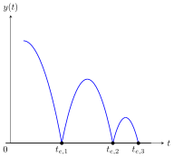

</div>
</div>

---

<div class="columns">
<div>

### Differentialgleichungen der Bewegung

Während der Freiflugphase (kein Bodenkontakt) wird die Bewegung des Balls durch folgende Differentialgleichungen beschrieben:

**Position ($y$):**
$$ \frac{d^2y}{dt^2} = -g $$
oder als System erster Ordnung:
$$ \dot{y} = v \text{ und } \dot{v} = -g $$

-   $y(t)$: Position des Balls zur Zeit $t$.
-   $v(t)$: Geschwindigkeit des Balls zur Zeit $t$.
-   $g$: Erdbeschleunigung (positiv angenommen).

</div>
<div>

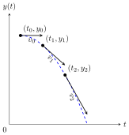

</div>
</div>

---

<div class="columns">
<div class="two">

### Bedingungen für den Aufprall

Ein Aufprall auf den Boden (bei $y=0$) wird durch folgende Bedingung detektiert:

-   **Position:** $y(t) = 0$<br/>(Ball berührt den Boden)
-   **Geschwindigkeit:** $v(t) < 0$<br/>(Ball bewegt sich nach unten)

Diese Bedingungen definieren ein sogenanntes *Nulldurchgangsereignis*, bei dem die kontinuierliche Dynamik unterbrochen wird und eine diskrete Zustandsänderung (Kollision) stattfindet.

</div>
<div>


</div>
</div>

---

<div class="columns">
<div>

### Diskrete Zustandsänderung beim Aufprall

Zum Zeitpunkt des Aufpralls $t_e$, wenn $y(t_e)=0$ und $v(t_e^-) < 0$, ändert sich die Geschwindigkeit des Balls sprunghaft:

$$ v(t_e^+) = -e \cdot v(t_e^-) $$

-   $v(t_e^-)$: Geschwindigkeit unmittelbar vor dem Aufprall.
-   $v(t_e^+)$: Geschwindigkeit unmittelbar nach dem Aufprall.
-   $e$: Restitutionskoeffizient ($0 \le e \le 1$). Für $e=1$ ist die Kollision elastisch (kein Energieverlust), für $e=0$ ist sie vollkommen unelastisch (Ball bleibt am Boden liegen).

</div>
<div>

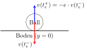

</div>
</div>

---

<div class="columns">
<div>

### Analytische Lösung: Freiflugphase

Die Bewegungsgleichungen $\dot{y} = v$ und $\dot{v} = -g$ können analytisch integriert werden.

Mit den Anfangsbedingungen $y(t_0) = y_0$ und $v(t_0) = v_0$ sind die Lösungen:

**Geschwindigkeit:**
$$ v(t) = v_0 - g(t - t_0) $$

**Position:**
$$ y(t) = y_0 + v_0(t - t_0) - \frac{1}{2}g(t - t_0)^2 $$

Diese Gleichungen gelten, solange der Ball sich in der Luft befindet ($y(t) > 0$).

</div>
<div>

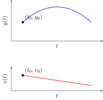

</div>
</div>

---

<div class="columns">
<div>

### Analytische Lösung: Zeitpunkt des Aufpralls

Um den Zeitpunkt des nächsten Aufpralls ($t_e$) zu finden, setzen wir $y(t_e) = 0$ und lösen die Positionsgleichung nach $t_e$ auf.

Ausgehend von $y_0, v_0$ zum Zeitpunkt $t_0$:
$$ 0 = y_0 + v_0(t_e - t_0) - \frac{1}{2}g(t_e - t_0)^2 $$

Dies ist eine quadratische Gleichung für $\Delta t = (t_e - t_0)$. Die positive Lösung (wenn der Ball nach unten fällt) ist der relevante Aufprallzeitpunkt.

</div>
<div>

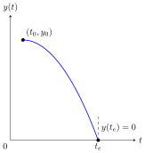

</div>
</div>

---

<div class="columns">
<div class="three">

### Analytische Lösung: Simulation der Kollisionen

Abfolge von Freiflugphasen und Kollisionsereignissen:

1.  **Initialisierung:** Startposition $y_0$ und Startgeschwindigkeit $v_0$ zum Zeitpunkt $t_0$.
2.  **Berechnung der Freiflugphase:** Solange $y(t) > 0$, wird die Bewegung mit den analytischen Lösungen für $y(t)$ und $v(t)$ berechnet.
3.  **Detektion des Aufpralls:** Bestimme den Zeitpunkt $t_e$ wann $y(t_e^-) = 0$ (unter der Bedingung $v(t_e^-) < 0$).
4.  **Zustandsupdate:** Berechne die neue Geschwindigkeit $v(t_e^+) = -e \cdot v(t_e^-)$ und setze $y(t_e^+) = 0$.
5.  **Iteration:** Setze $t_0 = t_e$, $y_0 = y(t_e^+)$, $v_0 = v(t_e^+)$ und wiederhole ab Schritt 2, bis die Simulationszeit endet oder der Ball zur Ruhe kommt ($v \approx 0$ und $y \approx 0$).

</div>
<div>


</div>
</div>

---


## 6.2: Allgemeine Definition

Dieser Abschnitt umfasst die folgenden Inhalte:

- **Definition** hybrider dynamischer Modelle
- **Abgrenzung** zu rein kontinuierlichen und rein diskreten Modellen
- **Typische Anwendungsbeispiele** (z.B. Systeme mit Regelung, Schaltvorgängen, physikalischen Kontakten)
- **Herausforderungen** bei der Simulation hybrider Systeme

---

<div class="columns">
<div>

### Definition hybrider dynamischer Modelle

- **Kombination** aus kontinuierlichen und diskreten Dynamiken.
- **Zustandsänderungen** können kontinuierlich (beschrieben durch Differentialgleichungen) oder sprunghaft (ausgelöst durch Ereignisse) sein.
- **Beispiele:** Systeme mit physikalischen Prozessen, die durch Software gesteuert werden, oder mechanische Systeme mit Kontaktphänomenen.
- **Modellierung:** Oft durch Differential-Algebraische Gleichungen (DAEs) und endliche Automaten (State Machines).

</div>
<div>


</div>
</div>

---

<div class="columns">
<div class="three">

### Abgrenzung zu rein kontinuierlichen und rein diskreten Modellen

- **Rein kontinuierliche Modelle:**
    - Zustand ändert sich stetig über die Zeit.
    - Beschrieben durch Differentialgleichungen.
    - Beispiel: Feder-Masse-Dämpfer-System.
- **Rein diskrete Modelle:**
    - Zustand ändert sich nur zu bestimmten Zeitpunkten.
    - Beschrieben durch Ereignisse / Zustandsübergänge.
    - Beispiel: Warteschlangensysteme, Petri-Netze.
- **Hybride Modelle:** Überbrücken die Lücke zwischen diesen beiden Welten, indem sie beide Arten von Dynamiken integrieren.

</div>
<div class="two">

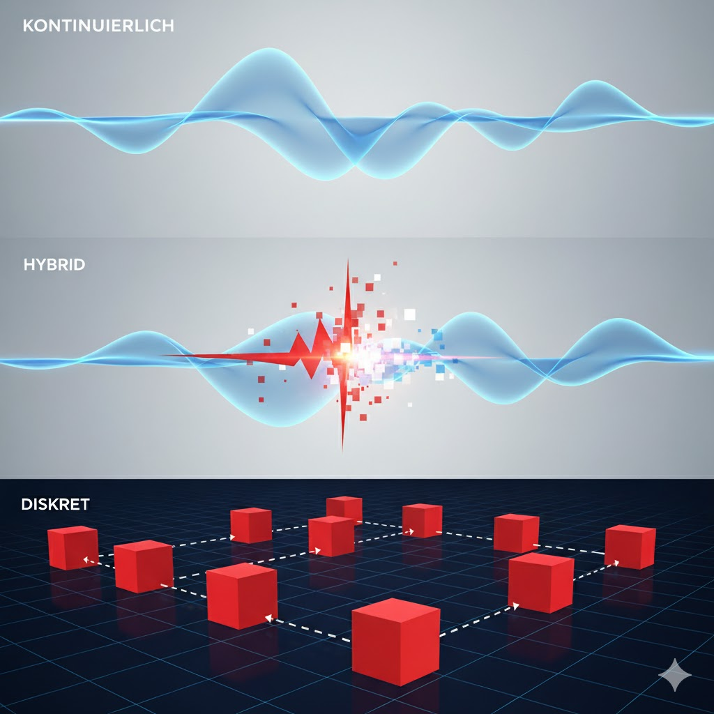

</div>
</div>

---

### Typische Anwendungsbeispiele

- **Regelungssysteme:**
    - Kontinuierlicher physikalischer Prozess (z.B. Temperaturregelung).
    - Diskret arbeitender digitaler Regler (z.B. PID-Regler in einem Mikrocontroller).
- **Schaltvorgänge:**
    - Elektrische Schaltungen, die ihren Zustand sprunghaft ändern (z.B. Relais, Transistoren).
    - Hydraulische oder pneumatische Ventile.
- **Physikalische Kontakte:**
    - Aufprall eines Balls auf eine Oberfläche.
    - Öffnen und Schließen von Türen oder Klappen.
- **Produktionssysteme:**
    - Kontinuierliche Materialflüsse (z.B. Flüssigkeiten in Rohren).
    - Diskrete Fertigungsschritte (z.B. Montage, Qualitätskontrolle).

---

### Herausforderungen bei der Simulation hybrider Systeme

- **Ereignisbehandlung:**
    - Präzise Lokalisierung von Ereigniszeitpunkten (z.B. Nulldurchgänge).
    - Vermeidung von "Event Missing" (Ereignis wird übersehen) oder "Event Jitter" (ungenauer Zeitpunkt).
- **Zustandskonsistenz:**
    - Sicherstellung korrekter Zustandsübergänge bei Ereignissen.
    - Behandlung von Zustands-Resets oder -Modifikationen.
- **Numerische Stabilität:**
    - Integratoren können bei steifen Systemen oder häufigen Ereignissen instabil werden.
    - Anpassung der Schrittweite.
- **Komplexität:**
    - Höherer Modellierungs- und Implementierungsaufwand.
    - Kombination von kontinuierlichen Solvern und Ereignis-Dispatchern.

---

### **Erweiterter** allgemeiner Formalismus (1/3)

<div class="columns top">
<div class="two">

**Bisheriger Formalismus (rein kontinuierlich)**

Basierend auf der Zustandsraumdarstellung aus Kapitel 4:

**Zustandsgleichung (Ableitungen):**
$$ \dot{x}(t) = f(t, x(t), u(t)) $$

**Ausgangsgleichung:**
$$ y(t) = g(t, x(t), u(t)) $$

- $x(t)$: Vektor der **kontinuierlichen** Zustände
- $u(t)$: Vektor der Eingänge
- $y(t)$: Vektor der Ausgänge

</div>
<div class="two">

**Erweiterung für hybride Systeme**

Um hybride Systeme zu modellieren, erweitern wir diesen Formalismus um:

1.  **Diskrete Zustände ($x_d$)**: Speichern von Zustandsinformation, die sich nur sprunghaft ändert (z.B. der aktuelle Modus eines Schalters).

2.  **Update-Funktion ($h$)**: Definiert die sprunghafte Änderung der Zustände bei einem Ereignis.

3.  **Zero-Crossing-Funktion ($z$)**: Erkennt, wann ein diskretes Ereignis eintritt (z.B. Kollision, Schwellwert erreicht).

</div>
</div>

---

### **Erweiterter** allgemeiner Formalismus (2/3)

**Zustände:**
Ein hybrides System besitzt zwei Arten von Zuständen:
- **Kontinuierliche Zustände $x_c(t) \in \mathbb{R}^{n_c}$**: Ändern sich stetig (z.B. Position, Geschwindigkeit).
- **Diskrete Zustände $x_d(t) \in \mathbb{R}^{n_d}$**: Ändern sich nur zu diskreten Zeitpunkten (z.B. Schaltzustand, Zähler).

**Funktionen:**
Die Dynamik wird durch vier Kernfunktionen beschrieben:

1.  **Ableitungsfunktion $f$**: Definiert die kontinuierliche Dynamik.
    $$ \dot{x}_c(t) = f(t, x_c(t), x_d(t), u(t)) $$

2.  **Ausgangsfunktion $g$**: Berechnet die Ausgänge des Blocks.
    $$ y(t) = g(t, x_c(t), x_d(t), u(t)) $$

---

### **Erweiterter** allgemeiner Formalismus (3/3)

3.  **Zero-Crossing-Funktion $z$**:
    Eine Vektor-wertige Funktion, deren Nulldurchgänge Ereignisse signalisieren.
    $$ z(t, x_c(t), x_d(t), u(t)) \in \mathbb{R}^{n_z} $$
    Ein Ereignis tritt zum Zeitpunkt $t_e$ auf, wenn eine Komponente $z_i$ das Vorzeichen wechselt (d.h. $z_i(t_e) = 0$).

4.  **Update-Funktion $h$**:
    Wird zum Ereigniszeitpunkt $t_e$ aufgerufen und berechnet die neuen Zustände $x_c^+$ und $x_d^+$ unmittelbar nach dem Ereignis.
    $$ (x_c(t_e^+), x_d(t_e^+)) = h(t_e, x_c(t_e^-), x_d(t_e^-), u(t_e)) $$
    - $x_c(t_e^-), x_d(t_e^-)$: Zustände unmittelbar *vor* dem Ereignis.

Dieser Formalismus erlaubt die Modellierung des komplexen Zusammenspiels von kontinuierlicher Entwicklung und sprunghaften Zustandsänderungen.

---


## 6.3: Softwarearchitektur

TODO Inhaltsübersicht

---

### Erweiterte `Block`-Klasse

Die `Block`-Klasse, der zentrale Baustein unserer Simulationsumgebung, wurde erheblich erweitert, um diskrete Zustände, Ereignisse und flexible Abtastzeiten verwalten zu können:

-   **`DiscreteStates`**: Eine Liste von diskreten Zustandsvariablen, die sich nur sprunghaft ändern.
-   **`ZeroCrossings`**: Eine Liste von Ereignissignalen, deren Nulldurchgänge diskrete Ereignisse auslösen.
-   **`SampleTime`**: Ein Objekt, das die Abtasteigenschaften des Blocks definiert (kontinuierlich, diskret, variabel).
-   **`GetNextVariableHitTime(...)`**: Eine Methode zur Bestimmung des nächsten Zeitpunkts, zu dem ein Block mit variabler Abtastzeit aktiv werden muss.
-   **`CalculateZeroCrossings(...)`**: Eine Methode zur Berechnung der Werte der Zero-Crossing-Funktionen.
-   **`UpdateStates(...)`**: Eine Methode, die bei diskret getakteten Blöcken oder nach dem Erkennen eines Nulldurchgangs aufgerufen wird, um die Zustände (kontinuierlich und/oder diskret) sprunghaft anzupassen.

---

<div class="columns">
<div class="two">

TODO Überschrift und Text

</div>
<div class="three">


</div>
</div>

---

```csharp
public abstract class Block
{
    public List<StateDeclaration> ContinuousStates { get; }
    public List<StateDeclaration> DiscreteStates { get; }
    public List<InputDeclaration> Inputs { get; }
    public List<OutputDeclaration> Outputs { get; }
    public List<ZeroCrossingDeclaration> ZeroCrossings { get; }

    public SampleTime SampleTime { get; }

    virtual public void InitializeStates(
        double[] cStates, double[] dStates);
    virtual public double GetNextVariableHitTime(
        double time, double[] cStates, double[] dStates, double[] inputs);
    virtual public void CalculateOutputs(
        double time, double[] cStates, double[] dStates, double[] inputs, double[] outputs);
    virtual public void CalculateDerivatives(
        double time, double[] cStates, double[] dStates, double[] inputs, double[] derivatives);
    virtual public void CalculateZeroCrossings(
        double time, double[] cStates, double[] dStates, double[] inputs, double[] zeroCrossings);
    virtual public void UpdateStates(
        double time, double[] cStates, double[] dStates, double[] inputs);
}
```

---

<div class="columns">
<div class="three">

### Deklaration von Schnittstellen und Ereignissen

Neben den bereits bekannten Deklarationen für Zustände (`StateDeclaration`), Eingänge (`InputDeclaration`) und Ausgänge (`OutputDeclaration`) wurde eine neue `ZeroCrossingDeclaration` hinzugefügt, um die Zero-Crossing-Signale eines Blocks zu beschreiben.

```csharp
namespace SFunctionHybrid.Framework.Declarations
{
    public class ZeroCrossingDeclaration : Declaration
    {
        public ZeroCrossingDeclaration(string name) : base(name)
        {

        }
    }
}
```

</div>
<div class="two">


</div>
</div>

---

### Abtastzeiten (`SampleTime`)

Das Konzept der Abtastzeit (`SampleTime`) wurde eingeführt, um dem Solver mitzuteilen, wie und wann ein Block seine Zustände aktualisieren und Ausgänge berechnen soll. Dies wird durch eine Klassenhierarchie abgebildet:

-   **`ContinuousSampleTime`**: Der Block ist kontinuierlich und wird bei jedem Integrationsschritt des Solvers berechnet (Standard für kontinuierliche Blöcke).
-   **`DiscreteSampleTime`**: Der Block ist diskret und wird in festen, periodischen Intervallen aktualisiert. Definiert durch `Offset` (Startzeitpunkt) und `Period` (Abtastperiode).
-   **`VariableSampleTime`**: Der Block ist ereignisgesteuert und wird zu variablen Zeitpunkten aktualisiert, die der Block selbst über `GetNextVariableHitTime` meldet. Definiert durch einen initialen `Offset`.
-   **`ConstantSampleTime`**: Für Blöcke, die konstante Werte liefern und keine Abtastzeit im eigentlichen Sinne benötigen (z.B. `ConstantBlock`).
-   **`InheritedSampleTime`**: Die Abtastzeit wird vom übergeordneten System oder den Eingangsblöcken geerbt (Standard für algebraische Blöcke).

---

<div class="columns">
<div class="three">

TODO Überschrift

```csharp
public abstract class SampleTime { }

public class ContinuousSampleTime : SampleTime { }

public class DiscreteSampleTime : SampleTime
{
    public double Offset { get; }
    public double Period { get; }
    public DiscreteSampleTime(double offset, double period) { /* ... */ }
}

public class VariableSampleTime : SampleTime
{
    public double Offset { get; }
    public VariableSampleTime(double offset) { /* ... */ }
}

public class ConstantSampleTime : SampleTime { }

public class InheritedSampleTime : SampleTime { }
```

</div>
<div>


</div>
</div>

---

### Neue Block-Typen für Hybride Systeme

-   **Diskrete Zeitintegratoren und Zero-Order Holds:**
    -   `DiscreteTimeIntegratorBlock`: Integriert ein Signal in festen diskreten Schritten.
    -   `ZeroOrderHoldBlock`: Hält den letzten abgetasteten Wert eines kontinuierlichen Signals für eine definierte Abtastperiode.

-   **Zero-Crossing-Detektoren:**
    -   `HitLowerLimitBlock`: Erzeugt ein Ereignis, wenn ein Signal einen unteren Grenzwert erreicht.
    -   `HitUpperLimitBlock`: Erzeugt ein Ereignis, wenn ein Signal einen oberen Grenzwert erreicht.

-   **Variable Abtastzeit-Blöcke:**
    -   `VariableSampleTimeBlock`: Ein Block, dessen Abtastzeitpunkte dynamisch durch ein Eingangssignal gesteuert werden.
    -   `VariableZeroOrderHoldBlock`: Ein Zero-Order Hold, dessen Abtastrate variabel ist.

---

<div class="columns">
<div class="three">

### Erweiterte Solver-Implementierungen

TODO Text

-   Sie berücksichtigt nun `DiscreteStates` bei der Initialisierung und Zustandsspeicherung.
-   Die Logik zur Nulldurchgangsdetektion wurde erweitert und nutzt die `ZeroCrossings`-Deklarationen der Blöcke.
-   Die `UpdateStates`-Methode des Solvers ruft nun die `UpdateStates`-Methode der Blöcke basierend auf ihren `SampleTime`-Eigenschaften (diskret, variabel) oder erkannten Zero-Crossings auf.

</div>
<div class="two">


</div>
</div>

---


## 6.4: Nulldurchgangsdetektion

TODO Übersicht über den Abschnitt

---

TODO Folien zum Algorithmus für Nulldurchgangsdetektion

---

TODO Einleitende Folien zum Beispiel IntegrateWithLowerLimit

---

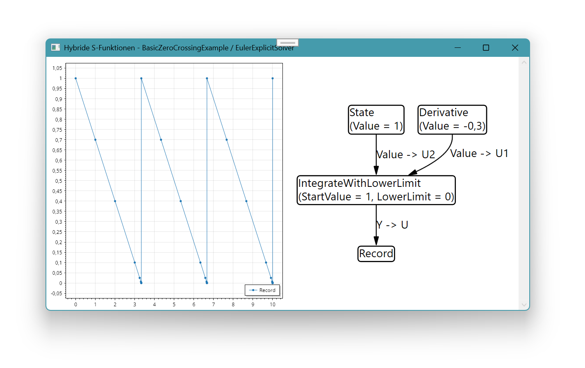

TODO Text (insbesondere Hinweis auf die engeren Abtastzeiten am Nullpunkt)

---

TODO Einleitende Folie zur Umsetzung des Bouncing Ball Beispiels mit der erweiterten Softwarearchitektur und dem Algorithmus für Nulldurchgangsdetektion

---

### Implementierung des Modells (`BouncingBallExample.cs`)

- **`ConstantBlock("Gravity", -9.81)`:** Liefert die konstante Beschleunigung.
- **`IntegrateWithResetBlock("Velocity", 10)`:**
    - Integriert die Gravitationsbeschleunigung zur Geschwindigkeit.
    - Besitzt eine Reset-Funktion, die bei einem Aufprall die Geschwindigkeit anpasst.
- **`IntegrateBlock("Position", 10)`:**
    - Integriert die Geschwindigkeit zur Position.
- **`HitLowerLimitBlock("HitLowerLimit", 0)`:**
    - Detektiert den Nulldurchgang, wenn die Position den Boden ($0$) erreicht.
    - Sein Ausgang wird als Trigger für den Reset des Geschwindigkeits-Integrators verwendet.
- **`GainBlock("Damping", -0.8)`:**
    - Multipliziert die Geschwindigkeit mit dem negativen Restitutionskoeffizienten, um die neue Geschwindigkeit nach dem Aufprall zu berechnen.
- **`RecordBlock`s:** Zum Aufzeichnen von Position und Geschwindigkeit für die Visualisierung.

---

### `IntegrateWithResetBlock` für die Geschwindigkeit

- **Zweck:** Ein Integrator, dessen Zustand (Geschwindigkeit) bei einem externen Signal (Aufprall) zurückgesetzt werden kann.
- **Kontinuierlicher Zustand:** Speichert die aktuelle Geschwindigkeit.
- **`CalculateDerivatives`:** Berechnet die Ableitung der Geschwindigkeit (die Beschleunigung).
- **`UpdateStates` Methode:**
    - Wird vom Solver aufgerufen, wenn ein Zero-Crossing (Aufprall) erkannt wurde.
    - Prüft ein Eingangssignal (vom `HitLowerLimitBlock`).
    - Wenn das Signal aktiv ist, wird der Geschwindigkeitszustand auf den gedämpften Wert gesetzt.
    - `continuousStates[0] = inputs[2];` (wobei `inputs[2]` der gedämpfte Geschwindigkeitswert ist).

---

### `HitLowerLimitBlock` für die Bodenerkennung

- **Zweck:** Erzeugt ein Zero-Crossing-Signal, wenn ein Eingangswert (Position) einen definierten unteren Grenzwert (Boden bei 0) erreicht.
- **`Inputs.Add(new InputDeclaration("U", true))`:** Nimmt die aktuelle Position als Eingang.
- **`ZeroCrossings.Add(new ZeroCrossingDeclaration("Z"))`:** Deklariert ein Zero-Crossing-Signal.
- **`CalculateZeroCrossings` Methode:**
    - Berechnet die Zero-Crossing-Funktion: `zeroCrossings[0] = inputs[0] - LowerLimit;`
    - Wenn `inputs[0]` (Position) kleiner oder gleich `LowerLimit` (0) wird, wechselt das Signal von positiv zu negativ (oder umgekehrt, je nach Start).
    - Dieses Signal wird vom Solver verwendet, um den genauen Zeitpunkt des Aufpralls zu lokalisieren.

---

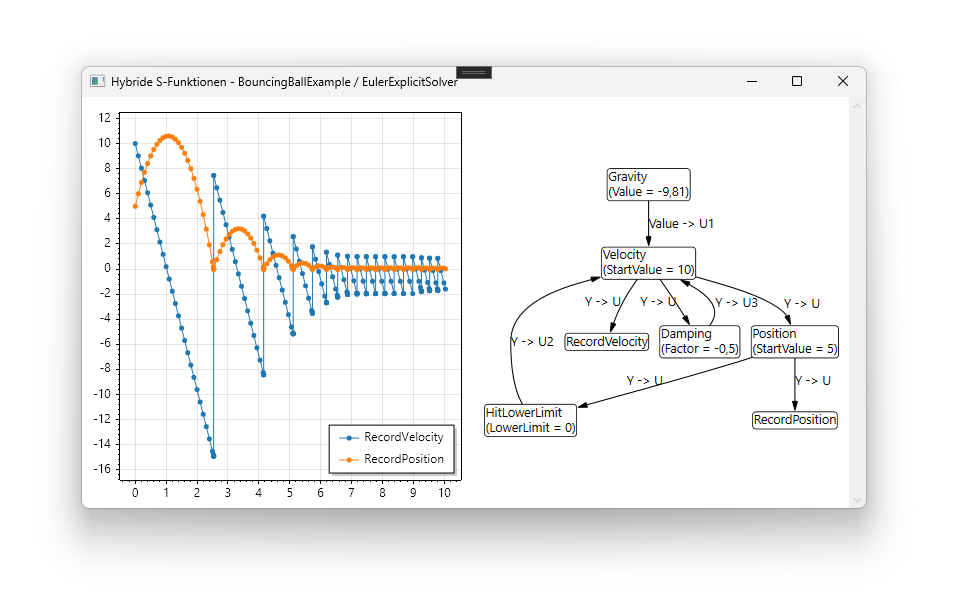

TODO Text

---


TODO Text (insbesondere, warum bricht der Ball durch die Nulllinie)

---

TODO Folien zum erweiterten modell (BouncingBallExtendedExample)

---

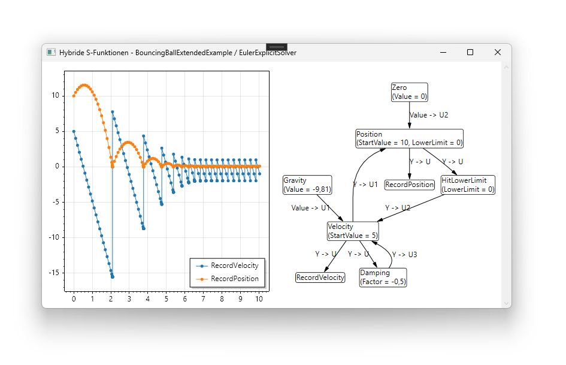

TODO Text

---

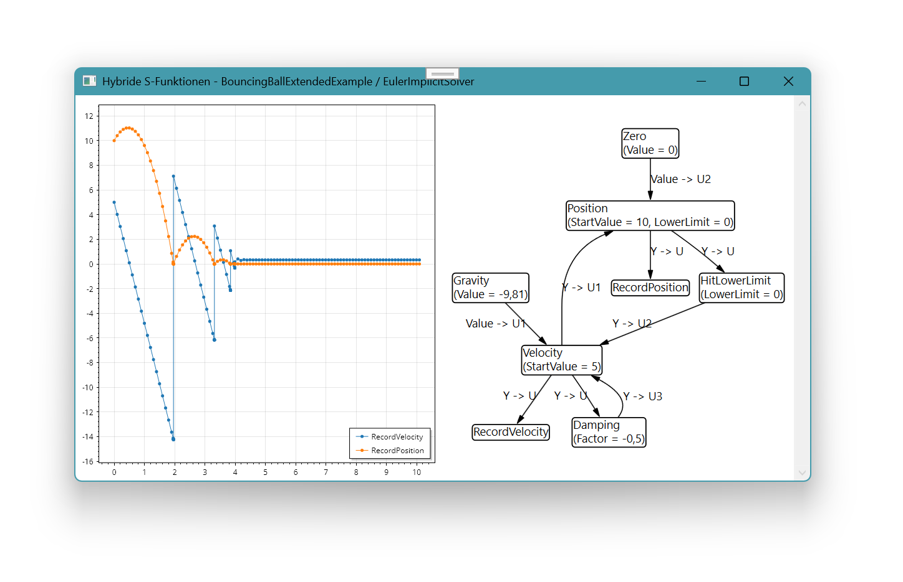

TODO Text

---


## 6.5: Diskrete Abtastzeiten

TODO Übersicht über den Abschnitt

---

TODO Folien zur Blöcken mit diskreter Abtastzeit (Offset und Periode)

---


## 6.6: Variable Abtastzeiten

TODO Übersicht über den Abschnitt

---

TODO Folien zu Blöcken mit variabler Abtastzeit (GetNextVariableHitTime)