<!-- _paginate: false -->
<!-- _header: "" -->
<!-- _footer: "" -->


# Kapitel 6: Multithreading & Parallele Simulation

Dieses Kapitel umfasst die folgenden Abschnitte:

- 6.1: Grundlagen: Prozesse, Threads & Parallelität
- 6.2: Task Parallel Library (`Parallel.For` & `Parallel.ForEach`)
- 6.3: Threadsichere Datenstrukturen (`ConcurrentBag<T>`)
- 6.4: Synchronisation & Race Conditions (`lock`)
- 6.5: Parallele Zufallszahlen & thread-lokale Zustände
- 6.6: Multithreading in WPF-Anwendungen

---

## 6.1: Grundlagen: Prozesse, Threads & Parallelität

Dieser Abschnitt umfasst die folgenden Inhalte:

- Motivation: Auslastung moderner Mehrkern-Prozessoren
- Unterschied: Prozess vs. Thread
- Nebenläufigkeit (Concurrency) vs. echte Parallelität

---

### Warum Multithreading in der Simulation?

- Physikalische Simulationen und stochastische Verfahren (z.B. Monte-Carlo) erfordern oft Milliarden Rechenoperationen.
- Die Taktfrequenzen einzelner CPU-Kerne stagnieren seit Jahren (Physical Scaling Wall); Leistungszuwachs erfolgt primär über **mehr Kerne**.
- **Sequentieller Code** nutzt auf einer 16-Core-CPU nur $\approx 6{,}25\,\%$ der verfügbaren Rechenkapazität.
- Durch Parallelisierung können unabhängige Simulationsläufe (z.B. Parameterschwankungen, Replikationen) zeitgleich auf allen Kernen berechnet werden (**"Embarrassingly Parallel"**).

---

### Prozess vs. Thread

<div class="columns top">
<div class="one">

**Prozess (Process)**
- Eine isolierte Programminstanz des Betriebssystems.
- Eigener, geschützter virtueller Adressraum.
- Kommunikation zwischen Prozessen (IPC) erfordert Serialisierung und OS-Overhead.

</div>
<div class="one">

**Thread (Leichtgewichtiger Faden)**
- Die kleinste Ausführungseinheit innerhalb eines Prozesses.
- Alle Threads eines Prozesses **teilen sich denselben Adressraum** (Heap, globale Variablen).
- Schnelle Kommunikation, aber hohes Risiko für Datenkonflikte.

</div>
</div>

---

### Nebenläufigkeit vs. Echte Parallelität

<div class="columns top">
<div class="one">

**Nebenläufigkeit (Concurrency)**
- Mehrere Aufgaben sind logisch im Gange und teilen sich Rechenzeit (z.B. per Zeitscheiben-Scheduling auf 1 CPU-Kern).
- Strukturierungsprinzip für responsive UIs und asynchrone I/O.

</div>
<div class="one">

**Parallelität (True Parallelism)**
- Mehrere Aufgaben werden **zur exakt gleichen physikalischen Zeit** auf verschiedenen CPU-Kernen ausgeführt.
- Rechenbeschleunigung für mathematische Berechnungen und Simulationen.

</div>
</div>

---

## 6.2: Task Parallel Library (`Parallel.For` & `Parallel.ForEach`)

Dieser Abschnitt umfasst die folgenden Inhalte:

- Die Task Parallel Library (TPL) in .NET
- Parallelisierung von Zählschleifen mit `Parallel.For`
- Partitionierung und Lastverteilung durch den ThreadPool

---

### Die Task Parallel Library (TPL)

`Parallel.For` ist eine Methode aus dem Namespace `System.Threading.Tasks`, die eine Standard-`for`-Schleife automatisch parallelisiert:

- Die TPL teilt den Iterationsbereich in Chunks auf und verteilt sie über den internen **.NET ThreadPool** auf alle verfügbaren Kerne.
- Der Schleifenkörper wird als Lambda-Ausdruck übergeben.

<div class="columns">
<div>

**Sequentiell:**
```csharp
for (int i = 0; i < 100; i++)
{
    DoSimulation(i);
}
```

</div>
<div>

**Parallel:**
```csharp
Parallel.For(0, 100, i =>
{
    DoSimulation(i);
});
```

</div>
</div>

---

## 6.3: Threadsichere Datenstrukturen (`ConcurrentBag<T>`)

Dieser Abschnitt umfasst die folgenden Inhalte:

- Das Problem ungeschützter Collections (`List<T>`)
- Datenkorruption bei gleichzeitigem Schreibzugriff
- Threadsichere Alternativen aus `System.Collections.Concurrent`

---

### Threadsichere Sammlungen: `ConcurrentBag<T>`

Wenn mehrere Threads gleichzeitig auf eine Standard-Collection wie `List<T>` schreibend zugreifen, führt dies unweigerlich zu Ausnahmen oder unbemerktem Datenverlust.

- **`ConcurrentBag<T>`** ist eine threadsichere, ungeordnete Sammlung für Szenarien, bei denen die Reihenfolge der Ergebnisse unwichtig ist.
- Erlaubt paralleles Hinzufügen ohne manuelle Sperren.

<div class="columns">
<div>

**Nicht threadsicher (Gefahr!):**
```csharp
var list = new List<double>();

// Führt zu Fehlern/Datenverlust!
Parallel.For(0, 1000, i =>
{
    list.Add(Compute(i));
});
```

</div>
<div>

**Threadsicher (Korrekt):**
```csharp
var bag = new ConcurrentBag<double>();

// Sicher und hochperformant!
Parallel.For(0, 1000, i =>
{
    bag.Add(Compute(i));
});
```

</div>
</div>

---

## 6.4: Synchronisation & Race Conditions (`lock`)

Dieser Abschnitt umfasst die folgenden Inhalte:

- Was ist eine Race Condition?
- Nicht-atomare Operationen (z.B. `counter++`)
- Das `lock`-Statement und gegenseitiger Ausschluss (Mutual Exclusion)

---

### Was ist eine Race Condition?

Eine **Race Condition** (Wettlaufsituation) tritt auf, wenn mehrere Threads gleichzeitig auf geteilte Daten zugreifen und mindestens ein Thread schreibend zugreift:

- Das Endergebnis hängt von der unvorhersehbaren Reihenfolge des Betriebssystem-Schedulers ab.
- **Konsequenzen:** Sporadische Fehler, falsche Simulationsergebnisse, extrem schwer reproduzierbare Bugs.
- Schon einfache Operationen wie `counter++` sind in Maschinensprache **drei Einzelschritte** (Read-Modify-Write) und können jederzeit unterbrochen werden!

---

### Code-Beispiel: Race Condition & `lock`

<div class="columns top">
<div>

**Fehlerhaft (ohne `lock`):**
```csharp
int counter = 0;

Parallel.For(0, 10000, _ =>
{
    // Mehrere Threads überschreiben
    // sich gegenseitig beim Inkrement!
    counter++; 
});

// Erwartet: 10000
// Ergebnis: z.B. 7842 (falsch!)
Console.WriteLine(counter);
```

</div>
<div>

**Korrekt (mit `lock`):**
```csharp
int counter = 0;
object sync = new object();

Parallel.For(0, 10000, _ =>
{
    lock (sync) // Kritischer Abschnitt
    {
        counter++;
    }
});

// Ergebnis: 10000 (exakt!)
Console.WriteLine(counter);
```

</div>
</div>

---

## 6.5: Parallele Zufallszahlen & thread-lokale Zustände

Dieser Abschnitt umfasst die folgenden Inhalte:

- Gefahren geteilter Zufallsgeneratoren (`System.Random`)
- Reproduzierbarkeit und Seed-Management
- Thread-lokale Instanziierung

---

### Threadsicherheit von `System.Random`

Die Klasse `System.Random` ist **nicht threadsicher**:
- Greifen mehrere Threads gleichzeitig auf dieselbe Instanz zu, korrumpiert der interne Zustand $\to$ es werden nur noch Nullen oder identische Folgen geliefert.
- **Lösung:** Jeder Thread (bzw. jede Iteration) benötigt eine eigene Instanz mit einem **eindeutigen Seed**!

```csharp
Parallel.For(0, numberOfRuns, i =>
{
    // Eindeutiger Seed garantiert unabhängige, reproduzierbare Zufallsfolgen
    var localRandom = new Random(seed: i);

    double result = RunSingleSimulation(localRandom);
    results.Add(result);
});
```

---

## 6.6: Multithreading in WPF-Anwendungen

Dieser Abschnitt umfasst die folgenden Inhalte:

- Das Problem des blockierten UI-Threads (UI-Freeze)
- Asynchrone Ausführung mit `async`/`await` und `Task.Run`
- Zusammenspiel von UI-Thread und Hintergrund-Worker (Architektur)
- Thread-sichere UI-Aktualisierung: `IProgress<T>` vs. `Dispatcher.Invoke`
- Kooperativer Abbruch mit `CancellationTokenSource`

---

### Das Problem des UI-Einfrierens (UI-Freeze)

WPF-Anwendungen basieren auf einem **Single-Threaded Apartment (STA)**:
- Ein einziger Thread (der **UI-Thread / Dispatcher**) wickelt alle Nutzerinteraktionen (Klicks, Eingaben) sowie das Rendering und Layout ab.
- Wird eine rechenintensive Simulation direkt in einem Event-Handler aufgerufen, blockiert der UI-Thread vollständig.

<div class="columns top">
<div class="one">

**Symptome des UI-Freeze:**
- Fenster reagiert nicht mehr ("Keine Rückmeldung")
- Animationen und Fortschrittsbalken frieren ein
- Abbruch über die GUI unmöglich

</div>
<div class="one">

**Lösungsmuster:**
- Rechenlast auf **ThreadPool-Worker** auslagern (`Task.Run`)
- UI-Thread während der Berechnung freigeben (`await`)
- Ergebnisse thread-sicher zurückführen

</div>
</div>

---

### Asynchrone Ausführung: `async`/`await` & `Task.Run`

Mit `async`/`await` und `Task.Run` wird die Simulation im Hintergrund berechnet, ohne das UI zu blockieren:

<div class="columns top">
<div class="one">

**Blockierend (UI friert ein):**
```csharp
private void Start_Click(
    object sender, RoutedEventArgs e)
{
    // Blockiert UI-Thread!
    var res = RunSimulation();
    ResultText.Text = $"Wert: {res}";
}
```

</div>
<div class="one">

**Asynchron (UI bleibt reaktiv):**
```csharp
private async void Start_Click(
    object sender, RoutedEventArgs e)
{
    StartBtn.IsEnabled = false;

    // Auf ThreadPool auslagern
    var res = await Task.Run(
        () => RunSimulation());

    // Rückkehr auf UI-Thread!
    ResultText.Text = $"Wert: {res}";
    StartBtn.IsEnabled = true;
}
```

</div>
</div>

---

### Architektur: UI-Thread & Hintergrund-Worker

<div class="columns top">
<div class="two">



</div>
<div class="one">

**Architekturprinzipien:**
- **Entkopplung:** Der UI-Thread bleibt reaktiv für Nutzerinteraktionen.
- **ThreadPool-Worker:** Führt die rechenintensive Simulation parallel aus.
- **`IProgress<T>`:** Thread-sichere Entkopplung für Zwischenstände via `SynchronizationContext`.
- **`CancellationToken`:** Ermöglicht den geordneten Abbruch aus der UI.

</div>
</div>

---

### Thread-sichere UI-Aktualisierung: `IProgress<T>`

Der Hintergrund-Worker darf **nicht** direkt auf UI-Elemente zugreifen (`InvalidOperationException: Der aufrufende Thread kann nicht auf dieses Objekt zugreifen...`).

<div class="columns top">
<div class="one">

**Warum kein unbedachtes `Dispatcher.Invoke`?**
- `Dispatcher.Invoke` blockiert den Worker synchron bis das UI zeichnet $\to$ Performanceverlust & Deadlock-Gefahr.
- Koppelt die Simulationslogik fest an WPF-Klassen (keine Wiederverwendbarkeit in CLI/Tests).

</div>
<div class="one">

**Best Practice: `IProgress<T>` & `Progress<T>`**
- `Progress<T>` erfasst bei Instanziierung den `SynchronizationContext` des UI-Threads.
- `progress.Report(...)` ist nicht-blockierend und ruft den Callback automatisch im UI-Thread auf.
- Simulationslogik bleibt unabhängig von WPF!

</div>
</div>

---

### Code-Beispiel: Fortschrittsmeldung mit `Progress<T>`

<div class="columns top">
<div class="one">

**WPF-Schicht (UI-Thread):**
```csharp
private async void Start_Click(
    object sender, RoutedEventArgs e)
{
    var progress = 
        new Progress<SimulationStatus>(s =>
    {
        // Läuft sicher im UI-Thread!
        ProgressBar.Value = s.Percent;
        StatusText.Text = $"Schritt {s.Step}";
    });

    await Task.Run(() => 
        RunSimulation(progress));
}
```

</div>
<div class="one">

**Simulationsmodell (WPF-unabhängig):**
```csharp
public void RunSimulation(
    IProgress<SimulationStatus> progress)
{
    for (int i = 0; i < totalSteps; i++)
    {
        StepPhysics();

        // UI nicht überfluten!
        if (i % 50 == 0)
        {
            progress?.Report(
                new SimulationStatus(i, totalSteps));
        }
    }
}
```

</div>
</div>

---

### Abbrechen langer Simulationen: `CancellationToken`

Lange Simulationen müssen vom Benutzer vorzeitig gestoppt werden können:
- `Thread.Abort()` ist veraltet und gefährlich (führt in modernem .NET zu Ausnahmen und inkonsistenten Zuständen).
- In modernem .NET erfolgt der Abbruch **kooperativ** über `CancellationTokenSource` (CTS).

<div class="columns top">
<div class="one">

**Rolle der `CancellationTokenSource`**
- Wird im UI-Thread erzeugt und verwaltet.
- `cts.Cancel()` signalisiert allen assoziierten Tokens den Abbruchwunsch.
- Kann bei Bedarf auch ein Zeitlimit definieren (`CancelAfter(timeout)`).

</div>
<div class="one">

**Rolle des `CancellationToken`**
- Wird als leichtgewichtige Struktur an den Worker übergeben.
- Der Worker prüft regelmäßig:
  - `token.IsCancellationRequested` oder
  - `token.ThrowIfCancellationRequested()`
- Ermöglicht sauberes Freigeben von Ressourcen.

</div>
</div>

---

### Code-Beispiel: Kooperativer Abbruch mit `CancellationToken`

<div class="columns top">
<div class="one">

**UI-Ereignisbehandlung & Abbruch:**
```csharp
private CancellationTokenSource _cts;

private async void Start_Click(object s, RoutedEventArgs e)
{
    _cts = new CancellationTokenSource();
    CancelBtn.IsEnabled = true;
    try
    {
        await Task.Run(() => Simulate(_cts.Token), _cts.Token);
        Status.Text = "Fertiggestellt.";
    }
    catch (OperationCanceledException) { Status.Text = "Abbruch."; }
    finally { CancelBtn.IsEnabled = false; }
}
private void Cancel_Click(object s, RoutedEventArgs e) => _cts?.Cancel();
```

</div>
<div class="one">

**Simulationsschleife mit Token-Prüfung:**
```csharp
public void Simulate(CancellationToken token)
{
    for (int step = 0; step < maxSteps; step++)
    {
        // Prüft auf Benutzerabbruch
        token.ThrowIfCancellationRequested();

        // Numerischer Zeitschritt
        IntegrateStep();
    }
}
```

</div>
</div>

---

# Zusammenfassung Kapitel 6

- Multithreading ist der Schlüssel zur vollen Auslastung moderner Mehrkern-CPUs bei rechenintensiven Simulationen.
- Die **Task Parallel Library (TPL)** mit `Parallel.For` abstrahiert das manuelle Thread-Management.
- **Race Conditions** entstehen beim gleichzeitigen Schreiben auf geteilte Ressourcen; sie lassen sich durch `lock` (gegenseitigen Ausschluss) verhindern.
- **`ConcurrentBag<T>`** bietet eine threadsichere Lösung zum Sammeln paralleler Simulationsergebnisse.
- Zufallszahlengeneratoren (`System.Random`) müssen strikt thread-lokal und mit individuellem Seed betrieben werden, um Korruption zu vermeiden und Reproduzierbarkeit zu wahren.
- In **WPF-Anwendungen** entkoppelt `await Task.Run(...)` die Simulation vom UI-Thread; **`IProgress<T>`** garantiert thread-sichere Zwischenstände und **`CancellationToken`** ermöglicht den kontrollierten Benutzerabbruch.

---

### Kursdramaturgie: Übergang zum Modellierungsblock

<div class="columns top">
<div class="one">

**Was wir bisher gelernt haben (Werkzeuge):**
- **Kapitel 01:** Einführung & Begriffswelt des Digitalen Zwillings
- **Kapitel 02–04:** 2D-Rendering (Pixel-Heatmaps, Vektoren, Diagramme)
- **Kapitel 05:** 3D-Szenengraphen & Hardware-Rendering mit OpenGL
- **Kapitel 06:** Parallele Rechenleistung & reaktive UI-Entkopplung

*Die Software- und Visualisierungs-Infrastruktur steht vollständig bereit.*

</div>
<div class="one">

**Was nun folgt (Physikalische Simulation):**
- **Kapitel 07:** Statische Gleichgewichtsmodelle & FEM-Fachwerke (LGS)
- **Kapitel 08:** Kontinuierliche Dynamik & Schwingungssysteme (DGL / ODE)
- **Kapitel 09:** Diskrete Ereignissysteme & Warteschlangen (DES / MC)
- **Kapitel 10:** Hybride Dynamik & Co-Simulation (S-Functions)
- **Kapitel 11:** Epilog: Synthese zum industriellen Digitalen Zwilling

*Ab Kapitel 07 hauchen wir den Grafiken physikalisches Leben ein!*

</div>
</div>
