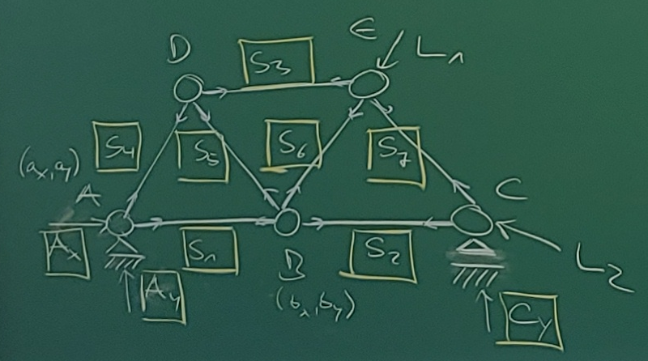
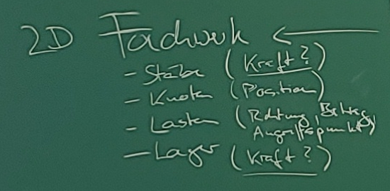
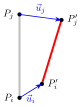
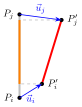
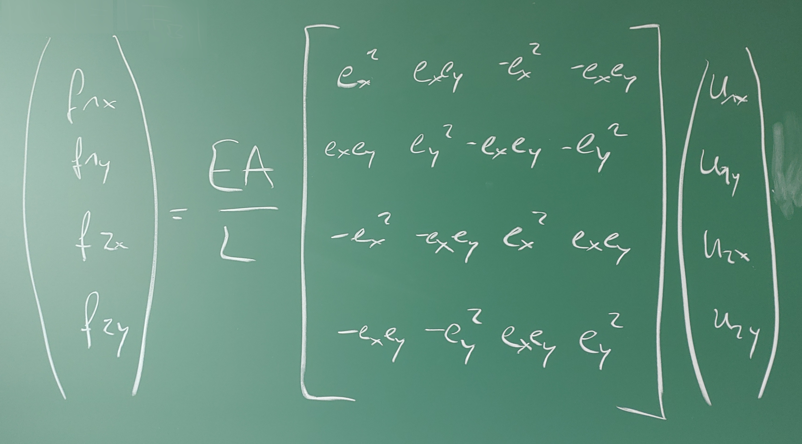
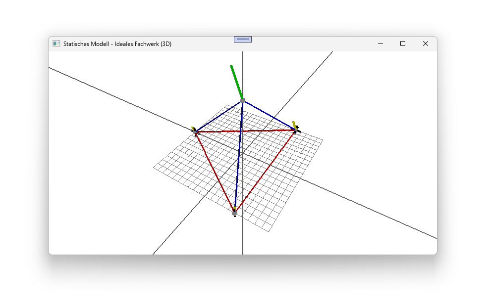
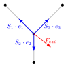
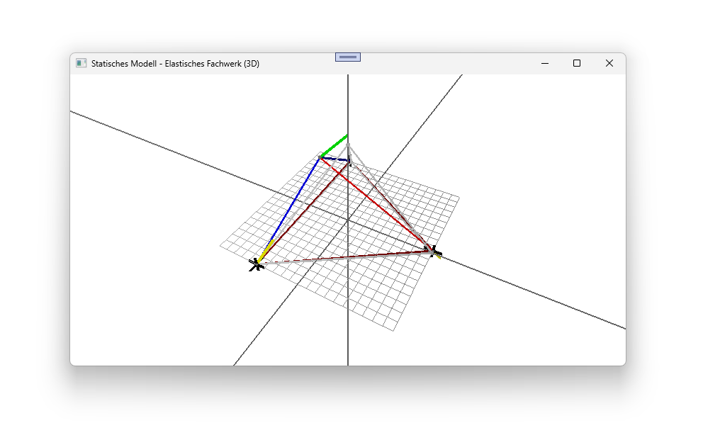

<!-- _paginate: false -->
<!-- _header: "" -->
<!-- _footer: "" -->


# Kapitel 7: Statische Modelle

Dieses Kapitel umfasst die folgenden Abschnitte:

- 7.1: Einführung und historische Entwicklung
- 7.2: Das ideale Fachwerk in 2D
- 7.3: Das elastische Fachwerk in 2D
- 7.4: Erweiterung der Berechnungsmodelle auf 3D
- 7.5: Programmtechnische Umsetzung

---
## 7.1: Einführung und historische Entwicklung

Dieser Abschnitt umfasst die folgenden Inhalte:

- Definition eines statischen Modells
- Das Fachwerk als Anwendungsbeispiel
- Historischer Abriss der Fachwerktheorie
- Typische Fragestellungen für die Modellierung

---

### Was ist ein statisches Modell?

- Beschreibt ein System im **Ruhezustand** (im Gleichgewicht).
- Alle wirkenden Kräfte und Momente heben sich gegenseitig auf.
- $\sum \vec{F} = 0$ und $\sum \vec{M} = 0$
- Das Modell ist **zeitunabhängig**.
- **Typische Fragestellung**: Welche Kräfte wirken innerhalb einer Struktur (z.B. einer Brücke) und wie stark verformt sie sich unter einer gegebenen, konstanten Last?

---

### Das Fachwerk als klassisches Beispiel

<div class="columns">
<div>

Ein **Fachwerk** ist ein Tragwerk, das aus einzelnen Stäben zusammengesetzt ist, die an ihren Enden durch Knoten (Gelenke) miteinander verbunden sind.

</div>
<div>



</div>
</div>

---

### Historische Entwicklung

- **Antike**: Römer nutzen grundlegende Prinzipien für Brücken und Aquädukte (Bögen, aber auch frühe Holzfachwerke).
- **Mittelalter/Renaissance**: Bau von Dachstühlen in Kirchen und Kathedralen. Das Wissen ist rein empirisch (Erfahrungswissen).
- **18. Jahrhundert**: Leonhard Euler leistet Pionierarbeit in der Balkentheorie und Stabilitätsanalyse (z.B. Knickung).
- **19. Jahrhundert**: Das Zeitalter der Eisenbahn erfordert lange, stabile und leichte Brücken. Die Fachwerktheorie wird formalisiert.

---

### Pioniere der Fachwerktheorie

<div class="columns top">
<div class="one">

**Squire Whipple<br/>(1847)**
- "A Work on Bridge Building"
- Entwickelt als einer der ersten die korrekte mathematische Methode zur Berechnung der Kräfte in den Stäben eines Fachwerks (Ritter'sches Schnittverfahren, Knotenpunktverfahren).

</div>
<div class="one">

**Karl Culmann & Luigi Cremona (ca. 1860)**
- Entwickeln die **grafische Statik**.
- Mit dem **Cremonaplan** können die Stabkräfte zeichnerisch ermittelt werden – eine geniale Methode für das Zeitalter ohne Computer.

</div>
<div class="one">

**James Clerk Maxwell<br/>(1864)**
- Führt das **Kräfteplanverfahren** ein und erkennt, dass die Stabkräfte als reziproke Figuren zum Lageplan des Fachwerks aufgefasst werden können.

</div>
</div>

---

### Fragestellungen an das Modell

- **Stabilität**: Ist das Fachwerk unter der gegebenen Lagerung und Last statisch bestimmt und stabil?
- **Interne Kräfte**: Welche Zug- oder Druckkraft wirkt in jedem einzelnen Stab? (Dimensionierung der Stäbe)
- **Verformung**: Wie stark verschieben sich die Knoten unter der Last? (Nur mit elastischem Modell beantwortbar)
- **Optimierung**: Wie kann das Fachwerk mit minimalem Materialeinsatz (Gewicht) für eine gegebene Last entworfen werden?

---
## 7.2: Das ideale Fachwerk in 2D

Dieser Abschnitt umfasst die folgenden Inhalte:

- Annahmen und physikalische Grundlagen
- Aufstellen des linearen Gleichungssystems (LGS)
- Algorithmen zur Lösung des LGS

---

### Annahmen des idealen Fachwerks

<div class="columns">
<div>

1.  Die Stäbe sind **gerade** und haben ein **vernachlässigbares Eigengewicht**.
2.  Die Stäbe sind an ihren Enden durch **reibungsfreie Gelenke** (Knoten) verbunden.
3.  Äußere Kräfte (Lasten) greifen **ausschließlich an den Knoten** an.

**Folgerung**: In den Stäben treten nur **Normalkräfte** (Zug- oder Druckkräfte) in Längsrichtung auf, keine Biegemomente oder Querkräfte.

</div>
<div>



</div>
</div>

---

### Mathematische Beschreibung des Fachwerks

Um das Fachwerk mathematisch zu beschreiben, definieren wir:

1.  **Eine Menge von Knoten**: $N = \{n_1, n_2, ..., n_k\}$
    - Jeder Knoten $n_i$ hat als Eigenschaften:
        - Eine Position $\vec{p}_i = (x_i, y_i)$.
        - Eine externe Kraft $\vec{F}_{ext,i}$ (kann auch $\vec{0}$ sein).
        - Lagerbedingungen (z.B. fix in x/y, frei).

2.  **Eine Menge von Stäben**: $R = \{r_1, r_2, ..., r_s\}$
    - Jeder Stab $r_j$ verbindet zwei Knoten, z.B. $r_j = (n_a, n_b)$ mit $n_a, n_b \in N$.
    - Jedem Stab ist eine unbekannte Stabkraft $S_j$ zugeordnet.

Ziel ist es, die Stabkräfte $S_j$ und die Lagerreaktionen zu finden.

---

### Kräftegleichgewicht in jedem Knoten

Für einen Stab zwischen Knoten $i$ (Position $\vec{p}_i$) und Knoten $k$ (Position $\vec{p}_k$):
1.  **Verbindungsvektor**: $\vec{v}_{ik} = \vec{p}_k - \vec{p}_i$
2.  **Stablänge**: $L_{ik} = |\vec{v}_{ik}|$
3.  **Normalisierter Richtungsvektor**: $\vec{e}_{ik} = \frac{\vec{v}_{ik}}{L_{ik}} = \begin{pmatrix} e_{x,ik} \\ e_{y,ik} \end{pmatrix}$

Die Kraft, die der Stab auf den Knoten $i$ ausübt, ist $\vec{F}_i = S_{ik} \cdot \vec{e}_{ik}$.

Das Gleichgewicht am Knoten $i$ lautet dann:

$\sum_{k} (S_{ik} \cdot \vec{e}_{ik}) + \vec{F}_{ext,i} = \vec{0}$

Aufgeteilt in Komponenten:
- $\sum_{k} S_{ik} \cdot e_{x,ik} + F_{ext,ix} = 0$
- $\sum_{k} S_{ik} \cdot e_{y,ik} + F_{ext,iy} = 0$

---

### Gesamtes Gleichungssystem

Stellt man die zwei Gleichgewichts-Gleichungen für jeden der $k$ Knoten auf, erhält man ein System von $2k$ linearen Gleichungen.

$$
\begin{pmatrix}
e_{x,11} & e_{x,12} & \dots & e_{x,1s} & 1 & 0 & \dots \\
e_{y,11} & e_{y,12} & \dots & e_{y,1s} & 0 & 1 & \dots \\
\vdots & \vdots & \ddots & \vdots & \vdots & \vdots & \ddots \\
e_{x,k1} & e_{x,k2} & \dots & e_{x,ks} & 0 & 0 & \dots \\
e_{y,k1} & e_{y,k2} & \dots & e_{y,ks} & 0 & 0 & \dots
\end{pmatrix}
\cdot
\begin{pmatrix}
S_1 \\
\vdots \\
S_s \\
F_{Lager,1,x} \\
F_{Lager,1,y} \\
\vdots
\end{pmatrix}
=
\begin{pmatrix}
-F_{ext,1,x} \\
-F_{ext,1,y} \\
\vdots \\
-F_{ext,k,x} \\
-F_{ext,k,y}
\end{pmatrix}
$$

- Die Matrix enthält die Koeffizienten ($e_{x,ik}, e_{y,ik}$) für jede Stabkraft $S_j$ und jede Lagerkraft in jeder Knotengleichung.
- Viele Einträge in der Matrix sind Null, da ein Stab nur an zwei Knoten angreift.

---

### Das lineare Gleichungssystem (LGS)

Allgemein schreiben wir das lineare Gleichungssystem so:

$A \cdot x = b$

Und so nennen wir die Variablen dieses Gleichungssystems:

- $A$: Die **Koeffizientenmatrix** (Geometriematrix). Sie enthält die normierten Richtungsvektoren der Stäbe und beschreibt, wie die Stäbe an den Knoten "zusammenhängen".
- $x$: Der **Lösungsvektor**. Er enthält die unbekannten Stabkräfte und Lagerreaktionen (die Gesuchten in unserer Problemstellung).
- $b$: Der **Lastvektor**. Er enthält die an den Knoten angreifenden externen Kräfte (gegebene Größen in unserer Problemstellung).

---

### Lösbarkeit des Gleichungssystems

Ein LGS $A \cdot x = b$ ist genau dann eindeutig lösbar, wenn die Koeffizientenmatrix $A$ **quadratisch** und **regulär** (invertierbar) ist.

- **Quadratisch**: Die Anzahl der Gleichungen muss der Anzahl der Unbekannten entsprechen. Für ein statisch bestimmtes Fachwerk ist dies der Fall ($2k = s + l$).
- **Regulär**: Die Determinante der Matrix muss ungleich null sein ($\det(A) \neq 0$).
    - Physikalisch bedeutet eine singuläre Matrix ($\det(A) = 0$), dass das Fachwerk **instabil** ist. Es würde unter Last kollabieren oder sich als Mechanismus bewegen.
    - Dies wird auch als **kinematische Unbestimmtheit** bezeichnet.

Die Lösbarkeit hängt also direkt von der statischen Bestimmtheit und Stabilität des Fachwerks ab.

---

### Lösung des LGS: Algorithmen

<div class="columns top">
<div class="one">

**Direkte Löser**
- Finden die exakte Lösung (abgesehen von Rundungsfehlern) in einer endlichen Anzahl von Schritten.
- **Gauß-Elimination**: Umformung der Matrix $A$ in eine obere Dreiecksmatrix.
- **LU-Zerlegung**: Zerlegung von $A$ in eine untere ($L$) und eine obere ($U$) Dreiecksmatrix.

</div>
<div class="one">

**Iterative Löser**
- Starten mit einer Schätzung und verbessern die Lösung schrittweise.
- Oft effizienter für sehr große, dünn besetzte Systeme.
- Beispiele: Jacobi-Verfahren, Gauß-Seidel-Verfahren.

</div>
</div>

---

### Direkter Löser: Gauß-Elimination

Das Gauß'sche Eliminationsverfahren ist ein klassischer Algorithmus zur Lösung von LGS.

**Vorgehen:**
1.  **Vorwärtselimination**: Das LGS $A \cdot x = b$ wird durch zeilenweise Umformungen in eine obere Dreiecksform $U \cdot x = c$ gebracht.
    - Für jede Spalte $j$ von $1$ bis $n-1$:
    - Eliminiere die Koeffizienten unterhalb der Diagonalen ($A_{ij}$ mit $i > j$) durch Subtraktion eines Vielfachen der $j$-ten Zeile.
    - Die gleichen Operationen werden auf den Vektor $b$ angewendet.
2.  **Rückwärtseinsetzen**: Das gestaffelte System wird von unten nach oben gelöst.
    - $x_n = c_n / U_{nn}$
    - $x_i = (c_i - \sum_{j=i+1}^{n} U_{ij} \cdot x_j) / U_{ii}$ für $i = n-1, ..., 1$.

---

### Direkter Löser: LU-Zerlegung

Die LU-Zerlegung faktorisiert die Matrix $A$ in ein Produkt aus einer unteren Dreiecksmatrix $L$ und einer oberen Dreiecksmatrix $U$, d.h. $A = L \cdot U$

**Vorgehen:**
1.  **Zerlegung**: Finde $L$ und $U$. Dies geschieht oft mit einer Variante des Gauß-Algorithmus. $L$ enthält die Multiplikatoren der Elimination, $U$ ist das Ergebnis der Vorwärtselimination.
2.  **Löse $A \cdot x = b$ in zwei Schritten:**
    - Ersetze $A$ durch $L \cdot U \implies L \cdot (U \cdot x) = b$.
    - Definiere $y = U \cdot x$.
    - **Vorwärtseinsetzen**: Löse $L \cdot y = b$ nach $y$.
    - **Rückwärtseinsetzen**: Löse $U \cdot x = y$ nach $x$.

**Vorteil**: Die teure Zerlegung muss nur einmal berechnet werden. Danach können LGS mit derselben Matrix $A$ aber unterschiedlichen Lastvektoren $b$ sehr schnell gelöst werden.

---

### Iterative Löser (z.B. Jacobi-Verfahren)

Iterative Löser nähern sich der Lösung schrittweise an. Sie sind besonders für große, dünn besetzte Matrizen geeignet.

**Grundidee:**
1.  Forme die Gleichung $A \cdot x = b$ um, sodass $x$ auf einer Seite isoliert wird.
2.  Zerlege dazu $A$ in $A = D + R$, wobei $D$ die Diagonale von $A$ ist und $R$ den Rest enthält.
3.  $D \cdot x + R \cdot x = b \implies D \cdot x = b - R \cdot x \implies x = D^{-1} \cdot (b - R \cdot x)$
4.  Daraus wird eine Iterationsvorschrift:
    $x^{(k+1)} = D^{-1} \cdot (b - R \cdot x^{(k)})$
5.  Starte mit einem Schätzwert $x^{(0)}$ und wiederhole die Iteration, bis die Änderung $\|x^{(k+1)} - x^{(k)}\|$ klein genug ist.

---
## 7.3: Das elastische Fachwerk in 2D

Dieser Abschnitt umfasst die folgenden Inhalte:

- Grenzen des idealen Fachwerks (Verformungen)
- Hooke'sches Gesetz & Stabsteifigkeitsmatrix in lokalen Koordinaten
- Koordinatentransformation & globale Stabsteifigkeit
- Assemblierung der globalen Gesamtsteifigkeitsmatrix
- Einbau von Randbedingungen & statische Kondensation
- Numerische Lösung und Schnittkraftberechnung

---

### Grenzen des idealen Fachwerks

- Das ideale Fachwerkmodell kann nur die **Kräfte** berechnen.
- Es kann **keine Aussage über Verformungen** treffen, da die Stäbe als unendlich steif angenommen werden.
- In der Realität ist jeder Werkstoff elastisch und verformt sich unter Last.
- **Fragestellung**: Wie stark verschieben sich die Knoten, wenn eine Last angreift?

---

### Das elastische Modell: Neue Annahmen

- Die Stäbe sind nicht mehr starr, sondern **elastisch**. Ihr Verhalten wird durch das **Hooke'sche Gesetz** beschrieben.
- Die Knoten sind weiterhin **gelenkig**.
- Die entscheidende neue Unbekannte sind nicht die Stabkräfte, sondern die **Knotenverschiebungen** $\mathbf{u}$.

---

### Hooke'sches Gesetz für einen Stab

Die Kraft $S$ in einem Stab ist proportional zu seiner Längenänderung $\Delta L$.

$S = \frac{E \cdot A}{L_0} \cdot \Delta L$

- $E$: **Elastizitätsmodul** (Materialkonstante, z.B. für Stahl ca. 210 GPa)
- $A$: **Querschnittsfläche** des Stabes
- $L_0$: **Anfangslänge** des Stabes
- Der Term $\frac{E \cdot A}{L_0}$ wird als **Stabsteifigkeit** $k$ bezeichnet.

---

### Von der Knotenverschiebung zur Längenänderung

<div class="columns">
<div class="three">

- Die Längenänderung $\Delta L$ eines Stabes hängt von den Verschiebungen seiner beiden Endknoten ab.
- Für einen Stab zwischen Knoten $i$ und $j$ mit Verschiebungsvektoren $\vec{u}_i$ und $\vec{u}_j$.
- Die exakte Längenänderung ist die Differenz zwischen der neuen Länge $L'$ (nach der Verformung) und der ursprünglichen Länge $L$.

- **Neuer Stabvektor**: $\vec{L}' = (\vec{p}_j + \vec{u}_j) - (\vec{p}_i + \vec{u}_i) = \vec{L} + (\vec{u}_j - \vec{u}_i)$
- **Neue Länge**: $L' = |\vec{L}'|$
- **Exakte Längenänderung**: $\Delta L = L' - L$

Diese Formel ist nichtlinear. Für die **Finite-Elemente-Methode** wird sie üblicherweise linearisiert.

</div>
<div>



</div>
</div>

---

### Herleitung der Näherungsformel (1/2)

<div class="columns">
<div class="two">

Um die exakte, nichtlineare Formel zu linearisieren, betrachten wir das Quadrat der neuen Länge $L'^2$. Sei $\Delta \vec{u} = \vec{u}_j - \vec{u}_i$.

$L'^2 = |\vec{L} + \Delta \vec{u}|^2 = (\vec{L} + \Delta \vec{u}) \cdot (\vec{L} + \Delta \vec{u})$

Ausmultiplizieren des Skalarprodukts ergibt:

$L'^2 = \vec{L} \cdot \vec{L} + 2(\vec{L} \cdot \Delta \vec{u}) + \Delta \vec{u} \cdot \Delta \vec{u}$
$L'^2 = L^2 + 2(\vec{L} \cdot \Delta \vec{u}) + |\Delta \vec{u}|^2$

Die neue Länge ist somit:

$L' = \sqrt{L^2 + 2(\vec{L} \cdot \Delta \vec{u}) + |\Delta \vec{u}|^2}$

</div>
<div>


</div>
</div>

---

### Herleitung der Näherungsformel (2/2)

<div class="columns">
<div class="two">

$L' = L \sqrt{1 + \frac{2(\vec{L} \cdot \Delta \vec{u})}{L^2} + \frac{|\Delta \vec{u}|^2}{L^2}}$

Für die Annahme **kleiner Verschiebungen** gilt $|\Delta \vec{u}| \ll L$. Daher kann der quadratische Term $\frac{|\Delta \vec{u}|^2}{L^2}$ vernachlässigt werden.

$L' \approx L \sqrt{1 + \frac{2(\vec{L} \cdot \Delta \vec{u})}{L^2}}$

Mit der Taylor-Näherung $\sqrt{1+x} \approx 1 + \frac{x}{2}$ für kleine $x$ erhalten wir:

$L' \approx L \left(1 + \frac{1}{2} \cdot \frac{2(\vec{L} \cdot \Delta \vec{u})}{L^2}\right) = L + \frac{\vec{L} \cdot \Delta \vec{u}}{L}$

Die Längenänderung $\Delta L = L' - L$ ist damit:

$\Delta L \approx \frac{\vec{L} \cdot \Delta \vec{u}}{L} = \left(\frac{\vec{L}}{L}\right) \cdot \Delta \vec{u} = \vec{e} \cdot (\vec{u}_j - \vec{u}_i)$

</div>
<div>



</div>
</div>

---

### Stab-Steifigkeitsbeziehung

<div class="columns">
<div>

Kombiniert man Hooke'sches Gesetz und die Längenänderungs-Beziehung, erhält man eine Beziehung zwischen den Kräften, die auf die Knoten eines Stabes wirken, und den Verschiebungen dieser Knoten.

Dies lässt sich als **Stab-Steifigkeitsmatrix** $\mathbf{k}_{\text{Stab}}$ formulieren:

$$
\begin{pmatrix} F_{ix} \\ F_{iy} \\ F_{jx} \\ F_{jy} \end{pmatrix} = \mathbf{k}_{\text{Stab}} \begin{pmatrix} u_{ix} \\ u_{iy} \\ u_{jx} \\ u_{jy} \end{pmatrix}
$$

</div>
<div>



</div>
</div>

---

### Herleitung der Stab-Steifigkeitsmatrix (1/2)

Ziel ist es, eine Matrix $\mathbf{k}_{\text{Stab}}$ zu finden, die die Knotenverschiebungen $\mathbf{u}$ direkt mit den resultierenden Knotenkäften $\mathbf{f}_{\text{Stab}}$ in Beziehung setzt: $\mathbf{f}_{\text{Stab}} = \mathbf{k}_{\text{Stab}} \mathbf{u}$.

1.  **Kräfte am Stab**: Die Stabkraft $S$ erzeugt an den Knoten $i$ und $j$ die Gegenkräfte $\mathbf{f}_i = -S \cdot \mathbf{e}$ und $\mathbf{f}_j = S \cdot \mathbf{e}$.
2.  **Zusammenfassen**:
    $$
    \mathbf{f}_{\text{Stab}} = \begin{pmatrix} \mathbf{f}_i \\ \mathbf{f}_j \end{pmatrix} = S \begin{pmatrix} -\mathbf{e} \\ \mathbf{e} \end{pmatrix} = \frac{EA}{L} \Delta L \begin{pmatrix} -e_x \\ -e_y \\ e_x \\ e_y \end{pmatrix}
    $$
3.  **Längenänderung**: $\Delta L \approx e_x(u_{jx} - u_{ix}) + e_y(u_{jy} - u_{iy})$

In Matrixschreibweise:
$$
\Delta L \approx \begin{pmatrix} -e_x & -e_y & e_x & e_y \end{pmatrix} \begin{pmatrix} u_{ix} \\ u_{iy} \\ u_{jx} \\ u_{jy} \end{pmatrix} = \begin{pmatrix} -e_x & -e_y & e_x & e_y \end{pmatrix} \mathbf{u}
$$

---

### Herleitung der Stab-Steifigkeitsmatrix (2/2)

Setzt man die Matrixform für $\Delta L$ in die Gleichung für $\mathbf{f}_{\text{Stab}}$ ein, erhält man:

$$
\mathbf{f}_{\text{Stab}} = \frac{EA}{L} \left( \begin{pmatrix} -e_x & -e_y & e_x & e_y \end{pmatrix} \mathbf{u} \right) \begin{pmatrix} -e_x \\ -e_y \\ e_x \\ e_y \end{pmatrix}
$$

Durch Ausmultiplizieren der Vektoren (äußeres Produkt) ergibt sich die **4x4-Stab-Steifigkeitsmatrix** $\mathbf{k}_{\text{Stab}}$:

$$
\mathbf{k}_{\text{Stab}} = \frac{EA}{L} \begin{pmatrix}
e_x^2 & e_x e_y & -e_x^2 & -e_x e_y \\
e_y e_x & e_y^2 & -e_y e_x & -e_y^2 \\
-e_x^2 & -e_x e_y & e_x^2 & e_x e_y \\
-e_y e_x & -e_y^2 & e_y e_x & e_y^2
\end{pmatrix}
$$

Diese Matrix beschreibt den linearen Zusammenhang zwischen den 4 Verschiebungs-Freiheitsgraden eines Stabes und den daraus resultierenden 4 Knotenkräften im globalen Koordinatensystem.

---

### Alternative FEM-Sicht: Koordinatentransformation

In der Finiten-Elemente-Methode (FEM) wird die globale Matrix standardmäßig über eine **Transformationsmatrix $\mathbf{T}$** aus dem lokalen 1D-Stab abgeleitet:

1. **Lokale Elementsteifigkeit:** Im mitrotierenden System ($\xi$-Achse entlang Stab):
   $$\mathbf{f}^{loc} = \mathbf{k}_e^{loc} \mathbf{u}^{loc} \quad \text{mit} \quad \mathbf{k}_e^{loc} = \frac{EA}{L} \begin{pmatrix} 1 & -1 \\ -1 & 1 \end{pmatrix}$$

2. **Kinematische Transformation:** Globale 2D-Verschiebungen $\to$ Lokale 1D-Verformung:
   $$\mathbf{u}^{loc} = \mathbf{T} \mathbf{u} \quad \text{mit} \quad \mathbf{T} = \begin{pmatrix} e_x & e_y & 0 & 0 \\ 0 & 0 & e_x & e_y \end{pmatrix}, \quad e_x = \cos\alpha, \; e_y = \sin\alpha$$

3. **Globale Elementsteifigkeit via Kontragredienz:**
   $$\mathbf{f} = \mathbf{T}^T \mathbf{f}^{loc} = \mathbf{T}^T (\mathbf{k}_e^{loc} \mathbf{T} \mathbf{u}) \implies \mathbf{k}_e^{glob} = \mathbf{T}^T \mathbf{k}_e^{loc} \mathbf{T}$$

> [!NOTE]
> Beide Wege führen zum identischen Resultat: $\mathbf{T}^T \mathbf{k}_e^{loc} \mathbf{T} \equiv \frac{EA}{L} (\mathbf{d} \mathbf{d}^T) = \mathbf{k}_{\text{Stab}}$.
> Die Transformationsmatrix-Methode ist der universelle Standard für Balken, Schalen und 3D-Volumenelemente.

---

### Assemblierung der globalen Steifigkeitsmatrix

- Der entscheidende Schritt ist die "Assemblierung": Die einzelnen Stab-Steifigkeitsmatrizen werden zu einer **globalen Steifigkeitsmatrix** $\mathbf{K}$ für das gesamte Fachwerk zusammengesetzt.
- Das Prinzip lautet: Die globale Steifigkeit an einem Knoten ist die Summe der Steifigkeiten aller Stäbe, die an diesem Knoten zusammentreffen.
- Dieser Prozess folgt einem festen Algorithmus und lässt sich gut programmieren.

---

### Das globale Gleichungssystem

Das Ergebnis ist wieder ein lineares Gleichungssystem, diesmal für das elastische Fachwerk:

$$\mathbf{K} \mathbf{u} = \mathbf{f}$$

- $\mathbf{K}$: Die **globale Steifigkeitsmatrix**. Sie hängt von der Geometrie und den Materialeigenschaften (E, A) ab. Sie ist quadratisch, symmetrisch und (für stabile Fachwerke) positiv definit.
- $\mathbf{u}$: Der Vektor der unbekannten **Knotenverschiebungen**.
- $\mathbf{f}$: Der Vektor der bekannten **externen Knotenkräfte**.

---

### Einbau der Randbedingungen

<div class="columns">
<div>

- Das bisherige System $\mathbf{K} \mathbf{u} = \mathbf{f}$ ist singulär (nicht lösbar), da das Fachwerk noch "frei im Raum schwebt".
- Wir müssen die **Lagerungen** (Randbedingungen) einbauen.
- An einem gelagerten Knoten ist die Verschiebung bekannt (meistens Null).
- z.B. $u_{1x} = 0$, $u_{1y} = 0$.
- Dies führt zur Modifikation des Gleichungssystems (z.B. durch Streichen von Zeilen/Spalten oder Setzen von großen Diagonalelementen).

</div>
<div>


</div>
</div>

---

### Lösung und Ergebnisse

1.  **Löse $K \cdot u = f$ nach $u$ auf**: Das Ergebnis sind die Verschiebungen aller Knoten.
2.  **Post-Processing**:
    - Aus den Knotenverschiebungen $u$ kann für jeden Stab die Längenänderung $\Delta L$ berechnet werden.
    - Aus $\Delta L$ kann mit dem Hooke'schen Gesetz die **Stabkraft** $S$ berechnet werden.

Das elastische Modell liefert uns also sowohl die **Verformungen** als auch die **Kräfte**!

---
## 7.4: Erweiterung der Berechnungsmodelle auf 3D

Dieser Abschnitt umfasst die folgenden Inhalte:

- Erweiterung der Freiheitsgrade von 2D auf 3D
- Anpassung des idealen Fachwerk-Modells für 3D
- Anpassung des elastischen Fachwerk-Modells für 3D
- Numerische Lösungsverfahren (LU vs. Cholesky)

---

### Vom 2D- zum 3D-Fachwerk

Die grundlegenden physikalischen Prinzipien (Kräftegleichgewicht, Hooke\'sches Gesetz) bleiben exakt gleich. Die Mathematik wird lediglich um eine Dimension erweitert:

<div class="columns top">
<div class="one">

**2D**
- Knoten haben 2 Freiheitsgrade (DOF): $u_x, u_y$.
- Gleichgewicht in 2 Richtungen: $\sum F_x = 0, \sum F_y = 0$.
- Geometrie durch Vektoren in $\mathbb{R}^2$.

</div>
<div class="one">

**3D**
- Knoten haben 3 Freiheitsgrade (DOF): $u_x, u_y, u_z$.
- Gleichgewicht in 3 Richtungen: $\sum F_x = 0, \sum F_y = 0, \sum F_z = 0$.
- Geometrie durch Vektoren in $\mathbb{R}^3$.

</div>
</div>

---

### **Ideales** Fachwerk in 3D

<div class="columns">
<div>

- **Knotenpunktverfahren**: An jedem Knoten werden nun **drei** Gleichgewichtsgleichungen aufgestellt.
- Für ein Fachwerk mit $k$ Knoten, $s$ Stäben und $l$ Lagerreaktionen muss gelten: $3k = s + l$ (statische Bestimmtheit).
- Das LGS $A \cdot x = b$ wird entsprechend größer, das Prinzip ist aber identisch. Die Koeffizienten in $A$ sind nun die Richtungskosinusse der Stäbe im 3D-Raum.

</div>
<div>



</div>
</div>

---

### Kräftegleichgewicht im 3D-Knoten

Für jeden freien Knoten im Fachwerk muss die Summe aller Kräfte in jeder Raumrichtung null ergeben. Ein Stab $j$, der am Knoten $i$ angreift, übt eine Kraft $S_j$ aus, die entlang der Stabachse wirkt.

- **Stabvektor**: $L_j = P_k - P_i$ (Vektor von Knoten $i$ zu Knoten $k$)
- **Einheitsvektor**: $e_j = \frac{L_j}{|L_j|}$
- **Kraftvektor**: $F_j = S_j \cdot e_j = S_j \cdot \begin{pmatrix} e_{j,x} \\ e_{j,y} \\ e_{j,z} \end{pmatrix}$

Das Gleichgewicht am Knoten $i$ lautet dann:

$\sum_{j} F_j + F_{ext,i} = 0 \implies \begin{cases} \sum_j S_j \cdot e_{j,x} + F_{ext,i,x} = 0 \\ \sum_j S_j \cdot e_{j,y} + F_{ext,i,y} = 0 \\ \sum_j S_j \cdot e_{j,z} + F_{ext,i,z} = 0 \end{cases}$

---

### Matrixdarstellung für einen Knoten

<div class="columns">
<div class="two">

Die drei Gleichgewichtsgleichungen für einen Knoten lassen sich in Matrixform schreiben. Für einen Knoten, an dem die Stäbe 1, 2 und 3 angreifen, sieht das so aus:

$$
\begin{pmatrix}
e_{1,x} & e_{2,x} & e_{3,x} \\
e_{1,y} & e_{2,y} & e_{3,y} \\
e_{1,z} & e_{2,z} & e_{3,z}
\end{pmatrix}
\cdot
\begin{pmatrix}
S_1 \\ S_2 \\ S_3
\end{pmatrix}
=
\begin{pmatrix}
-F_{ext,x} \\ -F_{ext,y} \\ -F_{ext,z}
\end{pmatrix}
$$

- Die Matrix enthält die x-, y- und z-Komponenten der Einheitsvektoren der Stäbe.
- Der Vektor $S$ enthält die unbekannten Stabkräfte.
- Der Vektor auf der rechten Seite enthält die externen Kräfte.

</div>
<div>



</div>
</div>

---

### Globales Gleichungssystem

Stellt man die Gleichungen für alle $k$ Knoten auf, erhält man ein großes lineares Gleichungssystem mit $3k$ Gleichungen.

$A \cdot s = f_{ext}$

- **$A$ (Geometriematrix)**: Eine $3k \times s$ Matrix, die die Geometrie des Fachwerks beschreibt (die Richtungskosinusse der Stäbe). Jede Spalte entspricht einem Stab, jede Zeile einer Gleichgewichtsrichtung an einem Knoten.
- **$s$ (Stabkraftvektor)**: Ein Vektor der Länge $s$ mit den unbekannten Stabkräften.
- **$f_{ext}$ (Lastvektor)**: Ein Vektor der Länge $3k$, der die externen Kräfte an allen Knoten enthält.

Nach Einbau der Lagerbedingungen (statisch bestimmtes System) wird die Matrix $A$ quadratisch ($s \times s$) und kann gelöst werden.

---

### **Elastisches** Fachwerk in 3D

<div class="columns">
<div>

- **Knotenverschiebungen**: Der Vektor $\mathbf{u}$ enthält nun für jeden Knoten drei Komponenten ($u_x, u_y, u_z$).
- **Stab-Steifigkeitsmatrix**: Die $\mathbf{k}_{\text{Stab}}$ ist nun eine $6 \times 6$-Matrix, da sie die 3 Verschiebungen an beiden Enden des Stabes in Beziehung setzt.
- **Globale Steifigkeitsmatrix $\mathbf{K}$**: Wird analog zum 2D-Fall assembliert, wird aber deutlich größer. Für ein Fachwerk mit $k$ Knoten ist $\mathbf{K}$ eine $3k \times 3k$-Matrix.
- Die Lösung $\mathbf{K} \mathbf{u} = \mathbf{f}$ folgt dem gleichen Schema.

</div>
<div>



</div>
</div>

---

### Stablängenänderung durch Knotenverschiebung

<div class="columns">
<div class="two">

Die Längenänderung $\Delta L$ eines Stabes zwischen den Knoten $i$ und $j$ hängt von deren Verschiebungen $\vec{u}_i$ und $\vec{u}_j$ ab.

- **Verschiebungsvektoren**: $\vec{u}_i = (u_{ix}, u_{iy}, u_{iz})$ und $\vec{u}_j = (u_{jx}, u_{jy}, u_{jz})$.
- **Ursprünglicher Stabvektor**: $\vec{L}_{ij} = \vec{p}_j - \vec{p}_i$

Die exakte Längenänderung ist die Differenz zwischen der neuen Länge $L'$ (nach der Verformung) und der ursprünglichen Länge $L$.

- **Neuer Stabvektor**: $\vec{L}'_{ij} = (\vec{p}_j + \vec{u}_j) - (\vec{p}_i + \vec{u}_i) = \vec{L}_{ij} + (\vec{u}_j - \vec{u}_i)$
- **Neue Länge**: $L' = |\vec{L}'_{ij}|$

</div>
<div>


</div>
</div>

---

### **Exakte** Berechnung der Stablängenänderung

<div class="columns">
<div class="three">

Die exakte Längenänderung ist: $\Delta L = L' - L = |\vec{L}_{ij} + \vec{u}_j - \vec{u}_i| - |\vec{L}_{ij}|$.

Um die Wurzel zu eliminieren, betrachten wir das Quadrat der neuen Länge $L'^2$. Sei $\Delta \vec{u} = \vec{u}_j - \vec{u}_i$.

$L'^2 = |\vec{L} + \Delta \vec{u}|^2 = (\vec{L} + \Delta \vec{u}) \cdot (\vec{L} + \Delta \vec{u})$

Ausmultiplizieren des Skalarprodukts ergibt:

$L'^2 = \vec{L} \cdot \vec{L} + 2(\vec{L} \cdot \Delta \vec{u}) + \Delta \vec{u} \cdot \Delta \vec{u}$
$L'^2 = L^2 + 2(\vec{L} \cdot \Delta \vec{u}) + |\Delta \vec{u}|^2$

Die neue Länge ist somit:

$L' = \sqrt{L^2 + 2(\vec{L} \cdot \Delta \vec{u}) + |\Delta \vec{u}|^2} = L \sqrt{1 + \frac{2(\vec{L} \cdot \Delta \vec{u})}{L^2} + \frac{|\Delta \vec{u}|^2}{L^2}}$

</div>
<div>


</div>
</div>

---

### **Näherungsweise** Berechnung der Stablängenänderung

<div class="columns">
<div class="three">

Für die in der Praxis übliche Annahme **kleiner Verschiebungen** gilt $|\Delta \vec{u}| \ll L$. Daher kann der quadratische Term $\frac{|\Delta \vec{u}|^2}{L^2}$ vernachlässigt werden.

$L' \approx L \sqrt{1 + \frac{2(\vec{L} \cdot \Delta \vec{u})}{L^2}}$

Mit der Taylor-Näherung $\sqrt{1+x} \approx 1 + \frac{x}{2}$ für kleine $x$ erhalten wir:

$L' \approx L \left(1 + \frac{1}{2} \cdot \frac{2(\vec{L} \cdot \Delta \vec{u})}{L^2}\right) = L \left(1 + \frac{\vec{L} \cdot \Delta \vec{u}}{L^2}\right) = L + \frac{\vec{L} \cdot \Delta \vec{u}}{L}$

Die Längenänderung $\Delta L = L' - L$ ist damit:

$\Delta L \approx \frac{\vec{L} \cdot \Delta \vec{u}}{L} = \left(\frac{\vec{L}}{L}\right) \cdot \Delta \vec{u} = \vec{e} \cdot (\vec{u}_j - \vec{u}_i)$

Dies führt direkt zur linearisierten, näherungsweisen Berechnung.

</div>
<div>


</div>
</div>

---

### Stabkräfte und Steifigkeitsbeziehung

Nach dem **Hooke'schen Gesetz** ist die Kraft $S$ im Stab proportional zur Längenänderung $\Delta L$.

$S = \frac{E \cdot A}{L} \cdot \Delta L$

- $E$: Elastizitätsmodul (Materialeigenschaft)
- $A$: Querschnittsfläche des Stabes
- $L$: Ursprüngliche Länge des Stabes

Die Stabkraft $S$ erzeugt an den Knoten $i$ und $j$ die Gegenkräfte $\vec{f}_i$ und $\vec{f}_j$:

$\vec{f}_j = S \cdot \vec{e}$
$\vec{f}_i = -S \cdot \vec{e}$

Diese Kräfte halten das Gleichgewicht mit den externen Kräften.

---

### Die 3D-Stab-Steifigkeitsmatrix (1/2)

Ziel ist es, eine Matrix $\mathbf{k}_{\text{Stab}}$ zu finden, die die Knotenverschiebungen $\mathbf{u}$ direkt mit den resultierenden Knotenkäften $\mathbf{f}_{\text{Stab}}$ in Beziehung setzt: $\mathbf{f}_{\text{Stab}} = \mathbf{k}_{\text{Stab}} \mathbf{u}$.

- **Vektor der Knotenverschiebungen**: $\mathbf{u} = (u_{ix}, u_{iy}, u_{iz}, u_{jx}, u_{jy}, u_{jz})^T$
- **Vektor der Stabkräfte**: $\mathbf{f}_{\text{Stab}} = (\mathbf{f}_i^T, \mathbf{f}_j^T)^T$

Setzt man die Formeln für $\Delta L$ und $S$ in die Kraftgleichungen ein, erhält man:

$$
\mathbf{f}_{\text{Stab}} = \frac{EA}{L} \cdot \Delta L \begin{pmatrix} -e_x \\ -e_y \\ -e_z \\ e_x \\ e_y \\ e_z \end{pmatrix} = \frac{EA}{L} \left( \begin{pmatrix} -e_x & -e_y & -e_z & e_x & e_y & e_z \end{pmatrix} \mathbf{u} \right) \begin{pmatrix} -e_x \\ -e_y \\ -e_z \\ e_x \\ e_y \\ e_z \end{pmatrix}
$$

---

### Die 3D-Stab-Steifigkeitsmatrix (2/2)

Das Ausmultiplizieren der Vektoren führt zur **6x6-Stab-Steifigkeitsmatrix** $\mathbf{k}_{\text{Stab}}$:

$$
\mathbf{k}_{\text{Stab}} = \frac{EA}{L} \begin{pmatrix}
e_x^2 & e_x e_y & e_x e_z & -e_x^2 & -e_x e_y & -e_x e_z \\
e_y e_x & e_y^2 & e_y e_z & -e_y e_x & -e_y^2 & -e_y e_z \\
e_z e_x & e_z e_y & e_z^2 & -e_z e_x & -e_z e_y & -e_z^2 \\
-e_x^2 & -e_x e_y & -e_x e_z & e_x^2 & e_x e_y & e_x e_z \\
-e_y e_x & -e_y^2 & -e_y e_z & e_y e_x & e_y^2 & e_y e_z \\
-e_z e_x & -e_z e_y & -e_z^2 & e_z e_x & e_z e_y & e_z^2
\end{pmatrix}
$$

Diese Matrix beschreibt den Zusammenhang zwischen den 6 Verschiebungs-Freiheitsgraden eines Stabes und den daraus resultierenden 6 Knotenkräften im globalen Koordinatensystem.

---

### Globales Gleichungssystem

Die globale Steifigkeitsmatrix $\mathbf{K}$ des gesamten Fachwerks wird durch "Assemblierung" der einzelnen Stab-Steifigkeitsmatrizen $\mathbf{k}_{\text{Stab}}$ aufgebaut.

- Für jeden Stab werden die 36 Elemente seiner $\mathbf{k}_{\text{Stab}}$-Matrix an die richtigen Positionen in der globalen Matrix $\mathbf{K}$ addiert. Die Positionen ergeben sich aus den globalen Freiheitsgraden der beiden Knoten des Stabes.
- Dieser Prozess wird als **Direkte Steifigkeitsmethode** bezeichnet.

Das resultierende globale Gleichungssystem lautet:

$$
\mathbf{K} \mathbf{u} = \mathbf{f}
$$

- $\mathbf{K}$: Globale Steifigkeitsmatrix (Größe $3k \times 3k$ für $k$ Knoten)
- $\mathbf{u}$: Globaler Vektor der unbekannten Knotenverschiebungen
- $\mathbf{f}$: Globaler Vektor der externen Kräfte

---

### Numerische Lösung des Gleichungssystems

Für die Auflösung nach den freien Verschiebungen $\mathbf{u}_B$ gilt:

$$
\mathbf{K}_{BB} \mathbf{u}_B = \mathbf{f}_B - \mathbf{K}_{BA} \mathbf{u}_A
$$

- **Ideales Fachwerk ($\mathbf{A} \mathbf{x} = \mathbf{b}$):** Regulär, nicht symmetrisch $\to$ LU-Faktorisierung mit partieller Pivotisierung:
  ```csharp
  Vector<double> x = A.Solve(b); // O(2/3 n^3) statt O(2 n^3) Inversion
  ```
- **Elastisches Fachwerk ($\mathbf{K}_{BB} \mathbf{u}_B = \mathbf{f}_B'$):** Die Matrix $\mathbf{K}_{BB}$ ist **symmetrisch positiv-definit (SPD)** $\to$ **Cholesky-Zerlegung** ($\mathbf{K}_{BB} = \mathbf{L} \mathbf{L}^T$):
  ```csharp
  // Cholesky ist 2x schneller als LU; robuster Fallback bei Singularität
  var uB = kBB.Cholesky().Solve(fB);
  ```
- **Numerische Best Practice:** Keine explizite Invertierung (`A.Inverse().Multiply(b)` ist numerisch instabil und ineffizient)!

---
## 7.5: Programmtechnische Umsetzung

Dieser Abschnitt umfasst die folgenden Inhalte:

- Datenstrukturen zur Repräsentation eines Fachwerks
- Klassen für Knoten (`Node`), Stäbe (`Rod`) und das Fachwerk (`Truss`)
- Verwendung von numerischen Bibliotheken am Beispiel von `Math.NET Numerics`

---

### Programmtechnische Umsetzung: Datenstrukturen für das ideale 2D-Fachwerk

<div class="columns">
<div class="five">

Das UML-Diagramm zeigt die drei zentralen Klassen zur Modellierung des statischen Gleichgewichts starrer Stäbe:
- **`Truss`**: Die Hauptklasse, die das gesamte Fachwerk repräsentiert. Sie enthält eine Liste aller `Node` (Knoten) und `Rod` (Stäbe). Die `Solve`-Methode kapselt die Berechnung.
- **`Node`**: Repräsentiert einen einzelnen Knotenpunkt mit seiner Position, Lagerung (fix/frei) und den an ihm angreifenden externen Kräften.
- **`Rod`**: Repräsentiert einen einzelnen Stab, der zwei `Node`-Objekte verbindet. Nach der Berechnung enthält er die ermittelte Stabkraft (`Force`).

</div>
<div>



</div>
</div>

---

### Die `Node`-Klasse

<div class="columns">
<div>

Die `Node`-Klasse speichert alle relevanten Informationen für einen einzelnen Knotenpunkt:
- **`Name`**: Ein Bezeichner für den Knoten.
- **`PositionX`, `PositionY`**: Die Koordinaten des Knotens in der 2D-Ebene.
- **`FixX`, `FixY`**: Boole'sche Werte, die angeben, ob der Knoten in X- oder Y-Richtung als Festlager fixiert ist.
- **`ForceX`, `ForceY`**: Die an diesem Knoten angreifenden externen Kräfte (Lasten).

</div>
<div>

```csharp
public class Node
{
    public string Name { get; set; }
    
    // Position des Knotens
    public double PositionX { get; set; }
    public double PositionY { get; set; }

    // Lagerung des Knoten (true = fixiert)
    public bool FixX { get; set; }
    public bool FixY { get; set; }

    // Last- oder Lagerkraft
    public double ForceX { get; set; }
    public double ForceY { get; set; }
}
```

</div>
</div>

---

### Die `Rod`-Klasse

<div class="columns">
<div>

Die `Rod`-Klasse ist die einfachste Struktur:
- Sie verbindet zwei Knoten (`NodeA`, `NodeB`).
- Das `Force`-Feld speichert das Ergebnis der Berechnung: die Zug- (positiv) oder Druckkraft (negativ) im Stab.

</div>
<div>

```csharp
public class Rod
{
    public Node NodeA { get; set; }
    public Node NodeB { get; set; }
    
    // Berechnetes Ergebnis
    public double Force { get; set; }
}
```

</div>
</div>

---

### Die `Truss`-Klasse

<div class="columns">
<div>

Die `Truss`-Klasse orchestriert das Modell:
- Sie hält Listen für alle Knoten und Stäbe.
- `AddNode` und `AddRod` sind "Factory"-Methoden, um das Fachwerk einfach aufzubauen.
- Die `Solve`-Methode (hier nur angedeutet) ist der Ort, an dem die Koeffizientenmatrix `A` und der Lastvektor `b` aufgebaut und das LGS gelöst wird.

</div>
<div>

```csharp
public class Truss
{
    public List<Node> Nodes = new List<Node>();
    public List<Rod> Rods = new List<Rod>();

    public Node AddNode(double posX, double posY,
        bool fixX, bool fixY, double fx, double fy)
    {
        // Knoten erzeugen, registrieren und zurückgeben
    }

    public Rod AddRod(Node a, Node b) => /* Stab registrieren */;

    public void Solve() => /* LGS A*x = b aufbauen und lösen */;
}
```

</div>
</div>

---

### Erweiterung: Datenmodell für das elastische Fachwerk (FEM)

<div class="columns">
<div>

Für die FEM-Berechnung des elastischen Fachwerks werden die Datenstrukturen um Material- und Verschiebungsdaten erweitert:

- **`ElasticNode`**: Erhält Felder für die berechneten Knotenverschiebungen:
  - `DisplacementX`, `DisplacementY` ($u_x, u_y$ in $\mathrm{m}$)
- **`ElasticRod`**: Physikalische Querschnitts- und Materialkonstanten:
  - `Elasticity` ($E$ in $\mathrm{N/m^2}$), `Area` ($A$ in $\mathrm{m^2}$)
- **Schnittkraftberechnung (Post-Processing):**
  Nach Lösen von $\mathbf{K}_{BB} \mathbf{u}_B = \mathbf{f}_B'$ wird die Stabkraft berechnet:
  $$S = \frac{EA}{L} \cdot \left[ \mathbf{e} \cdot (\mathbf{u}_j - \mathbf{u}_i) \right]$$

</div>
<div>

```csharp
public class ElasticNode : Node {
    public double DisplacementX { get; set; }
    public double DisplacementY { get; set; }
}
public class ElasticRod : Rod {
    public double Elasticity { get; set; } // E [Pa]
    public double Area { get; set; }       // A [m^2]
    public double ComputeNormalForce() {
        var (a, b) = ((ElasticNode)NodeA, (ElasticNode)NodeB);
        double dx = b.PositionX - a.PositionX, dy = b.PositionY - a.PositionY;
        double L = Math.Sqrt(dx * dx + dy * dy);
        double du = (b.DisplacementX - a.DisplacementX) * (dx / L)
                  + (b.DisplacementY - a.DisplacementY) * (dy / L);
        return (Elasticity * Area / L) * du;
    }
}
```

</div>
</div>

---

### Verwendung von Bibliotheken (`Math.NET Numerics`)

- Numerische Bibliotheken bieten hochoptimierte und stabile LGS-Löser.
- **Ideales Fachwerk:** Direkte Lösung via `A.Solve(b)` (LU-Zerlegung)
- **Elastisches Fachwerk:** Cholesky-Zerlegung `kBB.Cholesky().Solve(...)` ($\mathbf{K}_{BB}$)

```csharp
using MathNet.Numerics.LinearAlgebra;

// Ideales Fachwerk: Direkte LU-Lösung mit partieller Pivotisierung
Vector<double> x = A.Solve(b);

// Elastisches Fachwerk: Cholesky-Zerlegung (LL^T) mit LU-Fallback
var rhs = fKnown - kBA * uKnown;
Vector<double> uUnknown;
try {
    uUnknown = kBB.Cholesky().Solve(rhs);
} catch (Exception) {
    uUnknown = kBB.LU().Solve(rhs);
}
```

---

# Zusammenfassung Kapitel 7

- **Statische Modelle** beschreiben Systeme im Kräfte- und Momentengleichgewicht.
- Das **ideale Fachwerk (2D und 3D)** beruht auf reinen Zug- und Druckstäben mit gelenkigen Knoten und führt zu einem linearen Gleichungssystem $\mathbf{A} \mathbf{s} = \mathbf{f}$.
- Das **elastische Fachwerk (2D und 3D)** berücksichtigt die Dehnbarkeit der Stäbe nach dem Hooke'schen Gesetz. Die Linearisierung für kleine Verformungen führt zur Stab-Steifigkeitsmatrix $\mathbf{k}_{\text{Stab}}$.
- Durch **Assemblierung** aller Stabsteifigkeiten und Einbau der Randbedingungen entsteht das globale Gleichungssystem $\mathbf{K} \mathbf{u} = \mathbf{f}$.
- Für die **programmtechnische Lösung** des LGS eignen sich direkte Verfahren (Gauß, LU) und iterative Methoden (z.B. mit `Math.NET Numerics`).
- Die Visualisierung der berechneten Verformungen und Kräfte erfolgt über 2D-Vektorgrafiken (Kapitel 3) bzw. 3D-OpenGL (Kapitel 5).
