<!-- _paginate: false -->
<!-- _header: "" -->
<!-- _footer: "" -->


# Kapitel 9: Diskrete Dynamische Modelle

Dieses Kapitel umfasst die folgenden Abschnitte:

- 9.1: Grundlagen und Konzepte
- 9.2: Warteschlangensystem
- 9.3: Simulationsalgorithmus
- 9.4: Implementierung in C#
- 9.5: Analyse und Visualisierung
- 9.6: Probabilistische Modelle
- 9.7: Monte-Carlo-Simulation

---


## 9.1: Grundlagen und Konzepte

Dieser Abschnitt umfasst die folgenden Inhalte:

- **Definition** diskreter dynamischer Modelle
- **Abgrenzung** zu kontinuierlichen Modellen
- **Typische Anwendungsbeispiele** wie Warteschlangensysteme

---

<div class="columns">
<div class="two">

### Grundlagen und Konzepte

Diskrete dynamische Modelle beschreiben Systeme, deren Zustand sich nur zu diskreten Zeitpunkten ändert. Diese Zustandsänderungen werden durch **Ereignisse** ausgelöst.

Im Gegensatz zu kontinuierlichen Modellen, bei denen der Zustand sich stetig über die Zeit ändert, springt der Zustand bei diskreten Modellen von einem Wert zum nächsten.

Typische Anwendungsbeispiele sind:
- **Warteschlangensysteme** (z.B. Supermarktkassen, Callcenter)
- **Produktions- und Logistiksysteme**
- **Computernetzwerke**

</div>
<div>


</div>
</div>

---

<div class="columns">
<div class="two">

### Anwendungsbeispiel: Warteschlangensysteme

Systeme, in denen "Kunden" auf eine oder mehrere "Bedienstationen" warten.

**Typische Fragestellungen:**
- Wie viele Schalter/Kassen werden benötigt, um eine maximale Wartezeit nicht zu überschreiten?
- Wie lang ist die durchschnittliche und maximale Wartezeit?
- Wie hoch ist die durchschnittliche und maximale Auslastung der Schalter?
- Wie wirkt sich eine Änderung der Ankunftsrate der Kunden aus?

</div>
<div>


</div>
</div>

---

<div class="columns">
<div class="five">

### Anwendungsbeispiel: Produktions- & Logistiksysteme

Systeme, die den Fluss von Material, Teilen und Produkten durch eine Reihe von Prozessen (z.B. Maschinen, Lager, Transport) modellieren.

**Typische Fragestellungen:**
- Was ist der maximale Durchsatz der Produktionslinie?
- Wo befinden sich Engpässe (Bottlenecks) im System?
- Wie groß müssen Pufferlager dimensioniert werden?
- Wie wirkt sich der Ausfall einer Maschine auf die Gesamtleistung aus?

</div>
<div>


</div>
</div>

---

<div class="columns">
<div class="three">

### Anwendungsbeispiel: Computernetzwerke

Systeme zur Übertragung von Datenpaketen zwischen verschiedenen Knoten (z.B. Clients, Server, Router).

**Typische Fragestellungen:**
- Wie hoch ist die durchschnittliche Netzwerkauslastung?
- Wie groß sind die Latenzzeiten (Verzögerungen) für Datenpakete?
- Was ist der maximale Datendurchsatz zwischen zwei Punkten?
- Wie robust ist das Netzwerk gegen den Ausfall von Verbindungen oder Knoten?

</div>
<div>


</div>
</div>

---

### Allgemeiner Formalismus (1/2)

Ein diskretes Simulationsmodell besteht aus folgenden Komponenten:

- **Systemzustand $\vec{z}(t)$:** Eine Menge von Zustandsvariablen, die das System beschreiben (z.B. `Queue.Count`, `Server.Busy`). Der Zustand ändert sich nur zu diskreten Zeitpunkten.
- **Ereignisse $e$:** Vorkommnisse, die den Systemzustand sprunghaft ändern (z.B. `Ankunft`, `Bedienende`).
- **Simulationsuhr $t$:** Verfolgt den Fortschritt der Simulationszeit. Sie springt von Ereignis zu Ereignis.
- **Ereignisliste $L$:** Eine nach Zeit geordnete Liste zukünftiger Ereignisse. $L = [(e_1, t_1), (e_2, t_2), ...]$ mit $t_1 \le t_2 \le ...$

---

### Allgemeiner Formalismus (2/2)

Für jedes Ereignis $e_i$ gibt es eine **Ereignisroutine**, die beim Eintreten des Ereignisses ausgeführt wird und zwei Hauptaufgaben hat:

1.  **Zustandsänderung:** Aktualisierung des Systemzustands $\vec{z}(t)$ basierend auf dem alten Zustand und dem aktuellen Ereignis.
    -   $\vec{z}(t_{neu}) \leftarrow f(\vec{z}(t_{alt}), e_i)$

2.  **Ereignisplanung:** Generierung einer Menge neuer zukünftiger Ereignisse $E_{neu}$ und Aktualisierung der Ereignisliste $L$.
    -   $E_{neu} = g(\vec{z}(t_{alt}), e_i)$
    -   $L_{neu} = (L_{alt} \setminus \{(e_i, t_i)\}) \cup E_{neu}$
    - Die Liste $L_{neu}$ muss nach Zeitstempeln sortiert bleiben.

---


## 9.2: Warteschlangensystem

Dieser Abschnitt umfasst die folgenden Inhalte:

- **Modellierung** eines einfachen Warteschlangensystems
- Definition des **Systemzustands** (`State`)
- Definition der **Ereignisse** (`Events`)
- Abbildung von Zustand und Ereignissen in **C#-Klassen**

---

<div class="columns">
<div class="two">

### Mathematische Beschreibung

Anwendung des Formalismus auf das Warteschlangensystem:

- **Systemzustand $\vec{z}(t)$:**
  - $N(t)$: Anzahl der Kunden im System (in Schlange + in Bedienung).
  - $B(t)$: Zustand der Bedienstation (0 = frei, 1 = besetzt).
  - $\vec{z}(t) = (N(t), B(t))$

- **Ereignisse $e$:**
  - $e_A$: Ankunft eines Kunden (Arrival).
  - $e_D$: Ende der Bedienung eines Kunden (Departure).

</div>
<div>


</div>
</div>

---

<div class="columns">
<div>

### Ereignisroutine für **Ankunft**

Wenn ein Kunde ankommt, wird geprüft, ob die Bedienstation frei ist.

- **Station besetzt:** Der Kunde wird in die Warteschlange eingereiht.
- **Station frei:** Die Station wird besetzt und ein `DepartureEvent` für die Zukunft geplant, das das Ende der Bedienung markiert.

</div>
<div>


</div>
</div>

---

### **Formalisierung** der Ereignisroutine für Ankunft $e_A$ zum Zeitpunkt $t$

1.  **Zustandsänderung $f(\vec{z}(t_{alt}), e_A)$:**
    - $N(t_{neu}) = N(t_{alt}) + 1$.
    - $B(t_{neu}) = 1$.
2.  **Ereignisplanung $g(\vec{z}(t), e_A)$:**
    - $\{(e_A, t + \text{Zwischenankunftszeit})\} \cup ($ wenn $B(t)=0$ dann $\{(e_D, t + \text{Bedienzeit})\}$ sonst $\emptyset)$.


---

<div class="columns">
<div>

### Ereignisroutine für **Abfahrt**

Wenn ein Kunde fertig bedient ist, wird geprüft, ob weitere Kunden warten.

- **Schlange leer:** Die Station wird freigegeben.
- **Schlange nicht leer:** Der nächste Kunde wird aus der Schlange geholt und ein neues `DepartureEvent` für dessen Bedienende geplant.

</div>
<div>


</div>
</div>

---

### **Formalisierung** der Ereignisroutine für Abfahrt $e_D$ zum Zeitpunkt $t$

1.  **Zustandsänderung $f(\vec{z}(t_{alt}), e_D)$:**
    - $N(t_{neu}) = N(t_{alt}) - 1$.
    - Wenn $N(t_{alt}) = 1$ (keine Kunden mehr) dann $B(t_{neu}) = 0$ sonst $B(t_{neu}) = 1$.
2.  **Ereignisplanung $g(\vec{z}(t), e_D)$:**
    - wenn $N(t)>0$ dann $\{(e_D, t + \text{Bedienzeit})\}$ sonst $\emptyset$.


---


## 9.3: Simulationsalgorithmus

Dieser Abschnitt umfasst die folgenden Inhalte:

- Vorstellung des **"Next-Event Time Advance"**-Algorithmus
- Die drei zentralen Schritte: **Initialisierung, Ereignisauswahl, Ereignisbehandlung**
- Bedeutung der **Simulationsuhr** und der **Ereignisliste**

---

### Simulationsalgorithmus

1.  **Initialisierung:** Startzustand und initiale Ereignisse festlegen.
2.  **Schleife:** Solange es zukünftige Ereignisse gibt:
    a.  **Ereignis auswählen:** Das Ereignis mit dem frühesten Zeitstempel aus der Ereignisliste (Event Queue) entnehmen.
    b.  **Uhr vorstellen:** Die Simulationsuhr auf den Zeitstempel dieses Ereignisses setzen.
    c.  **Ereignis behandeln:** Die Zustandsänderungen für das Ereignis durchführen und ggf. neue Ereignisse generieren und in die Ereignisliste einfügen.


---

<div class="columns">
<div>

### Konkretes Beispiel: Simulationsablauf

Annahmen für das Beispiel:
- **Kunde 1:** Ankunft bei t=1, Bedienzeit=3
- **Kunde 2:** Ankunft bei t=2, Bedienzeit=2
- **Kunde 3:** Ankunft bei t=5, Bedienzeit=3

**Initialisierung:**
- `Clock = 0`
- `State = { Busy: false, Queue: [] }`
- `EventQueue = [ (Arrival, t=1), (Arrival, t=2), (Arrival, t=5) ]`

</div>
<div>


</div>
</div>

---

### Tabellarischer Ablauf

Die folgende Tabelle zeigt die Werte der `Clock`, des `State` und der `EventQueue` während der Simulationsrechnung:

| Clock | Event | State (Busy, Queue) | Event Queue | Anmerkung |
| :--- | :--- | :--- | :--- | :--- |
| 0 | Init | `(false, 0)` | `[(A,1), (A,2), (A,5)]` |
| 1 | Arrival | `(true, 0)` | `[(A,2), (D,4), (A,5)]` | K1 kommt an und wird bedient |
| 2 | Arrival | `(true, 1)` | `[(D,4), (A,5)]` | K2 kommt an und wartet |
| 4 | Departure | `(true, 0)` | `[(A,5), (D,6)]` | K1 ist fertig, K2 wird bedient |
| 5 | Arrival | `(true, 1)` | `[(D,6)]` | K3 kommt an und wartet |
| 6 | Departure | `(true, 0)` | `[(D,9)]` | K2 ist fertig, K3 wird bedient |
| 9 | Departure | `(false, 0)` | `[]` | K3 ist fertig |

---

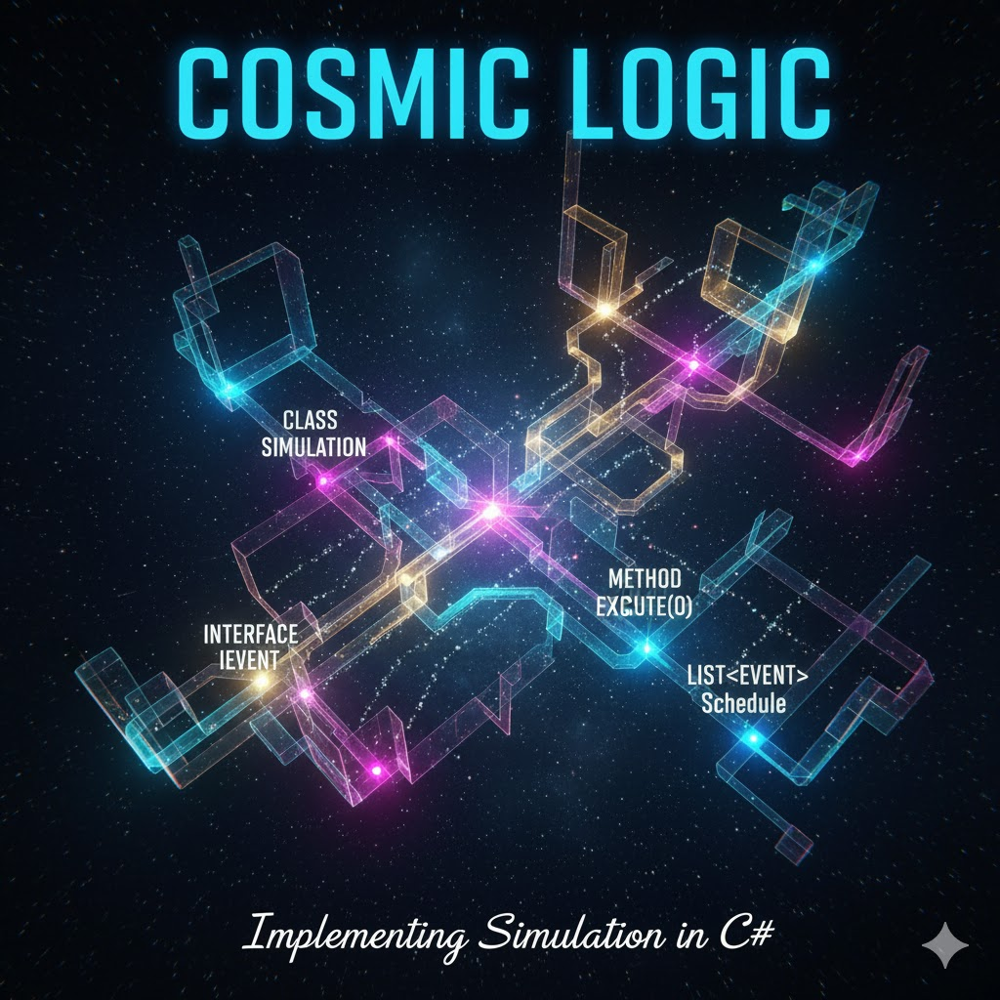

## 9.4: Implementierung in C#

Dieser Abschnitt umfasst die folgenden Inhalte:

- Implementierung der **Simulationsschleife**
- Verwendung einer **`PriorityQueue`** für die Ereignisliste
- Logik zur Behandlung von **Ankunftsereignissen** (`ArrivalEvent`)
- Logik zur Behandlung von **Abfahrtsereignissen** (`DepartureEvent`)

---

<div class="columns">
<div class="two">

### Modellierung eines Warteschlangensystems

Wir betrachten ein einfaches System mit einer einzigen Bedienstation (Server) und einer Warteschlange.

**Systemzustand (State):**
- Ist die Bedienstation besetzt? (`bool Busy`)
- Wie viele Kunden warten in der Schlange? (`Queue<double>`)

**Ereignisse (Events):**
- Ankunft eines Kunden (`ArrivalEvent`)
- Ende der Bedienung (`DepartureEvent`)

</div>
<div>

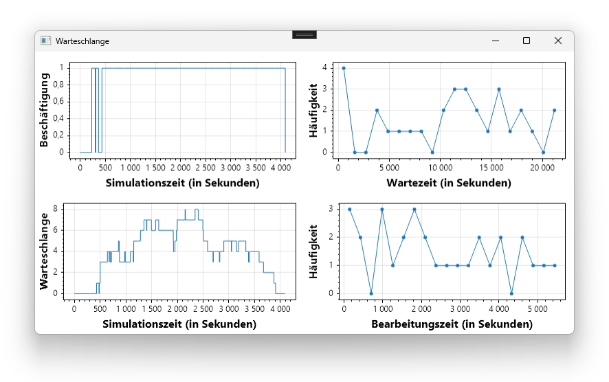

</div>
</div>

---

### Systemzustand (Klasse `State`)

Der Zustand des Systems wird durch eine Klasse abgebildet, die alle relevanten Zustandsgrößen enthält. Für unser Warteschlangensystem sind das die Belegung der Station und die Warteschlange selbst.

```csharp
namespace DynamischWarteschlange.Model
{
    // Zustand des Systems zu einem gegebenen Zeitpunkt
    internal class State
    {
        // Belegung der Kasse bzw. der Maschine
        public bool Busy { get; set; } = false;

        // Warteschlange vor der Kasse bzw. der Maschine
        public Queue<double> Queue { get; } = new Queue<double>();
    }
}
```

---

### Ereignisse (Klasse `Event`)

Ereignisse repräsentieren die Zeitpunkte, an denen sich der Systemzustand ändern kann. Wir definieren eine Basisklasse `Event` mit einem Zeitstempel und leiten davon spezifische Ereignistypen ab.

```csharp
namespace DynamischWarteschlange.Model
{
    // Basisklasse für alle Arten von Ereignissen
    internal abstract class Event
    {
        public double Timestamp { get; set; }
        public Event(double timestamp) => Timestamp = timestamp;
    }

    // Ankunft und Abfahrt eines Kunden
    internal class ArrivalEvent : Event { /* ... */ }
    internal class DepartureEvent : Event { /* ... */ }
}
```

---

<div class="columns">
<div class="three">

### Die `Simulation`-Klasse

Die `Simulation`-Klasse steuert den Ablauf:
- **`Clock`**: Aktuelle Simulationsuhr
- **`State`**: Systemzustand (Kassenstatus & Warteschlange)
- **`EventQueue`**: `PriorityQueue<Event, double>` für die zeitlich sortierte Ereignisabarbeitung.

</div>
<div class="three">

```csharp
internal class Simulation
{
    public double Clock { get; set; } = 0;
    public State State { get; set; } = new State();
    private PriorityQueue<Event, double> EventQueue { get; }

    public Simulation()
    {
        EventQueue = new PriorityQueue<Event, double>();
    }

    public void Run()
    {
        // Ereignisschleife verarbeiten
    }
}
```

</div>
</div>

---

<div class="columns">
<div class="three">

### Die Simulationsschleife (`Run`)

Die `Run()`-Methode implementiert die diskrete Simulationsschleife:
- Entnimmt stets das zeitlich nächste Ereignis (`Dequeue()`).
- Schaltet die Simulationsuhr auf den Ereigniszeitpunkt fort (`Clock = next.Timestamp`).
- Übergibt das Ereignis an die entsprechende Behandlungsroutine.

</div>
<div class="three">

```csharp
public void Run()
{
    while (EventQueue.Count > 0)
    {
        Event next = EventQueue.Dequeue();
        Clock = next.Timestamp;

        if (next is ArrivalEvent)
            HandleArrival(next);
        else if (next is DepartureEvent)
            HandleDeparture(next);
    }
}
```

</div>
</div>

---

### Behandlung eines Ankunftsereignisses (`ArrivalEvent`)

Wenn ein Kunde ankommt, gibt es zwei Möglichkeiten:

<div class="columns">
<div class="three">

**1. Station ist besetzt:**
Der Kunde wird in die Warteschlange (`State.Queue`) eingereiht.

**2. Station ist frei:**
Der Kunde wird sofort bedient.
- Der Zustand `State.Busy` wird auf `true` gesetzt.
- Eine Bedienzeit wird (zufällig) bestimmt.
- Ein neues `DepartureEvent` wird generiert und zum Zeitpunkt `Clock + Bedienzeit` in die `EventQueue` eingefügt.

</div>
<div class="three">

```csharp
if (next is ArrivalEvent)
{
    if (State.Busy)
    {
        State.Queue.Enqueue(Clock);
    }
    else
    {
        State.Busy = true;
        var serviceTime = Random.NextDouble() * 5 * 60;
        Add(new DepartureEvent(Clock + serviceTime));
    }
}
```

</div>
</div>

---

### Behandlung eines Abfahrtsereignisses (`DepartureEvent`)

Wenn ein Kunde die Station verlässt, gibt es zwei Möglichkeiten:

<div class="columns">
<div class="three">

**1. Warteschlange ist leer:**
Die Station wird frei.
- Der Zustand `State.Busy` wird auf `false` gesetzt.

**2. Warteschlange ist nicht leer:**
Der nächste Kunde wird aus der Schlange geholt und bedient.
- Eine neue Bedienzeit wird bestimmt.
- Ein neues `DepartureEvent` für diesen Kunden wird zum Zeitpunkt `Clock + Bedienzeit` in die `EventQueue` eingefügt.

</div>
<div class="three">

```csharp
else if (next is DepartureEvent)
{
    if (State.Queue.Count == 0)
    {
        State.Busy = false;
    }
    else
    {
        var arrivalTime = State.Queue.Dequeue();
        var waitTime = Clock - arrivalTime;
        // ...
        var serviceTime = Random.NextDouble() * 5 * 60;
        Add(new DepartureEvent(Clock + serviceTime));
    }
}
```

</div>
</div>

---


## 9.5: Analyse und Visualisierung

Dieser Abschnitt umfasst die folgenden Inhalte:

- **Datenerfassung:** Aufzeichnung von Zeitreihen und Ereigniskennzahlen im Simulationslauf
- **Verlaufsdiagramm:** Zeitlicher Verlauf der Warteschlangenlänge $L(t)$
- **Häufigkeitsverteilung:** Histogramm der Kundenwartezeiten $W_i$
- **Visualisierung mit ScottPlot:** Konkrete Auswertung (ScottPlot-Grundlagen siehe Kapitel 4)

---

### Datenerfassung im Simulationslauf

Während der Simulation werden zwei Kategorien von Daten aufgezeichnet:

<div class="columns">
<div class="two">

1. **Zustandsbeobachtung über die Zeit:**
   - Erfassung bei jedem diskreten Zustandsübergang ($e_A, e_D$).
   - Protokolliert Zeitstempel und aktuellen Zustand (z.B. Warteschlangenlänge $L(t)$, Status der Station).
2. **Ereignisbezogene Kennzahlen:**
   - Erfassung pro Kunde beim Verlassen der Warteschlange.
   - Wartezeit: $W_i = t_{\text{Bedienbeginn}} - t_{\text{Ankunft}}$

> [!NOTE]
> Für die allgemeinen Grundlagen der Diagrammbibliothek `ScottPlot` (z.B. WPF-Steuerelemente `WpfPlot`, Achsenkonfiguration, Styling und Performance) wird auf **Kapitel 4 (Visualisierung 2D: Diagramme)** verwiesen.

</div>
<div>

```csharp
// Zeitreihen für Zustandsverläufe
public List<double> ChartTime = new();
public List<int> ChartLength = new();

// Kennzahlen pro Kunde
public List<double> WaitTimes = new();

// Bei jeder Zustandsänderung:
ChartTime.Add(CurrentTime);
ChartLength.Add(Queue.Count);

// Bei Bedienbeginn eines Kunden:
WaitTimes.Add(CurrentTime - customer.ArrivalTime);
```

</div>
</div>

---

<div class="columns">
<div class="two">

### Auswertung 1: Verlauf der Warteschlangenlänge $L(t)$

Das Verlaufsdiagramm zeigt die dynamische Systembelastung über die Simulationsdauer:

- **Treppenfunktion:** Diskrete Ereignisse verändern die Länge sprunghaft um $\pm 1$.
- **Erkenntnis:** Identifikation von Spitzenlasten, Stauphasen und Leerlaufzeiten der Bedienstation.

```csharp
var plot = new ScottPlot.Plot();
var line = plot.Add.ScatterLine(times, lengths);
line.Color = Colors.SteelBlue;
line.LineWidth = 3f;

plot.Title("Verlauf der Warteschlangenlänge L(t)");
plot.XLabel("Simulationszeit t [min]");
plot.YLabel("Kunden in der Warteschlange");
plot.SavePng("Queue_Laenge_Verlauf.png", 800, 450);
```

</div>
<div class="two">

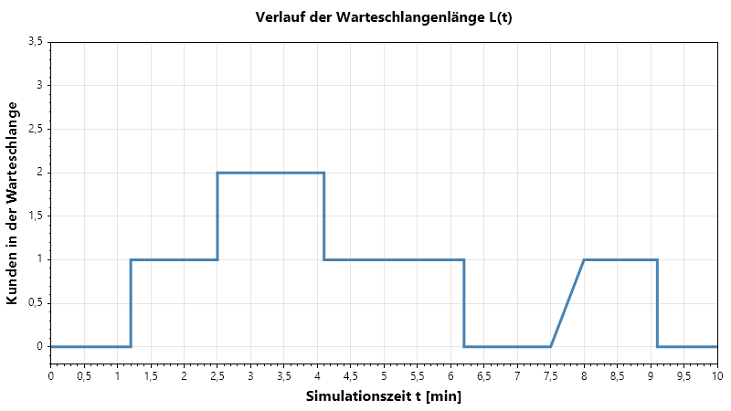

</div>
</div>

---

<div class="columns">
<div class="two">

### Auswertung 2: Wartezeiten-Histogramm

Das Histogramm aggregiert die individuellen Wartezeiten in Klassenintervalle (Bins):

- **Verteilungsform:** Bei Markov'schen Systemen (M/M/1) zeigt sich eine charakteristisch exponentiell abfallende Häufigkeit.
- **Erkenntnis:** Ein Großteil der Kunden wartet kurz; seltene Extremwartezeiten ("Long Tail") werden sichtbar.

```csharp
var hist = ScottPlot.Statistics.Histogram
    .WithBinCount(15, 0, 15);
hist.AddRange(waitTimes);

var bars = hist.Bins.Zip(hist.Counts, (pos, cnt) => 
    new ScottPlot.Bar {
        Position = pos, Value = cnt,
        Size = hist.FirstBinSize * 0.85,
        FillColor = Colors.SeaGreen.WithAlpha(0.7f),
        LineColor = Colors.SeaGreen,
        LineWidth = 1.2f
    }).ToList();
plot.Add.Bars(bars);
```

</div>
<div class="two">

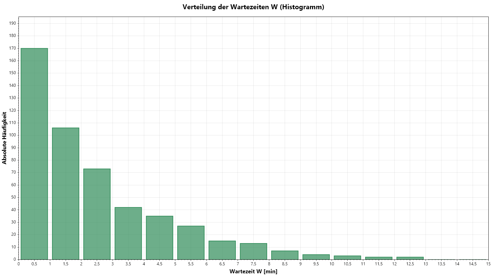

</div>
</div>

---

### Statistische Kennzahlen des Simulationslaufs

Aus den gesammelten Rohdaten lassen sich die zentralen Leistungsindikatoren berechnen:

<div class="columns">
<div class="two">

#### 1. Mittlere Warteschlangenlänge $\bar{L}_q$
Zeitgewichtetes Mittel über die Gesamtsimulationsdauer $T$:
$$\bar{L}_q = \frac{1}{T} \int_0^T L(t) \, dt \approx \frac{1}{T} \sum_{k=1}^K L(t_{k-1}) \cdot (t_k - t_{k-1})$$

#### 2. Mittlere Wartezeit $\bar{W}_q$
Arithmetisches Mittel über alle $N$ bedienten Kunden:
$$\bar{W}_q = \frac{1}{N} \sum_{i=1}^N W_i$$

</div>
<div class="two">

#### 3. Gesetz von Little (Plausibilitätsprüfung)
Im stationären Zustand gilt bei mittlerer Ankunftsrate $\lambda$:
$$\bar{L}_q = \lambda \cdot \bar{W}_q$$

- Dient in der Praxis als elementarer Plausibilitätscheck: Stimmen simulierte Schlangenlänge und simulierte Wartezeit überein?
- Abweichungen weisen auf Einschwingphasen (*Warm-up Period*) oder Modellierungsfehler hin.

</div>
</div>

---


## 9.6: Probabilistische Modelle

Dieser Abschnitt umfasst die folgenden Inhalte:

- **Abgrenzung** deterministischer und probabilistischer Modelle
- **Erweiterung des Formalismus** um Zufallsvariablen
- **Definition und Herleitung** der Exponentialverteilung
- **Definition und Herleitung** der Normalverteilung (Box-Muller-Transformation)

---

<div class="columns">
<div class="two">

### Probabilistische vs. Deterministische Modelle

Bisher waren unsere Modelle **deterministisch**: Bei gleichem Input kommt immer der gleiche Output heraus.

Reale Systeme beinhalten jedoch oft **Zufallsprozesse**:
- Kundenankünfte sind unregelmäßig.
- Bedienzeiten oder Prozessdauern variieren.

Diese Zufälligkeiten werden durch **Wahrscheinlichkeitsverteilungen** (z.B. Exponential-, Normalverteilung) modelliert. Das Modell wird **probabilistisch** (oder stochastisch). 

Das Ergebnis einer einzelnen Simulation ist damit selbst eine **Zufallsvariable**.

</div>
<div>


</div>
</div>

---

### Erweiterter Formalismus mit Zufallsvariablen

Die Zufälligkeit fließt in die **Ereignisplanung** ein. Die Funktion $g$ hängt nun zusätzlich von einer Zufallszahl (oder einem Zufallsvektor) $\omega$ ab.

-   $E_{neu} = g(\vec{z}(t_{alt}), e_i, \omega_i)$

Im Warteschlangen-Beispiel werden Zwischenankunfts- und Bedienzeiten aus Verteilungen gezogen:
-   **Zwischenankunftszeit** $\sim \text{Exponential}(\lambda)$
-   **Bedienzeit** $\sim \text{LogNormal}(\mu, \sigma^2)$ (strikt positiv, $T > 0$)

```csharp
// Bedienzeit aus Log-Normal-Verteilung (Soll: m = 3 min, s = 30 s)
var serviceTime = NextLogNormal(targetMean: 3 * 60, targetStdDev: 0.5 * 60);
// Garantiert t > Clock (Kausalitätsbedingung)
Add(new DepartureEvent(Clock + serviceTime));

// Nächste Ankunft via Exponentialverteilung (Rate: 1 Kunde alle 2 min)
var interarrivalTime = NextExponential(lambda: 1.0 / (2 * 60));
Add(new ArrivalEvent(Clock + interarrivalTime));
```

---

### Definition der **Exponentialverteilung**

Die **Exponentialverteilung** beschreibt die Zeit zwischen zwei aufeinanderfolgenden Ereignissen in einem Poisson-Prozess, d.h. Ereignisse, die kontinuierlich und unabhängig voneinander mit einer konstanten durchschnittlichen Rate auftreten.

- **Kontinuierliche** Wahrscheinlichkeitsverteilung.
- **Parameter:** $\lambda > 0$ (Ratenparameter), der die durchschnittliche Anzahl der Ereignisse pro Zeiteinheit angibt.
- **Wahrscheinlichkeitsdichtefunktion (PDF):**
  $f(x; \lambda) = \lambda e^{-\lambda x}$ für $x \ge 0$
- **Kumulative Verteilungsfunktion (CDF):**
  $F(x; \lambda) = 1 - e^{-\lambda x}$ für $x \ge 0$
- **Erwartungswert (Mittelwert):** $E[X] = 1/\lambda$
- **Varianz:** $Var[X] = 1/\lambda^2$

---

### Verlauf der Exponentialverteilung

Die folgenden beiden Diagramme zeigen den Verlauf der Wahrscheinlichkeitsdichtefunktion und der kummulativen Verteilungsfunktion für die Exponentialverteilung:

<div class="columns">
<div>

**Wahrscheinlichkeitsdichtefunktion**

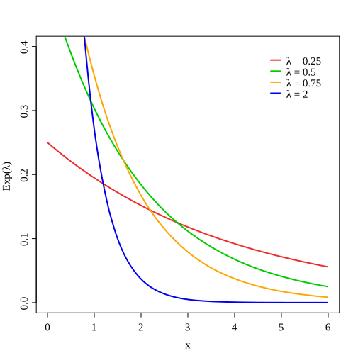

</div>
<div>

**Kumulative Verteilungsfunktion**

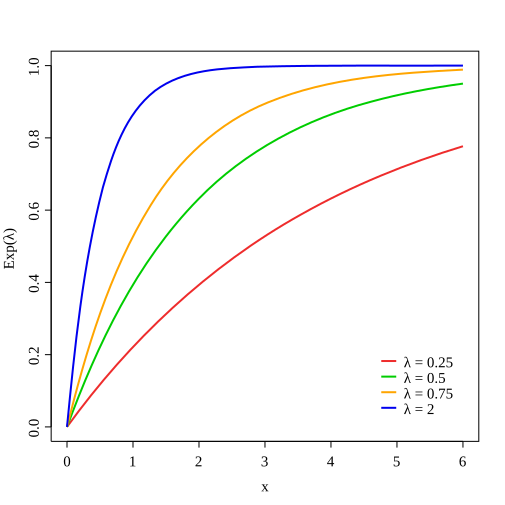

</div>
</div>

---

### Implementierung der Exponentialverteilung

Zufallszahlen, die einer **Exponentialverteilung** folgen, können mittels der **Inversionsmethode** aus gleichverteilten Zufallszahlen erzeugt werden.

- Eine gleichverteilte Zufallszahl $u \in [0, 1)$ wird mit `random.NextDouble()` erzeugt.
- Die Transformation lautet: $x = -\frac{1}{\lambda} \ln(1 - u)$
- $\lambda$ ist die Rate der Verteilung (z.B. mittlere Anzahl Ankünfte pro Zeiteinheit).

```csharp
private double NextExponential(Random random, double lambda)
{
    // random.NextDouble() liefert eine Zahl in [0.0, 1.0)
    double u = random.NextDouble();

    // Inversionsmethode anwenden
    // (1.0 - u) um zu verhindern, dass Log(0) -> -unendlich wird
    return -Math.Log(1.0 - u) / lambda;
}
```

---

<div class="columns">
<div class="three">

### Herleitung mittels Inversionsmethode (1/2) - **Prinzip**

Die **Inversionsmethode** (Inverse Transform Sampling) ist ein Verfahren zur Erzeugung von Zufallszahlen nach einer beliebigen Verteilung, deren kumulative Verteilungsfunktion (CDF) $F_X(x)$ bekannt und analytisch invertierbar ist.

**Grundidee:**
1.  Wir wissen: Wenn eine Zufallsvariable $X$ die CDF $F_X(x)$ besitzt, dann ist $U = F_X(X)$ gleichverteilt im Intervall $[0, 1]$.
2.  Umgekehrt können wir eine gleichverteilte Zufallszahl $U \sim \text{Uniform}(0, 1)$ nutzen, um $X$ zu erzeugen, indem wir die umgekehrte Funktion der CDF, $F_X^{-1}$, anwenden: $X = F_X^{-1}(U)$

</div>
<div class="two">

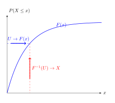

</div>
</div>

---

### Herleitung mittels Inversionsmethode (2/2) - **Exponentialverteilung**

**Ziel:** Erzeuge eine Zufallsvariable $X$ mit der kumulativen Verteilungsfunktion (CDF) der Exponentialverteilung: $F_X(x) = 1 - e^{-\lambda x}$ für $x \ge 0$.

**Schritte:**
1.  Setze die CDF gleich einer gleichverteilten Zufallszahl $U \in [0, 1)$: $U = 1 - e^{-\lambda X}$
2.  Löse nach $e^{-\lambda X}$ auf: $e^{-\lambda X} = 1 - U$
3.  Wende den natürlichen Logarithmus auf beide Seiten an:
    $\ln(e^{-\lambda X}) = \ln(1 - U)$ und $-\lambda X = \ln(1 - U)$
4.  Löse nach $X$ auf: $X = -\frac{1}{\lambda} \ln(1 - U)$

**Hinweis:** Da $U$ eine gleichverteilte Zufallszahl in $[0, 1)$ ist, ist auch $1 - U$ eine gleichverteilte Zufallszahl in $(0, 1]$. Daher kann die Formel vereinfacht werden zu: $X = -\frac{1}{\lambda} \ln(U)$

---

### Definition der **Normalverteilung**

Die **Normalverteilung**, auch **Gauß-Verteilung** genannt, ist eine kontinuierliche Wahrscheinlichkeits-verteilung, die symmetrisch um ihren Mittelwert ist. Sie beschreibt, dass Datenpunkte, die nahe am Mittelwert liegen, häufiger auftreten als Datenpunkte, die weiter vom Mittelwert entfernt sind.

- Oft als "Glockenkurve" bezeichnet.
- **Parameter:**
  - $\mu$ (Mittelwert): Der zentrale Wert der Verteilung.
  - $\sigma$ (Standardabweichung): Ein Maß für die Streuung der Daten um den Mittelwert.
- **Wahrscheinlichkeitsdichtefunktion (PDF):**
  - $f(x; \mu, \sigma) = \frac{1}{\sigma \sqrt{2\pi}} e^{-\frac{1}{2} \left(\frac{x - \mu}{\sigma}\right)^2}$
- Die kumulative Verteilungsfunktion (CDF) hat keine geschlossene analytische Form und wird üblicherweise mit $\Phi(x)$ bezeichnet.

---

### Verlauf der Normalverteilung

Die folgenden beiden Diagramme zeigen den Verlauf der Wahrscheinlichkeitsdichtefunktion und der kummulativen Verteilungsfunktion für die Normalverteilung:

<div class="columns top">
<div>

**Wahrscheinlichkeitsdichtefunktion**

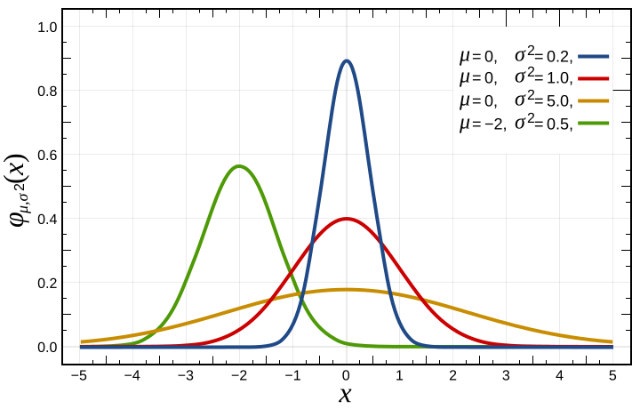

</div>
<div>

**Kumulative Verteilungsfunktion**

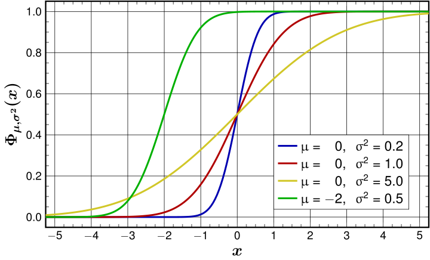

</div>
</div>

---

### Implementierung der Normalverteilung

Zufallszahlen, die einer **Normalverteilung** folgen, können mittels der **Box-Muller-Transformation** erzeugt werden. Diese Methode transformiert zwei unabhängige, gleichverteilte Zufallszahlen in zwei unabhängige, standardnormalverteilte Zufallszahlen.

- $Z_0 = \sqrt{-2 \ln U_1} \cos(2\pi U_2)$
- Eine standardnormalverteilte Zahl $Z_0$ kann dann auf eine beliebige Normalverteilung mit Mittelwert $\mu$ und Standardabweichung $\sigma$ skaliert werden: $X = \mu + \sigma Z_0$.

```csharp
private double NextNormal(Random random, double mean, double stdDev)
{
    // Zwei gleichverteilte Zufallszahlen im Intervall (0.0, 1.0]
    double u1 = 1.0 - random.NextDouble();
    double u2 = 1.0 - random.NextDouble();
    // Box-Muller-Transformation für eine standardnormalverteilte Zahl (Z)
    double z = Math.Sqrt(-2.0 * Math.Log(u1)) * Math.Cos(2.0 * Math.PI * u2);
    // Transformation zur gewünschten Normalverteilung (µ, σ)
    return mean + stdDev * z;
}
```

---

### Herleitung der Box-Muller-Transformation (1/3) - **Die Idee**

Die **Box-Muller-Transformation** ist eine Methode zur Erzeugung von Paaren unabhängiger, standardnormalverteilter Zufallszahlen aus Paaren unabhängiger, gleichverteilter Zufallszahlen.

**Grundidee:**
1.  Betrachte zwei unabhängige standardnormalverteilte Zufallsvariablen $Z_1$ und $Z_2$.
2.  Ihre gemeinsame Wahrscheinlichkeitsdichtefunktion (PDF) ist:
    - $f(z_1, z_2) = \frac{1}{2\pi} e^{-\frac{z_1^2 + z_2^2}{2}}$
3.  Diese PDF besitzt eine **radiale Symmetrie**. Dies legt nahe, dass eine Transformation in Polarkoordinaten hilfreich sein könnte.
    -   $Z_1 = R \cos \Theta$
    -   $Z_2 = R \sin \Theta$
    -   Wobei $R^2 = Z_1^2 + Z_2^2$ und $\Theta = \arctan(Z_2/Z_1)$.

---

### Herleitung der Box-Muller-Transformation (2/3) - **Die Transformation**

Die Transformation von kartesischen zu Polarkoordinaten führt zu neuen Zufallsvariablen $R$ (Radius) und $\Theta$ (Winkel).

**Eigenschaften von $R^2$ und $\Theta$:**
-   Es kann gezeigt werden, dass $R^2 = Z_1^2 + Z_2^2$ einer Exponentialverteilung mit Rate $\lambda = 1/2$ folgt.
    -   Wir können $R^2$ aus einer gleichverteilten Zufallszahl $U_1 \in (0, 1]$ erzeugen, indem wir die Inversionsmethode anwenden:
        $R^2 = -2 \ln(U_1)$
-   Der Winkel $\Theta$ ist gleichverteilt im Intervall $[0, 2\pi]$.
    -   Wir können $\Theta$ aus einer gleichverteilten Zufallszahl $U_2 \in [0, 1)$ erzeugen:
        $\Theta = 2\pi U_2$

**Zusammenfassung der Zwischenschritte:**
-   $R = \sqrt{-2 \ln U_1}$  und  $\Theta = 2\pi U_2$

---

### Herleitung der Box-Muller-Transformation (3/3) - **Die Formeln**

Durch Einsetzen von $R$ und $\Theta$ in die Polarkoordinaten-Gleichungen erhalten wir die beiden standardnormalverteilten Zufallszahlen $Z_1$ und $Z_2$:

1.  **Erste standardnormalverteilte Zufallszahl $Z_1$:**
    $Z_1 = R \cos \Theta = \sqrt{-2 \ln U_1} \cos(2\pi U_2)$

2.  **Zweite standardnormalverteilte Zufallszahl $Z_2$:**
    $Z_2 = R \sin \Theta = \sqrt{-2 \ln U_1} \sin(2\pi U_2)$

**Anwendung:**
-   Diese Methode erzeugt immer ein Paar von standardnormalverteilten Zufallszahlen.
-   Man kann eine der Zahlen verwenden und die andere für den nächsten Bedarf speichern oder verwerfen, falls nur eine benötigt wird.
---

### Stochastische Kausalität bei Bedienzeiten

In diskreten Ereignissimulatoren steuern Zufallsvariablen die Zeitdauer bis zum nächsten Ereignis ($t_{\text{Event}} = \text{Clock} + T$):

- **Kausalitätsprinzip:** Ein zukünftiges Ereignis darf niemals in der Vergangenheit stattfinden: $T > 0$.
- **Problem der Normalverteilung:**
  - Der Träger der Normalverteilung ist ganz $\mathbb{R} = (-\infty, +\infty)$.
  - Damit gilt stets $P(T < 0) > 0$!
  - Fällt ein Zufallswert negativ aus ($T < 0$), wird das Ereignis **vor der aktuellen Simulationsuhr** geplant.
  - Dies zerstört die zeitliche Monotonie der `PriorityQueue` und führt zu schwer auffindbaren Logikfehlern oder Deadlocks.
- **Lösung:** Die **Log-Normal-Verteilung** besitzt den Träger $(0, \infty)$ und garantiert physikalische Kausalität ($T > 0$).

---

### Die Log-Normal-Verteilung: Parameterumrechnung

Eine Zufallsvariable $X$ ist log-normalverteilt ($X \sim \text{LogNormal}(\mu, \sigma)$), wenn $\ln(X) \sim \mathcal{N}(\mu, \sigma^2)$ normalverteilt ist.

<div class="columns">
<div>

**Gegeben in der Praxis:**
- Gewünschter Soll-Mittelwert $m = E[X] > 0$ (z.B. $3\,\text{min}$)
- Gewünschte Soll-Varianz $v = \text{Var}[X] = s^2$ (z.B. $(0{,}5\,\text{min})^2$)

**Gesuchte Verteilungsparameter:**
- $\mu$: Lageparameter im logarithmischen Raum
- $\sigma$: Skalenparameter im logarithmischen Raum

</div>
<div>

**Analytische Umrechnungsformeln:**

$$\sigma^2 = \ln\left(1 + \frac{v}{m^2}\right) = \ln\left(1 + \frac{s^2}{m^2}\right)$$

$$\sigma = \sqrt{\sigma^2}$$

$$\mu = \ln(m) - \frac{1}{2} \sigma^2$$

**Erzeugung:**
Ist $Z \sim \mathcal{N}(0, 1)$ standardnormalverteilt (via Box-Muller), so ist:
$$X = \exp(\mu + \sigma Z) > 0$$

</div>
</div>

---

### C#-Implementierung: Log-Normal-Verteilung

```csharp
// Erzeugt Log-Normal-Verteilung mit Soll-Mittelwert und Standardabweichung
public static double NextLogNormal(Random rnd, double mean, double stdDev)
{
    // 1. Verteilungsparameter µ und σ berechnen
    double sigma2 = Math.Log(1.0 + (stdDev * stdDev) / (mean * mean));
    double sigma = Math.Sqrt(sigma2);
    double mu = Math.Log(mean) - 0.5 * sigma2;

    // 2. Standardnormalverteilung Z ~ N(0, 1) via Box-Muller
    double u1 = 1.0 - rnd.NextDouble();
    double u2 = 1.0 - rnd.NextDouble();
    double z = Math.Sqrt(-2.0 * Math.Log(u1)) * Math.Cos(2.0 * Math.PI * u2);

    // 3. Transformation: garantiert strikt X > 0
    return Math.Exp(mu + sigma * z);
}
```

---

<div class="columns">
<div>

### Das Problem mit der Einzelsimulation

Ein einzelner Simulationslauf (eine **Replikation**) ist nur *ein möglicher* Systemverlauf ("Sample Path").

Das Ergebnis (z.B. mittlere Wartezeit = 4.7 min) ist nicht repräsentativ für das allgemeine Systemverhalten. Bei einem erneuten Lauf mit anderen Zufallszahlen könnte das Ergebnis 8.1 min sein.

**Ziel:** Wir wollen nicht das Ergebnis eines einzelnen Laufs, sondern **statistische Kennzahlen** über viele mögliche Verläufe hinweg (z.B. den Erwartungswert der mittleren Wartezeit).

</div>
<div>

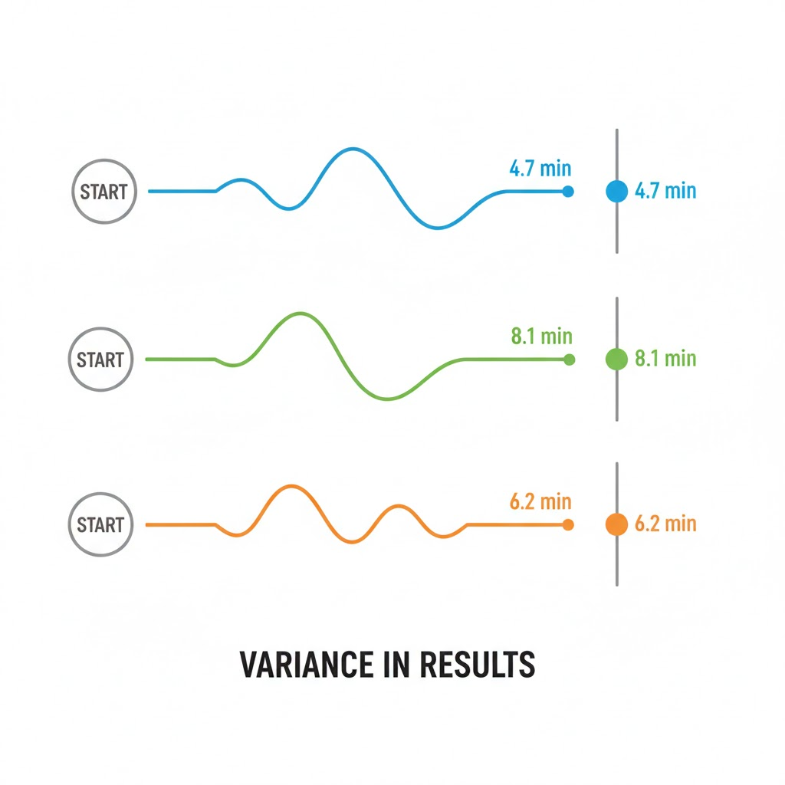

</div>
</div>

---


## 9.7: Monte-Carlo-Simulation

Dieser Abschnitt umfasst die folgenden Inhalte:

- **Grundidee:** Stochastische Simulation und Gesetz der großen Zahlen
- **Zufallszahlen & Seeds:** Reproduzierbarkeit und statistische Unabhängigkeit
- **Replikationsmethodik:** Schätzung von Erwartungswert, Varianz und Standardfehler
- **Konfidenzintervalle:** Quantifizierung der Schätzgenauigkeit und Konvergenz $\mathcal{O}(1/\sqrt{N})$
- **Parallele Replikation:** Skalierung mit `Parallel.For` (Verweis auf Kapitel 6)

---

### Monte-Carlo-Simulation: Motivation & Methodik

In stochastischen Modellen ist das Resultat eines einzelnen Simulationslaufs eine **Zufallsvariable**:

- Ein einzelner Lauf liefert lediglich eine Stichprobe $X_1$ – keine Aussage über Streuung oder Schätzgüte möglich.
- **Monte-Carlo-Prinzip:** Wiederhole das Experiment $N$-mal (**Replikationen**) unter identischen Systemparametern, aber mit **statistisch unabhängigen Zufallszahlen**.
- Aus jeder Replikation $k$ wird die interessierende Kennzahl $X_k$ (z.B. mittlere Wartezeit $\bar{W}_k$) erhoben.

Nach dem **Gesetz der großen Zahlen** konvergiert der Stichprobenmittelwert $\bar{X}_N$ für $N \to \infty$ gegen den wahren Erwartungswert $\mu = \mathbb{E}[X]$:
$$\lim_{N \to \infty} P(|\bar{X}_N - \mu| < \varepsilon) = 1 \quad \forall \varepsilon > 0$$

---

<div class="columns">
<div class="two">

### Pseudo-Zufall & Seed-Management

Computer erzeugen Zufallszahlen über deterministische Algorithmen (PRNG), gesteuert durch einen Initialisierungswert (**Seed**):

- **Reproduzierbarkeit (Debugging & Validierung):**
  - Identischer Seed $\rightarrow$ identische Zufallszahlenfolge $\rightarrow$ exakt reproduzierbares Systemverhalten.
  - Essenziell für Regressionstests und wissenschaftliche Dokumentation.
- **Statistische Unabhängigkeit:**
  - Jede Replikation $k$ benötigt eine unabhängige Zufallssequenz: Eindeutiger Seed $s_k = s_{\text{base}} + k$.
- **Multithreading:**
  - `System.Random` ist **nicht threadsicher**! Geteilte Instanzen führen zu Race Conditions und verzerrten Verteilungen.
  - *Lösung:* Eigene `Random`-Instanz pro Replikation/Thread mit individuellem Seed.

</div>
<div class="two">

```csharp
// Ungeeignet: Eine globale Random-Instanz
// führt im Multithreading zu Race Conditions!
static Random sharedRnd = new Random();

// Best Practice: Eindeutiger Seed pro Lauf
int numberOfReplications = 1000;
int baseSeed = 42;

for (int i = 0; i < numberOfReplications; i++)
{
    // Eindeutig deterministischer Seed:
    var rnd = new Random(seed: baseSeed + i);
    var sim = new QueueSimulation(rnd);
    sim.Run();
}
```

</div>
</div>

---

### Statistische Auswertung von Replikationen

Seien $X_1, X_2, \dots, X_N$ die Kennzahlen aus $N$ unabhängigen Replikationen (i.i.d.):

<div class="columns">
<div class="two">

#### 1. Stichprobenmittelwert (Punktschätzer)
Unverzerrte Schätzung des Erwartungswerts $\mu = \mathbb{E}[X]$:
$$\bar{X} = \frac{1}{N} \sum_{k=1}^N X_k$$

#### 2. Empirische Stichprobenvarianz
Unverzerrte Schätzung der Varianz $\sigma^2$:
$$s^2 = \frac{1}{N-1} \sum_{k=1}^N (X_k - \bar{X})^2, \quad s = \sqrt{s^2}$$

</div>
<div class="two">

#### 3. Standardfehler des Mittelwerts ($SE$)
Gibt die Streuung des Schätzers $\bar{X}$ um den wahren Erwartungswert $\mu$ an:
$$SE = \frac{s}{\sqrt{N}}$$

> [!IMPORTANT]
> **Konvergenzrate $\mathcal{O}(1/\sqrt{N})$:**
> Um den Schätzfehler zu halbieren, muss die Anzahl der Replikationen $N$ **vervierfacht** ($4 \times N$) werden! Für eine Dezimalstelle mehr Genauigkeit sind $100 \times N$ Läufe erforderlich.

</div>
</div>

---

### Konfidenzintervalle

Ein Punktschätzer $\bar{X}$ quantifiziert die Genauigkeit noch nicht. Das **Konfidenzintervall** liefert den Bereich, der den wahren Erwartungswert $\mu$ mit der Wahrscheinlichkeit $(1-\alpha)$ überdeckt:

- **Zentraler Grenzwertsatz:** Für hinreichend großes $N$ ($N \ge 30$) ist der Mittelwert $\bar{X}$ näherungsweise normalverteilt: $\bar{X} \sim \mathcal{N}\left(\mu, \frac{\sigma^2}{N}\right)$.
- **$(1-\alpha)$-Konfidenzintervall:**
  $$KI_{1-\alpha} = \left[ \bar{X} - z_{1-\alpha/2} \cdot \frac{s}{\sqrt{N}}, \quad \bar{X} + z_{1-\alpha/2} \cdot \frac{s}{\sqrt{N}} \right]$$
  - Für ein $95\%$-Konfidenzintervall ($\alpha = 0.05$): $z_{0.975} \approx 1.960$
  - Für ein $99\%$-Konfidenzintervall ($\alpha = 0.01$): $z_{0.995} \approx 2.576$
  - Für kleine Stichproben ($N < 30$): Student-$t$-Quantil $t_{N-1, 1-\alpha/2}$ anstelle von $z$ verwenden.

> [!NOTE]
> **Interpretation:** Wird das Gesamtexperiment aus $N$ Replikationen $100$-mal wiederholt, überdecken im statistischen Mittel $95$ der berechneten Konfidenzintervalle den wahren Parameter $\mu$.

---

<div class="columns">
<div class="two">

### Parallele Replikationen mit der TPL

Monte-Carlo-Replikationen sind vollständig unabhängig voneinander (*embarrassingly parallel*) und skalieren nahezu ideal über alle CPU-Kerne:

- **Parallelisierung mit `Parallel.For`:**
  - Automatische Verteilung der Schleifeniterationen auf ThreadPool-Worker.
  - Aggregation der Replikationsergebnisse in einer threadsicheren Sammlung `ConcurrentBag<double>`.
- **Zufallsisolierung:**
  - Jede Iteration instanziiert ihre eigene `Random`-Instanz mit disjunktem Seed.

> [!TIP]
> Für die theoretischen Grundlagen zu Multi-Threading, Race Conditions, Synchronisation (`lock`) und der Task Parallel Library wird auf **Kapitel 6 (Multithreading)** verwiesen.

</div>
<div>


</div>
</div>

---

### Problem der naiven 2-Pass-Varianzberechnung

In vielen einfachen Implementierungen wird die Varianz über zwei Durchläufe berechnet:
1. `double mean = results.Average();`
2. `double variance = results.Sum(x => Math.Pow(x - mean, 2)) / (N - 1);`

**Kritische Nachteile in der Praxis:**
- **Massiver Speicherverbrauch & GC-Druck:** Alle $N = 10^5 \dots 10^7$ Replikationsergebnisse müssen im RAM gehalten werden (`ConcurrentBag<double>`).
- **Zwei Speicher-Durchläufe:** Doppelter Lesezugriff bremst große Simulationsstudien aus.
- **Instabile Alternative:** Die mathematische Formel $\sum x_i^2 - \frac{(\sum x_i)^2}{N}$ leidet unter **katastrophaler Auslöschung** (Subtraktion zweier fast gleicher großer Zahlen führt zu Bitverlust).

---

### Numerisch stabile 1-Pass-Varianz: Welford (1962)

B. P. Welford formulierte einen numerisch exakten **Online-Algorithmus**, der Mittelwert $M_k$ und Quadratsumme $S_k = \sum_{i=1}^k (x_i - M_k)^2$ schrittweise aktualisiert:

$$M_k = M_{k-1} + \frac{x_k - M_{k-1}}{k}$$

$$S_k = S_{k-1} + (x_k - M_{k-1}) \cdot (x_k - M_k)$$

- **Stichprobenvarianz:** $s^2 = \frac{S_N}{N - 1}$
- **Standardfehler (Standard Error):** $\text{SE} = \frac{s}{\sqrt{N}}$
- **Vorteile:**
  - **Single Pass:** Jeder Messwert wird genau einmal verarbeitet und sofort verworfen.
  - **Minimaler Speicherbedarf:** $\mathcal{O}(1)$ RAM statt $\mathcal{O}(N)$.
  - **Numerisch robust:** Keine Subtraktion großer Quadratsummen.

---

### Parallele Aggregation: Chan-Merge-Formel (1979)

Für parallele Monte-Carlo-Simulationen auf Multi-Core-CPUs leiteten Chan, Golub & LeVeque (1979) eine exakte Fusionsformel für zwei Teilstichproben $A$ und $B$ her:

$$n = n_A + n_B, \quad \delta = M_B - M_A$$

$$M = M_A + \delta \cdot \frac{n_B}{n}$$

$$S = S_A + S_B + \delta^2 \cdot \frac{n_A \cdot n_B}{n}$$

- **Konzept:** Jeder Thread berechnet mit Welford lokal für seine Replikationen.
- Am Ende werden die Teilakkumulatoren mit der Chan-Formel verlustfrei zusammengeführt!

---

### `ParallelWelfordAccumulator`: Lokale Akkumulation

Ermöglicht die numerisch stabile Ein-Pass-Berechnung von Mittelwert und Varianz für jeden Thread:

```csharp
public class ParallelWelfordAccumulator
{
    public long Count { get; private set; }
    public double Mean { get; private set; }
    public double M2 { get; private set; } // Summe quadrierter Abweichungen

    public void Add(double x)
    {
        Count++;
        double delta = x - Mean;
        Mean += delta / Count;
        M2 += delta * (x - Mean);
    }
    public double Variance => Count > 1 ? M2 / (Count - 1) : 0.0;
    public double StandardError => Math.Sqrt(Variance / Count);
}
```

---

### `ParallelWelfordAccumulator`: Chan-Merge

Führt die Teilakkumulatoren zweier Threads exakt und verlustfrei zusammen:

```csharp
public void Merge(ParallelWelfordAccumulator other)
{
    if (other.Count == 0) return;
    if (Count == 0)
    {
        Count = other.Count; Mean = other.Mean; M2 = other.M2;
        return;
    }

    long newCount = Count + other.Count;
    double delta = other.Mean - Mean;
    Mean += delta * other.Count / newCount;
    M2 += other.M2 + delta * delta * 
          ((double)Count * other.Count / newCount);
    Count = newCount;
}
```

---

### Parallele Monte-Carlo-Simulation: Replikation

Parallele Ausführung von $N$ Replikationen mit thread-lokalen Akkumulatoren und anschließendem Chan-Merge:

```csharp
var globalAcc = new ParallelWelfordAccumulator();
object syncLock = new object();
int N = 10_000, baseSeed = 42;

// Thread-lokale Welford-Akkumulatoren in Parallel.For
Parallel.For(0, N, () => new ParallelWelfordAccumulator(), 
(i, loopState, localAcc) =>
{
    var rnd = new Random(seed: HashCode.Combine(baseSeed, i));
    var sim = new QueueSimulation(rnd);
    sim.Run();
    localAcc.Add(sim.AverageWaitTime);
    return localAcc;
},
localAcc => { lock (syncLock) { globalAcc.Merge(localAcc); } });
```

---

### Statistische Auswertung & Konfidenzintervall

Berechnung des 95%-Konfidenzintervalls aus dem aggregierten `ParallelWelfordAccumulator`:

```csharp
// Statistische Auswertung & 95%-Konfidenzintervall (Z = 1.960)
double mean = globalAcc.Mean;
double stderr = globalAcc.StandardError;
double ciMargin = 1.960 * stderr;

Console.WriteLine($"Stichprobenumfang N = {globalAcc.Count}");
Console.WriteLine($"Mittelwert: {mean:F3} min");
Console.WriteLine($"Standardfehler: {stderr:F4} min");
Console.WriteLine(
    $"95%-KI: [{mean - ciMargin:F3}; {mean + ciMargin:F3}] min");
```