<!-- _paginate: false -->
<!-- _header: "" -->
<!-- _footer: "" -->


# Kapitel 11: Epilog

Dieses abschließende Kapitel umfasst die folgenden Abschnitte:

- 11.1: Die große Synthese: Modell- & Visualisierungstaxonomie
- 11.2: Leitfaden zur Modellauswahl in Industrieprojekten
- 11.3: Softwarearchitektur & Best Practices für Simulationscode
- 11.4: Der Digitale Zwilling in der industriellen Praxis
- 11.5: Semesterrückblick, Portfolio-Synthese & Feedback

---

## 11.1: Die große Synthese

Dieser Abschnitt umfasst die folgenden Inhalte:

- Rückblick auf die 4 Simulationsmodellarten (Statisch, Kontinuierlich, Diskret, Hybrid)
- Die Modellierungsmatrix: Zeitverhalten vs. Zustandsraum
- Rückblick auf die 4 Visualisierungsarten (Pixel, Vektor, Charts/Graphen, 3D)
- Die optimale Paarung von Modell und Visualisierung

---

### Die 4 Simulationsmodellarten im Überblick (1/2)

Im Verlauf des Semesters haben wir vier grundlegende Paradigmen der mathematischen Modellierung kennengelernt:

<div class="columns top">
<div>

**1. Statische Modelle (Kap. 7)**
- Zeitinvariantes Verhalten
- Zustand im statischen Gleichgewicht
- Lineares Gleichungssystem ($\mathbf{A} \mathbf{x} = \mathbf{b}$)
- Direkte Lösungsverfahren (Gauß, Cholesky, LU)
- Bsp.: Statisches Fachwerk, Widerstandsnetzwerk

</div>
<div>

**2. Kontinuierliche Modelle (Kap. 8)**
- Zeit stetig: $t \in \mathbb{R}$
- Zustand stetig: $\mathbf{x}(t) \in \mathbb{R}^n$
- Gewöhnliche DGL-Systeme ($\dot{\mathbf{x}} = \mathbf{f}(t, \mathbf{x}, \mathbf{u})$)
- Numerische Integratoren (Euler, Heun, RK4)
- Bsp.: Vertikaler Wurf, Federpendel

</div>
</div>

---

### Die 4 Simulationsmodellarten im Überblick (2/2)

<div class="columns top">
<div>

**3. Diskrete Modelle (Kap. 9)**
- Zeit getaktet ($t_k$) oder ereignisbasiert ($t_e$)
- Zustand zählbar/diskret: $\mathbf{s} \in \mathcal{S}$
- Zustandsübergangsfunktionen ($\mathbf{s}_{k+1} = \boldsymbol{\delta}(\mathbf{s}_k, e)$)
- Ereignisorientierte Simulation (DES, Queues)
- Bsp.: Warteschlangen, Fördertechnik, Logistik

</div>
<div>

**4. Hybride Modelle (Kap. 10)**
- Kontinuierliche Dynamik mit diskreten Sprüngen
- Phasen stetiger Bewegung + Events ($z(\mathbf{x}_c) = 0$)
- Schaltbedingungen und Strukturwechsel
- S-Funktions-Architektur für hybride Solver
- Bsp.: Bouncing Ball (Stoß), Thermostat mit Hysterese

</div>
</div>

---

### Die Modellierungsmatrix

Das Zusammenspiel von **Zeitachse** (statisch, kontinuierlich, diskret) und **Zustandsraum** (kontinuierlich, diskret, hybrid) spannt das Spektrum aller Modellierungsarten auf:



---

### Vergleichende Taxonomie der Modellarten (1/2)

Mathematische Grundlagen und Modellierungscharakteristik der vier Paradigmen:

| Kriterium | Statisch (Kap. 7) | Kontinuierlich (Kap. 8) | Diskret (Kap. 9) | Hybrid (Kap. 10) |
| :--- | :--- | :--- | :--- | :--- |
| **Zeitverhalten** | Zeitinvariant / Stationär | Kontinuierlich ($t \in \mathbb{R}$) | Diskrete Schritte / Ereignisse | Stetige Phasen + diskrete Events |
| **Zustandsraum** | Kontinuierlich ($\mathbf{x} \in \mathbb{R}^n$) | Kontinuierlich ($\mathbf{x}(t) \in \mathbb{R}^n$) | Abzählbar ($\mathbf{s} \in \mathcal{S}$) | Gemischt ($\mathbf{x}_c \in \mathbb{R}^{n_c}, m \in \mathcal{M}$) |
| **Mathematik** | $\mathbf{f}(\mathbf{x}, \mathbf{u}) = \mathbf{0}$ bzw. $\mathbf{A} \mathbf{x} = \mathbf{b}$ | $\dot{\mathbf{x}}(t) = \mathbf{f}(t, \mathbf{x}, \mathbf{u})$ | $\mathbf{s}_{k+1} = \boldsymbol{\delta}(\mathbf{s}_k, e_k)$ | $\dot{\mathbf{x}}_c = \mathbf{f}_m(\mathbf{x}_c, \mathbf{u}), z(\mathbf{x}_c) = 0 \implies \mathbf{x}_c^+ = \mathbf{h}(\mathbf{x}_c^-)$ |

---

### Vergleichende Taxonomie der Modellarten (2/2)

Numerische Lösungsverfahren, Software-Tools und typische Anwendungsgebiete:

| Kriterium | Statisch (Kap. 7) | Kontinuierlich (Kap. 8) | Diskret (Kap. 9) | Hybrid (Kap. 10) |
| :--- | :--- | :--- | :--- | :--- |
| **Lösungsverfahren** | Gauß, LU-Zerlegung, CG | Euler, Heun, Runge-Kutta 4 | Next-Event-Time-Advance | Integrator mit Zero-Crossing |
| **C#-Bibliotheken** | `Math.NET Numerics` | Eigene Integratoren, Simulink-Arch. | Eigene Event-Queue / PriorityQueue | S-Function Hybrid Solver |
| **Typische Anwendung** | Tragwerke, Strömungsfeld | Regelungstechnik, Mechanik | Fertigungslinien, Logistik | Roboter mit Kontakt, Leistungselektronik |

---

### Die 4 Visualisierungsarten im Überblick (1/2)

Simulation ohne verständliche Visualisierung bleibt eine Black Box. Zwei grundlegende 2D-Grafikparadigmen:

<div class="columns top">
<div>

**1. Pixelgrafik (Kap. 2)**
- Technologie: `WriteableBitmap` (WPF)
- Direkter Speicherzugriff via Pointer (`Lock()`)
- Höchste Performance für flächige Daten
- Darstellung von 2D-Skalar- und Vektorfeldern
- Bsp.: Temperaturverteilung, Druckfelder

</div>
<div>

**2. Vektorgrafik (Kap. 3)**
- Technologie: `Canvas`, `Shape`, `Path` (WPF)
- Auflösungsunabhängig, Matrixtransformationen
- Interaktive 2D-Objekte, Zooming & Panning
- Schnelle Realisierung mechatronischer Schemata
- Bsp.: Kinematische Mechanismen, Fachwerke

</div>
</div>

---

### Die 4 Visualisierungsarten im Überblick (2/2)

Ergänzende Paradigmen für Systemanalyse und räumliche Darstellung:

<div class="columns top">
<div>

**3. Diagramme & Graphen (Kap. 4)**
- Technologie: `ScottPlot` (1D/2D Charts) & `MSAGL`
- Schnelle Zeitreihen, Phasenporträts, Histogramme
- Topologische Graphen, Signalflüsse, Zustandsnetze
- Direkte visuelle Validierung von DGL-Lösungen
- Bsp.: Trajektorien $y(t)$, Petri-Netze, Signalbäume

</div>
<div>

**4. 3D-Visualisierung (Kap. 5)**
- Technologie: `SharpGL` / OpenGL
- Szenengraph, Vertices, Normalen, Beleuchtung
- Räumliche Immersion und Kameraprojektion
- Realistische Validierung komplexer Geometrien
- Bsp.: 3D-Roboterarm, räumliche Mehrkörpersysteme

</div>
</div>

---

### Die optimale Paarung von Modell und Visualisierung (1/2)

Nicht jede Visualisierung passt zu jedem Modell. Eine fundierte Architektur wählt gezielt die informative Darstellung:

<div class="columns top">
<div>

- **Feldgrößen & Stationäre Verteilungen:**
  - Modell: Statisch (Kap. 7) oder Diffusions-DGLs
  - Vis: **Pixelgrafik** (Farbgradienten / Isolinien)
- **Kinematik & Mechanismen:**
  - Modell: Kontinuierlich (Kap. 8) oder Hybrid (Kap. 10)
  - Vis: **Vektorgrafik** oder **3D-Szenengraph**

</div>
<div>

- **Systemdynamik & Regleranalyse:**
  - Modell: Kontinuierlich (Kap. 8)
  - Vis: **ScottPlot** (Signalverläufe, Bode-Diagramme)
- **Materialfluss & Automatisierungsnetze:**
  - Modell: Diskret (Kap. 9)
  - Vis: **MSAGL** (Netzwerktopologien) & Canvas

</div>
</div>

---

### Die optimale Paarung von Modell und Visualisierung (2/2)

| Anwendungsfall | Modellart | Geeignete Visualisierung |
| :--- | :--- | :--- |
| Kontinuierliche Schwingung | Kontinuierlich (Kap. 8) | **ScottPlot** (Zeitreihe, Phasendiagramm) |
| Räumliches Fachwerk | Statisch (Kap. 7) | **Canvas** (2D) / **SharpGL 3D** |
| Fertigungs-Materialfluss | Diskret (Kap. 9) | **MSAGL** / **Canvas** (Topologie) |
| Kontaktmechanik (Bouncing Ball) | Hybrid (Kap. 10) | **ScottPlot** + **Canvas-Animation** |
| 2D-Wärmeleitung / Strömung | Statisch / DGL | **WriteableBitmap** (Pixel-Farbkarte) |

> **Leitsatz:** Die Visualisierung muss den Erkenntnisgewinn maximieren – Ästhetik dient der didaktischen Klarheit, nicht dem Selbstzweck!

---

## 11.2: Leitfaden zur Modellauswahl

Dieser Abschnitt umfasst die folgenden Inhalte:

- Die Kunst der ingenieurmäßigen Abstraktion
- Das "Magische Viereck" der Modellierung (Trade-Offs)
- Entscheidungsbaum für reale Industrieprojekte
- Multi-Fidelity-Modellierung und Skalierbarkeit

---

### Die Kunst der Abstraktion

<div class="columns top">
<div class="two">

> *"All models are wrong, but some are useful."*  
> — George E. P. Box

> *"Everything should be made as simple as possible, but not simpler."*  
> — Albert Einstein

**Zentrale Erkenntnis für Ingenieure:**
- Ein Modell ist niemals ein 1:1-Abbild der Realität.
- Wer versucht, jedes Detail abzubilden, scheitert an Rechenzeit, Parametrieraufwand und Fehleranfälligkeit.
- Das Ziel ist stets ein **Zweckmodell**: minimaler Modellierungsaufwand bei ausreichender Genauigkeit zur Beantwortung der Fragestellung!

</div>
<div>

**Typische Abstraktionsstufen:**

1. **Punktmasse:** Reicht für Bahnkurven aus.
2. **Starrer Körper (Rigid Body):** Reicht für Trägheit & Momente.
3. **Elastischer Mehrkörper:** Erforderlich bei Durchbiegung & Schwingung.
4. **Finite Elemente (FEM):** Notwendig für lokale Spannungsspitzen.

</div>
</div>

---

### Das Magische Viereck der Simulationsmodellierung

Jede Modellierungsentscheidung in der Industrie bewegt sich in einem Zielkonflikt aus vier Dimensionen:

<div class="columns top">
<div>

1. **Detailgrad & Granularität**
   - Höhere physikalische Wiedergabetreue
   - Erfordert mehr Parameter und feinere Diskretisierung
2. **Modellierungs- & Kalibrieraufwand**
   - Entwicklungszeit für mathematische Herleitung
   - Aufwand für Sensorik, Messungen und Parameteridentifikation

</div>
<div>

3. **Rechenzeit & Echtzeitfähigkeit**
   - Simulation schneller als Realzeit (Offline-Optimierung)?
   - Strikte Zeitschranken für Hardware-in-the-Loop ($< 1\,\text{ms}$)?
4. **Datenverfügbarkeit**
   - Sind Stoffwerte, Reibwerte, Dämpfungsparameter bekannt?
   - Ein hochkomplexes Modell mit geschätzten Parametern liefert Scheingenauigkeit ("Garbage in, Garbage out")!

</div>
</div>

---

### Entscheidungsbaum: Welches Paradigma wählen? (1/2)

Leitfragen für Ihr Industrieprojekt zur Identifikation des passenden Modellierungsparadigmas:

<div class="columns top">
<div>

1. **Ändert sich das System über die Zeit?**
   - *Nein:* $\implies$ **Statisches Modell** (Kap. 7)
   - Algebraische Gleichungssysteme, Gleichgewichtszustand
2. **Dominieren kontinuierliche physikalische Größen?**
   - *Ja:* $\implies$ **Kontinuierliches Modell** (Kap. 8)
   - DGL-Systeme, Schrittweitenwahl (Euler vs. RK4)

</div>
<div>

3. **Wird das System durch diskrete Ereignisse getrieben?**
   - *Ja:* $\implies$ **Diskretes Modell** (Kap. 9)
   - Warteschlangen, diskrete Event-Queue
4. **Treten signifikante Anschläge oder Hysteresen auf?**
   - *Ja:* $\implies$ **Hybrides Modell** (Kap. 10)
   - Zustandswechsel mit Zero-Crossing

</div>
</div>

---

### Entscheidungsbaum: Welches Paradigma wählen? (2/2)



> **Praxis-Tipp:** Beginnen Sie immer mit dem einfachsten Modell (z.B. kontinuierliche Punktmasse). Erweitern Sie erst dann auf diskrete Zustände oder hybride Kontakte, wenn die Validierung Lücken zeigt.

---

### Multi-Fidelity-Modellierung im Lebenszyklus (1/2)

In modernen Industrieunternehmen existiert selten nur ein einziges Modell für ein Produkt:

<div class="columns top">
<div>

**1. Konzeptphase (Low-Fidelity):**
- 1D-Systemsimulation (konzentrierte Massen, ideale Quellen)
- Grobe Abschätzung der Hauptabmessungen, Motordimensionierung
- Rechenzeit im Millisekundenbereich $\implies$ Schnelle Optimierungsschleifen

**2. Detailentwurf & Absicherung (High-Fidelity):**
- 3D-FEM (Strukturmechanik) und CFD (Strömungssimulation)
- Hohe Genauigkeit, Rechenzeit Stunden bis Tage
- Validierung kritischer Bauteilbelastungen

</div>
<div>

**3. Virtuelle Inbetriebnahme & Betrieb (Real-Time):**
- Zurückführung auf echtzeitfähige Zustandsraummodelle
- Surrogatmodelle (ROM) oder Co-Simulation (FMI/FMU)
- Synchronisation mit SPS-Taktzeiten ($1\,\text{ms}$)
- Modellprädiktive Regelung und Fehlerdiagnose am Digitalen Zwilling

> **Kernprinzip:** Das Modell wächst im Projektlebenszyklus mit den Anforderungen und der verfügbaren Rechnerleistung!

</div>
</div>

---

### Multi-Fidelity-Modellierung im Lebenszyklus (2/2)

Die Modellkette im Projektfortschritt von der Konzeption bis zum digitalen Zwilling:



- **Konzeptphase:** Geringe Ordnung, maximale Iterationsgeschwindigkeit
- **Detailphase:** Höchste physikalische Wiedergabetreue für Zulassung und Absicherung
- **Betriebsphase:** Reduktion auf deterministische Echtzeitfähigkeit für Steuerung und Überwachung

---

## 11.3: Softwarearchitektur & Best Practices

Dieser Abschnitt umfasst die folgenden Inhalte:

- Das Architekturmuster: Modell vs. Solver vs. UI
- Numerische Fallstricke & IEEE-754 Floating-Point-Präzision
- Multithreading: Physik-Update vs. Render-Schleife
- Performance-Profiling & sauberes Ressourcenmanagement

---

### Die goldene Regel: Trennung von Modell, Solver und UI

Einer der häufigsten Fehler bei Simulationssoftware ist die Vermischung von Gleichungen, Lösungsverfahren und Benutzeroberfläche:

<div class="columns top">
<div class="two">

**1. Das Modell (`Model`)**
- Beinhaltet rein deklarativ Systemparameter, Zustandsvektoren $\mathbf{x}$ und Ableitungsfunktionen $\mathbf{f}(\mathbf{x}, \mathbf{u}, t)$.
- Hat **keine** Abhängigkeit zu WPF, Windows Forms oder Grafikelementen!
- Kennt seinen Solver nicht.

**2. Der Solver (`Solver`)**
- Kapselt den mathematischen Lösungsalgorithmus (z.B. `EulerSolver`, `RungeKutta4Solver`, `LUDecomposition`).
- Ruft das Modell über Schnittstellen (`ISimulationModel`) auf.
- Beliebig austauschbar für Genauigkeits- und Stabilitätsvergleiche!

</div>
<div>

**3. Die Benutzeroberfläche (`UI / Renderer`)**
- Liest Zustände nur lesend aus (Polling oder Push via Events/DataBinding).
- Darf die zeitkritische Integrationsschleife niemals blockieren!
- Kann bei Bedarf Frames auslassen (Frame Skipping), während der Solver mit festem Zeitschritt weiterrechnet.

</div>
</div>

---

### Softwarearchitektur: Interfaces & Entkopplung

```csharp
// 1. Reines Modell: Frei von UI- und Solver-Logik
public interface IContinuousModel {
    int StateDimension { get; }
    void ComputeDerivatives(double t, double[] x, double[] u, double[] dxdt);
}

// 2. Unabhängiger Solver: Austauschbares Lösungsverfahren
public interface IContinuousSolver {
    void Step(IContinuousModel model, double t, double[] x, double dt);
}

// 3. Konkreter Solver: z.B. Runge-Kutta 4. Ordnung
public class RungeKutta4Solver : IContinuousSolver {
    public void Step(IContinuousModel m, double t, double[] x, double dt) =>
        /* RK4-Berechnung (k1..k4) unabhängig vom Physikmodell */;
}
```

*Vorteil:* Sie können dasselbe Pendelmodell einmal mit explizitem Euler, einmal mit RK4 und einmal mit adaptivem Schrittweitenverfahren simulieren – ohne eine einzige Zeile Modellcode zu ändern!

---

### Numerische Fallstricke: Floating-Point-Präzision (1/2)

Numerische Simulationen basieren auf IEEE 754 Gleitkommaarithmetik. Typische Fehlerquellen in der Praxis:

<div class="columns top">
<div>

**`float` vs. `double`:**
- Für physikalische Simulationen in C# grundsätzlich `double` (64-Bit) verwenden!
- `float` (32-Bit) hat nur ca. 7 Dezimalstellen Mantissenpräzision.
- Rundungsfehler akkumulieren bei kleinen Zeitschritten ($\Delta t \le 10^{-4}\,\text{s}$) innerhalb von Sekunden zu signifikanten Fehlern.

</div>
<div>

**Akkumulationsfehler bei Zeitschritten:**
- *Problem:* Wiederholtes Inkrementieren $t = t + \Delta t$ über Millionen Schritte führt zu Zeitdrift.
- *Best Practice:* Ganzzahliger Schrittzähler:
$$ t_k = t_0 + k \cdot \Delta t \quad (k \in \mathbb{N}_0 = \{0, 1, 2, \dots\}) $$
- Verhindert das Auseinanderdriften von Simulationszeit und Solverzustand.

</div>
</div>

---

### Numerische Fallstricke: Floating-Point-Präzision (2/2)

<div class="columns top">
<div>

**Auslöschung (Catastrophic Cancellation):**
- Tritt auf, wenn zwei fast gleich große Zahlen voneinander subtrahiert werden:
$$ x - y \quad \text{mit} \quad x \approx y $$
- Führt zum fast vollständigen Verlust signifikanter Stellen in der Mantisse.
- *Lösung:* Algebraische Umformung der Formeln vor der Implementierung!

</div>
<div>

**Division durch Null bei Kontakten:**
- Z.B. Gravitation oder Coulomb-Kräfte: $F \propto \frac{1}{r^2}$.
- Wenn Abstand $r \to 0$, divergiert die Kraft ins Unendliche $\implies$ `NaN` / Solver-Absturz.
- *Best Practice:* Regularisierung mit Längeneinheit $[\epsilon] = \mathrm{m}$:
$$ r_{\text{reg}} = \sqrt{r^2 + \epsilon^2} \quad (\epsilon \ll r_{\text{char}}) $$

</div>
</div>

---

### Steifigkeit (Stiffness) & Stabilitätsgrenzen (1/2)

Ein DGL-System heißt **steif**, wenn Prozesse auf extrem unterschiedlichen Zeitskalen gleichzeitig ablaufen (z.B. harte Kontaktfeder gekoppelt an langsame Pendelbewegung):

<div class="columns top">
<div>

- Bei expliziten Verfahren (z.B. Euler, RK4) bestimmt die **schnellste** Eigenkreisfrequenz $\omega_{\max} = \max_i |\operatorname{Im}(\lambda_i)|$ die maximale Schrittweite:
$$ \Delta t < \frac{2}{\omega_{\max}} $$
- Wird $\Delta t$ minimal zu groß gewählt, explodiert die Simulation numerisch!

</div>
<div>

- *Lösungsstrategien in der Industrie:*
  - Implizite Integrationsverfahren (z.B. BDF, impliziter Euler, Trapezmethode)
  - Algebraische Reduktion extrem steifer Teilsysteme (quasistatische Annahme)
- **Faustregel:** Wählen Sie $\Delta t \le \frac{T_{\min}}{10}$ bezogen auf die kleinste Systemzeitkonstante!

</div>
</div>

---

### Steifigkeit (Stiffness) & Stabilitätsgrenzen (2/2)

Vergleich zwischen numerischer Divergenz und stabiler Lösung bei DGL-Integration:



> **Merksatz:** Numerische Instabilität ist kein Fehler der Modellphysik, sondern eine Eigenschaft des diskreten Lösungsalgorithmus bei ungeeigneter Schrittweite!

---

### Multithreading: Trennung von Physik & Rendering (1/2)

In interaktiven Simulationsprogrammen müssen Berechnungslogik und Visualisierung strikt nebenläufig betrieben werden:

<div class="columns top">
<div>

**Der Simulationsthread (Hintergrund):**
- Läuft in einer eigenständigen Task oder Timer-Schleife mit festem $\Delta t$ (z.B. $1\,\text{ms} = 1000\,\text{Hz}$).
- Garantiert physikalisch konstante Zeitschritte, völlig unabhängig von der GUI-Last.
- Nutzt für rechenintensive Vektoroperationen die Task Parallel Library (`Parallel.For`).

</div>
<div>

**Der UI-Thread (WPF Dispatcher):**
- Rendert den aktuellen Zustand mit z.B. 60 FPS ($\approx 16.6\,\text{ms}$).
- Synchronisation über thread-sichere Datenübergabe (Snapshot-Pattern oder Double-Buffer).
- Darf niemals durch aufwändige Physikschleifen blockiert werden.

</div>
</div>

---

### Multithreading: Trennung von Physik & Rendering (2/2)

Architektur der thread-sicheren Entkopplung von Physikschleife und WPF-Rendering:



> **Wichtig:** Niemals rechenintensive Integrationsschleifen direkt im WPF-UI-Thread ausführen! Das führt zum sofortigen Einfrieren der GUI und unkontrollierbaren Zeitschritten.

---

### Profiling: Messen statt Raten

<div class="columns top">
<div class="two">

Optimieren Sie Ihren Simulationscode niemals auf Basis von Bauchgefühl:

- Nutzen Sie `System.Diagnostics.Stopwatch` für mikrofeine Laufzeitmessungen.
- Verwenden Sie moderne Profiler (Visual Studio Diagnostic Tools, JetBrains dotTrace).
- Achten Sie auf den **Garbage Collector (GC):**
  - Allokieren Sie Arrays für Zustände und Zwischenergebnisse (`double[] k1, k2`) **vor** der Simulationsschleife!
  - Werden in jedem Zeitschritt neue Objekte allokiert, triggert die .NET Runtime GC-Pausen (Stop-the-World), die Echtzeitfähigkeit zerstören.
- Nutzen Sie `Span<double>` und `stackalloc` für kleine, temporäre Vektoren.

</div>
<div>

```csharp
// Schlecht: Allokation in Schleife
while (simulating) {
    var k1 = new double[dim]; // GC Stress!
    model.Derivatives(t, x, k1);
    ...
}

// Exzellent: Wiederverwendung
var k1 = new double[dim];
var k2 = new double[dim];
while (simulating) {
    model.Derivatives(t, x, k1);
    ...
}
```

</div>
</div>

---

## 11.4: Digitaler Zwilling in der Praxis

Dieser Abschnitt umfasst die folgenden Inhalte:

- Vom Simulationsmodell zum vollwertigen Digitalen Zwilling
- Co-Simulation und der Industriestandard FMI / FMU
- Virtuelle Inbetriebnahme (VIBN) und Hardware-in-the-Loop (HiL)
- KI-Surrogatmodelle & Physics-Informed Neural Networks (PINNs)

---

### Der Weg zum Digitalen Zwilling

Ein Simulationsmodell allein ist noch kein Digitaler Zwilling. Erst die Verknüpfung mit realen Betriebsdaten schafft die Zwillingsidentität:

<div class="columns top">
<div>

**1. Digitales Modell (Digital Model)**
- Reine Simulation ohne automatisierten Datenfluss zur Realität.
- Dient dem Entwurf und der Auslegung in der Konstruktionsphase.

**2. Digitaler Schatten (Digital Shadow)**
- Einweg-Datenfluss: Sensorik der physischen Anlage überträgt Daten an das Modell.
- Dient dem Zustandsmonitoring, der Diagnose und der Protokollierung.

</div>
<div>

**3. Digitaler Zwilling (Digital Twin)**
- **Bidirektionaler, geschlossener Regelkreis!**
- Messdaten kalibrieren kontinuierlich das physikalische Modell.
- Modell berechnet optimierte Sollwerte oder prädiziert Ausfälle und steuert aktiv nach.



</div>
</div>

---

### Co-Simulation mit FMI / FMU (1/2)

In realen Industrieanlagen stammen Teilsysteme aus unterschiedlichen Domänen und Werkzeugen:

<div class="columns top">
<div>

- **Mechanik:** CAD / Multi-Body (z.B. Adams, Simpack)
- **Hydraulik & Thermik:** Modelica / Dymola
- **Regelungstechnik:** MATLAB / Simulink
- **Leitebene & Visualisierung:** C# / .NET

**Der Standard: Functional Mock-up Interface (FMI)**
- Offener, werkzeugunabhängiger Schnittstellenstandard.
- Kapselt Teilmodelle in eine **FMU (Functional Mock-up Unit)**: ZIP-Archiv mit C-Code/Binaries und XML-Beschreibung.

</div>
<div>

**Zwei standardisierte FMI-Betriebsmodi:**

1. **Model Exchange (ME):**
   - FMU enthält nur die Modellgleichungen.
   - Der Master-Simulator steuert die numerische Integration zentral.

2. **Co-Simulation (CS):**
   - Jede FMU bringt ihren eigenen internen Solver mit.
   - Der Master synchronisiert Ein- und Ausgänge an diskreten Kommunikationspunkten.

</div>
</div>

---

### Co-Simulation mit FMI / FMU (2/2)

Master-Slave-Architektur bei der Co-Simulation mechatronischer Gesamtsysteme:



- **Master-Aufgaben:** Zeitschritt-Koordination, Signalverteilung und Fehlerüberwachung
- **Vorteil:** Jede Teildomäne rechnet mit dem optimal angepassten Solver (z.B. implizit für Hydraulik, RK4 für Mechanik)

---

### Virtuelle Inbetriebnahme (VIBN) & HiL (1/2)

Bevor eine Sondermaschine physisch gebaut wird, spart die virtuelle Inbetriebnahme enorme Kosten und Projektrisiken:

<div class="columns top">
<div>

**MiL (Model-in-the-Loop):**
- Steuerungsalgorithmus und Anlagenmodell laufen gemeinsam in der Simulationsumgebung.
- Schnelle Algorithmenentwicklung im Entwurfsstadium.

**SiL (Software-in-the-Loop):**
- Der kompilierte SPS-Code (z.B. B&R Automation Studio, Siemens TIA) wird auf einem Soft-SPS-Emulator ausgeführt.
- Validierung der Steuerungslogik ohne Hardware.

</div>
<div>

**HiL (Hardware-in-the-Loop):**
- Die reale physische SPS wird über Feldbus (EtherCAT, PROFINET) an einen Echtzeitrechner angeschlossen.
- Modell berechnet Sensorik und Kinematik in harter Echtzeit ($1\,\text{ms}$).

> **Hauptnutzen:** Test von Not-Aus-Szenarien und Fehlsituationen ohne Beschädigungsgefahr für Mensch und Maschine!

</div>
</div>

---

### Virtuelle Inbetriebnahme (VIBN) & HiL (2/2)

Hardware-in-the-Loop Systemarchitektur für die industrielle Maschinenabnahme:



- **Reale SPS:** Unveränderter Serien-Steuerungscode auf Original-Zielhardware
- **Echtzeit-Simulationsrechner:** Emuliert Motoren, Zylinder, Sensoren und Lastprofile
- **3D-Visualisierung:** Kollisionsprüfung und interaktives Beobachten des Anlagenverhaltens

---

### KI-Surrogatmodelle & Physics-Informed Neural Networks

Komplexe FEM- oder CFD-Simulationen benötigen oft Stunden – unmöglich für die Echtzeitüberwachung an der Maschine:

<div class="columns top">
<div>

**Surrogatmodelle (Reduced Order Models - ROM):**
- Ein künstliches neuronales Netz (z.B. MLP, LSTM) wird mit den Ein- und Ausgangsdaten der hochpräzisen Offline-Simulation trainiert.
- Zur Laufzeit berechnet das neuronale Netz die Systemantwort in **Mikrosekunden**!
- Ermöglicht modellprädiktive Regelung (MPC) direkt auf Edge-Controllern.

</div>
<div>

**Physics-Informed Neural Networks (PINNs):**
- Klassische KI lernt rein datenbasiert ("Black Box") und kann bei Datenmangel physikalisch unsinnige Werte liefern.
- PINNs betten die physikalischen Differentialgleichungen (z.B. Navier-Stokes, Biegung) direkt in die Verlustfunktion (Loss Function) des Netzes ein!
- Das neuronale Netz respektiert damit physikalische Erhaltungssätze (Energie, Impuls, Masse).

</div>
</div>

---

## 11.5: Semesterrückblick, Portfolio-Synthese & Feedback

Dieser Abschnitt umfasst die folgenden Inhalte:

- Kriterien für herausragenden Simulationscode
- Validierungsstrategien und typische Fallstricke
- Das 10-teilige C#-Simulations-Portfolio
- Semesterabschluss & transparente Notenfeststellung
- Feedback, Reflexion & industrieller Ausblick

---

### Kriterien für eine erfolgreiche Projektarbeit (1/2)

Für die Umsetzung Ihrer simulationsbezogenen Semesteraufgabe gelten folgende Qualitätsmaßstäbe:

<div class="columns top">
<div>

**1. Saubere mathematische Herleitung**
- Formulieren Sie das System zuerst auf Papier!
- Klären Sie: Welche Zustandsvariablen bilden den Vektor $\mathbf{x}$?
- Welche Vereinfachungen und Annahmen wurden getroffen?
- Definition der Systemgrenzen und externen Eingänge $\mathbf{u}(t)$.

</div>
<div>

**2. Software-Architektur**
- Konsequente Entkopplung von `Model`, `Solver` und `View`.
- Keine "God-Objects" oder gigantische Code-Behind-Blöcke.
- Verständliche Variablenbenennung (Physikalische Größen und Einheiten in XML-Kommentaren dokumentieren).
- Saubere Kapselung ohne globale statische Variablen.

</div>
</div>

---

### Kriterien für eine erfolgreiche Projektarbeit (2/2)

<div class="columns top">
<div>

**3. Numerische Robustheit**
- Begründete Wahl des Solvers (z.B. RK4 statt reinem Euler bei Schwingungssystemen).
- Nachweis der Schrittweitenkonvergenz (Vergleich mit kleinerem $\Delta t$).
- Saubere Behandlung möglicher Divisionen durch Null.
- Zero-Crossing-Detektion bei Schalt- und Stoßvorgängen.

</div>
<div>

**4. Visuelle Aussagekraft**
- Nicht nur isolierte Zahlenwerte in Textboxen!
- Flüssige Animation der Mechanik (Canvas / 3D) kombiniert mit ScottPlot-Zeitverläufen für relevante Zustände.
- Klare Skalen, Achsenbeschriftungen und physikalische Einheiten.
- Benutzerfreundliche Parameter-Eingabe zur Laufzeit.

</div>
</div>

---

### Wie validiert man eine Simulation?

Ein Modell, dessen Ergebnisse nicht hinterfragt werden, ist wertlos. Wenden Sie folgende Validierungsstufen an:

<div class="columns top">
<div class="two">

**1. Erhaltungssatz-Prüfung (Sanity Check):**
- Bei konservativen mechanischen Systemen: Bleibt die Gesamtenergie $E_{\text{ges}} = E_{\text{kin}} + E_{\text{pot}}$ über die Zeit konstant?
- Bei elektrischen Netzwerken: Gilt die Kirchhoffsche Knotensatz-Bilanz $\sum I = 0$?

**2. Grenzfallanalyse (Extreme Condition Testing):**
- Was passiert bei Masse $m \to 0$ oder Steifigkeit $c \to \infty$?
- Was passiert bei Reibung $\mu = 0$ (Dauerschwingung) vs. $\mu \to \infty$ (Stillstand)?
- Verhält sich das Modell an den physikalischen Rändern plausibel?

</div>
<div>

**3. Analytischer Abgleich:**
- Lösen Sie einen vereinfachten Spezialfall analytisch (z.B. ungedämpftes Federpendel ohne Reibung) und vergleichen Sie den numerischen Verlauf direkt mit der exakten Sinusfunktion.

$$ \text{Fehler}(t) = \|x_{\text{num}}(t) - x_{\text{analytisch}}(t)\| $$

</div>
</div>

---

### Typische Fallstricke vermeiden (1/2)

Häufige Fehlerquellen in Studierendenprojekten und wie Sie diese vermeiden:

<div class="columns top">
<div>

**Zu ambitionierter Start:**
- Beginn mit einem hochkomplexen 3D-Mehrkörpersystem mit Reibung und Kontakt $\implies$ Nach Wochen noch kein lauffähiger Code.
- *Gegenmittel:* **Agile Modellierung!** Minimal funktionsfähiges 1D-System zum Laufen bringen, dann schrittweise verfeinern.

</div>
<div>

**Zeitschritt- & Kontaktfehler:**
- **Zeitschritt-Katastrophen:** $\Delta t$ wird im Code hart verdrahtet und unreflektiert vergrößert, wenn die Simulation ruckelt.
- **Rundungsfehler bei Kollisionen:** Bei Hybrid-Systemen sinkt der Ball in den Boden ein, weil kein Zero-Crossing verwendet wird.

</div>
</div>

---

### Typische Fallstricke vermeiden (2/2)

<div class="columns top">
<div>



</div>
<div>

**Der Teufelskreis der Instabilität:**
- Simulation läuft zu langsam $\implies$ Zeitschritt $\Delta t$ wird vergrößert $\implies$ Solver divergiert $\implies$ Verzweifelte Code-Bastelei.

**Die drei goldenen Lösungsregeln:**
1. Solver-Schrittweite $\Delta t$ stabil halten ($\le T_{\min}/10$).
2. Berechnungs-Schleife optimieren (keine Allokationen im Loop).
3. Physik-Update und Rendering in getrennten Threads betreiben!

</div>
</div>

---

### Kompetenzprofil: Was haben Sie erreicht?

Für die Moodle-Quizzes und Ihr praktisches C#-Simulations-Portfolio:

<div class="columns top">
<div>

**Theorie & Mathematik:**
- Systemzustand, Zustandsraum, Ordnung einer DGL.
- Umwandlung einer DGL n-ter Ordnung in ein System 1. Ordnung.
- Funktionsweise von explizitem Euler, Heun und Runge-Kutta 4. Ordnung.
- Stabilitätsbedingungen und Fehlerordnung ($O(\Delta t^p)$).
- Zero-Crossing-Detektion und Diskrete-Ereignis-Verarbeitung.

</div>
<div>

**Software & Architektur:**
- Strukturierung einer Simulationsengine nach dem S-Funktions-Paradigma.
- Vor- und Nachteile der 4 Visualisierungsarten (`WriteableBitmap`, `Canvas`, `ScottPlot`, `SharpGL`).
- Multithreading-Konzepte: Warum und wie werden Berechnung und Rendering getrennt?
- Definition und Nutzen von FMI, Co-Simulation und HiL.

</div>
</div>

---

### Ihr C#-Simulations-Portfolio: 10 Meilensteine

Über das Semester hinweg haben Sie ein vollständiges Portfolio aus 10 mechatronischen Modulen aufgebaut:

<div class="columns">
<div class="two">

**Grundlagen & Visualisierung:**
- **T01:** Kinematik, DGL & Expliziter Euler
- **T02:** 2D-Pixel & FDM-Wärmeleitung (`WriteableBitmap`)
- **T03:** 2D-Vektorgrafik & Bemaßung (`WPF Canvas`)
- **T04:** High-Speed Telemetrie & Charts (`ScottPlot 5`)
- **T05:** 3D-Computergrafik & Kinematik (`SharpGL`)

</div>
<div class="two">

**Numerik, Statik & Dynamik:**
- **T06:** Multithreading & Speedup (`Parallel.For`, TPL)
- **T07:** FEM-Fachwerke & Cholesky (`Math.NET`)
- **T08:** S-Functions, RK4 & PID Anti-Windup
- **T09:** Diskrete Simulation (DES) & Little's Gesetz
- **T10:** Hybride Systeme & Zero-Crossing Bisektion

</div>
</div>

> [!NOTE]
> **Vollwertiges Ingenieur-Portfolio:** Sie beherrschen die gesamte Kette vom mathematischen Modell über die numerische Lösung bis zur echtzeitfähigen Visualisierung!

---

### Semesterabschluss & Leistungsbeurteilung

Die Benotung erfolgt vollständig semesterbegleitend aus zwei transparenten Säulen:

<div class="columns">
<div class="two">

**Säule 1: Moodle-Quizzes (40 %)**
- 4 summative Quizzes (je 10 %)
- Q1 (T03), Q2 (T05), Q3 (T08), Q4 (T10)
- Manipulationssicheres Fundament: Theorie, Stabilitätskriterien (CFL), Fehlersuche

**Bestehenskriterium:**
- Gesamtnote $\ge 50\,\%$
- Mind. $50\,\%$ in Säule 1 (Theorie)
- Mind. $50\,\%$ in Säule 2 (Praxis)

</div>
<div class="two">

**Säule 2: Übungen & Diskurs (60 %)**
- **30 % C#-Code-Portfolio:** 10 wöchentliche Übungen (Track A oder B, Goldene Regel, MSTests)
- **15 % Showcase-Präsentationen:** Live-Vorführung der Lösungen im Rotationsprinzip
- **15 % Peer-Review:** Konstruktiv-kritische Fachfragen aus dem Plenum

</div>
</div>

> [!IMPORTANT]
> **Keine Abschlussklausur & kein Projektdruck:** Die kontinuierliche Arbeit im Semester sichert Ihren Lernerfolg direkt und nachhaltig ab!

---

### Feedback, Reflexion & Industrieller Ausblick

<div class="columns">
<div class="two">

**Reflexion & Peer-Feedback:**
- **Konstruktive Kritik:** Stärken & Ausbaupotenziale
- **Fehlerkultur:** Aus Divergenz und Instabilitäten lernen
- **Evaluation:** Semester-Feedback zur Lehrveranstaltung

</div>
<div class="two">

**Ausblick auf Praxis & Forschung:**
- **Virtuelle Inbetriebnahme:** HiL & SPS-Kopplung
- **Industrie 4.0:** Echtzeit-Zwillinge mit OPC UA
- **Abschlussarbeiten:** Forschungsthemen am Campus Wels

</div>
</div>

> [!TIP]
> **Ihr Wettbewerbsvorteil:** Sie beherrschen die Brücke zwischen Mechatronik, Physik, numerischer Mathematik und modernem High-Performance C# (.NET 8).

---

### Zusammenfassung: Ihr Werkzeugkasten als Ingenieur (1/2)

Mit dem Abschluss dieses Kurses besitzen Sie ein fundamentales Methoden- und Softwarewissen:

<div class="columns top">
<div>

**1. Modelle verstehen & formulieren**
- Übersetzung realer mechatronischer Problemstellungen in statische, kontinuierliche, diskrete oder hybride Formalismen.
- Zweckmäßige Abstraktion ohne physikalisches Over-Engineering.

**2. Algorithmen & Numerik beherrschen**
- Treffsichere Wahl des Lösungsverfahrens (LGS-Solver, Euler, RK4, DEVS).
- Beherrschung von Stabilitätsgrenzen, Zeitschrittweiten und Steifigkeit.

</div>
<div>

**3. Professionelle Simulationssoftware bauen**
- Saubere Architekturmuster (Trennung von Modell, Solver und Benutzeroberfläche).
- Multithreading mit getrennten Zyklen für Physik (1000 Hz) und Rendering (60 FPS).
- Flüssige, aussagekräftige 2D- und 3D-Visualisierungen in C# und WPF.
- Verständnis von Schnittstellenstandards (FMI/FMU) und Digitalen Zwillingen.

</div>
</div>

---

### Zusammenfassung: Ihr Werkzeugkasten als Ingenieur (2/2)

Der durchgängige Weg von der Problemstellung zur simulationsgestützten Erkenntnis:



- **Systemsimulation ist die Schlüsseltechnologie** moderner Mechatronik und Automatisierungstechnik.
- Sie ermöglicht gefahrloses Testen, frühe Optimierung und fehlerfreie Inbetriebnahme komplexer Anlagen!

---


# Viel Erfolg!

> *"Die Simulation ist die Kunst, die Konsequenzen von Entscheidungen zu erforschen, bevor diese in der Realität teure oder fatale Fehler verursachen."*

Viel Erfolg bei Ihren zukünftigen Simulations- und Automatisierungsprojekten!

Nutzen Sie die erlernten Fähigkeiten für Ihre Bachelorarbeit und Ihre zukünftigen Aufgaben als Entwickler moderner Automatisierungs- und Industriesysteme!
