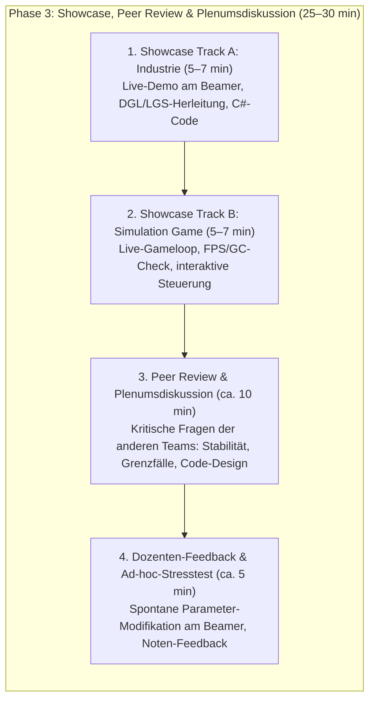
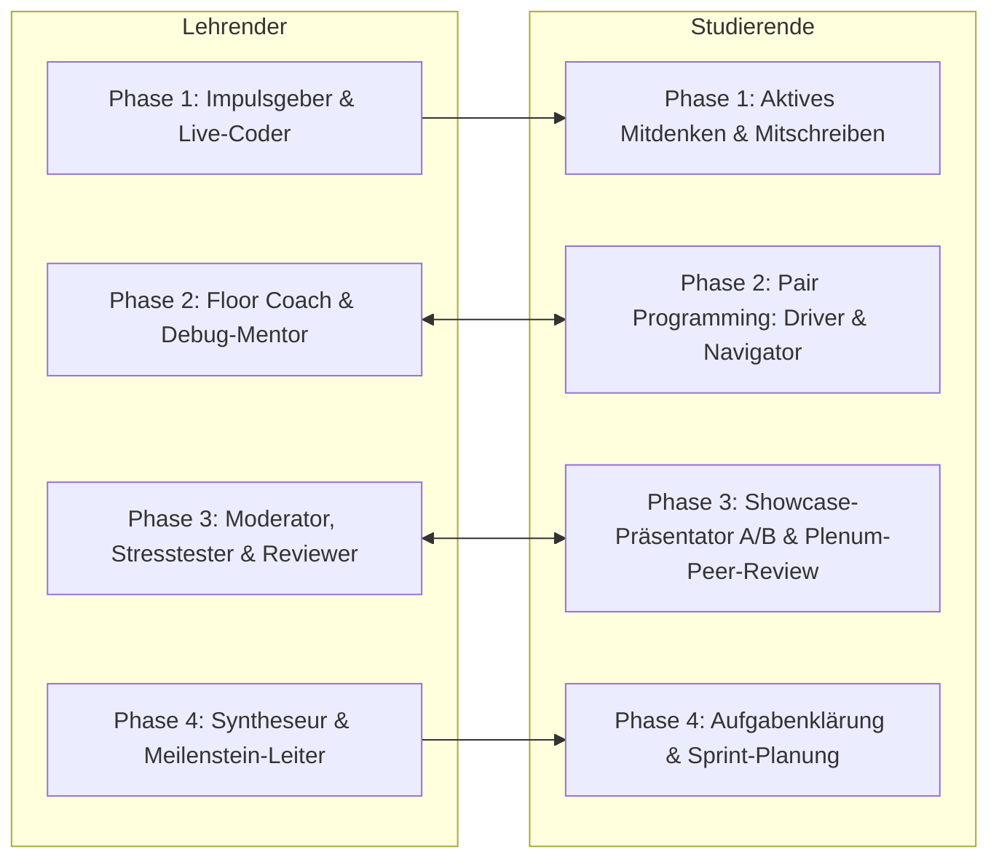
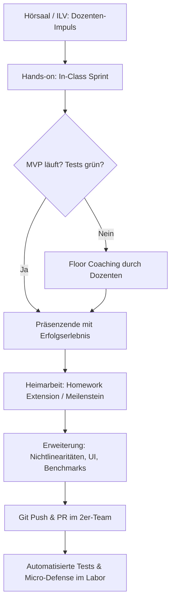
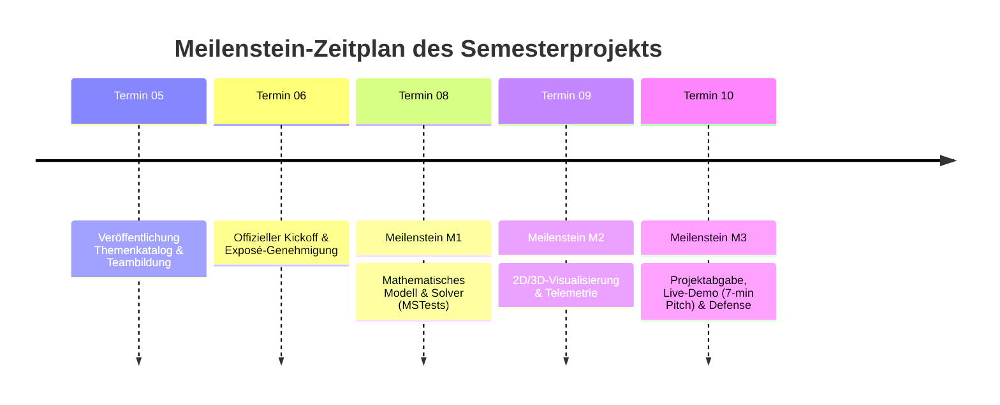

# Didaktisches Gesamtkonzept & Semester-Syllabus
## Lehrveranstaltung: Systemsimulation / Digitaler Zwilling

**Dokument-ID:** `Konzept/01_Lehrveranstaltungsstruktur_und_Syllabus.md`  
**Studiengang:** Bachelor Automatisierungstechnik (5. / 6. Fachsemester)  
**Institution:** Fachhochschule Oberösterreich, Campus Wels  
**Verantwortlicher:** Dr. Georg Hackenberg, Professor für Informatik und Industriesysteme  
**Lehrveranstaltungstyp:** Integrierte Lehrveranstaltung (ILV)  
**Umfang:** 2 SWS / 3 ECTS (Workload: 75 Stunden, davon 25 h Präsenz und 50 h Selbststudium / Heimarbeit)  
**Struktur:** 10 Präsenztermine à 150 Minuten (2,5 Zeitstunden)  
**Materialbasis:** 12 Vorlesungskapitel des Repositories (`Folien/00_Prolog` bis `Folien/11_Epilog`)  
**Status:** Freigegebenes Referenzkonzept für die Lehre (Harmonisiert mit Aufgabenkatalog und 3-Säulen-Assessment)  

---

## Inhaltsverzeichnis

1. [Ausgangslage, Zielgruppe & Rahmenbedingungen](#1-ausgangslage-zielgruppe--rahmenbedingungen)
   - 1.1 Institutioneller Kontext & Zielgruppenprofil (Campus Wels)
   - 1.2 Charakteristik des Formats ILV (Integrierte Lehrveranstaltung)
   - 1.3 Workload-Kalkulation nach ECTS-Richtlinien
2. [Didaktische Leitphilosophie & Methoden](#2-didaktische-leitphilosophie--methoden)
   - 2.1 Constructive Alignment nach Biggs
   - 2.2 Active Learning & Just-in-Time Teaching
   - 2.3 Scaffolding: Vom In-Class-Sprint zur autonomen Homework Extension
   - 2.4 Modernes Software-Engineering: Pair Programming & Vibe Coding mit KI-Unterstützung
   - 2.5 Gezielte Online-Recherche & Information Retrieval im Ingenieurstudium
   - 2.6 Themen-Duo & Wahlmodell: „Pick your Track – Industrie vs. Gaming“
   - 2.7 Das Prinzip der strikten chronologischen Kausalität
3. [Mapping der 12 Kapitel auf 10 Präsenztermine](#3-mapping-der-12-kapitel-auf-10-präsenztermine)
   - 3.1 Semester-Übersichtsmatrix (Kausalität, Werkzeuge, Wahlmodell & Assessments)
   - 3.2 Detaillierte Steckbriefe der Termine T01 bis T10
4. [Ablaufstruktur eines 150-Minuten-Präsenztermins](#4-ablaufstruktur-eines-150-minuten-präsenztermins)
   - 4.1 Die 4-Phasen-Taktung
   - 4.2 Phase 3 im Detail: Showcase, Peer Review & Plenumsdiskussion
   - 4.3 Rollenprofile von Lehrendem und Studierenden
   - 4.4 Umgang mit Heterogenität: Differenzierung & Fast-Track Challenges
5. [Didaktische Verzahnung von Präsenzzeit und Heimarbeit](#5-didaktische-verzahnung-von-präsenzzeit-und-heimarbeit)
   - 5.1 Nahtloser Übergang: In-Class Sprint ➔ Homework Extension
   - 5.2 Kollaborationsmodell: 2er-Teams, Pair Programming & Git-Workflow
   - 5.3 Leitfaden für "Vibe Coding" & KI-Engineering (Copilots als Junior-Entwickler)
6. [Meilenstein- und Projektzeitplan](#6-meilenstein--und-projektzeitplan)
   - 6.1 Semesterprojekt „Digital Twin Challenge“: Konzeption, Meilensteine M1–M3 & Pitch
   - 6.2 Industrielle Szenarien und simulationsspielerische Gegenstücke
   - 6.3 Die 3-Säulen-Assessment-Architektur (Harmonisierung mit Benotungskonzept)
   - 6.4 Benotungsrichtlinie & Bewertungsrubrik
7. [Checkliste für Dozierende zur Semestervorbereitung](#7-checkliste-für-dozierende-zur-semestervorbereitung)

---

## 1. Ausgangslage, Zielgruppe & Rahmenbedingungen

### 1.1 Institutioneller Kontext & Zielgruppenprofil (Campus Wels)

Der Bachelorstudiengang **Automatisierungstechnik** an der FH Oberösterreich (Campus Wels) bildet Ingenieurinnen und Ingenieure an der Schnittstelle von Maschinenbau, Elektrotechnik, Regelungstechnik und angewandter Informatik aus. Die Studierenden belegen die Lehrveranstaltung *Systemsimulation / Digitaler Zwilling* typischerweise im **5. Fachsemester**.

#### Vorwissen der Studierenden:
- **Mathematisch-Naturwissenschaftlich (Fundiert):** Höhere Mathematik (Analysis, Lineare Algebra, Differentialgleichungen) sowie Technische Mechanik (Statik, Elastostatik, Kinetik, Dynamik).
- **Automatisierungs- & Regelungstechnik (Sehr gut):** Zustandsraumdarstellung, Übertragungsfunktionen, PID-Regler, Frequenzgangverfahren (Bode, Nyquist), SPS-Programmierung nach IEC 61131-3 (ST, KOP, FUP).
- **Informatik & Programmierung (Solide Grundlagen, heterogene Praxis):** Beherrschung von Grundlagen in C/C++ oder C# (Klassen, Kontrollstrukturen, elementare Algorithmen). Typischerweise bestehen jedoch Lücken in hardwarenaher Speicherverwaltung (`unsafe`, Zeigerarithmetik, Speicherausrichtung), modernen UI-Architekturen (WPF, MVVM, Grafik-Pipelines), fortgeschrittener Nebenläufigkeit (Task Parallel Library, Thread-Synchronisation) und 3D-Computergrafik.

#### Berufsfeldbezug:
Angehende Automatisierer nutzen Simulationen nicht als theoretischen Selbstzweck, sondern als operatives Werkzeug für:
- die **Virtuelle Inbetriebnahme (VIBN)** von Maschinen und Sondierungsanlagen vor dem physischen Aufbau,
- den Entwurf und die parametergenaue Vorinbetriebnahme von **Regelkreisen (Closed-Loop)** unter Berücksichtigung von Nichtlinearitäten und Aktor-Sättigungen,
- das modellbasierte **Condition Monitoring** und Predictive Maintenance im laufenden Leitstand.

### 1.2 Charakteristik des Formats ILV (Integrierte Lehrveranstaltung)

Das an österreichischen Fachhochschulen etablierte Format der **Integrierten Lehrveranstaltung (ILV)** hebt die klassische Trennung zwischen Vorlesung (Frontaltheorie) und Übung (Labor am Nachmittag) auf.
- **Einheitlicher Raum:** Der Unterricht findet in multimedial ausgestatteten Seminarräumen oder PC-Pools statt; die Studierenden arbeiten auf eigenen Entwicklungs-Laptops (Bring Your Own Device) oder Pool-PCs.
- **Fließende Übergänge:** Theorie-Impulse, Live-Coding-Demonstrationen des Dozierenden und betreute hands-on Programmierphasen wechseln dynamisch innerhalb desselben Blocks ab.
- **Prüfungsimmanenter Charakter:** Es gibt keine isolierte Abschluss-Schriftklausur; die Gesamtnote speist sich aus kontinuierlichen Teilleistungen (Moodle-MCQ-Tests, praktische Übungsmeilensteine im Labor, Semesterprojekt und mündliche Verteidigung).

### 1.3 Workload-Kalkulation nach ECTS-Richtlinien

Die Lehrveranstaltung ist mit **3 ECTS-Punkten** (entsprechend einem Gesamt-Workload von **75 Arbeitsstunden** à 60 Minuten) dotiert:

| Kategorie | Aktivität | Zeitaufwand (h) | Anteil (%) |
| :--- | :--- | :---: | :---: |
| **Präsenzlehre (ILV)** | 10 Termine à 150 Minuten (Theorie, In-Class Sprint, Showcase, Peer Review & Laborbetreuung) | **25,0 h** | 33,3 % |
| **Vor- & Nachbereitung** | Vorbereitung der Termine, Studium von Skriptum, Notizen & Online-Dokus | **10,0 h** | 13,3 % |
| **Übungsmeilensteine & Labor** | 4 vertiefende Übungsmeilensteine / Extensions (je 3,75 h im gewählten Track A oder B) | **15,0 h** | 20,0 % |
| **Moodle-Assessments** | 3 formativ/summative Moodle-Tests (Vorbereitung & Durchführung) | **5,0 h** | 6,7 % |
| **Semesterprojekt & Kolloquium** | Entwicklung des Digitalen Zwillings im 2er-Team & Oral Defense (20 h pro Person) | **20,0 h** | 26,7 % |
| **Gesamtsumme** | **1 ECTS = 25 Echtstunden** | **75,0 h** | **100,0 %** |

> [!IMPORTANT]
> **Verbindliche Verankerung von Showcase & Plenumsdiskussion im Workload:**  
> Sowohl das **Präsentieren der eigenen Lösung auf der Beamer-Bühne (Showcase im Rotationsprinzip)** als auch das **qualifizierte, fundierte Fragenstellen im Peer Review während der Plenumsdiskussion** sind verbindliche, prüfungsrelevante Bestandteile der Lehrveranstaltung. Sie sind direkt im Notenschema (Säule 2) verankert; eine rein passive Hörsaal-Anwesenheit genügt den Leistungsanforderungen nicht.

---

## 2. Didaktische Leitphilosophie & Methoden

### 2.1 Constructive Alignment nach Biggs

Das Curriculum folgt dem Prinzip des **Constructive Alignment** (John Biggs):
1. **Intended Learning Outcomes (ILOs):** Die Studierenden können physikalisch-technische Systeme als mathematische Modelle formulieren, numerische Algorithmen (LGS, ODE, DES, Hybride Solver) in modernem C# (.NET 8) ohne vorgefertigte Blackbox-Simulatoren implementieren, echtzeitfähige 2D/3D-Dashboards realisieren und Simulationslösungen im Fachdiskurs kritisch analysieren und verteidigen.
2. **Teaching/Learning Activities (TLAs):** Interaktiver Theorieimpuls ➔ Dozenten-Live-Coding ➔ In-Class Hands-on Entwicklung im 2er-Team (Sprint) ➔ **Showcase, Peer Review & Plenumsdiskussion (Track A vs. Track B)** ➔ Micro-Defense & Homework Extension.
3. **Assessment Tasks (ATs):** Moodle-MCQ-Tests prüfen das theoretische und numerische Fundament; Labor-Meilensteine inklusive **Showcase-Präsentation und qualifiziertem Peer-Review-Fragenstellen** fordern und bewerten sauberen Code sowie Diskursfähigkeit; das Semesterprojekt verlangt die ganzheitliche Synthese und Verteidigung.

### 2.2 Active Learning & Just-in-Time Teaching

Frontalunterricht über 150 Minuten führt bei technisch komplexen Themen nachweislich zu Ermüdung und kognitiver Überlastung. Deshalb setzt der Kurs auf **Active Learning**:
- Maximale Länge eines theoretischen Inputs: **45 Minuten**.
- Kein theoretischer Block ohne anschließendes **Live-Coding**, bei dem der Dozent bewusst auch typische Fallstricke (Compilerfehler, Zeigerarithmetik, numerische Instabilitäten, Race Conditions) demonstriert und live debuggt.
- Unmittelbarer Übergang in die **Laborphase** ("Learn by Doing"), solange das Konzept im Kurzzeitgedächtnis präsent ist.

### 2.3 Scaffolding: Vom In-Class-Sprint zur autonomen Homework Extension

Studierende beginnen eine Programmieraufgabe niemals auf einem "leeren weißen Blatt":
- **In-Class Sprint (Präsenz, 60 min):** Die Teams erhalten eine strukturierte C#-Vorlage (z. B. leeres Konsolenprojekt mit definierten Methodensignaturen oder WPF-Fenster mit NuGet-Bindegliedern). Innerhalb von 60 Minuten führen sie die Kernlogik zu einem lauffähigen **Minimal Viable Product (MVP)**.
- **Homework Extension (Heimarbeit):** Aufbauend auf dem im Hörsaal verifizierten MVP erweitern die Studierenden zu Hause das Modell (z. B. Hinzufügen von Nichtlinearitäten, Reibung, Performance-Tuning oder erweiterte Visualisierung).

### 2.4 Modernes Software-Engineering: Pair Programming & Vibe Coding mit KI-Unterstützung

Im modernen industriellen Alltag programmieren Entwickler nicht isoliert und nutzen zunehmend KI-Assistenten (GitHub Copilot, Cursor, LLMs). Der Kurs integriert diese Praxis explizit:
- **Pair Programming im 2er-Team:** Rollenaufteilung in *Driver* (tippt Code, bedient die IDE) und *Navigator* (überwacht Architektur, prüft Randbedingungen, liest Formeln nach). Rollentausch alle 30 Minuten.
- **Kritisches "Vibe Coding" mit KI:** Der Einsatz von KI-Tools ist ausdrücklich gestattet und wird gefördert – jedoch unter der **strengen Ingenieurs-Doktrin**: *Verstehe und verifiziere jede Zeile Code*. KI-generierter Code muss durch automatisierte MSTest-Unit-Tests und physikalische Plausibilitätsprüfungen abgesichert werden. Wer Code abgibt, haftet in der mündlichen Verteidigung ("Micro-Defense") dafür!

### 2.5 Gezielte Online-Recherche & Information Retrieval im Ingenieurstudium

Das selbstständige Lösen mechatronischer Programmieraufgaben erfordert professionelle Recherchekompetenz. Studierende müssen lernen, nicht beliebig Forenbeiträge zu kopieren, sondern belastbare Primärquellen zu konsultieren:

1. **Nutzung offizieller Dokumentationen & API-Referenzen:**
   - **Microsoft Learn (.NET / C# / WPF):** Für hardwarenahe Speicherverwaltung (`fixed`, `unsafe`, `Span<T>`), WPF-Rendering-Architektur (`DrawingVisual`, `WriteableBitmap`) und Nebenläufigkeit (`Parallel.For`, `CancellationTokenSource`).
   - **ScottPlot 5 Dokumentation & Cookbook (`scottplot.net/cookbook/5.0`):** Gezielte Suche nach Streaming-Mustern (`SignalSource`, `CircularBuffer`). *Achtung vor veralteten v4-Syntaxbeispielen im Web!*
   - **SharpGL & Khronos OpenGL 3.3 Reference:** Schnelles Nachschlagen von OpenGL-State-Befehlen (`glMatrixMode`, `glEnable(GL_DEPTH_TEST)`).
   - **Math.NET Numerics Documentation (`numerics.mathdotnet.com`):** API für Cholesky-Zerlegung (`Cholesky()`), Matrix-Assemblierung und Konditionszahlen.

2. **Gezielte Keyword-Strategie & Boolesche Suche:**
   - Professionelle Suchanfragen nutzen englische Fachbegriffe: Statt *"wie rechne ich runge kutta in c#"* sucht der Ingenieur gezielt nach:
     `"Runge-Kutta 4 C# implementation ODE"`, `"Von Neumann stability diffusion 2D C#"`, `"bisection zero crossing root finding simulation"`, `"Welford one-pass variance streaming algorithm"`.
   - Ausschluss von irrelevantem Ballast durch Boolesche Operatoren: z. B. `"ScottPlot 5" "WpfPlot" -winforms -v4`.

3. **GitHub Code Search & Repository-Exploration:**
   - Auffinden erprobter Implementierungsmuster via GitHub Search mit Syntax-Filtern:
     `path:*.cs "WriteableBitmap" "BackBuffer" language:C#` oder `repo:ScottPlot/ScottPlot "Signal"`
   - Open-Source-Referenzen studieren, um Garbage-Collection-Vermeidung und performantes Caching zu verstehen.

4. **Kritische Plausibilisierung gefundener Snippets („Don't Paste Without Proof“):**
   - **GC-Prüfung:** Werden in Simulationsschleifen heimlich `new`-Allokationen versteckt?
   - **Thread-Sicherheit:** Wird unerlaubt aus Worker-Threads auf UI-Elemente zugegriffen?
   - **Einheiten-Konsistenz:** Rechnet der gefundene Code in Radiant oder Grad, in SI-Einheiten oder empirischen US-Units?

### 2.6 Themen-Duo & Wahlmodell: „Pick your Track – Industrie vs. Gaming“

Ein wesentliches didaktisches Prinzip dieser Lehrveranstaltung ist das **duale Aufgaben- und Motivationskonzept**:
- **Track A: Ernsthafter Industriealltag (Ingenieurtechnische Säule):** Simulation realer industrieller Anlagen (Halbleiter-Kühlkörper, Hallenkräne, DC-Antriebsprüfstände, Taktstraßen-Logistik, Virtuelle Inbetriebnahme). Sie vermittelt Normgerechtheit, SI-Einheiten, Fertigungstoleranzen und industrielle Relevanz für angehende Automatisierungsingenieure.
- **Track B: Simulationsspiele & Arcade-Physik (Spielerische Säule):** Gameloops, Arcade-Physik, Partikelsysteme und interaktive Spielmechaniken (Artillery-Wurfspiele, Sand-/Lava-Pixelwelten, 2D-Brückenbau à la Poly Bridge, Raketen-Balancer, Flipper-Kollisionen). Sie bietet sofortiges visuelles Feedback, macht Spaß, belohnt spielerisches Experimentieren und fördert die Intuition für dynamische Zusammenhänge.

> [!IMPORTANT]
> **Das verbindliche Wahlmodell („Pick your Track: Industrie vs. Gaming“):**  
> Die Studierenden müssen **NICHT** beide Aufgaben bearbeiten!  
> - Jedes 2er-Team wählt pro Termin bzw. Meilenstein **GENAU EINE** der beiden Aufgaben: **Track A (Industrie)** ODER **Track B (Game)**.  
> - **Identischer Workload & identische Lernergebnisse:** Beide Tracks basieren auf exakt denselben mathematischen Grundlagen, numerischen Algorithmen und C#-Softwarearchitekturen (z. B. FDM-Diffusionsmatrix bei Kühlkörper vs. Lavafeld; Math.NET-Cholesky-LGS bei Portalkran vs. einstürzender Brücke; RK4 bei DC-Motor vs. Raketenlandung).  
> - Beide Tracks führen zu denselben Intended Learning Outcomes (ILOs) und werden nach exakt derselben Bewertungsrubrik beurteilt.  
> - Teams dürfen ihren Track je nach persönlicher Motivation pro Termin neu wählen oder das Semester über in einer Schiene bleiben.

#### Didaktischer Brückenschlag im Showcase:
Obwohl die Teams pro Termin nur einen der beiden Tracks aktiv implementieren, verhindert das Konzept eine fachliche Silobildung: In der **Showcase- und Diskussionsphase (Phase 3)** präsentiert an jedem Termin ein Team aus Track A und ein Team aus Track B seine Lösung live am Beamer. Dadurch profitiert das gesamte Plenum von beiden Perspektiven: Industrie-Teams erkennen, wie Gameloops und interaktive Physik dieselben Differentialgleichungen nutzen, während Gaming-Teams den industriellen Bezug (Toleranzen, Normen, Reglergrenzen) verinnerlichen.

### 2.7 Das Prinzip der strikten chronologischen Kausalität

Um Frustration und Wissenslücken zu verhindern, unterliegt das gesamte Curriculum einer **strengen chronologischen Kausalitätskette**:
- **Kein Vorgreifen:** Jede Vorlesungseinheit, jeder In-Class Sprint und jede Homework Extension darf **ausschließlich** jene Bibliotheken, Sprachkonstrukte und numerischen Verfahren voraussetzen, die bis zu diesem Zeitpunkt formal in den Vorlesungsfolien eingeführt wurden.
- **Konkrete Grenzziehungen:**
  - *Vor Termin 04:* **Kein ScottPlot!** Diagramme werden davor entweder auf der Konsole tabellarisch ausgegeben oder elementar in Canvas/Pixel gezeichnet.
  - *Vor Termin 05:* **Kein SharpGL / 3D!** Bis dahin bewegen wir uns ausschließlich im 2D-Raum.
  - *Vor Termin 06:* **Kein `Parallel.For` oder Multithreading!** Alle Berechnungen laufen bis dahin strikt deterministisch auf einem Thread.
  - *Vor Termin 07:* **Keine Steifigkeitsmatrizen, kein Math.NET Cholesky, KEINE FEM-Statik-Berechnung!**  
    In **Termin 03 (Kapitel 03)** ist die Modellierung **rein geometrisch und visuell** (WPF Canvas, affine Welt-zu-Screen-Transformation, Bounding Box, DIN-Bemaßung, Vektorpfeile für fest vorgegebene Kräfte, interaktives Dragging von Geometriepunkten per Maus). In Termin 03 wird **keine Fachwerk-Statik berechnet**, **kein Gleichungssystem gelöst** und **kein Cholesky verwendet** – alle Kraftwerte sind fest vorgegeben!  
    Erst in **Termin 07 (Kapitel 07)** wird die echte **FEM-Statik-Engine** (Math.NET Numerics, Steifigkeitsmatrix $\mathbf{K}$, Cholesky-Zerlegung) gebaut und erweckt das geometrische Modell aus Termin 03 zum Leben (Knotenverschiebung $\mathbf{u} = \mathbf{K}^{-1} \mathbf{f}$, elastische Stabverformung, Überlastungsanzeige und Stabbruch).
  - *Vor Termin 08:* **Keine S-Functions und keine ODE-Solver höherer Ordnung (Heun, RK4)!** Bis dahin wird ausschließlich der explizite Euler-Schritt 1. Ordnung verwendet.
  - *Vor Termin 09:* **Keine diskreten Ereigniswarteschlangen (DES) und kein Box-Muller-Zufall!**
  - *Vor Termin 10:* **Keine Bisektion-Zero-Crossing-Detektion und keine FMI/FMU Co-Simulation!**

---

## 3. Mapping der 12 Kapitel auf 10 Präsenztermine

Die 12 Kapitel des Repositories (`00_Prolog` bis `11_Epilog`) gliedern sich in zwei Kernachsen: **Visualisierungs- & Systemwerkzeuge (Kapitel 2–6)** sowie **Physikalische Modellklassen & Simulation (Kapitel 7–10)**, eingefasst durch Grundlagen (00/01) und Gesamtsynthese (11).

Zur Abbildung auf 10 Präsenztermine à 150 Minuten werden Prolog und Einführung (T01) sowie Hybride Dynamik und VIBN-Epilog (T10) zusammengeführt.

### 3.1 Semester-Übersichtsmatrix (Kausalität, Werkzeuge, Wahlmodell & Assessments)

> [!NOTE]
> **Wahlmodell („Pick your Track: Industrie vs. Gaming“):**  
> Die Studierenden müssen **NICHT** beide Aufgaben bearbeiten! Jedes 2er-Team wählt pro Termin **GENAU EINE** der beiden Aufgaben (**Track A: Industrie ODER Track B: Game**). Beide Tracks führen zu denselben intendierten Lernergebnissen (ILOs), nutzen identische mathematisch-numerische Werkzeuge und erfordern denselben Arbeitsaufwand.

| Termin | Thema & Fokus | Kapitel im Repo | Vorkenntnisse (Kausaler Stand) | Eingeführte Werkzeuge & Pakete | Track A: Industrie-Szenario *(Wahl: A ODER B)* | Track B: Arcade- / Gaming-Pendant *(Wahl: A ODER B)* | Assessments & Meilensteine |
| :---: | :--- | :---: | :--- | :--- | :--- | :--- | :--- |
| **T01** | **Einführung & Modellbegriff** | `00_Prolog`<br>`01_Einführung` | C#-Grundlagen, Schulmathematik | .NET 8 SDK, Console, MSTest, Git | Thermisches Sensormodell / Zylinderdämpfung | **Artillery 1D/2D:** Konsolen-Kanonenspiel mit Euler-Luftreibung | Setup-Check, Teambildung |
| **T02** | **2D-Pixelgrafik & FDM-Feld** | `02_Visualisierung_2D_Pixel` | C#-Arrays, Konsole, Euler 1. Ord. | WPF `Image`, `WriteableBitmap`, `unsafe` Pointer, Stride | PCB-Leiterplatten-Hotspot (Wärmeableitung) | **Falling Sand & Doom Fire:** Interaktive Lava-/Sand-Pixelwelt | **Labor-MS 1 Ausgabe** (2D-Simulation) |
| **T03** | **2D-Vektorgrafik & Transformation**<br>*(Rein geometrisch & visuell)* | `03_Visualisierung_2D_Vektor` | WPF-Basics, `WriteableBitmap`, Vektorgeometrie | WPF `Canvas`, `DrawingVisual`, Uniform Scaling, BoundingBox | Hallenkran-Träger: Rein geometrischer Canvas-Viewer mit DIN-Bemaßung, festen Kraftpfeilen & Knoten-Dragging *(keine Statik!)* | **Poly Bridge CAD:** Interaktiver 2D-Brücken-Geometrie-Editor (Knoten setzen/verschieben, feste Lastvektoren; *Statik/Bruch erst in T07!*) | Vorbereitung Labor-MS 1 |
| **T04** | **Echtzeit-Telemetrie & Graphen** | `04_Visualisierung_2D_Diagramme` | WPF Canvas, Pixel, Vektoren | **ScottPlot 5**, `CircularBuffer`, MVVM Toolkit, **MSAGL** | Industrie-4.0-Leitstand: 1-kHz-Vibrationsmonitoring | **Retro Space-Lander HUD:** Flugbahn-Plot & Welford-Statistik | **Moodle-Test 1** (Kap 01–04)<br>**Labor-MS 1 Abgabe** |
| **T05** | **3D-OpenGL & Szenengraphen** | `05_Visualisierung_3D_OpenGL` | WPF MVVM, ScottPlot 5, Canvas | **SharpGL.WPF**, OrbitCamera, Transformations-Hierarchie | SCARA-Roboterarm (Vorwärtskinematik) | **3D Arcade Crane:** Jahrmarkt-Greifautomat mit Box-Kollision | **Projekt-Themenpool offen**<br>**Labor-MS 2 Ausgabe** |
| **T06** | **Multithreading & TPL** | `06_Multithreading` | 3D-OpenGL, ScottPlot 5, WPF | **Task Parallel Library (TPL)**, `Parallel.For`, `IProgress<T>` | Parallele Toleranzanalyse eines Getriebes | **100.000 Boids:** Massive Schwarm-Schlacht (Multi-Core 60 FPS) | **Projekt-Kickoff & Exposé** |
| **T07** | **Statische Systeme & Cholesky**<br>*(Erweckt T03 zum Leben)* | `07_Statische_Modelle` | TPL Multithreading, 2D/3D-Grafik | **Math.NET Numerics**, FEM-Steifigkeitsmatrix $\mathbf{K}$, Cholesky | FEM-Verformung schwerer Portalkran-Fachwerke *(erweckt T03-Geometrie mit echter Cholesky-Statik)* | **Destructible Truss / Poly Bridge Physik:** Einsturz & Stabbruch durch echte Math.NET-Cholesky-LGS-Lösung auf T03-Modell | **Moodle-Test 2** (Kap 05–07)<br>**Labor-MS 2 Abgabe**<br>**Labor-MS 3 Ausgabe** |
| **T08** | **Kontinuierliche Dynamik & ODEs** | `08_Dynamische_Modelle_Kontinuierlich` | Math.NET, TPL, ScottPlot 5 | **S-Functions**, **Heun & RK4**, Anti-Windup Clamping | Geregelter DC-Servomotor mit Strombegrenzung | **Inverted Pendulum Balancer:** SpaceX-Booster-Landegame | **Projekt-Meilenstein M1** (Solver & MSTests) |
| **T09** | **Diskrete Systeme & Monte-Carlo** | `09_Dynamische_Modelle_Diskret` | RK4 Solver, S-Functions, TPL | `PriorityQueue`, Box-Muller, **Welford-Akkumulator** | M/M/c-Warteschlange: Automobil-Taktstraße | **Factory Tycoon:** Fast-Food-Rush mit Kundenansturm | **Labor-MS 3 Abgabe**<br>**Labor-MS 4 Ausgabe**<br>**Projekt-Meilenstein M2** (GUI) |
| **T10** | **Hybride Dynamik, VIBN & Kolloquium** | `10_Dynamische_Modelle_Hybrid`<br>`11_Epilog` | Vollständiger Kurs-Stack | **Zero-Crossing Bisektion**, Sticking-Schwelle, FMI/FMU, VIBN | VIBN einer Sortieranlage mit SPS-Kopplung | **Pinball Wizard:** Flipper-Physik ohne Tunneling | **Moodle-Test 3** (Kap 08–10)<br>**Labor-MS 4 Abgabe**<br>**Projekt-Endabgabe & Pitch** |

---

### 3.2 Detaillierte Steckbriefe der Termine T01 bis T10

---

#### Termin T01: Einführung, Modellbegriff & Digitaler Zwilling
- **Kapitel:** [00_Prolog](file:///c:/Users/P28500/Desktop/Repositories/kurs-computer-simulation/Folien/00_Prolog/Folien.md) & [01_Einführung](file:///c:/Users/P28500/Desktop/Repositories/kurs-computer-simulation/Folien/01_Einführung/Folien.md)
- **Kausale Vorkenntnisse (Tabu-Grenze):**
  - *Erlaubt:* C#-Grundlagen (Datentypen, Klassen, Schleifen, Methoden), `System.Math`, analytische Formeln, elementares Differenzenverfahren (expliziter Euler 1. Ordnung).
  - *Strikte Tabus:* **Kein WPF, kein ScottPlot, kein Multithreading, keine Solver höherer Ordnung!**
- **Verwendete Werkzeuge & Pakete:**
  - .NET 8 SDK, Visual Studio 2022 / VS Code, C#-Konsolenapplikation, MSTest-Projekt, Git. *Keine externen NuGet-Grafikpakete.*
- **Lernziele (Bloom):**
  - *Verstehen:* Taxonomie technischer Modelle (statisch vs. dynamisch, kontinuierlich vs. diskret) und Grieves-Zwillingskonzept.
  - *Anwenden:* Einen einfachen Euler-1.-Ordnung-Zeitschritt ($x_{k+1} = x_k + \Delta t \cdot v_k$) in C# implementieren.
  - *Evaluieren:* Den numerischen Diskretisierungsfehler gegenüber der geschlossenen analytischen Lösung im Unit Test quantifizieren.
- **Themen-Duo – Wahlmodell „Pick your Track“ (Track A ODER Track B):**
  > *Hinweis zum Wahlmodell:* Jedes 2er-Team wählt **GENAU EINE** der beiden Aufgaben (Track A: Industrie **ODER** Track B: Game). Studierende müssen **NICHT** beide Aufgaben bearbeiten! Beide Tracks führen zu denselben Lernergebnissen und erfordern denselben Arbeitsaufwand.
  - *Track A (Industrie):* Thermisches Abkühlmodell eines Pt100-Temperatursensors / Dämpfung eines Pneumatikzylinders.
  - *Track B (Gaming / Arcade):* **„Artillery 1D/2D – Kanonenspiel im Terminal“:** Schiefer Wurf unter Gravitation und Newton-Luftwiderstand. Der Spieler gibt Startwinkel und Geschwindigkeit ein, um ein Ziel in Entfernung $d$ zu treffen.
- **Theorie-Impuls & Live-Coding (45 min):**
  - Das Modell nach George Box; Digital Model vs. Digital Shadow vs. Digital Twin.
  - Mathematische Herleitung: Vom Differenzenquotienten $\frac{dx}{dt} \approx \frac{x_{k+1}-x_k}{\Delta t}$ zum expliziten Euler-Schritt.
  - Live-Coding: Aufsetzen einer Clean Solution `SystemSimulationWorkshop.sln`, Trennung in `Simulation.Core` (Klassenbibliothek), `Simulation.ConsoleApp` und `Simulation.Tests` (MSTest).
- **Hands-on Laborphase: In-Class Sprint (60 min):**
  - **Sprint-Aufgabe (im gewählten Track A oder B):**
    - *Track A:* Implementierung des Euler-Schritts für das thermische Sensor-Abkühlverhalten bzw. Zylinderdämpfung mit automatisierter MSTest-Validierung.
    - *Track B:* Implementierung des Euler-Schritts für das 2D-Wurfmodell mit Luftwiderstand $F_w = \frac{1}{2} \rho c_w A v^2$. Konsolenausgabe von Flugbahn, Reichweite und Trefferabfrage auf Zielplattform.
  - Unit-Test (für beide Tracks): Automatisierter Vergleich mit der analytischen Lösung für den fehlerfreien Grenzfall.
- **Showcase, Peer Review & Plenumsdiskussion (25–30 min):**
  - *Showcase Track A (5–7 min):* 1x Team stellt Pt100-Sensormodell / Zylinderdämpfung live am Beamer vor (C#-Klassenbibliothek, MSTests).
  - *Showcase Track B (5–7 min):* 1x Team führt das Artillery-Kanonenspiel im Terminal vor (Euler-Flugbahn unter Newton-Luftreibung).
  - *Peer Review & Plenumsdiskussion (ca. 10 min):* Gezielte Fachfragen aus dem Plenum: Warum weicht der Euler-Schritt bei zu großem $\Delta t$ dramatisch von der analytischen Lösung ab? Wo kippt die Stabilität?
  - *Dozenten-Feedback & Stresstest (ca. 5 min):* Spontane Verzehnfachung der Zeitschrittweite $\Delta t$ am Beamer ➔ Demonstration numerischer Überschwinger.
- **Online-Recherche-Tipp:**
  - *Suchstrategie:* Microsoft Learn C# CLI-Tools: `"dotnet new sln"`, `"dotnet add reference"`.
  - *Doku-Link:* [Microsoft Learn: .NET CLI-Übersicht](https://learn.microsoft.com/de-de/dotnet/core/tools/)
- **Synthese & Ausblick (15 min):**
  - Teambildung (feste 2er-Teams). Vorschau auf T02: Speicherlinearisierung von 2D-Pixelgrafik.

---

#### Termin T02: 2D-Pixelgrafik & Feldsimulation (Finite Differenzen)
- **Kapitel:** [02_Visualisierung_2D_Pixel](file:///c:/Users/P28500/Desktop/Repositories/kurs-computer-simulation/Folien/02_Visualisierung_2D_Pixel/Folien.md)
- **Kausale Vorkenntnisse (Tabu-Grenze):**
  - *Erlaubt:* 2D-Arrays, Euler-Verfahren, Konsolen-Workflows aus T01.
  - *Neu eingeführt:* WPF `Image`, `WriteableBitmap`, `unsafe` Pointer, Stride, FDM 5-Punkt-Stern.
  - *Strikte Tabus:* **Kein `Parallel.For` (Multithreading erst in T06!), kein ScottPlot, kein 3D!**
- **Verwendete Werkzeuge & Pakete:**
  - .NET 8 Desktop SDK (WPF), `System.Windows.Media.Imaging.WriteableBitmap`. *Reines .NET BCL ohne Fremdbibliotheken.*
- **Lernziele (Bloom):**
  - *Verstehen:* Speicherlinearisierung (Row-Major, Stride-Padding) und `Bgr32`-Farbkanäle erklären.
  - *Anwenden:* Allokationsfreies Direct-Pixel-Writing via `WriteableBitmap.Lock()`, `BackBuffer` und Zeigerarithmetik (`unsafe uint*`) umsetzen.
  - *Erschaffen:* Eine 2D-Wärmeleitungssimulation (parabolische PDE) via FDM-5-Punkt-Stern unter Beachtung der Von-Neumann-Stabilitätsgrenze ($s \le 0{,}25$) programmieren.
- **Themen-Duo – Wahlmodell „Pick your Track“ (Track A ODER Track B):**
  > *Hinweis zum Wahlmodell:* Jedes 2er-Team wählt **GENAU EINE** der beiden Aufgaben (Track A: Industrie **ODER** Track B: Game). Es müssen **NICHT** beide bearbeitet werden!
  - *Track A (Industrie):* Thermischer Hotspot auf einer Leistungselektronik-Leiterplatte (PCB) mit Kühlkörperzone.
  - *Track B (Gaming / Arcade):* **„Falling Sand & Retro Doom Fire“:** Interaktive Simulation von herabfallenden Sandkörnern oder einer 90er-Jahre-Lava-Pixelwelt im Rohspeicher.
- **Theorie-Impuls & Live-Coding (45 min):**
  - Warum der WPF-Visual-Tree bei $100.000$ Elementen kollabiert.
  - Zeigerarithmetik in C#: `IntPtr`, `uint*`, Bit-Shifting `(r << 16) | (g << 8) | b`.
  - Mathematische Herleitung: Laplace-Operator $\Delta T = \frac{\partial^2 T}{\partial x^2} + \frac{\partial^2 T}{\partial y^2}$, 5-Punkt-Stern-Diskretisierung und Stabilitätsbedingung $s = \frac{a \cdot \Delta t}{\Delta x^2} \le 0{,}25$.
  - Live-Coding: Look-Up-Table (LUT) Farbtabellen-Generator (Kaltes Blau $\to$ Grün $\to$ Heißes Rot).
- **Hands-on Laborphase: In-Class Sprint (60 min):**
  - **Sprint-Aufgabe (Wahl: Track A ODER Track B):**
    - Erstellung eines WPF-Fensters mit `Image`-Control ($128 \times 128$ Pixel). Berechnung der FDM-Diffusionsschleife (PCB-Kühlkörper in Track A oder Sand/Lava in Track B) und Rendern im `WriteableBitmap`-BackBuffer.
- **Showcase, Peer Review & Plenumsdiskussion (25–30 min):**
  - *Showcase Track A (5–7 min):* 1x Team zeigt 2D-Temperaturfeldsimulation des PCB-Kühlkörpers mit `WriteableBitmap` und Farbverlauf.
  - *Showcase Track B (5–7 min):* 1x Team führt Falling-Sand- / Doom-Fire-Pixelwelt vor (Pointerarithmetik, allokationsfreie BackBuffer-Updates).
  - *Peer Review & Plenumsdiskussion (ca. 10 min):* Plenumsfragen zu Speicherlinearisierung, Stride-Padding und Von-Neumann-Stabilitätsgrenze ($s = \frac{a \cdot \Delta t}{\Delta x^2} \le 0{,}25$).
  - *Dozenten-Feedback & Stresstest (ca. 5 min):* Erhöhung von $\Delta t$ auf $s = 0{,}28$ direkt im Code ➔ Demonstration der numerischen Gitterexplosion im Plenum.
- **Online-Recherche-Tipp:**
  - *Suchbegriffe:* `"WriteableBitmap Lock BackBuffer unsafe C#" site:learn.microsoft.com`, `"Von Neumann stability heat equation 2D"`.
  - *Doku-Link:* [Microsoft Learn: WriteableBitmap-Klasse](https://learn.microsoft.com/de-de/dotnet/api/system.windows.media.imaging.writeablebitmap)
- **Synthese & Ausblick (15 min):**
  - **Ausgabe Labor-Meilenstein 1 (Teil A, Wahl Track A oder Track B):** FDM-Kühlkörper-Simulation mit Neumann-Randbedingungen ODER zelluläre Waldbrand-/Lavasimulation.

---

#### Termin T03: 2D-Vektorgrafik & Koordinatentransformation (Rein geometrisch & visuell)
- **Kapitel:** [03_Visualisierung_2D_Vektor](file:///c:/Users/P28500/Desktop/Repositories/kurs-computer-simulation/Folien/03_Visualisierung_2D_Vektor/Folien.md)
- **Kausale Vorkenntnisse (Tabu-Grenze):**
  - *Erlaubt:* Pixelgrafik aus T02, Elementargeometrie (Vektoren, Punkte, Strecken).
  - *Neu eingeführt:* WPF `Canvas`, affine Transformation (Welt $\to$ Screen), `DrawingVisual`, Uniform Scaling, BoundingBox, interaktives Dragging von Geometriepunkten per Maus.
  - *Strikte Tabus:* **REIN GEOMETRISCH & VISUELL! Keine Fachwerk-Statik, kein Gleichungssystem (LGS), kein Math.NET Cholesky (erst in T07!), kein ScottPlot, kein 3D!** Alle Kräfte und Lasten sind rein statische, fest vorgegebene Vektorwerte zur Visualisierung.
- **Verwendete Werkzeuge & Pakete:**
  - WPF Vektorgrafik (`Canvas`, `Line`, `Path`, `DrawingVisual`, `MatrixTransform`, Maus-Events).
- **Lernziele (Bloom):**
  - *Verstehen:* Den mathematischen Zusammenhang zwischen Weltkoordinaten (kartesisches System, $+Y$ oben) und Bildschirmkoordinaten (Pixelraster, $+Y$ unten) bei verzerrungsfreier Skalierung (Bounding Box, Uniform Scaling) erklären.
  - *Anwenden:* Affine 2D-Koordinatentransformation in C#/WPF implementieren und Mausinteraktionen (Dragging von Knotenpunkten, Zoom & Pan) geometrisch umrechnen.
  - *Erschaffen:* Rein geometrische Vektordarstellungen (Stäbe als Linien, Knoten als Kreise, Kraftpfeile mit orthonormalen Spitzen aus fest vorgegebenen Werten sowie DIN-gerechte Bemaßungslinien) im WPF `Canvas` rendern.
- **Themen-Duo – Wahlmodell „Pick your Track“ (Track A ODER Track B):**
  > *Hinweis zum Wahlmodell:* Jedes 2er-Team wählt **GENAU EINE** der beiden Aufgaben (Track A: Industrie **ODER** Track B: Game). Studierende müssen **NICHT** beide Aufgaben bearbeiten! Beide Tracks vermitteln dieselben geometrisch-visuellen Grundlagen bei identischem Arbeitsaufwand.
  - *Track A (Industrie):* **„Hallenkran-Träger CAD-Viewer“:** Rein geometrische und maßstäbliche Visualisierung eines Trägerfachwerks auf dem WPF Canvas. Interaktives Verschieben von Trag- und Lastknoten per Maus-Dragging, dynamische DIN-Bemaßung der Trägerabstände und Darstellung fest vorgegebener Lastvektoren (Pfeilgeometrie) – *völlig ohne Statikberechnung*.
  - *Track B (Gaming / Arcade):* **„Poly Bridge CAD / Brücken-Geometrie-Editor“:** Interaktiver 2D-Geometrie-Editor für Brückenprofile. Stäbe per Mausklick zwischen Rasterpunkten aufspannen, Knoten per Maus verschieben (Dragging), Bounding Box dynamisch nachführen und fest vorgegebene Gewichtskraft-Pfeile visualisieren. *(Wichtig: Die echte physikalische Statikberechnung und der Bruchtest folgen kausal erst in Termin 07!)*
- **Theorie-Impuls & Live-Coding (45 min):**
  - Mathematische Formulierung: Bounding-Box, Uniform-Scaling $s = \min(s_x, s_y)$, Translation und Zentrierungs-Offset.
  - Orthonormale Pfeilspitzen-Geometrie aus Richtungsvektor $\vec{u}$ und Normalenvektor $\vec{u}^\perp = (-u_y, u_x)^T$.
  - Interaktives Maus-Dragging: Hit-Testing, Erfassen von Knotenpunkten und inverse Screen-zu-Welt-Transformation.
  - Live-Coding: Implementierung der Klasse `WorldToScreenTransformer` und Zeichnen maßstäblicher Pfeile und DIN-Bemaßungen auf einem WPF `Canvas`.
- **Hands-on Laborphase: In-Class Sprint (60 min):**
  - **Sprint-Aufgabe (Wahl: Track A ODER Track B):**
    - Konstruktion eines interaktiven Canvas-Viewers für das Träger-/Brückengebilde (Knoten, Stäbe, fest vorgegebene Lastpfeile).
    - Verzerrungsfreie Skalierung bei Fensteränderung (Uniform Scaling, Bounding Box).
    - Implementierung von interaktivem Maus-Dragging: Beim Verschieben eines Knotens passen sich die angrenzenden Stäbe, Bounding Box und Maßketten in Echtzeit an – *rein geometrisch und visuell, ohne Statik- oder LGS-Löser!*
- **Showcase, Peer Review & Plenumsdiskussion (25–30 min):**
  - *Showcase Track A (5–7 min):* 1x Team präsentiert den Hallenkran-CAD-Viewer auf dem WPF `Canvas` (Uniform Scaling, Bounding Box, DIN-Bemaßung, Vektorpfeile).
  - *Showcase Track B (5–7 min):* 1x Team zeigt den Poly-Bridge-Geometrie-Editor (interaktives Dragging von Fachwerkknoten per Maus).
  - *Peer Review & Plenumsdiskussion (ca. 10 min):* Fachfragen aus dem Plenum zur Welt-zu-Screen-Transformation, Orthonormalität der Pfeilspitzen und verzerrungsfreien Skalierung bei Fenster-Resizing.
  - *Dozenten-Feedback & Stresstest (ca. 5 min):* Extremes Seitenverhältnis (z. B. 32:9 Ultrawide) einstellen ➔ Bleiben Geometrie und Pfeilspitzen formstabil?
- **Online-Recherche-Tipp:**
  - *Suchbegriffe:* `"WPF Canvas Zoom Pan MatrixTransform"`, `"DrawingVisual DrawGeometry vs Shape performance"`, `"WPF Canvas drag and drop shapes mouse coordinates"`.
  - *Doku-Link:* [Microsoft Learn: Übersicht über Zeichnungen mit DrawingVisual](https://learn.microsoft.com/de-de/dotnet/desktop/wpf/graphics-multimedia/using-drawingvisual-objects)
- **Synthese & Ausblick (15 min):**
  - **Vervollständigung Labor-Meilenstein 1 (Teil B, im gewählten Track):**
    - *Track A:* Ergänzung der FDM-Kühlkörper-Simulation aus T02 um Wärmestrom-Vektorpfeile $\vec{q} = -\lambda \nabla T$ und Bemaßung.
    - *Track B:* Ergänzung der Waldbrand-/Lava-Pixelwelt aus T02 um Vektorpfeile für Windrichtung und Flammenfront.
  - *Kausaler Ausblick auf T07:* Erst in Termin 07 wird dieses rein geometrische Vektormodell durch die Math.NET-Cholesky-FEM-Engine mit echter Statik (elastische Dehnung, reale Knotenkräfte, Bruchtest) zum Leben erweckt.

---

#### Termin T04: Echtzeit-Telemetrie & Signalflussgraphen
- **Kapitel:** [04_Visualisierung_2D_Diagramme](file:///c:/Users/P28500/Desktop/Repositories/kurs-computer-simulation/Folien/04_Visualisierung_2D_Diagramme/Folien.md)
- **Kausale Vorkenntnisse (Tabu-Grenze):**
  - *Erlaubt:* Pixel- und Vektorgrafik (T02/T03), C#-Grundlagen.
  - *Neu eingeführt:* **ScottPlot 5**, `CircularBuffer<double>`, MVVM Pattern (`CommunityToolkit.Mvvm`), **MSAGL** Graph-Topologie.
  - *Strikte Tabus:* **Kein 3D/OpenGL (erst in T05!), kein Multithreading (erst in T06!), noch keine ODE-Solver höherer Ordnung!**
- **Verwendete Werkzeuge & Pakete:**
  - NuGet: `ScottPlot.WPF` (v5.x), `CommunityToolkit.Mvvm`, `AutomaticGraphLayout.WpfGraphControl`.
- **Lernziele (Bloom):**
  - *Verstehen:* Datenstrukturen für kontinuierliches Daten-Streaming (Ringpuffer) zur Vermeidung von GC-Lags erklären.
  - *Anwenden:* `ScottPlot 5` zur latenzfreien Darstellung von Signalverläufen im MVVM-Muster einbinden.
  - *Evaluieren:* Signalfluss-Netzwerke mittels Microsoft Automatic Graph Layout (`MSAGL`) topologisch anordnen.
- **Themen-Duo – Wahlmodell „Pick your Track“ (Track A ODER Track B):**
  > *Hinweis zum Wahlmodell:* Jedes 2er-Team wählt **GENAU EINE** der beiden Aufgaben (Track A: Industrie **ODER** Track B: Game). Studierende müssen **NICHT** beide Aufgaben bearbeiten! Beide Tracks führen zu denselben Lernergebnissen bei identischem Workload.
  - *Track A (Industrie):* **„Industrie-4.0-Leitstand“:** 1-kHz-Vibrationsmonitoring mit Grenzwertüberwachung, allokationsfreiem ScottPlot 5 Signal-Plot und MSAGL-Systemzustandsgraph.
  - *Track B (Gaming / Arcade):* **„Retro Space-Lander HUD & Telemetrie-Arcade“:** Live-Diagramme für Flughöhe, Triebwerksschub, Treibstoffverbrauch und Welford-Jitter-Statistik in Echtzeit (60 FPS).
- **Theorie-Impuls & Live-Coding (45 min):**
  - Garbage Collection als Feind industrieller Echtzeit-Dashboards: Vermeidungsstrategien.
  - Ringpuffer-Mathematik: Modulo-Arithmetik vs. Bit-Maskierung bei Zweierpotenzen (`index & (capacity - 1)`).
  - ScottPlot 5 Signal-Plot-Architektur: Allokationsfreies Rendern vorallokierter Arrays.
  - Live-Coding: Aufbau eines WPF-MVVM-Dashboards mit `ObservableProperty` und `DispatcherTimer`.
- **Hands-on Laborphase: In-Class Sprint (60 min):**
  - **Sprint-Aufgabe (Wahl: Track A ODER Track B):**
    - Ein simulierter Sinus-/Messdatengenerator (Vibration bei Track A bzw. Telemetriedaten bei Track B) schreibt kontinuierlich in einen `CircularBuffer<double>`. ScottPlot 5 rendert den Signalverlauf butterweich; ein MSAGL-Graph visualisiert die Systemtopologie.
- **Showcase, Peer Review & Plenumsdiskussion (25–30 min):**
  - *Moodle-Test 1 (15 min):* Grundlagen Systemsimulation, Taxonomie, Pixel-Stride, FDM-Stabilität, affine Koordinatentransformation (Kapitel 01–04).
  - *Showcase & Plenums-Review (15 min):*
    - *Track A & B Showcases (je 3–4 min):* Live-Demo von Industrie-4.0-Leitstand (Vibrationen) bzw. Space-Lander HUD mit ScottPlot 5 und `CircularBuffer<double>`.
    - *Plenums-Peer-Review & Dozenten-Feedback (ca. 7 min):* Diskussion von GC-Allokationsfreiheit, Ringpuffer-Kapazitäten und MSAGL-Graphentopologie.
- **Online-Recherche-Tipp:**
  - *Suchbegriffe:* `"ScottPlot 5 WPF quickstart" site:scottplot.net`, `"CommunityToolkit.Mvvm ObservableProperty source generators"`.
  - *Doku-Link:* [ScottPlot 5 Cookbook & Documentation](https://scottplot.net/cookbook/5.0/)
- **Synthese & Ausblick (15 min):**
  - **Abgabe Labor-Meilenstein 1 (Micro-Defense im Rechnerraum, im gewählten Track A oder B).** Vorschau auf T05: Einstieg in die 3D-Computergrafik mit SharpGL.

---

#### Termin T05: 3D-Visualisierung & Kinematische Szenengraphen
- **Kapitel:** [05_Visualisierung_3D_OpenGL](file:///c:/Users/P28500/Desktop/Repositories/kurs-computer-simulation/Folien/05_Visualisierung_3D_OpenGL/Folien.md)
- **Kausale Vorkenntnisse (Tabu-Grenze):**
  - *Erlaubt:* MVVM, ScottPlot 5, Vektortransformationen 2D.
  - *Neu eingeführt:* **SharpGL.WPF**, 3D-Grafikpipeline, Kugelkoordinaten-OrbitCamera, Szenengraph (`SceneNode`, `TransformNode`, `MeshNode`), Vorwärtskinematik.
  - *Strikte Tabus:* **Kein Multithreading (`Parallel.For` erst in T06!), noch keine FEM-Matrizen!**
- **Verwendete Werkzeuge & Pakete:**
  - NuGet: `SharpGL.WPF`, `SharpGL.SceneGraph`.
- **Lernziele (Bloom):**
  - *Verstehen:* Die 3D-Grafikpipeline (Model-View-Projection), Tiefenpufferung (`glEnable(GL_DEPTH_TEST)`) und Kugelkoordinaten.
  - *Anwenden:* Einen hierarchischen Szenengraphen mit relativen Transformationsmatrizen (`glPushMatrix`, `glPopMatrix`) implementieren.
  - *Erschaffen:* Die Vorwärtskinematik eines mechatronischen Roboterarms (SCARA / Portal) im 3D-Raum visualisieren.
- **Themen-Duo – Wahlmodell „Pick your Track“ (Track A ODER Track B):**
  > *Hinweis zum Wahlmodell:* Jedes 2er-Team wählt **GENAU EINE** der beiden Aufgaben (Track A: Industrie **ODER** Track B: Game). Es müssen **NICHT** beide bearbeitet werden!
  - *Track A (Industrie):* **„3D-Industrieroboter Digital Twin“:** Digitaler Zwilling eines 3-Achs-Industrieroboters mit Gelenkwinkeln, hierarchischem Szenengraph und TCP-Trajektorie (Tool Center Point).
  - *Track B (Gaming / Arcade):* **„3D Arcade Claw Machine (Jahrmarkt-Greifautomat)“:** Interaktives Steuern eines 3D-Seilgreifers mit Tastatur, hierarchischem Ausleger, Orbit-Kamera und Greifraum-Begrenzung.
- **Theorie-Impuls & Live-Coding (45 min):**
  - Warum 3D für den Digitalen Zwilling? Räumliche Kollisionsprüfung und Ergonomie.
  - Kardanfehlerfreie Kameraführung über Azimut $\theta$, Elevation $\phi$ und Distanz $r$.
  - Der Szenengraph als Composite-Muster: Eltern-Kind-Relationen mechatronischer Baugruppen.
  - Live-Coding: Aufbau einer 3-teiligen Roboterachse mit SharpGL.
- **Hands-on Laborphase: In-Class Sprint (60 min):**
  - **Sprint-Aufgabe (Wahl: Track A ODER Track B):**
    - Einbinden des SharpGL `OpenGLControl` in ein WPF-Fenster. Erstellen einer 3D-Baugruppe via `GeometryFactory`; Bewegen zweier Rotationsachsen über UI-Schieberegler im gewählten Track-Szenario.
- **Showcase, Peer Review & Plenumsdiskussion (25–30 min):**
  - *Showcase Track A (5–7 min):* 1x Team demonstriert den SCARA-Roboterarm im SharpGL-3D-Viewport (Szenengraph-Hierarchie, Gelenkachsen).
  - *Showcase Track B (5–7 min):* 1x Team präsentiert die 3D Arcade Claw Machine (Jahrmarkt-Greifer, Kugelkoordinaten-OrbitCamera, Tastensteuerung).
  - *Peer Review & Plenumsdiskussion (ca. 10 min):* Plenum hinterfragt Matrix-Stacks (`glPushMatrix` / `glPopMatrix`), Kardanfehler-Vermeidung und Vorwärtskinematik.
  - *Dozenten-Feedback & Stresstest (ca. 5 min):* Spontane Vertauschung von Drehachsen im Szenengraphen ➔ Sichtbarmachung fehlerhafter Relativtransformationen.
- **Online-Recherche-Tipp:**
  - *Suchbegriffe:* `"SharpGL WPF tutorial"`, `"OpenGL modelview projection matrix hierarchy"`, `"spherical coordinates orbit camera C#"`.
  - *Doku-Link:* [Khronos OpenGL 3.3 Reference Manual](https://registry.khronos.org/OpenGL-Refpages/gl4/)
- **Synthese & Ausblick (15 min):**
  - **Veröffentlichung des Semesterprojekt-Themenkatalogs („Digital Twin Challenge“).**
  - **Ausgabe Labor-Meilenstein 2 (Wahl Track A oder Track B):** 3D-Kinematik mit integriertem ScottPlot-Telemetrie-Dashboard.

---

#### Termin T06: Multithreading & Parallele Simulation
- **Kapitel:** [06_Multithreading](file:///c:/Users/P28500/Desktop/Repositories/kurs-computer-simulation/Folien/06_Multithreading/Folien.md)
- **Kausale Vorkenntnisse (Tabu-Grenze):**
  - *Erlaubt:* 3D-OpenGL, ScottPlot 5, WPF MVVM.
  - *Neu eingeführt:* **Task Parallel Library (TPL)**, `Parallel.For`, `Task.Run`, Thread-Synchronisation (`lock`, `Interlocked`), UI-Entkopplung via `IProgress<T>`, `CancellationToken`.
  - *Strikte Tabus:* **Keine Steifigkeitsmatrizen / Math.NET Cholesky (erst in T07!), noch keine S-Functions / RK4!**
- **Verwendete Werkzeuge & Pakete:**
  - .NET BCL: `System.Threading`, `System.Threading.Tasks`, Thread-sichere Collections.
- **Lernziele (Bloom):**
  - *Analysieren:* Race Conditions, Deadlocks und False Sharing in Multi-Core-Simulatoren diagnostizieren.
  - *Anwenden:* Datenparallele Schleifen mit `Parallel.For` und Thread-lokalen Zwischenspeichern realisieren.
  - *Erschaffen:* Strikte Entkopplung von 1-kHz-Physikschleife und 60-Hz-WPF-UI via Background-Task und `Progress<T>`.
- **Themen-Duo – Wahlmodell „Pick your Track“ (Track A ODER Track B):**
  > *Hinweis zum Wahlmodell:* Jedes 2er-Team wählt **GENAU EINE** der beiden Aufgaben (Track A: Industrie **ODER** Track B: Game). Studierende müssen **NICHT** beide Aufgaben bearbeiten!
  - *Track A (Industrie):* **„Parallele Getriebe-Toleranzanalyse“:** Parallele Monte-Carlo-Toleranzanalyse eines Industriegetriebes ($100.000$ Bauteil-Varianten zeitgleich auf allen CPU-Kernen gerechnet).
  - *Track B (Gaming / Arcade):* **„100.000 Boids – Die Partikel-Schwarm-Schlacht“:** Flocking-Simulation à la Craig Reynolds. Single-Thread kollabiert bei 12 FPS; mit `Parallel.For` flüssige 60 FPS auf allen Kernen!
- **Theorie-Impuls & Live-Coding (45 min):**
  - Das Amdahlsche Gesetz und die Grenzen der Skalierung.
  - Atomare Operationen vs. Sperrmechanismen: `Interlocked.Increment` vs. `lock(obj)`.
  - Das WPF-Dispatcher-Problem: Warum `Dispatcher.Invoke` im Simulationsloop das Programm einfriert.
  - Live-Coding: Benchmark-Vergleich: Serielle vs. parallele Laplace-Feldglättung mit CPU-Kern-Auslastungsanzeige.
- **Hands-on Laborphase: In-Class Sprint (60 min):**
  - **Sprint-Aufgabe (Wahl: Track A ODER Track B):**
    - Entkopplung einer rechenintensiven Simulation (Toleranzanalyse bei Track A bzw. Schwarm bei Track B): Der Solver rechnet asynchron in `Task.Run` mit `Parallel.For`; das UI bleibt butterweich bedienbar; ein Not-Aus-Button bricht den Lauf sauber via `CancellationToken` ab.
- **Showcase, Peer Review & Plenumsdiskussion (25–30 min):**
  - *Showcase Track A (5–7 min):* 1x Team stellt die parallele Getriebe-Toleranzanalyse mit `Parallel.For` vor (CPU-Auslastung aller Kerne, `IProgress<T>`).
  - *Showcase Track B (5–7 min):* 1x Team zeigt die 100.000-Boids-Schwarm-Schlacht (flüssige 60 FPS durch Multithreading).
  - *Peer Review & Plenumsdiskussion (ca. 10 min):* Plenumsanalyse von Race Conditions, Thread-Sicherheit und Dispatcher-Entkopplung: Wurden atomare Operationen (`Interlocked`) korrekt genutzt?
  - *Dozenten-Feedback & Stresstest (ca. 5 min):* Betätigung des Not-Aus-Buttons während Vollast ➔ Sauberes Abbrechen via `CancellationToken` prüfen.
- **Online-Recherche-Tipp:**
  - *Suchbegriffe:* `"Parallel.For local variables C#" site:learn.microsoft.com`, `"WPF Dispatcher background task progress reporting"`.
  - *Doku-Link:* [Microsoft Learn: Datenparallelität (Task Parallel Library)](https://learn.microsoft.com/de-de/dotnet/standard/parallel-programming/data-parallelism-task-parallel-library)
- **Synthese & Ausblick (15 min):**
  - **Offizieller Kickoff Semesterprojekt:** Verbindliche Themenwahl der Teams. Einreichung des 1-seitigen Exposés bis Folgetag.
  - Scharnierfunktion: Abschluss der Software-Werkzeuge (Kapitel 02–06), Übergang zur physikalischen Modellierung (Kapitel 07–10).

---

#### Termin T07: Statische Systeme: Fachwerke & Cholesky-LGS (Erweckt T03 zum Leben)
- **Kapitel:** [07_Statische_Modelle](file:///c:/Users/P28500/Desktop/Repositories/kurs-computer-simulation/Folien/07_Statische_Modelle/Folien.md)
- **Kausale Vorkenntnisse (Tabu-Grenze):**
  - *Erlaubt:* Vektorgrafik (T03), 3D-OpenGL (T05), Multithreading (T06).
  - *Neu eingeführt:* **Math.NET Numerics**, Elementsteifigkeitsmatrix $\mathbf{k}_e$, Koordinatendrehung $\mathbf{T}$, globale Steifigkeitsmatrix $\mathbf{K}$, Cholesky-Zerlegung, Konditionszahl.
  - *Strikte Tabus:* **Noch keine ODE-Solver höherer Ordnung (Heun, RK4) oder S-Functions (erst in T08!)!**
- **Verwendete Werkzeuge & Pakete:**
  - NuGet: `MathNet.Numerics`, `MathNet.Numerics.FSharp` (optional).
- **Lernziele (Bloom):**
  - *Verstehen:* Das Schnittprinzip an Gelenkknoten, statische Bestimmtheit und das FEM-Modell des elastischen Stabelements ($k_e = \frac{E A}{L}$).
  - *Anwenden:* Elementmatrizen transformieren ($\mathbf{k}_e^{glob} = \mathbf{T}^T \mathbf{k}_e^{loc} \mathbf{T}$) und zur globalen Steifigkeitsmatrix $\mathbf{K}$ assemblieren.
  - *Erschaffen:* Die echte FEM-Statik-Engine programmieren: Lösung des Gleichungssystems $\mathbf{K} \cdot \mathbf{u} = \mathbf{f}$ via Cholesky-Faktorisierung und Erweckung des rein geometrischen T03-Modells zum physikalisch verformbaren System.
- **Themen-Duo – Wahlmodell „Pick your Track“ (Track A ODER Track B):**
  > *Hinweis zum Wahlmodell:* Jedes 2er-Team wählt **GENAU EINE** der beiden Aufgaben (Track A: Industrie **ODER** Track B: Game). Studierende müssen **NICHT** beide bearbeiten! Beide Tracks erwecken das in T03 rein geometrisch gezeichnete Modell mit der echten Math.NET-Cholesky-Engine zum Leben.
  - *Track A (Industrie):* **„Portalkran FEM-Statik-Engine“:** Das in T03 rein geometrisch dargestellte Hallenkran-Trägerwerk erwacht zum Leben: Assemblierung der Steifigkeitsmatrix $\mathbf{K}$, Cholesky-Lösung für Knotenverschiebungen $\mathbf{u}$, Ermittlung realer Stab- und Lagerkräfte sowie farbige Visualisierung elastischer Verformungen (Zug blau, Druck rot).
  - *Track B (Gaming / Arcade):* **„Destructible Truss / Poly Bridge Physik-Engine“:** Das in T03 als reiner Vektorentwurf gezeichnete Brückenmodell wird mit echter FEM-Statik lebendig: Reale Stabbelastungsberechnung via Cholesky; bei Überschreiten der Bruchspannung ($S \ge S_{\text{krit}}$) bricht der überlastete Stab, das System wird re-assembliert und kollabiert spektakulär!
- **Theorie-Impuls & Live-Coding (45 min):**
  - Vom Kräftegleichgewicht $\sum \vec{F} = \vec{0}$ zum linearen Gleichungssystem $\mathbf{K} \mathbf{u} = \mathbf{f}$.
  - Einarbeitung der Lagerbedingungen durch Zeilen- und Spaltenkondensation oder Penalty-Ansatz.
  - Numerik: Wann ist $\mathbf{K}$ symmetrisch positiv definit (SPD)? Warum Cholesky doppelt so schnell ist wie LU-Zerlegung.
  - Live-Coding: Aufbau einer Fachwerk-Klasse mit Knoten, Stäben und Math.NET `Matrix<double>`.
- **Hands-on Laborphase: In-Class Sprint (60 min):**
  - **Sprint-Aufgabe (Wahl: Track A ODER Track B):**
    - Kopplung des geometrischen Canvas-Viewers aus T03 mit der neuen Math.NET-Cholesky-Statik-Engine. Berechnung der realen Knotenverschiebungen $\mathbf{u}$ und maßstäblich überhöhte Darstellung der Verformung auf dem Canvas.
- **Showcase, Peer Review & Plenumsdiskussion (25–30 min):**
  - *Moodle-Test 2 (15 min):* 3D-Computergrafik, Szenengraphen, Multithreading (Race Conditions, TPL), LGS, Cholesky, Konditionszahl (Kapitel 05–07).
  - *Showcase & Plenums-Review (15 min):*
    - *Track A & B Showcases (je 3–4 min):* Live-Demo der Erweckung der T03-Geometrie durch Math.NET-Cholesky (Portalkran-Verformung bzw. Destructible-Bridge-Einsturz).
    - *Plenums-Peer-Review & Dozenten-Feedback (ca. 7 min):* Diskussion singulärer Matrizen (statische Unterbestimmtheit), Konditionszahl $\kappa(\mathbf{K})$ und Cholesky-Performance vs. LU-Zerlegung.
- **Online-Recherche-Tipp:**
  - *Suchbegriffe:* `"Math.NET Numerics Cholesky solve linear system C#"`, `"Direct stiffness method truss assembly C#"`.
  - *Doku-Link:* [Math.NET Numerics Linear Algebra Documentation](https://numerics.mathdotnet.com/LinearEquations)
- **Synthese & Ausblick (15 min):**
  - **Abgabe Labor-Meilenstein 2 (Micro-Defense, im gewählten Track A oder B).**
  - **Ausgabe Labor-Meilenstein 3 (Wahl Track A oder Track B):** 3D-Fachwerklöser mit Cholesky-Zerlegung und Spannungs-Farbgradienten ODER Poly-Bridge-Bruchsimulator.

---

#### Termin T08: Kontinuierliche Dynamik: ODEs & S-Functions
- **Kapitel:** [08_Dynamische_Modelle_Kontinuierlich](file:///c:/Users/P28500/Desktop/Repositories/kurs-computer-simulation/Folien/08_Dynamische_Modelle_Kontinuierlich/Folien.md)
- **Kausale Vorkenntnisse (Tabu-Grenze):**
  - *Erlaubt:* Math.NET Numerics, Multithreading, ScottPlot 5.
  - *Neu eingeführt:* **S-Function-Architektur**, ODE-Solver höherer Ordnung (**Heun, Runge-Kutta 4. Ordnung / RK4**), adaptive Schrittweitenkontrolle, Closed-Loop PID-Regelung mit Anti-Windup Clamping.
  - *Strikte Tabus:* **Noch keine diskreten Warteschlangen (erst in T09!), noch kein Zero-Crossing (erst in T10!)!**
- **Verwendete Werkzeuge & Pakete:**
  - Eigene S-Function-Architektur (`ISimulationBlock`), ScottPlot 5 Telemetrie, Math.NET Numerics.
- **Lernziele (Bloom):**
  - *Verstehen:* Zustandsraumdarstellung ($\dot{\mathbf{x}} = \mathbf{f}(\mathbf{x}, \mathbf{u}, t)$) und Butcher-Tableaus (Konsistenz- und Konvergenzordnung von Euler, Heun, RK4).
  - *Analysieren:* Schrittweitenstabilität bei steifen Systemen und Integrator-Windup bei Stellgrößenbegrenzung.
  - *Erschaffen:* Ein mechatronisches Closed-Loop-System (DC-Servomotor + PI-Drehzahlregler mit Anti-Windup) in modularer S-Function-Struktur simulieren.
- **Themen-Duo – Wahlmodell „Pick your Track“ (Track A ODER Track B):**
  > *Hinweis zum Wahlmodell:* Jedes 2er-Team wählt **GENAU EINE** der beiden Aufgaben (Track A: Industrie **ODER** Track B: Game). Es müssen **NICHT** beide bearbeitet werden! Beide Tracks fordern dieselbe ODE-Zustandsraummodellierung und RK4-Integration.
  - *Track A (Industrie):* Drehzahl- und Stromregelung eines permanenterregten DC-Servomotors an einer Werkzeugmaschinen-Vorschubachse.
  - *Track B (Gaming / Arcade):* **„Inverted Pendulum Balancer / Falcon Booster Landing“:** Interaktives Arcade-Spiel: Der Spieler versucht mit den Pfeiltasten eine schwebende Rakete aufrecht zu balancieren – gegen den unbestechlichen RK4-PID-Autopiloten!
- **Theorie-Impuls & Live-Coding (45 min):**
  - Konsistenzordnung im Detail: Lokaler Diskretisierungsfehler $\mathcal{O}(h^{p+1})$ vs. globaler Fehler $\mathcal{O}(h^p)$.
  - Mechatronisches Modell des DC-Motors: Elektrische DGL $\frac{di}{dt} = \frac{1}{L}(u - R i - k_e \omega)$, mechanische DGL $\frac{d\omega}{dt} = \frac{1}{J}(k_m i - d \omega - M_L)$.
  - Die Simulink-analoge S-Function-Schnittstelle in C#:
    `InitStates()`, `UpdateOutputs()`, `UpdateContinuousStates(dt)`.
  - Anti-Windup durch Clamping: Einfrieren des I-Anteils bei Aktor-Sättigung ($|u| \ge U_{max}$).
- **Hands-on Laborphase: In-Class Sprint (60 min):**
  - **Sprint-Aufgabe (Wahl: Track A ODER Track B):**
    - Zusammenschalten von Dynamik-Block und PID-Controller-Block. Sprungantwort unter Euler vs. RK4 vergleichen und im ScottPlot 5 darstellen (DC-Motor bei Track A bzw. Booster-Lageregelung bei Track B).
- **Showcase, Peer Review & Plenumsdiskussion (25–30 min):**
  - *Showcase Track A (5–7 min):* 1x Team stellt geregelten DC-Servomotor mit S-Functions und RK4 vor (Closed-Loop Sprungantwort, Anti-Windup Clamping).
  - *Showcase Track B (5–7 min):* 1x Team präsentiert den Falcon Booster Landing Balancer (interaktive Lageregelung gegen invertiertes Pendel).
  - *Peer Review & Plenumsdiskussion (ca. 10 min):* Kritische Plenumsfragen zu Integrator-Windup, Aktor-Sättigung und numerischer Schrittweitenstabilität (Euler vs. Heun vs. RK4).
  - *Dozenten-Feedback & Stresstest (ca. 5 min):* Deaktivierung des Anti-Windup Clamping unter Lastsprung ➔ Live-Demonstration des Windup-Überschwingens.
- **Online-Recherche-Tipp:**
  - *Suchbegriffe:* `"Runge Kutta 4 implementation C# butcher tableau"`, `"Anti windup clamping PID controller simulation"`.
  - *Doku-Link:* [MATLAB Simulink S-Function Concept Overview](https://de.mathworks.com/help/simulink/sfg/what-is-an-s-function.html)
- **Synthese & Ausblick (15 min):**
  - **Projekt-Meilenstein M1 fällig:** Abnahme des mathematischen Modells, der ODE-Gleichungen und der MSTests für das Semesterprojekt.

---

#### Termin T09: Diskrete Systeme, Stochastik & Monte-Carlo
- **Kapitel:** [09_Dynamische_Modelle_Diskret](file:///c:/Users/P28500/Desktop/Repositories/kurs-computer-simulation/Folien/09_Dynamische_Modelle_Diskret/Folien.md)
- **Kausale Vorkenntnisse (Tabu-Grenze):**
  - *Erlaubt:* S-Functions, RK4-Solver, TPL Multithreading (T06), ScottPlot 5.
  - *Neu eingeführt:* **Ereignisdiskrete Simulation (DES)**, Next-Event-Time-Advance, `PriorityQueue<TEvent, double>`, stochastische Verteilungen (Inversionsmethode, Box-Muller), **Welford-Algorithmus**.
  - *Strikte Tabus:* **Noch keine hybride Zero-Crossing-Detektion oder FMI-Kopplung (erst in T10!)!**
- **Verwendete Werkzeuge & Pakete:**
  - .NET BCL: `System.Collections.Generic.PriorityQueue<TElement, TPriority>`, `System.Random`, ScottPlot 5 (Histogramm).
- **Lernziele (Bloom):**
  - *Verstehen:* Den Unterschied zwischen kontinuierlicher Zeitschrittintegration ($\Delta t$) und sprunghaftem Next-Event-Fortschritt erklären.
  - *Anwenden:* Stochastische Zufallsvariablen für Zwischenankunftszeiten (Exponentialverteilung via Inversion) und Bearbeitungsdauern (Normalverteilung via Box-Muller) generieren.
  - *Erschaffen:* Eine parallele Monte-Carlo-Simulation (TPL aus T06) mit numerisch stabilem Welford-Akkumulator zur Bestimmung von Konfidenzintervallen implementieren.
- **Themen-Duo – Wahlmodell „Pick your Track“ (Track A ODER Track B):**
  > *Hinweis zum Wahlmodell:* Jedes 2er-Team wählt **GENAU EINE** der beiden Aufgaben (Track A: Industrie **ODER** Track B: Game). Es müssen **NICHT** beide bearbeitet werden! Beide Tracks basieren auf ereignisdiskreten Warteschlangen und stochastischen Monte-Carlo-Analysen.
  - *Track A (Industrie):* M/M/c-Warteschlangensimulation einer automatisierten Automobil-Lackierstraße mit stochastischen Maschinenausfällen (MTBF/MTTR).
  - *Track B (Gaming / Arcade):* **„Factory Tycoon / Fast-Food Rush“:** Ein diskreter Rush-Hour-Simulator: Kunden stürmen die Theke, Warteschlangen wachsen; der Spieler investiert in schnellere Service-Stationen, um den stochastischen Game-Over-Kollaps abzuwenden.
- **Theorie-Impuls & Live-Coding (45 min):**
  - Kontinuierlich vs. Diskret: Zeitschrittsteuerung vs. ereignisbasierter Fortschritt.
  - Erzeugung nicht-uniformer Zufallszahlen: Inversionsmethode $X = -\frac{1}{\lambda} \ln(1 - U)$ und Box-Muller-Transformation.
  - Numerische Katastrophen: Warum $\sum (x_i - \bar{x})^2$ bei float-Zahlen zu Auslöschung führt – und warum Welford die Lösung ist:
    $$M_k = M_{k-1} + \frac{x_k - M_{k-1}}{k}, \quad S_k = S_{k-1} + (x_k - M_{k-1})(x_k - M_k)$$
  - Live-Coding: Warteschlangensimulator mit `PriorityQueue` und ScottPlot-Balkendiagramm.
- **Hands-on Laborphase: In-Class Sprint (60 min):**
  - **Sprint-Aufgabe (Wahl: Track A ODER Track B):**
    - Simulation einer Fertigungszelle bzw. Servicestation mit Puffergröße $N=5$. Ermittlung der Pufferüberlauf-Wahrscheinlichkeit über $10.000$ Monte-Carlo-Läufe mit paralleler TPL-Berechnung.
- **Showcase, Peer Review & Plenumsdiskussion (25–30 min):**
  - *Showcase Track A (5–7 min):* 1x Team zeigt M/M/c-Warteschlangensimulation der Lackierstraße (PriorityQueue, Box-Muller, Welford-Statistik).
  - *Showcase Track B (5–7 min):* 1x Team führt den Fast-Food Rush Tycoon vor (stochastische Kundenströme, Engpass-Visualisierung).
  - *Peer Review & Plenumsdiskussion (ca. 10 min):* Plenum prüft Thread-Sicherheit der parallelen Monte-Carlo-Aggregation und die numerische Stabilität des Welford-Akkumulators.
  - *Dozenten-Feedback & Stresstest (ca. 5 min):* Verzehnfachung der Ankunftsrate $\lambda$ ➔ Demonstration des Warteschlangen-Kollapses nach Little's Gesetz.
  - *Parallel:* **Abgabe Labor-Meilenstein 3 (Micro-Defense, im gewählten Track A oder B).**
- **Online-Recherche-Tipp:**
  - *Suchbegriffe:* `"PriorityQueue C# .NET 8"`, `"Box Muller transform C# normal distribution"`, `"Welford's algorithm online variance calculation"`.
  - *Doku-Link:* [Microsoft Learn: PriorityQueue-Klasse](https://learn.microsoft.com/de-de/dotnet/api/system.collections.generic.priorityqueue-2)
- **Synthese & Ausblick (15 min):**
  - **Ausgabe Labor-Meilenstein 4 (Wahl Track A oder Track B):** Parallele Monte-Carlo-Simulation einer Fertigungszelle ODER Fast-Food-Tycoon-Logistik.
  - **Projekt-Meilenstein M2 fällig:** Abnahme der GUI-Integration und Echtzeit-Telemetrie der Semesterprojekte.

---

#### Termin T10: Hybride Dynamik, VIBN & Abschluss-Kolloquium
- **Kapitel:** [10_Dynamische_Modelle_Hybrid](file:///c:/Users/P28500/Desktop/Repositories/kurs-computer-simulation/Folien/10_Dynamische_Modelle_Hybrid/Folien.md) & [11_Epilog](file:///c:/Users/P28500/Desktop/Repositories/kurs-computer-simulation/Folien/11_Epilog/Folien.md)
- **Kausale Vorkenntnisse (Tabu-Grenze):**
  - Vollständiger Werkzeug- und Methoden-Stack des gesamten Semesters (Kapitel 01 bis 10).
- **Verwendete Werkzeuge & Pakete:**
  - Gesamtes Repertoire: C#, WPF, ScottPlot 5, SharpGL, Math.NET, TPL, FMI-Konzept.
- **Lernziele (Bloom):**
  - *Verstehen:* State Events, Zero-Crossing-Detektion via Vorzeichenwechsel-Bisektion und den Zeno-Effekt mit Sticking-Threshold.
  - *Synthetisieren:* Den ganzheitlichen Bogen vom mathematischen Modell über den Code zum Digitalen Zwilling schlagen (FMI/FMU, Co-Simulation, Virtuelle Inbetriebnahme).
  - *Evaluieren:* Das eigene Semesterprojekt präsentieren, im Fachgespräch („Oral Defense“) verteidigen und Peer-Feedback bewerten.
- **Themen-Duo – Wahlmodell „Pick your Track“ (Track A ODER Track B):**
  > *Hinweis zum Wahlmodell:* Jedes 2er-Team wählt **GENAU EINE** der beiden Aufgaben (Track A: Industrie **ODER** Track B: Game). Studierende müssen **NICHT** beide Aufgaben bearbeiten!
  - *Track A (Industrie):* Virtuelle Inbetriebnahme (VIBN) einer taktgesteuerten Sortieranlage mit Endanschlägen, Teileverzählung und SPS-Kopplung.
  - *Track B (Gaming / Arcade):* **„Arcade Pinball Wizard / Flipper-Physik“:** Perfekte hybride Ball-Kollisionen an Bumpern und Banden: Bisektion verhindert das Durchtunneln von Hindernissen („Bullet through Paper“); Schwerkraft-Ruhelage dank Sticking-Threshold.
- **Theorie-Impuls: Hybride Systeme & VIBN-Synthese (40 min):**
  - Das Wesen hybrider Dynamik: Stetige Trajektorie trifft auf unstetige Zustandsübergänge (Stöße, Reibschwellen, Ventile).
  - Zero-Crossing-Algorithmus: Detektion des Vorzeichenwechsels einer Indikatorfunktion $g(\mathbf{x}) = 0$ und iterative Intervallhalbierung (Bisektion) bis auf Zeittoleranz $\epsilon_t \le 10^{-6}\,\text{s}$.
  - Der Zeno-Kollaps beim unelastischen Bouncing Ball und dessen Beherrschung via Velocity-Threshold ($v < v_{\text{stick}} \implies \text{Haftreibung / Auflage}$).
  - Synthese des Digitalen Zwillings: Co-Simulation mit dem Functional Mock-up Interface (FMI) und Kopplung mit SPS-Steuerungen (OPC UA / TwinCAT / TIA Portal) für die Virtuelle Inbetriebnahme.
- **Moodle-Quiz 4 (20 min):**
  - **Moodle-Quiz 4:** Diskrete Simulation (DES, Box-Muller, Welford), Hybride Systeme (Zero-Crossing, Sticking, VIBN) und Synthese (Kapitel 09–11).
- **Abschluss-Kolloquium: Projekt-Präsentationen & Live-Demos (80 min):**
  - **Abgabe Labor-Meilenstein 4 (im gewählten Track A oder B).**
  - **Abschlussprojekt „Digital Twin Challenge“ – Live-Pitches & Oral Defense:** Jedes Team präsentiert in einem straffen **7-Minuten-Pitch** (3 min Folien/Mathematik + 3 min Live-Demo des Zwillings + 1 min Q&A und Ad-hoc-Stresstest durch Dozierende).
- **Semesterabschluss & Noten-Ausblick (10 min):**
  - Zusammenfassung der Lehrveranstaltung, Feedback-Runde, Verabschiedung.

---

## 4. Ablaufstruktur eines 150-Minuten-Präsenztermins

Das 150-Minuten-Format (2,5 Zeitstunden) ist didaktisch straff getaktet, um kognitive Ermüdung zu verhindern und ein optimales Verhältnis zwischen Wissensaufnahme, aktiver Konstruktion, Peer-Review-Diskurs und Reflexion zu gewährleisten.

### 4.1 Die 4-Phasen-Taktung


| Phase | Zeitfenster | Dauer | Didaktische Funktion | Aktivitäten & Methoden |
| :---: | :---: | :---: | :--- | :--- |
| **Phase 1** | 00:00 – 00:45 | **45 min** | **Theorie-Impuls & Live-Coding** | - Interaktive Folienpräsentation (Problemstellung, mathematische Modellierung, physikalische Gesetze)<br>- Live-Coding durch Dozierenden: Konstruktion des Architekturgerüsts in Visual Studio<br>- Fehler provozieren & live debuggen |
| *Pause* | *integriert* | *5 min* | *Kurzes Durchatmen / Rechner vorbereiten* | *Puffer für Raumlüftung und Vorbereitung der IDE* |
| **Phase 2** | 00:45 – 01:45 | **60 min** | **Hands-on Laborphase (In-Class Sprint)** | - Studierende arbeiten in festen 2er-Teams am Laptop (im gewählten Track: Track A Industrie ODER Track B Game)<br>- Ausfüllen der vorbereiteten Lücken-Schnittstellen (Scaffolding)<br>- Erreichen des "Minimal Viable Product" (lauffähige Mini-Simulation / Gameloop)<br>- Dozent fungiert als aktiver "Floor Coach" |
| **Phase 3** | 01:45 – 02:15 | **25–30 min** | **Showcase, Peer Review & Plenumsdiskussion** | - **Live-Showcase Track A:** 1x Team Industrie stellt Lösung live am Beamer vor (5–7 min)<br>- **Live-Showcase Track B:** 1x Team Simulation Game stellt Lösung live vor (5–7 min)<br>- **Peer Review & Plenumsdiskussion:** Gezielte Fachfragen aus dem Plenum (ca. 10 min)<br>- **Dozenten-Feedback & Stresstest:** Live-Ad-hoc-Parameterstresstest (ca. 5 min)<br>- *An Test-Terminen (T04, T07, T10):* 15 min Moodle-MCQ-Test + gestraffter 15-min-Showcase |
| **Phase 4** | 02:15 – 02:30 | **15 min** | **Synthese & Homework Briefing** | - Zusammenfassung der Kernbotschaft & Online-Recherche-Tipps<br>- Briefing der weiterführenden Homework Extension<br>- Beantwortung offener organisatorischer Fragen |

### 4.2 Phase 3 im Detail: Showcase, Peer Review & Plenumsdiskussion

Phase 3 bildet das didaktische Herzstück der aktiven Reflexion und des Peer-Learnings. Nach Abschluss des 60-minütigen In-Class Sprints versammelt sich das gesamte Plenum zur strukturierten Präsentations- und Diskussionsrunde.



#### 4.2.1 Die vier Schritte der Showcase-Session

1. **Schritt 1: Live-Showcase Track A – Industrie (ca. 5–7 min):**
   - Ein vorab eingeteiltes 2er-Team aus Track A projiziert seinen lauffähigen C#/WPF-Code an die Hörsaalwand.
   - Das Team demonstriert das erreichte Minimal Viable Product (MVP), erläutert die mathematische Formulierung (z. B. FDM-Diffusionsmatrix, Cholesky-Kräftegleichgewicht, RK4-Zustandsraum) und zeigt die saubere architektonische Trennung zwischen Physik und UI.
2. **Schritt 2: Live-Showcase Track B – Arcade / Simulation Game (ca. 5–7 min):**
   - Ein eingeteiltes 2er-Team aus Track B stellt das spielerische Gegenstück vor.
   - Fokus: Flüssiger Gameloop (60 FPS), allokationsfreie Datenstrukturen zur Vermeidung von Garbage-Collection-Rucklern, responsive Benutzerinteraktion und physikalisch plausibles Verhalten (z. B. Partikelkollisionen, Anti-Tunneling).
3. **Schritt 3: Peer Review & Plenumsdiskussion (ca. 10 min):**
   - Das Auditorium (die anderen Teams) hört keineswegs passiv zu, sondern agiert als **kritisches Peer-Review-Gremium**.
   - Die Studierenden stellen gezielte, anspruchsvolle Fachfragen zu:
     - **Kritische Analyse & Randfälle:** *„Wie verhält sich euer Solver, wenn die Masse gegen Null strebt oder die Dämpfung negativ wird?“*
     - **Stabilitätsgrenzen & Numerik:** *„Wo liegt bei eurem Gitterabstand die Von-Neumann- bzw. CFL-Stabilitätsgrenze? Was passiert, wenn ihr den Zeitschritt $h$ verdoppelt?“*
     - **Code-Verständnis & Software-Architektur:** *„Warum habt ihr an dieser Stelle `WriteableBitmap` statt eines `Canvas` gewählt? Entstehen in der inneren Schleife versteckte Heap-Allokationen?“*
4. **Schritt 4: Dozenten-Feedback & Ad-hoc-Stresstest (ca. 5 min):**
   - Der Dozent fasst Stärken und Optimierungspotenziale der beiden Lösungen zusammen.
   - Zur Verifikation fordert der Lehrende einen **Live-Ad-hoc-Stresstest**: Eine spontane Parameteränderung direkt im Quellcode am Beamer (z. B. Schrittweite $h \times 5$, asymmetrische Last, Deaktivierung von Anti-Windup), um die Grenzen des Modells transparent zu demonstrieren.

#### 4.2.2 Das verbindliche Rotationsprinzip
- Über das Semester hinweg kommt **jedes 2er-Team mindestens einmal als Showcase-Präsentator auf die Bühne**.
- Ein transparenter Rotationsplan (auf Moodle bereitgestellt) legt zu Semesterbeginn fest, welches Team an welchem Termin für Track A bzw. Track B vorträgt.
- Bei 10 Terminen und ca. 12–16 Teams im Jahrgang wird garantiert, dass jedes Team einmal im Rampenlicht steht und seinen Code öffentlich verteidigt.

#### 4.2.3 Verbindliche Verankerung im Syllabus & Notenschema
- **Doppelte Verpflichtung:**
  1. **Präsentationsleistung:** Das souveräne Präsentieren der eigenen Lösung auf der Beamer-Bühne im zugewiesenen Termin ist eine **verbindliche Prüfungsvorleistung**.
  2. **Plenumsbeteiligung & Peer Review:** Das Einbringen von fundierten, qualifizierten Fachfragen aus dem Plenum ist kein optionales Extra, sondern **fester Bestandteil der Beurteilung von Säule 2 (Übungsmeilensteine & Micro-Defenses)**.
- Teams, die passiv im Hörsaal verweilen, ohne fundierte Fragen zu stellen oder ihre Showcase-Pflicht zu erfüllen, können in Säule 2 keine positive Beurteilung erreichen.

### 4.3 Rollenprofile von Lehrendem und Studierenden



- **In Phase 1:** Der Dozierende liefert nicht nur Folien ab, sondern entwickelt Schlüsselcode interaktiv im Editor. Studierende stellen Zwischenfragen und skizzieren Lösungswege mit.
- **In Phase 2:** Der Lehrende wechselt von der Dozentenbühne an die Tische. Er prüft aktiv Code-Architekturen, hinterfragt numerische Parameter und unterstützt beim Troubleshooting.
- **In Phase 3:** Die eingeteilten Teams präsentieren auf der Bühne (Showcase); das Plenum führt das strukturierte Peer Review mit fundierten Fachfragen; der Lehrende moderiert und führt den Ad-hoc-Stresstest durch.
- **In Phase 4:** Der Dozierende resümiert die Lernergebnisse und brieft die Homework Extension; die Studierenden planen ihre Arbeitsteilung im 2er-Team.

### 4.4 Umgang mit Heterogenität: Differenzierung & Fast-Track Challenges

Da Programmier- und Mathematikfähigkeiten in ILVs variieren, wird das Material zweistufig differenziert:
1. **Scaffolding für solide Basis:**
   - Bereitstellung von Starter-Repositories auf GitHub/GitLab mit vollständigen Unit-Tests.
   - Studierende müssen nur definierte Kernmethoden implementieren; wenn die Tests grün werden, ist der In-Class-Erfolg garantiert.
2. **Fast-Track Challenges für High-Performer:**
   - Teams, die den Sprint vor Ablauf der 60 Minuten beenden, erhalten vertiefende Bonus-Herausforderungen:
     - *Performance:* Vektorisierung mit SIMD (`System.Numerics.Vector<T>`) oder TPL-Parallelisierung (ab T06).
     - *Physik:* Ergänzung von Luftwiderstand $F_w \propto v^2$ oder nichtlinearer Hysterese.
     - *Visualisierung:* Einbau interaktiver Drehmoment-Stellschieber oder dynamischer Farbskalen.

---

## 5. Didaktische Verzahnung von Präsenzzeit und Heimarbeit

### 5.1 Nahtloser Übergang: In-Class Sprint ➔ Homework Extension

Ein zentraler Erfolgsfaktor der Didaktik ist die **Entkopplung von Hürde und Tiefe**:
- In der **Präsenzzeit** wird die initiale Hürde genommen (Syntaxfehler, Bibliotheksinstallation, Grundgleichungen). Kein Studierender verlässt den Hörsaal mit einem nicht kompilierenden Code.
- In der **Heimarbeit** vertiefen die Teams das bereits funktionierende Modell eigenständig.

> [!IMPORTANT]
> **Wahlfreiheit ohne Doppelbelastung:**  
> Die Studierenden müssen **NICHT** beide Aufgaben bearbeiten! Jedes 2er-Team entscheidet sich pro Thema für **GENAU EINEN** der beiden Tracks (**Track A: Industrie ODER Track B: Game**). Beide Pfade vermitteln dieselben Software- und Numerikkompetenzen bei identischem Workload (3,75 h pro Meilenstein-Extension).



### 5.2 Kollaborationsmodell: 2er-Teams, Pair Programming & Git-Workflow

Die Studierenden arbeiten das gesamte Semester über in festen **2er-Teams**. Dies fördert Peer Learning und spiegelt reale industrielle Entwicklerteams wider.

#### Pair-Programming-Protokoll im Hörsaal:
- **Der Driver:** Sitzt an der Tastatur, schreibt den Code, steuert den Debugger.
- **Der Navigator:** Hat das Skriptum und die Aufgabenstellung geöffnet, prüft die mathematischen Formeln, achtet auf saubere Bezeichner und Randfallprüfungen.
- **Rollenwechsel:** Nach exakt 30 Minuten (akustisches Signal durch Dozierenden) tauschen Driver und Navigator die Rollen.

#### Git-Branching & Review-Workflow:
Jedes Team erhält ein privates Repository (z. B. via GitHub Classroom):
- `main`-Branch: Nur lauffähiger, getesteter Code.
- `feature/...`-Branches: Entwicklung der jeweiligen Wochenaufgaben.
- **Pull Requests (PR):** Vor dem Merge in `main` muss der Teampartner den PR formal prüfen und freigeben (Code Review).

### 5.3 Leitfaden für "Vibe Coding" & KI-Engineering (Copilots als Junior-Entwickler)

Die Integration moderner generativer KI (GitHub Copilot, JetBrains AI Assistant, Claude, ChatGPT) wird nicht verboten, sondern als **Schlüsselkompetenz zukunftsorientierter Ingenieure** kultiviert:

1. **KI als Junior-Entwickler begreifen:** Der KI-Assistent ist ein fleißiger, aber unvorsichtiger Programmier-Assistent. Er kennt Syntax und Bibliotheken, halluziniert jedoch bei physikalischer Exaktheit, Schrittweitenstabilität und Randbedingungen.
2. **Architektur-Souveränität liegt beim Menschen:** Die Definition von Schnittstellen, Einheiten, Koordinatensystemen und Solver-Parametern obliegt allein dem Ingenieur.
3. **Kein Code ohne Verifikation:** Jede von KI generierte Berechnungsroutine muss durch mindestens einen deterministischen Unit Test (analytischer Grenzfall oder Energiebilanz) validiert werden.
4. **Haftung in der mündlichen Verteidigung:** Wer Code einreicht, den er in der mündlichen Micro-Defense nicht mathematisch herleiten oder zeilenweise erklären kann, wird mit Nicht Genügend (Note 5) bewertet.

---

## 6. Meilenstein- und Projektzeitplan

### 6.1 Semesterprojekt „Digital Twin Challenge“: Konzeption, Meilensteine M1–M3 & Pitch

Das Herzstück der Leistungsbeurteilung ist das **Semesterprojekt**. In 2er-Teams entwickeln die Studierenden einen voll funktionsfähigen, interaktiven **Digitalen Zwilling** eines mechatronischen Systems.



- **Termin 05 (Woche 5):** Themenausgabe. Teams wählen aus dem industriellen Vorlagenkatalog oder reichen einen begründeten Eigenvorschlag ein.
- **Termin 06 (Woche 6):** **Exposé-Abgabe:** Einreichung eines 1–2-seitigen PDFs mit Systembeschreibung, DGLn, Schnittstellen und Zeitplan.
- **Termin 08 (Woche 8):** **Meilenstein M1 (Core & Physics):** Die mathematische Physikbibliothek läuft in C# und ist durch mindestens 4 automatisierte MSTest-Fälle (Grenzfälle, Energieerhaltung) abgesichert.
- **Termin 09 (Woche 9):** **Meilenstein M2 (Integration & UI):** Die Physik ist an das WPF-UI angebunden; ScottPlot-Diagramme oder der 3D-Szenengraph stellen den Systemzustand in Echtzeit dar.
- **Termin 10 (Woche 10):** **Meilenstein M3 (Final Pitch & Oral Defense):** Endabgabe von Quellcode und Validierungsbericht (6–8 Seiten). Live-Präsentation im Kolloquium (7 Minuten pro Team) mit mündlicher Verteidigung.

---

### 6.2 Industrielle Szenarien und simulationsspielerische Gegenstücke

Die Projekte decken typische Herausforderungen mechatronischer Anlagen ab und spiegeln den Themen-Mix wider:

1. **Projekt A: Digitaler Zwilling eines automatisierten Hochregallager-Regalbediengeräts (RBG)**
   - *Industrie-Aspekt:* 2-Achs-Fahr- und Hubwerk, Massenträgheit, ruckbegrenzte Fahrprofile (S-Kurve), Seilschwingung der Lastgabel.
   - *Gaming-Pendant:* „Warehouse Logistics Tycoon“ – Interaktive Einlager-Challenge auf Zeit mit Kollisionsvermeidung.
2. **Projekt B: Thermo-elektrischer Mehrzonen-Extruder für Hochleistungskunststoffe**
   - *Industrie-Aspekt:* 2D-FDM-Temperaturfeld mit Heizzonen, konvektiver Abkühlung und schmelzdruckabhängiger Viskosität.
   - *Gaming-Pendant:* „Plastic Melt Factory“ – Balancieren von Extrusionsdruck und Wärmestau gegen Verstopfung.
3. **Projekt C: 3-Achs-Portalroboter mit mechatronischen Servoantrieben & Trajektorienoptimierung**
   - *Industrie-Aspekt:* Elastische 2-Massen-Kupplungen, Getriebespiel (Backlash), Strom- und Drehzahlsättigung im RK4-Solver.
   - *Gaming-Pendant:* „Precision Laser Cutter 3D“ – Fahren komplexer Schnittkonturen unter Vermeidung von Konturfehlern.
4. **Projekt D: Flexible Fertigungszelle (FMS) mit fahrerlosem Transportsystem (AGV) & Pufferlogistik**
   - *Industrie-Aspekt:* Ereignisdiskrete Warteschlangen, stochastische Maschinenausfälle (MTBF/MTTR), parallele Monte-Carlo-Engpassanalyse.
   - *Gaming-Pendant:* „AGV Delivery Rush“ – Flottensteuerung mit Stauvermeidung und Ladestations-Management.
5. **Projekt E: Pneumatisch getaktete Sortier- und Vereinzelungsanlage mit elastischem Teileaufprall**
   - *Industrie-Aspekt:* Hybride Dynamik, Zero-Crossing-Detektion für Stoßkontakte, Sticking-Threshold, VIBN mit SPS-Schnittstelle.
   - *Gaming-Pendant:* „Pneumatic Pinball Sorter“ – Kaskadierende Sortierwippen mit Flipper-Physik.

---

### 6.3 Die 3-Säulen-Assessment-Architektur (Harmonisierung mit Benotungskonzept)

Das Benotungsschema ist zu 100 % mit dem Dokument `Konzept/03_Benotung_Moodle_Tests_und_Vibe_Coding_Assessment.md` harmonisiert:

```
┌────────────────────────────────────────────────────────────────────────────────────────┐
│                                GESAMTNOTE (100 %)                                      │
├────────────────────────────┬────────────────────────────┬──────────────────────────────┤
│    SÄULE 1: 30 %           │    SÄULE 2: 30 %           │    SÄULE 3: 40 %             │
│    Moodle MCQ-Tests        │    Übungsmeilensteine,     │    Abschlussprojekt &        │
│    (kontinuierliche        │    Showcases & Peer-Review │    Oral Defense              │
│     Theorie & Numerik)     │    • 15 % Showcase-Demo    │    (10% Architektur, 10%     │
│                            │    • 15 % Plenumsfragen    │     Validierung, 20% Defense)│
└────────────────────────────┴────────────────────────────┴──────────────────────────────┘
```

#### Säule 1: Moodle Multiple-Choice-Tests (30 %)
- **Test 1 (nach Termin 04):** Grundlagen, Modellarten, Stride, 2D-FDM-Stabilität, affine Koordinatentransformation (Kapitel 01–04).
- **Test 2 (nach Termin 07):** 3D-Computergrafik, Szenengraphen, Multithreading (TPL, Race Conditions), FEM-Fachwerke, Cholesky (Kapitel 05–07).
- **Test 3 (nach Termin 10):** Kontinuierliche Solver (Heun, RK4, Anti-Windup), Diskrete Systeme (DES, Welford), Hybride Dynamik (Zero-Crossing, VIBN) (Kapitel 08–10).
- *Charakteristik:* 10–12 Fragen in 15–20 Minuten; visuelle Fehlerdiagnosen, algorithmische Berechnungsfragen mit Zufallsvariablen, subtile Bug-Identifikation in C#-Snippets.

#### Säule 2: Übungsmeilensteine, Showcases & Plenumsfragen (30 %)

Säule 2 verbindet praktisches Software-Engineering mit einer universitären Diskussions- und Reviewkultur:
- **15 % Showcase-Präsentation & Lösungsgüte (Säule 2a):** Live-Vorführung der Meilensteinlösung am Beamer im Rahmen des verbindlichen **Rotationsprinzips** (über das Semester kommt jedes 2er-Team mindestens einmal mit 5–7 min Showcase auf die Beamer-Bühne), spontane Code-Inspection und Bestehen des Live-Parameter-Stresstests des Dozenten.
- **15 % Fachliche Plenumsbeteiligung & Peer-Review (Säule 2b):** Kontinuierliches, qualifiziertes und konstruktiv-kritisches Fragenstellen aus dem Plenum bei den Showcases anderer Teams (kritische Analyse, Stabilitätsgrenzen, Randfallbetrachtung, GC-Allokationsfreiheit und Code-Design).
- **Verbindlichkeitsklausel:** Sowohl die eigene **Showcase-Präsentation** als auch das **qualifizierte Fragenstellen im Peer Review** sind verbindliche Prüfungsteile der Lehrveranstaltung. Eine rein passive Hörsaal-Anwesenheit ohne qualifizierte Wortmeldungen reicht für eine positive Beurteilung dieser Säule nicht aus.

> [!NOTE]
> **Wahlmodell („Pick your Track: Industrie vs. Gaming“):**  
> Die Studierenden müssen **NICHT** beide Aufgaben bearbeiten! Jedes 2er-Team wählt für jeden Meilenstein **GENAU EINE** der beiden Aufgaben (**Track A: Industrie ODER Track B: Game**). Beide Tracks führen zu denselben Lernergebnissen (ILOs), erfordern dieselbe Software-Architektur und besitzen denselben Workload.

- Vier praktische Meilensteine (begleitend zu den Laborblöcken, je 3,75 % für den Showcase):
  - **Meilenstein 1 (nach T02/T03, fällig T04):** 2D-Visualisierung & Simulation  
    *Wahl:* Track A (FDM-Kühlkörper mit Neumann-RB & Wärmestrom-Vektorpfeilen) **ODER** Track B (Zelluläre Waldbrand-/Lava-Pixelwelt mit Windvektoren).  
    *(Hinweis: Vektorpfeile in T03 sind rein geometrisch & visuell; keine Statik!)*
  - **Meilenstein 2 (nach T04/T05, fällig T07):** Echtzeit-Dashboard & 3D-Kinematik  
    *Wahl:* Track A (SCARA-Roboterarm & ScottPlot-Leitstand) **ODER** Track B (3D Arcade Claw Machine & Retro Space HUD).
  - **Meilenstein 3 (nach T06/T07, fällig T09):** High-Performance & Statik  
    *Wahl:* Track A (Portalkran Cholesky-Statik & parallele Getriebe-Toleranzanalyse) **ODER** Track B (Poly Bridge Einsturz-/Bruch-Engine via Cholesky & 100.000 Boids TPL-Schwarm).  
    *(Hinweis: Erst hier in T07 erweckt die Math.NET Cholesky-Engine die T03-Geometrie zum statischen Leben!)*
  - **Meilenstein 4 (nach T08/T09, fällig T10):** Dynamische Systeme & Stochastik  
    *Wahl:* Track A (S-Functions DC-Motor mit PID Anti-Windup & M/M/c-Fertigungslinie) **ODER** Track B (Falcon Booster Balancer mit RK4 & Fast-Food Tycoon DES).
- *Durchführung von Showcase & Micro-Defense:*
  1. Live-Vorführung des Programms im gewählten Track am Beamer oder Laborplatz ($\ge 30\,\text{FPS}$).
  2. Spontane Code-Inspection: *„Erklären Sie Zeile 42 und warum hier keine GC-Allokation entsteht.“*
  3. Live-Parameter-Stresstest: *„Verdoppeln Sie die Schrittweite $h$ bzw. Parameter $X$ – was passiert im Phasenraum?“*
  4. Plenums-Q&A: Beantwortung fundierter Peer-Fragen aus dem Auditorium.

#### Säule 3: Abschlussprojekt „Digital Twin Challenge“ & Oral Defense (40 %)
- **10 % Softwarearchitektur & C#-Codequalität:** Strikt entkoppelte Architektur (keine GUI-Aufrufe im Solver), saubere S-Functions, Git-Historie.
- **10 % Physikalische Validierung & Dokumentation:** 6–8-seitiger Bericht mit analytischem Grenzfallvergleich, Energiebilanz und Konvergenznachweis.
- **20 % Mündliche Verteidigung & Live-Pitch (Termin 10):**
  - 3 Minuten prägnante Folien-Präsentation (Problem, Physik, Solver).
  - 3 Minuten flüssige Live-Demo des WPF-Zwillings.
  - 1 Minute intensives Fachgespräch mit Ad-hoc-Parameteränderung.

---

### 6.4 Benotungsrichtlinie & Bewertungsrubrik

$$\text{Gesamtprozent } P = 0{,}30 \cdot P_{\text{Moodle}} + 0{,}15 \cdot P_{\text{Showcase}} + 0{,}15 \cdot P_{\text{Plenum}} + 0{,}40 \cdot P_{\text{Projekt}}$$

#### Notenschlüssel (Standard FH Oberösterreich):
- **Sehr Gut (1):** $\ge 90\,\%$
- **Gut (2):** $\ge 80\,\%$
- **Befriedigend (3):** $\ge 70\,\%$
- **Genügend (4):** $\ge 60\,\%$
- **Nicht Genügend (5):** $< 60\,\%$

#### Bewertungsrubrik für das Semesterprojekt (40 %):

| Kriterium | Exzellent (90–100 %) | Gut (80–89 %) | Befriedigend/Genügend (60–79 %) | Nicht Genügend (< 60 %) |
| :--- | :--- | :--- | :--- | :--- |
| **Physikalische Modellierung (25 %)** | Exakte Differentialgleichungen, saubere SI-Einheiten, korrekte Behandlung von Nichtlinearitäten und Reibung. | Physikalisch plausibel, kleinere vereinfachende Annahmen sauber dokumentiert. | Gröbere physikalische Ungenauigkeiten, Dämpfung unvollständig. | Gravierende physikalische Fehler; ungedämpfte Schwingung explodiert unbegründet. |
| **Numerik & Solver (25 %)** | Geeigneter Solver (RK4/Heun), Schrittweitenüberwachung, Konvergenznachweis via Unit Tests. | Fester Zeitschritt, Solver sauber implementiert, grundlegende Unit-Tests vorhanden. | Nur einfacher Euler mit sichtbaren Amplitudenfehlern; kaum Tests. | Numerisch instabil; Zeitschritt überschreitet Stabilitätsgrenze; keine Tests. |
| **Softwarearchitektur (25 %)** | Vollständige Trennung von Solver, Core und WPF-UI; TPL-Asynchronität; null GC-Spikes im Loop; MVVM sauber. | MVVM umgesetzt; Solver läuft im Hintergrund; saubere Klassenhierarchie. | UI friert bei hoher Solver-Last kurz ein; teilweise Logik im Code-Behind. | Spaghetticode im Code-Behind des Fensters; Solver läuft blockierend auf dem GUI-Thread. |
| **Visualisierung & Ergonomie (25 %)** | Butterweiches Dashboard (60 FPS); synchrone 2D/3D-Anzeige und ScottPlot-Telemetrie; interaktive Stellgrößen. | Saubere Darstellung, flüssige Bedienung, informative Kurvenverläufe. | Visualisierung ruckelt oder Skalierung ist unübersichtlich; rudimentäre Bedienelemente. | Kaum Visualisierung vorhanden; nur rohe Textausgabe oder schwarzes Fenster. |

---

## 7. Checkliste für Dozierende zur Semestervorbereitung

Zur organisatorischen und technischen Vorbereitung vor dem ersten Präsenztermin:

- [ ] **GitHub Classroom / GitLab Organisation einrichten:**
  - Repository-Templates für *In-Class Sprints*, *Labor-Meilensteine* und die *Digital Twin Challenge* mit vorkonfigurierten `.NET 8`-Solution-Dateien bereitstellen.
  - Automatisierte CI-Pipeline (`dotnet test --configuration Release`) zur schnellen Überprüfung von Grenzfall-Tests aktivieren.
- [ ] **Moodle-Kursraum konfigurieren:**
  - Anlegen der 3 summativen Moodle-MCQ-Tests mit Fragenpools (inklusive Zufallsparametern und Bild-Diagnosen).
  - Freischaltung der MARP-Vorlesungsfolien (PDF und Markdown) jeweils termingerecht vor der Einheit.
  - Bereitstellung der Abgabe-Ordner für die 4 Labor-Meilensteine mit klaren Bewertungsrastern.
- [ ] **Hardware- & Software-Voraussetzungen im Hörsaal / Rechnerraum prüfen:**
  - Visual Studio 2022 Community / Professional (inkl. Workload `.NET Desktop-Entwicklung`).
  - Grafikkarten-Treiber auf Beamer-Auflösung und OpenGL 3.3+ Kompatibilität für SharpGL testen.
  - Schneller Internetzugang im Hörsaal für NuGet-Restore und Git-Sync.
- [ ] **Bibliotheks- und Versions-Locking:**
  - NuGet-Pakete auf verbindliche Versionen festschreiben:
    - `ScottPlot.WPF` $\to$ Version 5.0.x *(striktes Verbot von v4-Syntax!)*
    - `SharpGL.WPF` $\to$ Version 3.1.x
    - `MathNet.Numerics` $\to$ Version 5.0.x
    - `CommunityToolkit.Mvvm` $\to$ Version 8.2.x
    - `AutomaticGraphLayout.WpfGraphControl` $\to$ Version 1.1.x
- [ ] **Didaktische Materialien vorbereiten:**
  - Live-Coding-Spickzettel („Failures to demonstrate“) für typische Pitfalls (z. B. fehlendes `WriteableBitmap.Unlock()`, Deadlocks in TPL, Integrator-Windup).
  - Gameloop-Assets für die Arcade-Pendants (z. B. Partikeltexturen, Sound-Effekte optional).

---

*Erstellt für das Department Mechatronik / Automatisierungstechnik der Fachhochschule Oberösterreich, Campus Wels.*  
*Gültig ab Studienjahr 2026/2027.*
