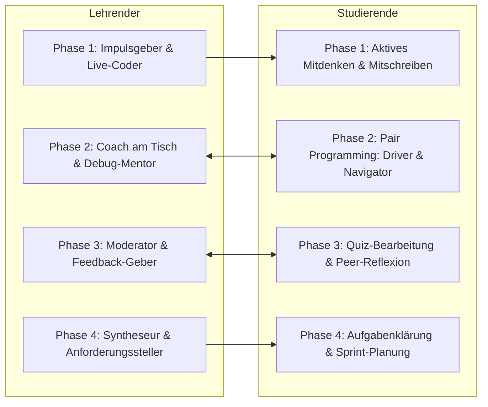
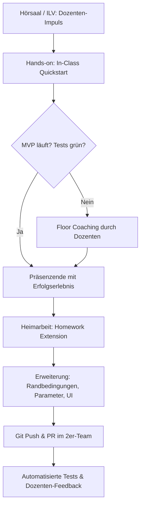
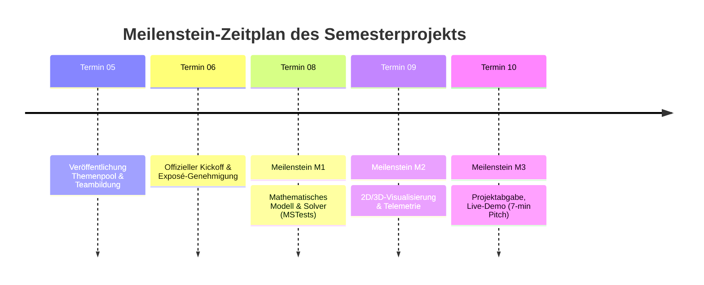
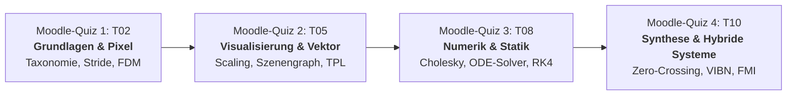

# Didaktisches Gesamtkonzept & Semester-Syllabus
## Lehrveranstaltung: Systemsimulation / Digitaler Zwilling

**Dokument-ID:** `Konzept/01_Lehrveranstaltungsstruktur_und_Syllabus.md`  
**Studiengang:** Bachelor Automatisierungstechnik (5. / 6. Semester)  
**Institution:** Fachhochschule Oberösterreich, Campus Wels  
**Verantwortlicher:** Dr. Georg Hackenberg, Professor für Informatik und Industriesysteme  
**Lehrveranstaltungstyp:** Integrierte Lehrveranstaltung (ILV)  
**Umfang:** 2 SWS / 3 ECTS (Workload: 75 Stunden, davon 25 h Präsenz und 50 h Selbststudium / Heimarbeit)  
**Struktur:** 10 Präsenztermine à 150 Minuten (2,5 Zeitstunden)  
**Materialbasis:** 12 Kapitel des Repositories (`Folien/00_Prolog` bis `Folien/11_Epilog`)  
**Status:** Freigegebenes Referenzkonzept für die Lehre  

---

## Inhaltsverzeichnis

1. [Ausgangslage, Zielgruppe & Rahmenbedingungen](#1-ausgangslage-zielgruppe--rahmenbedingungen)
   - 1.1 Institutioneller Kontext & Zielgruppenprofil (Campus Wels)
   - 1.2 Charakteristik des Formats ILV (Integrierte Lehrveranstaltung)
   - 1.3 Workload-Kalkulation nach ECTS-Richtlinien
2. [Didaktische Leitphilosophie](#2-didaktische-leitphilosophie)
   - 2.1 Constructive Alignment nach Biggs
   - 2.2 Active Learning & Just-in-Time Teaching
   - 2.3 Scaffolding: Vom In-Class-MVP zur autonomen Homework Extension
   - 2.4 Modernes Software-Engineering: Pair Programming & Vibe Coding mit KI-Unterstützung
3. [Mapping der 12 Kapitel auf 10 Präsenztermine](#3-mapping-der-12-kapitel-auf-10-präsenztermine)
   - 3.1 Semester-Übersichtsmatrix
   - 3.2 Detaillierte Ausarbeitung der Termine T01 bis T10
4. [Ablaufstruktur eines 150-Minuten-Präsenztermins](#4-ablaufstruktur-eines-150-minuten-präsenztermins)
   - 4.1 Die 4-Phasen-Taktung
   - 4.2 Rollenprofile von Lehrendem und Studierenden
   - 4.3 Umgang mit Heterogenität: Differenzierung & Fast-Track Challenges
5. [Didaktische Verzahnung von Präsenzzeit und Heimarbeit](#5-didaktische-verzahnung-von-präsenzzeit-und-heimarbeit)
   - 5.1 Nahtloser Übergang: In-Class Quickstart ➔ Homework Extension
   - 5.2 Kollaborationsmodell: 2er-Teams, Pair Programming & Git-Workflow
   - 5.3 Leitfaden für "Vibe Coding" & KI-Engineering (Copilots als Junior-Entwickler)
6. [Meilenstein- und Projektzeitplan](#6-meilenstein--und-projektzeitplan)
   - 6.1 Semesterprojekt: Konzeption, Meilensteine M1–M3 & Abschluss-Pitch
   - 6.2 Katalog exemplarischer Projektthemen aus der Automatisierungstechnik
   - 6.3 Moodle-Test- und Assessment-Architektur
   - 6.4 Benotungsrichtlinie & Bewertungsrubrik
7. [Checkliste für Dozierende zur Semestervorbereitung](#7-checkliste-für-dozierende-zur-semestervorbereitung)

---

## 1. Ausgangslage, Zielgruppe & Rahmenbedingungen

### 1.1 Institutioneller Kontext & Zielgruppenprofil (Campus Wels)

Der Bachelorstudiengang **Automatisierungstechnik** an der FH Oberösterreich (Campus Wels) bildet Ingenieurinnen und Ingenieure an der Schnittstelle von Maschinenbau, Elektrotechnik, Regelungstechnik und angewandter Informatik aus. Die Studierenden belegen die Lehrveranstaltung *Systemsimulation / Digitaler Zwilling* typischerweise im **5. oder 6. Fachsemester**.

#### Vorwissen der Studierenden:
- **Mathematisch-Naturwissenschaftlich (Hoch):** Fundierte Kenntnisse in Höherer Mathematik (Analysis, Lineare Algebra, Laplace-Transformation, Differentialgleichungen) sowie Technischer Mechanik (Statik, Elastostatik, Kinetik, Dynamik).
- **Automatisierungs- & Regelungstechnik (Sehr hoch):** Zustandsraumdarstellung, Übertragungsfunktionen, PID-Regler, Frequenzgangverfahren (Bode, Nyquist), SPS-Programmierung nach IEC 61131-3 (ST, KOP, FUP) sowie industrielle Bussysteme.
- **Informatik & Programmierung (Heterogen bis solide):** Beherrschung von Grundlagen in C/C++ oder C# (objektorientierte Grundkonzepte, Kontrollstrukturen, Algorithmen). Typischerweise bestehen jedoch Lücken in hardwarenaher Speicherverwaltung (`unsafe`, Zeigerarithmetik), modernen UI-Architekturen (WPF, MVVM, Rendering-Pipelines), fortgeschrittener Nebenläufigkeit (Task Parallel Library, Thread-Synchronisation) und 3D-Computergrafik.

#### Berufsfeldbezug:
Angehende Automatisierer nutzen Simulationen nicht als theoretischen Selbstzweck, sondern als operatives Werkzeug für:
- die **Virtuelle Inbetriebnahme (VIBN)** von Maschinen und Sondierungsanlagen vor dem physischen Aufbau,
- den Entwurf und die parametergenaue Vorinbetriebnahme von **Regelkreisen (Closed-Loop)** unter Berücksichtigung von Nichtlinearitäten und Aktor-Sättigungen,
- das modellbasierte **Condition Monitoring** und Predictive Maintenance im laufenden Leitstand.

### 1.2 Charakteristik des Formats ILV (Integrierte Lehrveranstaltung)

Das an österreichischen Fachhochschulen etablierte Format der **Integrierten Lehrveranstaltung (ILV)** hebt die klassische Trennung zwischen Vorlesung (Frontaltheorie) und Übung (Labor am Nachmittag) auf.
- **Einheitlicher Raum:** Der Unterricht findet in multimedial ausgestatteten Seminarräumen oder PC-Pools statt; die Studierenden arbeiten auf eigenen oder bereitgestellten Entwicklungs-Laptops.
- **Fließende Übergänge:** Theorie-Impulse, Live-Coding-Demonstrationen des Dozierenden und betreute hands-on Programmierphasen wechseln dynamisch innerhalb desselben Blocks ab.
- **Prüfungsimmanenter Charakter:** Es gibt keine isolierte 90-minütige Abschluss-Schriftklausur; die Note speist sich aus kontinuierlichen Teilleistungen (Moodle-Micro-Quizzes, vertiefende Hausübungen, Semesterprojekt und Abschluss-Präsentation).

### 1.3 Workload-Kalkulation nach ECTS-Richtlinien

Die Lehrveranstaltung ist mit **3 ECTS-Punkten** (entsprechend einem Gesamt-Workload von **75 Arbeitsstunden** à 60 Minuten) dotiert:

| Kategorie | Aktivität | Zeitaufwand (h) | Anteil (%) |
| :--- | :--- | :---: | :---: |
| **Präsenzlehre (ILV)** | 10 Termine à 150 Minuten (inkl. Kurzpausen) | **25,0 h** | 33,3 % |
| **Vor- & Nachbereitung** | Vorbereitung der Termine, Studium von Skriptum & Notizen | **10,0 h** | 13,3 % |
| **Homework Extensions** | 4 vertiefende Programmieraufgaben (je 3,5 h) | **14,0 h** | 18,7 % |
| **Moodle-Assessments** | 4 formativ/summative Moodle-Tests (Vorbereitung & Durchführung) | **6,0 h** | 8,0 % |
| **Abschlussprojekt** | Entwicklung des Digitalen Zwillings im 2er-Team (20 h pro Person) | **20,0 h** | 26,7 % |
| **Gesamtsumme** | **1 ECTS = 25 Echtstunden** | **75,0 h** | **100,0 %** |

---

## 2. Didaktische Leitphilosophie

### 2.1 Constructive Alignment nach Biggs

Das Curriculum folgt dem Prinzip des **Constructive Alignment** (John Biggs):
1. **Intended Learning Outcomes (ILOs):** Die Studierenden können physikalisch-technische Systeme als mathematische Modelle formulieren, numerische Algorithmen (LGS, ODE, DES, Hybride Solver) in modernem C# (.NET 8/.NET 10) ohne Blackbox-Frameworks implementieren und echtzeitfähige 2D/3D-Dashboards realisieren.
2. **Teaching/Learning Activities (TLAs):** Interaktiver Theorieimpuls ➔ Dozenten-Live-Coding ➔ In-Class Hands-on Entwicklung im 2er-Team ➔ Peer-Review.
3. **Assessment Tasks (ATs):** Moodle-Micro-Quizzes prüfen das konzeptionelle und algorithmische Fundament; Homework Extensions fordern sauberen Code; das Semesterprojekt verlangt die ganzheitliche Synthese.

### 2.2 Active Learning & Just-in-Time Teaching

Frontalunterricht über 150 Minuten führt bei technisch komplexen Themen nachweislich zu Ermüdung und kognitiver Überlastung. Deshalb setzt der Kurs auf **Active Learning**:
- Maximale Länge eines theoretischen Inputs: **45 Minuten**.
- Kein theoretischer Block ohne anschließendes **Live-Coding**, bei dem der Dozent bewusst auch typische Fallstricke (Compilerfehler, Stabilitätsprobleme, Race Conditions) demonstriert und live debuggt.
- Unmittelbarer Übergang in die **Laborphase** ("Learn by Doing"), solange das Konzept im Kurzzeitgedächtnis präsent ist.

### 2.3 Scaffolding: Vom In-Class-MVP zur autonomen Homework Extension

Studierende beginnen eine Programmieraufgabe niemals auf einem "leeren weißen Blatt":
- **In-Class Quickstart (Präsenz):** Die Teams erhalten eine strukturierte C#-Vorlage (z.B. vorbereitete Klassenschnittstelle `ISimulationBlock` oder leeres WPF-Fenster mit NuGet-Abhängigkeiten). Innerhalb von 60 Minuten führen sie die Kernlogik zu einem lauffähigen **Minimal Viable Product (MVP)**.
- **Homework Extension (Heimarbeit):** Aufbauend auf dem im Hörsaal verifizierten MVP erweitern die Studierenden zu Hause das Modell (z.B. Hinzufügen von Nichtlinearitäten, Reibung, Performance-Optimierung via TPL oder erweiterte Visualisierung).

### 2.4 Modernes Software-Engineering: Pair Programming & Vibe Coding mit KI-Unterstützung

Im modernen industriellen Alltag programmieren Entwickler nicht isoliert und nutzen zunehmend KI-Assistenten (GitHub Copilot, Cursor, LLMs). Der Kurs integriert diese Praxis explizit:
- **Pair Programming im 2er-Team:** Rollenaufteilung in *Driver* (tippt Code, bedient die IDE) und *Navigator* (überwacht Architektur, prüft Randbedingungen, liest Formeln nach). Rollentausch alle 30 Minuten.
- **Kritisches "Vibe Coding" mit KI:** Der Einsatz von KI-Tools ist ausdrücklich gestattet und wird gefördert – jedoch unter der **strengen Ingenieurs-Doktrin**: *Verstehe und verifiziere jede Zeile Code*. KI-generierter Code muss durch automatisierte MSTest-Unit-Tests und physikalische Plausibilitätsprüfungen abgesichert werden.

---

## 3. Mapping der 12 Kapitel auf 10 Präsenztermine

Die 12 Kapitel des Repositories (`00_Prolog` bis `11_Epilog`) decken zwei zusammengehörige Domänen ab: **Visualisierungs- & Systemwerkzeuge (Kapitel 2–6)** sowie **Physikalische Modellklassen & Simulation (Kapitel 7–10)**, gerahmt durch Prolog (00), Einführung (01) und Epilog (11).

Um 12 Kapitel harmonisch auf 10 Präsenztermine à 150 Minuten abzubilden, werden thematisch eng verzahnte Einheiten konsolidiert:
- **Termin 1:** Prolog (`00`) und Einführung & Digitaler Zwilling (`01`) bilden den idealen Auftakt.
- **Termin 10:** Hybride Systeme (`10`) und Epilog/Synthese/VIBN (`11`) verschmelzen mit der **Live-Präsentation der Semesterprojekte**.

### 3.1 Semester-Übersichtsmatrix

| Termin | Thema | Kapitel im Repo | Fokus & Kerntechnologien | Meilensteine & Prüfungen |
| :---: | :--- | :---: | :--- | :--- |
| **T01** | **Einführung, Modellbegriff & Digitaler Zwilling** | `00_Prolog` `01_Einführung` | Taxonomie, Modellbildung, Grieves-Zwilling, C#/.NET 8 Setup, Git | Setup-Check, Teambildung |
| **T02** | **2D-Pixelgrafik & Feldsimulation** | `02_Visualisierung_2D_Pixel` | `WriteableBitmap`, Stride, Color-LUTs, FDM-Wärmeleitungsgleichung | Moodle-Quiz 1 (Grundlagen) |
| **T03** | **2D-Vektorgrafik & Koordinatentransformation** | `03_Visualisierung_2D_Vektor` | WPF `Canvas`, Uniform Scaling, BoundingBox, `DrawingVisual` | HW 1 Ausgabe (2D-Visualisierung) |
| **T04** | **Echtzeit-Telemetrie & Signalflussgraphen** | `04_Visualisierung_2D_Diagramme` | `ScottPlot 5`, CircularBuffer, MVVM, `MSAGL` Netzwerkgraphen | HW 1 Abgabe |
| **T05** | **3D-Visualisierung & Kinematische Szenengraphen** | `05_Visualisierung_3D_OpenGL` | `SharpGL`, hierarchischer Szenengraph, OrbitCamera, Kinematik | Moodle-Quiz 2 (Visualisierung) **Projekt-Themenpool offen** |
| **T06** | **Multithreading & Parallele Simulation** | `06_Multithreading` | Task Parallel Library (`Parallel.For`), Thread-Sync, UI-Entkopplung | **Projekt-Kickoff & Exposé-Abgabe** |
| **T07** | **Statische Modelle: Fachwerke & Cholesky-LGS** | `07_Statische_Modelle` | Ideale/Elastische Fachwerke 2D/3D, `Math.NET`, FEM-Steifigkeitsmatrix | HW 2 Ausgabe (Fachwerk-FEM) |
| **T08** | **Kontinuierliche Dynamik: ODEs & S-Functions** | `08_Dynamische_Modelle_Kontinuierlich` | Euler/Heun/RK4, S-Functions, DC-Servomotor mit Anti-Windup | Moodle-Quiz 3 (Numerik) **Projekt-Meilenstein M1 (Modell)** |
| **T09** | **Diskrete Systeme, Stochastik & Monte-Carlo** | `09_Dynamische_Modelle_Diskret` | Warteschlangen (DES), Box-Muller, Monte-Carlo, Welford-Statistik | HW 2 Abgabe **Projekt-Meilenstein M2 (UI/Sync)** |
| **T10** | **Hybride Dynamik, VIBN & Abschluss-Kolloquium** | `10_Dynamische_Modelle_Hybrid` `11_Epilog` | Zero-Crossing Bisektion, Sticking, FMI/FMU, VIBN, **Projekt-Präsentationen** | Moodle-Quiz 4 (Synthese) **Projekt-Endabgabe & Live-Demos** |

---

### 3.2 Detaillierte Ausarbeitung der Termine T01 bis T10

---

#### Termin T01: Einführung, Modellbegriff & Digitaler Zwilling
- **Kapitel:** [00_Prolog](file:///c:/Users/P28500/Desktop/Repositories/kurs-computer-simulation/Folien/00_Prolog/Folien.md) & [01_Einführung](file:///c:/Users/P28500/Desktop/Repositories/kurs-computer-simulation/Folien/01_Einführung/Folien.md)
- **Lernziele (Bloom):**
  - *Verstehen:* Die Taxonomie technischer Modelle (statisch vs. dynamisch, kontinuierlich vs. diskret) definieren und erklären können.
  - *Analysieren:* Das Drei-Säulen-Modell des Digitalen Zwillings nach Michael Grieves auf reale industrielle Anlagen übertragen.
  - *Anwenden:* Die Entwicklungsumgebung (Visual Studio 2022 / VS Code, .NET 8 SDK, Git) konfigurieren und eine erste C#-Konsolenapplikation ausführen.
- **Theorie-Impuls & Live-Coding (45 min):**
  - Vorstellung der Vorlesungsarchitektur und Notenmodalitäten (Prolog).
  - Der Modellbegriff: George Box („All models are wrong, but some are useful“).
  - Physischer Raum, virtueller Raum und automatisierter Datenfluss (Digital Model vs. Digital Shadow vs. Digital Twin).
  - Live-Coding: Aufsetzen einer Solution `DigitalTwinWorkshop.sln`, Einbinden grundlegender NuGet-Pakete, Demonstration des Berechnungszyklus.
- **Hands-on Laborphase: In-Class Quickstart (60 min):**
  - **Aufgabe:** Initialisierung des Team-Git-Repositories. Erstellung einer C#-Klassenbibliothek mit einem ersten parametrierbaren Dämpfungs- und Abkühlungsmodell (analytische Exponentialfunktion vs. erster numerischer Differenzenquotient).
  - Verifikation via Unit Test (`Assert.AreEqual` mit Delta).
- **Micro-Review & Moodle-Quiz (30 min):**
  - Peer-Review der Git-Struktur. Kurze Plenumsdiskussion: Welche Modellart eignet sich für eine Werkzeugmaschine, welche für ein Hochregallager?
- **Ausblick & Hausübungs-Briefing (15 min):**
  - Vorbereitung auf T02: Speicherlayout von 2D-Bildern (Stride, Farbtiefen). Installation des WPF-Workloads.

---

#### Termin T02: 2D-Pixelgrafik & Feldsimulation (Finite Differenzen)
- **Kapitel:** [02_Visualisierung_2D_Pixel](file:///c:/Users/P28500/Desktop/Repositories/kurs-computer-simulation/Folien/02_Visualisierung_2D_Pixel/Folien.md)
- **Lernziele (Bloom):**
  - *Verstehen:* Speicherlinearisierung (Row-Major, Stride-Padding) und Farbkanäle (`Bgra32`) erklären.
  - *Anwenden:* High-Performance Rastermanipulation mit `WriteableBitmap.Lock()`, Pointer-Arithmetik (`unsafe`) und Look-up-Tables (LUT) implementieren.
  - *Erschaffen:* Eine 2D-Wärmeleitungssimulation mittels FDM (5-Punkt-Stern) und Von-Neumann-Stabilitätsbedingung programmieren.
- **Theorie-Impuls & Live-Coding (45 min):**
  - Flaschenhals des WPF Visual Trees bei $10^5$ Bildpunkten.
  - Zeigerarithmetik in C#: `IntPtr`, `uint*`, Bit-Shifting (`(a << 24) | (r << 16) | ...`).
  - Mathematische Herleitung: 2D-Laplace-Operator $\Delta T = \frac{\partial^2 T}{\partial x^2} + \frac{\partial^2 T}{\partial y^2}$, Diskretisierung via finite Differenzen und CFL-Bedingung ($s = \frac{\alpha \cdot \Delta t}{\Delta x^2} \le 0.25$).
  - Live-Coding: Farbtabellen-Generator (Heatmap-Gradient Blau-Grün-Rot) und Allokations-freies Schreiben in den BackBuffer.
- **Hands-on Laborphase: In-Class Quickstart (60 min):**
  - **In-Class Quickstart:** Erstellung eines WPF-Fensters mit `Image`-Control und `WriteableBitmap` ($200 \times 200$ Pixel). Implementierung der 5-Punkt-Stern-Rechenschleife mit Dirichlet-Randbedingungen (Heizpad in der Mitte, gekühlte Ränder).
- **Micro-Review & Moodle-Quiz (30 min):**
  - **Moodle-Quiz 1:** Grundlagen der Modellbildung, Stride-Berechnung, Little-Endian Farbordnung, Von-Neumann-Stabilitätsgrenze.
- **Ausblick & Homework Extension (15 min):**
  - Briefing: Ghost-Cells für isolierte Ränder (Neumann-Randbedingung $\frac{\partial T}{\partial n} = 0$) als Vorbereitung für Homework 1.

---

#### Termin T03: 2D-Vektorgrafik & Koordinatentransformation
- **Kapitel:** [03_Visualisierung_2D_Vektor](file:///c:/Users/P28500/Desktop/Repositories/kurs-computer-simulation/Folien/03_Visualisierung_2D_Vektor/Folien.md)
- **Lernziele (Bloom):**
  - *Anwenden:* Affine 2D-Koordinatentransformationen (Weltkoordinaten mit $+Y$ oben $\to$ Bildschirmkoordinaten mit $+Y$ unten) unter Erhalt des Seitenverhältnisses implementieren.
  - *Analysieren:* Performanzunterschiede zwischen WPF `Shape`-Elementen (`Line`, `Path`) und der leichtgewichtigen `DrawingVisual`/`DrawingContext`-Pipeline quantifizieren.
  - *Erschaffen:* Geometrische Vektorkomponenten (gerichtete Kraftpfeile mit orthonormalen Spitzen) mathematisch und grafisch abbilden.
- **Theorie-Impuls & Live-Coding (45 min):**
  - Mathematische Formulierung: Bounding-Box-Ermittlung, Uniform-Scaling-Faktor $s = \min(s_x, s_y)$, Translation und Zentrierungs-Offset.
  - Vektorielle Geometrie: Generierung einer Pfeilspitze aus Richtungsvektor $\vec{u}$ und Normalenvektor $\vec{u}^\perp = (-u_y, u_x)^T$.
  - Live-Coding: Ableitung eines custom `VectorCanvas : FrameworkElement` mit Render-Schleife über `DrawingContext.DrawLine` und `DrawGeometry`.
- **Hands-on Laborphase: In-Class Quickstart (60 min):**
  - **In-Class Quickstart:** Implementierung der Klasse `WorldToScreenTransformer`. Interaktive Visualisierung eines einfachen 2D-Kräftepolygons mit Zoom & Pan mittels Maus-Events.
- **Micro-Review & Moodle-Quiz (30 min):**
  - Interaktives Fehlersuch-Rätsel: Warum verzerrt sich die Geometrie bei Fenstergrößenänderung? (Fehlendes Uniform Scaling).
- **Ausblick & Hausübungs-Briefing (15 min):**
  - **Ausgabe Homework 1:** "High-Performance 2D-Dashboard": Kopplung von FDM-Feldgrafik (Heatmap) mit Vektorpfeilen des Wärmestroms $\vec{q} = -\lambda \nabla T$.

---

#### Termin T04: Echtzeit-Telemetrie & Signalflussgraphen
- **Kapitel:** [04_Visualisierung_2D_Diagramme](file:///c:/Users/P28500/Desktop/Repositories/kurs-computer-simulation/Folien/04_Visualisierung_2D_Diagramme/Folien.md)
- **Lernziele (Bloom):**
  - *Verstehen:* Datenstrukturen für kontinuierliches Daten-Streaming (Circular Buffer, Array-Pool) zur Vermeidung von Garbage-Collection-Lags erklären.
  - *Anwenden:* `ScottPlot 5` zur allokationsfreien Visualisierung von 1-kHz-Sensordaten im MVVM-Muster einbinden.
  - *Evaluieren:* Signalfluss-Netzwerke mittels Microsoft Automatic Graph Layout (`MSAGL`) topologisch anordnen und algebraische Schleifen farblich hervorheben.
- **Theorie-Impuls & Live-Coding (45 min):**
  - Das Problem unkontrollierter GC-Pässen bei industriellen Echtzeit-Dashboards.
  - Ringpuffer-Mathematik: Modulo-Arithmetik vs. Bit-Maskierung bei Zweierpotenzen (`index & (capacity - 1)`).
  - ScottPlot 5 `Signal`-Plots: Direkte Referenzierung vorallokierter Arrays ohne Datendopplung.
  - Live-Coding: MVVM-Architektur mit `CommunityToolkit.Mvvm`, Timer-gesteuertes Daten-Streaming, automatisches Graph-Layout via MSAGL.
- **Hands-on Laborphase: In-Class Quickstart (60 min):**
  - **In-Class Quickstart:** Erstellung eines MVVM-Dashboards: Ein simulierter Sinusgenerator schreibt in einen `CircularBuffer<double>`; ScottPlot 5 plottet das Signal live mit 60 FPS; ein MSAGL-Graph zeigt den Status der Signalverarbeitungskette.
- **Micro-Review & Moodle-Quiz (30 min):**
  - Micro-Review: Code-Inspektion der Ringpuffer-Implementierung. Diskussion über GC-Druck bei häufigen `new double[...]`-Allokationen.
- **Ausblick & Hausübungs-Briefing (15 min):**
  - Abgabe Homework 1. Vorschau auf T05: 3D-Geometrie, Kugelkoordinaten und OpenGL.

---

#### Termin T05: 3D-Visualisierung & Kinematische Szenengraphen
- **Kapitel:** [05_Visualisierung_3D_OpenGL](file:///c:/Users/P28500/Desktop/Repositories/kurs-computer-simulation/Folien/05_Visualisierung_3D_OpenGL/Folien.md)
- **Lernziele (Bloom):**
  - *Verstehen:* Die 3D-Grafikpipeline (Model-View-Projection), Kugelkoordinaten der OrbitCamera und Tiefenpufferung (`glEnable(GL_DEPTH_TEST)`).
  - *Anwenden:* Einen hierarchischen Szenengraphen (`SceneNode`, `TransformNode`, `MeshNode`) mit lokaler und globaler Transformationsmatrix implementieren.
  - *Erschaffen:* Die Vorwärtskinematik eines mechatronischen 2-Achs-Roboters (SCARA) als 3D-Modell in `SharpGL` aufbauen.
- **Theorie-Impuls & Live-Coding (45 min):**
  - Motivation: Warum 3D für den Digitalen Zwilling? Räumliche Kollisionen und Maschinenbewegung.
  - Kardanfehlerfreie Kamera-Navigation über Kugelkoordinaten (Radius $r$, Azimut $\theta$, Elevation $\phi$).
  - Der Szenengraph als Composite-Entwurfsmuster: Relative Transformationen der Kindknoten durch Matrizenstapel (`glPushMatrix`, `glPopMatrix`).
  - Live-Coding: Aufbau einer Roboterachse mit SharpGL: Basisplatte ➔ Arm 1 (rotierend) ➔ Gelenk ➔ Arm 2.
- **Hands-on Laborphase: In-Class Quickstart (60 min):**
  - **In-Class Quickstart:** Einbinden des SharpGL `OpenGLControl`. Erstellen eines parametrierbaren Zylinders via `GeometryFactory` und interaktives Bewegen der Roboterachsen mittels Sliders im GUI.
- **Micro-Review & Moodle-Quiz (30 min):**
  - **Moodle-Quiz 2:** Koordinatentransformationen 2D/3D, Normalenvektoren, Szenengraphen-Topologie, Tiefenpuffer.
- **Ausblick & Projekt-Themenpool (15 min):**
  - **Veröffentlichung des Semesterprojekt-Themenkatalogs.** Erläuterung der Kriterien. Teams finden sich und sondieren Themen.

---

#### Termin T06: Multithreading & Parallele Simulation
- **Kapitel:** [06_Multithreading](file:///c:/Users/P28500/Desktop/Repositories/kurs-computer-simulation/Folien/06_Multithreading/Folien.md)
- **Lernziele (Bloom):**
  - *Analysieren:* Race Conditions, Deadlocks und False Sharing in Multi-Core-Umgebungen identifizieren.
  - *Anwenden:* Datenparallele Schleifen mit `Parallel.For` und Thread-lokalen Akkumulatoren implementieren.
  - *Erschaffen:* Strikte Entkopplung von hochfrequentem Physik-Thread und 60-Hz-UI-Thread mittels `Task.Run`, `IProgress<T>` und `CancellationToken`.
- **Theorie-Impuls & Live-Coding (45 min):**
  - Amdahlsches Gesetz und Grenzen der Skalierung.
  - Thread-Sicherheit in C#: `Interlocked`, `lock(syncRoot)`, Thread-lokaler Speicher (`localInit`, `localFinally`).
  - Das WPF-Dispatcher-Problem: Warum `Dispatcher.Invoke` im Simulationsloop die Berechnungen ausbremst.
  - Live-Coding: Benchmark: Sequenzielle vs. parallele Monte-Carlo-Simulation mit Visualisierung des CPU-Core-Workloads.
- **Hands-on Laborphase: In-Class Quickstart (60 min):**
  - **In-Class Quickstart:** Entkopplung einer rechenintensiven Partikelsimulation: Die Physik rechnet mit 1000 Hz im Hintergrund-Task; über einen `Progress<T>`-Puffer wird der UI-Thread entlastet; ein "Stop"-Button triggert ein sauberes `CancellationTokenSource.Cancel()`.
- **Micro-Review & Moodle-Quiz (30 min):**
  - Live-Code-Review: Aufspüren von Race Conditions in studentischen Codeschnipseln.
- **Ausblick & Offizieller Projekt-Kickoff (15 min):**
  - **Projekt-Kickoff:** Verbindliche Themenwahl der 2er-Teams. Einreichung eines 1-seitigen Projekt-Exposés bis zum Folgetag.
  - Scharnier-Ausblick: Wechsel von den Software-Werkzeugen (Kapitel 2–6) zu den physikalischen Simulationsmodellen (Kapitel 7–10).

---

#### Termin T07: Statische Systeme: Fachwerke & Cholesky-LGS
- **Kapitel:** [07_Statische_Modelle](file:///c:/Users/P28500/Desktop/Repositories/kurs-computer-simulation/Folien/07_Statische_Modelle/Folien.md)
- **Lernziele (Bloom):**
  - *Verstehen:* Das Schnittprinzip an Gelenkknoten, statische Bestimmtheit und das Modell des elastischen FEM-Fachwerks.
  - *Anwenden:* Elementsteifigkeitsmatrizen $\mathbf{k}_e^{loc}$ aufstellen, mittels Drehmatrix $\mathbf{T}$ ins globale Koordinatensystem transformieren ($\mathbf{k}_e^{glob} = \mathbf{T}^T \mathbf{k}_e^{loc} \mathbf{T}$) und zur Gesamtsteifigkeitsmatrix $\mathbf{K}$ assemblieren.
  - *Erschaffen:* Lösung des Gleichungssystems $\mathbf{K} \cdot \mathbf{u} = \mathbf{f}$ mit `Math.NET Numerics` via Cholesky-Zerlegung.
- **Theorie-Impuls & Live-Coding (45 min):**
  - Vom Gleichgewicht der Kräfte $\sum \vec{F} = \vec{0}$ zum linearen Gleichungssystem $\mathbf{A} \cdot \mathbf{s} = \mathbf{q}$.
  - Das elastische Stabelement: $k_e = \frac{E \cdot A}{L}$, Dyadisches Produkt der Einheitsrichtungsvektoren $\mathbf{d} \cdot \mathbf{d}^T$.
  - Berücksichtigung von Randbedingungen (feste/verschiebliche Lager) durch Matrixkondensation oder Penalties.
  - Live-Coding: Aufbau einer Fachwerkstruktur in C# (Knoten, Stäbe), LGS-Lösung mit `MathNet.Numerics.LinearAlgebra`.
- **Hands-on Laborphase: In-Class Quickstart (60 min):**
  - **In-Class Quickstart:** Berechnung eines 2D-Trägerfachwerks (z.B. Brückensegment mit 5 Knoten und 7 Stäben). Grafische Darstellung des unbelasteten vs. des deformierten Zustands (überhöht dargestellt) im Vektor-Canvas aus T03.
- **Micro-Review & Moodle-Quiz (30 min):**
  - Diskussion von Singularitäten: Wann ist die Steifigkeitsmatrix nicht invertierbar? (Kinematische Ketten, Mechanismen).
- **Ausblick & Hausübungs-Briefing (15 min):**
  - **Ausgabe Homework 2:** "3D-Maschinengestell-Berechnung": FEM-Erweiterung auf Raumfachwerke (6 Freiheitsgrade pro Element) mit Farbkodierung der Stabkräfte (Zug=Blau, Druck=Rot).

---

#### Termin T08: Kontinuierliche Dynamik: ODEs & S-Functions
- **Kapitel:** [08_Dynamische_Modelle_Kontinuierlich](file:///c:/Users/P28500/Desktop/Repositories/kurs-computer-simulation/Folien/08_Dynamische_Modelle_Kontinuierlich/Folien.md)
- **Lernziele (Bloom):**
  - *Verstehen:* Das Prinzip von Zustandsraummodellen ($\dot{\mathbf{x}} = f(\mathbf{x}, \mathbf{u}, t)$) und Konsistenzordnungen numerischer Solver (Euler, Heun, RK4).
  - *Analysieren:* Schrittweitenkontrolle, numerische Stabilität steifer Differentialgleichungen und Entstehung algebraischer Schleifen.
  - *Erschaffen:* Eine modulare Simulationsarchitektur im Stile von MATLAB Simulink S-Functions in C# entwickeln und einen geregelten DC-Servomotor mit Anti-Windup simulieren.
- **Theorie-Impuls & Live-Coding (45 min):**
  - Übergang von Statik zu Dynamik: Newtonsches Grundgesetz $\sum \vec{F} = m \cdot \ddot{\mathbf{x}}$.
  - Integrationsverfahren im Detail: Expliziter Euler (Ordnung 1) vs. Runge-Kutta 4. Ordnung (RK4).
  - Mechatronisches Vorzeigemodell: Permanentmagnet-erregter Gleichstrommotor (elektrische DGL für Ankerstrom $\frac{di}{dt}$, mechanische DGL für Drehzahl $\frac{d\omega}{dt}$, Gegen-EMK $e = k_e \omega$, Motormoment $M = k_m i$).
  - PI-Geschwindigkeitsregler mit Anti-Windup (Clamping) bei Stellgrößenbegrenzung ($u_{max} = \pm 24\,\text{V}$).
  - Live-Coding: Die S-Function-Klassenstruktur (`InitStates`, `UpdateOutputs`, `UpdateContinuousStates`).
- **Hands-on Laborphase: In-Class Quickstart (60 min):**
  - **In-Class Quickstart:** Zusammenbau des Regelkreises in C#: `DCMotorBlock` gekoppelt mit `PIControllerBlock`. Vergleich der Sprungantwort unter explizitem Euler vs. RK4 bei unterschiedlichen Zeitschritten $h$.
- **Micro-Review & Moodle-Quiz (30 min):**
  - **Moodle-Quiz 3:** Numerische Integratoren (Konvergenzordnung, Stabilitätsgebiet), steife Systeme, S-Function-Architektur, Integrator-Windup.
- **Ausblick & Projekt-Meilenstein M1 (15 min):**
  - **Projekt-Meilenstein M1 fällig:** Abnahme des mathematischen Modells und der algorithmischen Grundstruktur (Konsolentests / MSTests) für das Semesterprojekt.

---

#### Termin T09: Diskrete Systeme, Stochastik & Monte-Carlo
- **Kapitel:** [09_Dynamische_Modelle_Diskret](file:///c:/Users/P28500/Desktop/Repositories/kurs-computer-simulation/Folien/09_Dynamische_Modelle_Diskret/Folien.md)
- **Lernziele (Bloom):**
  - *Verstehen:* Ereignisdiskrete Simulation (DES), Next-Event-Time-Advance-Paradigma und Prioritätswarteschlangen (`PriorityQueue<TEvent, double>`).
  - *Anwenden:* Pseudo-Zufallszahlen generieren (Inversionsmethode für Exponentialverteilung, Box-Muller-Verfahren für Normalverteilung).
  - *Erschaffen:* Eine parallele Monte-Carlo-Simulation mit numerisch stabilem Welford-Akkumulator zur Bestimmung von Konfidenzintervallen programmieren.
- **Theorie-Impuls & Live-Coding (45 min):**
  - Kontinuierlich vs. Diskret: Zeitschrittsteuerung $\Delta t$ vs. sprunghafter Fortschritt zum nächsten Ereigniszeitpunkt $t_{event}$.
  - Modellierung industrieller Fertigungsstraßen: Werkstück-Ankunft ➔ Puffer/Warteschlange ➔ Bearbeitungsstation ➔ Gutteil/Ausschuss.
  - Parallele Ausführung von $N = 100.000$ Simulationsläufen: Thread-sichere Aggregation von Mittelwert und Varianz ohne Speicherüberlauf mit dem Algorithmus von B. P. Welford.
  - Live-Coding: Warteschlangensimulator in C# mit Prioritätswarteschlange und ScottPlot-Histogramm.
- **Hands-on Laborphase: In-Class Quickstart (60 min):**
  - **In-Class Quickstart:** Modellierung einer Fertigungszelle mit stochastischen Maschinen-Ausfällen (MTBF/MTTR). Analyse der mittleren Durchlaufzeit und Durchsatzrate.
- **Micro-Review & Moodle-Quiz (30 min):**
  - Abgabe Homework 2. Code-Review: Warum ist die Standardformel $\sum (x_i - \bar{x})^2$ bei float-Zahlen numerisch instabil? (Auslöschung).
- **Ausblick & Projekt-Meilenstein M2 (15 min):**
  - **Projekt-Meilenstein M2 fällig:** Abnahme der GUI-Integration und Echtzeit-Visualisierung der Projektarbeiten.

---

#### Termin T10: Hybride Dynamik, VIBN & Abschluss-Kolloquium
- **Kapitel:** [10_Dynamische_Modelle_Hybrid](file:///c:/Users/P28500/Desktop/Repositories/kurs-computer-simulation/Folien/10_Dynamische_Modelle_Hybrid/Folien.md) & [11_Epilog](file:///c:/Users/P28500/Desktop/Repositories/kurs-computer-simulation/Folien/11_Epilog/Folien.md)
- **Lernziele (Bloom):**
  - *Verstehen:* State Events, Zero-Crossing-Detektion und den Zeno-Effekt mit Sticking-Threshold in hybriden Systemen.
  - *Synthetisieren:* Den ganzheitlichen Bogen vom mathematischen Modell über den Code zum Digitalen Zwilling schlagen (FMI/FMU, Hardware-in-the-Loop, Virtuelle Inbetriebnahme).
  - *Evaluieren:* Die eigenen Simulationslösungen präsentieren, fachlich verteidigen und Peer-Feedback konstruktiv bewerten.
- **Theorie-Impuls: Hybride Systeme & VIBN-Synthese (40 min):**
  - Hybride Modelle: Kontinuierliche Trajektorie trifft auf unstetige Zustandsübergänge (Stoßmechanik, Ventilschaltungen, digital getaktete Sensoren).
  - Solver-Architektur: Vorzeichenwechsel-Bisektion zur Bestimmung des exakten Stoßzeitpunkts $t^* \in [t, t+h]$.
  - Synthese des Digitalen Zwillings: Co-Simulation mit dem Functional Mock-up Interface (FMI), Kopplung mit Steuerungen (OPC UA / TwinCAT / TIA Portal) für die Virtuelle Inbetriebnahme (VIBN).
- **Moodle-Abschlusstest (20 min):**
  - **Moodle-Quiz 4:** Hybride Systeme, Zero-Crossing, VIBN, Co-Simulation und Gesamtkonzepte des Semesters.
- **Abschluss-Kolloquium: Projekt-Präsentationen & Live-Demos (80 min):**
  - Jedes 2er-Team stellt seinen Digitalen Zwilling in einem kompakten **7-Minuten-Pitch** vor (3 min Folien/Architektur + 3 min Live-Demo des WPF-Zwillings + 1 min Q&A).
- **Semesterabschluss & Feedback (10 min):**
  - Kursfazit, Noten-Ausblick, Verabschiedung.

---

## 4. Ablaufstruktur eines 150-Minuten-Präsenztermins

Das 150-Minuten-Format (2,5 Stunden) ist didaktisch straff getaktet, um kognitive Ermüdung zu verhindern und ein optimales Verhältnis zwischen Wissensaufnahme, aktiver Konstruktion und Reflexion zu gewährleisten.

### 4.1 Die 4-Phasen-Taktung

```mermaid
gantt
    title Ablaufstruktur eines 150-Minuten-Präsenztermins (ILV)
    dateFormat X
    axisFormat %s min
    section Phase 1 (45m)
    Theorie-Impuls & Live-Coding : 0, 45
    section Phase 2 (60m)
    Hands-on Laborphase (In-Class Quickstart) : 45, 105
    section Phase 3 (30m)
    Micro-Review & Moodle-Quiz : 105, 135
    section Phase 4 (15m)
    Synthese, Ausblick & HW-Briefing : 135, 150
```

| Phase | Zeitfenster | Dauer | Didaktische Funktion | Aktivitäten & Methoden |
| :---: | :---: | :---: | :--- | :--- |
| **Phase 1** | 00:00 – 00:45 | **45 min** | **Theorie-Impuls & Live-Coding** | - Interaktive Folienpräsentation (Problemstellung, mathematische Modellierung, physikalische Gesetze) - Live-Coding durch Dozierenden: Konstruktion des Architekturgerüsts in Visual Studio - Fehler provozieren & live debuggen |
| *Pause* | *integriert* | *5 min* | *Kurzes Durchatmen / Rechner vorbereiten* | *Puffer für Raumlüftung und Vorbereitung der IDE* |
| **Phase 2** | 00:45 – 01:45 | **60 min** | **Hands-on Laborphase (In-Class Quickstart)** | - Studierende arbeiten in festen 2er-Teams am Laptop - Ausfüllen der vorbereiteten Lücken-Schnittstellen (Scaffolding) - Erreichen des "Minimal Viable Product" (lauffähige Mini-Simulation) - Dozent fungiert als aktiver "Floor Coach" |
| **Phase 3** | 01:45 – 02:15 | **30 min** | **Micro-Review & Moodle-Assessment** | - 15 min: Individuelles Moodle-Quiz (Multiple-Choice, Parametrier-Rechnungen, Code-Snippets) - 15 min: Gemeinsame Reflexion im Plenum: Quiz-Auswertung, Aufdecken von Fehlkonzepten, Peer-Code-Review |
| **Phase 4** | 02:15 – 02:30 | **15 min** | **Synthese & Homework Briefing** | - Zusammenfassung der Kernbotschaft - Briefing der weiterführenden Homework Extension - Beantwortung offener organisatorischer Fragen |

### 4.2 Rollenprofile von Lehrendem und Studierenden

- **In Phase 1:** Der Dozierende liefert nicht nur vorgefertigte Slides ab, sondern entwickelt Schlüsselcode interaktiv im Editor. Studierende stellen Zwischenfragen und skizzieren Lösungswege mit.
- **In Phase 2:** Der Lehrende wechselt von der Dozentenbühne an die Tische. Er prüft aktiv Code-Architekturen, hinterfragt numerische Parameter und unterstützt beim Troubleshooting.
- **In Phase 3:** Die Studierenden reflektieren ihr Verständnis im Moodle-Quiz. Typische Fehler werden im Plenum ohne Bloßstellung anonymisiert diskutiert.

### 4.3 Umgang mit Heterogenität: Differenzierung & Fast-Track Challenges

Da Programmier- und Mathematikfähigkeiten in ILVs variieren, wird das Material zweistufig differenziert:
1. **Scaffolding für solide Basis:**
   - Bereitstellung von Starter-Repositories auf GitHub/GitLab mit vollständigen Unit-Tests.
   - Studierende müssen nur definierte Methoden (z.B. `public double[] ComputeDerivatives(...)`) implementieren; wenn die Tests grün werden, ist der In-Class-Erfolg garantiert.
2. **Fast-Track Challenges für High-Performer:**
   - Teams, die den Quickstart vor Ablauf der 60 Minuten beenden, erhalten vertiefende Bonus-Herausforderungen:
     - *Performance:* Vektorisierung mit SIMD (`System.Numerics.Vector<T>`) oder TPL-Parallelisierung.
     - *Physik:* Ergänzung von Luftwiderstand $F_w \propto v^2$ oder nichtlinearer Hysterese.
     - *Visualisierung:* Einbau dynamischer Farbskalen oder interaktiver Drehmoment-Stellschieber im UI.

---

## 5. Didaktische Verzahnung von Präsenzzeit und Heimarbeit

### 5.1 Nahtloser Übergang: In-Class Quickstart ➔ Homework Extension

Ein zentraler Erfolgsfaktor der Didaktik ist die **Entkopplung von Hürde und Tiefe**:
- In der **Präsenzzeit** wird die initiale Hürde genommen (Syntaxfehler, Bibliotheksinstallation, Grundgleichungen). Kein Studierender verlässt den Hörsaal mit einem nicht kompilierenden Code.
- In der **Heimarbeit** vertiefen die Teams das bereits funktionierende Modell eigenständig.

### 5.2 Kollaborationsmodell: 2er-Teams, Pair Programming & Git-Workflow

Die Studierenden arbeiten das gesamte Semester über in festen **2er-Teams**. Dies fördert Peer Learning und spiegelt reale industrielle Entwicklerteams wider.

#### Pair-Programming-Protokoll im Hörsaal:
- **Der Driver:** Sitzt an der Tastatur, schreibt den Code, steuert den Debugger.
- **Der Navigator:** Hat das Skriptum und die Aufgabenstellung geöffnet, prüft die mathematischen Formeln, achtet auf saubere Bezeichner und Randfallprüfungen.
- **Rollenwechsel:** Nach exakt 30 Minuten (akustisches Signal durch Dozierenden) tauschen Driver und Navigator die Rollen.

#### Git-Branching & Review-Workflow:
Jedes Team erhält ein privates Repository (z.B. via GitHub Classroom):
- `main`-Branch: Nur lauffähiger, getesteter Code.
- `feature/...`-Branches: Entwicklung der jeweiligen Wochenaufgaben.
- **Pull Requests (PR):** Vor dem Merge in `main` muss der Teampartner den PR formal prüfen und freigeben (Code Review).

### 5.3 Leitfaden für "Vibe Coding" & KI-Engineering (Copilots als Junior-Entwickler)

Die Integration moderner generativer KI (GitHub Copilot, JetBrains AI Assistant, ChatGPT, Claude) wird in dieser Lehrveranstaltung nicht verboten, sondern als **Schlüsselkompetenz zukunftsorientierter Ingenieure** kultiviert.

#### Das "Engineering Vibe Coding"-Manifest:
1. **KI als Junior-Entwickler begreifen:** Der KI-Assistent ist ein fleißiger, aber unvorsichtiger Programmier-Assistent. Er kennt Syntax und Bibliotheken, halluziniert jedoch bei physikalischer Exaktheit und numerischer Stabilität.
2. **Architektur-Souveränität liegt beim Menschen:** Die Definition von Schnittstellen, Einheiten, Koordinatensystemen und Solver-Parametern obliegt allein dem Ingenieur.
3. **Kein Code ohne Verifikation:** Jede von KI generierte Berechnungsroutine muss durch mindestens einen deterministischen Unit Test (z.B. Vergleich mit analytischer Lösung) validiert werden.
4. **Prompting-Disziplin:** Vorlesungsspezifische Prompts fordern explizit Typensicherheit, Allokationsfreiheit und mechatronische Konventionen ein.

> [!IMPORTANT]
> **Engineering Vibe Coding Faustregel:**
> Wer Code einreicht, den er im Fachgespräch nicht mathematisch herleiten oder zeilenweise erklären kann, wird mit Nicht Genügend (Note 5) auf die Teilaufgabe bewertet. Das Verständnis steht über der Codemenge!

---

## 6. Meilenstein- und Projektzeitplan

### 6.1 Semesterprojekt: Konzeption, Meilensteine M1–M3 & Abschluss-Pitch

Das Herzstück der Leistungsbeurteilung ist das **Semesterprojekt**. In 2er-Teams entwickeln die Studierenden einen voll funktionsfähigen, interaktiven **Digitalen Zwilling** eines mechatronischen Systems.

- **Termin 05 (Woche 5):** Themenausgabe. Teams können aus dem Vorlagenkatalog wählen oder einen fundierten Eigenvorschlag einreichen.
- **Termin 06 (Woche 6):** **Exposé-Abgabe:** Einreichung eines 1-2 seitigen PDFs mit Systembeschreibung, Differentialgleichungen, Schnittstellen und Arbeitsaufteilung.
- **Termin 08 (Woche 8):** **Meilenstein M1 (Core & Physics):** Die mathematische Physikbibliothek läuft in C# und ist durch mindestens 4 automatisierte MSTest-Fälle (numerische Validierung) abgesichert.
- **Termin 09 (Woche 9):** **Meilenstein M2 (Integration & UI):** Die Physik ist an das WPF-UI angebunden; ScottPlot-Diagramme oder 3D-Szenengraph stellen den Systemzustand in Echtzeit dar.
- **Termin 10 (Woche 10):** **Meilenstein M3 (Final Pitch):** Endabgabe von Quellcode und Kurzbericht (max. 10 Seiten). Live-Präsentation im Kolloquium (7 Minuten pro Team).

---

### 6.2 Katalog exemplarischer Projektthemen aus der Automatisierungstechnik

Die Projekte decken typische Herausforderungen mechatronischer Anlagen ab:

#### 1. Digitaler Zwilling eines 3-Achs-Portalladers (Handling-System)
- **Modellart:** Kontinuierlich + Hybrid (Kinetik der Achsen mit Massenträgheit, Reibung, Endlagenanschläge).
- **Steuerung/Regelung:** 3-Achs-Positionsregelung mit Ruckbegrenzung (Trapez-/S-Kurven-Profil).
- **Visualisierung:** 3D-OpenGL-Szenengraph mit verfahrbarem Greifer + ScottPlot Achstelemetrie ($s(t), v(t), i(t)$).

#### 2. Schwingungsgedämpfter Brückenkran (Anti-Sway-Kran)
- **Modellart:** Kontinuierliche Dynamik (nichtlineares Pendel mit veränderlicher Seillänge, DGL 2. Ordnung).
- **Regelung:** Flachheitsbasierte Vorsteuerung oder Zustandsregler zur Unterdrückung der Lastschwingung beim Positionieren.
- **Visualisierung:** 2D-Vektor-Canvas mit Seil und Pendelmasse sowie interaktivem Wind-Störkraft-Regler.

#### 3. Mechatronischer Prüfstand: DC-Antrieb mit elastischer 2-Massen-Kupplung
- **Modellart:** Kontinuierlich (Zweimassenschwinger: Motor ➔ elastische Torsionsfeder ➔ Lastträgheit).
- **Phänomene:** Resonanzkatastrophe, Getriebespiel (Backlash als hybrides State Event), Anti-Windup im Geschwindigkeitsregler.
- **Visualisierung:** ScottPlot-Bode-Diagramm (Frequenzgangvermessung via Chirp-Signal) und Zeiger-Dashboard.

#### 4. Diskrete Simulation einer automatisierten Sortier- & Pufferanlage
- **Modellart:** Ereignisdiskrete Simulation (DES) mit stochastischen Werkstückankünften und Staurollenbahnen.
- **Kennzahlen:** Durchsatz, Pufferüberlauf-Wahrscheinlichkeit, Staulängen.
- **Visualisierung:** 2D-Topologie-Darstellung via MSAGL/Canvas mit animiertem Materialfluss und Monte-Carlo-Konfidenzintervallen.

---

### 6.3 Moodle-Test- und Assessment-Architektur

Zur kontinuierlichen Überprüfung des konzeptionellen Verständnisses finden über das Semester verteilt **4 strukturierte Moodle-Micro-Tests** statt:

- **Dauer:** Jeweils 15 Minuten zu Beginn von Phase 3.
- **Fragenformate:**
  - *Multiple Choice / Multiple Select:* Begriffsabgrenzungen (z.B. Modellarten, Digital Shadow vs. Twin).
  - *Parametrierungs- & Rechenaufgaben:* Manuelle Berechnung eines Zeitschritts mit explizitem Euler, Ermittlung des Row-Major-Speicherindexes, Von-Neumann-Stabilitätsgrenze.
  - *Code-Debugging:* Finden von Deadlocks, Race Conditions oder Speicher-Lecks in kurzen C#-Auszügen.
- **Didaktischer Charakter:** Formatives Feedback für Studierende; die bestehenden Fehlannahmen werden direkt im Anschluss im Plenum geklärt.

---

### 6.4 Benotungsrichtlinie & Bewertungsrubrik

Die Gesamtnote der Integrierten Lehrveranstaltung ergibt sich aus vier Säulen:

$$\text{Gesamtnote} = 0.20 \cdot \text{Moodle-Tests} + 0.20 \cdot \text{Homeworks} + 0.45 \cdot \text{Semesterprojekt} + 0.15 \cdot \text{Pitch \& Kolloquium}$$

| Notenkomponente | Einzelleistungen | Gewichtung |
| :--- | :--- | :---: |
| **Moodle-Micro-Tests** | 4 Tests à 5 % (die 3 besten werden gewertet, 1 Streichresultat) | **20 %** |
| **Homework Extensions** | 2 vertiefende Programmierabgaben (HW1: 10 %, HW2: 10 %) | **20 %** |
| **Semesterprojekt (Artefakt)** | Modellgenauigkeit, C#-Architektur, Visualisierung, Unit-Tests | **45 %** |
| **Abschluss-Pitch & Demo** | 7-Minuten Live-Präsentation am Termin 10, Fachgespräch | **15 %** |
| **Gesamt** | | **100 %** |

#### Notenschlüssel (Standard FH OÖ):
- **Sehr Gut (1):** $\ge 90\,\%$
- **Gut (2):** $\ge 80\,\%$
- **Befriedigend (3):** $\ge 70\,\%$
- **Genügend (4):** $\ge 60\,\%$
- **Nicht Genügend (5):** $< 60\,\%$

#### Detaillierte Bewertungsrubrik für das Semesterprojekt (45 %):

| Kriterium | Exzellent (100 %) | Gut (80 %) | Ausreichend (60 %) | Unzureichend (0–40 %) |
| :--- | :--- | :--- | :--- | :--- |
| **Physikalische Modellierung (25 %)** | Exakte Differentialgleichungen, saubere Parameter, korrekte Behandlung von Nichtlinearitäten. | Kleine Vereinfachungen, Modell physikalisch plausibel. | Gröbere physikalische Vereinfachungen ohne Begründung. | Gravierende physikalische Fehler oder instabiles System. |
| **Numerik & Solver (25 %)** | Geeigneter Solver (RK4/Heun), Schrittweitenkontrolle, Konvergenznachweis via Unit Tests. | Fester Zeitschritt, Solver sauber implementiert, Unit-Tests vorhanden. | Euler-Solver mit sichtbaren numerischen Oszillationen. | Keine saubere Trennung von Zeitschritt und Darstellung; instabil. |
| **Softwarearchitektur (25 %)** | Saubere MVVM-Struktur, Entkopplung von Physik und UI, TPL/async, keine GC-Spikes. | MVVM vorhanden, Thread-Trennung funktioniert, saubere Klassen. | UI friert bei Simulation zeitweise ein; Architektur unübersichtlich. | Spaghetticode im Code-Behind des Fensters; Race Conditions. |
| **Visualisierung & Ergonomie (25 %)** | Flüssiges 2D/3D-Dashboard (60 FPS), interaktive Stellgrößen, klare Telemetrie. | Saubere Darstellung, intuitive Bedienung, sinnvolle Diagramme. | Visualisierung ruckelt oder ist unübersichtlich skaliert. | Kaum Visualisierung vorhanden; nur rudimentäre Zahlenwerte. |

---

## 7. Checkliste für Dozierende zur Semestervorbereitung

Zur organisatorischen Vorbereitung vor Semesterstart:

- [ ] **GitHub Classroom / GitLab Organisation anlegen:**
  - Repository-Templates für *In-Class Quickstarts*, *Homework Extensions* und *Semesterprojekte* mit vorbereiteten Solution-Dateien (.NET 8 SDK) bereitstellen.
  - CI-Pipeline (`dotnet test`) zur automatisierten Prüfung einrichten.
- [ ] **Moodle-Kursraum konfigurieren:**
  - Anlegen der 4 Moodle-Quizzes mit Fragenpools.
  - Upload der MARP-Vorlesungsfolien (PDF und Markdown).
  - Einrichten der Abgabe-Slots mit Plagiats- und KI-Prüfungsrichtlinien.
- [ ] **Hardware- & Software-Voraussetzungen im Hörsaal prüfen:**
  - Visual Studio 2022 Community (inkl. .NET Desktop Development & C++ Tools für OpenGL).
  - Grafikkarten-Treiber auf Beamer-Auflösung und OpenGL 3.0+ Kompatibilität testen.
- [ ] **Gastzugänge & Bibliotheken aktualisieren:**
  - NuGet-Pakete (`MathNet.Numerics`, `ScottPlot`, `SharpGL`, `CommunityToolkit.Mvvm`, `AutomaticGraphLayout`) auf konsistente Versionen locken.

---
*Erstellt für das Department Mechatronik / Automatisierungstechnik der FH Oberösterreich, Campus Wels.*  
*Gültig ab Studienjahr 2026/2027.*
