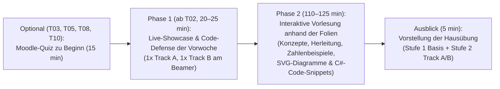
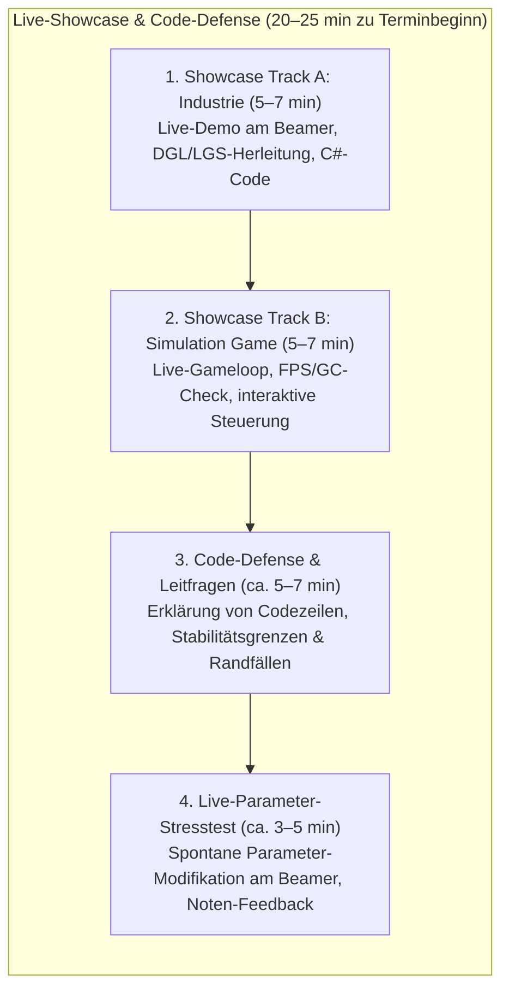
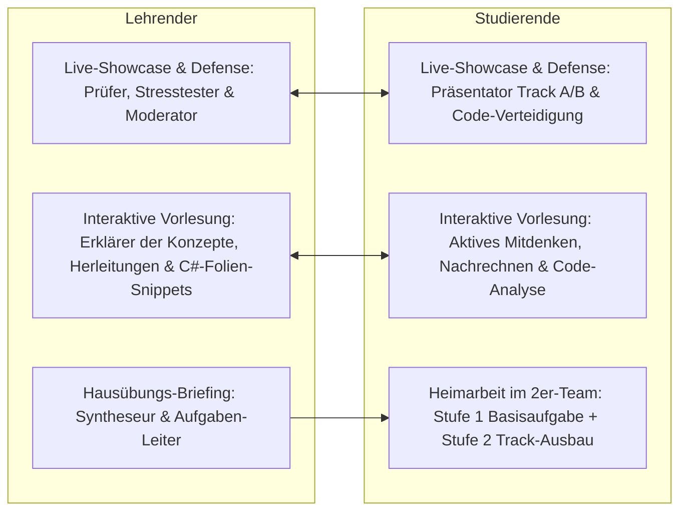
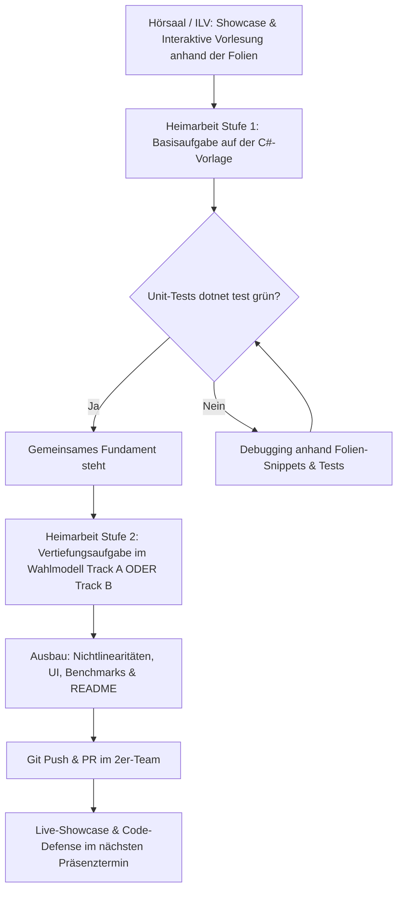
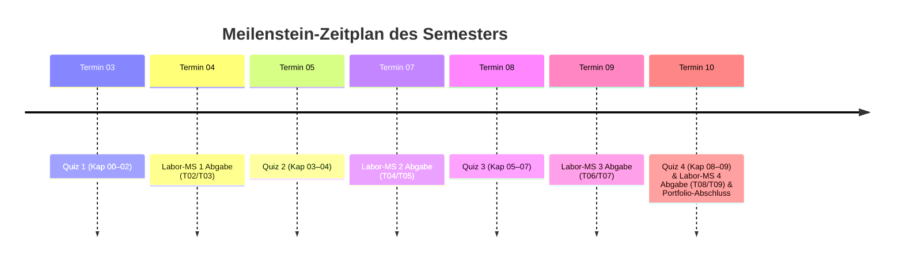

# Didaktisches Gesamtkonzept & Semester-Syllabus
## Lehrveranstaltung: Systemsimulation / Digitaler Zwilling

**Dokument-ID:** `Konzept/01_Lehrveranstaltungsstruktur_und_Syllabus.md`  
**Studiengang:** Bachelor Automatisierungstechnik (5. / 6. Fachsemester)  
**Institution:** Fachhochschule Oberösterreich, Campus Wels  
**Verantwortlicher:** Dr. Georg Hackenberg, Professor für Informatik und Industriesysteme  
**Lehrveranstaltungstyp:** Integrierte Lehrveranstaltung (ILV)  
**Umfang:** 2 SWS / 3 ECTS (Workload: 75 Stunden, davon 25 h Präsenz und 50 h Selbststudium / Heimarbeit)  
**Struktur:** 10 Präsenztermine à 150 Minuten (2,5 Zeitstunden)  
**Materialbasis:** 12 Vorlesungskapitel des Repositories (`Folien/00_Prolog` bis `Folien/11_Epilog`)  
**Status:** Freigegebenes Referenzkonzept für die Lehre (Harmonisiert mit Aufgabenkatalog und 2-Säulen-Assessment)  

---

## Inhaltsverzeichnis

1. [Ausgangslage, Zielgruppe & Rahmenbedingungen](#1-ausgangslage-zielgruppe--rahmenbedingungen)
   - 1.1 Institutioneller Kontext & Zielgruppenprofil (Campus Wels)
   - 1.2 Charakteristik des Formats ILV (Integrierte Lehrveranstaltung)
   - 1.3 Workload-Kalkulation nach ECTS-Richtlinien
2. [Didaktische Leitphilosophie & Methoden](#2-didaktische-leitphilosophie--methoden)
   - 2.1 Constructive Alignment nach Biggs
   - 2.2 Active Learning & Interaktive Folien-Vorlesung
   - 2.3 Scaffolding: Zweistufige Hausübung (Stufe 1 Basisaufgabe ➔ Stufe 2 Track-Erweiterung)
   - 2.4 Modernes Software-Engineering: Pair Programming & Vibe Coding mit KI-Unterstützung
   - 2.5 Gezielte Online-Recherche & Information Retrieval im Ingenieurstudium
   - 2.6 Themen-Duo & Wahlmodell: „Pick your Track – Industrie vs. Gaming“
   - 2.7 Das Prinzip der strikten chronologischen Kausalität
3. [Mapping der 12 Kapitel auf 10 Präsenztermine](#3-mapping-der-12-kapitel-auf-10-präsenztermine)
   - 3.1 Semester-Übersichtsmatrix (Kausalität, Werkzeuge, Wahlmodell & Assessments)
   - 3.2 Detaillierte Steckbriefe der Termine T01 bis T10
4. [Ablaufstruktur eines 150-Minuten-Präsenztermins](#4-ablaufstruktur-eines-150-minuten-präsenztermins)
   - 4.1 Die Präsenz-Taktung (Showcase, Quiz & Interaktive Vorlesung)
   - 4.2 Showcase, Peer Review & Plenumsdiskussion im Detail
   - 4.3 Rollenprofile von Lehrendem und Studierenden
   - 4.4 Umgang mit Heterogenität: Differenzierung & Fast-Track Challenges
5. [Didaktische Verzahnung von Präsenzzeit und Heimarbeit](#5-didaktische-verzahnung-von-präsenzzeit-und-heimarbeit)
   - 5.1 Nahtloser Übergang: Interaktive Vorlesung ➔ Zweistufige Hausübung (Stufe 1 & 2)
   - 5.2 Kollaborationsmodell: 2er-Teams, Pair Programming & Git-Workflow
   - 5.3 Leitfaden für "Vibe Coding" & KI-Engineering (Copilots als Junior-Entwickler)
6. [Meilenstein-Plan & 2-Säulen-Assessment-Architektur (Variante 1)](#6-meilenstein-plan--2-säulen-assessment-architektur-variante-1)
   - 6.1 Das 10-teilige C#-Simulations-Portfolio als Leistungsnachweis
   - 6.2 Die 2-Säulen-Assessment-Architektur (40 % Theorie / 60 % Praxis & Diskurs)
   - 6.3 Notenschlüssel & Mindestanforderungen nach FH OÖ Standard
7. [Checkliste für Dozierende zur Semestervorbereitung](#7-checkliste-für-dozierende-zur-semestervorbereitung)

---

## 1. Ausgangslage, Zielgruppe & Rahmenbedingungen

### 1.1 Institutioneller Kontext & Zielgruppenprofil (Campus Wels)

Der Bachelorstudiengang **Automatisierungstechnik** an der FH Oberösterreich (Campus Wels) bildet Ingenieurinnen und Ingenieure an der Schnittstelle von Maschinenbau, Elektrotechnik, Regelungstechnik und angewandter Informatik aus. Die Studierenden belegen die Lehrveranstaltung *Systemsimulation / Digitaler Zwilling* typischerweise im **5. Fachsemester**.

#### Vorwissen der Studierenden:
- **Mathematisch-Naturwissenschaftlich (Fundiert):** Höhere Mathematik (Analysis, Lineare Algebra, Differentialgleichungen) sowie Technische Mechanik (Statik, Elastostatik, Kinetik, Dynamik).
- **Automatisierungs- & Regelungstechnik (Sehr gut):** Zustandsraumdarstellung, Übertragungsfunktionen, PID-Regler, Frequenzgangverfahren (Bode, Nyquist), SPS-Programmierung nach IEC 61131-3 (ST, KOP, FUP).
- **Informatik & Programmierung (Solide Grundlagen, heterogene Praxis):** Beherrschung von Grundlagen in C/C++ oder C# (Klassen, Kontrollstrukturen, elementare Algorithmen). Typischerweise bestehen jedoch Lücken in hardwarenaher Speicherverwaltung (`unsafe`, Zeigerarithmetik, Speicherausrichtung), modernen UI-Architekturen (WPF, MVVM, Grafik-Pipelines), fortgeschrittener Nebenläufigkeit (Task Parallel Library, Thread-Synchronisation) und 3D-Computergrafik.

#### Berufsfeldbezug:
Angehende Automatisierer nutzen Simulationen nicht als theoretischen Selbstzweck, sondern als operatives Werkzeug für:
- die **Virtuelle Inbetriebnahme (VIBN)** von Maschinen und Sondierungsanlagen vor dem physischen Aufbau,
- den Entwurf und die parametergenaue Vorinbetriebnahme von **Regelkreisen (Closed-Loop)** unter Berücksichtigung von Nichtlinearitäten und Aktor-Sättigungen,
- das modellbasierte **Condition Monitoring** und Predictive Maintenance im laufenden Leitstand.

### 1.2 Charakteristik des Formats ILV (Integrierte Lehrveranstaltung)

Das an österreichischen Fachhochschulen etablierte Format der **Integrierten Lehrveranstaltung (ILV)** verzahnt theoretisch-mathematische Herleitung, Code-Architektur-Analyse und studentischen Fachdiskurs in einem gemeinsamen Präsenzformat:
- **Einheitlicher Raum:** Der Unterricht findet in multimedial ausgestatteten Hörsälen oder Seminarräumen statt.
- **Fokussierte Präsenzzeit (150 min ohne Live-Coding / ohne In-Class-Programmierphase):** Die Präsenzzeit widmet sich vollständig dem **Live-Showcase & Code-Defense** der Hausübung der Vorwoche (ab T02, ca. 20–25 min), an 4 Terminen zu Beginn dem **Moodle-Quiz** (15 min) sowie der **interaktiven Vorlesung anhand der Folien** (110–125 min: Konzepte, mathematische Herleitungen, konkrete Zahlenbeispiele, SVG-Diagramme und detaillierte Besprechung der abgedruckten C#-Code-Snippets auf den Folien). In der Präsenzveranstaltung findet **kein Live-Coding durch den Dozenten** und **keine In-Class-Programmierphase im Hörsaal** statt.
- **Zweistufige Hausübung im 2er-Team (zu Hause):** Die gesamte praktische Programmierarbeit (Stufe 1 Basisaufgabe auf der C#-Projektvorlage + Stufe 2 Ausbau-Aufgabe im Wahlmodell Track A oder Track B) erfolgt als wöchentliche Hausübung im 2er-Team.
- **Prüfungsimmanenter Charakter:** Es gibt keine isolierte Abschluss-Schriftklausur; die Gesamtnote speist sich aus kontinuierlichen Teilleistungen (4 Moodle-Tests à 10 %, 10-teiliges C#-Simulations-Portfolio à 4 % sowie Live-Showcases & Code-Defenses mit 20 %).

### 1.3 Workload-Kalkulation nach ECTS-Richtlinien

Die Lehrveranstaltung ist mit **3 ECTS-Punkten** (entsprechend einem Gesamt-Workload von **75 Arbeitsstunden** à 60 Minuten) dotiert:

| Kategorie | Aktivität | Zeitaufwand (h) | Anteil (%) |
| :--- | :--- | :---: | :---: |
| **Präsenzlehre (ILV)** | 10 Termine à 150 Minuten (Showcase & Peer Review, 4 Moodle-Quizzes sowie interaktive Vorlesung anhand der Folien) | **25,0 h** | 33,3 % |
| **Vor- & Nachbereitung** | Vorbereitung der Termine, Studium von Skriptum, Notizen & Online-Dokus | **6,0 h** | 8,0 % |
| **Wöchentliche Hausübungen & C#-Code-Portfolio** | 10 Aufgabenblätter im 2er-Team zu Hause (Stufe 1 Basisaufgabe ~1 h + Stufe 2 Track-Ausbau ~2,6 h pro Woche) | **36,0 h** | 48,0 % |
| **Moodle-Assessments** | 4 summative Moodle-Tests (Vorbereitung & Nacharbeit) | **8,0 h** | 10,7 % |
| **Gesamtsumme** | **1 ECTS = 25 Echtstunden** | **75,0 h** | **100,0 %** |

> [!IMPORTANT]
> **Verbindliche Verankerung von Live-Showcase & Code-Defense im Workload:**  
> Das **Präsentieren der eigenen Lösung auf der Beamer-Bühne (Live-Showcase im Rotationsprinzip)** inklusive **mündlicher Code-Erklärung ("Warum genau diese Zeile?") und Live-Parameter-Stresstest (Code-Defense)** ist ein verbindlicher, prüfungsrelevanter Bestandteil der Lehrveranstaltung (Säule 2b, 20 %).

---

## 2. Didaktische Leitphilosophie & Methoden

### 2.1 Constructive Alignment nach Biggs

Das Curriculum folgt dem Prinzip des **Constructive Alignment** (John Biggs):
1. **Intended Learning Outcomes (ILOs):** Die Studierenden können physikalisch-technische Systeme als mathematische Modelle formulieren, numerische Algorithmen (LGS, ODE, DES, Hybride Solver) in modernem C# (.NET 8) ohne vorgefertigte Blackbox-Simulatoren implementieren, echtzeitfähige 2D/3D-Dashboards realisieren und Simulationslösungen in der Code-Defense kritisch analysieren und verteidigen.
2. **Teaching/Learning Activities (TLAs):** **Live-Showcase & Code-Defense (Track A vs. Track B)** ➔ **Interaktive Vorlesung anhand der Folien (Konzepte, Mathematik, Zahlenbeispiele, SVG-Diagramme & Besprechung der C#-Code-Snippets)** ➔ **Zweistufige Hausübung im 2er-Team zu Hause (Stufe 1 Basisaufgabe mit Unit-Tests + Stufe 2 Track-Erweiterung)**.
3. **Assessment Tasks (ATs):** Moodle-Tests (40 %) prüfen das theoretische und numerische Fundament; das 10-teilige C#-Simulations-Portfolio (40 %) verlangt die ganzheitliche Synthese, Code-Qualität und automatisierte Validierung; **Live-Showcase & Code-Defense am Beamer (20 %)** fordern und bewerten sauberen Code, mündliche Auskunftsfähigkeit sowie das Bestehen von Live-Parameter-Stresstests.

### 2.2 Active Learning & Interaktive Folien-Vorlesung

Reiner Monolog-Unterricht über 150 Minuten führt bei technisch komplexen Themen nachweislich zu Ermüdung. Deshalb kombiniert die Präsenzveranstaltung Plenumsdiskurs und einen klar strukturierten **3-Schritt-Rhythmus auf den Vorlesungsfolien** (110–125 min):
- **Kein Live-Coding & kein In-Class-Sprint im Hörsaal:** Um die anspruchsvollen mathematisch-numerischen Grundlagen und die Softwarearchitektur ohne Zeitverlust durch Tippfehler oder lokale IDE-Probleme tiefgründig zu durchdringen, wird in der Vorlesung nicht live programmiert.
- **3-Schritt-Rhythmus jeder Vorlesungssektion:** Jedes Teilthema auf den Folien folgt dem Dreiklang *1. Anwendungsbeispiel (Motivation & Engpass)* $\to$ *2. Blick unter die Haube (Mathematik, Herleitung & konkretes Zahlenbeispiel)* $\to$ *3. Der C#-Code (Zeilenweise Besprechung der abgedruckten C#-Code-Snippets und typischer Fallstricke wie Zeigerarithmetik, numerische Instabilitäten oder Race Conditions)*.
- **Unmittelbare Anknüpfung in der Hausübung:** Am Ende jedes Vorlesungskapitels leitet die Ausblick-Folie direkt in die bereitgestellte C#-Projektvorlage (`Vorlage/...sln`) der zweistufigen Hausübung über.

### 2.3 Scaffolding: Zweistufige Hausübung (Stufe 1 Basisaufgabe ➔ Stufe 2 Track-Erweiterung)

Studierende beginnen die wöchentliche Hausübung zu Hause niemals auf einem „leeren weißen Blatt“, sondern durchlaufen im 2er-Team zwei klar aufeinander aufbauende Stufen:
- **Stufe 1 – Basisaufgabe (Gemeinsames Fundament zu Hause, Richtwert ca. 60 min):** Alle Teams starten zu Hause in der bereitgestellten C#-Projektvorlage (`Vorlage/...sln`) inklusive vorbereiteter MSTest-Unit-Tests (`dotnet test`). Sie lösen 3–4 präzise geführte Basisaufgaben, um die Kernmechanik der aktuellen Vorlesung am lauffähigen Code zu verankern und alle Unit-Tests auf Grün zu bringen. Das Ergebnis von Stufe 1 bildet das **direkte technische Fundament für beide Tracks in Stufe 2**.
- **Stufe 2 – Ausbau-Aufgabe im Wahlmodell (Track A: Industrie ODER Track B: Game, Richtwert ca. 3–4 h zu Hause):** Aufbauend auf der funktionierenden Stufe-1-Lösung wählt das 2er-Team genau einen Track (Industrie oder Simulation Game) und baut das Modell zu Hause systematisch aus (z. B. Nichtlinearitäten, Normbemaßung, Performance-Tuning, interaktive Steuerung und Auswertung).

### 2.4 Modernes Software-Engineering: Pair Programming & Vibe Coding mit KI-Unterstützung

Im modernen industriellen Alltag programmieren Entwickler nicht isoliert und nutzen zunehmend KI-Assistenten (GitHub Copilot, Cursor, LLMs). Der Kurs integriert diese Praxis explizit:
- **Pair Programming im 2er-Team:** Rollenaufteilung in *Driver* (tippt Code, bedient die IDE) und *Navigator* (überwacht Architektur, prüft Randbedingungen, liest Formeln nach). Rollentausch alle 30 Minuten.
- **Kritisches "Vibe Coding" mit KI:** Der Einsatz von KI-Tools ist ausdrücklich gestattet und wird gefördert – jedoch unter der **strengen Ingenieurs-Doktrin**: *Verstehe und verifiziere jede Zeile Code*. KI-generierter Code muss durch automatisierte MSTest-Unit-Tests und physikalische Plausibilitätsprüfungen abgesichert werden. Wer Code abgibt, haftet in der mündlichen Verteidigung ("Micro-Defense") dafür!

### 2.5 Gezielte Online-Recherche & Information Retrieval im Ingenieurstudium

Das selbstständige Lösen mechatronischer Programmieraufgaben erfordert professionelle Recherchekompetenz. Studierende müssen lernen, nicht beliebig Forenbeiträge zu kopieren, sondern belastbare Primärquellen zu konsultieren:

1. **Nutzung offizieller Dokumentationen & API-Referenzen:**
   - **Microsoft Learn (.NET / C# / WPF):** Für hardwarenahe Speicherverwaltung (`fixed`, `unsafe`, `Span<T>`), WPF-Rendering-Architektur (`DrawingVisual`, `WriteableBitmap`) und Nebenläufigkeit (`Parallel.For`, `CancellationTokenSource`).
   - **ScottPlot 5 Dokumentation & Cookbook (`scottplot.net/cookbook/5.0`):** Gezielte Suche nach Streaming-Mustern (`SignalSource`, `CircularBuffer`). *Achtung vor veralteten v4-Syntaxbeispielen im Web!*
   - **SharpGL & Khronos OpenGL 3.3 Reference:** Schnelles Nachschlagen von OpenGL-State-Befehlen (`glMatrixMode`, `glEnable(GL_DEPTH_TEST)`).
   - **Math.NET Numerics Documentation (`numerics.mathdotnet.com`):** API für Cholesky-Zerlegung (`Cholesky()`), Matrix-Assemblierung und Konditionszahlen.

2. **Gezielte Keyword-Strategie & Boolesche Suche:**
   - Professionelle Suchanfragen nutzen englische Fachbegriffe: Statt *"wie rechne ich runge kutta in c#"* sucht der Ingenieur gezielt nach:
     `"Runge-Kutta 4 C# implementation ODE"`, `"Von Neumann stability diffusion 2D C#"`, `"bisection zero crossing root finding simulation"`, `"Welford one-pass variance streaming algorithm"`.
   - Ausschluss von irrelevantem Ballast durch Boolesche Operatoren: z. B. `"ScottPlot 5" "WpfPlot" -winforms -v4`.

3. **GitHub Code Search & Repository-Exploration:**
   - Auffinden erprobter Implementierungsmuster via GitHub Search mit Syntax-Filtern:
     `path:*.cs "WriteableBitmap" "BackBuffer" language:C#` oder `repo:ScottPlot/ScottPlot "Signal"`
   - Open-Source-Referenzen studieren, um Garbage-Collection-Vermeidung und performantes Caching zu verstehen.

4. **Kritische Plausibilisierung gefundener Snippets („Don't Paste Without Proof“):**
   - **GC-Prüfung:** Werden in Simulationsschleifen heimlich `new`-Allokationen versteckt?
   - **Thread-Sicherheit:** Wird unerlaubt aus Worker-Threads auf UI-Elemente zugegriffen?
   - **Einheiten-Konsistenz:** Rechnet der gefundene Code in Radiant oder Grad, in SI-Einheiten oder empirischen US-Units?

### 2.6 Themen-Duo & Wahlmodell: „Pick your Track – Industrie vs. Gaming“

Ein wesentliches didaktisches Prinzip dieser Lehrveranstaltung ist das **duale Aufgaben- und Motivationskonzept**:
- **Track A: Ernsthafter Industriealltag (Ingenieurtechnische Säule):** Simulation realer industrieller Anlagen (Halbleiter-Kühlkörper, Hallenkräne, DC-Antriebsprüfstände, Taktstraßen-Logistik, Virtuelle Inbetriebnahme). Sie vermittelt Normgerechtheit, SI-Einheiten, Fertigungstoleranzen und industrielle Relevanz für angehende Automatisierungsingenieure.
- **Track B: Simulationsspiele & Arcade-Physik (Spielerische Säule):** Gameloops, Arcade-Physik, Partikelsysteme und interaktive Spielmechaniken (Artillery-Wurfspiele, Sand-/Lava-Pixelwelten, 2D-Brückenbau à la Poly Bridge, Raketen-Balancer, Flipper-Kollisionen). Sie bietet sofortiges visuelles Feedback, macht Spaß, belohnt spielerisches Experimentieren und fördert die Intuition für dynamische Zusammenhänge.

> [!IMPORTANT]
> **Das verbindliche Wahlmodell („Pick your Track: Industrie vs. Gaming“):**  
> Die Studierenden müssen **NICHT** beide Aufgaben bearbeiten!  
> - Jedes 2er-Team wählt pro Termin bzw. Meilenstein **GENAU EINE** der beiden Aufgaben: **Track A (Industrie)** ODER **Track B (Game)**.  
> - **Identischer Workload & identische Lernergebnisse:** Beide Tracks basieren auf exakt denselben mathematischen Grundlagen, numerischen Algorithmen und C#-Softwarearchitekturen (z. B. FDM-Diffusionsmatrix bei Kühlkörper vs. Lavafeld; Math.NET-Cholesky-LGS bei Portalkran vs. einstürzender Brücke; RK4 bei DC-Motor vs. Raketenlandung).  
> - Beide Tracks führen zu denselben Intended Learning Outcomes (ILOs) und werden nach exakt derselben Bewertungsrubrik beurteilt.  
> - Teams dürfen ihren Track je nach persönlicher Motivation pro Termin neu wählen oder das Semester über in einer Schiene bleiben.

#### Didaktischer Brückenschlag im Showcase:
Obwohl die Teams pro Termin nur einen der beiden Tracks aktiv implementieren, verhindert das Konzept eine fachliche Silobildung: In der **Showcase- und Diskussionsphase (Phase 3)** präsentiert an jedem Termin ein Team aus Track A und ein Team aus Track B seine Lösung live am Beamer. Dadurch profitiert das gesamte Plenum von beiden Perspektiven: Industrie-Teams erkennen, wie Gameloops und interaktive Physik dieselben Differentialgleichungen nutzen, während Gaming-Teams den industriellen Bezug (Toleranzen, Normen, Reglergrenzen) verinnerlichen.

### 2.7 Das Prinzip der strikten chronologischen Kausalität

Um Frustration und Wissenslücken zu verhindern, unterliegt das gesamte Curriculum einer **strengen chronologischen Kausalitätskette**:
- **Kein Vorgreifen:** Jede Vorlesungseinheit und jede zweistufige Hausübung (Stufe 1 & Stufe 2) darf **ausschließlich** jene Bibliotheken, Sprachkonstrukte und numerischen Verfahren voraussetzen, die bis zu diesem Zeitpunkt formal in den Vorlesungsfolien eingeführt wurden.
- **Konkrete Grenzziehungen:**
  - *Vor Termin 04:* **Kein ScottPlot!** Diagramme werden davor entweder auf der Konsole tabellarisch ausgegeben oder elementar in Canvas/Pixel gezeichnet.
  - *Vor Termin 05:* **Kein SharpGL / 3D!** Bis dahin bewegen wir uns ausschließlich im 2D-Raum.
  - *Vor Termin 06:* **Kein `Parallel.For` oder Multithreading!** Alle Berechnungen laufen bis dahin strikt deterministisch auf einem Thread.
  - *Vor Termin 07:* **Keine Steifigkeitsmatrizen, kein Math.NET Cholesky, KEINE FEM-Statik-Berechnung!**  
    In **Termin 03 (Kapitel 03)** ist die Modellierung **rein geometrisch und visuell** (WPF Canvas, affine Welt-zu-Screen-Transformation, Bounding Box, DIN-Bemaßung, Vektorpfeile für fest vorgegebene Kräfte, interaktives Dragging von Geometriepunkten per Maus). In Termin 03 wird **keine Fachwerk-Statik berechnet**, **kein Gleichungssystem gelöst** und **kein Cholesky verwendet** – alle Kraftwerte sind fest vorgegeben!  
    Erst in **Termin 07 (Kapitel 07)** wird die echte **FEM-Statik-Engine** (Math.NET Numerics, Steifigkeitsmatrix $\mathbf{K}$, Cholesky-Zerlegung) gebaut und erweckt das geometrische Modell aus Termin 03 zum Leben (Knotenverschiebung $\mathbf{u} = \mathbf{K}^{-1} \mathbf{f}$, elastische Stabverformung, Überlastungsanzeige und Stabbruch).
  - *Vor Termin 08:* **Keine S-Functions und keine ODE-Solver höherer Ordnung (RK4)!** Bis dahin wird der explizite Euler-Schritt 1. Ordnung bzw. das Heun-Verfahren (RK2) verwendet.
  - *Vor Termin 09:* **Keine diskreten Ereigniswarteschlangen (DES) und kein Box-Muller-Zufall!**
  - *Vor Termin 10:* **Keine Bisektion-Zero-Crossing-Detektion und keine FMI/FMU Co-Simulation!**

---

## 3. Mapping der 12 Kapitel auf 10 Präsenztermine

Die 12 Kapitel des Repositories (`00_Prolog` bis `11_Epilog`) gliedern sich in zwei Kernachsen: **Visualisierungs- & Systemwerkzeuge (Kapitel 2–6)** sowie **Physikalische Modellklassen & Simulation (Kapitel 7–10)**, eingefasst durch Grundlagen (00/01) und Gesamtsynthese (11).

Zur Abbildung auf 10 Präsenztermine à 150 Minuten werden Prolog und Einführung (T01) sowie Hybride Dynamik und VIBN-Epilog (T10) zusammengeführt.

### 3.1 Semester-Übersichtsmatrix (Kausalität, Werkzeuge, Wahlmodell & Assessments)

> [!NOTE]
> **Wahlmodell („Pick your Track: Industrie vs. Gaming“):**  
> Die Studierenden müssen **NICHT** beide Aufgaben bearbeiten! Jedes 2er-Team wählt pro Termin **GENAU EINE** der beiden Aufgaben (**Track A: Industrie ODER Track B: Game**). Beide Tracks führen zu denselben intendierten Lernergebnissen (ILOs), nutzen identische mathematisch-numerische Werkzeuge und erfordern denselben Arbeitsaufwand.

| Termin | Thema & Fokus | Kapitel im Repo | Vorkenntnisse (Kausaler Stand) | Eingeführte Werkzeuge & Pakete | Track A: Industrie-Szenario *(Wahl: A ODER B)* | Track B: Arcade- / Gaming-Pendant *(Wahl: A ODER B)* | Assessments & Meilensteine |
| :---: | :--- | :---: | :--- | :--- | :--- | :--- | :--- |
| **T01** | **Einführung & Modellbegriff** | `00_Prolog`<br>`01_Einführung` | C#-Grundlagen, Schulmathematik | .NET 8 SDK, Console, MSTest, Git, Euler & Heun (RK2) | Hydraulikzylinder-Dämpfung (Not-Stopp mit Blendenreibung) | **Artillery Strike / Retro Tanks:** 2D-Ballistik mit Luftwiderstand & Wind | Setup-Check, Teambildung |
| **T02** | **2D-Pixelgrafik & FDM-Feld** | `02_Visualisierung_2D_Pixel` | C#-Arrays, Konsole, Euler 1. Ord. | WPF `Image`, `WriteableBitmap`, `unsafe` Pointer, Stride | CPU-/PCB-Kühlkörper-Hotspot (Wärmeableitung mit Robin-Rand) | **Falling Sand & Doom Fire:** Interaktive Lava-/Sand-Pixelwelt | **Labor-MS 1 Ausgabe** (2D-Simulation) |
| **T03** | **2D-Vektorgrafik & Transformation**<br>*(Rein geometrisch & visuell)* | `03_Visualisierung_2D_Vektor` | WPF-Basics, `WriteableBitmap`, Vektorgeometrie | WPF `Canvas`, `DrawingVisual`, Uniform Scaling, BoundingBox | **2D-CAD Tragwerks-Inspektor:** Zweistufige DIN-406-Bemaßung, Lastpfeilspitzen-Dragging, Zoom/Pan & JSON *(keine Statik!)* | **„Poly Bridge“ Blueprint-Baumeister:** Schlucht-Szenerie, $0{,}5\,\text{m}$-Grid-Snapping, $L_{\max}$-Vorschau, Live-Baubudget & JSON *(Statik erst in T07!)* | **Moodle-Test 1** (Kap 00–02)<br>Vorbereitung Labor-MS 1 |
| **T04** | **Echtzeit-Telemetrie & Graphen** | `04_Visualisierung_2D_Diagramme` | WPF Canvas, Pixel, Vektoren | **ScottPlot 5**, `CircularBuffer`, MVVM Toolkit, **MSAGL** | Industrie-4.0-Leitstand: 1-kHz-Vibrationsmonitoring & Welford-Statistik | **Retro Arcade Racing Telemetry:** Live-G-Kräfte, RPM-Plot & MSAGL-Streckengraph | **Labor-MS 1 Abgabe** (T02/T03) |
| **T05** | **3D-OpenGL & Szenengraphen** | `05_Visualisierung_3D_OpenGL` | WPF MVVM, ScottPlot 5, Canvas | **SharpGL.WPF**, OrbitCamera, Transformations-Hierarchie | 4-Achs-SCARA-Roboterarm (Vorwärtskinematik & 3D-Szenengraph) | **3D Arcade Claw Crane:** Jahrmarkt-Greifautomat mit Box-Kollision | **Moodle-Test 2** (Kap 03–04)<br>**Labor-MS 2 Ausgabe** |
| **T06** | **Multithreading & TPL** | `06_Multithreading` | 3D-OpenGL, ScottPlot 5, WPF | **Task Parallel Library (TPL)**, `Parallel.For`, `IProgress<T>` | Parallele Monte-Carlo-Toleranzanalyse mit Amdahl-Fit | **100.000 Boids / Zombie-Horde:** Hochparalleler Schwarm-Benchmark | Vorbereitung Labor-MS 3 |
| **T07** | **Statische Systeme & Cholesky**<br>*(Erweckt T03 zum Leben)* | `07_Statische_Modelle` | TPL Multithreading, 2D/3D-Grafik | **Math.NET Numerics**, FEM-Steifigkeitsmatrix $\mathbf{K}$, Cholesky | FEM-Verformung schwerer Portalkran-Fachwerke *(erweckt T03-Geometrie mit echter Cholesky-Statik)* | **Bridge Constructor Physics Engine:** Einsturz & Stabbruch durch echte Math.NET-Cholesky-LGS-Lösung | **Labor-MS 2 Abgabe** (T04/T05)<br>**Labor-MS 3 Ausgabe** |
| **T08** | **Kontinuierliche Dynamik & ODEs** | `08_Dynamische_Modelle_Kontinuierlich` | Math.NET, TPL, ScottPlot 5 | **S-Functions**, **RK4**, Anti-Windup Clamping | Geregelter DC-Servomotor mit Strombegrenzung & Anti-Windup | **SpaceX Falcon Hop / Booster Landing:** Raketen-Vertikallandung mit Schubvektorregelung | **Moodle-Test 3** (Kap 05–07) |
| **T09** | **Diskrete Systeme & Monte-Carlo** | `09_Dynamische_Modelle_Diskret` | RK4 Solver, S-Functions, TPL | `PriorityQueue`, Inversionsmethode, **Little's Gesetz** | Automobil-Lackierstraße ($M/M/c/K$-Warteschlange & Pufferoptimierung) | **Theme Park Rush / Rollercoaster Queue:** Freizeitpark mit Fastpass-Prioritäten | **Labor-MS 3 Abgabe** (T06/T07)<br>**Labor-MS 4 Ausgabe** |
| **T10** | **Hybride Dynamik, VIBN & Synthese** | `10_Dynamische_Modelle_Hybrid`<br>`11_Epilog` | Vollständiger Kurs-Stack | **Zero-Crossing Bisektion**, Sticking-Schwelle, FMI/FMU, VIBN | VIBN eines Pneumatikzylinders mit Endanschlägen & SPS-Kopplung | **Arcade Pinball Wizard:** Flipper-Physik mit Bumper-Bisektion ohne Tunneling | **Moodle-Test 4** (Kap 08–09)<br>**Labor-MS 4 Abgabe** (T08/T09)<br>**Semester-Portfolio-Abschluss** |

---

### 3.2 Detaillierte Steckbriefe der Termine T01 bis T10

---

#### Termin T01: Einführung, Modellbegriff & Digitaler Zwilling
- **Kapitel:** [00_Prolog](../Folien/00_Prolog/Folien.md) & [01_Einführung](../Folien/01_Einführung/Folien.md)
- **Kausale Vorkenntnisse (Tabu-Grenze):**
  - *Erlaubt:* C#-Grundlagen (Datentypen, Klassen, Schleifen, Methoden), `System.Math`, analytische Formeln, elementares Differenzenverfahren (expliziter Euler 1. Ordnung) sowie Prädiktor-Korrektor (Heun / RK2).
  - *Strikte Tabus:* **Kein WPF, kein ScottPlot, kein Multithreading, kein RK4!**
- **Verwendete Werkzeuge & Pakete:**
  - .NET 8 SDK, Visual Studio 2022 / VS Code, C#-Konsolenapplikation, MSTest-Projekt, Git. *Keine externen NuGet-Grafikpakete.*
- **Lernziele (Bloom):**
  - *Verstehen:* Taxonomie technischer Modelle (statisch vs. dynamisch, kontinuierlich vs. diskret) und Grieves-Zwillingskonzept.
  - *Anwenden:* Einen expliziten Euler-Zeitschritt ($x_{k+1} = x_k + \Delta t \cdot v_k$) sowie das Heun-Verfahren (RK2) mit linearer Auftreff-Interpolation in C# implementieren.
  - *Evaluieren:* Den numerischen Diskretisierungsfehler gegenüber der geschlossenen analytischen Lösung im Unit Test quantifizieren.
- **Themen-Duo – Wahlmodell „Pick your Track“ (Track A ODER Track B):**
  > *Hinweis zum Wahlmodell:* Jedes 2er-Team wählt **GENAU EINE** der beiden Aufgaben (Track A: Industrie **ODER** Track B: Game). Studierende müssen **NICHT** beide Aufgaben bearbeiten! Beide Tracks führen zu denselben Lernergebnissen und erfordern denselben Arbeitsaufwand.
  - *Track A (Industrie):* **„Hydraulikzylinder-Dämpfung“:** Not-Stopp eines Schwerlast-Hydraulikzylinders mit nichtlinearer Blendenreibung, Parameterstudie und Vergleich zwischen explizitem Euler und Heun-Verfahren (RK2).
  - *Track B (Gaming / Arcade):* **„Artillery Strike / Retro Tanks“:** 2D-Ballistik unter Gravitation, quadratischem Newton-Luftwiderstand und Windböen mit exakter linearer Bodenkollisions-Interpolation.
- **Interaktive Vorlesung anhand der Folien (ca. 135 min, kein Live-Coding):**
  - Das Modell nach George Box; Digital Model vs. Digital Shadow vs. Digital Twin.
  - Mathematische Herleitung: Vom Differenzenquotienten $\frac{dx}{dt} \approx \frac{x_{k+1}-x_k}{\Delta t}$ zum expliziten Euler-Schritt und Heun-Verfahren (RK2) inkl. konkreter Zahlenbeispiele und SVG-Trajektorien.
  - Detaillierte Besprechung der abgedruckten C#-Code-Snippets auf den Folien: Aufbau der Solution [`KinematikEuler.sln`](../Uebungen/Termin_01_Kinematik_und_Euler/Vorlage/KinematikEuler.sln), Trennung von Modell (`ProjectileModel`), Integrator (`EulerIntegrator`) und automatisierten MSTests (`KinematikTests`).
- **Zweistufige Hausübung im 2er-Team (zu Hause):**
  - **Stufe 1 – Basisaufgabe (Gemeinsames Fundament, ca. 60 min zu Hause):** Implementierung des expliziten Euler- und Heun-Schritts für den schiefen Wurf mit linearer Auftreff-Interpolation in der C#-Vorlage und Bestehen der automatisierten Unit-Tests (`dotnet test`).
  - **Stufe 2 – Ausbau-Aufgabe im Wahlmodell (Track A ODER Track B, ca. 3–4 h zu Hause):** Umsetzung von Track A (Hydraulikzylinder-Dämpfung) oder Track B (Artillery Strike / Retro Tanks) aufbauend auf Stufe 1.
- **Showcase & Peer Review (ab Folgetermin T02 zu Beginn, 20–25 min):**
  - *Showcase Track A (5–7 min):* 1x Team stellt die Hydraulikzylinder-Dämpfung (Euler vs. Heun) live am Beamer vor.
  - *Showcase Track B (5–7 min):* 1x Team führt das Artillery-Kanonenspiel im Terminal vor (Euler/Heun-Flugbahn unter Newton-Luftreibung).
  - *Peer Review & Plenumsdiskussion (ca. 10 min):* Gezielte Fachfragen aus dem Plenum: Warum überschätzt der explizite Euler beim Wurf die Wurfhöhe und landet um $\Delta t / 2$ zu spät?
  - *Dozenten-Feedback & Stresstest (ca. 5 min):* Spontane Verzehnfachung der Zeitschrittweite $\Delta t$ am Beamer ➔ Demonstration numerischer Überschwinger.
- **Online-Recherche-Tipp:**
  - *Suchstrategie:* Microsoft Learn C# CLI-Tools: `"dotnet new sln"`, `"dotnet test"`.
  - *Doku-Link:* [Microsoft Learn: .NET CLI-Übersicht](https://learn.microsoft.com/de-de/dotnet/core/tools/)
- **Synthese & Ausblick (15 min):**
  - Teambildung (feste 2er-Teams). Vorschau auf T02: Speicherlinearisierung von 2D-Pixelgrafik.

---

#### Termin T02: 2D-Pixelgrafik & Feldsimulation (Finite Differenzen)
- **Kapitel:** [02_Visualisierung_2D_Pixel](../Folien/02_Visualisierung_2D_Pixel/Folien.md)
- **Kausale Vorkenntnisse (Tabu-Grenze):**
  - *Erlaubt:* 2D-Arrays, Euler-Verfahren, Konsolen-Workflows aus T01.
  - *Neu eingeführt:* WPF `Image`, `WriteableBitmap`, `unsafe` Pointer, Stride, FDM 5-Punkt-Stern, Dirichlet-/Neumann-/Robin-Randbedingungen.
  - *Strikte Tabus:* **Kein `Parallel.For` (Multithreading erst in T06!), kein ScottPlot, kein 3D!**
- **Verwendete Werkzeuge & Pakete:**
  - .NET 8 Desktop SDK (WPF), `System.Windows.Media.Imaging.WriteableBitmap`. *Reines .NET BCL ohne Fremdbibliotheken.*
- **Lernziele (Bloom):**
  - *Verstehen:* Speicherlinearisierung (Row-Major, Stride-Padding) und `Bgr32`-Farbkanäle erklären.
  - *Anwenden:* Allokationsfreies Direct-Pixel-Writing via `WriteableBitmap.Lock()`, `BackBuffer` und Zeigerarithmetik (`unsafe uint*` / `byte*`) umsetzen.
  - *Erschaffen:* Eine 2D-Wärmeleitungssimulation (parabolische PDE) via FDM-5-Punkt-Stern unter Beachtung der Von-Neumann-Stabilitätsgrenze ($s \le 0{,}25$) programmieren.
- **Themen-Duo – Wahlmodell „Pick your Track“ (Track A ODER Track B):**
  > *Hinweis zum Wahlmodell:* Jedes 2er-Team wählt **GENAU EINE** der beiden Aufgaben (Track A: Industrie **ODER** Track B: Game). Es müssen **NICHT** beide bearbeitet werden!
  - *Track A (Industrie):* **„CPU-Kühlkörper-Optimierung“:** Thermischer Hotspot auf einem Mehrzonengitter (Silizium-Chip und Kupfer-Heatspreader) mit konvektiven Robin-Randbedingungen.
  - *Track B (Gaming / Arcade):* **„Falling Sand & Doom Fire / Lava“:** Interaktive zelluläre Pixel-Physik im Rohspeicher mit aufsteigender Glut und Maus-Zeichenfunktion.
- **Interaktive Vorlesung anhand der Folien (ca. 120–125 min, kein Live-Coding):**
  - Warum der WPF-Visual-Tree bei $100.000$ Elementen kollabiert.
  - Zeigerarithmetik in C#: `IntPtr`, `uint*`, Bit-Shifting `(r << 16) | (g << 8) | b`.
  - Mathematische Herleitung: Laplace-Operator $\Delta T = \frac{\partial^2 T}{\partial x^2} + \frac{\partial^2 T}{\partial y^2}$, 5-Punkt-Stern-Diskretisierung, Randbedingungen (Dirichlet, Neumann, Robin) und Stabilitätsbedingung $s = \frac{\alpha \cdot \Delta t}{\Delta x^2} \le 0{,}25$.
  - Besprechung der abgedruckten C#-Code-Snippets auf den Folien: Look-Up-Table (LUT) Farbtabellen-Generator (Kaltes Blau $\to$ Grün $\to$ Heißes Rot) und `WriteableBitmap`-Speicherzugriff.
- **Zweistufige Hausübung im 2er-Team (zu Hause):**
  - **Stufe 1 – Basisaufgabe (Gemeinsames Fundament, ca. 60 min zu Hause):** Erweiterung der Vorlage [`PixelHeatFDM.sln`](../Uebungen/Termin_02_Pixelgrafik_und_FDM/Vorlage/PixelHeatFDM.sln) um 256-Stufen-LUT, ortsabhängiges Materialgitter (`AlphaMap`) mit adiabaten Neumann-Isolatorwänden und interaktives Maus-Zeichnen (`dotnet test`).
  - **Stufe 2 – Ausbau-Aufgabe im Wahlmodell (Track A ODER Track B, ca. 3–4 h zu Hause):** CPU-Kühlkörper-Optimierung mit Robin-Rand (Track A) oder Falling Sand & Doom Fire / Lava-Simulator (Track B).
- **Live-Showcase & Code-Defense (20–25 min):**
  - *Showcase Track A (5–7 min):* 1x Team zeigt 2D-Temperaturfeldsimulation des CPU-Kühlkörpers mit `WriteableBitmap` und Farbverlauf.
  - *Showcase Track B (5–7 min):* 1x Team führt Falling-Sand- / Doom-Fire-Pixelwelt vor (Pointerarithmetik, allokationsfreie BackBuffer-Updates).
  - *Code-Defense & Leitfragen (ca. 5–7 min):* Code-Erklärung zu Speicherlinearisierung, Stride-Padding und Von-Neumann-Stabilitätsgrenze ($s = \frac{\alpha \cdot \Delta t}{\Delta x^2} \le 0{,}25$).
  - *Live-Parameter-Stresstest (ca. 3–5 min):* Erhöhung von $\Delta t$ auf $s = 0{,}28$ direkt im Code ➔ Demonstration der numerischen Gitterexplosion am Beamer.
- **Online-Recherche-Tipp:**
  - *Suchbegriffe:* `"WriteableBitmap Lock BackBuffer unsafe C#" site:learn.microsoft.com`, `"Von Neumann stability heat equation 2D"`.
  - *Doku-Link:* [Microsoft Learn: WriteableBitmap-Klasse](https://learn.microsoft.com/de-de/dotnet/api/system.windows.media.imaging.writeablebitmap)
- **Synthese & Ausblick (15 min):**
  - **Ausgabe Labor-Meilenstein 1 (Teil A, Wahl Track A oder Track B):** FDM-Kühlkörper-Simulation mit Robin-Randbedingungen ODER zelluläre Sand-/Lavasimulation.

---

#### Termin T03: 2D-Vektorgrafik & Koordinatentransformation (Rein geometrisch & visuell)
- **Kapitel:** [03_Visualisierung_2D_Vektor](../Folien/03_Visualisierung_2D_Vektor/Folien.md)
- **Kausale Vorkenntnisse (Tabu-Grenze):**
  - *Erlaubt:* Pixelgrafik aus T02, Elementargeometrie (Vektoren, Punkte, Strecken).
  - *Neu eingeführt:* WPF `Canvas`, affine Transformation (Welt $\to$ Screen), `DrawingVisual`, Uniform Scaling, BoundingBox, interaktives Dragging von Geometriepunkten per Maus.
  - *Strikte Tabus:* **REIN GEOMETRISCH & VISUELL! Keine Fachwerk-Statik, kein Gleichungssystem (LGS), kein Math.NET Cholesky (erst in T07!), kein ScottPlot, kein 3D!** Alle Kräfte und Lasten sind rein statische, fest vorgegebene Vektorwerte zur Visualisierung.
- **Verwendete Werkzeuge & Pakete:**
  - WPF Vektorgrafik (`Canvas`, `Line`, `Path`, `Polygon`, `DrawingVisual`, Maus-Events).
- **Lernziele (Bloom):**
  - *Verstehen:* Den mathematischen Zusammenhang zwischen Weltkoordinaten (kartesisches System, $+Y$ oben) und Bildschirmkoordinaten (Pixelraster, $+Y$ unten) bei verzerrungsfreier Skalierung (Bounding Box, Uniform Scaling) erklären.
  - *Anwenden:* Affine 2D-Koordinatentransformation in C#/WPF implementieren und Mausinteraktionen (Dragging von Knotenpunkten, Zoom & Pan) geometrisch umrechnen.
  - *Erschaffen:* Rein geometrische Vektordarstellungen (Stäbe als Linien, Knoten als Kreise, Kraftpfeile mit gedrehten Spitzen aus fest vorgegebenen Werten sowie DIN-gerechte Bemaßungslinien) im WPF `Canvas` rendern.
- **Themen-Duo – Wahlmodell „Pick your Track“ (Track A ODER Track B):**
  > *Hinweis zum Wahlmodell:* Jedes 2er-Team wählt **GENAU EINE** der beiden Aufgaben (Track A: Industrie **ODER** Track B: Game). Studierende müssen **NICHT** beide Aufgaben bearbeiten! Beide Tracks vermitteln dieselben geometrisch-visuellen Grundlagen bei identischem Arbeitsaufwand.
  - *Track A (Industrie):* **„2D-CAD Tragwerks-Inspektor & Last-Editor“:** Rein geometrische und maßstäbliche Visualisierung eines Trägerfachwerks auf dem WPF Canvas. Zweistufige DIN-406-Bemaßungsketten, interaktives Ziehen/Drehen der Kraftpfeilspitzen $(F_x, F_y)$, Mausrad-Zoom/Pan und JSON-Persistenz – *völlig ohne Statikberechnung*.
  - *Track B (Gaming / Arcade):* **„Poly Bridge Blueprint-Baumeister“:** Interaktives Brückenbau-Zeichenbrett über einer Schlucht mit $0{,}5\,\text{m}$-Grid-Snapping, Knoten-Setzen/Stäbe-Spannen/Löschen (`Entf`), Maximallängen-Vorschau ($L_{\max} = 4{,}0\,\text{m}$), Live-Baubudget-Balken und JSON-Level-Export *(echte Statikberechnung und Bruchtest folgen kausal erst in Termin 07!)*.
- **Interaktive Vorlesung anhand der Folien (ca. 110 min, kein Live-Coding):**
  - Mathematische Formulierung: Bounding-Box, Uniform-Scaling $s = \min(s_x, s_y)$, Translation und Zentrierungs-Offset.
  - Pfeilspitzen-Geometrie aus Richtungsvektor $\vec{u}$ und Rotationsformeln im Screen Space.
  - Interaktives Maus-Dragging: Hit-Testing, Erfassen von Knotenpunkten und inverse Screen-zu-Welt-Transformation.
  - Besprechung der abgedruckten C#-Code-Snippets auf den Folien: Implementierung der Klasse `Transform2D` und `VectorArrow` in [`VectorTrussCanvas.sln`](../Uebungen/Termin_03_Vektorgrafik_Canvas/Vorlage/VectorTrussCanvas.sln).
- **Zweistufige Hausübung im 2er-Team (zu Hause):**
  - **Stufe 1 – Basisaufgabe (Gemeinsames Fundament, ca. 60 min zu Hause):** Erweiterung der C#-Vorlage `VectorTrussCanvas.sln` um euklidische Stablängen, vertikale DIN-406-Bemaßung und Behebung des Bounding-Box-Jitterings beim Ziehen (`dotnet test`).
  - **Stufe 2 – Ausbau-Aufgabe im Wahlmodell (Track A ODER Track B, ca. 3–4 h zu Hause):** 2D-CAD Tragwerks-Inspektor (Track A) oder Poly Bridge Blueprint-Baumeister (Track B).
- **Moodle-Test 1 & Showcase im Plenum (35–40 min zu Beginn):**
  - *Moodle-Test 1 (15 min zu Beginn):* Grundlagen Systemsimulation, Taxonomie, Pixel-Stride, FDM-Stabilität, 5-Punkt-Stern (Kapitel 00–02).
  - *Showcase & Plenums-Review (20–25 min):*
    - *Showcase Track A & Track B:* Präsentation der Vorwochen-Hausübung bzw. Diskussion des 2D-CAD Tragwerks-Inspektors und des Poly Bridge Blueprint-Baumeisters auf dem WPF `Canvas` (Uniform Scaling, Vektorpfeile, Grid-Snapping, Dragging).
    - *Peer Review & Dozenten-Stresstest:* Fachfragen zur Welt-zu-Screen-Transformation und extremem Seitenverhältnis (32:9 Ultrawide) – bleiben Geometrie und Pfeilspitzen formstabil?
- **Online-Recherche-Tipp:**
  - *Suchbegriffe:* `"WPF Canvas Zoom Pan MatrixTransform"`, `"DrawingVisual DrawGeometry vs Shape performance"`, `"WPF Canvas drag and drop shapes mouse coordinates"`.
  - *Doku-Link:* [Microsoft Learn: Übersicht über Zeichnungen mit DrawingVisual](https://learn.microsoft.com/de-de/dotnet/desktop/wpf/graphics-multimedia/using-drawingvisual-objects)
- **Synthese & Ausblick (15 min):**
  - **Vervollständigung Labor-Meilenstein 1 (fällig in T04):** Zusammenführung der 2D-Pixel- und 2D-Vektorvisualisierung.
  - *Kausaler Ausblick auf T07:* Erst in Termin 07 wird das rein geometrische Vektormodell durch die Math.NET-Cholesky-FEM-Engine mit echter Statik (elastische Dehnung, reale Knotenkräfte, Bruchtest) zum Leben erweckt.

---

#### Termin T04: Echtzeit-Telemetrie & Signalflussgraphen
- **Kapitel:** [04_Visualisierung_2D_Diagramme](../Folien/04_Visualisierung_2D_Diagramme/Folien.md)
- **Kausale Vorkenntnisse (Tabu-Grenze):**
  - *Erlaubt:* Pixel- und Vektorgrafik (T02/T03), C#-Grundlagen.
  - *Neu eingeführt:* **ScottPlot 5**, `RingBuffer<double>`, **Welford-Streaming-Statistik**, **MSAGL** Graph-Topologie.
  - *Strikte Tabus:* **Kein 3D/OpenGL (erst in T05!), kein Multithreading (erst in T06!), noch keine ODE-Solver höherer Ordnung (RK4)!**
- **Verwendete Werkzeuge & Pakete:**
  - NuGet: `ScottPlot.WPF` (v5.x), `AutomaticGraphLayout.WpfGraphControl`.
- **Lernziele (Bloom):**
  - *Verstehen:* Datenstrukturen für kontinuierliches Daten-Streaming (Ringpuffer) zur Vermeidung von GC-Lags sowie den numerisch stabilen Welford-Algorithmus erklären.
  - *Anwenden:* `ScottPlot 5` zur latenzfreien Darstellung von Signalverläufen und $\pm 3\sigma$-Toleranzbändern einbinden.
  - *Evaluieren:* Signalfluss- und Strecken-Topologien mittels Microsoft Automatic Graph Layout (`MSAGL`) anordnen.
- **Themen-Duo – Wahlmodell „Pick your Track“ (Track A ODER Track B):**
  > *Hinweis zum Wahlmodell:* Jedes 2er-Team wählt **GENAU EINE** der beiden Aufgaben (Track A: Industrie **ODER** Track B: Game). Studierende müssen **NICHT** beide Aufgaben bearbeiten! Beide Tracks führen zu denselben Lernergebnissen bei identischem Workload.
  - *Track A (Industrie):* **„Industrie-4.0-Leitstand & 1-kHz-Vibrationsmonitoring“:** Mehrkanal-Überwachung mit Welford-3-Sigma-Hüllkurve, allokationsfreiem ScottPlot 5 Signal-Plot und MSAGL-Anlagentopologie.
  - *Track B (Gaming / Arcade):* **„Retro Arcade Racing Telemetry“:** Live-Diagramme für Geschwindigkeit, G-Kräfte-Phasenplot, Rundenzeit-Statistik nach Welford und MSAGL-Rennstreckengraph in Echtzeit (50–60 FPS).
- **Interaktive Vorlesung anhand der Folien (ca. 120–125 min, kein Live-Coding):**
  - Garbage Collection als Feind industrieller Echtzeit-Dashboards: Vermeidungsstrategien.
  - Ringpuffer-Mathematik und numerisch stabile Online-Varianz nach B. P. Welford.
  - ScottPlot 5 Signal-Plot-Architektur: Allokationsfreies Rendern vorallokierter Arrays sowie MSAGL-Graphentopologien.
  - Besprechung der abgedruckten C#-Code-Snippets auf den Folien: Aufbau des Dashboards in [`ScottPlotTelemetry.sln`](../Uebungen/Termin_04_Telemetrie_und_ScottPlot/Vorlage/ScottPlotTelemetry.sln).
- **Zweistufige Hausübung im 2er-Team (zu Hause):**
  - **Stufe 1 – Basisaufgabe (Gemeinsames Fundament, ca. 60 min zu Hause):** Behebung des GC-Leaks im 50-Hz-Streaming-Loop, gleitende Fenster-Auswertung mit `CircularBuffer<double>` und entprellte Anomalie-Erkennung mit 2. Signalkanal in `ScottPlotTelemetry.sln` (`dotnet test`).
  - **Stufe 2 – Ausbau-Aufgabe im Wahlmodell (Track A ODER Track B, ca. 3–4 h zu Hause):** Industrie-4.0-Leitstand & 1-kHz-Vibrationsmonitoring (Track A) oder Retro Arcade Racing Telemetry (Track B).
- **Showcase, Peer Review & Plenumsdiskussion (20–25 min):**
  - *Showcase Track A (5–7 min):* 1x Team zeigt den Industrie-4.0-Leitstand (Vibrationsmonitoring, Welford-Bänder, MSAGL-Topologie).
  - *Showcase Track B (5–7 min):* 1x Team präsentiert das Retro Arcade Racing Telemetry Dashboard.
  - *Peer Review & Plenumsdiskussion (ca. 10 min):* Diskussion von GC-Allokationsfreiheit, Welford-Stabilität gegen Auslöschung und MSAGL-Graphentopologie.
  - *Dozenten-Feedback & Stresstest (ca. 5 min):* Prüfung auf 0 Byte Heap-Allokationen im Render-Timer.
- **Online-Recherche-Tipp:**
  - *Suchbegriffe:* `"ScottPlot 5 WPF quickstart" site:scottplot.net`, `"Welford online variance algorithm C#"`.
  - *Doku-Link:* [ScottPlot 5 Cookbook & Documentation](https://scottplot.net/cookbook/5.0/)
- **Synthese & Ausblick (15 min):**
  - **Abgabe Labor-Meilenstein 1 (Micro-Defense im Rechnerraum, im gewählten Track A oder B).** Vorschau auf T05: Einstieg in die 3D-Computergrafik mit SharpGL.

---

#### Termin T05: 3D-Visualisierung & Kinematische Szenengraphen
- **Kapitel:** [05_Visualisierung_3D_OpenGL](../Folien/05_Visualisierung_3D_OpenGL/Folien.md)
- **Kausale Vorkenntnisse (Tabu-Grenze):**
  - *Erlaubt:* ScottPlot 5, Vektortransformationen 2D.
  - *Neu eingeführt:* **SharpGL.WPF**, 3D-Grafikpipeline, Kugelkoordinaten-OrbitCamera, Szenengraph (`SceneNode`), Vorwärtskinematik.
  - *Strikte Tabus:* **Kein Multithreading (`Parallel.For` erst in T06!), noch keine FEM-Matrizen!**
- **Verwendete Werkzeuge & Pakete:**
  - NuGet: `SharpGL.WPF`, `SharpGL.SceneGraph`.
- **Lernziele (Bloom):**
  - *Verstehen:* Die 3D-Grafikpipeline (Model-View-Projection), Tiefenpufferung (`glEnable(GL_DEPTH_TEST)`) und Kugelkoordinaten.
  - *Anwenden:* Einen hierarchischen Szenengraphen mit relativen Transformationsmatrizen (`glPushMatrix`, `glPopMatrix`) implementieren.
  - *Erschaffen:* Die Vorwärtskinematik eines mechatronischen Roboterarms (SCARA) bzw. Greifautomaten im 3D-Raum visualisieren.
- **Themen-Duo – Wahlmodell „Pick your Track“ (Track A ODER Track B):**
  > *Hinweis zum Wahlmodell:* Jedes 2er-Team wählt **GENAU EINE** der beiden Aufgaben (Track A: Industrie **ODER** Track B: Game). Es müssen **NICHT** beide bearbeitet werden!
  - *Track A (Industrie):* **„4-Achs-SCARA-Roboterarm (3D Digital Twin)“:** Digitaler Zwilling eines SCARA-Industrieroboters mit Gelenkwinkeln, vertikalem Pinolen-Hub, hierarchischem Szenengraph und analytischer TCP-Positionskontrolle (Tool Center Point).
  - *Track B (Gaming / Arcade):* **„3D Arcade Claw Crane (Jahrmarkt-Greifautomat)“:** Interaktives Steuern eines 3D-Seilgreifers mit Tastatur, hierarchischem Ausleger, Orbit-Kamera und Greif-Kollisionsabfrage.
- **Interaktive Vorlesung anhand der Folien (ca. 110 min, kein Live-Coding):**
  - Warum 3D für den Digitalen Zwilling? Räumliche Kollisionsprüfung und Ergonomie.
  - Kardanfehlerfreie Kameraführung über Azimut $\theta$, Elevation $\phi$ und Distanz $r$.
  - Der Szenengraph als Composite-Muster: Eltern-Kind-Relationen mechatronischer Baugruppen.
  - Besprechung der abgedruckten C#-Code-Snippets auf den Folien: Aufbau einer mehrgliedrigen Roboterachse in [`SceneGraph3D.sln`](../Uebungen/Termin_05_3D_OpenGL_Szenengraph/Vorlage/SceneGraph3D.sln).
- **Zweistufige Hausübung im 2er-Team (zu Hause):**
  - **Stufe 1 – Basisaufgabe (Gemeinsames Fundament, ca. 60 min zu Hause):** Vereinheitlichung der Szenengraph-Traversierung (`_rootNode.Render`), Kamera-Panning (`OrbitCamera.Pan`) und 3D-Werkstück-Distanzprüfung in der C#-Vorlage (`dotnet test`).
  - **Stufe 2 – Ausbau-Aufgabe im Wahlmodell (Track A ODER Track B, ca. 3–4 h zu Hause):** 4-Achs-SCARA-Roboterarm mit Teach-In & Pick-and-Place (Track A) oder 3D Arcade Claw Crane (Track B).
- **Moodle-Test 2 & Showcase im Plenum (35–40 min zu Beginn):**
  - *Moodle-Test 2 (15 min zu Beginn):* 2D-Vektorgrafik (Canvas, Welt-Screen-Transformation, Bemaßung), ScottPlot 5 Datenstreaming, Ringpuffer, Welford-Statistik, MSAGL (Kapitel 03–04).
  - *Showcase & Plenums-Review (20–25 min):*
    - *Showcase Track A & Track B:* Live-Demo der Vorwochen-Hausübung bzw. Diskussion des 4-Achs-SCARA-Roboterarms und der 3D Arcade Claw Machine im SharpGL-Viewport.
    - *Peer Review & Dozenten-Stresstest:* Prüfung von Matrix-Stacks (`glPushMatrix` / `glPopMatrix`), Gimbal-Lock-Schutz und Vorwärtskinematik.
- **Online-Recherche-Tipp:**
  - *Suchbegriffe:* `"SharpGL WPF tutorial"`, `"OpenGL modelview projection matrix hierarchy"`, `"spherical coordinates orbit camera C#"`.
  - *Doku-Link:* [Khronos OpenGL Reference Manual](https://registry.khronos.org/OpenGL-Refpages/gl2.1/)
- **Synthese & Ausblick (15 min):**
  - **Halbzeit-Review & Portfolio-Zwischenstand:** Reflexion über die bisherigen 5 Module (T01–T05) und Ausblick auf Multithreading & physikalische Solver.
  - **Ausgabe Labor-Meilenstein 2 (fällig in T07):** Echtzeit-Telemetrie & 3D-Kinematik (T04/T05).

---

#### Termin T06: Multithreading & Parallele Simulation
- **Kapitel:** [06_Multithreading](../Folien/06_Multithreading/Folien.md)
- **Kausale Vorkenntnisse (Tabu-Grenze):**
  - *Erlaubt:* 3D-OpenGL, ScottPlot 5, WPF MVVM.
  - *Neu eingeführt:* **Task Parallel Library (TPL)**, `Parallel.For`, `Task.Run`, Thread-Synchronisation (`lock`, `Interlocked`), Thread-lokale Zufallsgeneratoren, Amdahlsches Gesetz.
  - *Strikte Tabus:* **Keine Steifigkeitsmatrizen / Math.NET Cholesky (erst in T07!), noch keine S-Functions / RK4!**
- **Verwendete Werkzeuge & Pakete:**
  - .NET BCL: `System.Threading`, `System.Threading.Tasks`, `System.Diagnostics.Stopwatch`.
- **Lernziele (Bloom):**
  - *Analysieren:* Race Conditions, Deadlocks und False Sharing in Multi-Core-Simulatoren diagnostizieren.
  - *Anwenden:* Datenparallele Schleifen mit `Parallel.For` sowie `Interlocked.Increment` und thread-sicheren Zufalls-Seeds realisieren.
  - *Evaluieren:* Den Speedup $S(p)$ über der Kernanzahl messen und mittels Amdahls Gesetz den seriellen Programmanteil bestimmen.
- **Themen-Duo – Wahlmodell „Pick your Track“ (Track A ODER Track B):**
  > *Hinweis zum Wahlmodell:* Jedes 2er-Team wählt **GENAU EINE** der beiden Aufgaben (Track A: Industrie **ODER** Track B: Game). Studierende müssen **NICHT** beide Aufgaben bearbeiten!
  - *Track A (Industrie):* **„Parallele Monte-Carlo-Toleranzanalyse“:** Statistische Maßkettenrechnung für $10^7$ Bauteilpassungen auf allen CPU-Kernen mit Box-Muller-Normalverteilung und automatischem Amdahl-Fit.
  - *Track B (Gaming / Arcade):* **„100.000 Boids / Zombie-Horde“:** Hochparalleler Schwarm-Benchmark mit Nachbarschafts-Interaktion, Double-Buffering (`stateRead` $\to$ `stateWrite`) und Kernskalierungs-Analyse.
- **Interaktive Vorlesung anhand der Folien (ca. 120–125 min, kein Live-Coding):**
  - Das Amdahlsche Gesetz und die Grenzen der Skalierung.
  - Atomare Operationen vs. Sperrmechanismen: `Interlocked.Increment` vs. `lock(obj)`.
  - Das WPF-Dispatcher-Problem (`Task.Run`, `IProgress<T>`, `CancellationToken`) und Cache-Lokalität (False Sharing).
  - Besprechung der abgedruckten C#-Code-Snippets auf den Folien: Benchmark-Gerüst in [`MultithreadingBenchmark.sln`](../Uebungen/Termin_06_Multithreading_und_TPL/Vorlage/MultithreadingBenchmark.sln).
- **Zweistufige Hausübung im 2er-Team (zu Hause):**
  - **Stufe 1 – Basisaufgabe (Gemeinsames Fundament, ca. 60 min zu Hause):** Behebung des UI-Freeze durch asynchrone Auslagerung (`async/await`, `Task.Run`, `IProgress<T>`), kooperativen Not-Aus (`CancellationTokenSource`) und Amdahl-Skalierungsreihe in der C#-Vorlage (`dotnet test`).
  - **Stufe 2 – Vertiefungsaufgabe / Track-Ausbau (Wahlmodell: Track A ODER Track B, ca. 3–4 h zu Hause):** Parallele Monte-Carlo-Toleranzanalyse mit Amdahl-Fit (Track A) oder 100.000 Boids / Zombie-Horde Schwarm-Simulation (Track B).
- **Showcase, Peer Review & Plenumsdiskussion (20–25 min):**
  - *Showcase Track A (5–7 min):* 1x Team stellt die parallele Monte-Carlo-Toleranzanalyse mit Amdahl-Fit vor.
  - *Showcase Track B (5–7 min):* 1x Team zeigt den 100.000-Boids- / Zombie-Horde-Schwarm-Benchmark.
  - *Peer Review & Plenumsdiskussion (ca. 10 min):* Plenumsanalyse von Race Conditions, Thread-Sicherheit bei Zufallszahlen und False Sharing.
  - *Dozenten-Feedback & Stresstest (ca. 5 min):* Vergleich von `lock` vs. `Interlocked` vs. Read/Write-Double-Buffering unter Volllast.
- **Online-Recherche-Tipp:**
  - *Suchbegriffe:* `"Parallel.For local variables C#" site:learn.microsoft.com`, `"Amdahl's law speedup parallel efficiency"`.
  - *Doku-Link:* [Microsoft Learn: Datenparallelität (Task Parallel Library)](https://learn.microsoft.com/de-de/dotnet/standard/parallel-programming/data-parallelism-task-parallel-library)
- **Synthese & Ausblick (15 min):**
  - **Halbzeit-Check des C#-Simulations-Portfolios:** Überprüfung der ersten 6 Portfolio-Module auf Einhaltung der Goldenen Regel und vollständige MSTest-Abdeckung.
  - Scharnierfunktion: Abschluss der Software-Werkzeuge (Kapitel 02–06), Übergang zur physikalischen Modellierung (Kapitel 07–10).

---

#### Termin T07: Statische Systeme: Fachwerke & Cholesky-LGS (Erweckt T03 zum Leben)
- **Kapitel:** [07_Statische_Modelle](../Folien/07_Statische_Modelle/Folien.md)
- **Kausale Vorkenntnisse (Tabu-Grenze):**
  - *Erlaubt:* Vektorgrafik (T03), 3D-OpenGL (T05), Multithreading (T06).
  - *Neu eingeführt:* **Math.NET Numerics**, Elementsteifigkeitsmatrix $\mathbf{K}_e$, Index-Partitionierung ($\mathbf{K}_{ff}, \mathbf{K}_{pf}$), globale Steifigkeitsmatrix $\mathbf{K}$, Cholesky-Zerlegung, Euler-Knicklast.
  - *Strikte Tabus:* **Noch keine ODE-Solver höherer Ordnung (RK4) oder S-Functions (erst in T08!)!**
- **Verwendete Werkzeuge & Pakete:**
  - NuGet: `MathNet.Numerics`.
- **Lernziele (Bloom):**
  - *Verstehen:* Das Schnittprinzip an Gelenkknoten, statische Bestimmtheit und das FEM-Modell des elastischen Stabelements ($k_e = \frac{E A}{L}$).
  - *Anwenden:* Elementmatrizen im globalen System assemblieren und nach freien ($f$) und gelagerten ($p$) Freiheitsgraden partitionieren.
  - *Erschaffen:* Die echte FEM-Statik-Engine programmieren: Lösung des Gleichungssystems $\mathbf{K}_{ff} \cdot \mathbf{u}_f = \mathbf{f}_f$ via Cholesky-Faktorisierung und Erweckung des rein geometrischen T03-Modells zum physikalisch verformbaren System.
- **Themen-Duo – Wahlmodell „Pick your Track“ (Track A ODER Track B):**
  > *Hinweis zum Wahlmodell:* Jedes 2er-Team wählt **GENAU EINE** der beiden Aufgaben (Track A: Industrie **ODER** Track B: Game). Studierende müssen **NICHT** beide bearbeiten! Beide Tracks erwecken das in T03 rein geometrisch gezeichnete Modell mit der echten Math.NET-Cholesky-Engine zum Leben.
  - *Track A (Industrie):* **„Portalkran-Verformung unter Wanderlast“:** Das in T03 rein geometrisch dargestellte Fachwerk erwacht zum Leben: Assemblierung der Steifigkeitsmatrix $\mathbf{K}$, Cholesky-Lösung für Knotenverschiebungen $\mathbf{u}$, Euler-Knickprüfung sowie farbige Visualisierung elastischer Verformungen (Zug blau, Druck rot).
  - *Track B (Gaming / Arcade):* **„Bridge Constructor Physics Engine“:** Kontinuierliche Cholesky-Berechnung bei LKW-Überfahrt über die Brücke; bei Überschreiten der Grenzlast ($|N_i| > N_{\text{max}}$) reißt der überlastete Stab, das System wird re-assembliert und kollabiert bei kinematischer Instabilität!
- **Interaktive Vorlesung anhand der Folien (ca. 120–125 min, kein Live-Coding):**
  - Vom Kräftegleichgewicht $\sum \vec{F} = \vec{0}$ zum linearen Gleichungssystem $\mathbf{K} \mathbf{u} = \mathbf{f}$.
  - Exakte Index-Partitionierung ($\mathbf{K}_{ff}, \mathbf{K}_{pf}$) zur Einarbeitung der Lagerbedingungen und Berechnung der Auflagerreaktionen $\mathbf{f}_p = \mathbf{K}_{pf} \mathbf{u}_f$.
  - Numerik: Wann ist $\mathbf{K}_{ff}$ symmetrisch positiv definit (SPD)? Warum Cholesky doppelt so schnell ist wie LU-Zerlegung.
  - Besprechung der abgedruckten C#-Code-Snippets auf den Folien: `CholeskySolver` in [`TrussFemSolver.sln`](../Uebungen/Termin_07_Statik_FEM_Cholesky/Vorlage/TrussFemSolver.sln).
- **Zweistufige Hausübung im 2er-Team (zu Hause):**
  - **Stufe 1 – Basisaufgabe (Gemeinsames Fundament, ca. 60 min zu Hause):** Ergänzung von Auflager-Symbolen und Kraft-/Reaktionspfeilen im Canvas, Modellierung des 5-Knoten-Auslegerkrans und Singularitäts-Test in der C#-Vorlage (`dotnet test`).
  - **Stufe 2 – Vertiefungsaufgabe / Track-Ausbau (Wahlmodell: Track A ODER Track B, ca. 3–4 h zu Hause):** Portalkran-FEM-Verformung unter Wanderlast mit Euler-Knicknachweis (Track A) oder Bridge Constructor Physics Engine mit Stabbruch & Einsturz (Track B).
- **Showcase, Peer Review & Plenumsdiskussion (20–25 min):**
  - *Showcase Track A (5–7 min):* 1x Team zeigt die Portalkran-Verformung unter Wanderlast (überhöhte Verschiebung, Spannungs-Farbcode, Auflagerkräfte).
  - *Showcase Track B (5–7 min):* 1x Team demonstriert die Bridge Constructor Physics Engine mit Stabbruch und Einsturz.
  - *Peer Review & Plenumsdiskussion (ca. 10 min):* Diskussion singulärer Matrizen (statische Unterbestimmtheit / Mechanismus), Euler-Knicklast und Nachweis von $\sum \vec{F} = \vec{0}$.
  - *Dozenten-Feedback & Stresstest (ca. 5 min):* Entfernen eines Stabs im Fachwerk ➔ Live-Prüfung der Cholesky-Exception-Behandlung bei kinematischer Instabilität.
- **Online-Recherche-Tipp:**
  - *Suchbegriffe:* `"Math.NET Numerics Cholesky solve linear system C#"`, `"Direct stiffness method truss assembly C#"`.
  - *Doku-Link:* [Math.NET Numerics Linear Algebra Documentation](https://numerics.mathdotnet.com/LinearEquations)
- **Synthese & Ausblick (15 min):**
  - **Abgabe Labor-Meilenstein 2 (Micro-Defense, im gewählten Track A oder B).**
  - **Ausgabe Labor-Meilenstein 3 (fällig in T09):** High-Performance Multithreading & Statische FEM-Systeme (T06/T07).

---

#### Termin T08: Kontinuierliche Dynamik: ODEs & S-Functions
- **Kapitel:** [08_Dynamische_Modelle_Kontinuierlich](../Folien/08_Dynamische_Modelle_Kontinuierlich/Folien.md)
- **Kausale Vorkenntnisse (Tabu-Grenze):**
  - *Erlaubt:* Math.NET Numerics, Multithreading, ScottPlot 5, Euler & Heun (RK2).
  - *Neu eingeführt:* **S-Function-Architektur (`ISFunction`)**, **Runge-Kutta 4. Ordnung (RK4)**, Closed-Loop PID-Regelung mit **Anti-Windup Clamping**.
  - *Strikte Tabus:* **Noch keine diskreten Warteschlangen (erst in T09!), noch kein Zero-Crossing (erst in T10!)!**
- **Verwendete Werkzeuge & Pakete:**
  - S-Function-Architektur (`ISFunction`), `Rk4Solver`, ScottPlot 5 Telemetrie.
- **Lernziele (Bloom):**
  - *Verstehen:* Zustandsraumdarstellung ($\dot{\mathbf{x}} = \mathbf{f}(t, \mathbf{x}, \mathbf{u})$) und Butcher-Tableaus (Konsistenz- und Konvergenzordnung von Euler, Heun, RK4).
  - *Analysieren:* Schrittweitenstabilität und Integrator-Windup bei Stellgrößenbegrenzung.
  - *Erschaffen:* Ein mechatronisches Closed-Loop-System (DC-Servomotor bzw. Raketen-Landeregler mit Anti-Windup) in modularer S-Function-Struktur simulieren.
- **Themen-Duo – Wahlmodell „Pick your Track“ (Track A ODER Track B):**
  > *Hinweis zum Wahlmodell:* Jedes 2er-Team wählt **GENAU EINE** der beiden Aufgaben (Track A: Industrie **ODER** Track B: Game). Es müssen **NICHT** beide bearbeitet werden! Beide Tracks fordern dieselbe ODE-Zustandsraummodellierung und RK4-Integration.
  - *Track A (Industrie):* **„DC-Servomotor-Regelung mit Anti-Windup“:** Kaskadierte Regelung eines permanenterregten Gleichstrommotors unter Lastmomentsprung und 24-V-Ankerspannungssättigung.
  - *Track B (Gaming / Arcade):* **„SpaceX Falcon Hop / Booster Landing“:** Vertikal- und Lageregelung einer landenden Raketenstufe mit variabler Treibstoffmasse, Schubbegrenzung und Anti-Windup Clamping.
- **Interaktive Vorlesung anhand der Folien (ca. 110 min, kein Live-Coding):**
  - Konsistenzordnung im Detail: Lokaler Diskretisierungsfehler $\mathcal{O}(h^{p+1})$ vs. globaler Fehler $\mathcal{O}(h^p)$.
  - Mechatronisches Modell des DC-Motors: Elektrische DGL $\frac{di}{dt} = \frac{1}{L}(u - R i - k_e \omega)$, mechanische DGL $\frac{d\omega}{dt} = \frac{1}{J}(k_m i - d \omega - M_L)$.
  - Besprechung der abgedruckten C#-Code-Snippets auf den Folien: Die Simulink-analoge S-Function-Schnittstelle (`ComputeDerivatives`, `ComputeOutputs`) in [`SFunctionSimulation.sln`](../Uebungen/Termin_08_DGL_und_SFunctions/Vorlage/SFunctionSimulation.sln) und Anti-Windup durch Clamping ($\dot{x}_I = 0$).
- **Zweistufige Hausübung im 2er-Team (zu Hause):**
  - **Stufe 1 – Basisaufgabe (Gemeinsames Fundament, ca. 60 min zu Hause):** Implementierung von `EulerExplicitSolver.Step`, Stabilitätsvergleich Euler vs. RK4, Extraktion der Klasse `PidController` und Direktvergleich MIT vs. OHNE Anti-Windup in der C#-Vorlage (`dotnet test`).
  - **Stufe 2 – Vertiefungsaufgabe / Track-Ausbau (Wahlmodell: Track A ODER Track B, ca. 3–4 h zu Hause):** Elektro-thermisches 5-Zustands-Servomotormodell mit Derating & Solver-Vergleich (Track A) oder SpaceX Falcon Hop & Booster Landing (Track B).
- **Moodle-Test 3 & Showcase im Plenum (35–40 min zu Beginn):**
  - *Moodle-Test 3 (15 min zu Beginn):* 3D-OpenGL & Szenengraph (OrbitCamera, homogene $4\times 4$-Matrizen), Multithreading (TPL, Amdahl, False Sharing), Statische FEM-Fachwerke & Cholesky-Zerlegung (Kapitel 05–07).
  - *Showcase & Plenums-Review (20–25 min):*
    - *Showcase Track A & Track B:* Live-Demo der Vorwochen-Hausübung bzw. Diskussion des geregelten DC-Servomotors und des SpaceX Falcon Booster Landers mit RK4 und Anti-Windup.
    - *Peer Review & Dozenten-Stresstest:* Deaktivierung des Anti-Windup Clamping unter Lastsprung ➔ Live-Demonstration des Windup-Überschwingens.
- **Online-Recherche-Tipp:**
  - *Suchbegriffe:* `"Runge Kutta 4 implementation C# butcher tableau"`, `"Anti windup clamping PID controller simulation"`.
  - *Doku-Link:* [MATLAB Simulink S-Function Concept Overview](https://de.mathworks.com/help/simulink/sfg/what-is-an-s-function.html)
- **Synthese & Ausblick (15 min):**
  - **Vorbereitung Labor-Meilenstein 4:** Ausblick auf ereignisdiskrete Systeme (DES) in T09.

---

#### Termin T09: Diskrete Systeme, Stochastik & Monte-Carlo
- **Kapitel:** [09_Dynamische_Modelle_Diskret](../Folien/09_Dynamische_Modelle_Diskret/Folien.md)
- **Kausale Vorkenntnisse (Tabu-Grenze):**
  - *Erlaubt:* S-Functions, RK4-Solver, TPL Multithreading (T06), ScottPlot 5.
  - *Neu eingeführt:* **Ereignisdiskrete Simulation (DES)**, Next-Event-Time-Advance, `PriorityQueue<TEvent, double>`, stochastische Verteilungen (Inversionsmethode), **Little's Gesetz ($\bar{L} = \lambda_{\text{eff}} \bar{W}$)**.
  - *Strikte Tabus:* **Noch keine hybride Zero-Crossing-Detektion oder FMI-Kopplung (erst in T10!)!**
- **Verwendete Werkzeuge & Pakete:**
  - .NET BCL: `System.Collections.Generic.PriorityQueue<TElement, TPriority>`, `System.Random`, ScottPlot 5.
- **Lernziele (Bloom):**
  - *Verstehen:* Den Unterschied zwischen kontinuierlicher Zeitschrittintegration ($\Delta t$) und sprunghaftem Next-Event-Fortschritt erklären.
  - *Anwenden:* Stochastische Zufallsvariablen für Zwischenankunfts- und Bedienzeiten mittels Inversionsmethode ($\Delta t = -\frac{1}{\lambda}\ln(1-U)$) generieren.
  - *Erschaffen:* Eine ereignisdiskrete Warteschlangensimulation ($M/M/1$ bzw. $M/M/c/K$) mit zeitgewichteter Flächenintegration implementieren und gegen Little's Gesetz verifizieren.
- **Themen-Duo – Wahlmodell „Pick your Track“ (Track A ODER Track B):**
  > *Hinweis zum Wahlmodell:* Jedes 2er-Team wählt **GENAU EINE** der beiden Aufgaben (Track A: Industrie **ODER** Track B: Game). Es müssen **NICHT** beide bearbeitet werden! Beide Tracks basieren auf ereignisdiskreten Warteschlangen und stochastischen Monte-Carlo-Analysen.
  - *Track A (Industrie):* **„Automobil-Lackierstraße ($M/M/c/K$)“:** Mehrkanal-Warteschlangensimulation mit begrenzter Pufferkapazität $K$, Blockierwahrscheinlichkeit $P_{\text{Block}}$ und Nachweis von Little's Gesetz ($\bar{L} = \lambda_{\text{eff}} \bar{W}$).
  - *Track B (Gaming / Arcade):* **„Theme Park Rush / Rollercoaster Queue“:** Freizeitpark-Warteschlangensimulator mit VIP-Fastpass-Prioritäten (Non-Preemptive Priority Queue) und Monte-Carlo-Replikation.
- **Interaktive Vorlesung anhand der Folien (ca. 120–125 min, kein Live-Coding):**
  - Kontinuierlich vs. Diskret: Zeitschrittsteuerung vs. ereignisbasierter Fortschritt ($t \leftarrow t_{\text{next}}$).
  - Erzeugung nicht-uniformer Zufallszahlen: Inversionsmethode $X = -\frac{1}{\lambda} \ln(1 - U)$ und Box-Muller-Transformation.
  - Zeitgewichtete Zustandserfassung $\int N(t)\,\mathrm{d}t$ und Little's Gesetz ($\bar{L} = \lambda_{\text{eff}} \bar{W}$).
  - Besprechung der abgedruckten C#-Code-Snippets auf den Folien: `QueueSystem` und `EventQueue` in [`DiscreteEventSimulation.sln`](../Uebungen/Termin_09_Diskrete_Systeme_DES/Vorlage/DiscreteEventSimulation.sln).
- **Zweistufige Hausübung im 2er-Team (zu Hause):**
  - **Stufe 1 – Basisaufgabe (Gemeinsames Fundament, ca. 60 min zu Hause):** Wartepuffer-Kapazität $K$ & Little's Gesetz unter Blocking, Log-Normal-Bedienzeiten via Box-Muller und parallele Monte-Carlo-Replikationen (`Parallel.For`) in der C#-Vorlage (`dotnet test`).
  - **Stufe 2 – Vertiefungsaufgabe / Track-Ausbau (Wahlmodell: Track A ODER Track B, ca. 3–4 h zu Hause):** Automobil-Lackierstraße mit $M/M/c/K$-Puffern & Prioritäten (Track A) oder Theme Park Rush & Achterbahn-Warteschlangen mit VIP-Fastpass (Track B).
- **Showcase, Peer Review & Plenumsdiskussion (20–25 min):**
  - *Showcase Track A (5–7 min):* 1x Team zeigt die $M/M/c/K$-Simulation der Automobil-Lackierstraße (Pufferoptimierung, Little's Gesetz).
  - *Showcase Track B (5–7 min):* 1x Team führt den Theme Park Rush Simulator mit Fastpass-Prioritäten vor.
  - *Peer Review & Plenumsdiskussion (ca. 10 min):* Plenum prüft die Berechnung von $\lambda_{\text{eff}} = \lambda(1 - P_{\text{Block}})$ und die zeitgewichtete Mittelwertbildung.
  - *Dozenten-Feedback & Stresstest (ca. 5 min):* Erhöhung der Ankunftsrate $\lambda \to c\mu$ ➔ Demonstration der Warteschlangen-Explosion.
  - *Parallel:* **Abgabe Labor-Meilenstein 3 (Micro-Defense, im gewählten Track A oder B).**
- **Online-Recherche-Tipp:**
  - *Suchbegriffe:* `"PriorityQueue C# .NET 8"`, `"Little's law queueing simulation verification"`, `"inversion method exponential distribution C#"`.
  - *Doku-Link:* [Microsoft Learn: PriorityQueue-Klasse](https://learn.microsoft.com/de-de/dotnet/api/system.collections.generic.priorityqueue-2)
- **Synthese & Ausblick (15 min):**
  - **Ausgabe Labor-Meilenstein 4 (fällig in T10):** Kontinuierliche Regelkreise & Ereignisdiskrete Systeme (T08/T09).

---

#### Termin T10: Hybride Dynamik, VIBN & Synthese
- **Kapitel:** [10_Dynamische_Modelle_Hybrid](../Folien/10_Dynamische_Modelle_Hybrid/Folien.md) & [11_Epilog](../Folien/11_Epilog/Folien.md)
- **Kausale Vorkenntnisse (Tabu-Grenze):**
  - Vollständiger Werkzeug- und Methoden-Stack des gesamten Semesters (Kapitel 01 bis 10).
- **Verwendete Werkzeuge & Pakete:**
  - Gesamtes Repertoire: C#, WPF, ScottPlot 5, SharpGL, Math.NET, TPL, FMI-Konzept.
- **Lernziele (Bloom):**
  - *Verstehen:* State Events, Zero-Crossing-Detektion via Vorzeichenwechsel-Bisektion und den Zeno-Effekt mit Sticking-Threshold.
  - *Synthetisieren:* Den ganzheitlichen Bogen vom mathematischen Modell über den Code zum Digitalen Zwilling schlagen (FMI/FMU, Co-Simulation, Virtuelle Inbetriebnahme).
  - *Dokumentieren & Reflektieren:* Das eigene 10-teilige C#-Simulations-Portfolio finalisieren, testen und im Plenum zur Diskussion stellen.
- **Themen-Duo – Wahlmodell „Pick your Track“ (Track A ODER Track B):**
  > *Hinweis zum Wahlmodell:* Jedes 2er-Team wählt **GENAU EINE** der beiden Aufgaben (Track A: Industrie **ODER** Track B: Game). Studierende müssen **NICHT** beide Aufgaben bearbeiten!
  - *Track A (Industrie):* **„Virtuelle Inbetriebnahme (VIBN) eines Pneumatikzylinders“:** Taktgesteuerter Pneumatikzylinder mit mechanischen Endanschlägen (Bisektions-Stoß), digitalen Endlagensensoren und SPS-Zustandsautomat.
  - *Track B (Gaming / Arcade):* **„Arcade Pinball Wizard / Flipper-Physik“:** Perfekte hybride Ball-Kollisionen an Bumpern und Wänden: Bisektion verhindert das Durchtunneln von Hindernissen („Bullet through Paper“); Schwerkraft-Ruhelage dank Sticking-Threshold.
- **Moodle-Quiz 4 & Showcase im Plenum (35–40 min zu Beginn):**
  - *Moodle-Quiz 4 (15 min zu Beginn):* Kontinuierliche Dynamik (S-Functions, RK4, Butcher-Tableau, Anti-Windup Clamping) sowie Diskrete Ereignissimulation (DES, PriorityQueue, Inversionsmethode, Little's Gesetz) (Kapitel 08–09).
  - *Showcase & Plenums-Review (20–25 min):* Präsentation der Vorwochen-Hausübung (T09) und Abgabe Meilenstein 4.
- **Interaktive Vorlesung anhand der Folien: Hybride Systeme & VIBN-Synthese (ca. 100–110 min, kein Live-Coding):**
  - Das Wesen hybrider Dynamik: Stetige Trajektorie trifft auf unstetige Zustandsübergänge (Stöße, Reibschwellen, Ventile).
  - Zero-Crossing-Algorithmus: Detektion des Vorzeichenwechsels einer Indikatorfunktion $g(\mathbf{x}) = 0$ und iterative Intervallhalbierung (Bisektion) anhand der abgedruckten C#-Code-Snippets aus [`HybridZeroCrossing.sln`](../Uebungen/Termin_10_Hybride_Dynamik_Synthese/Vorlage/HybridZeroCrossing.sln).
  - Der Zeno-Kollaps beim unelastischen Bouncing Ball und dessen Beherrschung via Velocity-Threshold ($|v| < v_{\text{stick}} \implies \text{Ruhelage}$).
  - Synthese des Digitalen Zwillings: Co-Simulation mit dem Functional Mock-up Interface (FMI) und Kopplung mit SPS-Steuerungen (OPC UA / TwinCAT / TIA Portal) für die Virtuelle Inbetriebnahme.
- **Zweistufige Hausübung T10 im 2er-Team (zu Hause):**
  - **Stufe 1 – Basisaufgabe (Gemeinsames Fundament, ca. 60 min zu Hause):** Messung von Bodenpenetration & Energieverhältnis beim naiven Festschritt vs. Bisektion, Zeno-Wakeup (`ApplyVerticalImpulse`) und Höhen-/Energie-Plot in `HybridZeroCrossing.sln` (`dotnet test`).
  - **Stufe 2 – Vertiefungsaufgabe / Track-Ausbau (Wahlmodell: Track A ODER Track B, ca. 3–4 h zu Hause):** VIBN eines pneumatischen Taktvorschubs mit SPS-Kopplung (Track A) oder Arcade Pinball Wizard mit Bumper-Bisektion (Track B).
- **Synthese, Semesterabschluss & Portfolio-Finalisierung (10–15 min):**
  - Kriterien für die finale Portfolio-Abnahme (MSTest-Suite, Golden Rule Check, Git-Konsistenz).
  - Feedback-Runde zur Lehrveranstaltung und Ausblick auf weiterführende Simulations- und Automatisierungsprojekte.

---

## 4. Ablaufstruktur eines 150-Minuten-Präsenztermins

Das 150-Minuten-Format (2,5 Zeitstunden) ist didaktisch straff getaktet. In der Präsenzveranstaltung finden **kein Live-Coding durch den Dozenten** und **keine In-Class-Programmierphase im Hörsaal** statt – die gesamte Programmierarbeit (Stufe 1 Basisaufgabe + Stufe 2 Vertiefungsaufgabe) erfolgt zu Hause im 2er-Team. Die Präsenzzeit widmet sich vollständig dem Live-Showcase & Code-Defense, den Kurztests und der tiefgründigen interaktiven Vorlesung anhand der Folien.

### 4.1 Die Präsenz-Taktung (Showcase, Quiz & Interaktive Vorlesung)


```mermaid
flowchart LR
    Q["Optional (T03, T05, T08, T10):\nMoodle-Quiz zu Beginn (15 min)"] --> S["Phase 1 (ab T02, 20–25 min):\nLive-Showcase & Code-Defense der Vorwoche\n(1x Track A, 1x Track B am Beamer)"]
    S --> V["Phase 2 (110–125 min):\nInteraktive Vorlesung anhand der Folien\n(Konzepte, Herleitung, Zahlenbeispiele,\nSVG-Diagramme & C#-Code-Snippets)"]
    V --> A["Ausblick (5 min):\nVorstellung der Hausübung\n(Stufe 1 Basis + Stufe 2 Track A/B)"]
```

| Phase | Zeitfenster (Standard / Quiz-Termin) | Dauer | Didaktische Funktion | Aktivitäten & Methoden |
| :---: | :---: | :---: | :--- | :--- |
| **Moodle-Quiz** *(nur T03, T05, T08, T10)* | 00:00 – 00:15 | **15 min** | **Summativer Kurztest (Rückwärts-Kausalität)** | - 8 Fragen / 10 Punkte über die vorangegangenen Kapitel (100 % automatisch korrigierbare Moodle-XML-Fragetypen) |
| **Phase 1** *(ab T02)* | 00:00 – 00:25 *(bzw. 00:15 – 00:35)* | **20–25 min** | **Live-Showcase & Code-Defense (Säule 2b)** | - **Live-Showcase Track A:** 1x Team Industrie stellt Hausübung der Vorwoche live am Beamer vor (5–7 min)<br>- **Live-Showcase Track B:** 1x Team Simulation Game stellt Lösung live vor (5–7 min)<br>- **Code-Defense & Leitfragen:** Code-Erklärung (*„Warum genau diese Zeile?“*) anhand der 4 Leitfragen (ca. 5–7 min)<br>- **Live-Parameter-Stresstest:** Spontane Parameter-Modifikation live im Quellcode (ca. 3–5 min) |
| **Phase 2** | 00:25 – 02:25 *(inkl. kurzer Lüftungspause)* | **110–125 min** | **Interaktive Vorlesung anhand der Folien (ohne Live-Coding)** | - **3-Schritt-Rhythmus pro Sektion:** 1. Anwendungsbeispiel & Engpass-Motivation $\to$ 2. Mathematische Herleitung, Zahlenbeispiel & SVG-Diagramm $\to$ 3. Detaillierte Besprechung der abgedruckten C#-Code-Snippets auf den Folien<br>- Diskussion typischer numerischer und softwaretechnischer Fallstricke |
| **Phase 3** | 02:25 – 02:30 | **5 min** | **Synthese & Hausübungs-Briefing** | - Vorstellung der letzten Folie („Laborübung Termin XX“): Überblick über **Stufe 1 (Basisaufgabe auf der C#-Vorlage)** und **Stufe 2 (Vertiefungsaufgabe: Track A ODER Track B)** für die Heimarbeit |

### 4.2 Live-Showcase & Code-Defense im Detail

Die Showcase-Phase zu Beginn jedes Termins (ab T02) bildet das didaktische Herzstück der aktiven Reflexion und der mündlichen Verteidigung der Hausübung der Vorwoche.


```mermaid
flowchart TD
    subgraph Showcase_Phase["Live-Showcase & Code-Defense (20–25 min zu Terminbeginn)"]
        direction TB
        A["1. Showcase Track A: Industrie (5–7 min)\nLive-Demo am Beamer, DGL/LGS-Herleitung, C#-Code"]
        B["2. Showcase Track B: Simulation Game (5–7 min)\nLive-Gameloop, FPS/GC-Check, interaktive Steuerung"]
        C["3. Code-Defense & Leitfragen (ca. 5–7 min)\nErklärung von Codezeilen, Stabilitätsgrenzen & Randfällen"]
        D["4. Live-Parameter-Stresstest (ca. 3–5 min)\nSpontane Parameter-Modifikation am Beamer, Noten-Feedback"]
        A --> B --> C --> D
    end
```

#### 4.2.1 Die vier Schritte der Showcase-Session

1. **Schritt 1: Live-Showcase Track A – Industrie (ca. 5–7 min):**
   - Ein vorab eingeteiltes 2er-Team aus Track A projiziert seinen lauffähigen C#/WPF-Code der Hausübung (Stufe 1 + Stufe 2 Track A) an die Hörsaalwand.
   - Das Team demonstriert die Simulation, erläutert die mathematische Formulierung (z. B. FDM-Diffusionsmatrix, Cholesky-Kräftegleichgewicht, RK4-Zustandsraum) und zeigt die saubere architektonische Trennung zwischen Physik und UI.
2. **Schritt 2: Live-Showcase Track B – Arcade / Simulation Game (ca. 5–7 min):**
   - Ein eingeteiltes 2er-Team aus Track B stellt das spielerische Gegenstück (Stufe 1 + Stufe 2 Track B) vor.
   - Fokus: Flüssiger Gameloop (60 FPS), allokationsfreie Datenstrukturen zur Vermeidung von Garbage-Collection-Rucklern, responsive Benutzerinteraktion und physikalisch plausibles Verhalten (z. B. Partikelkollisionen, Anti-Tunneling).
3. **Schritt 3: Code-Defense & Leitfragen (ca. 5–7 min):**
   - Das präsentierende Team verteidigt seinen Code im Dialog mit dem Dozenten (und optionalen Fragen aus dem Plenum) anhand der 4 Leitfragen aus Abschnitt 8 des Aufgabenblatts:
     - **Kritische Analyse & Randfälle:** *„Wie verhält sich euer Solver, wenn die Masse gegen Null strebt oder die Dämpfung negativ wird?“*
     - **Stabilitätsgrenzen & Numerik:** *„Wo liegt bei eurem Gitterabstand die Von-Neumann- bzw. CFL-Stabilitätsgrenze? Was passiert, wenn ihr den Zeitschritt $h$ verdoppelt?“*
     - **Code-Verständnis & Software-Architektur:** *„Warum habt ihr an dieser Stelle `WriteableBitmap` statt eines `Canvas` gewählt? Entstehen in der inneren Schleife versteckte Heap-Allokationen?“*
4. **Schritt 4: Live-Parameter-Stresstest & Dozenten-Feedback (ca. 3–5 min):**
   - Der Dozent fasst Stärken und Optimierungspotenziale der beiden Lösungen zusammen.
   - Zur Verifikation fordert der Lehrende einen **Live-Ad-hoc-Stresstest**: Eine spontane Parameteränderung direkt im Quellcode am Beamer (z. B. Schrittweite $h \times 5$, asymmetrische Last, Deaktivierung von Anti-Windup), um die Grenzen des Modells transparent zu demonstrieren.

#### 4.2.2 Das verbindliche Rotationsprinzip
- Über das Semester hinweg (9 Showcase-Termine T02–T10 à 2 Teams = 18 Slots) kommt bei 13 Kursteilnehmern (~6–7 Teams) **jedes 2er-Team 2- bis 3-mal als Showcase-Präsentator auf die Bühne**.
- Ein transparenter Rotationsplan legt fest, welches Team an welchem Termin für Track A bzw. Track B vorträgt.

#### 4.2.3 Verbindliche Verankerung im Syllabus & Notenschema
- Das souveräne Präsentieren der eigenen Lösung auf der Beamer-Bühne inklusive Code-Erklärung und Live-Parameter-Stresstest fließt als **Säule 2b mit 20 %** direkt in die Gesamtnote ein (neben **40 % C#-Code-Portfolio** für alle 10 wöchentlichen Hausübungs-Abgaben in Säule 2a und **40 % Moodle-Quizzes** in Säule 1).

### 4.3 Rollenprofile von Lehrendem und Studierenden


```mermaid
flowchart LR
    subgraph Lehrender
        L1[Live-Showcase & Defense: Prüfer, Stresstester & Moderator]
        L2[Interaktive Vorlesung: Erklärer der Konzepte, Herleitungen & C#-Folien-Snippets]
        L3[Hausübungs-Briefing: Syntheseur & Aufgaben-Leiter]
    end
    subgraph Studierende
        S1[Live-Showcase & Defense: Präsentator Track A/B & Code-Verteidigung]
        S2[Interaktive Vorlesung: Aktives Mitdenken, Nachrechnen & Code-Analyse]
        S3[Heimarbeit im 2er-Team: Stufe 1 Basisaufgabe + Stufe 2 Track-Ausbau]
    end
    L1 <--> S1
    L2 <--> S2
    L3 --> S3
```

- **Im Live-Showcase & Code-Defense:** Die eingeteilten Teams präsentieren ihre Hausübung auf der Bühne, erklären ihren Code im Detail und absolvieren den Ad-hoc-Parameter-Stresstest des Lehrenden.
- **In der interaktiven Vorlesung:** Der Dozierende führt anhand der Folien durch Anwendungsbeispiel, mathematische Herleitung, Zahlenbeispiele und die abgedruckten C#-Code-Snippets (ohne Live-Coding im Editor). Studierende stellen Zwischenfragen und vollziehen die Design-Entscheidungen nach.
- **In der Hausübung (Heimarbeit):** Die Studierenden lösen im 2er-Team zu Hause zunächst gemeinsam **Stufe 1 (Basisaufgabe auf der C#-Vorlage mit Unit-Tests)** und bauen diese anschließend in **Stufe 2 (Vertiefungsaufgabe im gewählten Track A oder B)** aus.

### 4.4 Umgang mit Heterogenität: Differenzierung & Scaffolding in der Hausübung

Da Programmier- und Mathematikfähigkeiten variieren, ist jede wöchentliche Hausübung zweistufig aufgebaut:
1. **Stufe 1 – Basisaufgabe (Geführtes Fundament mit Unit-Tests, ca. 60 min zu Hause):**
   - Bereitstellung von lauffähigen Starter-Projekten (`Vorlage/...sln`) inklusive vorbereiteter MSTest-Unit-Tests (`dotnet test`).
   - Studierende vervollständigen klar abgegrenzte Kernmethoden (`// TODO: [Stufe 1 - Aufgabe 1.1..1.4]`); wenn alle Unit-Tests grün werden, steht das gemeinsame Fundament für Stufe 2.
2. **Stufe 2 – Vertiefungsaufgabe / Track-Ausbau (Track A ODER Track B, ca. 3–4 h zu Hause):**
   - Aufbauend auf Stufe 1 implementiert jedes Team im gewählten Track 4 symmetrische Arbeitspakete (10 Punkte).
   - Für besonders schnelle Teams bieten sich darüber hinaus optionale Erweiterungen an (z. B. SIMD-Vektorisierung, zusätzliche physikalische Nichtlinearitäten oder erweiterte UI-Stellgrößen).

---

## 5. Didaktische Verzahnung von Präsenzzeit und Heimarbeit

### 5.1 Nahtloser Übergang: Interaktive Vorlesung ➔ Zweistufige Hausübung (Stufe 1 & 2)

Ein zentraler Erfolgsfaktor der Didaktik ist die **klare Aufgabenteilung zwischen Hörsaal und Heimarbeit**:
- In der **Präsenzzeit (150 min)** werden alle mathematischen Herleitungen, Stabilitätskriterien und C#-Architekturmuster anhand der Vorlesungsfolien und der dort abgedruckten C#-Code-Snippets vollständig geklärt.
- In der **Heimarbeit** setzen die 2er-Teams das Gelernte ohne Zeitdruck in zwei Stufen um: Zuerst sichern sie in **Stufe 1 (Basisaufgabe)** auf der C#-Projektvorlage das Fundament über automatisierte Unit-Tests ab; direkt darauf aufbauend realisieren sie in **Stufe 2 (Vertiefungsaufgabe)** ihren gewählten Track (Track A Industrie ODER Track B Game).

> [!IMPORTANT]
> **Wahlfreiheit ohne Doppelbelastung in Stufe 2:**  
> Beide Stufen (Stufe 1 + ein Track aus Stufe 2) sind Bestandteil der wöchentlichen Hausübung, aber die Studierenden müssen in Stufe 2 **NICHT** beide Tracks bearbeiten! Jedes 2er-Team entscheidet sich in Stufe 2 für **GENAU EINEN** der beiden Tracks (**Track A: Industrie ODER Track B: Game**). Beide Pfade bauen direkt auf Stufe 1 auf und vermitteln dieselben Software- und Numerikkompetenzen bei identischem Workload.


```mermaid
flowchart TD
    A[Hörsaal / ILV: Showcase & Interaktive Vorlesung anhand der Folien] --> B[Heimarbeit Stufe 1: Basisaufgabe auf der C#-Vorlage]
    B --> C{Unit-Tests dotnet test grün?}
    C -- Ja --> D[Gemeinsames Fundament steht]
    C -- Nein --> E[Debugging anhand Folien-Snippets & Tests] --> C
    D --> F[Heimarbeit Stufe 2: Vertiefungsaufgabe im Wahlmodell Track A ODER Track B]
    F --> G[Ausbau: Nichtlinearitäten, UI, Benchmarks & README]
    G --> H[Git Push & PR im 2er-Team]
    H --> I[Live-Showcase & Code-Defense im nächsten Präsenztermin]
```

### 5.2 Kollaborationsmodell: 2er-Teams, Pair Programming & Git-Workflow

Die Studierenden arbeiten das gesamte Semester über in festen **2er-Teams**. Dies fördert Peer Learning und spiegelt reale industrielle Entwicklerteams wider.

#### Pair-Programming-Protokoll in der Hausübung (zu Hause / im freien Labor):
- **Der Driver:** Sitzt an der Tastatur, schreibt den Code, steuert den Debugger.
- **Der Navigator:** Hat die Vorlesungsfolien und das Aufgabenblatt geöffnet, prüft die mathematischen Formeln, achtet auf saubere Bezeichner und Randfallprüfungen.
- **Rollenwechsel:** Nach ca. 30–45 Minuten (z. B. beim Übergang von Stufe 1 zu Stufe 2) tauschen Driver und Navigator die Rollen.

#### Git-Branching & Review-Workflow:
Jedes Team erhält ein privates Repository (z. B. via GitHub Classroom):
- `main`-Branch: Nur lauffähiger, getesteter Code.
- `feature/...`-Branches: Entwicklung der jeweiligen Wochenaufgaben.
- **Pull Requests (PR):** Vor dem Merge in `main` muss der Teampartner den PR formal prüfen und freigeben (Code Review).

### 5.3 Leitfaden für "Vibe Coding" & KI-Engineering (Copilots als Junior-Entwickler)

Die Integration moderner generativer KI (GitHub Copilot, JetBrains AI Assistant, Claude, ChatGPT) wird nicht verboten, sondern als **Schlüsselkompetenz zukunftsorientierter Ingenieure** kultiviert:

1. **KI als Junior-Entwickler begreifen:** Der KI-Assistent ist ein fleißiger, aber unvorsichtiger Programmier-Assistent. Er kennt Syntax und Bibliotheken, halluziniert jedoch bei physikalischer Exaktheit, Schrittweitenstabilität und Randbedingungen.
2. **Architektur-Souveränität liegt beim Menschen:** Die Definition von Schnittstellen, Einheiten, Koordinatensystemen und Solver-Parametern obliegt allein dem Ingenieur.
3. **Kein Code ohne Verifikation:** Jede von KI generierte Berechnungsroutine muss durch mindestens einen deterministischen Unit Test (analytischer Grenzfall oder Energiebilanz) validiert werden.
4. **Haftung in der mündlichen Verteidigung:** Wer Code einreicht, den er in der mündlichen Micro-Defense nicht mathematisch herleiten oder zeilenweise erklären kann, wird mit Nicht Genügend (Note 5) bewertet.

---

## 6. Meilenstein-Plan & 2-Säulen-Assessment-Architektur (Variante 1)

### 6.1 Das 10-teilige C#-Simulations-Portfolio als Leistungsnachweis

Anstelle eines künstlich aufgesetzten Einzel-Abschlussprojekts bildet das **kontinuierlich aufgebaute C#-Simulations-Portfolio** aus den 10 Terminen den zentralen praktischen Leistungsnachweis der Lehrveranstaltung. In 2er-Teams erarbeiten die Studierenden Woche für Woche eine vollwertige, lauffähige Simulationskomponente im gewählten Track (Track A Industrie ODER Track B Game):


```mermaid
timeline
    title Meilenstein-Zeitplan des Semesters
    Termin 03 : Quiz 1 (Kap 00–02)
    Termin 04 : Labor-MS 1 Abgabe (T02/T03)
    Termin 05 : Quiz 2 (Kap 03–04)
    Termin 07 : Labor-MS 2 Abgabe (T04/T05)
    Termin 08 : Quiz 3 (Kap 05–07)
    Termin 09 : Labor-MS 3 Abgabe (T06/T07)
    Termin 10 : Quiz 4 (Kap 08–09) & Labor-MS 4 Abgabe (T08/T09) & Portfolio-Abschluss
```

- **Kontinuierlicher Kompetenzaufbau:** Jedes Modul demonstriert eine Schlüsselkompetenz moderner Simulationssysteme (FDM, Canvas, ScottPlot 5, SharpGL, TPL Multithreading, Math.NET Cholesky, S-Functions RK4, DES Warteschlangen, Zero-Crossing Bisektion).
- **Entlastung am Semesterende:** Durch die kontinuierliche Abnahme entfällt jeder Abschluss- und Prüfungsstress. Die Endnote steht unmittelbar mit Ende von Termin 10 fest.

---

### 6.2 Die 2-Säulen-Assessment-Architektur (Harmonisierung mit Benotungskonzept)

Das Benotungsschema ist zu 100 % mit dem Dokument `Konzept/03_Benotung_Moodle_Tests_und_Vibe_Coding_Assessment.md` harmonisiert:

```
┌────────────────────────────────────────────────────────────────────────────────────────┐
│                                GESAMTNOTE (100 %)                                      │
├────────────────────────────────────────────┬───────────────────────────────────────────┤
│    SÄULE 1: 40 %                           │    SÄULE 2: 60 %                          │
│    Moodle-Quizzes (100 % Auto-Grading)     │    Kontinuierlicher Übungsbetrieb         │
│    (Theorie, Stabilität & Code-Tracing)    │    • 40 % C#-Code-Portfolio (10 Module)   │
│    • 4 Tests à 10 % (Q1, Q2, Q3, Q4)       │    • 20 % Live-Showcase & Code-Defense    │
└────────────────────────────────────────────┴───────────────────────────────────────────┘
```

#### Säule 1: Moodle-Quizzes (40 %)
- **Test 1 (zu Beginn von Termin 03):** Grundlagen, Modellarten, Expliziter Euler, Pixel-Stride, 2D-FDM-Stabilität, Fünfpunktstern ($s \le 0{,}25$) (Kapitel 00–02) [10 %].
- **Test 2 (zu Beginn von Termin 05):** 2D-Vektorgrafik (Canvas, Welt-Screen-Transformation, DIN-Bemaßung), ScottPlot 5 Datenstreaming, Ringpuffer, Welford-Statistik, MSAGL (Kapitel 03–04) [10 %].
- **Test 3 (zu Beginn von Termin 08):** 3D-OpenGL & Szenengraphen ($4\times 4$-Matrizen, OrbitCamera), Multithreading (TPL, Amdahl, False Sharing), Statische FEM-Fachwerke & Cholesky-Zerlegung (Kapitel 05–07) [10 %].
- **Test 4 (zu Beginn von Termin 10):** Kontinuierliche Dynamik (S-Functions, RK4, Anti-Windup Clamping) sowie Diskrete Ereignissimulation (DES, PriorityQueue, Inversionsmethode, Little's Gesetz) (Kapitel 08–09) [10 %].
- *Charakteristik:* 4 Tests (je 15 Minuten, 8 Fragen, 10 Punkte) zu Beginn des jeweiligen Termins (strikte Rückwärts-Kausalität auf die vorangegangenen Termine); 100 % automatische Auswertung in Moodle über den vollen Fragetypen-Mix (`cloze`, `numerical`, `gapselect`, `matching`, `ddwtos`, `multichoice`).

#### Säule 2: Kontinuierlicher Übungsbetrieb & Live-Showcase (60 %)

Säule 2 verbindet kontinuierliches Software-Engineering mit einer mündlichen Live-Verteidigung (Code-Defense):
- **40 % C#-Code-Portfolio (Säule 2a, 10 Module à 4 %):** Bewertung des gesamten Git-Repositories mit den 10 wöchentlichen Übungen (Stufe 1 Basisaufgabe + Stufe 2 im gewählten Track A oder B). Kriterien: Saubere Entkopplung nach der Goldenen Regel, Vermeidung von GC-Allokationen im Zeitschritt, Thread-Sicherheit und automatisierte MSTest-Unit-Tests.
- **20 % Live-Showcase & Code-Defense (Säule 2b):** Live-Vorführung ausgewählter Lösungen am Beamer im Rahmen des verbindlichen **Rotationsprinzips** (über das Semester kommt jedes Team mehrfach auf die Beamer-Bühne), spontane Code-Inspection (*„Warum genau diese Zeile?“*) und Bestehen des Live-Parameter-Stresstests durch den Dozenten.
- **Verbindlichkeitsklausel:** Die aktive **Live-Showcase-Präsentation & Code-Defense** bei Auslosung ist ein verbindlicher Prüfungsteil der Lehrveranstaltung.

> [!NOTE]
> **Wahlmodell („Pick your Track: Industrie vs. Gaming“):**  
> Die Studierenden müssen in Stufe 2 **NICHT** beide Tracks bearbeiten! Jedes 2er-Team löst zunächst die gemeinsame **Stufe 1 (Basisaufgabe)** und wählt anschließend für **Stufe 2** **GENAU EINEN** der beiden Tracks (**Track A: Industrie ODER Track B: Game**). Beide Tracks führen zu denselben Lernergebnissen (ILOs), erfordern dieselbe Software-Architektur und besitzen denselben Workload.

- Vier gebündelte Labor-Meilensteine zur Zwischenabnahme (je 5 % für den Showcase):
  - **Meilenstein 1 (nach T02/T03, fällig T04):** 2D-Visualisierung & Simulation (FDM-Kühlkörper vs. Falling Sand/Lava).
  - **Meilenstein 2 (nach T04/T05, fällig T07):** Echtzeit-Dashboard & 3D-Kinematik (SCARA-Arm vs. 3D Arcade Claw Crane).
  - **Meilenstein 3 (nach T06/T07, fällig T09):** High-Performance & Statik (Portalkran Cholesky vs. Bridge Constructor Cholesky & Boids).
  - **Meilenstein 4 (nach T08/T09, fällig T10):** Dynamische Systeme & Stochastik (DC-Motor Anti-Windup vs. Falcon Lander & Factory Tycoon).

---

### 6.3 Benotungsrichtlinie & Bewertungsrubrik

$$\text{Gesamtprozent } P = 0{,}40 \cdot P_{\text{Moodle}} + 0{,}40 \cdot P_{\text{Portfolio}} + 0{,}20 \cdot P_{\text{Showcase}}$$

#### Bestehenskriterien (Hürden):
- Gesamtnote $\ge 50\,\%$
- Mindestens $50\,\%$ in Säule 1 (Theoretisches Fundament: mind. 20 von 40 Punkten)
- Mindestens $50\,\%$ in Säule 2 (Praktischer Übungsbetrieb: mind. 30 von 60 Punkten)

#### Notenschlüssel (Standard FH Oberösterreich):
- **Sehr Gut (1):** $\ge 90\,\%$
- **Gut (2):** $\ge 80\,\%$
- **Befriedigend (3):** $\ge 70\,\%$
- **Genügend (4):** $\ge 60\,\%$
- **Nicht Genügend (5):** $< 60\,\%$

#### Bewertungsrubrik für das 10-teilige C#-Simulations-Portfolio (Säule 2a, 40 %):

| Kriterium | Exzellent (90–100 %) | Gut (80–89 %) | Befriedigend/Genügend (60–79 %) | Nicht Genügend (< 60 %) |
| :--- | :--- | :--- | :--- | :--- |
| **Physikalische Modellierung (25 %)** | Exakte Differentialgleichungen, saubere SI-Einheiten, korrekte Behandlung von Nichtlinearitäten und Reibung. | Physikalisch plausibel, kleinere vereinfachende Annahmen sauber dokumentiert. | Gröbere physikalische Ungenauigkeiten, Dämpfung unvollständig. | Gravierende physikalische Fehler; ungedämpfte Schwingung explodiert unbegründet. |
| **Numerik & Solver (25 %)** | Geeigneter Solver (RK4/Heun), Schrittweitenüberwachung, Konvergenznachweis via Unit Tests. | Fester Zeitschritt, Solver sauber implementiert, grundlegende Unit-Tests vorhanden. | Nur einfacher Euler mit sichtbaren Amplitudenfehlern; kaum Tests. | Numerisch instabil; Zeitschritt überschreitet Stabilitätsgrenze; keine Tests. |
| **Softwarearchitektur (25 %)** | Vollständige Trennung von Solver, Core und WPF-UI; TPL-Asynchronität; null GC-Spikes im Loop; MVVM sauber. | MVVM umgesetzt; Solver läuft im Hintergrund; saubere Klassenhierarchie. | UI friert bei hoher Solver-Last kurz ein; teilweise Logik im Code-Behind. | Spaghetticode im Code-Behind des Fensters; Solver läuft blockierend auf dem GUI-Thread. |
| **Visualisierung & Ergonomie (25 %)** | Butterweiches Dashboard (60 FPS); synchrone 2D/3D-Anzeige und ScottPlot-Telemetrie; interaktive Stellgrößen. | Saubere Darstellung, flüssige Bedienung, informative Kurvenverläufe. | Visualisierung ruckelt oder Skalierung ist unübersichtlich; rudimentäre Bedienelemente. | Kaum Visualisierung vorhanden; nur rohe Textausgabe oder schwarzes Fenster. |

---

## 7. Checkliste für Dozierende zur Semestervorbereitung

Zur organisatorischen und technischen Vorbereitung vor dem ersten Präsenztermin:

- [ ] **GitHub Classroom / GitLab Organisation einrichten:**
  - Repository-Templates für die *zweistufigen Hausübungen (Stufe 1 Basisaufgabe + Stufe 2 Track-Ausbau)*, *Labor-Meilensteine* und das *C#-Simulations-Portfolio* mit vorkonfigurierten `.NET 8`-Solution-Dateien bereitstellen.
  - Automatisierte CI-Pipeline (`dotnet test --configuration Release`) zur schnellen Überprüfung von Grenzfall-Tests aktivieren.
- [ ] **Moodle-Kursraum konfigurieren:**
  - Anlegen der 4 summativen Moodle-MCQ-Tests mit Fragenpools (inklusive Zufallsparametern und Bild-Diagnosen).
  - Freischaltung der MARP-Vorlesungsfolien (PDF und Markdown) jeweils termingerecht vor der Einheit.
  - Bereitstellung der Abgabe-Ordner für die 4 Labor-Meilensteine mit klaren Bewertungsrastern.
- [ ] **Hardware- & Software-Voraussetzungen im Hörsaal / Rechnerraum prüfen:**
  - Visual Studio 2022 Community / Professional (inkl. Workload `.NET Desktop-Entwicklung`).
  - Grafikkarten-Treiber auf Beamer-Auflösung und OpenGL 3.3+ Kompatibilität für SharpGL testen.
  - Schneller Internetzugang im Hörsaal für NuGet-Restore und Git-Sync.
- [ ] **Bibliotheks- und Versions-Locking:**
  - NuGet-Pakete auf verbindliche Versionen festschreiben:
    - `ScottPlot.WPF` $\to$ Version 5.0.x *(striktes Verbot von v4-Syntax!)*
    - `SharpGL.WPF` $\to$ Version 3.1.x
    - `MathNet.Numerics` $\to$ Version 5.0.x
    - `CommunityToolkit.Mvvm` $\to$ Version 8.2.x
    - `AutomaticGraphLayout.WpfGraphControl` $\to$ Version 1.1.x
- [ ] **Didaktische Materialien vorbereiten:**
  - Code-Diskussionsleitfaden („Pitfalls to highlight“) für typische Fallstricke (z. B. fehlendes `WriteableBitmap.Unlock()`, Deadlocks in TPL, Integrator-Windup).
  - Gameloop-Assets für die Arcade-Pendants (z. B. Partikeltexturen, Sound-Effekte optional).

---

*Erstellt für das Department Mechatronik / Automatisierungstechnik der Fachhochschule Oberösterreich, Campus Wels.*  
*Gültig ab Studienjahr 2026/2027.*
