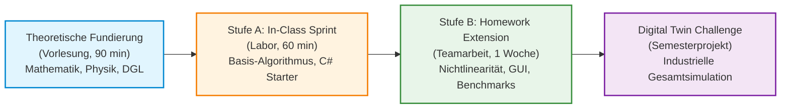

# Modulkonzept: Übungskatalog & Abschlussprojekt („Digital Twin Challenge“)
## Fachhochschule Oberösterreich – Campus Wels | Studiengang Automatisierungstechnik
### Lehrveranstaltung: Systemsimulation / Digitaler Zwilling

**Dokument-ID:** `Konzept/02_Uebungskatalog_und_Abschlussprojekt.md`  
**Geltungsbereich:** Vorlesungsbegleitende Laborübungen (Einheiten 01 bis 10) und semesterbegleitendes Abschlussprojekt  
**Referenzdokumente:** `GEMINI.md`, `Planung/Plan_01_Notationsstandard_und_Harmonisierung.md`, `Planung/03_Plan_Softwarearchitektur_und_Code.md`  
**Zielgruppe:** Studierende im 5. Semester B.Sc. Automatisierungstechnik, Dozenten und Laborleiter  
**Technologie-Stack:** C# 12 / .NET 8 & .NET 10, WPF, ScottPlot 5, SharpGL, Math.NET Numerics, MSAGL, Task Parallel Library (TPL)

---

## Inhaltsverzeichnis

1. [Didaktisches Gesamtkonzept & Labororganisation](#1-didaktisches-gesamtkonzept--labororganisation)
   - 1.1 Verzahnung von Vorlesung, Hands-on-Labor und Vertiefung
   - 1.2 Das 2-Stufen-Übungsmodell (Sprint & Extension)
   - 1.3 Architektur- und Software-Qualitätsstandards
   - 1.4 Test-Driven Simulation & CI-Workflows
2. [Kapitelweiser Aufgabenkatalog (Einheit 01 bis 10)](#2-kapitelweiser-aufgabenkatalog-einheit-01-bis-10)
   - [Einheit 01: Schiefer Wurf mit Luftwiderstand & Parameterstudie](#einheit-01-schiefer-wurf-mit-luftwiderstand--parameterstudie)
   - [Einheit 02: 2D-Wärmeleitungssimulation mit thermischem Hotspot & Kühlkörper](#einheit-02-2d-wärmeleitungssimulation-mit-thermischem-hotspot--kühlkörper)
   - [Einheit 03: Interaktive 2D-Fachwerkanzeige mit skalierten Kräftedreiecken & Bemaßung](#einheit-03-interaktive-2d-fachwerkanzeige-mit-skalierten-kräftedreiecken--bemaßung)
   - [Einheit 04: Realtime-Dashboard mit ScottPlot 5 & Welford-Streaming](#einheit-04-realtime-dashboard-mit-scottplot-5--welford-streaming)
   - [Einheit 05: 3D-Szenengraph mit Orbit-Kamera und Roboterarm-Kinematik](#einheit-05-3d-szenengraph-mit-orbit-kamera-und-roboterarm-kinematik)
   - [Einheit 06: Multithreading-Benchmark: Serielle vs. parallele Laplace-Glättung](#einheit-06-multithreading-benchmark-serielle-vs-parallele-laplace-glättung)
   - [Einheit 07: 2D/3D-Fachwerklöser mit Cholesky-Zerlegung & Lagerreaktionsberechnung](#einheit-07-2d3d-fachwerklöser-mit-cholesky-zerlegung--lagerreaktionsberechnung)
   - [Einheit 08: DC-Servomotor mit PID-Regler, Sättigung und Anti-Windup Clamping](#einheit-08-dc-servomotor-mit-pid-regler-sättigung-und-anti-windup-clamping)
   - [Einheit 09: M/M/c-Warteschlangensimulation einer industriellen Fertigungszelle](#einheit-09-mmc-warteschlangensimulation-einer-industriellen-fertigungszelle)
   - [Einheit 10: Hybrider Bouncing Ball mit Mehrfachaufprall & Haftreibungsumschaltung](#einheit-10-hybrider-bouncing-ball-mit-mehrfachaufprall--haftreibungsumschaltung)
3. [Das große Abschlussprojekt: „Digital Twin Challenge“](#3-das-große-abschlussprojekt-digital-twin-challenge)
   - 3.1 Zielsetzung & didaktischer Anspruch
   - 3.2 Verbindliche Kernkriterien (Die 5 Säulen des digitalen Zwillings)
   - 3.3 Fünf industrielle Projektszenarien zur Auswahl
     - *Projekt A: Digitaler Zwilling eines automatisierten Hochregallager-Stapelbediengeräts (RBG)*
     - *Projekt B: Thermo-elektrischer Mehrzonen-Extruder für Hochleistungskunststoffe*
     - *Projekt C: 3-Achs-Portalroboter mit mechatronischen Servoantrieben & Trajektorienoptimierung*
     - *Projekt D: Flexible Fertigungszelle (FMS) mit fahrerlosem Transportsystem (AGV) & Pufferlogistik*
     - *Projekt E: Pneumatisch getaktete Sortier- und Vereinzelungsanlage mit elastischem Teileaufprall*
   - 3.4 Software-Architekturrahmen („Goldene Regel der Simulationsarchitektur“)
   - 3.5 Meilenstein- und Abgabeplan
   - 3.6 Bewertungsrubrik nach Hochschulstandard
4. [Abnahme- und Prüfungsrichtlinien](#4-abnahme-und-prüfungsrichtlinien)

---

## 1. Didaktisches Gesamtkonzept & Labororganisation

### 1.1 Verzahnung von Vorlesung, Hands-on-Labor und Vertiefung

Die Lehrveranstaltung *Systemsimulation / Digitaler Zwilling* am Campus Wels der FH Oberösterreich qualifiziert angehende Automatisierungsingenieurinnen und -ingenieure für die Entwicklung digitaler Repräsentanten industrieller Systeme. Sie zeichnet sich durch eine direkte, synchrone Trias aus:
1. **Theoretische Fundierung (Vorlesung, 90 min):** Herleitung der mathematisch-physikalischen DGLn, Diskretisierungsverfahren, Stabilitätskriterien und Algorithmen.
2. **Hands-on In-Class Sprint (Labor, 60 min):** Unmittelbare praktische Umsetzung des Kernalgorithmus in C# unter direkter Betreuung im Rechnerraum.
3. **Vertiefende Homework Extension (2er-Team, Hausübung):** Modellkomplexitätssteigerung, Parametervariationen, numerische Fehleranalysen und professionelle Visualisierung.



### 1.2 Das 2-Stufen-Übungsmodell (Sprint & Extension)

Jede der Einheiten 01 bis 10 folgt einer strikten Zweistufigkeit:

- **Stufe A (In-Class Sprint – 60 min, Einzelarbeit oder Tandem):**
  - **Fokus:** Unmittelbare Umsetzung des mathematischen Kerns ohne grafischen Overhead.
  - **Umfang:** Minimales C#-Konsolenprogramm oder vorkonfigurierte WPF-Vorlage aus `Quellen/`.
  - **Erfolgsmetrik:** Ein lauffähiges Ergebnis nach spätestens 50 Minuten; 10 Minuten gemeinsame Auswertung & Fehlerdiskussion im Plenum.
- **Stufe B (Homework Extension – 1 Woche, festes 2er-Team):**
  - **Fokus:** Reale ingenieurtechnische Herausforderungen: physikalische Nichtlinearitäten, Randbedingungen, multithreadete Optimierung, ansprechende UI/UX und mathematische Validierung.
  - **Dokumentation:** Markdown-Bericht (`README.md` im Übungsordner) inklusive Konvergenzdiagrammen, Messreihen und Parameteranalysen.
  - **Codequalität:** Strikte Einhaltung der OOP- und MVVM-Paradigmen, Entkopplung von Physik und UI, Clean Code nach C#-Styleguide.

### 1.3 Architektur- und Software-Qualitätsstandards

Alle studentischen Lösungen müssen der im Skriptum definierten **Goldenen Regel der Simulationsarchitektur** ([Kapitel 11, Folie 356](file:///c:/Users/P28500/Desktop/Repositories/kurs-computer-simulation/Folien/11_Epilog/Folien.md#L356)) genügen:

> [!IMPORTANT]
> **Die Goldene Regel der Simulationsarchitektur:**
> 1. Die **Physik- und Simulationsmodelle** (Zustandsvektor $\mathbf{x}$, Ableitungen $\mathbf{f}(t, \mathbf{x}, \mathbf{u})$, Steifigkeitsmatrizen $\mathbf{K}$, Event-Queues) haben **keine Abhängigkeit** zu GUI-, Grafik- oder Logging-Frameworks (WPF, SharpGL, ScottPlot). Sie sind als reine `.NET`-Klassenbibliotheken zu implementieren.
> 2. Die **Visualisierung** (View) abonniert ausschließlich unveränderliche Zustandsabbilder (Snapshots, DTOs) oder konsumiert Daten über thread-sichere Ringpuffer (`CircularBuffer<T>`) und das WPF-Data-Binding (MVVM).
> 3. Rechenintensive Simulationen dürfen **niemals** auf dem UI-Thread ausgeführt werden. Der Solver läuft asynchron in Hintergrund-Tasks (`Task.Run`) und synchronisiert über `IProgress<T>` oder aggregierte Frame-Timer.

### 1.4 Test-Driven Simulation & CI-Workflows

Für alle numerischen Modelle sind begleitende Unit-Tests mit `xUnit` oder `MSTest` Pflicht (Referenzprojekt: [`Quellen/WS25/SimulationTests`](file:///c:/Users/P28500/Desktop/Repositories/kurs-computer-simulation/Quellen/WS25/SimulationTests)):
- **Energieerhaltungstests:** Für ungedämpfte Hamiltonsche Systeme (Pendel, ungedämpfter Bouncing Ball) muss die Gesamtenergie $E_{\text{tot}} = E_{\text{kin}} + E_{\text{pot}}$ im Zeitverlauf bis auf Integrationsfehlerordnung $\mathcal{O}(\Delta t^p)$ konstant bleiben.
- **Analytische Grenzfallprüfung:** Vergleich numerischer Ergebnisse mit geschlossenen analytischen Lösungen bei trivialen Randbedingungen (z.B. Schiefer Wurf ohne Luftwiderstand, stationäre Endtemperatur des Zylinders).
- **Invarianzprüfungen:** Statische Fachwerke müssen Translations- und Rotationsinvarianten erfüllen (Summe aller Kräfte und Momente exakt $\vec{0}$).

---

## 2. Kapitelweiser Aufgabenkatalog (Einheit 01 bis 10)

---

### Einheit 01: Schiefer Wurf mit Luftwiderstand & Parameterstudie

#### Fachlicher Bezug & Lernziele
- **Vorlesung:** [Kapitel 01: Einführung](file:///c:/Users/P28500/Desktop/Repositories/kurs-computer-simulation/Folien/01_Einführung/Folien.md) – Modellbegriff, Zustandsraum, Zeitdiskretisierung, explizites Euler-Verfahren.
- **Quellen-Referenz:** [`Quellen/WS24/DynamischBallwurf1D`](file:///c:/Users/P28500/Desktop/Repositories/kurs-computer-simulation/Quellen/WS24/DynamischBallwurf1D).
- **Lernziele:**
  1. Ableitung der 2D-Bewegungsgleichung eines Massepunktes unter Gravitation und nichtlinearer quadratischer Stokes/Newton-Luftreibung.
  2. Implementierung des expliziten Euler-Verfahrens und Vergleich der globalen Diskretisierungsfehler mit der analytischen Parabelbahn.
  3. Konzeption einer automatisierten Parameterstudie zur Ermittlung des reichweitenmaximalen Abwurfwinkels $\alpha_{\text{opt}}$.

#### Mathematisches Modell
Zustandsvektor: $\mathbf{x} = \begin{bmatrix} x & y & v_x & v_y \end{bmatrix}^\top \in \mathbb{R}^4$.  
DGL-System 1. Ordnung:
$$\dot{x} = v_x, \quad \dot{y} = v_y$$
$$\dot{v}_x = -\frac{1}{2m} \rho \, c_{\text{w}} A \, v \, v_x, \quad \dot{v}_y = -g - \frac{1}{2m} \rho \, c_{\text{w}} A \, v \, v_y$$
wobei $v = \sqrt{v_x^2 + v_y^2}$, $g = 9{,}81\,\text{m/s}^2$, $\rho = 1{,}225\,\text{kg/m}^3$, Masse $m = 0{,}145\,\text{kg}$, Querschnittsfläche $A = \pi r^2$ ($r = 0{,}037\,\text{m}$), Widerstandsbeiwert $c_{\text{w}} = 0{,}45$.

---

#### Stufe A: In-Class Sprint (60 min) – „Der schiefe Wurf im Rechner“
- **Aufgabenstellung:**
  1. Erstellen Sie eine C#-Konsolenapplikation `BallwurfSprint`.
  2. Implementieren Sie den Zustandsvektor $\mathbf{x}$ und eine Funktion `Vector4 Derivative(Vector4 state)`.
  3. Realisieren Sie den expliziten Euler-Schritt: $\mathbf{x}_{k+1} = \mathbf{x}_k + \Delta t \cdot \mathbf{f}(t_k, \mathbf{x}_k)$.
  4. Simulieren Sie den Wurf für Startwinkel $\alpha = 45^\circ$, $v_0 = 30\,\text{m/s}$, $y_0 = 1{,}0\,\text{m}$ bei zwei Schrittweiten $\Delta t_1 = 0{,}05\,\text{s}$ und $\Delta t_2 = 0{,}001\,\text{s}$ bis zum Bodenkontakt ($y \le 0$).
  5. Geben Sie die Wurfweite $x_{\max}$ und die Flugzeit $t_{\text{end}}$ auf der Konsole aus und berechnen Sie die Differenz zum luftwiderstandsfreien analytischen Fall:
     $$x_{\text{analytisch}} = \frac{v_0 \cos \alpha}{g} \left( v_0 \sin \alpha + \sqrt{v_0^2 \sin^2 \alpha + 2 g y_0} \right)$$
- **Erwartetes Ergebnis:** 
  Wurfweite im Vakuum $\approx 92{,}7\,\text{m}$, mit Luftwiderstand $\approx 46{,}2\,\text{m}$. Die Studierenden erkennen sofort die massive Auswirkung der Luftreibung.

---

#### Stufe B: Homework Extension (2er-Team, 1 Woche) – „Parameterstudie & Optimalwinkel“
- **Aufgabenstellung:**
  1. **Algorithmenvergleich:** Erweitern Sie den Simulator um das Prädiktor-Korrektor-Verfahren nach Heun (Runge-Kutta 2. Ordnung, RK2):
     $$\tilde{\mathbf{x}}_{k+1} = \mathbf{x}_k + \Delta t \cdot \mathbf{f}(t_k, \mathbf{x}_k)$$
     $$\mathbf{x}_{k+1} = \mathbf{x}_k + \frac{\Delta t}{2} \left[ \mathbf{f}(t_k, \mathbf{x}_k) + \mathbf{f}(t_k + \Delta t, \tilde{\mathbf{x}}_{k+1}) \right]$$
  2. **Konvergenzanalyse:** Plotten Sie für einen Referenzwurf den Fehler der Endreichweite $|x_{\max}(\Delta t) - x_{\max}^*|$ über der Schrittweite $\Delta t \in [10^{-4}, 10^{-1}]$ im doppelt-logarithmischen Maßstab. Weisen Sie die Fehlerordnung $\mathcal{O}(\Delta t^1)$ für Euler und $\mathcal{O}(\Delta t^2)$ für Heun empirisch nach.
  3. **Winkel-Sweep:** Führen Sie eine automatisierte Parameterstudie durch: Variieren Sie den Abwurfwinkel $\alpha$ von $15^\circ$ bis $75^\circ$ in Schritten von $0{,}5^\circ$ für drei verschiedene Geschwindigkeiten $v_0 \in \{15, 30, 60\}\,\text{m/s}$.
  4. **ScottPlot-Visualisierung:** Erstellen Sie ein Diagramm: Wurfweite $x_{\max}$ über Abwurfwinkel $\alpha$. Bestimmen Sie für jedes $v_0$ den optimalen Winkel $\alpha_{\text{opt}}$ mittels quadratischer Interpolation des Maximums.
- **Kernfrage zur Auswertung:** Warum sinkt der optimale Abwurfwinkel bei steigender Abwurfgeschwindigkeit von ca. $45^\circ$ auf unter $35^\circ$? Erläutern Sie den physikalischen Mechanismus anhand des Richtungsvektors der Reibungskraft.
- **Bewertungskriterien (10 Punkte):**
  - [2 P.] Korrekte Implementierung des Heun-Verfahrens mit sauberer Vektor-Kapselung.
  - [3 P.] Konvergenzdiagramm mit korrekter Steigung der Fehlergeraden.
  - [3 P.] Parameterstudie mit ScottPlot-Diagramm und numerisch exakter Bestimmung von $\alpha_{\text{opt}}$.
  - [2 P.] Physikalische Diskussion des Effekts im Markdown-Bericht.

---

### Einheit 02: 2D-Wärmeleitungssimulation mit thermischem Hotspot & Kühlkörper

#### Fachlicher Bezug & Lernziele
- **Vorlesung:** [Kapitel 02: Visualisierung 2D Pixel](file:///c:/Users/P28500/Desktop/Repositories/kurs-computer-simulation/Folien/02_Visualisierung_2D_Pixel/Folien.md) – Rastergrafik, Pixel-Puffer, WriteableBitmap, Finite-Differenzen-Methode (FDM) für parabolische PDEs.
- **Lernziele:**
  1. Diskretisierung der 2D-Wärmeleitungsgleichung $\frac{\partial T}{\partial t} = a \left( \frac{\partial^2 T}{\partial x^2} + \frac{\partial^2 T}{\partial y^2} \right) + \frac{\dot{q}_{\text{v}}}{\rho c_{\text{p}}}$ auf einem äquidistanten Gitter.
  2. Verständnis des Von-Neumann-Stabilitätskriteriums für explizite Zeitschritte: $\Delta t \le \frac{\Delta x^2 \, \Delta y^2}{2 a (\Delta x^2 + \Delta y^2)}$.
  3. Effizientes Rendering thermischer Felder mittels direkter Speicherbeschreibungen in `WriteableBitmap` (Lock, BackBuffer, Unlock).

---

#### Stufe A: In-Class Sprint (60 min) – „FDM & Heatmap in WriteableBitmap“
- **Aufgabenstellung:**
  1. Öffnen Sie die Vorlage mit WPF-Fenster und einem `Image`-Control ($128 \times 128$ Pixel).
  2. Initialisieren Sie eine `WriteableBitmap(128, 128, 96, 96, PixelFormats.Bgr32, null)` und zwei 2D-Puffer `double[128, 128]` (`T_current`, `T_next`).
  3. Randbedingungen: Ränder auf $T_{\text{Rand}} = 20\,^\circ\text{C}$ fixieren (Dirichlet). Im Zentrum ($x \in [60, 68], y \in [60, 68]$) konstante Wärmequelle mit $T_{\text{Hotspot}} = 100\,^\circ\text{C}$.
  4. Berechnen Sie pro Zeitschritt den 5-Punkt-Differenzenstern:
     $$T_{i,j}^{k+1} = T_{i,j}^k + \frac{a \cdot \Delta t}{\Delta x^2} \left( T_{i+1,j}^k + T_{i-1,j}^k + T_{i,j+1}^k + T_{i,j-1}^k - 4 T_{i,j}^k \right)$$
  5. Schreiben Sie eine Color-Map-Funktion `uint TemperatureToBgr32(double temp)`, die Temperaturen von $20\,^\circ\text{C}$ (Blau) über $50\,^\circ\text{C}$ (Grün) bis $100\,^\circ\text{C}$ (Rot) linear interpoliert.
  6. Aktualisieren Sie den BackBuffer über `WriteableBitmap.Lock()` und `Marshal.Copy` oder Zeiger-Arithmetik (`unsafe`).
- **Erwartetes Ergebnis:** Eine sich im WPF-Fenster kontinuierlich ausbreitende Wärmewolke um den zentralen Hotspot bei mindestens 30 FPS.

---

#### Stufe B: Homework Extension (2er-Team, 1 Woche) – „CPU-Kühlkörper & Neumann-Randbedingungen“
- **Aufgabenstellung:**
  1. **Anisotrope Geometrie:** Modellieren Sie das thermische Schnittmodell eines Prozessors ($W \times H = 50 \times 50\,\text{mm}$, Gitter $200 \times 200$, $\Delta x = 0{,}25\,\text{mm}$):
     - Silizium-Die ($10 \times 2\,\text{mm}$, $a_{\text{Si}} = 8{,}8 \times 10^{-5}\,\text{m}^2/\text{s}$, Wärmeverlustleistung $P = 95\,\text{W}$).
     - Kupfer-Heatspreader ($30 \times 5\,\text{mm}$, $a_{\text{Cu}} = 1{,}11 \times 10^{-4}\,\text{m}^2/\text{s}$).
     - Aluminium-Kühlrippen ($45 \times 30\,\text{mm}$, $a_{\text{Al}} = 9{,}7 \times 10^{-5}\,\text{m}^2/\text{s}$).
  2. **Randbedingungen:**
     - Isolierte Seitenwände (Neumann-Randbedingung: $\frac{\partial T}{\partial n} = 0 \implies T_{0,j} = T_{1,j}$).
     - Konvektive Wärmeabgabe an den Kühlrippen nach außen (Robin-Randbedingung):
       $$-k \frac{\partial T}{\partial y} = h_{\text{conv}} \cdot (T - T_{\infty}), \quad h_{\text{conv}} = 150\,\frac{\text{W}}{\text{m}^2\text{K}}, \; T_{\infty} = 25\,^\circ\text{C}$$
  3. **Stabilitätsüberwachung:** Implementieren Sie eine dynamische Schrittweitenkontrolle: Berechnen Sie die maximal zulässige Schrittweite $\Delta t_{\max} = 0{,}9 \cdot \frac{\Delta x^2}{4 \max(a)}$. Erzeugen Sie gezielt eine numerische Instabilität ($\Delta t = 1{,}2 \cdot \Delta t_{\max}$) und demonstrieren Sie die oszillierende Gitterexplosion im Bericht.
  4. **Performance-Optimierung:** Lagern Sie den FDM-Zeitschritt auf einen Worker-Thread aus und verwenden Sie `Parallel.For` für die Zeileniteration. Messen Sie die Iterationsdauer bei 1, 2, 4 und 8 Threads.
- **Bewertungskriterien (10 Punkte):**
  - [3 P.] Korrekte Implementierung der Materialzonen und der Robin-Randbedingung.
  - [2 P.] Stabilitätsanalyse mit aussagekräftigen Screenshots der numerischen Instabilität.
  - [3 P.] Multithreadete FDM-Berechnung mit entkoppelter `WriteableBitmap`-Anzeige.
  - [2 P.] Schriftliche Diskussion der Temperaturabfälle an den Materialgrenzen (Wärmeleitpaste-Übergangswiderstand).

---

### Einheit 03: Interaktive 2D-Fachwerkanzeige mit skalierten Kräftedreiecken & Bemaßung

#### Fachlicher Bezug & Lernziele
- **Vorlesung:** [Kapitel 03: Visualisierung 2D Vektor](file:///c:/Users/P28500/Desktop/Repositories/kurs-computer-simulation/Folien/03_Visualisierung_2D_Vektor/Folien.md) – WPF Canvas, Vektorgrafiken (`Shape`, `Path`, `Line`), affine Transformationen, Welt- zu Bildschirmkoordinaten.
- **Quellen-Referenz:** [`Quellen/WS25/FachwerkIdeal2D`](file:///c:/Users/P28500/Desktop/Repositories/kurs-computer-simulation/Quellen/WS25/FachwerkIdeal2D).
- **Lernziele:**
  1. Mathematische Formulierung der Welt-Bildschirm-Transformation:
     $$\begin{bmatrix} x_{\text{screen}} \\ y_{\text{screen}} \end{bmatrix} = \begin{bmatrix} s_x & 0 \\ 0 & -s_y \end{bmatrix} \begin{bmatrix} x_{\text{world}} \\ y_{\text{world}} \end{bmatrix} + \begin{bmatrix} t_x \\ t_y \end{bmatrix}$$
  2. Dynamisches Zeichnen von Stäben, Knoten, Fest- und Loselagern auf einem WPF `Canvas`.
  3. Visualisierung von Zugkräften (Blau) und Druckkräften (Rot) mit linienstärkenproportionaler Skalierung.

---

#### Stufe A: In-Class Sprint (60 min) – „Truss-Renderer auf WPF Canvas“
- **Aufgabenstellung:**
  1. Laden Sie das Projekt `FachwerkIdeal2D`.
  2. Implementieren Sie eine Klasse `ScreenTransform`, die Weltkoordinaten (Meter) in Canvas-Pixel umrechnet und das Koordinatensystem invertiert (Y nach oben positiv!).
  3. Zeichnen Sie ein 3-Knoten-Fachwerk (Dreiecksträger: Knoten 1 bei $(0,0)$, Knoten 2 bei $(4,0)$, Knoten 3 bei $(2,2)$ Meter; Last $F = 10\,\text{kN}$ vertikal nach unten an Knoten 3).
  4. Erzeugen Sie für jeden Stab ein WPF `Line`-Element:
     - Berechnen Sie die Stabkräfte analytisch nach dem Knotenpunktverfahren.
     - Druckstäbe rot einfärben ($S_i < 0$), Zugstäbe blau einfärben ($S_i > 0$).
     - Strichstärke dynamisch anpassen: $w = 2 + 6 \cdot \frac{|S_i|}{\max|S|}$.
  5. Zeichnen Sie Knotenpunkte als ausgefüllte Kreise (`Ellipse`) mit Tooltip, der Knotennummer und Koordinaten anzeigt.
- **Erwartetes Ergebnis:** Ein responsiver Vektorträger im Canvas, der sich bei Fenstergrößenänderung automatisch zentriert und skaliert.

---

#### Stufe B: Homework Extension (2er-Team, 1 Woche) – „Interaktives Fachwerk-Dashboard mit Kräftedreiecken“
- **Aufgabenstellung:**
  1. **Interaktive Lasteinleitung:** Ermöglichen Sie es dem Benutzer, Lastpfeile per Drag-and-Drop an beliebigen Knoten zu verschieben oder in Betrag und Richtung über Mausgesten zu manipulieren.
  2. **Automatisierte Bemaßung:**
     - Zeichnen Sie technische Bemaßungslinien (horizontale und vertikale Maßketten mit Maßhilfslinien, Pfeilspitzen und lesbarem Maßtext) unter und neben dem Fachwerk.
     - Der Text muss bei Zoomstufen stets aufrecht stehen und eine feste Mindestschriftgröße behalten.
  3. **Visualisierung von Kräftedreiecken an Knoten:**
     - Fügen Sie eine Umschaltoption hinzu: Bei Klick auf einen Knoten öffnet sich ein Overlay, das das geschlossene Krafteck (vektorielle Kräfteaddition $\sum \vec{F}_i = \vec{0}$) dieses Knotens maßstäblich gezeichnet darstellt.
  4. **Verformungsüberhöhung (Qualitativ):**
     - Skizzieren Sie das verformte Fachwerk mit gestrichelten Linien unter Annahme linearer Knotenverschiebungen:
       $$\vec{r}_i' = \vec{r}_i + \alpha_{\text{scale}} \cdot \vec{u}_i, \quad \alpha_{\text{scale}} = 100$$
- **Bewertungskriterien (10 Punkte):**
  - [3 P.] Stabile Welt-Bildschirm-Transformation mit Zoom- und Pan-Funktion (Mausrad & Drag).
  - [3 P.] Interaktive Lastmanipulation mit flüssiger Neuskalierung der Stäbe.
  - [2 P.] Vollständige technische Bemaßung nach DIN 406 / ISO 129.
  - [2 P.] Grafische Darstellung der geschlossenen Gleichgewichtspolygone (Kräfteecke).

---

### Einheit 04: Realtime-Dashboard mit ScottPlot 5 & Welford-Streaming

#### Fachlicher Bezug & Lernziele
- **Vorlesung:** [Kapitel 04: Visualisierung 2D Diagramme](file:///c:/Users/P28500/Desktop/Repositories/kurs-computer-simulation/Folien/04_Visualisierung_2D_Diagramme/Folien.md) – ScottPlot 5 Architektur, High-Performance Streaming, Ringpuffer, Welford-Algorithmus für rollierende Statistik.
- **Quellen-Referenz:** [`Quellen/WS25/SimulationMvvmPattern`](file:///c:/Users/P28500/Desktop/Repositories/kurs-computer-simulation/Quellen/WS25/SimulationMvvmPattern), [`Quellen/WS24/VorlageVisualisierung2D`](file:///c:/Users/P28500/Desktop/Repositories/kurs-computer-simulation/Quellen/WS24/VorlageVisualisierung2D).
- **Lernziele:**
  1. Aufbau eines latenzfreien Messdaten-Dashboards mit `WpfPlot` aus ScottPlot 5.
  2. Vermeidung von Garbage-Collection-Spikes durch vorallokierte Ringpuffer (`CircularBuffer<double>`).
  3. Numerisch stabile Online-Berechnung von gleitendem Mittelwert $\bar{x}_k$ und Varianz $s_k^2$ nach Welford ohne Speicherung der gesamten Historie.

---

#### Stufe A: In-Class Sprint (60 min) – „High-Speed Signal-Streamer“
- **Aufgabenstellung:**
  1. Erstellen Sie ein WPF-Projekt mit `ScottPlot.WPF` (Version 5.x).
  2. Implementieren Sie einen festen Puffer `double[] buffer = new double[5000]` und eine fortlaufende Zeitachse.
  3. Starten Sie einen `DispatcherTimer` mit $20\,\text{ms}$ Intervall ($50\,\text{Hz}$).
  4. Generieren Sie ein verrauschtes Sinussignal:
     $$y(t) = \sin(2\pi \cdot 2\,\text{Hz} \cdot t) + 0{,}3 \cdot \cos(2\pi \cdot 15\,\text{Hz} \cdot t) + \mathcal{N}(0, 0{,}1)$$
  5. Binden Sie das Signal an einen ScottPlot `DataStreamer` oder aktualisieren Sie den Scatter-Puffer mit `WpfPlot1.Refresh()`.
  6. Messen und visualisieren Sie die tatsächliche Render-Framerate (FPS) in einem Textblock.
- **Erwartetes Ergebnis:** Ruckelfreies Oszilloskop-Signal mit stabilen $50\text{--}60\,\text{FPS}$ bei unter $5\,\%$ CPU-Last.

---

#### Stufe B: Homework Extension (2er-Team, 1 Woche) – „Industrielles Telemetrie- & Qualitäts-Dashboard“
- **Aufgabenstellung:**
  1. **Welford-Streaming-Klasse:** Implementieren Sie eine threadsichere Klasse `StreamingStatistics`:
     $$M_1 = x_1, \quad S_1 = 0$$
     $$M_k = M_{k-1} + \frac{x_k - M_{k-1}}{k}$$
     $$S_k = S_{k-1} + (x_k - M_{k-1})(x_k - M_k)$$
     $$\sigma_k^2 = \frac{S_k}{k - 1}, \quad s_k = \sqrt{\sigma_k^2}$$
  2. **Multi-Plot-Layout:** Bauen Sie ein Dashboard mit 3 synchronisierten ScottPlot-Panels auf:
     - **Panel 1 (Zeitsignal):** Rohsignal $x(t)$, gleitender Mittelwert $\bar{x}$ und $\pm 3\sigma$-Toleranzbänder.
     - **Panel 2 (Echtzeit-Histogramm):** Dynamische Verteilung der letzten $10\,000$ Abtastwerte mit überlagerter Gaußscher Glockenkurve.
     - **Panel 3 (Process Capability / Trend):** Verlauf von Mittelwert und Standardabweichung über der Zeit.
  3. **Anomalie-Erkennung:** Injizieren Sie stochastische Drifts und Ausreißer (Outliers). Das Dashboard muss Grenzwertverletzungen ($|x_k - \bar{x}| > 3\sigma$) optisch sofort rot markieren und Alarme protokollieren.
  4. **Architekturprüfung:** Entkoppeln Sie den Signal-Generator (läuft in separatem Task mit $1\,\text{kHz}$) über eine `BlockingCollection<T>` oder einen speicheroptimierten Ringpuffer vom UI-Render-Takt ($30\,\text{Hz}$).
- **Bewertungskriterien (10 Punkte):**
  - [3 P.] Exakte numerische Umsetzung des Welford-Verfahrens mit Unit-Tests zur Verifikation gegen Math.NET.
  - [3 P.] Performance: Konstante Speicherallokation (0 B Allocation im Render-Loop).
  - [2 P.] Ansprechendes, industrielles Dashboard-Design mit synchronisierten Diagrammachsen.
  - [2 P.] Zuverlässige Outlier-Erkennung und Toleranzband-Visualisierung.

---

### Einheit 05: 3D-Szenengraph mit Orbit-Kamera und Roboterarm-Kinematik

#### Fachlicher Bezug & Lernziele
- **Vorlesung:** [Kapitel 05: Visualisierung 3D OpenGL](file:///c:/Users/P28500/Desktop/Repositories/kurs-computer-simulation/Folien/05_Visualisierung_3D_OpenGL/Folien.md) – OpenGL Pipeline, SharpGL, Szenengraph-Hierarchie, Transformationsmatrizen, Denavit-Hartenberg (DH) Kinematik.
- **Quellen-Referenz:** [`Quellen/WS25/VorlageSzenengraph3D`](file:///c:/Users/P28500/Desktop/Repositories/kurs-computer-simulation/Quellen/WS25/VorlageSzenengraph3D), [`Quellen/WS25/VorlageVisualisierung3D`](file:///c:/Users/P28500/Desktop/Repositories/kurs-computer-simulation/Quellen/WS25/VorlageVisualisierung3D).
- **Lernziele:**
  1. Beherrschung der 3D-Modellierungs- und Blickpunkt-Transformationen mit OpenGL (`glMatrixMode`, `gluLookAt`, `glPushMatrix`, `glPopMatrix`).
  2. Implementierung einer kardanfehlerfreien Orbit-Kamera (Kugelkoordinaten: Radius $r$, Azimut $\theta$, Elevation $\phi$).
  3. Aufbau eines komponentenorientierten Szenengraphen für mehrgliedrige mechatronische Kinematiken.

---

#### Stufe A: In-Class Sprint (60 min) – „SharpGL-Würfel mit Orbit-Steuerung“
- **Aufgabenstellung:**
  1. Öffnen Sie `VorlageVisualisierung3D` mit SharpGL `OpenGLControl`.
  2. Implementieren Sie die `OrbitCamera`-Logik:
     $$x_{\text{eye}} = r \cos \phi \sin \theta + x_{\text{target}}$$
     $$y_{\text{eye}} = r \sin \phi + y_{\text{target}}$$
     $$z_{\text{eye}} = r \cos \phi \cos \theta + z_{\text{target}}$$
  3. Verdrahten Sie Maus-Events:
     - Linke Maustaste + Bewegen: Ändern von $\theta$ und $\phi$ (Elevation auf $[-89^\circ, 89^\circ]$ begrenzen!).
     - Mausrad: Ändern von $r$ (Zoom mit Clamping).
  4. Zeichnen Sie ein 3D-Achsenkreuz ($X$: Rot, $Y$: Grün, $Z$: Blau, Länge $2{,}0\,\text{m}$) und einen 3D-Würfel mit Normalenvektoren und Phong-Material.
- **Erwartetes Ergebnis:** Flüssige interaktive 3D-Navigation um das zentrale Objekt ohne Kamera-Sprünge.

---

#### Stufe B: Homework Extension (2er-Team, 1 Woche) – „3-Achs-Knickarmroboter mit Szenengraph“
- **Aufgabenstellung:**
  1. **Szenengraph-Struktur:** Erweitern Sie das Klassenmodell aus `VorlageSzenengraph3D` um:
     - Basisplatte (Zylinder auf Sockel, Rotation um Z-Achse: Gelenkwinkel $q_1$).
     - Unterarm (Quader / Hohlprofil, Rotation um Y-Achse: Gelenkwinkel $q_2$).
     - Oberarm mit Tool-Center-Point (TCP, Rotation um Y-Achse: Gelenkwinkel $q_3$).
  2. **Hierarchische Vorwärtskinematik:**
     - Berechnen Sie die globale Transformationsmatrix $\mathbf{T}_{03} = \mathbf{T}_{01}(q_1) \cdot \mathbf{T}_{12}(q_2) \cdot \mathbf{T}_{23}(q_3)$.
     - Nutzen Sie den OpenGL-Matrix-Stack (`glPushMatrix()`, `glRotatef()`, `glTranslatef()`) zur rekursiven Visualisierung der Glieder.
  3. **Arbeitsraum & Trajektorie:**
     - Zeichnen Sie die TCP-Trajektorie als 3D-Linienpfad (`GL_LINE_STRIP`) im Raum nach, während der Roboter eine parametrierte Testbewegung ausführt:
       $$q_i(t) = q_{i,\text{start}} + (q_{i,\text{end}} - q_{i,\text{start}}) \cdot \left[ 10\left(\frac{t}{T}\right)^3 - 15\left(\frac{t}{T}\right)^4 + 6\left(\frac{t}{T}\right)^5 \right]$$
       (Ruckfreies Polynom 5. Ordnung).
  4. **Schattierung & Beleuchtung:**
     - Definieren Sie eine gerichtete Lichtquelle mit Ambient-, Diffus- und Spekular-Anteilen.
     - Berechnen Sie für alle Zylindersegmente exakte Flächennormalen $\vec{n}$ für glatte Schattierung (`GL_SMOOTH`).
- **Bewertungskriterien (10 Punkte):**
  - [3 P.] Korrekte mathematische und grafische Verkettung des 3-Achs-Roboterarms.
  - [2 P.] Ruckfreie Trajektorieninterpolation mit Visualisierung des Pfades.
  - [3 P.] Robuste Orbit-Kamera mit Pan-Funktion (mittlere Maustaste verschiebt Zielpunkt).
  - [2 P.] Saubere Beleuchtung mit korrekt berechneten Normalenvektoren.

---

### Einheit 06: Multithreading-Benchmark: Serielle vs. parallele Laplace-Glättung

#### Fachlicher Bezug & Lernziele
- **Vorlesung:** [Kapitel 06: Multithreading](file:///c:/Users/P28500/Desktop/Repositories/kurs-computer-simulation/Folien/06_Multithreading/Folien.md) – Task Parallel Library (TPL), `Parallel.For`, Amdahl's Law, Gustafson's Law, Cache-Effekte & False Sharing.
- **Lernziele:**
  1. Paralleles Rechnen auf 2D-Datenstrukturen mit Vermeidung von Race Conditions (Double-Buffering).
  2. Messung und mathematische Modellierung des Speedups $S(p) = \frac{T_1}{T_p}$ nach Amdahl:
     $$S(p) = \frac{1}{(1 - f_{\text{par}}) + \frac{f_{\text{par}}}{p}}$$
  3. Analyse von Speichereffekten (CPU-Cache-Hierarchie, Zeilen- vs. Spaltenzugriff).

---

#### Stufe A: In-Class Sprint (60 min) – „Laplace-Filter mit Parallel.For“
- **Aufgabenstellung:**
  1. Erstellen Sie eine Konsolenanwendung `MultithreadingBenchmark`.
  2. Allokieren Sie zwei Arrays `double[2048, 2048]` (`src` und `dst`), gefüllt mit Zufallsrauschen.
  3. Implementieren Sie die serielle 4-Punkt-Laplace-Glättung (10 Iterationen):
     $$dst[i, j] = 0{,}25 \cdot (src[i+1, j] + src[i-1, j] + src[i, j+1] + src[i, j-1])$$
  4. Messen Sie die Ausführungszeit $T_{\text{seq}}$ mittels `System.Diagnostics.Stopwatch`.
  5. Parallelisieren Sie die äußere Schleife über `Parallel.For(1, height - 1, i => { ... })`.
  6. Messen Sie $T_{\text{par}}$ und geben Sie Speedup $S = \frac{T_{\text{seq}}}{T_{\text{par}}}$ und Effizienz $E = \frac{S}{p}$ auf der Konsole aus.
- **Erwartetes Ergebnis:** Speedup von $4\text{--}7\times$ auf einem 8-Kern-Prozessor.

---

#### Stufe B: Homework Extension (2er-Team, 1 Woche) – „Amdahl-Analyse & Cache-Lokalitätsstudie“
- **Aufgabenstellung:**
  1. **Systematische Benchmark-Reihe:**
     - Führen Sie Messungen für Thread-Zahlen $p \in \{1, 2, 4, 6, 8, 12, 16, 24, 32\}$ mit `ParallelOptions { MaxDegreeOfParallelism = p }` durch.
     - Wiederholen Sie jede Messung $5\times$ (Discard First Run für JIT-Warmup!) und berechnen Sie Mittelwert und Standardabweichung.
  2. **Identifikation des seriellen Anteils:**
     - Fitten Sie die Messdaten an Amdahl's Law mittels nichtlinearer Ausgleichsrechnung (Least Squares), um den exakten seriellen Anteil $s = 1 - f_{\text{par}}$ der CPU-Architektur zu bestimmen.
  3. **Speicherzugriffs-Experiment (Row-Major vs. Column-Major):**
     - Vergleichen Sie die Performance zweier Zugriffsmuster:
       - *Variante A (Cache-freundlich):* Äußere Schleife $i$ (Zeilen), innere Schleife $j$ (Spalten).
       - *Variante B (Cache-feindlich):* Äußere Schleife $j$ (Spalten), innere Schleife $i$ (Zeilen).
     - Dokumentieren Sie den drastischen Leistungseinbruch (Faktor $3\text{--}10$) und begründen Sie ihn anhand von Cache-Lines ($64\,\text{Byte}$) und CPU-Prefetching.
  4. **WPF-Benchmark-GUI:** Bauen Sie ein GUI mit ScottPlot-Diagramm (Speedup über CPU-Cores mit Amdahl-Fit-Kurve) und asynchronem Abbruch via `CancellationTokenSource`.
- **Bewertungskriterien (10 Punkte):**
  - [3 P.] Methodisch saubere Messmethodik (Warmup, Mittelung, Standardabweichung).
  - [3 P.] Fundierte quantitative Analyse nach Amdahl inklusive Ermittlung von $f_{\text{par}}$.
  - [2 P.] Experimenteller Nachweis und profunde hardwarenahe Begründung des Cache-Lokalitäts-Effekts.
  - [2 P.] Asynchrones GUI mit responsivem Fortschrittsbalken (`IProgress<double>`).

---

### Einheit 07: 2D/3D-Fachwerklöser mit Cholesky-Zerlegung & Lagerreaktionsberechnung

#### Fachlicher Bezug & Lernziele
- **Vorlesung:** [Kapitel 07: Statische Modelle](file:///c:/Users/P28500/Desktop/Repositories/kurs-computer-simulation/Folien/07_Statische_Modelle/Folien.md) – Finite-Elemente-Methode (FEM) für Stabtragwerke, Elementsteifigkeitsmatrix $\mathbf{K}_e$, globale Steifigkeitsmatrix $\mathbf{K}$, Blockpartitionierung, Cholesky-Verfahren ($\mathbf{L}\mathbf{L}^\top$).
- **Quellen-Referenz:** [`Quellen/WS25/FachwerkElastisch3D`](file:///c:/Users/P28500/Desktop/Repositories/kurs-computer-simulation/Quellen/WS25/FachwerkElastisch3D), [`Quellen/WS24/StatischFachwerkElastisch2D`](file:///c:/Users/P28500/Desktop/Repositories/kurs-computer-simulation/Quellen/WS24/StatischFachwerkElastisch2D).
- **Lernziele:**
  1. Mathematische Ableitung der 2D/3D-Stabsteifigkeit im lokalen und globalen Koordinatensystem:
     $$\mathbf{K}_e = \frac{E \cdot A}{L} \begin{bmatrix} \vec{n}\vec{n}^\top & -\vec{n}\vec{n}^\top \\ -\vec{n}\vec{n}^\top & \vec{n}\vec{n}^\top \end{bmatrix} \in \mathbb{R}^{2d \times 2d}$$
  2. Lösung des blockpartitionierten Gleichungssystems:
     $$\mathbf{K}_{ff} \mathbf{u}_f = \mathbf{f}_f - \mathbf{K}_{fp} \mathbf{u}_p, \quad \mathbf{f}_p = \mathbf{K}_{pf} \mathbf{u}_f + \mathbf{K}_{pp} \mathbf{u}_p$$
  3. Effiziente Lösung symmetrisch positiv definiter (SPD) Matrizen mit Math.NET Numerics.

---

#### Stufe A: In-Class Sprint (60 min) – „Assemblierung des 2D-Steifigkeitssystems“
- **Aufgabenstellung:**
  1. Binden Sie das NuGet-Paket `MathNet.Numerics` in ein C#-Projekt ein.
  2. Definieren Sie ein 3-Knoten-Fachwerk (Dreiecksträger: $E = 210\,\text{GPa}$, $A = 10^{-4}\,\text{m}^2$).
  3. Erstellen Sie eine Methode `Matrix<double> BuildElementMatrix(Node n1, Node n2, double E, double A)`:
     - Berechnen Sie Richtungsvektor $\vec{n} = \frac{\vec{r}_2 - \vec{r}_1}{\|\vec{r}_2 - \vec{r}_1\|}$ und Länge $L$.
     - Berechnen Sie das dyadische Produkt $\vec{n}\vec{n}^\top \in \mathbb{R}^{2 \times 2}$.
  4. Assemblieren Sie die globale Steifigkeitsmatrix $\mathbf{K} \in \mathbb{R}^{6 \times 6}$ durch Aufaddieren der Elementbeiträge an den jeweiligen Freiheitsgrad-Indizes.
  5. Prüfen Sie die Matrixeigenschaften: Ist $\mathbf{K}$ symmetrisch? Warum ist $\det(\mathbf{K}) = 0$ vor dem Einprägen der Randbedingungen?
- **Erwartetes Ergebnis:** Eine korrekt assemblierte, positiv semidefinite Gesamtmatrix mit Rang $6 - 3 = 3$ (3 Starrkörper-Freiheitsgrade).

---

#### Stufe B: Homework Extension (2er-Team, 1 Woche) – „3D-Fachwerklöser mit Cholesky & Spannungsanalyse“
- **Aufgabenstellung:**
  1. **Verallgemeinerung auf 3D:** Erweitern Sie das Berechnungsmodell auf 3 Dimensionen (3 Freiheitsgrade $u_x, u_y, u_z$ pro Knoten, Elementmatrix $\mathbf{K}_e \in \mathbb{R}^{6 \times 6}$).
  2. **Blockpartitionierung & Randbedingungen:**
     - Teilen Sie das System anhand freier Indizes ($f$) und vorgeschriebener Lager-Indizes ($p$) auf:
       $$\begin{bmatrix} \mathbf{K}_{ff} & \mathbf{K}_{fp} \\ \mathbf{K}_{pf} & \mathbf{K}_{pp} \end{bmatrix} \begin{bmatrix} \mathbf{u}_f \\ \mathbf{u}_p \end{bmatrix} = \begin{bmatrix} \mathbf{f}_f \\ \mathbf{f}_p \end{bmatrix}$$
     - Lösen Sie nach den unbekannten Verschiebungen $\mathbf{u}_f$ via Cholesky-Faktorisierung (`matrix.Cholesky().Solve(...)`).
     - Berechnen Sie die unbekannten Lagerreaktionskräfte $\mathbf{f}_p$.
  3. **Stabkraft- und Spannungsberechnung:**
     - Bestimmen Sie für jeden Stab $i$ die elastische Dehnung $\epsilon_i = \frac{\Delta L_i}{L_i} = \frac{(\vec{u}_{2} - \vec{u}_{1}) \cdot \vec{n}_i}{L_i}$, die Normalspannung $\sigma_i = E \cdot \epsilon_i$ und die Stabkraft $N_i = \sigma_i \cdot A_i$.
  4. **Industrielles Validierungsbeispiel:**
     - Modellieren Sie einen 3D-Gittermast-Kran (Ausleger mit mindestens 12 Knoten und 30 Stäben).
     - Prüfen Sie das statische Gleichgewicht: Stimmt die Summe aller Lagerkräfte $\sum \vec{F}_{\text{Lager}}$ exakt mit den eingeprägten externen Lasten $\sum \vec{F}_{\text{Last}}$ überein (Toleranz $< 10^{-9}\,\text{N}$)?
  5. **Verformte 3D-Visualisierung:** Koppeln Sie die Ergebnisse an SharpGL oder ein WPF Canvas: Stellen Sie den unverformten Träger (grau) und den verformten Träger (farbcodiert nach Spannung $\sigma$) dar.
- **Bewertungskriterien (10 Punkte):**
  - [3 P.] Korrekte Implementierung der 3D-FEM-Gleichungen und Blockpartitionierung.
  - [2 P.] Erfolgreicher Einsatz der Cholesky-Zerlegung mit Math.NET Numerics.
  - [3 P.] Exakte Berechnung von Lagerreaktionen und Spannungen mit Gleichgewichtsnachweis.
  - [2 P.] Anschauliche Visualisierung des verformten Tragwerks mit Farbskala.

---

### Einheit 08: DC-Servomotor mit PID-Regler, Sättigung und Anti-Windup Clamping

#### Fachlicher Bezug & Lernziele
- **Vorlesung:** [Kapitel 08: Dynamische Modelle Kontinuierlich](file:///c:/Users/P28500/Desktop/Repositories/kurs-computer-simulation/Folien/08_Dynamische_Modelle_Kontinuierlich/Folien.md) – Mechatronische Systeme, Blockschaltbilder, MATLAB-Simulink-S-Function-Architektur, Runge-Kutta-Verfahren (RK4), Nichtlinearitäten (Aktorsättigung, Integrator-Windup).
- **Quellen-Referenz:** [`Quellen/WS25/SFunctionContinuous`](file:///c:/Users/P28500/Desktop/Repositories/kurs-computer-simulation/Quellen/WS25/SFunctionContinuous), [`Quellen/WS25/SimulationMvvmPattern`](file:///c:/Users/P28500/Desktop/Repositories/kurs-computer-simulation/Quellen/WS25/SimulationMvvmPattern).
- **Lernziele:**
  1. Modellierung des gekoppelten elektro-mechanischen DGL-Systems eines permanentmagneterregten Gleichstrom-Servomotors.
  2. Implementierung der Simulink-artigen S-Function-Struktur (`mdlDerivatives`, `mdlOutputs`, `mdlUpdate`).
  3. Entwurf eines PID-Lagereglers mit Begrenzung der Motorspannung und Anti-Windup-Clamping-Schaltung.

#### Physikalisches Modell des DC-Motors
Elektrische Masche & mechanisches Drehmomentengleichgewicht:
$$L_{\text{A}} \frac{\mathrm{d}i_{\text{A}}}{\mathrm{d}t} = u_{\text{A}}(t) - R_{\text{A}} i_{\text{A}}(t) - k_{\text{e}} \omega(t)$$
$$J \frac{\mathrm{d}\omega}{\mathrm{d}t} = k_{\text{m}} i_{\text{A}}(t) - d \cdot \omega(t) - M_{\text{Last}}(t)$$
$$\frac{\mathrm{d}\theta}{\mathrm{d}t} = \omega(t)$$
Parameter: Ankerwiderstand $R_{\text{A}} = 1{,}5\,\Omega$, Induktivität $L_{\text{A}} = 2{,}5\,\text{mH}$, Drehmomentkonstante $k_{\text{m}} = 0{,}05\,\text{Nm/A}$, EMK-Konstante $k_{\text{e}} = 0{,}05\,\text{Vs/rad}$, Trägheitsmoment $J = 1{,}2 \times 10^{-4}\,\text{kg m}^2$, Reibung $d = 10^{-5}\,\text{Nms/rad}$. Sättigung: $u_{\text{A}} \in [-24\,\text{V}, +24\,\text{V}]$.

---

#### Stufe A: In-Class Sprint (60 min) – „DC-Motor als kontinuierliche S-Function“
- **Aufgabenstellung:**
  1. Öffnen Sie `SFunctionContinuous`. Erstellen Sie eine Klasse `DcMotorBlock : Block`.
  2. Definieren Sie die Zustände $\mathbf{x} = \begin{bmatrix} i_{\text{A}} & \omega & \theta \end{bmatrix}^\top$ und den Steuereingang $u = u_{\text{A}}$.
  3. Überschreiben Sie die Methode `CalculateDerivatives(double t, double[] x, double[] u, double[] dxdt)`:
     ```csharp
     dxdt[0] = (u[0] - Ra * x[0] - ke * x[1]) / La;
     dxdt[1] = (km * x[0] - d * x[1] - loadTorque) / J;
     dxdt[2] = x[1];
     ```
  4. Simulieren Sie einen Spannungssprung von $0\,\text{V}$ auf $24\,\text{V}$ bei $t = 0{,}05\,\text{s}$ unter Verwendung des klassischen Runge-Kutta-4-Solvers (`RungeKutta4Solver`):
     $$\mathbf{k}_1 = \mathbf{f}(t_k, \mathbf{x}_k)$$
     $$\mathbf{k}_2 = \mathbf{f}\left(t_k + \frac{h}{2}, \mathbf{x}_k + \frac{h}{2}\mathbf{k}_1\right)$$
     $$\mathbf{k}_3 = \mathbf{f}\left(t_k + \frac{h}{2}, \mathbf{x}_k + \frac{h}{2}\mathbf{k}_2\right)$$
     $$\mathbf{k}_4 = \mathbf{f}(t_k + h, \mathbf{x}_k + h\mathbf{k}_3)$$
     $$\mathbf{x}_{k+1} = \mathbf{x}_k + \frac{h}{6}(\mathbf{k}_1 + 2\mathbf{k}_2 + 2\mathbf{k}_3 + \mathbf{k}_4)$$
  5. Plotten Sie Ankerstrom $i_{\text{A}}(t)$ und Drehzahl $n(t) = \omega(t) \cdot \frac{60}{2\pi}$ mit ScottPlot.
- **Erwartetes Ergebnis:** Typischer Einschaltstrom-Peak ($\approx 16\,\text{A}$) und exponentieller Drehzahlhochlauf auf Leerlaufdrehzahl.

---

#### Stufe B: Homework Extension (2er-Team, 1 Woche) – „Geschlossener Lageregelkreis & Anti-Windup Clamping“
- **Aufgabenstellung:**
  1. **Regler-Modellierung:** Bauen Sie einen Closed-Loop-Lageregler mit Sollwert-Vorgabe $\theta_{\text{soll}}$:
     $$e(t) = \theta_{\text{soll}}(t) - \theta(t)$$
     $$u_{\text{PID}}(t) = K_{\text{P}} \cdot e(t) + K_{\text{I}} \int_0^t e(\tau)\mathrm{d}\tau + K_{\text{D}} \frac{\mathrm{d}e(t)}{\mathrm{d}t}$$
  2. **Nichtlineare Aktorsättigung:**
     $$u_{\text{A}}(t) = \operatorname{sat}(u_{\text{PID}}(t), -24\,\text{V}, +24\,\text{V})$$
  3. **Anti-Windup-Strategie (Conditional Integration / Clamping):**
     - Stoppen Sie die Integration des I-Anteils (`dxi = 0`), wenn:
       1. Der Regler in der Sättigung ist ($|u_{\text{PID}}| > 24\,\text{V}$), **UND**
       2. Der Regelfehler $e(t)$ und die Stellgröße $u_{\text{PID}}(t)$ das gleiche Vorzeichen aufweisen ($\operatorname{sgn}(e) == \operatorname{sgn}(u_{\text{PID}})$).
  4. **Simulationsstudie (Windup vs. Clamping):**
     - Führen Sie einen Sollwertsprung von $0\,\text{rad}$ auf $100\,\text{rad}$ aus.
     - Vergleichen Sie die Sprungantworten des Systems *ohne Anti-Windup* vs. *mit Clamping*.
     - Dokumentieren Sie Überschwingen, Ausregelzeit und den Verlauf des I-Zustands.
  5. **Laststörung:** Beaufschlagen Sie den Motor bei $t = 1{,}0\,\text{s}$ mit einem Lastmoment $M_{\text{Last}} = 0{,}1\,\text{Nm}$ und untersuchen Sie die stationäre Regelabweichung.
- **Bewertungskriterien (10 Punkte):**
  - [3 P.] Saubere objektorientierte Kapselung von Motor, Sensor, Regler und Sättigung im S-Function-Framework.
  - [3 P.] Exakte Realisierung der Clamping-Anti-Windup-Logik.
  - [2 P.] Anschaulicher ScottPlot-Vergleich (Sprungantwort mit/ohne Anti-Windup).
  - [2 P.] Robuste D-Anteil-Realisierung (mit PT1-Filterung gegen Rauschen: $\frac{s}{1 + T_f s}$).

---

### Einheit 09: M/M/c-Warteschlangensimulation einer industriellen Fertigungszelle

#### Fachlicher Bezug & Lernziele
- **Vorlesung:** [Kapitel 09: Dynamische Modelle Diskret](file:///c:/Users/P28500/Desktop/Repositories/kurs-computer-simulation/Folien/09_Dynamische_Modelle_Diskret/Folien.md) – Diskrete Ereignissimulation (DES), Future Event List (FEL), Kendall-Notation $A/S/c/K$, Poisson-Prozess, Little's Gesetz $L = \lambda W$.
- **Quellen-Referenz:** [`Quellen/WS24/DynamischWarteschlange`](file:///c:/Users/P28500/Desktop/Repositories/kurs-computer-simulation/Quellen/WS24/DynamischWarteschlange).
- **Lernziele:**
  1. Implementierung einer zeitdiskreten Simulations-Engine basierend auf einer Min-Priority-Queue (`PriorityQueue<Event, double>`).
  2. Generierung exponentialverteilter Zufallsgrößen mittels Inversionsmethode: $\tau = -\frac{1}{\lambda} \ln(1 - U), \; U \sim \mathcal{U}(0,1)$.
  3. Statistische Validierung der Simulationsergebnisse gegen die geschlossenen Formeln von Erlang-C.

---

#### Stufe A: In-Class Sprint (60 min) – „Event-Queue & M/M/1-Warteschlange“
- **Aufgabenstellung:**
  1. Öffnen Sie das Projekt `DynamischWarteschlange`.
  2. Definieren Sie zwei Ereignistypen: `ArrivalEvent` und `DepartureEvent`.
  3. Implementieren Sie den Event-Loop:
     - Ziehen Sie das zeitlich nächste Ereignis aus der Ereignisliste (`EventList.Dequeue()`).
     - Setzen Sie die Simulationszeit auf den Ereigniszeitpunkt $t \leftarrow t_{\text{event}}$.
     - Aktualisieren Sie den Systemzustand: Anzahl Werkstücke im System $N(t)$.
  4. Simulieren Sie ein M/M/1-System:
     - Ankunftsrate $\lambda = 4\,\text{Teile/min}$, Bedienrate $\mu = 5\,\text{Teile/min}$ (Auslastung $\rho = \frac{\lambda}{\mu} = 0{,}8$).
     - Simulationsdauer: $T_{\text{max}} = 10\,000\,\text{min}$.
  5. Berechnen Sie den zeitgewichteten Mittelwert der Werkstücke im System:
     $$\bar{L} = \frac{1}{T_{\max}} \int_0^{T_{\max}} N(t)\,\mathrm{d}t$$
     und vergleichen Sie mit dem analytischen Wert $L_{\text{analytisch}} = \frac{\rho}{1 - \rho} = \frac{0{,}8}{0{,}2} = 4{,}0$.
- **Erwartetes Ergebnis:** Konvergenz der Simulation gegen den theoretischen Erwartungswert innerhalb eines 5%-Konfidenzintervalls.

---

#### Stufe B: Homework Extension (2er-Team, 1 Woche) – „M/M/c-Fertigungszelle mit Pufferbegrenzung & Little-Validierung“
- **Aufgabenstellung:**
  1. **Erweiterung auf Mehrkanalsystem (M/M/c/K):**
     - $c = 3$ parallel arbeitende CNC-Bearbeitungsstationen mit identischer Bedienrate $\mu = 1{,}5\,\text{Teile/min}$.
     - Eingangspuffer mit begrenzter Kapazität $K = 10$ Werkstücke (Blockierung/Verwurf bei vollem Puffer: Loss-System).
  2. **Erlang-C-Verifikation:**
     - Bei unendlicher Pufferkapazität ($K = \infty$): Berechnen Sie die analytische Wartewahrscheinlichkeit $P_{\text{W}}$ nach der Erlang-C-Formel:
       $$P_{\text{W}} = \frac{\frac{(c\rho)^c}{c!(1-\rho)}}{\sum_{k=0}^{c-1} \frac{(c\rho)^k}{k!} + \frac{(c\rho)^c}{c!(1-\rho)}}, \quad \rho = \frac{\lambda}{c\mu}$$
     - Vergleichen Sie $P_{\text{W}}$ mit dem relativen Anteil der Werkstücke, die in der Simulation warten mussten.
  3. **Empirische Überprüfung von Little's Gesetz:**
     - Erfassen Sie für jedes durchlaufende Teil die exakte Verweildauer $W_i = t_{\text{Austritt}} - t_{\text{Eintritt}}$.
     - Berechnen Sie die effektive Ankunftsrate $\lambda_{\text{eff}} = \frac{N_{\text{durchgelaufen}}}{T_{\max}}$ und die mittlere Verweildauer $\bar{W}$.
     - Überprüfen Sie numerisch: Gilt $\bar{L} = \lambda_{\text{eff}} \cdot \bar{W}$?
  4. **Monte-Carlo-Replikation mit Parallel.For:**
     - Führen Sie 100 unabhängige Simulationsläufe mit unterschiedlichen Random-Seeds parallel aus (`Parallel.For`).
     - Berechnen Sie das 95%-Konfidenzintervall für die mittlere Warteschlangenlänge $\bar{L}_{\text{q}}$ und stellen Sie die Histogrammverteilung mit ScottPlot dar.
- **Bewertungskriterien (10 Punkte):**
  - [3 P.] Robuste Implementierung des Mehrkanal-Ressourcenmanagements ($c$ Server, Pufferlimit $K$).
  - [3 P.] Exakte numerische Verifikation von Little's Gesetz und Erlang-C.
  - [2 P.] Multithreadete Monte-Carlo-Simulation mit paralleler Aggregation nach Welford.
  - [2 P.] Aussagekräftige Visualisierung der Pufferzustände und Wartezeit-Verteilungen.

---

### Einheit 10: Hybrider Bouncing Ball mit Mehrfachaufprall & Haftreibungsumschaltung

#### Fachlicher Bezug & Lernziele
- **Vorlesung:** [Kapitel 10: Dynamische Modelle Hybrid](file:///c:/Users/P28500/Desktop/Repositories/kurs-computer-simulation/Folien/10_Dynamische_Modelle_Hybrid/Folien.md) – Hybride Automaten, Zero-Crossing-Funktionen $z(\mathbf{x}) = 0$, Wurzelsuche (Bisektion, Illinois/Dekker), diskrete Zustandsresets, Zeno-Effekt.
- **Quellen-Referenz:** [`Quellen/WS25/SFunctionHybrid`](file:///c:/Users/P28500/Desktop/Repositories/kurs-computer-simulation/Quellen/WS25/SFunctionHybrid).
- **Lernziele:**
  1. Verständnis der Schnittstelle zwischen kontinuierlicher DGL-Integration und diskreten Ereignissen.
  2. Implementierung einer präzisen Zero-Crossing-Erkennung mit Bisektion zur Vermeidung von Penetrationsfehlern.
  3. Modellierung des Übergangs von stoßender Dynamik in die ruhende Kontaktphase (Haftreibung / Stick-Slip).

#### Mathematisches Modell
Kontinuierlicher Flug ($y > R$):
$$\ddot{x} = -\frac{d}{m}\dot{x}, \quad \ddot{y} = -g - \frac{d}{m}\dot{y}$$
Schaltbedingung (Zero-Crossing): $z(\mathbf{x}) = y(t) - R = 0$ bei $\dot{y}(t) < 0$.  
Stoßübergang:
$$\dot{y}^+ = -e \cdot \dot{y}^-, \quad \dot{x}^+ = \dot{x}^- - \operatorname{sgn}(\dot{x}^-) \cdot \min(\mu_{\text{Gleich}} (1+e)|\dot{y}^-|, |\dot{x}^-|)$$
wobei Stoßzahl $e = 0{,}8$, Reibbeiwert $\mu_{\text{Gleich}} = 0{,}2$.

---

#### Stufe A: In-Class Sprint (60 min) – „Bouncing Ball mit Festschritt vs. Bisektion“
- **Aufgabenstellung:**
  1. Öffnen Sie `SFunctionHybrid`.
  2. Implementieren Sie den freien Fall eines Balls ($m = 0{,}5\,\text{kg}$, $R = 0{,}1\,\text{m}$, $y_0 = 5{,}0\,\text{m}$) mit dem Euler-Cauchy-Verfahren ($\Delta t = 0{,}02\,\text{s}$).
  3. Realisieren Sie den naiven Stoß: Wenn $y_{k+1} \le R$, invertieren Sie die Geschwindigkeit: $v_{k+1} = -e \cdot v_{k+1}$.
  4. Beobachten Sie den Energiefehler: Warum dringt der Ball sichtbar in den Boden ein und „versickert“ oder gewinnt bei ungünstigen Zeitschritten unphysikalisch Energie?
  5. Ergänzen Sie eine Bisektionsschleife: Bei erkanntem Vorzeichenwechsel von $z_k = y_k - R$ und $z_{k+1} = y_{k+1} - R$ wird das Zeitintervall $[t_k, t_{k+1}]$ bis auf $|z(\mathbf{x})| < 10^{-6}\,\text{m}$ halbiert, der Stoß exakt an der Nullstelle ausgeführt und die Integration erst danach fortgesetzt.
- **Erwartetes Ergebnis:** Exakter Stoßpunkt ohne visuelle oder physikalische Bodenpenetration.

---

#### Stufe B: Homework Extension (2er-Team, 1 Woche) – „Bouncing Ball auf schiefer Ebene & Stick-Slip-Umschaltung“
- **Aufgabenstellung:**
  1. **Schiefe Ebene:** Platzieren Sie eine Rampe mit Neigungswinkel $\alpha = 25^\circ$. Transformieren Sie die Koordinaten in das lokale Rampen-Koordinatensystem $(u, w)$ (Rampenparallele $u$, Normale $w$).
  2. **Zeno-Problem & Kontaktübergang:**
     - Bei aufeinanderfolgenden Stößen strebt das Zeitintervall gegen Null: $\lim_{n \to \infty} \Delta t_n = 0$.
     - Implementieren Sie die Umschaltung in den kontinuierlichen Roll-/Gleitzustand (Chattering-Vermeidung):
       $$\text{Wenn } |w| < \epsilon_{\text{tol}} \quad \text{UND} \quad |\dot{w}| < v_{\text{threshold}} \implies \text{Moduswechsel: } \text{Mode} \leftarrow \text{Contact}$$
  3. **Dynamik im Kontaktzustand (Stick-Slip):**
     - Normalkraft: $F_{\text{N}} = m g \cos \alpha$.
     - Hangabtriebskraft: $F_{\text{H}} = m g \sin \alpha$.
     - Haftreibungskraft: $F_{\text{R,max}} = \mu_{\text{Haft}} F_{\text{N}}$.
     - Wenn $|F_{\text{H}}| \le F_{\text{R,max}}$: Ball haftet ($\dot{u} = 0, \ddot{u} = 0$).
     - Wenn $|F_{\text{H}}| > F_{\text{R,max}}$: Ball gleitet mit Coulomb-Gleitreibung $F_{\text{R}} = \mu_{\text{Gleit}} F_{\text{N}} \operatorname{sgn}(\dot{u})$.
  4. **Phasenraum- & Energiediagramm:**
     - Plotten Sie die Trajektorie im Phasenraum $(y, \dot{y})$ bzw. $(u, \dot{u})$ mit ScottPlot.
     - Plotten Sie den Gesamtenergieverlauf $E_{\text{tot}}(t) = E_{\text{pot}} + E_{\text{kin}}$ und belegen Sie den stufenförmigen Energieabbau bei Stößen sowie den stetigen Abbau bei Gleitreibung.
- **Bewertungskriterien (10 Punkte):**
  - [3 P.] Robuste Root-Finding-Routine mit garantierter Schranke $|z| < 10^{-6}\,\text{m}$.
  - [3 P.] Korrekte hybride Zustandsmaschine (Flug $\leftrightarrow$ Stoß $\leftrightarrow$ Gleiten $\leftrightarrow$ Haften).
  - [2 P.] Energetische Verifikation mit stufenlosem Übergang in die Kontaktphase (kein Zeno-Einfrieren).
  - [2 P.] Animierte Visualisierung auf WPF Canvas oder SharpGL.

---

## 3. Das große Abschlussprojekt: „Digital Twin Challenge“

```
┌────────────────────────────────────────────────────────────────────────┐
│                        DIGITAL TWIN CHALLENGE                          │
│                                                                        │
│   ┌────────────────────┐   ┌────────────────────┐   ┌──────────────┐   │
│   │ Industrielles      │   │ Multithreaded      │   │ Responsive   │   │
│   │ Physik-/Logik-     │──>│ Simulations-Engine │──>│ 2D/3D-WPF    │   │
│   │ Modell (DGL / DES) │   │ (TPL, Ringpuffer)  │   │ Visualisier. │   │
│   └────────────────────┘   └────────────────────┘   └──────────────┘   │
│             │                        │                      │          │
│             ▼                        ▼                      ▼          │
│   Mathematische Validierung & Analytischer Grenzfallabgleich           │
└────────────────────────────────────────────────────────────────────────┘
```

### 3.1 Zielsetzung & didaktischer Anspruch

Das Abschlussprojekt („Digital Twin Challenge“) führt alle im Semester erlernten Kompetenzen zu einem ganzheitlichen, industrierelevanten Softwareprodukt zusammen. In 2er-Teams konzipieren, modellieren, implementieren und validieren die Studierenden einen voll funktionsfähigen **Digitalen Zwilling** einer komplexen Maschine oder Anlage aus dem Automatisierungsumfeld.

Das Projekt demonstriert den Mehrwert von Simulation in der modernen Industrie:
- Virtuelle Inbetriebnahme (VIBN),
- Vorhersage mechatronischen Systemverhaltens vor dem Bau von Prototypen,
- Echtzeit-Telemetrie und Predictive Maintenance.

---

### 3.2 Verbindliche Kernkriterien (Die 5 Säulen des digitalen Zwillings)

Jedes Projekt muss ausnahmslos folgende fünf Kernkriterien erfüllen:

1. **Nicht-triviales Physik-/Logik-Modell:**
   - Mindestens ein gekoppeltes kontinuierliches DGL-System (Ordnung $n \ge 3$), oder ein diskretes Ereignismodell (DES mit stochastischen Prozessen), oder ein hybrides Modell mit Zero-Crossing-Events.
2. **Saubere Simulationsarchitektur nach der „Goldenen Regel“:**
   - Vollständige Entkopplung von Physik-Engine und Benutzeroberfläche (WPF/MVVM).
   - Kein einziger Verweis auf `System.Windows` in den Modellklassen.
3. **Multithreaded High-Performance Execution:**
   - Asynchrone Ausführung des Solvers (`Task.Run`) mit sauberer `CancellationToken`-Unterstützung.
   - Entkopplung der Datenübertragung über thread-sichere Ringpuffer (`CircularBuffer<T>`) oder lock-freie Snapshots.
4. **Anspruchsvolle Visualisierung (2D oder 3D):**
   - Echte interaktive Visualisierung über einfache Diagramme hinaus:
     - *Entweder:* 3D-Visualisierung mit SharpGL (Szenengraph, hierarchische Kinematik, Orbit-Kamera, Beleuchtung),
     - *Oder:* High-Performance 2D-Vektorgrafik (WPF Canvas mit geometrischen Transformationen) bzw. 2D-Pixel-Rendering (WriteableBitmap Heatmap).
   - Ergänzt durch ein ScottPlot-5-Telemetriedashboard für Zustandsgrößen.
5. **Mathematische Validierung & Verifikation:**
   - Automatisierte Unit-Tests (`SimulationTests`).
   - Abgleich gegen mindestens einen analytischen Grenzfall oder eine Referenzlösung mit exakter Angabe des relativen Fehlers.

---

### 3.3 Fünf industrielle Projektszenarien zur Auswahl

Die Teams wählen eines der folgenden Szenarien oder reichen einen gleichwertigen, durch den Dozenten genehmigten Eigenvorschlag ein:

---

#### Projekt A: Digitaler Zwilling eines automatisierten Hochregallager-Krans (RBG)

- **Domäne:** Intralogistik, Mehrkörperdynamik, Schwingungsdämpfung, diskrete Materialfluss-Steuerung.
- **Systembeschreibung:**
  Ein Regalbediengerät (RBG) verfährt auf einer horizontalen Schiene ($x$-Achse), hebt eine Lastbühne ($y$-Achse) und transportiert Paletten. Durch die Beschleunigung gerät die am Seil hängende Nutzlast ins Schwingen (Pendeldynamik).
- **Modellierungsanforderungen:**
  - **Mechanik (Kontinuierlich):** Gekoppeltes DGL-System des Kranträgers mit elastischem Seilpendel (nichtlineare Pendeldifferentialgleichung mit variabler Seillänge $L(t)$):
    $$\ddot{\theta} = -\frac{g}{L} \sin\theta - \frac{2\dot{L}}{L}\dot{\theta} - \frac{\ddot{x}_{\text{Wagen}}}{L}\cos\theta - \frac{d_{\text{p}}}{m L^2}\dot{\theta}$$
  - **Steuerung & Regelung:**
    - Trajektoriengenerierung für Fahrwagen und Hubwerk mit Ruckbegrenzung (S-Kurven-Profil).
    - Implementierung eines aktiven Schwingungskompensators (Input Shaping oder Zustandsregler), der das Pendeln bei Erreichen der Zielposition minimiert.
  - **Materialfluss (Diskret):** Auftrags-Warteschlange für Ein- und Auslagerprozesse (FIFO / Prioritätssteuerung) mit statistischer Durchsatz- und Taktzeitanalyse.
- **Visualisierungsanforderungen:**
  - 3D-Darstellung des Hochregals mit Fahrwerk, Mast, Hubschlitten und schwingender Last via SharpGL.
  - ScottPlot-Dashboard für Wagenposition $x(t)$, Geschwindigkeit $v(t)$, Seilwinkel $\theta(t)$ und Motorleistung.
- **Validierung:**
  - Grenzfallabgleich: Bei konstanter Seillänge $L$ und kleinen Winkeln $\sin\theta \approx \theta$ muss die Schwingungsfrequenz exakt der analytischen Frequenz $\omega_0 = \sqrt{\frac{g}{L}}$ entsprechen.

---

#### Projekt B: Thermo-elektrischer Mehrzonen-Extruder für Hochleistungskunststoffe

- **Domäne:** Kunststoffverarbeitung, Verfahrenstechnik, Wärmetransport (PDE), Kaskadenregelung.
- **Systembeschreibung:**
  Ein Kunststoffextruder besitzt 4 Heizzonen entlang des Zylinders. Die Temperatur des Granulats muss entlang der Schnecke präzise auf ein Solltemperaturprofil geregelt werden, während die Scherkräfte der rotierenden Schnecke Dissipationswärme einbringen.
- **Modellierungsanforderungen:**
  - **Thermodynamik (Kontinuierlich / PDE):** 1D/2D-Finite-Differenzen-Modell (FDM) der Wärmeleitung im Zylinder mit axialem Massentransport (Konvektions-Diffusions-Gleichung):
    $$\frac{\partial T}{\partial t} = a \frac{\partial^2 T}{\partial z^2} - v_{\text{Förder}} \frac{\partial T}{\partial z} + \frac{\dot{q}_{\text{Heiz}}(z,t) + \dot{q}_{\text{Dissipation}}(z, \omega)}{\rho \cdot c_{\text{p}}}$$
  - **Regelungstechnik:** 4 unabhängige PID-Zonenregler mit Pulsweitenmodulation (PWM) und Anti-Windup Clamping.
  - **Störgrößen:** Schwankungen der Granulat-Eingangstemperatur ($T_{\text{in}} = 20\,^\circ\text{C} \pm 5\,\text{K}$) und variable Schneckendrehzahl $\omega$.
- **Visualisierungsanforderungen:**
  - 2D-Querschnitts-Heatmap des Extruders in Echtzeit mittels `WriteableBitmap` (Farbverlauf von Einzugszone bis Düse).
  - ScottPlot-Multi-Panel-Plot mit den Solltemperaturen, Isttemperaturen und PWM-Heizleistungen der 4 Heizzonen.
- **Validierung:**
  - Stationärer Grenzfall ($t \to \infty$) ohne Schmelztransport ($v_{\text{Förder}} = 0$): Analytische Lösung des linearen Temperaturgradienten bei konstanten Randtemperaturen (Fourier-Gesetz).

---

#### Projekt C: 3-Achs-Portalroboter mit mechatronischen Servoantrieben & Trajektorienoptimierung

- **Domäne:** Robotik, Motion Control, Mehrkörperkinematik, Aktorik.
- **Systembeschreibung:**
  Ein industrieller 3-Achs-Portalroboter (Kartesisches Portal $X-Y-Z$ mit Greifereinheit) führt Pick-and-Place-Zyklen aus. Jeder Achsantrieb besteht aus einem permanentmagneterregten bürstenlosen Servomotor mit Kugelgewindetrieb.
- **Modellierungsanforderungen:**
  - **Aktorik & Elektrik (Kontinuierlich):** 3 gekoppelte DC-Servomotor-Modelle 3. Ordnung (Strom, Drehzahl, Position) inklusive Umrichter-Spannungsgrenzen, Reibung (Stribeck-Modell: Haft-, Coulomb- und viskose Reibung) und Lastträgheit.
  - **Kinematik & Bahnplanung:**
    - Interpolation im kartesischen Raum (Linear- und Zirkularsegmente).
    - Ruckbegrenzte Beschleunigungsprofile ($j(t) = \text{const}$).
  - **Sicherheit & Überwachung (Diskret):** Kollisionsprüfung mit statischen Hindernissen und Schleppfehler-Überwachung (Emergency Stop bei $|\Delta x| > \epsilon_{\text{max}}$).
- **Visualisierungsanforderungen:**
  - 3D-SharpGL-Visualisierung des Portals mit beweglichen Schlitten, Zahnriemen/Spindeln und Greifer.
  - Visualisierung der geplanten Trajektorie vs. realer Ist-Trajektorie im 3D-Raum.
  - ScottPlot-Telemetrie für Motormomente, Motorströme und Schleppfehler je Achse.
- **Validierung:**
  - Vergleich der Soll- und Ist-Positionen bei einem trapezförmigen Geschwindigkeitsprofil; Nachweis der exakten Übereinstimmung mit analytischen Kinematikformeln bei Abwesenheit von Störungen.

---

#### Projekt D: Flexible Fertigungszelle (FMS) mit fahrerlosem Transportsystem (AGV) & Pufferlogistik

- **Domäne:** Produktionslogistik, Diskrete Ereignissimulation (DES), Agentenbasierte Modellierung, Statistik.
- **Systembeschreibung:**
  Eine automatisierte Fertigungszelle besteht aus 3 CNC-Bearbeitungszentren, einer automatischen Messstation, einem zentralen Hochregalpuffer und 2 autonom navigierenden Flurförderzeugen (AGVs).
- **Modellierungsanforderungen:**
  - **Materialfluss (Diskret / DES):** Event-Queue für Teileankünfte, Rüstvorgänge, Bearbeitungszeiten und Transportaufträge.
  - **Fahrzeug-Kinematik (Kontinuierlich / Hybrid):** 2D-Differentialantrieb der AGVs ($v, \omega$), Pfadverfolgung entlang vordefinierter Wegpunkte mit Hindernis-Stopps (Zero-Crossing).
  - **Stochastik:** Log-Normal-verteilte Bearbeitungszeiten, exponentialverteilte Maschinenausfälle (MTBF / MTTR).
  - **Welford-Online-Statistik:** Laufende Ermittlung von Anlageneffektivität (OEE), Durchlaufzeit und Maschinenauslastung.
- **Visualisierungsanforderungen:**
  - 2D-WPF-Canvas-Draufsicht der Werkshalle mit farblich codierten Maschinenstati (Produktion: Grün, Rüsten: Gelb, Störung: Rot) und flüssig animierten AGV-Bewegungen.
  - ScottPlot-Dashboard mit Warteschlangenlängen, Histogramm der Durchlaufzeiten und OEE-Kennzahlen.
- **Validierung:**
  - Abgleich der mittleren Durchlaufzeiten gegen die Formeln des Jackson-Netzwerks für geschlossene/offene Warteschlangennetze bei exponentiellen Übergangsraten.

---

#### Projekt E: Pneumatisch getaktete Sortier- und Vereinzelungsanlage mit elastischem Teileaufprall

- **Domäne:** Montageautomatisierung, Fluidik, hybride Kontaktmechanik, Bildverarbeitung.
- **Systembeschreibung:**
  Werkstücke rutschen über eine geneigte Rutsche in eine optische Prüfstation. Schlechtteile werden über einen doppeltwirkenden Pneumatikzylinder mit Hochgeschwindigkeits-Druckluftimpuls von der Bahn in eine Auffangbox gestoßen.
- **Modellierungsanforderungen:**
  - **Pneumatik (Kontinuierlich):** Nichtlineare Thermofluiddynamik der Zylinderkammern (Druckaufbau nach Durchflussgleichung für ideale Gase mit Choked/Subsonic-Strömung durch Ventilblenden):
    $$\dot{p}_1 = \frac{\kappa}{V_1(x)} \left( R_{\text{S}} T \dot{m}_{\text{in}} - p_1 A_1 \dot{x} \right)$$
  - **Stoßdynamik (Hybrid / Zero-Crossing):** Elastischer/unelastischer Aufprall der Kolbenstange auf das Werkstück mit Bisektions-Nullstellensuche und Reibungsübergängen (Flug $\leftrightarrow$ Gleiten $\leftrightarrow$ Stoß).
  - **Sortierlogik (Diskret):** Lichtschranken-Triggerung und SPS-Taktsteuerung.
- **Visualisierungsanforderungen:**
  - Animierte 2D-Vektordarstellung (WPF Canvas) mit bewegter Kolbenstange, Werkstücktrajektorie und schematischem pneumatischen Ventilstand.
  - ScottPlot-Diagramme der Zylinderdrücke $p_1(t), p_2(t)$, Kolbengeschwindigkeit $v(t)$ und Kontaktkräfte $F_{\text{Stoß}}(t)$.
- **Validierung:**
  - Druckabgleich der stationären Zylinderendkräfte gegen $F = p_{\text{Netz}} \cdot A_1$; Impulserhaltung beim Stoß zweier Massen ohne Reibung.

---

### 3.4 Software-Architekturrahmen („Goldene Regel der Simulationsarchitektur“)

Jedes Projekt muss folgende Schichtenarchitektur strikt einhalten:

```
┌────────────────────────────────────────────────────────────────────────┐
│                   GUI- & Primitives-Schicht (WPF)                      │
│   MainWindow.xaml / UserControls / Views                              │
│   ├── ScottPlot.WpfPlot (Echtzeit-Telemetrie)                          │
│   ├── SharpGL.OpenGLControl (3D-Rendering)                             │
│   └── WPF Canvas / WriteableBitmap (2D-Visualisierung)                │
└───────────────────────────────────┬────────────────────────────────────┘
                                    │ DataBinding / INotifyPropertyChanged
┌───────────────────────────────────▼────────────────────────────────────┐
│                        ViewModel-Schicht (MVVM)                        │
│   MainViewModel.cs                                                     │
│   ├── Start/Pause/Stop/Reset Commands                                  │
│   ├── DispatcherTimer / Render-Loop (z.B. 30 Hz UI-Aktualisierung)    │
│   └── Thread-sicherer Austausch via DTO-Snapshots                      │
└───────────────────────────────────┬────────────────────────────────────┘
                                    │ IProgress<SimulationTelemetry> / RingBuffer
┌───────────────────────────────────▼────────────────────────────────────┐
│                    Simulations-Engine & Worker-Thread                  │
│   SimulationHost.cs (Task.Run / CancellationToken)                     │
│   ├── Numerischer Solver (RK4, Heun, Euler, EventQueue)               │
│   ├── Schrittweiten- & Zero-Crossing-Controller                       │
│   └── Performance-Optimierung (Parallel.For, SIMD)                    │
└───────────────────────────────────┬────────────────────────────────────┘
                                    │ Direkte Aufrufe (Pure Interfaces)
┌───────────────────────────────────▼────────────────────────────────────┐
│                     Physik- & Domänen-Modell                           │
│   (Reine .NET Standard / C# Klassen - Absolut GUI-unabhängig!)         │
│   ├── IContinuousModel / IDiscreteModel / IHybridModel                 │
│   ├── Zustandsvektor x, Ableitungsvektor f(t, x, u)                   │
│   └── Physikalische Parameter & Konstanten                             │
└────────────────────────────────────────────────────────────────────────┘
```

---

### 3.5 Meilenstein- und Abgabeplan

Das Abschlussprojekt erstreckt sich semesterbegleitend über 14 Wochen:

| Meilenstein | Semesterwoche | Liefergegenstand & Teilleistung | Feedback & Bewertung |
| :--- | :---: | :--- | :--- |
| **M1: Proposal & Konzept** | Woche 04 | Schriftliches Exposé (2–3 Seiten Markdown): Projektauswahl, Systemabgrenzung, Skizze der DGLn/Events, GUI-Mockup. | Freigabe durch Dozenten (Go / Re-Scope) |
| **M2: Physikmodell & Tests** | Woche 08 | Lauffähige reine Physik-Engine mit automatisierten Unit-Tests (`SimulationTests`), Validierung des analytischen Grenzfalls. | 25 % der Projektnote ( Zwischen-Review) |
| **M3: Integration & GUI** | Woche 11 | Asynchrone Kopplung der Engine mit WPF-GUI, 2D/3D-Visualisierung und ScottPlot-Streaming. | 25 % der Projektnote (Alpha-Demo im Labor) |
| **M4: Final Release & Präsentation** | Woche 14 | Vollständiges GitHub-Repository mit Quellcode, sauberer Dokumentation (`README.md`), Benchmark-Auswertung und 15-minütiger Live-Präsentation im Kolloquium. | 50 % der Projektnote (Abschlusskolloquium) |

---

### 3.6 Bewertungsrubrik nach Hochschulstandard

Die Bewertung des Abschlussprojekts erfolgt nach transparenten, kriterienorientierten Maßstäben (Total: 100 Punkte):

| Dimension | Max. Pkt. | Hervorragend (100–90 %) | Gut (89–75 %) | Befriedigend / Genügend (74–50 %) | Nicht Genügend (< 50 %) |
| :--- | :---: | :--- | :--- | :--- | :--- |
| **1. Modellbildung & Numerik** | **25 P.** | Physikalisch exakte Herleitung; saubere Zustandsraum-/Event-Formulierung; adäquate Solver-Wahl (RK4, Zero-Crossing); keine instabilen Schrittweiten. | Modell vollständig; kleine Ungenauigkeiten bei Randbedingungen oder Näherungen; stabiler Solver. | Modell stark vereinfacht; unpassender Basissolver (z.B. naiver Euler ohne Begründung); gelegentliche numerische Drift. | Gravierende physikalische Modellfehler; divergierende Simulation; keine DGL-Konsistenz. |
| **2. Softwarearchitektur & C#** | **25 P.** | Konsequente Einhaltung der „Goldenen Regel“; sauberes MVVM; kein UI-Lag; Worker-Thread mit `CancellationToken`; sauberes OOP/Interfaces. | Architektur sauber entkoppelt; MVVM weitgehend eingehalten; Multithreading korrekt, minimale Redundanzen. | Vermischung von Modell und UI in Teilbereichen; Blockieren des UI-Threads bei hoher Last; mangelhafte Kapselung. | Vollständiger Spaghetticode; Simulationsberechnung direkt in Event-Handlern des XAML-Codes; Abstürze. |
| **3. Visualisierung & UI/UX** | **20 P.** | Herausragende 2D/3D-Grafik (SharpGL/Canvas); flüssiges ScottPlot-Dashboard; intuitive Steuerung; Echtzeit-Framerate ($\ge 30\,\text{FPS}$). | Gute grafische Repräsentation; flüssige Diagramme; funktionale Benutzeroberfläche; solide Steuerung. | Einfache Visualisierung ohne geometrische Details; gelegentliche Ruckler; unübersichtliche Parameter-Eingabe. | Mangelhafte Darstellung; unvollständige Achsen; fehlerhafte Koordinatentransformation; unbrauchbare UI. |
| **4. Validierung & Testing** | **15 P.** | Systematische Unit-Tests mit Math.NET; exakter quantitativer Abgleich mit analytischem Grenzfall ($e_{\text{rel}} < 1\,\%$); Stabilitätsanalyse. | Plausible Validierung; Grenzfall erfolgreich nachgerechnet; grundlegende Unit-Tests vorhanden. | Nur oberflächlicher visueller Plausibilitätsabgleich; unvollständige Tests; keine Fehlerquantifizierung. | Keine Validierung; keine Unit-Tests; grobe Widersprüche zu analytischen Naturgesetzen ignoriert. |
| **5. Dokumentation & Präsentation** | **15 P.** | Professionelles Markdown-Skriptum mit Diagrammen (Mermaid), Quellcode-Links, Konvergenzplots; souveräne, überzeugende Live-Demo im Kolloquium. | Vollständige Dokumentation; nachvollziehbarer Aufbau; gute Demonstration der Funktionen im Kolloquium. | Lückenhafte Dokumentation; unvollständige Setup-Instruktionen; unsichere Präsentation bei Fragen. | Keine Dokumentation vorhanden; Code nicht kompilierbar; Vorführung im Kolloquium schlägt fehl. |

#### Notenschlüssel (FH Oberösterreich)
- **Sehr Gut (1):** $90\text{--}100$ Punkte
- **Gut (2):** $80\text{--}89$ Punkte
- **Befriedigend (3):** $65\text{--}79$ Punkte
- **Genügend (4):** $50\text{--}64$ Punkte
- **Nicht Genügend (5):** $< 50$ Punkte

---

## 4. Abnahme- und Prüfungsrichtlinien

1. **Plagiatsprüfung & Eigenleistung:**
   - Jede Quellcodezeile muss von den beiden Gruppenmitgliedern im Detail erklärt werden können.
   - Der Einsatz von KI-Assistenten (z.B. GitHub Copilot, Gemini) ist als Hilfswerkzeug gestattet, muss jedoch im Projektbericht in einem separaten Abschnitt („Declaration of Generative AI Usage“) transparent deklariert und reflektiert werden.
2. **Reproduzierbarkeit & Build:**
   - Die Lösung muss sich im Visual Studio 2022 / JetBrains Rider per Klick auf „Build Solution“ fehler- und warnungsfrei für .NET 8 / .NET 10 kompilieren lassen.
   - Alle externen Abhängigkeiten müssen über NuGet referenziert sein.
3. **Versionskontrolle:**
   - Die Entwicklung muss über ein GitHub-/GitLab-Repository erfolgen. Die Commit-Historie beider Partner wird zur Feststellung gleichmäßiger Teamarbeit herangezogen.
