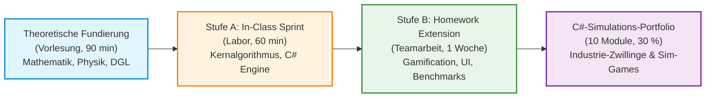
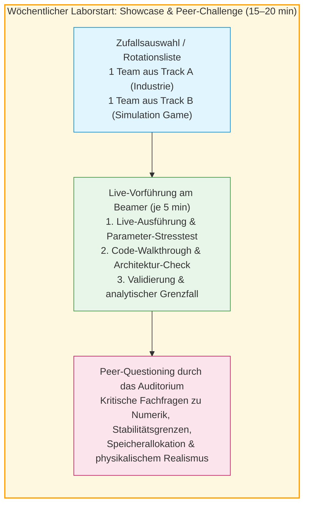

# Modulkonzept: Übungskatalog & C#-Simulations-Portfolio (Track A Industrie & Track B Game)
## Fachhochschule Oberösterreich – Campus Wels | Studiengang Automatisierungstechnik
### Lehrveranstaltung: Systemsimulation / Digitaler Zwilling

**Dokument-ID:** `Konzept/02_Uebungskatalog_und_Abschlussprojekt.md`  
**Geltungsbereich:** Vorlesungsbegleitende Laborübungen (Einheiten 01 bis 10) und 10-teiliges C#-Simulations-Portfolio  
**Referenzdokumente:** `GEMINI.md`, `Planung/Plan_01_Notationsstandard_und_Harmonisierung.md`, `Planung/03_Plan_Softwarearchitektur_und_Code.md`  
**Zielgruppe:** Studierende im 5. Semester B.Sc. Automatisierungstechnik, Dozenten und Laborleiter  
**Technologie-Stack:** C# 12 / .NET 8 & .NET 10, WPF, ScottPlot 5, SharpGL, Math.NET Numerics, MSAGL, Task Parallel Library (TPL)

---

## Inhaltsverzeichnis

1. [Didaktisches Gesamtkonzept & Labororganisation](#1-didaktisches-gesamtkonzept--labororganisation)
   - 1.1 Verzahnung von Vorlesung, Hands-on-Labor und Vibe-Coding / KI-gestütztem Arbeiten
   - 1.2 Das 2-Stufen-Übungsmodell mit Wahlkonzept („Pick your Track: Industrie vs. Gaming“)
   - 1.3 Wöchentliches „Showcase & Peer-Challenge“-Format (Live-Vorführung & Peer-Questioning)
   - 1.4 Matrix der chronologischen Technologie-Freigabe (Strikte Konsistenz!)
   - 1.5 Architektur- und Software-Qualitätsstandards („Goldene Regel“)
   - 1.6 Test-Driven Simulation & CI-Workflows
2. [Kapitelweiser Aufgabenkatalog (Einheit 01 bis 10)](#2-kapitelweiser-aufgabenkatalog-einheit-01-bis-10)
   - [Einheit 01: „Industrie-Löschmonitor vs. Retro Tank Duel“ (Ballistik & Luftwiderstand)](#einheit-01-industrie-löschmonitor-vs-retro-tank-duel-ballistik--luftwiderstand)
   - [Einheit 02: „Gamer-PC Kühlkörper-Optimizer vs. Waldbrand-Ausbreitung“ (WriteableBitmap FDM)](#einheit-02-gamer-pc-kühlkörper-optimizer-vs-waldbrand-ausbreitung-writeablebitmap-fdm)
   - [Einheit 03: „2D-CAD Fachwerkträger-Viewer vs. Space Radar / Blueprint Sketcher“ (WPF Canvas Vektoren)](#einheit-03-2d-cad-fachwerkträger-viewer-vs-space-radar--blueprint-sketcher-wpf-canvas-vektoren)
   - [Einheit 04: „Industrie-Prüfstand vs. Retro Arcade Telemetry“ (ScottPlot 5 Streaming)](#einheit-04-industrie-prüfstand-vs-retro-arcade-telemetry-scottplot-5-streaming)
   - [Einheit 05: „3D-Portalroboter vs. Arcade Claw Machine“ (SharpGL 3D-Szenengraph)](#einheit-05-3d-portalroboter-vs-arcade-claw-machine-sharpgl-3d-szenengraph)
   - [Einheit 06: „Partikelsturm-Benchmark vs. Zombie-Horde“ (TPL Parallel.For & Cache-Lokalität)](#einheit-06-partikelsturm-benchmark-vs-zombie-horde-tpl-parallelfor--cache-lokalität)
   - [Einheit 07: „Gittermastkran vs. Achterbahn-Tragwerk & Bridge Solver“ (Math.NET Cholesky-LGS & FEM)](#einheit-07-gittermastkran-vs-achterbahn-tragwerk--bridge-solver-mathnet-cholesky-lgs--fem)
   - [Einheit 08: „Segway-Balancer vs. SpaceX Falcon Hop“ (S-Function, RK4 & PID Anti-Windup)](#einheit-08-segway-balancer-vs-spacex-falcon-hop-s-function-rk4--pid-anti-windup)
   - [Einheit 09: „Fertigungslogistik vs. Freizeitpark-Express-Pass“ (Diskrete Ereignissimulation DES)](#einheit-09-fertigungslogistik-vs-freizeitpark-express-pass-diskrete-ereignissimulation-des)
   - [Einheit 10: „Pneumatischer Taktvorschub vs. Flipperautomat Pinball“ (Hybride Systeme & Zero-Crossing)](#einheit-10-pneumatischer-taktvorschub-vs-flipperautomat-pinball-hybride-systeme--zero-crossing)
3. [Das 10-teilige C#-Simulations-Portfolio (Säule 2a, 30 %)](#3-das-10-teilige-c-simulations-portfolio-säule-2a-30-)
   - 3.1 Zielsetzung & didaktischer Anspruch
   - 3.2 Software-Architekturrahmen („Goldene Regel der Simulationsarchitektur“)
   - 3.3 Die 4 gebündelten Labor-Meilensteine
   - 3.4 Bewertungsrubrik für das C#-Code-Portfolio
4. [Abnahme-, KI- und Prüfungsrichtlinien](#4-abnahme--ki--und-prüfungsrichtlinien)

---

## 1. Didaktisches Gesamtkonzept & Labororganisation

### 1.1 Verzahnung von Vorlesung, Hands-on-Labor und Vibe-Coding / KI-gestütztem Arbeiten

Die Lehrveranstaltung *Systemsimulation / Digitaler Zwilling* am Campus Wels der FH Oberösterreich qualifiziert angehende Automatisierungsingenieurinnen und -ingenieure für die Entwicklung digitaler Repräsentanten industrieller Systeme. Sie zeichnet sich durch eine synchrone Trias aus:
1. **Theoretische Fundierung (Vorlesung, 90 min):** Herleitung der mathematisch-physikalischen DGLn, Diskretisierungsverfahren, Stabilitätskriterien und Algorithmen.
2. **Hands-on In-Class Sprint (Labor, 60 min):** Unmittelbare praktische Umsetzung des Kernalgorithmus in C# unter Betreuung. Der Fokus liegt rein auf Mathematik, Logik und schneller Verifikation.
3. **Vertiefende Homework Extension (2er-Team, 1 Woche):** Modellkomplexitätssteigerung, Gamification-Elemente, reale Nichtlinearitäten, Parametervariationen, numerische Fehleranalysen und professionelle Visualisierung.



> [!TIP]
> **Vibe Coding & KI-Engineering-Kultur:**  
> Der Einsatz moderner KI-Assistenten (GitHub Copilot, Claude, ChatGPT) ist ausdrücklich erwünscht – **unter einer zentralen Voraussetzung:** Ingenieurmäßige Urteilskraft! Jedes Kapitel enthält explizite Prompting-Tipps und Dokumentationslinks, um KI-Halluzinationen abzuwehren, Versionskonflikte (z. B. veraltetes ScottPlot 4 vs. modernes ScottPlot 5) zu verhindern und saubere Schnittstellen zu erzwingen.

---

### 1.2 Das 2-Stufen-Übungsmodell mit Wahlkonzept („Pick your Track: Industrie vs. Gaming“)

Jede der Einheiten 01 bis 10 folgt einer strikten Zweistufigkeit:

- **Stufe A (In-Class Sprint – 60 min, Einzelarbeit oder Tandem):**
  - **Fokus:** Direkte Umsetzung des mathematischen Kerns ohne grafischen Ballast.
  - **Umfang:** Minimales C#-Konsolenprogramm oder vorgefertigte Starter-Vorlage.
  - **Erfolgsmetrik:** Ein lauffähiger Algorithmus nach spätestens 50 Minuten; 10 Minuten gemeinsame Auswertung & Fehlerdiskussion im Plenum.
- **Stufe B (Homework Extension – 1 Woche, festes 2er-Team):**
  - **Fokus:** Vertiefung, Parametervariation, Nichtlinearitäten und professionelle Visualisierung.
  - **Das Wahlmodell („Pick your Track: Industrie vs. Simulation Game“):**  
    > [!IMPORTANT]
    > **Keine Doppelbelastung – Genau EINE Aufgabe pro Woche!**  
    > Bei jeder wöchentlichen Hausübung (Termine T01 bis T10) wählen die 2er-Teams **GENAU EINE** der beiden angebotenen Aufgaben:
    > - **Track A (Industrie & Mechatronik):** Industrienahe Ingenieuraufgaben, digitale Zwillinge realer Produktionssysteme, mechatronische Prüfstände, Tragwerksstatik und Regelungstechnik.
    > - **Track B (Simulation Game & Gaming-Physik):** Gamification-Konzepte, Arcade- und Retro-Game-Physik, Sci-Fi-Navigation, interaktive Blueprint-Editoren und Spielemechaniken.
    > 
    > Beide Tracks basieren auf **exakt denselben mathematisch-physikalischen Vorlesungsinhalten** und erfordern denselben Programmier- und Modellierungsaufwand (ca. 4–5 Stunden pro Teamwoche). Es muss **nur ein Track pro Woche** bearbeitet und abgegeben werden – eine Doppelbelastung ist weder vorgesehen noch erforderlich! Beide Tracks führen zur maximalen Punktzahl (10 Punkte). Die Teams dürfen wöchentlich frei zwischen Track A und Track B wechseln oder sich semesterbegleitend auf einen Schwerpunkt festlegen.
  - **Dokumentation:** Markdown-Bericht (`README.md` im Übungsordner) inklusive Konvergenzdiagrammen, Messreihen und Parameteranalysen.
  - **Codequalität:** Strikte Einhaltung der OOP- und MVVM-Paradigmen, Entkopplung von Physik und UI, Clean Code nach C#-Styleguide.

---

### 1.3 Wöchentliches „Showcase & Peer-Challenge“-Format (Live-Vorführung & Peer-Questioning)

Um die fachliche Diskussionskultur, die Kritikfähigkeit und den ingenieurmäßigen Code-Review-Prozess im Laboralltag zu verankern, startet jede Laborübung (ab Einheit 02) mit dem **„Showcase & Peer-Challenge“-Format** (Gesamtdauer: ca. 15–20 Minuten):



#### 1. Zufallsauswahl & Rotationsprinzip
- Zu Beginn jedes Folgetermins werden per Zufall oder transparenter Rotationsliste **genau zwei Teams** an das Dozentenpult aufgerufen:
  - **Ein Team aus Track A (Industrie & Mechatronik)**
  - **Ein Team aus Track B (Simulation Game & Gaming-Physik)**
- Im Verlauf des Semesters kommt jedes Team mindestens einmal für eine Live-Vorführung am Beamer an die Reihe.

#### 2. Live-Präsentation am Beamer (5 Minuten pro Team)
Das aufgerufene 2er-Team führt seine Homework Extension live in der Entwicklungsumgebung (Visual Studio / JetBrains Rider) vor:
1. **Live-Ausführung & Stresstest:** Starten der Anwendung, Demonstration des Kernverhaltens und gezieltes Ausreizen der Parameter (z. B. extreme Schrittweiten, Lastsprünge, Windstöße oder Gitterfeinheiten).
2. **Architektur- & Solver-Check:** Kurzer Blick in den Quellcode: Saubere Entkopplung von Physik-Engine und UI nach der *Goldenen Regel*, Vermeidung von GC-Allokationen im Render-/Simulations-Loop, saubere Kapselung der DGLn/Zustände.
3. **Validierung & Grenzen:** Erläuterung der Konvergenz und des quantitativen Abgleichs mit dem analytischen Grenzfall.

#### 3. Peer-Questioning & Fach-Challenge durch das Plenum
Alle anderen Studierenden im Raum sind ausdrücklich **keine passiven Zuschauer**, sondern agieren als technische Gutachter und Auditoren:
- **Aufforderung zum Peer-Questioning:** Das Auditorium ist gefordert, kritische, fachlich fundierte Fragen einzubringen und Schwachstellen aufzudecken:
  - *Numerische Stabilität & Solver-Wahl:* „Was passiert, wenn die Schrittweite verdoppelt wird? Explodiert das System oder konvergiert es stabil?“
  - *Physikalischer Realismus vs. Fake-Animation:* „Löst die Anwendung tatsächlich das DGL-System oder wird eine vorberechnete Kurve/Spline abgefahren?“
  - *Code-Architektur & Performance:* „Werden im Render-Loop Objekte auf dem Managed Heap allokiert? Wie ist die Thread-Sicherheit bei Datenübergaben gelöst?“
  - *Grenzfall-Konsistenz:* „Entspricht das numerische Ergebnis im stationären Grenzfall exakt der theoretischen Formel?“
- **Didaktischer Mehrwert:** Konstruktive, fachlich anspruchsvolle Fragen aus dem Plenum fließen positiv in die mündliche Mitarbeit ein. Für die vortragenden Teams ist dieses Format die ideale Vorbereitung auf die spätere Video-Präsentation und die souveräne Diskussion mechatronischer Systeme.

---

### 1.4 Matrix der chronologischen Technologie-Freigabe (Strikte Konsistenz!)

> [!CAUTION]
> **Verbindliche Didaktik-Regel: KEIN Vorgreifen auf spätere Vorlesungsinhalte!**  
> In den Aufgabenstellungen (T01 bis T10) darf absolut nichts vorausgesetzt oder verlangt werden, was erst in späteren Kapiteln gelehrt wird. Die folgende Tabelle ist für alle Aufgaben und Lösungen bindend:

| Einheit / Kapitel | Erlaubter Technologie- & Bibliotheks-Stack | Strengstens verboten in dieser Einheit (Vorgreif-Sperre!) |
| :--- | :--- | :--- |
| **T01 (Kap 00+01)** | C# 12 / .NET 8/10 Console, `System.Numerics` (Vector2/4), Expliziter Euler / Heun (RK2), ASCII-Plots, CSV-Export, PPM-Bitmap-Array | **KEIN** WPF, **KEIN** ScottPlot, **KEIN** Multithreading, **KEIN** SharpGL, **KEINE** FEM |
| **T02 (Kap 02)** | WPF `WriteableBitmap`, 2D-Pixelpuffer (`byte[]`, `int[]`), FDM-Wärmeleitung / zelluläre Gitter, Color-Mapping, `DispatcherTimer` | **KEIN** WPF Canvas (Vektoren), **KEIN** ScottPlot, **KEIN** Multithreading (`Parallel.For`), **KEIN** SharpGL |
| **T03 (Kap 03)** | WPF `Canvas`, 2D-Vektorgrafiken (`Line`, `Path`, `Polygon`), Affine Welt-Bildschirm-Transformation, Drag-&-Drop, DIN-Bemaßung | **KEIN** ScottPlot, **KEIN** SharpGL 3D, **KEIN** Multithreading, **KEIN** Math.NET Cholesky, **KEINE** Steifigkeitsmatrizen / Stabkräfteberechnung (erst ab T07!) |
| **T04 (Kap 04)** | `ScottPlot 5` (`WpfPlot`, `DataStreamer`), MSAGL-Graphen, Ringpuffer (`CircularBuffer<T>`), Welford-Streaming-Statistik | **KEIN** SharpGL 3D, **KEIN** Multithreading / TPL, **KEIN** Math.NET Cholesky, **KEINE** S-Functions |
| **T05 (Kap 05)** | `SharpGL`, 3D-Szenengraph, Orbit-Kamera (Kugelkoordinaten), Matrix-Stack (`glPushMatrix`), Phong-Beleuchtung, Normalenvektoren | **KEIN** TPL Multithreading, **KEIN** Math.NET LGS, **KEINE** S-Functions, **KEINE** Event-Queues |
| **T06 (Kap 06)** | Task Parallel Library (TPL), `Parallel.For`, `ParallelOptions`, `Interlocked`, `CancellationToken`, Amdahl & Gustafson Fit, Cache-Optimierung | **KEIN** Math.NET Cholesky, **KEINE** S-Functions, **KEINE** Event-Queues |
| **T07 (Kap 07)** | `MathNet.Numerics`, Lineare Gleichungssysteme, Blockpartitionierung, Cholesky-Zerlegung, 2D/3D-Stabtragwerke (FEM), Lagerreaktionen | **KEINE** dynamischen ODE-Solver (RK4), **KEINE** S-Functions, **KEINE** Event-Queues |
| **T08 (Kap 08)** | Kontinuierliche Dynamik, S-Function-Architektur (`Derivatives`, `Outputs`, `Update`), RK4-Solver, PID-Regler, Anti-Windup Clamping | **KEINE** Diskrete Ereignissimulation (DES), **KEINE** Zero-Crossing Wurzelsuche |
| **T09 (Kap 09)** | Diskrete Ereignissimulation (DES), `PriorityQueue<TEvent, double>`, Kendall-Notation ($M/M/c/K$), Inversion / Box-Muller, Little's Gesetz | **KEINE** Hybriden Continuous-Discrete Umschaltungen (Zero-Crossing) |
| **T10 (Kap 10+11)**| Hybride Automaten, Zero-Crossing Wurzelsuche (Bisektion / Dekker), Zeno-Vermeidung, Stick-Slip Reibung, FMI/FMU Grundlagen | *Gesamter Semester-Stack steht uneingeschränkt zur Verfügung!* |

---

### 1.5 Architektur- und Software-Qualitätsstandards

Alle studentischen Lösungen müssen der im Skriptum definierten **Goldenen Regel der Simulationsarchitektur** ([Kapitel 11, Folie 356](file:///c:/Users/P28500/Desktop/Repositories/kurs-computer-simulation/Folien/11_Epilog/Folien.md#L356)) genügen:

> [!IMPORTANT]
> **Die Goldene Regel der Simulationsarchitektur:**
> 1. Die **Physik- und Simulationsmodelle** (Zustandsvektor $\mathbf{x}$, Ableitungen $\mathbf{f}(t, \mathbf{x}, \mathbf{u})$, Steifigkeitsmatrizen $\mathbf{K}$, Event-Queues) haben **keine Abhängigkeit** zu GUI-, Grafik- oder Logging-Frameworks (WPF, SharpGL, ScottPlot). Sie sind als reine `.NET`-Klassenbibliotheken zu implementieren.
> 2. Die **Visualisierung** (View) abonniert ausschließlich unveränderliche Zustandsabbilder (Snapshots, DTOs) oder konsumiert Daten über thread-sichere Ringpuffer (`CircularBuffer<T>`) und das WPF-Data-Binding (MVVM).
> 3. Rechenintensive Simulationen dürfen **niemals** auf dem UI-Thread ausgeführt werden. Der Solver läuft asynchron in Hintergrund-Tasks (`Task.Run`) und synchronisiert über `IProgress<T>` oder aggregierte Frame-Timer.

---

### 1.6 Test-Driven Simulation & CI-Workflows

Für alle numerischen Modelle sind begleitende Unit-Tests mit `xUnit` oder `MSTest` Pflicht (Referenzprojekt: [`Quellen/WS25/SimulationTests`](file:///c:/Users/P28500/Desktop/Repositories/kurs-computer-simulation/Quellen/WS25/SimulationTests)):
- **Energieerhaltungstests:** Für ungedämpfte Systeme (freies Pendel, elastischer Ball) muss die Gesamtenergie $E_{\text{tot}} = E_{\text{kin}} + E_{\text{pot}}$ im Zeitverlauf bis auf Integrationsfehlerordnung $\mathcal{O}(\Delta t^p)$ konstant bleiben.
- **Analytische Grenzfallprüfung:** Vergleich numerischer Ergebnisse mit geschlossenen analytischen Lösungen bei trivialen Randbedingungen (z. B. Schiefer Wurf im Vakuum, stationäre Endtemperatur des Stabes).
- **Invarianzprüfungen:** Statische Fachwerke müssen Translations- und Rotationsinvarianten erfüllen (Summe aller Kräfte und Momente exakt $\vec{0}$).

---

## 2. Kapitelweiser Aufgabenkatalog (Einheit 01 bis 10)

---

### Einheit 01: „Industrie-Löschmonitor vs. Retro Tank Duel“ (Ballistik & Luftwiderstand)

#### Fachlicher Bezug & Lernziele
- **Vorlesung:** [Kapitel 01: Einführung](file:///c:/Users/P28500/Desktop/Repositories/kurs-computer-simulation/Folien/01_Einführung/Folien.md) – Modellbegriff, Zustandsraum, Zeitdiskretisierung, explizites Euler-Verfahren, Prädiktor-Korrektor (Heun).
- **Quellen-Referenz:** [`Quellen/WS24/DynamischBallwurf1D`](file:///c:/Users/P28500/Desktop/Repositories/kurs-computer-simulation/Quellen/WS24/DynamischBallwurf1D).
- **Technologie-Status:** **Reine C#-Konsolenapplikation!** Noch *KEIN* WPF Canvas, noch *KEIN* ScottPlot! Visualisierung via Konsole (ASCII-Art / Tabellen) oder CSV-Export.
- **Lernziele:**
  1. Ableitung der 2D-Bewegungsgleichung eines Projektils unter Gravitation, Gegenwind und nichtlinearer quadratischer Luftreibung ($F_{\text{w}} \propto v_{\text{rel}}^2$).
  2. Implementierung des expliziten Euler- und Heun-Verfahrens mit sauberer Vektorkapselung (`System.Numerics.Vector2`).
  3. Konzeption einer automatisierten Parameterstudie und Trefferalgorithmus für ein Ziel in hügeligem Gelände.

#### Mathematisches Modell
Zustandsvektor: $\mathbf{x} = \begin{bmatrix} x & y & v_x & v_y \end{bmatrix}^\top \in \mathbb{R}^4$.  
Windvektor: $\mathbf{w} = \begin{bmatrix} w_x & 0 \end{bmatrix}^\top$. Relativgeschwindigkeit: $\mathbf{v}_{\text{rel}} = \begin{bmatrix} v_x - w_x & v_y \end{bmatrix}^\top$, Betrag $v_{\text{rel}} = \|\mathbf{v}_{\text{rel}}\|$.  
DGL-System 1. Ordnung:
$$\dot{x} = v_x, \quad \dot{y} = v_y$$
$$\dot{v}_x = -\frac{\rho \, c_{\text{w}} A}{2m} v_{\text{rel}} (v_x - w_x), \quad \dot{v}_y = -g - \frac{\rho \, c_{\text{w}} A}{2m} v_{\text{rel}} v_y$$
Konstanten: $g = 9{,}81\,\text{m/s}^2$, Luftdichte $\rho = 1{,}225\,\text{kg/m}^3$, Masse $m = 10{,}0\,\text{kg}$, Kaliber-Radius $r = 0{,}06\,\text{m}$ ($A = \pi r^2$), $c_{\text{w}} = 0{,}25$.

---

#### Stufe A: In-Class Sprint (60 min) – „Artillery Strike: Berechne den Einschlag“
- **Aufgabenstellung:**
  1. Erstellen Sie eine C#-Konsolenapplikation `ArtilleryStrikeSprint`.
  2. Kapseln Sie den Zustand in ein `struct ProjectileState(double X, double Y, double Vx, double Vy)`.
  3. Implementieren Sie den expliziten Euler-Schritt: $\mathbf{x}_{k+1} = \mathbf{x}_k + \Delta t \cdot \mathbf{f}(t_k, \mathbf{x}_k)$.
  4. Feuern Sie eine Granate ab mit $v_0 = 150\,\text{m/s}$, $\alpha = 45^\circ$, Abschusshöhe $y_0 = 0\,\text{m}$, Windstille ($w_x = 0$) bei Schrittweiten $\Delta t = 0{,}01\,\text{s}$ und $\Delta t = 0{,}1\,\text{s}$.
  5. Simulieren Sie bis zum Bodenkontakt ($y \le 0$) und interpolieren Sie den exakten Auftreffpunkt $x_{\text{impact}}$ linear zwischen dem letzten Schritt über dem Boden und dem ersten Schritt unter dem Boden.
  6. Geben Sie die Wurfweite und Flugdauer auf der Konsole aus und vergleichen Sie mit dem analytischen Vakuumwert:
     $$x_{\text{vakuum}} = \frac{v_0^2 \sin(2\alpha)}{g} = \frac{150^2 \cdot 1}{9{,}81} \approx 2293{,}6\,\text{m}$$
- **Erwartetes Ergebnis:** Unter Luftwiderstand sinkt die Reichweite drastisch auf $\approx 1150\text{--}1200\,\text{m}$. Der Unterschied zwischen Euler $\Delta t=0{,}1$ und $\Delta t=0{,}01$ wird transparent sichtbar.

---

#### Stufe B: Homework Extension (2er-Team, 1 Woche) – Wahlmodell („Pick your Track“)

> [!IMPORTANT]
> **Pick your Track (Wahlmodell – GENAU EINE Aufgabe):**  
> Jedes 2er-Team wählt für die Homework Extension **GENAU EINE** der beiden folgenden Aufgaben: **Track A (Industrie)** ODER **Track B (Simulation Game)**. Eine Bearbeitung beider Tracks ist weder gefordert noch nötig (keine Doppelbelastung!). Beide Tracks basieren auf derselben Physik und DGL-Integration und führen zur maximalen Punktzahl (10 Punkte).

- **Track A (Industrie): Automatisierter Industrie-Löschmonitor / Schüttgut-Injektor**
  - **Industrie-Szenario:** Modellierung einer industriellen Hochdruck-Löschanlage (Löschmonitor) zur automatisierten Brandbekämpfung auf einem Werksgelände oder eines pneumatischen Granulat-Injektors zur Silobefüllung.
  - **DGL-System & Relativwind:** Auswurf unter Gravitation, nichtlinearem quadratischem Strömungswiderstand und variierendem Relativwind $\mathbf{w} = [w_x, 0]^\top$.
  - **Geländehindernis:** Das Werksgelände weist ein unebenes Sinus-Bodenprofil auf: $y_{\text{Boden}}(x) = 50 \cdot \sin(0{,}002 \cdot x) + 20 \cdot \cos(0{,}005 \cdot x)$. Der Brandherd bzw. das Silo liegt bei $x_{\text{Ziel}} = 1400\,\text{m}, y_{\text{Ziel}} = y_{\text{Boden}}(1400)$.
  - **Heun-Verfahren (RK2):** Implementieren Sie das Heun-Verfahren und vergleichen Sie Genauigkeit und numerische Stabilität gegen Euler bei grober Schrittweite ($\Delta t = 0{,}5\,\text{s}$).
  - **Stochastischer Winddrift:** Bei jedem Einsatz weht Gegen- oder Rückenwind $w_x \sim \mathcal{U}(-15, +15)\,\text{m/s}$.
  - **Automatischer Zielrechner:** Bestimmen Sie bei gegebener Austrittsgeschwindigkeit $v_0 = 160\,\text{m/s}$ automatisiert den erforderlichen Elevationswinkel $\alpha \in [10^\circ, 80^\circ]$ via Bisektion oder Newton-Verfahren, der den Zielbereich innerhalb $\pm 2{,}0\,\text{m}$ trifft.
  - **Visualisierung:** ASCII-Art-Darstellung der Flugbahn im Konsolenfenster ($80 \times 25$) oder tabellarischer `.csv`-Export.

- **Track B (Simulation Game): Retro Tank Duel (2D-Artillerie-Game mit Wind & Höhenprofil)**
  - **Game-Szenario:** Klassisches rundenbasiertes Artillerie-Duell im Retro-Stil (*Scorched Earth*, *Worms*, *Artillery Strike*).
  - **Spielwelt:** Panzer duellieren sich über hügeligem Terrain mit Höhenprofil $y_{\text{Boden}}(x) = 50 \cdot \sin(0{,}002 \cdot x) + 20 \cdot \cos(0{,}005 \cdot x)$. Ein feindlicher Panzer steht bei $x_{\text{Ziel}} = 1400\,\text{m}, y_{\text{Ziel}} = y_{\text{Boden}}(1400)$.
  - **Flugphysik:** Numerische Flugbahnintegration mit quadratischem Luftwiderstand und Heun-Integrator (RK2).
  - **Bodenkollision:** Detektion des Aufschlags bei $y_{\text{Projektil}}(t) \le y_{\text{Boden}}(x_{\text{Projektil}}(t))$ mit linearer Schnittpunkt-Interpolation.
  - **Stochastischer Rundenwind:** Jede Runde wechselt der Windvektor zufällig $w_x \sim \mathcal{U}(-15, +15)\,\text{m/s}$.
  - **Automatischer KI-Zielrechner:** Implementieren Sie einen Bot-Zielrechner (Bisektion / Winkelsweep $\alpha \in [10^\circ, 80^\circ]$), der bei $v_0 = 160\,\text{m/s}$ den Trefferwinkel für den feindlichen Panzer ermittelt.
  - **Visualisierung:** ASCII-Art Flugbahn-Plotter auf der Textkonsole oder Export der Trajektoriendaten als `.csv`.

- **Bewertungskriterien (10 Punkte – einheitlich für Track A und Track B):**
  - [3 P.] Korrekte Implementierung von Euler und Heun mit Relativwind-Physik.
  - [3 P.] Exakte numerische Kollisionserkennung mit dem analytischen Geländeprofil.
  - [2 P.] Robuster Schusswinkel-Finder (Bisektion oder Newton-Verfahren).
  - [2 P.] Dokumentation: Tabelle mit Konvergenzvergleich (Euler vs. Heun) und ASCII/CSV-Trajektorien.

---

#### 🔍 Peer-Review & Leitfragen für das Plenum
Beim wöchentlichen „Showcase & Peer-Challenge“ prüft das Auditorium die vorgeführten Lösungen beider Tracks kritisch auf folgende typische Schwachstellen und Fallstricke:
- **Fake-Physik vs. echte DGL:** Wird der Luftwiderstand in jedem Zeitschritt vektoriell aus der *Relativgeschwindigkeit* $\|\mathbf{v} - \mathbf{w}\|$ berechnet, oder handelt es sich um eine vereinfachte analytische Parabel mit aufgesetztem Offset?
- **Schrittweiten-Explosion bei Euler:** Was passiert, wenn die Schrittweite $\Delta t$ live am Beamer verdoppelt oder auf $0{,}5\,\text{s}$ gesetzt wird? Zeigt der explizite Euler die theoretisch erwartete Energieexplosion, während das Heun-Verfahren noch robust konvergiert?
- **Kollisions-Tunneling & Schnittpunkt:** Taucht das Projektil bei größeren Zeitschritten sichtbar in das Höhenprofil ein (Bodenpenetration), oder wird der Aufschlagspunkt über eine lineare Schnittpunkt-Interpolation exakt bestimmt?
- **Vorzeichenkonsistenz der Winddrift:** Wirkt Gegenwind ($w_x < 0$) physikalisch bremsend und steilt die Flugbahn ab, oder führt ein Vorzeichenfehler im Relativwindvektor $\mathbf{v}_{\text{rel}} = \mathbf{v} - \mathbf{w}$ zu unphysikalischem Vorwärtsschub?

---

#### 💡 Online-Recherche & Vibe-Coding-Guide (Einheit 01)
- **Empfohlene Suchbegriffe:** `Euler vs Heun method C# implementation`, `projectile motion quadratic drag relative wind`, `System.Numerics Vector2 trajectory simulation`.
- **Offizielle Dokumentation:** [Microsoft Learn: System.Numerics.Vector2](https://learn.microsoft.com/de-de/dotnet/api/system.numerics.vector2), [Wikipedia: Heun's method](https://en.wikipedia.org/wiki/Heun%27s_method).
- **Vibe-Coding Prompting-Tipp:**
  > *„Schreibe mir eine reine C#-Klasse `BallisticEngine` ohne jede externe UI-Bibliothek (kein WPF, kein ScottPlot). Sie soll nur mit `double` oder `System.Numerics.Vector2` arbeiten. Implementiere das Heun-Verfahren (RK2) für quadratischen Luftwiderstand mit Relativwind $\mathbf{w}$. Trenne den mathematischen Zustand strikt von der Ein-/Ausgabe.“*

---

### Einheit 02: „Gamer-PC Kühlkörper-Optimizer vs. Waldbrand-Ausbreitung“ (WriteableBitmap FDM)

#### Fachlicher Bezug & Lernziele
- **Vorlesung:** [Kapitel 02: Visualisierung 2D Pixel](file:///c:/Users/P28500/Desktop/Repositories/kurs-computer-simulation/Folien/02_Visualisierung_2D_Pixel/Folien.md) – Pixelraster, Farbräume, `WriteableBitmap`, 2D-Finite-Differenzen-Methode (FDM) für Wärmeleitung.
- **Technologie-Status:** WPF mit `Image`-Control und `WriteableBitmap`. Noch *KEIN* Canvas (keine Vektorobjekte), noch *KEIN* ScottPlot, noch *KEIN* Multithreading (`Parallel.For` ist erst in Kap 06 erlaubt!).
- **Lernziele:**
  1. Diskretisierung der 2D-Wärmeleitungsgleichung mit dem 5-Punkt-Differenzenstern auf einem $N \times M$ Gitter.
  2. Beachtung des Von-Neumann-Stabilitätskriteriums: $\Delta t \le \frac{\Delta x^2}{4 a_{\max}}$.
  3. Höchst performantes Pixel-Rendering via `WriteableBitmap.Lock()`, direkten Pointer-Zugriff (`unsafe byte*`) oder `Marshal.Copy`.

#### Mathematisches Modell
2D-Wärmeleitungsgleichung mit ortsabhängiger Temperaturleitfähigkeit $a(x,y) = \frac{\lambda(x,y)}{\rho(x,y) c_{\text{p}}(x,y)}$ und Wärmequelle $\dot{q}_{\text{v}}$:
$$\frac{\partial T}{\partial t} = a(x,y) \left( \frac{\partial^2 T}{\partial x^2} + \frac{\partial^2 T}{\partial y^2} \right) + \frac{\dot{q}_{\text{v}}(x,y)}{\rho c_{\text{p}}}$$
Expliziter FDM-Zeitschritt:
$$T_{i,j}^{k+1} = T_{i,j}^k + \Delta t \left[ a_{i,j} \frac{T_{i+1,j}^k + T_{i-1,j}^k + T_{i,j+1}^k + T_{i,j-1}^k - 4 T_{i,j}^k}{\Delta x^2} + \frac{\dot{q}_{i,j}}{\rho c_{\text{p}}} \right]$$

---

#### Stufe A: In-Class Sprint (60 min) – „Heatmap-Renderer in WriteableBitmap“
- **Aufgabenstellung:**
  1. Erstellen Sie ein WPF-Fenster mit einem `<Image x:Name="PixelDisplay"/>` ($128 \times 128$ Pixel).
  2. Initialisieren Sie eine `WriteableBitmap(128, 128, 96, 96, PixelFormats.Bgr32, null)` und zwei Puffer `double[128, 128]` (`T_old`, `T_new`).
  3. Randbedingungen: Alle vier Ränder fix auf $T = 20\,^\circ\text{C}$ (Dirichlet). Im Zentrum ($x \in [58, 70], y \in [58, 70]$) konstante Wärmequelle mit $T = 100\,^\circ\text{C}$.
  4. Führen Sie pro Timer-Tick ($30\,\text{ms}$) einen FDM-Schritt aus ($a = 1{,}0 \times 10^{-4}\,\text{m}^2/\text{s}, \Delta x = 1\,\text{mm}, \Delta t = 0{,}002\,\text{s}$).
  5. Schreiben Sie eine Farbpalette `uint ColorMap(double temp)`: $20\,^\circ\text{C} \to \text{Blau}$, $50\,^\circ\text{C} \to \text{Grün}$, $80\,^\circ\text{C} \to \text{Gelb}$, $100\,^\circ\text{C} \to \text{Rot}$.
  6. Kopieren Sie das Pixelarray über `WriteableBitmap.Lock()`, `BackBuffer` und `AddDirtyRect` in die Anzeige.
- **Erwartetes Ergebnis:** Eine butterweich aufkeimende, farbige Wärmewolke im WPF-Fenster.

---

#### Stufe B: Homework Extension (2er-Team, 1 Woche) – Wahlmodell („Pick your Track“)

> [!IMPORTANT]
> **Pick your Track (Wahlmodell – GENAU EINE Aufgabe):**  
> Jedes 2er-Team wählt für die Homework Extension **GENAU EINE** der beiden folgenden Aufgaben: **Track A (Industrie)** ODER **Track B (Simulation Game)**. Eine Bearbeitung beider Tracks ist weder gefordert noch nötig (keine Doppelbelastung!). Beide Tracks basieren auf der 2D-FDM-Wärmeleitungsgleichung und führen zur maximalen Punktzahl (10 Punkte).

- **Track A (Industrie): Gamer-PC & Server-Blade Kühlkörper-Optimizer**
  - **Industrie-Szenario:** Modellierung des Wärmetransports in einem hochintegrierten Halbleitergehäuse (CPU-Package, $200 \times 200$ Pixel, $\Delta x = 0{,}2\,\text{mm}$):
    - CPU-Die (Silizium, $40 \times 40$ Pixel, $120\,\text{W}$ Verlustleistung).
    - Wärmeleitpaste (dünne Schicht mit geringem $a$).
    - Kupfer-Heatspreader vs. Aluminium-Kühlrippen mit Luftkanälen.
  - **Konvektive Kühlung:** Implementieren Sie an den Kühlfinnen Robin-Randbedingungen: $-k \frac{\partial T}{\partial n} = h (T - T_{\text{Luft}})$.
  - **Lüfterausfall-Szenario:** Simulieren Sie den Unterschied zwischen ausgefallenem Lüfter ($h = 20\,\text{W/m}^2\text{K}$) und Hochleistungslüftung ($h = 250\,\text{W/m}^2\text{K}$).
  - **Stabilitätsanalyse:** Zeigen Sie experimentell die Gitterexplosion bei Überschreitung des Stabilitätskriteriums ($\Delta t > \Delta t_{\text{krit}}$).

- **Track B (Simulation Game): Waldbrand- & Lava-Ausbreitungssimulation**
  - **Game-Szenario:** 2D-Zellulärer Wärmediffusions- und Ausbreitungs-Automat auf einer Geländekarte ($200 \times 200$ Pixel).
  - **Physikalisches Gitter:** Jede Zelle besitzt Baumdichte, Bodenfeuchte und Zündtemperatur $T_{\text{Zünd}} = 300\,^\circ\text{C}$.
  - **Winddrift:** Ein globaler Windvektor treibt die Wärmewelle und Flammenfront bevorzugt in Windrichtung (gerichtete Finite-Differenzen 1. Ordnung).
  - **Zustandsautomat & Verbrennung:** Bei Überschreitung von $T_{\text{Zünd}}$ geht die Zelle in den Zustand „Brennend“ über, generiert 5 Sekunden lang exotherme Verbrennungswärme und erstirbt anschließend als unbrennbare Asche (schwarz).
  - **Stabilitätsanalyse:** Dokumentieren Sie das Umkippen in numerische Instabilität bei unzulässig großem Zeitschritt $\Delta t$.

- **Bewertungskriterien (10 Punkte – einheitlich für Track A und Track B):**
  - [3 P.] Korrekte FDM-Implementierung mit Materialgrenzen oder Brandzuständen.
  - [3 P.] Effiziente `WriteableBitmap`-Pixelmanipulation ohne Speicherlecks.
  - [2 P.] Experimenteller Nachweis der numerischen Instabilität bei $\Delta t > \Delta t_{\text{krit}}$.
  - [2 P.] Dokumentation: Analyse der Maximaltemperaturen und anschauliche Screenshots.

---

#### 🔍 Peer-Review & Leitfragen für das Plenum
Beim wöchentlichen „Showcase & Peer-Challenge“ prüft das Auditorium die vorgeführten Lösungen beider Tracks kritisch auf folgende typische Schwachstellen und Fallstricke:
- **Gitterexplosion & Von-Neumann-Stabilität:** Was passiert, wenn die Schrittweite $\Delta t$ live am Beamer über das theoretische Limit $\Delta t_{\text{krit}} = \frac{\Delta x^2}{4 a_{\max}}$ angehoben wird? Zeigt das Gitter das charakteristische oszillierende Schachbrettmuster und divergiert zu $\pm \infty$ bzw. `NaN`, oder wurde die Instabilität künstlich durch ein unzulässiges `Math.Clamp` maskiert?
- **Render-Performance & UI-Thread:** Bleibt die Benutzeroberfläche flüssig oder friert das Fenster ein? Werden die Pixel tatsächlich im unmanaged Speicher über `WriteableBitmap.Lock()` und direkten Zeigerzugriff/`Marshal.Copy` aktualisiert oder über langsame `SetPixel`-Aufrufe?
- **Double-Buffering des FDM-Gitters:** Werden für $T^{k}$ und $T^{k+1}$ zwei getrennte Puffer verwendet, oder wird das Gitter in-place überschrieben? *(In-place-Überschreibung erzeugt eine unphysikalische asymmetrische Ausbreitungsrichtung!)*
- **Physikalische Randbedingungen:** Werden an den Kühlfinnen echte konvektive Robin-Randbedingungen (Wärmeübergangskoeffizient $h$) bzw. Winddriften realistisch diskretisiert, oder nur statische Dirichlet-Randtemperaturen gehalten?

---

#### 💡 Online-Recherche & Vibe-Coding-Guide (Einheit 02)
- **Empfohlene Suchbegriffe:** `WriteableBitmap Lock BackBuffer performance C#`, `2D heat equation finite difference explicit stability`, `Von Neumann stability heat equation grid`.
- **Offizielle Dokumentation:** [Microsoft Learn: WriteableBitmap-Klasse](https://learn.microsoft.com/de-de/dotnet/api/system.windows.media.imaging.writeablebitmap).
- **Vibe-Coding Prompting-Tipp:**
  > *„Erstelle mir eine C#-Methode zur schnellen Pixelaktualisierung einer WPF `WriteableBitmap`. Nutze `unsafe` Zeigerarithmetik auf `bitmap.BackBuffer` oder `Marshal.Copy`. Verwende KEIN SetPixel und KEINE Canvas-Shapes, da dies zu langsam ist. Beachte: Single-Threaded, kein Parallel.For.“*

---

### Einheit 03: „2D-CAD Fachwerkträger-Viewer vs. Space Radar / Blueprint Sketcher“ (WPF Canvas Vektoren)

#### Fachlicher Bezug & Lernziele
- **Vorlesung:** [Kapitel 03: Visualisierung 2D Vektor](file:///c:/Users/P28500/Desktop/Repositories/kurs-computer-simulation/Folien/03_Visualisierung_2D_Vektor/Folien.md) – WPF `Canvas`, Vektor-Primitive (`Line`, `Path`, `Polygon`), Affine Welt-Bildschirm-Transformation, BoundingBox, DIN-Bemaßung, Pan & Zoom, Drag-and-Drop Interaktion.
- **Quellen-Referenz:** [`Quellen/WS25/FachwerkIdeal2D`](file:///c:/Users/P28500/Desktop/Repositories/kurs-computer-simulation/Quellen/WS25/FachwerkIdeal2D).
- **Technologie-Status:** WPF `Canvas` mit geometrischen 2D-Vektoren. Noch *KEIN* ScottPlot, noch *KEIN* SharpGL 3D, noch *KEIN* Multithreading!
- **Didaktische Kausalitäts-Sperre (Sehr wichtig!):** Der Vorlesungsstoff bis zu dieser Einheit behandelt rein die 2D-Vektorgrafik und geometrische Transformationen. Es dürfen in dieser Einheit **KEINE Steifigkeitsmatrizen**, **KEINE Cholesky-Zerlegung** und **KEINE Stabkräfteberechnungen** verlangt oder implementiert werden! (Die numerische Berechnung der Stabkräfte und Verformungen via Finite-Elemente-LGS erfolgt erst in Einheit 07).
- **Lernziele:**
  1. Beherrschung der 2D-Welt-zu-Bildschirm-Koordinatentransformation (Skalierung, Y-Achseninversion, automatisches Zentrieren mit BoundingBox und konfigurierbarem Randabstand/Margin).
  2. Beherrschung des WPF `Canvas` zur dynamischen Erzeugung und Modifikation von Vektorprimitiven (`Line`, `Ellipse`, `Path`, `Polygon`).
  3. Mathematisch exakte Vektorpfeile: Berechnung der Pfeilspitzengeometrie (Flügeldreiecke) aus Richtungsvektor und Einheitsnormalen via Drehmatrix.
  4. Technische Bemaßungsketten nach DIN 406 (Maßhilfslinien, Maßlinien mit echten Maßpfeilspitzen, zentrierter Maßtext).
  5. Flüssige interaktive Benutzerführung (Mouse Drag-and-Drop zur Echtzeit-Verschiebung von Geometrieknoten).

#### Mathematisches Transformationsmodell
Weltkoordinaten $(x_{\text{world}}, y_{\text{world}})$ in Metern $\to$ Canvas-Bildschirmkoordinaten $(x_{\text{screen}}, y_{\text{screen}})$ in Pixeln:
$$s = \min\left( \frac{w_{\text{canvas}} - 2 \cdot \text{margin}_x}{x_{\max} - x_{\min}}, \, \frac{h_{\text{canvas}} - 2 \cdot \text{margin}_y}{y_{\max} - y_{\min}} \right)$$
$$x_{\text{screen}} = \text{margin}_x + (x_{\text{world}} - x_{\text{min}}) \cdot s + x_{\text{offset}}$$
$$y_{\text{screen}} = h_{\text{canvas}} - \left[ \text{margin}_y + (y_{\text{world}} - y_{\text{min}}) \cdot s + y_{\text{offset}} \right]$$
Pfeilspitzen-Geometrie für einen Kraft- oder Geschwindigkeitsvektor $\vec{F} = [F_x, F_y]^\top$ mit Winkel $\phi = \operatorname{atan2}(F_y, F_x)$ und Spitzenlänge $L_{\text{tip}}$, Öffnungswinkel $\beta$:
$$\vec{p}_{\text{tip}} = \vec{p}_{\text{end}}, \quad \vec{p}_{\text{left}} = \vec{p}_{\text{tip}} - L_{\text{tip}} \begin{bmatrix} \cos(\phi - \beta) \\ \sin(\phi - \beta) \end{bmatrix}, \quad \vec{p}_{\text{right}} = \vec{p}_{\text{tip}} - L_{\text{tip}} \begin{bmatrix} \cos(\phi + \beta) \\ \sin(\phi + \beta) \end{bmatrix}$$

---

#### Stufe A: In-Class Sprint (60 min) – „2D-Trägergeometrie & Vektorpfeile auf WPF Canvas“
- **Aufgabenstellung:**
  1. Öffnen Sie ein leeres WPF-Projekt mit `<Canvas x:Name="TrussCanvas"/>`.
  2. Implementieren Sie eine Klasse `CoordinateTransformer`, die Weltkoordinaten (Meter) seitenverhältnistreu ($s_x = s_y = s$) mit BoundingBox und Margin auf Canvas-Pixel abbildet (inklusive Umkehrung der vertikalen Bildschirmachse).
  3. Definieren Sie ein Trägerdreieck mit 3 Knoten (Knoten 1: $(0,0)$, Knoten 2: $(4,0)$, Knoten 3: $(2,2)$ Meter) und verbinden Sie die Knoten über 3 Stäbe (`Line`).
  4. Zeichnen Sie Knoten als gefüllte Kreise (`Ellipse`) mit Text-Beschriftungen (`TextBlock` oder `FormattedText`).
  5. Zeichnen Sie an Knoten 3 einen vertikalen Lastpfeil $\vec{F} = (0, -10)\,\text{kN}$:
     - Schaftlinie vom Knoten zum Kraftendpunkt.
     - Pfeilspitze als geschlossenes gefülltes `Polygon`-Dreieck mit korrekter Ausrichtung.
  6. Reagieren Sie auf das `SizeChanged`-Event des Canvas: Bei Änderung der Fenstergröße muss sich das Trägerdreieck zentriert und ohne Verzerrung automatisch anpassen.
- **Erwartetes Ergebnis:** Ein mathematisch sauber zentriertes, seitenverhältnistreues Vektorträger-Dreieck mit korrekt ausgerichteter Lastpfeilspitze im WPF-Fenster.

---

#### Stufe B: Homework Extension (2er-Team, 1 Woche) – Wahlmodell („Pick your Track“)

> [!IMPORTANT]
> **Pick your Track (Wahlmodell – GENAU EINE Aufgabe):**  
> Jedes 2er-Team wählt für die Homework Extension **GENAU EINE** der beiden folgenden Aufgaben: **Track A (Industrie)** ODER **Track B (Simulation Game)**. Eine Bearbeitung beider Tracks ist weder gefordert noch nötig (keine Doppelbelastung!). Beide Tracks konzentrieren sich rein auf interaktive 2D-Vektorgrafik und führen zur maximalen Punktzahl (10 Punkte).

- **Track A (Industrie): Interaktiver „2D-CAD-Fachwerkträger-Viewer“**
  - **Tragwerks-Import & Topologie:**
    - Einlesen eines industriellen Tragwerks aus einer C#-Datenstruktur oder JSON-Datei: Liste von Knoten $(X_i, Y_i)$ in Metern und Stäben (Indexpaare $(i, j)$).
    - Mindestens 8 Knoten und 13 Stäbe (z. B. Pratt-, Warren- oder K-Fachwerkträger einer Werkhalle oder Brücke).
  - **Welt-Screen-Transformation mit BoundingBox & Auto-Fit:**
    - Automatische Berechnung der minimalen BoundingBox $[x_{\min}, x_{\max}] \times [y_{\min}, y_{\max}]$.
    - Dynamische Skalierung mit 10 % umlaufendem Margin unter strikter Wahrung des Seitenverhältnisses (Aspect Ratio Preservation).
  - **Normgerechte DIN-Bemaßungsketten (DIN 406):**
    - Horizontale Maßkette unterhalb des Untergurts mit Maßhilfslinien, Maßlinie, Maßpfeilen und Maßzahlen (z. B. `4.00 m`).
    - Vertikale Maßkette für die Gesamthöhe des Trägers.
  - **Vektorpfeile mit korrekter Pfeilspitzengeometrie:**
    - Zeichnen vorgegebener äußerer Lasten $\vec{F}_{\text{ext}}$ und Auflagerkräfte $\vec{F}_{\text{Lager}}$ an den Knoten.
    - Die Pfeilspitzen werden über Rotationsmatrizen dynamisch an der Pfeilrichtung ausgerichtet (geschlossene `Polygon`-Spitze mit konfigurierbarem Winkel $\beta = 15^\circ$ und Länge $12\,\text{px}$).
    - Anzeige von Auflagersymbolen (Dreieck für Festlager, Dreieck mit Rollenlinie für Loselager).
  - **Interaktives Knotenverschieben per Drag-and-Drop:**
    - Greifen eines beliebigen Trägerknotens mit der linken Maustaste und Verschieben über das Canvas.
    - Alle angebundenen Stäbe, Lastpfeile und Maßketten folgen dem Knoten in Echtzeit (`MouseMove`).
    - Tooltip oder Statusleiste zeigt während des Ziehens die aktuellen Weltkoordinaten $(X, Y)$ auf $1\,\text{mm}$ genau an.
  - *(Hinweis: Diese interaktive Visualisierung dient als direktes GUI-Frontend für Einheit 07, wo sie mit der Cholesky-Statik-Engine verheiratet wird!)*

- **Track B (Simulation Game): 2D Space Radar & Vector Navigation ODER Bridge Blueprint Sketcher**
  *(Wählen Sie innerhalb von Track B eine der beiden Game-/CAD-Varianten):*
  - **Option B.1: „2D Space Radar & Vector Navigation“ (Sci-Fi Vektor-Radar):**
    - Aufbau eines interaktiven Vektor-Radarschirms im Retro-Vektor-Stil (*Asteroids*, *Elite*).
    - Spieler-Raumschiff als skaliertes Vektor-Polygon im Zentrum.
    - Dynamische Geschwindigkeits- ($\vec{v}$) und Beschleunigungspfeile ($\vec{a}$) mit mathematisch sauberer Pfeilspitzengeometrie, die sich an Fluglage und Schub anpassen.
    - Hindernisse und Raumstationen als geschlossene Polygone mit lokalen Koordinaten.
    - Kurs-Prädiktor: Vorausschau-Trajektorie (gestrichelte Linie / Punkte), die die interpolierte Flugbahn für die nächsten 5 Sekunden anzeigt.
    - Interaktive Navigation: Mausrad-Zoom um den Cursor, Pan mit gedrückter mittlerer Maustaste.
  - **Option B.2: „Bridge Blueprint Sketcher“ (Interaktives Brückenbau-Zeichenbrett):**
    - Reines interaktives CAD-Zeichenbrett für ein Brückenbauspiel (ohne Statikberechnung):
    - Klick auf das Canvas platziert neue Trägerknoten (mit zuschaltbarem Grid-Snapping auf ein $0{,}5\,\text{m}$-Raster).
    - Ziehen einer Verbindungslinie zwischen zwei Knoten erzeugt einen neuen Stab (`Line`).
    - Kontextmenü zur Definition von Festlagern, Loselagern und Lastangriffspunkten.
    - Drag-and-Drop zum nachträglichen Justieren gesetzter Knoten mit Live-Aktualisierung der Stablängen.
    - Taste `Entf` löscht selektierte Stäbe oder Knoten.
    - Export der erstellten Brückentopologie (Knoten, Stäbe, Lager) als JSON-Datei – diese Topologiedatei bildet in Einheit 07 die Eingangsbasis für den Cholesky-Statiklöser!

- **Bewertungskriterien (10 Punkte – einheitlich für Track A und Track B):**
  - [3 P.] Exakte Welt-Bildschirm-Transformation mit Seitenverhältnistreue (Aspect Ratio) und Auto-Fit-BoundingBox.
  - [3 P.] Geometrisch exakte Vektorpfeile (korrekte Pfeilspitzengeometrie über Rotationsformeln) und Bemaßungsketten bzw. Vektor-Primitive.
  - [2 P.] Flüssiges interaktives Drag-and-Drop / Zeichnen auf dem Canvas mit Echtzeit-Aktualisierung.
  - [2 P.] Dokumentation: Saubere mathematische Beschreibung der affinen Transformation und Screenshots der interaktiven Anwendung.

---

#### 🔍 Peer-Review & Leitfragen für das Plenum
Beim wöchentlichen „Showcase & Peer-Challenge“ prüft das Auditorium die vorgeführten Lösungen beider Tracks kritisch auf folgende typische Schwachstellen und Fallstricke:
- **Verzerrung des Seitenverhältnisses (Aspect Ratio Distortion):** Was passiert, wenn das Anwendungsfenster stark in die Breite oder Höhe gezogen wird? Verzerren sich Trägerdreiecke, Kreise oder Raumschiffe unphysikalisch, oder skaliert der `CoordinateTransformer` mit einem einheitlichen isotropen Maßstab $s = \min(s_x, s_y)$ unter automatischer Randzentrierung?
- **Y-Achseninversion der Grafikausgabe:** Zeigen Vektoren mit positiver vertikaler Komponente nach oben (mathematisches Welt-Koordinatensystem), oder wurde die hardwareseitige WPF-Achsenrichtung (Y positiv nach unten) fälschlicherweise nicht invertiert?
- **Skalierungsinvarianz der Pfeilspitzen:** Behalten die Pfeilspitzen bei jeder Zoomstufe und Ausrichtung ihre konstante Pixelgröße und ihren definierten Öffnungswinkel $\beta$, oder wachsen/schrumpfen die Spitzen mit der Vektorlänge?
- **Vorgreif-Sperre & Architektur-Integrität:** Wurden die Vorgreif-Regeln strikt eingehalten (kein ScottPlot, keine voreilige FEM-Statikberechnung vor T07)? Bleibt das Drag-and-Drop der Knoten auch bei schnellen Mausbewegungen ohne Render-Artefakte und Memory Leaks flüssig?

---

#### 💡 Online-Recherche & Vibe-Coding-Guide (Einheit 03)
- **Empfohlene Suchbegriffe:** `WPF Canvas world to screen matrix transformation`, `WPF Polygon arrowhead calculation vector`, `WPF Canvas Drag and Drop shape manipulation`.
- **Offizielle Dokumentation:** [Microsoft Learn: Shapes and Basic Drawing in WPF](https://learn.microsoft.com/de-de/dotnet/desktop/wpf/graphics-multimedia/shapes-and-basic-drawing-in-wpf-overview).
- **Vibe-Coding Prompting-Tipp:**
  > *„Erstelle ein WPF-UserControl in C#, das Weltkoordinaten $(x, y)$ in Meter auf einen Canvas mappt. Y muss nach oben positiv sein. Implementiere BoundingBox-Autofit mit Margin und Seitenverhältnistreue. Berechne für Pfeilspitzen ein geschlossenes Dreiecks-Polygon aus Richtungsvektor und Einheitsnormalen. Verwende KEINE Statiklöser und KEIN ScottPlot, sondern native WPF Shapes (Line, Ellipse, Polygon).“*

---

### Einheit 04: „Industrie-Prüfstand vs. Retro Arcade Telemetry“ (ScottPlot 5 Streaming)

#### Fachlicher Bezug & Lernziele
- **Vorlesung:** [Kapitel 04: Visualisierung 2D Diagramme](file:///c:/Users/P28500/Desktop/Repositories/kurs-computer-simulation/Folien/04_Visualisierung_2D_Diagramme/Folien.md) – High-Performance Streaming mit ScottPlot 5, Ringpuffer, Welford-Algorithmus für rollierende Online-Statistik, MSAGL-Graphen.
- **Quellen-Referenz:** [`Quellen/WS25/SimulationMvvmPattern`](file:///c:/Users/P28500/Desktop/Repositories/kurs-computer-simulation/Quellen/WS25/SimulationMvvmPattern).
- **Technologie-Status:** WPF mit `ScottPlot.WPF` (Version 5.x) und `Microsoft.Msagl`. Noch *KEIN* SharpGL 3D, noch *KEIN* Multithreading-Solver!
- **Lernziele:**
  1. Beherrschung der modernen ScottPlot-5-API (`WpfPlot`, `Plot.Add.DataLogger`, `Plot.Add.DataStreamer`).
  2. Vermeidung von Garbage-Collection-Spikes durch vorallokierte Ringpuffer (`CircularBuffer<double>`).
  3. Numerisch stabile Online-Berechnung von gleitendem Mittelwert $\bar{x}_k$ und Varianz $s_k^2$ nach Welford ohne Historien-Speicherung.

---

#### Stufe A: In-Class Sprint (60 min) – „High-Speed Signal-Streamer mit ScottPlot 5“
- **Aufgabenstellung:**
  1. Binden Sie das NuGet-Paket `ScottPlot.WPF` (v5.x) in ein neues WPF-Projekt ein.
  2. Platzieren Sie ein `<ScottPlot.WPF.WpfPlot x:Name="TelemetryPlot"/>` im XAML.
  3. Konfigurieren Sie einen `DataLogger` oder `DataStreamer` für 2000 Datenpunkte.
  4. Starten Sie einen `DispatcherTimer` mit $20\,\text{ms}$ Intervall ($50\,\text{Hz}$).
  5. Generieren Sie ein synthetisches Telemetriesignal (z. B. Fahrzeug-Drehzahl mit Rauschen):
     $$\text{RPM}(t) = 3000 + 1500 \cdot \sin(0{,}5 \cdot t) + 200 \cdot \mathcal{N}(0, 1)$$
  6. Rufen Sie im Timer `TelemetryPlot.Refresh()` auf und messen Sie die tatsächliche Render-FPS.
- **Erwartetes Ergebnis:** Ein absolut ruckelfreies, flüssig durchlaufendes Diagramm bei $50\text{--}60\,\text{FPS}$ und minimaler CPU-Auslastung.

---

#### Stufe B: Homework Extension (2er-Team, 1 Woche) – Wahlmodell („Pick your Track“)

> [!IMPORTANT]
> **Pick your Track (Wahlmodell – GENAU EINE Aufgabe):**  
> Jedes 2er-Team wählt für die Homework Extension **GENAU EINE** der beiden folgenden Aufgaben: **Track A (Industrie)** ODER **Track B (Simulation Game)**. Eine Bearbeitung beider Tracks ist weder gefordert noch nötig (keine Doppelbelastung!). Beide Tracks basieren auf ScottPlot 5 und Welford-Statistik und führen zur maximalen Punktzahl (10 Punkte).

- **Track A (Industrie): Industrieller Antriebsprüfstand & Motoren-Telemetrie-Dashboard**
  - **Prüfstand-Cockpit:** Aufbau eines Monitorings für einen elektrischen Antriebsprüfstand mit 3 synchronisierten ScottPlot-Panels:
    - *Panel 1 (Drehzahl & Drehmoment):* Live-Signale $n(t)$ und $M(t)$ mit dynamisch berechnetem $\pm 3\sigma$-Toleranzband zur Erkennung von Lastsprüngen und Schwingungsanregungen.
    - *Panel 2 (Betriebskennfeld / Phasenplot):* Drehmoment über Drehzahl ($M$ vs. $n$) als Live-Streudiagramm zur Echtzeit-Bestimmung des Motorwirkungsgrads.
    - *Panel 3 (Echtzeit-Histogramm):* Kontinuierliche Verteilung der Lagervibrationen / Restwelligkeit mit überlagerter Gauss-Verteilung.
  - **Welford-Streaming-Klasse:** Numerisch stabile Rekursion nach B. P. Welford für gleitenden Mittelwert und Varianz ohne Puffer-Neuallokation:
    $$\bar{x}_k = \bar{x}_{k-1} + \frac{x_k - \bar{x}_{k-1}}{k}, \quad S_k = S_{k-1} + (x_k - \bar{x}_{k-1})(x_k - \bar{x}_k), \quad s_k = \sqrt{\frac{S_k}{k-1}}$$
  - **Prüfstandstopologie mit MSAGL:** Graphische Anzeige des mechanischen Antriebsstrangs (Motor $\to$ Kupplung $\to$ Getriebe $\to$ Lastbremse) mit sensorischen Messknoten via Microsoft MSAGL.
  - **Anomalie-Erkennung:** Automatische Alarme bei Lagervibrationen über Schwellwert oder unzulässigem Temperaturanstieg.

- **Track B (Simulation Game): Retro Arcade Racing & Flipper-Telemetrie-Dashboard**
  - **Arcade-Cockpit:** Aufbau eines Telemetrie-Dashboards für ein Rennspiel mit 3 synchronisierten ScottPlot-Panels:
    - *Panel 1 (Geschwindigkeit & RPM):* Live-Signal $v(t)$ und Motordrehzahl mit $\pm 3\sigma$-Toleranzband.
    - *Panel 2 (G-Kräfte & Bremsverzögerung):* Quer- und Längsbeschleunigung ($a_x, a_y$) als G-Force-Phasenplot (Drift- und Traktionsanalyse).
    - *Panel 3 (Echtzeit-Histogramm):* Kontinuierlich aktualisierte Verteilung der Rundenzeiten und Bremskräfte mit überlagerter Normalverteilungskurve.
  - **Welford-Streaming-Klasse:** Exakte Realisierung der numerisch stabilen Welford-Statistik im Render-Loop.
  - **Streckenprofil mit MSAGL:** Topologischer Graph der Rennstrecke mit Sektoren, Checkpoints und Boxengasse via Microsoft MSAGL.
  - **Anomalie-Erkennung:** Erkennen von Traktionsverlust ($|a_y| > 1{,}5\,g$) oder Motor-Überdrehern ($\text{RPM} > 7000$) mit Markern direkt im Diagramm.

- **Bewertungskriterien (10 Punkte – einheitlich für Track A und Track B):**
  - [3 P.] Saubere ScottPlot-5-Architektur ohne Speicherallokation im Render-Loop.
  - [3 P.] Exakte Realisierung der Welford-Statistik mit mathematischer Verifikation.
  - [2 P.] Ansprechendes Dashboard-Design mit synchronisierten Diagrammachsen.
  - [2 P.] Einbindung des System-/Streckengraphen via MSAGL.

---

#### 🔍 Peer-Review & Leitfragen für das Plenum
Beim wöchentlichen „Showcase & Peer-Challenge“ prüft das Auditorium die vorgeführten Lösungen beider Tracks kritisch auf folgende typische Schwachstellen und Fallstricke:
- **GC-Druck & Speicherallokationen im Render-Loop:** Allokiert der Timer-Tick bei jedem Frame neue `double[]`-Arrays oder LINQ-Abfragen auf dem Heap (überprüfbar mit dem Diagnostic Tools Profiler / `GC.GetTotalMemory(false)`), was zu spürbaren Mikrorucklern führt, oder wird strikt in vorallokierte Ringpuffer geschrieben?
- **Welford-Rekursion vs. naive Summation:** Werden Mittelwert und Varianz tatsächlich online nach der Welford-Formel ohne Vergangenheits-Array aktualisiert, oder wird naiv mit `Sum()` und $\sum x^2$ gerechnet (Gefahr von Auslöschung und Gleitkomma-Überlauf bei langen Messreihen)?
- **ScottPlot-API-Konsistenz (Version 5 vs. Version 4):** Werden moderne ScottPlot-5-Methoden (`Plot.Add.DataStreamer`, `Plot.Axes`) eingesetzt, oder schleichen sich veraltete, von LLMs halluzinierte ScottPlot-4-Aufrufe (`AddSignal`, alter Achsen-Zugriff) ein?
- **Achsensynchronisation bei Benutzerinteraktion:** Bleiben die $X$-Zeitachsen aller drei Diagrammpanels synchron gekoppelt, wenn der Benutzer in einem Plot horizontal scrollt oder zoomt?

---

#### 💡 Online-Recherche & Vibe-Coding-Guide (Einheit 04)
- **Empfohlene Suchbegriffe:** `ScottPlot 5 DataLogger WPF live streaming`, `Welford algorithm running mean variance C#`, `ScottPlot 5 histogram dynamic update`.
- **Offizielle Dokumentation:** [ScottPlot 5 Documentation & Cookbooks](https://scottplot.net/cookbook/5.0/), [Automatic Graph Layout (MSAGL) GitHub](https://github.com/microsoft/automatic-graph-layout).
- **Vibe-Coding Prompting-Tipp:**
  > *„Ich verwende ScottPlot Version 5 in WPF. Verwende NICHT die veraltete ScottPlot-4-Syntax (wie AddSignal, Plot.Axes). Zeige mir, wie man mit `Plot.Add.DataLogger()` oder `Plot.Add.DataStreamer()` ein rollierendes Live-Diagramm aufbaut. Halte das Rendering speicherallokationsfrei (0 Byte GC Allocations pro Frame).“*

---

### Einheit 05: „3D-Portalroboter vs. Arcade Claw Machine“ (SharpGL 3D-Szenengraph)

#### Fachlicher Bezug & Lernziele
- **Vorlesung:** [Kapitel 05: Visualisierung 3D OpenGL](file:///c:/Users/P28500/Desktop/Repositories/kurs-computer-simulation/Folien/05_Visualisierung_3D_OpenGL/Folien.md) – OpenGL Pipeline, SharpGL, Szenengraph-Hierarchie, Transformationsmatrizen (`glPushMatrix`/`glPopMatrix`), Orbit-Kamera.
- **Quellen-Referenz:** [`Quellen/WS25/VorlageSzenengraph3D`](file:///c:/Users/P28500/Desktop/Repositories/kurs-computer-simulation/Quellen/WS25/VorlageSzenengraph3D), [`Quellen/WS25/VorlageVisualisierung3D`](file:///c:/Users/P28500/Desktop/Repositories/kurs-computer-simulation/Quellen/WS25/VorlageVisualisierung3D).
- **Technologie-Status:** SharpGL (`OpenGLControl`) mit 3D-Szenengraph. Noch *KEIN* Multithreading! Noch *KEINE* Math.NET LGS!
- **Lernziele:**
  1. Mathematische Beherrschung der 3D-Sicht- und Modelltransformationen (`gluLookAt`, Translation, Rotation).
  2. Implementierung einer kardanfehlerfreien Orbit-Kamera in Kugelkoordinaten ($r, \theta, \phi$).
  3. Aufbau eines komponentenorientierten Szenengraphen zur Verwaltung mechatronischer Gelenkketten.

---

#### Stufe A: In-Class Sprint (60 min) – „SharpGL-Würfel mit Orbit-Kamera“
- **Aufgabenstellung:**
  1. Öffnen Sie die Vorlage `VorlageVisualisierung3D` mit `SharpGL.WPF.OpenGLControl`.
  2. Implementieren Sie die Kugelkoordinaten-Kamera in der Klasse `OrbitCamera`:
     $$x_{\text{eye}} = r \cos \phi \sin \theta + x_{\text{look}}, \quad y_{\text{eye}} = r \sin \phi + y_{\text{look}}, \quad z_{\text{eye}} = r \cos \phi \cos \theta + z_{\text{look}}$$
  3. Binden Sie Maus-Events an:
     - Linke Maustaste + Ziehen: Azimut $\theta$ und Elevation $\phi$ (Elevation auf $[-85^\circ, +85^\circ]$ klemmen).
     - Mausrad: Radius $r$ vergrößern/verkleinern.
  4. Zeichnen Sie im `OpenGLDraw`-Event ein 3D-Koordinatenkreuz ($X$: Rot, $Y$: Grün, $Z$: Blau) und einen schattierten 3D-Körper mit Normalenvektoren.
- **Erwartetes Ergebnis:** Flüssige interaktive 3D-Kamerafahrt um das zentrale 3D-Objekt.

---

#### Stufe B: Homework Extension (2er-Team, 1 Woche) – Wahlmodell („Pick your Track“)

> [!IMPORTANT]
> **Pick your Track (Wahlmodell – GENAU EINE Aufgabe):**  
> Jedes 2er-Team wählt für die Homework Extension **GENAU EINE** der beiden folgenden Aufgaben: **Track A (Industrie)** ODER **Track B (Simulation Game)**. Eine Bearbeitung beider Tracks ist weder gefordert noch nötig (keine Doppelbelastung!). Beide Tracks basieren auf dem SharpGL-3D-Szenengraph und führen zur maximalen Punktzahl (10 Punkte).

- **Track A (Industrie): 3D-Portalroboter & Automatisches Kleinteilelager (ASRS)**
  - **Industrie-Szenario:** Modellierung einer industriellen 3-Achs-Portalanlage zur automatisierten Palettierung und Werkstückhandhabung in einem Fertigungslager.
  - **Hierarchischer Szenengraph & Kinematik:**
    - Fester Hallen-Grundrahmen mit Längsführungsschienen.
    - $X$-Portalbrücke (fährt entlang der Hallenachse).
    - $Y$-Laufkatze (fährt quer auf der Portalbrücke).
    - $Z$-Teleskophubwerk (fährt vertikal auf und ab).
    - Pneumatischer 2-Backen-Parallelgreifer (synchron öffnend und schließend).
  - **OpenGL-Matrix-Stack:** Nutzen Sie rekursiv `glPushMatrix()` und `glPopMatrix()`, sodass jede Kinematikachse im lokalen Koordinatensystem ihres übergeordneten Bauteils transformiert wird.
  - **Beleuchtung & Material:** Aktivieren Sie `GL_LIGHTING`, setzen Sie diffuse und spekulare Materialfarben und berechnen Sie glatte Flächennormalen (`glNormal3f`).
  - **Interaktive Steuerung & Teach-in:** Manuelle Achsverfahrung per Tastatur/Slider und automatisches Anfahren vordefinierter Palettenkoordinaten zur Teileaufnahme.

- **Track B (Simulation Game): 3D Arcade Claw Machine (Jahrmarkt-Greifarm-Simulator)**
  - **Game-Szenario:** Vollständige mechatronische Nachbildung eines Jahrmarkt-Greifarm-Automaten in einem transparenten Glaskasten.
  - **Hierarchischer Szenengraph:**
    - Gehäuse (Glasquader mit Eckprofilen und Auswurfschacht).
    - $X$-Schlitten (Portalbrücke entlang der Gehäusetiefe).
    - $Y$-Laufkatze (fährt quer auf der Brücke).
    - $Z$-Seilzug / Teleskoparm (fährt vertikal nach unten).
    - 3-Finger-Greifer (Finger öffnen und schließen synchron über Gelenkwinkel).
  - **OpenGL-Matrix-Stack:** Kaskadierte Transformationen mit `glPushMatrix()` und `glPopMatrix()`.
  - **Interaktive Steuerung (Gamification):**
    - Tastatursteuerung (Pfeiltasten für $X/Y$, Leertaste startet den Absenk-, Greif- und Rückholzyklus).
    - Bunte geometrische Preise (Würfel, Kugeln, Sterne) auf dem Automatenboden.
  - **Greifmechanik & Beleuchtung:** Distanz-Kollisionsprüfung beim Zupacken; dynamische Spot-Beleuchtung auf das Spielfeld.

- **Bewertungskriterien (10 Punkte – einheitlich für Track A und Track B):**
  - [3 P.] Korrekter hierarchischer Szenengraph mit 4 Freiheitsgraden ($X, Y, Z, \text{Greifer}$).
  - [3 P.] Stabile Orbit-Kamera mit flüssiger Tastatur-/Maus-Interaktion.
  - [2 P.] Ansprechende Beleuchtung, Normalenvektoren und Materialfarben.
  - [2 P.] Greifmechanik mit einfacher Distanz-Kollisionsprüfung beim Aufnehmen eines Objekts.

---

#### 🔍 Peer-Review & Leitfragen für das Plenum
Beim wöchentlichen „Showcase & Peer-Challenge“ prüft das Auditorium die vorgeführten Lösungen beider Tracks kritisch auf folgende typische Schwachstellen und Fallstricke:
- **Hierarchischer Szenengraph & Matrix-Stack:** Bewegen sich die Subkomponenten (Laufkatze, Teleskophubwerk, Greiffinger) rein über lokale Transformationen via `glPushMatrix()` und `glPopMatrix()` mit, oder wurden Weltkoordinaten manuell errechnet? *(Schwachstellentest: Portal verfahren – bleibt der Greifer am Portal oder löst er sich ab?)*
- **Kardanfehler & Gimbal Lock der Kamera:** Was geschieht, wenn die Kamera senkrecht über den Nord- oder Südpol geschwenkt wird ($\phi = \pm 90^\circ$)? Kippt die Kameraansicht sprunghaft um oder ist die Elevation sauber auf z. B. $[-85^\circ, +85^\circ]$ begrenzt?
- **Flächennormalen & Beleuchtung:** Wirken die 3D-Körper plastisch mit sichtbarem Glanzpunkt (Specular Highlight), oder sind Flächen pechschwarz bzw. fleckig, weil Normalenvektoren (`glNormal3f`) fehlen oder durch falsche Skalierungsmatrizen verzerrt wurden?
- **Greifmechanik vs. Skript-Animation:** Basiert das Aufnehmen von Objekten auf einer echten geometrischen Abstands- bzw. BoundingBox-Prüfung zwischen Greiferbacken und Werkstück, oder wird das Objekt rein zeitgesteuert („Fake-Animation“) an die Klaue geheftet?

---

#### 💡 Online-Recherche & Vibe-Coding-Guide (Einheit 05)
- **Empfohlene Suchbegriffe:** `SharpGL WPF OpenGLControl camera gluLookAt`, `OpenGL spherical coordinates orbit camera`, `OpenGL hierarchical matrix stack glPushMatrix`.
- **Offizielle Dokumentation:** [SharpGL GitHub Repository](https://github.com/dwmkerr/sharpgl), [OpenGL 2.1 Reference Pages](https://registry.khronos.org/OpenGL-Refpages/gl2.1/).
- **Vibe-Coding Prompting-Tipp:**
  > *„Erstelle eine C#-Klasse für eine OpenGL Orbit-Kamera mit SharpGL. Berechne die Kameraposition aus Kugelkoordinaten $(r, \theta, \phi)$ und rufe `gl.LookAt()` auf. Beachte: Elevation $\phi$ muss gegen Gimbal Lock geschützt sein (z. B. auf $\pm 89^\circ$ clamped). Implementiere die Methoden `OnMouseMove` und `OnMouseWheel`.“*

---

### Einheit 06: „Partikelsturm-Benchmark vs. Zombie-Horde“ (TPL Parallel.For & Cache-Lokalität)

#### Fachlicher Bezug & Lernziele
- **Vorlesung:** [Kapitel 06: Multithreading](file:///c:/Users/P28500/Desktop/Repositories/kurs-computer-simulation/Folien/06_Multithreading/Folien.md) – Task Parallel Library (TPL), `Parallel.For`, Thread-Sicherheit, Amdahlsches Gesetz, CPU-Cache-Hierarchie, False Sharing.
- **Technologie-Status:** TPL, Multithreading, Benchmarking mit `Stopwatch`. Noch *KEIN* Math.NET Cholesky! Noch *KEINE* kontinuierlichen S-Functions!
- **Lernziele:**
  1. Praktische Beherrschung von `Parallel.For` und Vermeidung von Race Conditions (Double-Buffering, Partitionierung).
  2. Messung und mathematischer Fit des Speedups nach Amdahl:
     $$S(p) = \frac{1}{(1 - f_{\text{par}}) + \frac{f_{\text{par}}}{p}}$$
  3. Hardwarenahe Optimierung: Nachweis des dramatischen Performanceverlusts durch Cache-Misses (Row-Major vs. Column-Major).

---

#### Stufe A: In-Class Sprint (60 min) – „Partikel-Benchmark mit Parallel.For“
- **Aufgabenstellung:**
  1. Erstellen Sie eine C#-Konsolenapplikation `MultithreadingBenchmark`.
  2. Erzeugen Sie ein System aus $N = 100\,000$ Partikeln mit Positionen und Geschwindigkeiten.
  3. Berechnen Sie pro Zeitschritt die gravitative Wechselwirkung oder ein 2D-Flock-Verhalten seriell:
     $$\mathbf{v}_i^{k+1} = \mathbf{v}_i^k + \Delta t \cdot \mathbf{a}_i, \quad \mathbf{x}_i^{k+1} = \mathbf{x}_i^k + \Delta t \cdot \mathbf{v}_i^{k+1}$$
  4. Messen Sie die Ausführungszeit $T_{\text{seq}}$ über 50 Zeitschritte mittels `Stopwatch`.
  5. Parallelisieren Sie die Iteration mit `Parallel.For(0, N, i => { ... })`.
  6. Berechnen und drucken Sie Speedup $S = \frac{T_{\text{seq}}}{T_{\text{par}}}$ und parallele Effizienz $E = \frac{S}{p}$.
- **Erwartetes Ergebnis:** Signifikanter Speedup von $4\text{--}7\times$ auf einem modernen Multicore-PC.

---

#### Stufe B: Homework Extension (2er-Team, 1 Woche) – Wahlmodell („Pick your Track“)

> [!IMPORTANT]
> **Pick your Track (Wahlmodell – GENAU EINE Aufgabe):**  
> Jedes 2er-Team wählt für die Homework Extension **GENAU EINE** der beiden folgenden Aufgaben: **Track A (Industrie)** ODER **Track B (Simulation Game)**. Eine Bearbeitung beider Tracks ist weder gefordert noch nötig (keine Doppelbelastung!). Beide Tracks basieren auf TPL-Parallelisierung und Cache-Benchmarking und führen zur maximalen Punktzahl (10 Punkte).

- **Track A (Industrie): Industrieller Schüttgut- & Partikelsturm-Benchmark mit TPL**
  - **Industrie-Szenario:** Parallele Simulation eines industriellen Granulat-Schüttgutstroms ($N = 100\,000$ Partikel im Silo-Fallrohr) unter Schwerkraft und elastischer Nachbarschafts-Kollisionsabstoßung.
  - **Systematische Skalierungsreihe:**
    - Messen Sie die Rechenzeit für $p \in \{1, 2, 4, 6, 8, 12, 16, 24, 32\}$ Threads (`ParallelOptions.MaxDegreeOfParallelism`).
    - Führen Sie pro Messpunkt 5 Wiederholungen durch (ersten Lauf als JIT-Warmup verwerfen!).
  - **Identifikation des seriellen Anteils:**
    - Fitten Sie die Messkurve an Amdahls Gesetz und bestimmen Sie den seriellen Code-Anteil $s = 1 - f_{\text{par}}$.
  - **Hardware-Cache-Experiment (Row-Major vs. Column-Major):**
    - Führen Sie auf einer $4096 \times 4096$ Matrix eine 2D-Laplace-Glättung aus:
      - *Test A (Cache-freundlich):* Zeilenweiser Zugriff (äußere Schleife Zeilen, innere Schleife Spalten).
      - *Test B (Cache-feindlich):* Spaltenweiser Zugriff (äußere Schleife Spalten, innere Schleife Zeilen).
    - Dokumentieren Sie den extremen Leistungseinbruch (Faktor 4–10) und begründen Sie ihn anhand von Cache-Lines ($64\,\text{Byte}$) und CPU-Prefetching.

- **Track B (Simulation Game): Zombie-Horden-KI & Crowd-Simulation-Benchmark**
  - **Game-Szenario:** $N = 50\,000$ Zombies bewegen sich auf einem 2D-Gitter auf die nächstgelegenen Überlebenden zu.
  - **Schwarmverhalten:** Jeder Zombie scannt seine Nachbarschaft, verfolgt das Ziel und vermeidet Kollisionen mit anderen Zombies (Flocking / Separation).
  - **Thread-Sicherheit & Parallelisierung:** Parallele Aktualisierung mit `Parallel.For` unter Vermeidung von Race Conditions (Double-Buffering) und False Sharing.
  - **Skalierungsreihe & Amdahl-Fit:** Messreihe für $p \in \{1, \dots, 32\}$ Threads mit Bestimmung des maximal erreichbaren Speedups.
  - **Hardware-Cache-Experiment:** Identischer 2D-Laplace-Cache-Lokalitäts-Vergleich auf der $4096 \times 4096$ Matrix (Zeilen- vs. Spaltenzugriff).

- **Bewertungskriterien (10 Punkte – einheitlich für Track A und Track B):**
  - [3 P.] Korrekte und thread-sichere Parallelisierung ohne Race Conditions.
  - [3 P.] Saubere Messreihen mit Warmup, Standardabweichung und Amdahl-Fit.
  - [2 P.] Fundierter experimenteller Nachweis des Cache-Lokalitäts-Effekts.
  - [2 P.] Dokumentation: Aussagekräftige Diagramme und Hardware-Reflexion.

---

#### 🔍 Peer-Review & Leitfragen für das Plenum
Beim wöchentlichen „Showcase & Peer-Challenge“ prüft das Auditorium die vorgeführten Lösungen beider Tracks kritisch auf folgende typische Schwachstellen und Fallstricke:
- **Race Conditions & Nicht-Determinismus:** Werden gemeinsame Variablen (z. B. Partikelzähler, Kollisionssummen) ohne `Interlocked`-Operationen oder thread-lokale Akkumulatoren inkrementiert? *(Auditorium-Test: Mehrfaches Ausführen desselben Testlaufs – liefert die Simulation exakt dieselben Zahlen oder streuen die Ergebnisse zufällig?)*
- **False Sharing auf Cache-Lines:** Schreiben benachbarte Threads auf dicht beieinanderliegende Array-Felder innerhalb derselben 64-Byte-Cache-Zeile? Verursacht dies einen massiven Performance-Einbruch bei hoher Thread-Anzahl ($p \ge 8$)?
- **Amdahl-Fit & JIT-Warmup:** Wurde vor der Zeitmessung ein Warmup-Durchlauf ausgeführt, um JIT-Kompilierungszeit zu eliminieren? Ist der berechnete serielle Anteil $s = 1 - f_{\text{par}}$ physikalisch plausibel?
- **Hardware-Cache-Lokalität:** Zeigt das 2D-Laplace-Experiment den drastischen Geschwindigkeitsunterschied (Faktor 4–10) zwischen zeilenweisem (Row-Major, Cache-Hit) und spaltenweisem (Column-Major, Cache-Miss) Durchlaufen des Arrays?

---

#### 💡 Online-Recherche & Vibe-Coding-Guide (Einheit 06)
- **Empfohlene Suchbegriffe:** `C# Parallel.For MaxDegreeOfParallelism performance`, `Amdahl's law curve fitting non-linear least squares`, `cache line false sharing CPU benchmark C#`.
- **Offizielle Dokumentation:** [Microsoft Learn: Datenparallelität (Task Parallel Library)](https://learn.microsoft.com/de-de/dotnet/standard/parallel-programming/data-parallelism-task-parallel-library).
- **Vibe-Coding Prompting-Tipp:**
  > *„Schreibe mir einen C#-Benchmark mit `System.Diagnostics.Stopwatch`. Verwende `Parallel.For` mit expliziter Vorgabe von `ParallelOptions.MaxDegreeOfParallelism`. Achte darauf, dass keine gemeinsamen Variablen ohne `Interlocked` oder Thread-lokale Akkumulatoren modifiziert werden, um False Sharing zu vermeiden.“*

---

### Einheit 07: „Gittermastkran vs. Achterbahn-Tragwerk & Bridge Solver“ (Math.NET Cholesky-LGS & FEM)

#### Fachlicher Bezug & Lernziele
- **Vorlesung:** [Kapitel 07: Statische Modelle](file:///c:/Users/P28500/Desktop/Repositories/kurs-computer-simulation/Folien/07_Statische_Modelle/Folien.md) – Finite-Elemente-Methode (FEM) für Stabwerke, globale Steifigkeitsmatrix $\mathbf{K}$, Blockpartitionierung, Cholesky-Faktorisierung ($\mathbf{L}\mathbf{L}^\top$).
- **Quellen-Referenz:** [`Quellen/WS25/FachwerkElastisch3D`](file:///c:/Users/P28500/Desktop/Repositories/kurs-computer-simulation/Quellen/WS25/FachwerkElastisch3D), [`Quellen/WS24/StatischFachwerkElastisch2D`](file:///c:/Users/P28500/Desktop/Repositories/kurs-computer-simulation/Quellen/WS24/StatischFachwerkElastisch2D).
- **Technologie-Status:** `MathNet.Numerics` (Matrizen, Cholesky-Solver). Noch *KEINE* dynamischen S-Functions!
- **Rückgriff auf Einheit 03 (Verheiratung von Grafik & Statik-Engine):** In Einheit 03 wurde das grafische Vektor-Frontend (CAD-Viewer bzw. Bridge Blueprint Sketcher) auf dem WPF Canvas implementiert. In dieser Einheit schließen Sie den Kreis: Die dortige Visualisierung wird nun direkt mit der Math.NET Cholesky-Statik-Engine verheiratet! Aus den reinen Geometrie-Linien werden physikalisch belastete, farbkodierte Zug- und Druckstäbe mit realen Lagerkräften.
- **Lernziele:**
  1. Assemblierung der globalen Steifigkeitsmatrix aus Elementmatrizen:
     $$\mathbf{K}_e = \frac{E \cdot A}{L} \begin{bmatrix} \vec{n}\vec{n}^\top & -\vec{n}\vec{n}^\top \\ -\vec{n}\vec{n}^\top & \vec{n}\vec{n}^\top \end{bmatrix}$$
  2. Exakte Blockpartitionierung nach freien ($f$) und vorgeschriebenen ($p$) Freiheitsgraden:
     $$\mathbf{K}_{ff} \mathbf{u}_f = \mathbf{f}_f - \mathbf{K}_{fp} \mathbf{u}_p, \quad \mathbf{f}_p = \mathbf{K}_{pf} \mathbf{u}_f + \mathbf{K}_{pp} \mathbf{u}_p$$
  3. Berechnung von Lagerreaktionen und Stab-Normalspannungen $\sigma_i = E \cdot \epsilon_i$.

---

#### Stufe A: In-Class Sprint (60 min) – „Assemblierung & Cholesky-Löser“
- **Aufgabenstellung:**
  1. Binden Sie das NuGet-Paket `MathNet.Numerics` ein.
  2. Implementieren Sie eine Klasse `TrussAssembler2D` für ein Dreiecksträger-System (3 Knoten, 6 Freiheitsgrade).
  3. Assemblieren Sie die globale Matrix $\mathbf{K} \in \mathbb{R}^{6 \times 6}$ durch Aufsummieren der Elementsteifigkeiten.
  4. Blockpartitionieren Sie die Matrix für Fest- und Loselager (3 Lager-Freiheitsgrade, 3 freie Freiheitsgrade).
  5. Lösen Sie $\mathbf{u}_f$ via Cholesky: `K_ff.Cholesky().Solve(f_f)`.
  6. Berechnen Sie die Lagerkräfte $\mathbf{f}_p$ und prüfen Sie das globale Kraftgleichgewicht:
     $$\sum F_x = 0, \quad \sum F_y = 0$$
- **Erwartetes Ergebnis:** Numerisch exakte Knotenverschiebungen und Gleichgewicht bis auf Maschinengenauigkeit ($< 10^{-12}\,\text{N}$).

---

#### Stufe B: Homework Extension (2er-Team, 1 Woche) – Wahlmodell („Pick your Track“)

> [!IMPORTANT]
> **Pick your Track (Wahlmodell – GENAU EINE Aufgabe):**  
> Jedes 2er-Team wählt für die Homework Extension **GENAU EINE** der beiden folgenden Aufgaben: **Track A (Industrie)** ODER **Track B (Simulation Game)**. Eine Bearbeitung beider Tracks ist weder gefordert noch nötig (keine Doppelbelastung!). Beide Tracks basieren auf der FEM-Steifigkeitsmethode und Math.NET Cholesky und führen zur maximalen Punktzahl (10 Punkte).

- **Track A (Industrie): Gittermastkran & Industriehallen-Tragwerk (FEM-Cholesky verheiratet mit T03-CAD-Viewer)**
  - **Tragwerks-Modellierung & T03-Verheiratung:**
    - Übernehmen Sie das in Einheit 03 erstellte Datenmodell und den interaktiven Canvas-Viewer als Frontend.
    - Speisen Sie die Knotenkoordinaten und Stabverbindungen in die Math.NET Steifigkeits-Engine ein.
    - Erweitern Sie das Modell wahlweise auf ein 3D-Gittertragwerk (z. B. Kranturm mit Ausleger und Gegengewicht unter Wind- und Nutzlast, $\ge 16$ Knoten, 40 Stäbe) oder ein hochgradig unbestimmtes 2D-Hallen-Fachwerk.
  - **Cholesky-Löser & Blockpartitionierung:**
    - Assemblieren Sie $\mathbf{K} \in \mathbb{R}^{n \times n}$ und teilen Sie die Freiheitsgrade in freie ($f$) und gelagerte ($p$) DOFs auf:
      $$\mathbf{K}_{ff} \mathbf{u}_f = \mathbf{f}_f - \mathbf{K}_{fp} \mathbf{u}_p, \quad \mathbf{f}_p = \mathbf{K}_{pf} \mathbf{u}_f + \mathbf{K}_{pp} \mathbf{u}_p$$
    - Lösen Sie $\mathbf{u}_f$ via Cholesky-Zerlegung `K_ff.Cholesky().Solve(f_f)`.
  - **Visualisierung im T03-Canvas:**
    - Die berechneten Stabkräfte steuern nun die Linienfarben (Blau = Zugkraft, Rot = Druckkraft) und Linienstärken ($w \propto |N_i|$) direkt im interaktiven Canvas aus T03!
    - Die berechneten Lagerreaktionskräfte $\mathbf{f}_p$ werden als Kraftpfeile mit korrekter Pfeilspitze an den Lagern eingeblendet.
  - **Knicknachweis nach Euler & Validierung:**
    - Berechnung der Normalspannung $\sigma_i = E \cdot \epsilon_i$ und Euler-Knicklast $N_{\text{knick}} = \frac{\pi^2 E I}{L^2}$ für alle Druckstäbe.
    - Analytischer Nachweis des globalen Kraftgleichgewichts: $\sum \vec{F} = \vec{0}$ bis auf Maschinengenauigkeit.

- **Track B (Simulation Game): Achterbahn-Tragwerk & Bridge Constructor Physics Engine**
  - **Verheiratung mit dem Blueprint Sketcher aus T03:**
    - Importieren Sie die in T03 entworfene Brückentopologie oder ein 3D-Achterbahn-Looping-Tragwerk direkt in den Math.NET Cholesky-Solver.
  - **Dynamische Lastfahrt („Der schwere Zug / LKW“):**
    - Ein Zug oder LKW (Wanderlast $F_{\text{Last}} = 20\,\text{kN}$) rollt schrittweise über die Fahrbahnknoten der Brücke von links nach rechts.
    - In jedem Simulationsschritt wird das LGS gelöst und die aktuellen Stabkräfte berechnet.
  - **Echtzeit-Farbcodierung & Spannungsanzeige:**
    - Stäbe färben sich live auf dem Canvas: Blau (Zug), Rot (Druck), Gelb/Orange bei Annäherung an die Grenzlast ($|N_i| > 0{,}8 \cdot N_{\text{zul}}$).
  - **Stabbruch & Einsturzmechanik:**
    - Übersteigt eine Stabkraft die zulässige Grenzlast ($|N_i| \ge N_{\text{zul}} = 25\,\text{kN}$), reißt der Stab: Er wird aus der Steifigkeitsmatrix entfernt.
    - Die Matrix wird neu assembliert; ist das Resttragwerk kinematisch instabil (Matrix singulär), wird der Einsturz des Bauwerks animiert.
  - **Validierung:**
    - Automatisierter Check des globalen Kraftgleichgewichts $\sum \vec{F}_{\text{Lager}} + \sum \vec{F}_{\text{Last}} = \vec{0}$ in jedem Schritt der Überfahrt.

- **Bewertungskriterien (10 Punkte – einheitlich für Track A und Track B):**
  - [3 P.] Korrekte mathematische FEM-Formulierung und Cholesky-Blockpartitionierung via Math.NET.
  - [3 P.] Nahtlose Verheiratung mit der T03-Vektorvisualisierung (Echtzeit-Farbcodierung Zug/Druck und dynamische Lasterfassung).
  - [2 P.] Spannungs- und Knicklastanalyse (Euler) bzw. Stabbruch- und Einsturzsimulation.
  - [2 P.] Vollständiger Nachweis des globalen Kraftgleichgewichts im Markdown-Bericht.

---

#### 🔍 Peer-Review & Leitfragen für das Plenum
Beim wöchentlichen „Showcase & Peer-Challenge“ prüft das Auditorium die vorgeführten Lösungen beider Tracks kritisch auf folgende typische Schwachstellen und Fallstricke:
- **Globales Kraftgleichgewicht & Invarianten:** Ergibt die vektorielle Summe aller Auflagerreaktionskräfte $\mathbf{f}_p$ und eingeleiteten äußeren Lasten $\mathbf{f}_{\text{ext}}$ exakt $\vec{0}$ bis auf Maschinengenauigkeit ($< 10^{-10}\,\text{N}$)? *(Schwachstellentest: Live-Abfrage der Kräftesumme am Beamer).*
- **Blockpartitionierung vs. Penalty-Pfusch:** Wurden die Lagerbedingungen mathematisch exakt über Submatrizen ($\mathbf{K}_{ff}, \mathbf{K}_{fp}$) partitioniert und gelöst, oder wurde eine numerisch instabile „Penalty-Methode“ verwendet (künstlich riesige Zahlen auf der Hauptdiagonale von $\mathbf{K}$)?
- **Kinematische Instabilität bei Stabbruch:** Was passiert bei Überlastung, wenn ein Stab bricht und das Resttragwerk statisch unterbestimmt (mechanischer Mechanismus) wird? Fängt die Software die nicht mehr positiv definite Matrix sauber ab, oder stürzt die Applikation mit unbehandelter Cholesky-`NonPositiveDefiniteException` ab?
- **Konsistente Farbcodierung der Zug-/Druckstäbe:** Entsprechen die Farben auf dem Canvas tatsächlich den Vorzeichen der Normalkräfte ($N > 0$ Zug = Blau, $N < 0$ Druck = Rot)? Werden Knickstäbe (Euler-Knickfall) korrekt identifiziert?

---

#### 💡 Online-Recherche & Vibe-Coding-Guide (Einheit 07)
- **Empfohlene Suchbegriffe:** `Math.NET Numerics Matrix Cholesky solve C#`, `Direct stiffness method 3D truss assembly`, `truss reaction forces block partitioning`.
- **Offizielle Dokumentation:** [Math.NET Numerics Documentation](https://numerics.mathdotnet.com/), [Matrix Decomposition in Math.NET](https://numerics.mathdotnet.com/LinearEquations).
- **Vibe-Coding Prompting-Tipp:**
  > *„Nutze `MathNet.Numerics.LinearAlgebra.Double.DenseMatrix`. Erstelle mir eine C#-Methode, die eine globale Steifigkeitsmatrix anhand zweier Integer-Listen (`freeDofs`, `prescribedDofs`) in vier Submatrizen $K_{ff}, K_{fp}, K_{pf}, K_{pp}$ zerlegt und mit `Cholesky().Solve()` die freien Verschiebungen berechnet. Vermeide ineffiziente Schleifen.“*

---

### Einheit 08: „Segway-Balancer vs. SpaceX Falcon Hop“ (S-Function, RK4 & PID Anti-Windup)

#### Fachlicher Bezug & Lernziele
- **Vorlesung:** [Kapitel 08: Dynamische Modelle Kontinuierlich](file:///c:/Users/P28500/Desktop/Repositories/kurs-computer-simulation/Folien/08_Dynamische_Modelle_Kontinuierlich/Folien.md) – Simulink-artige S-Function-Architektur, Runge-Kutta-Verfahren 4. Ordnung (RK4), PID-Regelung, Aktorsättigung und Anti-Windup Clamping.
- **Quellen-Referenz:** [`Quellen/WS25/SFunctionContinuous`](file:///c:/Users/P28500/Desktop/Repositories/kurs-computer-simulation/Quellen/WS25/SFunctionContinuous).
- **Technologie-Status:** S-Function Block-Architektur, RK4-Solver. Noch *KEINE* Diskrete Ereignissimulation (DES)!
- **Lernziele:**
  1. Saubere Kapselung kontinuierlicher Systeme nach dem Vorbild von MATLAB/Simulink (`Derivatives`, `Outputs`, `Update`).
  2. Implementierung des klassischen Runge-Kutta-4-Solvers.
  3. Entwurf und Parametrierung eines PID-Reglers mit Begrenzung und bedingter Integration (Anti-Windup Clamping).

---

#### Stufe A: In-Class Sprint (60 min) – „DC-Motor als S-Function mit RK4“
- **Aufgabenstellung:**
  1. Öffnen Sie `SFunctionContinuous` und leiten Sie eine Klasse `DcMotorBlock : Block` ab.
  2. Zustandsvektor $\mathbf{x} = \begin{bmatrix} i_{\text{A}} & \omega & \theta \end{bmatrix}^\top$ (Strom, Drehzahl, Drehwinkel).
  3. Implementieren Sie die Ableitungen:
     $$\frac{\mathrm{d}i_{\text{A}}}{\mathrm{d}t} = \frac{u_{\text{A}} - R_{\text{A}} i_{\text{A}} - k_{\text{e}} \omega}{L_{\text{A}}}, \quad \frac{\mathrm{d}\omega}{\mathrm{d}t} = \frac{k_{\text{m}} i_{\text{A}} - d \cdot \omega - M_{\text{Last}}}{J}, \quad \frac{\mathrm{d}\theta}{\mathrm{d}t} = \omega$$
  4. Führen Sie einen Spannungssprung ($24\,\text{V}$) mit dem RK4-Verfahren aus:
     $$\mathbf{k}_1 = \mathbf{f}(t_k, \mathbf{x}_k), \quad \dots \quad \mathbf{x}_{k+1} = \mathbf{x}_k + \frac{h}{6}(\mathbf{k}_1 + 2\mathbf{k}_2 + 2\mathbf{k}_3 + \mathbf{k}_4)$$
  5. Plotten oder protokollieren Sie Strom und Drehzahl über der Zeit.
- **Erwartetes Ergebnis:** Exakte Nachbildung des Motor-Einschwingverhaltens ohne numerische Dämpfung.

---

#### Stufe B: Homework Extension (2er-Team, 1 Woche) – Wahlmodell („Pick your Track“)

> [!IMPORTANT]
> **Pick your Track (Wahlmodell – GENAU EINE Aufgabe):**  
> Jedes 2er-Team wählt für die Homework Extension **GENAU EINE** der beiden folgenden Aufgaben: **Track A (Industrie)** ODER **Track B (Simulation Game)**. Eine Bearbeitung beider Tracks ist weder gefordert noch nötig (keine Doppelbelastung!). Beide Tracks basieren auf kontinuierlicher S-Function-Dynamik, RK4 und PID Anti-Windup und führen zur maximalen Punktzahl (10 Punkte).

- **Track A (Industrie): Industrieller Segway-Balancer / Inverses Pendel auf Wagen**
  - **Industrie-Szenario:** Mechatronische Lageregelung eines selbstbalancierenden Transportfahrzeugs (Segway / Inverses Pendel auf verfahrbarem Wagen) für die fahrerlose Intralogistik.
  - **DGL-System (4. Ordnung):** Wagenposition $x(t)$, Geschwindigkeit $\dot{x}(t)$, Pendelneigungswinkel $\theta(t)$, Winkelgeschwindigkeit $\dot{\theta}(t)$, gekoppelt mit Motorkraft und Schwerkraftmoment.
  - **Kaskadierter PID-Regler:** Stabilisierung der aufrechten Gleichgewichtslage ($\theta_{\text{soll}} = 0^\circ$) und Einregelung der Wagenposition.
  - **Aktorsättigung & Anti-Windup Clamping:** Die Stellkraft bzw. Motorspannung ist physikalisch limitiert ($|F_{\text{Motor}}| \le F_{\max}$). Läuft der Regler in die Begrenzung und weisen Fehler sowie Stellgröße gleiches Vorzeichen auf, wird die Integration des I-Anteils gestoppt (`dxi = 0`).
  - **Störfall-Experiment:** Injizieren Sie bei $t = 3\,\text{s}$ eine Stoßkraft auf das Pendel. Demonstrieren Sie im ScottPlot-Diagramm, dass das System mit Anti-Windup rasch und aperiodisch einschwingt, während das System ohne Anti-Windup massiv überschwingt und instabil umkippt.

- **Track B (Simulation Game): SpaceX Falcon Hop (Raketenlandung mit Schubvektorsteuerung)**
  - **Game-Szenario:** Flugkörper (Falcon 9 Booster / Hopper) mit 3 Freiheitsgraden ($x, y, \theta$) im Raum (DGL-System 6. Ordnung).
  - **Triebwerksmodell:** Haupttriebwerk mit kardanischer Schubvektorsteuerung ($\delta \in [-15^\circ, +15^\circ]$) und nichtlinearer Massenverringerung durch Treibstoffverbrauch ($\dot{m} = -\frac{F}{I_{\text{sp}} g_0}$).
  - **Kaskadierter PID-Regler:** Lageregler für Soll-Höhe $y_{\text{soll}}$ und vertikale Ausrichtung $\theta_{\text{soll}} = 0^\circ$.
  - **Aktorsättigung & Anti-Windup Clamping:** Begrenzung der Schubkraft auf $F_{\min} \le F \le F_{\max}$ und Winkelbegrenzung des Schubvektors. Conditional Integration bei Sättigung.
  - **Störungs-Challenge:** Injizieren Sie bei $t = 3\,\text{s}$ eine heftige Seitenwindböe. Zeigen Sie im Diagramm, dass die Rakete mit Anti-Windup sanft aufsetzt, während sie ohne Anti-Windup die Orientierung verliert und zerschellt.

- **Bewertungskriterien (10 Punkte – einheitlich für Track A und Track B):**
  - [3 P.] Vollständiges S-Function-Modell des mechatronischen Mehrkörpersystems.
  - [3 P.] Saubere Realisierung des RK4-Solvers und des PID-Clamping-Mechanismus.
  - [2 P.] Vergleichende Trajektorienanalyse (mit vs. ohne Anti-Windup bei Laststörung).
  - [2 P.] Dokumentation: Phasenplots und physikalische Fehlerbetrachtung.

---

#### 🔍 Peer-Review & Leitfragen für das Plenum
Beim wöchentlichen „Showcase & Peer-Challenge“ prüft das Auditorium die vorgeführten Lösungen beider Tracks kritisch auf folgende typische Schwachstellen und Fallstricke:
- **Windup-Effekt & Überschwingen bei Aktorsättigung:** Was geschieht bei einem massiven Laststoß, wenn die Stellgröße (Motorspannung oder Triebwerksschub) das physikalische Maximum erreicht? Greift das Anti-Windup Clamping (Conditional Integration) sofort und friert den Integratorzustand ein, oder wächst der I-Anteil weiter an und führt nach der Störung zu katastrophalem Überschwingen?
- **Echte 4-Stufen-RK4 vs. maskierter Euler:** Werden im Solver wirklich alle 4 Zwischensteigungen $\mathbf{k}_1, \mathbf{k}_2, \mathbf{k}_3, \mathbf{k}_4$ sauber berechnet, oder verbirgt sich hinter dem Aufruf ein vereinfachtes Euler-Verfahren? *(Schwachstellentest: Schrittweite auf $\Delta t = 0{,}02\,\text{s}$ vergrößern – bleibt das System numerisch stabil?)*
- **S-Function-Zustandskapselung:** Sind die Systemableitungen (`Derivatives`) reine seiteneffektfreie Funktionen des Zustandsvektors $\mathbf{x}$ und der Eingänge $\mathbf{u}$, oder verändern Zwischenschritte versehentlich den globalen Objektzustand?
- **Physikalischer Realismus der Aktorik:** Werden Motorkraftgrenzen, Ratenbegrenzungen (Slew Rates) und Massenabnahme (Treibstoffverbrauch) kontinuierlich berücksichtigt oder werden unrealistische Momentansprünge gefahren?

---

#### 💡 Online-Recherche & Vibe-Coding-Guide (Einheit 08)
- **Empfohlene Suchbegriffe:** `Runge Kutta 4 implementation C# state vector`, `PID controller anti windup clamping conditional integration`, `rocket landing thrust vector control state space`.
- **Offizielle Dokumentation:** [Wikipedia: Runge–Kutta methods](https://en.wikipedia.org/wiki/Runge%E2%80%93Kutta_methods), [PID Controller Anti-Windup Strategies](https://en.wikipedia.org/wiki/Integral_windup).
- **Vibe-Coding Prompting-Tipp:**
  > *„Schreibe eine thread-sichere C#-Klasse `PidController` mit Anti-Windup nach dem Conditional Integration (Clamping) Prinzip. Eingänge: `setpoint`, `measuredValue`, `dt`. Parameter: `Kp`, `Ki`, `Kd`, `minOutput`, `maxOutput`. Halte den I-Zustand an, wenn der Ausgang gesättigt ist und der Fehler das gleiche Vorzeichen hat.“*

---

### Einheit 09: „Fertigungslogistik vs. Freizeitpark-Express-Pass“ (Diskrete Ereignissimulation DES)

#### Fachlicher Bezug & Lernziele
- **Vorlesung:** [Kapitel 09: Dynamische Modelle Diskret](file:///c:/Users/P28500/Desktop/Repositories/kurs-computer-simulation/Folien/09_Dynamische_Modelle_Diskret/Folien.md) – Diskrete Ereignissimulation (DES), Future Event List (FEL), Inversionsmethode, Little's Gesetz $L = \lambda W$, Erlang-C.
- **Quellen-Referenz:** [`Quellen/WS24/DynamischWarteschlange`](file:///c:/Users/P28500/Desktop/Repositories/kurs-computer-simulation/Quellen/WS24/DynamischWarteschlange).
- **Technologie-Status:** .NET `PriorityQueue<TElement, TPriority>`, stochastische Zufallsgeneratoren. Noch *KEINE* hybriden Zero-Crossings!
- **Lernziele:**
  1. Aufbau einer zeitdiskreten Simulations-Engine mit ereignisgesteuertem Zeitsprung ($t \leftarrow t_{\text{event}}$).
  2. Exakte stochastische Modellierung exponentialverteilter Zwischenankunfts- und Bedienzeiten.
  3. Statistische Verifikation der Simulationsergebnisse gegen Erlang-C und Little's Gesetz.

---

#### Stufe A: In-Class Sprint (60 min) – „Event-Queue & M/M/1-Warteschlange“
- **Aufgabenstellung:**
  1. Öffnen Sie `DynamischWarteschlange` oder erstellen Sie eine Konsolenapplikation.
  2. Nutzen Sie `System.Collections.Generic.PriorityQueue<SimEvent, double>` als Future Event List (FEL).
  3. Modellieren Sie ein M/M/1-System:
     - Ankunftsrate $\lambda = 4\,\text{Kunden/min}$, Bedienrate $\mu = 5\,\text{Kunden/min}$ (Auslastung $\rho = 0{,}8$).
     - Ereignistypen: `ArrivalEvent` und `DepartureEvent`.
  4. Ziehen Sie im Event-Loop stets das zeitlich nächste Ereignis und aktualisieren Sie den Systemzustand.
  5. Berechnen Sie über $T_{\max} = 20\,000\,\text{min}$ die zeitgewichtete mittlere Warteschlangenlänge $\bar{L}_{\text{q}}$ und vergleichen Sie mit Erlang:
     $$L_{\text{q,analytisch}} = \frac{\rho^2}{1 - \rho} = \frac{0{,}8^2}{0{,}2} = 3{,}2$$
- **Erwartetes Ergebnis:** Numerische Konvergenz der Simulation gegen den analytischen Erwartungswert ($< 3\,\%$ Abweichung).

---

#### Stufe B: Homework Extension (2er-Team, 1 Woche) – Wahlmodell („Pick your Track“)

> [!IMPORTANT]
> **Pick your Track (Wahlmodell – GENAU EINE Aufgabe):**  
> Jedes 2er-Team wählt für die Homework Extension **GENAU EINE** der beiden folgenden Aufgaben: **Track A (Industrie)** ODER **Track B (Simulation Game)**. Eine Bearbeitung beider Tracks ist weder gefordert noch nötig (keine Doppelbelastung!). Beide Tracks basieren auf der diskreten Ereignissimulation (DES) mit $M/M/c/K$-Warteschlangen und führen zur maximalen Punktzahl (10 Punkte).

- **Track A (Industrie): Flexible Fertigungszelle & Logistik-Pufferstau ($M/M/c/K$)**
  - **Industrie-Szenario:** Ereignisdiskrete Simulation einer flexiblen Fertigungszelle (FMS) mit $c = 3$ parallelen CNC-Bearbeitungsstationen und begrenztem Teilepuffer ($K = 25$ Werkstücke).
  - **Pufferüberlauf:** Bei voll belegtem Puffer werden eintreffende Rohlinge abgewiesen (Ausschuss/Blockierung im Logistiksystem).
  - **Prioritätsklassen:** Eilaufträge / Express-Werkstücke (20 % des Gesamtaufkommens) überholen Standard-Chargen (80 %) in der Warteschlange (Non-preemptive Priority Queuing).
  - **Stochastik & Inversion:** Ziehung exponentialverteilter Zwischenankunfts- und Bedienzeiten über die Inversionsmethode: $\tau = -\frac{1}{\lambda} \ln(1 - U)$.
  - **Empirischer Nachweis von Little's Gesetz:** Erfassung individueller Warte- und Servicezeiten und Verifikation von $\bar{L} = \lambda_{\text{eff}} \cdot \bar{W}$ sowie Erlang-C.
  - **Monte-Carlo-Replikation mit Parallel.For:** 100 Simulationsläufe mit unterschiedlichen Seeds zur Bestimmung des 95%-Konfidenzintervalls der Durchlaufzeiten; Histogramm-Darstellung in ScottPlot 5.

- **Track B (Simulation Game): Freizeitpark Achterbahn-Express-Pass & Kassen-Chaos**
  - **Game-Szenario:** Simulation der Besucherströme an einer großen Achterbahn mit $c = 3$ parallelen Drehkreuzen und Einlass-Wartebereich ($K = 25$ Personen).
  - **Express-Pass-System:** Standard-Besucher (80 %) vs. VIP/Express-Pass-Inhaber (20 %). VIP-Gäste haben Vorrang und reihen sich vor Standardgästen ein.
  - **Stochastische Ankünfte:** Inversionsmethode für Ankunftsabstände und Abfertigungsdauern.
  - **Empirischer Nachweis von Little's Gesetz:** Statistische Überprüfung von $\bar{L} = \lambda_{\text{eff}} \cdot \bar{W}$ für das Gesamtsystem und Sub-Queues.
  - **Monte-Carlo-Replikation mit Parallel.For:** 100 parallele Replikationen zur Ermittlung des 95%-Konfidenzintervalls der maximalen Wartezeit; Verteilungsdiagramm in ScottPlot.

- **Bewertungskriterien (10 Punkte – einheitlich für Track A und Track B):**
  - [3 P.] Korrekte Implementierung des Multi-Server-DES mit Prioritätswarteschlange.
  - [3 P.] Exakte numerische Verifikation von Little's Gesetz und Erlang-C.
  - [2 P.] Multithreadete Monte-Carlo-Auswertung mit Konfidenzintervallen.
  - [2 P.] Dokumentation: Wartezeit-Verteilungsdiagramme und Diskussion.

---

#### 🔍 Peer-Review & Leitfragen für das Plenum
Beim wöchentlichen „Showcase & Peer-Challenge“ prüft das Auditorium die vorgeführten Lösungen beider Tracks kritisch auf folgende typische Schwachstellen und Fallstricke:
- **Erhaltungssatz nach Little ($\bar{L} = \lambda_{\text{eff}} \cdot \bar{W}$):** Stimmen die gemessenen Mittelwerte exakt mit Little's Gesetz überein? Wurde berücksichtigt, dass bei begrenzter Puffergröße $K$ abgewiesene Einheiten aus der effektiven Ankunftsrate $\lambda_{\text{eff}} = \lambda (1 - P_{\text{Block}})$ herausgerechnet werden müssen?
- **Stochastische Korrektheit der Inversionsmethode:** Werden Zwischenankunfts- und Bedienzeiten mathematisch korrekt über die analytische Inversionsfunktion $\tau = -\frac{1}{\lambda} \ln(1 - U)$ erzeugt, oder wurde unzulässigerweise eine Gleichverteilung bzw. diskrete Schrittweite verwendet? Ist der Zufallsgenerator thread-sicher für die parallelen Replikationen (`Parallel.For`)?
- **Ereignisdiskreter Zeitsprung vs. Zeitschritt-Timer:** Springt die Simulation echt ereignisgesteuert von Event zu Event ($t \leftarrow t_{\text{event}}$ aus der `PriorityQueue`), oder läuft im Hintergrund ein starrer Zeitschrittleiter-Timer mit unnötigen Leerlaufschritten?
- **Statistische Signifikanz:** Werden für Durchlauf- und Wartezeiten saubere 95%-Konfidenzintervalle über die Monte-Carlo-Replikationen ausgewiesen oder nur Einzelstichproben gezeigt?

---

#### 💡 Online-Recherche & Vibe-Coding-Guide (Einheit 09)
- **Empfohlene Suchbegriffe:** `C# PriorityQueue discrete event simulation FEL`, `inversion method exponential distribution Random`, `Little's law queueing simulation verification`.
- **Offizielle Dokumentation:** [Microsoft Learn: PriorityQueue<TElement,TPriority> Klasse](https://learn.microsoft.com/de-de/dotnet/api/system.collections.generic.priorityqueue-2).
- **Vibe-Coding Prompting-Tipp:**
  > *„Erstelle ein sauberes C#-Gerüst für eine Discrete Event Simulation (DES). Verwende `System.Collections.Generic.PriorityQueue<IEvent, double>`, wobei double die absolute Simulationszeit ist. Kapsle Events als Record-Typen. Implementiere die Inversionsmethode für exponentialverteilte Zufallszahlen: `tau = -Math.Log(1.0 - rnd.NextDouble()) / lambda`.“*

---

### Einheit 10: „Pneumatischer Taktvorschub vs. Flipperautomat Pinball“ (Hybride Systeme & Zero-Crossing)

#### Fachlicher Bezug & Lernziele
- **Vorlesung:** [Kapitel 10: Dynamische Modelle Hybrid](file:///c:/Users/P28500/Desktop/Repositories/kurs-computer-simulation/Folien/10_Dynamische_Modelle_Hybrid/Folien.md) – Hybride Automaten, Zero-Crossing-Funktionen $z(\mathbf{x}) = 0$, Bisektions-Nullstellensuche, Zeno-Vermeidung, Stick-Slip Kontaktmechanik.
- **Quellen-Referenz:** [`Quellen/WS25/SFunctionHybrid`](file:///c:/Users/P28500/Desktop/Repositories/kurs-computer-simulation/Quellen/WS25/SFunctionHybrid).
- **Technologie-Status:** Hybride Simulations-Engine, Zero-Crossing Wurzelsuche, FMI/FMU Grundlagen. Voller Semester-Stack freigegeben!
- **Lernziele:**
  1. Synchronisation von kontinuierlicher DGL-Integration und diskreten Schaltzuständen.
  2. Implementierung einer präzisen Zero-Crossing Bisektion zur Vermeidung von Körper-Durchdringungen (Tunneling).
  3. Beherrschung des Zeno-Effekts und Umschaltung von stoßender in ruhende Haftreibung.

---

#### Stufe A: In-Class Sprint (60 min) – „Bouncing Ball: Festschritt vs. Bisektion“
- **Aufgabenstellung:**
  1. Öffnen Sie `SFunctionHybrid`.
  2. Simulieren Sie den freien Fall eines Balls ($y_0 = 5\,\text{m}$, Stoßzahl $e = 0{,}8$).
  3. Vergleichen Sie zwei Verfahren:
     - *Verfahren 1 (Naiver Festschritt):* Wenn $y_{k+1} \le R$, invertiere $v_{k+1} = -e \cdot v_{k+1}$.
     - *Verfahren 2 (Bisektion):* Bei Vorzeichenwechsel von $z(t) = y(t) - R$ Intervall $[t_k, t_{k+1}]$ halbieren, bis $|z| < 10^{-6}\,\text{m}$. Stoß exakt an der Nullstelle ausführen!
  4. Berechnen und visualisieren Sie den künstlichen Energiefehler des naiven Verfahrens.
- **Erwartetes Ergebnis:** Bisektion eliminiert Penetrationsfehler und unphysikalischen Energiegewinn vollständig.

---

#### Stufe B: Homework Extension (2er-Team, 1 Woche) – Wahlmodell („Pick your Track“)

> [!IMPORTANT]
> **Pick your Track (Wahlmodell – GENAU EINE Aufgabe):**  
> Jedes 2er-Team wählt für die Homework Extension **GENAU EINE** der beiden folgenden Aufgaben: **Track A (Industrie)** ODER **Track B (Simulation Game)**. Eine Bearbeitung beider Tracks ist weder gefordert noch nötig (keine Doppelbelastung!). Beide Tracks basieren auf hybriden Systemen mit Zero-Crossing Wurzelsuche und führen zur maximalen Punktzahl (10 Punkte).

- **Track A (Industrie): Pneumatischer Taktvorschub & Bauteilvereinzelung mit Anschlagstoß**
  - **Industrie-Szenario:** Hybride Modellierung einer pneumatisch getakteten Sortier- und Vorschubeinheit: Ein Pneumatikzylinder schiebt Werkstücke getaktet gegen einen festen Endanschlag.
  - **Kontinuierliche Druck- & Bewegungsgleichungen:** Kammerdrücke der beiden Zylinderseiten (Drossel- und Ventilgleichungen) gekoppelt mit der Translationsbewegung des Kolbens samt Lastmasse ($m \ddot{x} = p_1 A_1 - p_2 A_2 - F_{\text{Reib}}$).
  - **Zero-Crossing Bisektion:** Schaltfunktion für den Kontakt mit dem mechanischen Anschlag: $z(\mathbf{x}) = x_{\text{Kolben}} - x_{\text{Anschlag}}$. Präzise Nullstellen-Eingrenzung auf $|z| < 10^{-6}\,\text{m}$ zur Vermeidung unphysikalischer Durchdringung.
  - **Zeno-Vermeidung & Haftreibung:** Elastisch-plastischer Stoß (Stoßzahl $e = 0{,}3$). Fällt die Stoß-Relativgeschwindigkeit unter $\epsilon_v = 0{,}01\,\text{m/s}$, schaltet der Automat in den Zustand „Endlagenkontakt“ mit Coulomb-Haftreibung um (Chattering-Vermeidung).
  - **Visualisierung:** WPF Canvas mit animiertem Pneumatikzylinder und ScottPlot-Diagramm der Druckverläufe und Anschlagskräfte.

- **Track B (Simulation Game): Flipperautomat: Pinball Bumper & Pachinko-Physik**
  - **Game-Szenario:** Hybride Mehrkörpermechanik auf einem geneigten Pinball-Spielfeld ($g_{\text{eff}} = g \cdot \sin \alpha$).
  - **Hindernisse & Bumper:** Feste Begrenzungswände, elastische Bumper (Kreise mit energetischem Extra-Kick $e = 1{,}2$) und geneigte Führungsrampen.
  - **Zero-Crossing Wurzelsuche:** Bisektionssuche für Kreis- und Linienkontakte ($z_{\text{Bumper}}(\mathbf{x}) = \|\mathbf{p}_{\text{Kugel}} - \mathbf{p}_{\text{Bumper}}\| - (R_{\text{Kugel}} + R_{\text{Bumper}})$) zur absoluten Vermeidung von Tunneling bei hohen Geschwindigkeiten.
  - **Zeno-Vermeidung auf Rampen:** Detektion minimaler Stoßamplituden und sichere Umschaltung in den kontinuierlichen Rollmodus mit Roll- und Haftreibung.
  - **Interaktiver Flipperfinger:** Betätigung per Tastatur: Rotierender Hebel mit Winkelgeschwindigkeit $\omega$, der der Kugel beim Schlag zusätzlichen Impuls verleiht.

- **Bewertungskriterien (10 Punkte – einheitlich für Track A und Track B):**
  - [3 P.] Robuste Zero-Crossing Bisektions-Routine ohne Tunneling bei hohen Geschwindigkeiten.
  - [3 P.] Korrekte Impuls- und Reflexionsmechanik an schrägen Wänden und aktiven Bumpern bzw. Anschlägen.
  - [2 P.] Zeno-Vermeidung mit sicherem Übergang in den Ruhe- bzw. Rollzustand.
  - [2 P.] Flüssige interaktive Visualisierung (WPF Canvas oder SharpGL).

---

#### 🔍 Peer-Review & Leitfragen für das Plenum
Beim wöchentlichen „Showcase & Peer-Challenge“ prüft das Auditorium die vorgeführten Lösungen beider Tracks kritisch auf folgende typische Schwachstellen und Fallstricke:
- **Tunneling-Effekt bei Höchstgeschwindigkeit:** Was passiert, wenn die Kugel mit extrem hoher Geschwindigkeit auf einen dünnen Bumper oder der Pneumatikzylinder mit maximalem Druck auf den Endanschlag trifft? Tritt Tunneling (Durchdringung) auf, oder isoliert die Schaltfunktion $z(\mathbf{x}) = 0$ das Kontakt-Event absolut zuverlässig?
- **Präzision der Zero-Crossing Wurzelsuche:** Wird der Schaltzeitpunkt $t^*$ über eine echte Bisektionssuche auf $|z| < 10^{-6}$ genau lokalisiert und die DGL-Integration ab dort neu aufgesetzt, oder wird der Stoß unsauber im Festschritt-Raster ausgeführt?
- **Zeno-Effekt & Chattering-Vermeidung:** Schaltet das Modell bei minimalen Resthüpfern (Geschwindigkeit unterhalb des Schwellwerts $\epsilon_v = 0{,}01\,\text{m/s}$) stabil in den kontinuierlichen Roll- bzw. Haftzustand über, oder blockiert das System in einer unendlichen Kaskade winziger Zeitschritte?
- **Energiebilanz beim Stoß:** Entspricht der kinetische Energieverlust bei inelastischen Stößen exakt dem Restitutionskoeffizienten $e^2$, oder gewinnt das System durch fehlerhafte Reflexionsvektoren künstlich Energie?

---

#### 💡 Online-Recherche & Vibe-Coding-Guide (Einheit 10)
- **Empfohlene Suchbegriffe:** `hybrid simulation zero crossing bisection root finding`, `Zeno behavior chattering avoidance pinball physics`, `circle line segment collision response vector reflection`.
- **Offizielle Dokumentation:** [Modelica Specification (Hybrid Event Handling)](https://modelica.org/specifications/), [FMI Standard Documentation](https://fmi-standard.org/).
- **Vibe-Coding Prompting-Tipp:**
  > *„Schreibe mir eine C#-Routine für die Nullstellensuche eines Zero-Crossing-Events $z(t) = 0$ zwischen zwei Integrationsschritten $t_0$ und $t_1$. Verwende Bisektion mit maximal 20 Iterationen oder Toleranz $|z| < 10^{-6}$. Zeige, wie der Zustand exakt an der Nullstelle eingefroren, der Geschwindigkeits-Reset ausgeführt und der nächste Zeitschritt ab dort neu gestartet wird.“*

---

## 3. Das 10-teilige C#-Simulations-Portfolio (Säule 2a, 30 %)

```
┌────────────────────────────────────────────────────────────────────────┐
│               DAS 10-TEILIGE C#-SIMULATIONSPORTFOLIO                   │
│                                                                        │
│   ┌────────────────────┐   ┌────────────────────┐   ┌──────────────┐   │
│   │ 10 Wöchentliche    │   │ Multithreaded      │   │ Responsive   │   │
│   │ Aufgabenblätter    │──>│ Simulations-Engine │──>│ 2D/3D-WPF    │   │
│   │ (Track A oder B)   │   │ (TPL, Ringpuffer)  │   │ Dashboards   │   │
│   └────────────────────┘   └────────────────────┘   └──────────────┘   │
│             │                        │                      │          │
│             ▼                        ▼                      ▼          │
│   Mathematische Validierung, MSTests & Analytischer Grenzfallabgleich  │
└────────────────────────────────────────────────────────────────────────┘
```

### 3.1 Zielsetzung & didaktischer Anspruch

Anstelle eines künstlich aufgesetzten Einzel-Abschlussprojekts bildet das **kontinuierlich aufgebaute C#-Simulations-Portfolio** aus den 10 Terminen den zentralen praktischen Leistungsnachweis der Lehrveranstaltung. In 2er-Teams erarbeiten die Studierenden Woche für Woche eine vollwertige, lauffähige Simulationskomponente im gewählten Track (Track A Industrie ODER Track B Game).

Das Portfolio demonstriert die gesamte mechatronische Simulationskette:
- **T01–T03:** Grundlagen, Numerische Diskretisierung, 2D-Pixel-FDM und 2D-Vektorgrafik
- **T04–T05:** Echtzeit-Telemetrie mit ScottPlot 5 und 3D-Computergrafik mit SharpGL
- **T06–T07:** High-Performance Multithreading mit TPL und Statische FEM-Systeme mit Cholesky
- **T08–T10:** Kontinuierliche DGL-Systeme (S-Functions, RK4), Diskrete Ereignissimulation (DES) und Hybride Systeme mit Zero-Crossing Bisektion

---

### 3.2 Software-Architekturrahmen („Goldene Regel der Simulationsarchitektur“)

Alle Module des Portfolios müssen zwingend der **Goldenen Regel** folgen:

1. **Strikte Entkopplung von Physik und UI:**
   - Die Physik- und Numerik-Engines sind reine .NET-Klassenbibliotheken ohne jede Abhängigkeit von `System.Windows` oder WPF.
   - Der Simulations-Loop läuft in einem dedizierten Worker-Thread (`Task.Run` / `CancellationTokenSource`).
2. **Allokationsfreie Zeitschrittberechnung:**
   - Im Simulations-Loop (`Step()`) dürfen keine Heap-Allokationen (`new`) stattfinden (GC-Freiheit).
   - Zur Datenübergabe an die GUI dienen vorallokierte Ringpuffer oder atomare Snapshots.
3. **Automatisierte Testbarkeit:**
   - Jedes Modul enthält automatisierte MSTest-Unit-Tests zur Absicherung analytischer Grenzfälle und Erhaltungssätze.

---

### 3.3 Die 4 gebündelten Labor-Meilensteine

Die 10 Aufgaben werden über das Semester in 4 logischen Meilensteinen zur Zwischenabnahme und für die Showcases gebündelt:

| Meilenstein | Fälligkeit | Inhalt & Fokus | Prüfungsmodus |
| :--- | :---: | :--- | :--- |
| **Meilenstein 1 (MS1)** | Termin 04 | **2D-Visualisierung & Simulation (T02/T03):** FDM-Wärmeleitung (`WriteableBitmap`) und CAD-Vektoren (`WPF Canvas`). | Showcase-Demo & Code-Inspection |
| **Meilenstein 2 (MS2)** | Termin 07 | **Telemetrie & 3D-Grafik (T04/T05):** ScottPlot 5 Datenstreaming und SharpGL 3D-Szenengraph. | Showcase-Demo & Code-Inspection |
| **Meilenstein 3 (MS3)** | Termin 09 | **High Performance & Statik (T06/T07):** TPL Parallel.For Speedup und Math.NET Cholesky-Fachwerklöser. | Showcase-Demo & Code-Inspection |
| **Meilenstein 4 (MS4)** | Termin 10 | **Dynamische Systeme & Synthese (T08/T09/T10):** S-Functions RK4 Anti-Windup, DES Warteschlangen und Zero-Crossing Bisektion. | Showcase-Demo & Endabnahme |

---

### 3.4 Bewertungsrubrik für das C#-Code-Portfolio (Säule 2a, 30 %)

| Dimension | Max. Pkt. | Hervorragend (100–90 %) | Gut (89–75 %) | Befriedigend / Genügend (74–50 %) | Nicht Genügend (< 50 %) |
| :--- | :---: | :--- | :--- | :--- | :--- |
| **1. Modellbildung & Numerik** | **25 P.** | Physikalisch exakte Gleichungen; saubere Zustandsraum-Formulierung; korrekte Solver-Wahl (Euler, RK4, Cholesky, Bisektion); numerisch stabil. | Physik korrekt; kleinere Ungenauigkeiten bei Randbedingungen; Solver stabil. | Modell stark vereinfacht; unpassender Solver ohne Begründung; gelegentliche numerische Drift. | Gravierende physikalische Modellfehler; divergierende Simulation; keine DGL-Konsistenz. |
| **2. Softwarearchitektur & C#** | **25 P.** | Konsequente Einhaltung der „Goldenen Regel“; sauberes MVVM; kein UI-Lag; TPL Worker-Thread; allokationsfreie Schleifen. | Architektur sauber entkoppelt; MVVM weitgehend eingehalten; Multithreading korrekt, minimale Redundanzen. | Vermischung von Modell und UI in Teilbereichen; gelegentliches Blockieren des UI-Threads; mangelhafte Kapselung. | Spaghetticode; Simulationsberechnung direkt in XAML-Event-Handlern; Abstürze. |
| **3. Visualisierung & UI/UX** | **25 P.** | Flüssige Framerate ($\ge 30\,\text{FPS}$); präzise Koordinatentransformation (Welt $\leftrightarrow$ Screen); responsive Steuerung; klare Skalen und Einheiten. | Gute Visualisierung; funktionale Benutzeroberfläche; flüssige Diagramme; solide Steuerung. | Einfache Visualisierung ohne geometrische Details; gelegentliche Ruckler; unübersichtliche UI. | Mangelhafte Darstellung; fehlerhafte Koordinatentransformation; unbrauchbare Benutzeroberfläche. |
| **4. Validierung & Tests** | **25 P.** | Systematische MSTest-Unit-Tests; exakter Abgleich gegen analytische Grenzfälle ($e_{\text{rel}} < 1\,\%$); Nachweis von Erhaltungssätzen. | Solide Validierung; Grenzfall nachgerechnet; grundlegende Unit-Tests vorhanden. | Nur visueller Plausibilitätsabgleich; unvollständige Tests; keine Fehlerquantifizierung. | Keine Validierung; keine Unit-Tests; grobe Widersprüche zu Naturgesetzen ignoriert. |

#### Notenschlüssel (FH Oberösterreich)
- **Sehr Gut (1):** $90\text{--}100$ Punkte
- **Gut (2):** $80\text{--}89$ Punkte
- **Befriedigend (3):** $65\text{--}79$ Punkte
- **Genügend (4):** $50\text{--}64$ Punkte
- **Nicht Genügend (5):** $< 50$ Punkte

---

## 4. Abnahme-, KI- und Prüfungsrichtlinien

1. **Vibe Coding & Deklaration von KI-Assistenten:**
   - Der Einsatz moderner KI-Werkzeuge (GitHub Copilot, Claude, ChatGPT, Gemini) ist ausdrücklich gestattet und wird als berufsrelevante Zukunftskompetenz gewertet.
   - **Transparenzpflicht:** Im Repository (`README.md`) muss ein eigener Abschnitt *„Declaration of Generative AI Usage“* enthalten sein. Dort sind die verwendeten Tools, exemplarische Prompts und kritisch reflektierte Korrekturen von KI-Halluzinationen darzulegen.
2. **Plagiatsprüfung & Eigenleistung:**
   - Jede Quellcodezeile des Portfolios muss von beiden Gruppenmitgliedern im Detail mathematisch und softwaretechnisch erklärt werden können. In den Labor-Showcases und Tischabnahmen werden gezielte Code-Inspektionen und Live-Parameter-Stresstests durchgeführt.
3. **Reproduzierbarkeit & Build:**
   - Die Lösung muss sich im Visual Studio 2022 / JetBrains Rider per Klick auf „Build Solution“ fehler- und warnungsfrei für .NET 8 / .NET 10 kompilieren lassen.
   - Alle externen Bibliotheken müssen ausschließlich als offizielle NuGet-Pakete eingebunden sein (`ScottPlot.WPF`, `SharpGL.WPF`, `MathNet.Numerics`, `AutomaticGraphLayout.WpfGraphControl`).
4. **Versionskontrolle:**
   - Die Entwicklung muss über ein GitHub-/GitLab-Repository erfolgen. Die Commit-Historie beider Partner wird zur Feststellung gleichmäßiger Teamarbeit herangezogen.
