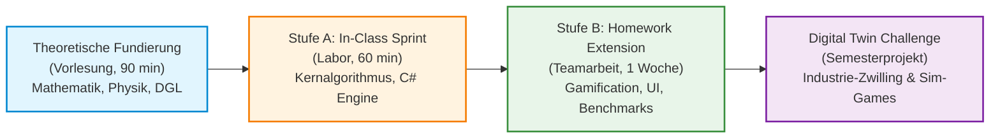

# Modulkonzept: Übungskatalog & Abschlussprojekt („Digital Twin & Simulation Game Challenge“)
## Fachhochschule Oberösterreich – Campus Wels | Studiengang Automatisierungstechnik
### Lehrveranstaltung: Systemsimulation / Digitaler Zwilling

**Dokument-ID:** `Konzept/02_Uebungskatalog_und_Abschlussprojekt.md`  
**Geltungsbereich:** Vorlesungsbegleitende Laborübungen (Einheiten 01 bis 10) und semesterbegleitendes Abschlussprojekt  
**Referenzdokumente:** `GEMINI.md`, `Planung/Plan_01_Notationsstandard_und_Harmonisierung.md`, `Planung/03_Plan_Softwarearchitektur_und_Code.md`  
**Zielgruppe:** Studierende im 5. Semester B.Sc. Automatisierungstechnik, Dozenten und Laborleiter  
**Technologie-Stack:** C# 12 / .NET 8 & .NET 10, WPF, ScottPlot 5, SharpGL, Math.NET Numerics, MSAGL, Task Parallel Library (TPL)

---

## Inhaltsverzeichnis

1. [Didaktisches Gesamtkonzept & Labororganisation](#1-didaktisches-gesamtkonzept--labororganisation)
   - 1.1 Verzahnung von Vorlesung, Hands-on-Labor und Vibe-Coding / KI-gestütztem Arbeiten
   - 1.2 Das 2-Stufen-Übungsmodell (Sprint & Extension)
   - 1.3 Matrix der chronologischen Technologie-Freigabe (Strikte Konsistenz!)
   - 1.4 Architektur- und Software-Qualitätsstandards („Goldene Regel“)
   - 1.5 Test-Driven Simulation & CI-Workflows
2. [Kapitelweiser Aufgabenkatalog (Einheit 01 bis 10)](#2-kapitelweiser-aufgabenkatalog-einheit-01-bis-10)
   - [Einheit 01: „Artillery Strike / Retro Tank Battle“ (Ballistik & Luftwiderstand)](#einheit-01-artillery-strike--retro-tank-battle-ballistik--luftwiderstand)
   - [Einheit 02: „Gamer-PC Kühlkörper-Optimizer & Waldbrand-Ausbreitung“ (WriteableBitmap FDM)](#einheit-02-gamer-pc-kühlkörper-optimizer--waldbrand-ausbreitung-writeablebitmap-fdm)
   - [Einheit 03: „Bridge Constructor 2D & Fachwerk-Katapult“ (WPF Canvas Vektoren)](#einheit-03-bridge-constructor-2d--fachwerk-katapult-wpf-canvas-vektoren)
   - [Einheit 04: „Retro Arcade Racing Telemetry & Flipper-Dashboard“ (ScottPlot 5 Streaming)](#einheit-04-retro-arcade-racing-telemetry--flipper-dashboard-scottplot-5-streaming)
   - [Einheit 05: „3D Arcade Claw Machine & Lunar Lander“ (SharpGL 3D-Szenengraph)](#einheit-05-3d-arcade-claw-machine--lunar-lander-sharpgl-3d-szenengraph)
   - [Einheit 06: „Zombie-Horde & Partikelsturm-Benchmark“ (TPL Parallel.For & Cache-Lokalität)](#einheit-06-zombie-horde--partikelsturm-benchmark-tpl-parallelfor--cache-lokalität)
   - [Einheit 07: „Kran- & Achterbahn-Tragwerk-Rechner“ (Math.NET Cholesky-LGS & FEM)](#einheit-07-kran--achterbahn-tragwerk-rechner-mathnet-cholesky-lgs--fem)
   - [Einheit 08: „SpaceX Falcon Hop & Segway-Balancer“ (S-Function, RK4 & PID Anti-Windup)](#einheit-08-spacex-falcon-hop--segway-balancer-s-function-rk4--pid-anti-windup)
   - [Einheit 09: „Achterbahn-Warteschlangen-Chaos & Kassen-Stau“ (Diskrete Ereignissimulation DES)](#einheit-09-achterbahn-warteschlangen-chaos--kassen-stau-diskrete-ereignissimulation-des)
   - [Einheit 10: „Flipperautomat: Pinball Bumper & Pachinko-Physik“ (Hybride Systeme & Zero-Crossing)](#einheit-10-flipperautomat-pinball-bumper--pachinko-physik-hybride-systeme--zero-crossing)
3. [Das große Abschlussprojekt: „Digital Twin & Simulation Game Challenge“](#3-das-große-abschlussprojekt-digital-twin--simulation-game-challenge)
   - 3.1 Zielsetzung & didaktischer Anspruch
   - 3.2 Verbindliche Kernkriterien (Die 5 Säulen des digitalen Zwillings)
   - 3.3 Acht Projektszenarien zur Auswahl (Industrie-Zwillinge & Simulationsspiele)
     - *Projekt A: Hochregallager-Kran (RBG) mit aktiver Schwingungskompensation*
     - *Projekt B: Thermo-elektrischer Mehrzonen-Extruder für Hochleistungskunststoffe*
     - *Projekt C: 3-Achs-Portalroboter mit Servoantrieben & Trajektorienoptimierung*
     - *Projekt D: Flexible Fertigungszelle (FMS) mit AGV-Flotte & Pufferlogistik*
     - *Projekt E: Pneumatisch getaktete Sortier- und Vereinzelungsanlage*
     - *Projekt F (Simulation Game): „Apollo Lunar Lander 3D“ (3D-Kollision & Schubvektor)*
     - *Projekt G (Simulation Game): „Pinball Arcade / Pachinko Physics Engine“ (Hybride Mechanik)*
     - *Projekt H (Simulation Game): „Autonomous Drone Obstacle Challenge“ (6-DOF Quadrocopter & PID)*
   - 3.4 Software-Architekturrahmen („Goldene Regel der Simulationsarchitektur“)
   - 3.5 Meilenstein- und Abgabeplan
   - 3.6 Bewertungsrubrik nach Hochschulstandard
4. [Abnahme-, KI- und Prüfungsrichtlinien](#4-abnahme--ki--und-prüfungsrichtlinien)

---

## 1. Didaktisches Gesamtkonzept & Labororganisation

### 1.1 Verzahnung von Vorlesung, Hands-on-Labor und Vibe-Coding / KI-gestütztem Arbeiten

Die Lehrveranstaltung *Systemsimulation / Digitaler Zwilling* am Campus Wels der FH Oberösterreich qualifiziert angehende Automatisierungsingenieurinnen und -ingenieure für die Entwicklung digitaler Repräsentanten industrieller Systeme. Sie zeichnet sich durch eine synchrone Trias aus:
1. **Theoretische Fundierung (Vorlesung, 90 min):** Herleitung der mathematisch-physikalischen DGLn, Diskretisierungsverfahren, Stabilitätskriterien und Algorithmen.
2. **Hands-on In-Class Sprint (Labor, 60 min):** Unmittelbare praktische Umsetzung des Kernalgorithmus in C# unter Betreuung. Der Fokus liegt rein auf Mathematik, Logik und schneller Verifikation.
3. **Vertiefende Homework Extension (2er-Team, 1 Woche):** Modellkomplexitätssteigerung, Gamification-Elemente, reale Nichtlinearitäten, Parametervariationen, numerische Fehleranalysen und professionelle Visualisierung.



> [!TIP]
> **Vibe Coding & KI-Engineering-Kultur:**  
> Der Einsatz moderner KI-Assistenten (GitHub Copilot, Claude, ChatGPT) ist ausdrücklich erwünscht – **unter einer zentralen Voraussetzung:** Ingenieurmäßige Urteilskraft! Jedes Kapitel enthält explizite Prompting-Tipps und Dokumentationslinks, um KI-Halluzinationen abzuwehren, Versionskonflikte (z. B. veraltetes ScottPlot 4 vs. modernes ScottPlot 5) zu verhindern und saubere Schnittstellen zu erzwingen.

---

### 1.2 Das 2-Stufen-Übungsmodell (Sprint & Extension)

Jede der Einheiten 01 bis 10 folgt einer strikten Zweistufigkeit:

- **Stufe A (In-Class Sprint – 60 min, Einzelarbeit oder Tandem):**
  - **Fokus:** Direkte Umsetzung des mathematischen Kerns ohne grafischen Ballast.
  - **Umfang:** Minimales C#-Konsolenprogramm oder vorgefertigte Starter-Vorlage.
  - **Erfolgsmetrik:** Ein lauffähiger Algorithmus nach spätestens 50 Minuten; 10 Minuten gemeinsame Auswertung & Fehlerdiskussion im Plenum.
- **Stufe B (Homework Extension – 1 Woche, festes 2er-Team):**
  - **Fokus:** Motivierender Mix aus seriöser Industrie-Ingenieuraufgabe und packendem Simulationsspiel („Gamification“).
  - **Erweiterungen:** Nichtlinearitäten, Randbedingungen, ansprechende Visualisierung, mathematische Validierung gegen Grenzfälle.
  - **Dokumentation:** Markdown-Bericht (`README.md` im Übungsordner) inklusive Konvergenzdiagrammen, Messreihen und Parameteranalysen.
  - **Codequalität:** Strikte Einhaltung der OOP- und MVVM-Paradigmen, Entkopplung von Physik und UI, Clean Code nach C#-Styleguide.

---

### 1.3 Matrix der chronologischen Technologie-Freigabe (Strikte Konsistenz!)

> [!CAUTION]
> **Verbindliche Didaktik-Regel: KEIN Vorgreifen auf spätere Vorlesungsinhalte!**  
> In den Aufgabenstellungen (T01 bis T10) darf absolut nichts vorausgesetzt oder verlangt werden, was erst in späteren Kapiteln gelehrt wird. Die folgende Tabelle ist für alle Aufgaben und Lösungen bindend:

| Einheit / Kapitel | Erlaubter Technologie- & Bibliotheks-Stack | Strengstens verboten in dieser Einheit (Vorgreif-Sperre!) |
| :--- | :--- | :--- |
| **T01 (Kap 00+01)** | C# 12 / .NET 8/10 Console, `System.Numerics` (Vector2/4), Expliziter Euler / Heun (RK2), ASCII-Plots, CSV-Export, PPM-Bitmap-Array | **KEIN** WPF, **KEIN** ScottPlot, **KEIN** Multithreading, **KEIN** SharpGL, **KEINE** FEM |
| **T02 (Kap 02)** | WPF `WriteableBitmap`, 2D-Pixelpuffer (`byte[]`, `int[]`), FDM-Wärmeleitung / zelluläre Gitter, Color-Mapping, `DispatcherTimer` | **KEIN** WPF Canvas (Vektoren), **KEIN** ScottPlot, **KEIN** Multithreading (`Parallel.For`), **KEIN** SharpGL |
| **T03 (Kap 03)** | WPF `Canvas`, 2D-Vektorgrafiken (`Line`, `Path`, `Polygon`), Affine Welt-Bildschirm-Transformation, Drag-&-Drop, Bemaßung | **KEIN** ScottPlot, **KEIN** SharpGL 3D, **KEIN** Multithreading, **KEIN** Math.NET Cholesky |
| **T04 (Kap 04)** | `ScottPlot 5` (`WpfPlot`, `DataStreamer`), MSAGL-Graphen, Ringpuffer (`CircularBuffer<T>`), Welford-Streaming-Statistik | **KEIN** SharpGL 3D, **KEIN** Multithreading / TPL, **KEIN** Math.NET Cholesky, **KEINE** S-Functions |
| **T05 (Kap 05)** | `SharpGL`, 3D-Szenengraph, Orbit-Kamera (Kugelkoordinaten), Matrix-Stack (`glPushMatrix`), Phong-Beleuchtung, Normalenvektoren | **KEIN** TPL Multithreading, **KEIN** Math.NET LGS, **KEINE** S-Functions, **KEINE** Event-Queues |
| **T06 (Kap 06)** | Task Parallel Library (TPL), `Parallel.For`, `ParallelOptions`, `Interlocked`, `CancellationToken`, Amdahl & Gustafson Fit, Cache-Optimierung | **KEIN** Math.NET Cholesky, **KEINE** S-Functions, **KEINE** Event-Queues |
| **T07 (Kap 07)** | `MathNet.Numerics`, Lineare Gleichungssysteme, Blockpartitionierung, Cholesky-Zerlegung, 2D/3D-Stabtragwerke (FEM), Lagerreaktionen | **KEINE** dynamischen ODE-Solver (RK4), **KEINE** S-Functions, **KEINE** Event-Queues |
| **T08 (Kap 08)** | Kontinuierliche Dynamik, S-Function-Architektur (`Derivatives`, `Outputs`, `Update`), RK4-Solver, PID-Regler, Anti-Windup Clamping | **KEINE** Diskrete Ereignissimulation (DES), **KEINE** Zero-Crossing Wurzelsuche |
| **T09 (Kap 09)** | Diskrete Ereignissimulation (DES), `PriorityQueue<TEvent, double>`, Kendall-Notation ($M/M/c/K$), Inversion / Box-Muller, Little's Gesetz | **KEINE** Hybriden Continuous-Discrete Umschaltungen (Zero-Crossing) |
| **T10 (Kap 10+11)**| Hybride Automaten, Zero-Crossing Wurzelsuche (Bisektion / Dekker), Zeno-Vermeidung, Stick-Slip Reibung, FMI/FMU Grundlagen | *Gesamter Semester-Stack steht uneingeschränkt zur Verfügung!* |

---

### 1.4 Architektur- und Software-Qualitätsstandards

Alle studentischen Lösungen müssen der im Skriptum definierten **Goldenen Regel der Simulationsarchitektur** ([Kapitel 11, Folie 356](file:///c:/Users/P28500/Desktop/Repositories/kurs-computer-simulation/Folien/11_Epilog/Folien.md#L356)) genügen:

> [!IMPORTANT]
> **Die Goldene Regel der Simulationsarchitektur:**
> 1. Die **Physik- und Simulationsmodelle** (Zustandsvektor $\mathbf{x}$, Ableitungen $\mathbf{f}(t, \mathbf{x}, \mathbf{u})$, Steifigkeitsmatrizen $\mathbf{K}$, Event-Queues) haben **keine Abhängigkeit** zu GUI-, Grafik- oder Logging-Frameworks (WPF, SharpGL, ScottPlot). Sie sind als reine `.NET`-Klassenbibliotheken zu implementieren.
> 2. Die **Visualisierung** (View) abonniert ausschließlich unveränderliche Zustandsabbilder (Snapshots, DTOs) oder konsumiert Daten über thread-sichere Ringpuffer (`CircularBuffer<T>`) und das WPF-Data-Binding (MVVM).
> 3. Rechenintensive Simulationen dürfen **niemals** auf dem UI-Thread ausgeführt werden. Der Solver läuft asynchron in Hintergrund-Tasks (`Task.Run`) und synchronisiert über `IProgress<T>` oder aggregierte Frame-Timer.

---

### 1.5 Test-Driven Simulation & CI-Workflows

Für alle numerischen Modelle sind begleitende Unit-Tests mit `xUnit` oder `MSTest` Pflicht (Referenzprojekt: [`Quellen/WS25/SimulationTests`](file:///c:/Users/P28500/Desktop/Repositories/kurs-computer-simulation/Quellen/WS25/SimulationTests)):
- **Energieerhaltungstests:** Für ungedämpfte Systeme (freies Pendel, elastischer Ball) muss die Gesamtenergie $E_{\text{tot}} = E_{\text{kin}} + E_{\text{pot}}$ im Zeitverlauf bis auf Integrationsfehlerordnung $\mathcal{O}(\Delta t^p)$ konstant bleiben.
- **Analytische Grenzfallprüfung:** Vergleich numerischer Ergebnisse mit geschlossenen analytischen Lösungen bei trivialen Randbedingungen (z. B. Schiefer Wurf im Vakuum, stationäre Endtemperatur des Stabes).
- **Invarianzprüfungen:** Statische Fachwerke müssen Translations- und Rotationsinvarianten erfüllen (Summe aller Kräfte und Momente exakt $\vec{0}$).

---

## 2. Kapitelweiser Aufgabenkatalog (Einheit 01 bis 10)

---

### Einheit 01: „Artillery Strike / Retro Tank Battle“ (Ballistik & Luftwiderstand)

#### Fachlicher Bezug & Lernziele
- **Vorlesung:** [Kapitel 01: Einführung](file:///c:/Users/P28500/Desktop/Repositories/kurs-computer-simulation/Folien/01_Einführung/Folien.md) – Modellbegriff, Zustandsraum, Zeitdiskretisierung, explizites Euler-Verfahren, Prädiktor-Korrektor (Heun).
- **Quellen-Referenz:** [`Quellen/WS24/DynamischBallwurf1D`](file:///c:/Users/P28500/Desktop/Repositories/kurs-computer-simulation/Quellen/WS24/DynamischBallwurf1D).
- **Technologie-Status:** **Reine C#-Konsolenapplikation!** Noch *KEIN* WPF Canvas, noch *KEIN* ScottPlot! Visualisierung via Konsole (ASCII-Art / Tabellen) oder CSV-Export.
- **Lernziele:**
  1. Ableitung der 2D-Bewegungsgleichung eines Projektils unter Gravitation, Gegenwind und nichtlinearer quadratischer Luftreibung ($F_{\text{w}} \propto v_{\text{rel}}^2$).
  2. Implementierung des expliziten Euler- und Heun-Verfahrens mit sauberer Vektorkapselung (`System.Numerics.Vector2`).
  3. Konzeption einer automatisierten Parameterstudie und Trefferalgorithmus für ein Ziel in hügeligem Gelände.

#### Mathematisches Modell
Zustandsvektor: $\mathbf{x} = \begin{bmatrix} x & y & v_x & v_y \end{bmatrix}^\top \in \mathbb{R}^4$.  
Windvektor: $\mathbf{w} = \begin{bmatrix} w_x & 0 \end{bmatrix}^\top$. Relativgeschwindigkeit: $\mathbf{v}_{\text{rel}} = \begin{bmatrix} v_x - w_x & v_y \end{bmatrix}^\top$, Betrag $v_{\text{rel}} = \|\mathbf{v}_{\text{rel}}\|$.  
DGL-System 1. Ordnung:
$$\dot{x} = v_x, \quad \dot{y} = v_y$$
$$\dot{v}_x = -\frac{\rho \, c_{\text{w}} A}{2m} v_{\text{rel}} (v_x - w_x), \quad \dot{v}_y = -g - \frac{\rho \, c_{\text{w}} A}{2m} v_{\text{rel}} v_y$$
Konstanten: $g = 9{,}81\,\text{m/s}^2$, Luftdichte $\rho = 1{,}225\,\text{kg/m}^3$, Masse $m = 10{,}0\,\text{kg}$, Kaliber-Radius $r = 0{,}06\,\text{m}$ ($A = \pi r^2$), $c_{\text{w}} = 0{,}25$.

---

#### Stufe A: In-Class Sprint (60 min) – „Artillery Strike: Berechne den Einschlag“
- **Aufgabenstellung:**
  1. Erstellen Sie eine C#-Konsolenapplikation `ArtilleryStrikeSprint`.
  2. Kapseln Sie den Zustand in ein `struct ProjectileState(double X, double Y, double Vx, double Vy)`.
  3. Implementieren Sie den expliziten Euler-Schritt: $\mathbf{x}_{k+1} = \mathbf{x}_k + \Delta t \cdot \mathbf{f}(t_k, \mathbf{x}_k)$.
  4. Feuern Sie eine Granate ab mit $v_0 = 150\,\text{m/s}$, $\alpha = 45^\circ$, Abschusshöhe $y_0 = 0\,\text{m}$, Windstille ($w_x = 0$) bei Schrittweiten $\Delta t = 0{,}01\,\text{s}$ und $\Delta t = 0{,}1\,\text{s}$.
  5. Simulieren Sie bis zum Bodenkontakt ($y \le 0$) und interpolieren Sie den exakten Auftreffpunkt $x_{\text{impact}}$ linear zwischen dem letzten Schritt über dem Boden und dem ersten Schritt unter dem Boden.
  6. Geben Sie die Wurfweite und Flugdauer auf der Konsole aus und vergleichen Sie mit dem analytischen Vakuumwert:
     $$x_{\text{vakuum}} = \frac{v_0^2 \sin(2\alpha)}{g} = \frac{150^2 \cdot 1}{9{,}81} \approx 2293{,}6\,\text{m}$$
- **Erwartetes Ergebnis:** Unter Luftwiderstand sinkt die Reichweite drastisch auf $\approx 1150\text{--}1200\,\text{m}$. Der Unterschied zwischen Euler $\Delta t=0{,}1$ und $\Delta t=0{,}01$ wird transparent sichtbar.

---

#### Stufe B: Homework Extension (2er-Team, 1 Woche) – „Retro Tank Duel: Ballistik-Simulator mit Wind & Höhenprofil“
- **Aufgabenstellung:**
  1. **Heun-Verfahren (RK2):** Erweitern Sie den Simulator um das Heun-Verfahren und vergleichen Sie die Genauigkeit gegen Euler bei groben Zeitschritten ($\Delta t = 0{,}5\,\text{s}$).
  2. **Geländeprofil & Zielandockung:**
     - Das Gelände ist eine Sinuslandschaft: $y_{\text{Boden}}(x) = 50 \cdot \sin(0{,}002 \cdot x) + 20 \cdot \cos(0{,}005 \cdot x)$.
     - Ein feindlicher Panzer steht bei $x_{\text{Ziel}} = 1400\,\text{m}, y_{\text{Ziel}} = y_{\text{Boden}}(1400)$.
     - Detektieren Sie den Bodenkontakt, sobald $y_{\text{Projektil}}(t) \le y_{\text{Boden}}(x_{\text{Projektil}}(t))$.
  3. **Stochastischer Wind:** Bei jedem Schuss weht Gegen- oder Rückenwind $w_x \sim \mathcal{U}(-15, +15)\,\text{m/s}$.
  4. **Konsolen-Visualisierung oder CSV-Export:**
     - Zeichnen Sie eine ASCII-Art-Trajektorie in das Konsolenfenster ($80 \times 25$ Zeichen) ODER exportieren Sie die Flugbahn als tabellarische `.csv`-Datei zur externen Auswertung.
  5. **Automatischer Zielrechner (Bisektion / Sweep):**
     - Ermitteln Sie bei gegebener Mündungsgeschwindigkeit $v_0 = 160\,\text{m/s}$ und bekanntem Wind $w_x$ automatisiert den erforderlichen Abschusswinkel $\alpha \in [10^\circ, 80^\circ]$, der das Ziel innerhalb eines Trefferradius von $\pm 2{,}0\,\text{m}$ trifft.
- **Bewertungskriterien (10 Punkte):**
  - [3 P.] Korrekte Implementierung von Euler und Heun mit Relativwind-Physik.
  - [3 P.] Exakte numerische Kollisionserkennung mit dem analytischen Geländeprofil.
  - [2 P.] Robuster Schusswinkel-Finder (Bisektion oder Newton-Verfahren).
  - [2 P.] Dokumentation: Tabelle mit Konvergenzvergleich (Euler vs. Heun) und ASCII/CSV-Trajektorien.

---

#### 💡 Online-Recherche & Vibe-Coding-Guide (Einheit 01)
- **Empfohlene Suchbegriffe:** `Euler vs Heun method C# implementation`, `projectile motion quadratic drag relative wind`, `System.Numerics Vector2 trajectory simulation`.
- **Offizielle Dokumentation:** [Microsoft Learn: System.Numerics.Vector2](https://learn.microsoft.com/de-de/dotnet/api/system.numerics.vector2), [Wikipedia: Heun's method](https://en.wikipedia.org/wiki/Heun%27s_method).
- **Vibe-Coding Prompting-Tipp:**
  > *„Schreibe mir eine reine C#-Klasse `BallisticEngine` ohne jede externe UI-Bibliothek (kein WPF, kein ScottPlot). Sie soll nur mit `double` oder `System.Numerics.Vector2` arbeiten. Implementiere das Heun-Verfahren (RK2) für quadratischen Luftwiderstand mit Relativwind $\mathbf{w}$. Trenne den mathematischen Zustand strikt von der Ein-/Ausgabe.“*

---

### Einheit 02: „Gamer-PC Kühlkörper-Optimizer & Waldbrand-Ausbreitung“ (WriteableBitmap FDM)

#### Fachlicher Bezug & Lernziele
- **Vorlesung:** [Kapitel 02: Visualisierung 2D Pixel](file:///c:/Users/P28500/Desktop/Repositories/kurs-computer-simulation/Folien/02_Visualisierung_2D_Pixel/Folien.md) – Pixelraster, Farbräume, `WriteableBitmap`, 2D-Finite-Differenzen-Methode (FDM) für Wärmeleitung.
- **Technologie-Status:** WPF mit `Image`-Control und `WriteableBitmap`. Noch *KEIN* Canvas (keine Vektorobjekte), noch *KEIN* ScottPlot, noch *KEIN* Multithreading (`Parallel.For` ist erst in Kap 06 erlaubt!).
- **Lernziele:**
  1. Diskretisierung der 2D-Wärmeleitungsgleichung mit dem 5-Punkt-Differenzenstern auf einem $N \times M$ Gitter.
  2. Beachtung des Von-Neumann-Stabilitätskriteriums: $\Delta t \le \frac{\Delta x^2}{4 a_{\max}}$.
  3. Höchst performantes Pixel-Rendering via `WriteableBitmap.Lock()`, direkten Pointer-Zugriff (`unsafe byte*`) oder `Marshal.Copy`.

#### Mathematisches Modell
2D-Wärmeleitungsgleichung mit ortsabhängiger Temperaturleitfähigkeit $a(x,y) = \frac{\lambda(x,y)}{\rho(x,y) c_{\text{p}}(x,y)}$ und Wärmequelle $\dot{q}_{\text{v}}$:
$$\frac{\partial T}{\partial t} = a(x,y) \left( \frac{\partial^2 T}{\partial x^2} + \frac{\partial^2 T}{\partial y^2} \right) + \frac{\dot{q}_{\text{v}}(x,y)}{\rho c_{\text{p}}}$$
Expliziter FDM-Zeitschritt:
$$T_{i,j}^{k+1} = T_{i,j}^k + \Delta t \left[ a_{i,j} \frac{T_{i+1,j}^k + T_{i-1,j}^k + T_{i,j+1}^k + T_{i,j-1}^k - 4 T_{i,j}^k}{\Delta x^2} + \frac{\dot{q}_{i,j}}{\rho c_{\text{p}}} \right]$$

---

#### Stufe A: In-Class Sprint (60 min) – „Heatmap-Renderer in WriteableBitmap“
- **Aufgabenstellung:**
  1. Erstellen Sie ein WPF-Fenster mit einem `<Image x:Name="PixelDisplay"/>` ($128 \times 128$ Pixel).
  2. Initialisieren Sie eine `WriteableBitmap(128, 128, 96, 96, PixelFormats.Bgr32, null)` und zwei Puffer `double[128, 128]` (`T_old`, `T_new`).
  3. Randbedingungen: Alle vier Ränder fix auf $T = 20\,^\circ\text{C}$ (Dirichlet). Im Zentrum ($x \in [58, 70], y \in [58, 70]$) konstante Wärmequelle mit $T = 100\,^\circ\text{C}$.
  4. Führen Sie pro Timer-Tick ($30\,\text{ms}$) einen FDM-Schritt aus ($a = 1{,}0 \times 10^{-4}\,\text{m}^2/\text{s}, \Delta x = 1\,\text{mm}, \Delta t = 0{,}002\,\text{s}$).
  5. Schreiben Sie eine Farbpalette `uint ColorMap(double temp)`: $20\,^\circ\text{C} \to \text{Blau}$, $50\,^\circ\text{C} \to \text{Grün}$, $80\,^\circ\text{C} \to \text{Gelb}$, $100\,^\circ\text{C} \to \text{Rot}$.
  6. Kopieren Sie das Pixelarray über `WriteableBitmap.Lock()`, `BackBuffer` und `AddDirtyRect` in die Anzeige.
- **Erwartetes Ergebnis:** Eine butterweich aufkeimende, farbige Wärmewolke im WPF-Fenster.

---

#### Stufe B: Homework Extension (2er-Team, 1 Woche) – „Gamer-PC CPU-Kühler-Optimizer vs. Waldbrand-Simulator“
*Wählen Sie eines der beiden Szenarien:*
- **Szenario 1: Gamer-PC Kühlkörper-Optimizer:**
  - Modellieren Sie ein CPU-Package ($200 \times 200$ Pixel, $\Delta x = 0{,}2\,\text{mm}$):
    - CPU-Die (Silizium, $40 \times 40$ Pixel, $120\,\text{W}$ Verlustleistung).
    - Wärmeleitpaste (dünne Schicht, geringes $a$).
    - Kupfer-Heatspreader vs. Aluminium-Kühlrippen mit Luftkanälen.
  - Implementieren Sie konvektive Kühlung an den Finnen (Robin-Randbedingung: $-k \frac{\partial T}{\partial n} = h (T - T_{\text{Luft}})$).
  - Demonstrieren Sie den Unterschied zwischen einem verstopften Lüfter ($h = 20\,\text{W/m}^2\text{K}$) und Maximallüftung ($h = 250\,\text{W/m}^2\text{K}$).
- **Szenario 2: Waldbrand- & Lava-Ausbreitungssimulation:**
  - 2D-Zellulärer Wärmediffusions-Automat: Baumdichte, Bodenfeuchte und Zündtemperatur $T_{\text{Zünd}} = 300\,^\circ\text{C}$.
  - Windvektor treibt die Flammenfront bevorzugt in eine Richtung (gerichtete Differenzen 1. Ordnung).
  - Bei Überschreiten von $T_{\text{Zünd}}$ entflammt die Zelle, setzt Verbrennungswärme frei und wird nach 5 Sekunden zu Asche (schwarz).
- **Stabilitäts-Experiment:** Zeigen Sie im Bericht die Gitterexplosion bei Überschreitung des Stabilitätskriteriums ($\Delta t > \Delta t_{\text{krit}}$).
- **Bewertungskriterien (10 Punkte):**
  - [3 P.] Korrekte FDM-Implementierung mit Materialgrenzen oder Brandzuständen.
  - [3 P.] Effiziente `WriteableBitmap`-Pixelmanipulation ohne Speicherlecks.
  - [2 P.] Experimenteller Nachweis der numerischen Instabilität bei $\Delta t > \Delta t_{\text{krit}}$.
  - [2 P.] Dokumentation: Analyse der Maximaltemperaturen und anschauliche Screenshots.

---

#### 💡 Online-Recherche & Vibe-Coding-Guide (Einheit 02)
- **Empfohlene Suchbegriffe:** `WriteableBitmap Lock BackBuffer performance C#`, `2D heat equation finite difference explicit stability`, `Von Neumann stability heat equation grid`.
- **Offizielle Dokumentation:** [Microsoft Learn: WriteableBitmap-Klasse](https://learn.microsoft.com/de-de/dotnet/api/system.windows.media.imaging.writeablebitmap).
- **Vibe-Coding Prompting-Tipp:**
  > *„Erstelle mir eine C#-Methode zur schnellen Pixelaktualisierung einer WPF `WriteableBitmap`. Nutze `unsafe` Zeigerarithmetik auf `bitmap.BackBuffer` oder `Marshal.Copy`. Verwende KEIN SetPixel und KEINE Canvas-Shapes, da dies zu langsam ist. Beachte: Single-Threaded, kein Parallel.For.“*

---

### Einheit 03: „Bridge Constructor 2D & Fachwerk-Katapult“ (WPF Canvas Vektoren)

#### Fachlicher Bezug & Lernziele
- **Vorlesung:** [Kapitel 03: Visualisierung 2D Vektor](file:///c:/Users/P28500/Desktop/Repositories/kurs-computer-simulation/Folien/03_Visualisierung_2D_Vektor/Folien.md) – WPF `Canvas`, Vektor-Primitive (`Line`, `Path`, `Polygon`), Affine Welt-Bildschirm-Transformation, Pan & Zoom.
- **Quellen-Referenz:** [`Quellen/WS25/FachwerkIdeal2D`](file:///c:/Users/P28500/Desktop/Repositories/kurs-computer-simulation/Quellen/WS25/FachwerkIdeal2D).
- **Technologie-Status:** WPF `Canvas` mit geometrischen Vektoren. Noch *KEIN* ScottPlot, noch *KEIN* SharpGL 3D, noch *KEIN* Math.NET Cholesky-Solver (statische Kräfte werden hier analytisch oder über das Knotenpunktverfahren ermittelt).
- **Lernziele:**
  1. Beherrschung der 2D-Welt-zu-Bildschirm-Koordinatentransformation inklusive Inversion der Y-Achse:
     $$x_{\text{screen}} = (x_{\text{world}} - x_{\text{min}}) \cdot s_x, \quad y_{\text{screen}} = h_{\text{screen}} - (y_{\text{world}} - y_{\text{min}}) \cdot s_y$$
  2. Dynamisches Zeichnen von Stäben, Knoten, Lastpfeilen und Bemaßungen im WPF `Canvas`.
  3. Visualisierung von Zugkräften (Blau) und Druckkräften (Rot) mit Versagensanzeige bei Überlast.

---

#### Stufe A: In-Class Sprint (60 min) – „Truss-Renderer auf WPF Canvas“
- **Aufgabenstellung:**
  1. Öffnen Sie ein leeres WPF-Projekt mit `<Canvas x:Name="TrussCanvas"/>`.
  2. Implementieren Sie eine Klasse `CoordinateTransformer`, die Meter-Koordinaten automatisch zentriert in Canvas-Pixel umrechnet.
  3. Definieren Sie ein 3-Knoten-Fachwerk (Knoten 1: $(0,0)$, Knoten 2: $(4,0)$, Knoten 3: $(2,2)$ Meter; vertikale Last $F = 10\,\text{kN}$ an Knoten 3).
  4. Berechnen Sie die Stabkräfte analytisch:
     $$S_{13} = S_{23} = -\frac{F}{2 \sin(45^\circ)} \approx -7{,}07\,\text{kN} \quad \text{(Druck)}, \quad S_{12} = +5{,}0\,\text{kN} \quad \text{(Zug)}$$
  5. Zeichnen Sie Stäbe als WPF `Line`: Druckstäbe rot, Zugstäbe blau. Linienstärke $w = 2 + 5 \cdot \frac{|S_i|}{S_{\max}}$.
  6. Zeichnen Sie Knoten als Kreise (`Ellipse`) mit Beschriftung.
- **Erwartetes Ergebnis:** Ein maßstäblich sauber skaliertes Fachwerk, das sich bei Fenstergrößenänderung anpasst.

---

#### Stufe B: Homework Extension (2er-Team, 1 Woche) – „Bridge Constructor 2D & Belastungstest-Simulator“
- **Aufgabenstellung:**
  1. **Interaktiver Brückenbau:**
     - Der Benutzer kann per Mausklick neue Knoten setzen und Stäbe zwischen Knoten aufspannen.
     - Festlager (Knoten fixiert) und Loselager (horizontale Verschiebung frei) an den Schlucht-Rändern.
  2. **Interaktive Lastfahrt („Der schwere LKW“):**
     - Ein LKW (Punktlast $F_{\text{LKW}} = 20\,\text{kN}$) fährt in Zeitschritten über die Fahrbahnknoten der Brücke von links nach rechts.
     - Bei jedem Schritt werden die Stabkräfte aktualisiert.
  3. **Versagensindikator & Einsturz:**
     - Jeder Stab besitzt eine Knick-/Bruchlast $S_{\text{krit}} = 25\,\text{kN}$.
     - Übersteigt $|S_i| > 0{,}8 \cdot S_{\text{krit}}$, blinkt der Stab gelb/orange; bei $S_i \ge S_{\text{krit}}$ reißt der Stab (wird ausgeblendet oder rot gestrichelt dargestellt).
  4. **Technische Bemaßung & Kräftedreiecke:**
     - Zeichnen Sie Maßketten mit Pfeilspitzen unter das Tragwerk.
     - Bei Klick auf einen Knoten öffnet sich ein Overlay-Canvas, das das geschlossene Kräfteeck ($\sum \vec{F} = \vec{0}$) maßstäblich visualisiert.
- **Bewertungskriterien (10 Punkte):**
  - [3 P.] Interaktives Erstellen und Modifizieren des Fachwerks auf dem Canvas.
  - [3 P.] Korrekte Kraftberechnung und visuelle Darstellung der Spannungszustände während der Lastfahrt.
  - [2 P.] Animierter Einsturz-/Versagensmechanismus bei Überschreitung der Maximalkraft.
  - [2 P.] Maßketten und geschlossene Kräftedreiecke an den Knoten.

---

#### 💡 Online-Recherche & Vibe-Coding-Guide (Einheit 03)
- **Empfohlene Suchbegriffe:** `WPF Canvas world to screen matrix transformation`, `WPF Line dynamic styling StrokeThickness`, `Bridge constructor simulation 2D truss forces`.
- **Offizielle Dokumentation:** [Microsoft Learn: Shapes and Basic Drawing in WPF](https://learn.microsoft.com/de-de/dotnet/desktop/wpf/graphics-multimedia/shapes-and-basic-drawing-in-wpf-overview).
- **Vibe-Coding Prompting-Tipp:**
  > *„Erstelle ein WPF-UserControl in C#, das Weltkoordinaten $(x, y)$ in Meter auf einen Canvas mappt. Y muss nach oben positiv sein. Implementiere Zoom mit dem Mausrad um den Mauszeiger und Pan mit gedrückter mittlerer Maustaste. Nutze KEIN ScottPlot, sondern native WPF Shapes (Line, Ellipse, Path).“*

---

### Einheit 04: „Retro Arcade Racing Telemetry & Flipper-Dashboard“ (ScottPlot 5 Streaming)

#### Fachlicher Bezug & Lernziele
- **Vorlesung:** [Kapitel 04: Visualisierung 2D Diagramme](file:///c:/Users/P28500/Desktop/Repositories/kurs-computer-simulation/Folien/04_Visualisierung_2D_Diagramme/Folien.md) – High-Performance Streaming mit ScottPlot 5, Ringpuffer, Welford-Algorithmus für rollierende Online-Statistik, MSAGL-Graphen.
- **Quellen-Referenz:** [`Quellen/WS25/SimulationMvvmPattern`](file:///c:/Users/P28500/Desktop/Repositories/kurs-computer-simulation/Quellen/WS25/SimulationMvvmPattern).
- **Technologie-Status:** WPF mit `ScottPlot.WPF` (Version 5.x) und `Microsoft.Msagl`. Noch *KEIN* SharpGL 3D, noch *KEIN* Multithreading-Solver!
- **Lernziele:**
  1. Beherrschung der modernen ScottPlot-5-API (`WpfPlot`, `Plot.Add.DataLogger`, `Plot.Add.DataStreamer`).
  2. Vermeidung von Garbage-Collection-Spikes durch vorallokierte Ringpuffer (`CircularBuffer<double>`).
  3. Numerisch stabile Online-Berechnung von gleitendem Mittelwert $\bar{x}_k$ und Varianz $s_k^2$ nach Welford ohne Historien-Speicherung.

---

#### Stufe A: In-Class Sprint (60 min) – „High-Speed Signal-Streamer mit ScottPlot 5“
- **Aufgabenstellung:**
  1. Binden Sie das NuGet-Paket `ScottPlot.WPF` (v5.x) in ein neues WPF-Projekt ein.
  2. Platzieren Sie ein `<ScottPlot.WPF.WpfPlot x:Name="TelemetryPlot"/>` im XAML.
  3. Konfigurieren Sie einen `DataLogger` oder `DataStreamer` für 2000 Datenpunkte.
  4. Starten Sie einen `DispatcherTimer` mit $20\,\text{ms}$ Intervall ($50\,\text{Hz}$).
  5. Generieren Sie ein synthetisches Telemetriesignal (z. B. Fahrzeug-Drehzahl mit Rauschen):
     $$\text{RPM}(t) = 3000 + 1500 \cdot \sin(0{,}5 \cdot t) + 200 \cdot \mathcal{N}(0, 1)$$
  6. Rufen Sie im Timer `TelemetryPlot.Refresh()` auf und messen Sie die tatsächliche Render-FPS.
- **Erwartetes Ergebnis:** Ein absolut ruckelfreies, flüssig durchlaufendes Diagramm bei $50\text{--}60\,\text{FPS}$ und minimaler CPU-Auslastung.

---

#### Stufe B: Homework Extension (2er-Team, 1 Woche) – „Retro Arcade Racing & Flipper-Telemetrie-Dashboard“
- **Aufgabenstellung:**
  1. **Multi-Plot-Cockpit:** Bauen Sie ein Dashboard mit 3 synchronisierten ScottPlot-Panels auf:
     - **Panel 1 (Geschwindigkeit & RPM):** Live-Signal $v(t)$ und Motordrehzahl mit $\pm 3\sigma$-Toleranzband.
     - **Panel 2 (G-Kräfte & Bremsverzögerung):** Quer- und Längsbeschleunigung ($a_x, a_y$) als Phasenplot / Streudiagramm.
     - **Panel 3 (Echtzeit-Histogramm):** Kontinuierlich aktualisierte Verteilung der Rundenzeiten und Bremskräfte mit überlagerter Normalverteilungskurve.
  2. **Welford-Streaming-Klasse:**
     - Implementieren Sie die numerisch stabile Rekursion nach B. P. Welford:
       $$\bar{x}_k = \bar{x}_{k-1} + \frac{x_k - \bar{x}_{k-1}}{k}, \quad S_k = S_{k-1} + (x_k - \bar{x}_{k-1})(x_k - \bar{x}_k), \quad s_k = \sqrt{\frac{S_k}{k-1}}$$
  3. **Streckenprofil mit MSAGL:**
     - Stellen Sie den Streckenverlauf (Checkpoints, Boxengasse, Sektoren) als interaktiven topologischen Graphen mit Microsoft MSAGL dar.
  4. **Anomalie-Erkennung:** Erkennen Sie Motor-Überdreher ($\text{RPM} > 7000$) oder Traktionsverlust ($|a_y| > 1{,}5\,g$) und blenden Sie Marker direkt im ScottPlot-Diagramm ein.
- **Bewertungskriterien (10 Punkte):**
  - [3 P.] Saubere ScottPlot-5-Architektur ohne Speicherallokation im Render-Loop.
  - [3 P.] Exakte Realisierung der Welford-Statistik mit mathematischer Verifikation.
  - [2 P.] Ansprechendes Dashboard-Design mit synchronisierten Diagrammachsen.
  - [2 P.] Einbindung des Streckengraphen via MSAGL.

---

#### 💡 Online-Recherche & Vibe-Coding-Guide (Einheit 04)
- **Empfohlene Suchbegriffe:** `ScottPlot 5 DataLogger WPF live streaming`, `Welford algorithm running mean variance C#`, `ScottPlot 5 histogram dynamic update`.
- **Offizielle Dokumentation:** [ScottPlot 5 Documentation & Cookbooks](https://scottplot.net/cookbook/5.0/), [Automatic Graph Layout (MSAGL) GitHub](https://github.com/microsoft/automatic-graph-layout).
- **Vibe-Coding Prompting-Tipp:**
  > *„Ich verwende ScottPlot Version 5 in WPF. Verwende NICHT die veraltete ScottPlot-4-Syntax (wie AddSignal, Plot.Axes). Zeige mir, wie man mit `Plot.Add.DataLogger()` oder `Plot.Add.DataStreamer()` ein rollierendes Live-Diagramm aufbaut. Halte das Rendering speicherallokationsfrei (0 Byte GC Allocations pro Frame).“*

---

### Einheit 05: „3D Arcade Claw Machine & Lunar Lander“ (SharpGL 3D-Szenengraph)

#### Fachlicher Bezug & Lernziele
- **Vorlesung:** [Kapitel 05: Visualisierung 3D OpenGL](file:///c:/Users/P28500/Desktop/Repositories/kurs-computer-simulation/Folien/05_Visualisierung_3D_OpenGL/Folien.md) – OpenGL Pipeline, SharpGL, Szenengraph-Hierarchie, Transformationsmatrizen (`glPushMatrix`/`glPopMatrix`), Orbit-Kamera.
- **Quellen-Referenz:** [`Quellen/WS25/VorlageSzenengraph3D`](file:///c:/Users/P28500/Desktop/Repositories/kurs-computer-simulation/Quellen/WS25/VorlageSzenengraph3D), [`Quellen/WS25/VorlageVisualisierung3D`](file:///c:/Users/P28500/Desktop/Repositories/kurs-computer-simulation/Quellen/WS25/VorlageVisualisierung3D).
- **Technologie-Status:** SharpGL (`OpenGLControl`) mit 3D-Szenengraph. Noch *KEIN* Multithreading! Noch *KEINE* Math.NET LGS!
- **Lernziele:**
  1. Mathematische Beherrschung der 3D-Sicht- und Modelltransformationen (`gluLookAt`, Translation, Rotation).
  2. Implementierung einer kardanfehlerfreien Orbit-Kamera in Kugelkoordinaten ($r, \theta, \phi$).
  3. Aufbau eines komponentenorientierten Szenengraphen zur Verwaltung mechatronischer Gelenkketten.

---

#### Stufe A: In-Class Sprint (60 min) – „SharpGL-Würfel mit Orbit-Kamera“
- **Aufgabenstellung:**
  1. Öffnen Sie die Vorlage `VorlageVisualisierung3D` mit `SharpGL.WPF.OpenGLControl`.
  2. Implementieren Sie die Kugelkoordinaten-Kamera in der Klasse `OrbitCamera`:
     $$x_{\text{eye}} = r \cos \phi \sin \theta + x_{\text{look}}, \quad y_{\text{eye}} = r \sin \phi + y_{\text{look}}, \quad z_{\text{eye}} = r \cos \phi \cos \theta + z_{\text{look}}$$
  3. Binden Sie Maus-Events an:
     - Linke Maustaste + Ziehen: Azimut $\theta$ und Elevation $\phi$ (Elevation auf $[-85^\circ, +85^\circ]$ klemmen).
     - Mausrad: Radius $r$ vergrößern/verkleinern.
  4. Zeichnen Sie im `OpenGLDraw`-Event ein 3D-Koordinatenkreuz ($X$: Rot, $Y$: Grün, $Z$: Blau) und einen schattierten 3D-Körper mit Normalenvektoren.
- **Erwartetes Ergebnis:** Flüssige interaktive 3D-Kamerafahrt um das zentrale 3D-Objekt.

---

#### Stufe B: Homework Extension (2er-Team, 1 Woche) – „3D Arcade Claw Machine (Greifarm-Simulator)“
- **Aufgabenstellung:**
  1. **Hierarchischer 3D-Szenengraph:**
     - Bauen Sie eine vollständige Arcade-Greifarm-Maschine auf:
       - Gehäuse (Glasquader mit Kantenrahmen).
       - $X$-Schlitten (Portalbrücke entlang der Hallenachse).
       - $Y$-Laufkatze (fährt quer auf der Brücke).
       - $Z$-Seilzug / Teleskoparm (fährt vertikal nach unten).
       - 3-Finger-Greifer (Finger öffnen und schließen synchron über Gelenkwinkel).
  2. **OpenGL-Matrix-Stack:**
     - Nutzen Sie rekursiv `glPushMatrix()` und `glPopMatrix()`, sodass jede Komponente im lokalen Koordinatensystem ihres Eltern-Knotens modelliert wird.
  3. **Interaktive Steuerung (Gamification):**
     - Steuern Sie den Greifer per Tastatur (Pfeiltasten für $X/Y$, Leertaste für Absenken und Schließen des Greifers).
     - Platzieren Sie bunte geometrische Preise (Würfel, Kugeln) auf dem Boden.
  4. **Beleuchtung & Material:**
     - Aktivieren Sie `GL_LIGHTING`, definieren Sie Punktstrahler und berechnen Sie glatte Flächennormalen (`glNormal3f`).
- **Bewertungskriterien (10 Punkte):**
  - [3 P.] Korrekter hierarchischer Szenengraph mit 4 Freiheitsgraden ($X, Y, Z, \text{Greifer}$).
  - [3 P.] Stabile Orbit-Kamera mit flüssiger Tastatur-/Maus-Interaktion.
  - [2 P.] Ansprechende Beleuchtung, Normalenvektoren und Materialfarben.
  - [2 P.] Greifmechanik mit einfacher Distanz-Kollisionsprüfung beim Aufnehmen eines Preises.

---

#### 💡 Online-Recherche & Vibe-Coding-Guide (Einheit 05)
- **Empfohlene Suchbegriffe:** `SharpGL WPF OpenGLControl camera gluLookAt`, `OpenGL spherical coordinates orbit camera`, `OpenGL hierarchical matrix stack glPushMatrix`.
- **Offizielle Dokumentation:** [SharpGL GitHub Repository](https://github.com/dwmkerr/sharpgl), [OpenGL 2.1 Reference Pages](https://registry.khronos.org/OpenGL-Refpages/gl2.1/).
- **Vibe-Coding Prompting-Tipp:**
  > *„Erstelle eine C#-Klasse für eine OpenGL Orbit-Kamera mit SharpGL. Berechne die Kameraposition aus Kugelkoordinaten $(r, \theta, \phi)$ und rufe `gl.LookAt()` auf. Beachte: Elevation $\phi$ muss gegen Gimbal Lock geschützt sein (z. B. auf $\pm 89^\circ$ clamped). Implementiere die Methoden `OnMouseMove` und `OnMouseWheel`.“*

---

### Einheit 06: „Zombie-Horde & Partikelsturm-Benchmark“ (TPL Parallel.For & Cache-Lokalität)

#### Fachlicher Bezug & Lernziele
- **Vorlesung:** [Kapitel 06: Multithreading](file:///c:/Users/P28500/Desktop/Repositories/kurs-computer-simulation/Folien/06_Multithreading/Folien.md) – Task Parallel Library (TPL), `Parallel.For`, Thread-Sicherheit, Amdahlsches Gesetz, CPU-Cache-Hierarchie, False Sharing.
- **Technologie-Status:** TPL, Multithreading, Benchmarking mit `Stopwatch`. Noch *KEIN* Math.NET Cholesky! Noch *KEINE* kontinuierlichen S-Functions!
- **Lernziele:**
  1. Praktische Beherrschung von `Parallel.For` und Vermeidung von Race Conditions (Double-Buffering, Partitionierung).
  2. Messung und mathematischer Fit des Speedups nach Amdahl:
     $$S(p) = \frac{1}{(1 - f_{\text{par}}) + \frac{f_{\text{par}}}{p}}$$
  3. Hardwarenahe Optimierung: Nachweis des dramatischen Performanceverlusts durch Cache-Misses (Row-Major vs. Column-Major).

---

#### Stufe A: In-Class Sprint (60 min) – „Partikel-Benchmark mit Parallel.For“
- **Aufgabenstellung:**
  1. Erstellen Sie eine C#-Konsolenapplikation `MultithreadingBenchmark`.
  2. Erzeugen Sie ein System aus $N = 100\,000$ Partikeln mit Positionen und Geschwindigkeiten.
  3. Berechnen Sie pro Zeitschritt die gravitative Wechselwirkung oder ein 2D-Flock-Verhalten seriell:
     $$\mathbf{v}_i^{k+1} = \mathbf{v}_i^k + \Delta t \cdot \mathbf{a}_i, \quad \mathbf{x}_i^{k+1} = \mathbf{x}_i^k + \Delta t \cdot \mathbf{v}_i^{k+1}$$
  4. Messen Sie die Ausführungszeit $T_{\text{seq}}$ über 50 Zeitschritte mittels `Stopwatch`.
  5. Parallelisieren Sie die Iteration mit `Parallel.For(0, N, i => { ... })`.
  6. Berechnen und drucken Sie Speedup $S = \frac{T_{\text{seq}}}{T_{\text{par}}}$ und parallele Effizienz $E = \frac{S}{p}$.
- **Erwartetes Ergebnis:** Signifikanter Speedup von $4\text{--}7\times$ auf einem modernen Multicore-PC.

---

#### Stufe B: Homework Extension (2er-Team, 1 Woche) – „Zombie-Horden-Benchmark & Amdahl-Analyse“
- **Aufgabenstellung:**
  1. **Zombie-Horden-Simulation:**
     - $N = 50\,000$ Zombies bewegen sich auf einem 2D-Gitter auf die nächstgelegenen Überlebenden zu.
     - Jeder Zombie scannt seine Nachbarschaft und vermeidet Kollisionen mit anderen Zombies.
  2. **Systematische Skalierungsreihe:**
     - Messen Sie die Rechenzeit für $p \in \{1, 2, 4, 6, 8, 12, 16, 24, 32\}$ Threads (`ParallelOptions.MaxDegreeOfParallelism`).
     - Führen Sie pro Messpunkt 5 Wiederholungen durch (ersten Lauf als JIT-Warmup verwerfen!).
  3. **Identifikation des seriellen Anteils:**
     - Fitten Sie die Messkurve an Amdahls Gesetz und bestimmen Sie den seriellen Code-Anteil $s = 1 - f_{\text{par}}$.
  4. **Hardware-Cache-Experiment (Row-Major vs. Column-Major):**
     - Führen Sie auf einer $4096 \times 4096$ Matrix eine 2D-Laplace-Glättung aus:
       - *Test A (Cache-freundlich):* Zeilenweiser Zugriff (äußere Schleife Zeilen, innere Schleife Spalten).
       - *Test B (Cache-feindlich):* Spaltenweiser Zugriff (äußere Schleife Spalten, innere Schleife Zeilen).
     - Dokumentieren Sie den extremen Leistungseinbruch (Faktor 4–10) und begründen Sie ihn anhand von Cache-Lines ($64\,\text{Byte}$) und CPU-Prefetching.
- **Bewertungskriterien (10 Punkte):**
  - [3 P.] Korrekte und thread-sichere Parallelisierung ohne Race Conditions.
  - [3 P.] Saubere Messreihen mit Warmup, Standardabweichung und Amdahl-Fit.
  - [2 P.] Fundierter experimenteller Nachweis des Cache-Lokalitäts-Effekts.
  - [2 P.] Dokumentation: Aussagekräftige Diagramme und Hardware-Reflexion.

---

#### 💡 Online-Recherche & Vibe-Coding-Guide (Einheit 06)
- **Empfohlene Suchbegriffe:** `C# Parallel.For MaxDegreeOfParallelism performance`, `Amdahl's law curve fitting non-linear least squares`, `cache line false sharing CPU benchmark C#`.
- **Offizielle Dokumentation:** [Microsoft Learn: Datenparallelität (Task Parallel Library)](https://learn.microsoft.com/de-de/dotnet/standard/parallel-programming/data-parallelism-task-parallel-library).
- **Vibe-Coding Prompting-Tipp:**
  > *„Schreibe mir einen C#-Benchmark mit `System.Diagnostics.Stopwatch`. Verwende `Parallel.For` mit expliziter Vorgabe von `ParallelOptions.MaxDegreeOfParallelism`. Achte darauf, dass keine gemeinsamen Variablen ohne `Interlocked` oder Thread-lokale Akkumulatoren modifiziert werden, um False Sharing zu vermeiden.“*

---

### Einheit 07: „Kran- & Achterbahn-Tragwerk-Rechner“ (Math.NET Cholesky-LGS & FEM)

#### Fachlicher Bezug & Lernziele
- **Vorlesung:** [Kapitel 07: Statische Modelle](file:///c:/Users/P28500/Desktop/Repositories/kurs-computer-simulation/Folien/07_Statische_Modelle/Folien.md) – Finite-Elemente-Methode (FEM) für Stabwerke, globale Steifigkeitsmatrix $\mathbf{K}$, Blockpartitionierung, Cholesky-Faktorisierung ($\mathbf{L}\mathbf{L}^\top$).
- **Quellen-Referenz:** [`Quellen/WS25/FachwerkElastisch3D`](file:///c:/Users/P28500/Desktop/Repositories/kurs-computer-simulation/Quellen/WS25/FachwerkElastisch3D), [`Quellen/WS24/StatischFachwerkElastisch2D`](file:///c:/Users/P28500/Desktop/Repositories/kurs-computer-simulation/Quellen/WS24/StatischFachwerkElastisch2D).
- **Technologie-Status:** `MathNet.Numerics` (Matrizen, Cholesky-Solver). Noch *KEINE* dynamischen S-Functions!
- **Lernziele:**
  1. Assemblierung der globalen Steifigkeitsmatrix aus Elementmatrizen:
     $$\mathbf{K}_e = \frac{E \cdot A}{L} \begin{bmatrix} \vec{n}\vec{n}^\top & -\vec{n}\vec{n}^\top \\ -\vec{n}\vec{n}^\top & \vec{n}\vec{n}^\top \end{bmatrix}$$
  2. Exakte Blockpartitionierung nach freien ($f$) und vorgeschriebenen ($p$) Freiheitsgraden:
     $$\mathbf{K}_{ff} \mathbf{u}_f = \mathbf{f}_f - \mathbf{K}_{fp} \mathbf{u}_p, \quad \mathbf{f}_p = \mathbf{K}_{pf} \mathbf{u}_f + \mathbf{K}_{pp} \mathbf{u}_p$$
  3. Berechnung von Lagerreaktionen und Stab-Normalspannungen $\sigma_i = E \cdot \epsilon_i$.

---

#### Stufe A: In-Class Sprint (60 min) – „Assemblierung & Cholesky-Löser“
- **Aufgabenstellung:**
  1. Binden Sie das NuGet-Paket `MathNet.Numerics` ein.
  2. Implementieren Sie eine Klasse `TrussAssembler2D` für ein Dreiecksträger-System (3 Knoten, 6 Freiheitsgrade).
  3. Assemblieren Sie die globale Matrix $\mathbf{K} \in \mathbb{R}^{6 \times 6}$ durch Aufsummieren der Elementsteifigkeiten.
  4. Blockpartitionieren Sie die Matrix für Fest- und Loselager (3 Lager-Freiheitsgrade, 3 freie Freiheitsgrade).
  5. Lösen Sie $\mathbf{u}_f$ via Cholesky: `K_ff.Cholesky().Solve(f_f)`.
  6. Berechnen Sie die Lagerkräfte $\mathbf{f}_p$ und prüfen Sie das globale Kraftgleichgewicht:
     $$\sum F_x = 0, \quad \sum F_y = 0$$
- **Erwartetes Ergebnis:** Numerisch exakte Knotenverschiebungen und Gleichgewicht bis auf Maschinengenauigkeit ($< 10^{-12}\,\text{N}$).

---

#### Stufe B: Homework Extension (2er-Team, 1 Woche) – „Achterbahn-Looping & Gittermastkran-Stabilitätsanalyse“
- **Aufgabenstellung:**
  1. **3D-Stabwerk-Generalisierung:** Erweitern Sie das Modell auf 3 Raumdimensionen (3 Freiheitsgrade pro Knoten, Elementmatrix $6 \times 6$).
  2. **Tragwerks-Modellierung (Wahlmöglichkeit):**
     - *Variante 1 (Achterbahn-Tragwerk):* 3D-Röhrenfachwerk eines Achterbahn-Loopings mit Eigengewicht und dynamischer Fliehkraftlast der Achterbahnwagen.
     - *Variante 2 (Gittermast-Baukran):* 3D-Kranturm mit Ausleger und Gegengewicht unter Wind- und Nutzlast (mindestens 16 Knoten, 40 Stäbe).
  3. **Spannungsanalyse & Knick-Sicherheit:**
     - Berechnen Sie für jeden Stab Dehnung $\epsilon$, Normalspannung $\sigma = E \cdot \epsilon$ und Stabkraft $N$.
     - Ermitteln Sie die kritische Euler-Knickkraft für Druckstäbe: $N_{\text{knick}} = \frac{\pi^2 E I}{L^2}$.
     - Markieren Sie Stäbe farblich nach ihrer Auslastungsquote $\eta = \frac{|N|}{N_{\text{zul}}}$.
  4. **Validierung:** Weisen Sie analytisch nach, dass die Summe aller berechneten Lagerreaktionskräfte exakt gleich den eingeleiteten Außenlasten ist.
- **Bewertungskriterien (10 Punkte):**
  - [3 P.] Korrekte mathematische 3D-FEM-Formulierung und Blockpartitionierung.
  - [3 P.] Robuste Nutzung von Math.NET Cholesky-Zerlegung.
  - [2 P.] Spannungs- und Knicklastanalyse nach Euler.
  - [2 P.] Vollständiger Gleichgewichtsnachweis im Markdown-Bericht.

---

#### 💡 Online-Recherche & Vibe-Coding-Guide (Einheit 07)
- **Empfohlene Suchbegriffe:** `Math.NET Numerics Matrix Cholesky solve C#`, `Direct stiffness method 3D truss assembly`, `truss reaction forces block partitioning`.
- **Offizielle Dokumentation:** [Math.NET Numerics Documentation](https://numerics.mathdotnet.com/), [Matrix Decomposition in Math.NET](https://numerics.mathdotnet.com/LinearEquations).
- **Vibe-Coding Prompting-Tipp:**
  > *„Nutze `MathNet.Numerics.LinearAlgebra.Double.DenseMatrix`. Erstelle mir eine C#-Methode, die eine globale Steifigkeitsmatrix anhand zweier Integer-Listen (`freeDofs`, `prescribedDofs`) in vier Submatrizen $K_{ff}, K_{fp}, K_{pf}, K_{pp}$ zerlegt und mit `Cholesky().Solve()` die freien Verschiebungen berechnet. Vermeide ineffiziente Schleifen.“*

---

### Einheit 08: „SpaceX Falcon Hop & Segway-Balancer“ (S-Function, RK4 & PID Anti-Windup)

#### Fachlicher Bezug & Lernziele
- **Vorlesung:** [Kapitel 08: Dynamische Modelle Kontinuierlich](file:///c:/Users/P28500/Desktop/Repositories/kurs-computer-simulation/Folien/08_Dynamische_Modelle_Kontinuierlich/Folien.md) – Simulink-artige S-Function-Architektur, Runge-Kutta-Verfahren 4. Ordnung (RK4), PID-Regelung, Aktorsättigung und Anti-Windup Clamping.
- **Quellen-Referenz:** [`Quellen/WS25/SFunctionContinuous`](file:///c:/Users/P28500/Desktop/Repositories/kurs-computer-simulation/Quellen/WS25/SFunctionContinuous).
- **Technologie-Status:** S-Function Block-Architektur, RK4-Solver. Noch *KEINE* Diskrete Ereignissimulation (DES)!
- **Lernziele:**
  1. Saubere Kapselung kontinuierlicher Systeme nach dem Vorbild von MATLAB/Simulink (`Derivatives`, `Outputs`, `Update`).
  2. Implementierung des klassischen Runge-Kutta-4-Solvers.
  3. Entwurf und Parametrierung eines PID-Reglers mit Begrenzung und bedingter Integration (Anti-Windup Clamping).

---

#### Stufe A: In-Class Sprint (60 min) – „DC-Motor als S-Function mit RK4“
- **Aufgabenstellung:**
  1. Öffnen Sie `SFunctionContinuous` und leiten Sie eine Klasse `DcMotorBlock : Block` ab.
  2. Zustandsvektor $\mathbf{x} = \begin{bmatrix} i_{\text{A}} & \omega & \theta \end{bmatrix}^\top$ (Strom, Drehzahl, Drehwinkel).
  3. Implementieren Sie die Ableitungen:
     $$\frac{\mathrm{d}i_{\text{A}}}{\mathrm{d}t} = \frac{u_{\text{A}} - R_{\text{A}} i_{\text{A}} - k_{\text{e}} \omega}{L_{\text{A}}}, \quad \frac{\mathrm{d}\omega}{\mathrm{d}t} = \frac{k_{\text{m}} i_{\text{A}} - d \cdot \omega - M_{\text{Last}}}{J}, \quad \frac{\mathrm{d}\theta}{\mathrm{d}t} = \omega$$
  4. Führen Sie einen Spannungssprung ($24\,\text{V}$) mit dem RK4-Verfahren aus:
     $$\mathbf{k}_1 = \mathbf{f}(t_k, \mathbf{x}_k), \quad \dots \quad \mathbf{x}_{k+1} = \mathbf{x}_k + \frac{h}{6}(\mathbf{k}_1 + 2\mathbf{k}_2 + 2\mathbf{k}_3 + \mathbf{k}_4)$$
  5. Plotten oder protokollieren Sie Strom und Drehzahl über der Zeit.
- **Erwartetes Ergebnis:** Exakte Nachbildung des Motor-Einschwingverhaltens ohne numerische Dämpfung.

---

#### Stufe B: Homework Extension (2er-Team, 1 Woche) – „SpaceX Falcon Hop: Raketenlandung mit Schubvektorsteuerung“
- **Aufgabenstellung:**
  1. **Physikalisches Modell des Raketen-Hops:**
     - Vertikalbewegung $y(t)$, Horizontalbewegung $x(t)$, Neigungswinkel $\theta(t)$ (3 Freiheitsgrade im Raum, DGL-System 6. Ordnung).
     - Triebwerksschub $F_{\text{Triebwerk}}$ mit variabler Neigung (Schubvektor $\delta \in [-15^\circ, +15^\circ]$).
     - Nichtlineare Masseverringerung durch Treibstoffverbrauch: $\dot{m} = -\frac{F_{\text{Triebwerk}}}{I_{\text{sp}} \cdot g_0}$.
  2. **Kaskadierter PID-Regler:**
     - Lageregler für Höhe $y_{\text{soll}}$ und Nickwinkel $\theta_{\text{soll}} = 0^\circ$.
  3. **Aktorsättigung & Anti-Windup Clamping:**
     - Schubkraft ist begrenzt: $F_{\text{min}} \le F_{\text{Triebwerk}} \le F_{\text{max}}$.
     - Wenn der Regler in die Sättigung läuft und Fehler sowie Stellgröße gleiches Vorzeichen haben, stoppen Sie die Integration des I-Anteils (`dxi = 0`).
  4. **Störungs-Challenge:** Injizieren Sie bei $t = 3\,\text{s}$ eine seitliche Windböe. Zeigen Sie im ScottPlot-Diagramm, dass das System mit Anti-Windup sanft landet, während das System ohne Anti-Windup dramatisch überschwingt und abstürzt.
- **Bewertungskriterien (10 Punkte):**
  - [3 P.] Vollständiges S-Function-Modell des mechatronischen Flugkörpers.
  - [3 P.] Saubere Realisierung des RK4-Solvers und des PID-Clamping-Mechanismus.
  - [2 P.] Vergleichende Trajektorienanalyse (mit vs. ohne Anti-Windup).
  - [2 P.] Dokumentation: Phasenplots und physikalische Fehlerbetrachtung.

---

#### 💡 Online-Recherche & Vibe-Coding-Guide (Einheit 08)
- **Empfohlene Suchbegriffe:** `Runge Kutta 4 implementation C# state vector`, `PID controller anti windup clamping conditional integration`, `rocket landing thrust vector control state space`.
- **Offizielle Dokumentation:** [Wikipedia: Runge–Kutta methods](https://en.wikipedia.org/wiki/Runge%E2%80%93Kutta_methods), [PID Controller Anti-Windup Strategies](https://en.wikipedia.org/wiki/Integral_windup).
- **Vibe-Coding Prompting-Tipp:**
  > *„Schreibe eine thread-sichere C#-Klasse `PidController` mit Anti-Windup nach dem Conditional Integration (Clamping) Prinzip. Eingänge: `setpoint`, `measuredValue`, `dt`. Parameter: `Kp`, `Ki`, `Kd`, `minOutput`, `maxOutput`. Halte den I-Zustand an, wenn der Ausgang gesättigt ist und der Fehler das gleiche Vorzeichen hat.“*

---

### Einheit 09: „Achterbahn-Warteschlangen-Chaos & Kassen-Stau“ (Diskrete Ereignissimulation DES)

#### Fachlicher Bezug & Lernziele
- **Vorlesung:** [Kapitel 09: Dynamische Modelle Diskret](file:///c:/Users/P28500/Desktop/Repositories/kurs-computer-simulation/Folien/09_Dynamische_Modelle_Diskret/Folien.md) – Diskrete Ereignissimulation (DES), Future Event List (FEL), Inversionsmethode, Little's Gesetz $L = \lambda W$, Erlang-C.
- **Quellen-Referenz:** [`Quellen/WS24/DynamischWarteschlange`](file:///c:/Users/P28500/Desktop/Repositories/kurs-computer-simulation/Quellen/WS24/DynamischWarteschlange).
- **Technologie-Status:** .NET `PriorityQueue<TElement, TPriority>`, stochastische Zufallsgeneratoren. Noch *KEINE* hybriden Zero-Crossings!
- **Lernziele:**
  1. Aufbau einer zeitdiskreten Simulations-Engine mit ereignisgesteuertem Zeitsprung ($t \leftarrow t_{\text{event}}$).
  2. Exakte stochastische Modellierung exponentialverteilter Zwischenankunfts- und Bedienzeiten.
  3. Statistische Verifikation der Simulationsergebnisse gegen Erlang-C und Little's Gesetz.

---

#### Stufe A: In-Class Sprint (60 min) – „Event-Queue & M/M/1-Warteschlange“
- **Aufgabenstellung:**
  1. Öffnen Sie `DynamischWarteschlange` oder erstellen Sie eine Konsolenapplikation.
  2. Nutzen Sie `System.Collections.Generic.PriorityQueue<SimEvent, double>` als Future Event List (FEL).
  3. Modellieren Sie ein M/M/1-System:
     - Ankunftsrate $\lambda = 4\,\text{Kunden/min}$, Bedienrate $\mu = 5\,\text{Kunden/min}$ (Auslastung $\rho = 0{,}8$).
     - Ereignistypen: `ArrivalEvent` und `DepartureEvent`.
  4. Ziehen Sie im Event-Loop stets das zeitlich nächste Ereignis und aktualisieren Sie den Systemzustand.
  5. Berechnen Sie über $T_{\max} = 20\,000\,\text{min}$ die zeitgewichtete mittlere Warteschlangenlänge $\bar{L}_{\text{q}}$ und vergleichen Sie mit Erlang:
     $$L_{\text{q,analytisch}} = \frac{\rho^2}{1 - \rho} = \frac{0{,}8^2}{0{,}2} = 3{,}2$$
- **Erwartetes Ergebnis:** Numerische Konvergenz der Simulation gegen den analytischen Erwartungswert ($< 3\,\%$ Abweichung).

---

#### Stufe B: Homework Extension (2er-Team, 1 Woche) – „Achterbahn-Express-Pass vs. Supermarkt-Kassen-Stau“
- **Aufgabenstellung:**
  1. **Multi-Server System mit Prioritäten ($M/M/c/K$):**
     - $c = 3$ parallel bediente Drehkreuze/Kassen.
     - Pufferbegrenzung auf $K = 25$ Personen (bei voller Warteschlange kehren ankommende Kunden ab: Loss-System).
  2. **Express-Pass-Warteschlange (Prioritätsklassen):**
     - Normale Besucher (80 %) vs. VIP/Express-Pass-Inhaber (20 %).
     - VIPs überholen Normalbesucher in der Warteschlange (Non-preemptive Priority Queuing).
  3. **Empirischer Nachweis von Little's Gesetz:**
     - Erfassen Sie für jeden Besucher individuelle Eintritts-, Service- und Austrittszeitpunkte.
     - Weisen Sie nach: $\bar{L} = \lambda_{\text{eff}} \cdot \bar{W}$ für Gesamtsystem und Sub-Queues.
  4. **Monte-Carlo-Replikation mit Parallel.For:**
     - Führen Sie 100 Simulationsläufe mit unterschiedlichen Seeds parallel aus (`Parallel.For`).
     - Ermitteln Sie das 95%-Konfidenzintervall der maximalen Wartezeit und stellen Sie die Verteilungsfunktion in ScottPlot dar.
- **Bewertungskriterien (10 Punkte):**
  - [3 P.] Korrekte Implementierung des Multi-Server-DES mit Prioritätswarteschlange.
  - [3 P.] Exakte numerische Verifikation von Little's Gesetz und Erlang-C.
  - [2 P.] Multithreadete Monte-Carlo-Auswertung mit Konfidenzintervallen.
  - [2 P.] Dokumentation: Wartezeit-Verteilungsdiagramme und Diskussion.

---

#### 💡 Online-Recherche & Vibe-Coding-Guide (Einheit 09)
- **Empfohlene Suchbegriffe:** `C# PriorityQueue discrete event simulation FEL`, `inversion method exponential distribution Random`, `Little's law queueing simulation verification`.
- **Offizielle Dokumentation:** [Microsoft Learn: PriorityQueue<TElement,TPriority> Klasse](https://learn.microsoft.com/de-de/dotnet/api/system.collections.generic.priorityqueue-2).
- **Vibe-Coding Prompting-Tipp:**
  > *„Erstelle ein sauberes C#-Gerüst für eine Discrete Event Simulation (DES). Verwende `System.Collections.Generic.PriorityQueue<IEvent, double>`, wobei double die absolute Simulationszeit ist. Kapsle Events als Record-Typen. Implementiere die Inversionsmethode für exponentialverteilte Zufallszahlen: `tau = -Math.Log(1.0 - rnd.NextDouble()) / lambda`.“*

---

### Einheit 10: „Flipperautomat: Pinball Bumper & Pachinko-Physik“ (Hybride Systeme & Zero-Crossing)

#### Fachlicher Bezug & Lernziele
- **Vorlesung:** [Kapitel 10: Dynamische Modelle Hybrid](file:///c:/Users/P28500/Desktop/Repositories/kurs-computer-simulation/Folien/10_Dynamische_Modelle_Hybrid/Folien.md) – Hybride Automaten, Zero-Crossing-Funktionen $z(\mathbf{x}) = 0$, Bisektions-Nullstellensuche, Zeno-Vermeidung, Stick-Slip Kontaktmechanik.
- **Quellen-Referenz:** [`Quellen/WS25/SFunctionHybrid`](file:///c:/Users/P28500/Desktop/Repositories/kurs-computer-simulation/Quellen/WS25/SFunctionHybrid).
- **Technologie-Status:** Hybride Simulations-Engine, Zero-Crossing Wurzelsuche, FMI/FMU Grundlagen. Voller Semester-Stack freigegeben!
- **Lernziele:**
  1. Synchronisation von kontinuierlicher DGL-Integration und diskreten Schaltzuständen.
  2. Implementierung einer präzisen Zero-Crossing Bisektion zur Vermeidung von Körper-Durchdringungen (Tunneling).
  3. Beherrschung des Zeno-Effekts und Umschaltung von stoßender in ruhende Haftreibung.

---

#### Stufe A: In-Class Sprint (60 min) – „Bouncing Ball: Festschritt vs. Bisektion“
- **Aufgabenstellung:**
  1. Öffnen Sie `SFunctionHybrid`.
  2. Simulieren Sie den freien Fall eines Balls ($y_0 = 5\,\text{m}$, Stoßzahl $e = 0{,}8$).
  3. Vergleichen Sie zwei Verfahren:
     - *Verfahren 1 (Naiver Festschritt):* Wenn $y_{k+1} \le R$, invertiere $v_{k+1} = -e \cdot v_{k+1}$.
     - *Verfahren 2 (Bisektion):* Bei Vorzeichenwechsel von $z(t) = y(t) - R$ Intervall $[t_k, t_{k+1}]$ halbieren, bis $|z| < 10^{-6}\,\text{m}$. Stoß exakt an der Nullstelle ausführen!
  4. Berechnen und visualisieren Sie den künstlichen Energiefehler des naiven Verfahrens.
- **Erwartetes Ergebnis:** Bisektion eliminiert Penetrationsfehler und unphysikalischen Energiegewinn vollständig.

---

#### Stufe B: Homework Extension (2er-Team, 1 Woche) – „Flipperautomat: Pinball Bumper & Pachinko-Physik“
- **Aufgabenstellung:**
  1. **Pinball-Spielfeld mit Hindernissen:**
     - Geneigte Ebene mit Kugelgravitation ($g_{\text{eff}} = g \cdot \sin \alpha$).
     - Begrenzungswände, elastische Bumper (Kreise mit Stoßzahl $e > 1{,}0$ für energetischen Extra-Kick!) und geneigte Führungsrampen.
  2. **Zero-Crossing Nullstellensuche für Kurven & Geraden:**
     - Formulieren Sie Schaltfunktionen für Kreisbumper: $z_{\text{Bumper}}(\mathbf{x}) = \|\mathbf{p}_{\text{Kugel}} - \mathbf{p}_{\text{Bumper}}\| - (R_{\text{Kugel}} + R_{\text{Bumper}})$.
     - Berechnen Sie bei Aufprall den Tangenten- und Normalenvektor und reflektieren Sie den Geschwindigkeitsvektor physikalisch korrekt.
  3. **Zeno-Vermeidung & Chattering-Schutz:**
     - Rollt die Kugel auf einer Rampe mit extrem kleinen Abprallern, detektieren Sie das Unterschreiten von Grenzgeschwindigkeiten ($|\dot{w}| < \epsilon_v$) und schalten Sie in den kontinuierlichen Rollmodus mit Coulomb-Reibung um.
  4. **Interaktiver Flipperfinger:**
     - Betätigung per Tastatur (z. B. Pfeiltasten): Rotierender Stab mit Winkelgeschwindigkeit $\omega$, der der Kugel zusätzlichen Impuls verleiht.
- **Bewertungskriterien (10 Punkte):**
  - [3 P.] Robuste Zero-Crossing Bisektions-Routine ohne Tunneling bei hohen Geschwindigkeiten.
  - [3 P.] Korrekte Impuls- und Reflexionsmechanik an schrägen Wänden und aktiven Bumpern.
  - [2 P.] Zeno-Vermeidung mit sicherem Übergang in den Rollzustand.
  - [2 P.] Flüssige interaktive Visualisierung (WPF Canvas oder SharpGL).

---

#### 💡 Online-Recherche & Vibe-Coding-Guide (Einheit 10)
- **Empfohlene Suchbegriffe:** `hybrid simulation zero crossing bisection root finding`, `Zeno behavior chattering avoidance pinball physics`, `circle line segment collision response vector reflection`.
- **Offizielle Dokumentation:** [Modelica Specification (Hybrid Event Handling)](https://modelica.org/specifications/), [FMI Standard Documentation](https://fmi-standard.org/).
- **Vibe-Coding Prompting-Tipp:**
  > *„Schreibe mir eine C#-Routine für die Nullstellensuche eines Zero-Crossing-Events $z(t) = 0$ zwischen zwei Integrationsschritten $t_0$ und $t_1$. Verwende Bisektion mit maximal 20 Iterationen oder Toleranz $|z| < 10^{-6}$. Zeige, wie der Zustand exakt an der Nullstelle eingefroren, der Geschwindigkeits-Reset ausgeführt und der nächste Zeitschritt ab dort neu gestartet wird.“*

---

## 3. Das große Abschlussprojekt: „Digital Twin & Simulation Game Challenge“

```
┌────────────────────────────────────────────────────────────────────────┐
│             DIGITAL TWIN & SIMULATION GAME CHALLENGE                   │
│                                                                        │
│   ┌────────────────────┐   ┌────────────────────┐   ┌──────────────┐   │
│   │ Industrielles      │   │ Multithreaded      │   │ Responsive   │   │
│   │ Physik-/Logik-     │──>│ Simulations-Engine │──>│ 2D/3D-WPF    │   │
│   │ Modell (DGL / DES) │   │ (TPL, Ringpuffer)  │   │ Visualisier. │   │
│   └────────────────────┘   └────────────────────┘   └──────────────┘   │
│             │                        │                      │          │
│             ▼                        ▼                      ▼          │
│   Mathematische Validierung & Analytischer Grenzfallabgleich           │
└────────────────────────────────────────────────────────────────────────┘
```

### 3.1 Zielsetzung & didaktischer Anspruch

Das Abschlussprojekt führt alle im Semester erlernten Kompetenzen zu einem anspruchsvollen Softwareprodukt zusammen. In 2er-Teams konzipieren, modellieren, implementieren und validieren die Studierenden einen voll funktionsfähigen **Digitalen Zwilling** einer komplexen Maschine oder ein **hochpräzises physikbasiertes Simulationsspiel**.

Das Projekt demonstriert den realen Mehrwert mechatronischer Systemsimulation:
- Virtuelle Inbetriebnahme (VIBN),
- Vorhersage dynamischen Systemverhaltens vor dem Bau physischer Prototypen,
- Echtzeit-Telemetrie und Predictive Maintenance.

---

### 3.2 Verbindliche Kernkriterien (Die 5 Säulen des digitalen Zwillings)

Jedes Projekt muss ausnahmslos folgende fünf Kernkriterien erfüllen:

1. **Nicht-triviales Physik-/Logik-Modell:**
   - Mindestens ein gekoppeltes kontinuierliches DGL-System (Ordnung $n \ge 3$), oder ein diskretes Ereignismodell (DES mit stochastischen Prozessen), oder ein hybrides Modell mit Zero-Crossing-Events.
2. **Saubere Simulationsarchitektur nach der „Goldenen Regel“:**
   - Vollständige Entkopplung von Physik-Engine und Benutzeroberfläche (WPF/MVVM).
   - Kein einziger Verweis auf `System.Windows` in den Modellklassen.
3. **Multithreaded High-Performance Execution:**
   - Asynchrone Ausführung des Solvers (`Task.Run`) mit sauberer `CancellationToken`-Unterstützung.
   - Entkopplung der Datenübertragung über thread-sichere Ringpuffer (`CircularBuffer<T>`) oder lock-freie Snapshots.
4. **Anspruchsvolle Visualisierung (2D oder 3D):**
   - Echte interaktive Visualisierung über einfache Diagramme hinaus:
     - *Entweder:* 3D-Visualisierung mit SharpGL (Szenengraph, hierarchische Kinematik, Orbit-Kamera, Beleuchtung),
     - *Oder:* High-Performance 2D-Vektorgrafik (WPF Canvas mit geometrischen Transformationen) bzw. 2D-Pixel-Rendering (WriteableBitmap Heatmap).
   - Ergänzt durch ein ScottPlot-5-Telemetriedashboard für Zustandsgrößen.
5. **Mathematische Validierung & Verifikation:**
   - Automatisierte Unit-Tests (`SimulationTests`).
   - Abgleich gegen mindestens einen analytischen Grenzfall oder eine Referenzlösung mit exakter Angabe des relativen Fehlers.

---

### 3.3 Acht Projektszenarien zur Auswahl (Industrie-Zwillinge & Simulationsspiele)

Die Teams wählen eines der folgenden Szenarien oder reichen einen gleichwertigen, durch den Dozenten genehmigten Eigenvorschlag ein:

---

#### Projekt A: Hochregallager-Kran (RBG) mit aktiver Schwingungskompensation
- **Domäne:** Intralogistik, Mehrkörperdynamik, Schwingungsdämpfung, diskrete Materialfluss-Steuerung.
- **Physik & Modell:** Gekoppeltes DGL-System des Kranträgers mit elastischem Seilpendel bei variabler Seillänge $L(t)$:
  $$\ddot{\theta} = -\frac{g}{L}\sin\theta - \frac{2\dot{L}}{L}\dot{\theta} - \frac{\ddot{x}_{\text{Wagen}}}{L}\cos\theta - \frac{d_{\text{p}}}{m L^2}\dot{\theta}$$
- **Steuerung & Regelung:** Trajektoriengenerierung mit Ruckbegrenzung (S-Kurve) und Input-Shaping-Filter zur aktiven Dämpfung des Lastpendelns.
- **Visualisierung:** SharpGL 3D-Hochregal mit beweglichem Mast und schwingender Last + ScottPlot-Telemetrie.
- **Validierung:** Grenzfall $\dot{L}=0, \sin\theta \approx \theta \implies \omega_0 = \sqrt{g/L}$.

---

#### Projekt B: Thermo-elektrischer Mehrzonen-Extruder für Hochleistungskunststoffe
- **Domäne:** Kunststofftechnik, Verfahrenstechnik, Wärmetransport (PDE), Kaskadenregelung.
- **Physik & Modell:** 1D/2D-FDM-Modell der Konvektions-Diffusions-Gleichung mit Dissipationswärme der rotierenden Schnecke:
  $$\frac{\partial T}{\partial t} = a \frac{\partial^2 T}{\partial z^2} - v_{\text{Förder}} \frac{\partial T}{\partial z} + \frac{\dot{q}_{\text{Heiz}} + \dot{q}_{\text{Dissipation}}}{\rho c_{\text{p}}}$$
- **Steuerung & Regelung:** 4 getrennte PID-Zonenregler mit PWM-Heizbändern und Anti-Windup Clamping.
- **Visualisierung:** Echtzeit-Heatmap des Extruderquerschnitts via `WriteableBitmap` + ScottPlot Temperaturkurven.
- **Validierung:** Stationärer Grenzfall $t \to \infty$ ohne Transport ($v=0$): Linearer Temperaturabfall nach Fourier.

---

#### Projekt C: 3-Achs-Portalroboter mit Servoantrieben & Trajektorienoptimierung
- **Domäne:** Robotik, Motion Control, Mehrkörperkinematik, Aktorik.
- **Physik & Modell:** 3 gekoppelte DC-Servomotoren 3. Ordnung (Strom, Drehzahl, Position) inklusive Stribeck-Reibung und Lastmassen.
- **Steuerung & Regelung:** Kartesische Bahnplanung (Linear- und Zirkularsegmente) mit Ruckbegrenzung und Schleppfehlerüberwachung.
- **Visualisierung:** SharpGL 3D-Portal mit beweglichen Achsenschlitten und Werkzeugbahn-Spur + ScottPlot Schleppfehler-Plot.
- **Validierung:** Exakter Abgleich der Soll- und Ist-Positionen bei Leerlauf gegen analytische Bewegungsprofile.

---

#### Projekt D: Flexible Fertigungszelle (FMS) mit AGV-Flotte & Pufferlogistik
- **Domäne:** Produktionslogistik, Diskrete Ereignissimulation (DES), Agentenbasierte Modellierung.
- **Physik & Modell:** DES-Event-Queue für Teileankünfte, Bearbeitungszeiten und Rüstvorgänge kombiniert mit 2D-Differentialantriebskinematik für 2 AGVs.
- **Stochastik & Analyse:** Log-Normal-verteilte Fertigungszeiten, Ausfälle nach Weibull, Welford-Streaming für OEE-Kennzahlen.
- **Visualisierung:** WPF-Canvas Draufsicht der Fabrikhalle mit dynamisch bewegten AGVs + ScottPlot Durchlaufzeit-Histogramme.
- **Validierung:** Abgleich der Durchlaufzeiten gegen das analytische Jackson-Netzwerk.

---

#### Projekt E: Pneumatisch getaktete Sortier- und Vereinzelungsanlage
- **Domäne:** Montageautomatisierung, Fluidik, hybride Kontaktmechanik.
- **Physik & Modell:** Thermofluiddynamik von 2 Zylinderkammern (subsonische/choked Gasströmung) gekoppelt mit elastischem Stoß (Zero-Crossing Bisektion) auf Werkstücke.
- **Steuerung & Logik:** Lichtschranken-Triggerung, SPS-Taktsteuerung und Schrottteile-Ausschleusung.
- **Visualisierung:** WPF-Canvas mit animiertem Pneumatikzylinder, Ventilstellungen und fallenden Werkstücken + ScottPlot Druckkurven.
- **Validierung:** Stationäre Endkraft $F = p_{\text{Netz}} \cdot A_1$ und Impulserhaltung beim Stoß.

---

#### Projekt F (Simulation Game): „Apollo Lunar Lander 3D“ (3D-Kollision & Schubvektor)
- **Domäne:** Raumfahrt-Physik, Flugsimulation, Mechatronik, Gamification.
- **Physik & Modell:** 3D-Starrkörperdynamik eines Mondlanders (Masseveränderung durch Treibstoff, Gravitation $g_{\text{Mond}} = 1{,}62\,\text{m/s}^2$). Kardanisch gelagertes Triebwerk mit 2-Achs-Schubvektorsteuerung.
- **Hybride Ereignisse:** 3D-Terrain-Kollision der Landebeine via Zero-Crossing Bisektion. Elastisch-plastischer Kontakt mit Feder-Dämpfer-Beinen; Umkipp-Kriterium bei zu hoher Horizontalgeschwindigkeit.
- **Visualisierung:** SharpGL 3D-Mondlandschaft mit schattiertem Lander, Partikel-Triebwerksstrahl und Cockpit-Head-Up-Display + ScottPlot-Telemetrie (Höhe, Treibstoff, Sinkrate).
- **Validierung:** Raketengrundgleichung nach Ziolkowski ($\Delta v = I_{\text{sp}} g_0 \ln \frac{m_0}{m_{\text{end}}}$) als Unit-Test.

---

#### Projekt G (Simulation Game): „Pinball Arcade / Pachinko Physics Engine“ (Hybride Mechanik)
- **Domäne:** Gaming-Physik, Mehrkörper-Kontaktmechanik, Akustik/Sensorik.
- **Physik & Modell:** Hybride 2D-Mehrkugelsimulation (Multiball) auf geneigtem Tisch mit Gravitationsbeschleunigung, viskoser Luftdämpfung und Rollreibung.
- **Hybride Ereignisse:** Zero-Crossing-Kollisionspipeline mit Bisektion für bewegliche Flipperfinger, elastische Bumper (Energieimpuls), Slingshots, Fallziele und Rampen. Zeno-Vermeidung für ruhende Kugeln im Auswurfkanal.
- **Visualisierung:** WPF Canvas mit flüssigen Vektoranpassungen, Lichteffekten bei Treffern + ScottPlot Punktestatistik und Highscore-Welford-Verteilung.
- **Validierung:** Impuls- und Energieerhaltung bei vollkommen elastischem Stoß zweier identischer Kugeln.

---

#### Projekt H (Simulation Game): „Autonomous Drone Obstacle Challenge“ (6-DOF Quadrocopter & PID)
- **Domäne:** Autonome Flugroboter, Navigation, Mehrgrößenregelung.
- **Physik & Modell:** 6-DOF Starrkörper-Dynamik eines Quadrocopters (Newton-Euler-Gleichungen mit 4 Rotor-Auftriebskräften und Reaktionsmomenten). Aerodynamischer Widerstand und stochastische Windböen.
- **Regelung:** Kaskadierter PID-Regler (Positionsregler $\to$ Lageregler für Roll/Nick/Gier $\to$ Motordrehzahlen) mit Anti-Windup Clamping.
- **Visualisierung:** SharpGL 3D-Hindernisparcours (Tore, Säulen) mit bewegtem Drohnenmodell und Trail-Trajektorie + ScottPlot für Motorströme, Neigungswinkel und Position.
- **Validierung:** Analytische Schwebeflug-Bedingung ($4 \cdot F_{\text{Rotor}} = m \cdot g$) und Frequenzanalyse der geschlossenen Lageregelung.

---

### 3.4 Software-Architekturrahmen („Goldene Regel der Simulationsarchitektur“)

Jedes Projekt muss folgende Schichtenarchitektur strikt einhalten:

```
┌────────────────────────────────────────────────────────────────────────┐
│                   GUI- & Primitives-Schicht (WPF)                      │
│   MainWindow.xaml / UserControls / Views                              │
│   ├── ScottPlot.WpfPlot (Echtzeit-Telemetrie & Dashboard)              │
│   ├── SharpGL.OpenGLControl (3D-Rendering & Szenengraph)               │
│   └── WPF Canvas / WriteableBitmap (2D-Visualisierung)                │
└───────────────────────────────────┬────────────────────────────────────┘
                                    │ DataBinding / INotifyPropertyChanged
┌───────────────────────────────────▼────────────────────────────────────┐
│                        ViewModel-Schicht (MVVM)                        │
│   MainViewModel.cs                                                     │
│   ├── Start/Pause/Stop/Reset Commands                                  │
│   ├── DispatcherTimer / Render-Loop (z.B. 30–60 Hz UI-Aktualisierung)  │
│   └── Thread-sicherer Austausch via unveränderliche DTO-Snapshots      │
└───────────────────────────────────┬────────────────────────────────────┘
                                    │ IProgress<SimulationTelemetry> / RingBuffer
┌───────────────────────────────────▼────────────────────────────────────┐
│                    Simulations-Engine & Worker-Thread                  │
│   SimulationHost.cs (Task.Run / CancellationToken)                     │
│   ├── Numerischer Solver (RK4, Heun, Euler, EventQueue)               │
│   ├── Schrittweiten- & Zero-Crossing-Bisektions-Controller             │
│   └── Performance-Optimierung (Parallel.For, speicherallokationsfrei)  │
└───────────────────────────────────┬────────────────────────────────────┘
                                    │ Direkte Aufrufe (Pure Interfaces)
┌───────────────────────────────────▼────────────────────────────────────┐
│                     Physik- & Domänen-Modell                           │
│   (Reine .NET Standard / C# Klassen - Absolut GUI-unabhängig!)         │
│   ├── IContinuousModel / IDiscreteModel / IHybridModel                 │
│   ├── Zustandsvektor x, Ableitungsvektor f(t, x, u)                   │
│   └── Physikalische Parameter & Konstanten                             │
└────────────────────────────────────────────────────────────────────────┘
```

---

### 3.5 Meilenstein- und Abgabeplan

Das Abschlussprojekt erstreckt sich semesterbegleitend über 14 Wochen:

| Meilenstein | Semesterwoche | Liefergegenstand & Teilleistung | Feedback & Bewertung |
| :--- | :---: | :--- | :--- |
| **M1: Proposal & Konzept** | Woche 04 | Schriftliches Exposé (2–3 Seiten Markdown): Projektauswahl, Systemabgrenzung, Skizze der DGLn/Events, GUI-Mockup. | Freigabe durch Dozenten (Go / Re-Scope) |
| **M2: Physikmodell & Tests** | Woche 08 | Lauffähige reine Physik-Engine mit automatisierten Unit-Tests (`SimulationTests`), Validierung des analytischen Grenzfalls. | 25 % der Projektnote (Zwischen-Review) |
| **M3: Integration & GUI** | Woche 11 | Asynchrone Kopplung der Engine mit WPF-GUI, 2D/3D-Visualisierung und ScottPlot-Streaming. | 25 % der Projektnote (Alpha-Demo im Labor) |
| **M4: Final Release & Präsentation** | Woche 14 | Vollständiges GitHub-Repository mit Quellcode, sauberer Dokumentation (`README.md`), Benchmark-Auswertung und 15-minütiger Live-Präsentation im Kolloquium. | 50 % der Projektnote (Abschlusskolloquium) |

---

### 3.6 Bewertungsrubrik nach Hochschulstandard

Die Bewertung des Abschlussprojekts erfolgt nach transparenten Kriterien (Total: 100 Punkte):

| Dimension | Max. Pkt. | Hervorragend (100–90 %) | Gut (89–75 %) | Befriedigend / Genügend (74–50 %) | Nicht Genügend (< 50 %) |
| :--- | :---: | :--- | :--- | :--- | :--- |
| **1. Modellbildung & Numerik** | **25 P.** | Physikalisch exakte Herleitung; saubere Zustandsraum-/Event-Formulierung; adäquate Solver-Wahl (RK4, Zero-Crossing); keine instabilen Schrittweiten. | Modell vollständig; kleine Ungenauigkeiten bei Randbedingungen oder Näherungen; stabiler Solver. | Modell stark vereinfacht; unpassender Basissolver (z. B. naiver Euler ohne Begründung); gelegentliche numerische Drift. | Gravierende physikalische Modellfehler; divergierende Simulation; keine DGL-Konsistenz. |
| **2. Softwarearchitektur & C#** | **25 P.** | Konsequente Einhaltung der „Goldenen Regel“; sauberes MVVM; kein UI-Lag; Worker-Thread mit `CancellationToken`; sauberes OOP/Interfaces. | Architektur sauber entkoppelt; MVVM weitgehend eingehalten; Multithreading korrekt, minimale Redundanzen. | Vermischung von Modell und UI in Teilbereichen; Blockieren des UI-Threads bei hoher Last; mangelhafte Kapselung. | Vollständiger Spaghetticode; Simulationsberechnung direkt in Event-Handlern des XAML-Codes; Abstürze. |
| **3. Visualisierung & UI/UX** | **20 P.** | Herausragende 2D/3D-Grafik (SharpGL/Canvas); flüssiges ScottPlot-Dashboard; intuitive Steuerung; Echtzeit-Framerate ($\ge 30\,\text{FPS}$). | Gute grafische Repräsentation; flüssige Diagramme; funktionale Benutzeroberfläche; solide Steuerung. | Einfache Visualisierung ohne geometrische Details; gelegentliche Ruckler; unübersichtliche Parameter-Eingabe. | Mangelhafte Darstellung; unvollständige Achsen; fehlerhafte Koordinatentransformation; unbrauchbare UI. |
| **4. Validierung & Testing** | **15 P.** | Systematische Unit-Tests mit xUnit/MSTest; exakter quantitativer Abgleich mit analytischem Grenzfall ($e_{\text{rel}} < 1\,\%$); Stabilitätsanalyse. | Plausible Validierung; Grenzfall erfolgreich nachgerechnet; grundlegende Unit-Tests vorhanden. | Nur oberflächlicher visueller Plausibilitätsabgleich; unvollständige Tests; keine Fehlerquantifizierung. | Keine Validierung; keine Unit-Tests; grobe Widersprüche zu analytischen Naturgesetzen ignoriert. |
| **5. Dokumentation & Präsentation** | **15 P.** | Professionelles Markdown-Skriptum mit Diagrammen (Mermaid), Quellcode-Links, Konvergenzplots; souveräne, überzeugende Live-Demo im Kolloquium. | Vollständige Dokumentation; nachvollziehbarer Aufbau; gute Demonstration der Funktionen im Kolloquium. | Lückenhafte Dokumentation; unvollständige Setup-Instruktionen; unsichere Präsentation bei Fragen. | Keine Dokumentation vorhanden; Code nicht kompilierbar; Vorführung im Kolloquium schlägt fehl. |

#### Notenschlüssel (FH Oberösterreich)
- **Sehr Gut (1):** $90\text{--}100$ Punkte
- **Gut (2):** $80\text{--}89$ Punkte
- **Befriedigend (3):** $65\text{--}79$ Punkte
- **Genügend (4):** $50\text{--}64$ Punkte
- **Nicht Genügend (5):** $< 50$ Punkte

---

## 4. Abnahme-, KI- und Prüfungsrichtlinien

1. **Vibe Coding & Deklaration von KI-Assistenten:**
   - Der Einsatz moderner KI-Werkzeuge (GitHub Copilot, Claude, ChatGPT, Gemini) ist ausdrücklich gestattet und wird als berufsrelevante Zukunftskompetenz gewertet.
   - **Transparenzpflicht:** Im Projektbericht (`README.md`) muss ein eigener Abschnitt *„Declaration of Generative AI Usage“* enthalten sein. Dort sind die verwendeten Tools, exemplarische Prompts und kritisch reflektierte Korrekturen von KI-Halluzinationen darzulegen.
2. **Plagiatsprüfung & Eigenleistung:**
   - Jede Quellcodezeile muss von beiden Gruppenmitgliedern im Detail mathematisch und softwaretechnisch erklärt werden können. Im Kolloquium werden tiefergehende Fachfragen zum Solver und zur Thread-Synchronisation gestellt.
3. **Reproduzierbarkeit & Build:**
   - Die Lösung muss sich im Visual Studio 2022 / JetBrains Rider per Klick auf „Build Solution“ fehler- und warnungsfrei für .NET 8 / .NET 10 kompilieren lassen.
   - Alle externen Bibliotheken müssen ausschließlich als offizielle NuGet-Pakete eingebunden sein (`ScottPlot.WPF`, `SharpGL.WPF`, `MathNet.Numerics`, `AutomaticGraphLayout.WpfGraphControl`).
4. **Versionskontrolle:**
   - Die Entwicklung muss über ein GitHub-/GitLab-Repository erfolgen. Die Commit-Historie beider Partner wird zur Feststellung gleichmäßiger Teamarbeit herangezogen.
