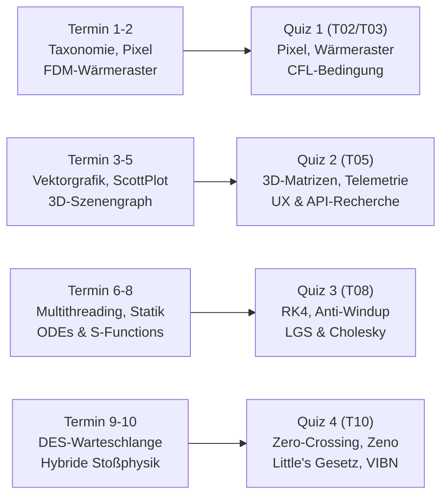

# Benotungskonzept, Moodle-MCQ-Prüfungen & Vibe-Coding-Assessment

**Lehrveranstaltung:** Systemsimulation / Digitaler Zwilling  
**Studiengang:** Bachelor Automatisierungstechnik (5./6. Semester)  
**Institution:** Fachhochschule Oberösterreich, Campus Wels  
**Verfasser:** Assessment- & KI-Prüfungsexperte  
**Gültigkeit:** Ab Studienjahr 2026/2027  
**Didaktische Referenzdokumente:** `Konzept/01_Lehrveranstaltungsstruktur_und_Syllabus.md`, `Konzept/02_Uebungskatalog_und_Abschlussprojekt.md`

---

## 1. Die zentrale pädagogische Herausforderung: KI, Vibe Coding & Simulationsspiele

### 1.1 Ausgangslage: Der Paradigmenwechsel durch generative KI und Vibe Coding
Mit der ubiquitären Verfügbarkeit von modernen Large Language Models (LLMs wie Claude 3.5 Sonnet, GPT-4o, OpenAI o1/o3) und KI-gestützten Entwicklungsumgebungen (GitHub Copilot, Cursor, Windsurf) hat sich das Programmieren mechatronischer Systeme grundlegend verändert. Das von Andrej Karpathy geprägte Phänomen des **„Vibe Coding“** – das iterative, sprachbasierte Generieren von lauffähigem Code auf Basis mechatronischer Spezifikationen und Prompts – ist in der Hochschullehre und industriellen Ingenieurpraxis angekommen.

Für eine Hochschul-Lehrveranstaltung wie *Systemsimulation / Digitaler Zwilling* bedeutet dies:
* **Traditionelles Coding als Prüfungsgegenstand ist obsolet:** Aufgaben wie *„Schreiben Sie eine C#-Klasse für das Runge-Kutta-4-Verfahren“* oder *„Implementieren Sie einen 5-Punkt-Stern für die 2D-Wärmeleitungsgleichung in WPF“* lösen moderne LLMs in unter fünf Sekunden fehlerfrei auf rein syntaktischer Ebene.
* **Scheinkompetenz und „Cargo Cult Engineering“:** Studierende können lauffähige, visuell beeindruckende Benutzeroberflächen generieren, ohne die physikalische Modellbildung, die mathematischen Stabilitätsgrenzen oder die numerischen Integrationsfehler im Kern verstanden zu haben.
* **Trivialer Täuschungsversuch vs. professionelle Werkzeugnutzung:** Ein Verbot von generativer KI ist an einer zukunftsorientierten Fachhochschule weder technisch durchsetzbar noch didaktisch sinnvoll. In der industriellen Automatisierungstechnik werden Ingenieure künftig simulationsgestützte Digitale Zwillinge und physikalische Game Engines in Symbiose mit KI-Agenten entwickeln.

```
Traditioneller Ansatz (Veraltet):
[Problem] ───> [Code manuell schreiben] ───> [Compiler-Lauf] ───> [Benotung nach Funktion]
                      ▲
               KI löst dies in 2s!

Neues Assessment-Paradigma (Systemsimulation):
[Problem] ───> [Prompt / Spezifikation] ───> [KI generiert Code] ───> [Validation / Plausibilisierung]
                                                                                │
   ┌────────────────────────────────────────────────────────────────────────────┴────────┐
   ▼                                            ▼                                        ▼
[Physikalische Konsistenz]            [Numerische Stabilität]               [Auskunft & Demonstration]
• Energie- & Impulserhaltung          • Eigenwerte & Schrittweite           • "Warum genau diese Zeile?"
• Grenzfall- & Sensitivitätsanalyse   • Steifigkeit & Lösungsverfahren      • Live-Demonstration & Video-Review
```

---

### 1.2 Die Fallstricke bei Simulationsspielen: Echte Numerische Simulation vs. Reine KI-Animation

Im erweiterten Aufgabenmix der Lehrveranstaltung treffen klassische **industrielle Digitale Zwillinge** (z. B. Kranpendel, Mehrzonen-Extruder, Servoantriebe) auf **interaktive Simulationsspiele** (z. B. Mondlandefähre mit Schubvektor-Regelung, 2D-Physik-Flipper, elastische Billard-Kollisionen, Schwerelosigkeits-Partikelsysteme).

Gerade bei spielerischen Aufgaben neigen LLMs zu einer gravierenden didaktischen Täuschung: Sie erzeugen **rein visuelle „KI-Animationen“**, anstatt einer echten **numerischen Physik-Simulation**.

```
┌──────────────────────────────────────────────────────────────────────────────────────────────────┐
│                   DEMASKIERUNG: KI-ANIMATION VS. NUMERISCHE SIMULATION                          │
├──────────────────────────────────┬───────────────────────────────────────────────────────────────┤
│ Merkmal                          │ Reine KI-Animation (Schein-Simulation)                       │ Echte Numerische Simulation (Ingenieurstandard)              │
├──────────────────────────────────┼───────────────────────────────────────────────────────────────┼───────────────────────────────────────────────────────────────┤
│ **Zeitbasis & Schrittweite**     │ An Render-Framerate gekoppelt (`CompositionTarget.Rendering`,  │ Strikt entkoppelt: Physik tickt mit festem oder adaptivem     │
│                                  │ `DispatcherTimer`, feste Pixelverschiebungen pro Frame).      │ Zeitschritt $\Delta t$ ($\text{d}t$). Framerate-unabhängig.   │
├──────────────────────────────────┼───────────────────────────────────────────────────────────────┼───────────────────────────────────────────────────────────────┤
│ **Bewegungsgesetz**              │ Optische Tweenings, parametrische Kurven ($y = A \sin(\omega t)$),│ Dynamische DGLn zweiter Ordnung: $\ddot{\mathbf{x}} = \frac{\mathbf{F}}{m}$.  │
│                                  │ empirische Wegpunkte ohne Berücksichtigung von Kräften.       │ Zustandsvektor $\mathbf{x} = [x, \dot{x}]^\top$.             │
├──────────────────────────────────┼───────────────────────────────────────────────────────────────┼───────────────────────────────────────────────────────────────┤
│ **Kollisionsbehandlung**         │ Diskretes Zurücksetzen bei Durchdringung:                     │ Zero-Crossing-Funktion $z(\mathbf{x}) = 0$ mit Bisektionssuche│
│                                  │ `if (x > Width) { vx = -vx * 0.8; x = Width; }`               │ bis $|z| < \epsilon$; Impulserhaltung und Kontaktmechanik.    │
├──────────────────────────────────┼───────────────────────────────────────────────────────────────┼───────────────────────────────────────────────────────────────┤
│ **Physikalische Erhaltungssätze**│ Energie wächst oder fällt unkontrolliert; bei hoher           │ Erhaltungssätze (Energie, Impuls) werden explizit mitgeführt │
│                                  │ Geschwindigkeit tritt "Tunneling" (Geisterdurchgang) auf.     │ und numerisch validiert ($E_{\text{tot}} \approx \text{const}$).│
├──────────────────────────────────┼───────────────────────────────────────────────────────────────┼───────────────────────────────────────────────────────────────┤
│ **Stabilitätsverhalten**         │ Reagiert auf veränderte Zeitschritte mit Zeitlupe/Zeitraffer  │ Konvergiert mathematisch mit definierter Ordnung              │
│                                  │ oder explodiert völlig bei Parameteränderungen.               │ ($\mathcal{O}(\Delta t^p)$); Stabilitätsgrenzen begründet.    │
└──────────────────────────────────┴───────────────────────────────────────────────────────────────┴───────────────────────────────────────────────────────────────┘
```

> [!CAUTION]
> **Das K.O.-Kriterium der Schein-Simulation:**  
> Reicht ein Studierendenteam eine Arbeit ein, bei der die Bewegungsgleichungen lediglich durch heuristische UI-Verschiebungen oder vordefinierte Keyframe-Animationen nachgeahmt werden, ohne dass ein diskretisiertes Differentialgleichungssystem (DGL) oder ein lineares Gleichungssystem (LGS) den Zustand berechnet, gilt die Arbeit im Kernkriterium **Modellbildung & Numerik** als **nicht bestanden**.

---

### 1.3 Die neuen Kernkompetenzen: Modellieren, Integrieren, Recherchieren, Validieren & Verteidigen

Die Prüfungs- und Benotungsphilosophie verschiebt sich von den unteren Stufen der Bloom’schen Taxonomie (Erinnern, Verstehen, Code abtippen) hin zu den höheren ingenieurwissenschaftlichen Stufen:

1. **Systemische Architekturkompetenz („Die Goldene Regel“):** Die Fähigkeit, eine simulationsgerechte Architektur vorzugeben (strikte Kapselung von kontinuierlichen/diskreten Zuständen, vollständige Entkopplung der Physik-Engine vom WPF-UI-Rendering über thread-sichere Puffer und DTOs).
2. **Physikalische & mathematische Plausibilitätsprüfung:** Erkennen von subtilen Halluzinationen der KI (z. B. falsche Stoßzahlen, Vorzeichenfehler bei Dämpfungstermen, unphysikalische künstliche Energiezufuhr bei explizitem Euler).
3. **Numerische Urteilskraft & Parametrierung:** Auswahl und Begründung von Diskretisierungsparametern (CFL-Bedingung bei Diffusionsrastern, Stabilitätsgebiete expliziter vs. impliziter Solvern, Butcher-Tableau von Heun/RK4).
4. **Recherchekompetenz & API-Integration:** Ingenieure programmieren komplexe Bibliotheken nicht von Grund auf neu. Bewertet wird die Fähigkeit, über gezielte Online-Recherche moderne NuGet-Bibliotheken (z. B. `ScottPlot 5`, `Math.NET Numerics`, `SharpGL`, modernste .NET-TPL-Primitives) auszuwählen, deren Dokumentation zu verstehen und sie architektonisch sauber ohne veraltete ("deprecated") APIs einzubinden.
5. **Mündliche Auskunftsfähigkeit (Defensibility):** Wer den Code vorlegt, haftet dafür. Studierende müssen in der Lage sein, jede Zeile des von der KI generierten Codes im Detail zu erklären, live im Code-Review auf Fehler zu untersuchen und unter Zeitdruck mechatronische Parameteränderungen vorzunehmen.

---

## 2. Aufbau des Benotungsschemas (Gewichtung & Säulen)

Um Fairness, Transparenz und kontinuierlichen Lernerfolg bei vollständiger KI-Erlaubnis zu garantieren, basiert die Gesamtnote auf einer **Zwei-Säulen-Architektur (Variante 1: 40 % Theorie / 60 % Praxis & Diskurs)**. Anstelle eines künstlichen, am Semesterende aufgesetzten Einzel-Abschlussprojekts bildet das kontinuierlich aufgebaute **C#-Simulations-Portfolio aus den 10 wöchentlichen Übungen** den zentralen praktischen Leistungsnachweis.

```
┌────────────────────────────────────────────────────────────────────────────────────────┐
│                        GESAMTNOTE: 2-SÄULEN-MODELL (100 %)                             │
├────────────────────────────────────────┬───────────────────────────────────────────────┤
│    SÄULE 1: THEORIE & NUMERIK (40 %)    │    SÄULE 2: PRAXIS, PORTFOLIO & DISKURS (60 %)│
├────────────────────────────────────────┼───────────────────────────────────────────────┤
│    4 Moodle Multiple-Choice-Tests      │    • 30 % C#-Code-Portfolio (10 Übungen)      │
│    à 10 % = 40 %                       │    • 15 % Showcase-Demos (Rotationsprinzip)   │
│    (Q1: T03, Q2: T05, Q3: T08, Q4: T10)│    • 15 % Fachliche Plenumsfragen & Reviews   │
└────────────────────────────────────────┴───────────────────────────────────────────────┘
```

### 2.1 Säule 1: Moodle Multiple-Choice-Tests (40 %)
* **Ziel:** Kontinuierliche Überprüfung des fundierten theoretischen, numerischen und algorithmischen Grundlagenwissens.
* **Umfang:** **4 formatgebundene Moodle-Tests** über das Semester verteilt (**je 10 %** der Gesamtnote; ca. 15–20 Minuten pro Test).
* **Durchführung:** In Präsenz zu Beginn der jeweiligen Vorlesungseinheiten (T03, T05, T08, T10) auf Moodle im Safe Exam Browser oder kontrollierten PC-Pool-Setting.
* **Chronologische Bindung:** Ein Test darf **ausschließlich** Stoff abfragen, der bis zum jeweiligen Termin in der Vorlesung und den vorangegangenen Übungen vermittelt wurde.
* **Fokus:** Bildgestützte Fehleranalysen, numerische Parametrisierungsaufgaben mit individuellen Zufallsvariablen, Interpretation von Phasenraumkurven und Identifikation subtiler Bugs in Codefragmenten, die nicht durch reines Copy-Paste gelöst werden können.

### 2.2 Säule 2: Kontinuierlicher Übungsbetrieb, Portfolio & Diskurs (60 %)
* **Ziel:** Laufende Überprüfung der praktischen Implementierungsfähigkeit, Recherchekompetenz und spontanen Erklärungsfähigkeit im C#/.NET-Umfeld sowie Etablierung einer aktiven, hochschulgerechten ingenieurwissenschaftlichen Diskussions- und Review-Kultur (Peer-Review).
* **Verbindliche Aufteilung von Säule 2 (60 %):**
  - **30 % C#-Code-Portfolio (10 Übungsabgaben, Säule 2a):** Kontinuierliche Entwicklung und wöchentliche Abgabe von 10 lauffähigen Simulationsmodulen im gewählten Track (Track A Industrie ODER Track B Game). Bewertet werden Kapselung nach der Goldenen Regel, numerische Stabilität, allokationsfreie Schleifen, automatisierte MSTests und saubere Git-Historie.
  - **15 % Showcase-Präsentationen & Lösungsgüte (Säule 2b):** Live-Vorführung der eigenen Lösung im Rotationsverfahren am Beamer bzw. Laborplatz, fundierte Code-Erklärung und Bestehen des Ad-hoc-Parameter-Stresstests.
  - **15 % Fachliche Plenumsbeteiligung & Peer-Review (Fragenkultur, Säule 2c):** Aktive, fundierte Fragestellungen und kritische Reviews während der Vorstellungen anderer Teams über das gesamte Semester hinweg (Aufdecken physikalischer Widersprüche, Fragen zur numerischen Schrittweite/CFL-Grenzen oder Threading-/UI-Entkopplung).

#### 2.2.1 Säule 2a: C#-Code-Portfolio (30 %)
* **Umfang:** 10 wöchentliche Übungsabgaben in 2er-Teams (T01 bis T10). Jedes Team wählt pro Termin verbindlich **Track A (Industrie)** ODER **Track B (Simulationsspiel)**.
* **Portfolio-Architektur:** Ein zentrales Git-Repository pro Team, strukturiert nach Modulen `Termin_01` bis `Termin_10`.
* **Kernkriterien:**
  1. *Einhaltung der Goldenen Regel:* Vollständige Entkopplung der Simulations- und Physiklogik von WPF/UI.
  2. *Numerische Solidität:* Mathematisch begründete Zeitschrittweiten, Stabilitätskontrollen, keine KI-Schein-Animationen.
  3. *Performance & Allokationsfreiheit:* Keine Heap-Allokationen in zeitkritischen Simulations- oder Render-Schleifen.
  4. *Automatisierte Tests:* Mindestens eine aussagekräftige MSTest-Klasse pro Meilenstein/Modul (z. B. analytischer Grenzfallabgleich, Invarianzprüfungen).

#### 2.2.2 Säule 2b: Showcase-Präsentation & Lösungsgüte (15 %)
* **Durchführung:** In jedem Termin stellen ausgewählte Teams (rotierend je 1x Track A und 1x Track B) ihre Lösung live am Beamer vor. Begleitend finden 4 Tischabnahmen an den Labor-Meilensteinen (T04, T07, T09, T10) statt:
  - **Meilenstein 1 (Abnahme T04, Stoff aus T02/T03):** 2D-Visualisierung (Pixel-FDM & Canvas-Vektorgrafik). *(Kausalitätsgarantie: Noch KEINE FE-Gleichungssysteme oder Cholesky!)*
  - **Meilenstein 2 (Abnahme T07, Stoff aus T04/T05):** Telemetrie & 3D-Kinematik (ScottPlot 5 Ringpuffer & SharpGL 3D-Szenengraph).
  - **Meilenstein 3 (Abnahme T09, Stoff aus T06/T07):** High-Performance & Statik (TPL Parallel.For & Math.NET Cholesky-Fachwerklöser).
  - **Meilenstein 4 (Abnahme T10, Stoff aus T08/T09):** Kontinuierliche DGLn & Diskrete Ereignissysteme (S-Functions, RK4 Anti-Windup, DES-Warteschlangen).
* **Elemente der Abnahme:**
  1. *Live-Vorführung:* Flüssiges Programm ($\ge 30\,\text{FPS}$), korrekte Physik, saubere UX.
  2. *Code-Inspection:* Präzise Erklärung jeder Codezeile ("Warum genau dieses Konstrukt?").
  3. *Ad-hoc-Parameterstresstest:* Spontane Modifikation von Parametern (z.B. $h \times 10$, Masse verdoppeln) mit Vorhersage und Interpretation der Systemreaktion.

#### 2.2.3 Säule 2c: Fachliche Plenumsbeteiligung & Peer-Review (Fragenkultur, 15 %)
* **Ziel & Ingenieurkompetenz:** In der industriellen Entwicklung mechatronischer Systeme ist das kritische Hinterfragen fremder Simulationsmodelle, das Erkennen versteckter Modellannahmen und das Enttarnen unphysikalischen Verhaltens (z. B. versteckte Schein-Animationen) eine Kernqualifikation. Säule 2c belohnt Studierende, die als aufmerksame Peer-Reviewer agieren.
* **Modus & Erfassung:**
  - Während der Showcase-Sessions fungiert das gesamte Auditorium als **aktives Review-Board**.
  - Jeder Studierende ist angehalten, über das Semester hinweg fundierte, anspruchsvolle Fachfragen an die vortragenden Teams zu richten.
  - Die Lehrperson führt ein semesterbegleitendes Bewertungslogbuch (über ein strukturiertes Moodle-Bewertungsraster), in dem Qualität, Schärfe und Relevanz der Plenumsfragen erfasst werden (Richtwert für eine Bestnote: mind. 4–6 substanzielle, fachlich tiefgehende Plenumsbeiträge über das Semester verteilt).

### 2.3 Zusammenfassendes Master-Board der Leistungsbeurteilung

Das folgende Master-Board bietet eine vollständige, transparente Übersicht aller Prüfungsmodalitäten, Gewichtungen, Termine, Formate und Mindestanforderungen der Lehrveranstaltung:

| Säule & Anteil | Teilkomponente | Gewicht (LV-Note) | Termine / Taktung | Prüfungsformat & Setting | Kernkriterien & Gegenstand | Mindestanforderung (Hürde) |
| :--- | :--- | :---: | :--- | :--- | :--- | :--- |
| **Säule 1 (40 %)**<br>Theoretische & numerische Grundlagen | **Moodle MCQ-Tests 1–4** | **40 %**<br>*(4 × 10 %)* | • Q1: T03 (Kap. 00–02)<br>• Q2: T05 (Kap. 03–05)<br>• Q3: T08 (Kap. 06–08)<br>• Q4: T10 (Kap. 09–11) | Präsenz-Moodle-Quiz (15–20 min)<br>Safe Exam Browser / PC-Pool | • Bildgestützte Fehlerdiagnose<br>• CFL-Stabilitätsgrenzen & Schrittweiten<br>• LGS-Konditionierung, Cholesky<br>• ODEs, Anti-Windup, Zero-Crossing, DES<br>• Berechnungsfragen mit Zufallsvariablen | Mind. **50 %** in Säule 1<br>(mind. 20 von 40 Pkt.) |
| **Säule 2 (60 %)**<br>Kontinuierlicher Übungsbetrieb & Diskurs | **Säule 2a: C#-Code-Portfolio** | **30 %**<br>*(10 Module)* | Wöchentlich T01–T10 | Git-Repository-Review & automatisierte Testabnahme | • Goldene Regel (Physik $\leftrightarrow$ MVVM $\leftrightarrow$ GUI)<br>• Numerische Solidität & Stabilität<br>• Allokationsfreie Schleifen, MSTests<br>• Git-Historie & Code-Konsistenz | Mind. **50 %** in Säule 2a<br>(mind. 15 von 30 Pkt.) |
| | **Säule 2b: Showcase-Präsentationen** | **15 %**<br>*(4 Meilensteine)* | • M1: T04 (Kap. 02/03)<br>• M2: T07 (Kap. 04/05)<br>• M3: T09 (Kap. 06/07)<br>• M4: T10 (Kap. 08/09) | Live-Showcase am Beamer (rotierend) & Labor-Tischabnahmen | • Lauffähige Lösung ($\ge 30\,\text{FPS}$)<br>• Saubere physikalische Modellierung (DGL/LGS)<br>• Code-Inspection (Erklärung jeder Zeile)<br>• Ad-hoc Live-Parameter-Stresstest | Mind. **50 %** in Säule 2b<br>(mind. 7,5 von 15 Pkt.) |
| | **Säule 2c: Plenumsbeteiligung & Peer-Review** | **15 %** | Fortlaufend T02–T10 (Showcase-Sessions & Diskurs) | Aktives Peer-Review im Plenum (Fragenkultur & fachlicher Diskurs) | • Schärfe & Tiefe mechatronischer Fragen<br>• Aufdecken physikalischer Widersprüche<br>• Prüfen von Stabilität, CFL & Entkopplung<br>• Aufdecken von KI-Schein-Animationen | Mind. **50 %** in Säule 2c<br>(mind. 7,5 von 15 Pkt.) |
| **GESAMT** | **2 Säulen** | **100 %** | **Semesterbegleitend** | **Trianguliertes Assessment** | **Theorie & Numerik (40 %) + Praxis, Portfolio & Diskurs (60 %)** | **Gesamtnote $\ge 50\,\%$ + Hürden** |

---

## 3. Moodle Multiple-Choice Tests (MCQ-Konzept & Chronologie)

### 3.1 Strikte chronologische Stoffabgrenzung & Terminplan (Quiz 1 bis 4)

Um faire Prüfungsbedingungen zu gewährleisten, ist der Stoff für jeden Test strikt auf die bis dahin behandelten Inhalte begrenzt. Konzepte wie S-Functions, Runge-Kutta-Verfahren oder Multithreading dürfen in frühen Tests unter keinen Umständen vorkommen!



* **Quiz 1 (zu Beginn von Termin 2 bzw. 3):**
  - **Behandelter Stoff:** Kapitel 00 (Prolog), Kapitel 01 (Einführung & Digitaler Zwilling), Kapitel 02 (2D-Pixelgrafik & Feldsimulation).
  - **Themen:** Taxonomie technischer Modelle, Grieves-Zwilling, Pixelgrafik mit `WriteableBitmap`, Bildspeicher (Stride, BGRA32, unsafe-Pointers), 2D-Wärmeleitungsgleichung (FDM, Laplace 5-Punkt-Stern), CFL-Stabilitätskriterium expliziter Diffusionsraster, basale Kinematik im Pixelraster.
  - **Ausdrücklich AUSGESCHLOSSEN:** Vektorgrafik-Matrizen, ScottPlot, OpenGL/3D, Multithreading, LGS-Solver, Runge-Kutta, S-Functions, DES, Hybride Events.

* **Quiz 2 (zu Beginn von Termin 5):**
  - **Behandelter Stoff:** Kapitel 03 (2D-Vektorgrafik & Bemaßung), Kapitel 04 (Echtzeit-Telemetrie & Diagramme), Kapitel 05 (3D-Visualisierung & OpenGL).
  - **Themen:** Koordinatentransformation (Welt $\leftrightarrow$ Screen), Viewport-Skalierung unter Aspektverhältnis-Erhaltung, Inversion der Y-Achse, WPF Canvas & `DrawingVisual`, geometrische Bemaßung (Dimensioning, Maßketten, Pfeilspitzen), ScottPlot 5 Datenstreaming, Ringpuffer (`CircularBuffer`), 3D-Computergrafik (SharpGL, homogene $4 \times 4$-Matrizen, Euler-Winkel vs. Transformationen, hierarchische Szenengraphen für Roboter/Fahrzeuge, Orbit-Kamera, Beleuchtungsmodelle), API-Recherchekompetenz.
  - **Ausdrücklich AUSGESCHLOSSEN:** Multithreading-Parallelisierung, FE-Fachwerke & lineare Gleichungssysteme (LGS), Steifigkeitsmatrizen, Cholesky-Zerlegung, ODE-Integratoren, S-Functions, Ereignissimulation.
  > [!IMPORTANT]
  > **Kausalitätsprüfung & Konsistenz für Termin 3 & Quiz 2:**  
  > In Termin 3 (Kapitel 03) und im zugehörigen Quiz 2 werden **keinerlei Fachwerk-Gleichungssysteme ($\mathbf{K} \cdot \mathbf{u} = \mathbf{f}$), Steifigkeitsmatrizen oder Cholesky-Zerlegungen** abgeprüft! Diese mathematischen FE-Methoden werden erst in Kapitel 07 / Termin 7 vermittelt und in Quiz 3 / Meilenstein 3 geprüft.  
  > In Termin 3 und Quiz 2 stehen bezüglich Kapitel 03 **ausschließlich** die 2D-Vektorgrafik auf dem WPF Canvas, affine Koordinatentransformationen (Welt $\leftrightarrow$ Screen), isotrope Viewport-Skalierung, Inversion der Y-Achse sowie Bemaßungen (Dimensioning, Maßketten, Pfeilgeometrien) im Fokus.

* **Quiz 3 (zu Beginn von Termin 8):**
  - **Behandelter Stoff:** Kapitel 06 (Multithreading & Parallele Simulation), Kapitel 07 (Statische Modelle & LGS), Kapitel 08 (Kontinuierliche dynamische Modelle & S-Functions).
  - **Themen:** TPL (`Parallel.For`, Partitionierung, Race Conditions, False Sharing, Thread-Synchronisation), statische FE-Fachwerke (Steifigkeitsmatrix $\mathbf{K}$, Lastvektor $\mathbf{f}$, Lagerbedingungen, Cholesky-Zerlegung $\mathbf{L}\mathbf{L}^\top$, Konditionszahl $\kappa(\mathbf{K})$, Singularitäten), kontinuierliche DGL-Systeme (expliziter Euler, Heun, RK4, Butcher-Tableau, Stabilitätsgebiete, steife Systeme), S-Function-Paradigma (`CalculateDerivatives`), Regelkreise mit Sättigung & Anti-Windup Clamping (Raketenantrieb, DC-Servomotor).
  - **Ausdrücklich AUSGESCHLOSSEN:** Diskrete Ereignissimulation (DES), Queues, Stochastik, Zero-Crossing-Bisektion, Zeno-Kollaps.

* **Quiz 4 (zu Beginn von Termin 10):**
  - **Behandelter Stoff:** Kapitel 09 (Diskrete dynamische Modelle & Stochastik), Kapitel 10 (Hybride dynamische Modelle), Kapitel 11 (Epilog & Synthese).
  - **Themen:** Diskrete Ereignissimulation (DES, Future Event List / PriorityQueue, Kendall-Notation, Little's Gesetz $L = \lambda W$, Poisson-Prozesse, Erlang-C), Stochastik (Inversionsmethode für Zufallsvariablen, Box-Muller, Monte-Carlo-Replikation mit Welford-Statistik), Hybride Dynamik (Zero-Crossing-Funktionen $z(\mathbf{x}) = 0$, Bisektionssuche vs. Durchdringung/Tunneling, elastischer/plastischer Stoß, Coulomb-Reibung mit Stick-Slip, Zeno-Kollaps & Chattering-Vermeidung), VIBN-Kopplung.

---

### 3.2 Strategien gegen unreflektiertes KI-Copy-Paste
Standard-LLMs scheitern bei simulationsspezifischen Fragen zuverlässig, wenn folgende vier Techniken systematisch kombiniert werden:
1. **Zufallsvariablen in Berechnungsfragen (Moodle Calculated Questions):** Jeder Studierende erhält individualisierte Parameter ($\alpha, \Delta x, \Delta t, m, c, d$). LLMs berechnen mehrstufige numerische Formeln oft mit Rundungsfehlern, verwechseln Dimensionen oder halluzinieren Formelzeichen.
2. **Visuelle Artefakt- und Fehlerdiagnose:** Bereitstellung von Diagrammen (Phasenportraits, verzerrte Heatmaps, instabile Integratortrajektorien), bei denen das physikalische Phänomen interpretiert werden muss.
3. **Subtile Code-Mutationen („Find the Bug“):** C#-Snippets, die auf den ersten Blick syntaktisch perfekt wirken, aber einen gravierenden numerischen oder semantischen Defekt aufweisen (z. B. Stride-Berechnung ohne 4-Byte-Multiplikation, falsche Matrix-Multiplikationsreihenfolge, Integration im UI-Thread).
4. **Strikter Zeittakt:** 8–10 Fragen in 15 Minuten. Wer jede Frage erst als Screenshot prompten und die Antwort interpretieren muss, gerät unter massiven Zeitdruck.

---

### 3.3 Konkrete Beispielfragen für alle 4 Moodle-Tests

#### Quiz 1 (Termin 2/3): Grundlagen, 2D-Pixelgrafik & FDM-Wärmeraster

##### Frage 1.1: FDM-Wärmeleitung auf Pixel-Raster & CFL-Stabilitätsgrenze
* **Fragentyp:** Berechnungsfrage mit Zufallsvariablen (Moodle Calculated)
* **Chronologischer Kontext:** Kapitel 02 (FDM-Feldsimulation, 2D-Pixel-Rendering)
* **Aufgabenstellung:**
  Sie simulieren die 2D-Wärmeleitung in einem metallischen Kühlkörper mittels Finite-Differenzen-Methode (5-Punkt-Stern auf einem quadratischen Pixelgitter). Die zugrundeliegende parabolische Differentialgleichung lautet:
  $$\frac{\partial T}{\partial t} = \alpha \left( \frac{\partial^2 T}{\partial x^2} + \frac{\partial^2 T}{\partial y^2} \right)$$
  Gegeben sind:
  - Temperaturleitfähigkeit des Werkstoffs: $\alpha = {A} \cdot 10^{-4}\,\frac{\text{m}^2}{\text{s}}$
  - Räumliche Gitterweite (Pixelabstand): $\Delta x = \Delta y = {B}\,\text{mm} = {B} \cdot 10^{-3}\,\text{m}$
  - Zeitdiskretisierung über explizites Euler-Verfahren: $T_{i,j}^{k+1} = T_{i,j}^k + \frac{\alpha \Delta t}{\Delta x^2} \left( T_{i+1,j}^k + T_{i-1,j}^k + T_{i,j+1}^k + T_{i,j-1}^k - 4 T_{i,j}^k \right)$

  1. Berechnen Sie die theoretische **maximale Zeitschrittweite $\Delta t_{\text{max}}$ (CFL-Stabilitätsgrenze)** in Millisekunden [ms], ab welcher die explizite 2D-FDM-Simulation numerisch instabil wird (Schachbrettmuster und unendliche Temperaturen).
  2. Was passiert im C#/WPF-Programm, wenn Sie $\Delta t = 1{,}2 \cdot \Delta t_{\text{max}}$ wählen?
* **Lösung & Formeln:**
  - Stabilitätsbedingung für 2D-Wärmeleitung (expliziter 5-Punkt-Stern):
    $$r = \frac{\alpha \Delta t}{\Delta x^2} \le \frac{1}{4} \implies \Delta t_{\text{max}} = \frac{\Delta x^2}{4 \alpha}$$
  - Numerischer Wert: $\Delta t_{\text{max}} = \frac{({B} \cdot 10^{-3})^2}{4 \cdot {A} \cdot 10^{-4}}\,\text{s} = \frac{B^2}{4 A} \cdot 10^{-2}\,\text{s} = \frac{2{,}5 \cdot B^2}{A}\,\text{ms}$.
  - Zu Teil 2: Die Werte oszillieren räumlich von Gitterpunkt zu Gitterpunkt mit alternierendem Vorzeichen (Schachbrettmuster-Instabilität); die Byte-Werte der Pixel laufen in den Überlauf (`NaN` / `Overflow`), die Anzeige friert optisch ein oder flackert weiß/schwarz.
* **Didaktischer Mehrwert:** Prüft das fundamentale Verständnis von physikalischer Rastermodellierung und numerischer Stabilität vor jedem ODE-Kapitel.

##### Frage 1.2: Visuelle Fehlerdiagnose & Stride-Berechnung in `WriteableBitmap`
* **Fragentyp:** Multiple-Choice Single-Select mit Code-Snippet
* **Chronologischer Kontext:** Kapitel 02 (Pixelgrafik, Byte-Array, Pointer)
* **Aufgabenstellung:**
  Ein Studierender implementiert die Visualisierung einer 2D-Schlagloch-Tiefenkarte mit einer `WriteableBitmap` im Pixelformat `PixelFormats.Bgra32` (Breite: $W = 640$, Höhe: $H = 480$). Die Heatmap wird im Bildspeicher manipuliert:

```csharp
int stride = width * 3; // Bildbreite mal Kanäle
byte[] pixelData = new byte[stride * height];

for (int y = 0; y < height; y++)
{
    for (int x = 0; x < width; x++)
    {
        int index = y * stride + x * 4;
        byte intensity = GetSimulationIntensity(x, y);
        pixelData[index + 0] = intensity; // Blau
        pixelData[index + 1] = 0;         // Grün
        pixelData[index + 2] = (byte)(255 - intensity); // Rot
        pixelData[index + 3] = 255;       // Alpha
    }
}
bitmap.WritePixels(new Int32Rect(0, 0, width, height), pixelData, stride, 0);
```

Beim Start der Applikation erscheint das Bild diagonal zerrissen und verzerrt; nach wenigen Zeilen wirft das Programm eine `IndexOutOfRangeException`. Was ist der exakte Grund für diesen Fehler?

* [ ] A) Das Format `Bgra32` verlangt, dass die Zeilenlänge im Speicher auf 64-Bit-Grenzen ausgerichtet wird.
* [x] B) Der Stride wurde mit `width * 3` berechnet. Da `Bgra32` jedoch 4 Bytes pro Pixel (32 Bit) belegt, muss der Stride zwingend `width * 4` betragen; die Zeilen verschieben sich pro $y$ um $W$ Bytes und der Index läuft über das Array hinaus.
* [ ] C) In WPF dürfen Farbwerte nicht als `byte`, sondern müssen im Shader als normalisierte `float`-Werte ($0{,}0 \dots 1{,}0$) übergeben werden.
* [ ] D) Die Methode `WritePixels` darf nur im `CompositionTarget.Rendering`-Event aufgerufen werden.

---

#### Quiz 2 (Termin 5): 2D-Vektorgrafik, Telemetrie & 3D-Szenengraph

> [!NOTE]
> **Kausalitätshinweis zum Prüfungsumfang:**  
> Gemäß Lehrveranstaltungsstruktur umfasst Quiz 2 für Kapitel 03 (Termin 3) **ausschließlich** 2D-Vektorgrafik, Koordinatentransformationen und Bemaßungen auf dem WPF Canvas. Es werden **keinerlei Fachwerk-Gleichungssysteme ($K \cdot u = f$) oder Cholesky-Zerlegungen** abgeprüft; diese sind Gegenstand von Quiz 3 (Kapitel 07).

##### Frage 2.1: 2D-Vektorgrafik: Koordinatentransformation (Welt ↔ Screen), Y-Inversion & Geometrische Bemaßung auf dem WPF Canvas
* **Fragentyp:** Berechnungs- und Code-Verständnisfrage (Moodle Calculated / Single-Select)
* **Chronologischer Kontext:** Kapitel 03 (2D-Vektorgrafik, Canvas, Welt-zu-Screen-Transformation, Bemaßung)
* **Aufgabenstellung:**
  In einer mechatronischen 2D-Visualisierung (z. B. schematischer Träger/Balken) soll eine Konstruktion aus dem kartesischen Weltkoordinatensystem (Meter, $Y$ zeigt nach oben) auf ein WPF-Canvas-Fenster der Größe $W_{\text{canvas}} = 800\,\text{px} \times H_{\text{canvas}} = 600\,\text{px}$ (Bildschirmkoordinaten, $Y$ zeigt nach unten) projiziert werden. Die Bounding-Box der Welt beträgt:
  $$x_{\text{min}} = 0{,}0\,\text{m}, \quad x_{\text{max}} = 10{,}0\,\text{m}, \quad y_{\text{min}} = 0{,}0\,\text{m}, \quad y_{\text{max}} = 5{,}0\,\text{m}$$

  Um Verzerrungen zu vermeiden, wird ein isotroper Skalierungsfaktor (Uniform Aspect Ratio) mit Zentrierung gewählt:
  ```csharp
  double scaleX = canvasWidth / (xMax - xMin);
  double scaleY = canvasHeight / (yMax - yMin);
  double s = Math.Min(scaleX, scaleY); // Isotropie-Faktor
  
  double offsetX = (canvasWidth - (xMax - xMin) * s) / 2.0;
  double offsetY = (canvasHeight - (yMax - yMin) * s) / 2.0;
  
  // Transformation eines Weltpunkts (xw, yw) in Screen-Pixel (xs, ys)
  double xs = offsetX + (xw - xMin) * s;
  double ys = canvasHeight - (offsetY + (yw - yMin) * s);
  ```

  Zusätzlich wird zwischen zwei Lagerpunkten $P_1(1{,}0\,\text{m}, 1{,}0\,\text{m})$ und $P_2(7{,}0\,\text{m}, 1{,}0\,\text{m})$ eine Bemaßungslinie mit Pfeilspitzen im WPF Canvas gezeichnet.

  1. Wie groß ist der Skalierungsfaktor $s$ in $[\text{px/m}]$ und wie lauten die Canvas-Pixelkoordinaten $(x_s, y_s)$ für den Punkt $P_2(7{,}0\,\text{m}, 1{,}0\,\text{m})$?
  2. Warum müssen die Pfeilspitzen der Bemaßung (Länge $12\,\text{px}$, Öffnungswinkel $30^\circ$) im **Screen Space** und nicht im **World Space** generiert werden?

* **Lösung & Auswertung:**
  - Skalierungsfaktoren:
    $$s_x = \frac{800}{10} = 80\,\frac{\text{px}}{\text{m}}, \quad s_y = \frac{600}{5} = 120\,\frac{\text{px}}{\text{m}} \implies s = \min(80, 120) = 80\,\frac{\text{px}}{\text{m}}$$
  - Offsets zur Zentrierung:
    $$\text{offsetX} = \frac{800 - 10 \cdot 80}{2} = 0\,\text{px}, \quad \text{offsetY} = \frac{600 - 5 \cdot 80}{2} = \frac{600 - 400}{2} = 100\,\text{px}$$
  - Pixelkoordinaten von $P_2(7{,}0\,\text{m}, 1{,}0\,\text{m})$:
    $$x_s = 0 + (7{,}0 - 0) \cdot 80 = 560\,\text{px}$$
    $$y_s = 600 - (100 + (1{,}0 - 0) \cdot 80) = 600 - 180 = 420\,\text{px}$$
  - Zu Teil 2 (Bemaßung im Screen Space):
    Werden Pfeilspitzen im Weltkoordinatensystem als Geometrie modelliert, skalieren sie beim Zoomen oder bei Fenstergrößenänderungen mit. Dadurch würden Pfeile bei starkem Zoom riesig oder bei kleinem Zoom unsichtbar klein. Durch Berechnung der Pfeilflügel im Screen Space (feste Pixellänge $L = 12\,\text{px}$, Drehung um $\pm 30^\circ$ relativ zum normierten Richtungsvektor der Maßlinie $\mathbf{u}_{\text{screen}}$) bleiben Pfeile, Maßhilfslinien und Schriftgrößen typografisch konstant und normgerecht.
* **Didaktischer Mehrwert:** Prüft exakt das mechatronische 2D-Rendering von Termin 3 (Y-Inversion, isotropes Viewport-Mapping, Bemaßungsgeometrie) ohne vorzeitigen Vorgriff auf Gleichungssysteme oder Cholesky.

##### Frage 2.2: Homogene Transformationsmatrizen im 3D-Szenengraph
* **Fragentyp:** Multiple-Choice Multiple-Select
* **Chronologischer Kontext:** Kapitel 05 (3D-Computergrafik mit SharpGL, Szenengraph)
* **Aufgabenstellung:**
  In einer 3D-Roboterarm-Simulation (SharpGL / OpenGL) soll das Werkzeug (Tool-Center-Point) an das Ende von Armsegment 2 montiert werden. Die Transformationen im Szenengraph sind hierarchisch aufgebaut.
  Gegeben sind:
  - $\mathbf{T}_1$: Translation des Sockels zum Gelenk 1
  - $\mathbf{R}_1$: Rotation um Gelenkachse 1
  - $\mathbf{T}_2$: Translation entlang Armsegment 1 zu Gelenk 2
  - $\mathbf{R}_2$: Rotation um Gelenkachse 2
  - $\mathbf{T}_{\text{TCP}}$: Verschiebung entlang Armsegment 2 zum TCP

  Welche der folgenden Aussagen zur mathematischen Verknüpfung der homogenen $4 \times 4$-Transformationsmatrizen und deren Implementierung in OpenGL / C# sind **fachlich korrekt**? *(Wählen Sie alle zutreffenden Aussagen)*

* [x] A) Bei spaltenweiser Vektorkonvention ($\mathbf{v}' = \mathbf{M} \cdot \mathbf{v}$) lautet die Gesamttransformation des TCPs im Weltkoordinatensystem $\mathbf{M}_{\text{Welt}} = \mathbf{T}_1 \cdot \mathbf{R}_1 \cdot \mathbf{T}_2 \cdot \mathbf{R}_2 \cdot \mathbf{T}_{\text{TCP}}$.
* [x] B) Die Multiplikation von Transformationsmatrizen ist im Allgemeinen nicht kommutativ ($\mathbf{T} \cdot \mathbf{R} \neq \mathbf{R} \cdot \mathbf{T}$). Eine Vertauschung bewirkt, dass die Translation im rotierten statt im ursprünglichen Koordinatensystem ausgeführt wird.
* [ ] C) Eine $4 \times 4$-Transformationsmatrix kann in homogenen Koordinaten nur reine Translationen und Rotationen beschreiben; Scherungen und perspektivische Projektionen erfordern $5 \times 5$-Matrizen.
* [x] D) Im Szenengraph profitiert die Kinematik davon, dass beim Rendern von Armsegment 2 der Matrix-Stack (`glPushMatrix` / `glPopMatrix` bzw. moderne Matrix-Hierarchien) genutzt wird, wodurch Transformationen von Armsegment 1 automatisch auf alle Kindknoten vererbt werden.
* [ ] E) Um Rechenzeit zu sparen, können Rotationsmatrizen im 3D-Raum ohne Informationsverlust durch einfache Skalare (Drehwinkel $\theta$) addiert werden.

##### Frage 2.3: ScottPlot 5 Datenstreaming, CircularBuffer & API-Integration
* **Fragentyp:** Code-Analyse & Multiple-Choice Single-Select
* **Chronologischer Kontext:** Kapitel 04 (ScottPlot 5, Echtzeit-Telemetrie)
* **Aufgabenstellung:**
  Ein Team möchte Telemetriedaten eines kontinuierlichen Sensors im Sekundentakt aufnehmen und live in einem ScottPlot-5-Dashboard mit $60\,\text{FPS}$ anzeigen. Ihr erster KI-generierter Entwurf sieht wie folgt aus:

```csharp
private List<double> xValues = new List<double>();
private List<double> yValues = new List<double>();

public void OnSensorDataReceived(double timestamp, double value)
{
    xValues.Add(timestamp);
    yValues.Add(value);
    
    // UI-Plot aktualisieren
    Application.Current.Dispatcher.Invoke(() => {
        WpfPlot1.Plot.Clear();
        WpfPlot1.Plot.Add.Scatter(xValues.ToArray(), yValues.ToArray());
        WpfPlot1.Plot.Axes.AutoScale();
        WpfPlot1.Refresh();
    });
}
```

Nach 10 Minuten Laufzeit beginnt die Benutzeroberfläche massiv zu ruckeln, die CPU-Last steigt auf $100\,\%$ und die Garbage Collection friert das UI periodisch ein.  
Welche professionelle Architektur- und API-Lösung behebt dieses Performance-Problem nachhaltig?

* [ ] A) Man ersetzt `List<double>` durch ein mehrdimensionales `double[,]`-Array und ruft `GC.Collect()` nach jedem Messwert auf.
* [x] B) Man implementiert einen thread-sicheren, vorallokierten Ringpuffer fester Größe (`CircularBuffer<double>`) oder nutzt ScottPlots optimierte Streaming-Klasse (`DataStreamer`), bindet feste Array-Puffer an den Plot und drosselt den Aufruf von `WpfPlot1.Refresh()` über einen entkoppelten UI-Timer auf maximal $30\,\text{Hz}$.
* [ ] C) Man verlagert den `WpfPlot1.Refresh()`-Aufruf in einen Hintergrund-Task via `Task.Run()`, um das UI zu entlasten.
* [ ] D) Man ersetzt ScottPlot durch ein WPF Canvas und zeichnet jeden Datenpunkt als separates `System.Windows.Shapes.Ellipse`-Objekt.

---

#### Quiz 3 (Termin 8): Multithreading, Statische Fachwerke, ODEs & S-Functions

##### Frage 3.1: Kontinuierliche Dynamik & Raketenregelung: RK4 vs. Euler & Anti-Windup Clamping
* **Fragentyp:** Multiple-Choice Single-Select mit mechatronischem Bezug
* **Chronologischer Kontext:** Kapitel 08 (Kontinuierliche Modelle, ODEs, S-Functions)
* **Aufgabenstellung:**
  Zur Lageregelung einer vertikal startenden Forschungsrakete ($m \ddot{y} = F_{\text{Schub}} - m g - d \dot{y}$) wird ein PID-Höhenregler mit nachgeschalteter Schubbegrenzung ($0 \le F_{\text{Schub}} \le F_{\text{max}}$) eingesetzt.
  Die Dynamik wird als S-Function mit kontinuierlichen Zuständen implementiert.

```csharp
public void CalculateDerivatives(double t, double[] x, double[] u, double[] dxdt)
{
    // x[0] = Position y, x[1] = Geschwindigkeit v, x[2] = Integrator-Zustand xi
    double error = targetAltitude - x[0];
    
    // PID-Algorithmus
    double u_pid = Kp * error + Ki * x[2] - Kd * x[1];
    
    // Aktor-Sättigung (Schubdüse)
    double thrust = Math.Clamp(u_pid, 0.0, F_max);
    
    // Ableitungen der Zustände
    dxdt[0] = x[1];
    dxdt[1] = (thrust - mass * g - drag * x[1]) / mass;
    
    // Anti-Windup Logik für Integrator
    if (thrust == u_pid || (thrust == F_max && error < 0) || (thrust == 0.0 && error > 0))
        dxdt[2] = error;
    else
        dxdt[2] = 0.0; // Clamping!
}
```

Warum ist das gezeigte **Clamping (Conditional Integration)** unverzichtbar, und welcher Unterschied zeigt sich bei der numerischen Integration dieses Systems mit dem klassischen **Runge-Kutta-4 (RK4)** im Vergleich zum **expliziten Euler** bei realistischer Schrittweite $h = 0{,}02\,\text{s}$?

* [ ] A) Clamping verhindert, dass der Raketenschub negativ wird; RK4 liefert exakt dieselben Werte wie Euler, verbraucht aber viermal mehr RAM.
* [x] B) Clamping stoppt das unphysikalische Aufintegrieren des I-Anteils während der Aktor-Sättigung und verhindert dadurch ein massives Überschwingen der Zielhöhe; RK4 berechnet 4 Zwischensteigungen ($k_1 \dots k_4$) pro Zeitschritt und garantiert einen lokalen Diskretisierungsfehler von $\mathcal{O}(h^5)$, während der explizite Euler Phasenfehler aufbaut und das Regelsystem künstlich destabilisiert.
* [ ] C) Das Clamping dient der Beseitigung von Chattering beim elastischen Aufprall auf die Startrampe; RK4 ist ein impliziter Solver und erfordert daher eine Newton-Raphson-Iteration.
* [ ] D) Ohne Clamping würde die Steifigkeitsmatrix der Raketenstruktur singulär; Euler ist für S-Functions stets stabiler als RK4.

##### Frage 3.2: Statische Fachwerke: Singularität, Starrkörperbewegungen & Cholesky-Zerlegung
* **Fragentyp:** Multiple-Choice Multiple-Select
* **Chronologischer Kontext:** Kapitel 07 (Statische Modelle, LGS, Math.NET)
* **Aufgabenstellung:**
  Bei der FE-Berechnung eines 2D-Fachwerks mit der Knoten-Freiwertmethode wird das lineare Gleichungssystem $\mathbf{K} \cdot \mathbf{u} = \mathbf{f}$ aufgestellt. $\mathbf{K}$ ist die globale Steifigkeitsmatrix der Dimension $2N \times 2N$, $\mathbf{u}$ der Verschiebungsvektor der Knoten und $\mathbf{f}$ der Lastvektor.
  Zur Lösung soll die **Cholesky-Zerlegung** ($\mathbf{K} = \mathbf{L} \cdot \mathbf{L}^\top$) mit `Math.NET Numerics` verwendet werden.

Welche Bedingungen müssen erfüllt sein, damit die Cholesky-Zerlegung erfolgreich und numerisch stabil durchläuft? *(Wählen Sie alle zutreffenden Aussagen)*

* [x] A) Die globale Steifigkeitsmatrix $\mathbf{K}$ muss nach dem Einpflegen der Lagerbedingungen **symmetrisch und positiv definit** sein ($\mathbf{x}^\top \mathbf{K} \mathbf{x} > 0 \quad \forall \mathbf{x} \neq \mathbf{0}$).
* [x] B) Es müssen mindestens 3 unabhängige Lagerfreiheitsgrade (z. B. ein Festlager mit $u_x=0, u_y=0$ und ein Loslager mit $u_y=0$) gesperrt werden, um alle Starrkörperbewegungen (Translationen und Rotation in der Ebene) auszuschließen.
* [ ] C) Der Lastvektor $\mathbf{f}$ darf an keinem Knoten den Wert Null aufweisen, da sonst die Diagonalelemente der Cholesky-Matrix $L_{ii} = 0$ werden.
* [x] D) Weist das Fachwerk einen inneren Mechanismus auf (z. B. ein nicht-diagonales Viereck ohne Diagonale), wird mindestens ein Eigenwert $\lambda_i = 0$. $\mathbf{K}$ wird positiv semidefinit/singulär und die Cholesky-Zerlegung bricht mit einer Fehlermeldung (Wurzel aus negativer Zahl/Null) ab.
* [ ] E) Für statische Fachwerke darf die Cholesky-Zerlegung prinzipiell nicht verwendet werden, da mechanische Matrizen immer schiefsymmetrisch sind.

---

#### Quiz 4 (Termin 10): Diskrete Dynamik, Stochastik & Hybride Spiel-/Kontaktdynamik

##### Frage 4.1: Hybride Spielphysik & Kontaktdynamik: Zero-Crossing Bisektion vs. Tunneling & Zeno-Effekt
* **Fragentyp:** Multiple-Choice Single-Select mit Diagramm- und Algorithmus-Bezug
* **Chronologischer Kontext:** Kapitel 10 (Hybride dynamische Modelle, Stoßmechanik)
* **Aufgabenstellung:**
  In einem simulationsbasierten 2D-Flipperspiel bzw. einer industriellen Teile-Vereinzelung prallt ein elastisches Werkstück (Masse $m$, Radius $R$) mit hoher Geschwindigkeit gegen eine feste Wand ($x_{\text{Wand}}$).
  Die Stoßfunktion lautet:
  $$z(\mathbf{x}) = x(t) + R - x_{\text{Wand}} = 0$$

Ein naiver Integrationsansatz mit fester Schrittweite $h$ prüft am Ende des Zeitschritts:
`if (x + R >= x_Wand) { vx = -e * vx; }`

Welche gravierenden physikalischen und numerischen Phänomene treten bei diesem naiven Ansatz auf, und wie löst ein **hybrider Simulator mit Zero-Crossing-Bisektion** das Problem professionell?

* [ ] A) Bei hoher Geschwindigkeit kann der Ball die Wand im Zeitschritt komplett durchqueren (**Tunneling-Effekt**); der hybride Simulator verhindert dies, indem er die Schrittweite $h$ generell auf Maschinengenauigkeit ($10^{-16}\,\text{s}$) absenkt.
* [x] B) Der naive Ansatz erkennt die Kollision erst, wenn der Ball bereits tief in die Wand eingedrungen ist; die elastische Umkehr an falscher Position führt zu unphysikalischer Energiegenerierung oder Geisterhaftung. Ein hybrider Simulator überwacht den Vorzeichenwechsel der Schaltfunktion $z(\mathbf{x})$, friert die Integration bei Erkennung ein, findet den exakten Kontaktzeitpunkt $t^*$ via Bisektion/Dekker bis auf $|z| < \epsilon_{\text{tol}}$, führt den Stoßzustandsreset ($v^+ = -e \cdot v^-$) exakt auf der Berührfläche aus und setzt die Integration danach fort.
* [ ] C) Das Problem besteht ausschließlich darin, dass WPF keine Vektoren spiegeln kann; mit DirectX tritt dieser Fehler prinzipiell nicht auf.
* [ ] D) Der Zeno-Effekt führt dazu, dass der Stoßkoeffizient $e > 1$ wird, wodurch der Ball unendlich viel Impuls aufnimmt.

##### Frage 4.2: Warteschlangensimulation (DES) & Little's Gesetz in einer industriellen Fertigungszelle
* **Fragentyp:** Berechnungs- und Konzeptfrage
* **Chronologischer Kontext:** Kapitel 09 (Diskrete Ereignissimulation, DES, Stochastik)
* **Aufgabenstellung:**
  Eine automatisierte Prüfstation in einer flexiblen Fertigungszelle wird als $M/M/1$-Warteschlangensystem modelliert:
  - Ankunftsrate der Bauteile: $\lambda = 30\,\text{Teile/Stunde}$ (Poisson-Prozess).
  - Mittlere Bearbeitungszeit an der Prüfstation: $\bar{t}_{\text{Service}} = 1{,}5\,\text{Minuten} = 0{,}025\,\text{Stunden}$ (exponentialverteilt mit Service-Rate $\mu = \frac{1}{\bar{t}_{\text{Service}}} = 40\,\text{Teile/Stunde}$).
  - Die Generierung der stochastischen Zwischenankunftszeiten $\Delta t_{\text{arr}}$ im C#-Simulator erfolgt über die Inversionsmethode mit einer Pseudozufallszahl $U \sim \mathcal{U}(0,1)$:
    $$\Delta t_{\text{arr}} = -\frac{1}{\lambda} \ln(1 - U)$$

  1. Wie groß ist die theoretische mittlere Verweildauer $W$ eines Bauteils im Gesamtsystem (Wartezeit + Prüfzeit)?
  2. Wie viele Bauteile $L$ befinden sich nach **Little's Gesetz ($L = \lambda \cdot W$)** im zeitlichen Mittel im System?
  3. Wie muss der Event-Loop aufgebaut sein, um das System ohne CPU-Vollast (ohne Polling) zu simulieren?

* **Lösung & Auswertung:**
  - Systemauslastung: $\rho = \frac{\lambda}{\mu} = \frac{30}{40} = 0{,}75$ ($75\,\%$).
  - Mittlere Verweildauer im System:
    $$W = \frac{1}{\mu - \lambda} = \frac{1}{40 - 30}\,\text{h} = \frac{1}{10}\,\text{h} = 6\,\text{Minuten} = 0{,}1\,\text{h}$$
  - Mittlere Anzahl Teile im System nach Little:
    $$L = \lambda \cdot W = 30\,\text{h}^{-1} \cdot 0{,}1\,\text{h} = 3{,}0\,\text{Bauteile}$$
    *(Alternativ über $M/M/1$-Formel: $L = \frac{\rho}{1-\rho} = \frac{0{,}75}{0{,}25} = 3{,}0$).*
  - Event-Loop: Verwaltung einer zeitlich sortierten Ereignisliste (`PriorityQueue<Event, double>`). Die Simulationsuhr springt direkt von Event-Zeitstempel zu Event-Zeitstempel ($t \leftarrow t_{\text{next}}$), anstatt in festen Zeitschritten zu pollen.

---

## 4. Bewertungsrubrik für Vibe-Coding-Projekte (Ingenieurtechnik & Simulationsspiele)

Für das C#-Code-Portfolio (Säule 2a) und die Übungsmeilensteine / Showcases (Säule 2b) kommt eine transparente, kompetenzorientierte Bewertungsrubrik zum Einsatz. Sie unterscheidet explizit zwischen **reiner KI-Generierung (Schein-Animation)** und **echter ingenieurwissenschaftlicher Beherrschung (Physik-Engine auf Basis diskretisierter DGLs/LGS)**.

### 4.1 Das Wahlmodell („Pick your Track“): Industrieller Zwilling (Track A) vs. Simulationsspiel (Track B)

Im kontinuierlichen Übungsbetrieb wählen die Studierendenteams pro Termin verbindlich eines von zwei thematischen Profilen:
* **Track A: Industrieller Digitaler Zwilling (Industrial Digital Twin):**  
  Fokus auf mechatronische Industrieanlagen, Fertigungsprozesse, Antriebsstränge oder verfahrenstechnische Aggregate (z. B. Hochregallager-Kran mit Seilschwingung, Thermo-elektrischer Mehrzonen-Extruder, 3-Achs-Portalroboter, Flexible Fertigungszelle FMS, pneumatische Taktanlage).
* **Track B: Interaktives Mechatronik-Simulationsspiel (Mechatronic Simulation Game):**  
  Fokus auf echtzeitfähige, physikbasierte Gaming-Engines mit mechatronischem und dynamischem Kern (z. B. Apollo Lunar Lander 3D mit Kardan-Schubvektor, Pinball Arcade / Pachinko Physics Engine mit Zero-Crossing-Kontaktdynamik, Autonomous Drone Obstacle Challenge mit 6-DOF-Flugphysik).

#### Identische Qualitätsmaßstäbe & Chancengleichheit
Es gilt das didaktische Prinzip der **vollständigen Äquivalenz**: Ein interaktives Simulationsspiel in Track B ist **keine** oberflächliche Spielerei, sondern erfordert exakt dieselbe mathematische, numerische und softwaretechnische Tiefe wie eine Industrieanlage in Track A. Umgekehrt muss ein industrieller Zwilling in Track A denselben hohen Anspruch an interaktive Responsivität, flüssige Frameraten ($\ge 30\,\text{FPS}$) und intuitive UX erfüllen wie ein Simulationsspiel.

Beide Tracks werden daher nach **denselben 6 Qualitätsmaßstäben** bewertet:

| Bewertungskriterium | Qualitätsmaßstab in Track A (Industrie-Zwilling) | Qualitätsmaßstab in Track B (Simulationsspiel) |
| :--- | :--- | :--- |
| **K1: Softwarearchitektur & C#-Design (20 %)** | Strikte Entkopplung der Anlagenphysik vom WPF-UI; Worker-Task (`Task.Run`), Ringpuffer/DTOs, MVVM. | Strikte Entkopplung der Game-Physik-Engine vom Render-Loop; Worker-Task, lock-freie Zustands-Snapshots, MVVM. |
| **K2: Modelltreue & Validierung (20 %)** | Gekoppelte DGLn/PDEs mechatronischer Komponenten; analytischer Abgleich (z. B. stationärer Zustand, Eigenfrequenz). | Reale Starrkörper-/Kontaktmechanik (Newton-Euler, Erhaltungssätze); analytischer Abgleich (z. B. Ziolkowski, Stoßsatz). |
| **K3: Numerik & Stabilität (15 %)** | Mathematisch begründeter Solver (RK4, Stabilitätsgebiete); Konvergenznachweis $h \to h/2$; Schutz vor Singularitäten. | Mathematisch begründete Zeitschrittwahl; Zero-Crossing-Bisektion gegen Tunneling; Energieerhaltungsnachweis ($E_{\text{tot}} \approx \text{const}$). |
| **K4: UX, Interaktivität & Dynamics (15 %)** | Industrielles Dashboard; unterbrechungsfreies Live-Tuning von Reglerparametern (Slider) bei laufender Simulation; flüssig ($\ge 30\,\text{FPS}$). | Intuitive Steuerung (Tastatur/Maus); Live-Einflussnahme auf physikalische Parameter (Schwerkraft, Reibung); flüssig ($\ge 30\,\text{FPS}$). |
| **K5: Recherche & API-Integration (10 %)** | Saubere Einbindung moderner NuGet-Pakete (ScottPlot 5, Math.NET, SharpGL); keine veralteten APIs. | Saubere Einbindung moderner NuGet-Pakete (SharpGL, ScottPlot 5, Sound/Input-APIs); keine veralteten APIs. |
| **K6: Testabdeckung, Performance & Verifikation (15 % des Portfolios)** | Automatisierte MSTest-Suite (Grenzfallabgleich, Invarianten); allokationsfreie Schleifen im Zeitschritt; saubere Git-Historie. | Automatisierte MSTest-Suite (Grenzfallabgleich, Invarianten); allokationsfreie Schleifen im Zeitschritt; saubere Git-Historie. |

> [!IMPORTANT]
> **Kausalitätsvermerk für Labor-Meilensteine & Vorlesungsprogression:**  
> Während das C#-Code-Portfolio am Semesterende die Gesamtheit aller Disziplinen abbildet, gilt für die vorgelagerten Meilensteine (Säule 2) eine strikte thematische Kausalität:  
> In **Termin 3 / Meilenstein 1 (Teil B)** werden bezüglich K2 und K3 **ausschließlich 2D-Vektorgrafik, Koordinatentransformationen (Welt $\leftrightarrow$ Screen), Viewport-Skalierung und Bemaßungen** bewertet. Es werden **keinerlei Fachwerk-Gleichungssysteme oder Cholesky-Zerlegungen** abgeprüft – diese sind erst Gegenstand von Meilenstein 3 (Termin 7)!

### 4.2 Die 6 Bewertungsdimensionen

| Kriterium | Gewicht | Fokus & Leitfragen |
| :--- | :---: | :--- |
| **K1: Softwarearchitektur & C#-Design** | 20 % | Ist der Code sauber nach der „Goldenen Regel“ entkoppelt (Physik $\leftrightarrow$ MVVM $\leftrightarrow$ GUI)? Werden .NET 8/10 Best Practices (TPL, ring buffer, pure interfaces) angewendet? |
| **K2: Physikalischer Realismus, Modelltreue & Validierung** | 20 % | Basiert das System auf echten Differentialgleichungen / LGS? Fühlen sich Kollisionen und Dynamik physikalisch plausibel an? Gibt es einen exakten Abgleich gegen analytische Grenzfälle oder Energieerhaltung? |
| **K3: Numerik, Sensitivität & Stabilität** | 15 % | Wurde die Wahl von Integrator und Schrittweite begründet? Werden CFL-Bedingungen, Butcher-Tableaus oder Stabilitätsgebiete eingehalten? Bleibt das System bei Parametervariation stabil? |
| **K4: User Experience (UX), Interaktivität & Game Dynamics** | 15 % | Reagiert die Simulation flüssig ($\ge 30\,\text{FPS}$) und intuitiv auf Benutzereingaben? Stimmt die Spiel-/Anlagenmechanik mit den DGLs überein? Sind Parameter über UI-Regler im Betrieb stufenlos verstellbar? |
| **K5: Recherchekompetenz & API-Integration** | 10 % | Wie selbstständig und sauber wurden externe Bibliotheken (ScottPlot 5, SharpGL, Math.NET, MSAGL) via NuGet recherchiert und integriert? Wurden veraltete APIs vermieden und Dokumentationen verstanden? |
| **K6: Testabdeckung, Performance & Verifikation** | 15 % (Portfolio) | Liegen automatisierte MSTests vor? Werden Grenzfälle numerisch validiert? Ist der Zeitschritt frei von Heap-Allokationen? Ist die Git-Historie nachvollziehbar? |

---

### 4.3 Leitfaden zur Unterscheidung: „KI-Animation“ vs. „Echte Numerische Simulation“

Im Rahmen der Laborabnahmen und des Video-Reviews führt die Lehrperson gezielte **Prüfmethoden** durch, um rein optische KI-Tricks von echten numerischen Physikmodellen zu unterscheiden:

```
┌──────────────────────────────────────────────────────────────────────────────────────────────────┐
│                           DER 4-STUFEN-LABOR-STRESSTEST DER LEHRPERSON                           │
├──────────────────────────────────┬───────────────────────────────────────────────────────────────┤
│ Test-Methode                     │ Reaktion einer reinen KI-Animation (Mangelhaft)               │ Reaktion einer echten Physik-Simulation (Exzellent)           │
├──────────────────────────────────┼───────────────────────────────────────────────────────────────┼───────────────────────────────────────────────────────────────┤
│ **1. Zeitschritt-Test**          │ Die Simulation läuft in doppelter Geschwindigkeit ab oder     │ Die Physik läuft mit gleicher Realzeit-Geschwindigkeit weiter;│
│ $\Delta t \to 2 \cdot \Delta t$  │ bricht durch Ruckeln ab (weil pro Frame gerechnet wird).      │ lediglich der Diskretisierungsfehler steigt planmäßig an.     │
├──────────────────────────────────┼───────────────────────────────────────────────────────────────┼───────────────────────────────────────────────────────────────┤
│ **2. Massen- & Skalierungstest** │ Das Objekt bewegt sich unverändert weiter (Masse taucht       │ Die Beschleunigung sinkt exakt um die Hälfte ($a = F/m$);     │
│ $m \to 2 \cdot m$                │ im Code nur als Dummy-Variable ohne DGL-Einfluss auf).        │ Schwingfrequenzen verschieben sich physikalisch exakt.        │
├──────────────────────────────────┼───────────────────────────────────────────────────────────────┼───────────────────────────────────────────────────────────────┤
│ **3. Energieerhaltungs-Test**    │ Die Trajektorie wächst spiralförmig an (Explosion) oder       │ Die Gesamtenergie $E_{\text{tot}} = E_{\text{kin}} + E_{\text{pot}}$ bleibt  │
│ Dämpfung $d \to 0$               │ friert künstlich ein (durch willkürliche Clamps/Bremsen).     │ im Rahmen der Solver-Ordnung konstant ($\Delta E \approx 0$). │
├──────────────────────────────────┼───────────────────────────────────────────────────────────────┼───────────────────────────────────────────────────────────────┤
│ **4. Geometrie- & Stoßtest**     │ Der Ball durchdringt bei hoher Anfangsgeschwindigkeit die     │ Das Zero-Crossing findet den Rand exakt; der Stoß wird an der │
│ $v_0 \to 5 \cdot v_0$            │ Wand ("Tunneling") oder bleibt in der Wand kleben.            │ Oberfläche ohne Durchdringung reflektiert.                    │
└──────────────────────────────────┴───────────────────────────────────────────────────────────────┴───────────────────────────────────────────────────────────────┘
```

---

### 4.4 Detailliertes Bewertungsraster (Rubric)

```
Bewertungsstufen:
[4] Exzellent (90 - 100 %)  | [3] Gut (80 - 89 %)
[2] Befriedigend (70 - 79 %) | [1] Ausreichend (60 - 69 %) | [0] Nicht genügend (< 60 %)
```

#### K1: Softwarearchitektur & C#-Design (Gewicht: 20 %)
* **[4] Exzellent:** Konsequente Einhaltung der „Goldenen Regel der Simulationsarchitektur“ (gilt für Track A & Track B gleichermaßen). Vollständige Kapselung der Physik- und Simulationsmodelle als reine .NET-Klassen ohne jede Referenz auf `System.Windows` oder UI-Bibliotheken. Sauberes MVVM-Muster. Simulations-Loop läuft asynchron in eigenem Worker-Task (`Task.Run`) mit `CancellationToken`. Thread-sichere Übergabe an die View über unveränderliche Snapshots oder vorallokierte Ringpuffer. Absolut ruckelfreie UI-Ausführung.
* **[3] Gut:** Klare Trennung zwischen Modell und GUI. Solver läuft in Hintergrund-Task. Gelegentlich kleine architektonische Kopplungen oder minimale Allokationen in der Schleife, die die Performance jedoch nicht spürbar beeinträchtigen.
* **[2] Befriedigend:** Grundlegende Trennung vorhanden, aber typische „LLM-Vibe-Code-Spuren“: Direkte UI-Dispatcher-Aufrufe tief im Physik-Code, globale statische Variablen für Systemzustände, gelegentliche Ruckler bei Daten-Updates.
* **[1] Ausreichend:** Monolithischer Code („God-Class“). Physik, Vektorrechnung und WPF-Rendering vermischt. Programm läuft, ist aber unübersichtlich und kaum testbar.
* **[0] Nicht genügend:** Chaotischer Spaghetti-Code; Berechnungen direkt in XAML-Event-Handlern (`Button_Click`); UI friert bei Simulation komplett ein; Deadlocks oder ungefangene Exceptions.

#### K2: Physikalischer Realismus, Modelltreue & Validierung (Gewicht: 20 %)
* **[4] Exzellent:** Fundierte physikalische Modellierung nach identischen Qualitätsmaßstäben in beiden Tracks:
  1. *Mathematisches Fundament:* Reale Differentialgleichungen (mind. 3. Ordnung oder gekoppelt) bzw. wohlkonditioniertes lineares Gleichungssystem (LGS ab T07/M3).
     - *Track A (Industrie-Zwilling):* Exakte DGLn mechatronischer Komponenten (z. B. Kranseil-Pendelgleichung, Zylinder-Thermodynamik, Mehrzonen-Wärmetransport PDE).
     - *Track B (Simulationsspiel):* Exakte Starrkörper- und Mehrkörperdynamik (Newton-Euler, 6-DOF Drohnenmodell, Gravitations- und Strömungskräfte, Schubvektordynamik).
  2. *Kontaktmechanik & Spielphysik:* Kollisionen, Massenträgheit und Reibungskräfte basieren auf exakter Kontaktmechanik und Impulssätzen (Zero-Crossing-Bisektion), nicht auf heuristischen Keyframe-Animationen oder unphysikalischen Pixelverschiebungen.
  3. *Quantitative Validierung:* Systematischer Abgleich gegen mindestens eine geschlossene analytische Lösung mit Angabe des relativen Fehlers ($e_{\text{rel}} < 1\,\%$) sowie Online-Plot der Energieerhaltung ($E_{\text{tot}} \approx \text{const}$ bei Hamilton-/konservativen Systemen).
     *(Kausalitätsprüfung Labor: In Termin 3 / Meilenstein 1 Teil B bezieht sich K2 ausschließlich auf die mathematisch korrekte 2D-Vektorgrafik, Welt-zu-Screen-Transformation und technische Bemaßung auf dem Canvas; FE-Fachwerke und Cholesky sind hier noch nicht gefordert).*
* **[3] Gut:** Solide Modellierung in Track A oder Track B. Plausibilitätsnachweis und analytischer Grenzfall erfolgreich nachgerechnet. Bei extremen Stoß- oder Grenzzuständen minimale Abweichungen, die physikalisch begründet werden können.
* **[2] Befriedigend:** Modellierung vorhanden, aber stark vereinfacht. Validierung beschränkt sich auf rein optischen Vergleich („Kurve sieht plausibel aus wie in MATLAB oder einem YouTube-Video“). Keine exakte Fehlerrechnung.
* **[1] Ausreichend:** Nur minimale Plausibilitätsprüfung. Gravierende Abweichungen bei Randparametern werden ignoriert oder als „Modellunsicherheit“ deklariert.
* **[0] Nicht genügend (K.O.-Kriterium):** Reine Schein-Simulation (KI-Animation mit festen Pixelinkrementen pro Frame ohne DGLs/LGS); unphysikalische Ergebnisse (Massen heben ohne Kraft ab, Energie explodiert ohne Dämpfung).

#### K3: Numerik, Sensitivität & Stabilität (Gewicht: 15 %)
* **[4] Exzellent:** Fundierte numerische Auslegung (in beiden Tracks gleichermaßen gefordert):
  1. *Solver-Auswahl:* Wahl des Integrators (RK4, Heun, Euler, Zero-Crossing-Controller) mathematisch fundiert und begründet.
  2. *Konvergenztest:* Zeitschrittweiten-Studie ($h, h/2, h/4$) belegt die theoretische Konvergenzordnung des Solvers.
  3. *Stabilitätsgrenzen:* Stabilitätsgebiete und CFL-Bedingungen werden strikt eingehalten; numerische Singularitäten (Division durch Null, schlechte Matrizenkonditionierung) werden defensiv abgefangen.
     *(Kausalitätsprüfung Labor: In Termin 3 / Meilenstein 1 Teil B prüft K3 die numerische Robustheit der 2D-Projektion bei extremen Zoomstufen und Seitenverhältnissen; FE-Gleichungssysteme/Cholesky folgen erst in T07).*
* **[3] Gut:** Schrittweite $h$ wurde systematisch experimentell validiert. Solver läuft stabil. Stabilitätsgrenzen sind dem Team bewusst.
* **[2] Befriedigend:** Schrittweite wurde heuristisch gewählt („damit es flüssig aussieht und nicht zappelt“). Keine formale Konvergenzanalyse.
* **[1] Ausreichend:** Instabile Parameterbereiche existieren; bei ungünstigen Eingabewerten driftet der Integrator ab (`NaN` / `Overflow`).
* **[0] Nicht genügend:** Kein Verständnis für numerische Zusammenhänge; Solver schwingt auf; Studierende können den Zusammenhang zwischen Eigenwerten/Zeitschritt und Stabilität nicht erklären.

#### K4: User Experience (UX), Interaktivität & Game Dynamics (Gewicht: 15 %)
* **[4] Exzellent:** Herausragendes interaktives Erlebnis (gleichermaßen hoch für Industrie-Zwilling und Simulationsspiel):
  1. *Responsivität:* Die Benutzeroberfläche reagiert latenzfrei auf Tastatur-, Maus- oder Gamepad-Eingaben; konstante Framerate $\ge 30\,\text{FPS}$ auch unter hoher Simulationslast ohne Einfrieren des UI-Threads.
  2. *Interaktivität & Live-Tuning:* Wichtige mechatronische Modellparameter (Masse, Dämpfung, Reglerverstärkung $K_p$, Schwerkraft, Aktorlimits) können während der laufenden Simulation stufenlos über UI-Slider variiert werden, und die Reaktion ist physikalisch unmittelbar sichtbar.
     - *Track A:* Interaktives Leitstand-Dashboard mit Sollwertstellern, Störgrößenaufschaltung und Zustandsanzeigen.
     - *Track B:* Reaktionsschnelle Steuerung der Spielfigur/Akteure kombiniert mit Live-Reglern für physikalische Spielweltparameter.
  3. *Visuelle Immersion & UX:* Klare Darstellung mechatronischer Zustandsvektoren (z. B. eingeblendete Kraft- und Geschwindigkeitsvektoren, Phasenraum-Trajektorien oder farbcodierte Spannungs-/Temperaturzustände); intuitive Kamera- und Zoomsteuerung (Pan/Zoom im Canvas oder Orbit-Kamera in SharpGL).
* **[3] Gut:** Flüssige grafische Darstellung; funktionale Benutzeroberfläche; Parameter im Betrieb anpassbar; gute visuelle Rückmeldung mechatronischer Größen.
* **[2] Befriedigend:** Grundlegende Interaktivität vorhanden; UI wirkt stellenweise überladen oder ruckelt bei intensiven Berechnungen; Parameteränderungen erfordern gelegentlich einen Neustart der Simulation.
* **[1] Ausreichend:** Schwerfällige Bedienung; unübersichtliche Eingabefelder ohne Validierung; unzureichende Rückmeldung an den Benutzer.
* **[0] Nicht genügend:** Unbrauchbare Benutzeroberfläche; Steuerungsbefehle werden verzögert oder fehlerhaft interpretiert; Programm stürzt bei Fehleingaben ab.

#### K5: Recherchekompetenz & API-Integration (Gewicht: 10 %)
* **[4] Exzellent:** Vorbildliche Auswahl und Integration externer Komponenten:
  1. *Selbstständige Recherche:* Erfolgreiche Evaluierung und Einbindung moderner NuGet-Pakete (z. B. `ScottPlot 5`, `Math.NET Numerics`, `SharpGL`, Sound-/Input-Libs für Simulationsspiele) nach systematischer Dokumentationsrecherche.
  2. *Modernitätsgrad & Best Practices:* Konsequente Vermeidung von veralteten („deprecated“) APIs oder Legacy-Mustern; saubere Nutzung der offiziellen Bibliotheks-Paradigmen.
  3. *Verständnis der Abhängigkeiten:* Das Team kann genau begründen, warum welche Bibliothek gewählt wurde und wie sie unter der Haube arbeitet (z. B. warum ScottPlot 5 `DataStreamer` speichereffizient ist).
* **[3] Gut:** Solide Einbindung gängiger NuGet-Pakete. Dokumentation wurde verstanden und im Code sauber umgesetzt.
* **[2] Befriedigend:** Bibliotheken wurden eingebunden, jedoch mit teilweise veralteten Syntax-Konstrukten, die aus veralteten LLM-Trainingsdaten unkritisch kopiert wurden.
* **[1] Ausreichend:** Schwierigkeiten beim Einbinden externer Pakete; redundante Hilfsklassen wurden manuell nachgebaut, obwohl Standardbibliotheken verfügbar gewesen wären.
* **[0] Nicht genügend:** Völlig fehlerhafte Paketkonfiguration; Projekt lässt sich auf Standard-Rechnern nicht fehlerfrei restoren/bauen; unkritische Nutzung fehlerhafter Dritthersteller-Snippets.

#### K6: Testabdeckung, Performance & Verifikation (Gewicht: 15 % des Portfolios)
* **[4] Exzellent:** Vollständige und belastbare automatisierte Verifikation:
  1. *Automatisierte Tests:* Saubere MSTest-Suite pro Modul, die physikalische Invarianten (Energieerhaltung, Massenerhaltung, Symmetrie) und analytische Grenzfalllösungen mit $e_{\text{rel}} < 1\,\%$ verifiziert.
  2. *Allokationsfreiheit:* Zeitkritische Schleifen (`CalculateDerivatives`, FDM-Laplace-Stern, Matrix-Vektor-Updates) laufen vollständig ohne Heap-Allokationen (`new` in der Schleife); Null-GC-Druck im stationären Betrieb.
  3. *Git-Historie & AI-Disclosure:* Nachvollziehbare, kontinuierliche Commits beider Partner; vollständiges AI-Disclosure-Statement mit kritischer Dokumentation von behobenen KI-Fehlern.
* **[3] Gut:** Aussagekräftige MSTests vorhanden; Grenzfälle größtenteils abgedeckt; Zeitschleifen weitgehend allokationsfrei; saubere Git-Historie.
* **[2] Befriedigend:** Elementare Unittests vorhanden, prüfen jedoch nur Trivialfälle; gelegentliche Allokationen in der Schleife; AI-Disclosure unvollständig.
* **[1] Ausreichend:** Nur minimale Tests; keine Prüfung von Invarianten; spürbare GC-Pausen; unstrukturierte Git-Historie.
* **[0] Nicht genügend (K.O.-Kriterium):** Keine Tests vorhanden; Code kompiliert nicht oder stürzt ab; Verschleierung der KI-Nutzung.

---

### 4.5 Bewertungsmatrix für Säule 2a: Showcase-Präsentation & Lösungsgüte (15 %)

Die Beurteilung der 4 Übungsmeilensteine (M1–M4) erfolgt im Rahmen der Präsenz-Showcases am Beamer bzw. bei den Laborplatz-Abnahmen. Die Gesamtleistung in Säule 2a (15 Prozentpunkte der LV-Endnote) gliedert sich in drei gleichwertige Dimensionen:

```
┌────────────────────────────────────────────────────────────────────────────────────────┐
│               SÄULE 2a: SHOWCASE-PRÄSENTATION & LÖSUNGSGÜTE (15 %)                     │
├────────────────────────────┬────────────────────────────┬──────────────────────────────┤
│ Demo-Qualität & Dynamik    │ Code-Auskunftsfähigkeit    │ Live-Parameter-Stresstest    │
│ (5 % der LV-Gesamtnote)    │ (5 % der LV-Gesamtnote)    │ (5 % der LV-Gesamtnote)      │
└────────────────────────────┴────────────────────────────┴──────────────────────────────┘
```

#### 2a.1 Qualität & Flüssigkeit der Live-Demonstration (Gewicht: 5 % LV-Note)
* **[4] Exzellent (90–100 %):** Die Simulation startet verzögerungsfrei, läuft absolut ruckelfrei ($\ge 30\,\text{FPS}$) und reagiert verzögerungsfrei auf Interaktionen. Die grafische Visualisierung (WPF Canvas, `WriteableBitmap`, `ScottPlot 5`, `SharpGL`) ist mechatronisch präzise, sauber skaliert (isotrop, Y-Inversion, Welt-zu-Screen korrekt) und enthält normgerechte Bemaßungen/Achsen. Keine Ruckler, keine Memory Leaks.
* **[3] Gut (80–89 %):** Flüssige Ausführung ($\ge 30\,\text{FPS}$) und stabile Funktion. Minimale grafische Mängel (z. B. leichte Flackerartefakte beim Fenster-Resize), die jedoch die physikalische Aussagekraft und Stabilität nicht beeinträchtigen.
* **[2] Befriedigend (70–79 %):** Die Simulation erfüllt die Grundfunktionalität, weist aber spürbare Performance-Einbrüche auf (z. B. Plotting im UI-Thread ohne Entkopplung) oder erfordert bei bestimmten Parametereinstellungen einen Neustart.
* **[1] Ausreichend (60–69 %):** Simulation läuft schwerfällig ($< 15\,\text{FPS}$) oder zeigt wiederkehrende Rendering-Fehler; mechatronische Aufgabenstellung wurde nur mit Einschränkungen umgesetzt.
* **[0] Nicht genügend (< 60 %):** Programm kompiliert nicht, stürzt bei der Vorführung ab oder zeigt lediglich eine statische UI-Attrappe ohne Berechnungslogik.

#### 2a.2 Auskunftsfähigkeit & Code-Durchdringung / Micro-Defense (Gewicht: 5 % LV-Note)
* **[4] Exzellent (90–100 %):** Beide Teammitglieder können jede vom Dozenten oder Plenum ausgewählte Codezeile (einschließlich KI-generierter Passagen) präzise und tiefgehend erklären (z. B. Pointer-Arithmetik im Bitmap-Speicher, affine Transformationsmatrizen, Cholesky-Zerlegung in Math.NET, thread-sichere Ringpuffer). Das Team begründet mathematische und architektonische Entscheidungen souverän.
* **[3] Gut (80–89 %):** Sichere Erklärung der Kernalgorithmen. Kleinere Zögerer bei tiefergehenden Detailfragen zur internen Bibliotheksarchitektur, die das Team jedoch nach kurzem Nachdenken eigenständig auflöst.
* **[2] Befriedigend (70–79 %):** Das Team versteht das Gesamtkonzept, kann jedoch spezifische Zeilen in von Copilot/Cursor erstellten Methoden nur vage oder oberflächlich begründen.
* **[1] Ausreichend (60–69 %):** Erhebliche Wissenslücken. Der Code wird nur auf Endbenutzerebene („Das macht irgendwie das Bild blau“) anstatt auf Ingenieurebene erklärt.
* **[0] Nicht genügend (< 60 %):** Vollständige Ahnungslosigkeit bezüglich des vorgelegten Codes („Das hat die KI geschrieben, das verstehe ich nicht“); K.O.-Kriterium.

#### 2a.3 Bestehen des Live-Parameter-Stresstests (Gewicht: 5 % LV-Note)
* **[4] Exzellent (90–100 %):** Das Team führt die ad-hoc geforderte Parameteränderung (z. B. Zeitschrittweite $h \times 10$, Masse verdoppeln, Federsteifigkeit halbieren, extremes Fensterformat 21:9, Dämpfung $= 0$) innerhalb von 2–3 Minuten live im C#-Code durch. Das Team prognostiziert das physikalische bzw. numerische Phänomen vorab zutreffend und interpretiert die Reaktion im Diagramm/Canvas fehlerfrei.
* **[3] Gut (80–89 %):** Die Live-Modifikation gelingt zügig; die physikalische Interpretation der Systemantwort erfolgt nach minimalem Denkanstoß durch den Dozenten korrekt.
* **[2] Befriedigend (70–79 %):** Die Codeänderung erfordert mehrere Versuche (Syntaxfehler, falsche Variablenzuweisung); das numerische Verhalten wird erst nach erklärender Führung verstanden.
* **[1] Ausreichend (60–69 %):** Die Modifikation führt zunächst zum Programmabsturz (`IndexOutOfRangeException`, `NaN`); nach intensiver Hilfestellung läuft das System wieder.
* **[0] Nicht genügend (< 60 %):** Das Team ist technisch oder fachlich nicht in der Lage, eine elementare Codeänderung live umzusetzen oder verweigert den Stresstest.

---

### 4.6 Bewertungsmatrix für Säule 2b: Fachliche Plenumsbeteiligung & Peer-Review (Fragenkultur, 15 %)

In Säule 2b wird die aktive Rolle als kritischer, konstruktiver Reviewer während der Showcases anderer Teams über das gesamte Semester hinweg beurteilt. Die Gesamtnote von 15 Prozentpunkten teilt sich in drei Dimensionen:

```
┌────────────────────────────────────────────────────────────────────────────────────────┐
│       SÄULE 2b: FACHLICHE PLENUMSBETEILIGUNG & PEER-REVIEW / FRAGENKULTUR (15 %)       │
├────────────────────────────┬────────────────────────────┬──────────────────────────────┤
│ Fachliche Tiefe & Schärfe  │ Diagnostische Relevanz     │ Kontinuität & Diskurskultur  │
│ (5 % der LV-Gesamtnote)    │ (5 % der LV-Gesamtnote)    │ (5 % der LV-Gesamtnote)      │
└────────────────────────────┴────────────────────────────┴──────────────────────────────┘
```

#### 2b.1 Fachliche Tiefe & mathematisch-numerische Schärfe der Fragen (Gewicht: 5 % LV-Note)
* **[4] Exzellent (90–100 %):** Stellt hochgradig fundierte, anspruchsvolle Fragen zur mathematischen Modellbildung, zur numerischen Integrationsordnung (z. B. Butcher-Tableau, Phasenfehler bei Heun vs. RK4), zur CFL-Bedingung bei Diffusionsrastern, zu Stabilitätsgebieten steifer DGLs oder zur mathematischen Konditionierung von Steifigkeitsmatrizen ($\kappa(\mathbf{K})$).
* **[3] Gut (80–89 %):** Regelmäßige fundierte Fragen zur Wahl der Zeitschrittweite, zu den physikalischen Erhaltungssätzen oder zur sauberen Kapselung der Zustandsvektoren.
* **[2] Befriedigend (70–79 %):** Fragen beschränken sich überwiegend auf Implementierungsdetails (z. B. verwendete NuGet-Versionen, XAML-Layout), berühren physikalisch-numerische Aspekte nur oberflächlich.
* **[1] Ausreichend (60–69 %):** Trivialfragen ohne ingenieurwissenschaftliche Tiefe (z. B. reine Geschmacksfragen zu Farben, Icons oder UI-Design).
* **[0] Nicht genügend (< 60 %):** Keine inhaltlichen Fragen oder rein passive Anwesenheit ohne jeden qualifizierten Diskussionsbeitrag.

#### 2b.2 Diagnostische Relevanz & Demaskierung von Schein-Simulationen (Gewicht: 5 % LV-Note)
* **[4] Exzellent (90–100 %):** Erkennt zielsicher physikalische Unstimmigkeiten (z. B. unphysikalische Energiezunahme bei Schwingungen, Durchdringung/Tunneling bei elastischen Stößen, fehlende Trägheit) oder demaskiert reine KI-Keyframe-Animationen, bei denen keine diskretisierten Bewegungsgleichungen gerechnet werden; formuliert präzise Nachprüfaufträge für den Stresstest.
* **[3] Gut (80–89 %):** Bemerkt Unregelmäßigkeiten im Zeitverhalten, Driftphänomene im Phasenraum oder UI-Ruckler und hinterfragt gezielt die Schrittweitenkopplung bzw. Thread-Entkopplung.
* **[2] Befriedigend (70–79 %):** Bemerkt visuelle Glitches, kann die zugrundeliegende physikalisch-numerische Ursache jedoch nicht präzise artikulieren.
* **[1] Ausreichend (60–69 %):** Erkennt selbst offensichtlichste Modellierungsfehler oder Programmabstürze im Plenum nicht selbstständig.
* **[0] Nicht genügend (< 60 %):** Keinerlei diagnostischer Beitrag über das gesamte Semester hinweg.

#### 2b.3 Kontinuität, Peer-Diskussionskultur & quantitative Beteiligung (Gewicht: 5 % LV-Note)
* **[4] Exzellent (90–100 %):** Kontinuierlich aktive, verlässliche Beteiligung über alle Meilenstein-Sessions hinweg. Richtwert: **mindestens 5–6 substanzielle, im Dozenten-Protokoll/Moodle erfasste Peer-Reviews/Fachfragen**. Trägt vorbildlich zu einer positiven, sachlichen, aber fachlich anspruchsvollen Fehler- und Feedbackkultur bei.
* **[3] Gut (80–89 %):** Gute Beteiligung mit **3–4 qualifizierten Wortmeldungen** über das Semester verteilt; sachlicher, respektvoller Ingenieurton.
* **[2] Befriedigend (70–79 %):** Sporadische Wortmeldungen (**1–2 qualifizierte Fragen** im gesamten Semester); überwiegend passive Zuhörerrolle.
* **[1] Ausreichend (60–69 %):** Lediglich eine einzige Wortmeldung im gesamten Semester oder nur nach direkter Aufforderung durch die Lehrperson.
* **[0] Nicht genügend (< 60 %):** **0 Wortmeldungen** über das gesamte Semester hinweg; Verfehlen der Hürde für Säule 2b.

---

## 5. Notenskala, Mindesterfordernisse & Honor Code nach FH OÖ Standard

### 5.1 Notenschlüssel gem. Satzung der FH Oberösterreich

Die Leistungsbeurteilung erfolgt gemäß der offiziellen Notenskala der FH Oberösterreich:

$\text{Gesamtprozent } P = 0{,}40 \cdot P_{\text{MCQ}} + 0{,}30 \cdot P_{\text{Portfolio}} + 0{,}15 \cdot P_{\text{Showcase}} + 0{,}15 \cdot P_{\text{Plenum}}$

wobei sich $P_{\text{MCQ}}$ als arithmetisches Mittel aus den 4 Moodle-Tests berechnet:
$P_{\text{MCQ}} = \frac{1}{4} \sum_{i=1}^{4} P_{\text{Quiz}, i}$
und sich Säule 2 aus dem C#-Code-Portfolio ($P_{\text{Portfolio}}$), den 4 Meilenstein-Showcases ($P_{\text{Showcase}} = \frac{1}{4}\sum_{k=1}^4 P_{\text{Meilenstein}, k}$) und der semesterbegleitenden Plenumsbeteiligung ($P_{\text{Plenum}}$) zusammensetzt:
$P_{\text{Praxis}} = \frac{0{,}30 \cdot P_{\text{Portfolio}} + 0{,}15 \cdot P_{\text{Showcase}} + 0{,}15 \cdot P_{\text{Plenum}}}{0{,}60}$

| Note | Bezeichnung | Prozentbereich | Definition nach FH OÖ Standard |
| :---: | :--- | :---: | :--- |
| **1** | **Sehr gut** | $90{,}0\,\% - 100{,}0\,\%$ | Eine den Anforderungen in weit über das Ziel hinausgehendem Maße entsprechende Leistung bei hervorragender Eigenständigkeit, fundierter numerischer Beherrschung und vollendeter physikalischer Konsistenz. |
| **2** | **Gut** | $80{,}0\,\% - 89{,}9\,\%$ | Eine den Anforderungen voll entsprechende Leistung bei überdurchschnittlicher Beherrschung und selbstständiger Problemlösung. |
| **3** | **Befriedigend** | $70{,}0\,\% - 79{,}9\,\%$ | Eine den Anforderungen im Wesentlichen entsprechende Leistung mit soliden Kenntnissen, jedoch kleineren Mängeln in Systematik, mathematischer Begründung oder Code-Kapselung. |
| **4** | **Genügend** | $60{,}0\,\% - 69{,}9\,\%$ | Eine den Anforderungen trotz erkennbarer Mängel noch knapp entsprechende Leistung, welche die elementaren Mindeststandards erfüllt. |
| **5** | **Nicht genügend** | $< 60{,}0\,\%$ | Eine den Anforderungen nicht entsprechende Leistung; Mindesterfordernisse wurden verfehlt oder K.O.-Kriterien wurden verletzt. |

---

### 5.2 Mindesterfordernisse (Hürdenkriterien)

Um zu verhindern, dass Studierende Säulen oder Teilkomponenten vollständig abwählen, gelten folgende **strikte Mindesterfordernisse**:

1. **Teilbereichs-Hürde:** In **beiden Hauptsäulen** müssen mindestens **50 % der erreichbaren Punkte** erzielt werden:
   * **Säule 1 (Theorie & Numerik):** $P_{\text{MCQ}} \ge 50\,\%$ (mind. 20 von 40 Säulenpunkten).
   * **Säule 2 (Praxis, Portfolio & Diskurs):** $P_{\text{Praxis}} \ge 50\,\%$ (mind. 30 von 60 Säulenpunkten), wobei in **allen drei Teilbereichen** von Säule 2 jeweils die Mindestgrenze von 50 % gilt:
     - $P_{\text{Portfolio}} \ge 50\,\%$ (mind. 15 von 30 Prozentpunkten für die 10 C#-Übungsmodule)
     - $P_{\text{Showcase}} \ge 50\,\%$ (mind. 7,5 von 15 Prozentpunkten für Live-Demo, Code-Erklärung & Stresstests)
     - $P_{\text{Plenum}} \ge 50\,\%$ (mind. 7,5 von 15 Prozentpunkten für aktive Fachfragen & Peer-Review)
     - *Ein Ausgleich von vollständiger Plenums-Passivität oder fehlenden Portfolio-Abgaben durch die jeweils anderen Bereiche ist didaktisch ausgeschlossen.*
   * *Wird in einer Säule bzw. Teilbereichshürde weniger als 50 % erreicht, wird die Lehrveranstaltung unabhängig von der rechnerischen Gesamtsumme mit „Nicht genügend“ (5) beurteilt.*
2. **Anwesenheitspflicht:** In den Labor- und Übungseinheiten gilt die studiengangsübliche Anwesenheitspflicht von **mindestens 80 %**.
3. **Die K.O.-Kriterien:**
   * **Reine KI-Animation statt Simulation:** Wird im Portfolio oder in Meilensteinen eine Schein-Simulation ohne DGLs/LGS abgegeben (siehe Abschnitt 1.2 und 4.2), wird das Kriterium K2 mit 0 Punkten bewertet und das Projekt kann nicht positiv beurteilt werden.
   * **Totalausfall bei der Code-Erklärung oder Verweigerung des Live-Parameter-Stresstests:** Kann ein Studierender fundamentale Teile seines Codes nicht erklären, wird der Verdacht erhärtet, dass der Code weder verstanden noch geistig beherrscht wird (Totalausfall in Kriterium 2a.2/K6), oder wird die Durchführung des Live-Parameter-Stresstests verweigert, wird der betreffende Prüfungsteil mit **0 Punkten** bewertet. Bei schwerwiegender Leistungsverweigerung greift § 14 der Prüfungsordnung (Erschleichung von Leistungen).

---

### 5.3 Richtlinie zum KI-Einsatz („AI Compliance & Honor Code“)

Für die Lehrveranstaltung *Systemsimulation / Digitaler Zwilling* gilt der Grundsatz **„Verantwortung statt Verbot“**:

```
                              ┌──────────────────────────────────┐
                              │     FH OÖ AI HONOR CODE          │
                              │ "Verantwortung statt Verbot"     │
                              └─────────────────┬────────────────┘
                                                │
         ┌──────────────────────────────────────┴──────────────────────────────────────┐
         ▼                                      ▼                                      ▼
┌──────────────────┐                  ┌──────────────────┐                  ┌──────────────────┐
│   TRANSPARENZ    │                  │  VERANTWORTUNG   │                  │ VERTEIDIGBARKEIT │
│ Jedes Tool &     │                  │ Jede Zeile Code  │                  │ Wer abgibt, muss │
│ Prompt-Verfahren │                  │ gilt als eigene  │                  │ alles erklären & │
│ offenlegen       │                  │ Willenserklärung │                  │ live anpassen    │
└──────────────────┘                  └──────────────────┘                  └──────────────────┘
```

#### 1. Grundsatz der vollständigen Autorenschaft
* Die Studierenden tragen die uneingeschränkte Verantwortung für das eingereichte Endprodukt.
* Ausreden der Art *„Das hat ChatGPT so vorgeschlagen“*, *„Ich wusste nicht, was dieser Algorithmus macht“* oder *„Der Bug stammt aus dem Copilot-Autocomplete“* werden als **fachliches Unvermögen** gewertet und führen zu sofortigem Punkteabzug in den Kriterien K2 und K6.

#### 2. Deklarationspflicht (AI Disclosure Statement)
Jeder Portfolio- und Meilenstein-Abgabe ist eine schriftliche Erklärung beizufügen:
* Verwendete KI-Tools und Modelle (z. B. *Cursor Version 0.42 mit Claude 3.5 Sonnet*, *GitHub Copilot Chat*, *ChatGPT-4o*).
* Beschreibung des Einsatzbereichs (z. B. *„Erstellung des WPF-XAML-Layouts und Scaffolding der S-Function-Klassenstruktur; numerische DGLs, Stabilitätsanalyse und Anti-Windup wurden manuell implementiert und validiert“*).
* **Kritische Reflexion:** Kurze Dokumentation von mindestens zwei Fällen, in denen die KI fehlerhaften, unphysikalischen oder instabilen Code vorgeschlagen hat, und wie dieser vom Team analysiert und korrigiert wurde.

#### 3. Abgrenzung Täuschung vs. erlaubte Nutzung
* **Erlaubt:**
  * Nutzung von LLMs zum Generieren von Boilerplate-Code, C#-Klassen, WPF-Styles und XAML-Layouts.
  * Nutzung von LLMs als Tutor zur Erklärung mathematischer und numerischer Zusammenhänge (z. B. Butcher-Tableau, CFL-Bedingung).
  * Nutzung von KI-Tools zum Refactoring, zur Code-Optimierung und zur Fehlersuche.
* **Täuschungshandlungen (Note 5 & Disziplinarverfahren):**
  * Unerlaubte Absprachen oder Nutzung fremder Hilfe während der Moodle-Präsenztests (Säule 1).
  * Einreichen von Portfolio-Lösungen Dritter (Plagiat von Studierenden früherer Semester).
  * Fälschen von Validierungsplots (z. B. Zeichnen von gefakten Sinuskurven in `ScottPlot` anstelle echter Integrator-Ausgaben, um Stabilität vorzutäuschen).
  * Abgabe einer reinen Keyframe-Animation unter Vortäuschung einer numerischen Physik-Simulation.
  * Unfähigkeit, in der Code-Erklärung oder im Live-Showcase nachzuweisen, dass man geistiger Urheber und Beherrscher der eingereichten Lösung ist.

---

## 6. Zusammenfassung & Mehrwert für die Lehre

Das vorliegende Assessment-Konzept harmonisiert die Anforderungen industrieller Automatisierungstechnik mit der hohen Motivation interaktiver Simulationsspiele im Zeitalter des Vibe Coding:

1. **Didaktische Kongruenz:** Der Mix aus Ingenieurstechnik und Simulationsspielen fordert identische mathematisch-numerische Kernkompetenzen (Erhaltungssätze, Diskretisierung, numerische Stabilität, Performance). Die Bewertungsrubrik stellt sicher, dass hinter jeder ansprechenden Visualisierung eine echte, belastbare Physik-Engine steht.
2. **Manipulationssicherheit durch Triangulation:** Durch die Kombination aus manipuliersicheren Moodle-Tests (Theorie), Meilenstein-Showcases mit Live-Parameter-Stresstests (Handwerk & Auskunft), kritischer Plenumsbeteiligung (Peer-Review- und Fragenkultur) sowie kontinuierlichem C#-Code-Portfolio-Review (10 Meilensteine) ist ein Bestehen durch reines „Prompt-Glück“ mathematisch und praktisch ausgeschlossen.
3. **Zukunftsfähigkeit, Diskurs & Recherchekompetenz:** Studierende lernen, KI und Online-Ressourcen professionell als Produktivitätsmultiplikator einzusetzen, behalten jedoch die kritische, prüfende und validierende Rolle des verantwortlichen Ingenieurs – sowohl für den eigenen Code als auch im fachlichen Peer-Review fremder Simulationsmodelle.
