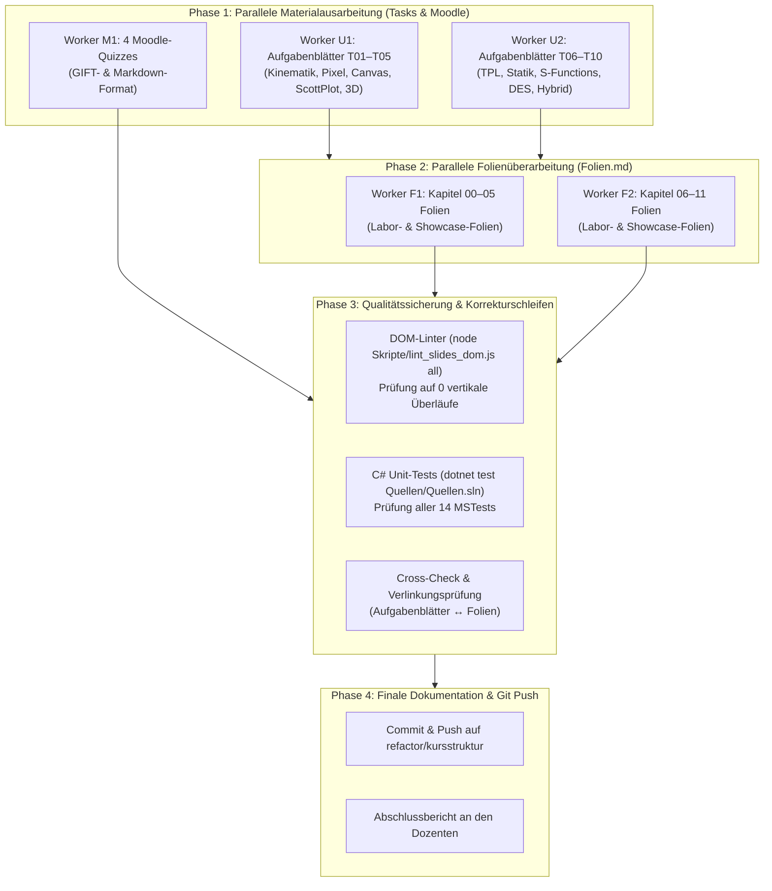

# Ausführungsplan: Materialausarbeitung, Folienüberarbeitung & Qualitätssicherung

## 1. Zielsetzung & Umfang
Vollständige Überführung des didaktischen Gesamtkonzepts (`Konzept/`) in das Vorlesungsmaterial:
1. **10 praxisnahe Aufgabenblätter** im Markdown-Format unter `Uebungen/Termin_01_.../` bis `Uebungen/Termin_10_.../`.
2. **Einbettung von Labor- und Showcase-Folien** in alle 12 Vorlesungskapitel (`Folien/00` bis `Folien/11`) ohne vertikale Überläufe.
3. **4 Moodle-Quizzes** im GIFT- und Markdown-Format unter `Moodle/Quiz_01_...` bis `Quiz_04_...`.
4. **Vollständige Qualitätssicherung** (DOM-Linter, SVG-Auditor, C#-Unit-Tests) mit Git-Synchronisation.

---

## 2. Ablaufstruktur & Phasenplan

---

## 3. Konkrete Rollen & Arbeitspakete

### Arbeitspaket 1: Aufgabenblätter (10 Termine)
- **Worker U1 (T01–T05):**
  - `Uebungen/Termin_01_Kinematik_und_Euler/Aufgabenblatt.md`
  - `Uebungen/Termin_02_Pixelgrafik_und_FDM/Aufgabenblatt.md`
  - `Uebungen/Termin_03_Vektorgrafik_Canvas/Aufgabenblatt.md`
  - `Uebungen/Termin_04_Telemetrie_und_ScottPlot/Aufgabenblatt.md`
  - `Uebungen/Termin_05_3D_OpenGL_Szenengraph/Aufgabenblatt.md`
- **Worker U2 (T06–T10):**
  - `Uebungen/Termin_06_Multithreading_und_TPL/Aufgabenblatt.md`
  - `Uebungen/Termin_07_Statik_FEM_Cholesky/Aufgabenblatt.md`
  - `Uebungen/Termin_08_DGL_und_SFunctions/Aufgabenblatt.md`
  - `Uebungen/Termin_09_Diskrete_Systeme_DES/Aufgabenblatt.md`
  - `Uebungen/Termin_10_Hybride_Dynamik_Synthese/Aufgabenblatt.md`

Jedes Aufgabenblatt enthält standardmäßig:
1. *Metadaten & Terminstruktur* (Termin, Thema, ECTS-Workload, Zeitbudget)
2. *Lernziele (ILOs)*
3. *Stufe A: In-Class Sprint (60 min)* (Gemeinsamer Kern, lauffähiges MVP)
4. *Stufe B: Pick your Track* (Track A Industrie ODER Track B Game – freie Wahl!)
5. *Akzeptanzkriterien & Definition of Done*
6. *Recherche-Box* (Doku-Links, gezielte englische Suchbegriffe)
7. *Vibe-Coding Prompt-Vorlagen*
8. *🔍 Peer-Review-Leitfragen für das Auditorium*

### Arbeitspaket 2: Moodle-Quizzes im GIFT-Format
- **Worker M1:**
  - `Moodle/Quiz_01_Termin_03/` (Pixel, Stride, FDM, CFL-Bedingung)
  - `Moodle/Quiz_02_Termin_05/` (Canvas, ScottPlot 5, 3D-Szenengraph-Matrizen)
  - `Moodle/Quiz_03_Termin_08/` (Amdahl, Cholesky, RK4, Anti-Windup)
  - `Moodle/Quiz_04_Termin_10/` (DES, Little's Gesetz, Zero-Crossing, Zeno)
  Jedes Quiz enthält Markdown zur Einsicht und `.gift.txt` für den 1-Klick-Import in Moodle.

### Arbeitspaket 3: MARP-Folienüberarbeitung
- **Worker F1 (Kapitel 00–05) & Worker F2 (Kapitel 06–11):**
  - Einfügen der 2-spaltigen Übungs-Abschlussfolie (Track A vs. Track B, Verweis auf `Aufgabenblatt.md`).
  - Einfügen der Showcase- & Peer-Questioning-Folie zu Beginn jedes Folgetermins.
  - Gewährleistung einheitlicher MARP-Formatierung (`fhooe`-Theme, keine Überläufe).

### Arbeitspaket 4: Qualitätsprüfung & Korrekturschleifen
- Headless DOM-Linter (`node Skripte/lint_slides_dom.js all`): Strikte Prüfung auf 0 Überläufe.
- SVG & Diagramm Auditor (`node Skripte/audit_svg_and_charts.js`).
- C#-Unit-Tests (`dotnet test Quellen/Quellen.sln -c Release`).
- Git Commit & Push auf `refactor/kursstruktur`.
