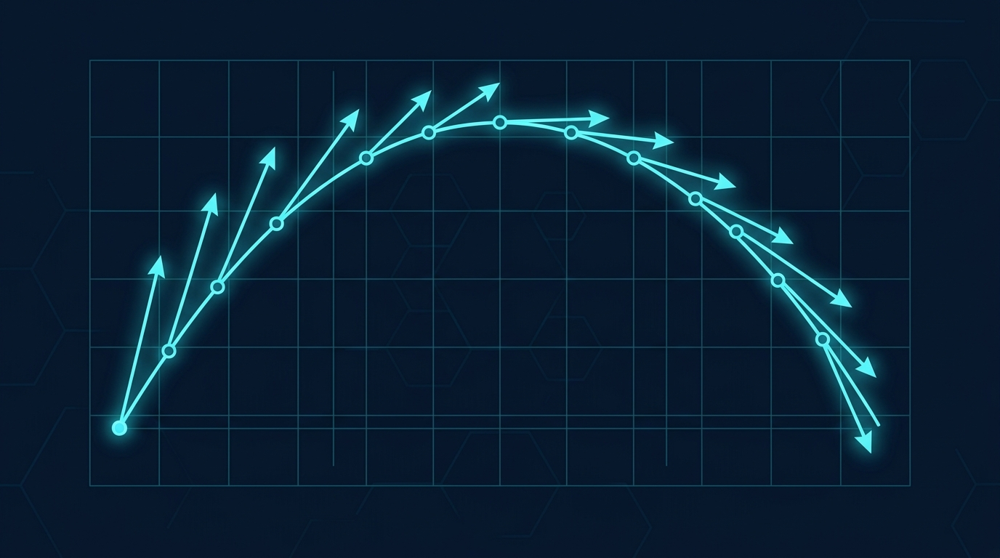
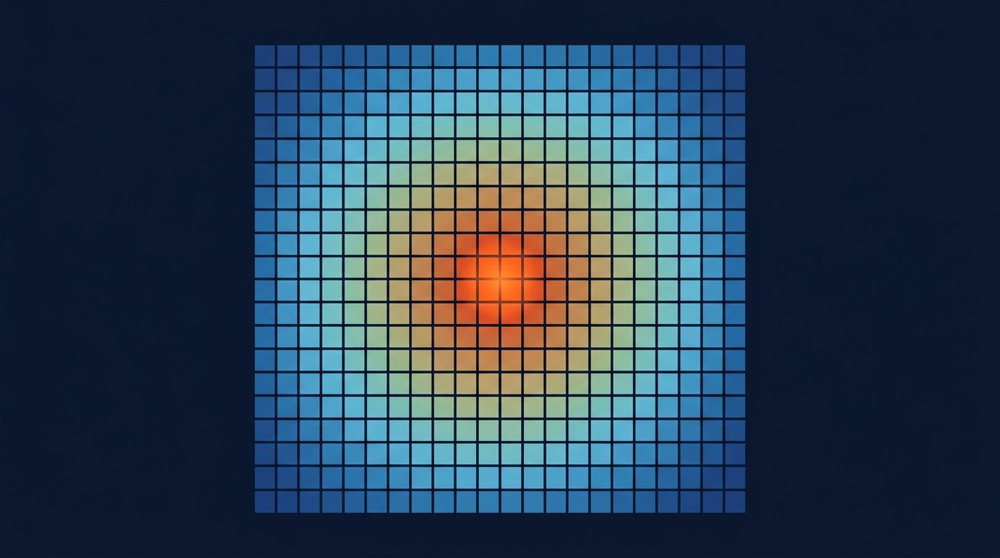
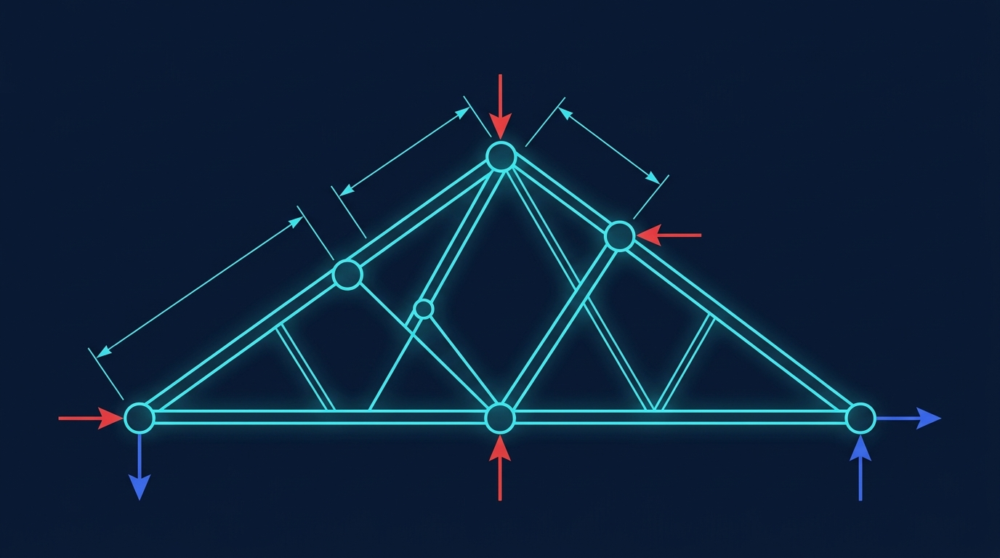
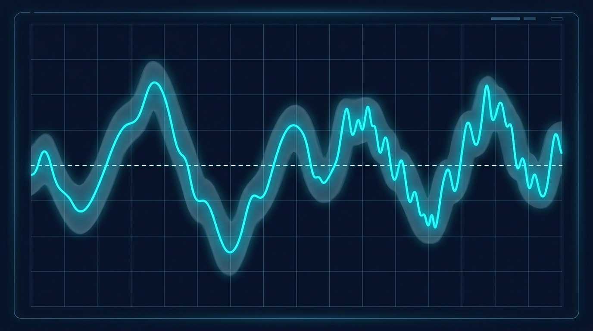
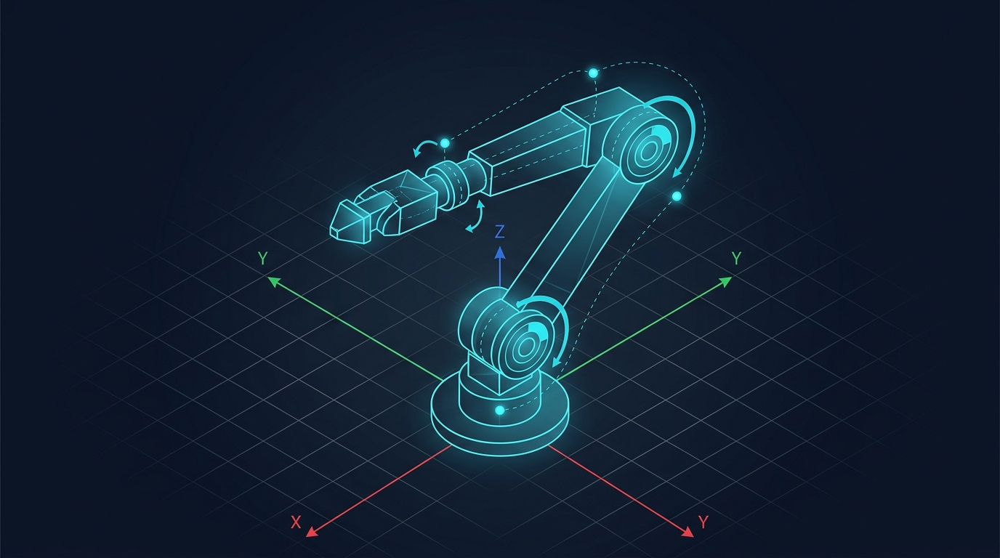
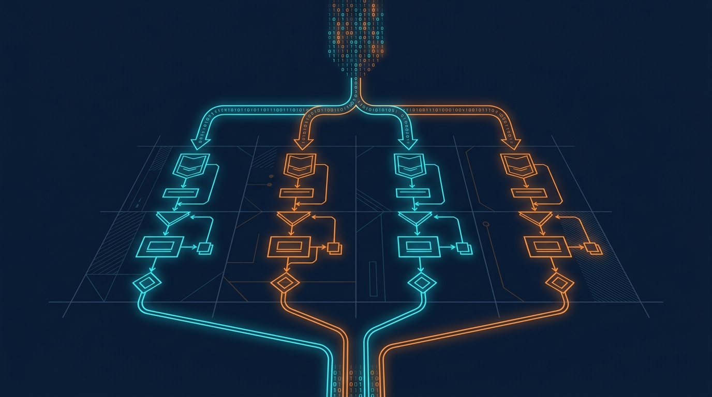
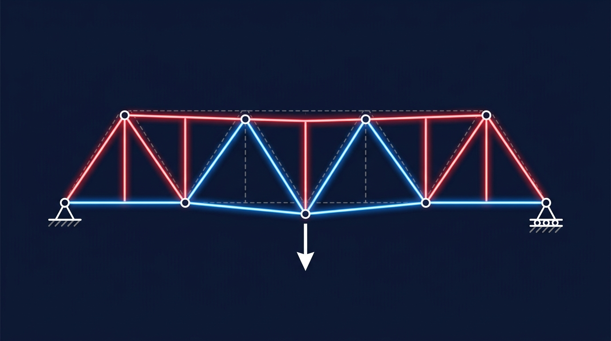
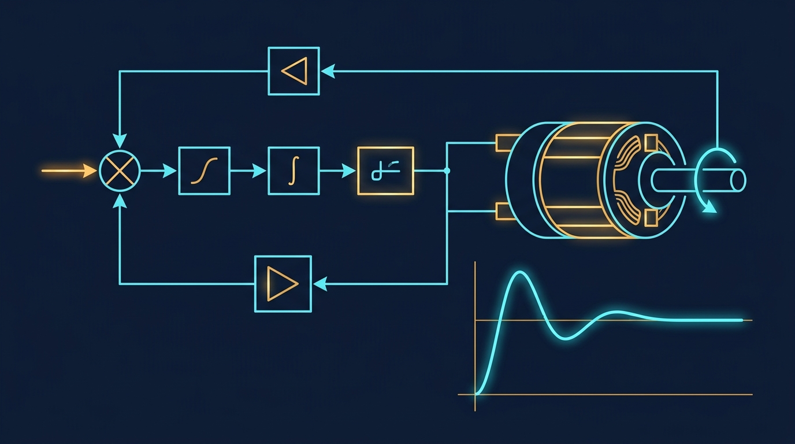
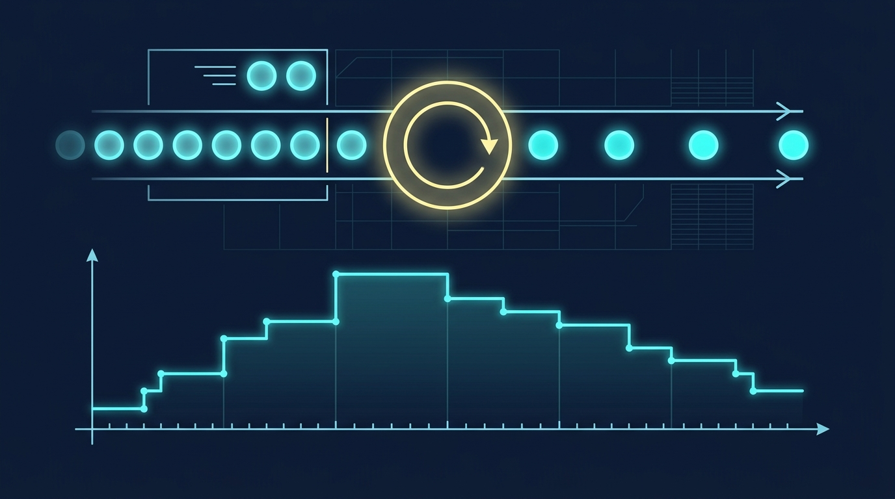
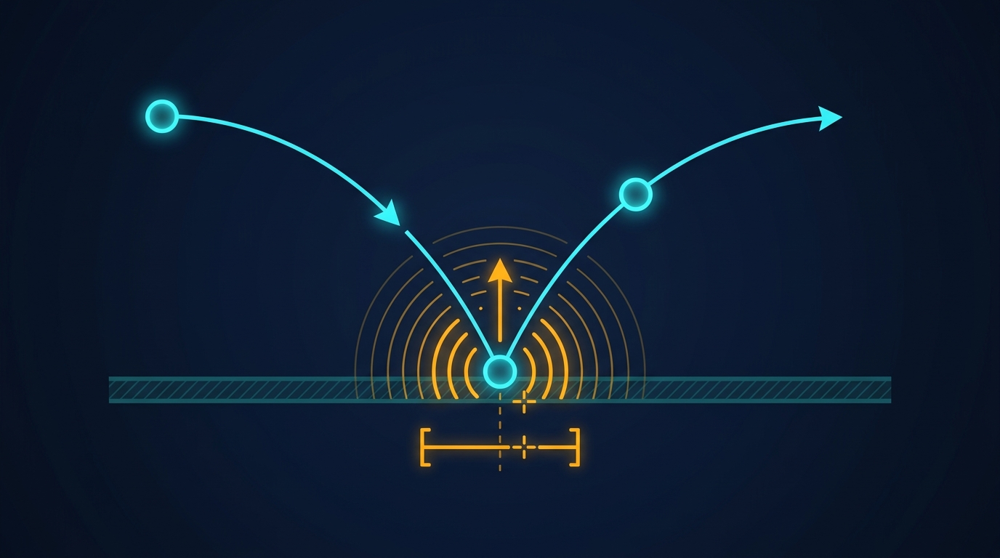

# Moodle-Kursstruktur & Textbausteine für alle Termine

**Lehrveranstaltung:** Systemsimulation / Digitaler Zwilling  
**Studiengang:** Bachelor Automatisierungstechnik (Campus Wels, FH Oberösterreich)  
**Dozent:** Dr. Georg Hackenberg, Professor für Informatik und Industriesysteme  
**Verwendung:** Diese Textabsätze sind formelfrei formatiert und können direkt als Abschnittsbeschreibungen in die Moodle-Themenblöcke kopiert werden.

---

### Allgemeiner Kurs-Kopfbereich (Willkommen & Organisation)

*(Hinweis für Kurs-Einstellungen: Das Kachel-Vorschaubild für das Moodle-Dashboard liegt unter `./Bilder/Kurs_Vorschau_Dashboard.jpg`)*

**Herzlich willkommen zu Systemsimulation / Digitaler Zwilling!**

In dieser Lehrveranstaltung erlernen Sie das mechatronische Modellieren, numerische Simulieren und performante Visualisieren dynamischer und statischer Systeme mit **C# und .NET 8**. Wir schlagen den Bogen vom mathematischen Differentialgleichungssystem bis zum interaktiven Digitalen Zwilling.

**Leistungsbeurteilung (2-Säulen-Modell: 40 % Theorie / 60 % Praxis & Diskurs):**
* **Säule 1 (40 %):** 4 kurze Moodle-Quizzes zu je 10 % (in Termin 03, 05, 08 und 10) zur Überprüfung des theoretisch-numerischen Grundlagenwissens.
* **Säule 2 (60 %):** Kontinuierlicher Übungsbetrieb im 2er-Team mit **30 % C#-Code-Portfolio** (10 wöchentliche Übungsabgaben), **15 % Showcase-Präsentationen** (Live-Vorführung am Beamer im Rotationsverfahren) und **15 % Peer-Review & Plenumsfragen** (kritischer fachlicher Diskurs).

**Wöchentlicher Ablauf ab Termin 02:**
* Zu Beginn jeder Einheit stellen zwei ausgewählte Teams (je 1x Track A und 1x Track B) ihre Lösungen der Vorwoche live am Beamer vor. Das Plenum stellt dazu fachliche Fragen.
* An vier Terminen (T03, T05, T08, T10) findet vor der Vorlesung zusätzlich ein kurzes 15-minütiges Moodle-Quiz statt.
* Im Anschluss folgt der interaktive Theorie-Impuls (mathematische Modellierung, numerische Lösungsverfahren und Architektur-Walkthrough), gefolgt von der praktischen Laborphase (In-Class Sprint).

**Wahlmodell (Pick your Track):**
Pro Termin wählt Ihr 2er-Team verbindlich **GENAU EINEN** Track – keine Doppelbelastung!
* 🏭 **Track A (Industrieller Zwilling):** Mechatronische Anlagen, reale Antriebe, Fördertechnik und Prüfstände.
* 🎮 **Track B (Simulationsspiel):** Echtzeitfähige Game- und Arcade-Physik auf Basis exakter physikalischer Modelle.

*Hinweis zum Vibe Coding:* Der reflektierte Einsatz von KI-Tools (GitHub Copilot, Claude, ChatGPT) ist ausdrücklich erlaubt! Bewertet wird nicht das generative Erzeugen von Code, sondern das physikalische Verständnis, die numerische Stabilität, die Recherchekompetenz und die mündliche Auskunftsfähigkeit („Warum genau diese Zeile?“).

---

### Termin 01: Modellbegriff, Kinematik & Expliziter Euler
*(Vorlesungskapitel: 00 Prolog & 01 Einführung)*

Zum Auftakt klären wir die Taxonomie technischer Modelle, das Konzept des Digitalen Zwillings nach Michael Grieves sowie die Grundlagen der numerischen Zeitdiskretisierung. Wir überführen kontinuierliche Bewegungsgleichungen zweiter Ordnung unter Erdbeschleunigung in Zustandsraumdarstellungen erster Ordnung und implementieren den expliziten Euler-Integrator in C#.

**Übungsaufgaben für diesen Termin:**
* **Stufe A (In-Class Sprint):** C#-Konsolenmodell für den freien Fall und schiefen Wurf im Vakuum sowie analytischer Abgleich mit der geschlossenen Freifall-Lösung.
* 🏭 **Stufe B – Track A (Industrie):** *Hydraulikzylinder-Dämpfung* – Modellierung nichtlinearer Blendenreibung, Parameterstudie und Vergleich mit dem Heun-Verfahren (Runge-Kutta 2. Ordnung).
* 🎮 **Stufe B – Track B (Game):** *„Artillery Strike / Retro Tanks“* – 2D-Ballistik mit quadratischem Luftwiderstand, dynamischen Windböen und exakter Bodenkollisions-Interpolation.
* *(Hinweis: Wählen Sie für Stufe B genau einen Track – Track A ODER Track B!)*

---

### Termin 02: 2D-Pixelgrafik, Direct Memory & FDM-Feldsimulation
*(Vorlesungskapitel: 02 Visualisierung 2D Pixel)*

Heute steigen wir in die High-Performance-Pixelgrafik unter WPF ein. Wir analysieren die Performance-Grenzen herkömmlicher UI-Controls bei Feldsimulationen und nutzen Direct-Memory-Zugriffe auf den Bildspeicher einer WriteableBitmap (Stride-Berechnung, Zeigerarithmetik, allokationsfreier Pointer-Swap). Darauf aufbauend diskretisieren wir die 2D-Wärmeleitungsgleichung mittels Finite-Differenzen-Methode (FDM 5-Punkt-Stern) und beweisen die fundamentale CFL-Stabilitätsgrenze (Stabilitätsfaktor s kleiner oder gleich 0,25).

**Ablauf & Übungsaufgaben:**
* 🎤 **Showcase T01:** Zwei ausgewählte Teams (1x Track A, 1x Track B) führen ihre Ballistiklösungen der Vorwoche live am Beamer vor. Das Plenum stellt Fragen zur Modellierung und Stabilität.
* **Stufe A (In-Class Sprint):** Interaktive WPF-Heatmap mit Direct-Pointer-Transfer und stabiler 2D-Diffusionsschleife.
* 🏭 **Stufe B – Track A (Industrie):** *CPU-Kühlkörper-Optimierung* – Mehrzonengitter aus Silizium und Kupfer mit Konvektionsrand und Hotspot-Thermometrie.
* 🎮 **Stufe B – Track B (Game):** *„Falling Sand & Doom Fire / Lava“* – Interaktive zelluläre Pixel-Physik mit aufsteigender Glut und Maus-Zeichenfunktion.

---

### Termin 03: 2D-Vektorgrafik, Koordinatentransformation & Canvas
*(Vorlesungskapitel: 03 Visualisierung 2D Vektor)*

In dieser Einheit widmen wir uns der mechatronischen 2D-Vektorgrafik auf dem WPF Canvas. Wir leiten die exakte affine Koordinatentransformation zwischen metrischen Weltkoordinaten in Metern und pixelbasierten Bildschirmkoordinaten her (isotrope Skalierung, Inversion der Y-Achse, Randabstand). Zudem zeichnen wir analytisch rotierte Kraftpfeile und normgerechte DIN-Bemaßungsketten. *(Kausalitätshinweis: In dieser Einheit geht es rein um die geometrische und visuelle Darstellung – die FEM-Statikberechnung folgt in Termin 07!)*

**Ablauf & Übungsaufgaben:**
* 🎤 **Showcase T02:** Zwei ausgewählte Teams präsentieren ihre FDM-Wärmeleitungs- und Pixelsimulationen am Beamer.
* 📝 **Moodle-Quiz 1 (15 min):** Erstes summatives Quiz zu den Grundlagen, Pixelgrafik und der CFL-Stabilitätsgrenze (Kapitel 00 bis 02).
* **Stufe A (In-Class Sprint):** Reversible Koordinatentransformation Transform2D und Zeichnen eines Fachwerkträgers mit skalierten Kraftpfeilen.
* 🏭 **Stufe B – Track A (Industrie):** *2D-CAD-Fachwerkträger-Viewer* – Bemaßungsketten nach DIN 406, Knotenverschiebung per Drag-and-Drop und automatische Zentrierung.
* 🎮 **Stufe B – Track B (Game):** *„2D Space Radar & Vector Navigation“* – Vektor-Radar mit Geschwindigkeits- und Schubpfeilen, Polygon-Hindernissen und stufenlosem Zoom.

---

### Termin 04: Echtzeit-Telemetrie, Diagramme & ScottPlot 5
*(Vorlesungskapitel: 04 Visualisierung 2D Diagramme)*

Simulationen erfordern den kontinuierlichen Einblick in Zustandsverläufe. In dieser Einheit integrieren wir die moderne Bibliothek ScottPlot 5 in WPF. Wir lernen allokationsfreie Ringpuffer kennen, um den Garbage Collector bei 50 bis 100 Hz Streaming-Frequenz zu entlasten, und implementieren den numerisch stabilen Online-Algorithmus nach Welford zur Berechnung von laufendem Mittelwert, Varianz und dynamischen 3-Sigma-Toleranzbändern ohne Auslöschungsfehler.

**Ablauf & Übungsaufgaben:**
* 🎤 **Showcase T03:** Zwei ausgewählte Teams präsentieren ihre Canvas-Vektorgrafiken und Fachwerkträger-Viewer am Beamer.
* **Stufe A (In-Class Sprint):** Ruckelfreies ScottPlot 5 Dashboard mit Datenstreaming und Welford-Statistik.
* 🏭 **Stufe B – Track A (Industrie):** *1-kHz-Vibrationsmonitoring & Leitstand* – Spektrale Grenzwertüberwachung, historische Trends und Anomalie-Erkennung.
* 🎮 **Stufe B – Track B (Game):** *„Retro Arcade Racing Telemetry“* – Live-G-Kräfte, Geschwindigkeits-Streaming und Streckenprofil-Graph via MSAGL.

---

### Termin 05: 3D-Computergrafik, Szenengraph & OpenGL
*(Vorlesungskapitel: 05 Visualisierung 3D OpenGL)*

Wir erweitern unseren Visualisierungsraum in die dritte Dimension! Mittels SharpGL binden wir hardwarebeschleunigtes OpenGL in WPF ein. Wir entwickeln eine intuitive Kugelkoordinaten-Orbitkamera mit mathematischem Schutz vor Gimbal Lock und bauen einen hierarchischen Szenengraphen auf Basis homogener 4x4-Transformationsmatrizen auf, um serielle Mehrkörpersysteme und Roboterarme mit korrekter Vorwärtskinematik und Phong-Beleuchtung darzustellen.

**Ablauf & Übungsaufgaben:**
* 🎤 **Showcase T04:** Zwei ausgewählte Teams präsentieren ihre Telemetrie-Dashboards und ScottPlot-Visualisierungen am Beamer.
* 📝 **Moodle-Quiz 2 (15 min):** Zweites summatives Quiz zu Vektorgrafik, Telemetrie, ScottPlot 5 und 3D-Matrizentransformationen (Kapitel 03 bis 05).
* **Stufe A (In-Class Sprint):** Einrichten des OpenGLControl, Kugelkoordinaten-Kamera und Aufbau eines hierarchischen 2-Segment-Armes.
* 🏭 **Stufe B – Track A (Industrie):** *4-Achs-SCARA-Roboterarm* – Analytische Vorwärtskinematik, TCP-Positionskontrolle und interaktive Gelenkslider.
* 🎮 **Stufe B – Track B (Game):** *„3D Arcade Claw Crane“* – Jahrmarkt-Greifarm mit Tastatursteuerung, Ausleger-Kinematik und Kisten-Aufnahme.

---

### Termin 06: Multithreading & Parallele Simulation
*(Vorlesungskapitel: 06 Multithreading)*

Komplexe mechatronische Simulationen erfordern massive Rechenleistung. In dieser Einheit nutzen wir Multithreading und die Task Parallel Library (TPL Parallel.For) in C#. Wir lernen, wie man Schleifen thread-sicher partitioniert, Race Conditions und False Sharing auf Cache-Line-Ebene vermeidet und Benchmarks mit Stopwatch methodisch sauber durchführt. Anhand des Amdahlschen Gesetzes untersuchen wir die theoretischen und realen Skalierungsgrenzen paralleler Algorithmen auf modernen Mehrkernprozessoren.

**Ablauf & Übungsaufgaben:**
* 🎤 **Showcase T05:** Zwei ausgewählte Teams präsentieren ihre 3D-Roboter und Greifarme am Beamer.
* **Stufe A (In-Class Sprint):** Paralleler Partikelfeld-Schritt mit Parallel.For, Messung der Rechenzeit und Nachweis der Ergebnisidentität zur seriellen Schleife.
* 🏭 **Stufe B – Track A (Industrie):** *Parallele Monte-Carlo-Toleranzanalyse* – Statistische Maßkettenrechnung für Bauteilpassungen mit automatischem Amdahl-Fit.
* 🎮 **Stufe B – Track B (Game):** *„100.000 Boids / Zombie-Horde“* – Hochparalleler Schwarm-Benchmark mit Flocking-Verhalten und Kernskalierungs-Analyse.

---

### Termin 07: Statische Systeme, FEM-Fachwerke & Cholesky-Löser
*(Vorlesungskapitel: 07 Statische Modelle)*

Heute erwecken wir die Vektor-Fachwerke aus Termin 03 statisch zum Leben! Wir leiten die finite Elementformulierung für elastische 2D-Fachwerkstäbe her: Aufstellen der Elementsteifigkeitsmatrix, Assemblierung der Gesamtsteifigkeitsmatrix und Blockpartitionierung nach freien und gelagerten Freiheitsgraden. Zur hocheffizienten Lösung des symmetrisch positiv definiten Gleichungssystems binden wir die Cholesky-Zerlegung via Math.NET Numerics ein und visualisieren Verformungen und Stabkräfte mit Farbcodes im Canvas.

**Ablauf & Übungsaufgaben:**
* 🎤 **Showcase T06:** Zwei ausgewählte Teams präsentieren ihre Multithreading-Benchmarks und Speedup-Messungen am Beamer.
* **Stufe A (In-Class Sprint):** Aufstellen der Elementmatrix und Cholesky-Lösung für einen 3-Knoten-Kragträger mit Vergleich gegen geschlossene Handrechnung.
* 🏭 **Stufe B – Track A (Industrie):** *Portalkran-Verformung unter Wanderlast* – Verschiebung mit Überhöhung, Nachweis des globalen Kräftegleichgewichts und Spannungs-Farbcodierung.
* 🎮 **Stufe B – Track B (Game):** *„Bridge Constructor Physics Engine“* – Kontinuierliche Cholesky-Berechnung bei LKW-Überfahrt mit Stabbruch bei Grenzlast und animiertem Einsturz.

---

### Termin 08: Kontinuierliche Dynamik, S-Functions & RK4
*(Vorlesungskapitel: 08 Dynamische Modelle Kontinuierlich)*

Wir betrachten die kontinuierliche Dynamik im Zeitbereich. Wir adaptieren das industrielle MATLAB Simulink S-Function-Paradigma in C# (saubere Entkopplung von Ableitungsberechnung ComputeDerivatives und Ausgabe ComputeOutputs) und implementieren den 4-stufigen Runge-Kutta-Integrator (RK4). Am elektromechanischen Ersatzschaltbild eines DC-Servomotors koppeln wir Differentialgleichungen für Ankerstrom und Drehbewegung und rüsten den PID-Lageregler mit einem Anti-Windup Clamping gegen Aktorsättigung aus.

**Ablauf & Übungsaufgaben:**
* 🎤 **Showcase T07:** Zwei ausgewählte Teams präsentieren ihre FEM-Fachwerklöser und Cholesky-Berechnungen am Beamer.
* 📝 **Moodle-Quiz 3 (15 min):** Drittes summatives Quiz zu Multithreading, statischen Fachwerken/Cholesky und kontinuierlichen DGL-Integratoren (Kapitel 06 bis 08).
* **Stufe A (In-Class Sprint):** Aufbau des S-Function-Kerns mit RK4-Solver und Nachweis der Energieerhaltung am ungedämpften Federpendel.
* 🏭 **Stufe B – Track A (Industrie):** *DC-Servomotor-Regelung* – Störlastsprung, Aktorsättigung und Nachweis der Überschwingungsreduktion durch Anti-Windup Clamping.
* 🎮 **Stufe B – Track B (Game):** *„SpaceX Falcon Hop / Booster Landing“* – Raketen-Vertikallandung mit Schubvektorregelung, variabler Treibstoffmasse und RK4.

---

### Termin 09: Diskrete Systeme & Diskrete Ereignissimulation (DES)
*(Vorlesungskapitel: 09 Dynamische Modelle Diskret)*

Nicht alle Systeme ändern sich kontinuierlich – viele industrielle Prozesse werden durch diskrete Ereignisse gesteuert. In dieser Einheit implementieren wir eine Diskrete Ereignissimulation mit einer Future Event List auf Basis der generischen .NET PriorityQueue. Wir nutzen die stochastische Inversionsmethode zur Erzeugung exponentiell verteilter Zwischenankunfts- und Bedienzeiten und verifizieren Littles Gesetz (mittlere Kundenanzahl gleich Ankunftsrate mal Verweilzeit) empirisch an M/M/1- und M/M/c-Warteschlangensystemen.

**Ablauf & Übungsaufgaben:**
* 🎤 **Showcase T08:** Zwei ausgewählte Teams präsentieren ihre S-Function-Modelle und Regelkreise mit Anti-Windup am Beamer.
* **Stufe A (In-Class Sprint):** Event-Queue-Schleife mit zeitgewichteter Schlängelänge und Durchlaufzeit.
* 🏭 **Stufe B – Track A (Industrie):** *Automobil-Lackierstraße* – Mehrkanal-Wartesystem mit Puffergrößenoptimierung und Abgleich gegen Littles Gesetz.
* 🎮 **Stufe B – Track B (Game):** *„Theme Park Rush / Rollercoaster Queue“* – Freizeitpark-Warteschlangen mit Fastpass-Prioritäten und Monte-Carlo-Simulation.

---

### Termin 10: Hybride Dynamik, Zero-Crossing & Portfolio-Abschluss
*(Vorlesungskapitel: 10 Dynamische Modelle Hybrid & 11 Epilog)*

In unserem großen Finale verschmelzen kontinuierliche Dynamik und diskrete Ereignisse zu hybriden Systemen! Wir implementieren eine präzise Zero-Crossing-Detektion mit Bisektions-Einkreisung auf Mikrometer-Genauigkeit, um unelastische Stöße ohne Geisterdurchdringung („Tunneling“) zu berechnen. Mittels Sticking-Threshold beherrschen wir den Zeno-Kollaps und schlagen den Bogen zur Virtuellen Inbetriebnahme (VIBN), FMI-Co-Simulation und zum Digitalen Zwilling.

**Ablauf & Aufgaben:**
* 🎤 **Showcase T09:** Zwei ausgewählte Teams präsentieren ihre diskreten Ereignissimulationen und Warteschlangensysteme am Beamer.
* 📝 **Moodle-Quiz 4 (20 min):** Viertes summatives Quiz zu DES, Littles Gesetz, Zero-Crossing, Zeno-Vermeidung und VIBN (Kapitel 09 bis 11).
* **Stufe A (In-Class Sprint):** Bisektions-Nullstellensuche für Kontaktstöße mit Heun-Substepping.
* 🏭 **Stufe B – Track A (Industrie):** *Virtuelle Inbetriebnahme (VIBN)* – Pneumatikzylinder mit digitalen Endschaltern, SPS-Kopplung und Taktzeitmessung.
* 🎮 **Stufe B – Track B (Game):** *„Arcade Pinball Wizard“* – Flipperautomat mit Bumper-Bisektion, Schwerkraft-Ruhelage und Punktezähler.
* 📦 **Portfolio-Abschluss:** Die finale Abgabe von Termin 10 erfolgt genau eine Woche nach dem letzten Präsenztermin über Ihr Team-Git-Repository, wo alle 10 Übungsmodule das bewertete C#-Simulations-Portfolio bilden. Herzlichen Glückwunsch zum erfolgreichen Semesterabschluss!
