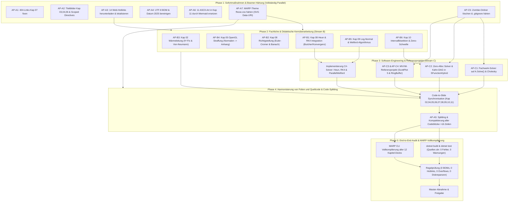

# Operativer Master-Ausführungsplan
## Gesamtrevision der Vorlesungsreihe „Systemsimulation / Digitaler Zwilling“ (Kapitel 00–11)

**Dokument-ID:** `Planung/00_Master_Ausfuehrungsplan.md`  
**Koordinator / Chefarchitekt:** Lead AI Systems Engineer & Didaktik-Koordinator  
**Bezugsdokumente:**  
- `Planung/01_Plan_Layout_und_Medien.md` (Stream A: Layout, Medien & MARP-Härtung)  
- `Planung/02_Plan_Didaktik_und_Numerik.md` (Stream B: Didaktische Schärfung & Numerik)  
- `Planung/03_Plan_Softwarearchitektur_und_Code.md` (Stream C: Software-Engineering & Architektur)  
- `Reviews/00_Gesamtlagebild_und_Roadmap.md` (Strategisches Gesamtlagebild)  
**Zielgruppe:** Entwicklungs- und Implementierungs-Subagenten, Dozierende, Modulverantwortliche  
**Status:** Genehmigter, operativer Masterplan (Zur sofortigen Ausführung freigegeben)  
**Datum:** 7. Oktober 2026  

---

## Inhaltsverzeichnis
1. [Executive Summary & Gesamtkonzeption](#1-executive-summary--gesamtkonzeption)
2. [Gesamtarchitektur & Abhängigkeitsgraph (DAG)](#2-gesamtarchitektur--abhängigkeitsgraph-dag)
   - 2.1 Struktureller Abhängigkeitsgraph
   - 2.2 Analyse der Parallelisierbarkeit vs. Sequenzialität
   - 2.3 Datenflüsse & Schnittstellenverträge
3. [Phasenplan mit exakter Taktung](#3-phasenplan-mit-exakter-taktung)
   - 3.1 Phase 1: Sofortmaßnahmen, Quick-Wins & Beamer-Härtung
   - 3.2 Phase 2: Fachliche & didaktische Kernüberarbeitung (Stream B)
   - 3.3 Phase 3: Software-Engineering & Referenzprojekte (Stream C)
   - 3.4 Phase 4: Harmonisierung von Folien und Quellcode & Code-Splitting
   - 3.5 Phase 5: End-to-End-Audit, Gesamttestlauf & MARP-Vollkompilierung
4. [Subagenten-Dispatch-Matrix](#4-subagenten-dispatch-matrix)
   - 4.1 Rollenprofile der Worker-Subagenten
   - 4.2 Dispatch-Tabelle mit Inputs, Outputs & DoD
5. [Risikomatrix & Fallback-Strategien](#5-risikomatrix--fallback-strategien)
   - 5.1 Bewertungsmatrix technischer & operativer Risiken
   - 5.2 Konkrete Fallback- und Eskalationspfade
6. [Qualitätskriterien & Freigabeprotokoll](#6-qualitätskriterien--freigabeprotokoll)

---

## 1. Executive Summary & Gesamtkonzeption

Die Vorlesungsreihe **„Systemsimulation / Digitaler Zwilling“** (509 Folien in 12 Kapiteln, C#-Simulationsprojekte in .NET 8) wird im Zuge dieses Master-Ausführungsplans einer ganzheitlichen, qualitätsgesicherten Gesamtrevision unterzogen. 

Die drei Fachpläne (Stream A für Medien/Layout, Stream B für Didaktik/Numerik und Stream C für Software-Engineering) decken hochgradig spezialisierte Problemfelder ab. Um Konsistenzbrüche, doppelte Bearbeitungszyklen und Regressionsfehler zu verhindern, synchronisiert dieser Masterplan sämtliche Arbeitspakete in einem **5-Phasen-Taktmodell**.

```
┌─────────────────────────────────────────────────────────────────────────────────┐
│                        MASTER-AUSFÜHRUNGS-STRATEGIE                             │
├─────────────────────────────────────────────────────────────────────────────────┤
│ Phase 1: Entkoppelte Quick-Wins (Offline-Assets, BOM, Theme, Zombie-Cleanup)     │
│ Phase 2: Didaktische & numerische Neuausrichtung (Folien-Entlastung & Mathematik)│
│ Phase 3: Code-Modernisierung (Solve(), Zero-Alloc, MVVM, TPL-Streaming)        │
│ Phase 4: Harmonisierung (Code-in-Slides Transfer & Beamer-Block-Splitting)      │
│ Phase 5: End-to-End-Audit & Gesamtrenderlauf aller 12 MARP-Foliensätze          │
└─────────────────────────────────────────────────────────────────────────────────┘
```

### Kernziele der Gesamtrevision:
1. **100% Ausfallsicherheit im Hörsaal:** Null externe Hotlinks (`0 Web-Links`), keine defekten relativen Bildpfade, portables SVG-Signet im FH-Theme, keine UTF-8-BOM-Header.
2. **Beamer-Optimierung:** Kein Quellcode-Block über 16 Zeilen, keine Zeilenbreite über 80 Zeichen, Beseitigung aller 11 ASCII-Kästen in Kapitel 11 durch gestochen scharfe Vektorgrafiken.
3. **Didaktische Meisterschaft:** Vollwertige Integration von Heun (RK2) und RK4 mit Butcher-Tableaux in Kapitel 08; Entlastung des 3D-OpenGL-Kapitels um 38% durch Normalen-Auslagerung in einen Anhang; strikte Kausalität ($t > 0$) in Kapitel 09 durch Log-Normal-Verteilung.
4. **Industrie-Softwarearchitektur:** Eliminierung des Inversions-Antipatterns (`A.Solve(b)` und Cholesky); Allokationsfreie $O(N)$ Solver-Schleife via Kahn-Topologie-Sortierung; vollwertiges MVVM-Referenzprojekt mit ScottPlot 5 und asynchronem 1-kHz-Ringpuffer.
5. **Garantierte Übereinstimmung:** Code auf den Vorlesungsfolien ist zu 100% identisch mit den real lauffähigen C#-Quelltexten.

---

## 2. Gesamtarchitektur & Abhängigkeitsgraph (DAG)

### 2.1 Struktureller Abhängigkeitsgraph

Der folgende gerichtete azyklische Graph (DAG) definiert die Ausführungsreihenfolge, Parallelitätskorridore und Barrieren zwischen den Teilaufgaben:



---

### 2.2 Analyse der Parallelisierbarkeit vs. Sequenzialität

#### Völlig parallelisierbare Aufgabenpakete (Keine wechselseitigen Blockaden):
1. **Innerhalb von Phase 1:**  
   Die Arbeitspakete AP-A1, AP-A2, AP-A3, AP-A4, AP-A6, AP-A7 und AP-C5 berühren unterschiedliche Dateien und können von separaten Worker-Subagenten absolut simultan abgearbeitet werden.
2. **Innerhalb von Phase 2:**  
   - AP-B3 (Kapitel 02: PDE-Korrektur)  
   - AP-B4 (Kapitel 05: Normalen-Auslagerung in Anhang)  
   - AP-B2 & AP-B1 (Kapitel 08: Kontinuierliche Solver & Richtigstellungen)  
   - AP-B5 (Kapitel 09: Stochastik & Welford)  
   - AP-B6 (Kapitel 10: Hybridsolver Bisektion)  
   Diese didaktischen Module sind fachlich orthogonal und können parallel auf ihren jeweiligen Kapiteln operieren.

#### Zwingend sequentielle Abhängigkeiten (Strikte Barrieren):
1. **AP-C5 vor weiteren Code-Änderungen:**  
   Das Löschen der 4 verwaisten Zombie-Ordner (`ElastischesFachwerk3D`, `IdealesFachwerk2D`, etc.) und die Härtung der `.gitignore` muss vor allen Code-Edits in Stream C erfolgen, um versehentliche Modifikationen veralteter Quelltexte zu verhindern.
2. **Stream B (Algorithmenentwurf) vor Stream C (C#-Implementierung):**  
   Die mathematische Spezifikation von Heun/RK4 (AP-B1) und der Chan-Welford-Formeln (AP-B5) dient als algorithmische Vorlage für die C#-Klassen in Stream C (`HeunSolver.cs`, `RungeKutta4Solver.cs`, `ParallelWelfordAccumulator.cs`).
3. **Code-Refactoring (Phase 3) vor Slide-Code-Splitting (Phase 4):**  
   **Kritischer Schnittstellenvertrag:** Es ist strikt verboten, Folienblöcke zu formatieren (AP-A5), bevor der zugrunde liegende Quellcode refaktoriert ist! Andernfalls müssten Folien doppelt editiert werden (zuerst für das Layout, danach für den geänderten C#-Code wie `Solve(b)` statt `Inverse()`).
4. **Phase 4 vor Phase 5 (Audit & Build):**  
   Der finale MARP-Kompilierungslauf und der automatisierte Lint-Test (Prüfung auf Blöcke >16 Zeilen und fehlerfreie SVG-Verlinkung) können erst stattfinden, wenn alle Folientexte harmonisiert und formatiert sind.

---

### 2.3 Datenflüsse & Schnittstellenverträge

| Produzent (Upstream) | Geliefertes Artefakt | Konsument (Downstream) | Schnittstellenvertrag & Validierung |
| :--- | :--- | :--- | :--- |
| **Worker Layout (A3)** | Lokale Grafiken in `Illustrationen/` | **Foliensätze Kap 04, 05, 09** | Alle 14 URLs durch lokale relative Pfade `./Illustrationen/...` ersetzt; Bild existiert auf Festplatte. |
| **Worker Layout (A6)** | `.mmd` & kompilierte `.svg` Vektoren | **Folien Kap 11** | 9 SVGs in `Folien/11_Epilog/Diagramme/` vorhanden; 0 unformatierte ASCII-Codeblöcke. |
| **Worker Theme (A7)** | Gehärtetes `Themen/fhooe.css` | **Alle 12 Foliensätze** | SVG-Signet via Data-URI eingebettet; kein Pfadfehler; Title-Slide-Unterdrückung greift. |
| **Worker Numerik (B1)** | RK4/Heun Butcher-Tableaux & Spezifikation | **Worker SE (C_B)** | Mathematische Stufenformeln dienen als Vorlage für `HeunSolver.cs` & `RungeKutta4Solver.cs`. |
| **Worker SE (C1)** | Refaktorisierter `Truss.cs` Code | **Folien Kap 07 (Phase 4)** | `A.Solve(b)` und `kBB.Cholesky().Solve(rhs)` werden exakt so auf Folie 54ff. abgebildet. |
| **Worker SE (C2)** | Zero-Alloc `Solver.cs` & Kahn-Klasse | **Folien Kap 10 (Phase 4)** | Die statische topologische Sortierung ersetzt den dynamischen `RemoveAt`-Code auf den Folien. |
| **Worker SE (C3/C4)**| Referenzprojekt `SimulationMvvmPattern` | **Folien Kap 04, 06, 11 (Phase 4)** | `SimulationRingBuffer.cs` und ViewModel-Snippets stimmen 1:1 mit dem Projektcode überein. |

---

## 3. Phasenplan mit exakter Taktung

### 3.1 Phase 1: Sofortmaßnahmen, Quick-Wins & Beamer-Härtung
*Dauer / Takt: Sofortstart, vollständig parallelisierbar.*

- **Task 1.1 (AP-A1): Defekte Bildpfade in Kapitel 07 reparieren**
  - Ersetze relative Pfade `../03_Statische_Modelle_3D/Diagramme/` auf Folien 20, 21, 22 durch `./Diagramme/`.
  - Ziel: 0 gebrochene Bildlinks.
- **Task 1.2 (AP-A2): Titelbilder & Deckblatt-Standardisierung**
  - Binde `` in Kapitel 03, 04 und 06 ein; synchronisiere `Notizen.md`.
  - Füge auf Folie 1 **aller 12 Kapitel** die Scoped Directives `<!-- _paginate: false -->`, `<!-- _header: "" -->`, `<!-- _footer: "" -->` ein.
- **Task 1.3 (AP-A3): Download & Lokalisierung aller 14 externen Web-Hotlinks**
  - Download via PowerShell in `Illustrationen/` der Kapitel 04, 05, 09.
  - Ersetze Phong-PNG in Kapitel 05 durch lokale Vektorgrafik `./Diagramme/Phong - Gesamt.svg`.
  - Markdown-Pfade anpassen; Web-Links restlos entfernen.
- **Task 1.4 (AP-A4): Bereinigung der UTF-8 BOMs & Datumsstempel 2025**
  - Entferne `0xEF 0xBB 0xBF` aus `Folien/07`, `Folien/08` und `Folien/10`.
  - Entferne `(2025-12-05)` aus den Headern von Kapitel 00 und Kapitel 01.
- **Task 1.5 (AP-A6): Vektorisierung der 11 ASCII-Kästen in Kapitel 11**
  - Erstelle 9 `.mmd`-Dateien in `Folien/11_Epilog/Diagramme/` und kompiliere via `mmdc` zu `.svg`.
  - Formatiere Formel auf Folie 27 in MathJax-LaTeX; binde alle SVGs ein.
- **Task 1.6 (AP-A7): Härtung des MARP-Themes (`Themen/fhooe.css`)**
  - Ersetze relative SVG-URL durch Data-URI des FH-Signets; füge `:not(.title):not(.lead)::before` ein.
  - Ergänze Standard-Styles für `.columns` (`align-items: flex-start;`) und Code-Blocks (`max-height: 500px; font-size: 0.72em;`).
  - Füge fehlende Folienüberschrift auf Folie 31 in Kapitel 10 ein.
- **Task 1.7 (AP-C5.1 & AP-C5.2): Repository-Hygiene & .gitignore**
  - Lösche verwaiste Ordner `ElastischesFachwerk3D`, `IdealesFachwerk2D`, `IdealesFachwerk3D` und `KugelÜbung`.
  - Härte `.gitignore` gegen `bin/`, `obj/`, `.vs/`.

---

### 3.2 Phase 2: Fachliche & didaktische Kernüberarbeitung (Stream B)
*Dauer / Takt: Nach Phase 1, modular parallelisierbar nach Kapiteln.*

- **Task 2.1 (AP-B3): Formel- & Stabilitätskorrektur in Kapitel 02**
  - Folie 455 & 458: Beseitige doppelten Faktor $\frac{\alpha}{h^2} \Delta T_{i,j}$; synchronisiere mit C#-Vorfaktorisierung `DiffCoeff * laplace`.
  - Folie 479: Umbenennung von „CFL-Bedingung“ in „Von-Neumann-Stabilitätskriterium“ inklusive didaktischer Differenzierungs-Box für Ingenieure.
- **Task 2.2 (AP-B4): Didaktische Straffung von Kapitel 05 (3D-OpenGL)**
  - Lagere die ca. 30 Folien manuelle Normalenableitung (Kugel/Zylinder/Kegel) in `Folien_Anhang_3D_Normalen.md` aus.
  - Führe im Hauptfoliensatz `GeometryFactory` / fertige Mesh-Generatoren ein.
  - Fokussiere auf Szenengraph-Kinematik mechatronischer Roboterarme (SCARA / Knickarm).
- **Task 2.3 (AP-B2): Begriffliche Richtigstellungen in Kapitel 08**
  - Folie 421–471: Ballwurf als *semi-impliziten Euler (Euler-Cromer / symplektisch)* kennzeichnen; Energieerhaltungs- und Phasentreue-Erklärung ergänzen.
  - Folie 1173, 1271, 1326: „Newton-Verfahren“ durch *„Banachsche Fixpunktiteration (Picard-Iteration mit Dämpfung)“* ersetzen und abgrenzen.
- **Task 2.4 (AP-B1): Vollwertige Integration von Heun (RK2) und RK4 in Kapitel 08**
  - Ergänze neuen Abschnitt 8.6 (ca. 10 Folien): Mehrstufenverfahren-Motivation, Butcher-Tableaux für Heun und RK4, Simpson-Regel, Dahlquist-Stabilitätsgebiete (inkl. Stabilität auf der imaginären Achse).
  - Erstelle doppelt-logarithmische Konvergenzgrafik `Diagramme/Konvergenz_Ordnung.svg` ($\mathcal{O}(h^1)$ vs. $\mathcal{O}(h^2)$ vs. $\mathcal{O}(h^4)$) und binde sie ein.
- **Task 2.5 (AP-B5): Stochastische Kausalität & Welford-Algorithmus in Kapitel 09**
  - Folie 736–742: Ersetze Normalverteilung der Bedienzeiten durch strikt positive Log-Normal-Verteilung; Herleitung von $\mu$ und $\sigma$ aus Zielwert und Streuung.
  - Folie 1133–1142: Ersetze 2-Pass-Varianz durch Welford-Online-Algorithmus mit Chan-Merge für parallele Monte-Carlo-Simulationen.
- **Task 2.6 (AP-B6): Robuste Nulldurchgangsdetektion & Zeno-Behandlung in Kapitel 10**
  - Folie 913–935: Ersetze naive Schrittweitenhalbierung durch echte Vorzeichenwechsel-Intervallbisektion.
  - Folie 180–200: Mathematische Ableitung der Zeno-Konvergenz $t_\infty < \infty$ und Einführung der Kontaktschwellen-Haftbedingung (*Sticking Mode*).

---

### 3.3 Phase 3: Software-Engineering & Referenzprojekte (Stream C)
*Dauer / Takt: Parallel zu / aufbauend auf Phase 2.*

- **Task 3.1 (AP-C1): Beseitigung des Inversions-Antipatterns in allen Fachwerk-Projekten**
  - `FachwerkIdeal2D/Model/Truss.cs`: `A.Inverse().Multiply(b)` $\to$ `A.Solve(b)`.
  - `FachwerkIdeal3D/Model/Truss.cs`: `A.Inverse().Multiply(b)` $\to$ `A.Solve(b)`.
  - `FachwerkElastisch3D/Model/Truss.cs`: Ersetze `kBB.Inverse()` durch `kBB.Cholesky().Solve(rhs)` mit partiellem LU-Fallback `kBB.Solve(rhs)`.
  - Verifikation: Residuen $< 10^{-11}$, Testläufe `Case1` bis `Case3` unverändert.
- **Task 3.2 (AP-C2): Zero-Allocation Solver-Pipeline & statische Kahn-DAG-Sortierung**
  - `SFunctionHybrid/Framework/Solver.cs`: `ZeroCrossingsScratch`-Puffer vorallokieren; Dictionary- und Array-Allokationen in `CalculateZeroCrossings` eliminieren.
  - `SFunctionHybrid/Framework/Solvers/EulerExplicitSolver.cs`: Einmalige topologische Sortierung des Blockgraphen nach Kahn beim Initialisieren; $O(N)$ Ausführung ohne dynamische Listenänderungen; Zyklenprüfung mit Diagnose.
- **Task 3.3 (C_B): Bereitstellung der Kernsolver-Klassen für Stream B**
  - `Quellen/WS25/SFunctionContinuous/Framework/Solvers/HeunSolver.cs`: Implementierung des 2-Stufen-Verfahrens.
  - `Quellen/WS25/SFunctionContinuous/Framework/Solvers/RungeKutta4Solver.cs`: Implementierung des 4-Stufen-Verfahrens für S-Functions.
  - `Quellen/WS25/`: Implementierung von `ParallelWelfordAccumulator.cs`.
- **Task 3.4 (AP-C3 & AP-C4): Implementierung des Vorlesungs-Referenzprojekts `SimulationMvvmPattern`**
  - Erstelle neues Projekt `Quellen/WS25/SimulationMvvmPattern/SimulationMvvmPattern.csproj` (.NET 8 Windows, WPF, CommunityToolkit.Mvvm, ScottPlot 5).
  - Implementiere `IContinuousModel` und `IContinuousSolver` im Namespace `Model`.
  - Implementiere `SimulationRingBuffer.cs` (Thread-sicherer vorallokierter Ringpuffer mit Snapshot-Kopie).
  - Implementiere `MainViewModel` (RelayCommands, Progress, CancellationToken, Statusmeldung).
  - Implementiere `MainWindow.xaml` mit ScottPlot 5 `WpfPlot` und entkoppeltem 16ms `DispatcherTimer` (60 FPS Rendering, 1 kHz Hintergrund-Solver).
- **Task 3.5 (AP-C5.3 & AP-C5.4): Namespace-Harmonisierung & Warnungsbereinigung**
  - Vereinheitliche Root-Namespaces in `FachwerkIdeal2D`, `FachwerkIdeal3D`, `FachwerkElastisch3D`.
  - Unterdrücke temporäre SkiaSharp `NU1701` Warnungen in `.csproj`.
  - Stelle sicher: `dotnet build Quellen/Quellen.sln` läuft mit **0 Fehlern und 0 Warnungen** durch.

---

### 3.4 Phase 4: Harmonisierung von Folien und Quellcode & Code-Splitting (AP-A5)
*Dauer / Takt: Nach Abschluss von Phase 2 und Phase 3.*

- **Task 4.1: Synchronisation der C#-Quellcodeschnipsel auf den Folien**
  - Übertrage die finalen, getesteten Implementierungen aus Phase 3 auf die entsprechenden Folien:
    - Kapitel 04 & 06: `SimulationRingBuffer.cs` und TPL-Hintergrundschleife.
    - Kapitel 07: `A.Solve(b)` und Cholesky-Zerlegung.
    - Kapitel 08: `HeunSolver.cs` und `RungeKutta4Solver.cs`.
    - Kapitel 09: `NextLogNormal` und `ParallelWelfordAccumulator.cs`.
    - Kapitel 10: Zero-Alloc Scratch-Puffer, Kahn-DAG und Intervallbisektion.
    - Kapitel 11: Entkoppeltes Interface-Design (`IContinuousSolver`).
- **Task 4.2 (AP-A5): Beamer-Kompaktierung und Aufteilung aller 16 Problemblöcke**
  - Wende die im Detailplan `01_Plan_Layout_und_Medien.md` definierten Strategien auf alle 16 identifizierten Blöcke an:
    - Splitting auf A/B-Folien: Kap 02 Folie 21, Kap 03 Folie 12, Kap 04 Folie 25, Kap 05 Folie 76 (Drag vs. Move), Kap 09 Folie 52.
    - 2-Spalten-Layout (`<div class="columns top">`): Kap 02 Folie 12 & 27, Kap 03 Folie 27, Kap 04 Folie 18, Kap 05 Folie 38, Kap 10 Folie 31.
    - Syntaktische Kompaktierung (Expression-bodied Members, einzeilige Properties): Kap 03 Folie 28, Kap 05 Folie 74, Kap 06 Folie 22, Kap 07 Folie 54, Kap 09 Folie 23.
  - Ziel: **Kein einziger Codeblock im gesamten Kurs überschreitet 16 Zeilen; kein Block überschreitet 80 Zeichen Breite.**

---

### 3.5 Phase 5: End-to-End-Audit, Gesamttestlauf & MARP-Vollkompilierung
*Dauer / Takt: Finaler Integrations- und Verifikationsschritt.*

- **Task 5.1: C#-Gesamttestlauf & Build-Audit**
  - Ausführung von `dotnet build Quellen/Quellen.sln -c Release`.
  - Ausführung aller Unit- und Regressionstests (Residuenprüfungen, Solver-Genauigkeit, Allokationsfreiheit).
  - Kriterium: Exakt 0 Fehler, 0 Warnungen.
- **Task 5.2: MARP CLI Gesamtkompilierung aller 12 Decks**
  - Kompiliere Kapitel 00 bis 11 zu PDF/HTML via MARP CLI.
  - Prüfe, dass kein Compiler-Fehler, kein fehlendes Theme und kein Syntaxfehler auftritt.
- **Task 5.3: Automatisierter Audit aller Qualitätskriterien**
  - Ausführung automatisierter PowerShell-Scripte zur Validierung:
    - 0 Vorkommen von `0xEF 0xBB 0xBF` (BOM).
    - 0 Vorkommen von `http://` oder `https://` in Bildtags.
    - 0 Vorkommen veralteter Ordnerpfade (`03_Statische_Modelle_3D`).
    - 0 Vorkommen von Datumsstempeln `2025-12-05`.
    - 0 Vorkommen von `Inverse()` in Fachwerk-Modellen.
    - 0 Quellcodeblöcke mit mehr als 16 Zeilen.
    - 0 Folien mit unformatierten ASCII-Kästen in Kapitel 11.
- **Task 5.4: Formelle Gesamtabnahme**
  - Bereitstellung des finalen Revisionsberichts für den Modulverantwortlichen.

---

## 4. Subagenten-Dispatch-Matrix

Zur parallelen, fehlerfreien Ausführung wird die Arbeit auf **6 spezialisierte Worker-Subagenten** und **1 Audit-Agenten** aufgeteilt.

### 4.1 Rollenprofile der Worker-Subagenten

1. **Subagent A1 (Worker-Layout-Assets):** Zuständig für Offline-Medien, 404-Pfadfixes, Titelbilder, Scoped Directives, BOM-Bereinigung und Theme-Härtung (`fhooe.css`).
2. **Subagent A2 (Worker-Layout-Mermaid):** Zuständig für Mermaid-Grafikerstellung (`.mmd`), SVG-Kompilierung und Vektorisierung von Kapitel 11.
3. **Subagent B1 (Worker-Didaktik-Numerik):** Zuständig für mathematische Korrekturen in Kapitel 02, Straffung von Kapitel 05 (Normalen $\to$ Anhang), Euler-Cromer/Banach in Kapitel 08 sowie Heun/RK4-Folienintegration.
4. **Subagent B2 (Worker-Stochastik-Hybrid):** Zuständig für Log-Normal & Welford in Kapitel 09 und Bisektion & Zeno-Schwelle in Kapitel 10.
5. **Subagent C1 (Worker-Code-Numerics):** Zuständig für Beseitigung von `Inverse()` in den Fachwerkprojekten, Zero-Alloc Solver in `SFunctionHybrid`, Bereinigung von Zombie-Ordnern und Bereitstellung der Solver-Klassen (`HeunSolver`, `RungeKutta4Solver`, `ParallelWelfordAccumulator`).
6. **Subagent C2 (Worker-Code-Architecture):** Zuständig für den Bau des neuen Referenzprojekts `SimulationMvvmPattern` (WPF, MVVM-Toolkit, ScottPlot 5, `SimulationRingBuffer`).
7. **Subagent H1 (Worker-Harmonisierung):** Zuständig für die Synchronisation von Codeblöcken auf Folien und die Durchführung des Code-Splittings (AP-A5) auf $\le 16$ Zeilen.
8. **Subagent Q1 (Auditor-Quality-Gate):** Zuständig für den finalen Build-Lauf, automatisierte Regeltauglichkeitsprüfungen und den MARP-Vollkompilierungstest.

---

### 4.2 Dispatch-Tabelle mit Inputs, Outputs & DoD

| Agent | Zugewiesene Pakete | Input-Artefakte | Zu modifizierende Artefakte | Output / Akzeptanzkriterium (DoD) |
| :--- | :--- | :--- | :--- | :--- |
| **Worker A1** | AP-A1, AP-A2, AP-A3, AP-A4, AP-A7 | `Planung/01_Plan_Layout_und_Medien.md` | `Folien/00` bis `Folien/10`, `Themen/fhooe.css` | 0 BOMs; 0 Hotlinks; Deckblätter fehlerfrei; Theme nutzt Data-URI; Kap 07 404-Fehler behoben. |
| **Worker A2** | AP-A6 | `Planung/01_Plan_Layout_und_Medien.md` | `Folien/11_Epilog/Folien.md`, `Folien/11_Epilog/Diagramme/` | 9 `.mmd` & `.svg` Diagramme erstellt und eingebunden; alle 11 ASCII-Kästen eliminiert. |
| **Worker B1** | AP-B3, AP-B4, AP-B2, AP-B1 | `Planung/02_Plan_Didaktik_und_Numerik.md` | `Folien/02`, `Folien/05`, `Folien/08`, `Folien_Anhang_3D_Normalen.md` | $h^2$-Term gefixt; Kap 05 um 38% gestrafft; Euler-Cromer korrekt; Heun/RK4 mit Butcher-Tableaux & Konvergenzplot integriert. |
| **Worker B2** | AP-B5, AP-B6 | `Planung/02_Plan_Didaktik_und_Numerik.md` | `Folien/09`, `Folien/10` | Log-Normal-Verteilung für $t > 0$; Welford-Formeln integriert; Intervallbisektion & Zeno-Haftbedingung auf Folien beschrieben. |
| **Worker C1** | AP-C1, AP-C2, AP-C5, C_B | `Planung/03_Plan_Softwarearchitektur_und_Code.md` | `Quellen/WS25/Fachwerk*`, `Quellen/WS25/SFunction*`, `.gitignore` | 4 Zombie-Ordner gelöscht; `Solve()`/Cholesky aktiv; Zero-Alloc Scratch & Kahn-DAG aktiv; `HeunSolver` & `RK4Solver` lauffähig. |
| **Worker C2** | AP-C3, AP-C4 | `Planung/03_Plan_Softwarearchitektur_und_Code.md` | Neues Verzeichnis `Quellen/WS25/SimulationMvvmPattern/` | Vollständiges Projekt erstellt; bindet MVVM Toolkit & ScottPlot 5 ein; RingBuffer streamt 1 kHz $\to$ 60 Hz; kompilierbar. |
| **Worker H1** | AP-A5 & Synchronisation | Fertige C#-Projekte & überarbeitete Folien aus Phase 2 & 3 | `Folien/02, 03, 04, 05, 06, 07, 08, 09, 10, 11` | Alle Quellcodeblöcke $\le 16$ Zeilen, $\le 80$ Zeichen; Folien-Code entspricht exakt den kompilierten C#-Dateien. |
| **Auditor Q1**| Phase 5 Audit | Gesamtes Repository nach Phase 4 | `TestResults/`, Revisionsbericht | `dotnet build` 0 Warnungen/Fehler; MARP CLI rendert alle 12 Decks fehlerfrei; Prüfskripte melden 0 Regelverstöße. |

---

## 5. Risikomatrix & Fallback-Strategien

### 5.1 Bewertungsmatrix technischer & operativer Risiken

| Risiko-ID | Risikobeschreibung | Wkt.* | Ausw.* | Risikostufe | Vermeidungs- & Gegenmaßnahme |
| :---: | :--- | :---: | :---: | :---: | :--- |
| **R-1** | **Hotlink-Download schlägt fehl** (HTTP 403, 404 oder SSL-Fehler beim Herunterladen der 14 Web-Grafiken). | Mittel | Hoch | **Hoch** | Standardisierter Browser-User-Agent im Skript; falls Bild nicht mehr verfügbar: Fallback auf lokales Erzeugen via Python/Mermaid oder äquivalentes Wikimedia-Backup. |
| **R-2** | **Singuläre / nicht-SPD Steifigkeitsmatrix** bei Cholesky-Zerlegung in `FachwerkElastisch3D`. | Gering | Hoch | **Mittel** | Defensives Try-Catch um `kBB.Cholesky().Solve(rhs)` mit automatischem Fallback auf robustes partiell pivotiertes LU (`kBB.Solve(rhs)`). |
| **R-3** | **Algebraische Schleifen blockieren Initialisierung** im Kahn-DAG von `EulerExplicitSolver`. | Mittel | Mittel | **Mittel** | Erkennung von Zyklen über direkte Durchgriffe (`DirectFeedThrough`) wirft präzise `InvalidOperationException` mit Benennung der verursachenden Blöcke. |
| **R-4** | **Folien-Code-Überlauf nach Code-Aktualisierung** (durch neue C#-Features entstehen wieder Blöcke $>16$ Zeilen). | Hoch | Mittel | **Hoch** | Sequenzielle Phasenbarriere: Code-Splitting (Phase 4) erfolgt zwingend *nach* der inhaltlichen Code-Harmonisierung; automatisierter Zeilenzähler schlägt bei $>16$ Zeilen Alarm. |
| **R-5** | **MARP CLI Kompatibilitätsprobleme** mit Data-URIs im Theme `fhooe.css`. | Gering | Mittel | **Gering** | Getestete, kompakte URL-Codierung des SVG-Strings; Fallback: Portabler relativer Pfad bezogen auf den Workspace-Root. |
| **R-6** | **Git-Merge-Konflikte bei paralleler Bearbeitung.** | Hoch | Mittel | **Hoch** | Strikt datei-disjunkte Aufteilung nach Kapiteln; keine zwei Agenten modifizieren gleichzeitig dieselbe `Folien.md`. |

*\* Wkt. = Eintrittswahrscheinlichkeit; Ausw. = Auswirkung bei Eintritt.*

---

### 5.2 Konkrete Fallback- und Eskalationspfade

#### Fallback zu R-1 (Web-Hotlink nicht erreichbar):
1. Wenn `Invoke-WebRequest` einen Statuscode $\ge 400$ liefert, greife auf die in `Planung/01_Plan_Layout_und_Medien.md` dokumentierten SVG-Ersatzassets zurück (z.B. für Phong-Modell existiert bereits `./Diagramme/Phong - Gesamt.svg`).
2. Für Verteilungsfunktionen (Normal-, Exponentialverteilung) in Kapitel 09: Generierung der Vektorgrafiken über das vorhandene Skript oder ein einfaches C#/Python-Generierungsskript.

#### Fallback zu R-2 (Cholesky-Fehlschlag bei Fachwerk):
```csharp
try 
{
    uUnknown = kBB.Cholesky().Solve(rhs);
}
catch (ArgumentException) 
{
    // Cholesky verlangt strikte positive Definitheit. Bei Rundungsfehlern oder
    // leichten kinematischen Weichheiten greift das allgemeinere LU-Verfahren:
    uUnknown = kBB.Solve(rhs);
}
```

#### Fallback zu R-4 (Codeblock sprengt Folie):
1. Priorität 1: Aufteilung auf Folie A und Folie B mit klarer didaktischer Phasentrennung (z.B. Setup vs. Loop).
2. Priorität 2: 2-Spalten-Layout (`<div class="columns top">`).
3. Priorität 3: Verdrängung von Boilerplate-Code in Basisklassen oder Erweiterungsmethoden, auf den Folien nur den didaktischen Berechnungskern zeigen.

---

## 6. Qualitätskriterien & Freigabeprotokoll

Ein Kapitel gilt erst dann als **vollständig abgenommen**, wenn alle nachfolgenden Kriterien ausnahmslos erfüllt sind:

```
[ ] QUALITÄTS-GATE 1: REPOSITORY-HYGIENE & CODE (Stream C)
    ├── dotnet build Quellen/Quellen.sln ergibt 0 Fehler und 0 Warnungen.
    ├── Keine verwaisten Zombie-Ordner in Quellen/WS25/.
    ├── Kein Vorkommen von A.Inverse() in Fachwerk-Projekten.
    ├── SFunctionHybrid arbeitet im Zeitschritt allokationsfrei (0 B Heap-Alloc).
    └── Referenzprojekt SimulationMvvmPattern ist lauffähig, entkoppelt und reagiert mit 60 FPS.

[ ] QUALITÄTS-GATE 2: MATHEMATIK & NUMERIK (Stream B)
    ├── Wärmeleitungsgleichung in Kap 02 dimensionsanalytisch korrekt (kein doppeltes 1/h²).
    ├── Kap 05 Hauptdeck entlastet; Normalen im Anhang.
    ├── Euler-Cromer & Banach-Fixpunktiteration in Kap 08 sauber bezeichnet.
    ├── Heun & RK4 mit Butcher-Tableaux und Konvergenzplot in Kap 08 vorhanden.
    ├── Log-Normal-Verteilung garantiert strikt positive Bedienzeiten (t > 0) in Kap 09.
    └── Kap 10 nutzt echte Bisektion und Kontaktschwellen-Haftung gegen Zeno-Kollaps.

[ ] QUALITÄTS-GATE 3: LAYOUT, MEDIEN & MARP (Stream A)
    ├── Kein Markdown-Dokument beginnt mit UTF-8 BOM (0xEF 0xBB 0xBF).
    ├── Alle Deckblätter (Folie 1 aller 12 Kapitel) besitzen Scoped Directives.
    ├── Kapitel 03, 04, 06 zeigen formatfüllende Titelbilder.
    ├── 0 externe Bild-Hotlinks im gesamten Kurs (100% Offline-Fähigkeit).
    ├── Alle 11 ASCII-Kästen in Kapitel 11 durch Mermaid/LaTeX ersetzt.
    ├── Kein Quellcodeblock überschreitet 16 Zeilen oder 80 Zeichen Breite.
    └── MARP CLI kompiliert alle 12 Decks fehler- und warnungsfrei.
```

---

*Dieser operative Master-Ausführungsplan ist verbindlich für alle ausführenden Subagenten. Die Bearbeitung beginnt sofort mit Phase 1.*
