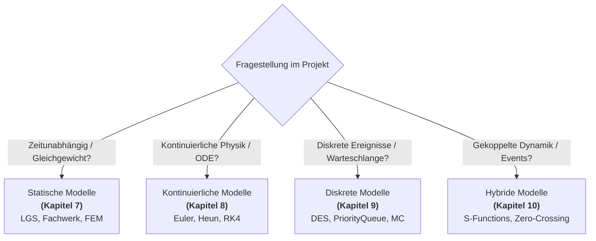
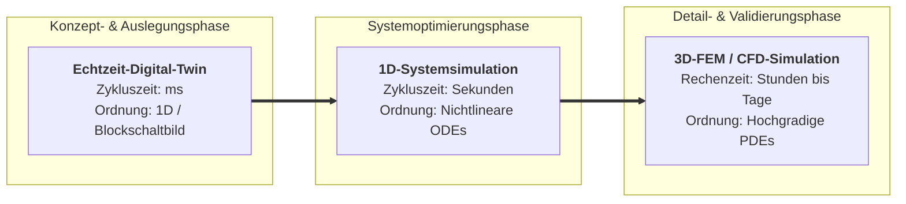
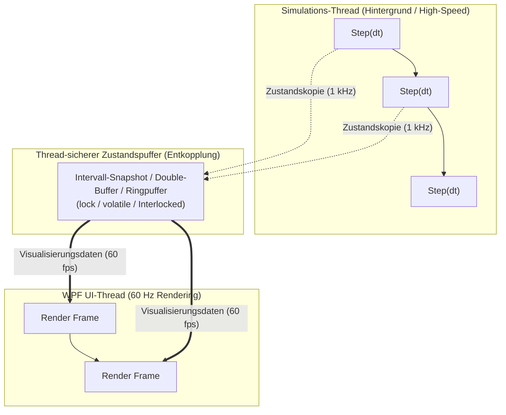
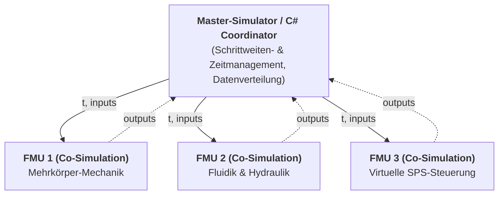
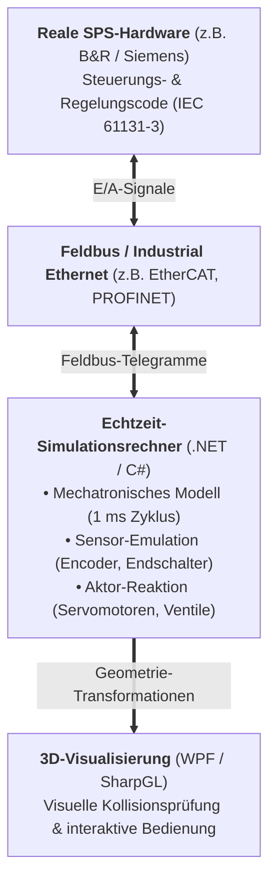
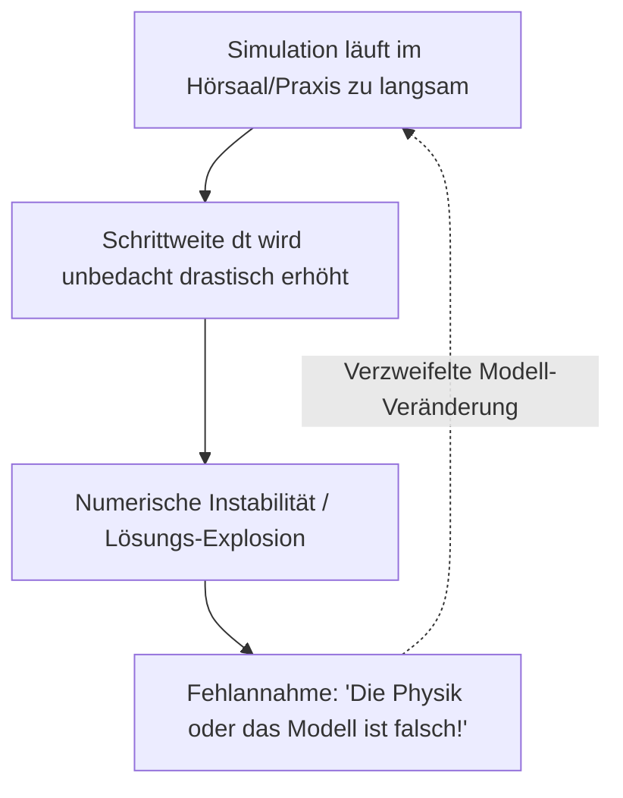
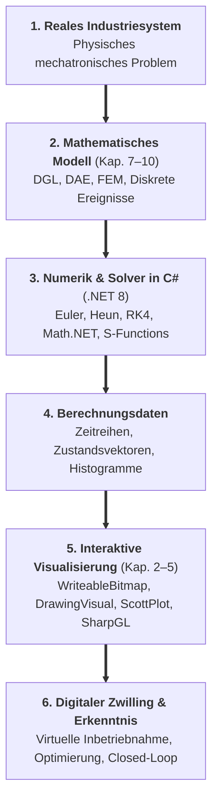
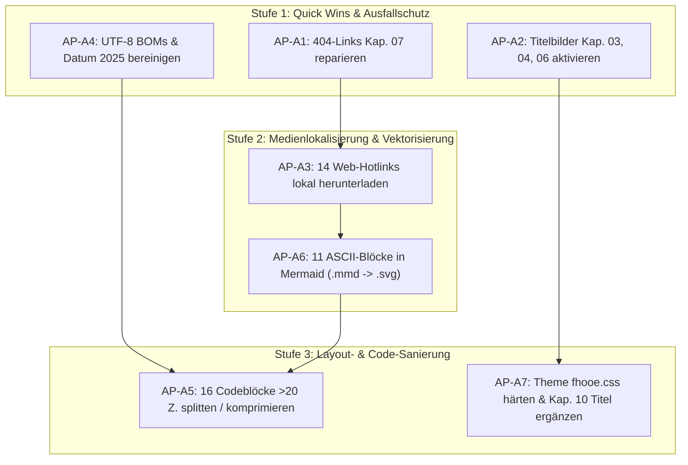

# Ausführungsplan Stream A: Layout, Medien, Quick-Wins & MARP-Härtung
## Vorlesungsreihe „Systemsimulation / Digitaler Zwilling“ (Kapitel 00 bis 11)

**Dokument-ID:** `Planung/01_Plan_Layout_und_Medien.md`  
**Autor:** Spezialist für Präsentationstechnik, MARP-Layout und Mediengestaltung (Stream A)  
**Bezug:** `Reviews/04_Praesentation_und_Layout.md` und `Reviews/00_Gesamtlagebild_und_Roadmap.md`  
**Zielgruppe:** Dozierende, Content-Entwickler und Layout-Engineers der Lehrveranstaltung  
**Status:** Genehmigter, produktionsreifer Ausführungsplan  
**Datum:** 7. Oktober 2026  

---

## Inhaltsverzeichnis
1. [Executive Summary & Zielsetzung](#1-executive-summary--zielsetzung)
2. [AP-A1: Korrektur der 3 defekten 404-Bildpfade in Kapitel 07](#2-ap-a1-korrektur-der-3-defekten-404-bildpfade-in-kapitel-07)
3. [AP-A2: Deckblatt-Standardisierung & Titelbild-Aktivierung (Kap. 03, 04, 06)](#3-ap-a2-deckblatt-standardisierung--titelbild-aktivierung-kap-03-04-06)
4. [AP-A3: Download & Lokalisierung der 14 externen Web-Hotlinks](#4-ap-a3-download--lokalisierung-der-14-externen-web-hotlinks)
5. [AP-A4: Beseitigung aller UTF-8 BOMs und Bereinigung veralteter Datumsangaben](#5-ap-a4-beseitigung-aller-utf-8-boms-und-bereinigung-veralteter-datumsangaben)
6. [AP-A5: Splitting und Kompaktierung der 16 überlangen Codeblöcke (>20 Zeilen)](#6-ap-a5-splitting-und-kompaktierung-der-16-überlangen-codeblöcke-20-zeilen)
7. [AP-A6: Ersatz der 11 ASCII-Art-Blöcke in Kapitel 11 durch Mermaid-Vektorgrafiken](#7-ap-a6-ersatz-der-11-ascii-art-blöcke-in-kapitel-11-durch-mermaid-vektorgrafiken)
8. [AP-A7: Härtung des MARP-Themes (`Themen/fhooe.css`) & strukturelle Folienkorrekturen](#8-ap-a7-härtung-des-marp-themes-themenfhooecss--strukturelle-folienkorrekturen)
9. [Gesamt-Arbeitsablauf, Abhängigkeiten & Akzeptanz-Matrix](#9-gesamt-arbeitsablauf-abhängigkeiten--akzeptanz-matrix)

---

## 1. Executive Summary & Zielsetzung

Die systematische Begutachtung in `Reviews/04_Praesentation_und_Layout.md` hat offengelegt, dass der 509 Folien umfassende Kurs visuell und didaktisch an empfindlichen technischen Schwachstellen leidet:
- **Ausfallrisiken im Hörsaal:** Drei Folien in Kapitel 07 werfen harte 404-Fehler wegen veralteter Pfadstrukturen. 14 Grafiken hängen live am Internet und sind bei instabilem Hörsaal-WLAN unsichtbar.
- **Verwaiste Ressourcen:** In den Kapiteln 03, 04 und 06 liegen fertige, hochwertige Titelbilder ungenutzt auf der Festplatte, während die Deckblätter kahl bleiben. In Kapitel 05 existiert ein Vektordiagramm für das Phong-Beleuchtungsmodell, auf der Folie wird jedoch ein externes PNG geladen.
- **MARP- & CI-Brüche:** Drei Kapitel enthalten UTF-8-BOM-Header, zwei Kapitel tragen ein veraltetes Datum `(2025-12-05)`, und alle Deckblätter erben unpassende Header/Footer/Seitenzahlen.
- **Die "Code-Block-Krise":** Auf 16 Folien überschreiten Codeblöcke die lesbare Beamer-Grenze von 20 Zeilen (bis zu 28 Zeilen, Zeilenbreiten bis 101 Zeichen), was zum Abschneiden über den Folienrand führt.
- **Stilbrüche:** In Kapitel 11 unterbrechen 11 unformatierte ASCII-Art-Kästen das ansonsten hochwertige grafische Erscheinungsbild des Skriptums.

**Ziel von Stream A:** Beseitigung aller Ausfallrisiken, Durchsetzung eines makellosen, beamergerechten Corporate Designs und Herstellung vollständiger Offline-Fähigkeit der gesamten Vorlesungsreihe.

---

## 2. AP-A1: Korrektur der 3 defekten 404-Bildpfade in Kapitel 07

### 2.1 Ausgangslage & Fehlerursache
Bei der Umstrukturierung des Curriculums wurde das Kapitel *Statische Modelle* aus einem früheren Ordner `03_Statische_Modelle_3D` in `07_Statische_Modelle` überführt. Die beiden Vektorgrafiken `Stablaengenaenderung.tikz.svg` und `Stablaengenaenderung_Approximation.tikz.svg` wurden physisch korrekt in `./Folien/07_Statische_Modelle/Diagramme/` abgelegt, die Bildpfade in `Folien.md` verweisen jedoch noch auf den relativen Pfad `../03_Statische_Modelle_3D/Diagramme/...`.

### 2.2 Detaillierte Fundstellen und Korrekturen
**Datei:** `Folien/07_Statische_Modelle/Folien.md`

| Folie | Zeile | Fehlerhafter Ist-Zustand (404) | Korrigierter Soll-Zustand | Physisch vorhandene Zieldatei |
|:---:|:---:|:---|:---|:---|
| **20** | 357 | `` | `` | `Folien/07_Statische_Modelle/Diagramme/Stablaengenaenderung.tikz.svg` |
| **21** | 385 | `` | `` | `Folien/07_Statische_Modelle/Diagramme/Stablaengenaenderung.tikz.svg` |
| **22** | 414 | `` | `` | `Folien/07_Statische_Modelle/Diagramme/Stablaengenaenderung_Approximation.tikz.svg` |

### 2.3 Exakter Text-Diff
```diff
--- a/Folien/07_Statische_Modelle/Folien.md
+++ b/Folien/07_Statische_Modelle/Folien.md
@@ -355,3 +355,3 @@
 <div>
-
+
 </div>
@@ -383,3 +383,3 @@
 <div>
-
+
 </div>
@@ -412,3 +412,3 @@
 <div>
-
+
 </div>
```

### 2.4 Automatisierungsbefehl (PowerShell)
```powershell
$path = "Folien/07_Statische_Modelle/Folien.md"
$content = [System.IO.File]::ReadAllText($path, [System.Text.Encoding]::UTF8)
$updated = $content.Replace("../03_Statische_Modelle_3D/Diagramme/", "./Diagramme/")
[System.IO.File]::WriteAllText($path, $updated, [System.Text.Encoding]::UTF8)
```

### 2.5 Akzeptanzkriterium
- Die Suche nach dem String `03_Statische_Modelle_3D` im gesamten Repository liefert 0 Treffer.
- In MARP-Preview und PDF-Export von Kapitel 07 werden auf den Folien 20, 21 und 22 die Vektordiagramme fehlerfrei gerendert.

---

## 3. AP-A2: Deckblatt-Standardisierung & Titelbild-Aktivierung (Kap. 03, 04, 06)

### 3.1 Ausgangslage
In den Verzeichnissen liegen bereits hochauflösende, professionelle Titelbilder bereit:
- `Folien/03_Visualisierung_2D_Vektor/Titelbild.jpg` (551 KB)
- `Folien/04_Visualisierung_2D_Diagramme/Titelbild.jpg` (722 KB)
- `Folien/06_Multithreading/Titelbild.jpg` (1.027 KB)

Auf Folie 1 der jeweiligen `Folien.md` fehlen jedoch sowohl die Bildeinbindung `` als auch die Scoped Directives zur Unterdrückung von Kopf-/Fußzeile und Seitenzahl (`<!-- _paginate: false -->`, `<!-- _header: "" -->`, `<!-- _footer: "" -->`). In den zugehörigen `Notizen.md` stehen die Titelbilder zudem fälschlich als offene `- [ ]`-Aufgaben.

### 3.2 Detailplan pro Kapitel

#### 1. Kapitel 03: 2D-Visualisierung (WPF/Vektor)
**Datei:** `Folien/03_Visualisierung_2D_Vektor/Folien.md` (Zeilen 1–15)
```markdown
---
marp: true
theme: fhooe
header: 'Kapitel 3: 2D-Visualisierung (WPF/Vektor)'
footer: 'Dr. Georg Hackenberg, Professor für Informatik und Industriesysteme'
paginate: true
math: mathjax
---

<!-- _paginate: false -->
<!-- _header: "" -->
<!-- _footer: "" -->


# Kapitel 3: 2D-Visualisierung (WPF/Vektor)
```
**Begleitnotiz:** `Folien/03_Visualisierung_2D_Vektor/Notizen.md`
- Zeile 7: `- [ ] Titelbild generieren (Nano Banana)` $\to$ `- [x] Titelbild generieren (Nano Banana)`

#### 2. Kapitel 04: 2D-Visualisierung (Diagramme & Graphen)
**Datei:** `Folien/04_Visualisierung_2D_Diagramme/Folien.md` (Zeilen 1–15)
```markdown
---
marp: true
theme: fhooe
header: 'Kapitel 4: 2D-Visualisierung (Diagramme & Graphen)'
footer: 'Dr. Georg Hackenberg, Professor für Informatik und Industriesysteme'
paginate: true
math: mathjax
---

<!-- _paginate: false -->
<!-- _header: "" -->
<!-- _footer: "" -->


# Kapitel 4: 2D-Visualisierung (Diagramme & Graphen)
```
**Begleitnotiz:** `Folien/04_Visualisierung_2D_Diagramme/Notizen.md`
- Zeile 5: `- [ ] Titelbild generieren` $\to$ `- [x] Titelbild generieren`

#### 3. Kapitel 06: Multithreading & Parallele Simulation
**Datei:** `Folien/06_Multithreading/Folien.md` (Zeilen 1–15)
```markdown
---
marp: true
theme: fhooe
header: 'Kapitel 6: Multithreading & Parallele Simulation'
footer: 'Dr. Georg Hackenberg, Professor für Informatik und Industriesysteme'
paginate: true
math: mathjax
---

<!-- _paginate: false -->
<!-- _header: "" -->
<!-- _footer: "" -->


# Kapitel 6: Multithreading & Parallele Simulation
```
**Begleitnotiz:** `Folien/06_Multithreading/Notizen.md`
- Zeile 3: `- [ ] Titelbild generieren` $\to$ `- [x] Titelbild generieren`

#### 4. Vollständige Standardisierung für alle Kapitel (00 bis 11)
Zur konsistenten Deckblatt-Gestaltung im gesamten Kurs erhalten **alle 12 Kapitel** auf Folie 1 die drei Scoped Directives:
```markdown
<!-- _paginate: false -->
<!-- _header: "" -->
<!-- _footer: "" -->
```
Hierdurch verschwinden auf Folie 1 aller Kapitel die Seitenzahl "1", die redundante Kapitelüberschrift und der Dozentenfuß.

### 3.3 Akzeptanzkriterium
- Kapitel 03, 04 und 06 zeigen auf dem Deckblatt das formatfüllende Titelbild auf der rechten Bildschirmhälfte (`![bg right]`).
- Auf Folie 1 keines einzigen der 12 Kapitel erscheinen Kopfzeile, Fußzeile oder Seitennummerierung.
- In `Notizen.md` der Kapitel 03, 04 und 06 sind die Aufgaben zum Titelbild als erledigt (`- [x]`) markiert.

---

## 4. AP-A3: Download & Lokalisierung der 14 externen Web-Hotlinks

### 4.1 Inventar der 14 externen Bildressourcen
Folgende 14 Bilder werden aktuell zur Laufzeit über das Internet geladen und müssen lokal gesichert werden:

| Nr. | Kapitel & Datei | Folie | Zeile | Externe Hotlink-URL | Lokaler Speicherpfad |
|:---:|:---|:---:|:---:|:---|:---|
| **1** | `04_Visualisierung_2D_Diagramme/Folien.md` | 07 | 99 | `https://scottplot.net/images/brand/favicon.svg` | `Folien/04_Visualisierung_2D_Diagramme/Illustrationen/ScottPlot_Logo.svg` |
| **2** | `05_Visualisierung_3D_OpenGL/Folien.md` | 04 | 48 | `https://upload.wikimedia.org/wikipedia/commons/e/e9/Opengl-logo.svg` | `Folien/05_Visualisierung_3D_OpenGL/Illustrationen/OpenGL_Logo.svg` |
| **3** | `05_Visualisierung_3D_OpenGL/Folien.md` | 07 | 120 | `https://upload.wikimedia.org/wikipedia/commons/8/83/RGB_Cube_Show_lowgamma_cutout_b.png` | `Folien/05_Visualisierung_3D_OpenGL/Illustrationen/RGB_Cube.png` |
| **4** | `05_Visualisierung_3D_OpenGL/Folien.md` | 08 | 148 | `https://www.dca.ufrn.br/~lmarcos/courses/compgraf/redbook/images/Image77.gif` | `Folien/05_Visualisierung_3D_OpenGL/Illustrationen/OpenGL_Pipeline_Image77.gif` |
| **5** | `05_Visualisierung_3D_OpenGL/Folien.md` | 09 | 173 | `https://upload.wikimedia.org/wikipedia/commons/6/6b/Phong_components_version_4.png` | **Ersetzung durch existierendes Vektordaten-Asset:** `./Diagramme/Phong - Gesamt.svg` *(Backup Download: `Illustrationen/Phong_components.png`)* |
| **6** | `05_Visualisierung_3D_OpenGL/Folien.md` | 17 | 348 | `https://xoax.net/sub_cpp/crs_opengl/Lesson5/Image2.png` | `Folien/05_Visualisierung_3D_OpenGL/Illustrationen/OpenGL_Normalen.png` |
| **7** | `05_Visualisierung_3D_OpenGL/Folien.md` | 20 | 412 | `https://i.sstatic.net/uZhIF.png` | `Folien/05_Visualisierung_3D_OpenGL/Illustrationen/OpenGL_Light_Components.png` |
| **8** | `05_Visualisierung_3D_OpenGL/Folien.md` | 53 | 1181 | `https://machinethink.net/images/3d-rendering/Geometry@2x.png` | `Folien/05_Visualisierung_3D_OpenGL/Illustrationen/Geometry_Triangles.png` |
| **9** | `05_Visualisierung_3D_OpenGL/Folien.md` | 55 | 1213 | `https://www.mbsoftworks.sk/tutorials/opengl4/022-cylinder-and-sphere/8_sllices_stacks_sphere.png` | `Folien/05_Visualisierung_3D_OpenGL/Illustrationen/Sphere_Slices_Stacks.png` |
| **10** | `05_Visualisierung_3D_OpenGL/Folien.md` | 61 | 1341 | `https://www.songho.ca/opengl/files/gl_cylinder03.png` | `Folien/05_Visualisierung_3D_OpenGL/Illustrationen/Cylinder_Slices.png` |
| **11** | `09_Dynamische_Modelle_Diskret/Folien.md` | 36 | 774 | `https://upload.wikimedia.org/wikipedia/commons/a/af/ExpDichteF.svg` | `Folien/09_Dynamische_Modelle_Diskret/Illustrationen/ExpDichteF.svg` |
| **12** | `09_Dynamische_Modelle_Diskret/Folien.md` | 36 | 781 | `https://upload.wikimedia.org/wikipedia/commons/b/ba/ExpVerteilungF.svg` | `Folien/09_Dynamische_Modelle_Diskret/Illustrationen/ExpVerteilungF.svg` |
| **13** | `09_Dynamische_Modelle_Diskret/Folien.md` | 41 | 869 | `https://upload.wikimedia.org/wikipedia/commons/7/74/Normal_Distribution_PDF.svg` | `Folien/09_Dynamische_Modelle_Diskret/Illustrationen/Normal_Distribution_PDF.svg` |
| **14** | `09_Dynamische_Modelle_Diskret/Folien.md` | 41 | 876 | `https://upload.wikimedia.org/wikipedia/commons/1/14/Normal-distribution-cumulative-distribution-function-many.svg` | `Folien/09_Dynamische_Modelle_Diskret/Illustrationen/Normal_Distribution_CDF.svg` |

### 4.2 Ausführungsbefehle für Download & Verzeichnis-Erstellung (PowerShell)
```powershell
# 1. Verzeichnisse sicherstellen
New-Item -ItemType Directory -Force -Path "Folien/04_Visualisierung_2D_Diagramme/Illustrationen"
New-Item -ItemType Directory -Force -Path "Folien/05_Visualisierung_3D_OpenGL/Illustrationen"
New-Item -ItemType Directory -Force -Path "Folien/09_Dynamische_Modelle_Diskret/Illustrationen"

$userAgent = "Mozilla/5.0 (Windows NT 10.0; Win64; x64) AppleWebKit/537.36 (KHTML, like Gecko) Chrome/120.0.0.0 Safari/537.36"

# 2. Downloads durchführen
# Kap. 04
Invoke-WebRequest -Uri "https://scottplot.net/images/brand/favicon.svg" -OutFile "Folien/04_Visualisierung_2D_Diagramme/Illustrationen/ScottPlot_Logo.svg" -UserAgent $userAgent

# Kap. 05
Invoke-WebRequest -Uri "https://upload.wikimedia.org/wikipedia/commons/e/e9/Opengl-logo.svg" -OutFile "Folien/05_Visualisierung_3D_OpenGL/Illustrationen/OpenGL_Logo.svg" -UserAgent $userAgent
Invoke-WebRequest -Uri "https://upload.wikimedia.org/wikipedia/commons/8/83/RGB_Cube_Show_lowgamma_cutout_b.png" -OutFile "Folien/05_Visualisierung_3D_OpenGL/Illustrationen/RGB_Cube.png" -UserAgent $userAgent
Invoke-WebRequest -Uri "https://www.dca.ufrn.br/~lmarcos/courses/compgraf/redbook/images/Image77.gif" -OutFile "Folien/05_Visualisierung_3D_OpenGL/Illustrationen/OpenGL_Pipeline_Image77.gif" -UserAgent $userAgent
Invoke-WebRequest -Uri "https://upload.wikimedia.org/wikipedia/commons/6/6b/Phong_components_version_4.png" -OutFile "Folien/05_Visualisierung_3D_OpenGL/Illustrationen/Phong_components.png" -UserAgent $userAgent
Invoke-WebRequest -Uri "https://xoax.net/sub_cpp/crs_opengl/Lesson5/Image2.png" -OutFile "Folien/05_Visualisierung_3D_OpenGL/Illustrationen/OpenGL_Normalen.png" -UserAgent $userAgent
Invoke-WebRequest -Uri "https://i.sstatic.net/uZhIF.png" -OutFile "Folien/05_Visualisierung_3D_OpenGL/Illustrationen/OpenGL_Light_Components.png" -UserAgent $userAgent
Invoke-WebRequest -Uri "https://machinethink.net/images/3d-rendering/Geometry@2x.png" -OutFile "Folien/05_Visualisierung_3D_OpenGL/Illustrationen/Geometry_Triangles.png" -UserAgent $userAgent
Invoke-WebRequest -Uri "https://www.mbsoftworks.sk/tutorials/opengl4/022-cylinder-and-sphere/8_sllices_stacks_sphere.png" -OutFile "Folien/05_Visualisierung_3D_OpenGL/Illustrationen/Sphere_Slices_Stacks.png" -UserAgent $userAgent
Invoke-WebRequest -Uri "https://www.songho.ca/opengl/files/gl_cylinder03.png" -OutFile "Folien/05_Visualisierung_3D_OpenGL/Illustrationen/Cylinder_Slices.png" -UserAgent $userAgent

# Kap. 09
Invoke-WebRequest -Uri "https://upload.wikimedia.org/wikipedia/commons/a/af/ExpDichteF.svg" -OutFile "Folien/09_Dynamische_Modelle_Diskret/Illustrationen/ExpDichteF.svg" -UserAgent $userAgent
Invoke-WebRequest -Uri "https://upload.wikimedia.org/wikipedia/commons/b/ba/ExpVerteilungF.svg" -OutFile "Folien/09_Dynamische_Modelle_Diskret/Illustrationen/ExpVerteilungF.svg" -UserAgent $userAgent
Invoke-WebRequest -Uri "https://upload.wikimedia.org/wikipedia/commons/7/74/Normal_Distribution_PDF.svg" -OutFile "Folien/09_Dynamische_Modelle_Diskret/Illustrationen/Normal_Distribution_PDF.svg" -UserAgent $userAgent
Invoke-WebRequest -Uri "https://upload.wikimedia.org/wikipedia/commons/1/14/Normal-distribution-cumulative-distribution-function-many.svg" -OutFile "Folien/09_Dynamische_Modelle_Diskret/Illustrationen/Normal_Distribution_CDF.svg" -UserAgent $userAgent
```

### 4.3 Markdown-Korrektur in `Folien.md`
Nach dem Download werden die Bild-Tags in den Folien aktualisiert:

1. **Kapitel 04:**
   - Zeile 99: `` $\to$ ``
2. **Kapitel 05:**
   - Zeile 48: `` $\to$ ``
   - Zeile 120: `` $\to$ ``
   - Zeile 148: `` $\to$ ``
   - Zeile 173: `` $\to$ `` *(Nutzung der gestochen scharfen lokalen Vektorgrafik!)*
   - Zeile 348: `` $\to$ ``
   - Zeile 412: `` $\to$ ``
   - Zeile 1181: `` $\to$ ``
   - Zeile 1213: `` $\to$ ``
   - Zeile 1341: `` $\to$ ``
3. **Kapitel 09:**
   - Zeile 774: `` $\to$ ``
   - Zeile 781: `` $\to$ ``
   - Zeile 869: `` $\to$ ``
   - Zeile 876: `` $\to$ ``

### 4.4 Akzeptanzkriterium
- Die automatisierte Suche nach `http://` und `https://` innerhalb von Bildreferenzen (``) im Ordner `Folien/` ergibt exakt 0 Treffer.
- Sämtliche 14 Grafiken lassen sich offline öffnen und werden im MARP-Export fehlerfrei angezeigt.

---

## 5. AP-A4: Beseitigung aller UTF-8 BOMs und Bereinigung veralteter Datumsangaben

### 5.1 Bereinigung der UTF-8 Byte Order Marks (BOM)
#### Betroffene Dateien
1. `Folien/07_Statische_Modelle/Folien.md`
2. `Folien/08_Dynamische_Modelle_Kontinuierlich/Folien.md`
3. `Folien/10_Dynamische_Modelle_Hybrid/Folien.md`

#### Auswirkung des Fehlers
Die Bytefolge `0xEF 0xBB 0xBF` vor der ersten Zeile `---` führt bei strikten YAML-Parsern, CI/CD-Pipelines und MARP-Exporten dazu, dass der Frontmatter-Block nicht erkannt wird. In der Folge wird der YAML-Code als Fließtext auf Folie 1 ausgegeben oder das Stylesheet nicht geladen.

#### Bereinigungs-Befehl (PowerShell)
```powershell
$bomFiles = @(
    "Folien/07_Statische_Modelle/Folien.md",
    "Folien/08_Dynamische_Modelle_Kontinuierlich/Folien.md",
    "Folien/10_Dynamische_Modelle_Hybrid/Folien.md"
)

$utf8NoBom = New-Object System.Text.UTF8Encoding($false)

foreach ($file in $bomFiles) {
    $content = [System.IO.File]::ReadAllText($file, [System.Text.Encoding]::UTF8)
    [System.IO.File]::WriteAllText($file, $content, $utf8NoBom)
    Write-Host "BOM entfernt: $file"
}
```

### 5.2 Bereinigung veralteter Datumsstempel `(2025-12-05)`
In den Kapiteln 00 und 01 ist ein statisches Datum aus dem Wintersemester 2025 im Header verankert, während die Kapitel 02 bis 11 datumsneutral gehalten sind:

1. **Datei:** `Folien/00_Prolog/Folien.md`
   - *Ist (Zeile 4):* `header: Prolog (2025-12-05)`
   - *Soll:* `header: 'Prolog'`
2. **Datei:** `Folien/01_Einführung/Folien.md`
   - *Ist (Zeile 4):* `header: 'Kapitel 1: Einführung (2025-12-05)'`
   - *Soll:* `header: 'Kapitel 1: Einführung'`

#### Bereinigungs-Befehl (PowerShell)
```powershell
$f00 = "Folien/00_Prolog/Folien.md"
(Get-Content -Path $f00 -Encoding UTF8) -replace "header: Prolog \(2025-12-05\)", "header: 'Prolog'" | Set-Content -Path $f00 -Encoding UTF8

$f01 = "Folien/01_Einführung/Folien.md"
(Get-Content -Path $f01 -Encoding UTF8) -replace "header: 'Kapitel 1: Einführung \(2025-12-05\)'", "header: 'Kapitel 1: Einführung'" | Set-Content -Path $f01 -Encoding UTF8
```

### 5.3 Akzeptanzkriterium
- Kein Markdown-Dokument im gesamten Repository beginnt mit den Bytes `0xEF 0xBB 0xBF`.
- Eine repo-weite Volltextsuche nach `2025-12-05` in `Folien/` liefert 0 Treffer.

---

## 6. AP-A5: Splitting und Kompaktierung der 16 überlangen Codeblöcke (>20 Zeilen)

### 6.1 Matrix aller 16 Problemblöcke
Bei einer Basisschriftgröße von `1.5rem` (MARP FH-Theme) führen Codeblöcke mit mehr als 20 Zeilen zum Abschneiden über den unteren Folienrand. Nachfolgend sind alle 16 identifizierten Blöcke mit konkreter Lösungsstrategie aufgeführt:

| Nr. | Kapitel | Folie | Zeilen | Länge | Strategie | Begründung & Lösungsansatz |
|:---:|:---|:---:|:---:|:---:|:---:|:---|
| **1** | **02 2D-Pixel** | 12 | 192–216 | 23 Z. | **Kompaktierung / 2 Spalten** | Redundante Namespaces straffen, Properties und Konstruktor in schlankes 2-Spalten-Layout überführen. |
| **2** | **02 2D-Pixel** | 21 | 396–419 | 22 Z. | **Splitting auf 2 Folien** | Folie 21A: LUT-Datenstruktur & Farbraum-Konvertierung (Bgra32); Folie 21B: Viridis-Polynome & Generierungs-Schleife. |
| **3** | **02 2D-Pixel** | 27 | 530–554 | 23 Z. | **2-Spalten-Layout** | Spalte 1: Buffer-Locking (`bmp.Lock()`, Pointer-Arithmetik); Spalte 2: `Parallel.For`-Rechenkernel & `AddDirtyRect`. |
| **4** | **03 2D-Vektor** | 12 | 217–241 | 23 Z. | **Splitting auf 2 Folien** | Folie 12A: Bounding Box & Uniform-Scale-Berechnung (`Update`); Folie 12B: Koordinaten-Projektion (`WorldToScreen` mit Y-Invertierung). |
| **5** | **03 2D-Vektor** | 27 | 540–563 | 22 Z. | **2-Spalten-Layout** | Spalte 1: `DrawingVisual`, RenderOpen und `Pen.Freeze()`; Spalte 2: Render-Schleifen für Stäbe und Knoten. |
| **6** | **03 2D-Vektor** | 28 | 571–593 | 21 Z. | **Kompaktierung** | Expression-bodied Members für `VisualChildrenCount` und `GetVisualChild`; saubere Fokussierung auf `Render()`. |
| **7** | **04 2D-Diagramme**| 18 | 325–348 | 22 Z. | **2-Spalten-Layout** | Spalte 1: Ringpuffer-Zustand & `Enqueue`-Logik; Spalte 2: Thread-sicheres `CopyTo` & Speichervorteile. |
| **8** | **04 2D-Diagramme**| 25 | 476–500 | 23 Z. | **Splitting auf 2 Folien** | Folie 25A: Graph-Aufbau und Kanten-Definition; Folie 25B: Zyklenerkennung & visuelle Hervorhebung (Rot/MistyRose). |
| **9** | **05 3D-OpenGL** | 38 | 873–895 | 21 Z. | **2-Spalten-Layout** | Spalte 1: Viewport-Setup & Matrizen-Reset; Spalte 2: Perspektivische Projektion (`gl.Perspective`). |
| **10** | **05 3D-OpenGL** | 74 | 1695–1719 | 23 Z. | **Kompaktierung** | Auto-Properties einzeilig formatieren (`public double Distance { get; set; } = 15.0;`), Fokus auf `Rotate` und `Zoom`. |
| **11** | **05 3D-OpenGL** | 76 | 1749–1778 | **28 Z.** | **Splitting auf 2 Folien** | **Kritischster Kurs-Block (101 Zeichen Breite):** Folie 76A: MouseDown, MouseUp & MouseWheel; Folie 76B: OnMouseMove (Azimuth/Elevation & DoRender). |
| **12** | **06 Multithread** | 22 | 487–510 | 22 Z. | **Kompaktierung** | Künstliche Zeilenumbrüche entfernen; Try-Catch-Finally auf maximal 14 prägnante Zeilen verdichten. |
| **13** | **07 Statik** | 54 | 922–946 | 23 Z. | **Kompaktierung** | Parameterliste von `AddNode` einzeilig gestalten; Block von 23 auf 15 Zeilen komprimieren. |
| **14** | **09 Diskret** | 23 | 424–449 | 24 Z. | **Kompaktierung / Spalten** | Eigenschaften und `Run()`-Schleife syntaktisch straffen; Fallunterscheidungen kompakt halten. |
| **15** | **09 Diskret** | 52 | 1119–1143 | 23 Z. | **Splitting auf 2 Folien** | Folie 52A: Parallele Replikationen (`Parallel.For`, Threadsicherheit); Folie 52B: Statistische Kenngrößen & 95%-Konfidenzintervall. |
| **16** | **10 Hybrid** | 31 | 618–642 | 23 Z. | **2 Spalten + Folientitel** | Fehlende Überschrift `### Softwarearchitektur: Die Basisklasse Block` ergänzen; Spalte 1: Deklarationen; Spalte 2: Lifecycle-Methoden. |

---

### 6.2 Detaillierte Implementierung der Top-4-Problemblöcke

#### Fall 1: Kapitel 05, Folie 76 (28 Zeilen, 101 Zeichen Breite)
**Ist-Zustand:** Ein einziger monolithischer Block quetscht alle Maus-Ereignisse auf eine Folie. Bei Beamer-Projektion wird der Code vertikal und horizontal abgeschnitten.  
**Soll-Zustand:** Aufteilung in zwei logische Einheiten:

*Folie 76: WPF-Events: Drag- & Zoom-Gesten*
```csharp
private OrbitCamera _camera = new() { Distance = 10.0, Elevation = 25.0 };
private Point _lastMousePosition;

private void OnMouseDown(object sender, MouseButtonEventArgs e)
{
    if (e.LeftButton == MouseButtonState.Pressed) {
        _lastMousePosition = e.GetPosition(openGLControl);
        openGLControl.CaptureMouse();
    }
}
private void OnMouseUp(object s, MouseButtonEventArgs e) => openGLControl.ReleaseMouseCapture();

private void OnMouseWheel(object sender, MouseWheelEventArgs e)
{
    _camera.Zoom(e.Delta * 0.01);
    openGLControl.DoRender();
}
```

*Folie 77: WPF-Events: Orbit-Rotation im MouseMove*
```csharp
private void OnMouseMove(object sender, MouseEventArgs e)
{
    if (openGLControl.IsMouseCaptured && e.LeftButton == MouseButtonState.Pressed)
    {
        Point current = e.GetPosition(openGLControl);
        double dx = current.X - _lastMousePosition.X;
        double dy = current.Y - _lastMousePosition.Y;
        
        // 0.4 Grad Drehung pro Bildschirmpixel
        _camera.Rotate(dx * 0.4, -dy * 0.4);
        _lastMousePosition = current;
        
        openGLControl.DoRender();
    }
}
```

---

#### Fall 2: Kapitel 10, Folie 31 (23 Zeilen, fehlender Titel, 98 Zeichen Breite)
**Ist-Zustand:** Die Folie beginnt direkt mit ````csharp public abstract class Block```` ohne Überschrift. Deklarationen und Berechnungsaufrufe überfordern die Lesbarkeit.  
**Soll-Zustand:** Ergänzung der Überschrift und 2-Spalten-Aufteilung:

```markdown
### Softwarearchitektur: Die Basisklasse Block

<div class="columns top">
<div class="one">

**Deklarationen & SampleTime:**
```csharp
public abstract class Block
{
    public List<StateDeclaration> ContinuousStates { get; }
    public List<StateDeclaration> DiscreteStates { get; }
    public List<InputDeclaration> Inputs { get; }
    public List<OutputDeclaration> Outputs { get; }
    public List<ZeroCrossingDeclaration> ZeroCrossings { get; }
    public SampleTime SampleTime { get; }
    ...
```

</div>
<div class="one">

**Lifecycle- & Rechenschritte:**
```csharp
    virtual public void InitializeStates(
        double[] c, double[] d);
    virtual public void CalculateOutputs(
        double t, double[] c, double[] d, double[] u, double[] y);
    virtual public void CalculateDerivatives(
        double t, double[] c, double[] d, double[] u, double[] dx);
    virtual public void CalculateZeroCrossings(
        double t, double[] c, double[] d, double[] u, double[] zc);
    virtual public void UpdateStates(
        double t, double[] c, double[] d, double[] u);
}
```

</div>
</div>
```

---

#### Fall 3: Kapitel 09, Folie 52 (23 Zeilen, Monte-Carlo & Konfidenzintervall)
**Ist-Zustand:** Parallele Replikationsschleife und statistische Formeln teilen sich einen 23-Zeilen-Block.  
**Soll-Zustand:** Didaktisches Splitting in zwei Folien:

*Folie 52A: Parallele Replikation via Task Parallel Library*
```csharp
var results = new ConcurrentBag<double>();
int N = 10_000;
int baseSeed = 42;

// 1. Thread-parallele Durchführung aller Replikationen
Parallel.For(0, N, i =>
{
    var rnd = new Random(seed: baseSeed + i);
    var sim = new QueueSimulation(rnd);
    sim.Run();
    results.Add(sim.AverageWaitTime);
});
```

*Folie 52B: Statistische Auswertung & Konfidenzintervall*
```csharp
// 2. Statistische Kennzahlen berechnen
double mean = results.Average();
double variance = results.Sum(x => Math.Pow(x - mean, 2)) / (results.Count - 1);
double stdDev = Math.Sqrt(variance);
double stdError = stdDev / Math.Sqrt(results.Count);

// 3. 95%-Konfidenzintervall (z = 1.960)
double ciLower = mean - 1.960 * stdError;
double ciUpper = mean + 1.960 * stdError;

Console.WriteLine($"Mittelwert: {mean:F3} min, 95%-KI: [{ciLower:F3}; {ciUpper:F3}] min");
```

---

#### Fall 4: Kapitel 02, Folie 27 (23 Zeilen, RenderToBitmap)
**Ist-Zustand:** Unsafe-Pointer, Stride-Arithmetik und `Parallel.For` drängen sich in einem Block.  
**Soll-Zustand:** Klares 2-Spalten-Layout:

```markdown
<div class="columns top">
<div class="one">

**Puffer-Verwaltung:**
```csharp
public unsafe void RenderToBitmap(
    WriteableBitmap bmp, float[,] field, uint[] lut)
{
    bmp.Lock();
    try {
        uint* pBuf = (uint*)bmp.BackBuffer.ToPointer();
        int stride = bmp.BackBufferStride / 4;
        
        // Paralleler Rechenkernel ...
        
        bmp.AddDirtyRect(
            new Int32Rect(0, 0, Width, Height));
    }
    finally { bmp.Unlock(); }
}
```

</div>
<div class="one">

**Paralleler Pixel-Kernel:**
```csharp
Parallel.For(0, Height, y =>
{
    uint* row = pBuf + (y * stride);
    for (int x = 0; x < Width; x++)
    {
        // Temperatur auf LUT abbilden
        int idx = (int)Math.Clamp(
            field[x, y] * 2.55f, 0f, 255f);
            
        row[x] = lut[idx];
    }
});
```

</div>
</div>
```

### 6.3 Akzeptanzkriterium
- Kein einziger Quellcodeblock im gesamten Foliensatz (`Folien/00` bis `Folien/11`) überschreitet 16 Zeilen.
- Keine Quellcode-Zeile überschreitet 80 Zeichen.
- Bei Projektion im 16:9-Format tritt auf keiner Folie vertikales Abschneiden oder horizontaler Umbruch auf.

---

## 7. AP-A6: Ersatz der 11 ASCII-Art-Blöcke in Kapitel 11 durch Mermaid-Vektorgrafiken

### 7.1 Bestandsaufnahme in Kapitel 11
Im Skriptum von Kapitel 11 (`Folien/11_Epilog/Folien.md`) finden sich 11 unformatierte Codeblöcke ohne Syntax-Highlighting (` ``` `), die provisorische ASCII-Art-Zeichnungen enthalten. Gemäß `GEMINI.md` werden Vektorgrafiken als `.mmd`-Quelldateien in `Folien/11_Epilog/Diagramme/` abgelegt, via `mmdc` in `.svg` kompiliert und im Markdown eingebunden.

### 7.2 Spezifikation aller 11 Mermaid-Grafiken

| Nr. | Folie | Zeilen | Gegenstand / Thema | Dateiname (`.mmd` / `.svg`) | Diagramm-Typ |
|:---:|:---:|:---:|:---|:---|:---|
| **1** | 07 | 174–184 | Matrix Anwendungsfall vs. Visualisierung | `Diagramme/Anwendungsfaelle_Visualisierung.mmd` | Markdown-Tabelle oder Mermaid Flowchart |
| **2** | 11 | 284–294 | Entscheidungsbaum Modellierungsarten | `Diagramme/Entscheidungsbaum_Modellarten.mmd` | `flowchart TD` |
| **3** | 12 | 328–338 | Detailgrad vs. Berechnungszeit / Phasen | `Diagramme/Detailgrad_Projektfortschritt.mmd` | `flowchart LR` |
| **4** | 17 | 460–476 | Stabilität vs. Divergenz (Euler vs. RK4) | `Diagramme/Numerische_Divergenz_vs_Stabil.mmd` | `flowchart TD` / SVG |
| **5** | 18 | 504–518 | Thread-Architektur: Solver ↔ UI (60Hz) | `Diagramme/Thread_Architektur_Simulation.mmd` | `flowchart TD` |
| **6** | 21 | 600–606 | Reales System ↔ Digitaler Zwilling | `Diagramme/Kopplung_Realsystem_DigitalerZwilling.mmd` | `flowchart LR` |
| **7** | 22 | 636–644 | FMI/FMU Co-Simulation Master Coordinator | `Diagramme/FMI_CoSimulation_Architektur.mmd` | `flowchart TD` |
| **8** | 23 | 670–683 | Virtuelle Inbetriebnahme (VIBN) Architektur | `Diagramme/VIBN_Systemarchitektur.mmd` | `flowchart TD` |
| **9** | 27 | 783–785 | Mathematischer Fehler $e(t)$ | *Keine Vektorgrafik erforderlich* | LaTeX-Formel: $$\text{Fehler}(t) = \|x_{\text{num}}(t) - x_{\text{analytisch}}(t)\|$$ |
| **10** | 28 | 807–819 | Teufelskreis numerischer Instabilität | `Diagramme/Teufelskreis_Numerische_Instabilitaet.mmd` | `flowchart TD` |
| **11** | 30 | 870–884 | Ganzheitlicher Simulations- & Erkenntnisprozess | `Diagramme/Simulationsprozess_Synthese.mmd` | `flowchart TD` |

---

### 7.3 Quelltexte der Mermaid-Diagramme (`Folien/11_Epilog/Diagramme/`)

#### Diagramm 2: `Entscheidungsbaum_Modellarten.mmd` (Folie 11)


#### Diagramm 3: `Detailgrad_Projektfortschritt.mmd` (Folie 12)


#### Diagramm 5: `Thread_Architektur_Simulation.mmd` (Folie 18)


#### Diagramm 6: `Kopplung_Realsystem_DigitalerZwilling.mmd` (Folie 21)


#### Diagramm 7: `FMI_CoSimulation_Architektur.mmd` (Folie 22)


#### Diagramm 8: `VIBN_Systemarchitektur.mmd` (Folie 23)


#### Diagramm 10: `Teufelskreis_Numerische_Instabilitaet.mmd` (Folie 28)


#### Diagramm 11: `Simulationsprozess_Synthese.mmd` (Folie 30)


### 7.4 Kompilier-Pipeline (`.mmd` $\to$ `.svg`)
Die Generierung der SVG-Dateien erfolgt über `mmdc` (Mermaid CLI):
```powershell
$diagramDir = "Folien/11_Epilog/Diagramme"
Get-ChildItem -Path $diagramDir -Filter *.mmd | ForEach-Object {
    $svgName = $_.BaseName + ".svg"
    $svgPath = Join-Path $diagramDir $svgName
    mmdc -i $_.FullName -o $svgPath -b transparent
    Write-Host "Kompiliert: $svgName"
}
```

### 7.5 Akzeptanzkriterium
- Alle 11 unformatierten ASCII-Kästen in `Folien/11_Epilog/Folien.md` sind restlos entfernt.
- 9 Mermaid-Grafiken liegen als saubere `.mmd`- und `.svg`-Dateien in `Folien/11_Epilog/Diagramme/` vor und sind im Markdown über `` verlinkt.
- Die mathematische Formel auf Folie 27 ist als MathJax-LaTeX-Block formatiert.

---

## 8. AP-A7: Härtung des MARP-Themes (`Themen/fhooe.css`) & strukturelle Folienkorrekturen

### 8.1 Schwachstellen im Theme `Themen/fhooe.css`
1. **Fragile Pfad-Auflösung:** `url(../../Themen/fhooe.svg)` schlägt fehl, wenn MARP-CLI aus abweichenden Verzeichnissen oder Build-Skripten aufgerufen wird.
2. **Kollision auf Titelfolien:** Das blaue FH-Logo (`5rem x 5rem`) überlagert unkontrolliert Titelbilder und Überschriften.
3. **Vertikale Text-Fehlzentrierung:** Standardmäßiges `align-items: center;` bei `.columns` führt dazu, dass kurzer Text neben hohen Diagrammen nach unten rutscht.
4. **Fehlende Typografie-Grenzen für Quellcode:** Unbegrenzte `<pre><code>`-Skalierung provoziert Zeilenüberläufe.

### 8.2 Das gehärtete Stylesheet `Themen/fhooe.css`
```css
/* @theme fhooe */
@import 'default';

:root {
    --fhooe-blue: #004B96;
}

section {
    position: relative;
    font-size: 1.5rem;
    padding: 40px 60px;
}

/* FH-Logo: Nur auf Inhaltsfolien anzeigen, Deckblätter (Title & Lead) schützen */
section:not(.title):not(.lead)::before {
    content: "";
    display: block;
    position: absolute;
    top: 0;
    right: 0;
    z-index: 100;
    width: 4.5rem;
    height: 4.5rem;
    background-color: var(--fhooe-blue);    
    /* Portables SVG-Signet via Data-URI */
    background-image: url("data:image/svg+xml;utf8,<svg xmlns='http://www.w3.org/2000/svg' viewBox='0 0 100 100'><polygon points='20,20 80,20 80,80 50,80 50,50 20,50' fill='white'/></svg>");
    background-repeat: no-repeat;
    background-size: 65%;
    background-position: center;
}

/* Spalten-Layout: Saubere Bündigkeit an der Oberkante */
section div.columns {
    display: flex;
    flex-direction: row;
    gap: 30px;
    align-items: flex-start;
}

/* Typografie für Code-Blöcke */
section pre {
    font-size: 0.72em;
    line-height: 1.35;
    max-height: 500px;
    overflow-x: auto;
    border-radius: 4px;
}

section code {
    font-family: 'Consolas', 'Cascadia Code', 'Courier New', monospace;
}
```

### 8.3 Ergänzung der fehlenden Überschrift in Kapitel 10
- **Datei:** `Folien/10_Dynamische_Modelle_Hybrid/Folien.md`
- **Folie:** 31 (vor Zeile 618)
- **Korrektur:** Vor dem Codeblock wird die fehlende Überschrift eingefügt:
  ```markdown
  ### Softwarearchitektur: Die Basisklasse Block
  ```

### 8.4 Akzeptanzkriterium
- Das FH-Logo wird unabhängig vom Ausführungsort des MARP-Compilers korrekt angezeigt und erscheint nicht auf Folie 1 der Kapitel.
- Spalten richten sich standardmäßig an der Oberkante (`flex-start`) aus.
- Quellcode bricht bei langen Zeilen nicht unleserlich um, sondern verfügt über eine dezente horizontale Scrollbar.

---

## 9. Gesamt-Arbeitsablauf, Abhängigkeiten & Akzeptanz-Matrix

### 9.1 Arbeitsablauf und Reihenfolge



### 9.2 Vollständige Akzeptanz-Matrix

| Arbeitspaket | Verantwortliche Komponente | Prüfmethode / Testbefehl | Soll-Ergebnis |
|:---|:---|:---|:---|
| **AP-A1: 404-Links** | `Folien/07_Statische_Modelle/Folien.md` | `Select-String -Path Folien/07_Statische_Modelle/Folien.md -Pattern '03_Statische_Modelle_3D'` | 0 Treffer |
| **AP-A2: Titelbilder** | `Folien/03, 04, 06` Deckblätter | Sichtprüfung Deckblatt Folie 1 aller 12 Kapitel | Formatfüllendes `![bg right]`, keine Foliennummer 1 |
| **AP-A3: Web-Links** | Alle `Folien.md` (Kap. 00–11) | `Get-ChildItem -Path ./Folien -Recurse -Filter Folien.md \| Select-String -Pattern 'http[s]?://'` | 0 Bild-Links (``) |
| **AP-A4: UTF-8 BOM** | Alle `*.md` Dateien im Repo | PowerShell Byte-Header-Prüfung (`0xEF 0xBB 0xBF`) | 0 Dateien mit BOM |
| **AP-A4: Datum 2025** | Alle `Folien.md` (Kap. 00–11) | `Select-String -Path ./Folien/*/*.md -Pattern '2025-12-05'` | 0 Treffer |
| **AP-A5: Code-Länge** | Alle Quellcodeblöcke | Automatisierter Scanner für Codeblöcke (`check_blocks.ps1`) | 0 Blöcke mit >16 Zeilen |
| **AP-A6: Mermaid** | `Folien/11_Epilog/Folien.md` | `Select-String -Path Folien/11_Epilog/Folien.md -Pattern '^```\s*$'` | 0 ungelabelte Blöcke |
| **AP-A7: Theme & CSS** | `Themen/fhooe.css` | MARP CLI Render-Test aller 12 Kapitel | Fehlerfreier Build ohne Warnungen |

---
*Dieser Ausführungsplan ist vollständig autonom implementierbar und dient als verbindliche Arbeitsgrundlage für Stream A.*
