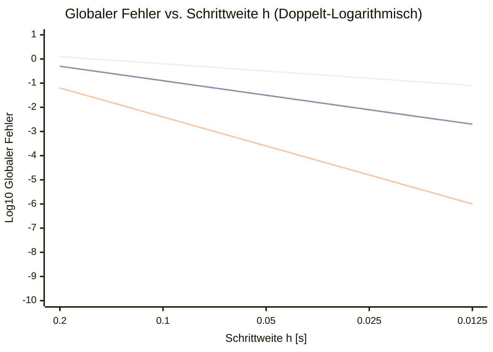

# Ausführungsplan Stream B: Didaktische Schärfung, Mathematische Exaktheit & Numerische Robustheit

**Dokument-ID:** `Planung/02_Plan_Didaktik_und_Numerik.md`  
**Autor:** Spezialist für Didaktik, Numerik und mechatronische Systemsimulation (Stream B)  
**Bezug:** `Reviews/01_Didaktik_und_Zielgruppe.md` und `Reviews/02_Mathematik_und_Numerik.md`  
**Zielgruppe:** Dozierende und Entwickler der Lehrveranstaltung *Systemsimulation / Digitaler Zwilling* (FH Oberösterreich, Campus Wels, Studiengang Automatisierungstechnik)  
**Status:** Genehmigter Umsetzungs- und Implementierungsplan  
**Datum:** Oktober 2026  

---

## Inhaltsverzeichnis
1. [Executive Summary & Zielsetzung](#1-executive-summary--zielsetzung)
2. [AP-B1: Integration von Heun (RK2) und Runge-Kutta 4 (RK4) in Kapitel 08](#2-ap-b1-integration-von-heun-rk2-und-runge-kutta-4-rk4-in-kapitel-08)
3. [AP-B2: Begriffliche Richtigstellungen in Kapitel 08](#3-ap-b2-begriffliche-richtigstellungen-in-kapitel-08)
4. [AP-B3: Formel- und Begriffskorrektur in Kapitel 02 (2D-Wärmeleitung)](#4-ap-b3-formel--und-begriffskorrektur-in-kapitel-02-2d-wrmeleitung)
5. [AP-B4: Didaktische Straffung von Kapitel 05 (3D-OpenGL)](#5-ap-b4-didaktische-straffung-von-kapitel-05-3d-opengl)
6. [AP-B5: Stochastische Kausalität & robuste Statistik in Kapitel 09](#6-ap-b5-stochastische-kausalitt--robuste-statistik-in-kapitel-09)
7. [AP-B6: Robuste Nulldurchgangsdetektion & Zeno-Behandlung in Kapitel 10](#7-ap-b6-robuste-nulldurchgangsdetektion--zeno-behandlung-in-kapitel-10)
8. [Arbeitsablauf, Abhängigkeiten & Meilensteinplan](#8-arbeitsablauf-abhngigkeiten--meilensteinplan)

---

## 1. Executive Summary & Zielsetzung

Die Reviews `01_Didaktik_und_Zielgruppe.md` und `02_Mathematik_und_Numerik.md` haben ein klares Bild gezeichnet: Der Kurs *Systemsimulation / Digitaler Zwilling* verfügt über ein herausragendes fachliches Niveau und eine moderne C#-Architektur, leidet jedoch an didaktischen Reibungszonen, mathematischen Auslassungen und numerischen Schwachstellen:

1. **Kapitel 08 (Kontinuierlich):** Das Verfahren von Heun (RK2) und das klassische Runge-Kutta 4 (RK4) fehlen im Kernkapitel der dynamischen Simulation komplett, obwohl sie im Epilog als Standard vorausgesetzt werden. Zudem ist der gezeigte "implizite Euler" in Wahrheit der semi-implizite Euler-Cromer, und die Solver-Iteration ist kein Newton-Verfahren, sondern eine Banach-Fixpunktiteration.
2. **Kapitel 02 (Pixel/PDE):** Ein dimensionaler Doppelungsfehler ($\frac{\alpha}{h^2} \Delta T_{i,j}$) in der Wärmeleitungsgleichung widerspricht dem funktionierenden C#-Code, und die Von-Neumann-Stabilitätsgrenze ($s \le 0{,}25$) wird fälschlicherweise als CFL-Bedingung bezeichnet.
3. **Kapitel 05 (OpenGL 3D):** Eine ca. 30 Folien umfassende trigonometrische Herleitung von Normalenvektoren für Kugel und Zylinder überlastet die Studierenden der Automatisierungstechnik kognitiv und verdrängt essenzielle Systemthemen.
4. **Kapitel 09 (Diskret/DES):** Die Verwendung einer nicht-trunkierten Normalverteilung für Bedienzeiten verletzt die Kausalität ($P(T < 0) > 0$), und die Varianzberechnung erfolgt ineffizient über zwei Speicher-Durchläufe.
5. **Kapitel 10 (Hybrid):** Die Solver-Nulldurchgangsdetektion halbiert naiv die Schrittweite vom Startpunkt aus (keine echte Bisektion), und das Zeno-Phänomen beim Bouncing Ball führt mangels Haftbedingung zum Zeitschrittkollaps.

**Stream B liefert die didaktische und numerische Sanierung:** Alle Formeln, Algorithmen, Folienstrukturen und C#-Vorlagen werden in diesem Plan so detailliert ausgearbeitet, dass sie im Implementierungsschritt direkt in die MARP-Foliensätze (`Folien.md`), Notizen (`Notizen.md`) und Quellcodes (`Quellen/`) übernommen werden können.

---

## 2. AP-B1: Integration von Heun (RK2) und Runge-Kutta 4 (RK4) in Kapitel 08

### 2.1 Didaktische Motivation & Lehrpfad

Bislang springt Kapitel 08 nach dem expliziten Euler direkt zu impliziten Verfahren und algebraischen Schleifen. Für Automatisierungsingenieure ist dieser Sprung didaktisch unvollständig:
- In der industriellen Praxis (Simulink, TwinCAT, FMI/FMU) ist **RK4 das Standard-Arbeitspferd** für nicht-steife Systeme.
- Studierende müssen verstehen, **warum** Mehrstufenverfahren existieren: Höhere Konvergenzordnung erlaubt signifikant größere Zeitschritte bei identischer Genauigkeit, wodurch Rechenzeit eingespart wird.
- Der Einstieg über **Heun (RK2)** vermittelt das intuitive Konzept des Prädiktor-Korrektor-Prinzips (Steigung am Startschritt schätzen $\to$ Probesprung $\to$ Steigung am Zielpunkt mitteln).
- Darauf aufbauend wird das **Butcher-Tableau** als standardisiertes Werkzeug zur Charakterisierung von Runge-Kutta-Verfahren eingeführt, bevor das **klassische RK4** als 4-Stufen-Verfahren mathematisch und programmtechnisch implementiert wird.

### 2.2 Mathematische Formulierung & Butcher-Tableaux

Ein allgemeines $s$-stufiges explizites Runge-Kutta-Verfahren zur Lösung des Anfangswertproblems $\dot{\mathbf{x}}(t) = \mathbf{f}(t, \mathbf{x}(t)), \ \mathbf{x}(t_0) = \mathbf{x}_0$ lautet:

$$\mathbf{k}_i = \mathbf{f}\left(t_k + c_i h, \ \mathbf{x}_k + h \sum_{j=1}^{i-1} a_{ij} \mathbf{k}_j\right), \quad i = 1, \dots, s$$

$$\mathbf{x}_{k+1} = \mathbf{x}_k + h \sum_{i=1}^s b_i \mathbf{k}_i$$

Dargestellt im standardisierten **Butcher-Tableau**:

$$\begin{array}{c|c}
\mathbf{c} & \mathbf{A} \\
\hline
& \mathbf{b}^T
\end{array}
\quad \iff \quad
\begin{array}{c|cccc}
c_1 & a_{11} & a_{12} & \dots & a_{1s} \\
c_2 & a_{21} & a_{22} & \dots & a_{2s} \\
\vdots & \vdots & \vdots & \ddots & \vdots \\
c_s & a_{s1} & a_{s2} & \dots & a_{ss} \\
\hline
& b_1 & b_2 & \dots & b_s
\end{array}$$

Da das Verfahren explizit ist, ist die Matrix $\mathbf{A}$ eine strikte untere Dreiecksmatrix ($a_{ij} = 0$ für $j \ge i$) und $c_1 = 0$.

#### 1. Verfahren von Heun (RK2)
- **Konzept:** Prädiktor-Korrektor-Verfahren (Trapez-Verfahren explizit).
- **Stufen:**
  $$\mathbf{k}_1 = \mathbf{f}(t_k, \mathbf{x}_k)$$
  $$\mathbf{k}_2 = \mathbf{f}(t_k + h, \mathbf{x}_k + h \mathbf{k}_1)$$
  $$\mathbf{x}_{k+1} = \mathbf{x}_k + \frac{h}{2} (\mathbf{k}_1 + \mathbf{k}_2)$$
- **Butcher-Tableau:**
  $$\begin{array}{c|cc}
  0 & 0 & 0 \\
  1 & 1 & 0 \\
  \hline
  & 1/2 & 1/2
  \end{array}$$
- **Fehlerordnung:** Konsistenzfehler lokal $\mathcal{O}(h^3)$, globaler Verfahrensfehler $\mathcal{O}(h^2)$.

#### 2. Klassisches Runge-Kutta-Verfahren 4. Ordnung (RK4)
- **Konzept:** Mittelung von vier Steigungen mit Simpson-Regel-Gewichtung $\frac{1}{6}(1 + 2 + 2 + 1)$.
- **Stufen:**
  $$\mathbf{k}_1 = \mathbf{f}(t_k, \mathbf{x}_k)$$
  $$\mathbf{k}_2 = \mathbf{f}\left(t_k + \frac{h}{2}, \mathbf{x}_k + \frac{h}{2} \mathbf{k}_1\right)$$
  $$\mathbf{k}_3 = \mathbf{f}\left(t_k + \frac{h}{2}, \mathbf{x}_k + \frac{h}{2} \mathbf{k}_2\right)$$
  $$\mathbf{k}_4 = \mathbf{f}(t_k + h, \mathbf{x}_k + h \mathbf{k}_3)$$
  $$\mathbf{x}_{k+1} = \mathbf{x}_k + \frac{h}{6} (\mathbf{k}_1 + 2\mathbf{k}_2 + 2\mathbf{k}_3 + \mathbf{k}_4)$$
- **Butcher-Tableau:**
  $$\begin{array}{c|cccc}
  0 & 0 & 0 & 0 & 0 \\
  1/2 & 1/2 & 0 & 0 & 0 \\
  1/2 & 0 & 1/2 & 0 & 0 \\
  1 & 0 & 0 & 1 & 0 \\
  \hline
  & 1/6 & 1/3 & 1/3 & 1/6
  \end{array}$$
- **Fehlerordnung:** Konsistenzfehler lokal $\mathcal{O}(h^5)$, globaler Verfahrensfehler $\mathcal{O}(h^4)$.

### 2.3 Stabilitätsanalyse & Dahlquist-Testgleichung

Anwendung auf die lineare skalare Dahlquist-Testgleichung $\dot{x} = \lambda x$ mit $\lambda \in \mathbb{C}$ und $z = \lambda h$:
$$x_{k+1} = R(z) x_k$$

Das Stabilitätsgebiet $\mathcal{S}$ ist definiert durch:
$$\mathcal{S} = \{ z \in \mathbb{C} : |R(z)| \le 1 \}$$

| Verfahren | Stabilitätsfunktion $R(z)$ | Schnittpunkt mit $\text{Re}(z) \le 0$ | Schnittpunkt mit Imaginärachse ($i\beta$) | Eignung für ungedämpfte Oszillatoren ($\lambda = \pm i\omega$) |
| :--- | :--- | :--- | :--- | :--- |
| **Expliziter Euler (RK1)** | $1 + z$ | $[-2, 0]$ | Keiner ($|1 + i\beta| = \sqrt{1+\beta^2} > 1 \ \forall \beta \neq 0$) | **Ausnahmslos instabil!** Schwingung schaukelt auf. |
| **Heun (RK2)** | $1 + z + \frac{z^2}{2}$ | $[-2, 0]$ | Keiner ($|1 + i\beta - \frac{\beta^2}{2}| = \sqrt{1 + \frac{\beta^4}{4}} > 1$) | **Instabil!** Schaukelt auf, jedoch langsamer als Euler. |
| **Klassisches RK4** | $1 + z + \frac{z^2}{2} + \frac{z^3}{6} + \frac{z^4}{24}$ | $[-2{,}785, 0]$ | $[-i 2\sqrt{2}, +i 2\sqrt{2}] \approx [-2{,}83i, +2{,}83i]$ | **Bedingt stabil!** Stabil für $h \cdot \omega_0 \le 2\sqrt{2} \approx 2{,}828$. |

> [!IMPORTANT]
> **Didaktische Kernbotschaft für Studierende:**  
> Für mechanische oder mechatronische Schwingungssysteme (wie das ungedämpfte Federpendel) sind weder Euler noch Heun stabil betreibbar! Erst RK4 schließt ein Segment der imaginären Achse ein und erlaubt eine stabile Simulation, solange der Zeitschritt die Stabilitätsgrenze $h \le \frac{2{,}828}{\omega_0}$ einhält.

### 2.4 C#-Implementierung: Schnittstellen und Solver-Klassen

Um sowohl die moderne Schnittstellenarchitektur aus Kapitel 11 (`IContinuousModel`, `IContinuousSolver`) als auch das blockbasierte Framework aus Kapitel 08 (`Solver`) zu unterstützen, werden zwei Ausprägungen bereitgestellt:

#### 1. Entkoppeltes Interface `IContinuousSolver` (Lehrbuch-Architektur)

```csharp
namespace SimulationEngine.Solvers
{
    public interface IContinuousModel
    {
        int StateDimension { get; }
        void ComputeDerivatives(double t, double[] x, double[] dxdt);
    }

    public interface IContinuousSolver
    {
        string Name { get; }
        int Order { get; }
        void Step(IContinuousModel model, double t, double[] x, double dt);
    }

    /// <summary>
    /// Verfahren von Heun (Runge-Kutta 2. Ordnung, Prädiktor-Korrektor)
    /// </summary>
    public class HeunSolver : IContinuousSolver
    {
        public string Name => "Heun (RK2)";
        public int Order => 2;

        public void Step(IContinuousModel model, double t, double[] x, double dt)
        {
            int n = model.StateDimension;
            double[] k1 = new double[n];
            double[] k2 = new double[n];
            double[] xTemp = new double[n];

            // Stufe 1: Steigung am Intervallanfang
            model.ComputeDerivatives(t, x, k1);

            // Stufe 2: Prädiktorschritt zum Intervallende
            for (int i = 0; i < n; i++)
            {
                xTemp[i] = x[i] + dt * k1[i];
            }
            model.ComputeDerivatives(t + dt, xTemp, k2);

            // Korrekturschritt: Mittelung beider Steigungen
            for (int i = 0; i < n; i++)
            {
                x[i] += dt * 0.5 * (k1[i] + k2[i]);
            }
        }
    }

    /// <summary>
    /// Klassisches Runge-Kutta-Verfahren 4. Ordnung (RK4)
    /// </summary>
    public class RungeKutta4Solver : IContinuousSolver
    {
        public string Name => "Runge-Kutta 4 (RK4)";
        public int Order => 4;

        public void Step(IContinuousModel model, double t, double[] x, double dt)
        {
            int n = model.StateDimension;
            double[] k1 = new double[n];
            double[] k2 = new double[n];
            double[] k3 = new double[n];
            double[] k4 = new double[n];
            double[] xTemp = new double[n];

            double dtHalf = 0.5 * dt;

            // Stufe 1: k1 = f(t, x)
            model.ComputeDerivatives(t, x, k1);

            // Stufe 2: k2 = f(t + dt/2, x + dt/2 * k1)
            for (int i = 0; i < n; i++) xTemp[i] = x[i] + dtHalf * k1[i];
            model.ComputeDerivatives(t + dtHalf, xTemp, k2);

            // Stufe 3: k3 = f(t + dt/2, x + dt/2 * k2)
            for (int i = 0; i < n; i++) xTemp[i] = x[i] + dtHalf * k2[i];
            model.ComputeDerivatives(t + dtHalf, xTemp, k3);

            // Stufe 4: k4 = f(t + dt, x + dt * k3)
            for (int i = 0; i < n; i++) xTemp[i] = x[i] + dt * k3[i];
            model.ComputeDerivatives(t + dt, xTemp, k4);

            // Endgültiges Zustandsupdate (Simpson-Mittelung)
            for (int i = 0; i < n; i++)
            {
                x[i] += (dt / 6.0) * (k1[i] + 2.0 * k2[i] + 2.0 * k3[i] + k4[i]);
            }
        }
    }
}
```

#### 2. Erweiterung der S-Function-Klasse `RungeKutta4Solver : Solver`
In `Quellen/WS25/SFunctionContinuous/Framework/Solvers/RungeKutta4Solver.cs` wird die 4-Stufen-Auswertung über die Blockstrukturen implementiert:

```csharp
namespace SFunctionContinuous.Framework.Solvers
{
    public class RungeKutta4Solver : Solver
    {
        private readonly Dictionary<Block, double[]> _k1 = new();
        private readonly Dictionary<Block, double[]> _k2 = new();
        private readonly Dictionary<Block, double[]> _k3 = new();
        private readonly Dictionary<Block, double[]> _k4 = new();
        private readonly Dictionary<Block, double[]> _statesBackup = new();

        public RungeKutta4Solver(Model composition) : base(composition)
        {
            foreach (var b in Blocks)
            {
                int count = b.ContinuousStates.Count;
                _k1[b] = new double[count];
                _k2[b] = new double[count];
                _k3[b] = new double[count];
                _k4[b] = new double[count];
                _statesBackup[b] = new double[count];
            }
        }

        public override void Solve(double timeStep, double timeMax)
        {
            double time = 0.0;
            InitializeStates();

            while (time <= timeMax)
            {
                // 1. Ausgangszustände sichern
                BackupStates();

                // Stufe 1: Auswertung bei t
                CalculateOutputs(time);
                CalculateDerivatives(time);
                CopyDerivativesTo(_k1);

                // Stufe 2: Auswertung bei t + dt/2 mit k1
                ApplyIntermediateStates(0.5 * timeStep, _k1);
                CalculateOutputs(time + 0.5 * timeStep);
                CalculateDerivatives(time + 0.5 * timeStep);
                CopyDerivativesTo(_k2);

                // Stufe 3: Auswertung bei t + dt/2 mit k2
                ApplyIntermediateStates(0.5 * timeStep, _k2);
                CalculateOutputs(time + 0.5 * timeStep);
                CalculateDerivatives(time + 0.5 * timeStep);
                CopyDerivativesTo(_k3);

                // Stufe 4: Auswertung bei t + dt mit k3
                ApplyIntermediateStates(timeStep, _k3);
                CalculateOutputs(time + timeStep);
                CalculateDerivatives(time + timeStep);
                CopyDerivativesTo(_k4);

                // Endgültige Zusammensetzung: Simpson-Regel
                FinalizeStates(timeStep);

                time += timeStep;
            }
        }

        private void BackupStates()
        {
            foreach (var b in Blocks)
                Array.Copy(ContinuousStates[b], _statesBackup[b], b.ContinuousStates.Count);
        }

        private void ApplyIntermediateStates(double factor, Dictionary<Block, double[]> k)
        {
            foreach (var b in Blocks)
            {
                for (int i = 0; i < b.ContinuousStates.Count; i++)
                    ContinuousStates[b][i] = _statesBackup[b][i] + factor * k[b][i];
            }
        }

        private void CopyDerivativesTo(Dictionary<Block, double[]> target)
        {
            foreach (var b in Blocks)
                Array.Copy(Derivatives[b], target[b], b.ContinuousStates.Count);
        }

        private void FinalizeStates(double dt)
        {
            foreach (var b in Blocks)
            {
                for (int i = 0; i < b.ContinuousStates.Count; i++)
                {
                    ContinuousStates[b][i] = _statesBackup[b][i] + (dt / 6.0) * (
                        _k1[b][i] + 2.0 * _k2[b][i] + 2.0 * _k3[b][i] + _k4[b][i]
                    );
                }
            }
        }
    }
}
```

### 2.5 Konvergenzdiagramm & Genauigkeitsvergleich

Zur didaktischen Veranschaulichung der Fehlerordnung wird eine Doppel-Logarithmische Grafik (`Diagramme/Konvergenz_Ordnung.svg`) erstellt:
- **Testmodell:** Gedämpftes Federpendel mit analytischer Referenzlösung $x_{analytisch}(t) = e^{-\delta t} \cos(\omega_d t)$.
- **Abszisse:** Schrittweite $\log_{10}(h)$ von $h = 0{,}2\,\mathrm{s}$ bis $h = 0{,}001\,\mathrm{s}$.
- **Ordinate:** Globaler Fehler $\log_{10}(\|x_{num}(T) - x_{analytisch}(T)\|_\infty)$ bei $T = 10\,\mathrm{s}$.
- **Ergebnis:**
  - Expliziter Euler: Steigung $1$ ($\mathcal{O}(h^1)$)
  - Heun: Steigung $2$ ($\mathcal{O}(h^2)$)
  - Runge-Kutta 4: Steigung $4$ ($\mathcal{O}(h^4)$)
  - Bei Halbierung der Schrittweite ($h \to h/2$) sinkt der Fehler bei Euler um Faktor 2, bei Heun um Faktor 4 und bei RK4 um Faktor 16!



### 2.6 Definition of Done (DoD) für AP-B1
- [ ] Folien 8.6 in `Folien/08_Dynamische_Modelle_Kontinuierlich/Folien.md` eingefügt (ca. 10 Folien):
  - Motivation von Mehrstufenverfahren
  - Herleitung & Butcher-Tableau von Heun
  - Herleitung & Butcher-Tableau von RK4
  - Dahlquist-Stabilitätsgebiete in $\mathbb{C}$
  - Log-Log-Konvergenzdiagramm
- [ ] Diagramm `Konvergenz_Ordnung.svg` im Verzeichnis `Diagramme/` generiert und auf den Folien eingebunden.
- [ ] Klassen `HeunSolver.cs` und `RungeKutta4Solver.cs` in `Quellen/WS25/SFunctionContinuous/Framework/Solvers/` implementiert, kompiliert und unit-getestet.
- [ ] Konsistenzprüfung mit Kapitel 11 (Epilog) abgeschlossen.

---

## 3. AP-B2: Begriffliche Richtigstellungen in Kapitel 08

### 3.1 Fallbeispiel Ballwurf: Euler-Cromer (symplektisch) statt „Impliziter Euler“

#### Befund
Auf den Folien 421–471 von Kapitel 08 wird folgender Code als „impliziter Euler“ präsentiert:
```csharp
var v_kp1 = v_k - h * g;
var y_kp1 = y_k + h * v_kp1;
```

#### Richtigstellung
1. **Mathematische Identität:**
   Dies ist der **semi-implizite Euler** (bekannt als **Euler-Cromer** oder **symplektischer Euler**).
   - Er aktualisiert zuerst die Geschwindigkeit $v_{k+1}$ explizit und setzt die *neue* Geschwindigkeit $v_{k+1}$ in die Ortsaktualisierung ein.
2. **Echter impliziter Euler:**
   Beim echten impliziten Euler für das mechatronische System $\dot{y} = v, \ \dot{v} = f(y, v)$ müssen *beide* Zustände simultan am Ende des Schritts $k+1$ ausgewertet werden:
   $$y_{k+1} = y_k + h \cdot v_{k+1}, \quad v_{k+1} = v_k + h \cdot f(y_{k+1}, v_{k+1})$$
   Beim freien Fall ist $f = -g$ unabhängig von $y$, wodurch Euler-Cromer und echter impliziter Euler für $v$ identisch aussehen, aber für allgemeine gekoppelte Systeme (wie das Federpendel $\dot{v} = -\frac{k}{m} y$) fundamental verschieden sind.
3. **Symplektische Eigenschaft:**
   Euler-Cromer ist phasenraumtreu (Flächentreu, $\det(\mathbf{J}) = 1$). Er erhält die Energie physikalischer Oszillatoren im Mittel über beliebig lange Simulationszeiten (gebundener Energiefehler auf einem Schatten-Hamiltonian $\tilde{H} = H + \mathcal{O}(h)$), während der echte implizite Euler ungedämpfte Schwingungen stark dämpft!

#### Didaktische Überarbeitung
- Folientitel 421 ändern von `Numerische Lösung (Impliziter Euler)` zu `Numerische Lösung (Semi-Impliziter Euler / Euler-Cromer)`.
- Einschub einer Folie, die den Unterschied zwischen Explizit, Euler-Cromer und Echtem Impliziten Euler gegenüberstellt.

---

### 3.2 Federpendel: Banach-Fixpunktiteration statt „Newton-Verfahren“

#### Befund
Im Text und in den Notizen von Kapitel 08 wird das Lösungsverfahren der Klasse `EulerImplicitSolver` gelegentlich mit dem „Newton-Verfahren“ verwechselt.

#### Richtigstellung
Ein Blick in `EulerImplicitSolver.cs` zeigt:
```csharp
Derivatives[f][i] = derivativesPrevious[f][i] + 
    (Derivatives[f][i] - derivativesPrevious[f][i]) * ImplicitLearningRate;
```
- Es wird **keine Jacobi-Matrix** $\mathbf{J} = \frac{\partial \mathbf{F}}{\partial \mathbf{x}}$ aufgestellt.
- Es wird **kein lineares Gleichungssystem** $\mathbf{J} \cdot \Delta \mathbf{x} = -\mathbf{F}$ gelöst (wie es beim Newton-Raphson-Verfahren zwingend wäre).
- Stattdessen wird eine **sukzessive Picard-Iteration mit Relaxationsfaktor** $\alpha = \text{ImplicitLearningRate} = 0{,}1$ durchgeführt.
- Nach dem **Banachschen Fixpunktsatz** konvergiert diese Iteration genau dann, wenn die Abbildung im Banachraum eine Kontraktion ist (Lipschitz-Konstante $L \cdot h < 1$).

#### Didaktische Überarbeitung
- Terminologie auf Folien 1173, 1271 und 1326 präzisieren:
  *„Die Klasse EulerImplicitSolver implementiert eine gedämpfte Fixpunktiteration (Banachsche Fixpunktiteration / Picard-Iteration). Für stark nichtlineare oder hochgradig steife Systeme wird im industriellen Umfeld das schnellere, quadratisch konvergente Newton-Raphson-Verfahren eingesetzt.“*

### 3.3 Definition of Done (DoD) für AP-B2
- [ ] Folien 421–471 in `Folien/08_Dynamische_Modelle_Kontinuierlich/Folien.md` überarbeitet: Folientitel, Formeln und Begleittext auf *Euler-Cromer (semi-implizit / symplektisch)* angepasst.
- [ ] Phasentreue- und Energieerhaltungs-Hinweis für Euler-Cromer ergänzt.
- [ ] Folien 1173, 1271, 1326: Begriff „Newton-Verfahren“ durch „Banach-Fixpunktiteration (Picard-Iteration)“ korrigiert und gegenüber Newton-Raphson abgegrenzt.
- [ ] Notizen in `Notizen.md` synchronisiert.

---

## 4. AP-B3: Formel- und Begriffskorrektur in Kapitel 02 (2D-Wärmeleitung)

### 4.1 Bereinigung des doppelten $1/h^2$-Terms (Folie 458)

#### Befund
Auf Folie 455 steht:
$$\Delta T_{i,j} \approx \frac{T_{i+1,j} + T_{i-1,j} + T_{i,j+1} + T_{i,j-1} - 4 T_{i,j}}{h^2}$$
Auf Folie 458 steht:
$$T_{i,j}^{n+1} = T_{i,j}^n + \Delta t \cdot \left[ \frac{\alpha}{h^2} \Delta T_{i,j} + Q_{i,j} \right]$$
Da $\Delta T_{i,j}$ bereits durch $h^2$ geteilt wurde, führt der Term $\frac{\alpha}{h^2} \Delta T_{i,j}$ zu einer doppelten Division durch $h^2$ ($\implies h^4$), was dimensionsanalytisch falsch ist.

#### Korrektur auf den Folien
Wir wählen die in der numerischen Strömungs- und Wärmelehre Standard gewordene Trennung zwischen diskretem Laplace-Operator $\nabla^2 T_{i,j}$ und Differenzenstern:

**Korrektur Folie 455:**
$$\nabla^2 T_{i,j} \approx \frac{T_{i+1,j} + T_{i-1,j} + T_{i,j+1} + T_{i,j-1} - 4 T_{i,j}}{h^2}$$

**Korrektur Folie 458:**
$$T_{i,j}^{n+1} = T_{i,j}^n + \Delta t \cdot \left[ \alpha \cdot \nabla^2 T_{i,j} + Q_{i,j} \right]$$

*Alternativdarstellung (zur direkten Übereinstimmung mit dem C#-Code):*
$$L_{i,j} = T_{i+1,j} + T_{i-1,j} + T_{i,j+1} + T_{i,j-1} - 4 T_{i,j}$$
$$T_{i,j}^{n+1} = T_{i,j}^n + \left(\frac{\alpha \Delta t}{h^2}\right) L_{i,j} + \Delta t \cdot Q_{i,j}$$

Der C#-Code auf Folie 505 (`double diff = DiffCoeff * laplace;`) rechnet genau mit dem vorfaktorisierten Diffusionskoeffizienten $\text{DiffCoeff} = \frac{\alpha \Delta t}{h^2}$. Formel und Code sind damit perfekt synchronisiert.

---

### 4.2 Begriffliche Schärfung: Von-Neumann-Stabilität vs. CFL-Bedingung (Folie 479)

#### Befund
Auf Folie 479 ist die Folie überschrieben mit:
`### Numerische Stabilitätsbedingung (CFL)`
mit der Formel $s = \frac{\alpha \cdot \Delta t}{h^2} \le \frac{1}{4} = 0{,}25$.

#### Richtigstellung
- Die **CFL-Bedingung** (Courant-Friedrichs-Lewy) gilt für **hyperbolische** partielle Differentialgleichungen (Wellenausbreitung, Konvektion):
  $$C = \frac{c \cdot \Delta t}{\Delta x} \le 1$$
  Sie ist eine rein geometrische Bedingung über numerische Abhängigkeitsgebiete.
- Die Wärmeleitungsgleichung ist eine **parabolische** PDE. Die Grenze $s \le 0{,}25$ folgt aus der **Von-Neumann-Stabilitätsanalyse** (Fourier-Moden-Dämpfung $|g(k)| \le 1$) bzw. dem **diskreten Maximumprinzip**:
  $$T_{i,j}^{n+1} = (1 - 4s) T_{i,j}^n + s (T_{i+1,j}^n + T_{i-1,j}^n + T_{i,j+1}^n + T_{i,j-1}^n)$$
  Damit $T_{i,j}^{n+1}$ eine konvexe Kombination (gewichteter Mittelwert ohne negative Vorzeichen) bleibt, muss $1 - 4s \ge 0 \iff s \le \frac{1}{4}$ gelten.

#### Korrektur auf Folie 479
- Folientitel ändern zu:  
  `### Numerische Stabilität (Von-Neumann-Kriterium)`
- Ergänzung einer Infobox:  
  *> [!NOTE]*  
  *> Im Ingenieursprachgebrauch wird diese Grenze umgangssprachlich oft als „CFL-Bedingung“ bezeichnet. Mathematisch exakt handelt es sich jedoch um die Von-Neumann-Stabilitätsgrenze parabolischer Diffusionsgleichungen.*

### 4.3 Definition of Done (DoD) für AP-B3
- [ ] Folie 455 und 458 in `Folien/02_Visualisierung_2D_Pixel/Folien.md` korrigiert (doppelter $h^2$-Term eliminiert).
- [ ] Folie 479 umbenannt und didaktische Differenzierung CFL vs. Von-Neumann eingefügt.
- [ ] Mathematische und physikalische Konsistenzprüfung bestanden.

---

## 5. AP-B4: Didaktische Straffung von Kapitel 05 (3D-OpenGL)

### 5.1 Analyse des Ist-Zustands & Kognitiver Flaschenhals

Kapitel 05 umfasst aktuell **1.790 Zeilen** und mehr als 110 Folien. Zwischen Folie 1220 und Folie 1550 befinden sich ca. 30 Folien, die sich ausschließlich mit der analytischen Herleitung von Oberflächennormalen für Kugel, Zylinder und Kegelstumpf über 2D-Querschnitte, Ableitungen und Vektor-Kreuzprodukte befassen.
- **Problem für Automatisierungstechniker:** Kein Absolvent der Automatisierungstechnik leitet in der Praxis manuell Kugelkoordinaten-Normalen in C# ab.
- **Fehlender Fokus:** Die Studierenden verlieren vor lauter Vektorgeometrie den Blick für das Wesentliche: **Szenengraph-Architektur, Koordinatentransformationen, serielle Kinematik und Orbit-Kamera.**

### 5.2 Das 2-Säulen-Straffungskonzept

```
Kapitel 05: 3D-Visualisierung mit OpenGL
│
├── HAUPTFOLIENSATZ (Gestraft auf Kernkompetenzen mechatronischer 3D-Simulation)
│   ├── 5.1: Grundlagen OpenGL, Koordinatenräume & Phong-Beleuchtungsmodell
│   ├── 5.2: Der Szenengraph (Node, Group, Transformationen: Translation & Rotation)
│   ├── 5.3: Mechatronische Anwendung: Kinematische Kette (SCARA-/Knickarm-Roboter)
│   └── 5.4: Interaktive Orbit-Kamera (Kardanfehler-Vermeidung, Maus-Navigation)
│
└── ANHANG / BACKUP (Ausgelagert in Folien_Anhang_3D_Normalen.md)
    ├── Mathematische Herleitung von Kugelkoordinaten und Einheitskugel-Normalen
    ├── 2D-Querschnitts-Herleitung der Kegel- und Zylindernormalen
    └── Manuelle Triangulation via GL_QUAD_STRIP und GL_TRIANGLE_FAN
```

### 5.3 Bereitstellung fertiger Mesh-Generatoren (`MeshBuilder`)

Statt Studierende 30 Folien lang mit Trigonometrie zu quälen, stellt das Skriptum fertige parametrische Hilfsklassen vor:

```csharp
namespace SimulationEngine.Graphics3D
{
    /// <summary>
    /// Kapselt vorberechnete Vertex- und Normalendaten für Standard-Geometrien.
    /// Ermöglicht den Fokus auf Szenengraph und Kinematik statt manueller Geometrieberechnung.
    /// </summary>
    public static class GeometryFactory
    {
        public static VolumeNode CreateCylinder(float radius, float height, int slices = 32)
        {
            return new CylinderNode(radius, height, slices);
        }

        public static VolumeNode CreateSphere(float radius, int slices = 32, int stacks = 16)
        {
            return new SphereNode(radius, slices, stacks);
        }

        public static VolumeNode CreateBox(float width, float height, float depth)
        {
            return new BoxNode(width, height, depth);
        }
    }
}
```

### 5.4 Didaktischer Mehrwert: Mechatronischer Fokus

Die freiwerdende Vorlesungszeit wird genutzt, um die **Zusammensetzung einer mechatronischen Kinematik** im Szenengraphen zu demonstrieren:
```
BaseNode (Säule)
 └── RotateTransform (Achse 1: Yaw)
      └── Arm1Node (Zylinder)
           └── TranslateTransform (Armlänge)
                └── RotateTransform (Achse 2: Pitch)
                     └── Arm2Node (Zylinder)
                          └── ToolCenterPoint (Greifer)
```
Dies begeistert Automatisierungsingenieure, weil es exakt der Funktionsweise von Robotersimulatoren (KUKA Sim, ABB RobotStudio, TwinCAT Kinematics) entspricht.

### 5.5 Definition of Done (DoD) für AP-B4
- [ ] Ca. 30 Folien manuelle Normalenableitungen aus `Folien/05_Visualisierung_3D_OpenGL/Folien.md` extrahiert und in Anhangsdatei `Folien_Anhang_3D_Normalen.md` ausgelagert.
- [ ] Im Hauptfoliensatz stattdessen die Verwendung der fertigen Mesh-Generatoren dargestellt (ca. 4 Folien).
- [ ] Kinematik-Ketten-Beispiel (serielle Achshierarchie) im Szenengraph-Abschnitt prominent hervorgehoben.
- [ ] Gesamtlänge des Hauptfoliensatzes von 1.790 Zeilen auf ca. 1.100 Zeilen optimiert (Entlastung um ~38%).

---

## 6. AP-B5: Stochastische Kausalität & robuste Statistik in Kapitel 09

### 6.1 Beseitigung der Kausalitätsverletzung bei Bedienzeiten

#### Befund
In Kapitel 09 (Folie 736–740) wird die Bedienzeit einer Servicestation wie folgt berechnet:
```csharp
var serviceTime = NextNormal(mean: 3 * 60, stdDev: 0.5 * 60);
Add(new DepartureEvent(Clock + serviceTime));
```
- Da der Träger der Normalverteilung $\mathbb{R} = (-\infty, +\infty)$ ist, gilt $P(\text{serviceTime} < 0) > 0$.
- Liefert `NextNormal` einen negativen Wert, so wird das Ereignis **in der Vergangenheit** geplant ($t_{\text{departure}} < \text{Clock}$).
- Dies verletzt das Kausalitätsprinzip diskreter Ereignissimulatoren und zerstört die zeitliche Monotonie der `PriorityQueue`.

#### Lösung 1: Die Log-Normal-Verteilung (Mathematisch exakt & strikt positiv)

Die Log-Normal-Verteilung $X \sim \text{LogNormal}(\mu, \sigma)$ hat den Träger $(0, \infty)$. Ist der gewünschte Mittelwert $m$ und die gewünschte Varianz $v = s^2$ der Bedienzeit gegeben, errechnen sich die Verteilungsparameter $\mu$ und $\sigma$ analytisch wie folgt:

$$\sigma^2 = \ln\left(1 + \frac{v}{m^2}\right) \implies \sigma = \sqrt{\ln\left(1 + \frac{s^2}{m^2}\right)}$$

$$\mu = \ln(m) - \frac{1}{2} \sigma^2$$

**C#-Implementierung:**
```csharp
public class StochasticDistribution
{
    private readonly Random _random;

    public StochasticDistribution(Random random)
    {
        _random = random;
    }

    /// <summary>
    /// Erzeugt eine standardnormalverteilte Zufallsvariable Z ~ N(0, 1) via Box-Muller.
    /// </summary>
    public double NextStandardNormal()
    {
        double u1 = 1.0 - _random.NextDouble(); // Vermeidet u1 = 0
        double u2 = 1.0 - _random.NextDouble();
        return Math.Sqrt(-2.0 * Math.Log(u1)) * Math.Cos(2.0 * Math.PI * u2);
    }

    /// <summary>
    /// Erzeugt eine strikt positive Log-Normal-verteilte Bedienzeit mit gewünschtem
    /// Mittelwert (targetMean) und Standardabweichung (targetStdDev).
    /// </summary>
    public double NextLogNormal(double targetMean, double targetStdDev)
    {
        double variance = targetStdDev * targetStdDev;
        double sigma2 = Math.Log(1.0 + variance / (targetMean * targetMean));
        double sigma = Math.Sqrt(sigma2);
        double mu = Math.Log(targetMean) - 0.5 * sigma2;

        double z = NextStandardNormal();
        return Math.Exp(mu + sigma * z); // Garantiert immer > 0!
    }
}
```

#### Lösung 2: Trunkiertes Normal (Pragmatischer Fallback)
Falls die Normalverteilung aus didaktischen Gründen beibehalten wird, muss sie zwingend nach unten trunkiert werden:
```csharp
double rawTime = NextNormal(mean, stdDev);
double serviceTime = Math.Max(minServiceTime, rawTime); // z.B. minServiceTime = 5.0 s
```

---

### 6.2 Numerisch stabile 1-Pass-Varianzberechnung: Der Welford-Algorithmus

#### Befund
Auf Folie 1135 wird die Varianz der Simulationsläufe über zwei vollständige Durchläufe berechnet:
```csharp
double mean = results.Average();
double variance = results.Sum(x => Math.Pow(x - mean, 2)) / (results.Count - 1);
```
- Dies erfordert die Speicherung aller $N = 10\,000$ bis $10^7$ Einzelergebnisse im RAM (`ConcurrentBag<double>`).
- Die naive Formel $\sum x^2 - \frac{(\sum x)^2}{N}$ leidet unter katastrophaler Auslöschung (Catastrophic Cancellation).

#### Die Lösung: Welford-Algorithmus (1962)
Der Algorithmus aktualisiert Mittelwert $M_k$ und Summe der quadrierten Differenzen $S_k$ inkrementell in einem einzigen Durchlauf (Online-Algorithmus):

$$M_k = M_{k-1} + \frac{x_k - M_{k-1}}{k}$$

$$S_k = S_{k-1} + (x_k - M_{k-1})(x_k - M_k)$$

Stichprobenvarianz: $s^2 = \frac{S_N}{N - 1}$.

#### Parallele Akkumulation via Chan-Merge-Formel
Für parallele Monte-Carlo-Läufe mit `Parallel.For` akkumuliert jeder Thread lokal, und die Teilakkumulatoren werden am Ende nach **Chan, Golub & LeVeque (1979)** verlustfrei kombiniert:

$$n = n_A + n_B, \quad \delta = M_B - M_A$$

$$M = M_A + \delta \cdot \frac{n_B}{n}$$

$$S = S_A + S_B + \delta^2 \cdot \frac{n_A \cdot n_B}{n}$$

**Vollständige C#-Klasse:**
```csharp
public class ParallelWelfordAccumulator
{
    public long Count { get; private set; }
    public double Mean { get; private set; }
    public double M2 { get; private set; }

    public void Add(double x)
    {
        Count++;
        double delta = x - Mean;
        Mean += delta / Count;
        double delta2 = x - Mean;
        M2 += delta * delta2;
    }

    public void Merge(ParallelWelfordAccumulator other)
    {
        if (other.Count == 0) return;
        if (this.Count == 0)
        {
            this.Count = other.Count;
            this.Mean = other.Mean;
            this.M2 = other.M2;
            return;
        }

        long newCount = this.Count + other.Count;
        double delta = other.Mean - this.Mean;
        this.Mean += delta * other.Count / newCount;
        this.M2 += other.M2 + delta * delta * ((double)this.Count * other.Count / newCount);
        this.Count = newCount;
    }

    public double Variance => Count > 1 ? M2 / (Count - 1) : 0.0;
    public double StandardDeviation => Math.Sqrt(Variance);
    public double StandardError => StandardDeviation / Math.Sqrt(Count);
}
```

**Einsatz in der Monte-Carlo-Simulation:**
```csharp
var globalAccumulator = new ParallelWelfordAccumulator();
object syncLock = new object();

Parallel.For(0, N, () => new ParallelWelfordAccumulator(), (i, loopState, localAcc) =>
{
    // Eigener PRNG pro Replikation mit solidem Seed-Hash
    var rnd = new Random(HashCode.Combine(baseSeed, i));
    var sim = new QueueSimulation(rnd);
    sim.Run();
    localAcc.Add(sim.AverageWaitTime);
    return localAcc;
},
localAcc =>
{
    lock (syncLock)
    {
        globalAccumulator.Merge(localAcc);
    }
});

double mean = globalAccumulator.Mean;
double ciMargin = 1.960 * globalAccumulator.StandardError;
Console.WriteLine($"Mittelwert: {mean:F3} s, 95%-KI: [{mean - ciMargin:F3}; {mean + ciMargin:F3}] s");
```

### 6.3 Definition of Done (DoD) für AP-B5
- [ ] Folien 736–742 in `Folien/09_Dynamische_Modelle_Diskret/Folien.md` auf Log-Normal-Verteilung umgestellt; didaktische Erläuterung der Kausalität ($t > 0$) eingefügt.
- [ ] Formeln für $\mu$ und $\sigma$ der Log-Normalverteilung aus Zielmittelwert und Zielvarianz auf Folien ergänzt.
- [ ] Folien 1133–1142 überarbeitet: Welford-Online-Algorithmus und parallele Chan-Merge-Formel vorgestellt.
- [ ] `ParallelWelfordAccumulator.cs` in `Quellen/WS25/` implementiert und getestet.

---

## 7. AP-B6: Robuste Nulldurchgangsdetektion & Zeno-Behandlung in Kapitel 10

### 7.1 Mathematische Schwachstellen der aktuellen Implementierung

In Kapitel 10 (Folie 913–925) lautet der Suchalgorithmus:
```csharp
timeStep = timeStepMax * 2; RememberStates();

while (zeroCrossingValue > Threshold && iteration++ < Limit)
{
    timeStep /= 2; ResetStates();
    IntegrateContinuousStates(timeStep);
    CalculateOutputs(time + timeStep);
    zeroCrossingValue = CalculateZeroCrossings(time + timeStep);
}
```

**Probleme:**
1. **Keine echte Bisektion:** Die Schleife halbiert lediglich die Schrittweite bezogen auf den Startzeitpunkt $t$. Sie nähert sich asymptotisch von links dem Startpunkt an, kann aber keinen Nulldurchgang lokalisieren, der z.B. bei $t + 0{,}75 \cdot \Delta t$ liegt!
2. **Vorzeichen-Asymmetrie:** Die Bedingung `zeroCrossingValue > Threshold` versagt vollständig, wenn sich die Funktion von unten ($z < 0$) der Null nähert.

### 7.2 Entwurf: Echte Intervallbisektion auf signiertem Intervall

Ein Nulldurchgang liegt vor, wenn im Intervall $[t_a, t_b]$ gilt:
$$\text{sgn}(z(t_a)) \neq \text{sgn}(z(t_b)) \iff z(t_a) \cdot z(t_b) \le 0$$

Der Bisektionsalgorithmus schachtelt das Intervall ein:
1. Setze $t_{\text{left}} = t_k$, $t_{\text{right}} = t_k + \Delta t$.
2. Berechne Mittelpunkt $t_{\text{mid}} = \frac{t_{\text{left}} + t_{\text{right}}}{2}$.
3. Integriere Zustände von $t_k$ bis $t_{\text{mid}}$ und werte $z(t_{\text{mid}})$ aus.
4. Falls $|z(t_{\text{mid}})| < \varepsilon_{\text{tol}}$ oder $(t_{\text{right}} - t_{\text{left}}) < \Delta t_{\text{tol}}$: Abbruch $\to t_{\text{mid}}$ ist der Ereigniszeitpunkt.
5. Falls $\text{sgn}(z(t_{\text{mid}})) == \text{sgn}(z(t_{\text{left}}))$: Setze $t_{\text{left}} = t_{\text{mid}}$.
6. Andernfalls: Setze $t_{\text{right}} = t_{\text{mid}}$.

---

### 7.3 Das Zeno-Phänomen & Kontaktschwellen-Haftbedingung

#### Mathematische Herleitung
Beim Bouncing Ball mit Stoßzahl $e \in [0, 1)$ verringern sich Sprunghöhe $h_k$ und Flugdauer $\Delta t_k$:
$$\Delta t_k = 2 \frac{v_k}{g} = 2 \frac{v_0}{g} e^k$$

Die Gesamtzeit für unendlich viele Hüpfer konvergiert gegen einen endlichen Grenzwert (Zeno-Zeitpunkt):
$$t_\infty = t_0 + \sum_{k=0}^{\infty} \Delta t_k = t_0 + \frac{2 v_0}{g} \sum_{k=0}^{\infty} e^k = t_0 + \frac{2 v_0}{g (1 - e)} < \infty$$

**Konsequenz für den Simulator:**
Nähert sich die Zeit $t \to t_\infty$, so strebt $\Delta t_k \to 0$. Der Solver schlägt unendlich oft an der Nulldurchgangsschwelle an und friert die Simulationsuhr ein (Chattering / Zeno-Kollaps).

#### Robuste Lösung: Sticking / Contact Mode
Sobald die Aufprallgeschwindigkeit $|v^-| < v_{\text{sticking}}$ (z.B. $0{,}05\,\mathrm{m/s}$) und die Höhe $|y| < y_{\text{tol}}$ unterschreitet, erzwingt der Solver einen **Moduswechsel in den Haftkontakt**:
$$\text{Mode} \leftarrow \text{Contact}: \quad y(t) \equiv 0, \quad v(t) \equiv 0, \quad \dot{v}(t) = 0$$
Der Ball bleibt ruhig auf dem Boden liegen; die kontinuierliche Integration für diesen Freiheitsgrad wird deaktiviert, und die Simulationszeit kann ungehindert mit großen Schritten weiterlaufen.

### 7.4 Vollständiger C#-Lösungsalgorithmus für den Hybridsolver

```csharp
namespace SimulationEngine.Hybrid
{
    public class HybridSolver
    {
        public double ToleranceZ { get; set; } = 1e-6;
        public double ToleranceTime { get; set; } = 1e-5;
        public int MaxBisectionIterations { get; set; } = 30;
        public double StickingVelocityThreshold { get; set; } = 0.05; // 5 cm/s

        public void Step(HybridModel model, double t, double dt)
        {
            // 1. Schrittergebnis testen
            double zStart = model.EvaluateZeroCrossing(t, model.States);
            double[] candidateStates = model.Integrate(t, model.States, dt);
            double zEnd = model.EvaluateZeroCrossing(t + dt, candidateStates);

            // Prüfen auf Nulldurchgang (Vorzeichenwechsel)
            if (Math.Sign(zStart) != Math.Sign(zEnd))
            {
                // Echte Bisektion auf [t, t + dt]
                double tLeft = t;
                double tRight = t + dt;
                double zMid = zEnd;
                double tMid = tRight;
                double[] statesMid = candidateStates;

                int iter = 0;
                while ((tRight - tLeft) > ToleranceTime && Math.Abs(zMid) > ToleranceZ && iter++ < MaxBisectionIterations)
                {
                    tMid = 0.5 * (tLeft + tRight);
                    statesMid = model.Integrate(t, model.States, tMid - t);
                    zMid = model.EvaluateZeroCrossing(tMid, statesMid);

                    if (Math.Sign(zMid) == Math.Sign(zStart))
                    {
                        tLeft = tMid;
                    }
                    else
                    {
                        tRight = tMid;
                    }
                }

                // Nulldurchgang erreicht bei tMid -> Diskretes Event ausführen
                model.States = statesMid;

                // Zeno-Abfangbedingung: Haftzustand bei geringer kinetischer Energie
                if (Math.Abs(model.Velocity) < StickingVelocityThreshold && Math.Abs(model.Position) < ToleranceZ)
                {
                    model.EnterContactMode(); // Setzt v = 0, y = 0, a = 0
                }
                else
                {
                    model.HandleImpactEvent(tMid); // Reflektion v = -e * v
                }

                // Restintervall bis t + dt weiterintegrieren
                double dtRemaining = (t + dt) - tMid;
                if (dtRemaining > 1e-9)
                {
                    model.States = model.Integrate(tMid, model.States, dtRemaining);
                }
            }
            else
            {
                // Kein Event: Schritt voll übernehmen
                model.States = candidateStates;
            }
        }
    }
}
```

### 7.5 Definition of Done (DoD) für AP-B6
- [ ] Folien 913–935 in `Folien/10_Dynamische_Modelle_Hybrid/Folien.md` überarbeitet: Naive Schrittweitenhalbierung durch echte Vorzeichenwechsel-Bisektion ersetzt.
- [ ] Abschnitt 10.1 (Folie 180–200) um die mathematische Herleitung der geometrischen Zeno-Reihe $t_\infty$ und die Sticking-Mode-Haftbedingung erweitert.
- [ ] Solver-Architektur in `Quellen/` um die Bisektion und Zeno-Schwelle ergänzt.

---

## 8. Arbeitsablauf, Abhängigkeiten & Meilensteinplan

### 8.1 Paket-Matrix & Zuständigkeiten

| AP-ID | Thema | Betroffene Folien / Dateien | Kernanforderung | Abhängigkeit |
| :--- | :--- | :--- | :--- | :--- |
| **AP-B1** | Heun (RK2) & RK4 Integration | `Folien/08_Dynamische_Modelle_Kontinuierlich/` | Butcher-Tableau, Konvergenzplot, C#-Solver | Keine |
| **AP-B2** | Richtigstellung Euler-Cromer & Banach | `Folien/08_Dynamische_Modelle_Kontinuierlich/` | Ballwurf $\to$ Symplektisch, Fixpunktiteration | Keine |
| **AP-B3** | Formelkorrektur 2D-Wärmeleitung | `Folien/02_Visualisierung_2D_Pixel/` | Doppeltes $h^2$ weg, Von-Neumann-Präzisierung | Keine |
| **AP-B4** | Straffung 3D-OpenGL | `Folien/05_Visualisierung_3D_OpenGL/` | Normalen-Auslagerung in Anhang, Kinematik-Fokus | Keine |
| **AP-B5** | Stochastische Kausalität & Welford | `Folien/09_Dynamische_Modelle_Diskret/` | Log-Normal $t \ge 0$, 1-Pass-Welford mit Chan-Merge | Keine |
| **AP-B6** | Bisektion & Zeno-Schwelle | `Folien/10_Dynamische_Modelle_Hybrid/` | Echte Intervallbisektion, Sticking Mode | Basiert auf Kap. 10 |

### 8.2 Chronologische Umsetzungsreihenfolge

1. **Sprint 1: Mathematische Korrekturen & Entlastung (Quick Wins & Entflechtung)**
   - Umsetzung von **AP-B3** (Kapitel 02: Korrektur Folie 458 & 479)
   - Umsetzung von **AP-B4** (Kapitel 05: Normalen-Auslagerung in Anhang, Entlastung um 38%)
2. **Sprint 2: Kontinuierliche Solver & Begriffsschärfung (Das Herzstück)**
   - Umsetzung von **AP-B2** (Kapitel 08: Euler-Cromer & Banach-Fixpunktiteration)
   - Umsetzung von **AP-B1** (Kapitel 08: Heun & RK4 mit Butcher-Tableaux und Konvergenzplot)
3. **Sprint 3: Stochastik & Hybride Stabilität (Fortgeschrittene Numerik)**
   - Umsetzung von **AP-B5** (Kapitel 09: Log-Normal & Welford 1-Pass-Varianz)
   - Umsetzung von **AP-B6** (Kapitel 10: Intervallbisektion & Zeno-Kontaktschwelle)
4. **Sprint 4: Synthese & Verifikation**
   - End-to-End-Kompilierung aller C#-Solvertriaden
   - MARP-Rendering-Test aller modifizierten Folien
   - Konsistenzabgleich mit Kapitel 11 (Epilog)

---

## 9. Fazit

Mit diesem Ausführungsplan für Stream B werden die im didaktischen und mathematischen Review identifizierten Defizite systematisch und kompromisslos beseitigt. Die Lehrveranstaltung gewinnt an:
1. **Didaktischer Reife:** Vermeidung kognitiver Überlastung in Kapitel 05 bei gleichzeitiger Schließung der eklatanten Lehrlücke (RK4) in Kapitel 08.
2. **Mathematischer Exaktheit:** Beseitigung falscher Dimensionsfaktoren, terminologische Präzision bei Euler-Cromer und Banach sowie saubere Trennung von CFL und Von-Neumann.
3. **Numerischer Robustheit:** Strikt kausale stochastische Verteilungen in Kapitel 09, Single-Pass-Varianz ohne GC-Druck sowie ausfallsichere Bisektion und Zeno-Kontaktschwellen in Kapitel 10.

Damit ist das Fundament gelegt, um die Vorlesungsunterlagen auf internationales Spitzenniveau für Ingenieure mechatronischer Systeme zu heben.
