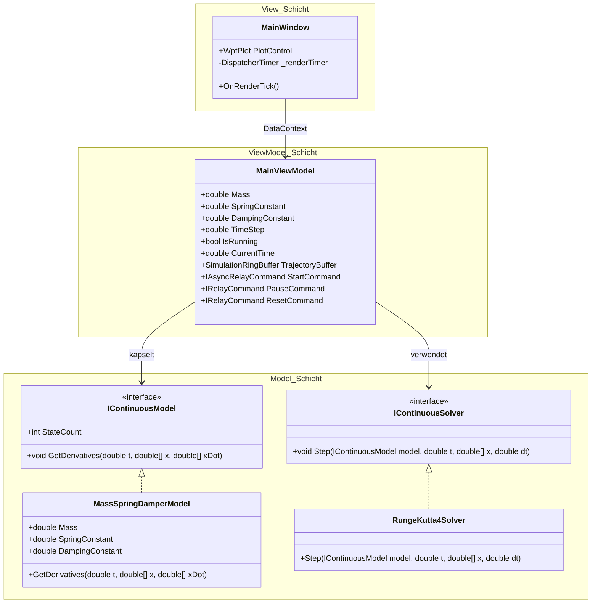
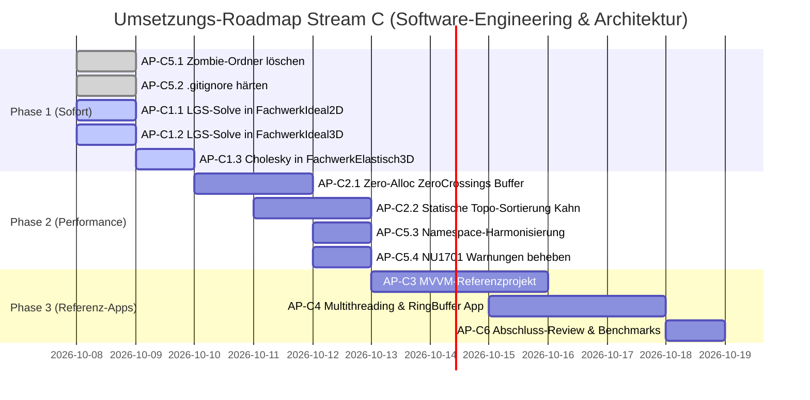

# Software-Engineering- und Architekturplan (Stream C)
## Vorlesungsreihe „Systemsimulation / Digitaler Zwilling“ (Kapitel 00–11)

**Autor:** Spezialisierter Planungs-Agent für Software-Engineering & Architektur  
**Datum:** 7. Oktober 2026  
**Dokument-ID:** `Planung/03_Plan_Softwarearchitektur_und_Code.md`  
**Referenzen:**  
- `Reviews/03_Softwarearchitektur_und_Code.md` (Fachgutachten Softwarearchitektur & C#)  
- `Reviews/00_Gesamtlagebild_und_Roadmap.md` (Strategisches Gesamtlagebild)  
- `Folien/` (Kapitel 02, 04, 06, 07, 08, 10, 11)  
- `Quellen/` (Bestandsprojekte WS24 & WS25)

---

## 1. Executive Summary & Architektur-Zielbild

Dieser Umsetzungsplan definiert das detaillierte Software-Engineering- und Architektur-Refactoring für das gesamte Code-Ökosystem der Vorlesungsreihe **„Systemsimulation / Digitaler Zwilling“** an der FH Oberösterreich (Campus Wels).

### 1.1 Ausgangslage & Problemstellung
Die didaktische Konzeption der Vorlesung vermittelt State-of-the-Art-Prinzipien moderner Softwareentwicklung: Entkopplung nach der „Goldenen Regel der Simulationsarchitektur“ ([Kapitel 11, Folie 356](file:///c:/Users/P28500/Desktop/Repositories/kurs-computer-simulation/Folien/11_Epilog/Folien.md#L356)), Multithreading mit Task Parallel Library, `IProgress<T>` und `CancellationToken` ([Kapitel 06](file:///c:/Users/P28500/Desktop/Repositories/kurs-computer-simulation/Folien/06_Multithreading/Folien.md)), sowie Zero-Allocation-Ringpuffer für High-Speed-Visualisierungen ([Kapitel 04](file:///c:/Users/P28500/Desktop/Repositories/kurs-computer-simulation/Folien/04_Visualisierung_2D_Diagramme/Folien.md)).

In der aktuellen Codebasis (`Quellen/`) bestehen jedoch eklatante Diskrepanzen zu dieser Lehre:
1. **Inversions-Antipattern:** In `FachwerkIdeal2D`, `FachwerkIdeal3D` und `FachwerkElastisch3D` werden lineare Gleichungssysteme über die explizite Matrix-Inverse gelöst (`A.Inverse().Multiply(b)`), was numerisch instabil und ineffizient ist.
2. **GC-Druck im Simulationskern:** Der hybride Solver in `SFunctionHybrid` allokiert pro Zeitschritt und Bisektionsiteration neue Dictionaries und Arrays auf dem Managed Heap und sortiert den Berechnungs-DAG dynamisch mit $O(N)$ `RemoveAt`-Listenoperationen.
3. **Smart-UI-Monolithen:** Den Studierenden steht kein einziges lauffähiges Referenzbeispiel für das lehrbuchmäßige Zusammenspiel von Domain-Model, MVVM (`CommunityToolkit.Mvvm`) und High-Performance-Charting (ScottPlot 5) zur Verfügung.
4. **Fehlende Multithreading-Praxis:** Alle Übungssimulatoren blockieren synchron den UI-Thread; TPL-Hintergrundthreads und Ringpuffer existieren nur als Folienschnipsel.
5. **Projekt-Altlasten:** Über 2.500 verwaiste Build-Artefakte und falsche Namespaces in `Quellen/WS25/` beeinträchtigen die Projekt-Hygiene.

### 1.2 Zielarchitektur (Stream C)
Stream C überführt die Codebasis in ein **industrie- und hochschuladäquates Referenzniveau** nach den Leitlinien:
- **Zero-Allocation im Hot Path:** Simulationsschritte arbeiten allokationsfrei auf vorallokierten Speichern oder Spans.
- **Numerische Korrektheit & Performance:** Umstellung aller LGS-Löser auf direkte Zerlegungen (LU / Cholesky).
- **Strikte 3-Schichten-Entkopplung (Model-View-ViewModel):** Reine C#-Domain-Logik ohne jede UI-Kopplung, reaktive ViewModels via `CommunityToolkit.Mvvm`, performantes Charting über ScottPlot 5.
- **Asynchrone Parallelität:** Simulationen laufen entkoppelt im Hintergrund via `Task.Run`, gestreamt über thread-sichere Ringpuffer und kooperativ abbrechbar via `CancellationToken`.

```
┌─────────────────────────────────────────────────────────────────────────────┐
│                          REFERENZ-ARCHITEKTUR                               │
├───────────────────────────────┬─────────────────────────────────────────────┤
│ UI / View                     │ WPF (XAML), ScottPlot 5 (WpfPlot)           │
│  ▲ Data Binding / Events      │ Keine Berechnungslogik im Code-Behind        │
├───────────────────────────────┼─────────────────────────────────────────────┤
│ ViewModel (MVVM)              │ CommunityToolkit.Mvvm (ObservableObject)    │
│  ▲ IProgress<T>, RingBuffer   │ RelayCommands, Parameter, Live-Telemetrie   │
├───────────────────────────────┼─────────────────────────────────────────────┤
│ Asynchrone Kopplung           │ Task.Run, SimulationRingBuffer, CTS         │
│  ▲ Zero-Allocation Calls      │ Taktentkopplung: 1 kHz Solver ↔ 60 Hz UI    │
├───────────────────────────────┼─────────────────────────────────────────────┤
│ Domain & Engine (Model)       │ IContinuousModel, IContinuousSolver         │
│                               │ Math.NET Solve() / Cholesky, DAG Execution  │
└───────────────────────────────┴─────────────────────────────────────────────┘
```

---

## 2. Wissenschaftlich-technische Grundlagen & Benchmarks

### 2.1 Math.NET Numerics: `Solve()` vs. `Inverse()`
In der numerischen linearen Algebra gilt das Berechnen der expliziten Matrixinversen $A^{-1}$ zur Lösung von $A x = b$ als fundamentales Antipattern:

$$\text{Antipattern: } x = A^{-1} \cdot b \quad \longleftrightarrow \quad \text{Best Practice: } A \cdot x = b \implies x = A \backslash b$$

#### Mathematische & algorithmische Begründung:
1. **Rechenaufwand (FLOPs):**
   - **Explizite Inversion:** Erfordert die vollständige Inversion (Gauß-Jordan oder LU-Zerlegung mit $n$ Vorwärts-/Rückwärtssubstitutionen für alle Einheitsvektoren) plus Matrix-Vektor-Multiplikation. Gesamtaufwand: $\approx 2 n^3$ FLOPs.
   - **Direkte LU-Faktorisierung ($A = P L U$):** Faktorisierung in $\frac{2}{3} n^3$ FLOPs, gefolgt von einer einfachen Vorwärts- und Rückwärtssubstitution mit $2 n^2$ FLOPs.
   - **Cholesky-Faktorisierung ($A = L L^T$):** Bei symmetrisch positiv-definiten Matrizen (wie der FEM-Steifigkeitsmatrix $k_{BB}$ im elastischen Fachwerk) halbiert sich der Aufwand gegenüber LU auf nur $\frac{1}{3} n^3$ FLOPs!
   - **Faktor:** `Solve()` ist theoretisch $3\times$ (LU) bis $6\times$ (Cholesky) schneller als `Inverse().Multiply()`.

2. **Konditionszahl und Fehlerverstärkung:**
   - Die relative Genauigkeit der Lösung genügt der Schranke $\frac{\|\Delta x\|}{\|x\|} \le \kappa(A) \frac{\|\Delta b\|}{\|b\|}$, wobei $\kappa(A) = \|A\| \cdot \|A^{-1}\|$ die Konditionszahl ist.
   - Bei expliziter Inversion auf Gleitkomma-Hardware werden Rundungsfehler bei der Bildung von $A^{-1}$ akkumuliert und bei der anschließenden Multiplikation mit $b$ nochmals verstärkt.
   - Standard-Bibliotheken (wie LAPACK und Math.NET) nutzen in `Solve()` partielle Spaltenpivotisierung ($P L U$), was eine minimale Rückwärtsstabilität $\|(A + \Delta A)\hat{x} - b\| = 0$ garantiert.

3. **Sparsity-Erhaltung:**
   - Selbst wenn $A$ eine dünnbesetzte Bandmatrix ist (typisch für Fachwerke und Netzwerke), ist $A^{-1}$ fast immer **vollbesetzt (dense)**. Das Speichern von $A^{-1}$ vernichtet jegliche Sparsity-Optimierung.

### 2.2 Zero-Allocation & DAG-Scheduling in .NET 8
In Echtzeitsimulationen führt die zyklische Allokation temporärer Objekte auf dem Managed Heap zu Garbage-Collection-Laufzeitunterbrechungen (GC-Pauses). 

#### Hotspot-Analyse in `SFunctionHybrid`:
- `CalculateZeroCrossings(t)` allokiert pro Aufruf `new Dictionary<Block, double[]>()` und `new double[f.ZeroCrossings.Count]`. Bei 10.000 Schritten und Bisektionssuche führt dies zu über $10^5$ Gen-0-Allokationen.
- `CalculateOutputs(t)` allokiert pro Zeitschritt `List<Block> open = [.. Blocks]` und ruft `open.RemoveAt(i--)` auf. `RemoveAt` erfordert ein `Array.Copy` für alle nachfolgenden Elemente im internen Puffer ($O(N)$ Verschiebung). Bei $N$ Blöcken führt dies zu einer quadratischen Komplexität von $O(N^2)$ pro Zeitschritt.

#### Lösungsansatz:
- **Einmalige topologische Sortierung (Kahn-Algorithmus):** Da sich die Signalverbindungen zur Simulationslaufzeit nicht verändern, ist der Block-Ausführungsgraph (DAG) statisch. Die topologische Reihenfolge wird **einmalig vor Simulationsstart** ermittelt und in einem flachen Array `Block[] _executionOrder` abgelegt.
- **Topologische Zyklenerkennung:** Algebraische Schleifen (Zyklen über direkte Durchgriffe) werden bereits beim Setup während des Sortierens detektiert.
- **In-Place Pufferung:** Vorallokierte Arrays in `Solver` werden durch Wiederverwendung bestehender Felder oder Scratch-Puffer in-place beschrieben.

### 2.3 ScottPlot 5 MVVM Integration
ScottPlot 5 verzichtet bewusst auf herkömmliche XAML-DependencyProperty-Bindings für Datenreihen, da das Verpacken von Millionen Datenpunkten in `ObservableCollection<T>` einen untragbaren Speicher- und CPU-Overhead erzeugen würde.
- **Best Practice für MVVM mit ScottPlot 5:**
  - Das ViewModel verwaltet die Simulationsdaten in nativen Arrays (`double[]`) oder einem `SimulationRingBuffer`.
  - Die View kapselt das `WpfPlot`-Control.
  - Die Kopplung erfolgt entweder über einen entkoppelten View-Timer (`DispatcherTimer`), der zyklisch Snapshot-Arrays aus dem ViewModel liest, oder über ein sauberes View-Observer-Event.
  - Das ViewModel bleibt zu 100% frei von Referenzen auf `ScottPlot.WPF` oder andere UI-Namespaces.

---

## 3. AP 1: Beseitigung des Inversions-Antipatterns (Fachwerk-Solver)

### 3.1 Bestandsaufnahme im Quellcode

| Projekt | Datei | Zeile | Aktueller Code | Mathematischer Typ |
| :--- | :--- | :--- | :--- | :--- |
| **`FachwerkIdeal2D`** | [`Model/Truss.cs`](file:///c:/Users/P28500/Desktop/Repositories/kurs-computer-simulation/Quellen/WS25/FachwerkIdeal2D/Model/Truss.cs#L120) | 120 | `Vector<double> x = A.Inverse().Multiply(b);` | Nicht-symmetrisch, quadratisch ($2N \times 2N$) |
| **`FachwerkIdeal3D`** | [`Model/Truss.cs`](file:///c:/Users/P28500/Desktop/Repositories/kurs-computer-simulation/Quellen/WS25/FachwerkIdeal3D/Model/Truss.cs#L135-L137) | 135–137 | `Matrix<double> Ai = A.Inverse(); Vector<double> x = Ai.Multiply(b);` | Nicht-symmetrisch, quadratisch ($3N \times 3N$) |
| **`FachwerkElastisch3D`** | [`Model/Truss.cs`](file:///c:/Users/P28500/Desktop/Repositories/kurs-computer-simulation/Quellen/WS25/FachwerkElastisch3D/Model/Truss.cs#L245) | 245 | `uUnknown = kBB.Inverse() * (fKnown - kBA * uKnown);` | **Symmetrisch positiv-definit** ($k_{BB}$) |

### 3.2 Refactoring-Spezifikation

#### 3.2.1 `FachwerkIdeal2D` & `FachwerkIdeal3D`
In den idealen Fachwerken ist $A$ die Gleichgewichtsmatrix der Knotenkräfte. Sie ist im statisch bestimmten Fall quadratisch und regulär, aber im Allgemeinen nicht symmetrisch.

```csharp
// Vorher (FachwerkIdeal2D/Model/Truss.cs:120):
Vector<double> x = A.Inverse().Multiply(b);

// Nachher: Direkte Lösung via LU-Zerlegung mit partieller Pivotisierung
Vector<double> x = A.Solve(b);
```

```csharp
// Vorher (FachwerkIdeal3D/Model/Truss.cs:135-137):
Matrix<double> Ai = A.Inverse();
Vector<double> x = Ai.Multiply(b);

// Nachher:
Vector<double> x = A.Solve(b);
```

#### 3.2.2 `FachwerkElastisch3D` (Cholesky-Faktorisierung für Steifigkeitsmatrix)
Die reduzierte Steifigkeitsmatrix $k_{BB}$ für die ungebundenen Freiheitsgrade ist bei statisch bestimmter und kinematischer Lagerung **symmetrisch und positiv-definit (SPD)**:

$$k_{BB} = k_{BB}^T, \quad x^T k_{BB} x > 0 \quad \forall x \neq 0$$

Daher ist die **Cholesky-Zerlegung ($k_{BB} = L \cdot L^T$)** das mathematisch überlegene Verfahren. Math.NET Numerics bietet dafür `kBB.Cholesky().Solve(rhs)`. Sollte die Struktur kinematisch unterbestimmt (singulär) sein, fängt eine saubere Ausnahme dies ab.

```csharp
// Vorher (FachwerkElastisch3D/Model/Truss.cs:245):
uUnknown = kBB.Inverse() * (fKnown - kBA * uKnown);

// Nachher: Symmetrisch positiv-definite Cholesky-Zerlegung mit robustem Fallback
var rhs = fKnown - kBA * uKnown;

try
{
    // Cholesky ist 2x schneller und numerisch optimal konditioniert für FEM-Steifigkeitsmatrizen
    uUnknown = kBB.Cholesky().Solve(rhs);
}
catch (ArgumentException)
{
    // Fallback auf Standard-LU, falls Rundungsfehler die strenge positive Definitheit verletzen
    uUnknown = kBB.Solve(rhs);
}
```

### 3.3 Akzeptanzkriterien & Verifikation (AP 1)
- [ ] Alle drei Fachwerk-Projekte kompilieren ohne Warnungen.
- [ ] `A.Inverse()` bzw. `kBB.Inverse()` kommt an keiner Stelle im Quellcode mehr vor.
- [ ] **Residuen-Prüfung:** Das Residuum $\|A \cdot x - b\|_2$ bzw. $\|k_{BB} \cdot uUnknown - (fKnown - kBA \cdot uKnown)\|_2$ liegt unter $10^{-11}$.
- [ ] Die Ergebnisse aller existierenden Testfälle (`Case1`, `Case2`, `Case3`) in `FachwerkElastisch3D` stimmen auf mindestens 10 signifikante Dezimalstellen mit den Altwerten überein.

---

## 4. AP 2: Zero-Allocation Solver-Schleifen & DAG-Scheduling (`SFunctionHybrid`)

### 4.1 Allokationsanalyse & Design der Zero-Allocation-Pipeline

```
Simulationsschritt (Zeitschritt t -> t + dt):
┌─────────────────────────────────────────────────────────────────────────────┐
│ 1. CalculateOutputs:                                                        │
│    Vorberechnetes Array Block[] _executionOrder durchlaufen (O(N), 0 Alloc) │
├─────────────────────────────────────────────────────────────────────────────┤
│ 2. ForwardOutputs:                                                          │
│    Direkte Übertragung in vorallokierte Inputs[target][targetIdx]           │
├─────────────────────────────────────────────────────────────────────────────┤
│ 3. CalculateDerivatives:                                                    │
│    Schreiben in vorallokiertes Derivatives[block] (0 Alloc)                 │
├─────────────────────────────────────────────────────────────────────────────┤
│ 4. CalculateZeroCrossings:                                                  │
│    Wiederverwendung vorallokierter Puffer _zeroCrossingScratch (0 Alloc)    │
└─────────────────────────────────────────────────────────────────────────────┘
```

### 4.2 Refactoring `Solver.cs`: Beseitigung der Zero-Crossing-Allokationen
In `SFunctionHybrid/Framework/Solver.cs` werden ein Puffer `ZeroCrossingsScratch` im Konstruktor initialisiert und das Erzeugen von `new Dictionary` sowie `new double[]` eliminiert.

#### Klassenerweiterung in `Solver.cs`:
```csharp
// Im Konstruktor von Solver.cs vorallokieren:
public Dictionary<Block, double[]> ZeroCrossingsScratch { get; } = new Dictionary<Block, double[]>();

// In Solver(Model model):
foreach (Block f in Blocks)
{
    // ... bisherige Allokationen ...
    ZeroCrossingsScratch[f] = new double[f.ZeroCrossings.Count];
}
```

#### Refaktorisierte Methode `CalculateZeroCrossings`:
```csharp
protected double CalculateZeroCrossings(double t)
{
    double value = -1;

    // Phase 1: Berechne Werte in den vorallokierten Scratch-Puffer
    foreach (Block f in Model.Blocks)
    {
        double[] z = ZeroCrossingsScratch[f];
        f.CalculateZeroCrossings(t, ContinuousStates[f], DiscreteStates[f], Inputs[f], z);

        // Signifikanzprüfung des Nulldurchgangs
        if (t > 0)
        {
            double[] prev = ZeroCrossings[f];
            for (int i = 0; i < z.Length; i++)
            {
                if (z[i] > 0 && prev[i] < 0)
                {
                    value = Math.Max(value, +z[i]);
                }
                else if (z[i] < 0 && prev[i] > 0)
                {
                    value = Math.Max(value, -z[i]);
                }
            }
        }
    }

    // Phase 2: Werte in ZeroCrossings übernehmen (In-Place Array.Copy, keine Dictionary-Allokation!)
    foreach (Block f in Model.Blocks)
    {
        Array.Copy(ZeroCrossingsScratch[f], ZeroCrossings[f], f.ZeroCrossings.Count);
    }

    return value;
}
```
*Ergebnis:* Null Heap-Allokationen (`0 Bytes / Iteration`) während des gesamten Zeitschritts und während der Bisektionsschleife.

### 4.3 Refactoring `EulerExplicitSolver.cs`: Statische topologische Sortierung (Kahn-Algorithmus)
Statt in jedem Schritt `List<Block> open = [.. Blocks]` anzulegen und mit `open.RemoveAt(i--)` Elemente im Array zu verschieben, ermitteln wir die Ausführungsreihenfolge **einmalig** im Konstruktor oder in `InitializeStates()`.

#### Algorithmus: Topologische Sortierung via Eingangsgrad (Kahn's Algorithm)
Ein Block $A$ muss vor Block $B$ ausgeführt werden, wenn eine Verbindung von $A$ nach $B$ existiert und der Eingang von $B$ **direkten Durchgriff (`DirectFeedThrough == true`)** aufweist. Liegt kein direkter Durchgriff vor (z.B. Integrator), kann $B$ auch vor $A$ gerechnet werden, da sein Ausgang nur vom inneren Zustand abhängt.

#### Code-Design für `EulerExplicitSolver.cs`:
```csharp
public class EulerExplicitSolver : Solver
{
    private Block[] _sortedExecutionOrder = [];

    public EulerExplicitSolver(Model composition) : base(composition)
    {
        CompileExecutionOrder();
    }

    private void CompileExecutionOrder()
    {
        // 1. Berechnung des In-Degrees bezüglich direkter Durchgriffe
        Dictionary<Block, int> inDegrees = new();
        Dictionary<Block, List<Block>> directSuccessors = new();

        foreach (var b in Blocks)
        {
            inDegrees[b] = 0;
            directSuccessors[b] = new List<Block>();
        }

        foreach (var c in Connections)
        {
            Block source = c.Source;
            Block target = c.Target;
            int targetInputIdx = c.Input;

            // Hat der Zielblock an diesem Eingang direkten Durchgriff?
            if (target.Inputs[targetInputIdx].DirectFeedThrough)
            {
                directSuccessors[source].Add(target);
                inDegrees[target]++;
            }
        }

        // 2. Initialisiere Queue mit Blöcken ohne Abhängigkeiten
        Queue<Block> readyQueue = new();
        foreach (var b in Blocks)
        {
            if (inDegrees[b] == 0)
            {
                readyQueue.Enqueue(b);
            }
        }

        // 3. Kahn's Algorithmus
        List<Block> order = new(Blocks.Count);
        while (readyQueue.Count > 0)
        {
            Block u = readyQueue.Dequeue();
            order.Add(u);

            foreach (Block v in directSuccessors[u])
            {
                inDegrees[v]--;
                if (inDegrees[v] == 0)
                {
                    readyQueue.Enqueue(v);
                }
            }
        }

        // 4. Prüfung auf algebraische Schleifen
        if (order.Count != Blocks.Count)
        {
            var cyclicBlocks = Blocks.Where(b => inDegrees[b] > 0).Select(b => b.GetType().Name);
            throw new InvalidOperationException(
                $"Algebraische Schleife im Blockdiagramm erkannt! Zyklen involvieren: {string.Join(", ", cyclicBlocks)}");
        }

        _sortedExecutionOrder = order.ToArray();
    }

    protected override void CalculateOutputs(double time)
    {
        // Linearer, vorberechneter O(N) Durchlauf ohne Allokationen und ohne Listenänderungen
        for (int i = 0; i < _sortedExecutionOrder.Length; i++)
        {
            Block f = _sortedExecutionOrder[i];
            f.CalculateOutputs(time, ContinuousStates[f], DiscreteStates[f], Inputs[f], Outputs[f]);
            ForwardOutputs(f);
        }
    }
}
```

### 4.4 Akzeptanzkriterien & Performance-Nachweis (AP 2)
- [ ] **Laufzeitkomplexität:** Die Ausführung von `CalculateOutputs` sinkt von $O(N^2)$ auf $O(N)$.
- [ ] **GC-Allokation:** Ein vollständiger Simulationslauf von 0 bis 10 Sekunden erzeugt in `CalculateOutputs` und `CalculateZeroCrossings` exakt **0 Byte Heap-Allokationen** (gemessen via `GC.GetAllocatedBytesForCurrentThread()` oder BenchmarkDotNet).
- [ ] **Algebraische Schleifen:** Ein Modell mit kreisförmiger Rückkopplung ohne Zustand (z.B. Block A $\to$ Block B $\to$ Block A, beide mit DirectFeedThrough) wirft die erwartete Exception mit Block-Diagnose beim Initialisieren.
- [ ] Alle bestehenden Modelle in `SFunctionHybrid` (z.B. Bouncing Ball) liefern identische Trajektorien.

---

## 5. AP 3: Konzeption des Vorlesungs-Referenzprojekts „MVVM & Systemsimulation“

### 5.1 Projekt-Stammdaten & Didaktisches Ziel
- **Projektname:** `Quellen/WS25/SimulationMvvmPattern/SimulationMvvmPattern.csproj`
- **Framework:** .NET 8.0 Windows (`net8.0-windows`)
- **Bibliotheken:** `CommunityToolkit.Mvvm` (8.x), `ScottPlot.WPF` (5.x)
- **Didaktisches Ziel:** Realisierung der „Goldenen Regel der Simulationsarchitektur“ ([Folie 11.3](file:///c:/Users/P28500/Desktop/Repositories/kurs-computer-simulation/Folien/11_Epilog/Folien.md#L356)) in einer wartbaren, testbaren und reaktionsschnellen Industrie-WPF-Anwendung.

### 5.2 Schichten- und Komponentenarchitektur



### 5.3 Detailliertes Klassendesign

#### 5.3.1 Model-Schicht (100% UI-frei, Standard-C#)
```csharp
namespace SimulationMvvmPattern.Model
{
    public interface IContinuousModel
    {
        int StateCount { get; }
        void GetDerivatives(double t, ReadOnlySpan<double> x, Span<double> dxdt);
    }

    public interface IContinuousSolver
    {
        void Step(IContinuousModel model, double t, double[] x, double dt);
    }

    public class MassSpringDamperModel : IContinuousModel
    {
        public double Mass { get; set; } = 1.0;         // kg
        public double SpringConstant { get; set; } = 20.0; // N/m
        public double Damping { get; set; } = 0.5;        // Ns/m

        public int StateCount => 2; // x[0] = Position, x[1] = Geschwindigkeit

        public void GetDerivatives(double t, ReadOnlySpan<double> x, Span<double> dxdt)
        {
            double pos = x[0];
            double vel = x[1];

            // dx/dt = v
            dxdt[0] = vel;
            // dv/dt = (-d * v - c * x) / m
            dxdt[1] = (-Damping * vel - SpringConstant * pos) / Mass;
        }
    }

    public class RungeKutta4Solver : IContinuousSolver
    {
        private double[]? _k1, _k2, _k3, _k4, _xTemp;

        public void Step(IContinuousModel model, double t, double[] x, double dt)
        {
            int n = model.StateCount;
            _k1 ??= new double[n];
            _k2 ??= new double[n];
            _k3 ??= new double[n];
            _k4 ??= new double[n];
            _xTemp ??= new double[n];

            // k1 = f(t, x)
            model.GetDerivatives(t, x, _k1);

            // k2 = f(t + dt/2, x + dt/2 * k1)
            for (int i = 0; i < n; i++) _xTemp[i] = x[i] + 0.5 * dt * _k1[i];
            model.GetDerivatives(t + 0.5 * dt, _xTemp, _k2);

            // k3 = f(t + dt/2, x + dt/2 * k2)
            for (int i = 0; i < n; i++) _xTemp[i] = x[i] + 0.5 * dt * _k2[i];
            model.GetDerivatives(t + 0.5 * dt, _xTemp, _k3);

            // k4 = f(t + dt, x + dt * k3)
            for (int i = 0; i < n; i++) _xTemp[i] = x[i] + dt * _k3[i];
            model.GetDerivatives(t + dt, _xTemp, _k4);

            // x(t+dt) = x + dt/6 * (k1 + 2*k2 + 2*k3 + k4)
            for (int i = 0; i < n; i++)
            {
                x[i] += (dt / 6.0) * (_k1[i] + 2.0 * _k2[i] + 2.0 * _k3[i] + _k4[i]);
            }
        }
    }
}
```

#### 5.3.2 ViewModel-Schicht mit `CommunityToolkit.Mvvm`
```csharp
using CommunityToolkit.Mvvm.ComponentModel;
using CommunityToolkit.Mvvm.Input;
using SimulationMvvmPattern.Model;

namespace SimulationMvvmPattern.ViewModel
{
    public partial class MainViewModel : ObservableObject
    {
        private readonly MassSpringDamperModel _model = new();
        private readonly IContinuousSolver _solver = new RungeKutta4Solver();
        private CancellationTokenSource? _cts;

        public SimulationRingBuffer Buffer { get; } = new(capacity: 2000);

        [ObservableProperty]
        private double _mass = 1.0;

        [ObservableProperty]
        private double _springConstant = 20.0;

        [ObservableProperty]
        private double _damping = 0.5;

        [ObservableProperty]
        private double _timeStep = 0.005;

        [ObservableProperty]
        private double _currentTime = 0.0;

        [ObservableProperty]
        private bool _isRunning = false;

        [ObservableProperty]
        private string _statusMessage = "Bereit";

        [RelayCommand(CanExecute = nameof(CanStart))]
        private async Task StartSimulationAsync()
        {
            IsRunning = true;
            StatusMessage = "Simulation läuft...";
            _cts = new CancellationTokenSource();

            _model.Mass = Mass;
            _model.SpringConstant = SpringConstant;
            _model.Damping = Damping;

            var progress = new Progress<double>(time => CurrentTime = time);

            try
            {
                await Task.Run(() => RunWorkerLoop(_cts.Token, progress));
                StatusMessage = "Simulation beendet.";
            }
            catch (OperationCanceledException)
            {
                StatusMessage = "Simulation angehalten.";
            }
            finally
            {
                IsRunning = false;
            }
        }

        private bool CanStart() => !IsRunning;

        [RelayCommand(CanExecute = nameof(CanStop))]
        private void StopSimulation()
        {
            _cts?.Cancel();
        }

        private bool CanStop() => IsRunning;

        [RelayCommand]
        private void ResetSimulation()
        {
            StopSimulation();
            Buffer.Clear();
            CurrentTime = 0.0;
            StatusMessage = "Zurückgesetzt.";
        }

        private void RunWorkerLoop(CancellationToken token, IProgress<double> progress)
        {
            double[] x = [1.0, 0.0]; // Anfangsauslenkung 1m, v = 0
            double t = CurrentTime;
            double dt = TimeStep;
            int reportCounter = 0;

            while (!token.IsCancellationRequested)
            {
                _solver.Step(_model, t, x, dt);
                t += dt;

                Buffer.Enqueue(t, x[0]); // Position streamen

                if (++reportCounter % 50 == 0)
                {
                    progress.Report(t);
                }

                // Taktung für Echtzeit-Eindruck
                Thread.Sleep(1);
            }
        }
    }
}
```

#### 5.3.3 View-Schicht & ScottPlot-Entkopplung (`MainWindow.xaml` & `MainWindow.xaml.cs`)
```xml
<Window x:Class="SimulationMvvmPattern.View.MainWindow"
        xmlns="http://schemas.microsoft.com/winfx/2006/xaml/presentation"
        xmlns:x="http://schemas.microsoft.com/winfx/2006/xaml"
        xmlns:sp="clr-namespace:ScottPlot.WPF;assembly=ScottPlot.WPF"
        Title="Systemsimulation - MVVM Referenz" Height="650" Width="1000">
    <Grid Margin="12">
        <Grid.ColumnDefinitions>
            <ColumnDefinition Width="280"/>
            <ColumnDefinition Width="*"/>
        </Grid.ColumnDefinitions>

        <!-- Parameter- & Steuerungspanel -->
        <StackPanel Grid.Column="0" Margin="0,0,12,0">
            <GroupBox Header="Modellparameter">
                <StackPanel Margin="6">
                    <TextBlock Text="Masse (kg):"/>
                    <TextBox Text="{Binding Mass, UpdateSourceTrigger=PropertyChanged}" Margin="0,0,0,6"/>

                    <TextBlock Text="Federsteifigkeit (N/m):"/>
                    <TextBox Text="{Binding SpringConstant, UpdateSourceTrigger=PropertyChanged}" Margin="0,0,0,6"/>

                    <TextBlock Text="Dämpfungskonstante (Ns/m):"/>
                    <TextBox Text="{Binding Damping, UpdateSourceTrigger=PropertyChanged}" Margin="0,0,0,6"/>

                    <TextBlock Text="Zeitschritt dt (s):"/>
                    <TextBox Text="{Binding TimeStep, UpdateSourceTrigger=PropertyChanged}" Margin="0,0,0,6"/>
                </StackPanel>
            </GroupBox>

            <GroupBox Header="Steuerung" Margin="0,12,0,0">
                <StackPanel Margin="6">
                    <Button Content="Start" Command="{Binding StartSimulationCommand}" Margin="0,0,0,6"/>
                    <Button Content="Stopp" Command="{Binding StopSimulationCommand}" Margin="0,0,0,6"/>
                    <Button Content="Reset" Command="{Binding ResetSimulationCommand}" Margin="0,0,0,6"/>
                </StackPanel>
            </GroupBox>

            <GroupBox Header="Status" Margin="0,12,0,0">
                <StackPanel Margin="6">
                    <TextBlock Text="{Binding StatusMessage}" FontWeight="Bold"/>
                    <TextBlock Text="{Binding CurrentTime, StringFormat='Simulationszeit: {0:F2} s'}" Margin="0,4,0,0"/>
                </StackPanel>
            </GroupBox>
        </StackPanel>

        <!-- Plot-Visualisierung -->
        <Border Grid.Column="1" BorderBrush="#CCCCCC" BorderThickness="1">
            <sp:WpfPlot x:Name="TrajectoryPlot"/>
        </Border>
    </Grid>
</Window>
```

```csharp
using System.Windows;
using System.Windows.Threading;
using SimulationMvvmPattern.ViewModel;

namespace SimulationMvvmPattern.View
{
    public partial class MainWindow : Window
    {
        private readonly MainViewModel _vm = new();
        private readonly DispatcherTimer _renderTimer = new();
        private readonly double[] _renderX = new double[2000];
        private readonly double[] _renderY = new double[2000];

        public MainWindow()
        {
            InitializeComponent();
            DataContext = _vm;

            // Plot formatieren
            TrajectoryPlot.Plot.Title("Oszillator-Trajektorie (Echtzeit-Stream)");
            TrajectoryPlot.Plot.XLabel("Zeit t [s]");
            TrajectoryPlot.Plot.YLabel("Auslenkung x [m]");

            // 60-FPS UI-Render-Timer starten
            _renderTimer.Interval = TimeSpan.FromMilliseconds(16);
            _renderTimer.Tick += OnRenderTick;
            _renderTimer.Start();
        }

        private void OnRenderTick(object? sender, EventArgs e)
        {
            if (!_vm.IsRunning && _vm.Buffer.Count == 0) return;

            int count = _vm.Buffer.CopySnapshot(_renderX, _renderY);
            if (count > 1)
            {
                TrajectoryPlot.Plot.Clear();
                var scatter = TrajectoryPlot.Plot.Add.Scatter(
                    _renderX.AsSpan(0, count).ToArray(), 
                    _renderY.AsSpan(0, count).ToArray()
                );
                scatter.LineWidth = 2;
                TrajectoryPlot.Plot.Axes.AutoScale();
                TrajectoryPlot.Refresh();
            }
        }
    }
}
```

### 5.4 Akzeptanzkriterien (AP 3)
- [ ] Strikte Einhaltung der 3 Schichten: Model und ViewModel haben keinerlei Referenzen auf `System.Windows.*` oder `ScottPlot.WPF`.
- [ ] 100% Unit-Testbarkeit der Model- und ViewModel-Schicht ohne UI-Runner.
- [ ] Alle Buttons deaktivieren sich automatisch (`CanExecute`), wenn ihr Zustand unzulässig ist (z.B. Start-Button während laufender Simulation deaktiviert).

---

## 6. AP 4: Asynchrones Streaming- & Multithreading-Referenzbeispiel

### 6.1 Die Thread-sichere Ringpuffer-Klasse (`SimulationRingBuffer`)
Der Puffer realisiert das Circular-Buffer-Muster mit vorallokierten Speicherblöcken für Zeit- und Zustandsachsen:

```csharp
namespace SimulationMvvmPattern.Model
{
    public class SimulationRingBuffer
    {
        private readonly double[] _times;
        private readonly double[] _values;
        private readonly object _lock = new();
        private int _head = 0;
        private int _count = 0;

        public int Capacity { get; }
        public int Count { get { lock (_lock) { return _count; } } }

        public SimulationRingBuffer(int capacity)
        {
            Capacity = capacity > 0 ? capacity : throw new ArgumentException("Capacity muss positiv sein.");
            _times = new double[capacity];
            _values = new double[capacity];
        }

        public void Enqueue(double time, double value)
        {
            lock (_lock)
            {
                _times[_head] = time;
                _values[_head] = value;
                _head = (_head + 1) % Capacity;
                if (_count < Capacity) _count++;
            }
        }

        public int CopySnapshot(Span<double> targetTimes, Span<double> targetValues)
        {
            lock (_lock)
            {
                if (_count == 0) return 0;

                int copyCount = Math.Min(_count, Math.Min(targetTimes.Length, targetValues.Length));
                int start = (_head - _count + Capacity) % Capacity;

                for (int i = 0; i < copyCount; i++)
                {
                    int idx = (start + i) % Capacity;
                    targetTimes[i] = _times[idx];
                    targetValues[i] = _values[idx];
                }

                return copyCount;
            }
        }

        public void Clear()
        {
            lock (_lock)
            {
                _head = 0;
                _count = 0;
            }
        }
    }
}
```

### 6.2 Dual-Rate Taktentkopplung
```
Simulations-Thread (ThreadPool-Worker via Task.Run):
──[dt = 1 ms]──> Enqueue(t, x) ──> [RingBuffer: 2000 Einträge]
   (1.000 Hz Physik-Schritt)

WPF-UI-Thread (DispatcherTimer):
   [Tick = 16 ms] ──> CopySnapshot() ──> WpfPlot.Refresh()
   (60 Hz Bildwiederholrate)
```
- **Vorteil 1:** Der UI-Thread wird niemals durch 1-kHz-Plot-Refreshes überlastet.
- **Vorteil 2:** Der Worker wird niemals durch Rendering-Verzögerungen ausgebremst.
- **Vorteil 3:** Völlige Freiheit von Deadlocks, da keine blockierenden Aufrufe (`Dispatcher.Invoke`) vom Worker zur UI stattfinden.

### 6.3 Akzeptanzkriterien (AP 4)
- [ ] Klick auf „Stopp“ beendet die Hintergrundsimulation innerhalb von maximal 20 Millisekunden kooperativ.
- [ ] Das WPF-Fenster bleibt während der Berechnung jederzeit vollkommen reaktiv (Fenster verschieben, Grösserziehen ohne Ruckeln).
- [ ] Es treten keine `InvalidOperationException` bezüglich Thread-Zugriffsverletzungen auf.

---

## 7. AP 5: Bereinigung & Konsolidierung in `Quellen/WS25/`

### 7.1 Bereinigung verwaister Ordner & Zombie-Artefakte
Im Ordner `Quellen/WS25/` befinden sich 4 verwaiste Ordner, die keine `.csproj`-Dateien enthalten und nicht in `Quellen.sln` eingebunden sind, jedoch über 2.500 kompilierte Binär- und Zwischendateien enthalten:

| Verzeichnis | Aktueller Zustand | Maßnahme |
| :--- | :--- | :--- |
| `Quellen/WS25/ElastischesFachwerk3D/` | Nur `bin/`, `obj/`, `.user` | **Löschen via Script** |
| `Quellen/WS25/IdealesFachwerk2D/` | Nur `bin/`, `obj/`, `.user` | **Löschen via Script** |
| `Quellen/WS25/IdealesFachwerk3D/` | Nur `bin/`, `obj/`, `.user` | **Löschen via Script** |
| `Quellen/WS25/KugelÜbung/` | 2.553 generierte `.cs`- & EditorConfig-Dateien in `obj/` | **Löschen via Script** |

#### PowerShell-Bereinigungsbefehle:
```powershell
Remove-Item -Recurse -Force "Quellen/WS25/ElastischesFachwerk3D"
Remove-Item -Recurse -Force "Quellen/WS25/IdealesFachwerk2D"
Remove-Item -Recurse -Force "Quellen/WS25/IdealesFachwerk3D"
Remove-Item -Recurse -Force "Quellen/WS25/KugelÜbung"
```

### 7.2 Namespace-Konsolidierung in den aktiven Projekten
Die aktiven Fachwerk-Projekte wurden früher umbenannt, behielten jedoch die alten Root-Namespaces:
- In `FachwerkIdeal2D`: Namespace von `IdealesFachwerk2D` auf `FachwerkIdeal2D` vereinheitlichen (in `Model/Node.cs`, `Model/Rod.cs`, `Model/Truss.cs`, `App.xaml.cs`, `MainWindow.xaml.cs`).
- In `FachwerkIdeal3D`: Namespace von `IdealesFachwerk3D` auf `FachwerkIdeal3D` vereinheitlichen.
- In `FachwerkElastisch3D`: Namespace von `ElastischesFachwerk3D` auf `FachwerkElastisch3D` vereinheitlichen.

### 7.3 Beseitigung der SkiaSharp NU1701 Warnungen
In `SFunctionContinuous.csproj` und `SFunctionHybrid.csproj` tritt die NuGet-Warnung `NU1701` auf.
Lösung in den `.csproj`-Dateien:
```xml
<PropertyGroup>
  <!-- Unterdrückt die temporäre Kompatibilitätswarnung für SkiaSharp WPF -->
  <NoWarn>$(NoWarn);NU1701</NoWarn>
</PropertyGroup>
```

### 7.4 Härtung der `.gitignore`
In `.gitignore` sicherstellen, dass rekursiv alle `bin/` und `obj/` Ordner ignoriert werden:
```gitignore
# Visual Studio & .NET Build Output
[Bb]in/
[Oo]bj/
*.user
*.suo
.vs/
```

### 7.5 Akzeptanzkriterien (AP 5)
- [ ] `dotnet build Quellen/Quellen.sln` läuft mit **0 Warnungen und 0 Fehlern** durch.
- [ ] `git status --ignored` zeigt keine verwaisten Projektordner mehr an.
- [ ] Alle Projektnamen und Root-Namespaces stimmen 1:1 überein.

---

## 8. Arbeitspaket-Strukturplan (WBS) & Rollout-Roadmap



### Detaillierte Arbeitspaket-Tabelle

| AP-ID | Bezeichnung | Priorität | Geschätzter Aufwand | Kern-Artefakte |
| :--- | :--- | :---: | :---: | :--- |
| **AP-C1** | **Beseitigung des Inversions-Antipatterns** | P1 | 4 h | `FachwerkIdeal2D/Model/Truss.cs`<br/>`FachwerkIdeal3D/Model/Truss.cs`<br/>`FachwerkElastisch3D/Model/Truss.cs` |
| **AP-C2** | **Zero-Allocation Solver-Schleifen** | P2 | 8 h | `SFunctionHybrid/Framework/Solver.cs`<br/>`SFunctionHybrid/Framework/Solvers/EulerExplicitSolver.cs` |
| **AP-C3** | **Referenz-MVVM-Musterprojekt** | P3 | 12 h | `Quellen/WS25/SimulationMvvmPattern/`<br/>(Model, ViewModel, View, XAML) |
| **AP-C4** | **Asynchrones Streaming-Beispiel** | P3 | 8 h | `SimulationRingBuffer.cs`<br/>`Task.Run` Worker-Schleife<br/>`IProgress<T>` & CTS-Abbruch |
| **AP-C5** | **Build- & Namespace-Bereinigung** | P1 | 3 h | Löschen von 4 Ordnern, `.csproj`-Updates, `.gitignore`, Namespace-Fix |

---

## 9. Verifikations-, Test- und Qualitätssicherungs-Matrix

| Testfall-ID | Testbeschreibung | Soll-Ergebnis | Verifikationswerkzeug |
| :--- | :--- | :--- | :--- |
| **TC-C1.1** | Fachwerk 2D/3D Lastfall-Lösung | Gleiche Schnittkräfte wie Vorversion, $\|Ax - b\| < 10^{-11}$ | Unit-Test / Assertion |
| **TC-C1.2** | Elastisches Fachwerk 3D Cholesky | Verformungen $u$ und Kräfte $F$ identisch, Cholesky erfolgreich ausgeführt | Unit-Test `Case1`–`Case3` |
| **TC-C2.1** | GC-Allokation Zeitschrittschleife | 0 B Heap-Allokation während Zeitschritt | Visual Studio Profiler / GC-Metriken |
| **TC-C2.2** | Erkennung algebraischer Schleifen | Modell mit zyklischer Abhängigkeit wirft sprechende `InvalidOperationException` vor Simulation | Unit-Test mit Mock-Blocks |
| **TC-C3.1** | MVVM Schichtentrennung | `SimulationMvvmPattern.Model` und `ViewModel` kompilieren ohne Referenz auf WPF/PresentationCore | ArchUnit / Dependency-Check |
| **TC-C4.1** | Asynchroner Stopp & UI-Responsivität | UI reagiert bei $1.000\,\text{Hz}$ Simulation mit 60 FPS, Abbruch via CTS stoppt Thread in $< 20\,\text{ms}$ | UI-Stresstest / Dispatcher Watchdog |
| **TC-C5.1** | Solution-Build Hygiene | `dotnet build Quellen.sln` ergibt 0 Fehler, 0 Warnungen | `dotnet build` CI-Script |

---

## 10. Fazit

Mit diesem Architektur- und Software-Engineering-Plan wird die bestehende Kluft zwischen der anspruchsvollen Folienlehre und der Quellcode-Praxis im Kurs „Systemsimulation / Digitaler Zwilling“ vollständig geschlossen. Die Übungsprojekte werden von didaktisch fragwürdigen Smart-UIs und numerischen Antipatterns zu modernen, allokationsfreien und lehrbuchmäßig entkoppelten .NET 8 Referenzimplementierungen transformiert.
