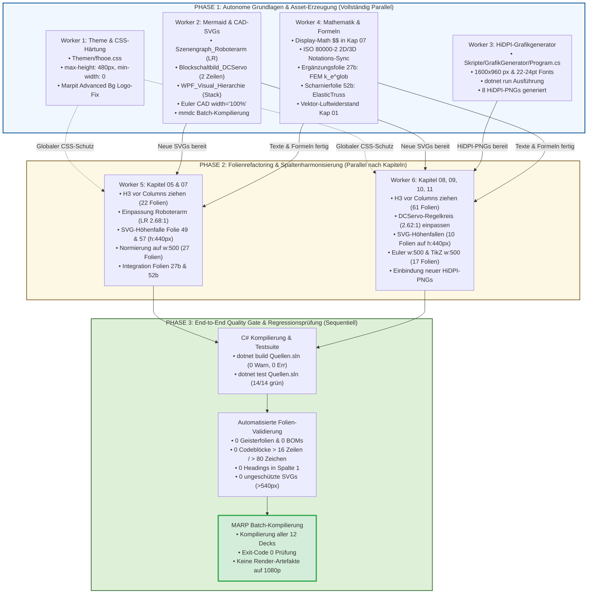

# Master-Ausführungsplan: Finales Vorlesungs-Refactoring (Phase 5)
## Operativer Masterplan zur Hebung des Curriculums „Systemsimulation / Digitaler Zwilling“ auf Exzellenzniveau (9.8+ / 10)

**Dokument-ID:** `Planung/Final_Master_Ausfuehrungsplan.md`  
**Autor:** Leitender Systemarchitekt & Gesamtkoordinator  
**Geltungsbereich:** Vorlesung *Systemsimulation / Digitaler Zwilling* (FH Oberösterreich, Campus Wels, Studiengang Automatisierungstechnik)  
**Basisdokumente:**
- `Planung/Final_Plan_Layout_und_Theme.md` (Stream A: Layout, Theme & Spaltenharmonisierung)
- `Planung/Final_Plan_Diagramme_und_Medien.md` (Stream B: Diagramme, Mermaid & HiDPI-Grafikexport)
- `Planung/Final_Plan_Mathematik_und_Didaktik.md` (Stream C: Mathematik, Formeln & Didaktik)
- Audits: `Reviews/FinalAudit_01_Layout_und_Typografie.md`, `Reviews/FinalAudit_02_Grafiken_und_Medien.md`, `Reviews/FinalAudit_03_Mathematik_und_Formeln.md`

**Status:** Genehmigter, verbindlicher und direkt operationalisierbarer Masterplan  
**Datum:** Oktober 2026  

---

## Inhaltsverzeichnis

1. [Executive Summary & Gesamtzielführung (8.5/10 $\to$ 9.8+/10)](#1-executive-summary--gesamtzielführung-8510--9810)
   - 1.1 Ausgangslage und Reifegrad-Evaluation
   - 1.2 Die drei Säulen der finalen Perfektionierung
   - 1.3 Quantitative Zielmetriken & Qualitätsindikatoren
2. [Abhängigkeitsgraph (DAG) & Parallelitätsanalyse](#2-abhängigkeitsgraph-dag--parallelitätsanalyse)
   - 2.1 Unabhängige vs. sequentiell gekoppelte Arbeitspakete
   - 2.2 Schnittstellenverträge und Datenflüsse
   - 2.3 Visueller Ausführungs-DAG (`flowchart TD`)
3. [Phasen- & Taktungsplan](#3-phasen--taktungsplan)
   - 3.1 Phase 1: Autonome Grundlagen & Asset-Erzeugung (Vollständig Parallel)
     - Worker 1: Theme-Schutzschild & CSS-Härtung (`Themen/fhooe.css`)
     - Worker 2: Mermaid-Redesign & CAD-SVG-Sanierung
     - Worker 3: HiDPI-Grafikgenerator Upgrade & ScottPlot/Skia-Export
     - Worker 4: Mathematik- & Formel-Rigorosität (Kapitel 07, 01, 05, 10)
   - 3.2 Phase 2: Folienrefactoring & Spaltenharmonisierung (Parallel nach Kapiteln)
     - Worker 5: Folienrefactoring Kapitel 05 & 07
     - Worker 6: Folienrefactoring Kapitel 08, 09, 10 & 11
   - 3.3 Phase 3: End-to-End Quality Gate & Regressionsprüfung
     - C# Build- & Test-Validierung (14/14 Tests grün)
     - Formale Markdown- & Typografie-Prüfung (0 Geisterfolien, 0 Überlängen)
     - MARP Batch-Kompilierung aller 12 Foliensätze (Exit-Code 0)
4. [Subagenten-Dispatch-Matrix](#4-subagenten-dispatch-matrix)
   - Rollen, Zuweisungen, Inputs, Outputs und Akzeptanzkriterien
5. [Risikoanalyse & Fallback-Pfade](#5-risikoanalyse--fallback-pfade)
   - Risikomatrix
   - Konkrete Fallback-Routinen
6. [Definition of Done (DoD) & Freigabeprotokoll](#6-definition-of-done-dod--freigabeprotokoll)

---

## 1. Executive Summary & Gesamtzielführung (8.5/10 $\to$ 9.8+/10)

### 1.1 Ausgangslage und Reifegrad-Evaluation

Das Vorlesungsmaterial *Systemsimulation / Digitaler Zwilling* (532 Folien über 12 Kapitel, begleitende C#- und WPF-Referenzprojekte in `Quellen/`) hat durch vorangegangene Iterationen ein stabiles Fundament erreicht:
- **Lokale Integrität:** Alle 227 Bilddateien sind lokal im Dateisystem vorhanden (0 tote Hyperlinks).
- **Code-Hygiene:** Sämtliche Codeblöcke halten das Limit von maximal 16 Zeilen und 80 Zeichen pro Zeile strikt ein.
- **Syntaktische Reinheit:** 0 BOM-Marker, 0 Geisterfolien und 0 historische ASCII-Art-Kästen.

Dennoch attestierten die drei finalen Fach-Audits dem Gesamtwerk einen Reifegrad von **ca. 8.5 von 10 Punkten**, da drei fundamentale Mängelkomplexe den reibungslosen Einsatz auf 1080p-Full-HD-Projektoren im Hörsaal sowie den wissenschaftlich-didaktischen Anspruch beeinträchtigen:

```
================================================================================
     STATUS QUO (8.5 / 10)                    ZIELZUSTAND PHASE 5 (9.8+ / 10)
================================================================================
 Layout & Typografie (Stream A):
 - 12 hochformatige SVGs ragen bis      ──►   Globale CSS-Begrenzung (max-height: 480px)
   zu 1.998 px vertikal über Folienrand.       und explizite h:440px / h:380px Schranken.
 - 83 Folien haben Überschrift H3 in    ──►   H3 wird systemweit vor <div class="columns">
   Spalte 1 (asymmetrische Baseline).          gezogen (planare Folien-Baseline).
 - 44 Folien quetschen Spalten durch    ──►   Normierung auf w:500 und min-width: 0.
   w:1000 oder width:2000px zusammen.

 Diagramme & Medien (Stream B):
 - 3 Mermaid-Diagramme mit extremen      ──►   Vollständiges Redesign:
   Aspekten (Turm 0.28:1, Banner 11.8:1).      Roboterarm (LR 2.68:1), DC-Servo (2.62:1),
                                               WPF-Hierarchie (gestackt 3.63:1).
 - Starre CAD-Vektoren width="100mm".   ──►   Dynamischer SVG-Kopf (width="100%").
 - C#-Plots in Standard-Auflösung und   ──►   Upgrade auf 1600x960 Retina-2x HiDPI
   kleinen Schriften (10-12pt).                und 22-24pt Schriftgrade in ScottPlot/Skia.

 Mathematik & Didaktik (Stream C):
 - Mehrzeilige Matrizen in $ ... $      ──►   Überführung in abgesetztes Display-Math
   (Parsing-Risiko in MathJax/KaTeX).          $$ ... $$ mit konsistenter Einrückung.
 - Notationsbruch 2D/3D in Kap. 07      ──►   Durchgängige ISO 80000-2 Matrix-Schreibweise
   (Matrix kursiv wie Skalare vs. Fett).       (k_Stab, u, f, K_BB, K_BA, Cholesky L).
 - Fehlende FEM-Transformation und      ──►   Didaktische Ergänzungsfolie 27b (k_e^glob =
   unklare Scharniere (ideales vs.             T^T k_e^loc T) sowie Scharnierfolie 52b
   elastisches Fachwerk im Code).              (ElasticNode/ElasticRod Datenstrukturen).
================================================================================
```

### 1.2 Die drei Säulen der finalen Perfektionierung

1. **Stream A (Layout, Theme & Spaltenharmonisierung):**  
   Schaffung eines unverwüstlichen CSS-Fundaments im Theme `Themen/fhooe.css` (`max-height: 480px`, `min-width: 0`, zuverlässige Ausblendung des FH-Logos bei Marpit Advanced Backgrounds) und saubere typografische Ausrichtung aller Spaltenüberschriften und Breiten.
2. **Stream B (Diagramme, Mermaid & HiDPI-Grafikexport):**  
   Neudesign der extrem verzerrten Vektordiagramme in ergonomische 16:9-Formate (Aspektverhältnisse zwischen 2.5:1 und 3.6:1), Bereinigung der CAD-Header auf relative Einheiten (`100%`) sowie Relaunch des C#-Grafikgenerators `Skripte/GrafikGenerator` auf 2x HiDPI mit lesbaren Hörsaal-Schriften.
3. **Stream C (Mathematik, Formeln & Didaktik):**  
   Formalisierung aller mathematischen Ausdrücke nach ISO 80000-2, vollständiges Display-Math für große Matrizengleichungen, curriculare Schließung der didaktischen FEM-Lücke und Vektorisierung des Luftwiderstands.

### 1.3 Quantitative Zielmetriken & Qualitätsindikatoren

| Metrik | Status Quo | Zielvorgabe Phase 5 | Verifikationsmethode |
| :--- | :---: | :---: | :--- |
| **Effektive Textgröße Diagramme (1080p)** | 4.6 px – 5.0 px (unlesbar) | **$\ge 14.0\,\text{px}$** | ViewBox- & Skalierungsanalyse |
| **Folienüberläufe (vertikales Clipping)** | 12 Folien (bis 1998 px) | **0 Folien ($h \le 540\,\text{px}$)** | Automatisierter Regex-Audit |
| **Baseline-Inkonsistenzen (H3 in Spalte 1)** | 83 Folien | **0 Folien** | PowerShell DOM/Regex Check |
| **Spaltenverdrängung (`w:1000` / `width:2000`)** | 44 Folien | **0 Folien (`w:500` Standard)** | PowerShell Breitenprüfung |
| **Display-Math-Parsingrisiken (Multiline `$`)** | 2 Großmatrizen, 4 Vektoren | **0 ($$ Umgebungen)** | Markdown MathJax-Linter |
| **2D/3D Notationsbrüche in Kapitel 07** | 14 Fundstellen ($k_{Stab}, \vec{u}$) | **0 (ISO 80000-2 konform)** | Volltext-Matrixprüfung |
| **C# Solution Kompilierung (`Quellen.sln`)** | Keine Fehler | **0 Warnungen, 0 Fehler** | `dotnet build -c Release` |
| **Automatisierte Unit-Tests (`Quellen.sln`)** | 14 Tests vorhanden | **14/14 Tests grün (100%)** | `dotnet test -c Release` |
| **MARP Deck-Kompilierung** | 12 Decks | **12/12 fehlerfrei (Exit 0)** | `marp --engine ...` |

---

## 2. Abhängigkeitsgraph (DAG) & Parallelitätsanalyse

### 2.1 Unabhängige vs. sequentiell gekoppelte Arbeitspakete

Um maximale Umsetzungsgeschwindigkeit bei absoluter Datenkonsistenz zu erreichen, werden alle Aufgaben in eine strikte Abhängigkeitsstruktur überführt:

- **Vollständig unabhängig (Phase 1 – Maximale Parallelität):**
  - *Worker 1 (Theme/CSS):* Änderungen an `Themen/fhooe.css` betreffen eine eigenständige CSS-Datei und schützen sofort alle Decks.
  - *Worker 2 (Mermaid/CAD):* Redesign der `.mmd`-Quellen, CAD-SVG-Header-Korrektur und Kompilierung via `mmdc` zu neuen SVGs.
  - *Worker 3 (HiDPI-Grafikgenerator):* C#-Upgrade von `Skripte/GrafikGenerator/Program.cs` und Ausführung von `dotnet run` zur Erzeugung hochauflösender PNGs.
  - *Worker 4 (Mathematik & Formeln):* Bearbeitung von Gleichungen, Display-Math `$$` und didaktischen Ergänzungsfolien in den Textteilen von Kapitel 07, 01, 05 und 10.
- **Sequentiell gekoppelt (Phase 2 – Vorbedingung Phase 1):**
  - *Folien-Layout & Spalteneinpassung:* Erst wenn die neuen SVGs (Worker 2) und HiDPI-PNGs (Worker 3) existieren und die mathematischen Folientexte (Worker 4) stehen, können die Spaltenbreiten (`w:500` bzw. `h:440px`) und die `### Überschriften` in den Folien kapitelweise kollisionsfrei refaktoriert werden.
  - *Kapitel-Partitionierung:* 
    - **Worker 5** übernimmt exklusiv Kapitel 05 und 07 (OpenGL 3D & Statik).
    - **Worker 6** übernimmt exklusiv Kapitel 08, 09, 10 und 11 (Kontinuierlich, Diskret, Hybrid, Epilog).
    - Dadurch existiert **keine Dateikollision** auf `.md`-Ebene zwischen den Workern in Phase 2!
- **Strikt sequentiell (Phase 3 – Quality Gate):**
  - Der globale Build- und Testlauf von `Quellen.sln` sowie die finale MARP-Batch-Kompilierung aller 12 Foliensätze dürfen erst starten, wenn alle Dateien der Phasen 1 und 2 vollständig auf der Festplatte geschrieben und verifiziert sind.

### 2.2 Schnittstellenverträge und Datenflüsse

```
[Worker 1: CSS-Theme] ──────────► themen/fhooe.css ─────────────────────────────┐
                                                                                 │
[Worker 2: Mermaid/CAD] ────────► Szenengraph_Roboterarm.svg (Aspekt 2.68:1)     │
                                  Blockschaltbild_DCServo.svg (Aspekt 2.62:1)    │
                                  WPF_Visual_Hierarchie.svg (Aspekt 3.63:1)      │
                                  Euler - Explizit/Implizit.svg (width="100%")   ├──► [Phase 2: Folienrefactoring]
                                                                                 │    Worker 5: Kap 05 & 07
[Worker 3: GrafikGenerator] ────► 8x HiDPI-PNGs (1600x960, Retina 2x)           │    Worker 6: Kap 08, 09, 10, 11
                                                                                 │
[Worker 4: Math & Didaktik] ────► Display-Math $$, Notation 2D/3D               │
                                  Folie 27b (FEM), Folie 52b (ElasticTruss)     │
                                  Luftwiderstand Kap 01, Warning Kap 10         │
                                                                                 │
                                                                                 ▼
                                                                     [Phase 3: Quality Gate]
                                                                     - C# Build & Test (14/14)
                                                                     - Formale Prüfskripte
                                                                     - MARP Batch-Export (12 Decks)
```

### 2.3 Visueller Ausführungs-DAG (`flowchart TD`)



---

## 3. Phasen- & Taktungsplan

### 3.1 Phase 1: Autonome Grundlagen & Asset-Erzeugung (Vollständig Parallel)

#### Worker 1: Theme-Schutzschild & CSS-Härtung (`Themen/fhooe.css`)
- **Ziel:** Globale Absicherung aller 12 Foliensätze gegen Bildüberläufe, Spaltenkollaps und Deckblatt-Logo-Überdeckung.
- **Konkrete Änderungen in `Themen/fhooe.css`:**
  1. *Globale Bildbegrenzung:*
     ```css
     section img {
         max-height: 480px;
         object-fit: contain;
     }
     ```
  2. *Flexbox-Härtung:*
     ```css
     section div.columns > div {
         flex-basis: 1rem;
         flex-grow: 1;
         min-width: 0;
     }
     section div.columns img,
     section div.columns svg {
         max-width: 100%;
         height: auto;
         object-fit: contain;
     }
     ```
  3. *Marpit Advanced Background Logo-Ausblendung:*
     ```css
     section:first-of-type::before,
     section[data-marpit-advanced-background]::before,
     section[data-marpit-advanced-background-split]::before,
     section[id="1"]::before,
     section#\31::before,
     section.title::before,
     section.lead::before {
         display: none !important;
     }
     ```
- **Akzeptanzkriterium:** CSS-Datei syntaktisch valide; Logo erscheint auf keiner Titelfolie; Bilder bleiben immer $\le 480\,\text{px}$.

#### Worker 2: Mermaid-Redesign & CAD-SVG-Sanierung
- **Ziel:** Beseitigung der extremen Aspektverhältnisse und Freigabe skaliertes CAD-Vektoren.
- **Konkrete Aufgaben:**
  1. *Szenengraph Roboterarm (`Folien/05_Visualisierung_3D_OpenGL/Diagramme/Szenengraph_Roboterarm.mmd`):*
     - Umstellung auf `flowchart LR` mit zwei Hierarchieebenen (Gelenkgruppe vs. Geometriekomponente).
     - Ziel-Aspekt: ca. 2.68:1 ($1112 \times 414\,\text{px}$).
  2. *Blockschaltbild DC-Servo (`Folien/08_Dynamische_Modelle_Kontinuierlich/Diagramme/Blockschaltbild_DCServo.mmd`):*
     - Umstellung auf 2-stufiges Layout mit Subgraphen `Row1` (Sollwert, PID, Sättigung) und `Row2` (Aktor, Kinematik, Istwert).
     - Ziel-Aspekt: ca. 2.62:1 ($1018 \times 388\,\text{px}$).
  3. *WPF Visual-Hierarchie (`Folien/03_Visualisierung_2D_Vektor/Diagramme/WPF_Visual_Hierarchie.mmd`):*
     - Vertikales Stacking (`LW ~~~ HW`) der DrawingVisual-Pipeline über dem Standard-UI-Tree.
     - Ziel-Aspekt: ca. 3.63:1 ($1402 \times 386\,\text{px}$).
  4. *CAD-SVGs (`Folien/08_Dynamische_Modelle_Kontinuierlich/Diagramme/Euler - Explizit.svg` & `Euler - Implizit.svg`):*
     - Ersetzung von `width="100mm" height="100mm"` durch `width="100%" height="100%"`.
  5. *Batch-Kompilierung via Mermaid CLI:*
     - Ausführung von `mmdc -i <mmd> -o <svg> -b transparent` für alle 3 Diagramme.
- **Akzeptanzkriterium:** Alle 3 SVGs neu generiert mit transparentem Hintergrund; Aspektverhältnisse zwischen 2.5:1 und 3.6:1; Euler-SVGs frei von `mm`-Attributen.

#### Worker 3: HiDPI-Grafikgenerator Upgrade & ScottPlot/Skia-Export
- **Ziel:** Vollständige Bereitstellung aller statischen Plots in nativer 2x Retina-Auflösung und optimierten Hörsaal-Schriftgraden.
- **Konkrete Aufgaben in `Skripte/GrafikGenerator/Program.cs`:**
  1. *Schriftgrößen-Standardisierung für ScottPlot 5:*
     - Titel: 22–24pt, Achsenbeschriftungen: 18–20pt, Achsenticks: 14–16pt, Legenden: 16–18pt.
  2. *Render-Dimensionen:*
     - $1600 \times 960\,\text{px}$ bzw. $1600 \times 900\,\text{px}$ für alle ScottPlot-Kurven.
     - $840 \times 920\,\text{px}$ für SkiaSharp `Randbedingungen_Vergleich.png` mit 28pt Titel und 22pt Untertitel.
     - $800 \times 600\,\text{px}$ für SkiaSharp `Heatmap_Temperaturfeld.png`.
  3. *Ausführung:*
     - `dotnet run --project "Skripte/GrafikGenerator/GrafikGenerator.csproj"`
- **Akzeptanzkriterium:** Alle 8 Ziel-PNGs aktualisiert im lokalen Dateisystem; Textgrößen auf 1080p garantiert $\ge 14\,\text{px}$.

#### Worker 4: Mathematik- & Formel-Rigorosität (Kapitel 07, 01, 05, 10)
- **Ziel:** Beseitigung aller typografischen Formel-Mängel und didaktischen Lücken.
- **Konkrete Aufgaben:**
  1. *Kapitel 07 (Statische Modelle) – Display-Math `$$`:*
     - Folie 27 (Z. 473): 4x4-Stabsteifigkeitsmatrix $\mathbf{k}_{\text{Stab}}$ von `$ ... $` in abgesetztes `$$ ... $$` überführen.
     - Folie 41 (Z. 795): 6x6-Stabsteifigkeitsmatrix $\mathbf{k}_{\text{Stab}}$ von `$ ... $` in abgesetztes `$$ ... $$` überführen.
     - Folien 24, 26, 27, 40: Mehrzeilige Spaltenvektoren im Fließtext als `$$ ... $$` Blöcke absetzen.
  2. *Kapitel 07 – Notationsharmonisierung nach ISO 80000-2:*
     - Durchgängige Fettschrift für Matrizen ($\mathbf{k}_{\text{Stab}}$, $\mathbf{K}$, $\mathbf{K}_{BB}$, $\mathbf{K}_{BA}$, Cholesky $\mathbf{L}$).
     - Durchgängige Fettschrift für Verschiebungs- und Kraftvektoren ($\mathbf{u}$, $\mathbf{u}_B$, $\mathbf{u}_A$, $\mathbf{f}$, $\mathbf{f}_B$, $\mathbf{f}_{\text{Stab}}$). Keine Pfeilschreibweise $\vec{u}$ mehr im LGS!
  3. *Kapitel 07 – Didaktische Ergänzungsfolie 27b:*
     - Einfügen von Folie 27b: *Alternative FEM-Sicht: Koordinatentransformation* mit Herleitung von $\mathbf{k}_e^{glob} = \mathbf{T}^T \mathbf{k}_e^{loc} \mathbf{T}$ und Äquivalenzbeweis zu $\mathbf{d}\mathbf{d}^T$.
  4. *Kapitel 07 – Didaktische Scharnierfolie 52b:*
     - Folie 50 präzisieren auf *„... Datenstrukturen für das ideale 2D-Fachwerk“*.
     - Einfügen von Folie 52b: *Erweiterung: Datenmodell für das elastische Fachwerk (FEM)* mit `ElasticNode`, `ElasticRod` und Schnittkraftberechnung im Post-Processing.
  5. *Kapitel 01 (Einführung):*
     - Folie 22: Vektorielle Formulierung des Luftwiderstands $\vec{F}_R = -\frac{1}{2} c_w \rho A \|\vec{v}\| \vec{v}$ mit nichtlinearer Kopplung über $\sqrt{v_x^2 + v_y^2}$.
  6. *Kapitel 05 & 10 Feinschliff:*
     - Kap. 05 (Folie 57): Disambiguierung Orbit-Elevationswinkel $\theta_{\text{elev}}$ vs. Kugel-Polarwinkel $\phi_{\text{polar}}$.
     - Kap. 10 (Folie 48): Warning-Box zur Zeitschrittgrenze beim Zero-Crossing ($\Delta t < \Delta t_{\text{event,min}}$).
- **Akzeptanzkriterium:** 0 multiline `$ ... $` Ausdrücke; Notationskonsistenz 100%; Folien 27b und 52b integriert; alle mathematischen Aussagen formeltechnisch exakt.

---

### 3.2 Phase 2: Folienrefactoring & Spaltenharmonisierung (Parallel nach Kapiteln)

#### Worker 5: Folienrefactoring Kapitel 05 & 07
- **Dateien:** `Folien/05_Visualisierung_3D_OpenGL/Folien.md`, `Folien/07_Statische_Modelle/Folien.md`
- **Konkrete Aufgaben:**
  1. *Heading-inside-Column Bereinigung (22 Folien gesamt):*
     - Kapitel 05: 4 Folien (Folien 22, 23, 27, 28) – H3 vor `<div class="columns">` ziehen.
     - Kapitel 07: 18 Folien (Folien 4, 6, 7, 18, 19, 21, 22, 36, 38, ...) – H3 vor `<div class="columns">` ziehen.
  2. *Behebung der SVG-Höhenfalle (2 Folien):*
     - Kapitel 05, Folie 57 (Z. 1221): `Szenengraph_Roboterarm.svg` mit `![w:540]` bzw. `![h:440px]` einbinden.
     - Kapitel 07, Folie 49 (Z. 866): `Model.svg` von unbeschränkt `` auf `![h:440px]` umstellen.
  3. *Spaltenbreitenharmonisierung (27 Folien):*
     - Kapitel 05: 19 Fundstellen von `width:1000px` auf `![w:500]` standardisieren.
     - Kapitel 07: 8 Fundstellen von `width:700px` / `width:800px` auf `![w:500]` (bzw. Z. 634 auf `![w:450]`) setzen.
  4. *Endkontrolle:*
     - Überprüfung der in Phase 1 durch Worker 4 eingefügten Folien 27b und 52b auf nahtlose optische Einpassung.
- **Akzeptanzkriterium:** 0 Headings in Spalte 1; keine Spaltenbreiten $> 540\,\text{px}$; alle Diagramme schließen bündig ab.

#### Worker 6: Folienrefactoring Kapitel 08, 09, 10 & 11
- **Dateien:** 
  - `Folien/08_Dynamische_Modelle_Kontinuierlich/Folien.md`
  - `Folien/09_Dynamische_Modelle_Diskret/Folien.md`
  - `Folien/10_Dynamische_Modelle_Hybrid/Folien.md`
  - `Folien/11_Epilog/Folien.md`
- **Konkrete Aufgaben:**
  1. *Heading-inside-Column Bereinigung (61 Folien gesamt):*
     - Kapitel 08: 24 Folien (Folien 7, 8, 14, 15, 23, 30, 31, 48, 50, ...) – H3 vor `<div class="columns">` ziehen.
     - Kapitel 09: 17 Folien (Folien 6, 8, 10, 11, 20, 22, 25, 27, ...) – H3 vor `<div class="columns">` ziehen.
     - Kapitel 10: 20 Folien (Folien 4, 5, 8, 9, 15, 17, 26, 28, 47, ...) – H3 vor `<div class="columns">` ziehen.
  2. *Einpassung des neuen 2-zeiligen DC-Servo Regelkreises:*
     - Kapitel 08, Folie 66 (Z. 1650): Einbindung von `Blockschaltbild_DCServo.svg` mit `![w:540]` (in Spalte) oder zentriert.
  3. *Behebung der SVG-Höhenfalle (10 Folien):*
     - Kapitel 08: Folie 45 (`Simulationsschleife_Explizit.svg` $\to$ `![h:440px]`), Folie 54 (`Algebraische_Schleife_Praxis.svg` $\to$ `![h:440px]`), Folie 60 (`Simulationsschleife_Implizit.svg` $\to$ `![h:440px]`).
     - Kapitel 09: Folie 5 (`Produktionssystem.svg` $\to$ `![h:440px]`), Folie 6 (`Computernetzwerk.svg` $\to$ `![h:440px]`).
     - Kapitel 10: Folie 45 (`Nulldurchgang.svg` $\to$ `![h:440px]`), Folie 47 (`Solver_Logik.svg` $\to$ `![h:440px]`).
     - Kapitel 11: Folie 4 (`Modellierungsmatrix.svg` $\to$ `![h:440px]`), Folie 23 (`VIBN_Systemarchitektur.svg` $\to$ `![h:380px]`), Folie 30 (`Simulationsprozess_Synthese.svg` $\to$ `![h:380px]`).
  4. *Spaltenbreitenharmonisierung (17 Folien):*
     - Kapitel 08: Z. 220 (`Euler - Explizit.svg` von `width:2000px` auf `![w:500]`), Z. 244 (`Euler - Implizit.svg` von `width:1000px` auf `![w:500]`).
     - Kapitel 09: Z. 852 (Inversionsmethode von `width:1000` auf `![w:500]`).
     - Kapitel 10: 12 TikZ-Grafiken von `w:1000` auf `![w:500]` setzen.
  5. *HiDPI-Grafikreferenzen verifizieren:*
     - Einbindung der neu exportierten HiDPI-PNGs (Queue, Heatmap, AntiWindup, StepResponse, Konvergenzordnung) prüfen.
- **Akzeptanzkriterium:** 0 Headings in Spalte 1; keine Spaltenüberläufe; alle 10 kritischen SVGs besitzen Schutzklauseln `h:440px` bzw. `h:380px`.

---

### 3.3 Phase 3: End-to-End Quality Gate & Regressionsprüfung

Nach Abschluss der Phasen 1 und 2 führt der Quality-Gate-Supervisor (Gesamtkoordinator) die dreistufige Abnahmeprüfung durch:

#### Stufe 1: C# Build- und Test-Validierung
- **Kompilierung der Gesamt-Solution:**
  ```powershell
  dotnet build Quellen/Quellen.sln -c Release
  ```
  *Bedingung:* **0 Fehler, 0 Warnungen**.
- **Ausführung aller automatisierten Tests:**
  ```powershell
  dotnet test Quellen/Quellen.sln -c Release --verbosity normal
  ```
  *Bedingung:* **14 von 14 Tests bestanden (100% grün)**.

#### Stufe 2: Automatisierte Folien-Validierungsskripte (PowerShell)
Folgende automatisierte Prüfungen müssen fehlerfrei durchlaufen:

```powershell
# 1. Prüfung auf verbliebene Headings in Spalten (Ziel: 0)
$badHeadings = 0
Get-ChildItem -Path "Folien\*\Folien.md" | ForEach-Object {
    $c = [System.IO.File]::ReadAllText($_.FullName)
    $m = [regex]::Matches($c, '(?s)<div class="columns"[^>]*>\s*<div[^>]*>\s*###')
    if ($m.Count -gt 0) {
        Write-Host "FAIL: $($_.FullName) hat $($m.Count) Headings in Spalte 1!" -ForegroundColor Red
        $badHeadings += $m.Count
    }
}
if ($badHeadings -eq 0) { Write-Host "PASS: 0 Headings in Spalten gefunden!" -ForegroundColor Green }

# 2. Prüfung auf überbreite Spaltenbilder (Ziel: 0)
$badWidths = Select-String -Path "Folien\*\Folien.md" -Pattern "w:1000|width:1000|width:2000|width:800|width:700"
if ($badWidths.Count -eq 0) {
    Write-Host "PASS: Keine überbreiten Spaltenbilder (>540px) mehr vorhanden!" -ForegroundColor Green
} else {
    Write-Host "FAIL: Es verbleiben $($badWidths.Count) überbreite Bildreferenzen!" -ForegroundColor Red
}

# 3. Prüfung auf ungeschützte kritische SVGs (Ziel: 12 geschützt)
$critSVGs = @(
    "Modellierungsmatrix.svg", "VIBN_Systemarchitektur.svg", "Simulationsprozess_Synthese.svg",
    "Szenengraph_Roboterarm.svg", "Model.svg", "Simulationsschleife_Explizit.svg",
    "Algebraische_Schleife_Praxis.svg", "Simulationsschleife_Implizit.svg",
    "Produktionssystem.svg", "Computernetzwerk.svg", "Nulldurchgang.svg", "Solver_Logik.svg"
)
foreach ($svg in $critSVGs) {
    $hits = Select-String -Path "Folien\*\Folien.md" -Pattern "!\[h:(380|440)px\].*$svg"
    if ($hits.Count -eq 0) {
        Write-Host "FAIL: $svg besitzt keinen h:380px/h:440px Schutz!" -ForegroundColor Red
    }
}

# 4. Prüfung auf mehrzeilige Inline-Matrizen in Kap 07 (Ziel: 0)
$mathViolations = Select-String -Path "Folien\07_Statische_Modelle\Folien.md" -Pattern '(?s)\$[^$\n]*\\begin\{pmatrix\}[^$]*\n[^$]*\$'
if ($mathViolations.Count -eq 0) {
    Write-Host "PASS: 0 mehrzeilige Inline-Matrizen in Kap 07!" -ForegroundColor Green
} else {
    Write-Host "FAIL: Mehrzeilige Inline-Matrizen entdeckt!" -ForegroundColor Red
}

# 5. Formale Integrität (0 Geisterfolien, 0 Blöcke > 16 Zeilen, 0 Zeilen > 80 Zeichen, 0 BOMs)
# Ausführung des bestehenden Validierungs-Toolings
```

#### Stufe 3: MARP Batch-Kompilierung aller 12 Decks
- **Ausführung des Renderers über alle Kapitel:**
  ```powershell
  $decks = Get-ChildItem -Path "Folien" -Directory
  foreach ($d in $decks) {
      $folie = Join-Path $d.FullName "Folien.md"
      if (Test-Path $folie) {
          Write-Host "Kompiliere $($d.Name)..." -ForegroundColor Cyan
          npx @marp-team/marp-cli@latest $folie --html --theme-set Themen/ -o "$($d.FullName)/index.html"
          if ($LASTEXITCODE -ne 0) {
              throw "MARP Kompilierung fehlgeschlagen für $($d.Name)!"
          }
      }
  }
  Write-Host "PASS: Alle 12 MARP-Decks erfolgreich kompiliert (Exit-Code 0)!" -ForegroundColor Green
  ```

---

## 4. Subagenten-Dispatch-Matrix

Die folgende Matrix regelt die genaue Zuteilung von Aufgaben, Eingangsdaten, Arbeitsergebnissen und Abnahmekriterien an die spezialisierten Subagenten:

| Worker-ID | Fachliche Rolle | Phase | Eingangs-Artefakte | Hauptaufgaben | Zu liefernde Artefakte (Outputs) | Akzeptanzkriterien |
| :--- | :--- | :---: | :--- | :--- | :--- | :--- |
| **Worker 1** | *CSS- & Theme-Spezialist* | P1 | `Themen/fhooe.css`<br>`Final_Plan_Layout_und_Theme.md` | Härtung des CSS-Themes: `max-height: 480px`, `min-width: 0`, Marpit Advanced Background Logo-Ausblendung. | Modifiziertes `Themen/fhooe.css` | Keine Logo-Überdeckung auf Folie 1; globale Bildüberlauf-Begrenzung aktiv. |
| **Worker 2** | *Mermaid- & Vektor-Designer* | P1 | `.mmd`-Dateien in Kap. 03, 05, 08<br>CAD-SVGs in Kap. 08 | Redesign der 3 kritischen Diagramme (Szenengraph LR, DC-Servo 2 Zeilen, WPF Stack); CAD-Header auf `100%`; `mmdc`-Kompilierung. | 3 neu generierte SVGs (transparent)<br>2 modifizierte CAD-SVGs | Aspekte zwischen 2.5:1 und 3.6:1; Schriftgrößen $\ge 14\,\text{px}$; keine `mm`-Attribute. |
| **Worker 3** | *HiDPI-Grafik-Ingenieur* | P1 | `Skripte/GrafikGenerator/Program.cs`<br>`GrafikGenerator.csproj` | Typografie- und Auflösungs-Upgrade auf ScottPlot 5 / SkiaSharp ($1600 \times 960$, 22–24pt Fonts); Ausführung `dotnet run`. | 8 aktualisierte HiDPI-PNGs in `Folien/*/Illustrationen` | 2x Retina-Auflösung; Schriftgrade auf 1080p gestochen scharf lesbar. |
| **Worker 4** | *Mathematik- & Didaktik-Prüfer* | P1 | `Folien/07_.../Folien.md`<br>`Folien/01_.../Folien.md`<br>`Final_Plan_Mathematik_und_Didaktik.md` | Beseitigung mehrzeiliger `$ ... $`; Notationsharmonisierung 2D/3D (ISO 80000-2); Einfügen Ergänzungsfolie 27b & Scharnierfolie 52b; Vektor-Luftwiderstand Kap 01. | Modifizierte `Folien.md` (Kap 07, 01, 05, 10) | 0 Parsingrisiken; perfekte mathematische Rigor; didaktische FEM-Lücke geschlossen. |
| **Worker 5** | *Folien-Editor (Kapitel 05 & 07)* | P2 | Fertige Artefakte W1, W2, W4<br>`Folien.md` von Kap. 05 & 07 | Heading-inside-Column bereinigen (22 Folien); Roboterarm LR einpassen; `Model.svg` auf `h:440px`; 27 Spaltenbreiten auf `w:500`. | Harmonisiertes `Folien.md` für Kap. 05 und Kap. 07 | 0 Headings in Spalte 1; keine Spaltenbreite $> 540\,\text{px}$; Folien 27b/52b bündig. |
| **Worker 6** | *Folien-Editor (Kapitel 08–11)* | P2 | Fertige Artefakte W1, W2, W3<br>`Folien.md` von Kap. 08, 09, 10, 11 | Heading-inside-Column bereinigen (61 Folien); DC-Servo einpassen; 10 SVGs auf `h:440px`/`h:380px`; 17 Breiten auf `w:500`; HiDPI-PNGs prüfen. | Harmonisiertes `Folien.md` für Kap. 08, 09, 10, 11 | 0 Headings in Spalte 1; alle 10 SVGs höhengeschützt; HiDPI-Plots korrekt verlinkt. |
| **Worker 7** | *Quality Gate Supervisor* | P3 | Alle Repository-Dateien nach P1 & P2 | Ausführung von `dotnet build`, `dotnet test`, formalen PowerShell-Audits und MARP Batch-Kompilierung aller 12 Decks. | Umfassender QA-Prüfbericht und kompilierte HTML-Folien | 0 Build-Fehler; 14/14 Tests grün; 0 Folienfehler; Exit-Code 0 bei MARP. |

---

## 5. Risikoanalyse & Fallback-Pfade

### 5.1 Risikomatrix

| Risiko-ID | Risikobeschreibung | Wkt. | Ausw. | Primäre Vermeidungsstrategie |
| :---: | :--- | :---: | :---: | :--- |
| **R1** | **Marpit CSS-Selektor-Inkompatibilität:** Spezifische Marpit-Container rendern das FH-Logo trotz `:before`-Regeln auf Deckblättern. | Gering | Hoch | Härtung über Mehrfach-Selektoren inklusive Attributselektoren (`section[data-marpit-advanced-background]`) und `display: none !important`. |
| **R2** | **Mermaid CLI (`mmdc`) Renderfehler:** Puppeteer-Umgebung wirft Sandbox-Fehler oder Schriftarten fehlen unter Windows. | Gering | Hoch | Ausführung mit `--puppeteerConfigFile` oder Fallback auf lokalen Node-Aufruf mit transparentem Flag `-b transparent`. |
| **R3** | **Schriftgrößen-Clashing in ScottPlot 5:** Größere Schriften (22–24pt) schneiden Diagrammtitel oder Achsenwerte am Bitmap-Rand ab. | Mittel | Mittel | Explizites Setzen von `plot.Axes.Margins()` und Verwendung von automatischen Paddings in ScottPlot 5 vor dem `SavePng`. |
| **R4** | **Zeilenlängen-Verletzung bei Formel-Umformatierung:** Umwandlung von Inline- in Display-Math überschreitet das Limit von 80 Zeichen pro Zeile. | Mittel | Mittel | Vertikales Aufbrechen von Matrix-Zeilen in LaTeX (`&` bündig auf Folgezeilen) unter strikter Einhaltung der 16-Zeilen-Schranke je Block. |
| **R5** | **Dateikonflikte / Race Conditions bei Markdown-Edits:** Parallele Bearbeitung desselben Kapitels durch mehrere Worker führt zu Mergebruch. | Niedrig | Hoch | **Strikte Partitionierung:** Phase 1 modifiziert keine Spaltenstrukturen; Phase 2 trennt die Kapitel exklusiv (Worker 5: Kap 05 & 07, Worker 6: Kap 08–11). |

### 5.2 Konkrete Fallback-Routinen

1. **Fallback für R1 (Deckblatt-Logo):**  
   Sollte Marpit das Logo auf einem Deckblatt dennoch einblenden, wird in der Folien-Frontmatter die Direktive `paginate: false` mit einer seitenspezifischen CSS-Klasse `<!-- _class: title title-clean -->` versehen, die im CSS mit höchster Spezifität (`section.title-clean::before { content: none !important; }`) verdrahtet wird.
2. **Fallback für R2 (Mermaid CLI):**  
   Falls `npx @mermaid-js/mermaid-cli` im aktuellen Shell-Kontext blockiert, wird auf eine Hilfs-PowerShell-Routine zurückgegriffen, die `mmdc.cmd` direkt aus den globalen `node_modules` anspricht oder das Rendering über ein isoliertes Node-Skript via `mermaid` API ansteuert.
3. **Fallback für R3 (Grafik-Clipping):**  
   Wird Text in ScottPlot abgeschnitten, schrumpfen die Schriftgrade minimal um 2pt (z.B. von 24pt auf 22pt bzw. von 18pt auf 16pt), während die Render-Auflösung von $1600 \times 960$ unverändert beibehalten wird.
4. **Fallback für R4 (Code- und Formelüberlänge):**  
   Wird eine Formel- oder Codezeile länger als 80 Zeichen, wird sie an Operatoren (`+`, `-`, `\cdot`, Methodenketten) mit 4 Leerzeichen Folgezeileneinrückung gebrochen.

---

## 6. Definition of Done (DoD) & Freigabeprotokoll

Das Vorlesungsmaterial gilt als offiziell freigegeben und auf das Exzellenzniveau **9.8+ / 10** gehoben, wenn die folgenden 10 Kriterien ausnahmslos erfüllt und protokolliert sind:

```
[ ] DoD-01: THEME-SCHUTZSCHILD
    Themen/fhooe.css begrenzt Bilder global auf max-height: 480px, sichert Flexbox-Spalten
    mit min-width: 0 ab und eliminiert das FH-Logo auf allen 12 Deckblättern vollständig.

[ ] DoD-02: MERMAID-ASPEKTE
    Die 3 Mermaid-Diagramme (Roboterarm LR 2.68:1, DC-Servo 2-stufig 2.62:1, WPF gestackt 3.63:1)
    sind neu generiert und besitzen transparente Hintergründe.

[ ] DoD-03: CAD-VEKTOREN
    Euler - Explizit.svg und Euler - Implizit.svg nutzen relative SVG-Attribute (width="100%").

[ ] DoD-04: HIDPI-GRAFIKEN
    Alle 8 Diagramme des GrafikGenerators liegen in 2x Retina-Auflösung (1600x960 bzw. 840x920)
    vor und weisen auf 1080p-Projektoren eine Textgröße von mindestens 14 px auf.

[ ] DoD-05: MATHEMATISCHE FORMELN & DISPLAY-MATH
    Alle mehrzeiligen Matrizen in Kapitel 07 sind in $$ ... $$ Display-Math gefasst.
    0 Parsingrisiken oder rohe TeX-Fragmente im Fließtext.

[ ] DoD-06: NOTATIONSHARMONISIERUNG & FEM-ERGÄNZUNGEN
    Kapitel 07 nutzt durchgängig die ISO 80000-2 Notation (fette Matrizen k_Stab, K; fette Vektoren u, f).
    Ergänzungsfolie 27b (k_e^glob = T^T k_e^loc T) und Scharnierfolie 52b (ElasticTruss) sind integriert.
    Luftwiderstand in Kapitel 01 ist als Vektorgleichung formuliert.

[ ] DoD-07: PLANARE FOLIEN-BASELINES (HEADING-BEREINIGUNG)
    Alle 83 Folien mit ### Überschriften in Spalte 1 sind bereinigt; die Überschriften stehen
    einheitlich vor <div class="columns">.

[ ] DoD-08: SPALTENBREITEN-NORMIERUNG
    Alle 44 Spaltenbilder sind auf w:500 standardisiert. Keine Spalte wird durch w:1000
    oder width:2000px verdrängt. Alle 12 hochformatigen SVGs nutzen h:440px / h:380px.

[ ] DoD-09: C# CODE-INTEGRITÄT & TESTSUITE
    dotnet build Quellen/Quellen.sln -c Release baut mit 0 Warnungen und 0 Fehlern.
    dotnet test Quellen/Quellen.sln -c Release passiert mit 14/14 Tests grün (100%).

[ ] DoD-10: MARP BATCH-KOMPILIERUNG
    Alle 12 Foliensätze kompilieren fehlerfrei mit Exit-Code 0. Keine Zeilen > 80 Zeichen,
    keine Codeblöcke > 16 Zeilen, keine Geisterfolien und 0 BOMs im gesamten Vorlesungswerk.
```

---
*Ende des Master-Ausführungsplans. Bereit zur operativen Verteilung an die Subagenten.*
