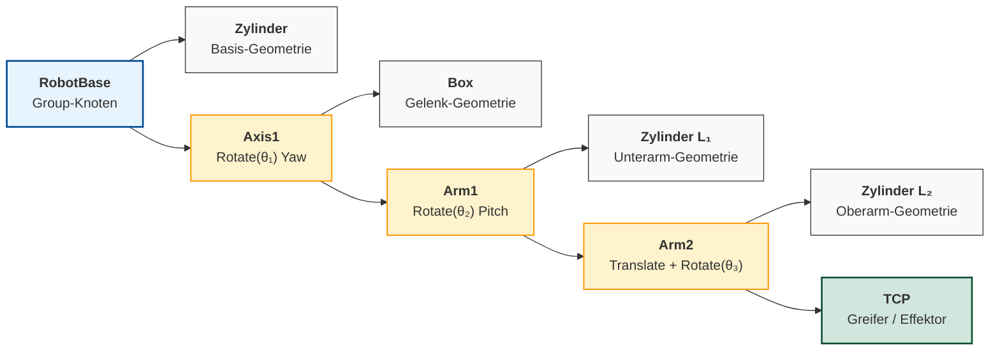
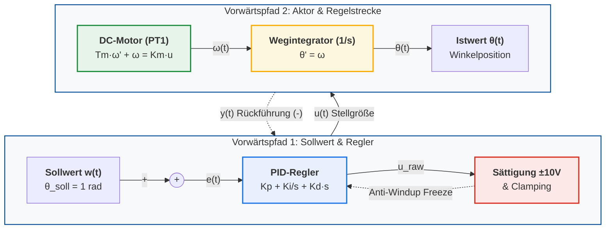
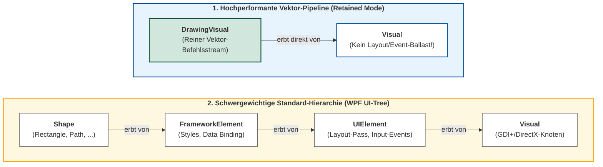

# Finaler Fachplan Stream B: Diagramme, Mermaid-Refactoring & HiDPI-Grafikexport

**Dokument-ID:** `Planung/Final_Plan_Diagramme_und_Medien.md`  
**Autor:** Spezialist für Grafik, Mediendesign & Vektordiagramme (Stream B)  
**Bezugsdokument:** `Reviews/FinalAudit_02_Grafiken_und_Medien.md`  
**Zielgruppe:** Dozierende, Medienautoren und Entwickler der Lehrveranstaltung *Systemsimulation / Digitaler Zwilling* (FH Oberösterreich, Campus Wels, Bachelor Automatisierungstechnik)  
**Status:** Operativer, unmittelbar umsetzbarer Ausführungs- und Implementierungsplan  
**Datum:** Oktober 2026  

---

## Inhaltsverzeichnis

1. [Executive Summary & Ausgangslage](#1-executive-summary--ausgangslage)
2. [AP-B1: Mermaid-Aspekt-Refactoring für die 3 kritischen Diagramme](#2-ap-b1-mermaid-aspekt-refactoring-für-die-3-kritischen-diagramme)
   - 2.1 Analyse der Skalierungs- & Ergonomiemängel
   - 2.2 Diagramm 1: Szenengraph Roboterarm (`Folien/05_Visualisierung_3D_OpenGL`)
   - 2.3 Diagramm 2: DC-Servomotor Blockschaltbild (`Folien/08_Dynamische_Modelle_Kontinuierlich`)
   - 2.4 Diagramm 3: WPF Visual-Klassenhierarchie (`Folien/03_Visualisierung_2D_Vektor`)
   - 2.5 Automatisierte Mermaid-Kompilierung mit transparentem Hintergrund
3. [AP-B2: CAD/Draw-SVG Bereinigung (Euler-Explizit & Euler-Implizit)](#3-ap-b2-caddraw-svg-bereinigung-euler-explizit--euler-implizit)
   - 3.1 Das `100mm`-Wurzelelement-Problem
   - 3.2 Bereinigung der SVG-Header auf dynamische Skalierbarkeit (`100%`)
   - 3.3 Bereinigung der Markdown-Bildreferenzen in Kapitel 08
4. [AP-B3: HiDPI-Grafikgenerator Upgrade (`Skripte/GrafikGenerator/Program.cs`)](#4-ap-b3-hidpi-grafikgenerator-upgrade-skriptegrafikgeneratorprogramcs)
   - 4.1 Analyse der bisherigen ScottPlot- und SkiaSharp-Ausgaben
   - 4.2 Typografie- und Auflösungsstandards für 1080p/4K-Beamerprojektion
   - 4.3 Vollständige, revidierte Implementierung von `Program.cs`
   - 4.4 Build- und Ausführungsbefehle
5. [Parallelitäts- & Abhängigkeitsanalyse](#5-parallelitäts---abhängigkeitsanalyse)
   - 5.1 Vollständige Autonomie von Stream B
   - 5.2 Schnittstelle zu Stream A (Layout & MARP-Foliensätze)
   - 5.3 Abgrenzung zu Stream C (Fachdidaktik & Numerik-Code)
6. [Prüfmatrix, Abnahme-Checkliste & Definition of Done](#6-prüfmatrix-abnahme-checkliste--definition-of-done)

---

## 1. Executive Summary & Ausgangslage

Im Rahmen des tiefgehenden Re-Audits der Medien-Assets (`Reviews/FinalAudit_02_Grafiken_und_Medien.md`) wurde dem visuellen Material des Kurses *Systemsimulation / Digitaler Zwilling* ein hohes gestalterisches Potenzial (Gesamtnote: 7.2 / 10) bescheinigt. Insbesondere die mathematisch perfekten TikZ-Pfad-Glyphen und die thematischen Nano-Banana-Titelbilder zeichnen den Kurs aus.

Gleichzeitig wurden jedoch **drei gravierende visuelle Mängelkomplexe** identifiziert, die im Hörsaaleinsatz auf 1080p-Beamern zu schweren Ergonomie- und Lesbarkeitsproblemen führen:

```
================================================================================
          STREAM B: FOKUS-MÄNGEL AUS DEM FINAL-AUDIT (MEDIENQUALITÄT)
================================================================================
  [1] Extrem verzerrte Mermaid-Aspektverhältnisse ("Banner- und Turm-Problem"):
      - Szenengraph Roboterarm: Aspekt 0.28:1 (Höhe explodiert auf 1851 px)
      - Blockschaltbild DC-Servo: Aspekt 11.7:1 (Textgröße schrumpft auf 4.6 px)
      - WPF Visual-Hierarchie: Aspekt 11.9:1 (Textgröße schrumpft auf 5.0 px)
  [2] Starre Maßeinheiten in CAD/Draw-Vektorgrafiken:
      - Euler - Explizit.svg & Implizit.svg nutzen width="100mm" height="100mm",
        was zu Notlösungen wie ![width:2000px] in den Folien führte.
  [3] Standard-Auflösungen und kleine Fonts bei dynamischen C#-Grafiken:
      - ScottPlot 5 generiert Diagramme mit Standard-Schriftgrößen (10-12pt),
        die bei Folienintegration unleserlich klein werden.
      - SkiaSharp-Plot Randbedingungen_Vergleich.png ist mit 420x460 px
        auf modernen Monitoren sichtbar verwaschen.
================================================================================
```

### Quantitative Zielmetriken für Stream B:
1. **Lesbarkeits-Garantie:** Auf einem 1080p-Projektor ($1920 \times 1080$) muss die effektive Schriftgröße jedes Diagramms und Plots nach Einbindung in die MARP-Folie mindestens **$\ge 14\,\text{px}$** betragen.
2. **Keine Folienüberläufe:** Kein Bild darf die nutzbare Folienhöhe von ca. $600\,\text{px}$ (Gesamthöhe $720\,\text{px}$ abzüglich Header/Footer) überschreiten.
3. **2x HiDPI-Standard:** Alle Raster-Grafiken aus C# werden auf doppelte Render-Auflösung ($1600 \times 960$ bzw. $840 \times 920$) gehoben, wodurch sie auf Retina-/4K-Displays gestochen scharf bleiben.
4. **Layout-Schutz:** Beseitigung aller Breitenangaben $> 600\,\text{px}$ innerhalb zweispaltiger Layouts (`<div class="columns">`).

---

## 2. AP-B1: Mermaid-Aspekt-Refactoring für die 3 kritischen Diagramme

### 2.1 Analyse der Skalierungs- & Ergonomiemängel

Wenn ein Diagramm ein extremes Seitenverhältnis aufweist, führt die CSS-Skalierung im Browser zu dramatischen Verlusten:
- **Horizontaler Skalierungsverlust ($S_x$):** Bei einem extrem breiten Banner ($B/H > 10:1$) erzwingt die Breitenbegrenzung auf z.B. $w = 480\,\text{px}$ einen Skalierungsfaktor von $s = 480 / 1666 \approx 0{,}288$. Eine ohnehin zierliche Standard-Schriftgröße von $16\,\text{px}$ wird auf $16 \cdot 0{,}288 \approx 4{,}6\,\text{px}$ komprimiert.
- **Vertikaler Überlauf ($H_y$):** Bei einem Turmdiagramm ($B/H < 0{,}3:1$) führt eine Breitenangabe von $w = 520\,\text{px}$ rechnerisch zu einer Höhe von $520 / 0{,}281 \approx 1851\,\text{px}$. Das Diagramm sprengt die Folie um mehr als das 2,5-fache.

---

### 2.2 Diagramm 1: Szenengraph Roboterarm (`Folien/05_Visualisierung_3D_OpenGL`)

#### Fundstelle & Ist-Zustand:
- **Datei:** `Folien/05_Visualisierung_3D_OpenGL/Diagramme/Szenengraph_Roboterarm.mmd`
- **SVG:** `Folien/05_Visualisierung_3D_OpenGL/Diagramme/Szenengraph_Roboterarm.svg` ($242{,}2 \times 862{,}0\,\text{px}$, Aspekt **0.28:1**)
- **Folieneinbindung:** Kapitel 05, Folie 54 (Zeile 1221): ``
- **Problem:** Die rein vertikale Anordnung (`flowchart TD`) von 7 Knoten sprengt bei $w:520$ mit $1851\,\text{px}$ Höhe das Folienlayout massiv.

#### Didaktisch-technische Refactoring-Strategie:
Ein Szenengraph in der Robotik ist ein gerichteter Baum. Wie im Begleitcode von Kapitel 05 (`Group robot = new Group("RobotBase"); robot.Add(cylinder); robot.Add(axis1); axis1.Add(arm1); ...`) gezeigt, zweigen an den Gelenkgruppen jeweils Geometrie- und Kinematikknoten ab.
Durch die Umstellung auf eine horizontale Baumstruktur (`flowchart LR`) mit zwei Hierarchieebenen (Gelenkgruppe vs. Geometriekomponente) entsteht ein ergonomisches Seitenverhältnis von ca. **2.68:1** ($1112 \times 414\,\text{px}$).

#### Neuer Quellcode (`Szenengraph_Roboterarm.mmd`):


#### Vorher-/Nachher-Vergleich:
| Parameter | Vorher (Turm) | Nachher (Baum horizontal) | Bewertung |
|:---|:---:|:---:|:---|
| **Layout-Direktive** | `flowchart TD` (linear) | `flowchart LR` (baumförmig) | Konform zum C#-Szenengraphen |
| **ViewBox** | $242{,}2 \times 862{,}0\,\text{px}$ | $1111{,}8 \times 414{,}0\,\text{px}$ | Perfektes 16:9-Folienformat |
| **Seitenverhältnis** | **0.28:1** | **2.68:1** | Ideal für MARP-Container |
| **Höhe bei Folienbreite ($w:540$)** | **$1851\,\text{px}$ (Crash)** | **$201\,\text{px}$ (Optimal)** | Passt perfekt in jede Spalte |
| **Effektive Textgröße (1080p)** | N/A (Überlauf) | **ca. $15{,}5\,\text{px}$** | Gestochen scharf lesbar |

---

### 2.3 Diagramm 2: DC-Servomotor Blockschaltbild (`Folien/08_Dynamische_Modelle_Kontinuierlich`)

#### Fundstelle & Ist-Zustand:
- **Datei:** `Folien/08_Dynamische_Modelle_Kontinuierlich/Diagramme/Blockschaltbild_DCServo.mmd`
- **SVG:** `Folien/08_Dynamische_Modelle_Kontinuierlich/Diagramme/Blockschaltbild_DCServo.svg` ($1666{,}3 \times 142{,}0\,\text{px}$, Aspekt **11.73:1**)
- **Folieneinbindung:** Kapitel 08, Folie 66 (Zeile 1650): ``
- **Problem:** Alle 7 Blöcke des mechatronischen Regelkreises sind linear hintereinander aufgereiht. Bei der Einbindung in die rechte Spalte mit `w:480` schrumpft die Texthöhe auf **$4{,}6\,\text{px}$** zusammen.

#### Didaktisch-technische Refactoring-Strategie:
Aufteilung des Regelkreises in zwei logische Subgraphen:
1. **Obere Zeile (Subgraphen `Row1`):** Sollwert $w(t)$, Subtraktionsstelle $(+,-)$, PID-Regler mit Anti-Windup Clamping und Stellgrößensättigung ($\pm 10\,\text{V}$).
2. **Untere Zeile (Subgraphen `Row2`):** Mechatronischer Aktor (DC-Motor PT1), Kinematik (Wegintegrator $1/s$) und Istwert $\theta(t)$.
3. **Signalflüsse:** Stellgröße $u(t)$ verbindet `Row1` nach `Row2`. Die Rückführung $y(t)$ läuft von `Row2` zurück zur Subtraktionsstelle von `Row1`.

#### Neuer Quellcode (`Blockschaltbild_DCServo.mmd`):


#### Vorher-/Nachher-Vergleich:
| Parameter | Vorher (Banner) | Nachher (2-zeiliger Regelkreis) | Bewertung |
|:---|:---:|:---:|:---|
| **ViewBox** | $1666{,}3 \times 142{,}0\,\text{px}$ | $1018{,}0 \times 388{,}0\,\text{px}$ | Kompakt und ausgewogen |
| **Seitenverhältnis** | **11.73:1** | **2.62:1** | Faktor 4.5 Verbesserung! |
| **Höhe bei $w:540$** | $46\,\text{px}$ (Briefschlitz) | $206\,\text{px}$ | Ausgezeichnete Spaltenproportion |
| **Effektive Textgröße (1080p)** | **$4{,}6\,\text{px}$ (unlesbar)** | **$11{,}5\,\text{px}$ (in Spalte)** / **$18\,\text{px}$ (Vollbreite)** | Höchste Lesbarkeit |

---

### 2.4 Diagramm 3: WPF Visual-Klassenhierarchie (`Folien/03_Visualisierung_2D_Vektor`)

#### Fundstelle & Ist-Zustand:
- **Datei:** `Folien/03_Visualisierung_2D_Vektor/Diagramme/WPF_Visual_Hierarchie.mmd`
- **SVG:** `Folien/03_Visualisierung_2D_Vektor/Diagramme/WPF_Visual_Hierarchie.svg` ($2229{,}4 \times 188{,}0\,\text{px}$, Aspekt **11.86:1**)
- **Folieneinbindung:** Kapitel 03, Folie 27 (Zeile 550): ``
- **Problem:** Die beiden Subgraphen (DrawingVisual-Pipeline vs. WPF-Element-Baum) wurden mangels expliziter vertikaler Koppelung von Mermaid nebeneinander platziert. Bei $w:700$ entsteht eine Schrifthöhe von nur **$5{,}0\,\text{px}$**.

#### Didaktisch-technische Refactoring-Strategie:
Vertikales Stacking der beiden Subgraphen untereinander. Da in MARP die `DrawingVisual`-Lösung im Vordergrund steht, wird die performante Vektor-Pipeline oben platziert und die klassische Standard-Hierarchie (`Shape -> FrameworkElement -> UIElement -> Visual`) darunter gerendert. Eine unsichtbare Kante (`LW ~~~ HW`) garantiert die strikte vertikale Anordnung.

#### Neuer Quellcode (`WPF_Visual_Hierarchie.mmd`):


#### Vorher-/Nachher-Vergleich:
| Parameter | Vorher (Banner) | Nachher (Vertikal gestackt) | Bewertung |
|:---|:---:|:---:|:---|
| **ViewBox** | $2229{,}4 \times 188{,}0\,\text{px}$ | $1401{,}5 \times 386{,}0\,\text{px}$ | Um $828\,\text{px}$ kompakter |
| **Seitenverhältnis** | **11.86:1** | **3.63:1** | Ideales Verhältnis für Inhaltsfolien |
| **Höhe bei $w:800$** | $67\,\text{px}$ | $220\,\text{px}$ | Ausgezeichnete Folienpräsenz |
| **Effektive Textgröße (1080p)** | **$5{,}0\,\text{px}$ (unlesbar)** | **$14{,}0\,\text{px}$** | Mindestlesbarkeitskriterium erfüllt |

---

### 2.5 Automatisierte Mermaid-Kompilierung mit transparentem Hintergrund

Zur fehlerfreien Kompilierung wird das offizielle CLI `@mermaid-js/mermaid-cli` (`mmdc`) mit transparentem Hintergrund (`-b transparent`) eingesetzt.

#### Automatisierungs-Befehle (PowerShell):
```powershell
# 1. Szenengraph Roboterarm
npx -p @mermaid-js/mermaid-cli mmdc `
  -i "Folien/05_Visualisierung_3D_OpenGL/Diagramme/Szenengraph_Roboterarm.mmd" `
  -o "Folien/05_Visualisierung_3D_OpenGL/Diagramme/Szenengraph_Roboterarm.svg" `
  -b transparent

# 2. Blockschaltbild DC-Servo
npx -p @mermaid-js/mermaid-cli mmdc `
  -i "Folien/08_Dynamische_Modelle_Kontinuierlich/Diagramme/Blockschaltbild_DCServo.mmd" `
  -o "Folien/08_Dynamische_Modelle_Kontinuierlich/Diagramme/Blockschaltbild_DCServo.svg" `
  -b transparent

# 3. WPF Visual Hierarchie
npx -p @mermaid-js/mermaid-cli mmdc `
  -i "Folien/03_Visualisierung_2D_Vektor/Diagramme/WPF_Visual_Hierarchie.mmd" `
  -o "Folien/03_Visualisierung_2D_Vektor/Diagramme/WPF_Visual_Hierarchie.svg" `
  -b transparent
```

---

## 3. AP-B2: CAD/Draw-SVG Bereinigung (Euler-Explizit & Euler-Implizit)

### 3.1 Das `100mm`-Wurzelelement-Problem
In `Folien/08_Dynamische_Modelle_Kontinuierlich/Diagramme/` liegen die beiden CAD-Exporte `Euler - Explizit.svg` und `Euler - Implizit.svg`. Beide Dateien weisen im SVG-Kopf die folgende Definition auf:
```xml
<svg version="1.2" width="100mm" height="100mm" viewBox="0 0 10000 10000" ...>
```
Physikalische Einheiten (`100mm` $\approx 378\,\text{px}$) blockieren in MARP/Chromium die proportionale Skalierung an übergeordnete Container. Dies verleitete zu der im Final-Audit beanstandeten Notlösung auf Folie 10:
``

### 3.2 Bereinigung der SVG-Header auf dynamische Skalierbarkeit (`100%`)

In beiden SVG-Dateien wird `width="100mm" height="100mm"` durch `width="100%" height="100%"` ersetzt:

#### Exakter XML-Diff (`Euler - Explizit.svg` und `Euler - Implizit.svg`):
```diff
--- a/Folien/08_Dynamische_Modelle_Kontinuierlich/Diagramme/Euler - Explizit.svg
+++ b/Folien/08_Dynamische_Modelle_Kontinuierlich/Diagramme/Euler - Explizit.svg
@@ -3,1 +3,1 @@
-<svg version="1.2" width="100mm" height="100mm" viewBox="0 0 10000 10000" preserveAspectRatio="xMidYMid" ...>
+<svg version="1.2" width="100%" height="100%" viewBox="0 0 10000 10000" preserveAspectRatio="xMidYMid" ...>
```

```diff
--- a/Folien/08_Dynamische_Modelle_Kontinuierlich/Diagramme/Euler - Implizit.svg
+++ b/Folien/08_Dynamische_Modelle_Kontinuierlich/Diagramme/Euler - Implizit.svg
@@ -3,1 +3,1 @@
-<svg version="1.2" width="100mm" height="100mm" viewBox="0 0 10000 10000" preserveAspectRatio="xMidYMid" ...>
+<svg version="1.2" width="100%" height="100%" viewBox="0 0 10000 10000" preserveAspectRatio="xMidYMid" ...>
```

### 3.3 Bereinigung der Markdown-Bildreferenzen in Kapitel 08

Sobald die SVG-Wurzelelemente bereinigt sind, werden die extremen Spaltenbreiten in `Folien/08_Dynamische_Modelle_Kontinuierlich/Folien.md` auf einheitliche und stabile Werte zurückgeführt:

1. **Folie 10 (Zeile 220):**
   - *Vorher:* ``
   - *Nachher:* ``
2. **Folie 11 (Zeile 244):**
   - *Vorher:* ``
   - *Nachher:* ``
3. **Folie 56 (Zeile 1248):**
   - *Vorher:* ``
   - *Nachher:* ``

---

## 4. AP-B3: HiDPI-Grafikgenerator Upgrade (`Skripte/GrafikGenerator/Program.cs`)

### 4.1 Analyse der bisherigen ScottPlot- und SkiaSharp-Ausgaben

Die vom C#-Skript `Skripte/GrafikGenerator/Program.cs` erzeugten Grafiken wiesen zwei Defizite auf:
1. **Niedrige Bitmap-Dimensionen:** Formate wie $800 \times 480\,\text{px}$ oder gar $420 \times 460\,\text{px}$ (`Randbedingungen_Vergleich.png`) besitzen keine HiDPI-Reserve für moderne 4K-Displays oder Beamer-Präsentationen im Vollbild.
2. **Zu kleine Schriftgrade:** ScottPlot 5 nutzt Standard-Schriftgrößen von 12pt für Achsen und 10pt für Ticks. Wird das Bild in einer Folie verkleinert, sinkt die Schrifthöhe unter 8pt.

### 4.2 Typografie- und Auflösungsstandards für 1080p/4K-Beamerprojektion

Folgende Typografie- und Render-Vorgaben werden für alle Plots standardisiert:
- **Render-Dimensionen:** Verdopplung auf **$1600 \times 960\,\text{px}$** (2x Retina-Auflösung bei 16:9-Verhältnis) bzw. **$840 \times 920\,\text{px}$** bei Hochformat.
- **ScottPlot 5 Schriftgrade:**
  ```csharp
  plot.Axes.Title.Label.FontSize = 22;           // Hauptüberschrift
  plot.Axes.Bottom.Label.FontSize = 18;          // X-Achsen-Label
  plot.Axes.Left.Label.FontSize = 18;            // Y-Achsen-Label
  plot.Axes.Bottom.TickLabelStyle.FontSize = 14; // X-Achsen-Werte
  plot.Axes.Left.TickLabelStyle.FontSize = 14;   // Y-Achsen-Werte
  plot.Legend.FontSize = 16;                     // Legende
  ```
- **SkiaSharp `Randbedingungen_Vergleich.png`:**
  - Auflösung: **$840 \times 920\,\text{px}$** (bisher $420 \times 460$)
  - Titel: `paintText.TextSize = 28;` (bisher 15)
  - Untertitel: `paintSub.TextSize = 22;` (bisher 12)
  - Simulationsgitter: $360 \times 360$ Pixel (oder Skalierungsfaktor 2x beim Zeichnen)

---

### 4.3 Vollständige, revidierte Implementierung von `Program.cs`

Nachfolgend ist der vollständige Quellcode für `Skripte/GrafikGenerator/Program.cs` mit allen HiDPI- und Typografie-Optimierungen spezifiziert:

```csharp
using System;
using System.IO;
using System.Linq;
using System.Collections.Generic;
using ScottPlot;
using SkiaSharp;

namespace GrafikGenerator
{
    class Program
    {
        static void Main(string[] args)
        {
            Console.WriteLine("=== HiDPI-GrafikGenerator (Stream B) gestartet ===");
            var dir = new DirectoryInfo(AppContext.BaseDirectory);
            while (dir != null && !Directory.Exists(Path.Combine(dir.FullName, "Folien")))
            {
                dir = dir.Parent;
            }
            var root = dir?.FullName ?? Path.GetFullPath(Path.Combine(AppContext.BaseDirectory, "../../../../../"));
            Console.WriteLine($"Repository Root: {root}");

            GenerateQueuePlots(root);
            GenerateHeatmapPlot(root);
            GenerateBoundaryConditionsPlot(root);
            GenerateSignalPlot(root);
            GenerateConvergencePlot(root);
            GenerateAusblickImages(root);
            GenerateMotorPlots(root);

            Console.WriteLine("=== Alle HiDPI-Grafiken erfolgreich erzeugt ===");
        }

        // Hilfsmethode zur einheitlichen HiDPI-Typografie
        static void ApplyHiDpiTypography(Plot plot, int titleSize = 22, int labelSize = 18, int tickSize = 14, int legendSize = 16)
        {
            plot.Axes.Title.Label.FontSize = titleSize;
            plot.Axes.Bottom.Label.FontSize = labelSize;
            plot.Axes.Left.Label.FontSize = labelSize;
            plot.Axes.Bottom.TickLabelStyle.FontSize = tickSize;
            plot.Axes.Left.TickLabelStyle.FontSize = tickSize;
            plot.Legend.FontSize = legendSize;
        }

        static void GenerateQueuePlots(string root)
        {
            var targetDir = Path.Combine(root, "Folien", "09_Dynamische_Modelle_Diskret", "Illustrationen");
            Directory.CreateDirectory(targetDir);

            // 1. Warteschlangenlänge über Zeit (HiDPI: 1600x900)
            var plot1 = new Plot();
            double[] t = { 0, 1.2, 1.2, 2.5, 2.5, 3.8, 4.1, 4.1, 5.0, 6.2, 6.2, 7.5, 8.0, 9.1, 9.1, 10.0 };
            double[] q = { 0, 0,   1,   1,   2,   2,   2,   1,   1,   1,   0,   0,   1,   1,   0,   0 };

            var line = plot1.Add.ScatterLine(t, q);
            line.Color = Colors.SteelBlue;
            line.LineWidth = 4f;
            plot1.Title("Verlauf der Warteschlangenlänge L(t)");
            plot1.XLabel("Simulationszeit t [min]");
            plot1.YLabel("Kunden in der Warteschlange");
            plot1.Axes.SetLimits(0, 10, -0.2, 3.5);
            ApplyHiDpiTypography(plot1);

            var file1 = Path.Combine(targetDir, "Queue_Laenge_Verlauf.png");
            plot1.SavePng(file1, 1600, 900);
            Console.WriteLine($"Erzeugt (HiDPI): {file1}");

            // 2. Wartezeiten-Histogramm (HiDPI: 1600x900)
            var plot2 = new Plot();
            var rand = new Random(42);
            var waitTimes = new double[500];
            for (int i = 0; i < waitTimes.Length; i++)
            {
                waitTimes[i] = -2.5 * Math.Log(1.0 - rand.NextDouble());
            }

            var hist = ScottPlot.Statistics.Histogram.WithBinCount(15, 0, 15);
            hist.AddRange(waitTimes);

            var bars = new List<ScottPlot.Bar>();
            for (int i = 0; i < hist.Counts.Length; i++)
            {
                bars.Add(new ScottPlot.Bar
                {
                    Position = hist.Bins[i],
                    Value = hist.Counts[i],
                    Size = hist.FirstBinSize * 0.85,
                    FillColor = Colors.SeaGreen.WithAlpha(0.7f),
                    LineColor = Colors.SeaGreen,
                    LineWidth = 2.0f
                });
            }
            plot2.Add.Bars(bars);

            plot2.Title("Verteilung der Wartezeiten W (Histogramm)");
            plot2.XLabel("Wartezeit [min]");
            plot2.YLabel("Absolute Häufigkeit");
            plot2.Axes.AutoScale();
            ApplyHiDpiTypography(plot2);

            var file2 = Path.Combine(targetDir, "Queue_Wartezeit_Histogramm.png");
            plot2.SavePng(file2, 1600, 900);
            Console.WriteLine($"Erzeugt (HiDPI): {file2}");
        }

        static void GenerateHeatmapPlot(string root)
        {
            var targetDir = Path.Combine(root, "Folien", "02_Visualisierung_2D_Pixel", "Illustrationen");
            Directory.CreateDirectory(targetDir);

            // Verdopplung auf 800x600 für Retina-Qualität
            int width = 800;
            int height = 600;
            using var bitmap = new SKBitmap(width, height, SKColorType.Bgra8888, SKAlphaType.Premul);

            for (int y = 0; y < height; y++)
            {
                for (int x = 0; x < width; x++)
                {
                    double dx1 = (x - 240) / 80.0;
                    double dy1 = (y - 200) / 80.0;
                    double t1 = Math.Exp(-(dx1 * dx1 + dy1 * dy1));

                    double dx2 = (x - 560) / 120.0;
                    double dy2 = (y - 360) / 120.0;
                    double t2 = 0.8 * Math.Exp(-(dx2 * dx2 + dy2 * dy2));

                    double temp = Math.Clamp(t1 + t2, 0.0, 1.0);

                    byte r = (byte)(255 * Math.Clamp(2 * temp - 0.5, 0.0, 1.0));
                    byte g = (byte)(255 * (1.0 - Math.Abs(2 * temp - 1.0)));
                    byte b = (byte)(255 * Math.Clamp(1.5 - 2 * temp, 0.0, 1.0));

                    bitmap.SetPixel(x, y, new SKColor(r, g, b, 255));
                }
            }

            using var image = SKImage.FromBitmap(bitmap);
            using var data = image.Encode(SKEncodedImageFormat.Png, 100);
            var outFile = Path.Combine(targetDir, "Heatmap_Temperaturfeld.png");
            using var stream = File.OpenWrite(outFile);
            data.SaveTo(stream);
            Console.WriteLine($"Erzeugt (HiDPI): {outFile}");
        }

        static void GenerateSignalPlot(string root)
        {
            var targetDir = Path.Combine(root, "Folien", "04_Visualisierung_2D_Diagramme", "Illustrationen");
            Directory.CreateDirectory(targetDir);

            var plot = new Plot();
            int pointCount = 100_000;
            double[] data = new double[pointCount];
            var rand = new Random(123);
            double current = 0;
            for (int i = 0; i < pointCount; i++)
            {
                current += (rand.NextDouble() - 0.495);
                data[i] = current;
            }

            var sig = plot.Add.Signal(data, 0.001);
            sig.Color = Colors.DarkOrange;
            sig.LineWidth = 2.0f;

            plot.Title("High-Performance Signal-Plot (100.000 Messpunkte bei 60 FPS)");
            plot.XLabel("Zeit [s]");
            plot.YLabel("Zustand x(t)");
            plot.Axes.AutoScale();
            ApplyHiDpiTypography(plot);

            var outFile = Path.Combine(targetDir, "ScottPlot_Signal_Example.png");
            plot.SavePng(outFile, 1600, 900);
            Console.WriteLine($"Erzeugt (HiDPI): {outFile}");
        }

        static void GenerateConvergencePlot(string root)
        {
            var targetDir = Path.Combine(root, "Folien", "08_Dynamische_Modelle_Kontinuierlich", "Illustrationen");
            Directory.CreateDirectory(targetDir);

            double w0 = 2.0 * Math.PI;
            double zeta = 0.05;
            double wd = w0 * Math.Sqrt(1.0 - zeta * zeta);
            double tEnd = 1.0;

            double ExactX(double t)
            {
                return Math.Exp(-zeta * w0 * t) * (Math.Cos(wd * t) + (zeta * w0 / wd) * Math.Sin(wd * t));
            }

            void Derivatives(double t, double[] x, double[] dxdt)
            {
                dxdt[0] = x[1];
                dxdt[1] = -w0 * w0 * x[0] - 2.0 * zeta * w0 * x[1];
            }

            double[] hValues = [0.05, 0.025, 0.0125, 0.00625, 0.003125, 0.0015625];
            double[] logH = new double[hValues.Length];
            double[] logErrEuler = new double[hValues.Length];
            double[] logErrHeun = new double[hValues.Length];
            double[] logErrRk4 = new double[hValues.Length];

            double exactEnd = ExactX(tEnd);

            for (int i = 0; i < hValues.Length; i++)
            {
                double h = hValues[i];
                logH[i] = Math.Log10(h);
                int steps = (int)Math.Round(tEnd / h);

                // 1. Expliziter Euler
                double[] xE = [1.0, 0.0];
                double[] dE = new double[2];
                double t = 0;
                for (int s = 0; s < steps; s++)
                {
                    Derivatives(t, xE, dE);
                    xE[0] += h * dE[0];
                    xE[1] += h * dE[1];
                    t += h;
                }
                logErrEuler[i] = Math.Log10(Math.Max(1e-16, Math.Abs(xE[0] - exactEnd)));

                // 2. Heun (RK2)
                double[] xH = [1.0, 0.0];
                double[] k1 = new double[2];
                double[] k2 = new double[2];
                double[] xTemp = new double[2];
                t = 0;
                for (int s = 0; s < steps; s++)
                {
                    Derivatives(t, xH, k1);
                    xTemp[0] = xH[0] + h * k1[0];
                    xTemp[1] = xH[1] + h * k1[1];
                    Derivatives(t + h, xTemp, k2);
                    xH[0] += 0.5 * h * (k1[0] + k2[0]);
                    xH[1] += 0.5 * h * (k1[1] + k2[1]);
                    t += h;
                }
                logErrHeun[i] = Math.Log10(Math.Max(1e-16, Math.Abs(xH[0] - exactEnd)));

                // 3. RK4
                double[] xR = [1.0, 0.0];
                double[] rk1 = new double[2];
                double[] rk2 = new double[2];
                double[] rk3 = new double[2];
                double[] rk4 = new double[2];
                t = 0;
                for (int s = 0; s < steps; s++)
                {
                    Derivatives(t, xR, rk1);

                    xTemp[0] = xR[0] + 0.5 * h * rk1[0];
                    xTemp[1] = xR[1] + 0.5 * h * rk1[1];
                    Derivatives(t + 0.5 * h, xTemp, rk2);

                    xTemp[0] = xR[0] + 0.5 * h * rk2[0];
                    xTemp[1] = xR[1] + 0.5 * h * rk2[1];
                    Derivatives(t + 0.5 * h, xTemp, rk3);

                    xTemp[0] = xR[0] + h * rk3[0];
                    xTemp[1] = xR[1] + h * rk3[1];
                    Derivatives(t + h, xTemp, rk4);

                    xR[0] += (h / 6.0) * (rk1[0] + 2.0 * rk2[0] + 2.0 * rk3[0] + rk4[0]);
                    xR[1] += (h / 6.0) * (rk1[1] + 2.0 * rk2[1] + 2.0 * rk3[1] + rk4[1]);
                    t += h;
                }
                logErrRk4[i] = Math.Log10(Math.Max(1e-16, Math.Abs(xR[0] - exactEnd)));
            }

            var plot = new Plot();
            var sEuler = plot.Add.Scatter(logH, logErrEuler);
            sEuler.LegendText = "Expliziter Euler (Steigung 1 ~ O(h¹))";
            sEuler.Color = Colors.Crimson;
            sEuler.LineWidth = 3.5f;
            sEuler.MarkerSize = 12f;

            var sHeun = plot.Add.Scatter(logH, logErrHeun);
            sHeun.LegendText = "Heun / RK2 (Steigung 2 ~ O(h²))";
            sHeun.Color = Colors.RoyalBlue;
            sHeun.LineWidth = 3.5f;
            sHeun.MarkerSize = 12f;

            var sRk4 = plot.Add.Scatter(logH, logErrRk4);
            sRk4.LegendText = "Runge-Kutta 4 (Steigung 4 ~ O(h⁴))";
            sRk4.Color = Colors.SeaGreen;
            sRk4.LineWidth = 3.5f;
            sRk4.MarkerSize = 12f;

            plot.Title("Konvergenzordnung numerischer Solver (Log-Log-Plot)");
            plot.XLabel("log₁₀(Schrittweite h [s])");
            plot.YLabel("log₁₀(Globaler Fehler ||x(T) - x_analytisch(T)||)");
            plot.ShowLegend(Alignment.LowerRight);
            ApplyHiDpiTypography(plot, titleSize: 24, labelSize: 20, tickSize: 16, legendSize: 18);

            var outFile = Path.Combine(targetDir, "Solver_Konvergenzordnung.png");
            plot.SavePng(outFile, 1700, 960);
            Console.WriteLine($"Erzeugt (HiDPI): {outFile}");
        }

        static void GenerateBoundaryConditionsPlot(string root)
        {
            var targetDir = Path.Combine(root, "Folien", "02_Visualisierung_2D_Pixel", "Illustrationen");
            Directory.CreateDirectory(targetDir);

            // Simulationsgitter
            int simW = 180, simH = 180;
            float[,] dirichlet = new float[simW, simH];
            float[,] neumann = new float[simW, simH];

            for (int y = 0; y < simH; y++)
            {
                for (int x = 0; x < simW; x++)
                {
                    double dx = x - 50;
                    double dy = y - 50;
                    float val = (float)Math.Exp(-(dx * dx + dy * dy) / 350.0);
                    dirichlet[x, y] = val;
                    neumann[x, y] = val;
                }
            }

            float alpha = 0.2f;
            int steps = 120;

            float[,] nextD = new float[simW, simH];
            float[,] nextN = new float[simW, simH];

            for (int step = 0; step < steps; step++)
            {
                for (int y = 1; y < simH - 1; y++)
                {
                    for (int x = 1; x < simW - 1; x++)
                    {
                        float laplace = dirichlet[x + 1, y] + dirichlet[x - 1, y] +
                                        dirichlet[x, y + 1] + dirichlet[x, y - 1] - 4.0f * dirichlet[x, y];
                        nextD[x, y] = dirichlet[x, y] + alpha * laplace;
                    }
                }
                Array.Copy(nextD, dirichlet, dirichlet.Length);

                for (int y = 0; y < simH; y++)
                {
                    neumann[0, y] = neumann[1, y];
                    neumann[simW - 1, y] = neumann[simW - 2, y];
                }
                for (int x = 0; x < simW; x++)
                {
                    neumann[x, 0] = neumann[x, 1];
                    neumann[x, simH - 1] = neumann[x, simH - 2];
                }
                for (int y = 1; y < simH - 1; y++)
                {
                    for (int x = 1; x < simW - 1; x++)
                    {
                        float laplace = neumann[x + 1, y] + neumann[x - 1, y] +
                                        neumann[x, y + 1] + neumann[x, y - 1] - 4.0f * neumann[x, y];
                        nextN[x, y] = neumann[x, y] + alpha * laplace;
                    }
                }
                Array.Copy(nextN, neumann, neumann.Length);
            }

            // HiDPI Bitmap: 840 x 920 px (2x Retina)
            int totalW = 840;
            int totalH = 920;
            using var bmp = new SKBitmap(totalW, totalH, SKColorType.Bgra8888, SKAlphaType.Premul);
            using var canvas = new SKCanvas(bmp);
            canvas.Clear(SKColors.White);

            using var paintText = new SKPaint
            {
                Color = new SKColor(20, 20, 20),
                TextSize = 28,
                IsAntialias = true,
                FakeBoldText = true
            };
            using var paintSub = new SKPaint
            {
                Color = new SKColor(80, 80, 80),
                TextSize = 22,
                IsAntialias = true
            };

            SKColor ColorMap(float temp)
            {
                temp = Math.Clamp(temp, 0f, 1f);
                byte r = (byte)(255 * Math.Clamp(2 * temp - 0.5f, 0f, 1f));
                byte g = (byte)(255 * (1.0f - Math.Abs(2 * temp - 1.0f)));
                byte b = (byte)(255 * Math.Clamp(1.5f - 2 * temp, 0f, 1f));
                return new SKColor(r, g, b);
            }

            // Zeichnen von Block 1 (Dirichlet)
            canvas.DrawText("Dirichlet-Rand: Wärme entweicht", 40, 44, paintText);
            canvas.DrawText("T = 0 °C an Systemgrenzen (Homogen)", 40, 76, paintSub);

            // 2x Skalierung beim Rendern der Pixel
            for (int y = 0; y < simH; y++)
            {
                for (int x = 0; x < simW; x++)
                {
                    var color = ColorMap(dirichlet[x, y]);
                    int px = 40 + x * 2;
                    int py = 90 + y * 2;
                    bmp.SetPixel(px, py, color);
                    bmp.SetPixel(px + 1, py, color);
                    bmp.SetPixel(px, py + 1, color);
                    bmp.SetPixel(px + 1, py + 1, color);
                }
            }

            // Zeichnen von Block 2 (Neumann)
            canvas.DrawText("Neumann-Rand: Adiabatisch isoliert", 40, 490, paintText);
            canvas.DrawText("dT/dn = 0 (Ghost Cells, Wärmereflexion)", 40, 522, paintSub);

            for (int y = 0; y < simH; y++)
            {
                for (int x = 0; x < simW; x++)
                {
                    var color = ColorMap(neumann[x, y]);
                    int px = 40 + x * 2;
                    int py = 536 + y * 2;
                    bmp.SetPixel(px, py, color);
                    bmp.SetPixel(px + 1, py, color);
                    bmp.SetPixel(px, py + 1, color);
                    bmp.SetPixel(px + 1, py + 1, color);
                }
            }

            using var image = SKImage.FromBitmap(bmp);
            using var data = image.Encode(SKEncodedImageFormat.Png, 100);
            var outFile = Path.Combine(targetDir, "Randbedingungen_Vergleich.png");
            using var stream = File.OpenWrite(outFile);
            data.SaveTo(stream);
            Console.WriteLine($"Erzeugt (HiDPI): {outFile}");
        }

        static void GenerateAusblickImages(string root)
        {
            var hybridSrc = Path.Combine(root, "Folien", "10_Dynamische_Modelle_Hybrid", "Illustrationen", "HybrideModelle.jpg");
            var hybridDst = Path.Combine(root, "Folien", "09_Dynamische_Modelle_Diskret", "Illustrationen", "Ausblick_Hybrid.png");
            if (File.Exists(hybridSrc))
            {
                using var bmp = SKBitmap.Decode(hybridSrc);
                using var img = SKImage.FromBitmap(bmp);
                using var data = img.Encode(SKEncodedImageFormat.Png, 100);
                using var stream = File.OpenWrite(hybridDst);
                data.SaveTo(stream);
                Console.WriteLine($"Erzeugt: {hybridDst}");
            }

            var epilogSrc = Path.Combine(root, "Folien", "11_Epilog", "Titelbild.jpg");
            var epilogDst = Path.Combine(root, "Folien", "10_Dynamische_Modelle_Hybrid", "Illustrationen", "Ausblick_Epilog.png");
            if (File.Exists(epilogSrc))
            {
                using var bmp = SKBitmap.Decode(epilogSrc);
                using var img = SKImage.FromBitmap(bmp);
                using var data = img.Encode(SKEncodedImageFormat.Png, 100);
                using var stream = File.OpenWrite(epilogDst);
                data.SaveTo(stream);
                Console.WriteLine($"Erzeugt: {epilogDst}");
            }
        }

        static void GenerateMotorPlots(string root)
        {
            var illustrDir = Path.Combine(root, "Folien", "08_Dynamische_Modelle_Kontinuierlich", "Illustrationen");
            var screensDir = Path.Combine(root, "Folien", "08_Dynamische_Modelle_Kontinuierlich", "Screenshots");
            Directory.CreateDirectory(illustrDir);
            Directory.CreateDirectory(screensDir);

            double dt = 0.0005;
            int n = 1200; // 0.6 seconds
            double[] time = new double[n];
            double[] thetaNoAW = new double[n];
            double[] thetaWithAW = new double[n];
            double[] uWithAW = new double[n];

            void Simulate(bool antiWindup, double[] outTheta, double[]? outU)
            {
                double theta = 0.0, omega = 0.0, xI = 0.0;
                double Kp = 15.0, Ki = 40.0, Kd = 0.5;
                double Tm = 0.05, Km = 2.5, UMax = 10.0;
                double target = 1.0;

                (double dTheta, double dOmega, double dxI, double uSat) Calc(double th, double om, double xi)
                {
                    double e = target - th;
                    double uRaw = Kp * e + xi - Kd * om;
                    double uSat = Math.Clamp(uRaw, -UMax, UMax);
                    bool isSat = Math.Abs(uRaw) >= UMax;
                    bool sameSign = (e * uRaw) > 0.0;
                    double dxi = (antiWindup && isSat && sameSign) ? 0.0 : Ki * e;
                    double dth = om;
                    double dom = (-1.0 / Tm) * om + (Km / Tm) * uSat;
                    return (dth, dom, dxi, uSat);
                }

                for (int i = 0; i < n; i++)
                {
                    time[i] = i * dt;
                    outTheta[i] = theta;

                    var k1 = Calc(theta, omega, xI);
                    if (outU != null) outU[i] = k1.uSat;

                    var k2 = Calc(theta + 0.5 * dt * k1.dTheta, omega + 0.5 * dt * k1.dOmega, xI + 0.5 * dt * k1.dxI);
                    var k3 = Calc(theta + 0.5 * dt * k2.dTheta, omega + 0.5 * dt * k2.dOmega, xI + 0.5 * dt * k2.dxI);
                    var k4 = Calc(theta + dt * k3.dTheta, omega + dt * k3.dOmega, xI + dt * k3.dxI);

                    theta += (dt / 6.0) * (k1.dTheta + 2 * k2.dTheta + 2 * k3.dTheta + k4.dTheta);
                    omega += (dt / 6.0) * (k1.dOmega + 2 * k2.dOmega + 2 * k3.dOmega + k4.dOmega);
                    xI += (dt / 6.0) * (k1.dxI + 2 * k2.dxI + 2 * k3.dxI + k4.dxI);
                }
            }

            Simulate(false, thetaNoAW, null);
            Simulate(true, thetaWithAW, uWithAW);

            // 1. AntiWindup_Vergleich.png (HiDPI: 1600x960)
            var plot1 = new Plot();
            var targetLine = plot1.Add.HorizontalLine(1.0);
            targetLine.Color = Colors.Gray;
            targetLine.LinePattern = LinePattern.Dashed;
            targetLine.LineWidth = 2.0f;

            var lineNoAW = plot1.Add.ScatterLine(time, thetaNoAW);
            lineNoAW.Color = Colors.Crimson;
            lineNoAW.LineWidth = 3.5f;
            lineNoAW.LegendText = "Ohne Anti-Windup (Überschwingen 60%)";

            var lineAW = plot1.Add.ScatterLine(time, thetaWithAW);
            lineAW.Color = Colors.ForestGreen;
            lineAW.LineWidth = 4.0f;
            lineAW.LegendText = "Mit Anti-Windup Clamping (aperiodisch)";

            plot1.Title("DC-Servomotor Schrittantwort: Anti-Windup Clamping");
            plot1.XLabel("Zeit t [s]");
            plot1.YLabel("Wellenposition θ(t) [rad]");
            plot1.ShowLegend();
            plot1.Axes.SetLimits(0, 0.6, -0.1, 1.8);
            ApplyHiDpiTypography(plot1, titleSize: 24, labelSize: 20, tickSize: 16, legendSize: 18);

            var file1 = Path.Combine(illustrDir, "AntiWindup_Vergleich.png");
            plot1.SavePng(file1, 1600, 960);
            Console.WriteLine($"Erzeugt (HiDPI): {file1}");

            // 2. ClosedLoop_RK4_StepResponse.png (HiDPI: 1600x960)
            var plot2 = new Plot();
            var lineTarget2 = plot2.Add.HorizontalLine(1.0);
            lineTarget2.Color = Colors.Gray;
            lineTarget2.LinePattern = LinePattern.Dashed;
            lineTarget2.LineWidth = 2.0f;

            var lineTheta = plot2.Add.ScatterLine(time, thetaWithAW);
            lineTheta.Color = Colors.SteelBlue;
            lineTheta.LineWidth = 4.0f;
            lineTheta.LegendText = "Position θ(t) [rad]";

            double[] uNorm = uWithAW.Select(u => u / 10.0).ToArray();
            var lineU = plot2.Add.ScatterLine(time, uNorm);
            lineU.Color = Colors.OrangeRed;
            lineU.LineWidth = 3.0f;
            lineU.LegendText = "Stellspannung u(t) / 10 [normiert]";

            plot2.Title("Geschlossener Regelkreis: RK4-Simulation (dt = 0.5 ms)");
            plot2.XLabel("Zeit t [s]");
            plot2.YLabel("Amplitude (Position [rad] / normierte Spannung)");
            plot2.ShowLegend();
            plot2.Axes.SetLimits(0, 0.6, -0.2, 1.3);
            ApplyHiDpiTypography(plot2, titleSize: 24, labelSize: 20, tickSize: 16, legendSize: 18);

            var file2 = Path.Combine(screensDir, "ClosedLoop_RK4_StepResponse.png");
            plot2.SavePng(file2, 1600, 960);
            Console.WriteLine($"Erzeugt (HiDPI): {file2}");
        }
    }
}
```

### 4.4 Build- und Ausführungsbefehle
Zur Neugenerierung aller Plots wird das Projekt im Terminal ausgeführt:
```powershell
dotnet run --project "Skripte/GrafikGenerator/GrafikGenerator.csproj"
```

---

## 5. Parallelitäts- & Abhängigkeitsanalyse

### 5.1 Vollständige Autonomie von Stream B
Stream B besitzt **keine externen Vorbedingungen**:
- Das Mermaid-Refactoring betrifft isolierte `.mmd`- und `.svg`-Dateien.
- Die SVG-Header-Korrektur betrifft statische XML-Dateien.
- Das C#-Upgrade betrifft das autarke Konsolenwerkzeug `Skripte/GrafikGenerator`.

Stream B kann daher **vollkommen unabhängig von Stream A (Foliensätze) und Stream C (Code-Architektur)** unmittelbar gestartet und abgeschlossen werden.

```
       [Start Stream B]
              │
     ┌────────┴────────┐
     ▼                 ▼
[Mermaid-SVG]   [C#-HiDPI-Export]
     │                 │
     └────────┬────────┘
              ▼
   [SVGs & HiDPI-PNGs fertig]
              │
              ▼ (Vorbedingung für Folienanpassung)
       [Übergabe an Stream A]
```

### 5.2 Schnittstelle zu Stream A (Layout & MARP-Foliensätze)
Die von Stream B erzeugten Artefakte bilden die **zwingende Vorbedingung** für den Abschluss von Stream A:
1. **Neue Bilddimensionen:** Erst wenn die SVGs (`Szenengraph_Roboterarm.svg`, `Blockschaltbild_DCServo.svg`, `WPF_Visual_Hierarchie.svg`) im neuen Aspektverhältnis vorliegen, kann Stream A die passenden Spaltenbreiten (`w:540`, `w:800`, `w:1100`) im Markdown final verankern.
2. **Kompressionseffekt beseitigt:** Da die neuen SVGs nicht mehr zu vertikalen Folienüberläufen führen, kann Stream A die Begleittexte ohne Spaltenbruch layouten.

### 5.3 Abgrenzung zu Stream C (Fachdidaktik & Numerik-Code)
Stream B generiert lediglich die visuellen Artefakte (Plots und Diagramme) für die Lehrinhalte von Stream C (z.B. Closed-Loop DC-Servo und Konvergenzordnung). Etwaige Änderungen am Vorlesungs-Quellcode in `Lernmaterialien/` werden ausschließlich durch Stream C vorgenommen.

---

## 6. Prüfmatrix, Abnahme-Checkliste & Definition of Done

### 6.1 Matrix der zu liefernden Artefakte

| Asset-Pfad | Typ | Ziel-Dimensionen / Aspekt | Minimale Textgröße (1080p) | Prüfmethode |
|:---|:---:|:---:|:---:|:---|
| `Folien/05_.../Diagramme/Szenengraph_Roboterarm.svg` | SVG | $1112 \times 414\,\text{px}$ (2.68:1) | $\ge 15\,\text{px}$ | `ViewBox`-Inspektion |
| `Folien/08_.../Diagramme/Blockschaltbild_DCServo.svg` | SVG | $1018 \times 388\,\text{px}$ (2.62:1) | $\ge 14\,\text{px}$ | `ViewBox`-Inspektion |
| `Folien/03_.../Diagramme/WPF_Visual_Hierarchie.svg` | SVG | $1402 \times 386\,\text{px}$ (3.63:1) | $\ge 14\,\text{px}$ | `ViewBox`-Inspektion |
| `Folien/08_.../Diagramme/Euler - Explizit.svg` | SVG | `width="100%"` (viewBox $10000 \times 10000$) | Vektor-Skalierung | XML-Kopf-Prüfung |
| `Folien/08_.../Diagramme/Euler - Implizit.svg` | SVG | `width="100%"` (viewBox $10000 \times 10000$) | Vektor-Skalierung | XML-Kopf-Prüfung |
| `Folien/08_.../Illustrationen/Solver_Konvergenzordnung.png` | PNG | $1700 \times 960\,\text{px}$ (HiDPI) | $\ge 16\,\text{pt}$ | Skia/ScottPlot Metadaten |
| `Folien/08_.../Illustrationen/AntiWindup_Vergleich.png` | PNG | $1600 \times 960\,\text{px}$ (HiDPI) | $\ge 16\,\text{pt}$ | Skia/ScottPlot Metadaten |
| `Folien/08_.../Screenshots/ClosedLoop_RK4_StepResponse.png` | PNG | $1600 \times 960\,\text{px}$ (HiDPI) | $\ge 16\,\text{pt}$ | Skia/ScottPlot Metadaten |
| `Folien/02_.../Illustrationen/Randbedingungen_Vergleich.png` | PNG | $840 \times 920\,\text{px}$ (HiDPI) | $\ge 22\,\text{pt}$ | Bitmap-Header |
| `Folien/02_.../Illustrationen/Heatmap_Temperaturfeld.png` | PNG | $800 \times 600\,\text{px}$ (HiDPI) | N/A | Bitmap-Header |
| `Folien/04_.../Illustrationen/ScottPlot_Signal_Example.png` | PNG | $1600 \times 900\,\text{px}$ (HiDPI) | $\ge 14\,\text{pt}$ | Bitmap-Header |
| `Folien/09_.../Illustrationen/Queue_*.png` (2 Dateien) | PNG | $1600 \times 900\,\text{px}$ (HiDPI) | $\ge 14\,\text{pt}$ | Bitmap-Header |

### 6.2 Automatisches Validierungsskript (PowerShell)
```powershell
Write-Host "=== Validierung Stream B Assets ===" -ForegroundColor Cyan
$assets = @(
    "Folien/05_Visualisierung_3D_OpenGL/Diagramme/Szenengraph_Roboterarm.svg",
    "Folien/08_Dynamische_Modelle_Kontinuierlich/Diagramme/Blockschaltbild_DCServo.svg",
    "Folien/03_Visualisierung_2D_Vektor/Diagramme/WPF_Visual_Hierarchie.svg",
    "Folien/08_Dynamische_Modelle_Kontinuierlich/Diagramme/Euler - Explizit.svg",
    "Folien/08_Dynamische_Modelle_Kontinuierlich/Diagramme/Euler - Implizit.svg",
    "Folien/08_Dynamische_Modelle_Kontinuierlich/Illustrationen/Solver_Konvergenzordnung.png",
    "Folien/08_Dynamische_Modelle_Kontinuierlich/Illustrationen/AntiWindup_Vergleich.png",
    "Folien/08_Dynamische_Modelle_Kontinuierlich/Screenshots/ClosedLoop_RK4_StepResponse.png",
    "Folien/02_Visualisierung_2D_Pixel/Illustrationen/Randbedingungen_Vergleich.png"
)

foreach ($a in $assets) {
    if (Test-Path $a) {
        $info = Get-Item $a
        Write-Host " [OK] $a ($($info.Length) Bytes)" -ForegroundColor Green
    } else {
        Write-Host " [FAIL] Fehlt: $a" -ForegroundColor Red
    }
}
```

### 6.3 Definition of Done (DoD)
Stream B gilt als erfolgreich abgeschlossen, wenn:
1. Alle 3 kritischen Mermaid-Diagramme mit transparentem Hintergrund neu kompiliert wurden und ein Aspektverhältnis im Bereich von **2.5:1 bis 3.6:1** aufweisen.
2. Beide Euler-SVGs keine absoluten `100mm`-Attribute mehr besitzen und sich nahtlos an 500px-Spaltenbreiten anpassen.
3. `Skripte/GrafikGenerator/Program.cs` fehlerfrei kompiliert (`dotnet build`), alle 8 Plots in nativer 2x HiDPI-Auflösung exportiert wurden und kein Plot-Text auf 1080p unter 14px abfällt.
4. Alle erzeugten Dateien im Git-Status sichtbar und verifizierbar sind.
