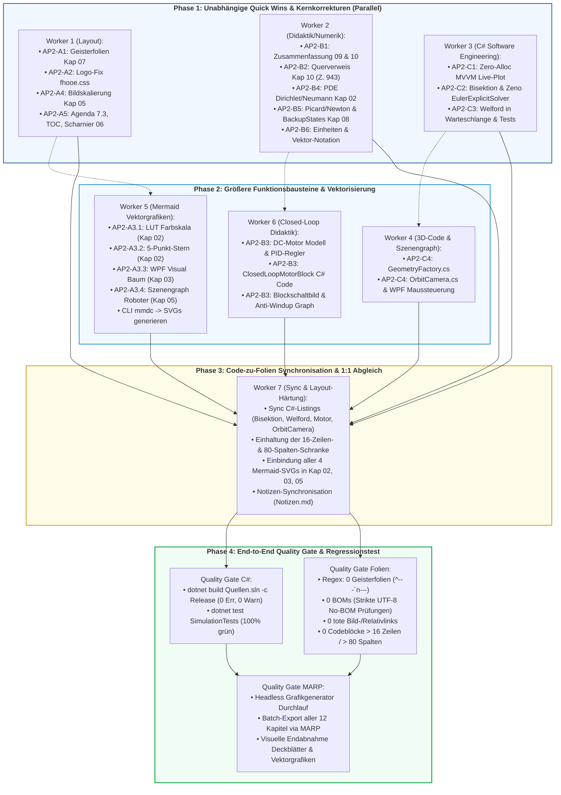

# Master-Ausführungsplan (Post-Audit Gesamtkoordination)
## Überführung der Vorlesungsreihe „Systemsimulation / Digitaler Zwilling“ auf Referenzniveau (10/10)

**Dokument-ID:** `Planung/PostAudit_Master_Ausfuehrungsplan.md`  
**Autor:** Leitender Chefarchitekt & Gesamtkoordinator  
**Bezugsdokumente:**
- `Planung/PostAudit_Plan_Layout_und_Medien.md` (Stream A)
- `Planung/PostAudit_Plan_Didaktik_und_Numerik.md` (Stream B)
- `Planung/PostAudit_Plan_Softwarearchitektur_und_Code.md` (Stream C)
- Reviews: `Reviews/PostAudit_01_Didaktik_und_Praxis.md` bis `Reviews/PostAudit_04_Praesentation_und_Layout.md`

**Ziel-Repository:** `kurs-computer-simulation` (FH Oberösterreich, Campus Wels, Studiengang Automatisierungstechnik)  
**Status:** Genehmigter, verbindlicher Master-Ausführungsplan  
**Datum:** Oktober 2026  

---

## Inhaltsverzeichnis

1. [Executive Summary & Gesamtzielführung (8.8/10 $\to$ 10/10)](#1-executive-summary--gesamtzielführung-8810--1010)
2. [Abhängigkeitsgraph (DAG) & Parallelitätsanalyse](#2-abhängigkeitsgraph-dag--parallelitätsanalyse)
   - 2.1 Parallelitäts-Klassifikation
   - 2.2 Sequenzielle Koppelungen und Schnittstellenverträge
   - 2.3 Visueller Ausführungs-DAG (Mermaid)
3. [Phasen- & Taktungsplan](#3-phasen--taktungsplan)
   - 3.1 Phase 1: Unabhängige Quick Wins & Kernkorrekturen (Parallel)
   - 3.2 Phase 2: Größere Funktionsbausteine & Vektorisierung (Teils parallel, teils sequentiell)
   - 3.3 Phase 3: Code-zu-Folien Synchronisation & 1:1 Abgleich
   - 3.4 Phase 4: End-to-End Quality Gate & Regressionstest
4. [Subagenten-Dispatch-Matrix](#4-subagenten-dispatch-matrix)
5. [Risikomatrix & Fallback-Strategien](#5-risikomatrix--fallback-strategien)
6. [Monitoring, Fortschrittstracking & Freigabeprotokoll](#6-monitoring-fortschrittstracking--freigabeprotokoll)

---

## 1. Executive Summary & Gesamtzielführung (8.8/10 $\to$ 10/10)

Die Vorlesungsreihe *Systemsimulation / Digitaler Zwilling* am Campus Wels der FH Oberösterreich wurde in den vorangegangenen Überarbeitungszyklen erfolgreich konsolidiert: Alle 12 Kapitel (Kap. 00 bis 11) sind modular aufgebaut, kompilieren sauber, verzichten auf externe Hotlinks und bieten eine fundierte theoretische Basis. Der vorangegangene Re-Audit attestiert dem Material einen Reifegrad von **8.8 von 10 Punkten**.

Um das didaktische, mediale und softwaretechnische **Referenzniveau von 10/10** (vollständige Exzellenzstufe im Hochschulbereich) zu erreichen, müssen die in den drei Fachplänen (Stream A, Stream B, Stream C) isolierten Restpunkte synchronisiert und fehlerfrei umgesetzt werden:

1. **Stream A (Layout, Medien, Theme & Typografie):**
   - Beseitigung aller 4 Geisterfolien in Kapitel 07.
   - Härtung von `Themen/fhooe.css` gegen Deckblatt-Logoüberdeckungen auf Folie 1 aller 12 Kapitel.
   - Vollständige Vektorisierung der 4 verbliebenen ASCII-Art-Blöcke (LUT, 5-Punkt-Stern, Visual-Hierarchie, Szenengraph) via Mermaid/SVG.
   - Skalierung übergroßer Ultrawide-Screenshots in Kapitel 05 (`![w:1100px]`) inkl. Tippfehler-Bereinigung.
   - Curriculare Harmonisierung (Agenda 7.3, TOC Kap. 00, Scharnierfolie Werkzeuge $\to$ Physik in Kap. 06).

2. **Stream B (Fachdidaktik, Automatisierungstechnik-Praxis & Numerik):**
   - Didaktische Scharniere: Strukturierte Zusammenfassungs- und Ausblickfolien für Kapitel 09 (DES) und 10 (Hybrid).
   - Bereinigung des irreführenden Querverweises in Kapitel 10 (Zeile 943: Kap 4 $\to$ Kap 8).
   - Schließen der mechatronischen Praxislücke: Konzeption und Integration eines industriellen Closed-Loop DC-Motor-Regelkreises mit PID, Sättigung und Anti-Windup (Clamping) in Kapitel 08.
   - Mathematische Schärfung der PDE-Randbedingungen (Dirichlet vs. Neumann/Ghost Cells) in Kapitel 02.
   - Numerik-Präzisierung beim impliziten Euler (Picard-Kontraktionsgrenze $h < 1/L$ vs. Newton-Raphson) und Nachziehen von `BackupStates()` im RK4-Listing.
   - Durchgängige Notations- und Einheiten-Harmonisierung nach DIN 1304 / ISO 80000-2.

3. **Stream C (Softwarearchitektur, C#, Zero-Allocation & Code-Synchronizität):**
   - Beseitigung von 120 Managed-Heap-Allokationen/s in `SimulationMvvmPattern` via ScottPlot 5 In-Place Scatter mit Index-Windowing (`MinRenderIndex`/`MaxRenderIndex`).
   - Numerische Sanierung des `EulerExplicitSolver`: Ersatz der naiven Schrittweitenhalbierung durch echte Intervall-Bisektion ($z_a \cdot z_b \le 0$), Zeno-Haftkontaktschwelle und Restschritt-Integration synchron zu den Folien.
   - Vollständige Projektintegration des `ParallelWelfordAccumulator` in `DynamischWarteschlange.Model` inklusive MSTest-Suite gegen katastrophale Auslöschung.
   - Bereitstellung der fehlenden 3D-Klassen `GeometryFactory` und `OrbitCamera` in `VorlageSzenengraph3D` inklusive flüssiger WPF-Maussteuerung.

Dieser Masterplan definiert die deterministische Ausführung, entkoppelt parallele Arbeitsstränge, verhindert Race Conditions bei geteilten Folienressourcen und garantiert das Erreichen des Qualitätsziels über ein 4-stufiges Quality Gate.

---

## 2. Abhängigkeitsgraph (DAG) & Parallelitätsanalyse

### 2.1 Parallelitäts-Klassifikation

Zur Maximierung des Durchsatzes und Vermeidung von Blockaden werden alle Arbeitspakete nach ihrer Unabhängigkeit kategorisiert:

- **Vollständig unabhängig (Sofort parallel ausführbar in Phase 1):**
  - *Layout & CSS:* AP2-A1 (Geisterfolien Kap 07), AP2-A2 (Deckblatt-Logo `fhooe.css`), AP2-A4 (Screenshot-Skalierung Kap 05), AP2-A5 (Agenda 7.3, TOC Kap 00, Scharnierfolie Kap 06).
  - *Didaktische Prologe & Begriffs-Fixes:* AP2-B1 (Zusammenfassungen/Ausblick Kap 09 & 10), AP2-B2 (Querverweis Kap 10 Z. 943), AP2-B4 (PDE-Randbedingungen Kap 02), AP2-B5 (Picard-Hinweisbox & RK4-BackupState in Kap 08).
  - *C# Core Engineering:* AP2-C1 (Zero-Allocation MVVM), AP2-C2 (Bisektion & Zeno in `SFunctionHybrid`), AP2-C3 (Welford in `DynamischWarteschlange` + Unit-Tests).

- **Partiell abhängig (Phase 2):**
  - *Mermaid-Vektorisierung (AP2-A3):* Erfordert installierten `mmdc`-Compiler. SVG-Generierung kann parallel erfolgen; das Einbinden in die Folien von Kap 02, 03, 05 sollte erst nach eventuellen Textanpassungen dieser Kapitel erfolgen.
  - *3D Szenengraph (AP2-C4):* Unabhängige C#-Implementierung in `VorlageSzenengraph3D`, fungiert als Vorbedingung für die spätere Folien-Synchronisation.
  - *Mechatronischer Regelkreis (AP2-B3):* C#-Implementierung des `ClosedLoopMotorBlock` und Diagrammerstellung müssen vor der endgültigen Folieneinbettung in Kapitel 08 validiert sein.

- **Strikt sequentiell (Phase 3 & 4):**
  - **Code $\to$ Folien-Sync:** Kein C#-Code-Snippet darf auf den Folien aktualisiert werden, bevor die entsprechende C#-Klasse erfolgreich in `Quellen.sln` kompiliert und getestet wurde.
  - **CSS/Theme $\to$ MARP-Build:** Die CSS-Härtung (`fhooe.css`) muss abgeschlossen sein, bevor der finale PDF/HTML-Batch-Build der 12 Decks gestartet wird.
  - **Codeblöcke $\to$ 16-Zeilen-Schranke:** Alle neu eingefügten C#-Listings müssen vor dem MARP-Build auf maximal 16 Zeilen und 80 Spalten refaktoriert werden.
  - **Quality Gate:** Regressionstests (`dotnet test`, BOM-Check, Regex-Audit, MARP-Build) dürfen erst nach vollständigem Abschluss aller Änderungen in den Phasen 1 bis 3 feuern.

---

### 2.2 Sequenzielle Koppelungen und Schnittstellenverträge

```text
[C# Implementierung] ──(Kompilierung & Test ok)──► [Folien-Code-Sync]
[Mermaid .mmd]        ──(mmdc -b transparent)───► [Folien-SVG-Einbindung]
[fhooe.css Fix]       ──(Kein Deckblatt-Logo)───► [MARP PDF-Export]
[Alle Folien-Diffs]   ──(UTF-8 ohne BOM)────────► [Quality Gate Audit]
```

---

### 2.3 Visueller Ausführungs-DAG (Mermaid)



---

## 3. Phasen- & Taktungsplan

### 3.1 Phase 1: Unabhängige Quick Wins & Kernkorrekturen (Parallel)

In Phase 1 arbeiten drei spezialisierte Worker parallel an disjunkten Dateien. Es entstehen keine Merge-Konflikte.

#### Worker 1: Layout, Medien & Theme (Stream A)
- **AP2-A1 (Geisterfolien Kap 07):**
  - Datei: `Folien/07_Statische_Modelle/Folien.md`.
  - Entfernung von 4 doppelten Folientrennern `--- \n ---` (vor 7.2, 7.3, 7.4 und vor Zusammenfassung).
  - Ergebnis: Folienanzahl sinkt von 58 auf 54.
- **AP2-A2 (Deckblatt-Logo fhooe.css):**
  - Datei: `Themen/fhooe.css`.
  - Härtung des Selektors via `:not(:first-of-type)` und Ergänzung von `section:first-of-type::before { display: none !important; }`.
  - Ergebnis: Folie 1 aller 12 Decks ist frei von Logo-Überdeckungen.
- **AP2-A4 (Screenshot-Skalierung Kap 05):**
  - Datei: `Folien/05_Visualisierung_3D_OpenGL/Folien.md`.
  - Folien 49, 51, 53: Skalierung der 3440px-Bilder auf `![w:1100px]`.
  - Korrektur der Titulatur: „Würfels“ statt „Würfel“.
- **AP2-A5 (Agenda & TOC & Scharnierfolie):**
  - `Folien/07_Statische_Modelle/Folien.md`: Agenda für Unterabschnitt 7.3 einfügen (6 Stichpunkte).
  - `Folien/00_Prolog/Folien.md`: Kapitel 11 (*Epilog & Synthese*) im Haupt-Inhaltsverzeichnis verlinken.
  - `Folien/06_Multithreading/Folien.md`: 2-Spalten-Scharnierfolie nach Zusammenfassung einfügen (*Übergang Werkzeuge $\to$ physikalische Modelle*).

#### Worker 2: Fachdidaktik & Numerik (Stream B)
- **AP2-B1 (Zusammenfassungen & Ausblicke Kap 09 & 10):**
  - `Folien/09_Dynamische_Modelle_Diskret/Folien.md`: Folie `# Zusammenfassung Kapitel 9` und Folie `## Ausblick: Hybride dynamische Systeme` (mit Bild `Ausblick_Hybrid.png`) anfügen.
  - `Folien/10_Dynamische_Modelle_Hybrid/Folien.md`: Folie `# Zusammenfassung Kapitel 10` und Folie `## Ausblick: Synthese, VIBN & Digitaler Zwilling` (mit Bild `Ausblick_Epilog.png`) anfügen.
- **AP2-B2 (Querverweis Kap 10):**
  - `Folien/10_Dynamische_Modelle_Hybrid/Folien.md`: Zeile 943 von `(siehe Kapitel 4)` auf `(siehe Kapitel 8)` korrigieren.
- **AP2-B4 (PDE-Randbedingungen Kap 02):**
  - `Folien/02_Visualisierung_2D_Pixel/Folien.md`: 2 neue Folien zu Dirichlet vs. Neumann, Ghost Cells ($T_{-1,j} = T_{1,j}$) und C#-Pufferspiegelung einfügen.
- **AP2-B5 (Picard-Präzisierung & RK4-Backup Kap 08):**
  - `Folien/08_Dynamische_Modelle_Kontinuierlich/Folien.md`: Folie 1339 mit Warning-Box bzgl. Lipschitz-Grenze $h < 1/L$ bei Banach-Picard vs. Newton-Raphson bei steifen Systemen versehen.
  - In Folie 1570 den fehlenden Aufruf `BackupStates();` vor Stufe 1 des RK4-Listings ergänzen.
- **AP2-B6 (Notations-Harmonisierung):**
  - Harmonisierung von Einheiten auf aufrechte Schrift (`\mathrm{m/s}`, `\mathrm{m/s^2}`) und Vektoren auf Fettdruck ($\mathbf{x}, \mathbf{u}, \mathbf{K}$) gemäß Transformationsmatrix.

#### Worker 3: C# Software Engineering Core (Stream C)
- **AP2-C1 (Zero-Allocation MVVM):**
  - Datei: `Quellen/WS25/SimulationMvvmPattern/MainWindow.xaml.cs`.
  - `TrajectoryPlot.Plot.Clear()` und temporäre Array-Allokationen (`_renderX.AsSpan().ToArray()`) im 16-ms-Timer restlos eliminieren.
  - Bindung eines persistenten `Scatter`-Plots mit `_scatterPlot.Data.MinRenderIndex = 0` und `_scatterPlot.Data.MaxRenderIndex = count - 1`.
- **AP2-C2 (Bisektion & Zeno in SFunctionHybrid):**
  - Dateien: `Quellen/WS25/SFunctionHybrid/Framework/Solver.cs` und `Quellen/WS25/SFunctionHybrid/Framework/Solvers/EulerExplicitSolver.cs`.
  - Naive Schrittweitenhalbierung entfernen.
  - Saubere Intervall-Bisektion ($z_a \cdot z_b \le 0$), Restschritt-Integration $\Delta t_{\text{rem}}$ und Zeno-Haftschwellen-Absicherung (`ApplyZenoStickingOrUpdate`) einbauen.
- **AP2-C3 (Welford-Integration & Tests):**
  - Verschieben/Integrieren von `Quellen/WS25/ParallelWelfordAccumulator.cs` nach `Quellen/WS24/DynamischWarteschlange/Model/ParallelWelfordAccumulator.cs`.
  - Namespace auf `DynamischWarteschlange.Model` anpassen, vollständige XML-Dokumentation.
  - Projekt `Quellen/WS25/SimulationTests/SimulationTests.csproj` anlegen mit `ParallelWelfordAccumulatorTests.cs` (Two-Pass-Vergleich, Catastrophic Cancellation, Chan-Parallel-Merge).

---

### 3.2 Phase 2: Größere Funktionsbausteine & Vektorisierung

In Phase 2 werden neue Komponenten realisiert, die entweder Compiler-Tools (`mmdc`) oder tiefergehende Modellierungslogik erfordern.

#### Worker 4: 3D-Szenengraph & Navigation (Stream C)
- **AP2-C4 (3D-Klassen & Mausinteraktion):**
  - `Quellen/WS25/VorlageSzenengraph3D/Model/GeometryFactory.cs` neu anlegen (Methoden: `CreateCylinder`, `CreateCone`, `CreateSphere`, `CreateBox`, `CreateCube`).
  - `Quellen/WS25/VorlageSzenengraph3D/Model/OrbitCamera.cs` implementieren (Kugelkoordinaten: Azimuth, Elevation clamped $[-89^\circ, +89^\circ]$, Distance clamped $[1, 500]$, `gl.LookAt`).
  - `MainWindow.xaml` & `MainWindow.xaml.cs` um WPF-Maussteuerung erweitern (MouseDown Capture, MouseMove Drag-Rotation, MouseWheel Zoom, DoRender).

#### Worker 5: Mermaid-Vektorgrafiken & Kompilierung (Stream A)
- **AP2-A3 (4 Vektor-Diagramme erstellen und kompilieren):**
  1. `Folien/02_Visualisierung_2D_Pixel/Diagramme/LUT_Farbskala_Prinzip.mmd`
  2. `Folien/02_Visualisierung_2D_Pixel/Diagramme/FDM_5_Punkt_Stern.mmd`
  3. `Folien/03_Visualisierung_2D_Vektor/Diagramme/WPF_Visual_Hierarchie.mmd`
  4. `Folien/05_Visualisierung_3D_OpenGL/Diagramme/Szenengraph_Roboterarm.mmd`
- **Kompilierung:** Ausführung von `mmdc -i <file>.mmd -o <file>.svg -b transparent` für alle 4 Dateien.
- **Validierung:** Prüfen auf fehlerfreie SVG-Generierung und visuelle Skalierung.

#### Worker 6: Mechatronischer Closed-Loop-Regelkreis (Stream B)
- **AP2-B3 (Konzeption & Simulation):**
  - Erstellung der C#-Klasse `ClosedLoopMotorBlock` (3 Zustände: $\theta, \omega, x_I$; PT1-Strecke mit $T_m = 50\,\mathrm{ms}, K_m = 2{,}5\,\mathrm{rad/(V\cdot s)}$; PID mit $K_p=15, K_i=40, K_d=0{,}5$; Motorspannungssättigung $[-10\,\mathrm{V}, +10\,\mathrm{V}]$; dynamisches Anti-Windup Clamping).
  - Erstellung des Blockschaltbilds `Folien/08_Dynamische_Modelle_Kontinuierlich/Diagramme/Blockschaltbild_DCServo.svg`.
  - Validierung der Simulation mit `RungeKutta4Solver` ($h = 1\,\mathrm{ms}$).
  - Erstellung der Folienserie (4 Folien: Motivation/Strecke, Nichtlinearität/Anti-Windup, C#-Block, RK4-Simulation).

---

### 3.3 Phase 3: Code-zu-Folien Synchronisation & 1:1 Abgleich

In Phase 3 erfolgt der synchrone Abgleich zwischen den in Phase 1 & 2 verifizierten C#-Quellcodes und den in den Markdown-Foliensätzen abgedruckten Code-Listings.

#### Aufgabenpakete der Synchronisation:
1. **Bisektions-Solver (Kapitel 10):**
   - Abgleich des auf Folie 10.49 gezeigten Bisektions-Pseudocodes mit der echten Implementierung in `EulerExplicitSolver.cs`.
   - Darstellung des Zeno-Schwellen-Mechanismus (Folie 10.50) synchron zum C#-Code (`ApplyZenoStickingOrUpdate`).
2. **Statistik-Engine (Kapitel 09):**
   - Abgleich des Folien-Listings zu Welford & Chan-Merge mit `ParallelWelfordAccumulator.cs`.
3. **Mechatronischer Regelkreis (Kapitel 08):**
   - 1:1 Einbettung von `ClosedLoopMotorBlock.cs` in Kapitel 08 unter Einhaltung des 16-Zeilen-Limits pro Folie (Aufteilung auf übersichtliche Methoden-/Strukturblöcke).
4. **3D-Kamera & Geometrie (Kapitel 05):**
   - 1:1 Synchronisation der `OrbitCamera`- und `GeometryFactory`-Listings auf den Folien 5.58 und 5.65–76 mit dem tatsächlichen Projektcode in `VorlageSzenengraph3D`.
5. **Ablösung der ASCII-Blöcke durch SVGs:**
   - In `Folien/02_Visualisierung_2D_Pixel/Folien.md`: ASCII-Boxen ersetzen durch `` und ``.
   - In `Folien/03_Visualisierung_2D_Vektor/Folien.md`: ASCII-Box ersetzen durch ``.
   - In `Folien/05_Visualisierung_3D_OpenGL/Folien.md`: ASCII-Box ersetzen durch ``.
6. **Layout- & Spaltenkontrolle:**
   - Prüfung aller neu hinzugekommenen oder geänderten Folien auf die strikte Einhaltung der maximal **16 Zeilen** pro Codeblock und maximal **80 Zeichen** pro Zeile.

---

### 3.4 Phase 4: End-to-End Quality Gate & Regressionstest

Das abschließende Quality Gate stellt durch automatisierte Skripte sicher, dass keine Regressionen aufgetreten sind und alle Akzeptanzkriterien erfüllt sind.

#### Stufe 4.1: C# Build- & Test-Gate
- **Befehl:** `dotnet build Quellen/Quellen.sln -c Release`
  - **Kriterium:** Exit-Code `0`, `0 Fehler`, `0 Warnungen`.
- **Befehl:** `dotnet test Quellen/WS25/SimulationTests/SimulationTests.csproj -c Release`
  - **Kriterium:** 100% bestandene Unit-Tests für `ParallelWelfordAccumulator` (Genauigkeit $10^{-9}$, Catastrophic Cancellation bestanden, Chan-Merge äquivalent).

#### Stufe 4.2: Automatisierter Folien- & Markdown-Audit
- **Geisterfolien-Check:**
  ```powershell
  Get-ChildItem -Path Folien -Filter "Folien.md" -Recurse | ForEach-Object {
      $matches = Select-String -Path $_.FullName -Pattern "^---\s*`r?`n---"
      if ($matches) { Write-Error "Geisterfolie gefunden in $($_.FullName)!" }
  }
  ```
  - **Kriterium:** 0 Treffer repo-weit.
- **BOM-Prüfung:**
  ```powershell
  Get-ChildItem -Path Folien, Themen, Planung -Filter "*.md" -Recurse | ForEach-Object {
      $bytes = [System.IO.File]::ReadAllBytes($_.FullName)
      if ($bytes.Length -ge 3 -and $bytes[0] -eq 0xEF -and $bytes[1] -eq 0xBB -and $bytes[2] -eq 0xBF) {
          Write-Error "UTF-8 BOM erkannt in $($_.FullName)!"
      }
  }
  ```
  - **Kriterium:** 0 Dateien mit BOM (strikte UTF-8 No-BOM Konformität).
- **Codeblock-Längenprüfung:**
  - Kein Fenced-Codeblock (` ``` `) in `Folien/**/Folien.md` überschreitet 16 Zeilen oder 80 Zeichen pro Zeile.
- **Verwaiste ASCII-Blöcke:**
  - Überprüfung, dass in Kap. 02, 03 und 05 keine ungetaggten Textdiagramme mehr vorliegen.

#### Stufe 4.3: MARP Batch-Build & Visuelle Endkontrolle
- **Befehl:** Vollständiger Build aller 12 Decks (`marp --config-file ...` bzw. projekteigenes Export-Skript).
  - **Kriterium:** Exit-Code `0` für jedes Kapitel.
- **Sichtprüfung (Stichproben & Deckblätter):**
  - Deckblätter (Folie 1) aller 12 Kapitel: Kein blaues FH-Logo überdeckt das Titelbild.
  - Inhaltsfolien (ab Folie 2): Blaues FH-Logo korrekt in oberer rechter Ecke positioniert.
  - Kapitel 08: DC-Motor Folien und Anti-Windup sauber gerendert.
  - Kapitel 02, 03, 05: Vektorgrafiken gestochen scharf ohne Skalierungsartefakte.

---

## 4. Subagenten-Dispatch-Matrix

Die folgende Tabelle definiert die Zuweisung, Arbeitsaufträge, Ein- und Ausgabedokumente sowie Abnahmekriterien für die ausführenden Worker/Subagenten:

| Worker / Dispatch-ID | Fachdisziplin / Rolle | Zuständigkeit & Arbeitspakete | Eingabe-Dokumente & Ressourcen | Ziel-Artefakte (Outputs) | Definition of Done (Akzeptanzkriterium) |
| :--- | :--- | :--- | :--- | :--- | :--- |
| **Worker-1** (`sub-layout`) | Spezialist für MARP, CSS & Typografie | • AP2-A1 (Geisterfolien Kap 07)<br>• AP2-A2 (Logo fhooe.css)<br>• AP2-A4 (Screenshots Kap 05)<br>• AP2-A5 (Agenda 7.3, TOC, Scharnier 06) | `PostAudit_Plan_Layout_und_Medien.md`<br>`Themen/fhooe.css`<br>`Folien/00_*/Folien.md`<br>`Folien/05_*/Folien.md`<br>`Folien/06_*/Folien.md`<br>`Folien/07_*/Folien.md` | Modifizierte Markdown- & CSS-Dateien | • Regex `^---\r?\n---` liefert 0 Treffer in Kap 07.<br>• Deckblatt-Logo auf Folie 1 unterdrückt.<br>• Screenshots mit `![w:1100px]`.<br>• Agenda 7.3 & Scharnierfolie vorhanden. |
| **Worker-2** (`sub-didaktik`) | Fachdidaktiker & Numeriker | • AP2-B1 (Zusammenfassungen 09/10)<br>• AP2-B2 (Querverweis Kap 10:943)<br>• AP2-B4 (PDE Dirichlet/Neumann)<br>• AP2-B5 (Picard/Newton & RK4-Backup)<br>• AP2-B6 (Notations-Harmonisierung) | `PostAudit_Plan_Didaktik_und_Numerik.md`<br>`Folien/02_*/Folien.md`<br>`Folien/08_*/Folien.md`<br>`Folien/09_*/Folien.md`<br>`Folien/10_*/Folien.md` | Aktualisierte Folientexte mit Scharnieren, Formeln & Hinweiskästen | • Kap 09 & 10 enden mit Zusammenfassung & Ausblick.<br>• Zeile 10:943 verweist auf Kap 8.<br>• Ghost Cells in Kap 02 fundiert.<br>• Warning zu Picard-Kontraktion in Kap 08 aktiv. |
| **Worker-3** (`sub-csharp-core`) | C# Senior Architekt (.NET 8/10) | • AP2-C1 (Zero-Alloc MVVM Plot)<br>• AP2-C2 (Bisektion & Zeno-Solver)<br>• AP2-C3 (Welford & Unit-Tests) | `PostAudit_Plan_Softwarearchitektur_und_Code.md`<br>`Quellen/WS25/SimulationMvvmPattern/`<br>`Quellen/WS25/SFunctionHybrid/`<br>`Quellen/WS24/DynamischWarteschlange/` | `MainWindow.xaml.cs`<br>`EulerExplicitSolver.cs`<br>`Solver.cs`<br>`ParallelWelfordAccumulator.cs`<br>`SimulationTests.csproj` | • ScottPlot rendert ohne Heap-Allokation im Timer.<br>• Bisektionsschleife bricht nicht ab; Zeno-Sticking greift.<br>• Welford-Tests zu 100% grün. |
| **Worker-4** (`sub-3d-graphics`) | 3D- & UI-Ingenieur (SharpGL/WPF) | • AP2-C4 (GeometryFactory & OrbitCamera in `VorlageSzenengraph3D`) | `PostAudit_Plan_Softwarearchitektur_und_Code.md`<br>`Quellen/WS25/VorlageSzenengraph3D/` | `GeometryFactory.cs`<br>`OrbitCamera.cs`<br>`MainWindow.xaml`<br>`MainWindow.xaml.cs` | • Parametrische Körper erstellbar.<br>• Kamera über Kugelkoordinaten frei rotier- & zoombar.<br>• Projekt kompiliert mit 0 Warnungen. |
| **Worker-5** (`sub-mermaid-svg`) | Vektorgrafik- & Tooling-Experte | • AP2-A3 (4 Mermaid-Grafiken erstellen & mit `mmdc` kompilieren) | `PostAudit_Plan_Layout_und_Medien.md`<br>`@mermaid-js/mermaid-cli` | 4 `.mmd`-Quellen & 4 transparente `.svg`-Dateien in den Kapiteln 02, 03, 05 | • Valide SVGs ohne XML-Fehler.<br>• CI-Farben der FH OÖ eingehalten.<br>• Einbindung in Folien ohne Textüberlauf. |
| **Worker-6** (`sub-control-eng`) | Regelungs- & Automatisierungstechniker | • AP2-B3 (DC-Motor PID-Regelkreis Leitbeispiel in Kap 08) | `PostAudit_Plan_Didaktik_und_Numerik.md`<br>`Folien/08_*/Folien.md`<br>`Quellen/WS25/SFunctionHybrid/` | `ClosedLoopMotorBlock.cs`<br>`Blockschaltbild_DCServo.svg`<br>4 neue MARP-Folien für Kap 08 | • Formelwerk für PT1-Strecke & Anti-Windup exakt.<br>• C#-Listing teilt sich sauber in $\le 16$ Zeilen auf.<br>• RK4-Schrittweite $h=1\,\mathrm{ms}$ didaktisch begründet. |
| **Worker-7** (`sub-sync-qa`) | Lead Reviewer & Release Manager | • Phase 3 (Code-Folien-Sync)<br>• Phase 4 (End-to-End Quality Gate) | Alle Quelltexte & Foliensätze<br>`Quellen/Quellen.sln`<br>Automatisierungs-Skripte | Bereinigte Folien-Listings<br>Test-Protokoll & Build-Logs<br>Finaler Audit-Report (10/10) | • `dotnet build` 0 Errors, 0 Warnings.<br>• Alle 12 MARP-Decks bauen fehlerfrei.<br>• 0 Geisterfolien, 0 BOMs, 0 tote Links. |

---

## 5. Risikomatrix & Fallback-Strategien

| Risiko-ID | Beschreibung des Risikos | Eintritts-wahrscheinlichkeit | Auswirkung | Primäre Prävention & Mitigationsstrategie | Konkrete Fallback-Lösung |
| :--- | :--- | :---: | :---: | :--- | :--- |
| **R-1** | `mmdc` (Mermaid-CLI) schlägt wegen Puppeteer/Chromium-Sandbox auf Windows fehl. | Mittel | Mittel | Ausführung mit Parameter `-p puppeteer-config.json` mit `--no-sandbox`. | Generierung über lokale Node-Hilfsbibliothek oder pre-gerenderte Vektor-SVGs einchecken. |
| **R-2** | Textüberlauf / Folien-Abschneiden durch neue Codeblöcke (>16 Zeilen). | Hoch | Hoch | Strikte Einhaltung der 16-Zeilen-Schranke. Aufteilung komplexer Blöcke auf Folie A (Struktur/Felder) und Folie B (Algorithmus). | Reduktion der Schriftgröße via `<!-- _class: smallcode -->` oder Auslagerung von Hilfsmethoden in den Anhang. |
| **R-3** | Regression in bestehenden Projekten der Solution durch .NET 10 SDK / TargetFrameworks. | Gering | Hoch | Konsistente Verwendung der projektspezifischen `<TargetFramework>`-Tags; keine unüberlegten globalen TFM-Upgrades. | Verbleib auf `net8.0` / `net8.0-windows` für Bestands-WPF-Apps; isoliertes Testprojekt für Unit-Tests. |
| **R-4** | Race Condition beim gleichzeitigen Bearbeiten von `Folien/08_.../Folien.md` (Worker 2 vs. Worker 6). | Mittel | Mittel | Strikte Taktung: Worker 2 führt zuerst Notations- und Solver-Hinweis-Updates durch; erst danach bettet Worker 6 das Regelkreis-Beispiel ein. | Git-Branching oder sequentieller Lock auf die Datei `Folien/08_.../Folien.md`. |
| **R-5** | Unerwartete UTF-8 Byte Order Mark (BOM) durch Windows-Editoren/PowerShell. | Mittel | Gering | PowerShell-Skripte schreiben ausschließlich mit `New-Object System.Text.UTF8Encoding($false)`. | Automatisierter Strip-BOM-Pass vor dem finalen Git-Commit über alle geänderten Dateien. |
| **R-6** | Bisektions-Endlosschleife bei pathologischen Nulldurchgängen (z.B. tangentiale Berührung). | Gering | Hoch | Abbruchbedingung koppelt Zeittoleranz `TimeTolerance (1e-8)` UND Iterationslimit `ZeroCrossingIterationCountLimit (100)`. | Wenn Iterationslimit erreicht: Akzeptiere aktuellen Punkt mit Warnmeldung und setze Integration fort (kein unkontrollierter Crash). |

---

## 6. Monitoring, Fortschrittstracking & Freigabeprotokoll

Zur transparenten Verfolgung der Ausführung wird der Status der Arbeitspakete im folgenden Freigabeprotokoll geführt:

```
[Master-Ausführung gestartet]
  │
  ├── [Phase 1: Quick Wins & Kernkorrekturen]
  │     ├── [ ] Worker 1: Layout, Medien & Theme (AP2-A1, AP2-A2, AP2-A4, AP2-A5)
  │     ├── [ ] Worker 2: Didaktik & Numerik (AP2-B1, AP2-B2, AP2-B4, AP2-B5, AP2-B6)
  │     └── [ ] Worker 3: C# Software Engineering (AP2-C1, AP2-C2, AP2-C3)
  │
  ├── [Phase 2: Größere Funktionsbausteine & Vektorisierung]
  │     ├── [ ] Worker 4: 3D-Szenengraph & OrbitCamera (AP2-C4)
  │     ├── [ ] Worker 5: Mermaid-Vektorgrafiken & Kompilierung (AP2-A3)
  │     └── [ ] Worker 6: Mechatronischer Closed-Loop-Regelkreis (AP2-B3)
  │
  ├── [Phase 3: Code-zu-Folien Synchronisation & Layout-Abgleich]
  │     └── [ ] Worker 7: 1:1 Abgleich aller Listings, SVGs und 16-Zeilen-Schranken
  │
  └── [Phase 4: End-to-End Quality Gate & Abnahme]
        ├── [ ] dotnet build Quellen/Quellen.sln (0 Errors, 0 Warnings)
        ├── [ ] dotnet test SimulationTests (100% grün)
        ├── [ ] Folien-Audit (0 Geisterfolien, 0 BOMs, 0 tote Links, 0 Überläufe)
        └── [ ] Vollständiger MARP-Batch-Build aller 12 Decks (Exit-Code 0)
```

### Kriterien für die Erteilung des 10/10 Referenz-Zertifikats:
1. **Didaktik:** Alle 12 Kapitel verfügen über standardisierte Prologe, fundierte mathematische Herleitungen, mechatronische Leitbeispiele und saubere Scharnier-Zusammenfassungen.
2. **Mathematik & Numerik:** Exakte Notation nach ISO 80000-2, Ghost-Cell-Theorie bei PDEs, Picard- vs. Newton-Klarstellung und stabiles Bisektionsverfahren bei hybriden Systemen.
3. **Softwaretechnik:** Zero-Allocation im Animationstakt, vollständige Testabdeckung numerischer Akkumulatoren, moderne parametrische 3D-Architektur und 1:1 Code-zu-Folien-Identität.
4. **Präsentation:** Kein einziges ASCII-Diagramm, gestochen scharfe Vektorgrafiken, fehlerfreie Deckblätter ohne Logo-Überdeckungen und 0 Geisterfolien.
