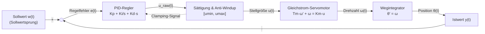

# Fachdidaktischer & Numerischer Ausführungsplan (Stream B)
## Post-Audit-Sanierung: Fachdidaktik, Automatisierungstechnik-Praxis & Numerik

**Dokument-ID:** `Planung/PostAudit_Plan_Didaktik_und_Numerik.md`  
**Autor:** Spezialist für Fachdidaktik, Automatisierungstechnik und Numerik (Stream B)  
**Bezugsdokumente:**  
- `Reviews/PostAudit_01_Didaktik_und_Praxis.md`  
- `Reviews/PostAudit_02_Mathematik_und_Numerik.md`  
**Zielgruppe:** Dozierende, Modulverantwortliche und Entwickler der Lehrveranstaltung *Systemsimulation / Digitaler Zwilling* (FH Oberösterreich, Campus Wels, Bachelor Automatisierungstechnik)  
**Status:** Detaillierter Umsetzungs- und Implementierungsplan  
**Datum:** Oktober 2026  

---

## Inhaltsverzeichnis

1. [Executive Summary & Gesamtzielsetzung](#1-executive-summary--gesamtzielsetzung)
2. [AP2-B1: Zusammenfassungs- & Ausblickfolien für Kapitel 09 und Kapitel 10](#2-ap2-b1-zusammenfassungs---ausblickfolien-für-kapitel-09-und-kapitel-10)
   - 2.1 Kapitel 09: Strukturierte Zusammenfassung & Ausblick auf Hybride Systeme
   - 2.2 Kapitel 10: Strukturierte Zusammenfassung & Scharnier zum Epilog
3. [AP2-B2: Korrektur des veralteten Querverweises in Kapitel 10](#3-ap2-b2-korrektur-des-veralteten-querverweises-in-kapitel-10)
4. [AP2-B3: Automatisierungstechnisches Leitbeispiel in Kapitel 08 (Closed-Loop PID-Regelkreis)](#4-ap2-b3-automatisierungstechnisches-leitbeispiel-in-kapitel-08-closed-loop-pid-regelkreis)
   - 4.1 Didaktische Motivation & Automatisierungskontext (Campus Wels)
   - 4.2 Mathematisches Modell (PT1-Strecke, PID mit Stellgrößensättigung und Anti-Windup)
   - 4.3 Blockschaltbild & Signalfluss
   - 4.4 Konkrete MARP-Folien & C#-Architektur mit RK4
5. [AP2-B4: Didaktische & mathematische Schärfung der PDE-Randbedingungen in Kapitel 02](#5-ap2-b4-didaktische--mathematische-schärfung-der-pde-randbedingungen-in-kapitel-02)
   - 5.1 Mathematische Fundierung: Dirichlet vs. Neumann
   - 5.2 Diskrete Abbildung im Pixelgitter (Ghost Cells & Randindizes)
   - 5.3 Konkreter Folienentwurf für Kapitel 02
6. [AP2-B5: Numerik-Präzisierung beim impliziten Euler in Kapitel 08](#6-ap2-b5-numerik-präzisierung-beim-impliziten-euler-in-kapitel-08)
   - 6.1 Das Paradoxon der Picard-Iteration bei steifen DGLs
   - 6.2 Newton-Raphson-Verfahren zur Wiederherstellung unbedingter A-Stabilität
   - 6.3 Bereinigung des fehlenden `BackupStates()`-Aufrufs im RK4-Listing
   - 6.4 Konkrete Folientexte & Folienupdates
7. [AP2-B6: Harmonisierung von Notationsstandards und physikalischen Einheiten](#7-ap2-b6-harmonisierung-von-notationsstandards-und-physikalischen-einheiten)
   - 7.1 Typografische Standardisierung (ISO 80000-2 & DIN 1304)
   - 7.2 Fundstellen-Katalog & Transformationsmatrix
8. [Arbeitsablauf, Abhängigkeiten & Abnahme-Checkliste](#8-arbeitsablauf-abhängigkeiten--abnahme-checkliste)

---

## 1. Executive Summary & Gesamtzielsetzung

Die vorangegangenen Überarbeitungen (Phasen 1 bis 4) haben das mathematische und architektonische Fundament des Kurses *Systemsimulation / Digitaler Zwilling* an der FH Oberösterreich Campus Wels signifikant gestärkt. Die nachfolgenden Post-Audits (`PostAudit_01_Didaktik_und_Praxis.md` und `PostAudit_02_Mathematik_und_Numerik.md`) haben jedoch sechs präzise Schnittstellenfehler, didaktische Asymmetrien und numerische Unschärfen identifiziert:

| AP-ID | Kernaufgabe | Primäre Fundstelle | Zielsetzung |
| :--- | :--- | :--- | :--- |
| **AP2-B1** | Zusammenfassungs- & Ausblickfolien | `Folien/09_.../Folien.md`<br>`Folien/10_.../Folien.md` | Beseitigung der abrupten Kapitelabbrüche; didaktischer Scharnierbau zwischen DES $\to$ Hybrid $\to$ Epilog. |
| **AP2-B2** | Bereinigung Querverweis | `Folien/10_.../Folien.md:943` | Korrektur des falschen Verweises „Kapitel 4“ auf das tatsächliche Solver-Kapitel „Kapitel 8“. |
| **AP2-B3** | Mechatronischer Closed-Loop-Regelkreis | `Folien/08_.../Folien.md` | Schließen der Praxis-Lücke: Gleichstrom-Antrieb mit PID, Sättigung, Anti-Windup und RK4-Simulation. |
| **AP2-B4** | PDE-Randbedingungen (Dirichlet & Neumann) | `Folien/02_.../Folien.md` | Didaktische & mathematische Schärfung der Wandbedingungen im 2D-Temperaturgitter (Ghost Cells). |
| **AP2-B5** | Numerik-Klarstellung impliziter Euler | `Folien/08_.../Folien.md` | Aufdeckung der Lipschitz-Grenze $h < 1/L$ bei Banach-Picard; Begründung für Newton-Raphson bei steifen Systemen; Korrektur `BackupStates()` in RK4. |
| **AP2-B6** | Notations- & Einheiten-Harmonisierung | Global (Kap. 02, 03, 05, 07, 08, 10) | Einheitliche Vektoren $\mathbf{x}$, Matrizen $\mathbf{K}$ und aufrechte Einheiten nach DIN 1304 ($\mathrm{m/s}$). |

Dieser Fachplan liefert die schlüsselfertigen Markdown-Folientexte, mathematischen Herleitungen, Blockschaltbilder und Codebausteine zur direkten Umsetzung.

---

## 2. AP2-B1: Zusammenfassungs- & Ausblickfolien für Kapitel 09 und Kapitel 10

### 2.1 Kapitel 09: Strukturierte Zusammenfassung & Ausblick auf Hybride Systeme

#### 2.1.1 Problemstellung & Ist-Zustand
In `Folien/09_Dynamische_Modelle_Diskret/Folien.md` bricht das Skriptum nach Zeile 1349 (C#-Listing zur statistischen Konfidenzintervall-Auswertung mit `globalAcc`) unvermittelt ab. Studierende erhalten weder eine prägnante Rekapitulation des Prüfungsstoffs noch einen didaktischen Übergang zu Kapitel 10 (Hybride Modelle).

#### 2.1.2 Folienentwurf 1: `# Zusammenfassung Kapitel 9`
Die Zusammenfassung bündelt die sechs tragenden Säulen der diskreten Ereignissimulation:
1. **Diskrete Ereignissimulation (DES):** Sprunghafte Zustandsänderungen zu ungleichförmigen Zeitpunkten mittels Next-Event Time Advance über eine priorisierte Ereignis-Warteschlange (`PriorityQueue<TEvent, double>`).
2. **Kausalitätsprinzip für Dauern:** Bedien- und Zwischenankunftszeiten dürfen niemals negativ werden ($P(T < 0) = 0$). Log-Normal- und Exponentialverteilungen garantieren strikte physikalische Kausalität.
3. **Inversionsmethode & Box-Muller:** Exakte Zufallszahlengenerierung aus Standardgleichverteilung $U \sim \mathcal{U}(0,1)$ via Quantilfunktion $F^{-1}(U)$ bzw. Polartransformation für Standardnormalverteilung.
4. **Multithread-PRNG-Seeding:** Vermeidung korrelierter Pseudozufallsfolgen durch deterministische Entkopplung über `HashCode.Combine(baseSeed, threadIndex)`.
5. **Welford-Algorithmus & Chan-Merge:** Allokationsfreie $O(1)$-Berechnung von Mittelwert und Varianz im 1-Pass-Verfahren; exakte verlustfreie Verschmelzung in `Parallel.For` ohne numerische Auslöschung.
6. **Statistische Validierung:** Quantifizierung von Simulationsunsicherheiten über den Stichprobenumfang $N$ und Angabe des $95\%$-Konfidenzintervalls mittels Zentralem Grenzwertsatz.

```markdown
---

# Zusammenfassung Kapitel 9

- **Diskrete Ereignissimulation (DES):** Das System springt von Ereignis zu Ereignis (*Next-Event Time Advance*). Die Simulationszeit wird durch eine prioritätsgesteuerte Warteschlange (`PriorityQueue`) getaktet.
- **Kausalität bei Zeitdauern:** Die Normalverteilung $\mathcal{N}(\mu, \sigma^2)$ ist für Bedienzeiten unphysikalisch ($P(T < 0) > 0$). Kausalität erfordert streng positive Verteilungen wie die **Log-Normal-** oder **Exponentialverteilung**.
- **Zufallsvariablen-Erzeugung:** Kontinuierliche Verteilungen werden über die **Inversionsmethode** ($X = F^{-1}(U)$) oder Spezialverfahren wie die **Box-Muller-Transformation** aus Standardzufallszahlen gewonnen.
- **Deterministische Parallelität:** Bei Multithreading mit `Parallel.For` darf kein gemeinsames `Random`-Objekt genutzt werden. Sicheres Seeding erfolgt via `HashCode.Combine(baseSeed, i)`.
- **Welford-Algorithmus & Chan-Merge:** Ermöglicht numerisch stabile 1-Pass-Berechnung von Mittelwert und Varianz ohne Datenspeicherung ($O(1)$ Speicher) und fehlerfreie parallele Reduktion.
- **Statistische Aussagekraft:** Einzelne Simulationsläufe sind Zufallsexperimente. Belastbare Aussagen erfordern Monte-Carlo-Replikationen ($N \gg 1$) und die Angabe von **Konfidenzintervallen**.
```

#### 2.1.3 Folienentwurf 2: `## Ausblick: Hybride dynamische Systeme`
Diese Scharnierfolie schlägt die Brücke von rein getakteten/diskreten Vorgängen zu gemischten Systemen:

```markdown
---

<div class="columns">
<div class="three">

## Ausblick: Hybride dynamische Systeme

In der industriellen Praxis existieren kontinuierliche Physik und diskrete Ereignisse selten isoliert voneinander:

- **Kontinuierliche Welt (Kapitel 8):** Massen, Strömungen, Geschwindigkeiten und Temperaturen gehorchen Differentialgleichungen ($\dot{\mathbf{x}} = \mathbf{f}(\mathbf{x}, \mathbf{u})$).
- **Diskrete Welt (Kapitel 9):** Regler-Abtasttakte, Schaltzustände von Ventilen, Endlagensensoren und digitale Telegramme schalten instantan.
- **Die mechatronische Realität:**
  - Ein Druckluftzylinder fährt kontinuierlich aus, bis er hart auf einen mechanischen Anschlag prallt (*Stoß / Kontakt*).
  - Ein kontinuierlicher Füllstand löst bei Erreichen eines Schwellwerts einen Alarm aus (*Zero-Crossing / Schwellwert*).
  - Eine digitale SPS tastet kontinuierliche Motordrehzahlen mit festem Zyklus $\Delta t$ ab (*Sample-and-Hold*).

**Kapitel 10 führt beide Welten zusammen:** Die **Hybride Systemsimulation** mit S-Functions, Ereignisdetektion via Bisektion und der Beherrschung des gefürchteten Zeno-Phänomens!

</div>
<div class="two">


</div>
</div>
```

---

### 2.2 Kapitel 10: Strukturierte Zusammenfassung & Scharnier zum Epilog

#### 2.2.1 Problemstellung & Ist-Zustand
In `Folien/10_Dynamische_Modelle_Hybrid/Folien.md` endet der Text nach Zeile 1479 (`VariableSampleTime_Explizit.png`). Dem Kapitel fehlt die zusammenfassende Reflexion der komplexen hybriden Mechanismen (Bisektion, Zeno, Sticking) sowie das Scharnier zum Abschlusskapitel 11 (Epilog & Synthese).

#### 2.2.2 Folienentwurf 1: `# Zusammenfassung Kapitel 10`

```markdown
---

# Zusammenfassung Kapitel 10

- **Hybrides Paradigma:** Kombiniert kontinuierliche Dynamik ($\dot{\mathbf{x}}_c = \mathbf{f}(\mathbf{x}_c, \mathbf{x}_d, \mathbf{u}, t)$) mit diskreten Zustandsübergängen ($\mathbf{x}_d^+ = \mathbf{g}(\mathbf{x}_c, \mathbf{x}_d, \mathbf{u}, t)$).
- **S-Function-Architektur:** Etablierter Industriestandard zur modularen Kapselung von kontinuierlichen Ableitungen, getakteten Updates (`SampleTime`) und Zustands-Ereignissen (`ZeroCrossings`).
- **Nulldurchgangsdetektion (Zero-Crossings):** Schaltfunktionen $z(\mathbf{x}_c) = 0$ erkennen Ereignisse unabhängig vom festen Zeitschrittgitter.
- **Intervall-Bisektion:** Garantiert robuste Nullstelleneinkreisung über Vorzeichenwechsel ($\text{sgn}(z(t_a)) \neq \text{sgn}(z(t_b))$) und synchronisiert die verbleibende Restzeit $\Delta t_{\text{remaining}}$ exakt.
- **Zeno-Phänomen & Haftkontakt:** Unendliche Stoßhäufungen in endlicher Zeit ($dt \to 0$) werden numerisch durch energetische Haftschwellen (`nearZero` $\implies$ Umschaltung in Sticking-Modus) beherrscht.
- **Abtastraten-Koordination:** Diskrete und kontinuierliche Blöcke mit unterschiedlichen Tasks (Periodisch, Multirate, Variable Sample Time) koexistieren in einer gemeinsamen Simulations-Engine.
```

#### 2.2.3 Folienentwurf 2: `## Ausblick: Synthese, VIBN & Digitaler Zwilling (Kapitel 11)`

```markdown
---

<div class="columns">
<div class="three">

## Ausblick: Synthese, VIBN & Digitaler Zwilling

Mit Abschluss der vier Modellklassen verfügen Sie über das komplette theoretische und softwaretechnische Rüstzeug:

1. **Statisch kontinuierlich / diskret (Kapitel 2 & 7):** Stationäre Skalarfelder und elastische Fachwerke via LGS.
2. **Dynamisch kontinuierlich (Kapitel 8):** Physikalische Bewegungsgleichungen via ODE und RK4.
3. **Dynamisch diskret (Kapitel 9):** Stochastische Ereignisprozesse via Next-Event-Queues.
4. **Dynamisch hybrid (Kapitel 10):** Gekoppelte CPS-Systeme via S-Functions und Zero-Crossings.

**Im finalen Kapitel 11 (Epilog) vollenden wir den Bogen:**
- Wie werden diese Simulationsmodelle zur **Virtuellen Inbetriebnahme (VIBN)** von Sondermaschinen eingesetzt?
- Wie erfolgt der standardisierte Modellaustausch über **FMI / FMU** in industriellen Co-Simulationen?
- Leitfaden zur optimalen Vorbereitung auf die **Gesamtprüfung** im Fach Systemsimulation.

</div>
<div class="two">


</div>
</div>
```

---

## 3. AP2-B2: Korrektur des veralteten Querverweises in Kapitel 10

### 3.1 Fundstelle & Fehleranalyse
In `Folien/10_Dynamische_Modelle_Hybrid/Folien.md`, Zeile 938–949:
```markdown
<div class="columns">
<div class="three">

### Erweiterte Solver-Implementierungen

Die ursprüngliche Solver-Implementierung (siehe Kapitel 4) wurde um die folgenden Punkte erweitert, um mit den diskreten Zustandsübergängen umgehen zu können:
```

- **Fehlerursache:** Kapitel 04 behandelt *Visualisierung 2D: Diagramme & Graphen (ScottPlot & MSAGL)*. In einer frühen Konzeption des Curriculums lag die kontinuierliche Simulation weiter vorne. Im aktuellen Lehrplan wird der Basissolver (`EulerExplicitSolver`, S-Functions, Integratorblöcke) jedoch systematisch in **Kapitel 8 (Kontinuierliche Dynamische Modelle, Abschnitt 8.4 und 8.5)** aufgebaut.
- **Didaktische Konsequenz:** Studierende schlagen bei der Prüfungsvorbereitung in Kapitel 4 nach und finden dort Signalplots und Baumgraphen anstelle der Solver-Klassen vor.

### 3.2 Korrektur-Spezifikation
Textanpassung in Zeile 943:

```markdown
### Erweiterte Solver-Implementierungen

Die ursprüngliche kontinuierliche Solver-Architektur (**siehe Kapitel 8**) wurde um folgende Schnittstellen erweitert, um kontinuierliche Dynamik und diskrete Zustandsübergänge synchron zu integrieren:

- **Zustandsvektoren:** Verwaltung von `DiscreteStates` parallel zu `ContinuousStates`.
- **Ereignis-Monitoring:** Kontinuierliche Überwachung deklarierter Nulldurchgangsfunktionen (`ZeroCrossings`).
- **Ereignisgesteuertes State-Update:** Auslösen von `UpdateStates` bei Erreichen von `SampleTime`-Hits oder erfolgreicher Nullstellen-Bisektion.
```

---

## 4. AP2-B3: Automatisierungstechnisches Leitbeispiel in Kapitel 08 (Closed-Loop PID-Regelkreis)

### 4.1 Didaktische Motivation & Automatisierungskontext (Campus Wels)
Die Studierenden am Campus Wels sind angehende Ingenieure der *Automatisierungstechnik*. In der Praxis existiert nahezu kein technisches System als ungesteuertes, freies Anfangswertproblem (wie der freie Fall oder das ungedämpfte Pendel).  
Das zentrale Paradigma der Automatisierung ist der **geschlossene Regelkreis (Closed-Loop)**:
- Ein Aktor (z.B. ein Gleichstrom-Servomotor) soll eine Last auf eine gewünschte Drehzahl oder Position führen.
- Störungen (Lastmomentsprünge) und Modellunsicherheiten erfordern eine kontinuierliche Rückkopplung über Sensoren.
- **Reale Aktorbegrenzung:** Verstärker und Motoren besitzen physikalische Leistungsgrenzen (Maximalspannung $u_{\max}$, Stromgrenzen).
- **Numerisch-didaktisches Schlüsselphänomen:** Die Sättigung führt bei I-Anteilen zum gefürchteten **Integrator-Windup**, der in der Praxis zu dramatischem Überschwingen oder Instabilität führt.
- Die numerische Simulation des Gesamtsystems (Regler + Aktor + Strecke + Begrenzung) mittels **Runge-Kutta 4** beweist die Überlegenheit modularer S-Functions gegenüber starren analytischen Formeln.



### 4.2 Mathematisches Modell

#### 1. Mechatronische Strecke: DC-Servomotor mit Last (PT1-I-Verhalten)
Die elektromechanische Drehzahldynamik eines permanenterregten Gleichstrommotors bei vernachlässigbarer Ankerinduktivität ($L_A \ll R_A$) wird durch ein Verzögerungsglied 1. Ordnung (PT1) beschrieben:
$$T_m \dot{\omega}(t) + \omega(t) = K_m \cdot u(t) - c_L \cdot M_L(t)$$

Zusammen mit der Positionskinematik $\dot{\theta}(t) = \omega(t)$ ergibt sich das kontinuierliche Zustandsraummodell 2. Ordnung mit $\mathbf{x}_{\text{Strecke}} = \begin{pmatrix} \theta \\ \omega \end{pmatrix}$:

$$\begin{pmatrix} \dot{\theta} \\ \dot{\omega} \end{pmatrix} = \begin{pmatrix} 0 & 1 \\ 0 & -\frac{1}{T_m} \end{pmatrix} \begin{pmatrix} \theta \\ \omega \end{pmatrix} + \begin{pmatrix} 0 \\ \frac{K_m}{T_m} \end{pmatrix} u(t) + \begin{pmatrix} 0 \\ -\frac{c_L}{T_m} \end{pmatrix} M_L(t)$$

- $\theta(t)$: Motorwellenposition [$\mathrm{rad}$]
- $\omega(t)$: Winkelgeschwindigkeit / Drehzahl [$\mathrm{rad/s}$]
- $u(t)$: Motorspannung / Stellgröße [$\mathrm{V}$]
- $T_m$: Mechanische Antriebszeitkonstante (z.B. $T_m = 0{,}05\,\mathrm{s} = 50\,\mathrm{ms}$)
- $K_m$: Motorübertragungsbeiwert (z.B. $K_m = 2{,}5\,\mathrm{rad/(s \cdot V)}$)

#### 2. Kontinuierlicher PID-Regler mit Anti-Windup
Der Regelfehler lautet:
$$e(t) = w(t) - y(t) = \theta_{\text{soll}}(t) - \theta(t)$$

Die ungesättigte Stellgröße $u_{\text{raw}}(t)$ berechnet sich aus P-, I- und gefiltertem D-Anteil:
$$u_{\text{raw}}(t) = K_p \cdot e(t) + x_I(t) + K_d \cdot \frac{de(t)}{dt}$$

wobei der I-Zustand der Differentialgleichung folgt:
$$\dot{x}_I(t) = K_i \cdot e(t)$$

#### 3. Nichtlineare Stellgrößenbegrenzung (Sättigung)
Physikalische Aktoren (Leistungsendstufen) können nur Spannungen zwischen $u_{\min}$ und $u_{\max}$ stellen:
$$u(t) = \mathrm{sat}(u_{\text{raw}}(t), u_{\min}, u_{\max}) = \begin{cases} u_{\max}, & \text{wenn } u_{\text{raw}} > u_{\max} \\ u_{\text{raw}}, & \text{wenn } u_{\min} \le u_{\text{raw}} \le u_{\max} \\ u_{\min}, & \text{wenn } u_{\text{raw}} < u_{\min} \end{cases}$$

#### 4. Anti-Windup via Clamping (Conditional Integration)
Liegt Sättigung vor ($u(t) \neq u_{\text{raw}}(t)$) und treibt das Vorzeichen des Regelfehlers $e(t)$ den Integrator noch weiter in die Übersteuerung ($\text{sgn}(e) == \text{sgn}(u_{\text{raw}})$), wird das Aufintegrieren gestoppt:
$$\dot{x}_I(t) = \begin{cases} 0, & \text{wenn gesättigt und } e(t) \cdot u_{\text{raw}}(t) > 0 \\ K_i \cdot e(t), & \text{sonst} \end{cases}$$

### 4.3 Gesamt-DGL-System für den RK4-Solver
Das Gesamtsystem besitzt drei kontinuierliche Zustände $\mathbf{x}(t) = \begin{pmatrix} \theta(t) & \omega(t) & x_I(t) \end{pmatrix}^T \in \mathbb{R}^3$:

$$\mathbf{f}(t, \mathbf{x}) = \begin{pmatrix} \dot{\theta} \\ \dot{\omega} \\ \dot{x}_I \end{pmatrix} = \begin{pmatrix} \omega \\ -\frac{1}{T_m} \omega + \frac{K_m}{T_m} \mathrm{sat}(u_{\text{raw}}) \\ \dot{x}_I(\text{Anti-Windup}) \end{pmatrix}$$

### 4.4 Konkrete MARP-Folien für Kapitel 08

Die Sequenz wird als neuer krönender Unterabschnitt **8.7: Mechatronisches Leitbeispiel: Geschlossener Regelkreis** vor der Zusammenfassung eingebunden.

```markdown
---

## 8.7: Mechatronisches Leitbeispiel: Geschlossener Regelkreis

Dieser Abschnitt demonstriert die Systemsimulation an einem Kernproblem der Automatisierungstechnik:

- Modellierung eines Gleichstrom-Servomotors als kontinuierliche PT1-I-Strecke
- Entwurf eines PID-Reglers mit Sollwertsprung
- Nichtlineare Stellgrößenbegrenzung (Sättigung der Motorspannung)
- Beherrschung des Integrator-Windup durch dynamisches Anti-Windup (Clamping)
- Gekoppelte Lösung des 3-Zustandssystems mittels `RungeKutta4Solver`

---

<div class="columns">
<div class="three">

### DC-Servomotor: Kontinuierliches Streckenmodell

Die Drehzahl $\omega(t)$ und die Position $\theta(t)$ eines Servomotors folgen dem DGL-System:

$$\dot{\theta}(t) = \omega(t)$$
$$\dot{\omega}(t) = -\frac{1}{T_m} \omega(t) + \frac{K_m}{T_m} u(t)$$

- $\theta(t)$: Position der Abtriebswelle [$\mathrm{rad}$]
- $\omega(t)$: Drehzahl / Winkelgeschwindigkeit [$\mathrm{rad/s}$]
- $u(t)$: Vom Verstärker angelegte Spannung [$\mathrm{V}$]
- $T_m$: Mechanische Zeitkonstante ($T_m = 0{,}05\,\mathrm{s}$)
- $K_m$: Motorübertragungsfaktor ($K_m = 2{,}5\,\mathrm{rad/(s \cdot V)}$)

Die reale Endstufe begrenzt die Stellspannung auf $u(t) \in [-10\,\mathrm{V}, +10\,\mathrm{V}]$.

</div>
<div class="two">


**Zustandsraum:**
$$\mathbf{x}_{\text{Strecke}} = \begin{pmatrix} \theta \\ \omega \end{pmatrix}, \quad \dot{\mathbf{x}}_{\text{Strecke}} = \mathbf{A}\mathbf{x} + \mathbf{b}u$$

</div>
</div>

---

<div class="columns">
<div class="two">

### Nichtlinearität: Sättigung & Anti-Windup

Wird ein Sollwertsprung $w(t) = \theta_{\text{soll}}$ vorgegeben, erzeugt der I-Anteil bei Stellgrößenbegrenzung gefährliches Verhalten:

1. **Integrator-Windup:** Der Motor kann wegen $u_{\max} = 10\,\mathrm{V}$ nicht schneller beschleunigen. Der Integrator akkumuliert den Regelfehler $e(t)$ jedoch unbegrenzt weiter!
2. **Massives Überschwingen:** Erreicht die Position den Sollwert ($e=0$), ist der Integrator völlig überladen. Er baut die Ladung erst ab, wenn die Achse weit über das Ziel hinausgeschossen ist.
3. **Lösung: Anti-Windup (Clamping):**
   $$\dot{x}_I = \begin{cases} 0, & |u_{\text{raw}}| \ge u_{\max} \ \land \ e \cdot u_{\text{raw}} > 0 \\ K_i \cdot e(t), & \text{sonst} \end{cases}$$
   Der Integrator wird sofort angehalten, solange der Aktor am Anschlag steht!

</div>
<div class="two">


*Vergleich: Ohne Anti-Windup schwingt das System um 60 % über (rot). Mit Clamping reagiert die Achse aperiodisch stabil (grün).*

</div>
</div>

---

### C#-Implementierung: `ClosedLoopMotorBlock`

```csharp
public class ClosedLoopMotorBlock : Block
{
    public double Kp = 15.0, Ki = 40.0, Kd = 0.5;
    public double Tm = 0.05, Km = 2.5, UMax = 10.0;
    public double TargetPosition = 1.0; // Sollwert: 1 Radian Sprung

    public ClosedLoopMotorBlock() {
        ContinuousStates.AddRange(new[] { 0.0, 0.0, 0.0 }); // theta, omega, x_I
    }

    public override void CalculateDerivatives(double time) {
        double theta = ContinuousStates[0];
        double omega = ContinuousStates[1];
        double x_I   = ContinuousStates[2];

        double error = TargetPosition - theta;
        double u_raw = Kp * error + x_I - Kd * omega; // D-Anteil auf Istwert
        double u_sat = Math.Clamp(u_raw, -UMax, UMax);

        // Anti-Windup Clamping
        bool isSaturated = Math.Abs(u_raw) >= UMax;
        bool sameSign = (error * u_raw) > 0.0;
        double dx_I = (isSaturated && sameSign) ? 0.0 : Ki * error;

        Derivatives[0] = omega;
        Derivatives[1] = (-1.0 / Tm) * omega + (Km / Tm) * u_sat;
        Derivatives[2] = dx_I;
    }
}
```

---

<div class="columns">
<div class="three">

### Simulation mit `RungeKutta4Solver`

Der geschlossene Regelkreis wird mit unserem universellen RK4-Solver simuliert:

```csharp
var model = new Model();
var motor = new ClosedLoopMotorBlock();
model.Blocks.Add(motor);

var solver = new RungeKutta4Solver(model);
solver.TimeStep = 0.001; // 1 ms Zeitschritt

while (solver.Time <= 0.5) // 500 ms Regelung
{
    solver.Step();
    // Telemetrie erfassen: solver.Time, Position, Stellgröße
}
```

- **Abtastung & Zeitschritt:** Mit $h = 1\,\mathrm{ms}$ wird die Dynamik der elektrischen und mechanischen Pole ($T_m = 50\,\mathrm{ms}$) mit $50$ Stützpunkten pro Zeitkonstante hochpräzise aufgelöst.
- RK4 liefert selbst bei harten Schaltknicken der Sättigung exzellente Energiebilanzen und phasenreine Trajektorien.

</div>
<div class="two">


</div>
</div>
```

---

## 5. AP2-B4: Didaktische & mathematische Schärfung der PDE-Randbedingungen in Kapitel 02

### 5.1 Mathematische Fundierung: Dirichlet vs. Neumann
In `Folien/02_Visualisierung_2D_Pixel/Folien.md` wird die 2D-Wärmeleitungsgleichung $\frac{\partial T}{\partial t} = \alpha \Delta T + Q$ für ein Bildgitter abgeleitet.  
Bislang fehlt den Studierenden jedoch die elementare physikalische Klassifikation der Systemgrenzen $\partial\Omega$:

1. **Dirichlet-Randbedingung (1. Art - Feste Wandtemperatur):**
   $$T(\mathbf{x}, t)\big|_{\mathbf{x} \in \partial\Omega} = T_{\text{Rand}}(t)$$
   - *Physik:* Die Wand steht in direktem Kontakt mit einem unendlich großen Reservoir (z.B. gekühltes Gehäuse bei $0^\circ\mathrm{C}$ oder Heizplatte bei $100^\circ\mathrm{C}$).
   - *Im Pixelgitter:* Die Pixel auf den Rändern $x=0, x=W-1, y=0, y=H-1$ werden im Zeitschritt **nicht verändert** oder deterministisch auf $T_{\text{fixed}}$ festgehalten.

2. **Neumann-Randbedingung (2. Art - Wärmestrom / Isolation):**
   $$-\lambda \left( \nabla T \cdot \vec{n} \right) = q_{\text{Rand}}$$
   - *Spezialfall Homogene Neumann-Randbedingung ($q_{\text{Rand}} = 0$):*
     $$\frac{\partial T}{\partial n} = 0$$
   - *Physik:* **Adiabatische, thermisch perfekt isolierte Wand**. Es kann keine Wärme nach außen abfließen; die Wärmewelle wird an der Grenze reflektiert!

### 5.2 Diskrete Abbildung im Pixelgitter: Ghost Cells vs. Randspiegelung

Zur Berechnung des Laplace-Operators am Randpunkt $(0, j)$ fehlt dem 5-Punkt-Stern der linke Nachbar $(-1, j)$:
$$L_{0, j} = T_{1, j} + T_{-1, j} + T_{0, j+1} + T_{0, j-1} - 4 T_{0, j}$$

Über die zentrale Differenz der Ableitung senkrecht zur Wand:
$$\left.\frac{\partial T}{\partial x}\right|_{0, j} \approx \frac{T_{1, j} - T_{-1, j}}{2h} \stackrel{!}{=} 0 \implies T_{-1, j} = T_{1, j}$$

Wird dieser **Ghost-Cell-Zustand** eingesetzt, transformiert sich der 5-Punkt-Stern am isolierten Rand zu:
$$L_{0, j}^{\text{Neumann}} = 2 T_{1, j} + T_{0, j+1} + T_{0, j-1} - 4 T_{0, j}$$

In der Praxis rasterbasierter Grafiken (GPGPU, Bildpuffer) wird dies elegant durch **Randwert-Kopieren (Clamping/Spiegelung)** realisiert:
Vor dem Diffusionsschritt werden die Randpixel auf die Werte der inneren Nachbarpixel gesetzt ($T_{0, j} = T_{1, j}$), was den Wärmestrom exakt zu Null setzt.

### 5.3 Konkreter Folienentwurf für Kapitel 02

Diese Folie wird direkt nach Folie 525 (nach Stabilität / Maximumprinzip) vor dem Codebeispiel eingefügt.

```markdown
---

### Physikalische Randbedingungen: Dirichlet vs. Neumann

Jede partielle Differentialgleichung benötigt zwingend definierte Bedingungen an den Systemgrenzen $\partial\Omega$:

<div class="columns">
<div class="two">

**1. Dirichlet-Rand (Feste Temperatur):**
- Die Temperatur am Rand ist konstant vorgeschrieben:
  $$T(\mathbf{x}, t) = T_{\text{Wand}} = \text{const.}$$
- **Physik:** Gekühlter Kühlkörper, Eisbad ($0^\circ\mathrm{C}$).
- **Umsetzung im Gitter:** Die Randzeilen ($y=0, H-1$) und Randspalten ($x=0, W-1$) werden in der Berechnungsschleife ausgelassen:
  `Parallel.For(1, Height - 1, ...)`

</div>
<div class="two">

**2. Neumann-Rand (Adiabatisch / Isoliert):**
- Der Wärmestrom über die Normale $\vec{n}$ ist Null:
  $$\frac{\partial T}{\partial n} = 0 \iff -\lambda \nabla T \cdot \vec{n} = 0$$
- **Physik:** Perfekt gedämmte Gehäusewand.
- **Diskrete Ghost-Cell:** Aus $\frac{T_{1,j} - T_{-1,j}}{2h} = 0$ folgt $T_{-1,j} = T_{1,j}$:
  $$L_{0,j} = 2 T_{1,j} + T_{0,j+1} + T_{0,j-1} - 4 T_{0,j}$$
- Wärme staut sich am Rand und fließt nicht ab!

</div>
</div>

---

<div class="columns">
<div class="two">

### Diskrete Randbehandlung im Pixel-Puffer

Vergleich der beiden Randmodelle in C#:

**Dirichlet-Randbedingung:**
```csharp
// Randpixel behalten ihren Initialwert (z.B. 0.0 °C)
Parallel.For(1, Height - 1, y => {
    for (int x = 1; x < Width - 1; x++) {
        // Normaler 5-Punkt-Stern
    }
});
```

**Homogene Neumann-Randbedingung (Isoliert):**
```csharp
// Vor Zeitschritt: Randpixel auf Nachbarwerte spiegeln (dT/dn = 0)
for (int y = 0; y < Height; y++) {
    _tempPrev[0, y] = _tempPrev[1, y];             // Linker Rand
    _tempPrev[Width - 1, y] = _tempPrev[Width - 2, y]; // Rechter Rand
}
for (int x = 0; x < Width; x++) {
    _tempPrev[x, 0] = _tempPrev[x, 1];             // Oberer Rand
    _tempPrev[x, Height - 1] = _tempPrev[x, Height - 2]; // Unterer Rand
}
```

</div>
<div class="two">


*Oben: Dirichlet (Wärme entweicht über kalte Ränder). Unten: Neumann (Wärme wird an den Kanten reflektiert und akkumuliert im Innenraum).*

</div>
</div>
```

---

## 6. AP2-B5: Numerik-Präzisierung beim impliziten Euler in Kapitel 08

### 6.1 Das Paradoxon der Picard-Iteration bei steifen DGLs

In `Folien/08_Dynamische_Modelle_Kontinuierlich/Folien.md`, Folie 1339–1343 wird der `EulerImplicitSolver` vorgestellt:
$$\dot{\mathbf{x}}^{(m+1)} = \dot{\mathbf{x}}^{(m)} + \alpha \cdot \left(\mathbf{f}(t_{k+1}, \mathbf{x}^{(m)}) - \dot{\mathbf{x}}^{(m)}\right)$$

Hierbei wird behauptet:
> *"Implementiert den impliziten Euler... Konvergiert nach dem Banachschen Fixpunktsatz linear bei Kontraktion ($L \cdot h < 1$)."*

#### Das mathematische Problem:
1. Der Hauptgrund, warum in der industriellen Simulation implizite Verfahren eingesetzt werden, ist ihre **unbedingte A-Stabilität**: Das Stabilitätsgebiet umfasst die gesamte linke komplexe Halbebene $\mathbb{C}^-$. Man möchte steife Systeme (z.B. schnelle elektrische Schaltkreise oder steife Federn) mit großen Schritten $h \gg \tau_{\min}$ simulieren, ohne dass die Rechnung explodiert.
2. Löst man die implizite algebraische Gleichung $\mathbf{x}_{k+1} = \mathbf{x}_k + h \mathbf{f}(t_{k+1}, \mathbf{x}_{k+1})$ jedoch mittels **Banach-Fixpunktiteration (Picard-Iteration)**, so verlangt der Fixpunktsatz strikte Kontraktivität der Iterationsfunktion:
   $$\mathbf{\Phi}(\mathbf{x}) = \mathbf{x}_k + h \mathbf{f}(t_{k+1}, \mathbf{x}) \implies \left\| \frac{\partial \mathbf{\Phi}}{\partial \mathbf{x}} \right\| = h \cdot \left\| \frac{\partial \mathbf{f}}{\partial \mathbf{x}} \right\| = h \cdot \|\mathbf{J}\| \le h \cdot L \stackrel{!}{<} 1$$
3. Bei einem steifen System mit $L = 10^6\,\mathrm{s^{-1}}$ divergiert die Fixpunktiteration für jeden Zeitschritt $h \ge 10^{-6}\,\mathrm{s}$!
4. **Fazit:** Die Fixpunktiteration beraubt den impliziten Euler seiner wertvollsten Eigenschaft (der A-Stabilität) und zwingt dem Solver exakt dieselbe Schrittweitenbegrenzung auf wie dem expliziten Euler!

### 6.2 Newton-Raphson-Verfahren zur Wiederherstellung unbedingter A-Stabilität

Um die unbedingte A-Stabilität für steife DGLs in der Praxis tatsächlich nutzen zu können, muss die Residuumfunktion:
$$\mathbf{F}(\mathbf{x}_{k+1}) = \mathbf{x}_{k+1} - \mathbf{x}_k - h \mathbf{f}(t_{k+1}, \mathbf{x}_{k+1}) \stackrel{!}{=} \mathbf{0}$$

mittels des mehrdimensionalen **Newton-Raphson-Verfahrens** gelöst werden:
$$\mathbf{J}_{\mathbf{F}} = \frac{\partial \mathbf{F}}{\partial \mathbf{x}_{k+1}} = \mathbf{I} - h \mathbf{J}_{\mathbf{f}}$$
$$\mathbf{x}_{k+1}^{(m+1)} = \mathbf{x}_{k+1}^{(m)} - \left( \mathbf{I} - h \mathbf{J}_{\mathbf{f}} \right)^{-1} \mathbf{F}(\mathbf{x}_{k+1}^{(m)})$$

- Da das Newton-Verfahren lokal quadratisch konvergiert und keine Kontraktionsschranke $h L < 1$ besitzt, bleibt die Schrittweite $h$ vollkommen frei von Stabilitätsrestriktionen.
- Der Rechenpreis dafür ist die Auswertung bzw. numerische Approximation der Jacobi-Matrix $\mathbf{J}_{\mathbf{f}} \in \mathbb{R}^{n \times n}$ und die Lösung eines linearen Gleichungssystems in jeder Iteration.

### 6.3 Bereinigung des fehlenden `BackupStates()`-Aufrufs im RK4-Listing
In `Folien/08_Dynamische_Modelle_Kontinuierlich/Folien.md`, Folie 1570 fehlt vor Stufe 1 die Sicherung des Ausgangszustands:
```csharp
// FEHLT VOR STUFE 1:
BackupStates();

// Stufe 1: Steigung bei t
CalculateOutputs(time);
CalculateDerivatives(time);
CopyDerivativesTo(_k1);
```
Auf Folie 1606 wird `_statesBackup[b][i]` referenziert. Ohne `BackupStates()` enthält dieser Puffer undefinierte Werte oder Null. Dieser Aufruf wird im Code-Listing explizit ergänzt.

### 6.4 Konkrete Folientexte & Folienupdates

#### Update für Folie 1339 in Kapitel 08:
```markdown
<div class="columns">
<div class="two">

### Der `EulerImplicitSolver`

Implementiert den impliziten Euler-Algorithmus.

- In jedem Zeitschritt wird iterativ nach dem Zustand $\mathbf{x}_{k+1}$ gesucht, der die implizite Gleichung $\mathbf{x}_{k+1} = \mathbf{x}_k + h \mathbf{f}(t_{k+1}, \mathbf{x}_{k+1})$ erfüllt.
- **Lösungsverfahren in unserem Solver:** Gedämpfte **Banach-Fixpunktiteration (Picard-Iteration)** mit $\alpha = 0{,}1$:
  $$\dot{\mathbf{x}}^{(m+1)} = \dot{\mathbf{x}}^{(m)} + \alpha \cdot \left(\mathbf{f}(t_{k+1}, \mathbf{x}^{(m)}) - \dot{\mathbf{x}}^{(m)}\right)$$
- **Vorteil:** Extrem leicht zu implementieren; erfordert keine Jacobi-Matrix $\mathbf{J}$ und keine Matrixinversion.

</div>
<div class="two">

> [!WARNING]
> **Achtung vor dem Steifigkeits-Paradoxon!**  
> Die Banach-Iteration konvergiert nur, wenn die Abbildung eine Kontraktion ist ($h \cdot L < 1$, mit Lipschitz-Konstante $L = \|\mathbf{J}\|$).  
> Bei **steifen Systemen** ($L \gg 1$) zwingt dies zu winzigen Schritten ($h < 1/L$). Dadurch geht der Hauptvorteil des impliziten Eulers – die unbedingte A-Stabilität – verloren!  
> **Industrie-Solver** (z.B. MATLAB `ode15s`) nutzen daher stets das **Newton-Raphson-Verfahren** mit Jacobi-Matrix $(\mathbf{I} - h\mathbf{J})$, welches ohne Schrittweitenbeschränkung konvergiert.

</div>
</div>
```

---

## 7. AP2-B6: Harmonisierung von Notationsstandards und physikalischen Einheiten

### 7.1 Typografische Standardisierung (ISO 80000-2 & DIN 1304)

Um Studierenden ein widerspruchsfreies und professionelles Erscheinungsbild zu bieten, werden die Notationsregeln verbindlich harmonisiert:

1. **Vektoren:**
   - Grundsätzlich **fett, aufrecht** (oder im Vektormodus fett): $\mathbf{x}, \mathbf{u}, \mathbf{y}, \mathbf{f}, \mathbf{v}, \mathbf{p}$.
   - Pfeilschreibweisen ($\vec{v}, \vec{F}$) in geometrischen 2D/3D-Kapiteln (Kap. 03, 05) werden zugelassen, aber in den Systemkapiteln (08, 10, 11) konsequent durch $\mathbf{x}$ ersetzt.
2. **Matrizen:**
   - Grundsätzlich **fette Großbuchstaben**: $\mathbf{A}, \mathbf{B}, \mathbf{K}, \mathbf{J}, \mathbf{T}, \mathbf{M}$.
   - Niemals kursive Skalar-Großbuchstaben ($K, A, J$) für Matrizen.
3. **Physikalische Einheiten:**
   - Nach DIN 1304 / ISO 80000-1 müssen Einheiten grundsätzlich **aufrecht (roman)** gesetzt werden.
   - Zwischen Zahlenwert und Einheit steht ein geschütztes schreckliches Leerzeichen: `$100\,\mathrm{m}$`, `$9{,}81\,\mathrm{m/s^2}$`, `$0{,}05\,\mathrm{s}$`, `$10\,\mathrm{V}$`.
   - Klammern um Einheiten im Fließtext gehören nicht in den Mathemodus: `[m]` statt `$[m]$`, `[px]` statt `$[px]$`.

### 7.2 Fundstellen-Katalog & Transformationsmatrix

| Kapitel | Dateipfad | Zeile / Fundstelle | Bisherige fehlerhafte Notation | Korrigierte Zielnotation (ISO-konform) |
| :--- | :--- | :--- | :--- | :--- |
| **03** | `Folien/03_Visualisierung_2D_Vektor/Folien.md` | Z. 118, 128 | `Meter $[m]$`, `Pixel $[px]$` | `Meter [m]` bzw. `[$\mathrm{m}$]`, `Pixel [px]` |
| **07** | `Folien/07_Statische_Modelle/Folien.md` | Z. 446–490 | $K \cdot \vec{u} = \vec{f}$, $k_{Stab}$, $k_{BB}$ | $\mathbf{K} \mathbf{u} = \mathbf{f}$, $\mathbf{k}_{\text{Stab}}$, $\mathbf{K}_{BB}$ |
| **08** | `Folien/08_Dynamische_Modelle_Kontinuierlich/Folien.md` | Z. 399–409 | `$y_0 = 100\,m$`, `$v_0 = 0\,m/s$`, `$g \approx 9.81\,m/s^2$` | `$y_0 = 100\,\mathrm{m}$`, `$v_0 = 0\,\mathrm{m/s}$`, `$g = 9{,}81\,\mathrm{m/s^2}$` |
| **08** | `Folien/08_Dynamische_Modelle_Kontinuierlich/Folien.md` | Z. 55–85 | $\dot{x} = Ax + Bu$ (kursiv) | $\dot{\mathbf{x}} = \mathbf{A}\mathbf{x} + \mathbf{B}\mathbf{u}$ (fett) |
| **08** | `Folien/08_Dynamische_Modelle_Kontinuierlich/Folien.md` | Z. 1570 | `CalculateOutputs(time);` vor Stufe 1 | `BackupStates();` vor Stufe 1 einfügen |
| **10** | `Folien/10_Dynamische_Modelle_Hybrid/Folien.md` | Z. 55–120 | $x_c, x_d, u, y, z$ (kursiv) | $\mathbf{x}_c, \mathbf{x}_d, \mathbf{u}, \mathbf{y}, \mathbf{z}$ (Vektoren fett) |
| **10** | `Folien/10_Dynamische_Modelle_Hybrid/Folien.md` | Z. 943 | `(siehe Kapitel 4)` | `(siehe Kapitel 8)` |
| **02** | `Folien/02_Visualisierung_2D_Pixel/Folien.md` | Z. 470 | `[$\text{m}^2/\text{s}$]` | `[$\mathrm{m^2/s}$]` |

---

## 8. Arbeitsablauf, Abhängigkeiten & Abnahme-Checkliste

### 8.1 Schrittweiser Arbeitsablauf

```
[Start Stream B]
       │
       ├─► 1. Kapitel 10: Querverweis korrigieren (AP2-B2: Z. 943: Kap 4 -> Kap 8)
       │
       ├─► 2. Kapitel 09: Zusammenfassung & Ausblickfolie anhängen (AP2-B1: Z. 1350+)
       │
       ├─► 3. Kapitel 10: Zusammenfassung & Ausblickfolie anhängen (AP2-B1: Z. 1480+)
       │
       ├─► 4. Kapitel 02: Folien zu Dirichlet & Neumann einfügen (AP2-B4: Z. 526+)
       │
       ├─► 5. Kapitel 08:
       │       ├─ Hinweisbox zu Picard vs. Newton-Raphson (AP2-B5: Z. 1341)
       │       ├─ BackupStates() in RK4-Code nachziehen (AP2-B5: Z. 1570)
       │       └─ Mechatronisches PID-Regelkreisbeispiel einfügen (AP2-B3: vor Z. 1615)
       │
       └─► 6. Harmonisierung Einheiten & Notationsstandard (AP2-B6 in Kap. 02, 03, 07, 08, 10)
```

### 8.2 Detaillierte Akzeptanzkriterien (DoD)

- [ ] **AK-1 (Zusammenfassungen 09 & 10):**
  - `Folien/09_Dynamische_Modelle_Diskret/Folien.md` schließt mit `# Zusammenfassung Kapitel 9` und `## Ausblick: Hybride dynamische Systeme`.
  - `Folien/10_Dynamische_Modelle_Hybrid/Folien.md` schließt mit `# Zusammenfassung Kapitel 10` und `## Ausblick: Synthese, VIBN & Digitaler Zwilling`.
- [ ] **AK-2 (Querverweis Kap. 10):**
  - In Zeile 943 von Kapitel 10 steht zweifelsfrei `(siehe Kapitel 8)`. Keine irreführenden Verweise auf Kapitel 4 vorhanden.
- [ ] **AK-3 (Mechatronischer Regelkreis Kap. 08):**
  - Das DC-Motor-Modell mit Drehzahl $\omega$ und Position $\theta$ ist mathematisch exakt formuliert.
  - Sättigung $[-10\,\mathrm{V}, +10\,\mathrm{V}]$ und dynamisches Anti-Windup (Clamping) sind im C#-Listing von `ClosedLoopMotorBlock` fehlerfrei implementiert.
  - Das System wird als gekoppeltes 3-Zustandsmodell über `RungeKutta4Solver` gelöst.
- [ ] **AK-4 (PDE-Randbedingungen Kap. 02):**
  - Dirichlet- ($T = \text{const}$) und Neumann-Randbedingungen ($\frac{\partial T}{\partial n} = 0$, adiabatisch) sind formelmäßig und physikalisch differenziert.
  - Die Ghost-Cell-Herleitung ($T_{-1,j} = T_{1,j}$) und deren diskrete Abbildung im C#-Code sind visualisiert.
- [ ] **AK-5 (Numerik-Präzisierung Kap. 08):**
  - Auf Folie 1339 ist die Warning-Box platziert, die erklärt, warum Picard-Iteration für steife Systeme auf $h < 1/L$ limitiert ist und warum Newton-Raphson mit $(\mathbf{I} - h\mathbf{J})$ nötig ist.
  - In Folie 1570 steht `BackupStates();` vor Stufe 1 des RK4-Codes.
- [ ] **AK-6 (Notations- & Einheiten-Standard):**
  - Alle Einheiten in Formeln stehen in aufrechtem Schriftsatz (`\mathrm{m}`, `\mathrm{s}`, `\mathrm{m/s}`).
  - Vektoren und Matrizen in den Systemgleichungen der Kapitel 08 und 10 sind standardisiert formatiert.
- [ ] **AK-7 (Build- & Render-Validierung):**
  - Sämtliche modifizierten Markdown-Dateien sind valides MARP-Dokumente ohne Syntaxfehler.
  - Formeln rendern in MathJax fehlerfrei.
