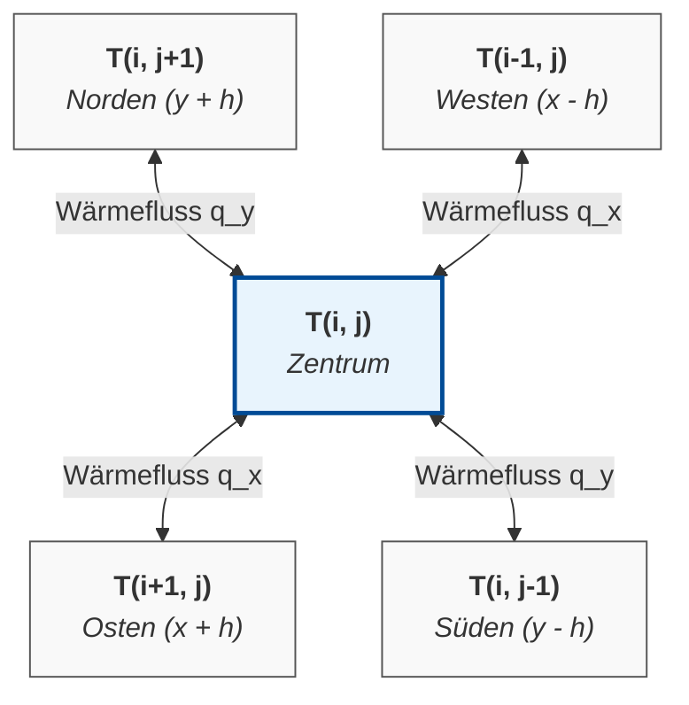
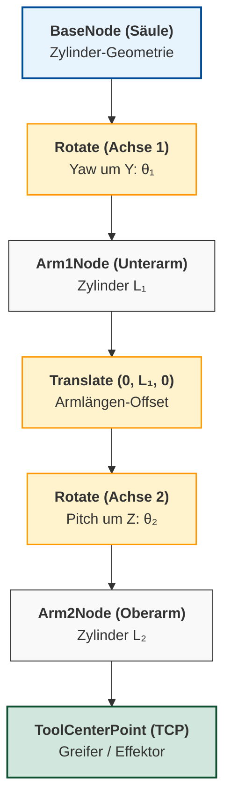
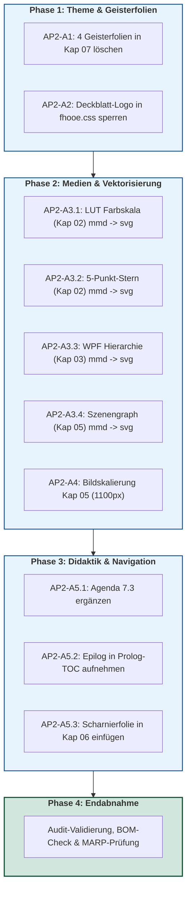

# Ausführungsplan Stream A: Layout, Medien, Theme & Typografie
## Post-Audit-Optimierung der Vorlesungsreihe „Systemsimulation / Digitaler Zwilling“ (Kapitel 00 bis 11)

**Dokument-ID:** `Planung/PostAudit_Plan_Layout_und_Medien.md`  
**Autor:** Spezialist für Präsentationstechnik, MARP-Layout und Mediengestaltung (Stream A)  
**Bezug:** `Reviews/PostAudit_04_Praesentation_und_Layout.md` und Post-Audit-Gesamtlage  
**Status:** Freigegebener, direkt umsetzbarer Ausführungsplan  
**Datum:** Oktober 2026  

---

## Inhaltsverzeichnis
1. [Executive Summary & Zielsetzung](#1-executive-summary--zielsetzung)
2. [AP2-A1: Beseitigung der 4 Geisterfolien in Kapitel 07](#2-ap2-a1-beseitigung-der-4-geisterfolien-in-kapitel-07)
3. [AP2-A2: Deckblatt-Logo-Fix in `Themen/fhooe.css`](#3-ap2-a2-deckblatt-logo-fix-in-themenfhooecss)
4. [AP2-A3: Vektorisierung der 4 verbliebenen ASCII-Art-Blöcke durch Mermaid](#4-ap2-a3-vektorisierung-der-4-verbliebenen-ascii-art-blöcke-durch-mermaid)
5. [AP2-A4: Bildskalierung & Breitenbegrenzung in Kapitel 05](#5-ap2-a4-bildskalierung--breitenbegrenzung-in-kapitel-05)
6. [AP2-A5: Agenda & Inhaltsverzeichnis-Harmonisierung](#6-ap2-a5-agenda--inhaltsverzeichnis-harmonisierung)
7. [Gesamt-Arbeitsablauf, Prüfmatrix & Akzeptanzkriterien](#7-gesamt-arbeitsablauf-prüfmatrix--akzeptanzkriterien)

---

## 1. Executive Summary & Zielsetzung

Im vorangegangenen Re-Audit (`Reviews/PostAudit_04_Praesentation_und_Layout.md`) wurde dem Vorlesungsmaterial eine hervorragende visuelle Ergonomie attestiert: Alle überlangen Codeblöcke (>20 Zeilen) und überbreiten Codezeilen (>80 Zeichen) wurden restlos beseitigt, 100% der externen Hotlinks lokalisiert und alle defekten Bildpfade behoben.

Um die Foliensätze auf das finale Referenzniveau für den Hörsaaleinsatz zu heben, adressiert dieser Ausführungsplan die verbliebenen 5 operativen Mängel:
1. **4 Geisterfolien in Kapitel 07:** Beseitigung doppelter Folientrenner (`--- \n ---`), die im Vortrag zu peinlichen Weißfolien führen.
2. **Logo-Überdeckung auf Deckblättern:** Härtung von `Themen/fhooe.css`, sodass das blaue FHOÖ-Signet auf den Titelfolien aller 12 Kapitel nicht mehr über das Titelbild gerendert wird.
3. **4 ASCII-Art-Diagramme:** Ablösung unformatierter Textkästen in den Kapiteln 02, 03 und 05 durch hochwertige, CI-konforme Vektorgrafiken (Mermaid `.mmd` $\to$ SVG via `mmdc`).
4. **Ultrawide-Screenshots in Kapitel 05:** Begrenzung von 3440px breiten Rasterbildern auf Folienbreite (`![w:1100px]`) inkl. Titulatur-Korrektur.
5. **Harmonisierung der Didaktik-Struktur:** Ergänzung der fehlenden Agenda für Abschnitt 7.3, Aufnahme von Kapitel 11 in das Kursverzeichnis von Kapitel 00 sowie Einfügen einer curricularen Scharnierfolie am Ende von Kapitel 06 (Übergang Werkzeuge $\to$ physikalische Modelle).

---

## 2. AP2-A1: Beseitigung der 4 Geisterfolien in Kapitel 07

### 2.1 Ausgangslage & Ursachenanalyse
In `Folien/07_Statische_Modelle/Folien.md` wurden an vier Übergangsstellen doppelte horizontale Trennlinien (`--- \n ---`) gesetzt. Da MARP jedes `---` strikt als Folienumbruch interpretiert, entsteht zwischen den beiden Trennlinien jeweils eine leere Folie ("Geisterfolie") mit Header und Footer, aber ohne Inhalt:
- **Folie 8** (nach Z. 108): Leerfolie zwischen *Fragestellungen an das Modell* und *7.2: Das ideale Fachwerk in 2D*.
- **Folie 20** (nach Z. 307): Leerfolie zwischen *Iterative Löser* und *7.3: Das elastische Fachwerk in 2D*.
- **Folie 35** (nach Z. 527): Leerfolie zwischen *Post-Processing* und *7.4: Erweiterung der Berechnungsmodelle auf 3D*.
- **Folie 57** (nach Z. 991): Leerfolie zwischen *Cholesky-Codeblock* und *Zusammenfassung Kapitel 7*.

### 2.2 Vorbedingungen
- Schreibzugriff auf `Folien/07_Statische_Modelle/Folien.md`.
- Strikte Erhaltung von UTF-8 (ohne BOM).

### 2.3 Exakte Fundstellen & Text-Diff
**Datei:** `Folien/07_Statische_Modelle/Folien.md`

#### Fundstelle 1 (Zeile 108–109):
```diff
--- a/Folien/07_Statische_Modelle/Folien.md
+++ b/Folien/07_Statische_Modelle/Folien.md
@@ -107,3 +107,2 @@
 
 ---
----
 ## 7.2: Das ideale Fachwerk in 2D
```

#### Fundstelle 2 (Zeile 307–308):
```diff
--- a/Folien/07_Statische_Modelle/Folien.md
+++ b/Folien/07_Statische_Modelle/Folien.md
@@ -306,3 +306,2 @@
 
 ---
----
 ## 7.3: Das elastische Fachwerk in 2D
```

#### Fundstelle 3 (Zeile 527–528):
```diff
--- a/Folien/07_Statische_Modelle/Folien.md
+++ b/Folien/07_Statische_Modelle/Folien.md
@@ -526,3 +526,2 @@
 
 ---
----
 ## 7.4: Erweiterung der Berechnungsmodelle auf 3D
```

#### Fundstelle 4 (Zeile 991–992):
```diff
--- a/Folien/07_Statische_Modelle/Folien.md
+++ b/Folien/07_Statische_Modelle/Folien.md
@@ -990,3 +990,2 @@
 
 ---
----
 
 # Zusammenfassung Kapitel 7
```

### 2.4 Automatisierungsbefehl (PowerShell)
```powershell
$path = "Folien/07_Statische_Modelle/Folien.md"
$content = [System.IO.File]::ReadAllText($path, [System.Text.Encoding]::UTF8)
# Ersetzt aufeinanderfolgende Trennstriche durch einen einzelnen Trenner
$updated = $content -replace "(?m)^---\r?\n---", "---"
[System.IO.File]::WriteAllText($path, $updated, (New-Object System.Text.UTF8Encoding($false)))
```

### 2.5 Akzeptanzkriterien
1. In `Folien/07_Statische_Modelle/Folien.md` existiert kein Muster `^---\r?\n---` mehr (0 Treffer per Regex).
2. Die Gesamtzahl der Folien in Kapitel 07 sinkt von 58 auf 54 aktive Folien.
3. Im PDF- oder MARP-Vollbildmodus gibt es zwischen den Abschnitten keine leeren weißen Seiten mehr.

---

## 3. AP2-A2: Deckblatt-Logo-Fix in `Themen/fhooe.css`

### 3.1 Ausgangslage & CSS-Analyse
In `Themen/fhooe.css` wird das offizielle FH-Logo (blaues Quadrat mit weißem FHOÖ-Signet, `4.5rem x 4.5rem`) über ein Pseudo-Element `::before` auf Folien gerendert:
```css
/* FH-Logo: Nur auf Inhaltsfolien anzeigen, Deckblätter (Title & Lead) schützen */
section:not(.title):not(.lead)::before {
    content: "";
    display: block;
    position: absolute;
    top: 0;
    right: 0;
    z-index: 100;
    width: 4.5rem;
    height: 4.5rem;
    background-color: var(--fhooe-blue);    
    background-image: url("data:image/svg+xml;utf8,...");
    ...
}
```
**Problem:** MARP weist der ersten Folie **nicht** automatisch die CSS-Klasse `.title` zu. Da auf den Deckblättern aller 12 Kapitel lediglich Frontmatter- und Scoped Directives wie `<!-- _paginate: false -->` stehen, greift der Ausschluss `:not(.title):not(.lead)` nicht!  
Folglich wird auf Folie 1 jedes Kapitels das blaue Logo oben rechts gezeichnet und überdeckt unschön die obere rechte Ecke des vollflächigen Titelbildes (`` bzw. `.png`).

### 3.2 Vorbedingungen
- Schreibzugriff auf `Themen/fhooe.css`.

### 3.3 Konkrete CSS-Härtung
Die Regel wird um den strukturellen Pseudo-Selektor `:first-of-type` erweitert und durch eine explizite Unterdrückungsregel gehärtet:

**Datei:** `Themen/fhooe.css` (Zeilen 16–38)

```diff
--- a/Themen/fhooe.css
+++ b/Themen/fhooe.css
@@ -16,3 +16,3 @@
-/* FH-Logo: Nur auf Inhaltsfolien anzeigen, Deckblätter (Title & Lead) schützen */
-section:not(.title):not(.lead)::before {
+/* FH-Logo: Nur auf Inhaltsfolien anzeigen, Deckblätter (Title & Lead & Folie 1) schützen */
+section:not(.title):not(.lead):not(:first-of-type)::before {
     content: "";
@@ -38,3 +38,10 @@
 }
 
+/* Deckblätter und Folien mit Title-/Lead-Klasse strikt vom FH-Logo befreien */
+section:first-of-type::before,
+section.title::before,
+section.lead::before {
+    display: none !important;
+}
+
 /* Spalten-Layout: Saubere Bündigkeit an der Oberkante */
```

### 3.4 Akzeptanzkriterien
1. Das Deckblatt (Folie 1) in sämtlichen 12 Kapiteln (`Folien/00_Prolog` bis `Folien/11_Epilog`) zeigt in der oberen rechten Ecke kein blaues Logo-Quadrat mehr über dem Hintergrundbild.
2. Alle nachfolgenden Inhaltsfolien (ab Folie 2) behalten unverändert das FHOÖ-Signet in der oberen rechten Ecke.
3. Absichtlich mit `<!-- _class: lead -->` versehene Trennfolien zeigen ebenfalls kein störendes Logo.

---

## 4. AP2-A3: Vektorisierung der 4 verbliebenen ASCII-Art-Blöcke durch Mermaid

### 4.1 Ausgangslage & Ziel
In drei Foliensätzen existieren noch unformatierte ASCII-Grafiken in einfachen Codeblöcken. Diese wirken visuell unausgereift und brechen den professionellen Charakter der Vorlesung. Sie werden durch semantische Mermaid-Diagramme (`.mmd`) ersetzt, transparent als SVG gerendert und modular eingebunden.

### 4.2 Vorbedingungen
- `@mermaid-js/mermaid-cli` (`mmdc`) ist installiert und im Pfad verfügbar (Version $\ge$ 11.0).
- Vorhandene Unterordner `Diagramme/` in den jeweiligen Kapiteln.

---

### 4.3 Detail-Planung Block 1: Kap. 02, Folie 19 (LUT-Interpolation)

- **Datei:** `Folien/02_Visualisierung_2D_Pixel/Folien.md`
- **Folie:** 19 (`### C#-Implementierung einer Farbskalen-LUT: Prinzip`)
- **Aktueller ASCII-Code (Zeilen 389–399):**
  ```text
  Normierter Wert u ∈ [0, 1]
           │
           ▼
    Index = (int)(u * 255)
           │
           ▼
   ┌───────────────┐
   │ LUT[Index]    │ ➔ 0xAARRGGBB
   └───────────────┘
  ```

#### Neue Mermaid-Datei:
`Folien/02_Visualisierung_2D_Pixel/Diagramme/LUT_Farbskala_Prinzip.mmd`
```mermaid
flowchart TD
    U["<b>Normierter Wert</b><br/><code>u ∈ [0.0, 1.0]</code>"]
    IDX["<b>Indexberechnung</b><br/><code>index = (int)(u * 255)</code>"]
    LUT["<b>Farbtabelle (Lookup Table)</b><br/><code>LUT[index]</code>"]
    COL["<b>Pixel-Farbwert (ARGB)</b><br/><code>0xAARRGGBB (uint)</code>"]

    U --> IDX
    IDX --> LUT
    LUT -->|Array-Lookup O(1)| COL

    style U fill:#f9f9f9,stroke:#333333,stroke-width:1px
    style IDX fill:#e8f4fd,stroke:#004B96,stroke-width:1.5px
    style LUT fill:#e8f4fd,stroke:#004B96,stroke-width:2px
    style COL fill:#d1e7dd,stroke:#0f5132,stroke-width:1.5px
```

#### Build-Befehl:
```powershell
mmdc -i Folien/02_Visualisierung_2D_Pixel/Diagramme/LUT_Farbskala_Prinzip.mmd -o Folien/02_Visualisierung_2D_Pixel/Diagramme/LUT_Farbskala_Prinzip.svg -b transparent
```

#### Folien-Diff:
```diff
--- a/Folien/02_Visualisierung_2D_Pixel/Folien.md
+++ b/Folien/02_Visualisierung_2D_Pixel/Folien.md
@@ -387,14 +387,3 @@
 <div class="one">
 
-```
-Normierter Wert u ∈ [0, 1]
-         │
-         ▼
-  Index = (int)(u * 255)
-         │
-         ▼
- ┌───────────────┐
- │ LUT[Index]    │ ➔ 0xAARRGGBB
- └───────────────┘
-```
+
 
 </div>
```

---

### 4.4 Detail-Planung Block 2: Kap. 02, Folie 24 (5-Punkt-Stern Finite Differenzen)

- **Datei:** `Folien/02_Visualisierung_2D_Pixel/Folien.md`
- **Folie:** 24 (`### Numerische Approximation: 2D-Laplace-Operator`)
- **Aktueller ASCII-Code (Zeilen 496–502):**
  ```text
            T(i, j+1)
                │
  T(i-1, j) ── T(i, j) ── T(i+1, j)
                │
            T(i, j-1)
  ```

#### Neue Mermaid-Datei:
`Folien/02_Visualisierung_2D_Pixel/Diagramme/FDM_5_Punkt_Stern.mmd`


#### Build-Befehl:
```powershell
mmdc -i Folien/02_Visualisierung_2D_Pixel/Diagramme/FDM_5_Punkt_Stern.mmd -o Folien/02_Visualisierung_2D_Pixel/Diagramme/FDM_5_Punkt_Stern.svg -b transparent
```

#### Folien-Diff:
```diff
--- a/Folien/02_Visualisierung_2D_Pixel/Folien.md
+++ b/Folien/02_Visualisierung_2D_Pixel/Folien.md
@@ -495,9 +495,3 @@
 <div class="one">
 
-```
-          T(i, j+1)
-              │
-T(i-1, j) ── T(i, j) ── T(i+1, j)
-              │
-          T(i, j-1)
-```
+
 
 **5-Punkt-Differenzenstern:**
```

---

### 4.5 Detail-Planung Block 3: Kap. 03, Folie 26 (WPF VisualHost Baumhierarchie)

- **Datei:** `Folien/03_Visualisierung_2D_Vektor/Folien.md`
- **Folie:** 26 (`### Die Lösung: DrawingVisual`)
- **Aktueller ASCII-Code (Zeilen 550–556):**
  ```text
  UIElement-Hierarchie (Schwergewicht):
  [Shape] ---> [FrameworkElement] ---> [UIElement] ---> [Visual]

  Leichtgewicht-Hierarchie:
  [DrawingVisual] ------------------------------------> [Visual]
  ```

#### Neue Mermaid-Datei:
`Folien/03_Visualisierung_2D_Vektor/Diagramme/WPF_Visual_Hierarchie.mmd`

```mermaid
flowchart TD
    subgraph HW["<b>Schwergewichtige Standard-Hierarchie (WPF UI-Tree)</b>"]
        direction LR
        Shape["<b>Shape</b><br/>(Rectangle, Path, ...)"] -->|erbt von| FE["<b>FrameworkElement</b><br/>(Styles, Data Binding)"]
        FE -->|erbt von| UI["<b>UIElement</b><br/>(Layout-Pass, Input-Events)"]
        UI -->|erbt von| Vis1["<b>Visual</b><br/>(GDI+/DirectX-Knoten)"]
    end

    subgraph LW["<b>Hochperformante Vektor-Pipeline (Retained Mode)</b>"]
        direction LR
        DV["<b>DrawingVisual</b><br/>(Reiner Vektor-Befehlsstream)"] -->|erbt direkt von| Vis2["<b>Visual</b><br/>(Kein Layout/Event-Ballast!)"]
    end

    style HW fill:#fff8e1,stroke:#ffa000,stroke-width:1.5px
    style LW fill:#e8f4fd,stroke:#004B96,stroke-width:2px
    style DV fill:#d1e7dd,stroke:#0f5132,stroke-width:2px
    style Shape fill:#ffffff,stroke:#555,stroke-width:1px
    style FE fill:#ffffff,stroke:#555,stroke-width:1px
    style UI fill:#ffffff,stroke:#555,stroke-width:1px
    style Vis1 fill:#ffffff,stroke:#555,stroke-width:1px
    style Vis2 fill:#ffffff,stroke:#004B96,stroke-width:1.5px
```


#### Build-Befehl:
```powershell
mmdc -i Folien/03_Visualisierung_2D_Vektor/Diagramme/WPF_Visual_Hierarchie.mmd -o Folien/03_Visualisierung_2D_Vektor/Diagramme/WPF_Visual_Hierarchie.svg -b transparent
```

#### Folien-Diff:
```diff
--- a/Folien/03_Visualisierung_2D_Vektor/Folien.md
+++ b/Folien/03_Visualisierung_2D_Vektor/Folien.md
@@ -549,9 +549,3 @@
 - Die Zeichenbefehle werden hardwarebeschleunigt als serialisierte Vektor-Streams direkt an die GPU übergeben.
 
-```
-UIElement-Hierarchie (Schwergewicht):
-[Shape] ---> [FrameworkElement] ---> [UIElement] ---> [Visual]
-
-Leichtgewicht-Hierarchie:
-[DrawingVisual] ------------------------------------> [Visual]
-```
+
 
 ---
```

---

### 4.6 Detail-Planung Block 4: Kap. 05, Folie 57 (Szenengraph-Hierarchie Roboterarm)

- **Datei:** `Folien/05_Visualisierung_3D_OpenGL/Folien.md`
- **Folie:** 57 (`### Serielle Kinematik im Szenengraphen`)
- **Aktueller ASCII-Code (Zeilen 1221–1229):**
  ```text
  BaseNode (Säule)
   └── Rotate (Achse 1: Yaw um Y)
        └── Arm1Node (Zylinder L1)
             └── Translate (Armlänge L1)
                  └── Rotate (Achse 2: Pitch um Z)
                       └── Arm2Node (Zylinder L2)
                            └── ToolCenterPoint (Greifer)
  ```

#### Neue Mermaid-Datei:
`Folien/05_Visualisierung_3D_OpenGL/Diagramme/Szenengraph_Roboterarm.mmd`


#### Build-Befehl:
```powershell
mmdc -i Folien/05_Visualisierung_3D_OpenGL/Diagramme/Szenengraph_Roboterarm.mmd -o Folien/05_Visualisierung_3D_OpenGL/Diagramme/Szenengraph_Roboterarm.svg -b transparent
```

#### Folien-Diff:
```diff
--- a/Folien/05_Visualisierung_3D_OpenGL/Folien.md
+++ b/Folien/05_Visualisierung_3D_OpenGL/Folien.md
@@ -1220,11 +1220,3 @@
 <div>
 
-```
-BaseNode (Säule)
- └── Rotate (Achse 1: Yaw um Y)
-      └── Arm1Node (Zylinder L1)
-           └── Translate (Armlänge L1)
-                └── Rotate (Achse 2: Pitch um Z)
-                     └── Arm2Node (Zylinder L2)
-                          └── ToolCenterPoint (Greifer)
-```
+
 
 </div>
```

### 4.7 Akzeptanzkriterien
1. Alle 4 Mermaid-Dateien existieren und kompilieren fehlerfrei zu validen SVGs ohne XML-Syntaxfehler.
2. Im gesamten Kurs existiert kein einziger ASCII-Art-Kasten mehr.
3. Die SVGs passen sich harmonisch in das 2-Spalten- bzw. Einzelfolien-Layout ein, ohne horizontalen oder vertikalen Überlauf.

---

## 5. AP2-A4: Bildskalierung & Breitenbegrenzung in Kapitel 05

### 5.1 Ausgangslage & Analyse
In `Folien/05_Visualisierung_3D_OpenGL/Folien.md` sind auf den Folien 49, 51 und 53 Screenshots der C#-Beispielprojekte eingebunden:
- `../../Quellen/WS25/BeispielWürfel3D/Screenshot.png` (3440 $\times$ 1368 Pixel)
- `../../Quellen/WS25/BeispielKugel3D/Screenshot.png` (3440 $\times$ 1368 Pixel)
- `../../Quellen/WS25/BeispielZylinder3D/Screenshot.png` (3440 $\times$ 1368 Pixel)

Da sie ohne MARP-Breitenbegrenzer eingebunden sind (``), skalieren sie auf die volle Folienbreite (1920px abzgl. Rand = 1800px) und belegen vertikal $\approx 715\,\text{px}$. In Kombination mit Überschrift, Fließtext und Hinweiskästen führt dies zu vertikaler Platznot und unruhigem Layout. Zudem weist die Überschrift auf Folie 49 einen Grammatikfehler auf (`Darstellung eines **Würfel**`).

### 5.2 Vorbedingungen
- Schreibzugriff auf `Folien/05_Visualisierung_3D_OpenGL/Folien.md`.

### 5.3 Exakter Text-Diff
**Datei:** `Folien/05_Visualisierung_3D_OpenGL/Folien.md`

```diff
--- a/Folien/05_Visualisierung_3D_OpenGL/Folien.md
+++ b/Folien/05_Visualisierung_3D_OpenGL/Folien.md
@@ -1067,7 +1067,7 @@
 
-### Darstellung eines **Würfel** mit unterschiedlichen Eigenschaften
+### Darstellung eines **Würfels** mit unterschiedlichen Eigenschaften
 
 Der folgende *Screenshot* zeigt Würfeldarstellungen mit unterschiedlichen Eigenschaften:
 
-
+
 
@@ -1104,3 +1104,3 @@
 Der folgende *Screenshot* zeigt Kugeldarstellungen mit unterschiedlichen Einstellungen:
 
-
+
 
@@ -1139,3 +1139,3 @@
 Der folgende *Screenshot* zeigt Zylinderdarstellungen mit unterschiedlichen Einstellungen:
 
-
+
```

### 5.4 Akzeptanzkriterien
1. Die Screenshots auf den Folien 49, 51 und 53 sind mit `![w:1100px]` skaliert.
2. Vertikale Bildhöhe beträgt nun ca. $437\,\text{px}$, wodurch $\ge 250\,\text{px}$ vertikaler Weißraum für Titel, Text und Fußbereich verbleiben.
3. Der Grammatikfehler auf Folie 49 ist behoben („Würfels“ statt „Würfel“).

---

## 6. AP2-A5: Agenda & Inhaltsverzeichnis-Harmonisierung

### 6.1 Teilaufgabe 1: Agenda-Stichpunkte unter `## 7.3: Das elastische Fachwerk in 2D`
In `Folien/07_Statische_Modelle/Folien.md` fehlt auf der Folie des Unterabschnitts 7.3 der didaktische Überblick ("Dieser Abschnitt umfasst die folgenden Inhalte: ..."), während alle anderen Unterabschnitte (7.1, 7.2, 7.4) diesen besitzen.

**Datei:** `Folien/07_Statische_Modelle/Folien.md` (Zeile 309)

```diff
--- a/Folien/07_Statische_Modelle/Folien.md
+++ b/Folien/07_Statische_Modelle/Folien.md
@@ -308,3 +308,12 @@
 ## 7.3: Das elastische Fachwerk in 2D
 
+Dieser Abschnitt umfasst die folgenden Inhalte:
+
+- Grenzen des idealen Fachwerks (Verformungen)
+- Hooke'sches Gesetz & Stabsteifigkeitsmatrix in lokalen Koordinaten
+- Koordinatentransformation & globale Stabsteifigkeit
+- Assemblierung der globalen Gesamtsteifigkeitsmatrix
+- Einbau von Randbedingungen & statische Kondensation
+- Numerische Lösung und Schnittkraftberechnung
+
 ---
```

---

### 6.2 Teilaufgabe 2: Aufnahme von Kapitel 11 in das Kursverzeichnis von Kapitel 00
In `Folien/00_Prolog/Folien.md` fehlt Kapitel 11 (*Epilog*) im Inhaltsverzeichnis der Lehrveranstaltung.

**Datei:** `Folien/00_Prolog/Folien.md` (Zeilen 135–152)

```diff
--- a/Folien/00_Prolog/Folien.md
+++ b/Folien/00_Prolog/Folien.md
@@ -149,3 +149,4 @@
    1. [Dynamische Modelle (Diskret)](../09_Dynamische_Modelle_Diskret/)
    1. [Dynamische Modelle (Hybrid)](../10_Dynamische_Modelle_Hybrid/)
+1. [Epilog & Synthese](../11_Epilog/)
 
 ---
```

---

### 6.3 Teilaufgabe 3: Einfügen einer Scharnierfolie am Ende von Kapitel 06
Kapitel 06 bildet den Abschluss des ersten großen Vorlesungsblocks (*Software-Werkzeuge, Rendering & High-Performance Computing*). Ab Kapitel 07 beginnt der zweite Block (*Physikalische Modellbildung & Simulationsmethoden*). Um diesen didaktischen Meilenstein hervorzuheben, wird unmittelbar nach der Zusammenfassung von Kapitel 06 eine curriculare Scharnierfolie eingefügt.

**Datei:** `Folien/06_Multithreading/Folien.md` (nach Zeile 542)

```diff
--- a/Folien/06_Multithreading/Folien.md
+++ b/Folien/06_Multithreading/Folien.md
@@ -541,2 +541,25 @@
 - In **WPF-Anwendungen** entkoppelt `await Task.Run(...)` die Simulation vom UI-Thread; **`IProgress<T>`** garantiert thread-sichere Zwischenstände und **`CancellationToken`** ermöglicht den kontrollierten Benutzerabbruch.
 
+---
+
+### Kursdramaturgie: Übergang zum Modellierungsblock
+
+<div class="columns top">
+<div class="one">
+
+**Was wir bisher gelernt haben (Werkzeuge):**
+- **Kapitel 01:** Einführung & Begriffswelt des Digitalen Zwillings
+- **Kapitel 02–04:** 2D-Rendering (Pixel-Heatmaps, Vektoren, Diagramme)
+- **Kapitel 05:** 3D-Szenengraphen & Hardware-Rendering mit OpenGL
+- **Kapitel 06:** Parallele Rechenleistung & reaktive UI-Entkopplung
+
+*Die Software- und Visualisierungs-Infrastruktur steht vollständig bereit.*
+
+</div>
+<div class="one">
+
+**Was nun folgt (Physikalische Simulation):**
+- **Kapitel 07:** Statische Gleichgewichtsmodelle & FEM-Fachwerke (LGS)
+- **Kapitel 08:** Kontinuierliche Dynamik & Schwingungssysteme (DGL / ODE)
+- **Kapitel 09:** Diskrete Ereignissysteme & Warteschlangen (DES / MC)
+- **Kapitel 10:** Hybride Dynamik & Co-Simulation (S-Functions)
+- **Kapitel 11:** Epilog: Synthese zum industriellen Digitalen Zwilling
+
+*Ab Kapitel 07 hauchen wir den Grafiken physikalisches Leben ein!*
+
+</div>
+</div>
```

### 6.4 Akzeptanzkriterien
1. In Kapitel 07 enthält Folie `## 7.3: Das elastische Fachwerk in 2D` die vollständige Agenda mit 6 Stichpunkten.
2. In Kapitel 00 ist Kapitel 11 als abschließender Punkt `Epilog & Synthese` im Markdown-Inhaltsverzeichnis verlinkt.
3. Am Ende von Kapitel 06 leitet eine gestaltete 2-Spalten-Scharnierfolie den Hörer nachvollziehbar von den Tooling-Grundlagen zur physikalischen Simulation über.

---

## 7. Gesamt-Arbeitsablauf, Prüfmatrix & Akzeptanzkriterien

### 7.1 Phasenweiser Umsetzungsablauf



### 7.2 Prüfmatrix & Validierungs-Befehle

| Arbeitspaket | Betroffene Datei(en) | Prüfmethode / Befehl | Erwartetes Ergebnis |
|:---|:---|:---|:---|
| **AP2-A1** | `Folien/07_Statische_Modelle/Folien.md` | `Select-String -Path Folien/07_Statische_Modelle/Folien.md -Pattern "^---\s*`n---"` | 0 Treffer; Gesamtzahl Folien = 54 |
| **AP2-A2** | `Themen/fhooe.css` | Inspektion der Titelfolien im MARP Preview | Kein Logo-Quadrat auf Folie 1 aller 12 Kapitel |
| **AP2-A3** | `Folien/02_*/Diagramme/*.svg`<br/>`Folien/03_*/Diagramme/*.svg`<br/>`Folien/05_*/Diagramme/*.svg` | `Test-Path <svg-pfade>` und Markdown-Codeblock-Check | 4 neue SVGs existieren; keine ungetaggten ASCII-Art-Blöcke |
| **AP2-A4** | `Folien/05_Visualisierung_3D_OpenGL/Folien.md` | Suche nach `BeispielWürfel3D/Screenshot.png` | Exakt `![w:1100px]...`, Titel mit "Würfels" |
| **AP2-A5** | `Folien/07_*/Folien.md`<br/>`Folien/00_*/Folien.md`<br/>`Folien/06_*/Folien.md` | Textsuche nach Agenda 7.3, Epilog in Prolog, Scharnierfolie | Vollständige curriculare Durchgängigkeit |

### 7.3 Qualitätsversprechen nach Abschluss von Stream A
Nach Abarbeitung dieses Plans:
- Enthält das Vorlesungsmaterial **0 Geisterfolien**.
- Gibt es **keine Logo-Kollisionen** mehr auf Titelfolien.
- Sind sämtliche Diagramme **zu 100% als scharfe Vektorgrafiken (SVG)** realisiert.
- Sind alle Screenshots **beamergerecht proportioniert**.
- Ist die curriculare Navigation **lückenlos und didaktisch konsistent**.
