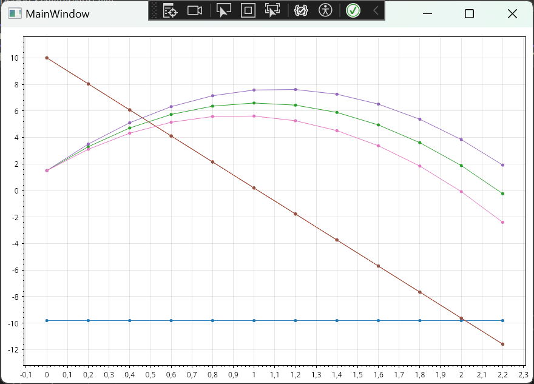
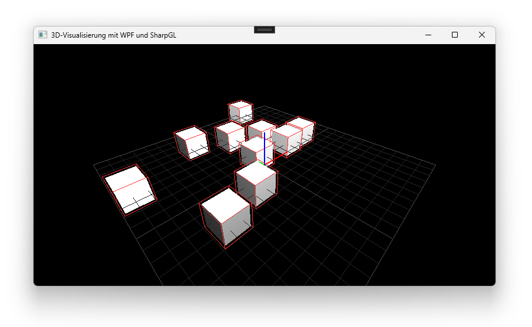
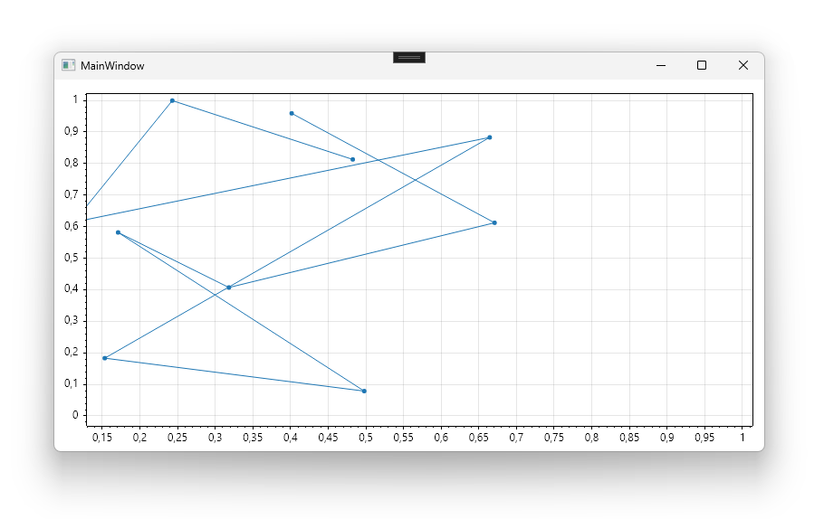

# Kurs in Computer-Simulation mit C# und JaamSim

Dieses Repository enthält Beispiele zum Thema Computer-Simulation.

## Beispiele

### [Schiefer Wurf](./Quellen/SchieferWurf/)

### [Vorlage SharpGL](./Quellen/VorlageVisualisierung3D/)

### [Vorlage ScottPlot](./Quellen/VorlageVisualisierung2D/)

## Dokumente

* [Änderungen](./CHANGELOG.md)
* [Beitragen](./CONTRIBUTING.md)
* [Lizenz](./LICENSE.md)