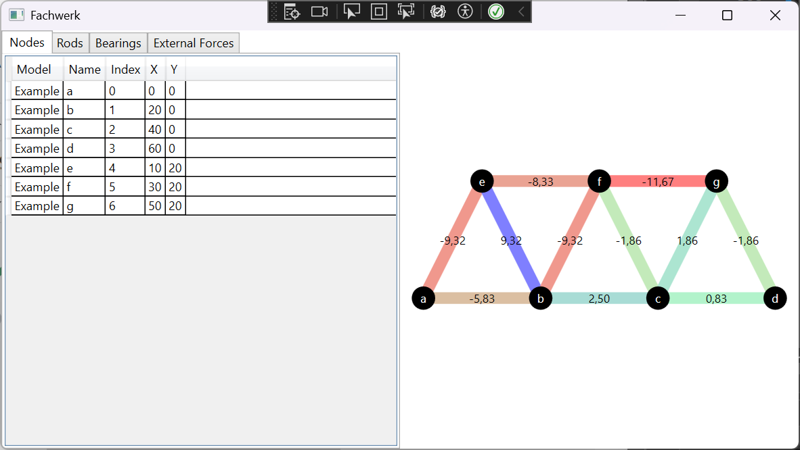
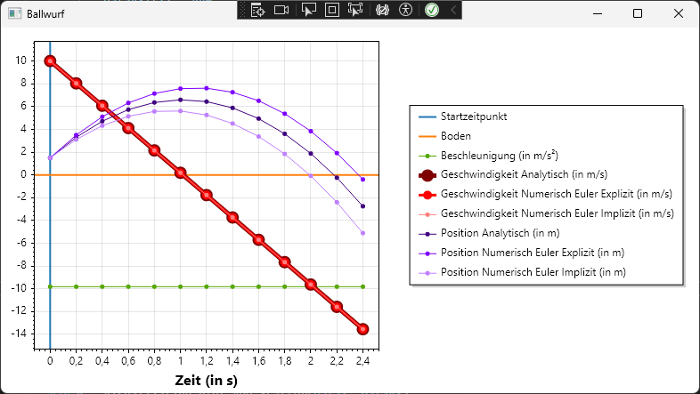

# Kurs in Computer-Simulation

Dieses Repository enthält Beispiele zum Thema Computer-Simulation.

* Modelle
* Vorlagen
* Dokumente

## 1. Modelle

Grundsätzlich kann man zwischen statischen und dynamischen Modellen unterscheiden:

* Statische Modelle (Betrachtung eines einzelnen stabilen Systemzustands)
* Dynamische Modelle (Betrachtung der Änderung des Systemzustands über die Zeit)

### 1.1. Statische Modelle

Statische Modelle betrachten Zustände, bei denen es ohne externe Einwirkung keine Zustandsänderung gibt.
Bei solchen Modellen sind typischerweise einige Zustandseigenschaften bekannt, andere jedoch nicht.
Des Weiteren beschreibt das Modell den Zusammenhang zwischen den bekannten und unbekannten Zustandseigenschaften.
Simulationsprogramme sind dann dafür verantwortlich, die unbekannten Zustandseigenschaften zu berechnen.
Wir betrachten die folgenden Beispiele, um ein besseres Verständnis für statische Modelle und deren Berechnung zu bekommen:

* Fachwerk

#### [Fachwerk](./Quellen/Fachwerk/)

Ein Fachwerk ist ein System bestehend aus Knoten, die über Stäbe miteinander verbunden sind.
Des Weiteren sind einige der Knoten gelagert, d.h. deren Position im Raum ist fixiert.
Dabei können entweder beide Richtungungen oder nur eine der beiden Richtungen fixiert sein.
Schließlich wirken auf die Knoten noch externe Kräft in einer oder zwei Richtungen.
Das Computerprogramm berechnet die Kräfte, die auf die einzelne Stäbe wirken.
Dabei kann man zwischen grundsätzlich Zugkräften und Druckkräften unterscheiden.
Druckkräfte sind meist kritischer, da Stäbe in der Regel unter Druck leichter knicken als unter Zug zu brechen.
Außerdem berechnet das Programm die Kräfte, die auf die unterschiedlichen Lager wirken.

Zur Berechnung der Kräfte muss ein lineares Gleichungssystem gelöst werden.
Für die Lösung des Gleichungssystems kann z.B. die Sinulärwertzerlegung verwendet werden.
Die Singulärwertzerlegung berechnet eine Lösung mit der Methode der kleinsten Quadrate.
Das Programm verwendet dafür die Bibliothek [Math.NET Numerics](https://numerics.mathdotnet.com/).

Die folgende Grafik zeigt das Datenmodell des Programms für die Berechnung der Lager- und Stabkräfte eines einfachen zweidimensionalen Fachwerks.
Über die Klasse ``Model`` können Fachwerke inklusive der darin enthaltenen Knoten, Stäbe, Lager, und externen Kräfte definiert werden.
Des Weiteren bietet die Klasse ``Model`` die Methode ``Solve``, welche mittels der Singulärwertzerlegung die Stab- und Lagerkräfte berechnet.
Die Visualisierung erfolgt schließlich mit einem ``DataGrid`` sowie einem ``Canvas``, welche die Windows Presentation Foundation bereitstellt.

### 1.2. Dynamische Modelle

Dynamische Modelle betrachten *nicht* einen einzelen stabilen Systemzustand, sondern die Änderung des Systemzustands über die Zeit.
Dafür muss in der Regel ein Startzustand sowie eine Zustandsübergangsfunktion gegeben sein.
Die Simulation rechnet dann den Zustand des Systems gemäß der Zustandsübergangsfunktion weiter.
Man kann grundsätzlich zwischen zwei Arten von Modellen unterschieden werden:

* Zeitkontinuierliche Modelle (Modell beschreibt Zustand zu jedem Zeitpunkt)
* Zeitdiskrete Modelle (Modell beschreibt Zustands nur zu ausgewählten Zeitpunkten)

#### 1.2.1. Zeitkontinuierliche Modelle

Bei den zeitkontinuierlichen Modellen betrachten wir zwei Beispiele, die sich in ihrer Komplexität leicht unterscheiden und für welche die analytischen Lösungen bereits bekannt sind:

* Ballwurf
* Federpendel

##### [Ballwurf](./Quellen/Ballwurf/)

Dieses Beispiel zeigt die **numerische Integration zeitkontinuierlicher Modelle** mit dem expliziten und dem impliziten Euler-Verfahren sowie den Vergleich der numerischen Lösungen mit der analytischen Lösung, welche für dieses einfache Integral noch berechnet werden kann.

##### [Federpendel](./Quellen/Federpendel/)

*Kommt demnächst.*

#### 1.2.2. Zeitdiskrete Modelle

Bei den zeitdiskreten Modellen können wieder zwei Arten unterschieden werden, die diskreten Zeitschritte durchzuführen:

* Fester Zeitschritt
* Variabler Zeitschritt

##### 1.2.2.1. Fester Zeitschritt

*Kommt demnächst.*

##### 1.2.2.2. Variabler Zeitschritt

*Kommt demnächst.*

## 2. Vorlagen

Das Repository enthält auch ein paar Vorlagen, welche du für die Entwicklung deiner eigenen Simulationsprogramme verwenden und auf deine Bedürfnisse anpassen kannst:

* 2D-Visualisierung mit WPF und ScottPlot
* 3D-Visualisierung mit WPF und SharpGL

### 2.1. [2D-Visualisierung mit **WPF und ScottPlot**](./Quellen/VorlageVisualisierung2D/)

Dieses Beispiel zeigt dir, wie du einfache 2D-Diagramme in deinen Simulationsprogrammen erstellen und anzeigen kannst.
Das Beispiel nutzt dafür das Microsoft WPF Framework für allgemeine grafische Benutzeroberflächen sowie ScottPlot für Diagrammvisualisierungen.

### 2.2. [3D-Visualisierung mit **WPF und SharpGL**](./Quellen/VorlageVisualisierung3D/)

Manchmal kann es auch hilfreich sein, 3D-Visualisierungen (z.B. des Systemzustands) in deine Simulationsprogramme zu integrieren.
Dieses Beispiel zeigt dir, wie du solche Visualisierungen mit SharpGL in deine WPF-Anwendungen einfach integrieren kannst.

Bei SharpGL kannst du die 3D-Visualisierungen in Form eines Szenengraphen einfach definieren.
Ein Szenengraph beschreibt den Inhalt einer 3D-Visualisierung in Form von Objekten und deren Zusammenhängen.
Die folgende Grafik zeigt die Klassen, aus welchen sich ein Szenengraph bei SharpGL zusammensetzt, und deren Beziehungen.

## 3. Dokumente

Hier sind noch ein paar wichtige Dokumente für jeden, der die Beispiele aus diesem Repository gerne nutzen möchte:

* [Änderungen](./CHANGELOG.md)
* [Beitragen](./CONTRIBUTING.md)
* [Lizenz](./LICENSE.md)