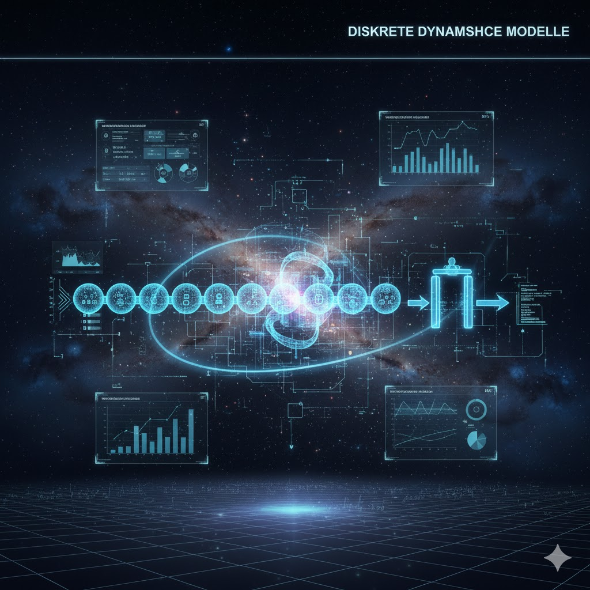
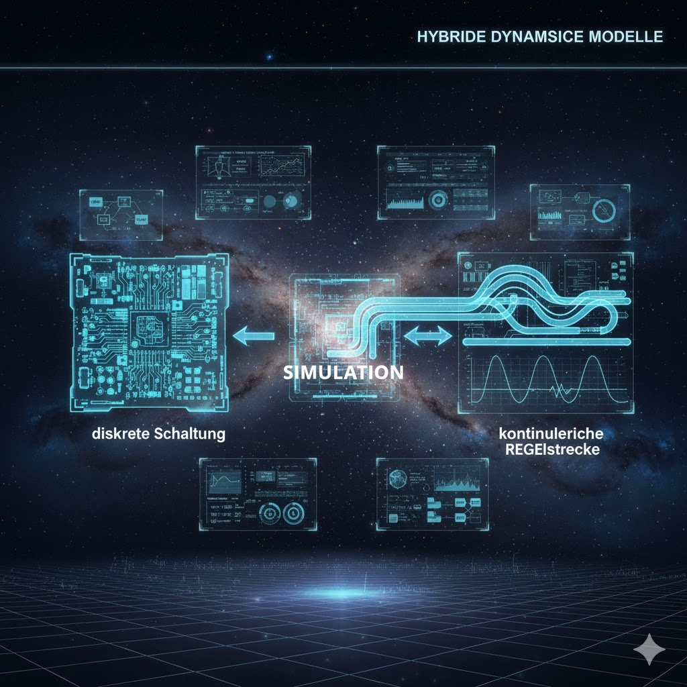

# Kurs in Computer-Simulation mit C#

Dies ist das Repository für den Kurs **Systemsimulation / Digitaler Zwilling** an der **Fachhochschule Oberösterreich** (Campus Wels).

Der Kurs vermittelt den Studierenden des Studiengangs *Automatisierungstechnik* die Grundlagen der Modellierung, Simulation und Visualisierung technischer Systeme. Dabei werden statische und dynamische (kontinuierliche, diskrete, hybride) Modelle behandelt und deren programmtechnische Umsetzung in **C#** mit **WPF** (für die Benutzeroberfläche und 2D-Visualisierung) sowie Bibliotheken wie **Math.NET Numerics** (Berechnung) und **SharpGL** (3D-Visualisierung) erarbeitet.

## Kursinhalte

| Kapitel | Inhalt |
| :--- | :--- |
|  | **[Prolog](./Folien/00_Prolog/Folien.md)** Organisatorisches, Voraussetzungen, Lernziele und Überblick über die Struktur des Kurses. |
|  | **[Kapitel 1: Systemsimulation und der Digitale Zwilling](./Folien/01_Einführung/Folien.md)** Einführung in die Grundlagen von Modellbildung und Simulation. Vorstellung verschiedener Modellarten, Lösungsmethoden und des Konzepts des Digitalen Zwillings. |
|  | **[Kapitel 2: Statische Modelle (2D)](./Folien/02_Statische_Modelle_2D/Folien.md)** Behandlung statischer Systeme im Gleichgewicht am Beispiel von Fachwerken. Implementierung der Berechnung idealer und elastischer Fachwerke in 2D sowie deren Visualisierung. |
|  | **[Kapitel 3: Statische Modelle (3D)](./Folien/03_Statische_Modelle_3D/Folien.md)** Erweiterung der statischen Modelle auf den 3D-Raum. Grundlagen der 3D-Visualisierung mittels OpenGL, Kamerasystemen und Szenengraphen. |
|  | **[Kapitel 4: Kontinuierliche Dynamische Modelle](./Folien/04_Dynamische_Modelle_Kontinuierlich/Folien.md)** Modellierung zeitabhängiger Systeme mittels Differentialgleichungen. Anwendung numerischer Integrationsverfahren (z.B. Euler, Runge-Kutta) zur Simulation mechanischer Systeme. |
|  | **[Kapitel 5: Diskrete Dynamische Modelle](./Folien/05_Dynamische_Modelle_Diskret/Folien.md)** Einführung in die ereignisorientierte Simulation (Discrete Event Simulation). Modellierung von Warteschlangensystemen und Nutzung stochastischer Methoden (Monte-Carlo-Simulation). |
|  | **[Kapitel 6: Hybride Dynamische Modelle](./Folien/06_Dynamische_Modelle_Hybrid/Folien.md)** Simulation von Systemen, die sowohl kontinuierliches als auch diskretes Verhalten zeigen (z.B. Bouncing Ball). Behandlung von Nulldurchgängen (Zero-Crossing Detection). |
| | **[Epilog](./Folien/07_Epilog/Folien.md)** Zusammenfassung der Lehrinhalte und Ausblick. |