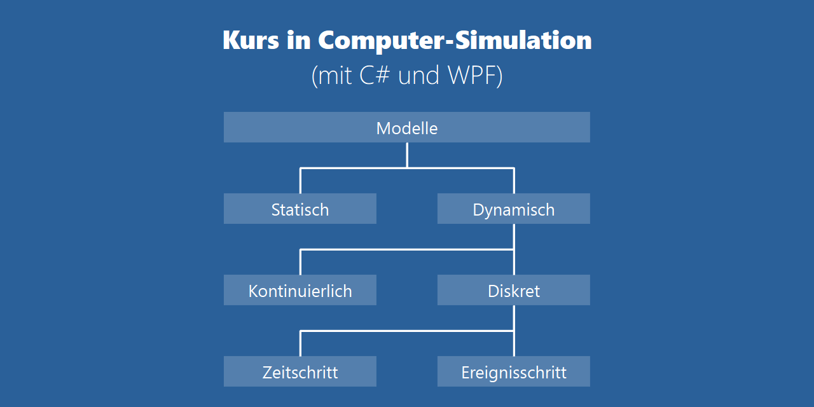

# Kurs in Computer-Simulation mit C#

Dies ist das Repository für den Kurs **Systemsimulation / Digitaler Zwilling** an der **Fachhochschule Oberösterreich** (Campus Wels).

Der Kurs vermittelt den Studierenden des Bachelor-Studiengangs *Automatisierungstechnik* die Grundlagen der Modellierung, Simulation und Visualisierung technischer Systeme. Die Vorlesung gliedert sich in zwei aufeinander aufbauende Blöcke:
1. **Tooling & Visualisierung (Kapitel 2–6):** Hardwarenahe 2D-Raster- und Vektorgrafik, Telemetrie-Diagramme, Netzwerkgraphen, 3D-Echtzeitrendering mit OpenGL sowie Hochleistungs-Multithreading mit der Task Parallel Library.
2. **Physikalische Simulationsmodelle (Kapitel 7–10):** Statische Systeme (Fachwerke via LGS und Cholesky-Zerlegung), kontinuierliche dynamische Systeme (ODEs, S-Functions, DC-Servomotor mit Anti-Windup), diskrete Systeme (Warteschlangen, Monte-Carlo) und hybride Systeme (State Events mit Vorzeichenwechsel-Bisektion).
3. **Synthese & Epilog (Kapitel 11):** Co-Simulation via FMI/FMU, Virtuelle Inbetriebnahme (VIBN / HiL) und ganzheitliche Digitale Zwillinge.

Alle Konzepte werden von vollständigen, lauffähigen C#-Implementierungen in **WPF** und **.NET 8/.NET 10** begleitet.

## Kursinhalte

| Kapitel | Inhalt |
| :--- | :--- |
|  | **[Prolog](./Folien/00_Prolog/Folien.md)**<br>Organisatorisches, Voraussetzungen, Lernziele, Lehrveranstaltungsaufbau und Überblick über die Semesterstruktur. |
|  | **[Kapitel 1: Einführung & Digitaler Zwilling](./Folien/01_Einführung/Folien.md)**<br>Grundlagen von Modellbildung und Simulation, Taxonomie von Modellarten, analytische vs. numerische Verfahren und das Konzept des Digitalen Zwillings nach Michael Grieves. |
|  | **[Kapitel 2: 2D-Visualisierung (Pixel)](./Folien/02_Visualisierung_2D_Pixel/Folien.md)**<br>Direkte Rastergrafik mit `WriteableBitmap`, linearisiertes Stride-Speicherlayout, optimierte Farbtabellen (LUTs) und numerische FDM-Lösung der 2D-Wärmeleitungsgleichung. |
|  | **[Kapitel 3: 2D-Visualisierung (Vektor)](./Folien/03_Visualisierung_2D_Vektor/Folien.md)**<br>Geometrische Vektorgrafik mit `WPF Canvas`, Welt-zu-Bildschirm-Koordinatentransformationen und Performance-Skalierung mit der leichtgewichtigen `DrawingVisual`-Pipeline. |
|  | **[Kapitel 4: Diagramme & Graphen](./Folien/04_Visualisierung_2D_Diagramme/Folien.md)**<br>Echtzeit-Telemetrie und Daten-Streaming mit `ScottPlot 5` (In-Place Zero-Allocation Scatter), MVVM-Architektur sowie topologische Signalfluss-Netzwerke mit `MSAGL`. |
|  | **[Kapitel 5: 3D-Visualisierung (OpenGL)](./Folien/05_Visualisierung_3D_OpenGL/Folien.md)**<br>Hardwarebeschleunigtes 3D-Rendering mit `SharpGL`, hierarchische Szenengraphen (Roboterkinematik), parametrische Körper, Orbit-Kamera mit Kugelkoordinaten und Beleuchtungsmodelle. |
|  | **[Kapitel 6: Multithreading & Performance](./Folien/06_Multithreading/Folien.md)**<br>Multi-Core-Parallelisierung mit der Task Parallel Library (`Parallel.For`), Thread-Synchronisation, Trennung von Physik- und UI-Thread sowie Zero-Allocation-Strategien. |
|  | **[Kapitel 7: Statische Modelle](./Folien/07_Statische_Modelle/Folien.md)**<br>Berechnung idealer und elastischer Fachwerke in 2D und 3D, Aufstellung der Element- und Gesamtsteifigkeitsmatrizen, Koordinatentransformationen und LGS-Lösung mit `Math.NET Numerics` via Cholesky-Zerlegung. |
|  | **[Kapitel 8: Kontinuierliche Dynamische Modelle](./Folien/08_Dynamische_Modelle_Kontinuierlich/Folien.md)**<br>Zustandsraumdarstellung und DGLs, explizite/implizite Solver (Euler, Heun, RK4), Stabilitätsanalyse steifer Systeme, algebraische Schleifen, blockbasierte S-Functions und Closed-Loop DC-Servomotor mit Anti-Windup. |
|  | **[Kapitel 9: Diskrete Dynamische Modelle](./Folien/09_Dynamische_Modelle_Diskret/Folien.md)**<br>Ereignisdiskrete Simulation (DES) von Warteschlangen und Produktionssystemen, Zufallsvariablen (Inversionsmethode, Box-Muller), parallele Monte-Carlo-Simulation und numerisch stabiler Welford-Akkumulator. |
|  | **[Kapitel 10: Hybride Dynamische Modelle](./Folien/10_Dynamische_Modelle_Hybrid/Folien.md)**<br>Kopplung kontinuierlicher Dynamik mit diskreten Zustandsübergängen, exakte Nullstellensuche (Vorzeichenwechsel-Bisektion), Zeno-Effekt mit Sticking-Threshold und hybride S-Functions. |
|  | **[Kapitel 11: Epilog & Synthese](./Folien/11_Epilog/Folien.md)**<br>Vergleichende Modell-Taxonomie, Multi-Fidelity-Simulation im Produktlebenszyklus, Co-Simulation nach dem FMI/FMU-Standard, Virtuelle Inbetriebnahme (VIBN / HiL) und ingenieurmäßiger Werkzeugkasten. |

## Software-Architektur & Quellcode

Die begleitenden C#-Projekte befinden sich im Verzeichnis [`./Quellen`](./Quellen):
- **`Quellen/WS24/`:** Bewährte Laborprojekte (z.B. Warteschlangensimulation mit integriertem Welford-Akkumulator, statische Fachwerk-Berechnung).
- **`Quellen/WS25/`:** Neu strukturierte Architekturbausteine:
  - **`SimulationMvvmPattern/`:** Saubere WPF/MVVM-Entkopplung mit allokationsfreier ScottPlot-5-Visualisierung.
  - **`SFunctionContinuous/`:** Blockbasierte kontinuierliche Simulations-Engine (ODE-Solver, DC-Servomotor mit dynamischem Anti-Windup).
  - **`SFunctionHybrid/`:** Hybride Simulations-Engine mit Vorzeichenwechsel-Bisektion und Sticking-Schwellwert.
  - **`VorlageSzenengraph3D/`:** 3D-Szenengraph mit Kugelkoordinaten-Orbitkamera und geometrischen Generatoren (`GeometryFactory`).
  - **`SimulationTests/`:** Unit-Testsuite (MSTest) zur numerischen Verifikation aller Algorithmen.

### Kompilierung und Tests

```powershell
# Kompilieren der gesamten Solution
dotnet build Quellen/Quellen.sln -c Release

# Ausführen der Unit-Testsuite (14/14 Tests)
dotnet test Quellen/Quellen.sln -c Release
```

## Qualitätssicherung & Folienvalidierung

Zur Sicherstellung höchster Beamer- und Lesbarkeitsergonomie verfügt das Repository über einen automatisierten Headless-Chromium-Linter:

```powershell
# Automatische Prüfung aller 12 Foliensätze auf vertikalen Überlauf und minimale Schriftgrößen
pwsh Skripte/Test-SlideLayout.ps1
```