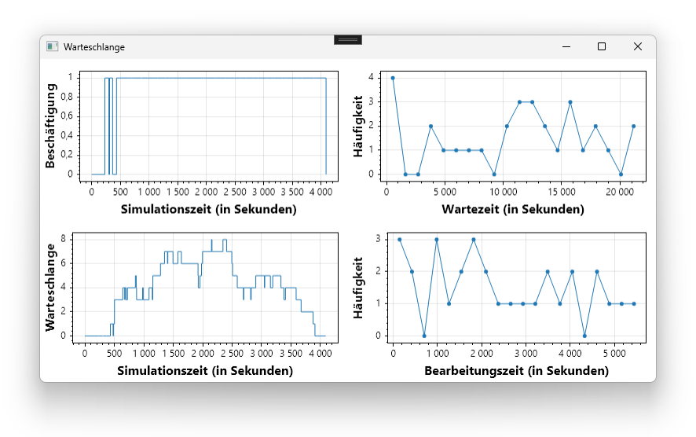

# Kurs in Computer-Simulation

Dieses Repository enthält Beispiele zum Thema Computer-Simulation, welche an der [Fakultät für Technik und angewandte Naturwissenschaften](https://fh-ooe.at/campus-wels) (engl. *School of Engineering*) der [Fachhochschule Oberösterreich](https://www.fh-ooe.at/) entwickelt wurden. Die Beispiele verwenden

* die Programmiersprache **C#** für die Umsetzung der Datenstrukturen und Algorithmen sowie
* das Framework **Windows Presentation Foundation (WPF)** für die Erstellung grafischer Benutzerschnittstellen.

Des Weiteren verwenden wir für die Umsetzung der Beispiele einige vorgefertigte Bibliotheken, welche **grundlegende Funktionen für Berechnung** bereistellen. Die wichtigsten Bibliotheken sind

* **Math.NET Numerics** für die Lösung linearer Gleichungssysteme,
* **SimSharp** für die Simulation ereignisdiskreter Modelle,

Schließlich nutzen wir auch einige vorgefertige Bibliotheken für die **Visualisierung der Daten**, welche durch die Simulationsprogramme verwaltet und berechnet werden. Die wichtigsten Bibliotheken sind

* **ScottPlott** für die Erstellung von Diagrammen, und
* **SharpGL** für die Erstellung von 3D-Visualisierungen.

Der folgende Inhalt ist in drei Abschnitte untergliedert:

1. **Modelle** (Übersicht die Simulationsmodelle und -programme)
1. **Vorlagen** (Übersicht der Vorlagen für 2D- und 3D-Visualisierung)
1. **Dokumente** (Übersicht der Dokumente rund um das Repository und den Quelltext)

## 1. Modelle

Modelle sind zunächst einmal eine **vereinfachte Beschreibung der physikalischen Wirklichkeit**.
Die Beschreibungen sind in der Regel in irgendeiner Weise vereinfacht, da die Wirklichkeit praktisch nicht vollständig beschrieben werden kann.
Zum Beispiel beschreiben mechanische Modelle die Wirklichkeit als Menge von Körpern mit gewissen konstanten und zeitvariablen Eigenschaften.
Zu den *konstanten* Eigenschaften können zum Beispiel die Massen sowie bei Festkörpern die Formen und die Masseschwerpunkte gezählt werden.
Zu den *variablen* Eigenschaften können hingegen die wirkenden Kräfte, die resultierenden Beschleunigungen, die Geschwindigkeiten sowie die Positionen und die Orientierungen im Raum gezählt werden.
Solche mechanischen Modelle vernachlässigen dabei zum Beispiel termische Eigenschaften wie Temperaturen, elektrische Eigenschaften wie Leitfähigkeit, oder optische Eigenschaften wie Lichtspiegelung oder -brechung.

Wir als Ingenieure nutzen nun solche Modelle, um **die Wirklichkeit einerseits zu verstehen und andererseits gestaltbar zu machen**.
*Verstehen* bedeutet in diesem Zusammenhang, dass wir die Wirklichkeit mithilfe unserer Modelle möglichst gut vorhersagen können.
Zum Beispiel helfen uns die Modelle der Newton'schen Mechanik vorauszusagen, welche Flugkurve ein Flugobjekt (z.B. ein Ball) unter gegebenen Voraussetzungen (z.B. Wurfposition, -geschwindigkeit, und -richtung) nehmen wird.
*Gestalten* heißt hingegen, dass wir unsere Vorhersagen nutzen um in unserem Sinne gezielt Einfluss auf die Wirklichkeit zu nehmen.
Zum Beispiel helfen uns wieder die Modelle der Newton'schen Mechanik ein Katapult so auszulegen, dass Flugobjekte (z.B. Steine mit einer Masse von 50 Kilogramm) über eine gewisse Distanz (z.B. 50 Meter) geschleudert werden können.

Nun stellt sich die Frage, welche **Arten von Modellen** es eigentlich gibt.
Die Modelle der Newton'schen Mechanik beschreiben die physische Realität zum Beispiel in Form von *Differenzialgleichungen* über die Zeit.
Die Differenzialgleichungen beschreiben dabei eine die Änderung des Systemzustands und der Systemzustand muss durch Integration der Differenziale berechnet werden.
Modelle von Fachwerksbauten beschreiben die physische Realität hingegen in Form von *Gleichungssystemen*, welche ohne Differenziale über die Zeit auskommen und dabei nicht an Gültigkeit und Nützlichkeit für ingenieursmäßige Anwendungen einzubüßen.
Diese Vereinfachung ist möglich, da die entsprechenden Modelle nur die eingeschwungenen Zustände der Fachwerke beschreiben, in denen sich ohne äußere Einwirkung nichts mehr ändert.
Folglich unterscheiden wir im weiteren Verlauf zwei grundlegende Arten von Modellen:

1. **Statische Modelle** (Betrachtung eines einzelnen stabilen Systemzustands)
1. **Dynamische Modelle** (Betrachtung der Änderung des Systemzustands über die Zeit)

Im Folgenden gehen wir genauer auf diese beiden Modellarten ein.
In Abschnitt 1.1. beleuchten wir zuerst die Kategorie der statischen Modelle, welche ohne den Faktor Zeit auskommen.
In Abschnitt 1.2. untersuchen wir dann die Kategorie der dynamischen Modelle, welche das Zeitverhalten genauer abbilden.

### 1.1. Statische Modelle

Statische Modelle betrachten Systemzustände $s$, bei denen es ohne externe Einwirkung zu keiner Zustandsänderung kommt.
Bei solchen Modellen sind typischerweise einige Zustandseigenschaften bekannt, andere jedoch nicht.
Das Systemmodell $f$ beschreibt dann den Zusammenhang zwischen den bekannten Zustandseigenschaften $s_{bekannt}$ und den unbekannten Zustandseigenschaften $s_{unbekannt}$:

$s_{unbekannt} = f(s_{bekannt})$

Simulationsprogramme sind nun dafür verantwortlich, die *unbekannten* Zustandseigenschaften aus den *bekannten* zu berechnen.
Je nach Modell müssen unterschiedliche Techniken eingesetzt werden, um die Berechnung durchführen zu können.
Für lineare Gleichungssysteme kann z.B. das Gauß'sche Eliminationsverfahren angewendet werden.
Für nicht-lineare Gleichungssysteme müssen andere Techniken eingesetzt werden.

Als Beispiel für statische Modelle betrachten wir im Folgenden das Konzept der **Fachwerke** aus der Bautechnik.
Ein Fachwerk ist ein System bestehend aus Knoten, die über Stäbe miteinander verbunden sind.
Des Weiteren sind einige der Knoten gelagert, d.h. deren Position im Raum ist fixiert.
Dabei können entweder alle Richtungungen oder nur eine Teilmenge der Richtungen fixiert sein.
Schließlich wirken auf die Knoten noch externe Kräfte in eine oder mehrere Richtungen.

Im Folgenden betrachten wir unterschiedliche Arten, wie Fachwerke modelliert werden können:

1. **Ideales 2D/3D-Fachwerk** (die Länge der Stäbe ändert sich *nicht* unter Druck/Zug)
1. **Elastisches 2D/3D-Fachwerk** (die Länge der Stäbe ändert sich unter Druck/Zug)

#### [Ideales 2D-Fachwerk](./Quellen/WS24/StatischFachwerkIdeal2D/)

Bei einem idealen Fachwerk ist die Annahme, dass es durch externe Kräfte zu *keiner* Verformung des Fachwerks kommt.
Das heißt anders ausgedrückt, dass die Positionen der Knoten und die Längen der Stäbe unveränderlich sind.
Die unbekannten Zustandseigenschaften sind somit die Stab- und Lagerkräfte, welche auf Stäbe und gelagerte Knoten wirken.
Der Zusammenhang zwischen Stab- bzw. Lagerkräften und externen Kräften kann als lineares Gleichungssystem ausgedrückt werden.
Das lineare Gleichungssystem kann mit Hilfe der Matrixinversion gelöst werden, welche z.B. die Bibliothek [Math.NET Numerics](https://numerics.mathdotnet.com/) implementiert.

Die folgende Grafik zeigt das Datenmodell des Programms für die Berechnung der Lager- und Stabkräfte eines einfachen zweidimensionalen Fachwerks.
Über die Klasse ``Truss`` können Fachwerke inklusive der darin enthaltenen Knoten, Stäbe, Lager, und externen Kräfte definiert werden.
Des Weiteren bietet die Klasse ``Truss`` die Methode ``Solve``, welche mittels der Matrixinversion die Stab- und Lagerkräfte berechnet.
Die Visualisierung erfolgt schließlich mit einem ``DataGrid`` sowie einem ``Canvas``, welche die Windows Presentation Foundation (WPF) bereitstellt.

#### [Ideales 3D-Fachwerk](./Quellen/WS25/IdealesFachwerk3D/)

TODO

TODO

TODO

#### [Elastisches 2D-Fachwerk](./Quellen/WS24/StatischFachwerkElastisch2D/)

Bei einem elastischen Fachwerk kann sich die Länge der Stäbe durch die Einwirkung einer externen Kraft verändern. Das Modell muss dafür um die Elastizität sowie die Querschnittfläche der Stäbe erweitert werden. Die unbekannten Zustandseigenschaften sind in diesem Fall die Verschiebungen der ungelagerten Knoten sowie die Lagerkräfte, welche an den gelagerten Knoten wirken. Der Zusammenhang zwischen Verschiebungen bzw. Lagerkräften und externen Kräften kann wieder vereinfacht als lineares Gleichungssystem ausgedrückt werden. Die Lösung erfolgt auch wieder mittels Matrixinversion.

Die folgende Grafik zeigt das Datenmodell des Simulationsprogramms. Die Klasse `Truss` kann verwendet werden, um Fachwerke zu definieren. Mit der Methode `AddNode(...)` können dem Fachwerk neue Knoten hinzugefügt werden. Dabei müssen die initiale Knotenposition sowie die Lagerung und externe Kräfte angegeben werden. Mit der Methode `AddRod(...)` können dem Fachwerk hingegen neue Stäbe hinzugefügt werden. Dabei müssen die beiden verbundenen Knoten sowie die Elastizität und die Querschnittsfläche angegeben werden. Die Methode `Solve()` berechnet schließlich die Lagerkräfte und Knotenverschiebungen.

#### [Elastisches 3D-Fachwerk](./Quellen/WS25/ElastischesFachwerk3D/)

TODO

TODO

TODO

### 1.2. Dynamische Modelle

Dynamische Modelle betrachten *nicht* einen einzelen stabilen Systemzustand, sondern die Änderung des Systemzustands über die Zeit.
Dafür muss in der Regel ein Startzustand sowie eine Zustandsübergangsfunktion gegeben sein.
Die Simulation rechnet dann den Zustand des Systems gemäß der Zustandsübergangsfunktion weiter.
Man kann grundsätzlich zwischen zwei Arten von Modellen unterschieden werden:

1. **Zeitkontinuierliche Modelle** (Modell beschreibt Zustand zu jedem Zeitpunkt)
1. **Zeitdiskrete Modelle** (Modell beschreibt Zustands nur zu ausgewählten Zeitpunkten)

#### 1.2.1. Zeitkontinuierliche Modelle

Zeitkontinuierliche Modelle beschreiben den Zustand $s(t)$ des Systems als kontinuierliche (d.h. stetige) Funktion über der Zeitdomäne.
In der Regel sind bei dieser Art von Modellen der Startzustand $s_0$ (d.h. Konstanten) sowie die Veränderung des Zustands $s'(t)$ über die Zeit (d.h. dessen Ableitung nach der Zeit) bekannt.
Um nun den Zustand des Systems zu einem gewissen Zeitpunkt zu berechnen, muss die Ableitung des Zustands folglich über die Zeit integriert werden.

$s(t) = s_0 + \int_0^ts`(t)\delta t$

Eine wichtige Eigenschaft der Zustandsfunktion $s(t)$ ist, dass der Wert der Funktion zum Zeitpunkt $t = 0$ dem Startzustand $s_0$ entspricht, das heißt es gilt $s(0) = s_0$.
Dieser Zusammenhang zeigt sich, wenn man den Wert $t = 0$ in die Zustandsfunktion $s(t)$ einsetzt und das Integral der Zustandsübergangsfunktion $\int_0^ts'(t)\delta t$ berechnet.
Wir erkennen leicht, dass das Integral der Zustandsübergangsfunktion an der Stelle $t = 0$ den Wert Null hat.

| Rechte Seite | $=$ | Linke Seite |
|-|-|-|
| $s(0)$ | $=$ | $s_0 + \int_0^0s'(t)\delta t$ |
| | $=$ | $s_0 + 0$ |
| | $=$ | $s_0$ |

Die folgende Grafik illustriert die Zustandsfunktion $s(t)$ inklusive deren Startzustand $s_0$ und Ableitung nach der Zeit $s'(t)$.
Die Zustandsfunktion $s(t)$ ist in der Grafik als kontinuierlicher blauer Verlauf dargestellt.
Der Startzustand $s_0$ entspricht in der Grafik dem Schnittpunkt der blauen Verlaufskurve mit der Y-Achse.
Die Ableitung der Zustandsfunktion nach der Zeit $s'(t)$ ist schließlich an sechs ausgewählten Punkten als rote Tangente dargestellt.

Modelle der Newton'schen Mechanik beschreiben die Wirklichkeit zum Beispiel als ein System von *Differenzialgleichungen*.
In diesem System entspricht beispielsweise die Geschwindigkeit eines Körpers der Änderung der Position des Körpers über die Zeit.
Genauso entspricht die Beschleunigung eines jeden Körpers der Änderung der Geschwindigkeit des jeweiligen Körpers über die Zeit.
Kennt man also die Beschleunigung, die auf einen Körper wirkt (z.B. die Erdbeschleunigung), kann man daraus die Geschwindigkeit zu einem bestimmten Zeit bestimmen.
Und kennt man die Geschwindigkeit des Körpers, kann man daraus wiederum die Position des Körpers zu einem bestimmten Zeitpunkt berechnen.

| Größe | Formel |
|-|-|
| Masse | $m$ |
| Kraft | $f(t)$ |
| Beschleunigung | $a(t) = f(t) / m$ |
| Geschwindigkeit | $v(t) = v_0 + \int_0^t a(t)\delta t$ |
| Position | $p(t) = p_0 + \int_0^t v(t)\delta t$ |

Nun kann man mit diesem Modell bestimmte Fragen beantworten, z.B. welche Position $p_{gesucht}$ und welche Geschwindigkeit $v_{gesucht}$ hat der Körper zu einem gewissen Zeitpunkt $t_{gegeben}$.
Um diese Frage zu beantworten, müssen wir den Zeitpunkt in die obigen Zustandsfunktionen einsetzen und die Funktionen berechnen, was in weiterer Folge die Bestimmung der Integrale erfordert.

| Gegeben | $\rightarrow$ | Gesucht | | |
|-|-|-|-|-|
| $t_{gegeben}$ | $\rightarrow$ | $p(t_{gegeben})$ | $=$ | $p_{gesucht}$ |
| $t_{gegeben}$ | $\rightarrow$ | $v(t_{gegeben})$ | $=$ | $v_{gesucht}$ |
| $t_{gegeben}$ | $\rightarrow$ | $a(t_{gegeben})$ | $=$ | $a_{gesucht}$ |

Eine andere Frage wäre beispielsweise, zu welchen Zeitpunkten $t_{gesucht}$ der Körper eine gewisse Position $p_{gegeben}$ oder Geschwindigkeit $v_{gegeben}$ hat bzw. Beschleunigung $a_{gegeben}$ erfährt.
Um diese Frage zu beantworten, müssen wir die obigen Zustandsfunktionen gleich der gewünschten Zuständswerte setzen und die Gleichungen nach der Zeit auflösen.

| Gegeben | $\rightarrow$ | Gesucht | | |
|-|-|-|-|-|
| $p_{gegeben}$ | $\rightarrow$ | $p^{-1}(p_{gegeben})$ | $=$ | $t_{gesucht}$ |
| $v_{gegeben}$ | $\rightarrow$ | $v^{-1}(v_{gegeben})$ | $=$ | $t_{gesucht}$ |
| $a_{gegeben}$ | $\rightarrow$ | $a^{-1}(a_{gegeben})$ | $=$ | $t_{gesucht}$ |

In Ausnahmefällen können die gesuchten Größen analytisch bestimmt und somit der Systemzustand zu einem gegebenen Zeitpunkt oder der Zeitpunkt, zu dem ein bestimmter Zustand gilt, exakt berechnet werden.
Im Regelfall sind diese analytischen Lösungsmethoden aufgrund der Komplexität der Differenzialgleichungen und -gleichungssysteme jedoch nicht praktisch anwendbar und die gesuchten Größen müssen näherungsweise mit numerischen Verfahren bestimmt werden.
Die einfachsten numerischen Verfahren sind das explizite und das implizite Eulerverfahren, welche mit einer festen Schrittweite $\Delta t$ arbeiten.
Die Größe der Schrittweite wirkt sich dabei allgemein direkt auf die Genauigkeit der Schätzung bzw. den numerischen Fehler aus.
Eine Erweiterung und Verallgemeinerung der Eulerverfahren ist das Runge-Kutta-Verfahren, welches zusätzliche Glieder der Taylor-Reihe der zu approximierenden Zustandesfunktion verwendet um bessere Ergebnisse zu erhalten.

Die numerischen Methoden berechnen allgemein Schätzwerte $s_i'$ für für die Zustände $s(i*\Delta t)$ zu definierten Zeitpunkten $i * \Delta t$.

Im Folgenden untersuchen wir für die weitere Vertiefung zwei Anwendungsbeispiele, die sich in ihrer Komplexität leicht unterscheiden und für welche die analytischen Lösungen bereits bekannt sind.
Uns ist in diesem Fall wichtig, dass sich die Modelle für die obigen Fragestellungen auch analytisch lösen lassen, damit wir einen Vergleich zwischen analytischen und numerischen Methoden anstellen können.
Insbesondere geht es uns um den Fehler, den die numerischen Methoden abhängig von ihren Einstellungen wie der Schrittweite in Relation zur exakten analytischen Lösung machen.
Die beiden Anwendungsfälle sind die folgenden:

1. **1D-Ballwurf** (Anfangsgeschwindigkeit, Anfangsposition und Erdbeschleunigung)
1. **1D-Federpendel** (Federkonstante, Anfangsbeschleinigung, Anfangsgeschwindigkeit und Anfangsposition)

##### [1D-Ballwurf](./Quellen/WS24/DynamischBallwurf1D/)

Beim ersten Beispiel betrachten wir den senkrechten Wurf eines Balles.
Die Zustandseigenschaften sind dabei die Position und die Geschwindigkeit des Balles.
Die Beschleunigung des Balles ist hingegen konstant (und gleich der Erdbeschleunigung).
Die Geschwindigkeit des Balles ergibt sich somit aus der Anfangsgeschwindigkeit sowie der Integration der Beschleunigung über die Zeit.
Die Position des Balles ergibt sich hingegen aus der Anfangsposition sowie der Integration der Geschwindigkeit über die Zeit.
Die folgende Tabelle zeigt die analytische Lösung für die Geschwindigkeit abhängig die Zeit und die Position abhängig von der Zeit.

| Größe | Formel |
|-|-|
| Beschleunigung | $a(t) = -g$ |
| Geschwindigkeit | $v(t) = v_0 - g*t$ |
| Position | $p(t) = p_0 - g * t^2 / 2$ |

Nun können wir die Flugkurve des Körpers mithilfe der Formeln weiter analysieren.
Zum Beispiel wollen wir den höchsten Punkt der Flugbahn und dessen Zeitpunkt bestimmen.
Dazu müssen wir zuerst die Geschwindigkeitsfunktion $v(t_{peak}) = 0$ setzten und nach Zeitpunkt $t_{peak}$ auflösen.

| Linke Seite | $=$ | Rechte Seite |
|-|-|-|
| $v(t_{peak})$ | $=$ | $0$ |
| $v_0 - g * t_{peak}$ | $=$ | $0$ |
| $v_0$ | $=$ | $g * t_{peak}$ |
| $v_0 / g$ | $=$ | $t_{peak}$ |

Danach können wir die Positionsfunktion $p(t_{peak})$ nutzen, um die Höhe des Flugkurve zu bestimmen.
Dazu müssen wir einfach die vorige Formel für $t_{peak}$ in die Positionsfunktion einsetzen und soweit wie möglich vereinfachen.

| Linke Seite | $=$ | Rechte Seite |
|-|-|-|
| $p(t_{peak})$ | $=$ | $p_0 - g * t_{peak}^2 / 2$ |
| | $=$ | $p_0 - g * (v_0 / g)^2 / 2$ |
| | $=$ | $p_0 - g * v_0^2 / g^2 / 2$ |
| | $=$ | $p_0 - v_0^2 / g / 2$ |

Außerdem möchten wir wissen, wann der Körper auf den Boden auftrifft.
Dazu müssen wir die Positionsfunktion $p(t_{ground}) = 0$ setzen und nach dem Zeitpunkt $t_{ground}$ auflösen.

| Linke Seite | $=$ | Rechte Seite |
|-|-|-|
| $p(t_{ground})$ | $=$ | $0$ |
| $p_0 - g * t_{ground}^2 / 2$ | $=$ | $0$ |
| $p_0$ | $=$ | $g * t_{ground}^2 / 2$ |
| $2 * p_0 / g$ | $=$ | $t_{ground}^2$ |
| $\pm \sqrt{2 * p_0 / g}$ | $=$ | $t_{ground}$ |

TODO

##### [1D-Federpendel](./Quellen/WS24/DynamischFederpendel1D/)

Beim zweiten Beispiel betrachten wird die Schwingung einer gefederten Masse.
Die Zustandseigenschaften sind dabei die Position, die Beschleunigung, und die Geschwindigkeit der Masse sowie die auf die Masse einwirkende Federkraft.
Die Masse selbst sowie die Federkonstante sind hingegen unveränderlich.
Die numerische Integration mit dem expliziten Eulerverfahren erfolgt analog zum vorigen Beispiel.
Die numerische Integration mit dem impliziten Eulerverfahren ist hingegen etwas komplizierter, weil die Geschwindigkeit von der Position und die Position von der Geschgwindigkeit abhängen.
Aus diesem Grund muss für das implizite Eulerverfahren ein lineares Gleichungssystem gelöst werden, welches Position, Federkraft, Beschleunigung, und Geschwindigkeit in Beziehung setzt.

#### 1.2.2. Zeitdiskrete Modelle

Zeitdiskrete Modelle zeichnen sich dadurch aus, dass Zustandsübergänge nur zu bestimmten Zeitpunkten stattfinden (und nicht kontinuierlich).
Somit wird die Zustandsfunktion zu einer **nicht-stetigen Stufenfunktion**, statt zu einer stetigen Verlaufsfunktion.

Diese Art der Modellierung eignet sich beispielsweise zur Beschreibung der Verhaltens von speicherprogrammierbaren Steuerungen.
Speicherprogrammierbare Steuerungen haben nämlich einen festen Arbeitstakt, in dem Eingänge gelesen und Ausgänge geschrieben werden.
Die Werte der Eingänge und Ausgänge ändern sich dabei nur beim Übergang von einem zum nächsten Taktzyklus.
Zwischen den Übergängen sind die Werte der Eingänge und Ausgänge hingegen konstant.

Bei den zeitdiskreten Modellen können wieder zwei Arten unterschieden werden, die diskreten Zeitschritte durchzuführen:

1. **Konstantschritt** (die Simulationszeit schreitet mit einer definierten Schrittweite voran, welche sich über den Simulationverlauf nicht ändert)
1. **Ereignisschritt** (die Simulationszeit schreitet mit einer variablen Schrittweite voran, welche durch Ereignisse definiert wird)

##### 1.2.2.1. Konstantschritt

TODO

TODO

TODO

##### 1.2.2.2. Ereignisschritt

TODO

Die folgende Grafik zeigt den Ablauf einer dynamischen zeitdiskreten Simulationrechnung, bei der von Ereignis zu Ereignis gesprungen wird.

Die Simulationsrechnung startet mit der Initialisierung der Zeit, des Zustandes, und der Ereignisse.
Dann folgt die Ereignisverarbeitung, bis keine weiteren Ereignisse mehr vorliegen (oder eine maximale Zeit erreicht ist).
Bei der Ereignisverarbeitung wird in jeder Iteration zunächst das jeweils nächste Ereignis bestimmt.
Dann wird die Simulationszeit auf den Eintrittszeitpunkt des ausgewählten Ereignisses gesetzt.
Im nächsten Schritt wird der folgende Systemzustand abhängig vom bisher gültigen Systemzustand und dem eintretenden Ereignis aktualisiert.
Schließlich werden noch optional Folgeereignisse generiert, welche sich aus dem aktuellen Ereignis ergeben.

Nun wenden wir diese Technik auf unterschiedliche Problemstellungen an, um ein besseres Verständnis der Funktionsweise zu bekommen.
Im Rahmen dieses Kurses betrachten wir die folgenden Anwendungsfälle für zeitdiskrete Simulationsrechnungen mit Ereignissprüngen:

1. **Warteschlange** (der Klassiker für Eregnissprünge mit einer Menge von Aufträgen und einer beschränkten Ressource)

###### [Warteschlange](./Quellen/WS24/DynamischWarteschlange/)

TODO

TODO

## 2. Vorlagen

Das Repository enthält auch ein paar Vorlagen, welche du für die Entwicklung deiner eigenen Simulationsprogramme verwenden und auf deine Bedürfnisse anpassen kannst:

* 2D-Visualisierung mit WPF und ScottPlot
* 3D-Visualisierung mit WPF und SharpGL

### 2.1. [2D-Visualisierung mit **WPF und ScottPlot**](./Quellen/WS24/VorlageVisualisierung2D/)

Dieses Beispiel zeigt dir, wie du einfache 2D-Diagramme in deinen Simulationsprogrammen erstellen und anzeigen kannst.
Das Beispiel nutzt dafür das Microsoft WPF Framework für allgemeine grafische Benutzeroberflächen sowie ScottPlot für Diagrammvisualisierungen.

### 2.2. 3D-Visualisierung mit **WPF und SharpGL**

Manchmal kann es auch hilfreich sein, 3D-Visualisierungen (z.B. des Systemzustands) in deine Simulationsprogramme zu integrieren.
Die folgenden Beispiele zeigen dir, wie du solche Visualisierungen mit SharpGL in deine WPF-Anwendungen einfach integrieren kannst.
Grundsätzlich hast du zwei Möglichkeiten, 3D-Visualisierungen programmatisch zu erzeugen, nämlich über die **prozedurale** oder die **objektorientierte API**.

#### [2.2.1. Prozedurale API](./Quellen/WS25/VorlageVisualisierung3D/)

Die prozedurale API bietet dir grundlegende Zeichenoperationen für primitive 3D-Grafikobjekte wie Punkte, Linien, Dreiecke und Vierecke. Der folgende Screenshot zeigt dir, was man mit diesen primitiven Objekten machen kann und welche Varianten es davon gibt.

TODO

#### [2.2.2. Objektorientierte API](./Quellen/WS24/VorlageVisualisierung3D/)

Bei SharpGL kannst du die 3D-Visualisierungen in Form eines Szenengraphen einfach definieren.
Ein Szenengraph beschreibt den Inhalt einer 3D-Visualisierung in Form von Objekten und deren Zusammenhängen.

Die folgende Grafik zeigt die Klassen, aus welchen sich ein Szenengraph bei SharpGL zusammensetzt, und deren Beziehungen.

## 3. Dokumente

Hier sind noch ein paar wichtige Dokumente für jeden, der die Beispiele aus diesem Repository gerne nutzen möchte:

* [Änderungen](./CHANGELOG.md)
* [Beitragen](./CONTRIBUTING.md)
* [Lizenz](./LICENSE.md)