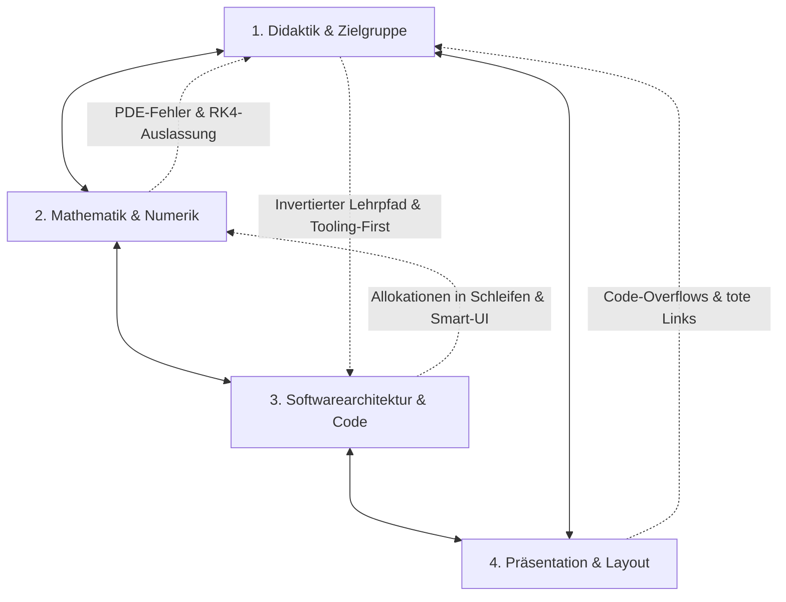

# Strategisches Gesamtlagebild & Master-Roadmap
## Vorlesungsreihe „Systemsimulation / Digitaler Zwilling“ (Kapitel 00 bis 11)

**Institution:** FH Oberösterreich, Campus Wels  
**Studiengang:** Bachelor Automatisierungstechnik (5./6. Semester)  
**Dozent:** Dr. Georg Hackenberg  
**Dokument-ID:** `Reviews/00_Gesamtlagebild_und_Roadmap.md`  
**Synthese-Basis:** Fachgutachten Didaktik (`01`), Mathematik (`02`), Architektur (`03`) und Präsentation (`04`)  
**Datum:** Oktober 2026  

---

## 1. Executive Summary & Reifegradbewertung

Die Lehrveranstaltungsreihe **„Systemsimulation / Digitaler Zwilling“** bildet ein akademisch anspruchsvolles, technologisch modernes und didaktisch ambitioniertes Curriculum. Der Kernansatz, Simulation nicht als bloße „Black-Box“-Bedieneroberfläche (MATLAB/Simulink, kommerzielle CAD-Tools) zu vermitteln, sondern die **mathematischen und softwaretechnischen Mechanismen unter der Haube** (Numerische Integratoren, S-Function-Architekturen, algebraische Schleifen, Speichermodelle, Multithreading) transparent und in C# (.NET 8) implementierbar zu machen, ist im deutschsprachigen Fachhochschulraum ein herausragendes Alleinstellungsmerkmal.

Dennoch zeigen die vier Fachgutachten in seltener Einmütigkeit, dass der Kurs derzeit an einer **Schnittstellen- und Konsolidierungskrise** leidet: Das Curriculum weist erhebliche Diskrepanzen zwischen dem theoretisch vermittelten Anspruch auf den Folien und der Realität im Quellcode, in der didaktischen Progression sowie in der Layout-Präsentation auf.

### Reifegradbewertung (Skala 1 bis 10)

```
[Didaktik & Zielgruppe]      ■■■■■■■░░░  7.0 / 10  (Invertierter Lehrpfad, Kap. 05 Überlastung)
[Mathematik & Numerik]       ■■■■■■■½░░  7.5 / 10  (Hohe Tiefe, aber RK4-Lücke & PDE-Formelfehler)
[Softwarearchitektur & C#]   ■■■■■■■░░░  7.0 / 10  (Starke Konzepte, aber Smart-UI & GC-Druck)
[Präsentation & Layout]      ■■■■■■½░░░  6.5 / 10  (Schickes MARP-Theme, aber 404s, Hotlinks, Code-Overflow)
-----------------------------------------------------------------------------------------------------
GESAMTREIFEGRAD              ■■■■■■■░░░  7.0 / 10  (Solide Exzellenzbasis mit hohem Veredelungspotenzial)
```

- **Didaktik & Zielgruppenpassung (7.0/10):** Sehr hohes Niveau, leidet jedoch unter dem „Tooling-First“-Ansatz (fünf Wochen Computergrafik vor dem ersten mechatronischen Modell), der mathematischen Inversion (PDE vor ODE) und der noch unzureichenden Kopplung an die industrielle Automatisierungspraxis (SPS, Closed-Loop, VIBN).
- **Mathematik, Physik & Numerik (7.5/10):** Fundierte Herleitungen (FEM-Steifigkeit, Event-Scheduling, Stochastik). Punktuell jedoch gravierende Lücken (RK4 und Heun fehlen in Kap. 08 völlig), Dimensionsfehler in Kap. 02, Begriffsverwechslungen (Euler-Cromer als Implizit deklariert; Fixpunktiteration als Newton benannt) und Kausalitätsrisiken (Normalverteilung für Zeitdauern).
- **Softwarearchitektur & C# (7.0/10):** Beeindruckende Reifung von WS24 zu WS25 mit Simulink-artigen S-Functions und SimscapeSharp. Jedoch dominieren in den Übungen Smart-UI-Antipatterns (Code-Behind statt MVVM), massive Heap-Allokationen in den innersten Solver-Schleifen und numerisch fatale Matrixinversionen (`A.Inverse()`).
- **Präsentation, Layout & Medien (6.5/10):** Attraktives FH-OÖ-MARP-Theme mit 509 Folien. Kritisch sind drei defekte 404-Bildlinks in Kap. 07, 14 externe Web-Hotlinks, 16 gravierend überlange Codeblöcke (>20 Zeilen, bis 101 Zeichen Breite), ungenutzte fertige Titelbilder und leere Begleitnotizen in vier Kapiteln.

---

## 2. Die 5 dringendsten & kritischsten Reibungspunkte

Fachübergreifend treten fünf Kernkonflikte hervor, die das Gesamterlebnis des Kurses spürbar belasten und prioritär behoben werden müssen:

### 1. Die doppelte Didaktik-Inversion („Tooling before Domain“ & „PDE before ODE“)
* **Befund (Didaktik & Numerik):** Die Vorlesung beginnt mit einem massiven fünfwöchigen Block systemnaher Programmierung und Computergrafik (Pixelpuffer, Zeigerarithmetik, DrawingVisuals, fixed-function OpenGL 1.1, Multithreading), bevor überhaupt eine physikalische Bewegungsgleichung gelöst wird. Zudem wird in Kapitel 02 als Pixel-Visualisierung eine 2D-Wärmeleitungsgleichung (partielle Differentialgleichung mit 5-Punkt-Stern und Von-Neumann-Stabilitätsanalyse) berechnet – während einfache gewöhnliche Differentialgleichungen (freier Fall) erst Wochen später in Kapitel 08 eingeführt werden.
* **Auswirkung:** Studierende der Automatisierungstechnik erleiden einen anfänglichen Demotivationsschock („Habe ich mich in ein Informatik-Grafik-Studium verirrt?“). Der Transfer zwischen Grafik-Werkzeugen und physikalischen Modellen bleibt schwach, da die Tools auf Vorrat gelehrt werden.

### 2. Die Kern-Solver-Lücke in Kapitel 08 (Fehlen von RK4 und Heun)
* **Befund (Numerik, Didaktik & Architektur):** Kapitel 08 („Kontinuierliche Dynamische Modelle“) ist das theoretische Herzstück des Kurses. Überraschenderweise behandelt das Kapitel im Fließtext und Code **ausschließlich den expliziten Euler und eine vereinfachte Fixpunktiteration**. Die Standard-Integratoren der Ingenieurpraxis – das **Verfahren von Heun (RK2)** und das **klassische Runge-Kutta 4 (RK4)** – fehlen vollständig!
* **Auswirkung:** In Kapitel 11 (Epilog) und im Modulplan wird das Solver-Trio Euler-Heun-RK4 als selbstverständlich vorausgesetzt. Studierende verlassen das Semester, ohne den Industrie-Standard RK4 je selbst implementiert oder dessen Butcher-Tableau verstanden zu haben.

### 3. Smart-UI vs. Entkopplung: Die Spaltung zwischen Folienlehre und Quellcode
* **Befund (Architektur & Didaktik):** Auf Folie 11.3 predigt das Skriptum die „Goldene Regel der Simulationsarchitektur“ (strikte Trennung von `IContinuousModel`, `IContinuousSolver` und entkoppelter UI via MVVM). In den tatsächlichen C#-Übungsprojekten (insbesondere WS24 und Teilen von WS25) sind Physik, Zeitschrittschleifen und ScottPlot-Ansteuerung monolithisch in `MainWindow.xaml.cs` zusammengebacken.
* **Auswirkung:** Studierende eignen sich in den Übungen den Programmierstil von Einsteigern an („alles in den Button-Click-Handler“), anstatt das in der Theorie geprüfte Software-Engineering professionell einzuüben. Es fehlt ein sauberes Referenzprojekt mit ViewModel und Datenbindung.

### 4. Medien-Fragilität: Defekte 404-Links, Web-Hotlinking & ungenutzte Assets
* **Befund (Präsentation & Layout):** 
  - In Kapitel 07 werfen drei Folien 404-Fehler, weil sie auf einen veralteten Ordnernamen (`../03_Statische_Modelle_3D/`) verweisen.
  - 14 Grafiken (insbesondere OpenGL- und Verteilungsdiagramme) werden live über externe Webseiten (Wikipedia, Machinethink etc.) gehotlinkt.
  - Für Kapitel 03, 04 und 06 existieren bereits hochwertige Titelbilder auf der Festplatte, werden aber auf Folie 1 nicht eingebunden; in Kapitel 05 existiert eine fertige Phong-Vektorgrafik, auf der Folie wird jedoch ein externes PNG geladen.
* **Auswirkung:** Hohes Ausfallrisiko im Hörsaal bei instabilem Campus-WLAN, unprofessioneller Eindruck durch gebrochene Bildrahmen und unnötige Doppelarbeit.

### 5. Die „Code-Block-Krise“ & Layout-Overflows im Hörsaal
* **Befund (Präsentation & Ergonomie):** Das MARP-Theme nutzt standardmäßig eine gut lesbare Basisschriftgröße von `1.5rem`. Da jedoch für `<pre><code>` keine Obergrenzen definiert sind, sprengen 16 Folien mit mehr als 20 Zeilen (bis zu 28 Zeilen) und 27 Zeilen mit horizontalem Überlauf (>80 bis 103 Zeichen) das Folienlayout.
* **Auswirkung:** Bei 16:9-Beamerprojektion wird Quellcode vertikal über die Unterkante abgeschnitten (Footer und Zeilen verschwinden) oder bricht horizontal unleserlich um.

---

## 3. Synopse der vier Fachperspektiven

Die systematische Gegenüberstellung der vier Reviews zeigt faszinierende Wechselwirkungen, bei denen sich die Einzelbefunde gegenseitig untermauern:



### Die wichtigsten Synergien und wechselseitigen Bestätigungen:

1. **Mathematischer Fehler stützt didaktische Kritik (Kapitel 02):**
   Die Didaktik-Analyse kritisiert vehement, dass eine 2D-Wärmeleitungsgleichung (PDE) in Woche 2 unpassend ist. Das Mathematik-Gutachten deckt zeitgleich auf, dass die Folienformel hierfür dimensionsanalytisch falsch ist (doppelte Division durch $h^2$), während der C#-Code dies stillschweigend umgeht. **Schlussfolgerung:** Beide Gutachten fordern unabhängig voneinander die Entkopplung der Wärmeleitung aus Kapitel 02.

2. **Numerischer Lösungsansatz entlarvt Software-Inkonsistenz (Kapitel 07):**
   Das Numerik-Gutachten rügt, dass für elastische Fachwerke nur $k_{Stab}$ hergeleitet wird, aber der C#-Code in 7.5 nur das ideale Fachwerk abbildet. Das Software-Gutachten stellt zeitgleich fest, dass der C#-Code in `FachwerkElastisch3D` 80 Zeilen fehleranfälligen Code kopiert und Matrizen invertiert (`A.Inverse()`), anstatt wie auf den Folien gezeigt `A.Solve()` aufzurufen. **Schlussfolgerung:** Modellierung, Folientheorie und Codebasis driften in Kapitel 07 auseinander.

3. **Performance-Theorie vs. Allokations-Realität (Kapitel 04, 06 & WS25-Code):**
   Kapitel 02, 04 und 06 lehren vorbildlich Garbage-Collection-Vermeidung, `unsafe uint*`, Ringpuffer und Multithreading. Das Software-Gutachten weist nach, dass im modernen `SFunctionHybrid`-Löser bei jedem Zeitschritt temporäre Dictionaries und Arrays allokiert werden und in der Praxis kein einziges Multithreading-Simulationsbeispiel in `Quellen/` existiert. **Schlussfolgerung:** Der Lehrkörper muss den eigenen Anspruch an High-Performance-Computing in der Codebasis einlösen.

4. **Umfangsexplosion und visuelle Überfrachtung in Kapitel 05:**
   Didaktik, Architektur und Präsentation identifizieren übereinstimmend Kapitel 05 (3D-OpenGL) als den größten Problemherd des Kurses: 78 Folien, 1.790 Zeilen, 9 externe Bildlinks, 28-zeilige Codeblöcke, veraltete Fixed-Function-Pipeline (OpenGL 1.1) und übertriebene mathematische Normalenableitungen.

---

## 4. Kapitel-Scorecard (Status aller 12 Kapitel)

| Kap. | Bezeichnung | Folien | Status | Didaktische & Inhaltliche Stärken | Primärer Handlungsbedarf & Defizite |
| :---: | :--- | :---: | :---: | :--- | :--- |
| **00** | **Prolog** | 14 | 🟢 Stabil | Klare Lernziele, saubere Formalia, gute Modulstruktur. | Kein Titelbild; Datumsangabe `(2025-12-05)` entfernen; `Notizen.md` ist leer; Mengenlehre-Repetitorium straffen. |
| **01** | **Einführung** | 36 | 🟢 Exzellent | Lehrbuchreife Motivation, Grieves-Modell, Taxonomie, VIBN. | Datum im Header bereinigen; 7 Bilder mit niedriger Auflösung ersetzen; stärkere Nennung industrieller AT-Schnittstellen. |
| **02** | **2D Pixel** | 29 | 🟡 Überarbeitet | Exzellente Vermittlung von Speicher-Layout, Stride, `unsafe`. | Doppelten $\frac{1}{h^2}$-Fehler korrigieren; Wärmeleitung (PDE) entlasten/nach Kap. 08 verschieben; 3 Codeblöcke >20 Z. kürzen. |
| **03** | **2D Vektor** | 32 | 🟢 Sehr gut | Koordinatentransformation (Uniform Scaling), Pfeil-Geometrie. | Vorhandenes `Titelbild.jpg` auf Folie 1 einbinden; `Notizen.md` bereinigen; Codeblöcke (DrawingContext) splitten. |
| **04** | **2D Diagramme** | 28 | 🟢 Exzellent | Didaktisches Highlight: ScottPlot 5 Signal-Plot, MSAGL-Zyklen. | Vorhandenes `Titelbild.jpg` verlinken; ScottPlot-Favicon lokal speichern; XAML-Zeile (103 Z.) umbrechen; MVVM-Snippet anbieten. |
| **05** | **3D OpenGL** | 78 | 🔴 Kritisch | Beeindruckende Tiefe: Beleuchtung, Szenengraph, OrbitCamera. | **Umfang um 40-50% straffen!** 9 Web-Hotlinks lokalisieren; lokale Phong-SVG nutzen; Code Folie 77 (28 Z., 101 B.) zwingend splitten. |
| **06** | **Multithreading** | 24 | 🟢 Sehr gut | Top Vermittlung von TPL, Race Conditions, `lock`, Progress`<T>`. | Vorhandenes `Titelbild.jpg` einbinden; 22-Z. Codeblock kürzen; lauffähiges `Task.Run`-Referenzprojekt in `Quellen/` hinterlegen. |
| **07** | **Statik** | 54 | 🟡 Inkonsistent | Saubere LGS-Herleitung, Steifigkeitsmatrix via Dyaden. | **3 Broken Links (404) sofort reparieren;** UTF-8 BOM entfernen; C#-Klassen um elastische Parameter ($E, A, u$) ergänzen; `A.Solve()` nutzen. |
| **08** | **Dynamik Kont.** | 62 | 🔴 Unvollständig | Das Kernkapitel: S-Functions, algebraische Schleifen. | **Heun und RK4 zwingend ergänzen;** Euler-Cromer vs. Implizit richtigstellen; UTF-8 BOM entfernen; Dahlquist-Stabilität einbauen. |
| **09** | **Dynamik Diskret**| 53 | 🟡 Überarbeitet | Starke Formalisierung von DES, PriorityQueue, Monte-Carlo. | 4 Web-Hotlinks lokalisieren; Normalverteilung für Zeitdauern durch Log-Normal ersetzen (Kausalität $t<0$); `Notizen.md` befüllen. |
| **10** | **Dynamik Hybrid**| 67 | 🟡 Überarbeitet | Anspruchsvolle Nulldurchgänge, Bouncing Ball, Mode-Switch. | Echte Bisektion statt Intervallhalbierung zeigen; Zeno-Haftbedingung ansprechen; UTF-8 BOM entfernen; Titel auf Folie 32 ergänzen. |
| **11** | **Epilog** | 32 | 🟢 Sehr gut | Herausragende Synthese, Modellierungsmatrix, FMI/FMU, VIBN. | 11 unformatierte ASCII-Art-Kästen in moderne Mermaid-Diagramme überführen; Überfüllung auf Folien 08/13/19 entzerren. |

---

## 5. Priorisierte Master-Roadmap (3 Phasen)

Die Umsetzung der identifizierten Verbesserungen gliedert sich in drei pragmatische Phasen, geordnet nach Dringlichkeit und ROI (Return on Investment für die Vorlesungsqualität):

```
┌────────────────────────────────────────────────────────────────────────────────────────┐
│ PHASE 1: SOFORTMASSNAHMEN & QUICK WINS (Aufwand: ca. 1–2 Tage)                         │
│ ➔ Beseitigung aller Ausfallrisiken, Broken Links und offensichtlichen Fehler           │
└────────────────────────────────────────────────────────────────────────────────────────┘
  │
  ├─ [P1.1] Reparieren der 3 defekten 404-Bildpfade in Kap. 07 (Folie 24, 25, 26)
  ├─ [P1.2] Einbinden der bereits vorhandenen Titelbilder in Kap. 03, 04 und 06
  ├─ [P1.3] Entfernen des UTF-8 BOM (\xef\xbb\xbf) in den Kapiteln 07, 08 und 10
  ├─ [P1.4] Lokalisieren der 14 externen Web-Grafiken (Download nach Illustrationen/Diagramme)
  ├─ [P1.5] Ersetzen des Wikipedia-Phong-PNGs in Kap. 05 durch das existierende Phong - Gesamt.svg
  ├─ [P1.6] Korrektur der Frontmatter-Header (Datum 2025-12-05 in Kap. 00/01 entfernen)
  ├─ [P1.7] Einfügen der fehlenden Überschrift auf Folie 32 in Kapitel 10
  ├─ [P1.8] Bereinigen der verwaisten Build-Verzeichnisse in Quellen/WS25/ (2.500+ Zombie-Dateien)
  └─ [P1.9] Korrektur des doppelten h^2-Dimensionsfehlers auf Folie 458 in Kapitel 02
```

```
┌────────────────────────────────────────────────────────────────────────────────────────┐
│ PHASE 2: DIDAKTISCHE & MATHEMATISCHE SCHÄRFUNG (Aufwand: ca. 1 Woche)                  │
│ ➔ Behebung der Lücken im Kerncurriculum und Schärfung der Ingenieur-Präzision          │
└────────────────────────────────────────────────────────────────────────────────────────┘
  │
  ├─ [P2.1] Schließen der RK4-Lücke: Integration von Heun (RK2) und Runge-Kutta 4 in Kap. 08
  │         (Theorie, Butcher-Tableau, Schrittweitensteuerung und C#-Solver-Klasse)
  ├─ [P2.2] Begriffliche Richtigstellungen im Foliensatz:
  │         - Euler-Cromer vs. Impliziter Euler in Kap. 08
  │         - Banach-/Fixpunktiteration vs. Newton-Raphson in Kap. 08 & Quellen/WS24
  │         - Von-Neumann-Stabilitätskriterium vs. CFL-Bedingung in Kap. 02
  ├─ [P2.3] Stochastische Kausalität in Kap. 09: Umstellen der Bedienzeiten von Normalverteilung
  │         auf Log-Normal- / Weibull-Verteilung (Ausschluss negativer Event-Zeiten t < 0)
  ├─ [P2.4] Nulldurchgang & Zeno in Kap. 10: Echte Intervallschachtelung (Bisektion) kodieren
  │         und Haftbedingung (Sticking Mode) für den Bouncing Ball ergänzen
  ├─ [P2.5] Straffung von Kapitel 05 (3D-OpenGL): Streichung der Zylinder-/Kugel-Normalenableitungen;
  │         Fokus auf hierarchischen Szenengraphen für Roboter-/Mechatronik-Kinematik
  ├─ [P2.6] Überführen der 11 unformatierten ASCII-Diagramme in Kapitel 11 in Mermaid-Syntax
  └─ [P2.7] Vollständige Befüllung der leeren Notizen.md in den Kapiteln 00, 01, 09 und 10
```

```
┌────────────────────────────────────────────────────────────────────────────────────────┐
│ PHASE 3: ARCHITEKTUR- & CODEBASIS-HARMONISIERUNG (Aufwand: ca. 2 Wochen)               │
│ ➔ Beseitigung von Software-Antipatterns und Erstellung moderner Referenzbeispiele       │
└────────────────────────────────────────────────────────────────────────────────────────┘
  │
  ├─ [P3.1] Beseitigung der Matrix-Inversion: Ersetzen von A.Inverse().Multiply(b) durch
  │         A.Solve(b) bzw. Dreiecksfaktorisierung in allen Fachwerk-Projekten (WS25)
  ├─ [P3.2] Zero-Allocation Refactoring in SFunctionHybrid: Vorallokierte Arrays nutzen,
  │         Beseitigung der new Dictionary<Block, double[]>-Aufrufe in der Solver-Schleife
  ├─ [P3.3] Topologische Sortierung: Einmalige Vorberechnung der Berechnungsreihenfolge
  │         im EulerExplicitSolver statt dynamischem O(N^2) open.RemoveAt pro Zeitschritt
  ├─ [P3.4] Vollständiges MVVM-Referenzprojekt: Erstellung eines Musterprojekts mit sauberer
  │         Entkopplung von Engine, ViewModel (CommunityToolkit.Mvvm) und ScottPlot/View
  ├─ [P3.5] Multithreading-Referenzbeispiel: Bereitstellung eines interaktiven Live-Simulators
  │         mit Task.Run, vorallokiertem Ringpuffer und IProgress<T> in Quellen/
  ├─ [P3.6] CSS- & Layout-Härtung (Themen/fhooe.css):
  │         - FH-Logo als Data-URI kapseln und auf Titelfolien (:not(.title)) ausblenden
  │         - Automatische Obergrenze und Font-Skalierung für <pre><code> definieren
  │         - Standard-Ausrichtung align-items: flex-start für Spalten etablieren
  └─ [P3.7] Mechatronik-Brücke: Bereitstellung einer minimalen VIBN-Schnittstelle (OPC UA / TCP)
            zur Demonstration einer Closed-Loop-Kopplung mit einer Soft-SPS
```

---

## 6. Management-Fazit & Ausblick

Das vorliegende Vorlesungsmaterial besitzt das Potenzial, als **Benchmark für die universitäre Ausbildung im Bereich Digitaler Zwilling und Systemsimulation** zu gelten. Es hebt sich wohltuend von reinen „Klickanleitungen“ kommerzieller Softwarepakete ab und befähigt Studierende, mechatronische und physikalische Systeme von Grund auf rechnergestützt zu verstehen und performant zu simulieren.

Mit der Umsetzung von **Phase 1 (Sofortmaßnahmen)** werden die akuten optischen und technischen Mängel vor Beginn des nächsten Vorlesungszyklus vollständig eliminiert. **Phase 2 und 3** heben die Fachlichkeit und Codequalität auf das Niveau internationaler Spitzen-Lehrbücher.

*Die detaillierten Fachanalysen mit exakten Code-Zeilen und mathematischen Herleitungen sind in den jeweiligen Fachgutachten (`Reviews/01_*.md` bis `04_*.md`) dokumentiert.*
